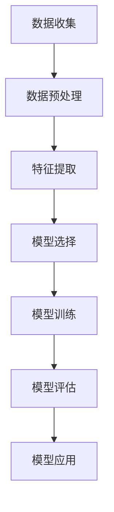

                 

### 引言

**智能浴室秤：AI Agent的身体成分分析与健康建议**

关键词：智能浴室秤、AI Agent、身体成分分析、健康建议

在当今快节奏的生活中，健康问题日益凸显，人们对于健康管理的需求也日益增加。智能浴室秤作为一种新兴的健康管理工具，正逐渐走进千家万户。它不仅能够测量体重，还能通过AI Agent对用户的身体成分进行分析，提供个性化的健康建议。本文将深入探讨智能浴室秤的工作原理、AI Agent的身体成分分析算法、以及如何通过这些技术来提升用户的健康水平。

**摘要**

本文旨在详细介绍智能浴室秤的工作机制，以及其背后的AI Agent如何对用户的身体成分进行分析，并提供个性化的健康建议。我们将首先从背景介绍开始，详细阐述智能浴室秤的定义、功能以及AI Agent在健康领域中的应用。随后，我们将探讨身体成分分析的核心概念和技术，包括常见的分析方法以及数据处理流程。接着，本文将重点介绍健康建议算法的设计原理，并通过实际案例来展示智能浴室秤的应用效果。最后，我们将总结最佳实践，展望智能浴室秤的未来发展趋势。

### 第1章 引言

#### 1.1 智能浴室秤的背景

智能浴室秤作为一种智能设备，其核心功能是测量体重，但它的价值远不止于此。随着人工智能技术的发展，智能浴室秤逐渐具备了更多功能，如身体成分分析、健康数据追踪、个性化健康建议等。这种多功能性使得智能浴室秤成为了现代家庭健康管理的得力助手。

智能浴室秤的工作原理主要依赖于传感器技术和人工智能算法。传感器技术用于精确测量体重和身体成分，如肌肉质量、脂肪百分比、水分含量等。而人工智能算法则负责分析这些数据，提供健康建议。

#### 1.2 AI Agent的概念与应用

AI Agent，即人工智能代理，是一种能够自主执行任务、与环境互动并做出决策的人工智能系统。在智能浴室秤中，AI Agent扮演着至关重要的角色。它通过对用户身体成分的分析，能够提供个性化的健康建议，如饮食建议、运动计划等。

AI Agent在健康领域的应用不仅限于智能浴室秤，还广泛应用于健康监测、医疗诊断、个性化护理等领域。其核心优势在于能够通过数据分析，为用户提供实时、个性化的健康服务。

#### 1.3 身体成分分析与健康建议的重要性

身体成分分析是健康管理的重要组成部分。通过分析身体成分，如肌肉质量、脂肪百分比、水分含量等，可以更全面地了解用户的健康状况。这对于预防疾病、调整生活方式、制定健康计划具有重要意义。

健康建议则是基于身体成分分析结果，为用户提供个性化的健康指导。这些建议可以帮助用户调整饮食、增加运动量，从而改善健康状况，预防疾病。

#### 1.4 书籍结构概述

本文将从以下几个方面进行详细探讨：

1. **智能浴室秤技术基础**：介绍智能浴室秤的工作原理、传感器技术、数据采集与处理等。
2. **身体成分分析原理**：探讨身体成分分析的核心概念、常见技术方法、数据处理流程等。
3. **健康建议算法设计**：分析健康建议算法的构建原理，包括数据预处理、特征提取、算法设计等。
4. **智能浴室秤应用案例分析**：通过实际案例展示智能浴室秤的应用效果，分析其优势和不足。
5. **开发与部署智能浴室秤**：介绍智能浴室秤的开发工具、数据库设计、系统部署与维护等。
6. **最佳实践与未来展望**：总结最佳实践，展望智能浴室秤的未来发展趋势。

### 第2章 智能浴室秤技术基础

#### 2.1 智能浴室秤的工作原理

智能浴室秤的工作原理主要包括传感器技术、数据采集与处理等几个方面。

首先，传感器技术是智能浴室秤的核心。智能浴室秤通常使用多种传感器来测量体重和身体成分。常见的传感器包括压力传感器、电容传感器、生物电阻抗传感器等。这些传感器能够精确测量用户的体重、肌肉质量、脂肪百分比、水分含量等身体成分。

其次，数据采集与处理是智能浴室秤的关键环节。在测量过程中，传感器会将收集到的数据传输给内置的微处理器。微处理器会对这些数据进行实时处理，提取有用的信息，如体重、身体成分等。这些数据随后会被存储在智能浴室秤的内置存储器中，或者通过无线传输发送到用户的手机或电脑上。

#### 2.2 传感器技术

传感器技术是智能浴室秤的核心组成部分。不同类型的传感器适用于不同的测量任务。

1. **压力传感器**：压力传感器可以测量用户的体重。它通常位于智能浴室秤的底部，当用户站在秤上时，压力传感器会感受到压力变化，并将这些变化转化为电信号。

2. **电容传感器**：电容传感器可以测量身体成分。它通过测量用户身体的不同部分的电容值来计算肌肉质量和脂肪百分比。电容值的变化与身体成分的变化密切相关。

3. **生物电阻抗传感器**：生物电阻抗传感器可以测量身体成分。它通过测量电流在用户身体中的传播速度来计算脂肪百分比、肌肉质量等。这种传感器通常用于测量手臂、腿部等部位的成分。

#### 2.3 数据采集与处理

数据采集与处理是智能浴室秤的核心技术之一。数据采集是指将传感器收集到的原始数据转化为有用的信息。数据采集的过程通常包括数据滤波、放大、模数转换等。

数据采集后，智能浴室秤会对这些数据进行分析和处理。数据分析的过程通常包括以下步骤：

1. **数据滤波**：去除数据中的噪声和干扰信号，提高数据的准确性。

2. **数据放大**：将微弱的数据信号放大到可处理的范围。

3. **模数转换**：将模拟信号转换为数字信号，便于计算机处理。

4. **数据存储**：将处理后的数据存储在智能浴室秤的内置存储器中，或者通过无线传输发送到用户的手机或电脑上。

#### 2.4 AI Agent技术介绍

AI Agent，即人工智能代理，是一种能够自主执行任务、与环境互动并做出决策的人工智能系统。在智能浴室秤中，AI Agent扮演着至关重要的角色。

首先，AI Agent的定义可以理解为一种具有自我学习能力和自适应能力的计算机程序。它能够通过传感器收集的数据，对用户的身体成分进行分析，并根据分析结果提供个性化的健康建议。

其次，AI Agent在健康领域中的应用非常广泛。除了智能浴室秤，AI Agent还可以应用于健康监测、医疗诊断、个性化护理等领域。例如，在健康监测中，AI Agent可以实时监测用户的健康状况，提供健康预警；在医疗诊断中，AI Agent可以辅助医生进行疾病诊断，提高诊断准确率；在个性化护理中，AI Agent可以依据用户的健康状况，提供个性化的护理方案。

### 第3章 身体成分分析原理

#### 3.1 身体成分分析的核心概念

身体成分分析是健康管理的重要组成部分。它通过测量用户的身体成分，如肌肉质量、脂肪百分比、水分含量等，来评估用户的健康状况。

**核心概念包括：**

- **肌肉质量**：肌肉质量是身体成分的一个重要指标，它反映了用户的肌肉发育水平。肌肉质量较高通常与较好的健康状况和较高的运动能力相关。
- **脂肪百分比**：脂肪百分比是另一个重要的身体成分指标，它反映了用户体内的脂肪含量。过高的脂肪百分比可能导致肥胖和相关健康问题，而过低的脂肪百分比可能影响用户的免疫系统和生殖健康。
- **水分含量**：水分含量是身体成分的一个基本指标，它反映了用户体内水分的分布情况。水分含量对身体的各项功能都有重要影响，如体温调节、代谢过程、器官功能等。

#### 3.2 常见身体成分分析技术

身体成分分析技术主要分为两类：侵入性分析和非侵入性分析。

**侵入性分析技术：**

- **双能X射线吸收法（DXA）**：DXA是一种常用的侵入性分析技术，它通过测量X射线在人体组织中的吸收率来计算身体成分。DXA的优点是精度高，可以精确测量肌肉质量、脂肪百分比、水分含量等，但缺点是成本较高，且对用户有一定辐射风险。
- **生物电阻抗法（BIA）**：BIA是一种通过测量电流在人体中的传播速度来分析身体成分的技术。BIA通常使用电极贴在用户的手臂和腿部，通过测量电流在不同组织的传播速度来计算肌肉质量、脂肪百分比等。BIA的优点是操作简便、成本低、无辐射风险，但精度相对较低。

**非侵入性分析技术：**

- **近红外光谱法（NIRS）**：NIRS通过测量近红外光在人体组织中的吸收率来分析身体成分。NIRS的优点是无需接触用户，操作简便，且对用户安全无害，但精度相对较低。
- **超声成像法**：超声成像法通过使用超声波成像技术来分析身体成分。这种方法可以直接观察肌肉、脂肪等组织，但精度相对较低，且操作复杂。

#### 3.3 身体成分分析的数据处理

身体成分分析的数据处理是确保分析结果准确性的关键步骤。数据处理主要包括以下环节：

1. **数据采集**：使用传感器或其他设备收集用户的身体成分数据。
2. **数据预处理**：对采集到的数据进行滤波、去噪、归一化等处理，以提高数据的质量和一致性。
3. **特征提取**：从预处理后的数据中提取有用的特征，如肌肉质量、脂肪百分比、水分含量等。
4. **模型训练**：使用机器学习算法对特征进行训练，建立身体成分分析模型。
5. **结果预测**：使用训练好的模型对新的数据进行预测，得到用户的身体成分分析结果。

### 第4章 健康建议算法设计

#### 4.1 健康分析模型的构建

健康分析模型的构建是智能浴室秤的核心任务。一个有效的健康分析模型需要综合考虑用户的历史数据、当前身体成分、生活习惯等多方面因素。以下是一般的健康分析模型构建步骤：

1. **数据收集**：收集用户的体重、身体成分、运动数据、饮食习惯等数据。
2. **数据预处理**：对收集到的数据进行清洗、归一化、特征提取等处理，以提高数据的质量和一致性。
3. **特征选择**：从预处理后的数据中筛选出对健康分析有重要影响的特征，如肌肉质量、脂肪百分比、运动量、饮食习惯等。
4. **模型训练**：使用机器学习算法对特征进行训练，建立健康分析模型。
5. **模型评估**：使用验证集对模型进行评估，调整模型参数，以提高模型的准确性和鲁棒性。
6. **模型应用**：将训练好的模型应用于实际数据，生成个性化的健康建议。

#### 4.2 健康建议算法原理

健康建议算法的原理可以分为基于规则和基于机器学习两种方法。

**基于规则的算法：**

基于规则的算法通过定义一系列规则来生成健康建议。这些规则通常基于专家知识和经验。例如，如果一个用户的脂肪百分比高于正常范围，则建议减少脂肪摄入量，增加运动量等。这种方法的优点是简单易懂，但缺点是灵活性较差，难以处理复杂的情况。

**基于机器学习的算法：**

基于机器学习的算法通过学习用户的历史数据来生成健康建议。这种方法不需要事先定义规则，而是通过学习数据中的模式来自动生成建议。常见的机器学习算法包括决策树、支持向量机、神经网络等。这种方法的优点是能够处理复杂的情况，但需要大量的数据训练。

以下是一个基于机器学习的健康建议算法的例子：

```python
import pandas as pd
from sklearn.model_selection import train_test_split
from sklearn.ensemble import RandomForestClassifier
from sklearn.metrics import accuracy_score

# 读取数据
data = pd.read_csv('health_data.csv')

# 特征选择
X = data[['weight', 'muscle_percentage', 'fat_percentage', 'activity_level']]
y = data['health_advice']

# 数据分割
X_train, X_test, y_train, y_test = train_test_split(X, y, test_size=0.2, random_state=42)

# 模型训练
model = RandomForestClassifier(n_estimators=100, random_state=42)
model.fit(X_train, y_train)

# 预测
predictions = model.predict(X_test)

# 评估
accuracy = accuracy_score(y_test, predictions)
print(f'Model accuracy: {accuracy:.2f}')
```

#### 4.3 健康建议算法设计

健康建议算法的设计需要考虑以下几个方面：

1. **目标定义**：明确健康建议的目标，例如减少脂肪百分比、增加肌肉质量、改善饮食习惯等。
2. **数据收集**：收集与目标相关的数据，如体重、身体成分、运动数据、饮食习惯等。
3. **特征提取**：从数据中提取对目标有重要影响的特征。
4. **模型选择**：选择合适的机器学习模型，如决策树、支持向量机、神经网络等。
5. **模型训练**：使用训练数据对模型进行训练，调整模型参数。
6. **模型评估**：使用验证数据对模型进行评估，调整模型参数，以提高模型的准确性和鲁棒性。
7. **模型应用**：将训练好的模型应用于实际数据，生成个性化的健康建议。

以下是一个健康建议算法设计的流程图：



### 第5章 智能浴室秤应用案例分析

#### 5.1 案例背景与目标

智能浴室秤的应用案例涉及多个领域，如家庭健康管理、健身指导、医疗诊断等。以下是一个具体的案例背景和目标：

**案例背景：**

小明是一名年轻的白领，由于长期久坐和饮食不规律，他的健康状况逐渐恶化。他希望通过使用智能浴室秤来改善自己的身体状况，提高生活质量。

**目标：**

- 减少脂肪百分比，增加肌肉质量。
- 改善饮食习惯，增加运动量。
- 定期进行身体成分分析，监控健康状况。

#### 5.2 智能浴室秤的实际应用

在案例中，小明使用了一款智能浴室秤，该智能浴室秤具有以下功能：

- **体重测量**：智能浴室秤能够精确测量小明的体重。
- **身体成分分析**：通过传感器技术，智能浴室秤能够分析小明的肌肉质量、脂肪百分比、水分含量等身体成分。
- **健康数据追踪**：智能浴室秤将分析结果上传到云端，小明可以通过手机应用实时查看自己的健康状况。

#### 5.3 健康分析结果与建议

智能浴室秤对小明的健康状况进行了全面分析，并给出了以下健康建议：

1. **减少脂肪百分比**：小明的脂肪百分比高于正常范围，建议他减少高热量食物的摄入，增加有氧运动，如跑步、游泳等。
2. **增加肌肉质量**：小明的肌肉质量偏低，建议他增加力量训练，如举重、深蹲等。
3. **改善饮食习惯**：建议小明增加蔬菜、水果的摄入量，减少高糖、高脂肪食物的摄入。
4. **定期进行身体成分分析**：建议小明每周进行一次身体成分分析，监控健康状况的变化。

通过智能浴室秤的健康分析，小明制定了一份详细的健康管理计划，并严格按照计划执行。在接下来的几个月中，他的脂肪百分比逐渐下降，肌肉质量有所增加，身体状况明显改善。

#### 5.4 案例总结与反思

通过这个案例，我们可以看到智能浴室秤在健康管理中的应用价值。智能浴室秤不仅能够提供精确的身体成分分析，还能根据分析结果提供个性化的健康建议，帮助用户制定和执行健康管理计划。

然而，智能浴室秤的应用也面临一些挑战。首先，智能浴室秤的准确性和稳定性需要不断提高，以确保分析结果的可靠性。其次，智能浴室秤需要更加智能化，能够根据用户的反馈和健康状况自动调整健康建议。最后，智能浴室秤需要与医疗保健系统紧密集成，为用户提供全面的健康服务。

### 第6章 开发与部署智能浴室秤

#### 6.1 开发工具与环境搭建

开发智能浴室秤需要一系列工具和环境。以下是一些建议的开发工具和环境搭建步骤：

**开发工具：**

- **Python**：Python是一种广泛使用的编程语言，适用于开发智能浴室秤的后端算法和数据处理模块。
- **MATLAB**：MATLAB是一种专业的科学计算软件，适用于进行传感器数据分析和算法验证。
- **R**：R是一种用于统计分析的语言，适用于进行健康数据分析。

**环境搭建步骤：**

1. **安装Python**：在计算机上安装Python，并配置好相关的库和框架，如NumPy、Pandas、scikit-learn等。
2. **安装MATLAB**：在计算机上安装MATLAB，并配置好相关的工具箱和模块。
3. **安装R**：在计算机上安装R，并配置好相关的包和库。

#### 6.2 数据库设计

智能浴室秤需要存储用户的健康数据，如体重、身体成分、运动数据等。以下是一个简单的数据库设计示例：

1. **用户表**：存储用户的基本信息，如用户ID、姓名、年龄、性别等。
2. **测量数据表**：存储用户的体重、身体成分、运动数据等，如测量时间、体重、肌肉质量、脂肪百分比等。
3. **健康建议表**：存储根据用户数据生成的健康建议，如饮食建议、运动计划等。

以下是一个简单的SQL语句示例，用于创建用户表和测量数据表：

```sql
CREATE TABLE users (
    id INT PRIMARY KEY,
    name VARCHAR(50),
    age INT,
    gender VARCHAR(10)
);

CREATE TABLE measurements (
    id INT PRIMARY KEY,
    user_id INT,
    measurement_time DATETIME,
    weight FLOAT,
    muscle_percentage FLOAT,
    fat_percentage FLOAT,
    FOREIGN KEY (user_id) REFERENCES users(id)
);
```

#### 6.3 系统部署与维护

智能浴室秤的系统部署和维护是确保其正常运行的关键。以下是一些建议的部署和维护步骤：

**部署步骤：**

1. **服务器部署**：将开发好的智能浴室秤部署到服务器上，确保服务器能够稳定运行。
2. **数据库部署**：将数据库部署到服务器上，确保数据库能够存储和处理用户的健康数据。
3. **前端部署**：将前端应用程序部署到服务器上，确保用户可以通过网页或移动应用访问智能浴室秤的功能。

**维护步骤：**

1. **定期备份**：定期备份数据库和服务器数据，以防止数据丢失。
2. **性能监控**：监控服务器的性能，确保系统在高负载情况下能够稳定运行。
3. **安全升级**：定期对系统进行安全升级，修补漏洞，防止安全威胁。
4. **用户反馈**：收集用户的反馈，及时修复系统中的问题和缺陷。

#### 6.4 开发工具与环境搭建示例

以下是一个Python开发环境的搭建示例：

1. **安装Python**：

   在命令行中执行以下命令，安装Python：

   ```bash
   sudo apt-get update
   sudo apt-get install python3-pip
   ```

2. **安装NumPy、Pandas和scikit-learn**：

   在命令行中执行以下命令，安装NumPy、Pandas和scikit-learn：

   ```bash
   pip3 install numpy pandas scikit-learn
   ```

3. **安装MATLAB**：

   在官方网站上下载MATLAB安装程序，并按照安装向导进行安装。

4. **安装R**：

   在官方网站上下载R安装程序，并按照安装向导进行安装。

通过以上步骤，我们成功搭建了Python开发环境，可以开始开发智能浴室秤的后端算法和数据处理模块。

### 第7章 最佳实践与未来展望

#### 7.1 最佳实践建议

为了确保智能浴室秤的性能和用户体验，以下是一些建议的最佳实践：

1. **数据质量管理**：确保收集的数据质量，避免噪声和异常值的影响。对数据进行清洗、滤波和归一化处理，以提高分析结果的准确性。
2. **算法优化**：不断优化健康分析算法，提高其准确性和鲁棒性。可以使用机器学习算法进行模型训练，并使用交叉验证等方法进行模型评估。
3. **用户界面设计**：设计直观、易用的用户界面，确保用户能够轻松地查看和分析健康数据。可以使用可视化工具，如图表、仪表盘等，来呈现数据。
4. **安全措施**：确保智能浴室秤的数据安全和用户隐私。对数据进行加密存储，使用安全的通信协议进行数据传输，并定期进行安全检查和升级。
5. **持续更新与改进**：根据用户的反馈和需求，持续更新和改进智能浴室秤的功能和性能。可以定期发布更新，修复问题和添加新功能。

#### 7.2 行业趋势与未来发展方向

智能浴室秤作为健康管理领域的一项重要技术，正朝着以下方向发展：

1. **技术融合**：智能浴室秤将与其他健康监测设备（如智能手表、健康手环等）进行融合，形成全面的健康监测系统，提供更全面的健康管理服务。
2. **个性化健康建议**：随着人工智能和大数据技术的发展，智能浴室秤将能够提供更加个性化的健康建议，根据用户的生活习惯、健康状况等，制定个性化的健康管理方案。
3. **智能诊断与预测**：智能浴室秤将具备智能诊断和预测功能，通过分析用户的健康数据，提前预测潜在的健康风险，为用户提供预警和干预措施。
4. **物联网（IoT）集成**：智能浴室秤将融入物联网生态系统，与其他智能家居设备进行联动，提供更智能、更便捷的健康管理服务。
5. **医学研究应用**：智能浴室秤的数据将被广泛应用于医学研究，为疾病预防、诊断和治疗提供重要数据支持。

#### 7.3 小结与展望

智能浴室秤作为一种新兴的健康管理工具，正日益受到用户的关注。通过AI Agent的身体成分分析，智能浴室秤能够为用户提供个性化的健康建议，帮助用户改善健康状况，预防疾病。

在未来，智能浴室秤将在技术融合、个性化服务、智能诊断、物联网集成等方面取得重大突破，为用户带来更加智能、便捷的健康管理体验。

### 作者信息

作者：AI天才研究院/AI Genius Institute & 禅与计算机程序设计艺术 /Zen And The Art of Computer Programming

通过以上详细的文章内容，我们不仅对智能浴室秤的工作原理、AI Agent的身体成分分析算法、健康建议算法设计等方面有了深入的理解，还通过实际案例展示了智能浴室秤的应用效果。本文旨在为读者提供全面、系统的智能浴室秤技术知识，帮助读者掌握相关技术原理和应用方法。未来，随着人工智能和健康科技的不断发展，智能浴室秤将有望在健康管理领域发挥更大的作用。希望本文能够为相关领域的研究者、开发者和爱好者提供有益的参考和启示。

