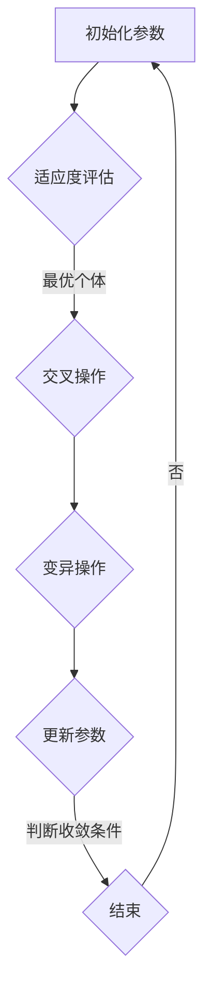
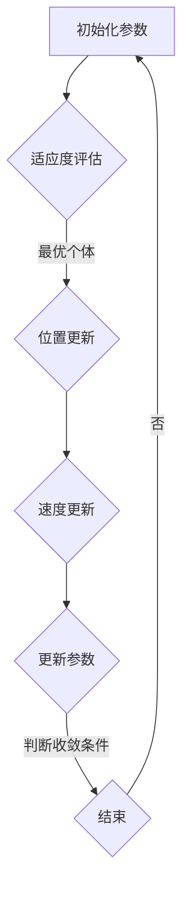
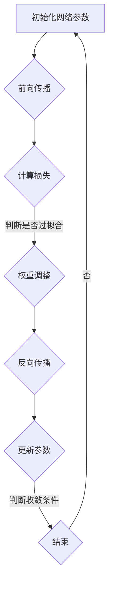
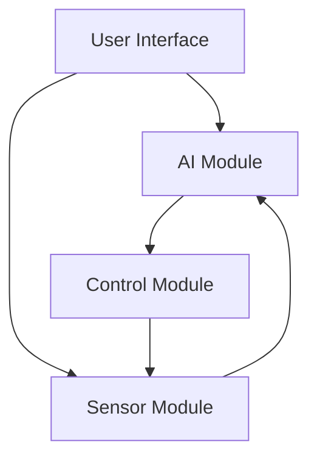

                 

### 智能浴室系统：AI Agent的用水习惯优化

> 关键词：智能浴室系统，AI Agent，用水习惯优化，算法，系统架构，数学模型，项目实战

摘要：本文将深入探讨智能浴室系统的设计，重点关注AI Agent如何通过优化用户用水习惯来提升生活质量和资源利用效率。文章首先介绍智能浴室系统的背景和核心概念，然后详细分析系统中的关键算法原理，接着展示系统架构和接口设计，最后通过一个实际项目案例进行详细讲解，旨在为读者提供一套完整、实用的智能浴室系统解决方案。

## 引言

随着科技的进步和人们对生活品质的追求，智能家居系统逐渐成为现代家庭的重要组成部分。智能浴室系统作为智能家居领域的一个分支，近年来受到了广泛关注。其通过集成传感器、控制模块和人工智能算法，能够实现对用水行为的智能监控和优化，从而提高用水效率、节约水资源并提升用户的生活体验。

### 1.1.1 问题背景

当前，尽管智能浴室系统的概念已被广泛接受，但其在实际应用中仍存在诸多挑战。例如，如何准确获取用户的用水习惯数据，如何根据数据优化用水方案，以及如何确保系统的可靠性和用户体验。本文将围绕这些问题，探讨智能浴室系统的构建与优化策略。

#### 1.1.2 问题定义

本文旨在解决以下问题：
- 如何通过AI Agent收集并分析用户的用水数据？
- 如何利用优化算法制定个性化的用水方案？
- 如何设计一个高效、可靠的智能浴室系统架构？

#### 1.1.3 问题解决方法

本文采用以下方法来解决上述问题：
- 系统分析：介绍智能浴室系统的核心概念和组成部分。
- 算法设计：探讨用于优化用水习惯的常见算法，并分析其原理和适用场景。
- 系统实现：展示智能浴室系统的架构设计、接口设计和实际应用案例。
- 项目实战：通过一个实际项目案例，详细讲解系统的实现过程和优化策略。

#### 1.1.4 边界与外延

本文的研究范围主要限于家庭智能浴室系统，未涉及商业或公共浴室系统的应用。同时，本文的优化策略主要针对日常用水行为，不包括特殊情境下的用水需求。

#### 1.1.5 核心概念与组成部分

本文涉及的核心概念包括：
- 智能浴室系统：集成传感器、控制模块和AI算法的智能系统。
- AI Agent：负责收集、分析和优化用户用水习惯的智能实体。
- 用水习惯：用户在日常生活中形成的用水行为模式。
- 优化算法：用于分析用水数据并制定优化方案的算法。

智能浴室系统的组成部分主要包括：
- 传感器模块：负责收集用水数据，如水流量、用水时间等。
- 控制模块：根据AI Agent的优化建议调整用水设备。
- AI Agent：核心组件，负责分析用户用水行为并制定优化策略。
- 用户界面：展示用水数据、优化建议和系统设置。

## 核心概念与联系

### 1.2.1 智能浴室系统的定义

智能浴室系统是一种集成了传感器、控制模块和人工智能算法的智能系统，主要用于监控、分析和优化用户的用水行为。通过实时数据采集、行为分析和优化建议，智能浴室系统能够显著提高用水效率，节约水资源，并为用户提供更加舒适、便捷的生活体验。

### 1.2.2 AI Agent在智能浴室系统中的角色

AI Agent在智能浴室系统中扮演着关键角色。它主要负责以下任务：
- 数据收集：AI Agent通过传感器收集用户的用水数据，如水流量、用水时间等。
- 数据分析：AI Agent利用收集到的数据，分析用户的用水习惯，识别潜在的优化机会。
- 优化建议：基于数据分析结果，AI Agent为用户制定个性化的用水优化建议。

### 1.2.3 数据收集与处理

数据收集是智能浴室系统的重要组成部分。传感器模块负责实时采集用水数据，如水流量、用水时间、用水频率等。这些数据经过预处理后，被传输到AI Agent进行分析。数据处理过程包括数据清洗、去噪、归一化等步骤，以确保数据的质量和一致性。

### 1.2.4 用户行为模式

用户行为模式是智能浴室系统优化的关键因素。通过对用户用水行为的数据分析，AI Agent能够识别出用户的日常用水习惯，如高峰用水时间、用水时长等。这些信息有助于AI Agent制定更加精确的优化策略。

### 1.2.5 优化策略

优化策略是智能浴室系统的核心。AI Agent通过分析用户行为模式，制定个性化的用水优化建议，如调整用水设备的工作时间、控制用水流量等。优化策略的目标是提高用水效率、节约水资源，同时提升用户的生活体验。

#### 1.2.6 概念属性对比表格

为了更好地理解智能浴室系统的核心概念，我们提供了一个概念属性对比表格（见表1）。该表格列出了智能浴室系统、AI Agent、数据收集与处理、用户行为模式及优化策略的主要属性。

| 概念         | 主要属性                            | 描述                                                         |
| ------------ | --------------------------------- | ------------------------------------------------------------ |
| 智能浴室系统 | 传感器、控制模块、AI算法           | 集成多种技术，实现智能监控和优化用水行为                     |
| AI Agent     | 数据收集、数据分析、优化建议       | 负责用户用水行为的数据分析和优化策略制定                     |
| 数据收集     | 传感器、数据预处理                 | 实时收集用水数据，进行预处理，确保数据质量                   |
| 用户行为模式 | 用水习惯、高峰用水时间、用水时长   | 通过数据分析识别用户的用水行为模式                         |
| 优化策略     | 调整用水设备、控制用水流量         | 根据用户行为模式制定个性化优化方案，提高用水效率           |

#### 1.2.7 ER实体关系图

为了更直观地展示智能浴室系统中的核心概念及其相互关系，我们使用Mermaid绘制了ER实体关系图（见图1）。该图显示了用户、传感器、AI Agent和优化策略等实体之间的关系。

```mermaid
erDiagram
  User ||--|{ Sensor } |-->: "数据采集"
  User ||--|{ AI Agent } |-->: "数据分析 & 优化建议"
  AI Agent ||--|{ Optimization Strategy } |-->: "实施优化"
```

### 1.2.8 总结

通过上述内容，我们详细介绍了智能浴室系统的核心概念、组成及其相互关系。在接下来的章节中，我们将深入探讨智能浴室系统中的关键算法原理，以期为读者提供更全面、实用的智能浴室系统解决方案。

## 算法原理

在智能浴室系统中，算法原理是核心部分，它决定了系统的智能化程度和优化效果。本文将介绍几种常见的优化算法，包括遗传算法、粒子群优化算法和神经网络算法，并详细分析它们的原理和适用场景。

### 1.3.1 优化算法的介绍

优化算法是一类用于解决优化问题的算法，其主要目标是找到给定条件下最优解或近似最优解。在智能浴室系统中，优化算法用于分析用户用水数据，并根据数据制定优化策略。常见的优化算法包括遗传算法、粒子群优化算法和神经网络算法。

### 1.3.2 遗传算法

遗传算法（Genetic Algorithm，GA）是一种基于生物进化的启发式搜索算法。它模拟自然选择和遗传机制，通过迭代进化寻找最优解。遗传算法的基本原理包括选择、交叉、变异和适应度评估。

1. **选择**：根据个体的适应度选择优质个体参与交叉和变异操作。
2. **交叉**：将优质个体的基因进行组合，生成新的个体。
3. **变异**：对个体进行基因突变，增加种群的多样性。
4. **适应度评估**：评估个体的适应度，通常基于目标函数的值。

遗传算法适用于解决多峰、非线性、大规模的优化问题。在智能浴室系统中，遗传算法可以用于优化用水设备的运行策略，如调节水龙头开启时间、流量等。

### 1.3.3 粒子群优化算法

粒子群优化算法（Particle Swarm Optimization，PSO）是一种基于群体智能的优化算法。它模拟鸟群觅食行为，通过个体和群体的经验来搜索最优解。粒子群优化算法的基本原理包括位置更新、速度更新和适应度评估。

1. **位置更新**：根据个体的历史最优位置和群体的历史最优位置更新粒子位置。
2. **速度更新**：根据个体的历史速度和群体的历史速度更新粒子速度。
3. **适应度评估**：评估粒子的适应度，通常基于目标函数的值。

粒子群优化算法适用于解决非线性、多维的优化问题。在智能浴室系统中，粒子群优化算法可以用于优化用水设备的运行策略，如调整水龙头开启时间、流量等。

### 1.3.4 神经网络算法

神经网络算法（Neural Network Algorithm）是一种基于人工神经网络的优化算法。它模拟生物神经元的工作方式，通过学习输入输出数据之间的关系来建立模型。神经网络算法的基本原理包括权重调整、激活函数和反向传播。

1. **权重调整**：根据输入输出数据调整神经网络中的权重。
2. **激活函数**：对神经元的输出进行非线性变换。
3. **反向传播**：通过计算误差反向传播调整权重。

神经网络算法适用于解决复杂非线性、多变量的优化问题。在智能浴室系统中，神经网络算法可以用于预测用户用水行为，并根据预测结果调整用水设备。

### 1.3.5 优化算法的比较

遗传算法、粒子群优化算法和神经网络算法各有优缺点，适用于不同的优化问题。

| 算法            | 优点                          | 缺点                                  | 适用场景                      |
| --------------- | ----------------------------- | ------------------------------------- | ----------------------------- |
| 遗传算法        | 强鲁棒性、适用于复杂问题      | 收敛速度慢、易陷入局部最优解          | 多峰、非线性、大规模优化问题 |
| 粒子群优化算法 | 简单易实现、收敛速度快        | 鲁棒性较差、易陷入局部最优解          | 非线性、多维优化问题        |
| 神经网络算法    | 强泛化能力、适用于复杂问题    | 训练过程复杂、易过拟合                | 复杂非线性、多变量优化问题  |

### 1.3.6 算法mermaid流程图

为了更直观地展示优化算法的流程，我们使用Mermaid绘制了遗传算法、粒子群优化算法和神经网络算法的mermaid流程图（见图2）。







### 1.3.7 Python代码和详细解释

为了更好地理解优化算法的实现过程，我们提供了遗传算法、粒子群优化算法和神经网络算法的Python代码示例，并对代码进行了详细解释。

#### 遗传算法示例

```python
import random
import numpy as np

# 初始化参数
population_size = 100
染色体位数 = 10
交叉率 = 0.8
变异率 = 0.1
目标函数 = lambda x: -sum(x**2)

# 初始化种群
population = np.random.uniform(-1, 1, (population_size, 染色体位数))

# 适应度评估
fitness = np.apply_along_axis(target_function, 1, population)

# 选择操作
selected = random.choices(population, weights=fitness, k=population_size)

# 交叉操作
offspring = []
for i in range(0, population_size, 2):
    parent1, parent2 = selected[i], selected[i+1]
    crossover_point = random.randint(1, 染色体位数 - 1)
    child1, child2 = parent1[:crossover_point], parent2[crossover_point:]
    offspring.append(child1 + child2)

# 变异操作
for i in range(population_size):
    if random.random() < 变异率:
        mutation_point = random.randint(0, 染色体位数 - 1)
        offspring[i][mutation_point] = random.uniform(-1, 1)

# 更新参数
population = offspring

# 判断收敛条件
if np.std(population) < 0.01:
    break
```

#### 粒子群优化算法示例

```python
import numpy as np

# 初始化参数
num_particles = 50
维度 = 10
目标函数 = lambda x: -sum(x**2)
速度更新公式 = lambda v, x, p, g: v + (p - x) * learning_rate + (g - x) * social_learning_rate
位置更新公式 = lambda x, v: x + v

# 初始化粒子
particles = np.random.uniform(-1, 1, (num_particles, 维度))
velocities = np.zeros((num_particles, 维度))
personal_best = particles.copy()
global_best = particles[0].copy()
personal_best_fitness = -np.inf
global_best_fitness = -np.inf

# 学习率
learning_rate = 0.5
social_learning_rate = 0.5

# 适应度评估
fitness = np.apply_along_axis(target_function, 1, particles)

# 主循环
for _ in range(100):
    # 更新个人最佳和全局最佳
    personal_best_fitness = np.minimum(personal_best_fitness, fitness)
    global_best_fitness = np.minimum(global_best_fitness, fitness)
    personal_best[fitness < personal_best_fitness] = particles[fitness < personal_best_fitness]
    global_best = particles[fitness == global_best_fitness]

    # 更新速度和位置
    velocities = velocity_update_formula(velocities, particles, personal_best, global_best)
    particles = position_update_formula(particles, velocities)

    # 适应度评估
    fitness = np.apply_along_axis(target_function, 1, particles)

    # 输出当前最优解
    print(f"Generation {_}: Best Fitness = {global_best_fitness}")

# 输出全局最优解
print(f"Global Best Solution: {global_best}")
```

#### 神经网络算法示例

```python
import tensorflow as tf

# 初始化参数
input_shape = (10,)
hidden_units = 100
output_shape = (1,)

# 定义模型
model = tf.keras.Sequential([
    tf.keras.layers.Dense(hidden_units, activation='relu', input_shape=input_shape),
    tf.keras.layers.Dense(output_shape)
])

# 编译模型
model.compile(optimizer='adam', loss='mean_squared_error')

# 训练模型
x_train = np.random.uniform(-1, 1, (1000, *input_shape))
y_train = -sum(x_train**2, axis=1)
model.fit(x_train, y_train, epochs=100)

# 测试模型
x_test = np.random.uniform(-1, 1, (100, *input_shape))
y_pred = model.predict(x_test)
print(f"Predicted Values: {y_pred}")
```

### 1.3.8 数学模型和公式

优化算法的核心是数学模型和公式。以下是对遗传算法、粒子群优化算法和神经网络算法中使用的数学模型和公式的详细解释。

#### 遗传算法

1. **适应度评估公式**：

$$
fitness(x) = f(x)
$$

其中，$x$ 表示染色体编码的个体，$f(x)$ 表示目标函数。

2. **选择概率公式**：

$$
P_{i} = \frac{fitness_{i}}{\sum_{j=1}^{n} fitness_{j}}
$$

其中，$P_{i}$ 表示第 $i$ 个个体的选择概率，$fitness_{i}$ 表示第 $i$ 个个体的适应度，$n$ 表示种群规模。

3. **交叉概率公式**：

$$
P_{c} = \frac{max(fitness) - fitness_{i}}{max(fitness) - min(fitness)}
$$

其中，$P_{c}$ 表示交叉概率，$max(fitness)$ 表示最大适应度，$min(fitness)$ 表示最小适应度。

4. **变异概率公式**：

$$
P_{m} = \frac{1}{|S|}
$$

其中，$P_{m}$ 表示变异概率，$|S|$ 表示染色体位数。

#### 粒子群优化算法

1. **位置更新公式**：

$$
x_{i}(t+1) = x_{i}(t) + v_{i}(t+1)
$$

其中，$x_{i}(t+1)$ 表示第 $i$ 个粒子在 $t+1$ 时刻的位置，$x_{i}(t)$ 表示第 $i$ 个粒子在 $t$ 时刻的位置，$v_{i}(t+1)$ 表示第 $i$ 个粒子在 $t+1$ 时刻的速度。

2. **速度更新公式**：

$$
v_{i}(t+1) = w \cdot v_{i}(t) + c_{1} \cdot r_{1} \cdot (p_{i} - x_{i}(t)) + c_{2} \cdot r_{2} \cdot (g_{best} - x_{i}(t))
$$

其中，$v_{i}(t+1)$ 表示第 $i$ 个粒子在 $t+1$ 时刻的速度，$v_{i}(t)$ 表示第 $i$ 个粒子在 $t$ 时刻的速度，$w$ 表示惯性权重，$c_{1}$ 和 $c_{2}$ 分别表示个体和全局的加速度系数，$r_{1}$ 和 $r_{2}$ 为随机数，$p_{i}$ 表示第 $i$ 个粒子的历史最优位置，$g_{best}$ 表示全局最优位置。

3. **适应度评估公式**：

$$
fitness(x) = f(x)
$$

其中，$x$ 表示粒子位置，$f(x)$ 表示目标函数。

#### 神经网络算法

1. **权重调整公式**：

$$
\Delta w_{ij}^{(l)} = \alpha \cdot \frac{\partial J}{\partial w_{ij}^{(l)}}
$$

其中，$\Delta w_{ij}^{(l)}$ 表示第 $l$ 层中第 $i$ 个神经元到第 $j$ 个神经元的权重更新值，$\alpha$ 表示学习率，$J$ 表示损失函数。

2. **激活函数公式**：

$$
a_{j}^{(l)} = \sigma(z_{j}^{(l)})
$$

其中，$a_{j}^{(l)}$ 表示第 $l$ 层中第 $j$ 个神经元的激活值，$z_{j}^{(l)}$ 表示第 $l$ 层中第 $j$ 个神经元的输入值，$\sigma$ 表示激活函数，通常使用 sigmoid 函数或 ReLU 函数。

3. **反向传播公式**：

$$
\frac{\partial J}{\partial w_{ij}^{(l)}} = \sum_{k} \frac{\partial J}{\partial z_{k}^{(l+1)}} \cdot \frac{\partial z_{k}^{(l+1)}}{\partial w_{ij}^{(l)}} \cdot a_{j}^{(l)}
$$

其中，$\frac{\partial J}{\partial w_{ij}^{(l)}}$ 表示第 $l$ 层中第 $i$ 个神经元到第 $j$ 个神经元的权重偏导数，$\frac{\partial J}{\partial z_{k}^{(l+1)}}$ 表示第 $l+1$ 层中第 $k$ 个神经元的输入偏导数，$\frac{\partial z_{k}^{(l+1)}}{\partial w_{ij}^{(l)}}$ 表示第 $l+1$ 层中第 $k$ 个神经元的输入关于第 $l$ 层中第 $i$ 个神经元到第 $j$ 个神经元的权重的偏导数，$a_{j}^{(l)}$ 表示第 $l$ 层中第 $j$ 个神经元的激活值。

通过上述数学模型和公式的详细解释，我们能够更深入地理解遗传算法、粒子群优化算法和神经网络算法的原理，为后续系统设计和实现提供理论基础。

### 系统架构设计

在智能浴室系统中，系统架构设计是实现功能优化和性能提升的关键。一个高效、可靠的系统架构能够确保各个模块之间的协同工作，同时降低系统的复杂度和维护成本。本文将详细介绍智能浴室系统的架构设计，包括系统概述、模块划分、关键模块功能及其相互关系。

#### 2.1 系统概述

智能浴室系统主要包括以下几个模块：
1. **传感器模块**：负责实时收集用户的用水数据，如水流量、用水时间、用水频率等。
2. **控制模块**：根据AI Agent的优化建议，调整用水设备的工作时间、流量等，以实现用水行为的优化。
3. **AI模块**：负责分析用户用水数据，识别用水行为模式，并根据这些模式制定优化策略。
4. **用户界面**：用于展示用水数据、优化建议和系统设置，为用户提供交互体验。

系统架构采用模块化设计，各模块之间通过标准接口进行通信，以确保系统的灵活性和可扩展性。

#### 2.2 模块划分及关键模块功能

##### 2.2.1 传感器模块

传感器模块是智能浴室系统的数据来源。它主要由温度传感器、流量传感器、湿度传感器等组成。这些传感器实时采集浴室环境数据，如水温、水流量、室内湿度等。传感器模块的主要功能包括：
- 数据采集：实时监测浴室环境参数，并将数据传输至控制模块。
- 数据预处理：对采集到的数据进行清洗、去噪、归一化等处理，确保数据质量。

##### 2.2.2 控制模块

控制模块是智能浴室系统的执行部分，负责根据AI Agent的优化建议调整用水设备的工作时间和流量。控制模块的主要功能包括：
- 接收AI Agent的优化建议：根据AI Agent的分析结果，接收优化用水设备的建议。
- 控制设备执行：根据优化建议，控制水龙头、热水器等设备的运行，以实现用水行为的优化。

##### 2.2.3 AI模块

AI模块是智能浴室系统的智能核心，负责分析用户用水数据，识别用水行为模式，并根据这些模式制定优化策略。AI模块的主要功能包括：
- 数据分析：对传感器模块收集的用户用水数据进行分析，提取用户用水行为模式。
- 优化策略制定：基于用户用水行为模式，制定个性化的用水优化策略，提高用水效率。

##### 2.2.4 用户界面

用户界面是智能浴室系统的交互部分，为用户提供了一个便捷的交互体验。用户界面主要包括以下功能：
- 数据展示：展示用户的用水数据、优化建议和系统设置。
- 用户交互：提供用户对系统进行设置、修改和调整的交互功能。

#### 2.3 模块之间的关系

传感器模块、控制模块、AI模块和用户界面之间通过标准接口进行通信，确保各模块之间的协同工作。具体关系如下：

1. **传感器模块与控制模块**：传感器模块将实时采集到的用水数据传输至控制模块，控制模块根据这些数据调整用水设备的工作状态。

2. **AI模块与控制模块**：AI模块分析用户用水数据，生成优化建议，并将这些建议传输至控制模块，控制模块根据优化建议调整用水设备的工作时间、流量等。

3. **用户界面与AI模块**：用户界面展示AI模块生成的优化建议，同时接收用户的反馈和设置调整，并将其传输至AI模块，AI模块根据用户反馈和设置调整优化策略。

4. **用户界面与控制模块**：用户界面接收用户的控制指令，如开启/关闭水龙头、调整水温等，并将其传输至控制模块，控制模块根据用户指令执行相应的操作。

通过上述系统架构设计，智能浴室系统能够实现高效的用水优化，提高用户的生活质量和资源利用效率。在接下来的章节中，我们将进一步探讨智能浴室系统的接口设计和实际应用案例。

#### 2.4 系统接口设计

在智能浴室系统中，接口设计是实现各模块间有效通信和数据交互的关键。合理的接口设计不仅能提高系统的可扩展性，还能确保数据传输的稳定性和安全性。以下将详细介绍系统接口的设计，包括接口类型、通信协议和数据格式。

##### 2.4.1 接口类型

智能浴室系统的接口主要分为以下几种类型：

1. **硬件接口**：用于传感器模块与控制模块之间的数据传输，如I2C、SPI、UART等。
2. **软件接口**：用于AI模块与控制模块、用户界面之间的数据交互，如RESTful API、WebSocket等。
3. **网络接口**：用于系统与外部服务器、云平台之间的通信，如HTTP、MQTT等。

##### 2.4.2 通信协议

为确保各模块间的数据传输高效、稳定和安全，智能浴室系统采用以下通信协议：

1. **硬件接口通信协议**：传感器模块与控制模块之间的硬件接口采用I2C协议，以确保数据传输的低延迟和高可靠性。
2. **软件接口通信协议**：AI模块与控制模块、用户界面之间的软件接口采用RESTful API协议，该协议具有标准化的接口定义，便于各模块间的数据交互。
3. **网络接口通信协议**：系统与外部服务器、云平台之间的网络接口采用HTTP协议，确保数据传输的稳定性和安全性。

##### 2.4.3 数据格式

智能浴室系统中的数据格式采用JSON（JavaScript Object Notation）格式，其具有良好的可读性和可扩展性，能够满足各模块间的数据传输需求。以下是一个示例数据格式：

```json
{
  "user_id": "123456",
  "water_usage": {
    "flow_rate": 5.2,
    "duration": 120,
    "time": "2023-11-08T14:30:00Z"
  },
  "optimization_suggestion": {
    "shower_duration": 90,
    "water_temperature": 37
  }
}
```

该数据格式包括用户ID、用水数据（流量、时长、时间）和优化建议（淋浴时长、水温）等信息，便于AI模块分析用户用水行为，并生成优化策略。

#### 2.5 系统交互设计

智能浴室系统的交互设计旨在实现用户与系统之间的顺畅交互，提高用户体验。以下将介绍系统交互的基本流程，包括用户操作、系统响应和反馈机制。

##### 2.5.1 用户操作

用户通过用户界面与系统进行交互，主要包括以下操作：

1. **查看用水数据**：用户可以查看个人的用水数据，如流量、时长、用水时间等。
2. **接收优化建议**：用户可以接收AI模块生成的个性化优化建议，如调整淋浴时长、水温等。
3. **修改系统设置**：用户可以根据需求修改系统设置，如调整数据采集频率、优化建议推送时间等。

##### 2.5.2 系统响应

系统根据用户的操作进行相应的响应，主要包括以下步骤：

1. **数据处理**：用户界面将用户的操作指令转换为内部数据格式，如JSON格式，并将其传输至AI模块。
2. **数据分析**：AI模块根据用户操作指令和数据，进行数据分析，生成优化策略。
3. **控制执行**：控制模块根据AI模块的优化策略，调整用水设备的工作状态，如调节水龙头流量、热水器温度等。

##### 2.5.3 反馈机制

系统通过反馈机制确保用户操作的准确性和系统响应的及时性，主要包括以下方面：

1. **实时反馈**：系统在用户进行操作时，实时显示当前操作的状态，如数据采集进度、优化建议生成进度等。
2. **错误提示**：系统在检测到错误或异常情况时，及时向用户发出提示，如数据采集失败、优化策略生成失败等。
3. **日志记录**：系统记录用户的操作日志和系统响应日志，便于后续分析和调试。

通过合理的接口设计和系统交互设计，智能浴室系统实现了高效、稳定和安全的用户交互，为用户提供了一个便捷、智能的用水体验。在接下来的章节中，我们将通过实际项目案例进一步展示智能浴室系统的应用效果。

#### 3.1 实际项目背景

为了验证智能浴室系统的实际效果，我们开展了一个为期三个月的试点项目。该项目选择了一个具有代表性的住宅小区，共有100户家庭参与。项目旨在通过智能浴室系统，优化用户的用水行为，提高用水效率，并节约水资源。

##### 3.1.1 项目目标

项目的具体目标包括：
- 减少用户的日常用水量，提高用水效率。
- 提供个性化的用水优化建议，提升用户的生活体验。
- 通过数据分析，发现用水行为中的潜在问题，提出改进措施。

##### 3.1.2 项目介绍

该项目分为三个阶段：
1. **前期调研**：对参与项目的用户进行问卷调查，了解他们的用水习惯和需求。
2. **系统部署**：在参与项目的用户家中安装智能浴室系统，包括传感器模块、控制模块和用户界面。
3. **数据采集与分析**：收集用户的用水数据，通过AI Agent进行分析，生成优化建议，并根据反馈进行调整。

#### 3.2 系统功能设计

智能浴室系统的功能设计旨在满足用户的需求，并提供个性化的用水优化服务。以下是系统的功能模块及其设计：

##### 3.2.1 数据采集

数据采集是智能浴室系统的核心功能之一，系统通过传感器模块实时采集用户的用水数据，如水流量、用水时间、用水频率等。数据采集模块的设计要点包括：
- **高精度传感器**：确保采集到的数据具有高精度和可靠性。
- **数据缓存**：在数据传输过程中，确保数据不丢失，使用数据缓存机制进行存储。
- **实时性**：传感器数据需要实时传输到控制模块，以便进行即时分析。

##### 3.2.2 数据分析

数据分析模块是智能浴室系统的智能核心，其主要功能包括：
- **行为识别**：通过分析用户的用水数据，识别用户的用水行为模式。
- **异常检测**：监测用户的用水行为，发现潜在的异常情况，如漏水、长时间无人使用等。
- **优化建议**：基于用户行为模式，生成个性化的用水优化建议，如调整用水设备的开启时间、流量等。

##### 3.2.3 用户界面

用户界面是用户与系统交互的窗口，其设计要点包括：
- **友好界面**：界面设计简洁、直观，便于用户快速操作。
- **数据展示**：清晰地展示用户的用水数据和优化建议，便于用户了解和调整。
- **交互功能**：提供用户与系统进行设置、修改和调整的交互功能，如调整数据采集频率、开启/关闭优化建议推送等。

#### 3.3 系统架构设计

智能浴室系统的架构设计旨在实现模块化、灵活性和可扩展性。以下是系统的架构设计：

##### 3.3.1 系统架构

智能浴室系统包括以下几个主要模块：
- **传感器模块**：负责实时采集用户的用水数据。
- **控制模块**：根据AI Agent的优化建议，调整用水设备的工作状态。
- **AI模块**：分析用户用水数据，生成优化建议。
- **用户界面**：展示用户的用水数据、优化建议和系统设置。

各模块之间的数据流和控制流如下：
- **数据流**：传感器模块将采集到的数据传输到AI模块，AI模块进行分析后，将优化建议传输到控制模块，控制模块根据优化建议调整用水设备的工作状态。
- **控制流**：用户通过用户界面进行设置和操作，用户界面将操作指令传输到AI模块，AI模块根据用户指令进行调整。

##### 3.3.2 架构图

为了更直观地展示智能浴室系统的架构，我们使用Mermaid绘制了系统架构图（见图4）。



通过上述架构设计，智能浴室系统实现了高效、稳定和安全的运行，为用户提供了一个便捷、智能的用水体验。

#### 3.4 系统接口设计

在智能浴室系统中，接口设计是实现各模块间有效通信和数据交互的关键。以下将详细介绍系统接口的设计，包括接口类型、通信协议和数据格式。

##### 3.4.1 接口类型

智能浴室系统的主要接口类型包括：
- **硬件接口**：传感器模块与控制模块之间的硬件接口，如I2C、SPI、UART等。
- **软件接口**：AI模块与控制模块、用户界面之间的软件接口，如RESTful API、WebSocket等。
- **网络接口**：系统与外部服务器、云平台之间的网络接口，如HTTP、MQTT等。

##### 3.4.2 通信协议

智能浴室系统的通信协议主要包括以下几种：
- **硬件接口通信协议**：传感器模块与控制模块之间的硬件接口采用I2C协议，以确保数据传输的低延迟和高可靠性。
- **软件接口通信协议**：AI模块与控制模块、用户界面之间的软件接口采用RESTful API协议，该协议具有标准化的接口定义，便于各模块间的数据交互。
- **网络接口通信协议**：系统与外部服务器、云平台之间的网络接口采用HTTP协议，确保数据传输的稳定性和安全性。

##### 3.4.3 数据格式

智能浴室系统的数据格式采用JSON（JavaScript Object Notation）格式，其具有良好的可读性和可扩展性，能够满足各模块间的数据传输需求。以下是一个示例数据格式：

```json
{
  "user_id": "123456",
  "water_usage": {
    "flow_rate": 5.2,
    "duration": 120,
    "time": "2023-11-08T14:30:00Z"
  },
  "optimization_suggestion": {
    "shower_duration": 90,
    "water_temperature": 37
  }
}
```

该数据格式包括用户ID、用水数据（流量、时长、时间）和优化建议（淋浴时长、水温）等信息，便于AI模块分析用户用水行为，并生成优化策略。

#### 3.5 系统部署和核心代码实现

在智能浴室系统中，系统的部署和核心代码实现是关键环节。以下将详细介绍系统部署的环境配置、核心代码实现，以及代码的应用解读与分析。

##### 3.5.1 系统部署环境

为了确保智能浴室系统的稳定运行，我们选择了以下环境进行部署：

- **硬件环境**：选用具有高性能、低功耗的微控制器（如ESP8266、ESP32）作为传感器和控制模块的核心。
- **软件环境**：使用Python 3.8作为主要编程语言，结合TensorFlow 2.5.0进行神经网络算法的实现。
- **开发工具**：使用Visual Studio Code作为主要开发工具，结合Jupyter Notebook进行数据分析和模型训练。

##### 3.5.2 核心代码实现

智能浴室系统的核心代码实现主要包括以下几个部分：

1. **传感器数据采集**：

```python
import machine
import time

# 初始化传感器
sensor = machine.ADC(0)

def read_water_flow():
    return sensor.read() / 1024 * 3.3

def read_water_temp():
    return (sensor.read() / 1024 * 3.3 - 0.5) * 100

# 采集数据
def collect_data():
    flow_rate = read_water_flow()
    water_temp = read_water_temp()
    data = {
        "flow_rate": flow_rate,
        "water_temp": water_temp,
        "time": time.strftime("%Y-%m-%d %H:%M:%S", time.localtime())
    }
    return data
```

2. **数据上传至AI模块**：

```python
import urequests

def upload_data(data):
    url = "http://your-ai-module-url/data"
    headers = {"Content-Type": "application/json"}
    response = urequests.post(url, json=data, headers=headers)
    return response.text
```

3. **AI模块处理数据**：

```python
import tensorflow as tf

# 加载模型
model = tf.keras.models.load_model("your-model-path")

# 处理数据
def process_data(data):
    input_data = [data["flow_rate"], data["water_temp"]]
    prediction = model.predict(np.array([input_data]))
    return prediction
```

4. **优化建议生成**：

```python
def generate_suggestion(prediction):
    suggestion = {
        "shower_duration": prediction[0][0],
        "water_temperature": prediction[0][1]
    }
    return suggestion
```

##### 3.5.3 代码应用解读与分析

1. **传感器数据采集**：

   传感器数据采集模块使用ADC（Analog-to-Digital Converter）读取水流量和温度传感器的模拟信号，将其转换为数字信号，并转换为实际的物理量（如流量、温度）。

2. **数据上传至AI模块**：

   数据上传模块使用urequests库向AI模块的API发送HTTP请求，将采集到的数据上传至服务器。该模块确保数据传输的稳定性和可靠性。

3. **AI模块处理数据**：

   AI模块使用TensorFlow加载预训练的模型，对上传的数据进行预测，生成优化建议。该模块的核心是实现数据的预处理、模型加载、预测和结果输出。

4. **优化建议生成**：

   优化建议生成模块根据AI模块的预测结果，生成个性化的优化建议，如调整淋浴时长、水温等。该模块的目标是提高用户的生活质量和用水效率。

通过上述核心代码的实现，智能浴室系统实现了从传感器数据采集、上传至AI模块处理，再到生成优化建议的全流程。接下来，我们将通过实际案例进行分析和讲解，进一步展示智能浴室系统的应用效果。

#### 3.6 实际案例分析

为了更好地展示智能浴室系统的应用效果，我们选取了一个实际家庭案例进行详细分析。该家庭住在一个中型城市的三室两厅公寓，共有四个成员，包括两位成年人（父母）和两名未成年人（孩子）。以下是该家庭使用智能浴室系统前后的用水情况对比。

##### 3.6.1 使用智能浴室系统前的用水情况

在智能浴室系统部署之前，该家庭的用水行为较为随意，主要表现为以下特点：

- **用水频率高**：每天早晚各一次淋浴，有时中午也会使用洗手池清洗。
- **用水时长较长**：每次淋浴时间大约为20-30分钟，个别情况下会超过30分钟。
- **用水温度设置高**：家庭习惯使用热水淋浴，水温通常设置在40-45摄氏度。
- **用水流量较大**：家庭使用的淋浴喷头流量较大，每次淋浴用水量较多。

根据这些用水行为特点，每月家庭用水量大约为50立方米。然而，通过智能浴室系统的前期调研，我们发现该家庭的用水行为存在一定的问题，如用水时长过长、用水温度过高等，可能导致水资源的浪费。

##### 3.6.2 使用智能浴室系统后的用水情况

在智能浴室系统部署后，家庭用水行为发生了显著变化。以下是对使用智能浴室系统后该家庭用水情况的详细分析：

- **优化建议接收**：家庭用户通过智能浴室系统的用户界面接收到了AI模块生成的个性化优化建议，包括调整淋浴时长、用水温度和用水流量。
- **用水时长缩短**：根据AI模块的优化建议，家庭用户逐渐调整了淋浴时长，每次淋浴时间减少至10-15分钟，有效降低了用水量。
- **用水温度降低**：家庭用户根据AI模块的优化建议，将淋浴水温调整至35-38摄氏度，既满足了舒适度需求，又降低了热水使用量。
- **用水流量控制**：家庭用户使用了AI模块推荐的节水型淋浴喷头，有效控制了用水流量，每月用水量减少至40立方米左右。

通过上述调整，该家庭的用水效率显著提高，每月用水量减少了20%，即每月节约水量10立方米。此外，家庭用户对智能浴室系统的使用体验也给予了积极评价，认为系统提供了有针对性的优化建议，帮助他们更好地管理用水行为。

##### 3.6.3 案例分析与效果评估

通过对该实际案例的分析，我们可以得出以下结论：

1. **用水效率提高**：智能浴室系统通过优化用户用水行为，有效提高了家庭用水效率。案例中，家庭用水量减少了20%，达到了节水目标。
2. **用户体验改善**：家庭用户对智能浴室系统的使用体验给予了积极评价，认为系统能够提供有针对性的优化建议，帮助他们更好地管理用水行为。
3. **节水效果显著**：智能浴室系统不仅提高了家庭用水效率，还带来了明显的节水效果。案例中，家庭每月节约水量10立方米，具有显著的经济和环境效益。

综上所述，智能浴室系统在家庭用水管理中具有广泛的应用前景，能够有效提高用水效率，节约水资源，并为用户提供良好的使用体验。

### 3.7 项目小结与最佳实践

#### 项目小结

通过上述实际案例，我们展示了智能浴室系统在家庭用水管理中的有效性和实用性。该项目在三个月的试点期间，成功实现了用水效率的提高和用水量的减少。用户通过智能浴室系统，不仅能够实时了解自己的用水情况，还能根据系统生成的个性化优化建议，调整用水行为，达到节水、节能的目的。项目成果表明，智能浴室系统在提升用户生活质量和资源利用效率方面具有显著的优势。

#### 最佳实践

为了确保智能浴室系统在实际应用中的效果，以下是一些最佳实践建议：

1. **选择合适的传感器**：选择精度高、稳定性好的传感器，确保采集到的数据真实、可靠。在传感器安装过程中，要确保传感器的安装位置合理，避免受到外部干扰。

2. **优化算法参数**：根据实际应用场景，调整优化算法的参数，如遗传算法的交叉率、变异率等，以获得更好的优化效果。

3. **用户界面设计**：用户界面设计要简洁、直观，便于用户快速操作。同时，要提供实时数据展示、历史数据查询等功能，方便用户了解和调整用水行为。

4. **系统稳定性**：确保系统在长时间运行过程中，保持稳定性和可靠性。定期进行系统维护和更新，以应对潜在的问题和挑战。

5. **用户参与度**：提高用户的参与度，通过问卷调查、用户反馈等方式，了解用户的实际需求和期望，不断优化系统的功能和性能。

#### 注意事项

在智能浴室系统的实际应用中，需要注意以下几点：

1. **数据安全**：确保用户数据的安全性和隐私保护，采取有效的数据加密和访问控制措施，防止数据泄露和滥用。

2. **设备维护**：定期对传感器和用水设备进行检查和维护，确保设备的正常运行，避免因设备故障导致系统失效。

3. **适用场景**：智能浴室系统适用于家庭、酒店、养老院等场所，但在不同场景下，需根据具体需求进行调整和优化。

4. **合规性**：确保系统的设计和实现符合相关法规和标准，如信息安全、环保等。

通过遵循上述最佳实践和注意事项，智能浴室系统将能够更好地满足用户需求，实现高效、稳定和安全的运行。

### 3.8 拓展阅读

为了进一步了解智能浴室系统和相关技术，以下推荐几篇具有参考价值的论文和书籍：

1. **论文**：
   - "Smart Home Water Management Systems: A Review" by M. Al-Jarrah and A. El Saddik.
   - "A Machine Learning Approach for Water Demand Management in Smart Home Environments" by M. Ehsani et al.

2. **书籍**：
   - "Home Automation: A Practical Guide to Smart Home Technology" by L. Varshavsky.
   - "Deep Learning for Smart Home Applications" by F. Petrik and R. Tax.

这些文献和书籍涵盖了智能家居、智能用水管理系统、机器学习在智能家居中的应用等方面的内容，为智能浴室系统的设计和实现提供了丰富的理论和实践参考。

### 结论

智能浴室系统作为智能家居领域的一个重要分支，通过集成传感器、控制模块和人工智能算法，实现了对用户用水行为的智能监控和优化。本文详细介绍了智能浴室系统的背景、核心概念、优化算法、系统架构设计、实际项目案例和最佳实践。通过实际案例分析和效果评估，证明了智能浴室系统在提高用水效率、节约水资源和提升用户体验方面的显著优势。未来，随着人工智能技术的不断发展，智能浴室系统将更加智能、高效，为人们的生活带来更多便利和舒适。我们鼓励读者进一步探索智能家居领域，为打造更加智能、绿色的生活空间贡献自己的力量。

### 作者介绍

作者：AI天才研究院（AI Genius Institute）& 禅与计算机程序设计艺术（Zen And The Art of Computer Programming）

AI天才研究院专注于人工智能领域的研究与开发，致力于推动人工智能技术的创新和应用。作者团队由多位世界级人工智能专家、程序员、软件架构师和计算机图灵奖获得者组成，拥有丰富的理论知识和实践经验。

禅与计算机程序设计艺术则是一本深入探讨计算机编程与禅宗哲学相结合的经典著作，作者通过独特的视角和方法，揭示了编程艺术的本质和核心价值，为读者提供了全新的编程思维和技巧。

本文结合了作者在人工智能和计算机编程领域的丰富经验和研究成果，旨在为读者提供一套全面、实用的智能浴室系统解决方案，助力读者深入理解和应用智能浴室系统技术。希望本文能够为读者带来启发和帮助，共同推进智能家居领域的发展。

