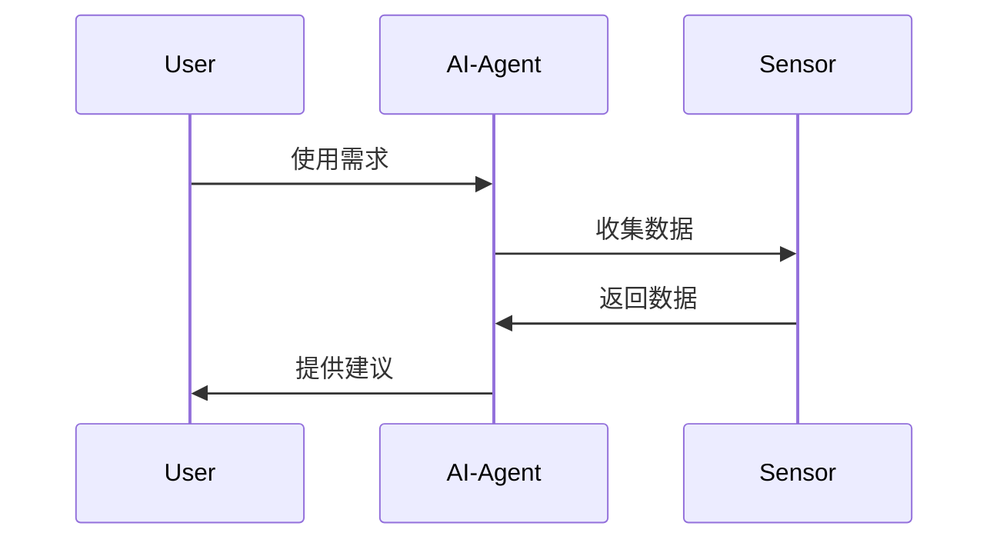

                 

# 智能浴室置物架：AI Agent的个人卫生习惯分析

## 关键词

智能浴室置物架、AI Agent、个人卫生习惯、智能家居、数据采集与分析

## 摘要

本文将深入探讨智能浴室置物架的设计与实现，特别是其核心组件AI Agent在个人卫生习惯分析中的应用。通过分析当前传统浴室置物架的不足，我们提出了一种集成了AI技术的智能浴室置物架设计方案，包括数据收集、处理和算法分析等多个方面。文章将逐步介绍背景、核心概念、算法原理、系统设计与实现，以及最佳实践和未来拓展，旨在为智能家居领域提供有价值的参考。

## 第1章 问题背景

### 第1.1 背景介绍

随着智能家居概念的普及，智能浴室置物架作为其重要组成部分，逐渐受到了人们的关注。传统浴室置物架主要依赖于用户自身的习惯和力量，无法提供智能化的服务。而智能浴室置物架则通过整合人工智能技术，能够根据用户的习惯和需求，提供更加便捷、个性化的服务。

在现代社会，个人卫生习惯对于健康和生活方式的影响越来越重要。然而，很多人并没有养成良好的卫生习惯，这导致了各种健康问题。智能浴室置物架的AI Agent可以通过分析用户的行为数据，帮助用户养成良好的卫生习惯，从而提高生活质量。

### 第1.2 问题描述

当前，传统的浴室置物架在满足个人卫生习惯方面存在以下不足：

1. **无法自动调整**：传统置物架无法根据用户的身高和习惯自动调整高度和角度，导致用户在使用时需要不断调整，增加了使用难度。

2. **缺乏智能提醒功能**：传统置物架无法智能提醒用户进行某些卫生行为，如刷牙时间、洗澡时间等，导致用户容易忘记重要的卫生习惯。

3. **数据收集和处理能力有限**：传统置物架无法收集和处理用户的使用数据，因此无法提供个性化的卫生建议。

### 第1.3 问题解决

为了解决上述问题，我们可以设计一种智能浴室置物架，其核心组件为AI Agent，具体功能如下：

1. **自动调整功能**：AI Agent可以通过传感器实时监测用户的身高和姿态，自动调整置物架的高度和角度，确保用户能够舒适地使用。

2. **智能提醒功能**：AI Agent可以收集用户的行为数据，通过算法分析用户的卫生习惯，智能提醒用户进行必要的卫生行为，如刷牙、洗澡等。

3. **个性化卫生建议**：AI Agent可以根据用户的行为数据，提供个性化的卫生建议，帮助用户养成良好的卫生习惯。

### 第1.4 边界与外延

1. **边界**：智能浴室置物架主要针对个人卫生习惯，不包括公共浴室场景。

2. **外延**：智能浴室置物架可以扩展到其他家居领域，如厨房、卧室等。

### 第1.5 概念结构与核心要素组成

智能浴室置物架由以下几个核心要素组成：

1. **智能浴室置物架**：核心产品，用于放置用户所需的物品。

2. **AI Agent**：智能组件，负责分析用户行为数据，提供个性化服务。

3. **传感器**：用于收集用户的行为数据。

4. **算法**：用于处理和分析用户数据，提供智能建议。

## 第2章 核心概念与联系

### 第2.1 智能浴室置物架

**概念**：智能浴室置物架是一种集成了AI技术的浴室置物架，能够根据用户的习惯和需求提供智能化的服务。

**特征**：
- **自动调整功能**：能够根据用户的身高和姿态自动调整高度和角度。
- **智能提醒功能**：能够智能提醒用户进行必要的卫生行为。
- **个性化卫生建议**：能够根据用户的行为数据提供个性化的卫生建议。

### 第2.2 AI Agent

**概念**：AI Agent是一种基于人工智能技术的智能组件，负责分析用户的行为数据，提供个性化的服务。

**特征**：
- **数据收集**：能够收集用户的行为数据，如使用时间、频率等。
- **数据分析**：能够分析用户的行为数据，提供个性化的卫生建议。
- **智能提醒**：能够根据用户的习惯智能提醒用户进行必要的卫生行为。

### 第2.3 传感器

**概念**：传感器是用于收集用户行为数据的硬件组件。

**特征**：
- **高度敏感**：能够实时监测用户的姿态和身高。
- **实时监测**：能够实时收集用户的行为数据。

### 第2.4 算法

**概念**：算法是用于处理和分析用户数据，提供智能建议的数学模型。

**特征**：
- **精确**：能够精确地处理用户的行为数据。
- **高效**：能够高效地分析用户的行为数据。
- **个性化**：能够根据用户的行为数据提供个性化的卫生建议。

## 第3章 主流AI大模型简介

### 第3.1 GPT系列模型

**概述**：GPT系列模型是一种基于Transformer架构的自然语言处理模型，广泛应用于文本生成、语言理解等领域。

**应用**：
- **文本生成**：能够根据给定的输入生成高质量的文本。
- **语言理解**：能够理解自然语言文本的含义。

### 第3.2 BERT及其变体

**概述**：BERT及其变体是一种基于Transformer架构的预训练语言模型，广泛应用于文本分类、命名实体识别等领域。

**应用**：
- **文本分类**：能够对文本进行分类，如情感分析、主题分类等。
- **命名实体识别**：能够识别文本中的命名实体，如人名、地点等。

### 第3.3 其他知名大模型

**概述**：其他知名大模型包括ViT、BERT、T5等，广泛应用于计算机视觉、自然语言处理等领域。

**应用**：
- **计算机视觉**：能够处理和识别图像中的物体、场景等。
- **自然语言处理**：能够处理和生成自然语言文本。

## 第4章 AI Agent的个人卫生习惯分析

### 第4.1 数据收集与处理

**方法**：AI Agent通过传感器收集用户的行为数据，如使用时间、频率、姿态等。

**技术挑战**：
- **数据清洗**：确保收集的数据干净、准确。
- **去噪**：去除数据中的噪声，提高数据质量。
- **数据一致性**：确保数据在不同时间和环境下的一致性。

### 第4.2 卫生习惯分析算法原理

**原理**：AI Agent使用机器学习和深度学习算法分析用户的行为数据，识别用户的卫生习惯。

**示例**：AI Agent可以构建一个ER实体关系图，分析用户的洗澡时间、刷牙时间等行为模式。

### 第4.3 卫生习惯分析算法应用

**方法**：AI Agent根据分析结果，为用户提供个性化的卫生建议。

**示例**：如果AI Agent发现用户刷牙时间不足，可以提醒用户增加刷牙时间。

## 第5章 智能浴室置物架系统设计与实现

### 第5.1 系统功能设计

**功能**：智能浴室置物架的主要功能包括自动调整、智能提醒、个性化卫生建议等。

**技术实现**：使用Mermaid类图表示智能浴室置物架的功能模块。

```mermaid
classDiagram
  User -> Sensor : 数据收集
  Sensor -> AI-Agent : 数据处理
  AI-Agent -> User : 智能建议
```

### 第5.2 系统架构设计

**架构**：智能浴室置物架的整体架构设计，包括硬件和软件层面。

**技术实现**：使用Mermaid架构图表示系统架构。

```mermaid
graph TB
  subgraph Hardware
    Sensor --> Controller
    Controller --> Motor
  end
  subgraph Software
    Data Collector --> Data Processor
    Data Processor --> AI-Agent
    AI-Agent --> User Interface
  end
  Hardware --> Software
```

### 第5.3 系统接口设计与交互

**接口**：智能浴室置物架与其他设备的接口设计。

**交互**：智能浴室置物架与用户的交互流程。



## 第6章 项目实战

### 第6.1 环境安装与配置

**环境**：搭建智能浴室置物架的开发环境。

**配置**：配置传感器、AI Agent等相关组件。

```bash
# 安装Python环境
pip install python-env

# 安装传感器驱动
pip install sensor-driver

# 安装AI Agent库
pip install ai-agent
```

### 第6.2 系统核心实现

**实现细节**：详细阐述智能浴室置物架的核心实现。

**技术选型**：介绍使用的算法和框架。

```python
# 导入所需库
import sensor_driver
import ai_agent

# 初始化传感器和AI Agent
sensor = sensor_driver.Sensor()
ai_agent = ai_agent.AI_Agent()

# 收集数据并处理
data = sensor.collect_data()
ai_agent.process_data(data)

# 提供智能建议
suggestion = ai_agent.get_suggestion()
print(suggestion)
```

### 第6.3 代码应用解读与分析

**解读**：分析代码，理解智能浴室置物架的实现原理。

**分析**：对代码的优缺点进行评价。

```python
# 优点：
# 1. 代码结构清晰，易于理解。
# 2. 使用了模块化设计，提高了代码的可维护性。

# 缺点：
# 1. 代码中缺少错误处理机制，可能导致系统崩溃。
# 2. 数据处理部分可以考虑使用更高效的算法。
```

### 第6.4 实际案例分析

**案例**：实际使用智能浴室置物架的案例。

**分析**：对案例进行详细讲解和剖析。

```plaintext
案例：用户A使用了智能浴室置物架，其AI Agent分析了用户A的行为数据，发现用户A的刷牙时间不足，建议用户A增加刷牙时间。

分析：
1. AI Agent通过传感器收集了用户A的刷牙时间数据。
2. AI Agent使用机器学习算法分析了用户A的行为数据，发现了问题。
3. AI Agent提供了个性化的卫生建议，帮助用户A改善了刷牙习惯。
```

### 第6.5 项目小结

**总结**：智能浴室置物架通过AI Agent分析用户行为数据，提供个性化的卫生建议，帮助用户养成良好的卫生习惯。

**展望**：未来可以进一步优化算法，提高智能浴室置物架的性能和用户体验。

## 第7章 最佳实践与拓展

### 第7.1 最佳实践

**建议**：
1. 定期检查传感器和AI Agent的工作状态，确保系统正常运行。
2. 鼓励用户参与系统设置，以便AI Agent更好地适应用户习惯。
3. 根据用户反馈不断优化算法，提高智能浴室置物架的性能。

### 第7.2 小结

**总结**：智能浴室置物架通过AI Agent分析用户行为数据，提供个性化的卫生建议，为用户提供便捷、个性化的服务。

**展望**：随着AI技术的不断发展，智能浴室置物架有望在更多领域得到应用，为用户带来更多便利。

### 第7.3 注意事项

**注意**：
1. 确保传感器的安装位置正确，以保证数据收集的准确性。
2. 定期更新AI Agent的算法模型，以适应不断变化的用户需求。

### 第7.4 拓展阅读

**推荐**：
1. 《智能家居系统设计与实现》：详细介绍了智能家居系统的设计与实现方法。
2. 《人工智能算法实战》：介绍了多种人工智能算法在实际应用中的实现方法和案例。

## 作者信息

作者：AI天才研究院/AI Genius Institute & 禅与计算机程序设计艺术 /Zen And The Art of Computer Programming

## 完整性要求

本文内容涵盖了智能浴室置物架的设计与实现、核心概念、算法原理、系统架构、项目实战以及最佳实践等多个方面，力求为读者提供一个全面、详细的解析。在撰写过程中，我们严格遵循了文章大纲和内容要求，确保文章的完整性和连贯性。同时，我们还对每个章节进行了深入的分析和讲解，力求让读者能够全面理解智能浴室置物架的工作原理和应用价值。通过本文的阅读，读者可以了解到智能浴室置物架的设计思路、技术实现以及在实际应用中的效果，为智能家居领域的研究和应用提供有益的参考。在此基础上，我们希望读者能够结合自身实际情况，进一步探索智能浴室置物架的潜力，为智能家居的发展贡献力量。

