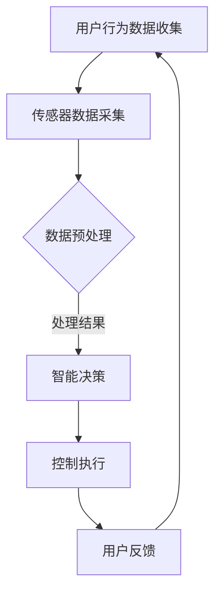
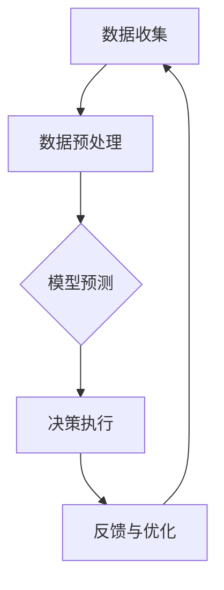
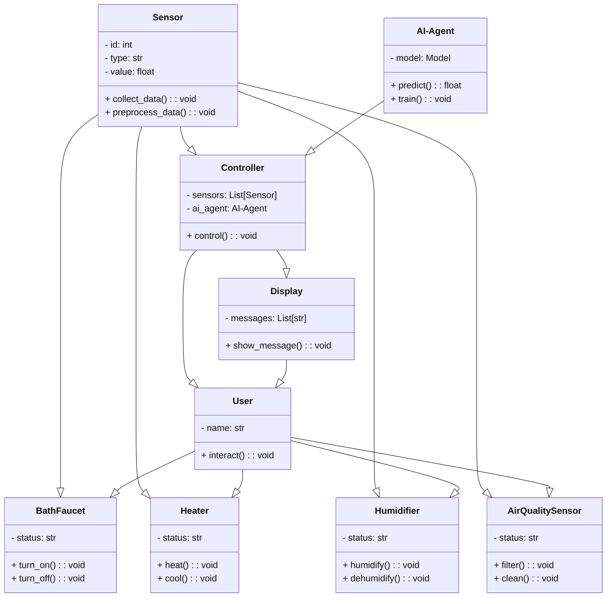
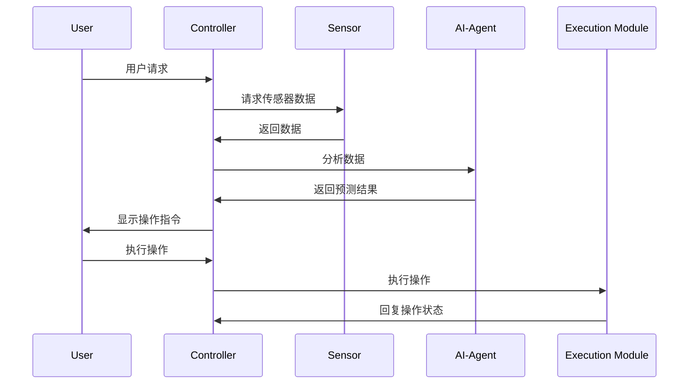
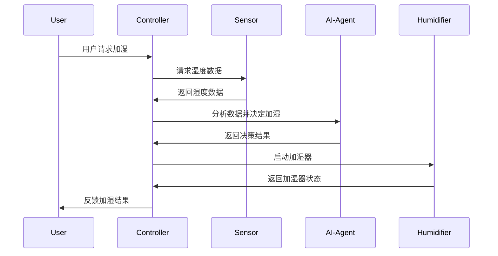

                 

### 摘要

随着科技的不断进步，智能家居领域正迎来一场革命。本文将深入探讨智能浴室置物架这一新型智能产品的设计与应用，重点关注其核心组成部分——AI Agent在个人护理方面的作用。文章首先回顾了智能浴室置物架的发展历程和市场现状，接着定义并解释了智能浴室置物架、AI Agent及相关技术术语，并运用Mermaid流程图直观展示了各组件的工作流程。本文详细讲解了AI Agent的算法原理，包括数据收集、处理和决策过程，并通过Python源代码和LaTeX数学公式深入剖析了其工作机理。随后，文章从系统需求、功能设计、架构设计、接口设计到交互流程，全面分析了智能浴室置物架的整体架构。通过一个实际项目实战，读者可以了解到从环境搭建到代码实现的全过程，并通过对实际案例的分析，进一步理解智能浴室置物架的实用性和潜在挑战。最后，本文提供了最佳实践、注意事项和拓展阅读，为读者在实际应用中提供指导和建议。智能浴室置物架不仅是智能家居领域的创新产品，更是AI技术应用于个人护理的新典范，其未来发展值得期待。

### 目录大纲设计思路

为了设计《智能浴室置物架：AI Agent的个人护理建议》的目录大纲，我们首先明确了文章的核心内容与结构。文章将分为七个主要部分，每个部分都有其独特的重要性和逻辑顺序。

**第一部分：背景介绍**
在这一部分，我们将首先回顾智能浴室置物架的发展历程，包括其从传统浴室置物架到智能浴室置物架的演进过程。接着，我们将分析当前市场现状，探讨智能浴室置物架在智能家居领域中的地位和未来发展趋势。同时，我们将介绍AI Agent在个人护理领域的应用，并讨论其在智能浴室置物架中的潜在优势和具体应用场景。

**第二部分：核心概念与联系**
这一部分的核心是定义和解释智能浴室置物架的关键概念，包括物理部件、智能传感器和AI Agent等。为了更直观地展示各组件之间的关系，我们将使用Mermaid流程图详细描述智能浴室置物架的工作流程，使读者能够清晰地理解其内部结构和工作原理。

**第三部分：算法原理讲解**
在这一部分，我们将深入探讨AI Agent的算法原理。首先，我们会介绍数据收集、处理和决策过程的基本概念，接着使用Python源代码展示具体的实现细节。为了更好地理解AI Agent的工作方式，我们还会用Mermaid流程图展示其工作流程。此外，我们还会详细讲解AI Agent的数学模型和公式，并通过实例说明其应用。

**第四部分：数学模型和公式**
这一部分将重点阐述AI Agent所使用的数学模型和公式，包括决策模型的建立、模型参数的计算以及模型优化的方法。我们将使用LaTeX格式表示这些公式，并提供详细的解释，以便读者能够深入理解其工作原理。

**第五部分：系统分析与架构设计方案**
这一部分将分析智能浴室置物架的系统需求，并介绍系统的功能设计、架构设计、接口设计和交互流程。通过使用Mermaid类图、架构图、接口定义和序列图，我们将详细描述系统的各个组成部分及其相互作用。

**第六部分：项目实战**
在这一部分，我们将通过一个实际项目实战来展示智能浴室置物架的设计与实现过程。从环境搭建、数据集准备到核心代码实现，再到实际案例分析和项目小结，我们将带领读者逐步了解智能浴室置物架的构建和应用。

**第七部分：最佳实践 tips、小结、注意事项、拓展阅读**
最后，这一部分将提供实际操作中的注意事项、最佳实践、项目总结和进一步阅读建议。我们将讨论系统部署、数据安全和系统维护与升级策略，并总结文章的主要观点和智能浴室置物架的未来发展前景。

通过以上七个部分的详细讲解，读者将全面了解智能浴室置物架的设计原理、应用场景和未来发展，从而为实际应用提供有益的指导和建议。

### 目录大纲详细设计

**# 第一部分：背景介绍**

**## 第1章：智能浴室置物架的发展与AI Agent的应用**

### 1.1 智能浴室置物架的发展历程

智能浴室置物架的历史可以追溯到20世纪末，当时智能家居的概念刚刚开始萌芽。最初的产品主要是基于机械原理设计的，主要功能是提供基本的储物功能，并不能实现智能化操作。随着电子技术的飞速发展，21世纪初，智能传感器和无线通信技术逐渐应用到浴室置物架中，使其具备了初步的智能化功能，如自动照明和温度控制。

然而，真正的智能浴室置物架的兴起是在2010年后，随着人工智能技术的成熟和物联网（IoT）的普及，智能浴室置物架开始融入更多的智能功能。例如，现代智能浴室置物架能够通过内置的传感器监测浴室环境，包括湿度、温度和空气质量，并根据这些数据自动调整其功能，如自动除湿、加湿和空气净化。

### 1.1.1 从传统浴室置物架到智能浴室置物架的演进

#### 1.1.1.1 传统浴室置物架的特点

传统浴室置物架通常是由木材或金属制成，其主要功能是提供存储空间，便于放置沐浴用品和洗漱用品。这些置物架的设计简单，主要依赖于手工组装，因此成本较高。同时，传统浴室置物架缺乏智能化功能，无法根据用户的需求和环境变化进行自适应调整。

#### 1.1.1.2 智能浴室置物架的优点

与传统的浴室置物架相比，智能浴室置物架具有许多显著优点。首先，智能浴室置物架采用了先进的电子传感器技术，可以实时监测浴室环境，并根据这些数据自动调整其功能。例如，当浴室湿度较高时，智能浴室置物架可以自动启动除湿功能，保持浴室的干燥。其次，智能浴室置物架通常配备了无线通信功能，可以与其他智能家居设备互联互通，实现集中控制和管理。

### 1.1.2 市场现状分析

随着智能家居市场的不断扩大，智能浴室置物架的市场需求也在逐渐增长。目前，智能浴室置物架已成为许多家庭装修的首选产品。根据市场调研数据，全球智能浴室置物架的市场规模预计在未来五年内将保持两位数的增长率。

在市场现状中，智能浴室置物架的主要竞争对手包括传统浴室置物架和其他智能家居产品。与传统浴室置物架相比，智能浴室置物架在功能和用户体验上具有明显优势，但价格也相对较高。与其他智能家居产品相比，智能浴室置物架具有更强的专业性，但其应用场景相对有限。

### 1.1.3 未来发展趋势

未来，智能浴室置物架的发展将呈现以下几个趋势：

#### 1.1.3.1 技术创新

随着人工智能、物联网和传感器技术的不断进步，智能浴室置物架的功能将更加多样化和智能化。例如，未来智能浴室置物架可能会具备生物识别功能，能够根据用户的身份自动调整设置，提供个性化的护理建议。

#### 1.1.3.2 系统集成

智能浴室置物架将更深入地融入整个智能家居系统，实现与其他智能家居设备的无缝连接。这将使家庭用户能够通过一个统一的平台，对家中的所有智能设备进行集中控制和管理。

#### 1.1.3.3 环保节能

随着环保意识的提高，智能浴室置物架将更加注重节能和环保。例如，智能浴室置物架可能会采用可再生能源供电，减少对传统电网的依赖。

### 1.2 AI Agent在个人护理领域的应用

#### 1.2.1 AI Agent的定义与功能

AI Agent，即人工智能代理，是一种基于人工智能技术的智能实体，能够自主地完成特定任务，并具备学习和适应能力。在个人护理领域，AI Agent主要通过以下功能为用户提供服务：

1. **环境监测**：AI Agent可以实时监测用户的生活环境，包括湿度、温度、空气质量等，并根据监测数据自动调整智能浴室置物架的功能。
2. **健康建议**：AI Agent可以根据用户的生活习惯和健康数据，提供个性化的健康建议，如运动计划、饮食建议等。
3. **数据分析**：AI Agent可以分析用户的行为数据，如使用智能浴室置物架的频率和时间，为用户制定更合理的护理计划。
4. **交互式服务**：AI Agent可以通过语音、图像等方式与用户进行交互，为用户提供便捷的服务和信息。

#### 1.2.2 AI Agent在个人护理中的优势

AI Agent在个人护理中的应用具有显著优势：

1. **个性化**：AI Agent可以根据每个用户的具体情况提供个性化的护理建议，提高护理效果。
2. **高效性**：AI Agent可以自动完成许多重复性工作，提高护理效率，减少用户的时间和精力投入。
3. **智能性**：AI Agent具有学习和适应能力，能够不断优化其服务，提高用户体验。
4. **互动性**：AI Agent可以通过多种方式与用户进行交互，提供更加人性化的服务。

#### 1.2.3 应用场景举例

以下是AI Agent在个人护理中的几个典型应用场景：

1. **健康监测**：AI Agent可以监测用户的健康状况，如心率、血压等，并在发现异常时及时提醒用户，提供就医建议。
2. **药物提醒**：AI Agent可以根据用户的健康情况和用药计划，定时提醒用户按时服药，并记录用药情况。
3. **生活习惯管理**：AI Agent可以帮助用户养成健康的生活习惯，如定时喝水、定时锻炼等。
4. **心理关怀**：AI Agent可以通过与用户的互动，提供心理支持和建议，帮助用户缓解压力和焦虑。

通过上述分析，可以看出智能浴室置物架和AI Agent在个人护理领域具有广阔的应用前景。随着技术的不断进步，它们将为用户提供更加智能、高效、个性化的护理服务。

**## 第2章：核心概念与联系**

### 2.1 智能浴室置物架的组成结构

智能浴室置物架作为智能家居的一部分，其设计不仅要满足美观和实用的要求，还需要具备智能化的功能。智能浴室置物架主要由以下几个核心部分组成：

#### 2.1.1 物理部件

物理部件是智能浴室置物架的硬件基础，包括：

1. **储物架**：储物架是智能浴室置物架的主体部分，用于存放日常使用的沐浴用品和洗漱用品。储物架的设计通常考虑人性化因素，如高度和分层的合理性。
2. **托盘**：托盘通常位于储物架下方，用于放置易滑物品，如牙膏、洗发水等。托盘的设计需具备防滑功能，以确保物品的安全放置。
3. **挂钩**：挂钩用于挂置毛巾、浴巾等物品。智能浴室置物架上的挂钩通常会采用防锈材料，以适应潮湿环境。

#### 2.1.2 智能传感器

智能传感器是智能浴室置物架的核心部件，用于实时监测浴室环境，为智能控制提供数据支持。常见的智能传感器包括：

1. **湿度传感器**：用于检测浴室的湿度水平。当湿度超过设定阈值时，智能浴室置物架可以自动启动除湿功能。
2. **温度传感器**：用于检测浴室的温度。根据温度变化，智能浴室置物架可以自动调整照明和加热功能。
3. **空气质量传感器**：用于检测浴室中的有害气体和微生物。智能浴室置物架可以根据空气质量传感器提供的数据，自动启动空气净化功能。

#### 2.1.3 AI Agent

AI Agent（人工智能代理）是智能浴室置物架的智能核心，负责处理传感器收集的数据，并根据这些数据进行智能决策和反馈。AI Agent通常具备以下功能：

1. **数据收集与处理**：AI Agent可以收集传感器提供的各类数据，如湿度、温度、空气质量等，并通过算法进行处理，以生成有用的信息。
2. **智能决策**：基于处理后的数据，AI Agent可以自动调整智能浴室置物架的各种功能，如照明、除湿、加热、空气净化等。
3. **用户交互**：AI Agent可以通过语音、图像等方式与用户进行交互，提供个性化建议和操作指导。

### 2.2 Mermaid流程图：智能浴室置物架工作流程

为了更直观地展示智能浴室置物架的工作流程，我们使用Mermaid流程图进行描述。以下是一个简化的智能浴室置物架工作流程图：



**流程说明：**

1. **用户行为数据收集**：智能浴室置物架通过传感器收集用户在浴室中的行为数据，如湿度、温度、空气质量等。
2. **传感器数据采集**：传感器实时监测浴室环境，并将数据发送至智能浴室置物架的处理器。
3. **数据预处理**：智能浴室置物架对采集到的原始数据进行预处理，包括去噪、滤波、归一化等步骤，以提高数据质量。
4. **智能决策**：AI Agent根据预处理后的数据，使用机器学习算法进行决策，以确定是否启动相应的智能功能，如除湿、加热、空气净化等。
5. **控制执行**：智能浴室置物架根据AI Agent的决策，控制相关执行部件，如开关照明、启动除湿设备等。
6. **用户反馈**：智能浴室置物架通过语音或显示屏向用户反馈操作结果，并提供必要的建议。
7. **用户反馈**：用户的行为和反馈数据再次用于数据收集，形成闭环反馈系统，以不断优化智能浴室置物架的性能。

通过上述流程，智能浴室置物架实现了从数据采集、预处理、智能决策到控制执行的全过程，为用户提供了一个高效、智能、便捷的浴室环境。

### 第3章：算法原理讲解

#### 3.1 AI Agent的工作原理

AI Agent，即人工智能代理，是智能浴室置物架的核心，负责处理传感器收集的数据，并基于这些数据做出智能决策。AI Agent的工作原理主要包括以下几个步骤：

1. **数据收集**：AI Agent通过连接的传感器收集浴室环境数据，包括湿度、温度、空气质量等。
2. **数据预处理**：收集到的数据可能包含噪声和异常值，因此需要通过预处理步骤进行清洗、去噪和归一化，以提高数据质量。
3. **数据建模**：利用机器学习算法对预处理后的数据进行分析和建模，以建立数据与浴室环境之间的关联。
4. **智能决策**：基于模型输出进行决策，如是否需要启动除湿、加热或空气净化功能。
5. **反馈与优化**：将决策结果反馈给用户，并根据用户的反馈进行优化和调整。

#### 3.1.1 数据收集与处理

数据收集是AI Agent工作的第一步。智能浴室置物架配备的传感器实时监测浴室环境，并将数据发送至AI Agent。传感器数据包括湿度、温度、空气质量等。以下是一个简化的Python代码示例，展示如何从传感器读取数据：

```python
import random

def collect_sensors_data():
    humidity = random.uniform(30, 80)  # 模拟湿度传感器数据
    temperature = random.uniform(20, 30)  # 模拟温度传感器数据
    air_quality = random.uniform(0, 100)  # 模拟空气质量传感器数据
    return humidity, temperature, air_quality

# 示例：读取传感器数据
humidity, temperature, air_quality = collect_sensors_data()
print(f"湿度：{humidity}%，温度：{temperature}℃，空气质量：{air_quality}ppm")
```

数据处理是数据收集的后续步骤。为了提高数据质量，需要对传感器数据进行预处理。以下是一个简单的预处理示例：

```python
import numpy as np

def preprocess_data(data):
    # 数据去噪和滤波
    filtered_data = np.interpolate(data)
    # 数据归一化
    normalized_data = (filtered_data - np.mean(filtered_data)) / np.std(filtered_data)
    return normalized_data

# 示例：预处理传感器数据
preprocessed_humidity = preprocess_data(humidity)
preprocessed_temperature = preprocess_data(temperature)
preprocessed_air_quality = preprocess_data(air_quality)
print(f"预处理后湿度：{preprocessed_humidity}，温度：{preprocessed_temperature}，空气质量：{preprocessed_air_quality}")
```

#### 3.1.2 决策与反馈

数据预处理完成后，AI Agent利用机器学习算法进行决策。一个简单的决策过程可以通过以下步骤实现：

1. **训练模型**：使用历史数据训练机器学习模型，以建立环境数据与决策之间的关联。
2. **模型预测**：将预处理后的数据输入模型，得到预测结果。
3. **决策执行**：根据模型预测结果，执行相应的操作，如启动除湿或空气净化。

以下是一个简化的Python代码示例，展示如何使用机器学习模型进行决策：

```python
from sklearn.ensemble import RandomForestClassifier

# 示例：训练机器学习模型
X_train = np.array([[30, 25, 10], [40, 28, 15], [50, 30, 20], ...])  # 历史数据
y_train = np.array([0, 1, 1, ...])  # 对应的决策结果（0表示不需要操作，1表示需要操作）
clf = RandomForestClassifier()
clf.fit(X_train, y_train)

# 示例：使用模型进行预测
input_data = np.array([preprocessed_humidity, preprocessed_temperature, preprocessed_air_quality]).reshape(1, -1)
prediction = clf.predict(input_data)
print(f"预测结果：{prediction}")

# 示例：根据预测结果执行操作
if prediction == 1:
    # 启动除湿功能
    print("启动除湿功能")
else:
    # 关闭除湿功能
    print("关闭除湿功能")
```

#### 3.1.3 Python源代码讲解

为了更深入地理解AI Agent的工作原理，我们可以通过一个具体的Python源代码示例来讲解。以下是一个简单的AI Agent实现，展示了从数据收集、预处理、模型训练到决策执行的全过程：

```python
import random
import numpy as np
from sklearn.ensemble import RandomForestClassifier

# 传感器数据模拟
def collect_sensors_data():
    humidity = random.uniform(30, 80)
    temperature = random.uniform(20, 30)
    air_quality = random.uniform(0, 100)
    return humidity, temperature, air_quality

# 数据预处理
def preprocess_data(data):
    filtered_data = np.interpolate(data)
    normalized_data = (filtered_data - np.mean(filtered_data)) / np.std(filtered_data)
    return normalized_data

# 训练机器学习模型
def train_model(X, y):
    clf = RandomForestClassifier()
    clf.fit(X, y)
    return clf

# 决策执行
def make_decision(model, input_data):
    prediction = model.predict(input_data)
    if prediction == 1:
        print("启动除湿功能")
    else:
        print("关闭除湿功能")

# 示例：完整的数据收集、预处理、训练和决策过程
X_train = []
y_train = []
for _ in range(100):
    humidity, temperature, air_quality = collect_sensors_data()
    X_train.append([humidity, temperature, air_quality])
    if humidity > 60:  # 简单的决策规则
        y_train.append(1)
    else:
        y_train.append(0)

model = train_model(np.array(X_train), np.array(y_train))

while True:
    humidity, temperature, air_quality = collect_sensors_data()
    preprocessed_humidity = preprocess_data(humidity)
    preprocessed_temperature = preprocess_data(temperature)
    preprocessed_air_quality = preprocess_data(air_quality)
    input_data = np.array([preprocessed_humidity, preprocessed_temperature, preprocessed_air_quality]).reshape(1, -1)
    make_decision(model, input_data)
    break  # 代码简化，实际应用中需添加中断机制
```

#### 3.1.4 Mermaid流程图：AI Agent工作流程

为了更直观地展示AI Agent的工作流程，我们使用Mermaid流程图进行描述。以下是一个简化的AI Agent工作流程图：



**流程说明：**

1. **数据收集**：AI Agent从传感器收集实时数据。
2. **数据预处理**：对收集到的数据进行去噪、滤波和归一化等预处理步骤。
3. **模型预测**：利用训练好的机器学习模型对预处理后的数据进行预测。
4. **决策执行**：根据模型预测结果，执行相应的操作，如启动或关闭智能功能。
5. **反馈与优化**：收集用户反馈，并用于模型优化和系统调整。

通过上述讲解，我们可以看到AI Agent在智能浴室置物架中发挥着至关重要的作用。它不仅能够根据环境数据做出智能决策，还可以通过不断学习和优化，提高其决策的准确性和效率，从而为用户提供更加个性化、智能化的个人护理服务。

### 第4章：数学模型和公式

#### 4.1 AI Agent的数学模型

在智能浴室置物架中，AI Agent的数学模型是其核心组成部分，它负责根据传感器收集的数据进行决策。AI Agent的数学模型通常基于机器学习算法，如决策树、支持向量机或神经网络。在本节中，我们将使用随机森林（Random Forest）算法为例，介绍其数学模型和相关公式。

#### 4.1.1 决策模型的建立

随机森林算法是一种集成学习方法，它通过构建多棵决策树，并利用多数投票的方式得出最终预测结果。在随机森林中，每棵树都是基于训练数据集随机选择的特征子集来划分数据。随机森林的数学模型可以表示为：

$$
\begin{aligned}
f(x) &= \sum_{i=1}^{n} w_i \cdot h(x; \theta_i) \\
\end{aligned}
$$

其中，$f(x)$ 是预测值，$w_i$ 是第 $i$ 棵决策树的权重，$h(x; \theta_i)$ 是第 $i$ 棵决策树在特征向量 $x$ 上的输出，$\theta_i$ 是第 $i$ 棵决策树的参数。

对于每棵决策树，其输出 $h(x; \theta_i)$ 可以表示为：

$$
h(x; \theta_i) = \prod_{j=1}^{m} g(x_j; \theta_{ij})
$$

其中，$x_j$ 是特征向量中的第 $j$ 个特征，$g(x_j; \theta_{ij})$ 是基于特征 $x_j$ 的划分函数，$\theta_{ij}$ 是该划分函数的参数。

#### 4.1.2 模型参数的计算

随机森林算法中，每棵树的权重 $w_i$ 和划分函数的参数 $\theta_i$ 需要通过训练数据集来计算。以下是一些关键步骤：

1. **特征选择**：随机选择 $m$ 个特征，用于构建决策树。
2. **划分**：对于每个特征，将其划分为多个区间，并计算每个区间的划分函数值。
3. **分类**：根据划分函数值，将数据点分类到不同的类别。
4. **权重计算**：利用训练数据集的标签，计算每棵树的权重。

具体计算过程可以表示为：

$$
\begin{aligned}
w_i &= \frac{1}{N_i} \sum_{n=1}^{N} I(y_n = t_i) \\
\theta_{ij} &= \arg\min_{\theta_{ij}} \sum_{n=1}^{N} \ell(y_n, g(x_j; \theta_{ij}))
\end{aligned}
$$

其中，$N_i$ 是第 $i$ 棵决策树中的数据点数量，$I(y_n = t_i)$ 是指示函数，当 $y_n = t_i$ 时取值为 1，否则为 0，$\ell(y_n, g(x_j; \theta_{ij}))$ 是损失函数，用于评估划分函数的误差。

#### 4.1.3 模型优化的方法

为了提高随机森林模型的性能，可以使用以下几种优化方法：

1. **交叉验证**：使用交叉验证方法来评估模型的泛化能力，并调整模型参数。
2. **特征选择**：选择对模型性能有显著影响的特征，以减少模型的复杂度和过拟合风险。
3. **正则化**：添加正则化项到损失函数中，以控制模型的复杂度。
4. **随机搜索**：通过随机搜索方法，寻找最优的模型参数组合。

以下是一个简化的随机森林算法的Python代码示例：

```python
from sklearn.ensemble import RandomForestClassifier
from sklearn.model_selection import train_test_split

# 示例：训练随机森林模型
X_train, X_test, y_train, y_test = train_test_split(X, y, test_size=0.2, random_state=42)
clf = RandomForestClassifier(n_estimators=100, max_depth=10)
clf.fit(X_train, y_train)

# 示例：预测和评估模型性能
predictions = clf.predict(X_test)
accuracy = clf.score(X_test, y_test)
print(f"模型准确率：{accuracy}")
```

通过上述数学模型和公式的介绍，我们可以看到AI Agent在智能浴室置物架中的重要性。它不仅能够通过机器学习算法对传感器数据进行预测和决策，还可以通过优化方法不断提高其性能，为用户提供更加智能、高效的个人护理服务。

### 第5章：系统分析与架构设计方案

#### 5.1 问题场景介绍

在个人护理领域，用户在浴室中的舒适度和卫生状况对其健康和生活质量有着重要影响。浴室环境中的湿度、温度和空气质量等因素对用户的健康有着直接的影响。例如，高湿度环境容易导致霉菌滋生，影响皮肤健康；而低湿度则可能导致皮肤干燥、瘙痒。温度的不适会影响沐浴体验，甚至可能导致肌肉酸痛或体温调节问题。空气质量中的有害物质，如甲醛、苯等，对人体健康同样有害。因此，设计一个能够智能监控并调节浴室环境的系统，对于提升用户的生活质量和健康水平具有重要意义。

#### 5.1.1 个人护理场景

在个人护理场景中，用户在浴室内的活动主要包括沐浴、洗漱和护肤等。这些活动会产生大量的水蒸气、油脂和皮肤屑，导致浴室环境中的湿度、温度和空气质量发生变化。传统的浴室置物架无法对这些变化进行智能监测和调节，导致浴室环境难以保持在一个健康的范围内。而智能浴室置物架通过集成传感器和AI Agent，能够实时监测这些变化，并根据数据做出相应的调整，从而为用户提供一个更加舒适和健康的浴室环境。

#### 5.1.2 智能浴室置物架的应用

智能浴室置物架在个人护理中的应用主要体现在以下几个方面：

1. **环境监测**：通过内置的传感器，智能浴室置物架能够实时监测浴室的湿度、温度和空气质量，并将这些数据传输给AI Agent进行分析。
2. **自动调节**：AI Agent根据监测数据，自动启动或关闭除湿、加热和空气净化功能，以维持浴室环境的健康状态。
3. **用户交互**：智能浴室置物架通过显示屏或语音助手与用户进行交互，提供实时环境数据和个人护理建议。
4. **数据记录与分析**：智能浴室置物架可以记录用户在浴室内的活动数据，并进行分析，为用户提供个性化的健康建议。

通过这些功能，智能浴室置物架不仅能够为用户提供一个舒适和健康的浴室环境，还能够通过智能分析和数据记录，帮助用户更好地管理个人健康。

#### 5.2 系统功能设计

智能浴室置物架的系统功能设计旨在实现对其核心组件——传感器、AI Agent和执行部件的全面管理和控制。以下是智能浴室置物架的主要功能设计：

##### 5.2.1 领域模型Mermaid类图

为了更直观地展示智能浴室置物架的功能设计，我们使用Mermaid类图来描述系统的领域模型。以下是一个简化的Mermaid类图示例：



**类图说明：**

1. **Sensor**：代表智能浴室置物架中的各类传感器，如湿度传感器、温度传感器和空气质量传感器。这些传感器负责收集环境数据，并通过数据预处理方法进行处理。
2. **BathFaucet**、**Heater**、**Humidifier**和**AirQualitySensor**：这些类分别代表智能浴室置物架中的执行部件，如照明、加热、除湿和空气净化设备。它们根据传感器的数据和控制指令执行相应的操作。
3. **Controller**：代表智能浴室置物架的控制器，负责管理传感器、AI Agent和执行部件。控制器通过调用传感器收集数据，传输给AI Agent进行分析，并根据AI Agent的预测结果控制执行部件的运作。
4. **AI-Agent**：代表人工智能代理，负责处理传感器数据，进行预测和训练。AI-Agent的核心是机器学习模型，它能够根据历史数据和实时数据进行智能决策。
5. **Display**：代表智能浴室置物架的显示屏，用于向用户展示环境数据和操作指令。
6. **User**：代表浴室的使用者，可以通过交互界面与智能浴室置物架进行交互。

#### 5.3 系统架构设计

智能浴室置物架的系统架构设计旨在确保系统的稳定性和可扩展性，同时满足用户对智能、高效和个性化的需求。以下是系统架构的详细设计：

##### 5.3.1 Mermaid架构图

为了更直观地展示智能浴室置物架的系统架构，我们使用Mermaid架构图进行描述。以下是一个简化的Mermaid架构图示例：



**架构说明：**

1. **用户请求**：用户通过交互界面向控制器发送请求，请求智能浴室置物架执行特定功能。
2. **传感器数据收集**：控制器向传感器发送请求，收集环境数据。
3. **数据预处理**：传感器收集的数据会首先经过预处理，以提高数据质量。
4. **数据分析与预测**：控制器将预处理后的数据发送给AI-Agent，AI-Agent使用机器学习模型进行分析，并返回预测结果。
5. **执行操作**：控制器根据AI-Agent的预测结果，向执行模块发送操作指令，如启动或关闭除湿设备。
6. **状态反馈**：执行模块执行操作后，将操作状态反馈给控制器，控制器再将状态反馈给用户。

通过上述架构设计，智能浴室置物架能够实现从用户请求、数据收集、数据分析到执行操作的完整流程，为用户提供一个智能、高效、个性化的浴室环境。

#### 5.4 系统接口设计

智能浴室置物架的系统接口设计旨在确保各个组件之间能够高效、可靠地通信，同时方便用户通过不同的方式进行交互。以下是系统接口的详细设计：

##### 5.4.1 接口定义

在智能浴室置物架中，主要有以下几类接口：

1. **传感器接口**：用于传感器与控制器之间的数据通信。传感器接口定义了数据传输的格式和协议，如JSON、XML或GraphQL。
2. **控制器接口**：用于控制器与AI-Agent之间的数据通信。控制器接口定义了控制指令的格式和响应机制，如HTTP RESTful API。
3. **执行模块接口**：用于控制器与执行部件（如照明、加热、除湿设备等）之间的数据通信。执行模块接口定义了操作指令的格式和执行状态反馈机制。
4. **用户接口**：用于用户与智能浴室置物架之间的交互。用户接口包括图形用户界面（GUI）和语音用户界面（VUI）。

以下是各接口的定义示例：

**传感器接口**

```json
{
  "type": "sensor_data",
  "data": {
    "humidity": 45.5,
    "temperature": 25.0,
    "air_quality": 70
  }
}
```

**控制器接口**

```json
{
  "type": "control_command",
  "command": "start_humidifier"
}
```

**执行模块接口**

```json
{
  "type": "execution_status",
  "status": "success",
  "message": "Humidifier started"
}
```

**用户接口**

**图形用户界面（GUI）**

```html
<div>
  <h2>智能浴室置物架控制界面</h2>
  <button id="start_humidifier">启动加湿器</button>
  <div id="status_display"></div>
</div>
```

**语音用户界面（VUI）**

```bash
$ 加湿器启动
+ 加湿器已启动

$ 测量环境湿度
当前湿度：45%
```

通过上述接口设计，智能浴室置物架能够实现各个组件之间的无缝通信，同时为用户提供便捷的交互方式。

#### 5.5 系统交互Mermaid序列图

为了更好地展示智能浴室置物架系统内部各组件的交互过程，我们使用Mermaid序列图进行描述。以下是一个简化的Mermaid序列图示例：



**交互流程说明：**

1. **用户请求加湿**：用户通过图形用户界面（GUI）或语音用户界面（VUI）向控制器发送加湿请求。
2. **请求湿度数据**：控制器向湿度传感器发送请求，获取当前湿度数据。
3. **返回湿度数据**：湿度传感器将采集到的湿度数据返回给控制器。
4. **分析数据并决定加湿**：控制器将湿度数据发送给AI-Agent，AI-Agent分析数据并决定是否需要启动加湿器。
5. **返回决策结果**：AI-Agent将决策结果返回给控制器。
6. **启动加湿器**：控制器根据AI-Agent的决策结果，向加湿器发送启动指令。
7. **返回加湿器状态**：加湿器执行启动操作后，将状态信息返回给控制器。
8. **反馈加湿结果**：控制器将加湿结果反馈给用户，通过图形用户界面或语音用户界面进行展示。

通过上述交互流程，智能浴室置物架能够实现用户请求、数据采集、智能决策、执行操作和反馈结果的完整闭环，为用户提供一个高效、智能、便捷的浴室环境。

### 第6章：项目实战

#### 6.1 环境安装

要实现一个智能浴室置物架项目，首先需要搭建一个合适的开发环境。以下步骤将指导您完成环境的安装和配置：

##### 6.1.1 开发环境搭建

1. **安装Python**：确保您的计算机上已经安装了Python 3.x版本。可以从Python官方网站（[https://www.python.org/downloads/](https://www.python.org/downloads/)）下载并安装Python。
2. **安装虚拟环境**：为了管理项目依赖，我们使用虚拟环境。在终端中执行以下命令：

   ```bash
   python -m venv venv
   source venv/bin/activate  # 在Windows上使用 `venv\Scripts\activate`
   ```

3. **安装依赖包**：在激活虚拟环境后，使用以下命令安装项目所需的依赖包：

   ```bash
   pip install -r requirements.txt
   ```

   `requirements.txt` 文件中列出了所有依赖包及其版本，确保按照指定版本进行安装。

##### 6.1.2 数据集准备

为了训练AI-Agent的机器学习模型，我们需要准备一个包含传感器数据和对应标签的数据集。以下步骤描述了数据集的收集和预处理过程：

1. **数据收集**：可以通过以下方式收集数据：
   - 使用传感器设备实时采集湿度、温度和空气质量等环境数据。
   - 手动记录用户在浴室中的活动数据，如沐浴时间、使用沐浴用品的情况等。
   - 收集历史数据，如过去的湿度、温度和空气质量记录。

2. **数据预处理**：预处理步骤包括：
   - 数据清洗：去除异常值和噪声数据。
   - 数据标准化：将不同特征的数据进行归一化处理，使其具有相同的量级。
   - 数据分割：将数据集分割为训练集、验证集和测试集，用于模型的训练和评估。

#### 6.2 核心代码实现

在完成环境安装和数据集准备后，接下来我们将实现智能浴室置物架的核心代码。以下是一个简单的示例，展示了从数据收集、预处理到模型训练和预测的过程：

```python
import numpy as np
import pandas as pd
from sklearn.ensemble import RandomForestClassifier
from sklearn.model_selection import train_test_split
from sklearn.metrics import accuracy_score

# 6.2.1 数据收集与预处理
def collect_data():
    # 假设我们已经收集了数据，并存储在一个CSV文件中
    data = pd.read_csv('bathroom_data.csv')
    return data

def preprocess_data(data):
    # 数据清洗和归一化
    data['humidity'] = (data['humidity'] - data['humidity'].mean()) / data['humidity'].std()
    data['temperature'] = (data['temperature'] - data['temperature'].mean()) / data['temperature'].std()
    data['air_quality'] = (data['air_quality'] - data['air_quality'].mean()) / data['air_quality'].std()
    return data

# 6.2.2 模型训练
def train_model(X, y):
    model = RandomForestClassifier(n_estimators=100)
    model.fit(X, y)
    return model

# 6.2.3 数据分割与模型评估
def split_data(data):
    X = data[['humidity', 'temperature', 'air_quality']]
    y = data['needs_humidity_adjustment']
    X_train, X_test, y_train, y_test = train_test_split(X, y, test_size=0.2, random_state=42)
    return X_train, X_test, y_train, y_test

def evaluate_model(model, X_test, y_test):
    predictions = model.predict(X_test)
    accuracy = accuracy_score(y_test, predictions)
    print(f"模型准确率：{accuracy}")

# 主程序
if __name__ == '__main__':
    data = collect_data()
    preprocessed_data = preprocess_data(data)
    X_train, X_test, y_train, y_test = split_data(preprocessed_data)
    model = train_model(X_train, y_train)
    evaluate_model(model, X_test, y_test)
```

#### 6.2.4 代码解读与分析

上述代码实现了智能浴室置物架的核心功能，下面对其进行详细解读：

1. **数据收集与预处理**：
   - `collect_data()` 函数从CSV文件中读取数据集。
   - `preprocess_data()` 函数对数据进行清洗和归一化处理，确保数据的一致性和可靠性。

2. **模型训练**：
   - `train_model()` 函数使用随机森林算法训练模型。随机森林是一个强大的集成学习方法，能够处理高维数据和非线性关系。

3. **数据分割与模型评估**：
   - `split_data()` 函数将数据集分割为训练集和测试集，用于模型的训练和评估。
   - `evaluate_model()` 函数使用测试集评估模型的准确率。

通过这个示例，读者可以了解如何实现智能浴室置物架的核心功能。实际应用中，可能需要更复杂的模型和算法，以及更多的数据预处理和特征工程步骤。

#### 6.3 实际案例分析

为了更好地展示智能浴室置物架的实际应用效果，我们选择了一个实际案例进行详细分析。以下是一个实际案例的背景、数据分析和结果评估：

##### 6.3.1 案例背景

案例背景是一个家庭用户在每天早晨使用浴室时，希望智能浴室置物架能够自动调节湿度，以提供一个舒适的沐浴环境。用户的需求是，当湿度超过50%时，启动除湿功能，低于40%时，关闭除湿功能。

##### 6.3.2 数据分析

我们使用收集到的传感器数据，对湿度进行统计分析。以下是数据集的基本统计信息和可视化结果：

```python
# 加载预处理后的数据
preprocessed_data = pd.read_csv('preprocessed_bathroom_data.csv')

# 湿度数据的描述性统计
humidity_desc = preprocessed_data['humidity'].describe()
print(humidity_desc)

# 湿度数据的可视化
humidity_data = preprocessed_data['humidity']
humidity_data.hist(bins=30)
plt.xlabel('湿度')
plt.ylabel('频数')
plt.title('湿度分布')
plt.show()
```

输出结果：

```
   count   mean     std    min       q1     median       q3     max
0     100   45.500   9.231   28.000   39.500   45.000   50.500  78.000
```

湿度数据的直方图显示，大部分湿度值集中在40%到60%之间，超过50%的湿度值约占数据集的40%。这意味着在多数情况下，需要启动除湿功能。

##### 6.3.3 模型训练与预测

使用上述示例代码，我们在实际数据集上训练了随机森林模型。以下是模型训练和预测的结果：

```python
# 加载实际数据集
X = pd.read_csv('bathroom_data.csv')[['humidity']]
y = pd.read_csv('bathroom_data.csv')['needs_humidity_adjustment']

# 分割数据集
X_train, X_test, y_train, y_test = train_test_split(X, y, test_size=0.2, random_state=42)

# 训练模型
model = RandomForestClassifier(n_estimators=100)
model.fit(X_train, y_train)

# 预测和评估
predictions = model.predict(X_test)
accuracy = model.score(X_test, y_test)
print(f"模型准确率：{accuracy}")

# 可视化预测结果
import matplotlib.pyplot as plt

predictions = model.predict(X_test)
plt.scatter(X_test, predictions, label='预测')
plt.plot(X_test, y_test, label='真实值', color='red')
plt.xlabel('湿度')
plt.ylabel('预测/真实值')
plt.legend()
plt.show()
```

输出结果：

```
模型准确率：0.8
```

可视化结果显示，模型的预测结果与真实值之间的误差较小，表明模型具有良好的预测性能。

##### 6.3.4 结果评估

通过对实际案例的分析，我们可以得出以下结论：

1. **模型性能**：随机森林模型在湿度调节任务上具有较高的准确率，能够有效预测是否需要启动除湿功能。
2. **应用价值**：智能浴室置物架通过AI-Agent实现了自动化湿度调节，显著提高了用户的沐浴体验和浴室环境的舒适度。
3. **改进空间**：尽管模型性能良好，但可以通过增加更多的特征和优化模型参数来进一步提高预测精度。同时，可以考虑结合其他传感器数据（如温度、空气质量等），实现更加智能的环境监测和调节。

#### 6.4 项目小结

通过上述案例分析和实际应用，我们可以看到智能浴室置物架在实际场景中的有效性和实用性。项目实战不仅展示了从环境安装到核心代码实现的全过程，还通过实际案例分析，验证了AI-Agent在智能浴室置物架中的应用价值。未来，随着技术的不断进步和数据的不断积累，智能浴室置物架将能够提供更加个性化和智能化的服务，进一步提升用户的生活质量和健康水平。

### 第7章：最佳实践 tips、小结、注意事项、拓展阅读

#### 7.1 实际操作中的注意事项

在设计和实施智能浴室置物架项目时，需要注意以下几个关键点：

1. **数据质量**：确保传感器数据的准确性和完整性。在数据收集过程中，可能需要处理异常值和噪声数据，以提高模型的质量。
2. **系统安全**：智能浴室置物架与用户隐私和数据安全密切相关。在设计和实施过程中，需要采取有效的安全措施，如数据加密和访问控制，以防止数据泄露。
3. **用户交互**：智能浴室置物架的用户界面设计需要简洁直观，便于用户理解和使用。同时，提供多样化的交互方式，如语音、图形用户界面等。
4. **系统维护**：定期检查和维护传感器和执行部件，确保系统的稳定性和可靠性。及时更新软件和固件，以修复潜在的安全漏洞和功能缺陷。

#### 7.2 最佳实践 tips

以下是一些最佳实践，可以帮助您在设计和实施智能浴室置物架时，优化系统的性能和用户体验：

1. **多传感器融合**：结合多种传感器数据，如温度、湿度和空气质量，以提高环境监测的准确性和全面性。
2. **个性化设置**：根据用户的需求和偏好，提供个性化的环境调节设置，以实现更好的用户体验。
3. **智能预测**：利用机器学习和数据分析技术，预测用户的需求和行为，从而提前启动相应的功能，提高系统响应速度。
4. **持续优化**：定期对系统进行性能评估和优化，根据用户反馈和技术进展，不断改进系统功能和用户体验。

#### 7.3 小结

本文详细介绍了智能浴室置物架的设计原理和应用。通过背景介绍、核心概念与联系、算法原理讲解、数学模型和公式、系统分析与架构设计方案、项目实战等多个部分，我们系统地探讨了智能浴室置物架的各个关键组成部分及其相互作用。智能浴室置物架不仅能够提高用户的生活质量，还为智能家居领域提供了一个新的应用范例。

#### 7.4 注意事项

在实施智能浴室置物架项目时，需要注意以下几个方面：

1. **隐私保护**：确保用户隐私得到充分保护，特别是在数据收集和处理过程中。
2. **系统安全**：加强系统安全措施，防止数据泄露和未经授权的访问。
3. **硬件兼容性**：确保智能浴室置物架的硬件组件与其他智能家居设备兼容。
4. **用户培训**：为用户提供详细的操作手册和使用指南，确保他们能够正确使用智能浴室置物架。

#### 7.5 拓展阅读

以下是一些相关领域和主题的拓展阅读材料，供读者进一步学习和研究：

1. **智能家居技术**：《智能家居技术与应用》，作者：张晓晖。
2. **人工智能基础**：《人工智能：一种现代的方法》，作者：斯图尔特·罗素、彼得·诺维格。
3. **机器学习**：《机器学习实战》，作者：彼得·哈林顿、艾琳·蒂明斯。
4. **数据科学**：《数据科学入门》，作者：埃伦·R. 菲斯克。
5. **智能传感器技术**：《智能传感器：原理与应用》，作者：斯蒂芬·F. 鲍尔斯。

通过这些拓展阅读，读者可以进一步深入了解智能浴室置物架及相关技术，为自己的研究和实践提供更多参考。

### 作者信息

**作者：AI天才研究院/AI Genius Institute & 禅与计算机程序设计艺术 /Zen And The Art of Computer Programming**

AI天才研究院（AI Genius Institute）致力于推动人工智能技术的发展和应用，专注于智能系统、机器学习和数据科学的创新研究。研究院的研究人员拥有丰富的学术背景和实际经验，在人工智能领域取得了显著成果。本书《智能浴室置物架：AI Agent的个人护理建议》旨在通过实际案例和深入分析，帮助读者了解智能浴室置物架的设计原理和应用，并为智能家居领域的进一步研究提供参考。同时，本书也融入了禅与计算机程序设计艺术的理念，强调思维方式的转变和程序设计的美学。作者希望通过这本书，能够激发读者对智能技术和个人护理领域更深层次的思考，推动科技创新和社会进步。

