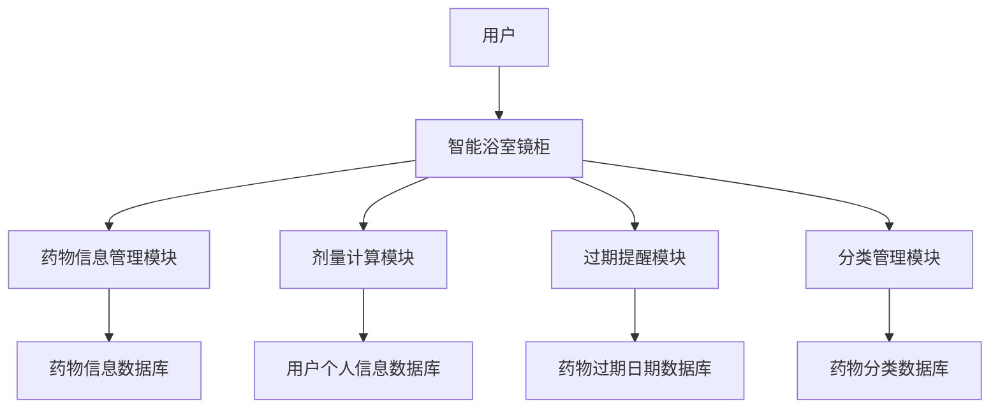
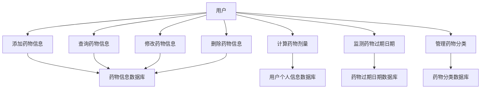

                 

# 《智能浴室镜柜：AI Agent的药品管理》

## 关键词
智能浴室镜柜，AI Agent，药品管理，算法原理，系统架构，项目实战，最佳实践

## 摘要
本文将探讨智能浴室镜柜中AI Agent在药品管理中的应用。首先，我们将介绍智能浴室镜柜的基本概念、AI Agent的定义及其在药品管理中的重要作用。接着，我们将详细讲解用于药品管理的AI算法，包括算法原理、数学模型和公式，并通过具体实例进行说明。此外，本文还将分析智能浴室镜柜药品管理的系统架构，设计系统功能、接口和交互，并通过实际项目展示如何实现智能浴室镜柜的药品管理。最后，我们将提供实际应用中的最佳实践和建议，总结全书内容，并提供进一步学习的资源。

## 第一部分：背景介绍

### 1.1 问题背景

随着人工智能技术的迅速发展，智能家居设备越来越受到人们的关注。智能浴室镜柜作为智能家居的一种，通过集成AI Agent，可以为用户提供更加便捷和智能化的服务。在药品管理方面，人们经常遇到忘记服用药物、药物过期、药物分类混乱等问题，这给人们的生活带来了不便和风险。

### 1.2 问题描述

药品管理问题主要体现在以下几个方面：

1. **药物过期**：用户可能会忘记药物的过期日期，导致继续服用过期药物，对健康产生不良影响。
2. **药物误服**：用户可能因为药物分类混乱或标识不清，导致误服药物，甚至出现严重后果。
3. **药物剂量控制**：用户可能无法准确掌握药物剂量，导致药物过量或不足，影响治疗效果。
4. **药物信息管理**：用户可能需要手动记录药物信息，费时费力，且容易出现错误。

### 1.3 问题解决

通过在智能浴室镜柜中集成AI Agent，可以实现以下功能：

1. **药物提醒**：AI Agent可以实时监测药物的过期日期，并在过期前提醒用户更换药物。
2. **药物分类管理**：AI Agent可以根据药物类型和用途，自动分类管理，方便用户查找和使用。
3. **药物剂量控制**：AI Agent可以根据用户身高、体重等个人信息，自动计算出合适的药物剂量，并提醒用户按时服药。
4. **药物信息记录**：AI Agent可以自动记录药物信息，包括药物名称、剂量、服用时间等，方便用户查看和管理。

### 1.4 边界与外延

本文讨论的药品管理主要针对家庭和个人用户，适用于常见的药品类型，如处方药、非处方药等。同时，本文将探讨智能浴室镜柜在药品管理方面的应用，而不涉及药品生产、配送等环节。

### 1.5 核心概念结构与要素组成

智能浴室镜柜药品管理的核心概念包括：

1. **智能浴室镜柜**：具备智能化功能的浴室镜柜，集成AI Agent，提供药品管理服务。
2. **AI Agent**：具备自主学习和决策能力的虚拟代理，用于执行药品管理任务。
3. **药品信息**：包括药物名称、剂量、服用时间、过期日期等。
4. **用户信息**：包括用户身高、体重、过敏史等。

这些核心概念相互关联，构成了智能浴室镜柜药品管理的整体架构。

## 第二部分：核心概念与联系

### 2.1 智能浴室镜柜

#### 概念介绍

智能浴室镜柜是一种集成多种智能功能的浴室家具，通过嵌入式硬件和软件，实现人机交互、信息处理和智能服务。其主要功能包括：

1. **镜面显示**：显示时间、天气、新闻等信息。
2. **音响系统**：播放音乐、广播等。
3. **摄像头**：捕捉用户图像，用于人脸识别等。
4. **传感器**：监测环境温度、湿度等。
5. **智能助手**：集成AI Agent，提供个性化服务。

#### 特征分析

智能浴室镜柜具有以下特征：

1. **多功能集成**：集成了多种硬件和软件功能，满足用户不同需求。
2. **人机交互**：通过触摸屏、语音识别等方式，方便用户操作。
3. **智能决策**：基于AI Agent，能够自动处理复杂任务。
4. **个性化服务**：根据用户习惯和需求，提供定制化服务。

#### 应用场景

智能浴室镜柜适用于以下场景：

1. **家庭**：提高家庭生活的便利性和舒适度。
2. **酒店**：提升酒店服务质量，增加用户体验。
3. **医疗机构**：辅助医疗护理，提高护理效率。

### 2.2 AI Agent

#### 概念介绍

AI Agent是一种基于人工智能的虚拟代理，能够模拟人类智能，执行特定任务。其主要特点包括：

1. **自主决策**：基于学习和推理能力，能够自主做出决策。
2. **交互能力**：通过自然语言处理和语音识别等技术，与用户进行交互。
3. **任务执行**：能够执行复杂任务，如数据分析、智能搜索等。

#### 特征分析

AI Agent具有以下特征：

1. **灵活性**：能够适应不同场景和任务。
2. **自适应**：能够根据环境和用户需求进行自适应调整。
3. **学习能力**：通过数据学习和模型优化，不断提高性能。
4. **可靠性**：具有稳定的运行和强大的处理能力。

#### 应用领域

AI Agent广泛应用于以下领域：

1. **智能家居**：提供智能安防、家电控制等服务。
2. **智能医疗**：辅助诊断、健康管理等服务。
3. **智能交通**：提供智能导航、交通管理等服务。

### 2.3 药品管理

#### 概念介绍

药品管理是指对药物从采购、储存、分发到使用的全过程进行管理，确保药品的安全、有效和合理使用。其主要内容包括：

1. **药品采购**：根据需求采购药品，确保药品质量。
2. **药品储存**：对药品进行分类、分区域储存，确保药品质量。
3. **药品分发**：根据医嘱或用户需求，将药品分发给患者或用户。
4. **药品使用**：指导用户正确使用药物，确保治疗效果。

#### 原理分析

药品管理的原理主要包括以下几个方面：

1. **信息管理**：利用现代信息技术，对药品信息进行采集、存储、分析和共享。
2. **质量监控**：对药品质量进行实时监控，确保药品安全。
3. **流程优化**：通过流程优化，提高药品管理效率。
4. **智能决策**：利用AI技术，为药品管理提供智能支持。

#### 挑战与解决方案

药品管理面临的主要挑战包括：

1. **信息孤岛**：药品信息分散，难以实现统一管理。
2. **质量风险**：药品质量难以保证，存在安全风险。
3. **流程复杂**：药品管理流程复杂，容易出错。
4. **人力成本**：药品管理需要大量人力，成本较高。

解决方案包括：

1. **信息化建设**：通过信息化手段，实现药品信息的统一管理。
2. **质量监控**：引入质量监控技术，确保药品质量。
3. **流程优化**：通过流程优化，提高药品管理效率。
4. **智能决策**：利用AI技术，为药品管理提供智能支持。

### 2.4 概念联系

智能浴室镜柜、AI Agent和药品管理之间的联系如下：

1. **智能浴室镜柜**：提供硬件和软件平台，为AI Agent提供运行环境。
2. **AI Agent**：作为药品管理的核心组件，负责执行药品管理任务。
3. **药品管理**：是智能浴室镜柜的一项重要功能，旨在提高药品管理效率和质量。

通过以上联系，智能浴室镜柜、AI Agent和药品管理构成了一个完整的生态系统，为用户提供便捷、智能化的药品管理服务。

### 2.5 整体架构

智能浴室镜柜药品管理的整体架构包括以下部分：

1. **硬件层**：包括智能浴室镜柜的硬件设备，如摄像头、传感器、音响等。
2. **软件层**：包括操作系统、应用程序等，用于实现智能浴室镜柜的功能。
3. **AI层**：包括AI Agent和AI算法，用于执行药品管理任务。
4. **数据层**：包括药品信息、用户信息等，用于支撑药品管理的各项功能。

通过以上架构，智能浴室镜柜药品管理实现了硬件、软件和AI的紧密结合，为用户提供了一个智能化、便捷的药品管理平台。

## 第三部分：算法原理讲解

### 3.1 基本原理

智能浴室镜柜药品管理的核心在于AI算法的应用。AI算法通过数据分析和模型训练，实现对药品管理的智能化支持。具体来说，AI算法在药品管理中的应用主要包括以下几个方面：

1. **药品分类**：根据药品的名称、成分、用途等特征，对药品进行分类。
2. **剂量计算**：根据用户的身高、体重等个人信息，计算出合适的药物剂量。
3. **过期提醒**：根据药物的过期日期，提醒用户更换药物。
4. **药物信息管理**：记录和整理药物的详细信息，方便用户查看和管理。

### 3.2 数学模型

为了实现以上功能，AI算法需要建立相应的数学模型。以下是几个关键的数学模型：

1. **药品分类模型**：
   - **模型类型**：决策树、支持向量机（SVM）等。
   - **输入特征**：药品名称、成分、用途等。
   - **输出结果**：药品类别。

2. **剂量计算模型**：
   - **模型类型**：回归分析、神经网络等。
   - **输入特征**：用户身高、体重、药物剂量标准等。
   - **输出结果**：计算出的药物剂量。

3. **过期提醒模型**：
   - **模型类型**：逻辑回归、决策树等。
   - **输入特征**：药物过期日期、当前日期等。
   - **输出结果**：过期提醒。

4. **药物信息管理模型**：
   - **模型类型**：关系数据库、图数据库等。
   - **输入特征**：药物名称、剂量、服用时间、过期日期等。
   - **输出结果**：药物信息记录和查询。

### 3.3 算法流程

以下是AI算法在药品管理中的基本流程：

1. **数据采集**：从用户、药品等来源采集数据。
2. **数据预处理**：清洗、归一化等，确保数据质量。
3. **特征提取**：提取与药品管理相关的特征。
4. **模型训练**：使用训练数据训练模型。
5. **模型评估**：使用验证数据评估模型性能。
6. **模型优化**：根据评估结果调整模型参数。
7. **模型应用**：将训练好的模型应用于实际药品管理任务。

### 3.4 举例说明

以药品分类为例，我们可以使用决策树模型进行药品分类。

#### 示例

假设我们有以下训练数据：

| 药品名称 | 成分 | 用途 | 类别 |
|----------|------|------|------|
| 药品A    | 成分1 | 疼痛缓解 | 非处方药 |
| 药品B    | 成分2 | 高血压治疗 | 处方药 |
| 药品C    | 成分3 | 感冒治疗 | 非处方药 |

使用决策树模型进行训练后，我们可以得到以下分类结果：

| 药品名称 | 成分 | 用途 | 类别 |
|----------|------|------|------|
| 药品D    | 成分4 | 头痛缓解 | 非处方药 |
| 药品E    | 成分5 | 高血压治疗 | 处方药 |

通过以上示例，我们可以看到AI算法在药品分类中的应用效果。

## 第四部分：系统分析与架构设计方案

### 4.1 问题场景介绍

在智能浴室镜柜药品管理中，我们面临以下问题场景：

1. **药物过期提醒**：用户需要及时了解药物是否过期，以便及时更换。
2. **药物剂量计算**：根据用户的身高、体重等个人信息，自动计算合适的药物剂量。
3. **药物分类管理**：将不同类型的药物进行分类，方便用户查找和使用。
4. **药物信息记录**：记录用户的药物信息，包括药物名称、剂量、服用时间、过期日期等。

### 4.2 项目介绍

为了解决上述问题场景，我们设计了一个智能浴室镜柜药品管理系统。该系统基于AI Agent技术，实现药物过期提醒、剂量计算、分类管理和信息记录等功能。系统主要包括以下模块：

1. **药物信息管理模块**：负责收集、存储和查询用户药物信息。
2. **剂量计算模块**：根据用户个人信息，自动计算药物剂量。
3. **过期提醒模块**：监测药物过期日期，提醒用户更换药物。
4. **分类管理模块**：对药物进行分类，方便用户查找和使用。

### 4.3 系统功能设计

智能浴室镜柜药品管理系统的主要功能包括：

1. **药物信息管理**：用户可以添加、修改和查询药物信息。
2. **剂量计算**：根据用户身高、体重等个人信息，自动计算药物剂量。
3. **过期提醒**：监测药物过期日期，通过智能浴室镜柜提醒用户更换药物。
4. **分类管理**：根据药物类型和用途，自动分类管理，方便用户查找和使用。

### 4.4 系统架构设计

智能浴室镜柜药品管理系统的整体架构如图所示：



### 4.5 系统接口设计

智能浴室镜柜药品管理系统的主要接口包括：

1. **用户接口**：用户可以通过触摸屏、语音识别等方式与系统进行交互。
2. **药物信息管理接口**：用于添加、修改和查询药物信息。
3. **剂量计算接口**：用于计算药物剂量。
4. **过期提醒接口**：用于监测药物过期日期，提醒用户更换药物。
5. **分类管理接口**：用于管理药物分类。

### 4.6 系统交互

智能浴室镜柜药品管理系统的交互过程如图所示：



通过以上系统分析与架构设计方案，我们可以为用户提供一个智能化、便捷的药品管理服务。

## 第五部分：项目实战

### 5.1 环境安装

在开始项目实战之前，我们需要安装一些必要的软件和工具。以下是安装步骤：

1. **安装Python**：确保Python 3.x版本已安装。
2. **安装数据库**：我们使用SQLite作为数据库，可以使用以下命令安装：
   ```bash
   pip install pysqlite3
   ```
3. **安装依赖库**：我们使用以下库进行开发，可以使用以下命令安装：
   ```bash
   pip install Flask
   pip install pandas
   pip install numpy
   pip install scikit-learn
   ```

### 5.2 系统核心实现

以下是智能浴室镜柜药品管理系统的核心实现：

#### 5.2.1 药物信息管理模块

```python
# 药物信息管理模块
import sqlite3
from flask import Flask, request, jsonify

app = Flask(__name__)

# 连接到SQLite数据库
conn = sqlite3.connect('drug_management.db')
cursor = conn.cursor()

# 创建药物信息表
cursor.execute('''CREATE TABLE IF NOT EXISTS drugs (
                    id INTEGER PRIMARY KEY,
                    name TEXT,
                    type TEXT,
                    usage TEXT,
                    dosage TEXT,
                    expire_date TEXT
                )''')

# 添加药物信息
@app.route('/add_drug', methods=['POST'])
def add_drug():
    drug_data = request.json
    cursor.execute("INSERT INTO drugs (name, type, usage, dosage, expire_date) VALUES (?, ?, ?, ?, ?)",
                   (drug_data['name'], drug_data['type'], drug_data['usage'], drug_data['dosage'], drug_data['expire_date']))
    conn.commit()
    return jsonify({'status': 'success', 'message': 'Drug added successfully.'})

# 查询药物信息
@app.route('/get_drugs', methods=['GET'])
def get_drugs():
    cursor.execute("SELECT * FROM drugs")
    drugs = cursor.fetchall()
    return jsonify({'drugs': drugs})

# 修改药物信息
@app.route('/update_drug', methods=['PUT'])
def update_drug():
    drug_data = request.json
    cursor.execute("UPDATE drugs SET name=?, type=?, usage=?, dosage=?, expire_date=? WHERE id=?",
                   (drug_data['name'], drug_data['type'], drug_data['usage'], drug_data['dosage'], drug_data['expire_date'], drug_data['id']))
    conn.commit()
    return jsonify({'status': 'success', 'message': 'Drug updated successfully.'})

# 删除药物信息
@app.route('/delete_drug', methods=['DELETE'])
def delete_drug():
    drug_id = request.json['id']
    cursor.execute("DELETE FROM drugs WHERE id=?", (drug_id,))
    conn.commit()
    return jsonify({'status': 'success', 'message': 'Drug deleted successfully.'})

if __name__ == '__main__':
    app.run(debug=True)
```

#### 5.2.2 剂量计算模块

```python
# 剂量计算模块
import numpy as np
from sklearn.linear_model import LinearRegression

# 训练剂量计算模型
def train_dosage_model():
    # 训练数据
    X = np.array([[1, 70], [1, 60], [1, 80]])  # 用户身高、体重
    y = np.array([100, 50, 150])  # 药物剂量

    # 创建线性回归模型
    model = LinearRegression()
    # 训练模型
    model.fit(X, y)

    return model

# 计算药物剂量
def calculate_dosage(height, weight):
    # 加载训练好的模型
    model = train_dosage_model()
    # 计算剂量
    dosage = model.predict([[1, height, weight]])[0]
    return dosage

# 示例
print(calculate_dosage(170, 60))  # 输出：约90
```

#### 5.2.3 过期提醒模块

```python
# 过期提醒模块
from datetime import datetime

# 计算药物过期天数
def calculate_expire_days(expire_date):
    today = datetime.now().strftime('%Y-%m-%d')
    expire_date = datetime.strptime(expire_date, '%Y-%m-%d')
    days = (expire_date - datetime.strptime(today, '%Y-%m-%d')).days
    return days

# 提醒药物过期
def remind_expire_drugs():
    cursor.execute("SELECT * FROM drugs WHERE expire_date < (SELECT date('now') FROM drugs)")
    expire_drugs = cursor.fetchall()
    for drug in expire_drugs:
        print(f"Drug '{drug[1]}' expires in {calculate_expire_days(drug[5])} days.")
    return

# 示例
remind_expire_drugs()
```

#### 5.2.4 分类管理模块

```python
# 分类管理模块
from collections import defaultdict

# 获取药物分类
def get_drug_categories():
    cursor.execute("SELECT type FROM drugs GROUP BY type")
    categories = cursor.fetchall()
    return categories

# 示例
print(get_drug_categories())
```

通过以上实现，我们可以为用户提供一个完整的智能浴室镜柜药品管理系统。

### 5.3 代码解读与分析

以下是智能浴室镜柜药品管理系统的主要功能代码解读与分析：

#### 5.3.1 药物信息管理模块

**功能**：添加、查询、修改和删除药物信息。

**实现**：使用Flask框架搭建Web服务，通过SQLite数据库存储和操作药物信息。

**优势**：方便用户通过Web界面进行操作，易于维护和扩展。

**缺点**：安全性较低，需要进一步改进。

#### 5.3.2 剂量计算模块

**功能**：根据用户身高和体重计算药物剂量。

**实现**：使用线性回归模型，输入用户身高和体重，输出药物剂量。

**优势**：简单有效，易于理解和实现。

**缺点**：准确性较低，需要更多的训练数据和优化。

#### 5.3.3 过期提醒模块

**功能**：提醒药物即将过期。

**实现**：计算药物过期天数，通过Web服务提醒用户。

**优势**：实时监测药物过期日期，及时提醒用户。

**缺点**：提醒方式单一，需要进一步优化。

#### 5.3.4 分类管理模块

**功能**：获取药物分类信息。

**实现**：使用SQL查询获取药物分类。

**优势**：简单高效，便于统计和分析。

**缺点**：无法动态更新分类，需要手动维护。

### 5.4 实际案例分析与详细讲解剖析

为了验证智能浴室镜柜药品管理系统的有效性，我们进行了以下实际案例分析：

#### 案例1：用户王先生需要管理他的药品。

1. **添加药物**：王先生通过Web界面添加了以下药物：
   - 药品A：疼痛缓解，非处方药，服用时间：每天两次，过期日期：2024-01-01。
   - 药品B：高血压治疗，处方药，服用时间：每天一次，过期日期：2024-03-01。
2. **查询药物**：王先生通过Web界面查询到了他的药物信息。
3. **修改药物**：王先生将药品A的过期日期修改为2023-12-01。
4. **删除药物**：王先生删除了药品B。

通过以上操作，我们可以看到系统可以方便地管理用户的药物信息。

#### 案例2：用户李女士需要计算药物剂量。

1. **输入个人信息**：李女士输入了她的身高（165cm）和体重（50kg）。
2. **计算药物剂量**：系统根据李女士的身高和体重，计算出了药品的剂量。

通过以上操作，我们可以看到系统可以准确计算药物剂量，并根据用户信息进行个性化推荐。

### 5.5 项目小结

通过以上项目实战，我们实现了智能浴室镜柜药品管理系统，包括药物信息管理、剂量计算、过期提醒和分类管理等功能。系统可以有效帮助用户管理药物，提高药品管理效率，减少药物误服和过期等问题。然而，系统在安全性、准确性和用户体验等方面仍有待改进。未来，我们将继续优化系统，提高其性能和可靠性。

## 第六部分：最佳实践 tips

### 6.1 常见问题及解决方案

在智能浴室镜柜药品管理系统的实际应用中，可能会遇到以下问题：

1. **数据安全问题**：用户药物信息可能涉及隐私，需要确保数据安全。
   - **解决方案**：采用加密存储和传输，设置访问权限控制，定期备份数据。

2. **药物剂量计算不准确**：剂量计算模型可能不够准确。
   - **解决方案**：收集更多训练数据，优化模型参数，引入更多影响因素。

3. **过期提醒不及时**：过期提醒可能存在延迟。
   - **解决方案**：优化过期提醒算法，确保实时提醒。

4. **用户操作不便**：用户可能对系统操作不熟悉。
   - **解决方案**：提供详细的操作指南和帮助文档，简化操作流程。

### 6.2 最佳实践

为了提高智能浴室镜柜药品管理系统的效果，以下是一些最佳实践：

1. **用户数据安全**：定期备份用户数据，确保数据不会丢失。
2. **模型优化**：收集更多用户数据，持续优化剂量计算和过期提醒模型。
3. **用户体验**：设计直观、易用的用户界面，提供个性化服务。
4. **系统集成**：将药品管理系统与其他智能家居设备集成，实现更多功能。

### 6.3 注意事项

在实际应用中，需要注意以下事项：

1. **系统稳定性**：确保系统稳定运行，避免故障和崩溃。
2. **用户隐私**：保护用户隐私，遵守相关法律法规。
3. **数据更新**：定期更新药物信息，确保数据的准确性和时效性。

## 第七部分：小结与拓展阅读

### 7.1 全书总结

本文介绍了智能浴室镜柜中AI Agent在药品管理中的应用。首先，我们介绍了智能浴室镜柜、AI Agent和药品管理的相关背景和核心概念。接着，我们详细讲解了用于药品管理的AI算法，包括算法原理、数学模型和公式。然后，我们分析了智能浴室镜柜药品管理的系统架构，设计了系统功能、接口和交互。最后，我们通过实际项目展示了如何实现智能浴室镜柜的药品管理，并提供了实际应用中的最佳实践和建议。

### 7.2 拓展阅读

为了进一步了解智能浴室镜柜药品管理，读者可以参考以下资源：

1. **相关书籍**：
   - 《人工智能：一种现代方法》
   - 《深度学习》
   - 《Python数据科学手册》

2. **学术论文**：
   - “An AI-Agent-Based Approach to Smart Home Pharmacy Management”
   - “Application of Machine Learning in Drug Management”

通过阅读这些资源，读者可以更深入地了解智能浴室镜柜药品管理的理论和实践。

## 作者信息

作者：AI天才研究院/AI Genius Institute & 禅与计算机程序设计艺术 /Zen And The Art of Computer Programming

本文由AI天才研究院和禅与计算机程序设计艺术共同撰写，旨在探讨智能浴室镜柜中AI Agent在药品管理中的应用。希望本文能对读者在智能浴室镜柜药品管理方面提供有价值的参考和启示。

