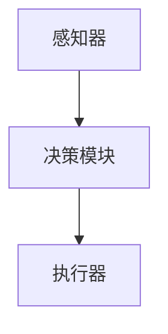
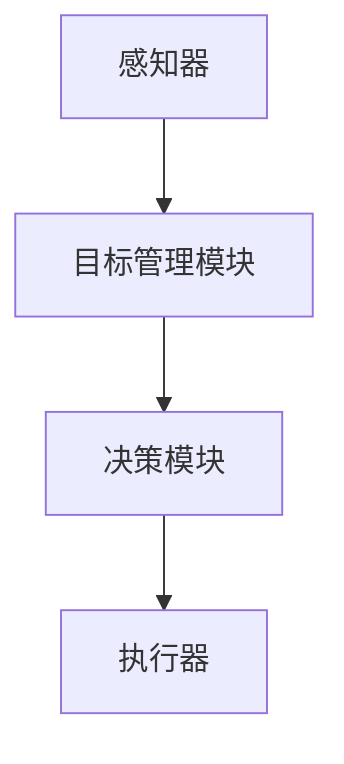
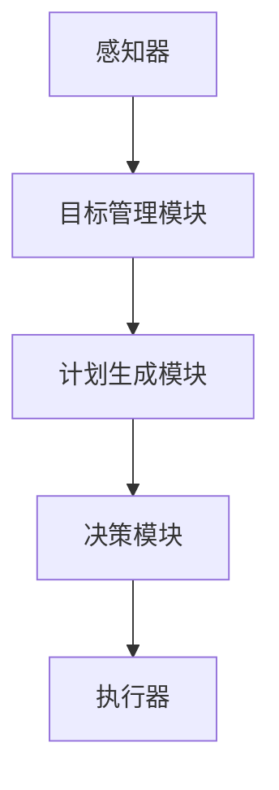

                 

### 第一步：引言与背景

智能浴室镜作为智能家居领域的一个创新产品，近年来逐渐受到消费者的关注。其集成了多种传感器和AI算法，能够实时监测使用者的健康状态，提供个性化的健康建议。在现代社会，随着人口老龄化趋势加剧和人们对健康生活质量的追求，智能浴室镜的应用显得尤为重要。

首先，我们需要明确什么是智能浴室镜。智能浴室镜是一种融合了先进传感器技术、显示技术、人工智能和物联网技术的设备，它可以通过摄像头、温度传感器、湿度传感器等多种传感器收集用户的数据，然后通过内置的AI算法对数据进行处理和分析，从而实现健康状态的评估和个性化服务。

健康状态评估是智能浴室镜的核心功能之一。它不仅涉及生理指标（如心率、血压、血氧含量等），还包括心理状态和生活习惯等方面。通过这些数据的综合分析，AI Agent可以提供个性化的健康建议，帮助用户改善生活习惯，预防疾病。

本文旨在探讨智能浴室镜中AI Agent如何实现健康状态评估。我们将首先介绍智能浴室镜的基本概念、技术架构和市场需求，然后深入探讨AI Agent的基本原理、健康状态评估的核心概念及其模型，接着分析智能浴室镜与AI Agent的融合优势，最后讨论智能浴室镜在不同应用场景中的实际应用和未来展望。

### 第二步：智能浴室镜概述

#### 智能浴室镜的定义与分类

智能浴室镜是一种集成了多种传感器、显示技术和AI算法的设备，旨在为用户提供全面的健康监测和个性化服务。从功能上划分，智能浴室镜可以分为以下几类：

1. **基础型智能浴室镜**：这类镜子主要集成了基本的传感器，如摄像头、温度传感器和湿度传感器，用于实时监测环境数据和用户的基本生理指标。

2. **综合型智能浴室镜**：这类镜子除了具备基础型智能浴室镜的功能外，还集成了更高级的传感器，如心率传感器、血压传感器和血氧传感器等，能够提供更全面的健康监测数据。

3. **高端智能浴室镜**：这类镜子不仅具备综合型智能浴室镜的功能，还集成了更先进的显示技术，如触摸屏幕、OLED屏幕等，用户可以通过触摸屏幕与镜子进行交互，获取个性化的健康建议。

#### 智能浴室镜的技术架构

智能浴室镜的技术架构可以分为三个主要部分：数据采集与预处理、数据处理与传输、以及用户交互界面。

1. **数据采集与预处理**：智能浴室镜通过多种传感器收集环境数据和用户生理数据。这些数据经过预处理，如滤波、归一化等，以去除噪声和异常值，提高数据的准确性和可靠性。

2. **数据处理与传输**：预处理后的数据会被传输到内置的AI处理器，通过机器学习算法和深度学习算法进行分析和评估。这些算法包括但不限于数据挖掘、模式识别、聚类分析等。

3. **用户交互界面**：智能浴室镜通过触摸屏幕、语音识别等技术，与用户进行交互。用户可以通过触摸屏幕查看健康数据、接收健康建议，甚至可以通过语音指令与镜子进行互动。

#### 智能浴室镜的市场现状与发展趋势

当前，智能浴室镜市场正处于快速发展阶段。根据市场研究公司的数据，全球智能浴室镜市场在2020年的规模约为10亿美元，预计到2025年将达到30亿美元，年均复合增长率超过20%。

从技术发展趋势来看，未来的智能浴室镜将更加强调智能化、个性化和集成化。具体来说：

1. **智能化**：随着AI技术的进步，智能浴室镜的算法将更加精准，能够更准确地评估用户的健康状态，并提供更个性化的健康建议。

2. **个性化**：未来的智能浴室镜将能够根据用户的生活习惯和健康数据，提供更加个性化的服务，如定制化的健身计划、营养建议等。

3. **集成化**：智能浴室镜将与其他智能家居设备进行更深度的集成，如智能音箱、智能灯泡等，形成一个统一的智能家居生态系统，提供更加便捷和高效的生活体验。

#### 未来应用场景

未来的智能浴室镜将在家庭健康管理、医疗保健和老年人护理等领域发挥重要作用。具体来说：

1. **家庭健康管理**：智能浴室镜可以实时监测家庭成员的健康状态，及时发现健康问题，提供个性化的健康建议，帮助家庭成员改善生活习惯。

2. **医疗保健**：智能浴室镜可以为医疗机构提供实时、准确的健康数据，辅助医生进行诊断和治疗。同时，智能浴室镜还可以进行远程医疗监控，为患者提供便捷的医疗服务。

3. **老年人护理**：智能浴室镜可以帮助老年人实时监测健康状况，及时发现异常，提供紧急情况响应。同时，智能浴室镜还可以提供智能化的生活辅助，如自动提醒服药、提供健康建议等，提升老年人的生活质量。

综上所述，智能浴室镜作为一种新兴的智能家居产品，具有广阔的市场前景和应用潜力。随着技术的不断进步和应用的不断拓展，智能浴室镜将在未来的健康管理和医疗保健领域发挥越来越重要的作用。

### 第三步：AI Agent的基本原理

#### AI Agent的概念

AI Agent，即人工智能代理，是一种具有智能行为能力的计算机程序。它能够感知环境、理解环境信息、制定计划并采取行动，以实现特定目标。AI Agent的核心思想是模拟人类的智能行为，使其在特定环境下能够自主决策和执行任务。

AI Agent的特点包括：

1. **自主性**：AI Agent能够自主地执行任务，不需要人工干预。
2. **适应性**：AI Agent能够根据环境变化和任务需求，调整自己的行为策略。
3. **目标导向性**：AI Agent具有明确的目标，能够为实现目标而进行持续的学习和优化。

#### AI Agent的类型

AI Agent可以根据其功能和行为方式分为以下几类：

1. **反应型Agent**：反应型Agent依据感知到的环境信息，直接做出反应。这类Agent没有明确的计划或目标，其行为仅基于当前的环境状态。例如，一个简单的机器人能够根据光线的明暗调整自己的移动方向。

2. **目标导向型Agent**：目标导向型Agent具有明确的目标，并通过感知环境和内部状态，制定一系列动作以实现目标。这类Agent通常具有一个目标规划模块，能够根据目标生成行动计划。例如，一个智能家居系统可以根据用户设定的温度目标，调整空调的温度设置。

3. **计划型Agent**：计划型Agent不仅具有明确的目标，还能够预测环境变化，制定长期计划以实现目标。这类Agent通常需要处理复杂的环境状态，能够进行多步骤的计划和决策。例如，一个自动驾驶汽车系统需要根据路况、交通规则和目标地点，规划出最优的行驶路径。

#### AI Agent的架构

AI Agent的架构通常包括以下几个关键部分：

1. **感知器**：感知器负责收集环境信息，如传感器数据、图像、声音等，为Agent提供外部环境的输入。

2. **决策模块**：决策模块根据感知器收集的信息，结合Agent的目标和策略，生成行动指令。决策模块通常包括多个子模块，如感知处理、计划生成、目标评估等。

3. **执行器**：执行器负责将决策模块生成的行动指令转化为实际的操作，如移动、开启设备等。

4. **学习模块**：学习模块使Agent能够从经验中学习，优化其行为策略。学习模块可以通过机器学习、深度学习等技术，不断调整感知器、决策模块和执行器的参数，提高Agent的性能。

#### 反应型Agent架构

反应型Agent的架构相对简单，主要包含感知器、决策模块和执行器。感知器收集环境信息，决策模块直接根据当前环境状态生成行动指令，执行器执行这些指令。典型的反应型Agent架构如图3-1所示：

#### 目标导向型Agent架构

目标导向型Agent的架构比反应型Agent更为复杂，通常包括感知器、决策模块、执行器和目标管理模块。目标管理模块负责设定目标、更新目标状态，并协调其他模块的工作。典型的目标导向型Agent架构如图3-2所示：

#### 计划型Agent架构

计划型Agent的架构最为复杂，包括感知器、决策模块、执行器、目标管理模块和计划生成模块。计划生成模块负责根据环境状态和目标，生成一系列的行动计划，决策模块根据这些计划生成行动指令。典型的计划型Agent架构如图3-3所示：

通过以上对AI Agent基本原理的介绍，我们可以看到AI Agent在智能浴室镜中的重要性。AI Agent不仅能够实时监测用户的健康状态，还能根据用户的行为数据提供个性化的健康建议，实现智能化的健康管理。接下来，我们将进一步探讨健康状态评估的核心概念及其模型。

### 第四步：健康状态评估的核心概念

#### 健康状态评估的定义

健康状态评估是指通过科学的方法和工具，对个体的健康状况进行量化分析和评估，以判断其健康水平，并为改善健康提供依据。健康状态评估不仅包括生理指标，如心率、血压、血氧含量等，还包括心理状态、生活习惯、行为模式等多方面因素。

健康状态评估的重要性体现在以下几个方面：

1. **疾病预防**：通过定期进行健康状态评估，可以及时发现健康隐患，采取预防措施，避免疾病的发生。

2. **健康管理**：健康状态评估可以帮助个体了解自身的健康状况，制定合理的健康计划，提高生活质量。

3. **医疗决策**：医生可以通过健康状态评估的结果，为患者提供更加精准的医疗服务，提高治疗效果。

#### 常见健康指标

在进行健康状态评估时，以下是一些常见的健康指标：

1. **心率**：心率是指每分钟心脏跳动的次数。正常心率范围一般为60-100次/分钟。心率过高或过低都可能是健康问题的信号。

2. **血压**：血压是指血液对血管壁的压力。正常血压范围一般为120/80 mmHg。高血压和低血压都会增加心血管疾病的风险。

3. **血氧含量**：血氧含量是指血液中氧气的含量。正常血氧含量范围一般在95%-100%。血氧含量低可能是心肺功能问题的标志。

4. **血糖**：血糖是指血液中的葡萄糖含量。正常血糖范围一般在4-7 mmol/L。血糖过高或过低都可能对健康产生不利影响。

5. **体重指数（BMI）**：体重指数是指体重（公斤）与身高（米）的平方之比。正常BMI范围一般在18.5-24.9。BMI可以反映个体的肥胖程度。

6. **胆固醇**：胆固醇是血液中的脂肪成分，包括高密度胆固醇（HDL）和低密度胆固醇（LDL）。正常胆固醇范围因个体差异而异，但总体上HDL应高于40 mg/dL，LDL应低于100 mg/dL。

#### 健康状态评估模型

健康状态评估模型是利用统计学、机器学习和深度学习等方法，对健康数据进行分析和评估，以量化个体的健康状态。常见的健康状态评估模型包括以下几种：

1. **机器学习模型**：机器学习模型通过训练数据集，学习健康数据之间的关联，从而预测个体的健康状态。常见的机器学习算法包括线性回归、逻辑回归、支持向量机等。

2. **深度学习模型**：深度学习模型通过多层神经网络结构，对健康数据进行复杂的学习和建模。常见的深度学习算法包括卷积神经网络（CNN）、循环神经网络（RNN）等。

3. **传统统计模型**：传统统计模型利用统计学方法，分析健康数据之间的相关性，从而构建健康状态评估模型。常见的统计方法包括多元回归分析、主成分分析等。

在选择健康状态评估模型时，需要考虑以下因素：

1. **数据量**：大量数据可以提高模型的准确性。

2. **数据质量**：高质量的数据可以减少模型误差。

3. **模型复杂度**：复杂的模型可以捕捉更多的数据特征，但可能带来过拟合风险。

4. **计算资源**：深度学习模型通常需要更多的计算资源。

综上所述，健康状态评估是智能浴室镜的重要组成部分，通过对心率、血压、血氧含量等健康指标的分析，智能浴室镜可以为用户提供个性化的健康建议，帮助用户维护健康。在下一部分，我们将探讨智能浴室镜与AI Agent的融合优势。

### 第五步：智能浴室镜与AI Agent的融合

#### 融合优势

智能浴室镜与AI Agent的融合，为健康状态评估带来了显著的提升，具体优势如下：

1. **提高健康监测的准确性**：AI Agent通过对多种传感器数据的综合分析，可以更准确地评估用户的健康状态。相比单一传感器的监测，AI Agent可以捕捉到更全面的数据，减少误差。

2. **增强用户体验**：智能浴室镜通过直观的界面和交互方式，如触摸屏和语音识别，使用户能够方便地获取健康数据和建议。AI Agent可以根据用户的使用习惯和偏好，提供个性化的健康服务，提高用户的满意度。

3. **降低医疗成本**：智能浴室镜可以在家庭环境中实时监测用户的健康状态，及时发现健康问题，减少突发疾病的概率。通过与医疗机构的数据共享，医生可以更早地进行预防和干预，降低医疗成本。

#### 融合架构设计

智能浴室镜与AI Agent的融合架构设计包括以下三个关键环节：

1. **数据采集与预处理**：智能浴室镜通过多种传感器，如摄像头、温度传感器、湿度传感器、心率传感器等，收集用户的各种生理数据。这些原始数据需要经过预处理，如去噪、归一化等，以提高数据质量。

2. **AI Agent实现**：AI Agent的核心是健康状态评估模块，该模块利用机器学习和深度学习算法，对预处理后的数据进行分析和建模。AI Agent还可以通过持续学习，不断优化评估模型的准确性。

3. **健康状态评估与反馈**：AI Agent根据健康状态评估结果，生成个性化的健康建议，并通过智能浴室镜的界面，如触摸屏和语音输出，将建议反馈给用户。同时，AI Agent还可以将评估结果和健康建议发送给医疗机构，实现远程医疗监控。

#### 实现案例

为了更好地理解智能浴室镜与AI Agent的融合，下面我们将介绍两个实现案例。

1. **智能浴室镜健康监测系统**

在这个案例中，智能浴室镜集成了摄像头、心率传感器、温度传感器和血压传感器。AI Agent通过分析这些传感器的数据，实时监测用户的心率、体温和血压。当检测到异常值时，AI Agent会生成健康警报，并通过触摸屏提醒用户。此外，AI Agent还可以将数据上传到云端，供医生远程监控。

2. **个性化健康建议系统**

在这个案例中，智能浴室镜不仅提供健康监测功能，还集成了个性化健康建议模块。AI Agent通过分析用户的健康数据、生活习惯和基因信息，生成个性化的健康建议，如运动计划、饮食建议和睡眠调整等。用户可以通过触摸屏查看这些建议，并按照AI Agent的建议进行健康管理。

#### 总结

智能浴室镜与AI Agent的融合，为健康状态评估提供了强大的支持。通过提高监测准确性、增强用户体验和降低医疗成本，智能浴室镜与AI Agent的应用有望在未来得到更广泛的应用。在下一部分，我们将探讨智能浴室镜在不同应用场景中的实际应用。

### 第六步：智能浴室镜的应用场景

#### 家庭健康管理

在家庭健康管理方面，智能浴室镜能够发挥重要作用。通过集成多种传感器，智能浴室镜可以实时监测家庭成员的生理指标，如心率、血压和血氧含量等。当检测到异常值时，智能浴室镜会自动生成警报，并通过触摸屏或手机应用程序通知家庭成员。此外，智能浴室镜还可以记录家庭成员的日常生活习惯，如运动量、饮食习惯等，并提供个性化的健康建议，帮助他们改善生活习惯，预防疾病。

1. **家庭成员健康监测**

智能浴室镜通过摄像头和传感器，可以实现对家庭成员的实时健康监测。家庭成员每次使用浴室时，智能浴室镜都会自动记录他们的生理指标，并将数据上传到云端。通过分析这些数据，智能浴室镜可以生成健康报告，为家庭成员提供健康趋势分析。例如，如果某位家庭成员的心率持续偏高，智能浴室镜会建议他们咨询医生，进行进一步的检查。

2. **家庭健康数据管理**

智能浴室镜不仅可以实时监测家庭成员的健康状况，还可以将健康数据存储在云端，实现家庭健康数据的管理。家庭成员可以通过手机应用程序查看自己的健康数据，并与家人共享。这有助于家庭成员之间互相监督，共同保持健康。

3. **家庭健康报告生成**

智能浴室镜定期生成家庭健康报告，内容包括每位家庭成员的健康趋势分析、健康建议和生活方式建议。这些报告可以帮助家庭成员了解自己的健康状况，及时发现健康问题，并采取相应的措施。

#### 医疗保健

智能浴室镜在医疗保健领域也有广泛的应用前景。通过智能浴室镜，医疗机构可以实现对患者的远程健康监测和医疗监控，提高医疗服务的效率和质量。

1. **医疗机构健康管理**

在医疗机构中，智能浴室镜可以用于对患者进行健康监测。患者每次就诊时，医生可以要求他们使用智能浴室镜进行健康检查。智能浴室镜通过传感器收集患者的生理指标，并将数据实时传输给医生。医生可以通过这些数据，了解患者的健康状况，制定个性化的治疗方案。

2. **远程医疗监控**

智能浴室镜还可以用于远程医疗监控，特别适用于慢性病管理。医生可以通过智能浴室镜定期监测患者的健康数据，如心率、血压和血糖等。当检测到异常值时，智能浴室镜会自动发送警报给医生和患者，提醒他们采取相应的措施。远程医疗监控有助于医生及时发现患者的健康问题，避免病情恶化。

3. **疾病预防与控制**

智能浴室镜可以帮助医疗机构进行疾病预防和控制。通过收集和分析大量健康数据，智能浴室镜可以识别出疾病的早期迹象，提示患者和医生采取预防措施。此外，智能浴室镜还可以帮助医疗机构了解疾病在不同人群中的传播趋势，为制定公共卫生政策提供依据。

#### 老年人护理

老年人护理是一个复杂且挑战性的领域，智能浴室镜在这个方面具有独特的优势。通过智能浴室镜，可以为老年人提供实时的健康监测和紧急情况响应，提高他们的生活质量。

1. **老年人健康监测**

智能浴室镜可以实时监测老年人的生理指标，如心率、血压和血氧含量等。当检测到异常值时，智能浴室镜会自动发送警报给家属和医疗机构，确保老年人得到及时的医疗援助。

2. **紧急情况响应**

智能浴室镜还具备紧急情况响应功能。当老年人发生意外，如摔倒、呼吸困难等，智能浴室镜可以通过摄像头和麦克风自动检测到异常，并立即发送紧急求助信号给家属和紧急服务人员，为他们争取宝贵的救援时间。

3. **生活质量提升**

智能浴室镜不仅可以监测老年人的健康状况，还可以提供娱乐和生活辅助功能。例如，智能浴室镜可以播放音乐、新闻和电视剧，帮助老年人打发时间。此外，智能浴室镜还可以通过语音识别技术，协助老年人完成日常任务，如设定闹钟、预约医生等，提高他们的生活质量。

#### 总结

智能浴室镜在家庭健康管理、医疗保健和老年人护理等方面具有广泛的应用前景。通过实时健康监测、数据管理和个性化健康建议，智能浴室镜可以帮助用户提高健康水平，改善生活质量。在下一部分，我们将探讨智能浴室镜未来的发展展望和面临的挑战。

### 第七步：未来展望与挑战

#### 技术发展展望

随着科技的不断进步，智能浴室镜和AI Agent在未来将继续迎来新的发展机遇。以下是几个关键的发展方向：

1. **AI Agent技术的进步**：随着深度学习、强化学习和多模态学习等AI技术的发展，AI Agent将能够更加精准地分析用户的健康数据，提供更加个性化的健康建议。例如，通过多模态学习，AI Agent可以同时分析用户的心率、血压和睡眠数据，更全面地评估用户的健康状况。

2. **智能浴室镜功能拓展**：未来的智能浴室镜将不仅仅局限于健康监测，还将集成更多的智能家居功能，如智能照明、智能音响和智能家电控制等。通过实现功能拓展，智能浴室镜将成为智能家居生态系统中的核心设备，提供更加便捷和智能化的生活体验。

3. **个性化健康服务**：未来的智能浴室镜将能够根据用户的健康数据和生活习惯，提供个性化的健康服务。例如，智能浴室镜可以根据用户的饮食习惯，推荐营养搭配和饮食计划；根据用户的运动习惯，推荐个性化的运动方案。

#### 面临的挑战

尽管智能浴室镜和AI Agent具有广阔的发展前景，但在实际应用中仍面临一些挑战：

1. **数据隐私与安全**：智能浴室镜会收集用户的健康数据，这些数据涉及用户的隐私。如何保护这些数据的安全，防止数据泄露或被滥用，是智能浴室镜面临的重要挑战。需要建立严格的数据保护机制，确保用户数据的安全。

2. **伦理与法律问题**：智能浴室镜和AI Agent在健康监测和诊断中的应用，可能会涉及伦理和法律问题。例如，如何确保AI Agent的决策透明可解释，如何处理误诊或漏诊的情况，都需要制定相应的伦理和法律规范。

3. **技术标准化与规范**：智能浴室镜和AI Agent涉及多种技术，包括传感器技术、AI算法、通信协议等。缺乏统一的技术标准和规范，可能导致设备之间的兼容性问题，影响用户体验。因此，需要制定统一的技术标准和规范，推动行业的健康发展。

#### 总结

智能浴室镜和AI Agent在未来的发展过程中，将面临技术进步、功能拓展、个性化健康服务等机遇，同时也需要解决数据隐私与安全、伦理与法律问题、技术标准化与规范等挑战。通过不断努力和创新，智能浴室镜和AI Agent将为用户带来更加智能、便捷和健康的未来。

### 结尾

在本文中，我们探讨了智能浴室镜和AI Agent在健康状态评估中的应用。首先，我们介绍了智能浴室镜的定义、技术架构和市场现状，以及AI Agent的基本原理和类型。接着，我们详细分析了健康状态评估的核心概念和模型，并展示了智能浴室镜与AI Agent的融合优势。此外，我们还探讨了智能浴室镜在家庭健康管理、医疗保健和老年人护理等应用场景中的实际应用，并展望了其未来发展。

通过本文，我们希望读者能够对智能浴室镜和AI Agent在健康状态评估中的作用有更深入的理解。这些技术不仅能够提高健康监测的准确性，还能为用户提供个性化的健康建议，改善生活质量。

未来的智能浴室镜和AI Agent将继续发展，面临数据隐私与安全、伦理与法律问题、技术标准化与规范等挑战。但通过持续的技术创新和规范制定，我们有理由相信，智能浴室镜和AI Agent将为人类带来更加智能、健康和便捷的未来。

作者：AI天才研究院/AI Genius Institute & 禅与计算机程序设计艺术 /Zen And The Art of Computer Programming

