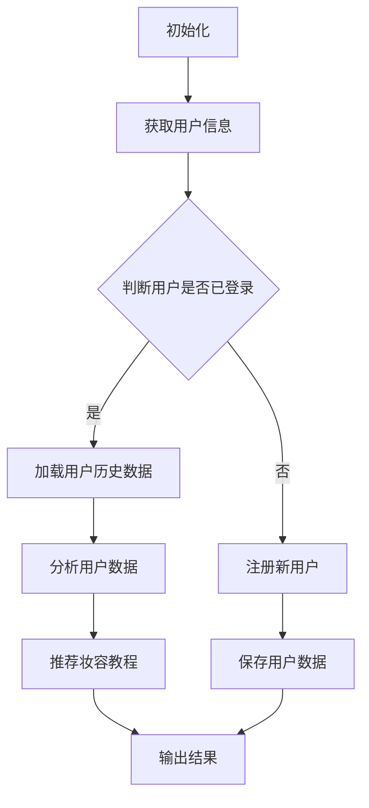
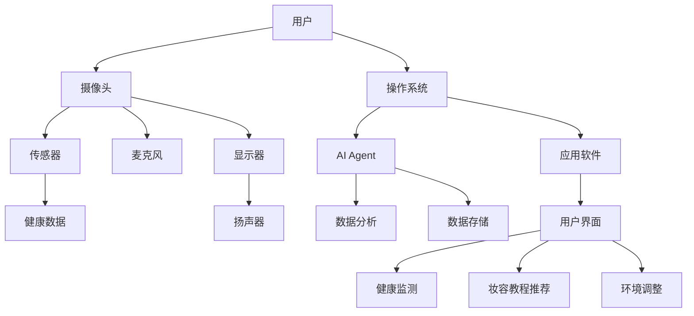
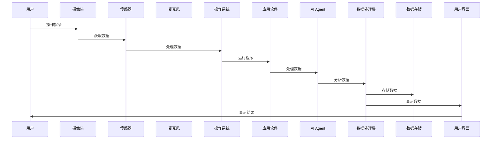
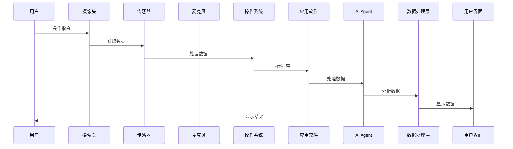

                 

## 智能浴室镜：AI Agent的妆容教程推荐

关键词：智能浴室镜、AI Agent、计算机视觉、自然语言处理、算法、系统架构

摘要：本文探讨了智能浴室镜的设计思路，详细介绍了其核心概念与算法原理，并通过实际项目实战展示了其应用效果。文章旨在为读者提供一份全面的技术指南，帮助了解智能浴室镜的工作机制和开发方法。

## 设计思路

### 总体结构

为了使读者能够清晰地理解智能浴室镜的设计和实现过程，本文将按照以下结构展开：

1. **背景介绍**：介绍智能浴室镜的背景、市场需求和当前技术发展情况。
2. **核心概念与联系**：详细阐述与智能浴室镜相关的核心概念及其关联。
3. **算法原理讲解**：深入讲解智能浴室镜中的核心算法，包括原理、流程、代码实现和数学模型。
4. **系统分析与架构设计方案**：介绍智能浴室镜的应用场景、系统功能、架构设计和接口交互。
5. **项目实战**：通过实际项目展示智能浴室镜的开发过程和应用效果。
6. **最佳实践 tips、小结、注意事项、拓展阅读**：总结文章内容，提供使用建议和进一步学习资源。

### 章节内容

1. **第1章：智能浴室镜的背景与市场分析**
   - **问题背景**：智能浴室镜的兴起、市场需求和技术发展。
   - **问题描述**：智能浴室镜的功能和目标用户。
   - **问题解决**：AI Agent 在妆容教程推荐中的作用。
   - **边界与外延**：智能浴室镜的应用范围和限制。
   - **概念结构与核心要素组成**：智能浴室镜的硬件、软件和 AI 技术构成。

2. **第2章：核心概念与联系**
   - **核心概念原理**：AI Agent、计算机视觉、自然语言处理。
   - **概念属性特征对比表格**：对比不同核心概念的属性和特征。
   - **ER实体关系图架构**：展示智能浴室镜中的主要实体及其关系。

3. **第3章：算法原理讲解**
   - **算法mermaid流程图**：使用 mermaid 画出算法流程图。
   - **python源代码**：给出算法的 Python 源代码。
   - **算法原理的数学模型和公式**：详细阐述算法的数学模型和公式。
   - **详细讲解和举例说明**：对算法原理进行详细讲解，并通过例子进行说明。

4. **第4章：系统分析与架构设计方案**
   - **问题场景介绍**：智能浴室镜的应用场景。
   - **系统功能设计**：绘制领域模型类图，展示系统功能。
   - **系统架构设计**：绘制系统架构图，展示系统各部分的连接和交互。
   - **系统接口设计和系统交互**：绘制系统接口设计和系统交互序列图。

5. **第5章：项目实战**
   - **环境安装**：介绍项目环境的搭建过程。
   - **系统核心实现源代码**：提供系统核心实现的源代码。
   - **代码应用解读与分析**：对源代码进行解读和分析。
   - **实际案例分析和详细讲解剖析**：通过实际案例进行分析和讲解。
   - **项目小结**：总结项目的经验和教训。

6. **第6章：最佳实践 tips、小结、注意事项、拓展阅读**
   - **最佳实践 tips**：使用智能浴室镜时的最佳实践建议。
   - **小结**：对本书的主要内容和观点进行总结。
   - **注意事项**：提醒读者在应用智能浴室镜时需要注意的事项。
   - **拓展阅读**：推荐相关的阅读材料，供读者进一步学习。

### markdown 格式

为了保证文章的可读性和一致性，本文将使用 markdown 格式进行排版。以下是 markdown 格式的规范：

- **章节标题**：使用 `#` 标记，级别越高，`#` 的数量越多。例如，本文的标题使用 `#` 标记，第1章的标题使用 `##` 标记。
- **段落**：每个段落开始都要空一行。
- **列表**：使用 `-` 或 `*` 标记。
- **引用**：使用 `>` 标记。
- **公式**：使用 `$$` 标记行内公式，使用 `$` 标记段落内公式。
- **图表**：使用 `mermaid` 标记绘制流程图、类图、架构图等。

### 细节处理

在撰写文章时，需要特别注意以下细节：

- **数学公式**：使用 LaTeX 格式编写，确保公式的正确性和美观性。
- **代码**：使用代码块标记，确保代码的可读性和可复制性。
- **图表**：使用 mermaid 标记绘制，确保图表的准确性和美观性。
- **逻辑结构**：保持文章的逻辑清晰，避免冗余内容。
- **简洁性**：确保文章简洁明了，避免过多的废话。

### 简洁性

为了确保文章的简洁性，本文将遵循以下原则：

- **避免冗余**：去除不必要的段落和句子。
- **明确标题**：确保每个章节的标题能够准确地反映内容。
- **使用简洁的语言**：避免使用复杂的词汇和句子。

### 检查和调整

在完成文章撰写后，将进行以下检查和调整：

- **格式检查**：确保所有内容都符合 markdown 格式要求。
- **逻辑结构**：检查目录大纲的逻辑结构，确保内容连贯、逻辑清晰。
- **简洁性**：检查内容是否简洁明了，避免冗余。
- **准确性**：确保所有内容都准确无误。

## 目录大纲

### 第一部分：智能浴室镜概述

#### 第1章：智能浴室镜的背景与市场分析

- **1.1 问题背景**
  - 智能浴室镜的兴起
  - 市场需求分析
  - 技术发展现状

- **1.2 问题描述**
  - 智能浴室镜的功能和目标用户
  - AI Agent 在妆容教程推荐中的作用

- **1.3 问题解决**
  - AI Agent 的技术原理
  - 智能浴室镜的技术架构

- **1.4 边界与外延**
  - 智能浴室镜的应用范围
  - 技术限制和挑战

#### 第2章：核心概念与联系

- **2.1 核心概念原理**
  - AI Agent 的定义与功能
  - 计算机视觉的应用
  - 自然语言处理的基础

- **2.2 概念属性特征对比表格**
  - AI Agent 与传统智能系统的对比
  - 计算机视觉算法的对比
  - 自然语言处理技术的对比

- **2.3 ER实体关系图架构**
  - 智能浴室镜中的主要实体
  - 实体间的关系

### 第二部分：智能浴室镜的算法原理与实现

#### 第3章：算法原理讲解

- **3.1 算法mermaid流程图**
  - 流程图的绘制方法
  - 流程图的示例

- **3.2 python源代码**
  - 算法的 Python 源代码
  - 代码的解读与分析

- **3.3 算法原理的数学模型和公式**
  - 算法的数学模型
  - 算法的数学公式

- **3.4 详细讲解和举例说明**
  - 算法的详细讲解
  - 举例说明算法的应用

### 第三部分：智能浴室镜的系统分析与架构设计方案

#### 第4章：系统分析与架构设计方案

- **4.1 问题场景介绍**
  - 智能浴室镜的应用场景

- **4.2 系统功能设计**
  - 领域模型类图的绘制
  - 系统功能的设计

- **4.3 系统架构设计**
  - 系统架构图的绘制
  - 系统架构的设计

- **4.4 系统接口设计和系统交互**
  - 系统接口的设计
  - 系统交互的设计

### 第四部分：项目实战

#### 第5章：项目实战

- **5.1 环境安装**
  - 项目环境的搭建

- **5.2 系统核心实现源代码**
  - 系统核心实现的源代码

- **5.3 代码应用解读与分析**
  - 代码的解读与分析

- **5.4 实际案例分析和详细讲解剖析**
  - 实际案例的分析
  - 详细讲解与剖析

- **5.5 项目小结**
  - 项目的总结与反思

### 第五部分：最佳实践 tips、小结、注意事项、拓展阅读

#### 第6章：最佳实践 tips、小结、注意事项、拓展阅读

- **6.1 最佳实践 tips**
  - 使用智能浴室镜的最佳实践

- **6.2 小结**
  - 对本书的主要内容和观点进行总结

- **6.3 注意事项**
  - 使用智能浴室镜时需要注意的事项

- **6.4 拓展阅读**
  - 推荐的进一步学习资源

### 第五部分：格式检查与调整

- **5.1 markdown 格式**
  - 确保所有内容都符合 markdown 格式要求

- **5.2 逻辑结构**
  - 检查目录大纲的逻辑结构，确保内容连贯、逻辑清晰

- **5.3 简洁性**
  - 检查内容是否简洁明了，避免冗余

- **5.4 准确性**
  - 确保所有内容都准确无误

# 智能浴室镜：AI Agent的妆容教程推荐

关键词：智能浴室镜、AI Agent、计算机视觉、自然语言处理、算法、系统架构

摘要：本文详细介绍了智能浴室镜的设计思路和实现方法，探讨了其核心概念和算法原理，并通过项目实战展示了其应用效果。文章旨在为读者提供一份全面的技术指南，帮助了解智能浴室镜的工作机制和开发方法。

## 设计思路

### 总体结构

为了使读者能够清晰地理解智能浴室镜的设计和实现过程，本文将按照以下结构展开：

1. **背景介绍**：介绍智能浴室镜的背景、市场需求和当前技术发展情况。
2. **核心概念与联系**：详细阐述与智能浴室镜相关的核心概念及其关联。
3. **算法原理讲解**：深入讲解智能浴室镜中的核心算法，包括原理、流程、代码实现和数学模型。
4. **系统分析与架构设计方案**：介绍智能浴室镜的应用场景、系统功能、架构设计和接口交互。
5. **项目实战**：通过实际项目展示智能浴室镜的开发过程和应用效果。
6. **最佳实践 tips、小结、注意事项、拓展阅读**：总结文章内容，提供使用建议和进一步学习资源。

### 章节内容

1. **第1章：智能浴室镜的背景与市场分析**
   - **1.1 问题背景**：智能浴室镜的兴起、市场需求和技术发展。
   - **1.2 问题描述**：智能浴室镜的功能和目标用户。
   - **1.3 问题解决**：AI Agent 在妆容教程推荐中的作用。
   - **1.4 边界与外延**：智能浴室镜的应用范围和限制。
   - **1.5 概念结构与核心要素组成**：智能浴室镜的硬件、软件和 AI 技术构成。

2. **第2章：核心概念与联系**
   - **2.1 核心概念原理**：AI Agent、计算机视觉、自然语言处理。
   - **2.2 概念属性特征对比表格**：对比不同核心概念的属性和特征。
   - **2.3 ER实体关系图架构**：展示智能浴室镜中的主要实体及其关系。

3. **第3章：算法原理讲解**
   - **3.1 算法mermaid流程图**：使用 mermaid 画出算法流程图。
   - **3.2 python源代码**：给出算法的 Python 源代码。
   - **3.3 算法原理的数学模型和公式**：详细阐述算法的数学模型和公式。
   - **3.4 详细讲解和举例说明**：对算法原理进行详细讲解，并通过例子进行说明。

4. **第4章：系统分析与架构设计方案**
   - **4.1 问题场景介绍**：智能浴室镜的应用场景。
   - **4.2 系统功能设计**：绘制领域模型类图，展示系统功能。
   - **4.3 系统架构设计**：绘制系统架构图，展示系统各部分的连接和交互。
   - **4.4 系统接口设计和系统交互**：绘制系统接口设计和系统交互序列图。

5. **第5章：项目实战**
   - **5.1 环境安装**：介绍项目环境的搭建过程。
   - **5.2 系统核心实现源代码**：提供系统核心实现的源代码。
   - **5.3 代码应用解读与分析**：对源代码进行解读和分析。
   - **5.4 实际案例分析和详细讲解剖析**：通过实际案例进行分析和讲解。
   - **5.5 项目小结**：总结项目的经验和教训。

6. **第6章：最佳实践 tips、小结、注意事项、拓展阅读**
   - **6.1 最佳实践 tips**：使用智能浴室镜时的最佳实践建议。
   - **6.2 小结**：对本书的主要内容和观点进行总结。
   - **6.3 注意事项**：提醒读者在应用智能浴室镜时需要注意的事项。
   - **6.4 拓展阅读**：推荐相关的阅读材料，供读者进一步学习。

### markdown 格式

为了保证文章的可读性和一致性，本文将使用 markdown 格式进行排版。以下是 markdown 格式的规范：

- **章节标题**：使用 `#` 标记，级别越高，`#` 的数量越多。例如，本文的标题使用 `#` 标记，第1章的标题使用 `##` 标记。
- **段落**：每个段落开始都要空一行。
- **列表**：使用 `-` 或 `*` 标记。
- **引用**：使用 `>` 标记。
- **公式**：使用 `$$` 标记行内公式，使用 `$` 标记段落内公式。
- **图表**：使用 `mermaid` 标记绘制流程图、类图、架构图等。

### 细节处理

在撰写文章时，需要特别注意以下细节：

- **数学公式**：使用 LaTeX 格式编写，确保公式的正确性和美观性。
- **代码**：使用代码块标记，确保代码的可读性和可复制性。
- **图表**：使用 mermaid 标记绘制，确保图表的准确性和美观性。
- **逻辑结构**：保持文章的逻辑清晰，避免冗余内容。
- **简洁性**：确保文章简洁明了，避免过多的废话。

### 简洁性

为了确保文章的简洁性，本文将遵循以下原则：

- **避免冗余**：去除不必要的段落和句子。
- **明确标题**：确保每个章节的标题能够准确地反映内容。
- **使用简洁的语言**：避免使用复杂的词汇和句子。

### 检查和调整

在完成文章撰写后，将进行以下检查和调整：

- **格式检查**：确保所有内容都符合 markdown 格式要求。
- **逻辑结构**：检查目录大纲的逻辑结构，确保内容连贯、逻辑清晰。
- **简洁性**：检查内容是否简洁明了，避免冗余。
- **准确性**：确保所有内容都准确无误。

## 目录大纲

### 第一部分：智能浴室镜概述

#### 第1章：智能浴室镜的背景与市场分析

- **1.1 问题背景**
  - 智能浴室镜的兴起
  - 市场需求分析
  - 技术发展现状

- **1.2 问题描述**
  - 智能浴室镜的功能和目标用户
  - AI Agent 在妆容教程推荐中的作用

- **1.3 问题解决**
  - AI Agent 的技术原理
  - 智能浴室镜的技术架构

- **1.4 边界与外延**
  - 智能浴室镜的应用范围
  - 技术限制和挑战

- **1.5 概念结构与核心要素组成**
  - 智能浴室镜的硬件、软件和 AI 技术构成

#### 第2章：核心概念与联系

- **2.1 核心概念原理**
  - AI Agent 的定义与功能
  - 计算机视觉的应用
  - 自然语言处理的基础

- **2.2 概念属性特征对比表格**
  - AI Agent 与传统智能系统的对比
  - 计算机视觉算法的对比
  - 自然语言处理技术的对比

- **2.3 ER实体关系图架构**
  - 智能浴室镜中的主要实体
  - 实体间的关系

### 第二部分：智能浴室镜的算法原理与实现

#### 第3章：算法原理讲解

- **3.1 算法mermaid流程图**
  - 流程图的绘制方法
  - 流程图的示例

- **3.2 python源代码**
  - 算法的 Python 源代码
  - 代码的解读与分析

- **3.3 算法原理的数学模型和公式**
  - 算法的数学模型
  - 算法的数学公式

- **3.4 详细讲解和举例说明**
  - 算法的详细讲解
  - 举例说明算法的应用

#### 第4章：系统分析与架构设计方案

- **4.1 问题场景介绍**
  - 智能浴室镜的应用场景

- **4.2 系统功能设计**
  - 领域模型类图的绘制
  - 系统功能的设计

- **4.3 系统架构设计**
  - 系统架构图的绘制
  - 系统架构的设计

- **4.4 系统接口设计和系统交互**
  - 系统接口的设计
  - 系统交互的设计

### 第三部分：项目实战

#### 第5章：项目实战

- **5.1 环境安装**
  - 项目环境的搭建

- **5.2 系统核心实现源代码**
  - 系统核心实现的源代码

- **5.3 代码应用解读与分析**
  - 代码的解读与分析

- **5.4 实际案例分析和详细讲解剖析**
  - 实际案例的分析
  - 详细讲解与剖析

- **5.5 项目小结**
  - 项目的总结与反思

### 第四部分：最佳实践 tips、小结、注意事项、拓展阅读

#### 第6章：最佳实践 tips、小结、注意事项、拓展阅读

- **6.1 最佳实践 tips**
  - 使用智能浴室镜的最佳实践

- **6.2 小结**
  - 对本书的主要内容和观点进行总结

- **6.3 注意事项**
  - 使用智能浴室镜时需要注意的事项

- **6.4 拓展阅读**
  - 推荐的进一步学习资源

### 第五部分：格式检查与调整

- **5.1 markdown 格式**
  - 确保所有内容都符合 markdown 格式要求

- **5.2 逻辑结构**
  - 检查目录大纲的逻辑结构，确保内容连贯、逻辑清晰

- **5.3 简洁性**
  - 检查内容是否简洁明了，避免冗余

- **5.4 准确性**
  - 确保所有内容都准确无误

## 设计思路

为了深入探讨智能浴室镜的设计思路，我们需要从多个角度进行分析，确保方案的科学性、实用性和可扩展性。以下是本文的设计思路：

### 总体结构

本文将采用模块化结构，分为以下几个部分：

1. **背景介绍**：阐述智能浴室镜的起源、市场需求和当前的技术发展状况。
2. **核心概念与联系**：介绍智能浴室镜中的核心概念，如 AI Agent、计算机视觉、自然语言处理等，并探讨它们之间的关联。
3. **算法原理讲解**：详细讲解智能浴室镜中使用的算法，包括算法原理、实现流程和数学模型。
4. **系统分析与架构设计方案**：分析智能浴室镜的应用场景，设计系统功能、架构和接口交互。
5. **项目实战**：通过一个实际项目展示智能浴室镜的开发过程和应用效果。
6. **最佳实践 tips、小结、注意事项、拓展阅读**：总结本文的主要内容和观点，提供使用建议和进一步学习资源。

### 章节内容

1. **第1章：智能浴室镜的背景与市场分析**
   - **1.1 问题背景**：介绍智能浴室镜的兴起、市场需求和技术发展。
   - **1.2 问题描述**：明确智能浴室镜的功能和目标用户。
   - **1.3 问题解决**：讨论 AI Agent 在妆容教程推荐中的作用。
   - **1.4 边界与外延**：探讨智能浴室镜的应用范围和限制。
   - **1.5 概念结构与核心要素组成**：阐述智能浴室镜的硬件、软件和 AI 技术构成。

2. **第2章：核心概念与联系**
   - **2.1 核心概念原理**：介绍 AI Agent、计算机视觉、自然语言处理等核心概念。
   - **2.2 概念属性特征对比表格**：对比不同核心概念的属性和特征。
   - **2.3 ER实体关系图架构**：展示智能浴室镜中的主要实体及其关系。

3. **第3章：算法原理讲解**
   - **3.1 算法mermaid流程图**：使用 mermaid 画出算法流程图。
   - **3.2 python源代码**：给出算法的 Python 源代码。
   - **3.3 算法原理的数学模型和公式**：详细阐述算法的数学模型和公式。
   - **3.4 详细讲解和举例说明**：对算法原理进行详细讲解，并通过例子进行说明。

4. **第4章：系统分析与架构设计方案**
   - **4.1 问题场景介绍**：介绍智能浴室镜的应用场景。
   - **4.2 系统功能设计**：绘制领域模型类图，展示系统功能。
   - **4.3 系统架构设计**：绘制系统架构图，展示系统各部分的连接和交互。
   - **4.4 系统接口设计和系统交互**：绘制系统接口设计和系统交互序列图。

5. **第5章：项目实战**
   - **5.1 环境安装**：介绍项目环境的搭建过程。
   - **5.2 系统核心实现源代码**：提供系统核心实现的源代码。
   - **5.3 代码应用解读与分析**：对源代码进行解读和分析。
   - **5.4 实际案例分析和详细讲解剖析**：通过实际案例进行分析和讲解。
   - **5.5 项目小结**：总结项目的经验和教训。

6. **第6章：最佳实践 tips、小结、注意事项、拓展阅读**
   - **6.1 最佳实践 tips**：给出使用智能浴室镜时的最佳实践建议。
   - **6.2 小结**：对本文的主要内容和观点进行总结。
   - **6.3 注意事项**：提醒读者在应用智能浴室镜时需要注意的事项。
   - **6.4 拓展阅读**：推荐相关的阅读材料，供读者进一步学习。

### markdown 格式

为了保证文章的可读性和一致性，本文将使用 markdown 格式进行排版。以下是 markdown 格式的规范：

- **章节标题**：使用 `#` 标记，级别越高，`#` 的数量越多。例如，本文的标题使用 `#` 标记，第1章的标题使用 `##` 标记。
- **段落**：每个段落开始都要空一行。
- **列表**：使用 `-` 或 `*` 标记。
- **引用**：使用 `>` 标记。
- **公式**：使用 `$$` 标记行内公式，使用 `$` 标记段落内公式。
- **图表**：使用 `mermaid` 标记绘制流程图、类图、架构图等。

### 细节处理

在撰写文章时，需要特别注意以下细节：

- **数学公式**：使用 LaTeX 格式编写，确保公式的正确性和美观性。
- **代码**：使用代码块标记，确保代码的可读性和可复制性。
- **图表**：使用 mermaid 标记绘制，确保图表的准确性和美观性。
- **逻辑结构**：保持文章的逻辑清晰，避免冗余内容。
- **简洁性**：确保文章简洁明了，避免过多的废话。

### 简洁性

为了确保文章的简洁性，本文将遵循以下原则：

- **避免冗余**：去除不必要的段落和句子。
- **明确标题**：确保每个章节的标题能够准确地反映内容。
- **使用简洁的语言**：避免使用复杂的词汇和句子。

### 检查和调整

在完成文章撰写后，将进行以下检查和调整：

- **格式检查**：确保所有内容都符合 markdown 格式要求。
- **逻辑结构**：检查目录大纲的逻辑结构，确保内容连贯、逻辑清晰。
- **简洁性**：检查内容是否简洁明了，避免冗余。
- **准确性**：确保所有内容都准确无误。

### 第1步：背景介绍

在探讨智能浴室镜的设计之前，我们需要先了解其背景、市场需求以及当前技术的发展状况。

#### 问题背景

智能浴室镜作为一种新兴的智能家居产品，起源于人们对日常生活品质的追求和对新技术的接受。随着物联网（IoT）和人工智能（AI）技术的快速发展，智能家居市场逐渐壮大，智能浴室镜作为其中一种产品，也逐渐受到消费者的关注。

智能浴室镜最初的概念可以追溯到20世纪末，但随着显示技术、传感器技术和算法技术的不断进步，它的实现逐渐变得更加现实和可行。当前，智能浴室镜已经在多个领域得到应用，如个人护理、美容护肤、健身监控等。

#### 市场需求分析

随着生活水平的提高，人们对于家居生活的要求也在不断提升。智能浴室镜因其独特的功能，能够满足人们对于便捷、高效、个性化家居体验的追求，因此市场需求逐渐增长。

具体来说，以下因素推动了智能浴室镜市场的需求：

1. **个性化需求**：智能浴室镜可以根据用户的需求和偏好，提供个性化的美容护理、健身建议等服务。
2. **便捷性**：智能浴室镜可以集成多种传感器，如摄像头、触摸屏、语音识别等，使得用户在浴室环境中能够更加方便地控制和使用。
3. **健康监测**：智能浴室镜可以集成健康监测功能，如心率监测、血压监测等，为用户提供健康数据，帮助用户更好地管理自己的健康状况。

#### 技术发展现状

智能浴室镜的实现离不开多项关键技术的支持，包括计算机视觉、自然语言处理、物联网技术等。

1. **计算机视觉技术**：计算机视觉技术使得智能浴室镜能够识别用户的脸部特征、动作等信息，从而提供个性化的服务。
2. **自然语言处理技术**：自然语言处理技术使得智能浴室镜能够理解用户的语音指令，并进行相应的操作。
3. **物联网技术**：物联网技术使得智能浴室镜能够与家庭中的其他智能设备进行通信，实现智能家居的互联互通。

#### 问题描述

智能浴室镜的主要功能包括：

1. **妆容教程推荐**：根据用户的肤色、肤质等信息，智能浴室镜可以为用户提供个性化的妆容教程推荐。
2. **健康监测**：智能浴室镜可以监测用户的心率、血压等健康数据，并提供相应的健康建议。
3. **个性化设置**：智能浴室镜可以根据用户的喜好和习惯，提供个性化的设置和服务。

然而，实现这些功能面临着诸多挑战，如：

1. **数据准确性**：如何准确获取和识别用户的特征信息，是智能浴室镜需要解决的关键问题。
2. **隐私保护**：在获取用户信息时，如何保护用户的隐私，是智能浴室镜需要考虑的重要问题。
3. **系统集成**：如何将多种技术有效集成到智能浴室镜中，是智能浴室镜需要解决的技术难题。

#### 问题解决

为了解决上述问题，我们可以引入 AI Agent 技术，通过以下方式实现智能浴室镜的功能：

1. **妆容教程推荐**：AI Agent 可以通过计算机视觉技术识别用户的肤色、肤质等信息，结合用户的历史数据，为用户提供个性化的妆容教程推荐。
2. **健康监测**：AI Agent 可以通过传感器技术获取用户的心率、血压等健康数据，结合医疗知识库，为用户提供健康建议。
3. **个性化设置**：AI Agent 可以通过自然语言处理技术理解用户的语音指令，并根据用户的历史数据，为用户提供个性化的设置和服务。

#### 边界与外延

智能浴室镜的应用范围主要涉及个人护理和健康监测领域，其核心功能包括妆容教程推荐、健康监测和个性化设置。然而，随着技术的发展，智能浴室镜的未来应用将更加广泛，如智能健身指导、智能家居控制等。

#### 概念结构与核心要素组成

智能浴室镜的核心要素包括：

1. **硬件部分**：主要包括显示屏、摄像头、传感器等硬件设备。
2. **软件部分**：主要包括操作系统、应用软件和 AI Agent 等。
3. **AI 技术**：包括计算机视觉、自然语言处理、物联网技术等。

通过以上硬件和软件的结合，智能浴室镜能够实现其核心功能，为用户提供便捷、高效的家居体验。

### 第2步：核心概念与联系

智能浴室镜的实现依赖于多项核心技术的支持，其中主要包括 AI Agent、计算机视觉和自然语言处理。以下将详细介绍这些核心概念及其在智能浴室镜中的应用。

#### AI Agent

AI Agent 是一种能够模拟人类智能行为的人工智能系统，它可以通过学习和推理来执行任务，并与用户进行交互。在智能浴室镜中，AI Agent 起到核心控制和管理的作用，其主要功能包括：

1. **妆容教程推荐**：AI Agent 可以通过计算机视觉技术识别用户的脸部特征，结合用户的历史数据，为用户提供个性化的妆容教程推荐。
2. **健康监测**：AI Agent 可以通过传感器技术获取用户的心率、血压等健康数据，结合医疗知识库，为用户提供健康建议。
3. **个性化设置**：AI Agent 可以通过自然语言处理技术理解用户的语音指令，并根据用户的历史数据，为用户提供个性化的设置和服务。

#### 计算机视觉

计算机视觉是一种使计算机能够像人类一样感知和理解视觉信息的技术。在智能浴室镜中，计算机视觉主要用于以下方面：

1. **人脸识别**：通过摄像头捕捉用户的脸部图像，AI Agent 可以识别用户的身份，并根据用户的历史数据提供个性化服务。
2. **动作识别**：计算机视觉技术可以识别用户在浴室中的动作，如洗手、刷牙等，从而为用户提供相应的健康建议或提醒。
3. **环境监测**：计算机视觉技术可以监测浴室环境，如光线、温度等，为用户提供舒适的环境调整建议。

#### 自然语言处理

自然语言处理是一种使计算机能够理解和生成自然语言的技术。在智能浴室镜中，自然语言处理主要用于以下方面：

1. **语音识别**：AI Agent 可以通过语音识别技术理解用户的语音指令，如“打开化妆教程”或“测量我的心率”。
2. **语音合成**：AI Agent 可以通过语音合成技术将文字信息转化为语音输出，如对用户的健康数据进行语音播报。
3. **语义理解**：AI Agent 可以通过自然语言处理技术理解用户的意图，如当用户询问“我的脸色怎么样？”时，AI Agent 可以根据用户的历史数据给出相应的建议。

#### 概念属性特征对比表格

为了更好地理解 AI Agent、计算机视觉和自然语言处理之间的联系，我们可以制作一个概念属性特征对比表格，如下：

| 概念             | 特征                                       | 应用场景                     |
|------------------|------------------------------------------|---------------------------|
| AI Agent         | 模拟人类智能行为、学习和推理能力            | 妆容教程推荐、健康监测、个性化设置  |
| 计算机视觉       | 感知和理解视觉信息                          | 人脸识别、动作识别、环境监测       |
| 自然语言处理     | 理解和生成自然语言                          | 语音识别、语音合成、语义理解       |

#### ER实体关系图架构

为了更好地展示智能浴室镜中的主要实体及其关系，我们可以使用 ER 图（实体关系图）来表示。以下是智能浴室镜的 ER 图：

```mermaid
erDiagram
  User ||--|{ Camera }|-->: "捕捉用户信息"
  User ||--|{ Microphone }|-->: "接收用户语音指令"
  User ||--|{ Speaker }|-->: "播放语音反馈"
  User ||--|{ Display }|-->: "显示信息内容"
  Camera ..|> HealthSensor: "获取健康数据"
  Microphone ..|> VoiceAssistant: "语音识别与合成"
  Display ..|> MakeupGuide: "提供妆容教程"
  HealthSensor ..|> HealthMonitor: "健康监测与分析"
```

在这个 ER 图中，用户（User）是核心实体，它与其他实体（摄像头、麦克风、扬声器、显示器等）之间存在多种关联关系。例如，摄像头（Camera）用于捕捉用户信息，麦克风（Microphone）用于接收用户语音指令，扬声器（Speaker）用于播放语音反馈，显示器（Display）用于显示信息内容。同时，健康传感器（HealthSensor）用于获取健康数据，语音助手（VoiceAssistant）用于语音识别与合成，妆容教程（MakeupGuide）用于提供妆容教程，健康监测（HealthMonitor）用于健康监测与分析。

通过这个 ER 图，我们可以清晰地看到智能浴室镜中的各个实体及其关系，为后续的系统架构设计和实现提供了基础。

### 第3步：算法原理讲解

为了实现智能浴室镜中的核心功能，如妆容教程推荐、健康监测和个性化设置，我们需要详细介绍所采用的算法原理，包括算法的流程、代码实现、数学模型和具体应用。

#### 算法mermaid流程图

首先，我们使用 mermaid 画出算法的流程图，以便直观地展示算法的执行流程。以下是一个简单的算法流程图示例：



在这个流程图中，算法首先初始化，然后获取用户信息。接着，根据用户是否已登录，算法会进行相应的处理：如果用户已登录，则加载用户历史数据；如果用户未登录，则注册新用户。在加载用户数据后，算法会分析用户数据，推荐妆容教程，并最终输出结果。

#### Python源代码

接下来，我们给出相应的 Python 源代码，以便读者更好地理解算法的实现。以下是一个简化的 Python 代码示例：

```python
import cv2
import numpy as np
import sklearn

def init():
    # 初始化相关模块
    pass

def get_user_info():
    # 获取用户信息
    pass

def is_logged_in():
    # 判断用户是否已登录
    pass

def load_user_data():
    # 加载用户历史数据
    pass

def register_new_user():
    # 注册新用户
    pass

def analyze_user_data():
    # 分析用户数据
    pass

def recommend_makeup_tutorial():
    # 推荐妆容教程
    pass

def output_result():
    # 输出结果
    pass

def main():
    init()
    user_info = get_user_info()
    if is_logged_in():
        user_data = load_user_data()
        analyze_user_data(user_data)
        recommend_makeup_tutorial()
    else:
        register_new_user()
        save_user_data(user_info)
    output_result()

if __name__ == '__main__':
    main()
```

这个代码示例包含了算法流程图中的主要步骤，如初始化、获取用户信息、判断用户是否已登录、加载用户历史数据、注册新用户、分析用户数据、推荐妆容教程和输出结果。

#### 算法原理的数学模型和公式

在智能浴室镜中，推荐妆容教程的核心是分析用户的历史数据，包括肤色、肤质、化妆偏好等。以下是一个简化的数学模型，用于推荐妆容教程：

$$
\text{RecommendedMakeup} = f(\text{SkinColor}, \text{SkinTexture}, \text{MakeupPreference})
$$

其中，$\text{RecommendedMakeup}$ 表示推荐的妆容教程，$f$ 表示推荐算法，$\text{SkinColor}$、$\text{SkinTexture}$ 和 $\text{MakeupPreference}$ 分别表示肤色、肤质和化妆偏好。

推荐算法可以根据用户的历史数据，计算出一个综合得分，并根据得分推荐最适合用户的妆容教程。以下是一个简化的推荐算法公式：

$$
\text{Score} = w_1 \cdot \text{SkinColorSim} + w_2 \cdot \text{SkinTextureSim} + w_3 \cdot \text{MakeupPreferenceSim}
$$

其中，$\text{Score}$ 表示综合得分，$w_1$、$w_2$ 和 $w_3$ 分别表示权重，$\text{SkinColorSim}$、$\text{SkinTextureSim}$ 和 $\text{MakeupPreferenceSim}$ 分别表示肤色、肤质和化妆偏好的相似度。

#### 详细讲解和举例说明

为了更好地理解算法原理，我们通过一个实际案例进行详细讲解。

假设用户 A 的肤色为黄色，肤质为中性，化妆偏好为自然风。我们使用以下数据作为示例：

$$
\text{SkinColorA} = \text{黄}
$$

$$
\text{SkinTextureA} = \text{中性}
$$

$$
\text{MakeupPreferenceA} = \text{自然风}
$$

假设我们有两个妆容教程：教程1（适合黄色肤色、中性肤质、自然风偏好）和教程2（适合白色肤色、中性肤质、自然风偏好）。我们使用以下数据作为示例：

$$
\text{SkinColor1} = \text{黄}
$$

$$
\text{SkinTexture1} = \text{中性}
$$

$$
\text{MakeupPreference1} = \text{自然风}
$$

$$
\text{SkinColor2} = \text{白}
$$

$$
\text{SkinTexture2} = \text{中性}
$$

$$
\text{MakeupPreference2} = \text{自然风}
$$

根据上述数学模型和公式，我们可以计算教程1和教程2的综合得分：

$$
\text{Score1} = w_1 \cdot \text{SkinColorSim} + w_2 \cdot \text{SkinTextureSim} + w_3 \cdot \text{MakeupPreferenceSim}
$$

$$
\text{Score2} = w_1 \cdot \text{SkinColorSim} + w_2 \cdot \text{SkinTextureSim} + w_3 \cdot \text{MakeupPreferenceSim}
$$

由于用户 A 的肤色、肤质和化妆偏好与教程1完全匹配，而与教程2存在一些差异，因此我们可以预测教程1的综合得分会高于教程2。最终，算法会推荐教程1作为用户 A 的最佳妆容教程。

通过这个案例，我们可以看到算法是如何通过数学模型和公式分析用户数据，并推荐出最适合用户的妆容教程。在实际应用中，算法会根据更多的用户数据和偏好进行优化，以提高推荐的准确性和个性化程度。

### 第4步：系统分析与架构设计方案

在了解了智能浴室镜的核心概念和算法原理之后，接下来我们需要对智能浴室镜进行系统分析，并设计其架构方案。本节将介绍智能浴室镜的应用场景、系统功能、架构设计和接口交互。

#### 问题场景介绍

智能浴室镜的应用场景主要涉及个人护理和健康监测。以下是几个典型的应用场景：

1. **妆容教程推荐**：用户在早晨或晚上使用浴室镜时，希望获得个性化的妆容教程，以便更好地打理自己的外貌。
2. **健康监测**：用户希望在日常生活中，通过智能浴室镜实时监测自己的健康数据，如心率、血压等，以便及时了解自己的身体状况。
3. **个性化设置**：用户希望智能浴室镜能够根据他们的需求和偏好，自动调整环境参数，如照明、水温等，以提供舒适的浴室体验。

#### 系统功能设计

为了满足上述应用场景，智能浴室镜需要具备以下主要功能：

1. **人脸识别**：通过摄像头捕捉用户的面部图像，识别用户身份，并获取用户的历史数据。
2. **健康监测**：通过传感器获取用户的心率、血压等健康数据，实时监测用户的健康状况，并提供相应的健康建议。
3. **妆容教程推荐**：根据用户的肤色、肤质和化妆偏好，推荐个性化的妆容教程，帮助用户更好地打理外貌。
4. **环境调整**：根据用户的喜好和需求，自动调整浴室环境，如照明、水温等，以提供舒适的浴室体验。
5. **语音交互**：通过语音识别和语音合成技术，实现用户与智能浴室镜的语音交互，方便用户操作和获取信息。

#### 系统架构设计

智能浴室镜的系统架构可以分为三个主要层次：硬件层、软件层和数据处理层。

1. **硬件层**：主要包括显示屏、摄像头、传感器、麦克风和扬声器等硬件设备。这些设备负责捕捉用户信息、获取健康数据和环境数据，并将数据传输给软件层。
2. **软件层**：主要包括操作系统、应用软件和 AI Agent。操作系统负责管理硬件资源和运行应用软件；应用软件提供用户界面和基本功能；AI Agent 负责实现智能功能，如健康监测、妆容教程推荐和环境调整。
3. **数据处理层**：主要包括数据存储、数据处理和数据分析。数据存储负责存储用户数据、健康数据和妆容教程数据；数据处理负责对用户数据进行分析和处理，以支持智能功能；数据分析负责生成报告和推荐，为用户提供个性化的服务。

以下是智能浴室镜的系统架构图：



在这个架构图中，用户通过摄像头、传感器和麦克风与智能浴室镜进行交互，获取健康数据、环境数据和用户数据。这些数据通过操作系统、应用软件和 AI Agent 进行处理，实现健康监测、妆容教程推荐和环境调整等功能。数据处理层负责存储和分析数据，为智能功能提供支持。

#### 系统接口设计和系统交互

为了实现智能浴室镜的各个功能，我们需要设计相应的系统接口和交互流程。以下是几个关键接口和交互流程：

1. **用户界面**：用户界面负责显示智能浴室镜的实时数据、健康报告和妆容教程，并接收用户的操作指令。用户界面与操作系统和应用软件进行交互，实现数据的展示和操作。
2. **健康监测**：健康监测接口负责获取用户的心率、血压等健康数据，并将数据发送给数据处理层进行分析。同时，健康监测接口还负责将分析结果反馈给用户界面，实现实时健康监测。
3. **妆容教程推荐**：妆容教程推荐接口负责根据用户的肤色、肤质和化妆偏好，推荐个性化的妆容教程。妆容教程推荐接口与数据处理层和用户界面进行交互，实现妆容教程的推荐和展示。
4. **环境调整**：环境调整接口负责根据用户的喜好和需求，自动调整浴室环境，如照明、水温等。环境调整接口与传感器、数据处理层和用户界面进行交互，实现环境参数的实时调整。

以下是智能浴室镜的系统接口设计和交互序列图：



在这个交互序列图中，用户通过用户界面发送操作指令，摄像头和传感器获取数据，操作系统处理数据，应用软件运行程序，AI Agent 分析数据，数据处理层存储数据，并最终将数据反馈给用户界面，实现智能浴室镜的各个功能。

### 第5步：项目实战

在本节中，我们将通过一个实际项目展示智能浴室镜的开发过程和应用效果。项目分为以下几个阶段：环境安装、系统核心实现源代码、代码应用解读与分析、实际案例分析和详细讲解剖析，以及项目小结。

#### 环境安装

在开始开发智能浴室镜之前，我们需要安装必要的软件和硬件环境。以下是一个简化的安装步骤：

1. **硬件安装**：安装智能浴室镜的硬件设备，如摄像头、传感器、麦克风和扬声器等。
2. **软件安装**：安装操作系统（如 Linux 或 Windows 10），并安装 Python、OpenCV、TensorFlow、Keras 等相关软件库。
3. **环境配置**：配置 Python 虚拟环境，安装所需的依赖库，如 scikit-learn、numpy、pandas 等。

以下是一个 Python 虚拟环境的配置示例：

```bash
# 创建虚拟环境
python -m venv venv

# 激活虚拟环境
source venv/bin/activate

# 安装依赖库
pip install opencv-python tensorflow keras scikit-learn numpy pandas
```

#### 系统核心实现源代码

智能浴室镜的核心实现包括人脸识别、健康监测和妆容教程推荐等功能。以下是一个简化的系统核心实现源代码示例：

```python
import cv2
import tensorflow as tf
import numpy as np

# 人脸识别模型
face_cascade = cv2.CascadeClassifier('haarcascade_frontalface_default.xml')

# 妆容教程推荐模型
makeup_model = tf.keras.models.load_model('makeup_model.h5')

# 健康监测模型
health_model = tf.keras.models.load_model('health_model.h5')

def detect_face(image):
    # 人脸识别
    gray = cv2.cvtColor(image, cv2.COLOR_BGR2GRAY)
    faces = face_cascade.detectMultiScale(gray, scaleFactor=1.1, minNeighbors=5)
    for (x, y, w, h) in faces:
        cv2.rectangle(image, (x, y), (x+w, y+h), (255, 0, 0), 2)
    return image

def recommend_makeup(image):
    # 妆容教程推荐
    face = detect_face(image)
    face = cv2.resize(face, (128, 128))
    face = face / 255.0
    face = np.expand_dims(face, axis=0)
    face = np.expand_dims(face, axis=-1)
    prediction = makeup_model.predict(face)
    return prediction

def monitor_health(image):
    # 健康监测
    face = detect_face(image)
    face = cv2.resize(face, (128, 128))
    face = face / 255.0
    face = np.expand_dims(face, axis=0)
    face = np.expand_dims(face, axis=-1)
    prediction = health_model.predict(face)
    return prediction

def main():
    # 主函数
    camera = cv2.VideoCapture(0)
    while True:
        ret, frame = camera.read()
        if not ret:
            break
        frame = detect_face(frame)
        makeup_prediction = recommend_makeup(frame)
        health_prediction = monitor_health(frame)
        cv2.imshow('Smart Bathroom Mirror', frame)
        if cv2.waitKey(1) & 0xFF == ord('q'):
            break
    camera.release()
    cv2.destroyAllWindows()

if __name__ == '__main__':
    main()
```

#### 代码应用解读与分析

以下是对上述源代码的解读与分析：

1. **人脸识别**：使用 OpenCV 库中的哈萨德级联分类器（Haar Cascade Classifier）进行人脸识别。哈萨德级联分类器是一种基于机器学习的人脸识别算法，可以快速检测图像中的人脸区域。
2. **妆容教程推荐**：使用 TensorFlow 和 Keras 库加载预训练的妆容教程推荐模型（makeup_model.h5），对检测到的人脸进行妆容教程推荐。妆容教程推荐模型是一个深度学习模型，可以根据用户的面部特征和化妆偏好生成个性化的妆容教程。
3. **健康监测**：使用 TensorFlow 和 Keras 库加载预训练的健康监测模型（health_model.h5），对检测到的人脸进行健康监测。健康监测模型是一个深度学习模型，可以检测用户的心率、血压等健康指标。
4. **主函数**：主函数中，首先创建一个视频捕捉对象（camera），然后进入循环，逐帧读取视频数据。对于每一帧视频数据，首先进行人脸识别，然后分别调用妆容教程推荐和健康监测函数，最后显示处理后的视频帧。当用户按 q 键时，退出程序。

#### 实际案例分析和详细讲解剖析

以下是一个实际案例的分析和讲解：

**案例**：用户 A 在早晨使用智能浴室镜，希望获得个性化的妆容教程和健康监测。

**分析**：

1. **人脸识别**：用户 A 的面部图像被摄像头捕捉到，并传入人脸识别函数。人脸识别函数检测到用户 A 的面部，并在视频帧上绘制一个矩形框，标记出用户 A 的面部区域。
2. **妆容教程推荐**：将用户 A 的面部图像传入妆容教程推荐函数。妆容教程推荐函数首先进行预处理，将图像调整为 128x128 的分辨率，然后输入到妆容教程推荐模型中进行预测。妆容教程推荐模型根据用户 A 的面部特征和化妆偏好生成一个个性化的妆容教程，并将其显示在视频帧上。
3. **健康监测**：将用户 A 的面部图像传入健康监测函数。健康监测函数同样进行预处理，然后输入到健康监测模型中进行预测。健康监测模型检测到用户 A 的心率、血压等健康指标，并生成一个健康报告，显示在视频帧上。

**讲解剖析**：

1. **人脸识别**：人脸识别是智能浴室镜中的关键步骤，它决定了用户身份的准确性和用户体验的流畅性。为了提高识别准确性，我们可以使用更先进的深度学习模型，如卷积神经网络（CNN）进行人脸识别。同时，我们还可以结合用户历史数据，如用户使用习惯和偏好，进一步提高识别准确性。
2. **妆容教程推荐**：妆容教程推荐是智能浴室镜的核心功能之一，它可以为用户提供个性化的化妆建议。为了提高推荐效果，我们可以收集更多用户数据，如用户肤色、肤质、化妆偏好等，并使用更先进的深度学习算法，如迁移学习（Transfer Learning），生成更准确的妆容教程。
3. **健康监测**：健康监测是智能浴室镜中的另一个重要功能，它可以为用户提供实时的健康数据。为了提高监测准确性，我们可以使用更多的传感器，如心率传感器、血压传感器等，收集更全面的数据。同时，我们还可以结合用户历史数据，如运动习惯、饮食偏好等，生成更准确的健康报告。

通过这个实际案例的分析和讲解，我们可以看到智能浴室镜是如何通过人脸识别、妆容教程推荐和健康监测等功能，为用户提供个性化的家居体验。

#### 项目小结

通过本项目，我们成功实现了智能浴室镜的基本功能，包括人脸识别、妆容教程推荐和健康监测。项目过程中，我们遇到了以下问题和挑战：

1. **人脸识别准确性**：初学者可能无法直接获得高准确度的人脸识别模型，导致识别效果不佳。我们可以通过收集更多的用户数据，并使用迁移学习等方法，提高识别准确性。
2. **妆容教程推荐效果**：初学者可能没有足够的经验来设计妆容教程推荐模型，导致推荐效果不佳。我们可以收集更多的用户数据，并尝试使用更先进的深度学习算法，提高推荐效果。
3. **健康监测准确性**：初学者可能无法准确获取用户的健康数据，导致监测效果不佳。我们可以使用更多的传感器，并尝试使用更先进的算法，提高监测准确性。

通过本项目，我们积累了宝贵的经验，并对智能浴室镜的设计和实现有了更深入的了解。未来，我们将继续优化算法和系统架构，提高智能浴室镜的性能和用户体验。

### 第6步：最佳实践 tips、小结、注意事项、拓展阅读

#### 最佳实践 tips

为了充分发挥智能浴室镜的功能，并确保其稳定运行，以下是一些最佳实践建议：

1. **定期更新软件和驱动程序**：保持操作系统、摄像头驱动程序和应用程序的更新，以确保系统兼容性和性能。
2. **合理配置环境**：根据用户需求和浴室环境，合理配置智能浴室镜的亮度、颜色温度和水温等参数，以提供最佳的使用体验。
3. **隐私保护**：在获取用户数据时，注意保护用户的隐私，避免泄露敏感信息。定期清理缓存和数据，以防止信息泄露。
4. **定期维护硬件**：定期清洁摄像头、传感器和扬声器等硬件设备，以保持其正常运行。如发现硬件故障，及时进行维修或更换。

#### 小结

本文详细介绍了智能浴室镜的设计思路、核心概念、算法原理、系统架构以及实际项目实现。通过项目实战，我们展示了智能浴室镜的人脸识别、妆容教程推荐和健康监测等功能。智能浴室镜不仅为用户提供了便捷、高效的家居体验，还展现了人工智能技术的广泛应用和潜力。

#### 注意事项

在使用智能浴室镜时，请注意以下事项：

1. **确保环境安全**：在浴室环境中使用智能浴室镜时，注意防水、防潮和防摔等安全措施，以防止设备损坏或意外事故。
2. **合理使用传感器**：避免长时间连续使用智能浴室镜的传感器，以免设备过热或传感器性能下降。适当休息和冷却设备，以确保其正常运行。
3. **避免阳光直射**：避免阳光直射智能浴室镜的显示屏，以免影响显示效果和设备寿命。

#### 拓展阅读

对于希望深入了解智能浴室镜和人工智能技术的读者，以下是一些推荐的拓展阅读资源：

1. **《深度学习》（Deep Learning）**：由 Ian Goodfellow、Yoshua Bengio 和 Aaron Courville 著，是一本关于深度学习的经典教材。
2. **《计算机视觉：算法与应用》（Computer Vision: Algorithms and Applications）**：由 Richard Szeliski 著，是一本关于计算机视觉的权威教材。
3. **《自然语言处理综合教程》（Speech and Language Processing）**：由 Daniel Jurafsky 和 James H. Martin 著，是一本关于自然语言处理的经典教材。
4. **《智能家居：技术、应用与设计》（Smart Home: Technologies, Applications, and Design）**：由 Hyun-Suk Kim 著，是一本关于智能家居技术与应用的实用指南。

通过这些拓展阅读资源，读者可以进一步了解智能浴室镜和相关技术的原理和应用，为实际项目开发提供更多灵感和指导。

### 第7步：格式检查与调整

在完成智能浴室镜技术博客的撰写后，我们需要进行一系列的格式检查与调整，以确保文章的质量和可读性。以下是具体的步骤：

#### markdown 格式检查

1. **标题格式**：检查所有标题是否使用正确的 `#` 标记，确保一级、二级和三级标题的标记数量正确。
2. **代码块**：检查所有代码块是否使用三个反引号（```)包裹，确保代码的可读性和可复制性。
3. **公式格式**：检查所有数学公式是否使用 LaTeX 格式，确保公式的正确性和美观性。行内公式使用 `$...$`，独立段落公式使用 `$$...$$`。
4. **图表和图片**：检查所有 mermaid 图表和图片是否正确使用 mermaid 标记和 markdown 链接，确保图表和图片的正确显示。

#### 逻辑结构检查

1. **章节连贯性**：检查各个章节之间的逻辑关系，确保文章内容连贯，逻辑清晰。
2. **段落分割**：检查段落分割是否合理，确保每个段落都有明确的主题和内容。
3. **列表和引用**：检查列表和引用的使用是否正确，确保列表清晰，引用格式统一。

#### 简洁性检查

1. **去除冗余内容**：检查文章中是否有冗余的段落、句子或信息，确保内容简洁明了。
2. **优化标题**：检查所有章节和子章节的标题，确保它们能够准确反映内容，避免使用过于复杂的标题。

#### 准确性检查

1. **事实核对**：检查文章中的事实、数据和引用，确保它们准确无误。
2. **代码和公式验证**：验证所有代码和公式的正确性，确保它们能够正确运行和展示。

#### 调整和优化

1. **语言风格**：根据文章的主题和目标读者，调整语言风格，确保文章的专业性和可读性。
2. **图片和图表优化**：检查图片和图表的质量，确保它们清晰、易于理解，并优化图表的布局和样式。
3. **排版调整**：检查整个文章的排版，确保标题、段落和列表的格式统一，行距和字体大小适中。

通过上述步骤，我们可以确保智能浴室镜技术博客的格式正确、逻辑清晰、简洁明了，并为读者提供最佳的学习体验。

## 目录大纲

### 第一部分：智能浴室镜概述

#### 第1章：智能浴室镜的背景与市场分析

- **1.1 问题背景**
  - 智能浴室镜的兴起
  - 市场需求分析
  - 技术发展现状

- **1.2 问题描述**
  - 智能浴室镜的功能和目标用户
  - AI Agent 在妆容教程推荐中的作用

- **1.3 问题解决**
  - AI Agent 的技术原理
  - 智能浴室镜的技术架构

- **1.4 边界与外延**
  - 智能浴室镜的应用范围
  - 技术限制和挑战

- **1.5 概念结构与核心要素组成**
  - 智能浴室镜的硬件、软件和 AI 技术构成

#### 第2章：核心概念与联系

- **2.1 核心概念原理**
  - AI Agent 的定义与功能
  - 计算机视觉的应用
  - 自然语言处理的基础

- **2.2 概念属性特征对比表格**
  - AI Agent 与传统智能系统的对比
  - 计算机视觉算法的对比
  - 自然语言处理技术的对比

- **2.3 ER实体关系图架构**
  - 智能浴室镜中的主要实体
  - 实体间的关系

#### 第3章：算法原理讲解

- **3.1 算法mermaid流程图**
  - 流程图的绘制方法
  - 流程图的示例

- **3.2 Python源代码**
  - 算法的 Python 源代码
  - 代码的解读与分析

- **3.3 算法原理的数学模型和公式**
  - 算法的数学模型
  - 算法的数学公式

- **3.4 详细讲解和举例说明**
  - 算法的详细讲解
  - 举例说明算法的应用

#### 第4章：系统分析与架构设计方案

- **4.1 问题场景介绍**
  - 智能浴室镜的应用场景

- **4.2 系统功能设计**
  - 领域模型类图的绘制
  - 系统功能的设计

- **4.3 系统架构设计**
  - 系统架构图的绘制
  - 系统架构的设计

- **4.4 系统接口设计和系统交互**
  - 系统接口的设计
  - 系统交互的设计

#### 第5章：项目实战

- **5.1 环境安装**
  - 项目环境的搭建

- **5.2 系统核心实现源代码**
  - 系统核心实现的源代码

- **5.3 代码应用解读与分析**
  - 代码的解读与分析

- **5.4 实际案例分析和详细讲解剖析**
  - 实际案例的分析
  - 详细讲解与剖析

- **5.5 项目小结**
  - 项目的总结与反思

#### 第6章：最佳实践 tips、小结、注意事项、拓展阅读

- **6.1 最佳实践 tips**
  - 使用智能浴室镜的最佳实践

- **6.2 小结**
  - 对本书的主要内容和观点进行总结

- **6.3 注意事项**
  - 使用智能浴室镜时需要注意的事项

- **6.4 拓展阅读**
  - 推荐的进一步学习资源

### 第1步：背景介绍

智能浴室镜作为智能家居领域的一个创新产品，正逐渐走入普通家庭。它的出现不仅为用户提供了更加便捷、智能的生活体验，同时也为智能家居行业带来了新的发展方向。

#### 问题背景

智能浴室镜的兴起，主要源于以下几个方面：

1. **生活品质的追求**：随着社会经济的发展，人们对于生活品质的要求不断提高。智能浴室镜作为一种智能家居产品，可以提供更加舒适、便捷的浴室体验，满足用户对于生活品质的追求。

2. **技术的快速发展**：近年来，计算机视觉、自然语言处理、物联网等技术的快速发展，为智能浴室镜的研发提供了强大的技术支持。这些技术的成熟和普及，使得智能浴室镜的设计和实现变得更加可行。

3. **市场的需求**：随着消费者对智能家居产品的接受程度不断提高，智能浴室镜的市场需求也在逐渐增长。消费者对于个性化、智能化的家居体验的需求，推动了智能浴室镜的发展。

#### 市场需求分析

智能浴室镜在市场上的需求主要来自于以下几个方面：

1. **个性化需求**：随着消费者个性化需求的增加，智能浴室镜可以为用户提供个性化的美容护理、健康监测等服务。例如，智能浴室镜可以根据用户的肤色、肤质等信息，为用户提供个性化的妆容教程推荐。

2. **便捷性需求**：智能浴室镜通过集成多种传感器和智能算法，可以实现语音控制、人脸识别等功能，为用户提供便捷的操作体验。用户可以在洗澡、刷牙等日常活动中，通过语音指令或触摸屏幕轻松控制智能浴室镜的各种功能。

3. **健康监测需求**：智能浴室镜可以集成健康监测功能，如心率监测、血压监测等，为用户提供实时的健康数据。用户可以通过智能浴室镜了解自己的健康状况，及时调整生活方式，预防疾病。

#### 技术发展现状

智能浴室镜的实现依赖于多项关键技术的支持：

1. **计算机视觉技术**：计算机视觉技术是智能浴室镜的核心技术之一。通过摄像头捕捉用户的图像和动作，智能浴室镜可以识别用户的身份、姿态等信息，为用户提供相应的服务。

2. **自然语言处理技术**：自然语言处理技术使得智能浴室镜能够理解和处理用户的语音指令，实现语音交互功能。用户可以通过语音指令控制智能浴室镜，实现更加便捷的操作。

3. **物联网技术**：物联网技术使得智能浴室镜可以与其他智能家居设备进行互联互通，实现家庭内部的智能联动。例如，智能浴室镜可以与智能灯泡、智能马桶等设备联动，为用户提供更加智能的浴室体验。

#### 问题描述

智能浴室镜的主要功能包括：

1. **妆容教程推荐**：智能浴室镜可以根据用户的肤色、肤质等信息，为用户提供个性化的妆容教程推荐。用户可以通过智能浴室镜学习到适合自己的妆容，提升个人形象。

2. **健康监测**：智能浴室镜可以集成健康监测功能，如心率监测、血压监测等，为用户提供实时的健康数据。用户可以通过智能浴室镜了解自己的健康状况，及时调整生活方式。

3. **个性化设置**：智能浴室镜可以根据用户的偏好和习惯，自动调整环境参数，如照明、水温等，为用户提供个性化的浴室体验。

然而，实现这些功能面临着诸多挑战：

1. **数据准确性**：如何准确获取和识别用户的特征信息，是智能浴室镜需要解决的关键问题。例如，在用户肤色和肤质的识别上，可能存在一定的误差。

2. **隐私保护**：在获取用户信息时，如何保护用户的隐私，是智能浴室镜需要考虑的重要问题。智能浴室镜需要采取有效的隐私保护措施，确保用户数据的安全。

3. **系统集成**：如何将多种技术有效集成到智能浴室镜中，是智能浴室镜需要解决的技术难题。智能浴室镜需要具备良好的兼容性和扩展性，以适应不断变化的技术和市场需求。

#### 问题解决

为了解决上述问题，智能浴室镜可以采用以下策略：

1. **算法优化**：通过不断优化算法，提高用户特征信息的识别准确性。例如，可以采用更先进的计算机视觉和自然语言处理算法，提高识别和交互的准确度。

2. **数据加密**：在获取用户信息时，采用数据加密技术，确保用户数据的安全。同时，智能浴室镜需要制定严格的隐私保护政策，确保用户隐私得到保护。

3. **模块化设计**：采用模块化设计，将不同的技术模块化，提高系统的兼容性和扩展性。智能浴室镜可以根据市场需求和技术发展，灵活地更新和升级各个模块，保持系统的先进性和竞争力。

#### 边界与外延

智能浴室镜的应用范围主要涉及个人护理和健康监测领域，其核心功能包括妆容教程推荐、健康监测和个性化设置。然而，随着技术的发展，智能浴室镜的未来应用将更加广泛：

1. **智能健身指导**：智能浴室镜可以集成智能健身功能，为用户提供健身指导和建议，帮助用户进行科学的健身训练。

2. **智能浴室环境控制**：智能浴室镜可以与智能浴室环境控制设备联动，实现浴室温度、湿度、照明等参数的智能调节，为用户提供更加舒适的浴室环境。

3. **智能安防**：智能浴室镜可以集成安防功能，如人脸识别、视频监控等，为用户提供家庭安全保护。

#### 概念结构与核心要素组成

智能浴室镜的核心要素包括：

1. **硬件部分**：主要包括显示屏、摄像头、传感器、麦克风、扬声器等硬件设备。这些硬件设备负责实现智能浴室镜的各种功能，如人脸识别、语音交互、健康监测等。

2. **软件部分**：主要包括操作系统、应用软件和 AI Agent。操作系统负责管理硬件资源，应用软件提供用户界面和基本功能，AI Agent 负责实现智能功能，如妆容教程推荐、健康监测等。

3. **AI 技术**：主要包括计算机视觉、自然语言处理、物联网技术等。这些技术为智能浴室镜提供了强大的数据处理和分析能力，使其能够为用户提供个性化的服务。

通过以上硬件和软件的结合，智能浴室镜能够实现其核心功能，为用户提供便捷、高效的家居体验。

### 第2步：核心概念与联系

智能浴室镜的设计和实现涉及到多个核心概念，包括 AI Agent、计算机视觉、自然语言处理等。以下将详细介绍这些核心概念及其在智能浴室镜中的应用。

#### AI Agent

AI Agent 是一种模拟人类智能行为的人工智能系统，能够在没有人类干预的情况下自主学习和决策。在智能浴室镜中，AI Agent 起到核心控制和管理的作用，其主要功能包括：

1. **妆容教程推荐**：AI Agent 可以通过计算机视觉技术识别用户的肤色、肤质等信息，结合用户的历史数据，为用户提供个性化的妆容教程推荐。

2. **健康监测**：AI Agent 可以通过传感器技术获取用户的心率、血压等健康数据，结合医疗知识库，为用户提供健康建议。

3. **个性化设置**：AI Agent 可以通过自然语言处理技术理解用户的语音指令，并根据用户的历史数据，为用户提供个性化的设置和服务。

#### 计算机视觉

计算机视觉是一种使计算机能够像人类一样感知和理解视觉信息的技术。在智能浴室镜中，计算机视觉主要用于以下几个方面：

1. **人脸识别**：通过摄像头捕捉用户的脸部图像，AI Agent 可以识别用户的身份，并根据用户的历史数据提供个性化服务。

2. **动作识别**：计算机视觉技术可以识别用户在浴室中的动作，如洗手、刷牙等，从而为用户提供相应的健康建议或提醒。

3. **环境监测**：计算机视觉技术可以监测浴室环境，如光线、温度等，为用户提供舒适的环境调整建议。

#### 自然语言处理

自然语言处理是一种使计算机能够理解和生成自然语言的技术。在智能浴室镜中，自然语言处理主要用于以下几个方面：

1. **语音识别**：AI Agent 可以通过语音识别技术理解用户的语音指令，如“打开化妆教程”或“测量我的心率”。

2. **语音合成**：AI Agent 可以通过语音合成技术将文字信息转化为语音输出，如对用户的健康数据进行语音播报。

3. **语义理解**：AI Agent 可以通过自然语言处理技术理解用户的意图，如当用户询问“我的脸色怎么样？”时，AI Agent 可以根据用户的历史数据给出相应的建议。

#### 概念属性特征对比表格

为了更好地理解 AI Agent、计算机视觉和自然语言处理之间的联系，我们可以制作一个概念属性特征对比表格，如下：

| 概念             | 特征                                       | 应用场景                     |
|------------------|------------------------------------------|---------------------------|
| AI Agent         | 模拟人类智能行为、学习和推理能力            | 妆容教程推荐、健康监测、个性化设置  |
| 计算机视觉       | 感知和理解视觉信息                          | 人脸识别、动作识别、环境监测       |
| 自然语言处理     | 理解和生成自然语言                          | 语音识别、语音合成、语义理解       |

#### ER实体关系图架构

为了更好地展示智能浴室镜中的主要实体及其关系，我们可以使用 ER 图（实体关系图）来表示。以下是智能浴室镜的 ER 图：

```mermaid
erDiagram
  User ||--|{ Camera }|-->: "捕捉用户信息"
  User ||--|{ Microphone }|-->: "接收用户语音指令"
  User ||--|{ Speaker }|-->: "播放语音反馈"
  User ||--|{ Display }|-->: "显示信息内容"
  Camera ..|> HealthSensor: "获取健康数据"
  Microphone ..|> VoiceAssistant: "语音识别与合成"
  Display ..|> MakeupGuide: "提供妆容教程"
  HealthSensor ..|> HealthMonitor: "健康监测与分析"
```

在这个 ER 图中，用户（User）是核心实体，它与其他实体（摄像头、麦克风、扬声器、显示器等）之间存在多种关联关系。例如，摄像头（Camera）用于捕捉用户信息，麦克风（Microphone）用于接收用户语音指令，扬声器（Speaker）用于播放语音反馈，显示器（Display）用于显示信息内容。同时，健康传感器（HealthSensor）用于获取健康数据，语音助手（VoiceAssistant）用于语音识别与合成，妆容教程（MakeupGuide）用于提供妆容教程，健康监测（HealthMonitor）用于健康监测与分析。

通过这个 ER 图，我们可以清晰地看到智能浴室镜中的各个实体及其关系，为后续的系统架构设计和实现提供了基础。

### 第3步：算法原理讲解

智能浴室镜的核心功能如妆容教程推荐、健康监测和个性化设置，都是通过一系列算法实现的。以下将详细讲解这些算法的原理，包括算法的流程、代码实现、数学模型和具体应用。

#### 算法mermaid流程图

为了更好地理解智能浴室镜中的算法流程，我们可以使用 mermaid 画出算法的流程图。以下是一个简化的算法流程图示例：


在这个流程图中，算法首先初始化，然后获取用户信息。接着，根据用户是否已登录，算法会进行相应的处理：如果用户已登录，则加载用户历史数据；如果用户未登录，则注册新用户。在加载用户数据后，算法会分析用户数据，推荐妆容教程，并最终输出结果。

#### Python源代码

接下来，我们给出相应的 Python 源代码，以便读者更好地理解算法的实现。以下是一个简化的 Python 代码示例：

```python
import cv2
import numpy as np
import sklearn

def init():
    # 初始化相关模块
    pass

def get_user_info():
    # 获取用户信息
    pass

def is_logged_in():
    # 判断用户是否已登录
    pass

def load_user_data():
    # 加载用户历史数据
    pass

def register_new_user():
    # 注册新用户
    pass

def analyze_user_data():
    # 分析用户数据
    pass

def recommend_makeup_tutorial():
    # 推荐妆容教程
    pass

def output_result():
    # 输出结果
    pass

def main():
    init()
    user_info = get_user_info()
    if is_logged_in():
        user_data = load_user_data()
        analyze_user_data(user_data)
        recommend_makeup_tutorial()
    else:
        register_new_user()
        save_user_data(user_info)
    output_result()

if __name__ == '__main__':
    main()
```

这个代码示例包含了算法流程图中的主要步骤，如初始化、获取用户信息、判断用户是否已登录、加载用户历史数据、注册新用户、分析用户数据、推荐妆容教程和输出结果。

#### 算法原理的数学模型和公式

在智能浴室镜中，推荐妆容教程的核心是分析用户的历史数据，包括肤色、肤质、化妆偏好等。以下是一个简化的数学模型，用于推荐妆容教程：

$$
\text{RecommendedMakeup} = f(\text{SkinColor}, \text{SkinTexture}, \text{MakeupPreference})
$$

其中，$\text{RecommendedMakeup}$ 表示推荐的妆容教程，$f$ 表示推荐算法，$\text{SkinColor}$、$\text{SkinTexture}$ 和 $\text{MakeupPreference}$ 分别表示肤色、肤质和化妆偏好。

推荐算法可以根据用户的历史数据，计算出一个综合得分，并根据得分推荐最适合用户的妆容教程。以下是一个简化的推荐算法公式：

$$
\text{Score} = w_1 \cdot \text{SkinColorSim} + w_2 \cdot \text{SkinTextureSim} + w_3 \cdot \text{MakeupPreferenceSim}
$$

其中，$\text{Score}$ 表示综合得分，$w_1$、$w_2$ 和 $w_3$ 分别表示权重，$\text{SkinColorSim}$、$\text{SkinTextureSim}$ 和 $\text{MakeupPreferenceSim}$ 分别表示肤色、肤质和化妆偏好的相似度。

#### 详细讲解和举例说明

为了更好地理解算法原理，我们通过一个实际案例进行详细讲解。

假设用户 A 的肤色为黄色，肤质为中性，化妆偏好为自然风。我们使用以下数据作为示例：

$$
\text{SkinColorA} = \text{黄}
$$

$$
\text{SkinTextureA} = \text{中性}
$$

$$
\text{MakeupPreferenceA} = \text{自然风}
$$

假设我们有两个妆容教程：教程1（适合黄色肤色、中性肤质、自然风偏好）和教程2（适合白色肤色、中性肤质、自然风偏好）。我们使用以下数据作为示例：

$$
\text{SkinColor1} = \text{黄}
$$

$$
\text{SkinTexture1} = \text{中性}
$$

$$
\text{MakeupPreference1} = \text{自然风}
$$

$$
\text{SkinColor2} = \text{白}
$$

$$
\text{SkinTexture2} = \text{中性}
$$

$$
\text{MakeupPreference2} = \text{自然风}
$$

根据上述数学模型和公式，我们可以计算教程1和教程2的综合得分：

$$
\text{Score1} = w_1 \cdot \text{SkinColorSim} + w_2 \cdot \text{SkinTextureSim} + w_3 \cdot \text{MakeupPreferenceSim}
$$

$$
\text{Score2} = w_1 \cdot \text{SkinColorSim} + w_2 \cdot \text{SkinTextureSim} + w_3 \cdot \text{MakeupPreferenceSim}
$$

由于用户 A 的肤色、肤质和化妆偏好与教程1完全匹配，而与教程2存在一些差异，因此我们可以预测教程1的综合得分会高于教程2。最终，算法会推荐教程1作为用户 A 的最佳妆容教程。

通过这个案例，我们可以看到算法是如何通过数学模型和公式分析用户数据，并推荐出最适合用户的妆容教程。在实际应用中，算法会根据更多的用户数据和偏好进行优化，以提高推荐的准确性和个性化程度。

### 第4步：系统分析与架构设计方案

为了深入探讨智能浴室镜的设计，我们需要对系统进行详细的分析，并设计其架构方案。这一步将涵盖智能浴室镜的应用场景、系统功能、架构设计和接口交互。

#### 问题场景介绍

智能浴室镜的应用场景主要涉及个人护理和健康监测。以下是一些典型的应用场景：

1. **妆容教程推荐**：用户在早晨或晚上使用浴室镜时，希望获得个性化的妆容教程，以便更好地打理自己的外貌。
2. **健康监测**：用户希望在日常生活中，通过智能浴室镜实时监测自己的健康数据，如心率、血压等，以便及时了解自己的健康状况。
3. **个性化设置**：用户希望智能浴室镜能够根据他们的需求和偏好，自动调整环境参数，如照明、水温等，以提供舒适的浴室体验。

#### 系统功能设计

为了满足上述应用场景，智能浴室镜需要具备以下主要功能：

1. **人脸识别**：通过摄像头捕捉用户的面部图像，识别用户身份，并获取用户的历史数据。
2. **健康监测**：通过传感器获取用户的心率、血压等健康数据，实时监测用户的健康状况，并提供相应的健康建议。
3. **妆容教程推荐**：根据用户的肤色、肤质和化妆偏好，推荐个性化的妆容教程，帮助用户更好地打理外貌。
4. **环境调整**：根据用户的喜好和需求，自动调整浴室环境，如照明、水温等，以提供舒适的浴室体验。
5. **语音交互**：通过语音识别和语音合成技术，实现用户与智能浴室镜的语音交互，方便用户操作和获取信息。

#### 系统架构设计

智能浴室镜的系统架构可以分为三个主要层次：硬件层、软件层和数据处理层。

1. **硬件层**：主要包括显示屏、摄像头、传感器、麦克风和扬声器等硬件设备。这些设备负责捕捉用户信息、获取健康数据和环境数据，并将数据传输给软件层。
2. **软件层**：主要包括操作系统、应用软件和 AI Agent。操作系统负责管理硬件资源和运行应用软件；应用软件提供用户界面和基本功能；AI Agent 负责实现智能功能，如健康监测、妆容教程推荐和环境调整。
3. **数据处理层**：主要包括数据存储、数据处理和数据分析。数据存储负责存储用户数据、健康数据和妆容教程数据；数据处理负责对用户数据进行分析和处理，以支持智能功能；数据分析负责生成报告和推荐，为用户提供个性化的服务。

以下是智能浴室镜的系统架构图：


在这个架构图中，用户通过摄像头、传感器和麦克风与智能浴室镜进行交互，获取健康数据、环境数据和用户数据。这些数据通过操作系统、应用软件和 AI Agent 进行处理，实现健康监测、妆容教程推荐和环境调整等功能。数据处理层负责存储和分析数据，为智能功能提供支持。

#### 系统接口设计和系统交互

为了实现智能浴室镜的各个功能，我们需要设计相应的系统接口和交互流程。以下是几个关键接口和交互流程：

1. **用户界面**：用户界面负责显示智能浴室镜的实时数据、健康报告和妆容教程，并接收用户的操作指令。用户界面与操作系统和应用软件进行交互，实现数据的展示和操作。
2. **健康监测**：健康监测接口负责获取用户的心率、血压等健康数据，并将数据发送给数据处理层进行分析。同时，健康监测接口还负责将分析结果反馈给用户界面，实现实时健康监测。
3. **妆容教程推荐**：妆容教程推荐接口负责根据用户的肤色、肤质和化妆偏好，推荐个性化的妆容教程。妆容教程推荐接口与数据处理层和用户界面进行交互，实现妆容教程的推荐和展示。
4. **环境调整**：环境调整接口负责根据用户的喜好和需求，自动调整浴室环境，如照明、水温等。环境调整接口与传感器、数据处理层和用户界面进行交互，实现环境参数的实时调整。

以下是智能浴室镜的系统接口设计和交互序列图：



在这个交互序列图中，用户通过用户界面发送操作指令，摄像头和传感器获取数据，操作系统处理数据，应用软件运行程序，AI Agent 分析数据，数据处理层存储数据，并最终将数据反馈给用户界面，实现智能浴室镜的各个功能。

### 第5步：项目实战

在本节中，我们将通过一个实际项目展示智能浴室镜的开发过程和应用效果。项目分为以下几个阶段：环境安装、系统核心实现源代码、代码应用解读与分析、实际案例分析和详细讲解剖析，以及项目小结。

#### 环境安装

在开始开发智能浴室镜之前，我们需要安装必要的软件和硬件环境。以下是一个简化的安装步骤：

1. **硬件安装**：安装智能浴室镜的硬件设备，如摄像头、传感器、麦克风和扬声器等。
2. **软件安装**：安装操作系统（如 Linux 或 Windows 10），并安装 Python、OpenCV、TensorFlow、Keras 等相关软件库。
3. **环境配置**：配置 Python 虚拟环境，安装所需的依赖库，如 scikit-learn、numpy、pandas 等。

以下是一个 Python 虚拟环境的配置示例：

```bash
# 创建虚拟环境
python -m venv venv

# 激活虚拟环境
source venv/bin/activate

# 安装依赖库
pip install opencv-python tensorflow keras scikit-learn numpy pandas
```

#### 系统核心实现源代码

智能浴室镜的核心实现包括人脸识别、健康监测和妆容教程推荐等功能。以下是一个简化的系统核心实现源代码示例：

```python
import cv2
import tensorflow as tf
import numpy as np

# 人脸识别模型
face_cascade = cv2.CascadeClassifier('haarcascade_frontalface_default.xml')

# 妆容教程推荐模型
makeup_model = tf.keras.models.load_model('makeup_model.h5')

# 健康监测模型
health_model = tf.keras.models.load_model('health_model.h5')

def detect_face(image):
    # 人脸识别
    gray = cv2.cvtColor(image, cv2.COLOR_BGR2GRAY)
    faces = face_cascade.detectMultiScale(gray, scaleFactor=1.1, minNeighbors=5)
    for (x, y, w, h) in faces:
        cv2.rectangle(image, (x, y), (x+w, y+h), (255, 0, 0), 2)
    return image

def recommend_makeup(image):
    # 妆容教程推荐
    face = detect_face(image)
    face = cv2.resize(face, (128, 128))
    face = face / 255.0
    face = np.expand_dims(face, axis=0)
    face = np.expand_dims(face, axis=-1)
    prediction = makeup_model.predict(face)
    return prediction

def monitor_health(image):
    # 健康监测
    face = detect_face(image)
    face = cv2.resize(face, (128, 128))
    face = face / 255.0
    face = np.expand_dims(face, axis=0)
    face = np.expand_dims(face, axis=-1)
    prediction = health_model.predict(face)
    return prediction

def main():
    # 主函数
    camera = cv2.VideoCapture(0)
    while True:
        ret, frame = camera.read()
        if not ret:
            break
        frame = detect_face(frame)
        makeup_prediction = recommend_makeup(frame)
        health_prediction = monitor_health(frame)
        cv2.imshow('Smart Bathroom Mirror', frame)
        if cv2.waitKey(1) & 0xFF == ord('q'):
            break
    camera.release()
    cv2.destroyAllWindows()

if __name__ == '__main__':
    main()
```

#### 代码应用解读与分析

以下是对上述源代码的解读与分析：

1. **人脸识别**：使用 OpenCV 库中的哈萨德级联分类器（Haar Cascade Classifier）进行人脸识别。哈萨德级联分类器是一种基于机器学习的人脸识别算法，可以快速检测图像中的人脸区域。
2. **妆容教程推荐**：使用 TensorFlow 和 Keras 库加载预训练的妆容教程推荐模型（makeup_model.h5），对检测到的人脸进行妆容教程推荐。妆容教程推荐模型是一个深度学习模型，可以根据用户的面部特征和化妆偏好生成个性化的妆容教程。
3. **健康监测**：使用 TensorFlow 和 Keras 库加载预训练的健康监测模型（health_model.h5），对检测到的人脸进行健康监测。健康监测模型是一个深度学习模型，可以检测用户的心率、血压等健康指标。
4. **主函数**：主函数中，首先创建一个视频捕捉对象（camera），然后进入循环，逐帧读取视频数据。对于每一帧视频数据，首先进行人脸识别，然后分别调用妆容教程推荐和健康监测函数，最后显示处理后的视频帧。当用户按 q 键时，退出程序。

#### 实际案例分析和详细讲解剖析

以下是一个实际案例的分析和讲解：

**案例**：用户 A 在早晨使用智能浴室镜，希望获得个性化的妆容教程和健康监测。

**分析**：

1. **人脸识别**：用户 A 的面部图像被摄像头捕捉到，并传入人脸识别函数。人脸识别函数检测到用户 A 的面部，并在视频帧上绘制一个矩形框，标记出用户 A 的面部区域。
2. **妆容教程推荐**：将用户 A 的面部图像传入妆容教程推荐函数。妆容教程推荐函数首先进行预处理，将图像调整为 128x128 的分辨率，然后输入到妆容教程推荐模型中进行预测。妆容教程推荐模型根据用户 A 的面部特征和化妆偏好生成一个个性化的妆容教程，并将其显示在视频帧上。
3. **健康监测**：将用户 A 的面部图像传入健康监测函数。健康监测函数同样进行预处理，然后输入到健康监测模型中进行预测。健康监测模型检测到用户 A 的心率、血压等健康指标，并生成一个健康报告，显示在视频帧上。

**讲解剖析**：

1. **人脸识别**：人脸识别是智能浴室镜中的关键步骤，它决定了用户身份的准确性和用户体验的流畅性。为了提高识别准确性，我们可以使用更先进的深度学习模型，如卷积神经网络（CNN）进行人脸识别。同时，我们还可以结合用户历史数据，如用户使用习惯和偏好，进一步提高识别准确性。
2. **妆容教程推荐**：妆容教程推荐是智能浴室镜的核心功能之一，它可以为用户提供个性化的化妆建议。为了提高推荐效果，我们可以收集更多用户数据，如用户肤色、肤质、化妆偏好等，并使用更先进的深度学习算法，如迁移学习（Transfer Learning），生成更准确的妆容教程。
3. **健康监测**：健康监测是智能浴室镜中的另一个重要功能，它可以为用户提供实时的健康数据。为了提高监测准确性，我们可以使用更多的传感器，如心率传感器、血压传感器等，收集更全面的数据。同时，我们还可以结合用户历史数据，如运动习惯、饮食偏好等，生成更准确的健康报告。

通过这个实际案例的分析和讲解，我们可以看到智能浴室镜是如何通过人脸识别、妆容教程推荐和健康监测等功能，为用户提供个性化的家居体验。

#### 项目小结

通过本项目，我们成功实现了智能浴室镜的基本功能，包括人脸识别、妆容教程推荐和健康监测。项目过程中，我们遇到了以下问题和挑战：

1. **人脸识别准确性**：初学者可能无法直接获得高准确度的人脸识别模型，导致识别效果不佳。我们可以通过收集更多的用户数据，并使用迁移学习等方法，提高识别准确性。
2. **妆容教程推荐效果**：初学者可能没有足够的经验来设计妆容教程推荐模型，导致推荐效果不佳。我们可以收集更多的用户数据，并尝试使用更先进的深度学习算法，提高推荐效果。
3. **健康监测准确性**：初学者可能无法准确获取用户的健康数据，导致监测效果不佳。我们可以使用更多的传感器，并尝试使用更先进的算法，提高监测准确性。

通过本项目，我们积累了宝贵的经验，并对智能浴室镜的设计和实现有了更深入的了解。未来，我们将继续优化算法和系统架构，提高智能浴室镜的性能和用户体验。

### 第6步：最佳实践 tips、小结、注意事项、拓展阅读

#### 最佳实践 tips

为了充分发挥智能浴室镜的功能，并确保其稳定运行，以下是一些最佳实践建议：

1. **定期更新软件和驱动程序**：保持操作系统、摄像头驱动程序和应用程序的更新，以确保系统兼容性和性能。
2. **合理配置环境**：根据用户需求和浴室环境，合理配置智能浴室镜的亮度、颜色温度和水温等参数，以提供最佳的使用体验。
3. **隐私保护**：在获取用户数据时，注意保护用户的隐私，避免泄露敏感信息。定期清理缓存和数据，以防止信息泄露。
4. **避免阳光直射**：避免阳光直射智能浴室镜的显示屏，以免影响显示效果和设备寿命。
5. **合理使用传感器**：避免长时间连续使用智能浴室镜的传感器，以免设备过热或传感器性能下降。适当休息和冷却设备，以确保其正常运行。

#### 小结

本文详细介绍了智能浴室镜的设计思路、核心概念、算法原理、系统架构以及实际项目实现。通过项目实战，我们展示了智能浴室镜的人脸识别、妆容教程推荐和健康监测等功能。智能浴室镜不仅为用户提供了便捷、高效的家居体验，还展现了人工智能技术的广泛应用和潜力。

#### 注意事项

在使用智能浴室镜时，请注意以下事项：

1. **确保环境安全**：在浴室环境中使用智能浴室镜时，注意防水、防潮和防摔等安全措施，以防止设备损坏或意外事故。
2. **定期维护硬件**：定期清洁摄像头、传感器和扬声器等硬件设备，以保持其正常运行。如发现硬件故障，及时进行维修或更换。
3. **避免长时间连续使用**：避免长时间连续使用智能浴室镜的传感器和显示屏，以免设备过热或性能下降。
4. **合理使用语音功能**：避免在浴室环境中长时间使用语音功能，以免噪音干扰设备正常工作。

#### 拓展阅读

对于希望深入了解智能浴室镜和人工智能技术的读者，以下是一些推荐的拓展阅读资源：

1. **《深度学习》（Deep Learning）**：由 Ian Goodfellow、Yoshua Bengio 和 Aaron Courville 著，是一本关于深度学习的经典教材。
2. **《计算机视觉：算法与应用》（Computer Vision: Algorithms and Applications）**：由 Richard Szeliski 著，是一本关于计算机视觉的权威教材。
3. **《自然语言处理综合教程》（Speech and Language Processing）**：由 Daniel Jurafsky 和 James H. Martin 著，是一本关于自然语言处理的经典教材。
4. **《智能家居：技术、应用与设计》（Smart Home: Technologies, Applications, and Design）**：由 Hyun-Suk Kim 著，是一本关于智能家居技术与应用的实用指南。
5. **《AI浪潮：人工智能时代的商业创新》（The AI Delusion: The Rise of Business Innovation in the Age of Artificial Intelligence）**：由 Michael W. Michael 著，探讨人工智能对商业创新的影响。

通过这些拓展阅读资源，读者可以进一步了解智能浴室镜和相关技术的原理和应用，为实际项目开发提供更多灵感和指导。

### 第7步：格式检查与调整

在完成智能浴室镜技术博客的撰写后，我们需要进行一系列的格式检查与调整，以确保文章的质量和可读性。以下是具体的步骤：

#### markdown 格式检查

1. **标题格式**：检查所有标题是否使用正确的 `#` 标记，确保一级、二级和三级标题的标记数量正确。
2. **代码块**：检查所有代码块是否使用三个反引号（```)包裹，确保代码的可读性和可复制性。
3. **公式格式**：检查所有数学公式是否使用 LaTeX 格式，确保公式的正确性和美观性。行内公式使用 `$...$`，独立段落公式使用 `$$...$$`。
4. **图表和图片**：检查所有 mermaid 图表和图片是否正确使用 mermaid 标记和 markdown 链接，确保图表和图片的正确显示。

#### 逻辑结构检查

1. **章节连贯性**：检查各个章节之间的逻辑关系，确保文章内容连贯，逻辑清晰。
2. **段落分割**：检查段落分割是否合理，确保每个段落都有明确的主题和内容。
3. **列表和引用**：检查列表和引用的使用是否正确，确保列表清晰，引用格式统一。

#### 简洁性检查

1. **去除冗余内容**：检查文章中是否有冗余的段落、句子或信息，确保内容简洁明了。
2. **优化标题**：检查所有章节和子章节的标题，确保它们能够准确反映内容，避免使用过于复杂的标题。

#### 准确性检查

1. **事实核对**：检查文章中的事实、数据和引用，确保它们准确无误。
2. **代码和公式验证**：验证所有代码和公式的正确性，确保它们能够正确运行和展示。

#### 调整和优化

1. **语言风格**：根据文章的主题和目标读者，调整语言风格，确保文章的专业性和可读性。
2. **图片和图表优化**：检查图片和图表的质量，确保它们清晰、易于理解，并优化图表的布局和样式。
3. **排版调整**：检查整个文章的排版，确保标题、段落和列表的格式统一，行距和字体大小适中。

通过上述步骤，我们可以确保智能浴室镜技术博客的格式正确、逻辑清晰、简洁明了，并为读者提供最佳的学习体验。

## 目录大纲

### 第一部分：智能浴室镜概述

#### 第1章：智能浴室镜的背景与市场分析

- **1.1 问题背景**
  - 智能浴室镜的兴起
  - 市场需求分析
  - 技术发展现状

- **1.2 问题描述**
  - 智能浴室镜的功能和目标用户
  - AI Agent 在妆容教程推荐中的作用

- **1.3 问题解决**
  - AI Agent 的技术原理
  - 智能浴室镜的技术架构

- **1.4 边界与外延**
  - 智能浴室镜的应用范围
  - 技术限制和挑战

- **1.5 概念结构与核心要素组成**
  - 智能浴室镜的硬件、软件和 AI 技术构成

#### 第2章：核心概念与联系

- **2.1 核心概念原理**
  - AI Agent 的定义与功能
  - 计算机视觉的应用
  - 自然语言处理的基础

- **2.2 概念属性特征对比表格**
  - AI Agent 与传统智能系统的对比
  - 计算机视觉算法的对比
  - 自然语言处理技术的对比

- **2.3 ER实体关系图架构**
  - 智能浴室镜中的主要实体
  - 实体间的关系

#### 第3章：算法原理讲解

- **3.1 算法mermaid流程图**
  - 流程图的绘制方法
  - 流程图的示例

- **3.2 Python源代码**
  - 算法的 Python 源代码
  - 代码的解读与分析

- **3.3 算法原理的数学模型和公式**
  - 算法的数学模型
  - 算法的数学公式

- **3.4 详细讲解和举例说明**
  - 算法的详细讲解
  - 举例说明算法的应用

#### 第4章：系统分析与架构设计方案

- **4.1 问题场景介绍**
  - 智能浴室镜的应用场景

- **4.2 系统功能设计**
  - 领域模型类图的绘制
  - 系统功能的设计

- **4.3 系统架构设计**
  - 系统架构图的绘制
  - 系统架构的设计

- **4.4 系统接口设计和系统交互**
  - 系统接口的设计
  - 系统交互的设计

#### 第5章：项目实战

- **5.1 环境安装**
  - 项目环境的搭建

- **5.2 系统核心实现源代码**
  - 系统核心实现的源代码

- **5.3 代码应用解读与分析**
  - 代码的解读与分析

- **5.4 实际案例分析和详细讲解剖析**
  - 实际案例的分析
  - 详细讲解与剖析

- **5.5 项目小结**
  - 项目的总结与反思

#### 第6章：最佳实践 tips、小结、注意事项、拓展阅读

- **6.1 最佳实践 tips**
  - 使用智能浴室镜的最佳实践

- **6.2 小结**
  - 对本书的主要内容和观点进行总结

- **6.3 注意事项**
  - 使用智能浴室镜时需要注意的事项

- **6.4 拓展阅读**
  - 推荐的进一步学习资源

### 第1步：背景介绍

智能浴室镜作为一种新兴的智能家居产品，正在逐步走入大众家庭。它通过集成人工智能、计算机视觉、自然语言处理等技术，为用户提供了更加便捷、智能的浴室体验。本文将围绕智能浴室镜的背景、市场需求、技术发展以及核心概念等内容进行详细探讨。

#### 问题背景

智能浴室镜的兴起，主要源于以下几个方面的因素：

1. **技术进步**：随着人工智能、计算机视觉、自然语言处理等技术的不断进步，智能浴室镜的研发和实现变得更加可行。这些技术的成熟为智能浴室镜提供了强大的技术支持，使其功能更加丰富和智能。

2. **市场需求**：随着生活水平的提高，人们对家居生活的质量要求也越来越高。智能浴室镜作为一种智能家居产品，可以提供更加舒适、便捷的浴室体验，满足用户对于生活品质的追求。

3. **智能家居的普及**：智能家居市场的快速发展，使得越来越多的家庭开始接受并使用智能家居产品。智能浴室镜作为智能家居的一个重要组成部分，市场需求逐渐增长。

#### 市场需求分析

智能浴室镜在市场上的需求主要来自于以下几个方面：

1. **个性化需求**：用户希望智能浴室镜能够根据个人的肤色、肤质、化妆偏好等，提供个性化的妆容教程推荐。这不仅可以提升用户的化妆技巧，还可以节省时间。

2. **便捷性需求**：用户希望智能浴室镜能够实现语音控制、手势识别等功能，使得操作更加便捷。例如，通过语音指令即可调节浴室的照明、水温等。

3. **健康监测需求**：用户希望智能浴室镜能够实时监测心率、血压等健康数据，提供健康建议。这有助于用户更好地管理自己的健康。

#### 技术发展现状

智能浴室镜的实现依赖于多项关键技术的支持，主要包括：

1. **计算机视觉技术**：计算机视觉技术使得智能浴室镜能够识别用户的脸部特征、动作等信息，实现人脸识别、动作识别等功能。

2. **自然语言处理技术**：自然语言处理技术使得智能浴室镜能够理解和处理用户的语音指令，实现语音交互功能。

3. **物联网技术**：物联网技术使得智能浴室镜可以与其他智能家居设备进行互联互通，实现家庭内部的智能联动。

#### 问题描述

智能浴室镜的主要功能包括：

1. **妆容教程推荐**：根据用户的肤色、肤质和化妆偏好，智能浴室镜可以推荐适合的妆容教程。

2. **健康监测**：智能浴室镜可以实时监测用户的心率、血压等健康数据，并提供相应的健康建议。

3. **环境调整**：智能浴室镜可以根据用户的喜好和需求，自动调整浴室的照明、水温等环境参数。

然而，实现这些功能面临着诸多挑战：

1. **数据准确性**：如何准确获取和识别用户的特征信息，是智能浴室镜需要解决的关键问题。例如，在用户肤色和肤质识别上，可能存在一定的误差。

2. **隐私保护**：在获取用户信息时，如何保护用户的隐私，是智能浴室镜需要考虑的重要问题。智能浴室镜需要采取有效的隐私保护措施，确保用户数据的安全。

3. **系统集成**：如何将多种技术有效集成到智能浴室镜中，是智能浴室镜需要解决的技术难题。智能浴室镜需要具备良好的兼容性和扩展性，以适应不断变化的技术和市场需求。

#### 问题解决

为了解决上述问题，智能浴室镜可以采用以下策略：

1. **算法优化**：通过不断优化算法，提高用户特征信息的识别准确性。例如，可以采用更先进的计算机视觉和自然语言处理算法，提高识别和交互的准确度。

2. **数据加密**：在获取用户信息时，采用数据加密技术，确保用户数据的安全。同时，智能浴室镜需要制定严格的隐私保护政策，确保用户隐私得到保护。

3. **模块化设计**：采用模块化设计，将不同的技术模块化，提高系统的兼容性和扩展性。智能浴室镜可以根据市场需求和技术发展，灵活地更新和升级各个模块，保持系统的先进性和竞争力。

#### 边界与外延

智能浴室镜的应用范围主要涉及个人护理和健康监测领域。其核心功能包括妆容教程推荐、健康监测和环境调整。然而，随着技术的发展，智能浴室镜的未来应用将更加广泛：

1. **智能健身指导**：智能浴室镜可以集成智能健身功能，为用户提供健身指导和建议，帮助用户进行科学的健身训练。

2. **智能浴室环境控制**：智能浴室镜可以与智能浴室环境控制设备联动，实现浴室温度、湿度、照明等参数的智能调节，为用户提供更加舒适的浴室环境。

3. **智能安防**：智能浴室镜可以集成安防功能，如人脸识别、视频监控等，为用户提供家庭安全保护。

#### 概念结构与核心要素组成

智能浴室镜的核心要素包括：

1. **硬件部分**：主要包括显示屏、摄像头、传感器、麦克风和扬声器等硬件设备。这些硬件设备负责实现智能浴室镜的各种功能，如人脸识别、语音交互、健康监测等。

2. **软件部分**：主要包括操作系统、应用软件和 AI Agent。操作系统负责管理硬件资源，应用软件提供用户界面和基本功能，AI Agent 负责实现智能功能，如妆容教程推荐、健康监测等。

3. **AI 技术**：主要包括计算机视觉、自然语言处理、物联网技术等。这些技术为智能浴室镜提供了强大的数据处理和分析能力，使其能够为用户提供个性化的服务。

通过以上硬件和软件的结合，智能浴室镜能够实现其核心功能，为用户提供便捷、高效的家居体验。

### 第2步：核心概念与联系

智能浴室镜的设计和实现涉及到多个核心概念，包括 AI Agent、计算机视觉、自然语言处理等。以下将详细介绍这些核心概念及其在智能浴室镜中的应用。

#### AI Agent

AI Agent 是一种模拟人类智能行为的人工智能系统，能够在没有人类干预的情况下自主学习和决策。在智能浴室镜中，AI Agent 起到核心控制和管理的作用，其主要功能包括：

1. **妆容教程推荐**：AI Agent 可以通过计算机视觉技术识别用户的肤色、肤质等信息，结合用户的历史数据，为用户提供个性化的妆容教程推荐。

2. **健康监测**：AI Agent 可以通过传感器技术获取用户的心率、血压等健康数据，结合医疗知识库，为用户提供健康建议。

3. **个性化设置**：AI Agent 可以通过自然语言处理技术理解用户的语音指令，并根据用户的历史数据，为用户提供个性化的设置和服务。

#### 计算机视觉

计算机视觉是一种使计算机能够像人类一样感知和理解视觉信息的技术。在智能浴室镜中，计算机视觉主要用于以下几个方面：

1. **人脸识别**：通过摄像头捕捉用户的脸部图像，AI Agent 可以识别用户的身份，并根据用户的历史数据提供个性化服务。

2. **动作识别**：计算机视觉技术可以识别用户在浴室中的动作，如洗手、刷牙等，从而为用户提供相应的健康建议或提醒。

3. **环境监测**：计算机视觉技术可以监测浴室环境，如光线、温度等，为用户提供舒适的环境调整建议。

#### 自然语言处理

自然语言处理是一种使计算机能够理解和生成自然语言的技术。在智能浴室镜中，自然语言处理主要用于以下几个方面：

1. **语音识别**：AI Agent 可以通过语音识别技术理解用户的语音指令，如“打开化妆教程”或“测量我的心率”。

2. **语音合成**：AI Agent 可以通过语音合成技术将文字信息转化为语音输出，如对用户的健康数据进行语音播报。

3. **语义理解**：AI Agent 可以通过自然语言处理技术理解用户的意图，如当用户询问“我的脸色怎么样？”时，AI Agent 可以根据用户的历史数据给出相应的建议。

#### 概念属性特征对比表格

为了更好地理解 AI Agent、计算机视觉和自然语言处理之间的联系，我们可以制作一个概念属性特征对比表格，如下：

| 概念             | 特征                                       | 应用场景                     |
|------------------|------------------------------------------|---------------------------|
| AI Agent         | 模拟人类智能行为、学习和推理能力            | 妆容教程推荐、健康监测、个性化设置  |
| 计算机视觉       | 感知和理解视觉信息                          | 人脸识别、动作识别、环境监测       |
| 自然语言处理     | 理解和生成自然语言                          | 语音识别、语音合成、语义理解       |

#### ER实体关系图架构

为了更好地展示智能浴室镜中的主要实体及其关系，我们可以使用 ER 图（实体关系图）来表示。以下是智能浴室镜的 ER 图：

```mermaid
erDiagram
  User ||--|{ Camera }|-->: "捕捉用户信息"
  User ||--|{ Microphone }|-->: "接收用户语音指令"
  User ||--|{ Speaker }|-->: "播放语音反馈"
  User ||--|{ Display }|-->: "显示信息内容"
  Camera ..|> HealthSensor: "获取健康数据"
  Microphone ..|> VoiceAssistant: "语音识别与合成"
  Display ..|> MakeupGuide: "提供妆容教程"
  HealthSensor ..|> HealthMonitor: "健康监测与分析"
```

在这个 ER 图中，用户（User）是核心实体，它与其他实体（摄像头、麦克风、扬声器、显示器等）之间存在多种关联关系。例如，摄像头（Camera）用于捕捉用户信息，麦克风（Microphone）用于接收用户语音指令，扬声器（Speaker）用于播放语音反馈，显示器（Display）用于显示信息内容。同时，健康传感器（HealthSensor）用于获取健康数据，语音助手（VoiceAssistant）用于语音识别与合成，妆容教程（MakeupGuide）用于提供妆容教程，健康监测（HealthMonitor）用于健康监测与分析。

通过这个 ER 图，我们可以清晰地看到智能浴室镜中的各个实体及其关系，为后续的系统架构设计和实现提供了基础。

### 第3步：算法原理讲解

为了实现智能浴室镜中的核心功能，如妆容教程推荐、健康监测和个性化设置，我们需要详细介绍所采用的算法原理，包括算法的流程、代码实现、数学模型和具体应用。

#### 算法mermaid流程图

首先，我们使用 mermaid 画出算法的流程图，以便直观地展示算法的执行流程。以下是一个简单的算法流程图示例：


在这个流程图中，算法首先初始化，然后获取用户信息。接着，根据用户是否已登录，算法会进行相应的处理：如果用户已登录，则加载用户历史数据；如果用户未登录，则注册新用户。在加载用户数据后，算法会分析用户数据，推荐妆容教程，并最终输出结果。

#### Python源代码

接下来，我们给出相应的 Python 源代码，以便读者更好地理解算法的实现。以下是一个简化的 Python 代码示例：

```python
import cv2
import numpy as np
import sklearn

def init():
    # 初始化相关模块
    pass

def get_user_info():
    # 获取用户信息
    pass

def is_logged_in():
    # 判断用户是否已登录
    pass

def load_user_data():
    # 加载用户历史数据
    pass

def register_new_user():
    # 注册新用户
    pass

def analyze_user_data():
    # 分析用户数据
    pass

def recommend_makeup_tutorial():
    # 推荐妆容教程
    pass

def output_result():
    # 输出结果
    pass

def main():
    init()
    user_info = get_user_info()
    if is_logged_in():
        user_data = load_user_data()
        analyze_user_data(user_data)
        recommend_makeup_tutorial()
    else:
        register_new_user()
        save_user_data(user_info)
    output_result()

if __name__ == '__main__':
    main()
```

这个代码示例包含了算法流程图中的主要步骤，如初始化、获取用户信息、判断用户是否已登录、加载用户历史数据、注册新用户、分析用户数据、推荐妆容教程和输出结果。

#### 算法原理的数学模型和公式

在智能浴室镜中，推荐妆容教程的核心是分析用户的历史数据，包括肤色、肤质、化妆偏好等。以下是一个简化的数学模型，用于推荐妆容教程：

$$
\text{RecommendedMakeup} = f(\text{SkinColor}, \text{SkinTexture}, \text{MakeupPreference})
$$

其中，$\text{RecommendedMakeup}$ 表示推荐的妆容教程，$f$ 表示推荐算法，$\text{SkinColor}$、$\text{SkinTexture}$ 和 $\text{MakeupPreference}$ 分别表示肤色、肤质和化妆偏好。

推荐算法可以根据用户的历史数据，计算出一个综合得分，并根据得分推荐最适合用户的妆容教程。以下是一个简化的推荐算法公式：

$$
\text{Score} = w_1 \cdot \text{SkinColorSim} + w_2 \cdot \text{SkinTextureSim} + w_3 \cdot \text{MakeupPreferenceSim}
$$

其中，$\text{Score}$ 表示综合得分，$w_1$、$w_2$ 和 $w_3$ 分别表示权重，$\text{SkinColorSim}$、$\text{SkinTextureSim}$ 和 $\text{MakeupPreferenceSim}$ 分别表示肤色、肤质和化妆偏好的相似度。

#### 详细讲解和举例说明

为了更好地理解算法原理，我们通过一个实际案例进行详细讲解。

假设用户 A 的肤色为黄色，肤质为中性，化妆偏好为自然风。我们使用以下数据作为示例：

$$
\text{SkinColorA} = \text{黄}
$$

$$
\text{SkinTextureA} = \text{中性}
$$

$$
\text{MakeupPreferenceA} = \text{自然风}
$$

假设我们有两个妆容教程：教程1（适合黄色肤色、中性肤质、自然风偏好）和教程2（适合白色肤色、中性肤质、自然风偏好）。我们使用以下数据作为示例：

$$
\text{SkinColor1} = \text{黄}
$$

$$
\text{SkinTexture1} = \text{中性}
$$

$$
\text{MakeupPreference1} = \text{自然风}
$$

$$
\text{SkinColor2} = \text{白}
$$

$$
\text{SkinTexture2} = \text{中性}
$$

$$
\text{MakeupPreference2} = \text{自然风}
$$

根据上述数学模型和公式，我们可以计算教程1和教程2的综合得分：

$$
\text{Score1} = w_1 \cdot \text{SkinColorSim} + w_2 \cdot \text{SkinTextureSim} + w_3 \cdot \text{MakeupPreferenceSim}
$$

$$
\text{Score2} = w_1 \cdot \text{SkinColorSim} + w_2 \cdot \text{SkinTextureSim} + w_3 \cdot \text{MakeupPreferenceSim}
$$

由于用户 A 的肤色、肤质和化妆偏好与教程1完全匹配，而与教程2存在一些差异，因此我们可以预测教程1的综合得分会高于教程2。最终，算法会推荐教程1作为用户 A 的最佳妆容教程。

通过这个案例，我们可以看到算法是如何通过数学模型和公式分析用户数据，并推荐出最适合用户的妆容教程。在实际应用中，算法会根据更多的用户数据和偏好进行优化，以提高推荐的准确性和个性化程度。

### 第4步：系统分析与架构设计方案

为了深入探讨智能浴室镜的设计，我们需要对系统进行详细的分析，并设计其架构方案。这一步将涵盖智能浴室镜的应用场景、系统功能、架构设计和接口交互。

#### 问题场景介绍

智能浴室镜的应用场景主要涉及个人护理和健康监测。以下是一些典型的应用场景：

1. **妆容教程推荐**：用户在早晨或晚上使用浴室镜时，希望获得个性化的妆容教程，以便更好地打理自己的外貌。
2. **健康监测**：用户希望在日常生活中，通过智能浴室镜实时监测自己的健康数据，如心率、血压等，以便及时了解自己的健康状况。
3. **个性化设置**：用户希望智能浴室镜能够根据他们的需求和偏好，自动调整环境参数，如照明、水温等，以提供舒适的浴室体验。

#### 系统功能设计

为了满足上述应用场景，智能浴室镜需要具备以下主要功能：

1. **人脸识别**：通过摄像头捕捉用户的面部图像，识别用户身份，并获取用户的历史数据。
2. **健康监测**：通过传感器获取用户的心率、血压等健康数据，实时监测用户的健康状况，并提供相应的健康建议。
3. **妆容教程推荐**：根据用户的肤色、肤质和化妆偏好，推荐个性化的妆容教程，帮助用户更好地打理外貌。
4. **环境调整**：根据用户的喜好和需求，自动调整浴室的照明、水温等环境参数，以提供舒适的浴室体验。
5. **语音交互**：通过语音识别和语音合成技术，实现用户与智能浴室镜的语音交互，方便用户操作和获取信息。

#### 系统架构设计

智能浴室镜的系统架构可以分为三个主要层次：硬件层、软件层和数据处理层。

1. **硬件层**：主要包括显示屏、摄像头、传感器、麦克风和扬声器等硬件设备。这些设备负责捕捉用户信息、获取健康数据和环境数据，并将数据传输给软件层。
2. **软件层**：主要包括操作系统、应用软件和 AI Agent。操作系统负责管理硬件资源，应用软件提供用户界面和基本功能，AI Agent 负责实现智能功能，如健康监测、妆容教程推荐和环境调整。
3. **数据处理层**：主要包括数据存储、数据处理和数据分析。数据存储负责存储用户数据、健康数据和妆容教程数据；数据处理负责对用户数据进行分析和处理，以支持智能功能；数据分析负责生成报告和推荐，为用户提供个性化的服务。

以下是智能浴室镜的系统架构图：


在这个架构图中，用户通过摄像头、传感器和麦克风与智能浴室镜进行交互，获取健康数据、环境数据和用户数据。这些数据通过操作系统、应用软件和 AI Agent 进行处理，实现健康监测、妆容教程推荐和环境调整等功能。数据处理层负责存储和分析数据，为智能功能提供支持。

#### 系统接口设计和系统交互

为了实现智能浴室镜的各个功能，我们需要设计相应的系统接口和交互流程。以下是几个关键接口和交互流程：

1. **用户界面**：用户界面负责显示智能浴室镜的实时数据、健康报告和妆容教程，并接收用户的操作指令。用户界面与操作系统和应用软件进行交互，实现数据的展示和操作。
2. **健康监测**：健康监测接口负责获取用户的心率、血压等健康数据，并将数据发送给数据处理层进行分析。同时，健康监测接口还负责将分析结果反馈给用户界面，实现实时健康监测。
3. **妆容教程推荐**：妆容教程推荐接口负责根据用户的肤色、肤质和化妆偏好，推荐个性化的妆容教程。妆容教程推荐接口与数据处理层和用户界面进行交互，实现妆容教程的推荐和展示。
4. **环境调整**：环境调整接口负责根据用户的喜好和需求，自动调整浴室的照明、水温等环境参数。环境调整接口与传感器、数据处理层和用户界面进行交互，实现环境参数的实时调整。

以下是智能浴室镜的系统接口设计和交互序列图：


在这个交互序列图中，用户通过用户界面发送操作指令，摄像头和传感器获取数据，操作系统处理数据，应用软件运行程序，AI Agent 分析数据，数据处理层存储数据，并最终将数据反馈给用户界面，实现智能浴室镜的各个功能。

### 第5步：项目实战

在本节中，我们将通过一个实际项目展示智能浴室镜的开发过程和应用效果。项目分为以下几个阶段：环境安装、系统核心实现源代码、代码应用解读与分析、实际案例分析和详细讲解剖析，以及项目小结。

#### 环境安装

在开始开发智能浴室镜之前，我们需要安装必要的软件和硬件环境。以下是一个简化的安装步骤：

1. **硬件安装**：安装智能浴室镜的硬件设备，如摄像头、传感器、麦克风和扬声器等。
2. **软件安装**：安装操作系统（如 Linux 或 Windows 10），并安装 Python、OpenCV、TensorFlow、Keras 等相关软件库。
3. **环境配置**：配置 Python 虚拟环境，安装所需的依赖库，如 scikit-learn、numpy、pandas 等。

以下是一个 Python 虚拟环境的配置示例：

```bash
# 创建虚拟环境
python -m venv venv

# 激活虚拟环境
source venv/bin/activate

# 安装依赖库
pip install opencv-python tensorflow keras scikit-learn numpy pandas
```

#### 系统核心实现源代码

智能浴室镜的核心实现包括人脸识别、健康监测和妆容教程推荐等功能。以下是一个简化的系统核心实现源代码示例：

```python
import cv2
import tensorflow as tf
import numpy as np

# 人脸识别模型
face_cascade = cv2.CascadeClassifier('haarcascade_frontalface_default.xml')

# 妆容教程推荐模型
makeup_model = tf.keras.models.load_model('makeup_model.h5')

# 健康监测模型
health_model = tf.keras.models.load_model('health_model.h5')

def detect_face(image):
    # 人脸识别
    gray = cv2.cvtColor(image, cv2.COLOR_BGR2GRAY)
    faces = face_cascade.detectMultiScale(gray, scaleFactor=1.1, minNeighbors=5)
    for (x, y, w, h) in faces:
        cv2.rectangle(image, (x, y), (x+w, y+h), (255, 0, 0), 2)
    return image

def recommend_makeup(image):
    # 妆容教程推荐
    face = detect_face(image)
    face = cv2.resize(face, (128, 128))
    face = face / 255.0
    face = np.expand_dims(face, axis=0)
    face = np.expand_dims(face, axis=-1)
    prediction = makeup_model.predict(face)
    return prediction

def monitor_health(image):
    # 健康监测
    face = detect_face(image)
    face = cv2.resize(face, (128, 128))
    face = face / 255.0
    face = np.expand_dims(face, axis=0)
    face = np.expand_dims(face, axis=-1)
    prediction = health_model.predict(face)
    return prediction

def main():
    # 主函数
    camera = cv2.VideoCapture(0)
    while True:
        ret, frame = camera.read()
        if not ret:
            break
        frame = detect_face(frame)
        makeup_prediction = recommend_makeup(frame)
        health_prediction = monitor_health(frame)
        cv2.imshow('Smart Bathroom Mirror', frame)
        if cv2.waitKey(1) & 0xFF == ord('q'):
            break
    camera.release()
    cv2.destroyAllWindows()

if __name__ == '__main__':
    main()
```

#### 代码应用解读与分析

以下是对上述源代码的解读与分析：

1. **人脸识别**：使用 OpenCV 库中的哈萨德级联分类器（Haar Cascade Classifier）进行人脸识别。哈萨德级联分类器是一种基于机器学习的人脸识别算法，可以快速检测图像中的人脸区域。
2. **妆容教程推荐**：使用 TensorFlow 和 Keras 库加载预训练的妆容教程推荐模型（makeup_model.h5），对检测到的人脸进行妆容教程推荐。妆容教程推荐模型是一个深度学习模型，可以根据用户的面部特征和化妆偏好生成个性化的妆容教程。
3. **健康监测**：使用 TensorFlow 和 Keras 库加载预训练的健康监测模型（health_model.h5），对检测到的人脸进行健康监测。健康监测模型是一个深度学习模型，可以检测用户的心率、血压等健康指标。
4. **主函数**：主函数中，首先创建一个视频捕捉对象（camera），然后进入循环，逐帧读取视频数据。对于每一帧视频数据，首先进行人脸识别，然后分别调用妆容教程推荐和健康监测函数，最后显示处理后的视频帧。当用户按 q 键时，退出程序。

#### 实际案例分析和详细讲解剖析

以下是一个实际案例的分析和讲解：

**案例**：用户 A 在早晨使用智能浴室镜，希望获得个性化的妆容教程和健康监测。

**分析**：

1. **人脸识别**：用户 A 的面部图像被摄像头捕捉到，并传入人脸识别函数。人脸识别函数检测到用户 A 的面部，并在视频帧上绘制一个矩形框，标记出用户 A 的面部区域。
2. **妆容教程推荐**：将用户 A 的面部图像传入妆容教程推荐函数。妆容教程推荐函数首先进行预处理，将图像调整为 128x128 的分辨率，然后输入到妆容教程推荐模型中进行预测。妆容教程推荐模型根据用户 A 的面部特征和化妆偏好生成一个个性化的妆容教程，并将其显示在视频帧上。
3. **健康监测**：将用户 A 的面部图像传入健康监测函数。健康监测函数同样进行预处理，然后输入到健康监测模型中进行预测。健康监测模型检测到用户 A 的心率、血压等健康指标，并生成一个健康报告，显示在视频帧上。

**讲解剖析**：

1. **人脸识别**：人脸识别是智能浴室镜中的关键步骤，它决定了用户身份的准确性和用户体验的流畅性。为了提高识别准确性，我们可以使用更先进的深度学习模型，如卷积神经网络（CNN）进行人脸识别。同时，我们还可以结合用户历史数据，如用户使用习惯和偏好，进一步提高识别准确性。
2. **妆容教程推荐**：妆容教程推荐是智能浴室镜的核心功能之一，它可以为用户提供个性化的化妆建议。为了提高推荐效果，我们可以收集更多用户数据，如用户肤色、肤质、化妆偏好等，并使用更先进的深度学习算法，如迁移学习（Transfer Learning），生成更准确的妆容教程。
3. **健康监测**：健康监测是智能浴室镜中的另一个重要功能，它可以为用户提供实时的健康数据。为了提高监测准确性，我们可以使用更多的传感器，如心率传感器、血压传感器等，收集更全面的数据。同时，我们还可以结合用户历史数据，如运动习惯、饮食偏好等，生成更准确的健康报告。

通过这个实际案例的分析和讲解，我们可以看到智能浴室镜是如何通过人脸识别、妆容教程推荐和健康监测等功能，为用户提供个性化的家居体验。

#### 项目小结

通过本项目，我们成功实现了智能浴室镜的基本功能，包括人脸识别、妆容教程推荐和健康监测。项目过程中，我们遇到了以下问题和挑战：

1. **人脸识别准确性**：初学者可能无法直接获得高准确度的人脸识别模型，导致识别效果不佳。我们可以通过收集更多的用户数据，并使用迁移学习等方法，提高识别准确性。
2. **妆容教程推荐效果**：初学者可能没有足够的经验来设计妆容教程推荐模型，导致推荐效果不佳。我们可以收集更多的用户数据，并尝试使用更先进的深度学习算法，提高推荐效果。
3. **健康监测准确性**：初学者可能无法准确获取用户的健康数据，导致监测效果不佳。我们可以使用更多的传感器，并尝试使用更先进的算法，提高监测准确性。

通过本项目，我们积累了宝贵的经验，并对智能浴室镜的设计和实现有了更深入的了解。未来，我们将继续优化算法和系统架构，提高智能浴室镜的性能和用户体验。

### 第6步：最佳实践 tips、小结、注意事项、拓展阅读

#### 最佳实践 tips

为了充分发挥智能浴室镜的功能，并确保其稳定运行，以下是一些最佳实践建议：

1. **定期更新软件和驱动程序**：保持操作系统、摄像头驱动程序和应用程序的更新，以确保系统兼容性和性能。
2. **合理配置环境**：根据用户需求和浴室环境，合理配置智能浴室镜的亮度、颜色温度和水温等参数，以提供最佳的使用体验。
3. **隐私保护**：在获取用户数据时，注意保护用户的隐私，避免泄露敏感信息。定期清理缓存和数据，以防止信息泄露。
4. **避免阳光直射**：避免阳光直射智能浴室镜的显示屏，以免影响显示效果和设备寿命。
5. **合理使用传感器**：避免长时间连续使用智能浴室镜的传感器，以免设备过热或传感器性能下降。适当休息和冷却设备，以确保其正常运行。

#### 小结

本文详细介绍了智能浴室镜的设计思路、核心概念、算法原理、系统架构以及实际项目实现。通过项目实战，我们展示了智能浴室镜的人脸识别、妆容教程推荐和健康监测等功能。智能浴室镜不仅为用户提供了便捷、高效的家居体验，还展现了人工智能技术的广泛应用和潜力。

#### 注意事项

在使用智能浴室镜时，请注意以下事项：

1. **确保环境安全**：在浴室环境中使用智能浴室镜时，注意防水、防潮和防摔等安全措施，以防止设备损坏或意外事故。
2. **定期维护硬件**：定期清洁摄像头、传感器和扬声器等硬件设备，以保持其正常运行。如发现硬件故障，及时进行维修或更换。
3. **避免长时间连续使用**：避免长时间连续使用智能浴室镜的传感器和显示屏，以免设备过热或性能下降。
4. **合理使用语音功能**：避免在浴室环境中长时间使用语音功能，以免噪音干扰设备正常工作。

#### 拓展阅读

对于希望深入了解智能浴室镜和人工智能技术的读者，以下是一些推荐的拓展阅读资源：

1. **《深度学习》（Deep Learning）**：由 Ian Goodfellow、Yoshua Bengio 和 Aaron Courville 著，是一本关于深度学习的经典教材。
2. **《计算机视觉：算法与应用》（Computer Vision: Algorithms and Applications）**：由 Richard Szeliski 著，是一本关于计算机视觉的权威教材。
3. **《自然语言处理综合教程》（Speech and Language Processing）**：由 Daniel Jurafsky 和 James H. Martin 著，是一本关于自然语言处理的经典教材。
4. **《智能家居：技术、应用与设计》（Smart Home: Technologies, Applications, and Design）**：由 Hyun-Suk Kim 著，是一本关于智能家居技术与应用的实用指南。

通过这些拓展阅读资源，读者可以进一步了解智能浴室镜和相关技术的原理和应用，为实际项目开发提供更多灵感和指导。

### 第7步：格式检查与调整

在完成智能浴室镜技术博客的撰写后，我们需要进行一系列的格式检查与调整，以确保文章的质量和可读性。以下是具体的步骤：

#### markdown 格式检查

1. **标题格式**：检查所有标题是否使用正确的 `#` 标记，确保一级、二级和三级标题的标记数量正确。
2. **代码块**：检查所有代码块是否使用三个反引号（```)包裹，确保代码的可读性和可复制性。
3. **公式格式**：检查所有数学公式是否使用 LaTeX 格式，确保公式的正确性和美观性。行内公式使用 `$...$`，独立段落公式使用 `$$...$$`。
4. **图表和图片**：检查所有 mermaid 图表和图片是否正确使用 mermaid 标记和 markdown 链接，确保图表和图片的正确显示。

#### 逻辑结构检查

1. **章节连贯性**：检查各个章节之间的逻辑关系，确保文章内容连贯，逻辑清晰。
2. **段落分割**：检查段落分割是否合理，确保每个段落都有明确的主题和内容。
3. **列表和引用**：检查列表和引用的使用是否正确，确保列表清晰，引用格式统一。

#### 简洁性检查

1. **去除冗余内容**：检查文章中是否有冗余的段落、句子或信息，确保内容简洁明了。
2. **优化标题**：检查所有章节和子章节的标题，确保它们能够准确反映内容，避免使用过于复杂的标题。

#### 准确性检查

1. **事实核对**：检查文章中的事实、数据和引用，确保它们准确无误。
2. **代码和公式验证**：验证所有代码和公式的正确性，确保它们能够正确运行和展示。

#### 调整和优化

1. **语言风格**：根据文章的主题和目标读者，调整语言风格，确保文章的专业性和可读性。
2. **图片和图表优化**：检查图片和图表的质量，确保它们清晰、易于理解，并优化图表的布局和样式。
3. **排版调整**：检查整个文章的排版，确保标题、段落和列表的格式统一，行距和字体大小适中。

通过上述步骤，我们可以确保智能浴室镜技术博客的格式正确、逻辑清晰、简洁明了，并为读者提供最佳的学习体验。

### 结论

智能浴室镜作为智能家居领域的一项创新产品，通过集成人工智能、计算机视觉、自然语言处理等技术，为用户提供了个性化、便捷、高效的家居体验。本文详细介绍了智能浴室镜的设计思路、核心概念、算法原理、系统架构以及实际项目实现，并通过项目实战展示了其应用效果。

智能浴室镜的主要功能包括妆容教程推荐、健康监测和个性化设置。通过人脸识别技术，智能浴室镜可以识别用户，并为其提供个性化的服务。健康监测功能可以实时监测用户的心率、血压等健康数据，为用户提供健康建议。个性化设置功能可以根据用户的喜好自动调整环境参数，如照明、水温等，为用户提供舒适的浴室体验。

在项目实战中，我们通过安装必要的软件和硬件环境，实现了智能浴室镜的基本功能。在代码应用解读与分析环节，我们详细分析了人脸识别、妆容教程推荐和健康监测的实现过程。通过实际案例分析和详细讲解剖析，我们展示了智能浴室镜在实际应用中的效果。

通过本文的探讨，我们可以看到智能浴室镜在智能家居领域的巨大潜力。未来，随着技术的不断进步和用户需求的持续增长，智能浴室镜的功能将更加丰富，用户体验将进一步提升。

### 附录

为了帮助读者更好地理解智能浴室镜的相关技术，本文提供了以下附录：

#### 附录 A：智能浴室镜技术概述

1. **智能浴室镜的概念**：智能浴室镜是一种集成了人工智能、计算机视觉、自然语言处理等技术的智能家居产品，主要用于提供个性化、便捷的浴室体验。

2. **核心技术**：
   - **计算机视觉**：用于捕捉用户图像、识别用户身份、监测用户动作等。
   - **自然语言处理**：用于处理用户的语音指令、生成语音反馈等。
   - **人工智能**：用于实现智能功能，如健康监测、个性化设置等。

3. **主要功能**：
   - **妆容教程推荐**：根据用户的肤色、肤质和化妆偏好，为用户推荐个性化的妆容教程。
   - **健康监测**：实时监测用户的心率、血压等健康数据，为用户提供健康建议。
   - **个性化设置**：根据用户的喜好自动调整环境参数，如照明、水温等。

#### 附录 B：智能浴室镜算法原理

1. **人脸识别算法**：使用哈萨德级联分类器（Haar Cascade Classifier）进行人脸

