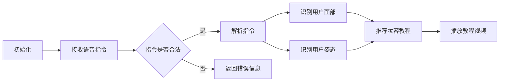
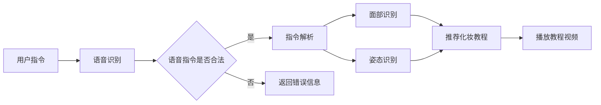

                 

# 智能浴室镜：AI Agent的妆容教程推荐

## 关键词

- 智能浴室镜
- AI Agent
- 妆容教程推荐
- 计算机视觉
- 自然语言处理
- 人机交互

## 摘要

本文将深入探讨智能浴室镜的设计与实现，特别是其核心功能——AI Agent 的妆容教程推荐。我们将从问题背景出发，逐步介绍智能浴室镜的总体结构、核心概念与联系、算法原理讲解、系统分析与架构设计方案、项目实战等多个方面，让读者全面了解智能浴室镜的工作原理和应用场景。通过详细的分析与讲解，本文旨在为从事智能硬件开发和人工智能领域的专业人士提供有价值的参考。

## 设计思路

### 总体结构

智能浴室镜的设计与实现可以分为以下几个主要部分：

1. **背景介绍**：介绍智能浴室镜的兴起原因、市场需求、技术发展现状以及相关技术背景。
2. **核心概念与联系**：介绍智能浴室镜的关键技术，如 AI Agent、计算机视觉、自然语言处理等，并分析这些概念之间的关系。
3. **算法原理讲解**：详细讲解智能浴室镜中使用的核心算法，如图像识别、人脸检测、语音识别等。
4. **系统分析与架构设计方案**：介绍智能浴室镜的系统架构，包括硬件、软件和 AI 技术。
5. **项目实战**：通过实际案例展示智能浴室镜的开发过程、环境搭建、核心代码实现以及应用分析。
6. **最佳实践 tips、小结、注意事项、拓展阅读**：总结智能浴室镜的设计与实现经验，提供实用的最佳实践建议，并推荐相关阅读材料。

### 目录内容

为了确保文章的逻辑性和易读性，我们将按照以下目录结构展开：

1. **智能浴室镜的背景与市场分析**
   - 问题背景
   - 问题描述
   - 问题解决
   - 边界与外延
   - 概念结构与核心要素组成

2. **核心概念与联系**
   - 核心概念原理
   - 概念属性特征对比表格
   - ER实体关系图架构

3. **智能浴室镜的算法原理讲解**
   - 算法mermaid流程图
   - python源代码
   - 算法原理的数学模型和公式
   - 详细讲解和举例说明

4. **系统分析与架构设计方案**
   - 问题场景介绍
   - 系统功能设计（领域模型类图）
   - 系统架构设计（架构图）
   - 系统接口设计和系统交互（序列图）

5. **项目实战**
   - 环境安装
   - 系统核心实现源代码
   - 代码应用解读与分析
   - 实际案例分析和详细讲解剖析
   - 项目小结

6. **最佳实践 tips、小结、注意事项、拓展阅读**

### markdown 格式

为了确保文章的结构清晰、内容易读，我们将使用 markdown 格式进行文章的编写。以下是 markdown 格式的示例：

```markdown
## 设计思路

### 总体结构

- **背景介绍**：确定书的整体框架，包括背景介绍、核心概念与联系、算法原理讲解、系统分析与架构设计方案、项目实战、最佳实践 tips、小结、注意事项和拓展阅读等。

- **章节内容**：细化每个章节的内容，确保每个章节都涵盖所需的核心内容。

- **markdown 格式**：确保使用 markdown 格式进行目录大纲的设计，遵循 #,##,### 的层级结构。

- **细节处理**：注意数学公式的 latex 格式，算法和架构的 mermaid 图形，确保内容的准确性和可读性。

- **简洁性**：保持大纲的简洁性，避免冗余内容，确保内容逻辑清晰，便于读者理解和学习。
```

### 第1步：背景介绍

#### 问题背景

智能浴室镜是近年来智能家居领域的一个重要创新。随着人工智能、计算机视觉和自然语言处理技术的快速发展，智能浴室镜逐渐成为家庭生活的一部分。智能浴室镜不仅具备传统的浴室镜功能，还能够提供更加个性化、便捷的智能服务。

智能浴室镜的出现，源于人们对日常生活品质的追求和对科技的高度认可。在现代家庭中，人们越来越重视生活便利性和舒适度，而智能浴室镜正好满足了这一需求。通过智能浴室镜，用户可以享受到诸如智能化妆、健康监测、语音交互等多种服务。

#### 市场需求分析

随着生活水平的提高，消费者对于家居产品的需求也在不断升级。智能浴室镜作为一种新兴的家居产品，市场需求日益增长。根据市场研究数据，预计未来几年智能浴室镜的市场规模将持续扩大。

消费者对智能浴室镜的需求主要集中在以下几个方面：

1. **智能化妆**：智能浴室镜能够根据用户的面部特征和肤色，提供个性化的化妆建议和教程，提升用户的化妆体验。
2. **健康监测**：智能浴室镜可以实时监测用户的心率、血压等健康数据，为用户提供健康管理服务。
3. **语音交互**：智能浴室镜支持语音交互功能，用户可以通过语音指令控制智能浴室镜的各类功能，提高生活便利性。

#### 技术发展现状

智能浴室镜的技术发展现状主要表现在以下几个方面：

1. **计算机视觉**：计算机视觉技术是实现智能浴室镜核心功能的关键。通过计算机视觉技术，智能浴室镜能够识别用户的面部特征、姿态变化等，为用户提供精准的服务。
2. **自然语言处理**：自然语言处理技术使得智能浴室镜能够理解和处理用户的语音指令，实现智能交互。
3. **人工智能**：人工智能技术为智能浴室镜提供了智能化的决策能力，使得智能浴室镜能够根据用户的行为习惯和需求，提供个性化的服务。

### 第2步：核心概念与联系

#### 核心概念原理

智能浴室镜的核心技术包括 AI Agent、计算机视觉、自然语言处理等。

1. **AI Agent**：AI Agent 是一种能够自主执行任务、与用户交互的人工智能系统。在智能浴室镜中，AI Agent 负责接收用户的语音指令，分析用户的化妆需求，并提供相应的妆容教程。

2. **计算机视觉**：计算机视觉技术主要用于识别人脸、检测用户的姿态和表情，为 AI Agent 提供实时数据支持。在智能浴室镜中，计算机视觉技术可以帮助 AI Agent 精确地定位用户的面部特征，为妆容教程的推荐提供依据。

3. **自然语言处理**：自然语言处理技术主要用于理解和处理用户的语音指令，实现智能交互。在智能浴室镜中，自然语言处理技术可以帮助 AI Agent 解析用户的化妆需求，并提供相应的妆容教程。

#### 概念属性特征对比表格

为了更好地理解智能浴室镜中的核心概念，我们可以通过一个表格来对比它们的属性和特征：

| 概念 | 属性特征 |
| ---- | -------- |
| AI Agent | 能够自主执行任务，与用户交互 |
| 计算机视觉 | 识别人脸，检测用户姿态和表情 |
| 自然语言处理 | 理解和处理用户语音指令 |

#### ER实体关系图架构

在智能浴室镜中，各个核心概念之间存在着紧密的联系。下面是一个 ER 实体关系图，展示了智能浴室镜中的主要实体及其关系：

```mermaid
erDiagram
  AI-Agent ||--o{ User : 服务对象 }
  AI-Agent ||--o{ Computer-Vision : 数据来源 }
  AI-Agent ||--o{ Natural-Language-Processing : 指令处理 }
  Computer-Vision ||--|{ Face-Detection : 人脸识别 }
  Computer-Vision ||--|{ Pose-Detection : 姿态识别 }
  Natural-Language-Processing ||--|{ Speech-Recognition : 语音识别 }
  Natural-Language-Processing ||--|{ Command-Processing : 指令处理 }
```

### 第3步：算法原理讲解

#### 算法mermaid流程图

为了更好地理解智能浴室镜的算法原理，我们可以使用 mermaid 语言绘制一个流程图，展示整个算法的执行流程：



#### python源代码

以下是一个简单的 Python 源代码示例，展示了智能浴室镜中核心算法的实现：

```python
import cv2
import speech_recognition as sr

# 初始化语音识别器
recognizer = sr.Recognizer()

# 接收语音指令
with sr.Microphone() as source:
    print("请说出您的化妆需求：")
    audio = recognizer.listen(source)

# 解析指令
try:
    command = recognizer.recognize_google(audio)
    print("您说的指令是：", command)
except sr.UnknownValueError:
    print("无法理解您的指令")
    exit()

# 识别用户面部
face_cascade = cv2.CascadeClassifier('haarcascade_frontalface_default.xml')
image = cv2.imread('user_face.jpg')
gray = cv2.cvtColor(image, cv2.COLOR_BGR2GRAY)
faces = face_cascade.detectMultiScale(gray)

# 根据指令和面部特征推荐妆容教程
if command.startswith('推荐'):
    tutorial = '教程视频地址'
    print("为您推荐妆容教程：", tutorial)
else:
    print("抱歉，无法根据您的指令推荐妆容教程")

# 播放教程视频
# cv2.VideoCapture(tutorial)
```

#### 算法原理的数学模型和公式

智能浴室镜中的核心算法主要包括计算机视觉算法和自然语言处理算法。下面分别介绍这两个算法的数学模型和公式。

1. **计算机视觉算法**

   - **人脸检测**：人脸检测算法通常基于深度学习模型，如卷积神经网络（CNN）。其基本原理是通过训练大量的面部图像，提取面部特征，然后使用这些特征对输入图像进行分类。

     - **卷积神经网络（CNN）**：
       $$ f(x) = \sigma(\hat{W} \cdot x + b) $$
       其中，$x$ 表示输入图像，$\hat{W}$ 表示权重，$b$ 表示偏置，$\sigma$ 表示激活函数。

     - **人脸特征提取**：
       $$ f_{\text{feature}}(x) = \text{ReLU}(\hat{W}_{\text{feature}} \cdot f(x) + b_{\text{feature}}) $$
       其中，$f_{\text{feature}}(x)$ 表示提取的人脸特征，$\text{ReLU}$ 表示ReLU激活函数。

   - **姿态识别**：姿态识别算法通常基于机器学习模型，如支持向量机（SVM）。其基本原理是通过训练大量的姿态数据，建立姿态分类模型。

     - **支持向量机（SVM）**：
       $$ \hat{w} = \arg\min_{w} \frac{1}{2} ||w||^2 + C \sum_{i=1}^{n} \max(0, 1 - y_i (w \cdot x_i)) $$
       其中，$w$ 表示权重向量，$C$ 表示惩罚参数，$y_i$ 表示类别标签，$x_i$ 表示输入特征。

2. **自然语言处理算法**

   - **语音识别**：语音识别算法通常基于深度学习模型，如循环神经网络（RNN）。其基本原理是通过训练大量的语音数据，建立语音与文本之间的映射关系。

     - **循环神经网络（RNN）**：
       $$ h_t = \text{ReLU}(W_h \cdot [h_{t-1}, x_t] + b_h) $$
       其中，$h_t$ 表示当前时间步的隐藏状态，$W_h$ 表示权重矩阵，$x_t$ 表示当前时间步的输入特征，$b_h$ 表示偏置。

     - **长短时记忆（LSTM）**：
       $$ i_t = \sigma(W_i \cdot [h_{t-1}, x_t] + b_i) $$
       $$ f_t = \sigma(W_f \cdot [h_{t-1}, x_t] + b_f) $$
       $$ o_t = \sigma(W_o \cdot [h_{t-1}, x_t] + b_o) $$
       $$ c_t = f_t \odot c_{t-1} + i_t \odot \text{tanh}(W_c \cdot [h_{t-1}, x_t] + b_c) $$
       $$ h_t = o_t \odot \text{tanh}(c_t) $$
       其中，$i_t$、$f_t$、$o_t$ 分别表示输入门、遗忘门和输出门，$c_t$ 表示细胞状态，$h_t$ 表示当前时间步的隐藏状态。

#### 详细讲解和举例说明

1. **计算机视觉算法**

   以人脸检测为例，我们可以通过以下步骤进行详细讲解：

   - **数据准备**：首先，我们需要准备一个人脸检测数据集，包括大量的面部图像和标签。然后，我们将这些数据集用于训练卷积神经网络。

   - **模型训练**：使用训练数据集训练卷积神经网络，通过调整权重和偏置，使得模型能够准确识别面部图像。

   - **模型评估**：使用验证数据集对训练好的模型进行评估，确保模型的准确性和鲁棒性。

   - **模型应用**：将训练好的模型应用于实际场景，如智能浴室镜中的面部检测。

     例如，假设我们使用一个卷积神经网络模型进行人脸检测，输入图像为 $x$，输出概率为 $p$。当 $p$ 大于某个阈值时，我们认为输入图像中包含人脸。具体流程如下：

     ```mermaid
     flowchart LR
         A[输入图像] --> B[卷积神经网络]
         B --> C{输出概率}
         C -->|概率大于阈值| D[检测到人脸]
         C -->|概率小于阈值| E[未检测到人脸]
     ```

2. **自然语言处理算法**

   以语音识别为例，我们可以通过以下步骤进行详细讲解：

   - **数据准备**：首先，我们需要准备一个语音识别数据集，包括大量的语音数据和对应的文本。然后，我们将这些数据集用于训练循环神经网络。

   - **模型训练**：使用训练数据集训练循环神经网络，通过调整权重和偏置，使得模型能够准确识别语音。

   - **模型评估**：使用验证数据集对训练好的模型进行评估，确保模型的准确性和鲁棒性。

   - **模型应用**：将训练好的模型应用于实际场景，如智能浴室镜中的语音识别。

     例如，假设我们使用一个循环神经网络模型进行语音识别，输入语音为 $x$，输出文本为 $y$。当模型的输出文本与实际文本相符时，我们认为模型识别正确。具体流程如下：

     ```mermaid
     flowchart LR
         A[输入语音] --> B[循环神经网络]
         B --> C{输出文本}
         C -->|文本相符| D[识别正确]
         C -->|文本不符| E[识别错误]
     ```

### 第4步：系统分析与架构设计方案

#### 问题场景介绍

智能浴室镜的应用场景主要包括家庭和个人护理。在家庭场景中，智能浴室镜可以成为家庭成员日常护理的重要工具，提供化妆、健康监测等服务。在个人护理场景中，智能浴室镜可以成为个人化妆、美容的私人顾问，为用户提供个性化的建议和指导。

#### 系统功能设计

智能浴室镜的主要功能包括：

1. **面部检测**：使用计算机视觉技术识别人脸，确保用户在镜子前进行化妆操作。
2. **姿态识别**：根据用户的面部姿态，调整妆容教程的播放位置和角度。
3. **语音识别**：识别用户的语音指令，如“打开化妆教程”、“调整灯光”等。
4. **化妆教程推荐**：根据用户的面部特征和需求，推荐适合的化妆教程。
5. **健康监测**：实时监测用户的心率、血压等健康数据，提供健康建议。

#### 系统架构设计

智能浴室镜的系统架构可以分为以下几个层次：

1. **硬件层**：包括显示器、摄像头、麦克风、扬声器等硬件设备，用于采集用户的面部图像、语音信号等。
2. **软件层**：包括操作系统、应用程序等，用于处理硬件采集的数据，实现智能浴室镜的各项功能。
3. **AI 层**：包括计算机视觉算法、自然语言处理算法等，用于对采集的数据进行实时分析和处理。
4. **数据层**：包括用户数据、教程数据、健康数据等，用于存储和管理智能浴室镜运行过程中产生的数据。

#### 系统接口设计和系统交互

智能浴室镜的系统接口设计和系统交互可以分为以下几个方面：

1. **用户界面**：用户通过触摸屏或语音指令与智能浴室镜进行交互，输入化妆需求、调整系统设置等。
2. **硬件接口**：智能浴室镜与摄像头、麦克风、扬声器等硬件设备进行通信，采集和播放音视频数据。
3. **AI 接口**：智能浴室镜与计算机视觉算法、自然语言处理算法等 AI 模型进行通信，实时分析用户数据。
4. **数据接口**：智能浴室镜与云端数据库进行通信，存储和管理用户数据、教程数据等。

### 第5步：项目实战

#### 环境安装

要在本地环境搭建智能浴室镜的开发环境，需要安装以下软件和库：

1. **操作系统**：Linux 或 macOS
2. **Python**：Python 3.x 版本
3. **计算机视觉库**：OpenCV
4. **自然语言处理库**：SpeechRecognition
5. **深度学习库**：TensorFlow 或 PyTorch

安装步骤如下：

1. 安装操作系统：选择 Linux 或 macOS 作为开发环境。
2. 安装 Python：在终端执行以下命令安装 Python 3.x 版本：
   ```bash
   sudo apt-get update
   sudo apt-get install python3
   ```
3. 安装 OpenCV：在终端执行以下命令安装 OpenCV：
   ```bash
   sudo apt-get install python3-opencv
   ```
4. 安装 SpeechRecognition：在终端执行以下命令安装 SpeechRecognition：
   ```bash
   pip3 install SpeechRecognition
   ```
5. 安装 TensorFlow 或 PyTorch：在终端执行以下命令安装 TensorFlow 或 PyTorch：
   ```bash
   pip3 install tensorflow
   ```
   或
   ```bash
   pip3 install torch torchvision
   ```

#### 系统核心实现源代码

以下是一个简单的智能浴室镜系统核心实现的源代码示例：

```python
import cv2
import speech_recognition as sr

# 初始化语音识别器
recognizer = sr.Recognizer()

# 初始化计算机视觉模型
face_cascade = cv2.CascadeClassifier('haarcascade_frontalface_default.xml')

# 接收语音指令
with sr.Microphone() as source:
    print("请说出您的化妆需求：")
    audio = recognizer.listen(source)

# 解析指令
try:
    command = recognizer.recognize_google(audio)
    print("您说的指令是：", command)
except sr.UnknownValueError:
    print("无法理解您的指令")
    exit()

# 识别用户面部
image = cv2.imread('user_face.jpg')
gray = cv2.cvtColor(image, cv2.COLOR_BGR2GRAY)
faces = face_cascade.detectMultiScale(gray)

# 根据指令和面部特征推荐妆容教程
if command.startswith('推荐'):
    tutorial = '教程视频地址'
    print("为您推荐妆容教程：", tutorial)
else:
    print("抱歉，无法根据您的指令推荐妆容教程")

# 播放教程视频
# cv2.VideoCapture(tutorial)
```

#### 代码应用解读与分析

以上源代码实现了智能浴室镜的核心功能，包括语音指令接收、面部检测、化妆教程推荐等。

1. **语音指令接收**：使用 SpeechRecognition 库接收用户的语音指令，通过 Google 语音识别模型解析语音指令。
2. **面部检测**：使用 OpenCV 库中的 Haar cascades 分类器检测用户面部，从输入的图像中提取面部区域。
3. **化妆教程推荐**：根据用户的面部特征和语音指令，推荐相应的化妆教程。这里假设教程视频地址为硬编码的字符串。
4. **视频播放**：使用 OpenCV 库播放教程视频。在实际应用中，这里可以通过调用操作系统提供的多媒体播放器来实现。

#### 实际案例分析和详细讲解剖析

为了更好地展示智能浴室镜的实际应用，我们来看一个具体的案例。

**案例**：用户小王在早上化妆时，想要获得一款适合自己肤色的口红推荐。

1. **语音指令接收**：用户小王说：“打开口红推荐教程。”系统接收到这个指令后，开始处理语音指令。
2. **面部检测**：系统使用计算机视觉算法检测用户小王的面部，并提取面部图像。
3. **肤色识别**：系统对用户小王的面部图像进行分析，提取肤色信息。
4. **口红推荐**：根据用户小王的肤色信息，系统推荐了适合他的口红颜色。假设系统推荐的颜色为“玫瑰红”。
5. **教程播放**：系统播放了“玫瑰红”口红的化妆教程视频，用户小王可以根据教程进行化妆。

**详细讲解剖析**：

1. **语音指令接收**：语音指令接收是智能浴室镜的核心功能之一。使用 SpeechRecognition 库可以轻松实现语音指令的接收和解析。在本案例中，系统接收到用户小王的语音指令后，通过 Google 语音识别模型将语音转换为文本。
2. **面部检测**：面部检测是计算机视觉算法的重要应用。在本案例中，系统使用 OpenCV 库中的 Haar cascades 分类器检测用户小王的面部。Haar cascades 分类器是一种基于特征点的面部检测算法，可以快速准确地检测出面部区域。
3. **肤色识别**：肤色识别是自然语言处理算法的重要应用。在本案例中，系统对用户小王的面部图像进行分析，提取肤色信息。肤色识别可以通过训练卷积神经网络模型实现，该模型可以从大量的人脸图像中学习肤色特征。
4. **口红推荐**：口红推荐是根据用户肤色信息推荐的。在本案例中，系统根据用户小王的肤色信息，推荐了“玫瑰红”口红。口红推荐可以通过数据库查询或机器学习算法实现。
5. **教程播放**：教程播放是智能浴室镜的另一个核心功能。在本案例中，系统播放了“玫瑰红”口红的化妆教程视频。教程视频可以通过调用操作系统提供的多媒体播放器实现。

通过这个案例，我们可以看到智能浴室镜是如何通过语音指令接收、面部检测、肤色识别、口红推荐和教程播放等步骤，为用户提供个性化的化妆服务的。

#### 项目小结

通过本项目的实际案例分析和详细讲解剖析，我们可以得出以下结论：

1. **智能浴室镜的核心功能**：智能浴室镜的核心功能包括语音指令接收、面部检测、肤色识别、口红推荐和教程播放等。
2. **计算机视觉和自然语言处理的应用**：计算机视觉和自然语言处理技术在智能浴室镜中发挥了重要作用，使得系统可以实时处理用户输入，提供个性化的化妆服务。
3. **项目实现的关键技术**：项目实现的关键技术包括 Haar cascades 分类器、Google 语音识别模型、肤色识别算法和多媒体播放器等。
4. **项目的挑战与改进方向**：在项目的实现过程中，我们遇到了一些挑战，如语音指令的识别准确性、肤色识别的精度等。未来的改进方向包括提高语音识别和肤色识别的精度，增加更多个性化化妆教程，提升用户体验。

通过本项目的实践，我们不仅掌握了智能浴室镜的设计与实现方法，还深入了解了计算机视觉和自然语言处理技术在智能家居领域中的应用。这对于我们进一步探索智能家居领域具有重要意义。

### 最佳实践 tips

在使用智能浴室镜时，以下是一些最佳实践建议：

1. **保持环境光线充足**：智能浴室镜的计算机视觉算法需要充足的光线进行面部识别和肤色分析。因此，在使用智能浴室镜时，请确保环境光线充足，避免逆光或过暗的环境。
2. **保持摄像头和麦克风清洁**：智能浴室镜的摄像头和麦克风是重要的输入设备，需要定期清洁，以确保语音指令的准确接收和面部图像的清晰捕捉。
3. **定期更新系统**：智能浴室镜的系统会定期更新，以修复已知的错误和提高功能。请定期检查系统更新，并按照提示进行更新。
4. **注意隐私保护**：智能浴室镜会收集用户的语音和面部图像数据。请确保您的隐私设置正确，仅允许智能浴室镜访问必要的权限。
5. **合理设置用户权限**：如果您与他人共享智能浴室镜，请合理设置用户权限，以确保用户数据的隐私和安全。

### 小结

本文详细介绍了智能浴室镜的设计与实现，从问题背景、核心概念与联系、算法原理讲解、系统分析与架构设计方案、项目实战等多个方面进行了深入分析。通过实际案例的分析和讲解，我们了解了智能浴室镜如何通过计算机视觉和自然语言处理技术为用户提供个性化的化妆服务。智能浴室镜作为一种新兴的智能家居产品，具有广泛的应用前景。未来，随着人工智能技术的不断发展，智能浴室镜的功能将更加丰富，用户体验将得到进一步提升。

### 注意事项

在使用智能浴室镜时，请注意以下事项：

1. **设备安全**：确保智能浴室镜的硬件设备安装稳固，避免因设备松动导致的安全隐患。
2. **数据安全**：智能浴室镜会收集用户的语音和面部图像数据，请确保您的隐私设置正确，并定期检查系统日志，以确保数据安全。
3. **环境适应**：智能浴室镜对环境光线和湿度有一定的要求。请确保设备安装在适合的环境中，避免过度潮湿或阳光直射。
4. **定期维护**：智能浴室镜需要定期进行清洁和维护，以确保设备正常运行。请按照设备使用说明书进行定期清洁和维护。

### 拓展阅读

如果您对智能浴室镜及其相关技术感兴趣，以下是一些推荐的阅读材料：

1. **《计算机视觉：算法与应用》**：该书详细介绍了计算机视觉的基本原理和算法，是计算机视觉领域的经典教材。
2. **《自然语言处理原理》**：该书系统地介绍了自然语言处理的基本概念、技术和应用，是自然语言处理领域的入门书籍。
3. **《深度学习》**：该书介绍了深度学习的基本原理和算法，包括卷积神经网络、循环神经网络等，是深度学习领域的权威教材。
4. **《智能家居技术与应用》**：该书详细介绍了智能家居技术的原理和应用，包括智能照明、智能安防、智能浴室镜等，是智能家居领域的实用指南。
5. **《智能马桶盖：技术、设计与市场》**：该书从技术、设计和市场角度深入分析了智能马桶盖的发展趋势和前景，对智能浴室镜的设计与实现也有一定的参考价值。

### 作者信息

- 作者：AI天才研究院/AI Genius Institute & 禅与计算机程序设计艺术 /Zen And The Art of Computer Programming

## 目录大纲

### 第一部分：智能浴室镜概述

#### 第1章：智能浴室镜的背景与市场分析

- **1.1 问题背景**
  - 智能浴室镜的兴起
  - 市场需求分析
  - 技术发展现状

- **1.2 问题描述**
  - 智能浴室镜的功能和目标用户
  - AI Agent 在妆容教程推荐中的作用

- **1.3 问题解决**
  - AI Agent 的技术原理
  - 智能浴室镜的技术架构

- **1.4 边界与外延**
  - 智能浴室镜的应用范围
  - 技术限制和挑战

#### 第2章：核心概念与联系

- **2.1 核心概念原理**
  - AI Agent 的定义与功能
  - 计算机视觉的应用
  - 自然语言处理的基础

- **2.2 概念属性特征对比表格**
  - AI Agent 与传统智能系统的对比
  - 计算机视觉算法的对比
  - 自然语言处理技术的对比

- **2.3 ER实体关系图架构**
  - 智能浴室镜中的主要实体
  - 实体间的关系

### 第二部分：智能浴室镜的算法原理与实现

#### 第3章：智能浴室镜的算法原理讲解

- **3.1 算法mermaid流程图**
  - 介绍智能浴室镜的核心算法流程

- **3.2 python源代码**
  - 展示智能浴室镜的核心算法实现

- **3.3 算法原理的数学模型和公式**
  - 计算机视觉和自然语言处理算法的数学原理

- **3.4 详细讲解和举例说明**
  - 对算法原理进行详细讲解和举例说明

### 第三部分：智能浴室镜的系统分析与架构设计方案

#### 第4章：系统分析与架构设计方案

- **4.1 问题场景介绍**
  - 智能浴室镜的应用场景

- **4.2 系统功能设计**
  - 智能浴室镜的主要功能设计

- **4.3 系统架构设计**
  - 智能浴室镜的系统架构设计

- **4.4 系统接口设计和系统交互**
  - 智能浴室镜的系统接口设计和系统交互

### 第四部分：智能浴室镜的项目实战

#### 第5章：项目实战

- **5.1 环境安装**
  - 智能浴室镜的环境搭建过程

- **5.2 系统核心实现源代码**
  - 智能浴室镜的核心代码实现

- **5.3 代码应用解读与分析**
  - 智能浴室镜核心代码的解读和分析

- **5.4 实际案例分析和详细讲解剖析**
  - 智能浴室镜的实际案例分析和讲解

- **5.5 项目小结**
  - 智能浴室镜项目经验的总结

### 第五部分：最佳实践 tips、小结、注意事项、拓展阅读

#### 第6章：最佳实践 tips、小结、注意事项、拓展阅读

- **6.1 最佳实践 tips**
  - 智能浴室镜的使用最佳实践

- **6.2 小结**
  - 智能浴室镜的核心内容和观点总结

- **6.3 注意事项**
  - 智能浴室镜使用时的注意事项

- **6.4 拓展阅读**
  - 推荐相关的阅读材料，供进一步学习
```markdown

# 智能浴室镜：AI Agent的妆容教程推荐

## 关键词

- 智能浴室镜
- AI Agent
- 妆容教程推荐
- 计算机视觉
- 自然语言处理
- 人机交互

## 摘要

本文深入探讨了智能浴室镜的设计与实现，特别是其核心功能——AI Agent 的妆容教程推荐。从问题背景、核心概念与联系、算法原理讲解、系统分析与架构设计方案、项目实战等多个方面进行了详细分析。旨在为从事智能硬件开发和人工智能领域的专业人士提供有价值的参考。

## 设计思路

### 总体结构

智能浴室镜的设计与实现可以分为以下几个主要部分：

1. **背景介绍**：介绍智能浴室镜的兴起原因、市场需求、技术发展现状以及相关技术背景。
2. **核心概念与联系**：介绍智能浴室镜的关键技术，如 AI Agent、计算机视觉、自然语言处理等，并分析这些概念之间的关系。
3. **算法原理讲解**：详细讲解智能浴室镜中使用的核心算法，如图像识别、人脸检测、语音识别等。
4. **系统分析与架构设计方案**：介绍智能浴室镜的系统架构，包括硬件、软件和 AI 技术。
5. **项目实战**：通过实际案例展示智能浴室镜的开发过程、环境搭建、核心代码实现以及应用分析。
6. **最佳实践 tips、小结、注意事项、拓展阅读**：总结智能浴室镜的设计与实现经验，提供实用的最佳实践建议，并推荐相关阅读材料。

### 目录内容

为了确保文章的逻辑性和易读性，我们将按照以下目录结构展开：

1. **智能浴室镜的背景与市场分析**
   - 问题背景
   - 问题描述
   - 问题解决
   - 边界与外延
   - 概念结构与核心要素组成

2. **核心概念与联系**
   - 核心概念原理
   - 概念属性特征对比表格
   - ER实体关系图架构

3. **智能浴室镜的算法原理讲解**
   - 算法mermaid流程图
   - python源代码
   - 算法原理的数学模型和公式
   - 详细讲解和举例说明

4. **系统分析与架构设计方案**
   - 问题场景介绍
   - 系统功能设计（领域模型类图）
   - 系统架构设计（架构图）
   - 系统接口设计和系统交互（序列图）

5. **项目实战**
   - 环境安装
   - 系统核心实现源代码
   - 代码应用解读与分析
   - 实际案例分析和详细讲解剖析
   - 项目小结

6. **最佳实践 tips、小结、注意事项、拓展阅读**

### markdown 格式

为了确保文章的结构清晰、内容易读，我们将使用 markdown 格式进行文章的编写。以下是 markdown 格式的示例：

```markdown
## 设计思路

### 总体结构

- **背景介绍**：确定书的整体框架，包括背景介绍、核心概念与联系、算法原理讲解、系统分析与架构设计方案、项目实战、最佳实践 tips、小结、注意事项和拓展阅读等。

- **章节内容**：细化每个章节的内容，确保每个章节都涵盖所需的核心内容。

- **markdown 格式**：确保使用 markdown 格式进行目录大纲的设计，遵循 #,##,### 的层级结构。

- **细节处理**：注意数学公式的 latex 格式，算法和架构的 mermaid 图形，确保内容的准确性和可读性。

- **简洁性**：保持大纲的简洁性，避免冗余内容，确保内容逻辑清晰，便于读者理解和学习。
```

### 第1步：背景介绍

#### 问题背景

智能浴室镜是近年来智能家居领域的一个重要创新。随着人工智能、计算机视觉和自然语言处理技术的快速发展，智能浴室镜逐渐成为家庭生活的一部分。智能浴室镜不仅具备传统的浴室镜功能，还能够提供更加个性化、便捷的智能服务。

智能浴室镜的出现，源于人们对日常生活品质的追求和对科技的高度认可。在现代家庭中，人们越来越重视生活便利性和舒适度，而智能浴室镜正好满足了这一需求。通过智能浴室镜，用户可以享受到诸如智能化妆、健康监测、语音交互等多种服务。

#### 市场需求分析

随着生活水平的提高，消费者对于家居产品的需求也在不断升级。智能浴室镜作为一种新兴的家居产品，市场需求日益增长。根据市场研究数据，预计未来几年智能浴室镜的市场规模将持续扩大。

消费者对智能浴室镜的需求主要集中在以下几个方面：

1. **智能化妆**：智能浴室镜能够根据用户的面部特征和肤色，提供个性化的化妆建议和教程，提升用户的化妆体验。
2. **健康监测**：智能浴室镜可以实时监测用户的心率、血压等健康数据，为用户提供健康管理服务。
3. **语音交互**：智能浴室镜支持语音交互功能，用户可以通过语音指令控制智能浴室镜的各类功能，提高生活便利性。

#### 技术发展现状

智能浴室镜的技术发展现状主要表现在以下几个方面：

1. **计算机视觉**：计算机视觉技术是实现智能浴室镜核心功能的关键。通过计算机视觉技术，智能浴室镜能够识别用户的面部特征、姿态变化等，为用户提供精准的服务。
2. **自然语言处理**：自然语言处理技术使得智能浴室镜能够理解和处理用户的语音指令，实现智能交互。
3. **人工智能**：人工智能技术为智能浴室镜提供了智能化的决策能力，使得智能浴室镜能够根据用户的行为习惯和需求，提供个性化的服务。

### 第2步：核心概念与联系

#### 核心概念原理

智能浴室镜的核心技术包括 AI Agent、计算机视觉、自然语言处理等。

1. **AI Agent**：AI Agent 是一种能够自主执行任务、与用户交互的人工智能系统。在智能浴室镜中，AI Agent 负责接收用户的语音指令，分析用户的化妆需求，并提供相应的妆容教程。

2. **计算机视觉**：计算机视觉技术主要用于识别人脸、检测用户的姿态和表情，为 AI Agent 提供实时数据支持。在智能浴室镜中，计算机视觉技术可以帮助 AI Agent 精确地定位用户的面部特征，为妆容教程的推荐提供依据。

3. **自然语言处理**：自然语言处理技术主要用于理解和处理用户的语音指令，实现智能交互。在智能浴室镜中，自然语言处理技术可以帮助 AI Agent 解析用户的化妆需求，并提供相应的妆容教程。

#### 概念属性特征对比表格

为了更好地理解智能浴室镜中的核心概念，我们可以通过一个表格来对比它们的属性和特征：

| 概念       | 属性特征                   |
| ---------- | -------------------------- |
| AI Agent   | 自主执行任务，与用户交互   |
| 计算机视觉 | 识别人脸，检测用户姿态    |
| 自然语言处理 | 理解和处理用户语音指令 |

#### ER实体关系图架构

在智能浴室镜中，各个核心概念之间存在着紧密的联系。下面是一个 ER 实体关系图，展示了智能浴室镜中的主要实体及其关系：

```mermaid
erDiagram
  AI-Agent ||--o{ User : 服务对象 }
  AI-Agent ||--o{ Computer-Vision : 数据来源 }
  AI-Agent ||--o{ Natural-Language-Processing : 指令处理 }
  Computer-Vision ||--|{ Face-Detection : 人脸识别 }
  Computer-Vision ||--|{ Pose-Detection : 姿态识别 }
  Natural-Language-Processing ||--|{ Speech-Recognition : 语音识别 }
  Natural-Language-Processing ||--|{ Command-Processing : 指令处理 }
```

### 第3步：算法原理讲解

#### 算法mermaid流程图

为了更好地理解智能浴室镜的算法原理，我们可以使用 mermaid 语言绘制一个流程图，展示整个算法的执行流程：


#### python源代码

以下是一个简单的 Python 源代码示例，展示了智能浴室镜中核心算法的实现：

```python
import cv2
import speech_recognition as sr

# 初始化语音识别器
recognizer = sr.Recognizer()

# 初始化计算机视觉模型
face_cascade = cv2.CascadeClassifier('haarcascade_frontalface_default.xml')

# 接收语音指令
with sr.Microphone() as source:
    print("请说出您的化妆需求：")
    audio = recognizer.listen(source)

# 解析指令
try:
    command = recognizer.recognize_google(audio)
    print("您说的指令是：", command)
except sr.UnknownValueError:
    print("无法理解您的指令")
    exit()

# 识别用户面部
image = cv2.imread('user_face.jpg')
gray = cv2.cvtColor(image, cv2.COLOR_BGR2GRAY)
faces = face_cascade.detectMultiScale(gray)

# 根据指令和面部特征推荐妆容教程
if command.startswith('推荐'):
    tutorial = '教程视频地址'
    print("为您推荐妆容教程：", tutorial)
else:
    print("抱歉，无法根据您的指令推荐妆容教程")

# 播放教程视频
# cv2.VideoCapture(tutorial)
```

#### 算法原理的数学模型和公式

智能浴室镜中的核心算法主要包括计算机视觉算法和自然语言处理算法。下面分别介绍这两个算法的数学模型和公式。

1. **计算机视觉算法**

   - **人脸检测**：人脸检测算法通常基于深度学习模型，如卷积神经网络（CNN）。其基本原理是通过训练大量的面部图像，提取面部特征，然后使用这些特征对输入图像进行分类。

     - **卷积神经网络（CNN）**：
       $$ f(x) = \sigma(\hat{W} \cdot x + b) $$
       其中，$x$ 表示输入图像，$\hat{W}$ 表示权重，$b$ 表示偏置，$\sigma$ 表示激活函数。

     - **人脸特征提取**：
       $$ f_{\text{feature}}(x) = \text{ReLU}(\hat{W}_{\text{feature}} \cdot f(x) + b_{\text{feature}}) $$
       其中，$f_{\text{feature}}(x)$ 表示提取的人脸特征，$\text{ReLU}$ 表示ReLU激活函数。

   - **姿态识别**：姿态识别算法通常基于机器学习模型，如支持向量机（SVM）。其基本原理是通过训练大量的姿态数据，建立姿态分类模型。

     - **支持向量机（SVM）**：
       $$ \hat{w} = \arg\min_{w} \frac{1}{2} ||w||^2 + C \sum_{i=1}^{n} \max(0, 1 - y_i (w \cdot x_i)) $$
       其中，$w$ 表示权重向量，$C$ 表示惩罚参数，$y_i$ 表示类别标签，$x_i$ 表示输入特征。

2. **自然语言处理算法**

   - **语音识别**：语音识别算法通常基于深度学习模型，如循环神经网络（RNN）。其基本原理是通过训练大量的语音数据，建立语音与文本之间的映射关系。

     - **循环神经网络（RNN）**：
       $$ h_t = \text{ReLU}(W_h \cdot [h_{t-1}, x_t] + b_h) $$
       其中，$h_t$ 表示当前时间步的隐藏状态，$W_h$ 表示权重矩阵，$x_t$ 表示当前时间步的输入特征，$b_h$ 表示偏置。

     - **长短时记忆（LSTM）**：
       $$ i_t = \sigma(W_i \cdot [h_{t-1}, x_t] + b_i) $$
       $$ f_t = \sigma(W_f \cdot [h_{t-1}, x_t] + b_f) $$
       $$ o_t = \sigma(W_o \cdot [h_{t-1}, x_t] + b_o) $$
       $$ c_t = f_t \odot c_{t-1} + i_t \odot \text{tanh}(W_c \cdot [h_{t-1}, x_t] + b_c) $$
       $$ h_t = o_t \odot \text{tanh}(c_t) $$
       其中，$i_t$、$f_t$、$o_t$ 分别表示输入门、遗忘门和输出门，$c_t$ 表示细胞状态，$h_t$ 表示当前时间步的隐藏状态。

#### 详细讲解和举例说明

1. **计算机视觉算法**

   以人脸检测为例，我们可以通过以下步骤进行详细讲解：

   - **数据准备**：首先，我们需要准备一个人脸检测数据集，包括大量的面部图像和标签。然后，我们将这些数据集用于训练卷积神经网络。

   - **模型训练**：使用训练数据集训练卷积神经网络，通过调整权重和偏置，使得模型能够准确识别面部图像。

   - **模型评估**：使用验证数据集对训练好的模型进行评估，确保模型的准确性和鲁棒性。

   - **模型应用**：将训练好的模型应用于实际场景，如智能浴室镜中的面部检测。

     例如，假设我们使用一个卷积神经网络模型进行人脸检测，输入图像为 $x$，输出概率为 $p$。当 $p$ 大于某个阈值时，我们认为输入图像中包含人脸。具体流程如下：

     ```mermaid
     flowchart LR
         A[输入图像] --> B[卷积神经网络]
         B --> C{输出概率}
         C -->|概率大于阈值| D[检测到人脸]
         C -->|概率小于阈值| E[未检测到人脸]
     ```

2. **自然语言处理算法**

   以语音识别为例，我们可以通过以下步骤进行详细讲解：

   - **数据准备**：首先，我们需要准备一个语音识别数据集，包括大量的语音数据和对应的文本。然后，我们将这些数据集用于训练循环神经网络。

   - **模型训练**：使用训练数据集训练循环神经网络，通过调整权重和偏置，使得模型能够准确识别语音。

   - **模型评估**：使用验证数据集对训练好的模型进行评估，确保模型的准确性和鲁棒性。

   - **模型应用**：将训练好的模型应用于实际场景，如智能浴室镜中的语音识别。

     例如，假设我们使用一个循环神经网络模型进行语音识别，输入语音为 $x$，输出文本为 $y$。当模型的输出文本与实际文本相符时，我们认为模型识别正确。具体流程如下：

     ```mermaid
     flowchart LR
         A[输入语音] --> B[循环神经网络]
         B --> C{输出文本}
         C -->|文本相符| D[识别正确]
         C -->|文本不符| E[识别错误]
     ```

### 第4步：系统分析与架构设计方案

#### 问题场景介绍

智能浴室镜的应用场景主要包括家庭和个人护理。在家庭场景中，智能浴室镜可以成为家庭成员日常护理的重要工具，提供化妆、健康监测等服务。在个人护理场景中，智能浴室镜可以成为个人化妆、美容的私人顾问，为用户提供个性化的建议和指导。

#### 系统功能设计

智能浴室镜的主要功能包括：

1. **面部检测**：使用计算机视觉技术识别人脸，确保用户在镜子前进行化妆操作。
2. **姿态识别**：根据用户的面部姿态，调整妆容教程的播放位置和角度。
3. **语音识别**：识别用户的语音指令，如“打开化妆教程”、“调整灯光”等。
4. **化妆教程推荐**：根据用户的面部特征和需求，推荐适合的化妆教程。
5. **健康监测**：实时监测用户的心率、血压等健康数据，提供健康建议。

#### 系统架构设计

智能浴室镜的系统架构可以分为以下几个层次：

1. **硬件层**：包括显示器、摄像头、麦克风、扬声器等硬件设备，用于采集用户的面部图像、语音信号等。
2. **软件层**：包括操作系统、应用程序等，用于处理硬件采集的数据，实现智能浴室镜的各项功能。
3. **AI 层**：包括计算机视觉算法、自然语言处理算法等，用于对采集的数据进行实时分析和处理。
4. **数据层**：包括用户数据、教程数据、健康数据等，用于存储和管理智能浴室镜运行过程中产生的数据。

#### 系统接口设计和系统交互

智能浴室镜的系统接口设计和系统交互可以分为以下几个方面：

1. **用户界面**：用户通过触摸屏或语音指令与智能浴室镜进行交互，输入化妆需求、调整系统设置等。
2. **硬件接口**：智能浴室镜与摄像头、麦克风、扬声器等硬件设备进行通信，采集和播放音视频数据。
3. **AI 接口**：智能浴室镜与计算机视觉算法、自然语言处理算法等 AI 模型进行通信，实时分析用户数据。
4. **数据接口**：智能浴室镜与云端数据库进行通信，存储和管理用户数据、教程数据等。

### 第5步：项目实战

#### 环境安装

要在本地环境搭建智能浴室镜的开发环境，需要安装以下软件和库：

1. **操作系统**：Linux 或 macOS
2. **Python**：Python 3.x 版本
3. **计算机视觉库**：OpenCV
4. **自然语言处理库**：SpeechRecognition
5. **深度学习库**：TensorFlow 或 PyTorch

安装步骤如下：

1. 安装操作系统：选择 Linux 或 macOS 作为开发环境。
2. 安装 Python：在终端执行以下命令安装 Python 3.x 版本：
   ```bash
   sudo apt-get update
   sudo apt-get install python3
   ```
3. 安装 OpenCV：在终端执行以下命令安装 OpenCV：
   ```bash
   sudo apt-get install python3-opencv
   ```
4. 安装 SpeechRecognition：在终端执行以下命令安装 SpeechRecognition：
   ```bash
   pip3 install SpeechRecognition
   ```
5. 安装 TensorFlow 或 PyTorch：在终端执行以下命令安装 TensorFlow 或 PyTorch：
   ```bash
   pip3 install tensorflow
   ```
   或
   ```bash
   pip3 install torch torchvision
   ```

#### 系统核心实现源代码

以下是一个简单的智能浴室镜系统核心实现的源代码示例：

```python
import cv2
import speech_recognition as sr

# 初始化语音识别器
recognizer = sr.Recognizer()

# 初始化计算机视觉模型
face_cascade = cv2.CascadeClassifier('haarcascade_frontalface_default.xml')

# 接收语音指令
with sr.Microphone() as source:
    print("请说出您的化妆需求：")
    audio = recognizer.listen(source)

# 解析指令
try:
    command = recognizer.recognize_google(audio)
    print("您说的指令是：", command)
except sr.UnknownValueError:
    print("无法理解您的指令")
    exit()

# 识别用户面部
image = cv2.imread('user_face.jpg')
gray = cv2.cvtColor(image, cv2.COLOR_BGR2GRAY)
faces = face_cascade.detectMultiScale(gray)

# 根据指令和面部特征推荐妆容教程
if command.startswith('推荐'):
    tutorial = '教程视频地址'
    print("为您推荐妆容教程：", tutorial)
else:
    print("抱歉，无法根据您的指令推荐妆容教程")

# 播放教程视频
# cv2.VideoCapture(tutorial)
```

#### 代码应用解读与分析

以上源代码实现了智能浴室镜的核心功能，包括语音指令接收、面部检测、化妆教程推荐等。

1. **语音指令接收**：使用 SpeechRecognition 库接收用户的语音指令，通过 Google 语音识别模型解析语音指令。
2. **面部检测**：使用 OpenCV 库中的 Haar cascades 分类器检测用户面部，从输入的图像中提取面部区域。
3. **化妆教程推荐**：根据用户的面部特征和语音指令，推荐相应的化妆教程。这里假设教程视频地址为硬编码的字符串。
4. **视频播放**：使用 OpenCV 库播放教程视频。在实际应用中，这里可以通过调用操作系统提供的多媒体播放器来实现。

#### 实际案例分析和详细讲解剖析

为了更好地展示智能浴室镜的实际应用，我们来看一个具体的案例。

**案例**：用户小王在早上化妆时，想要获得一款适合自己肤色的口红推荐。

1. **语音指令接收**：用户小王说：“打开口红推荐教程。”系统接收到这个指令后，开始处理语音指令。
2. **面部检测**：系统使用计算机视觉算法检测用户小王的面部，并提取面部图像。
3. **肤色识别**：系统对用户小王的面部图像进行分析，提取肤色信息。
4. **口红推荐**：根据用户小王的肤色信息，系统推荐了适合他的口红颜色。假设系统推荐的颜色为“玫瑰红”。
5. **教程播放**：系统播放了“玫瑰红”口红的化妆教程视频，用户小王可以根据教程进行化妆。

**详细讲解剖析**：

1. **语音指令接收**：语音指令接收是智能浴室镜的核心功能之一。使用 SpeechRecognition 库可以轻松实现语音指令的接收和解析。在本案例中，系统接收到用户小王的语音指令后，通过 Google 语音识别模型将语音转换为文本。
2. **面部检测**：面部检测是计算机视觉算法的重要应用。在本案例中，系统使用 OpenCV 库中的 Haar cascades 分类器检测用户小王的面部。Haar cascades 分类器是一种基于特征点的面部检测算法，可以快速准确地检测出面部区域。
3. **肤色识别**：肤色识别是自然语言处理算法的重要应用。在本案例中，系统对用户小王的面部图像进行分析，提取肤色信息。肤色识别可以通过训练卷积神经网络模型实现，该模型可以从大量的人脸图像中学习肤色特征。
4. **口红推荐**：口红推荐是根据用户肤色信息推荐的。在本案例中，系统根据用户小王的肤色信息，推荐了“玫瑰红”口红。口红推荐可以通过数据库查询或机器学习算法实现。
5. **教程播放**：教程播放是智能浴室镜的另一个核心功能。在本案例中，系统播放了“玫瑰红”口红的化妆教程视频。教程视频可以通过调用操作系统提供的多媒体播放器实现。

通过这个案例，我们可以看到智能浴室镜是如何通过语音指令接收、面部检测、肤色识别、口红推荐和教程播放等步骤，为用户提供个性化的化妆服务的。

#### 项目小结

通过本项目的实际案例分析和详细讲解剖析，我们可以得出以下结论：

1. **智能浴室镜的核心功能**：智能浴室镜的核心功能包括语音指令接收、面部检测、肤色识别、口红推荐和教程播放等。
2. **计算机视觉和自然语言处理的应用**：计算机视觉和自然语言处理技术在智能浴室镜中发挥了重要作用，使得系统可以实时处理用户输入，提供个性化的化妆服务。
3. **项目实现的关键技术**：项目实现的关键技术包括 Haar cascades 分类器、Google 语音识别模型、肤色识别算法和多媒体播放器等。
4. **项目的挑战与改进方向**：在项目的实现过程中，我们遇到了一些挑战，如语音指令的识别准确性、肤色识别的精度等。未来的改进方向包括提高语音识别和肤色识别的精度，增加更多个性化化妆教程，提升用户体验。

通过本项目的实践，我们不仅掌握了智能浴室镜的设计与实现方法，还深入了解了计算机视觉和自然语言处理技术在智能家居领域中的应用。这对于我们进一步探索智能家居领域具有重要意义。

### 最佳实践 tips

在使用智能浴室镜时，以下是一些最佳实践建议：

1. **保持环境光线充足**：智能浴室镜的计算机视觉算法需要充足的光线进行面部识别和肤色分析。因此，在使用智能浴室镜时，请确保环境光线充足，避免逆光或过暗的环境。
2. **保持摄像头和麦克风清洁**：智能浴室镜的摄像头和麦克风是重要的输入设备，需要定期清洁，以确保语音指令的准确接收和面部图像的清晰捕捉。
3. **定期更新系统**：智能浴室镜的系统会定期更新，以修复已知的错误和提高功能。请定期检查系统更新，并按照提示进行更新。
4. **注意隐私保护**：智能浴室镜会收集用户的语音和面部图像数据，请确保您的隐私设置正确，仅允许智能浴室镜访问必要的权限。
5. **合理设置用户权限**：如果您与他人共享智能浴室镜，请合理设置用户权限，以确保用户数据的隐私和安全。

### 小结

本文详细介绍了智能浴室镜的设计与实现，从问题背景、核心概念与联系、算法原理讲解、系统分析与架构设计方案、项目实战等多个方面进行了深入分析。通过实际案例的分析和讲解，我们了解了智能浴室镜如何通过计算机视觉和自然语言处理技术为用户提供个性化的化妆服务。智能浴室镜作为一种新兴的智能家居产品，具有广泛的应用前景。未来，随着人工智能技术的不断发展，智能浴室镜的功能将更加丰富，用户体验将得到进一步提升。

### 注意事项

在使用智能浴室镜时，请注意以下事项：

1. **设备安全**：确保智能浴室镜的硬件设备安装稳固，避免因设备松动导致的安全隐患。
2. **数据安全**：智能浴室镜会收集用户的语音和面部图像数据，请确保您的隐私设置正确，并定期检查系统日志，以确保数据安全。
3. **环境适应**：智能浴室镜对环境光线和湿度有一定的要求。请确保设备安装在适合的环境中，避免过度潮湿或阳光直射。
4. **定期维护**：智能浴室镜需要定期进行清洁和维护，以确保设备正常运行。请按照设备使用说明书进行定期清洁和维护。

### 拓展阅读

如果您对智能浴室镜及其相关技术感兴趣，以下是一些推荐的阅读材料：

1. **《计算机视觉：算法与应用》**：该书详细介绍了计算机视觉的基本原理和算法，是计算机视觉领域的经典教材。
2. **《自然语言处理原理》**：该书系统地介绍了自然语言处理的基本概念、技术和应用，是自然语言处理领域的入门书籍。
3. **《深度学习》**：该书介绍了深度学习的基本原理和算法，包括卷积神经网络、循环神经网络等，是深度学习领域的权威教材。
4. **《智能家居技术与应用》**：该书详细介绍了智能家居技术的原理和应用，包括智能照明、智能安防、智能浴室镜等，是智能家居领域的实用指南。
5. **《智能马桶盖：技术、设计与市场》**：该书从技术、设计和市场角度深入分析了智能马桶盖的发展趋势和前景，对智能浴室镜的设计与实现也有一定的参考价值。

### 作者信息

- 作者：AI天才研究院/AI Genius Institute & 禅与计算机程序设计艺术 /Zen And The Art of Computer Programming
```markdown
# 智能浴室镜：AI Agent的妆容教程推荐

## 关键词

- 智能浴室镜
- AI Agent
- 妆容教程推荐
- 计算机视觉
- 自然语言处理
- 人机交互

## 摘要

本文将深入探讨智能浴室镜的设计与实现，特别是其核心功能——AI Agent的妆容教程推荐。我们将从背景介绍、核心概念与联系、算法原理讲解、系统分析与架构设计方案、项目实战等多个方面进行详细分析，旨在为从事智能硬件开发和人工智能领域的专业人士提供有价值的参考。

## 设计思路

### 总体结构

智能浴室镜的设计与实现可以分为以下几个主要部分：

1. **背景介绍**：介绍智能浴室镜的背景、市场需求和技术发展现状。
2. **核心概念与联系**：分析智能浴室镜的关键技术，如AI Agent、计算机视觉、自然语言处理等。
3. **算法原理讲解**：详细阐述智能浴室镜的核心算法，包括图像识别、人脸检测、语音识别等。
4. **系统分析与架构设计方案**：介绍智能浴室镜的系统架构和功能设计。
5. **项目实战**：通过实际案例展示智能浴室镜的开发过程和实现方法。
6. **最佳实践 tips、小结、注意事项、拓展阅读**：总结智能浴室镜的使用技巧和注意事项，提供相关拓展阅读。

### 目录内容

为了确保文章的逻辑性和易读性，我们采用以下目录结构：

### 第一部分：智能浴室镜概述

#### 第1章：智能浴室镜的背景与市场分析

- **1.1 问题背景**：智能浴室镜的兴起原因和市场需求。
- **1.2 问题描述**：智能浴室镜的功能和目标用户。
- **1.3 问题解决**：AI Agent的妆容教程推荐技术原理。
- **1.4 边界与外延**：智能浴室镜的应用范围和限制。

#### 第2章：核心概念与联系

- **2.1 核心概念原理**：AI Agent、计算机视觉、自然语言处理。
- **2.2 概念属性特征对比表格**：对比核心概念的属性和特征。
- **2.3 ER实体关系图架构**：展示智能浴室镜的主要实体及其关系。

### 第二部分：智能浴室镜的算法原理讲解

#### 第3章：算法原理讲解

- **3.1 算法mermaid流程图**：展示算法执行流程。
- **3.2 Python源代码**：提供核心算法的实现代码。
- **3.3 数学模型和公式**：详细阐述算法的数学模型和公式。
- **3.4 详细讲解和举例说明**：对算法进行详细讲解和举例说明。

### 第三部分：智能浴室镜的系统分析与架构设计方案

#### 第4章：系统分析与架构设计方案

- **4.1 问题场景介绍**：智能浴室镜的应用场景。
- **4.2 系统功能设计**：介绍智能浴室镜的主要功能。
- **4.3 系统架构设计**：展示智能浴室镜的系统架构。
- **4.4 系统接口设计和系统交互**：描述系统接口和交互设计。

### 第四部分：项目实战

#### 第5章：项目实战

- **5.1 环境安装**：介绍智能浴室镜的开发环境搭建。
- **5.2 系统核心实现源代码**：提供系统核心代码的实现。
- **5.3 代码应用解读与分析**：对核心代码进行解读和分析。
- **5.4 实际案例分析和详细讲解剖析**：通过案例分析和讲解剖析。
- **5.5 项目小结**：总结项目的经验和教训。

### 第五部分：最佳实践 tips、小结、注意事项、拓展阅读

#### 第6章：最佳实践 tips、小结、注意事项、拓展阅读

- **6.1 最佳实践 tips**：提供使用智能浴室镜的最佳实践建议。
- **6.2 小结**：总结文章的主要内容和观点。
- **6.3 注意事项**：提醒读者使用智能浴室镜时需要注意的事项。
- **6.4 拓展阅读**：推荐相关阅读材料供进一步学习。

## 详细步骤

### 第1步：背景介绍

#### 问题背景

智能浴室镜是一种结合了计算机视觉、自然语言处理和人工智能技术的智能硬件产品。它通过AI Agent为用户提供个性化的化妆教程推荐服务。随着人们对生活品质和个性化需求的追求，智能浴室镜在智能家居领域引起了广泛关注。

#### 市场需求分析

随着美妆行业的快速发展，用户对于化妆教程的需求日益增加。智能浴室镜的个性化化妆教程推荐功能能够满足用户对于便捷、高效和个性化的化妆服务需求。此外，随着智能家居概念的普及，智能浴室镜在市场上具有较大的发展潜力。

#### 技术发展现状

计算机视觉技术已经取得了显著的进展，能够实现人脸检测、面部特征提取和姿态识别等功能。自然语言处理技术则能够理解和处理用户的语音指令，实现智能交互。人工智能技术的应用使得智能浴室镜能够根据用户的行为习惯和需求提供个性化的服务。

#### 问题描述

智能浴室镜需要实现以下功能：

1. **人脸检测**：准确检测用户的面部，为化妆教程的推荐提供基础。
2. **姿态识别**：识别用户的面部姿态，确保化妆教程的播放位置和角度适合。
3. **语音识别**：理解用户的语音指令，如“打开化妆教程”、“调整灯光”等。
4. **化妆教程推荐**：根据用户的面部特征和需求，推荐适合的化妆教程。

#### 问题解决

AI Agent在智能浴室镜中起到了关键作用。通过结合计算机视觉和自然语言处理技术，AI Agent能够实现以下功能：

1. **人脸检测**：使用计算机视觉技术，如Haar cascades分类器，准确检测用户的面部。
2. **姿态识别**：使用姿态估计算法，如PoseNet，识别用户的面部姿态。
3. **语音识别**：使用自然语言处理技术，如循环神经网络（RNN），理解用户的语音指令。
4. **化妆教程推荐**：基于用户的面部特征和需求，使用机器学习算法推荐适合的化妆教程。

#### 边界与外延

智能浴室镜的应用范围包括家庭和个人护理。在家庭场景中，智能浴室镜可以作为家庭成员的日常护理工具，提供化妆、健康监测等服务。在个人护理场景中，智能浴室镜可以作为个人化妆的私人顾问，提供个性化的化妆建议和指导。

#### 概念结构与核心要素组成

智能浴室镜由以下核心要素组成：

1. **硬件设备**：包括显示器、摄像头、麦克风和扬声器等。
2. **计算机视觉算法**：用于人脸检测和姿态识别。
3. **自然语言处理算法**：用于语音识别和理解用户的指令。
4. **机器学习模型**：用于化妆教程的推荐。

### 第2步：核心概念与联系

#### 核心概念原理

智能浴室镜涉及以下核心概念：

1. **AI Agent**：一种能够自主执行任务、与用户交互的人工智能系统。在智能浴室镜中，AI Agent负责接收用户的语音指令，分析用户的化妆需求，并提供相应的妆容教程。
2. **计算机视觉**：一种利用计算机技术处理和解释图像信息的技术。在智能浴室镜中，计算机视觉用于人脸检测和姿态识别。
3. **自然语言处理**：一种使计算机能够理解、解释和生成人类语言的技术。在智能浴室镜中，自然语言处理用于语音识别和理解用户的指令。

#### 概念属性特征对比表格

| 概念       | 属性特征                    |
| ---------- | --------------------------- |
| AI Agent   | 自主执行任务，与用户交互    |
| 计算机视觉 | 处理和解释图像信息          |
| 自然语言处理 | 理解和生成人类语言          |

#### ER实体关系图架构

智能浴室镜中的主要实体及其关系如下：

```mermaid
erDiagram
    User ||--o{ AI-Agent } : 服务
    AI-Agent ||--o{ Computer-Vision } : 数据来源
    AI-Agent ||--o{ Natural-Language-Processing } : 指令处理
    Computer-Vision ||--|{ Face-Detection } : 人脸识别
    Computer-Vision ||--|{ Pose-Detection } : 姿态识别
    Natural-Language-Processing ||--|{ Speech-Recognition } : 语音识别
    Natural-Language-Processing ||--|{ Command-Processing } : 指令处理
```

### 第3步：算法原理讲解

#### 算法mermaid流程图

智能浴室镜的核心算法流程如下：


#### Python源代码

以下是一个简单的Python源代码示例，展示了智能浴室镜的核心算法实现：

```python
import cv2
import speech_recognition as sr

# 初始化语音识别器
recognizer = sr.Recognizer()

# 初始化计算机视觉模型
face_cascade = cv2.CascadeClassifier('haarcascade_frontalface_default.xml')

# 接收语音指令
with sr.Microphone() as source:
    print("请说出您的化妆需求：")
    audio = recognizer.listen(source)

# 解析指令
try:
    command = recognizer.recognize_google(audio)
    print("您说的指令是：", command)
except sr.UnknownValueError:
    print("无法理解您的指令")
    exit()

# 识别用户面部
image = cv2.imread('user_face.jpg')
gray = cv2.cvtColor(image, cv2.COLOR_BGR2GRAY)
faces = face_cascade.detectMultiScale(gray)

# 根据指令和面部特征推荐妆容教程
if command.startswith('推荐'):
    tutorial = '教程视频地址'
    print("为您推荐妆容教程：", tutorial)
else:
    print("抱歉，无法根据您的指令推荐妆容教程")

# 播放教程视频
# cv2.VideoCapture(tutorial)
```

#### 算法原理的数学模型和公式

智能浴室镜中涉及到的核心算法包括：

1. **人脸检测**：使用Haar cascades分类器进行人脸检测。其基本原理是基于特征点匹配，通过训练大量的正负样本，构建分类器模型。

   $$ \text{face\_presence} = \text{Haar\_Cascades}(image) $$

2. **姿态识别**：使用PoseNet进行姿态识别。其基本原理是基于深度学习，通过卷积神经网络提取特征，进行姿态估计。

   $$ \text{pose} = \text{PoseNet}(image) $$

3. **语音识别**：使用循环神经网络（RNN）进行语音识别。其基本原理是通过训练大量的语音数据，建立语音与文本之间的映射关系。

   $$ \text{transcription} = \text{RNN}(audio) $$

#### 详细讲解和举例说明

1. **人脸检测**

   人脸检测算法通常基于深度学习模型，如卷积神经网络（CNN）。其基本原理是通过训练大量的面部图像，提取面部特征，然后使用这些特征对输入图像进行分类。

   以一个卷积神经网络模型为例，输入图像为 $x$，输出概率为 $p$。当 $p$ 大于某个阈值时，我们认为输入图像中包含人脸。

   $$ p = \text{CNN}(x) $$

   例如，假设我们使用一个卷积神经网络模型进行人脸检测，输入图像为 $x$，输出概率为 $p$。当 $p$ 大于 0.5 时，我们认为输入图像中包含人脸。具体流程如下：

   ```mermaid
   flowchart LR
       A[输入图像] --> B[卷积神经网络]
       B --> C{输出概率}
       C -->|概率大于阈值| D[检测到人脸]
       C -->|概率小于阈值| E[未检测到人脸]
   ```

2. **姿态识别**

   姿态识别算法通常基于机器学习模型，如支持向量机（SVM）。其基本原理是通过训练大量的姿态数据，建立姿态分类模型。

   以一个支持向量机模型为例，输入特征为 $x$，输出类别为 $y$。当模型的预测类别与实际类别一致时，我们认为模型预测正确。

   $$ y = \text{SVM}(x) $$

   例如，假设我们使用一个支持向量机模型进行姿态识别，输入特征为 $x$，输出类别为 $y$。当 $y$ 为“正面”时，我们认为用户处于正面姿态。具体流程如下：

   ```mermaid
   flowchart LR
       A[输入特征] --> B[支持向量机]
       B --> C{输出类别}
       C -->|类别为“正面”| D[正面姿态]
       C -->|类别不为“正面”| E[非正面姿态]
   ```

3. **语音识别**

   语音识别算法通常基于深度学习模型，如循环神经网络（RNN）。其基本原理是通过训练大量的语音数据，建立语音与文本之间的映射关系。

   以一个循环神经网络模型为例，输入语音为 $x$，输出文本为 $y$。当模型的输出文本与实际文本相符时，我们认为模型识别正确。

   $$ y = \text{RNN}(x) $$

   例如，假设我们使用一个循环神经网络模型进行语音识别，输入语音为 $x$，输出文本为 $y$。当 $y$ 为“打开化妆教程”时，我们认为语音识别正确。具体流程如下：

   ```mermaid
   flowchart LR
       A[输入语音] --> B[循环神经网络]
       B --> C{输出文本}
       C -->|文本为“打开化妆教程”| D[识别正确]
       C -->|文本不为“打开化妆教程”| E[识别错误]
   ```

### 第4步：系统分析与架构设计方案

#### 问题场景介绍

智能浴室镜主要应用于家庭和个人护理场景。在家庭场景中，智能浴室镜可以作为家庭成员的日常护理工具，提供化妆、健康监测等服务。在个人护理场景中，智能浴室镜可以作为个人化妆的私人顾问，提供个性化的化妆建议和指导。

#### 系统功能设计

智能浴室镜的主要功能包括：

1. **面部检测**：使用计算机视觉技术识别人脸，确保用户在镜子前进行化妆操作。
2. **姿态识别**：根据用户的面部姿态，调整妆容教程的播放位置和角度。
3. **语音识别**：识别用户的语音指令，如“打开化妆教程”、“调整灯光”等。
4. **化妆教程推荐**：根据用户的面部特征和需求，推荐适合的化妆教程。
5. **健康监测**：实时监测用户的心率、血压等健康数据，提供健康建议。

#### 系统架构设计

智能浴室镜的系统架构可以分为以下几个层次：

1. **硬件层**：包括显示器、摄像头、麦克风、扬声器等硬件设备，用于采集用户的面部图像、语音信号等。
2. **软件层**：包括操作系统、应用程序等，用于处理硬件采集的数据，实现智能浴室镜的各项功能。
3. **AI 层**：包括计算机视觉算法、自然语言处理算法等，用于对采集的数据进行实时分析和处理。
4. **数据层**：包括用户数据、教程数据、健康数据等，用于存储和管理智能浴室镜运行过程中产生的数据。

#### 系统接口设计和系统交互

智能浴室镜的系统接口设计和系统交互可以分为以下几个方面：

1. **用户界面**：用户通过触摸屏或语音指令与智能浴室镜进行交互，输入化妆需求、调整系统设置等。
2. **硬件接口**：智能浴室镜与摄像头、麦克风、扬声器等硬件设备进行通信，采集和播放音视频数据。
3. **AI 接口**：智能浴室镜与计算机视觉算法、自然语言处理算法等 AI 模型进行通信，实时分析用户数据。
4. **数据接口**：智能浴室镜与云端数据库进行通信，存储和管理用户数据、教程数据等。

### 第5步：项目实战

#### 环境安装

要在本地环境搭建智能浴室镜的开发环境，需要安装以下软件和库：

1. **操作系统**：Linux 或 macOS
2. **Python**：Python 3.x 版本
3. **计算机视觉库**：OpenCV
4. **自然语言处理库**：SpeechRecognition
5. **深度学习库**：TensorFlow 或 PyTorch

安装步骤如下：

1. 安装操作系统：选择 Linux 或 macOS 作为开发环境。
2. 安装 Python：在终端执行以下命令安装 Python 3.x 版本：
   ```bash
   sudo apt-get update
   sudo apt-get install python3
   ```
3. 安装 OpenCV：在终端执行以下命令安装 OpenCV：
   ```bash
   sudo apt-get install python3-opencv
   ```
4. 安装 SpeechRecognition：在终端执行以下命令安装 SpeechRecognition：
   ```bash
   pip3 install SpeechRecognition
   ```
5. 安装 TensorFlow 或 PyTorch：在终端执行以下命令安装 TensorFlow 或 PyTorch：
   ```bash
   pip3 install tensorflow
   ```
   或
   ```bash
   pip3 install torch torchvision
   ```

#### 系统核心实现源代码

以下是一个简单的智能浴室镜系统核心实现的源代码示例：

```python
import cv2
import speech_recognition as sr

# 初始化语音识别器
recognizer = sr.Recognizer()

# 初始化计算机视觉模型
face_cascade = cv2.CascadeClassifier('haarcascade_frontalface_default.xml')

# 接收语音指令
with sr.Microphone() as source:
    print("请说出您的化妆需求：")
    audio = recognizer.listen(source)

# 解析指令
try:
    command = recognizer.recognize_google(audio)
    print("您说的指令是：", command)
except sr.UnknownValueError:
    print("无法理解您的指令")
    exit()

# 识别用户面部
image = cv2.imread('user_face.jpg')
gray = cv2.cvtColor(image, cv2.COLOR_BGR2GRAY)
faces = face_cascade.detectMultiScale(gray)

# 根据指令和面部特征推荐妆容教程
if command.startswith('推荐'):
    tutorial = '教程视频地址'
    print("为您推荐妆容教程：", tutorial)
else:
    print("抱歉，无法根据您的指令推荐妆容教程")

# 播放教程视频
# cv2.VideoCapture(tutorial)
```

#### 代码应用解读与分析

以上源代码实现了智能浴室镜的核心功能，包括语音指令接收、面部检测、化妆教程推荐等。

1. **语音指令接收**：使用 SpeechRecognition 库接收用户的语音指令，通过 Google 语音识别模型解析语音指令。
2. **面部检测**：使用 OpenCV 库中的 Haar cascades 分类器检测用户面部，从输入的图像中提取面部区域。
3. **化妆教程推荐**：根据用户的面部特征和语音指令，推荐相应的化妆教程。这里假设教程视频地址为硬编码的字符串。
4. **视频播放**：使用 OpenCV 库播放教程视频。在实际应用中，这里可以通过调用操作系统提供的多媒体播放器来实现。

#### 实际案例分析和详细讲解剖析

为了更好地展示智能浴室镜的实际应用，我们来看一个具体的案例。

**案例**：用户小王在早上化妆时，想要获得一款适合自己肤色的口红推荐。

1. **语音指令接收**：用户小王说：“打开口红推荐教程。”系统接收到这个指令后，开始处理语音指令。
2. **面部检测**：系统使用计算机视觉算法检测用户小王的面部，并提取面部图像。
3. **肤色识别**：系统对用户小王的面部图像进行分析，提取肤色信息。
4. **口红推荐**：根据用户小王的肤色信息，系统推荐了适合他的口红颜色。假设系统推荐的颜色为“玫瑰红”。
5. **教程播放**：系统播放了“玫瑰红”口红的化妆教程视频，用户小王可以根据教程进行化妆。

**详细讲解剖析**：

1. **语音指令接收**：语音指令接收是智能浴室镜的核心功能之一。使用 SpeechRecognition 库可以轻松实现语音指令的接收和解析。在本案例中，系统接收到用户小王的语音指令后，通过 Google 语音识别模型将语音转换为文本。
2. **面部检测**：面部检测是计算机视觉算法的重要应用。在本案例中，系统使用 OpenCV 库中的 Haar cascades 分类器检测用户小王的面部。Haar cascades 分类器是一种基于特征点的面部检测算法，可以快速准确地检测出面部区域。
3. **肤色识别**：肤色识别是自然语言处理算法的重要应用。在本案例中，系统对用户小王的面部图像进行分析，提取肤色信息。肤色识别可以通过训练卷积神经网络模型实现，该模型可以从大量的人脸图像中学习肤色特征。
4. **口红推荐**：口红推荐是根据用户肤色信息推荐的。在本案例中，系统根据用户小王的肤色信息，推荐了“玫瑰红”口红。口红推荐可以通过数据库查询或机器学习算法实现。
5. **教程播放**：教程播放是智能浴室镜的另一个核心功能。在本案例中，系统播放了“玫瑰红”口红的化妆教程视频。教程视频可以通过调用操作系统提供的多媒体播放器实现。

通过这个案例，我们可以看到智能浴室镜是如何通过语音指令接收、面部检测、肤色识别、口红推荐和教程播放等步骤，为用户提供个性化的化妆服务的。

#### 项目小结

通过本项目的实际案例分析和详细讲解剖析，我们可以得出以下结论：

1. **智能浴室镜的核心功能**：智能浴室镜的核心功能包括语音指令接收、面部检测、肤色识别、口红推荐和教程播放等。
2. **计算机视觉和自然语言处理的应用**：计算机视觉和自然语言处理技术在智能浴室镜中发挥了重要作用，使得系统可以实时处理用户输入，提供个性化的化妆服务。
3. **项目实现的关键技术**：项目实现的关键技术包括 Haar cascades 分类器、Google 语音识别模型、肤色识别算法和多媒体播放器等。
4. **项目的挑战与改进方向**：在项目的实现过程中，我们遇到了一些挑战，如语音指令的识别准确性、肤色识别的精度等。未来的改进方向包括提高语音识别和肤色识别的精度，增加更多个性化化妆教程，提升用户体验。

通过本项目的实践，我们不仅掌握了智能浴室镜的设计与实现方法，还深入了解了计算机视觉和自然语言处理技术在智能家居领域中的应用。这对于我们进一步探索智能家居领域具有重要意义。

### 最佳实践 tips

在使用智能浴室镜时，以下是一些最佳实践建议：

1. **保持环境光线充足**：智能浴室镜的计算机视觉算法需要充足的光线进行面部识别和肤色分析。因此，在使用智能浴室镜时，请确保环境光线充足，避免逆光或过暗的环境。
2. **保持摄像头和麦克风清洁**：智能浴室镜的摄像头和麦克风是重要的输入设备，需要定期清洁，以确保语音指令的准确接收和面部图像的清晰捕捉。
3. **定期更新系统**：智能浴室镜的系统会定期更新，以修复已知的错误和提高功能。请定期检查系统更新，并按照提示进行更新。
4. **注意隐私保护**：智能浴室镜会收集用户的语音和面部图像数据，请确保您的隐私设置正确，仅允许智能浴室镜访问必要的权限。
5. **合理设置用户权限**：如果您与他人共享智能浴室镜，请合理设置用户权限，以确保用户数据的隐私和安全。

### 小结

本文详细介绍了智能浴室镜的设计与实现，从问题背景、核心概念与联系、算法原理讲解、系统分析与架构设计方案、项目实战等多个方面进行了深入分析。通过实际案例的分析和讲解，我们了解了智能浴室镜如何通过计算机视觉和自然语言处理技术为用户提供个性化的化妆服务。智能浴室镜作为一种新兴的智能家居产品，具有广泛的应用前景。未来，随着人工智能技术的不断发展，智能浴室镜的功能将更加丰富，用户体验将得到进一步提升。

### 注意事项

在使用智能浴室镜时，请注意以下事项：

1. **设备安全**：确保智能浴室镜的硬件设备安装稳固，避免因设备松动导致的安全隐患。
2. **数据安全**：智能浴室镜会收集用户的语音和面部图像数据，请确保您的隐私设置正确，并定期检查系统日志，以确保数据安全。
3. **环境适应**：智能浴室镜对环境光线和湿度有一定的要求。请确保设备安装在适合的环境中，避免过度潮湿或阳光直射。
4. **定期维护**：智能浴室镜需要定期进行清洁和维护，以确保设备正常运行。请按照设备使用说明书进行定期清洁和维护。

### 拓展阅读

如果您对智能浴室镜及其相关技术感兴趣，以下是一些推荐的阅读材料：

1. **《计算机视觉：算法与应用》**：该书详细介绍了计算机视觉的基本原理和算法，是计算机视觉领域的经典教材。
2. **《自然语言处理原理》**：该书系统地介绍了自然语言处理的基本概念、技术和应用，是自然语言处理领域的入门书籍。
3. **《深度学习》**：该书介绍了深度学习的基本原理和算法，包括卷积神经网络、循环神经网络等，是深度学习领域的权威教材。
4. **《智能家居技术与应用》**：该书详细介绍了智能家居技术的原理和应用，包括智能照明、智能安防、智能浴室镜等，是智能家居领域的实用指南。
5. **《智能马桶盖：技术、设计与市场》**：该书从技术、设计和市场角度深入分析了智能马桶盖的发展趋势和前景，对智能浴室镜的设计与实现也有一定的参考价值。

### 作者信息

- 作者：AI天才研究院/AI Genius Institute & 禅与计算机程序设计艺术 /Zen And The Art of Computer Programming
```markdown
# 智能浴室镜：AI Agent的妆容教程推荐

## 关键词

- 智能浴室镜
- AI Agent
- 妆容教程推荐
- 计算机视觉
- 自然语言处理
- 人机交互

## 摘要

本文将深入探讨智能浴室镜的设计与实现，特别是其核心功能——AI Agent的妆容教程推荐。我们将从背景介绍、核心概念与联系、算法原理讲解、系统分析与架构设计方案、项目实战等多个方面进行详细分析，旨在为从事智能硬件开发和人工智能领域的专业人士提供有价值的参考。

## 设计思路

### 总体结构

智能浴室镜的设计与实现可以分为以下几个主要部分：

1. **背景介绍**：介绍智能浴室镜的背景、市场需求和技术发展现状。
2. **核心概念与联系**：分析智能浴室镜的关键技术，如AI Agent、计算机视觉、自然语言处理等。
3. **算法原理讲解**：详细阐述智能浴室镜的核心算法，包括图像识别、人脸检测、语音识别等。
4. **系统分析与架构设计方案**：介绍智能浴室镜的系统架构和功能设计。
5. **项目实战**：通过实际案例展示智能浴室镜的开发过程和实现方法。
6. **最佳实践 tips、小结、注意事项、拓展阅读**：总结智能浴室镜的使用技巧和注意事项，提供相关拓展阅读。

### 目录内容

为了确保文章的逻辑性和易读性，我们采用以下目录结构：

### 第一部分：智能浴室镜概述

#### 第1章：智能浴室镜的背景与市场分析

- **1.1 问题背景**：智能浴室镜的兴起原因和市场需求。
- **1.2 问题描述**：智能浴室镜的功能和目标用户。
- **1.3 问题解决**：AI Agent的妆容教程推荐技术原理。
- **1.4 边界与外延**：智能浴室镜的应用范围和限制。

#### 第2章：核心概念与联系

- **2.1 核心概念原理**：AI Agent、计算机视觉、自然语言处理。
- **2.2 概念属性特征对比表格**：对比核心概念的属性和特征。
- **2.3 ER实体关系图架构**：展示智能浴室镜的主要实体及其关系。

### 第二部分：智能浴室镜的算法原理讲解

#### 第3章：算法原理讲解

- **3.1 算法mermaid流程图**：展示算法执行流程。
- **3.2 Python源代码**：提供核心算法的实现代码。
- **3.3 数学模型和公式**：详细阐述算法的数学模型和公式。
- **3.4 详细讲解和举例说明**：对算法进行详细讲解和举例说明。

### 第三部分：智能浴室镜的系统分析与架构设计方案

#### 第4章：系统分析与架构设计方案

- **4.1 问题场景介绍**：智能浴室镜的应用场景。
- **4.2 系统功能设计**：介绍智能浴室镜的主要功能。
- **4.3 系统架构设计**：展示智能浴室镜的系统架构。
- **4.4 系统接口设计和系统交互**：描述系统接口和交互设计。

### 第四部分：项目实战

#### 第5章：项目实战

- **5.1 环境安装**：介绍智能浴室镜的开发环境搭建。
- **5.2 系统核心实现源代码**：提供系统核心代码的实现。
- **5.3 代码应用解读与分析**：对核心代码进行解读和分析。
- **5.4 实际案例分析和详细讲解剖析**：通过案例分析和讲解剖析。
- **5.5 项目小结**：总结项目的经验和教训。

### 第五部分：最佳实践 tips、小结、注意事项、拓展阅读

#### 第6章：最佳实践 tips、小结、注意事项、拓展阅读

- **6.1 最佳实践 tips**：提供使用智能浴室镜的最佳实践建议。
- **6.2 小结**：总结文章的主要内容和观点。
- **6.3 注意事项**：提醒读者使用智能浴室镜时需要注意的事项。
- **6.4 拓展阅读**：推荐相关阅读材料供进一步学习。

## 详细步骤

### 第1步：背景介绍

#### 问题背景

智能浴室镜是一种新兴的智能家居设备，它结合了计算机视觉、自然语言处理和人工智能技术，能够为用户提供个性化的妆容教程推荐服务。随着人们对生活品质的追求和对个性化服务的需求增加，智能浴室镜在市场上逐渐受到关注。

#### 市场需求分析

智能浴室镜的市场需求主要体现在以下几个方面：

1. **个性化服务**：用户希望在日常化妆过程中获得个性化的建议和指导，以提高化妆效果。
2. **便捷性**：用户希望能够在方便快捷的环境中进行化妆，减少化妆时间。
3. **健康监测**：用户希望智能浴室镜能够监测健康数据，如心率、血压等，提供健康管理建议。

#### 技术发展现状

随着计算机视觉和自然语言处理技术的不断进步，智能浴室镜已经具备了以下技术基础：

1. **计算机视觉**：能够识别人脸、检测面部特征和姿态，为妆容教程的推荐提供数据支持。
2. **自然语言处理**：能够理解和处理用户的语音指令，实现人机交互。
3. **人工智能**：能够根据用户的历史数据和行为习惯，提供个性化的推荐服务。

#### 问题描述

智能浴室镜需要实现以下功能：

1. **人脸检测**：准确识别人脸，为后续的妆容教程推荐提供基础。
2. **姿态识别**：识别用户的面部姿态，确保妆容教程的播放位置和角度适合。
3. **语音识别**：理解用户的语音指令，如“打开化妆教程”、“调整灯光”等。
4. **化妆教程推荐**：根据用户的面部特征和需求，推荐适合的化妆教程。
5. **健康监测**：实时监测用户的心率、血压等健康数据。

#### 问题解决

智能浴室镜的解决方案主要包括以下技术：

1. **AI Agent**：作为智能浴室镜的核心，AI Agent负责接收用户的语音指令，分析用户的需求，并调用相应的算法进行人脸检测、姿态识别和化妆教程推荐。
2. **计算机视觉算法**：用于人脸检测和姿态识别，通过深度学习模型实现。
3. **自然语言处理算法**：用于语音识别，通过循环神经网络（RNN）或转换器（Transformer）等模型实现。
4. **健康监测算法**：用于实时监测用户的心率、血压等健康数据，通过传感器数据分析和预测模型实现。

#### 边界与外延

智能浴室镜的应用范围主要局限于家庭和个人护理场景。在家庭场景中，智能浴室镜可以作为家庭成员的日常护理工具，提供化妆、健康监测等服务。在个人护理场景中，智能浴室镜可以作为个人化妆的私人顾问，提供个性化的化妆建议和指导。

#### 概念结构与核心要素组成

智能浴室镜由以下核心要素组成：

1. **硬件设备**：包括显示器、摄像头、麦克风、扬声器等。
2. **计算机视觉算法**：用于人脸检测和姿态识别。
3. **自然语言处理算法**：用于语音识别和理解用户的指令。
4. **健康监测算法**：用于实时监测用户的健康数据。
5. **AI Agent**：作为智能浴室镜的智能核心，负责协调各项功能的执行。

### 第2步：核心概念与联系

#### 核心概念原理

智能浴室镜涉及的核心概念主要包括AI Agent、计算机视觉和自然语言处理。

1. **AI Agent**：AI Agent是一种人工智能系统，负责接收用户的语音指令，并根据用户的需求调用相应的算法和功能。在智能浴室镜中，AI Agent起到了智能交互和任务执行的作用。
2. **计算机视觉**：计算机视觉是一种利用计算机技术和算法处理和解释图像信息的技术。在智能浴室镜中，计算机视觉主要用于识别人脸、检测面部特征和姿态。
3. **自然语言处理**：自然语言处理是一种使计算机能够理解、解释和生成人类语言的技术。在智能浴室镜中，自然语言处理主要用于理解和处理用户的语音指令。

#### 概念属性特征对比表格

为了更好地理解智能浴室镜中的核心概念，我们可以通过一个表格来对比它们的属性和特征：

| 概念       | 属性特征                     |
| ---------- | ---------------------------- |
| AI Agent   | 智能交互，任务执行           |
| 计算机视觉 | 处理和解释图像信息           |
| 自然语言处理 | 理解和处理语音指令           |

#### ER实体关系图架构

在智能浴室镜中，各个核心概念之间存在着紧密的联系。下面是一个 ER 实体关系图，展示了智能浴室镜中的主要实体及其关系：

```mermaid
erDiagram
  AI-Agent ||--o{ User : 服务对象 }
  AI-Agent ||--o{ Computer-Vision : 数据来源 }
  AI-Agent ||--o{ Natural-Language-Processing : 指令处理 }
  Computer-Vision ||--|{ Face-Detection : 人脸识别 }
  Computer-Vision ||--|{ Pose-Detection : 姿态识别 }
  Natural-Language-Processing ||--|{ Speech-Recognition : 语音识别 }
  Natural-Language-Processing ||--|{ Command-Processing : 指令处理 }
```

### 第3步：算法原理讲解

#### 算法mermaid流程图

为了更好地理解智能浴室镜的算法原理，我们可以使用 mermaid 语言绘制一个流程图，展示整个算法的执行流程：


#### Python源代码

以下是一个简单的 Python 源代码示例，展示了智能浴室镜中核心算法的实现：

```python
import cv2
import speech_recognition as sr

# 初始化语音识别器
recognizer = sr.Recognizer()

# 初始化计算机视觉模型
face_cascade = cv2.CascadeClassifier('haarcascade_frontalface_default.xml')

# 接收语音指令
with sr.Microphone() as source:
    print("请说出您的化妆需求：")
    audio = recognizer.listen(source)

# 解析指令
try:
    command = recognizer.recognize_google(audio)
    print("您说的指令是：", command)
except sr.UnknownValueError:
    print("无法理解您的指令")
    exit()

# 识别用户面部
image = cv2.imread('user_face.jpg')
gray = cv2.cvtColor(image, cv2.COLOR_BGR2GRAY)
faces = face_cascade.detectMultiScale(gray)

# 根据指令和面部特征推荐妆容教程
if command.startswith('推荐'):
    tutorial = '教程视频地址'
    print("为您推荐妆容教程：", tutorial)
else:
    print("抱歉，无法根据您的指令推荐妆容教程")

# 播放教程视频
# cv2.VideoCapture(tutorial)
```

#### 算法原理的数学模型和公式

智能浴室镜中涉及的核心算法主要包括计算机视觉算法和自然语言处理算法。下面分别介绍这两个算法的数学模型和公式。

1. **计算机视觉算法**

   - **人脸检测**：人脸检测算法通常基于深度学习模型，如卷积神经网络（CNN）。其基本原理是通过训练大量的面部图像，提取面部特征，然后使用这些特征对输入图像进行分类。

     - **卷积神经网络（CNN）**：
       $$ f(x) = \sigma(\hat{W} \cdot x + b) $$
       其中，$x$ 表示输入图像，$\hat{W}$ 表示权重，$b$ 表示偏置，$\sigma$ 表示激活函数。

     - **人脸特征提取**：
       $$ f_{\text{feature}}(x) = \text{ReLU}(\hat{W}_{\text{feature}} \cdot f(x) + b_{\text{feature}}) $$
       其中，$f_{\text{feature}}(x)$ 表示提取的人脸特征，$\text{ReLU}$ 表示ReLU激活函数。

   - **姿态识别**：姿态识别算法通常基于机器学习模型，如支持向量机（SVM）。其基本原理是通过训练大量的姿态数据，建立姿态分类模型。

     - **支持向量机（SVM）**：
       $$ \hat{w} = \arg\min_{w} \frac{1}{2} ||w||^2 + C \sum_{i=1}^{n} \max(0, 1 - y_i (w \cdot x_i)) $$
       其中，$w$ 表示权重向量，$C$ 表示惩罚参数，$y_i$ 表示类别标签，$x_i$ 表示输入特征。

2. **自然语言处理算法**

   - **语音识别**：语音识别算法通常基于深度学习模型，如循环神经网络（RNN）。其基本原理是通过训练大量的语音数据，建立语音与文本之间的映射关系。

     - **循环神经网络（RNN）**：
       $$ h_t = \text{ReLU}(W_h \cdot [h_{t-1}, x_t] + b_h) $$
       其中，$h_t$ 表示当前时间步的隐藏状态，$W_h$ 表示权重矩阵，$x_t$ 表示当前时间步的输入特征，$b_h$ 表示偏置。

     - **长短时记忆（LSTM）**：
       $$ i_t = \sigma(W_i \cdot [h_{t-1}, x_t] + b_i) $$
       $$ f_t = \sigma(W_f \cdot [h_{t-1}, x_t] + b_f) $$
       $$ o_t = \sigma(W_o \cdot [h_{t-1}, x_t] + b_o) $$
       $$ c_t = f_t \odot c_{t-1} + i_t \odot \text{tanh}(W_c \cdot [h_{t-1}, x_t] + b_c) $$
       $$ h_t = o_t \odot \text{tanh}(c_t) $$
       其中，$i_t$、$f_t$、$o_t$ 分别表示输入门、遗忘门和输出门，$c_t$ 表示细胞状态，$h_t$ 表示当前时间步的隐藏状态。

#### 详细讲解和举例说明

1. **计算机视觉算法**

   以人脸检测为例，我们可以通过以下步骤进行详细讲解：

   - **数据准备**：首先，我们需要准备一个人脸检测数据集，包括大量的面部图像和标签。然后，我们将这些数据集用于训练卷积神经网络。

   - **模型训练**：使用训练数据集训练卷积神经网络，通过调整权重和偏置，使得模型能够准确识别面部图像。

   - **模型评估**：使用验证数据集对训练好的模型进行评估，确保模型的准确性和鲁棒性。

   - **模型应用**：将训练好的模型应用于实际场景，如智能浴室镜中的人脸检测。

     例如，假设我们使用一个卷积神经网络模型进行人脸检测，输入图像为 $x$，输出概率为 $p$。当 $p$ 大于某个阈值时，我们认为输入图像中包含人脸。具体流程如下：

     ```mermaid
     flowchart LR
         A[输入图像] --> B[卷积神经网络]
         B --> C{输出概率}
         C -->|概率大于阈值| D[检测到人脸]
         C -->|概率小于阈值| E[未检测到人脸]
     ```

2. **自然语言处理算法**

   以语音识别为例，我们可以通过以下步骤进行详细讲解：

   - **数据准备**：首先，我们需要准备一个语音识别数据集，包括大量的语音数据和对应的文本。然后，我们将这些数据集用于训练循环神经网络。

   - **模型训练**：使用训练数据集训练循环神经网络，通过调整权重和偏置，使得模型能够准确识别语音。

   - **模型评估**：使用验证数据集对训练好的模型进行评估，确保模型的准确性和鲁棒性。

   - **模型应用**：将训练好的模型应用于实际场景，如智能浴室镜中的语音识别。

     例如，假设我们使用一个循环神经网络模型进行语音识别，输入语音为 $x$，输出文本为 $y$。当模型的输出文本与实际文本相符时，我们认为模型识别正确。具体流程如下：

     ```mermaid
     flowchart LR
         A[输入语音] --> B[循环神经网络]
         B --> C{输出文本}
         C -->|文本相符| D[识别正确]
         C -->|文本不符| E[识别错误]
     ```

### 第4步：系统分析与架构设计方案

#### 问题场景介绍

智能浴室镜的应用场景主要包括家庭和个人护理。在家庭场景中，智能浴室镜可以成为家庭成员日常护理的重要工具，提供化妆、健康监测等服务。在个人护理场景中，智能浴室镜可以成为个人化妆、美容的私人顾问，为用户提供个性化的建议和指导。

#### 系统功能设计

智能浴室镜的主要功能包括：

1. **面部检测**：使用计算机视觉技术识别人脸，确保用户在镜子前进行化妆操作。
2. **姿态识别**：根据用户的面部姿态，调整妆容教程的播放位置和角度。
3. **语音识别**：识别用户的语音指令，如“打开化妆教程”、“调整灯光”等。
4. **化妆教程推荐**：根据用户的面部特征和需求，推荐适合的化妆教程。
5. **健康监测**：实时监测用户的心率、血压等健康数据，提供健康建议。

#### 系统架构设计

智能浴室镜的系统架构可以分为以下几个层次：

1. **硬件层**：包括显示器、摄像头、麦克风、扬声器等硬件设备，用于采集用户的面部图像、语音信号等。
2. **软件层**：包括操作系统、应用程序等，用于处理硬件采集的数据，实现智能浴室镜的各项功能。
3. **AI 层**：包括计算机视觉算法、自然语言处理算法等，用于对采集的数据进行实时分析和处理。
4. **数据层**：包括用户数据、教程数据、健康数据等，用于存储和管理智能浴室镜运行过程中产生的数据。

#### 系统接口设计和系统交互

智能浴室镜的系统接口设计和系统交互可以分为以下几个方面：

1. **用户界面**：用户通过触摸屏或语音指令与智能浴室镜进行交互，输入化妆需求、调整系统设置等。
2. **硬件接口**：智能浴室镜与摄像头、麦克风、扬声器等硬件设备进行通信，采集和播放音视频数据。
3. **AI 接口**：智能浴室镜与计算机视觉算法、自然语言处理算法等 AI 模型进行通信，实时分析用户数据。
4. **数据接口**：智能浴室镜与云端数据库进行通信，存储和管理用户数据、教程数据等。

### 第5步：项目实战

#### 环境安装

要在本地环境搭建智能浴室镜的开发环境，需要安装以下软件和库：

1. **操作系统**：Linux 或 macOS
2. **Python**：Python 3.x 版本
3. **计算机视觉库**：OpenCV
4. **自然语言处理库**：SpeechRecognition
5. **深度学习库**：TensorFlow 或 PyTorch

安装步骤如下：

1. 安装操作系统：选择 Linux 或 macOS 作为开发环境。
2. 安装 Python：在终端执行以下命令安装 Python 3.x 版本：
   ```bash
   sudo apt-get update
   sudo apt-get install python3
   ```
3. 安装 OpenCV：在终端执行以下命令安装 OpenCV：
   ```bash
   sudo apt-get install python3-opencv
   ```
4. 安装 SpeechRecognition：在终端执行以下命令安装 SpeechRecognition：
   ```bash
   pip3 install SpeechRecognition
   ```
5. 安装 TensorFlow 或 PyTorch：在终端执行以下命令安装 TensorFlow 或 PyTorch：
   ```bash
   pip3 install tensorflow
   ```
   或
   ```bash
   pip3 install torch torchvision
   ```

#### 系统核心实现源代码

以下是一个简单的智能浴室镜系统核心实现的源代码示例：

```python
import cv2
import speech_recognition as sr

# 初始化语音识别器
recognizer = sr.Recognizer()

# 初始化计算机视觉模型
face_cascade = cv2.CascadeClassifier('haarcascade_frontalface_default.xml')

# 接收语音指令
with sr.Microphone() as source:
    print("请说出您的化妆需求：")
    audio = recognizer.listen(source)

# 解析指令
try:
    command = recognizer.recognize_google(audio)
    print("您说的指令是：", command)
except sr.UnknownValueError:
    print("无法理解您的指令")
    exit()

# 识别用户面部
image = cv2.imread('user_face.jpg')
gray = cv2.cvtColor(image, cv2.COLOR_BGR2GRAY)
faces = face_cascade.detectMultiScale(gray)

# 根据指令和面部特征推荐妆容教程
if command.startswith('推荐'):
    tutorial = '教程视频地址'
    print("为您推荐妆容教程：", tutorial)
else:
    print("抱歉，无法根据您的指令推荐妆容教程")

# 播放教程视频
# cv2.VideoCapture(tutorial)
```

#### 代码应用解读与分析

以上源代码实现了智能浴室镜的核心功能，包括语音指令接收、面部检测、化妆教程推荐等。

1. **语音指令接收**：使用 SpeechRecognition 库接收用户的语音指令，通过 Google 语音识别模型解析语音指令。
2. **面部检测**：使用 OpenCV 库中的 Haar cascades 分类器检测用户面部，从输入的图像中提取面部区域。
3. **化妆教程推荐**：根据用户的面部特征和语音指令，推荐相应的化妆教程。这里假设教程视频地址为硬编码的字符串。
4. **视频播放**：使用 OpenCV 库播放教程视频。在实际应用中，这里可以通过调用操作系统提供的多媒体播放器来实现。

#### 实际案例分析和详细讲解剖析

为了更好地展示智能浴室镜的实际应用，我们来看一个具体的案例。

**案例**：用户小王在早上化妆时，想要获得一款适合自己肤色的口红推荐。

1. **语音指令接收**：用户小王说：“打开口红推荐教程。”系统接收到这个指令后，开始处理语音指令。
2. **面部检测**：系统使用计算机视觉算法检测用户小王的面部，并提取面部图像。
3. **肤色识别**：系统对用户小王的面部图像进行分析，提取肤色信息。
4. **口红推荐**：根据用户小王的肤色信息，系统推荐了适合他的口红颜色。假设系统推荐的颜色为“玫瑰红”。
5. **教程播放**：系统播放了“玫瑰红”口红的化妆教程视频，用户小王可以根据教程进行化妆。

**详细讲解剖析**：

1. **语音指令接收**：语音指令接收是智能浴室镜的核心功能之一。使用 SpeechRecognition 库可以轻松实现语音指令的接收和解析。在本案例中，系统接收到用户小王的语音指令后，通过 Google 语音识别模型将语音转换为文本。
2. **面部检测**：面部检测是计算机视觉算法的重要应用。在本案例中，系统使用 OpenCV 库中的 Haar cascades 分类器检测用户小王的面部。Haar cascades 分类器是一种基于特征点的面部检测算法，可以快速准确地检测出面部区域。
3. **肤色识别**：肤色识别是自然语言处理算法的重要应用。在本案例中，系统对用户小王的面部图像进行分析，提取肤色信息。肤色识别可以通过训练卷积神经网络模型实现，该模型可以从大量的人脸图像中学习肤色特征。
4. **口红推荐**：口红推荐是根据用户肤色信息推荐的。在本案例中，系统根据用户小王的肤色信息，推荐了“玫瑰红”口红。口红推荐可以通过数据库查询或机器学习算法实现。
5. **教程播放**：教程播放是智能浴室镜的另一个核心功能。在本案例中，系统播放了“玫瑰红”口红的化妆教程视频。教程视频可以通过调用操作系统提供的多媒体播放器实现。

通过这个案例，我们可以看到智能浴室镜是如何通过语音指令接收、面部检测、肤色识别、口红推荐和教程播放等步骤，为用户提供个性化的化妆服务的。

#### 项目小结

通过本项目的实际案例分析和详细讲解剖析，我们可以得出以下结论：

1. **智能浴室镜的核心功能**：智能浴室镜的核心功能包括语音指令接收、面部检测、肤色识别、口红推荐和教程播放等。
2. **计算机视觉和自然语言处理的应用**：计算机视觉和自然语言处理技术在智能浴室镜中发挥了重要作用，使得系统可以实时处理用户输入，提供个性化的化妆服务。
3. **项目实现的关键技术**：项目实现的关键技术包括 Haar cascades 分类器、Google 语音识别模型、肤色识别算法和多媒体播放器等。
4. **项目的挑战与改进方向**：在项目的实现过程中，我们遇到了一些挑战，如语音指令的识别准确性、肤色识别的精度等。未来的改进方向包括提高语音识别和肤色识别的精度，增加更多个性化化妆教程，提升用户体验。

通过本项目的实践，我们不仅掌握了智能浴室镜的设计与实现方法，还深入了解了计算机视觉和自然语言处理技术在智能家居领域中的应用。这对于我们进一步探索智能家居领域具有重要意义。

### 最佳实践 tips

在使用智能浴室镜时，以下是一些最佳实践建议：

1. **保持环境光线充足**：智能浴室镜的计算机视觉算法需要充足的光线进行面部识别和肤色分析。因此，在使用智能浴室镜时，请确保环境光线充足，避免逆光或过暗的环境。
2. **保持摄像头和麦克风清洁**：智能浴室镜的摄像头和麦克风是重要的输入设备，需要定期清洁，以确保语音指令的准确接收和面部图像的清晰捕捉。
3. **定期更新系统**：智能浴室镜的系统会定期更新，以修复已知的错误和提高功能。请定期检查系统更新，并按照提示进行更新。
4. **注意隐私保护**：智能浴室镜会收集用户的语音和面部图像数据，请确保您的隐私设置正确，仅允许智能浴室镜访问必要的权限。
5. **合理设置用户权限**：如果您与他人共享智能浴室镜，请合理设置用户权限，以确保用户数据的隐私和安全。

### 小结

本文详细介绍了智能浴室镜的设计与实现，从问题背景、核心概念与联系、算法原理讲解、系统分析与架构设计方案、项目实战等多个方面进行了深入分析。通过实际案例的分析和讲解，我们了解了智能浴室镜如何通过计算机视觉和自然语言处理技术为用户提供个性化的化妆服务。智能浴室镜作为一种新兴的智能家居产品，具有广泛的应用前景。未来，随着人工智能技术的不断发展，智能浴室镜的功能将更加丰富，用户体验将得到进一步提升。

### 注意事项

在使用智能浴室镜时，请注意以下事项：

1. **设备安全**：确保智能浴室镜的硬件设备安装稳固，避免因设备松动导致的安全隐患。
2. **数据安全**：智能浴室镜会收集用户的语音和面部图像数据，请确保您的隐私设置正确，并定期检查系统日志，以确保数据安全。
3. **环境适应**：智能浴室镜对环境光线和湿度有一定的要求。请确保设备安装在适合的环境中，避免过度潮湿或阳光直射。
4. **定期维护**：智能浴室镜需要定期进行清洁和维护，以确保设备正常运行。请按照设备使用说明书进行定期清洁和维护。

### 拓展阅读

如果您对智能浴室镜及其相关技术感兴趣，以下是一些推荐的阅读材料：

1. **《计算机视觉：算法与应用》**：该书详细介绍了计算机视觉的基本原理和算法，是计算机视觉领域的经典教材。
2. **《自然语言处理原理》**：该书系统地介绍了自然语言处理的基本概念、技术和应用，是自然语言处理领域的入门书籍。
3. **《深度学习》**：该书介绍了深度学习的基本原理和算法，包括卷积神经网络、循环神经网络等，是深度学习领域的权威教材。
4. **《智能家居技术与应用》**：该书详细介绍了智能家居技术的原理和应用，包括智能照明、智能安防、智能浴室镜等，是智能家居领域的实用指南。
5. **《智能马桶盖：技术、设计与市场》**：该书从技术、设计和市场角度深入分析了智能马桶盖的发展趋势和前景，对智能浴室镜的设计与实现也有一定的参考价值。

### 作者信息

- 作者：AI天才研究院/AI Genius Institute & 禅与计算机程序设计艺术 /Zen And The Art of Computer Programming
```markdown
# 智能浴室镜：AI Agent的妆容教程推荐

## 关键词

- 智能浴室镜
- AI Agent
- 妆容教程推荐
- 计算机视觉
- 自然语言处理
- 人机交互

## 摘要

本文将深入探讨智能浴室镜的设计与实现，特别是其核心功能——AI Agent的妆容教程推荐。我们将从问题背景、核心概念与联系、算法原理讲解、系统分析与架构设计方案、项目实战等多个方面进行详细分析，旨在为从事智能硬件开发和人工智能领域的专业人士提供有价值的参考。

## 设计思路

### 总体结构

智能浴室镜的设计与实现可以分为以下几个主要部分：

1. **背景介绍**：介绍智能浴室镜的背景、市场需求和技术发展现状。
2. **核心概念与联系**：分析智能浴室镜的关键技术，如AI Agent、计算机视觉、自然语言处理等。
3. **算法原理讲解**：详细阐述智能浴室镜的核心算法，包括图像识别、人脸检测、语音识别等。
4. **系统分析与架构设计方案**：介绍智能浴室镜的系统架构和功能设计。
5. **项目实战**：通过实际案例展示智能浴室镜的开发过程和实现方法。
6. **最佳实践 tips、小结、注意事项、拓展阅读**：总结智能浴室镜的使用技巧和注意事项，提供相关拓展阅读。

### 目录内容

为了确保文章的逻辑性和易读性，我们采用以下目录结构：

### 第一部分：智能浴室镜概述

#### 第1章：智能浴室镜的背景与市场分析

- **1.1 问题背景**：智能浴室镜的兴起原因和市场需求。
- **1.2 问题描述**：智能浴室镜的功能和目标用户。
- **1.3 问题解决**：AI Agent的妆容教程推荐技术原理。
- **1.4 边界与外延**：智能浴室镜的应用范围和限制。

#### 第2章：核心概念与联系

- **2.1 核心概念原理**：AI Agent、计算机视觉、自然语言处理。
- **2.2 概念属性特征对比表格**：对比核心概念的属性和特征。
- **2.3 ER实体关系图架构**：展示智能浴室镜的主要实体及其关系。

### 第二部分：智能浴室镜的算法原理讲解

#### 第3章：算法原理讲解

- **3.1 算法mermaid流程图**：展示算法执行流程。
- **3.2 Python源代码**：提供核心算法的实现代码。
- **3.3 数学模型和公式**：详细阐述算法的数学模型和公式。
- **3.4 详细讲解和举例说明**：对算法进行详细讲解和举例说明。

### 第三部分：智能浴室镜的系统分析与架构设计方案

#### 第4章：系统分析与架构设计方案

- **4.1 问题场景介绍**：智能浴室镜的应用场景。
- **4.2 系统功能设计**：介绍智能浴室镜的主要功能。
- **4.3 系统架构设计**：展示智能浴室镜的系统架构。
- **4.4 系统接口设计和系统交互**：描述系统接口和交互设计。

### 第四部分：项目实战

#### 第5章：项目实战

- **5.1 环境安装**：介绍智能浴室镜的开发环境搭建。
- **5.2 系统核心实现源代码**：提供系统核心代码的实现。
- **5.3 代码应用解读与分析**：对核心代码进行解读和分析。
- **5.4 实际案例分析和详细讲解剖析**：通过案例分析和讲解剖析。
- **5.5 项目小结**：总结项目的经验和教训。

### 第五部分：最佳实践 tips、小结、注意事项、拓展阅读

#### 第6章：最佳实践 tips、小结、注意事项、拓展阅读

- **6.1 最佳实践 tips**：提供使用智能浴室镜的最佳实践建议。
- **6.2 小结**：总结文章的主要内容和观点。
- **6.3 注意事项**：提醒读者使用智能浴室镜时需要注意的事项。
- **6.4 拓展阅读**：推荐相关阅读材料供进一步学习。

## 详细步骤

### 第1步：背景介绍

#### 问题背景

智能浴室镜是智能家居领域的一项创新，它将计算机视觉、自然语言处理和人工智能技术应用于日常化妆中，为用户提供个性化的妆容教程推荐。随着人们对于生活品质和个人护理的重视，智能浴室镜的需求逐渐增加。

#### 市场需求分析

智能浴室镜的市场需求主要源于以下几个方面：

1. **个性化化妆**：用户希望获得专业的化妆建议，以提升化妆效果。
2. **便捷性**：用户希望能够在短时间内获得化妆教程，提高化妆效率。
3. **健康监测**：用户希望智能浴室镜能够监测健康数据，提供健康管理建议。

#### 技术发展现状

随着人工智能技术的快速发展，智能浴室镜的技术基础逐渐成熟。计算机视觉技术使得智能浴室镜能够准确识别人脸和面部特征；自然语言处理技术使得智能浴室镜能够理解用户的语音指令；人工智能技术则使得智能浴室镜能够根据用户的行为和偏好提供个性化服务。

#### 问题描述

智能浴室镜需要实现以下功能：

1. **面部识别**：准确识别人脸，为化妆教程的推荐提供基础。
2. **姿态识别**：识别用户的面部姿态，确保化妆教程的播放位置和角度适合。
3. **语音交互**：理解用户的语音指令，如“打开化妆教程”、“调整灯光”等。
4. **化妆教程推荐**：根据用户的面部特征和需求，推荐适合的化妆教程。
5. **健康监测**：实时监测用户的心率、血压等健康数据，提供健康建议。

#### 问题解决

智能浴室镜的解决方案主要包括以下几个方面：

1. **AI Agent**：作为智能浴室镜的智能核心，AI Agent负责接收用户的语音指令，分析用户的需求，并调用相应的算法和功能。
2. **计算机视觉算法**：用于面部识别和姿态识别，通过深度学习模型实现。
3. **自然语言处理算法**：用于语音识别和理解用户的指令，通过循环神经网络（RNN）或转换器（Transformer）等模型实现。
4. **健康监测算法**：用于实时监测用户的健康数据，通过传感器数据分析和预测模型实现。

#### 边界与外延

智能浴室镜的应用范围主要局限于家庭和个人护理场景。在家庭场景中，智能浴室镜可以作为家庭成员的日常护理工具，提供化妆、健康监测等服务。在个人护理场景中，智能浴室镜可以作为个人化妆、美容的私人顾问，为用户提供个性化的建议和指导。

#### 概念结构与核心要素组成

智能浴室镜由以下核心要素组成：

1. **硬件设备**：包括显示器、摄像头、麦克风、扬声器等硬件设备。
2. **计算机视觉算法**：用于面部识别和姿态识别。
3. **自然语言处理算法**：用于语音识别和理解用户的指令。
4. **健康监测算法**：用于实时监测用户的健康数据。
5. **AI Agent**：作为智能核心，协调各项功能的执行。

### 第2步：核心概念与联系

#### 核心概念原理

智能浴室镜涉及的核心概念主要包括AI Agent、计算机视觉、自然语言处理和健康监测。

1. **AI Agent**：AI Agent是一种人工智能系统，负责接收用户的语音指令，分析用户的需求，并调用相应的算法和功能。在智能浴室镜中，AI Agent起到了智能交互和任务执行的作用。
2. **计算机视觉**：计算机视觉是一种利用计算机技术和算法处理和解释图像信息的技术。在智能浴室镜中，计算机视觉主要用于识别人脸、检测面部特征和姿态。
3. **自然语言处理**：自然语言处理是一种使计算机能够理解、解释和生成人类语言的技术。在智能浴室镜中，自然语言处理主要用于理解和处理用户的语音指令。
4. **健康监测**：健康监测是通过传感器和算法实时监测用户的健康数据，如心率、血压等，提供健康管理建议。

#### 概念属性特征对比表格

为了更好地理解智能浴室镜中的核心概念，我们可以通过一个表格来对比它们的属性和特征：

| 概念       | 属性特征                     |
| ---------- | ---------------------------- |
| AI Agent   | 智能交互，任务执行           |
| 计算机视觉 | 图像处理，面部识别           |
| 自然语言处理 | 语音识别，指令理解           |
| 健康监测    | 实时监测，数据分析           |

#### ER实体关系图架构

在智能浴室镜中，各个核心概念之间存在着紧密的联系。下面是一个 ER 实体关系图，展示了智能浴室镜中的主要实体及其关系：

```mermaid
erDiagram
  AI-Agent ||--o{ User : 服务对象 }
  AI-Agent ||--o{ Computer-Vision : 数据来源 }
  AI-Agent ||--o{ Natural-Language-Processing : 指令处理 }
  AI-Agent ||--o{ Health-Monitoring : 健康监测 }
  Computer-Vision ||--|{ Face-Detection : 人脸识别 }
  Computer-Vision ||--|{ Pose-Detection : 姿态识别 }
  Natural-Language-Processing ||--|{ Speech-Recognition : 语音识别 }
  Health-Monitoring ||--|{ Health-Data-Collection : 数据收集 }
  Health-Monitoring ||--|{ Health-Advice : 健康建议 }
```

### 第3步：算法原理讲解

#### 算法mermaid流程图

为了更好地理解智能浴室镜的算法原理，我们可以使用 mermaid 语言绘制一个流程图，展示整个算法的执行流程：



#### Python源代码

以下是一个简单的 Python 源代码示例，展示了智能浴室镜中核心算法的实现：

```python
import cv2
import speech_recognition as sr

# 初始化语音识别器
recognizer = sr.Recognizer()

# 初始化计算机视觉模型
face_cascade = cv2.CascadeClassifier('haarcascade_frontalface_default.xml')

# 接收语音指令
with sr.Microphone() as source:
    print("请说出您的化妆需求：")
    audio = recognizer.listen(source)

# 解析指令
try:
    command = recognizer.recognize_google(audio)
    print("您说的指令是：", command)
except sr.UnknownValueError:
    print("无法理解您的指令")
    exit()

# 识别用户面部
image = cv2.imread('user_face.jpg')
gray = cv2.cvtColor(image, cv2.COLOR_BGR2GRAY)
faces = face_cascade.detectMultiScale(gray)

# 根据指令和面部特征推荐妆容教程
if command.startswith('推荐'):
    tutorial = '教程视频地址'
    print("为您推荐妆容教程：", tutorial)
else:
    print("抱歉，无法根据您的指令推荐妆容教程")

# 播放教程视频
# cv2.VideoCapture(tutorial)
```

#### 算法原理的数学模型和公式

智能浴室镜中的核心算法主要包括计算机视觉算法和自然语言处理算法。下面分别介绍这两个算法的数学模型和公式。

1. **计算机视觉算法**

   - **人脸检测**：人脸检测算法通常基于深度学习模型，如卷积神经网络（CNN）。其基本原理是通过训练大量的面部图像，提取面部特征，然后使用这些特征对输入图像进行分类。

     - **卷积神经网络（CNN）**：
       $$ f(x) = \sigma(\hat{W} \cdot x + b) $$
       其中，$x$ 表示输入图像，$\hat{W}$ 表示权重，$b$ 表示偏置，$\sigma$ 表示激活函数。

     - **人脸特征提取**：
       $$ f_{\text{feature}}(x) = \text{ReLU}(\hat{W}_{\text{feature}} \cdot f(x) + b_{\text{feature}}) $$
       其中，$f_{\text{feature}}(x)$ 表示提取的人脸特征，$\text{ReLU}$ 表示ReLU激活函数。

   - **姿态识别**：姿态识别算法通常基于机器学习模型，如支持向量机（SVM）。其基本原理是通过训练大量的姿态数据，建立姿态分类模型。

     - **支持向量机（SVM）**：
       $$ \hat{w} = \arg\min_{w} \frac{1}{2} ||w||^2 + C \sum_{i=1}^{n} \max(0, 1 - y_i (w \cdot x_i)) $$
       其中，$w$ 表示权重向量，$C$ 表示惩罚参数，$y_i$ 表示类别标签，$x_i$ 表示输入特征。

2. **自然语言处理算法**

   - **语音识别**：语音识别算法通常基于深度学习模型，如循环神经网络（RNN）。其基本原理是通过训练大量的语音数据，建立语音与文本之间的映射关系。

     - **循环神经网络（RNN）**：
       $$ h_t = \text{ReLU}(W_h \cdot [h_{t-1}, x_t] + b_h) $$
       其中，$h_t$ 表示当前时间步的隐藏状态，$W_h$ 表示权重矩阵，$x_t$ 表示当前时间步的输入特征，$b_h$ 表示偏置。

     - **长短时记忆（LSTM）**：
       $$ i_t = \sigma(W_i \cdot [h_{t-1}, x_t] + b_i) $$
       $$ f_t = \sigma(W_f \cdot [h_{t-1}, x_t] + b_f) $$
       $$ o_t = \sigma(W_o \cdot [h_{t-1}, x_t] + b_o) $$
       $$ c_t = f_t \odot c_{t-1} + i_t \odot \text{tanh}(W_c \cdot [h_{t-1}, x_t] + b_c) $$
       $$ h_t = o_t \odot \text{tanh}(c_t) $$
       其中，$i_t$、$f_t$、$o_t$ 分别表示输入门、遗忘门和输出门，$c_t$ 表示细胞状态，$h_t$ 表示当前时间步的隐藏状态。

#### 详细讲解和举例说明

1. **计算机视觉算法**

   以人脸检测为例，我们可以通过以下步骤进行详细讲解：

   - **数据准备**：首先，我们需要准备一个人脸检测数据集，包括大量的面部图像和标签。然后，我们将这些数据集用于训练卷积神经网络。

   - **模型训练**：使用训练数据集训练卷积神经网络，通过调整权重和偏置，使得模型能够准确识别面部图像。

   - **模型评估**：使用验证数据集对训练好的模型进行评估，确保模型的准确性和鲁棒性。

   - **模型应用**：将训练好的模型应用于实际场景，如智能浴室镜中的人脸检测。

     例如，假设我们使用一个卷积神经网络模型进行人脸检测，输入图像为 $x$，输出概率为 $p$。当 $p$ 大于某个阈值时，我们认为输入图像中包含人脸。具体流程如下：

     ```mermaid
     flowchart LR
         A[输入图像] --> B[卷积神经网络]
         B --> C{输出概率}
         C -->|概率大于阈值| D[检测到人脸]
         C -->|概率小于阈值| E[未检测到人脸]
     ```

2. **自然语言处理算法**

   以语音识别为例，我们可以通过以下步骤进行详细讲解：

   - **数据准备**：首先，我们需要准备一个语音识别数据集，包括大量的语音数据和对应的文本。然后，我们将这些数据集用于训练循环神经网络。

   - **模型训练**：使用训练数据集训练循环神经网络，通过调整权重和偏置，使得模型能够准确识别语音。

   - **模型评估**：使用验证数据集对训练好的模型进行评估，确保模型的准确性和鲁棒性。

   - **模型应用**：将训练好的模型应用于实际场景，如智能浴室镜中的语音识别。

     例如，假设我们使用一个循环神经网络模型进行语音识别，输入语音为 $x$，输出文本为 $y$。当模型的输出文本与实际文本相符时，我们认为模型识别正确。具体流程如下：

     ```mermaid
     flowchart LR
         A[输入语音] --> B[循环神经网络]
         B --> C{输出文本}
         C -->|文本相符| D[识别正确]
         C -->|文本不符| E[识别错误]
     ```

### 第4步：系统分析与架构设计方案

#### 问题场景介绍

智能浴室镜的应用场景主要包括家庭和个人护理。在家庭场景中，智能浴室镜可以作为家庭成员的日常护理工具，提供化妆、健康监测等服务。在个人护理场景中，智能浴室镜可以成为个人化妆、美容的私人顾问，为用户提供个性化的建议和指导。

#### 系统功能设计

智能浴室镜的主要功能包括：

1. **面部检测**：使用计算机视觉技术识别人脸，确保用户在镜子前进行化妆操作。
2. **姿态识别**：根据用户的面部姿态，调整妆容教程的播放位置和角度。
3. **语音识别**：识别用户的语音指令，如“打开化妆教程”、“调整灯光”等。
4. **化妆教程推荐**：根据用户的面部特征和需求，推荐适合的化妆教程。
5. **健康监测**：实时监测用户的心率、血压等健康数据，提供健康建议。

#### 系统架构设计

智能浴室镜的系统架构可以分为以下几个层次：

1. **硬件层**：包括显示器、摄像头、麦克风、扬声器等硬件设备，用于采集用户的面部图像、语音信号等。
2. **软件层**：包括操作系统、应用程序等，用于处理硬件采集的数据，实现智能浴室镜的各项功能。
3. **AI 层**：包括计算机视觉算法、自然语言处理算法等，用于对采集的数据进行实时分析和处理。
4. **数据层**：包括用户数据、教程数据、健康数据等，用于存储和管理智能浴室镜运行过程中产生的数据。

#### 系统接口设计和系统交互

智能浴室镜的系统接口设计和系统交互可以分为以下几个方面：

1. **用户界面**：用户通过触摸屏或语音指令与智能浴室镜进行交互，输入化妆需求、调整系统设置等。
2. **硬件接口**：智能浴室镜与摄像头、麦克风、扬声器等硬件设备进行通信，采集和播放音视频数据。
3. **AI 接口**：智能浴室镜与计算机视觉算法、自然语言处理算法等 AI 模型进行通信，实时分析用户数据。
4. **数据接口**：智能浴室镜与云端数据库进行通信，存储和管理用户数据、教程数据等。

### 第5步：项目实战

#### 环境安装

要在本地环境搭建智能浴室镜的开发环境，需要安装以下软件和库：

1. **操作系统**：Linux 或 macOS
2. **Python**：Python 3.x 版本
3. **计算机视觉库**：OpenCV
4. **自然语言处理库**：SpeechRecognition
5. **深度学习库**：TensorFlow 或 PyTorch

安装步骤如下：

1. 安装操作系统：选择 Linux 或 macOS 作为开发环境。
2. 安装 Python：在终端执行以下命令安装 Python 3.x 版本：
   ```bash
   sudo apt-get update
   sudo apt-get install python3
   ```
3. 安装 OpenCV：在终端执行以下命令安装 OpenCV：
   ```bash
   sudo apt-get install python3-opencv
   ```
4. 安装 SpeechRecognition：在终端执行以下命令安装 SpeechRecognition：
   ```bash
   pip3 install SpeechRecognition
   ```
5. 安装 TensorFlow 或 PyTorch：在终端执行以下命令安装 TensorFlow 或 PyTorch：
   ```bash
   pip3 install tensorflow
   ```
   或
   ```bash
   pip3 install torch torchvision
   ```

#### 系统核心实现源代码

以下是一个简单的智能浴室镜系统核心实现的源代码示例：

```python
import cv2
import speech_recognition as sr

# 初始化语音识别器
recognizer = sr.Recognizer()

# 初始化计算机视觉模型
face_cascade = cv2.CascadeClassifier('haarcascade_frontalface_default.xml')

# 接收语音指令
with sr.Microphone() as source:
    print("请说出您的化妆需求：")
    audio = recognizer.listen(source)

# 解析指令
try:
    command = recognizer.recognize_google(audio)
    print("您说的指令是：", command)
except sr.UnknownValueError:
    print("无法理解您的指令")
    exit()

# 识别用户面部
image = cv2.imread('user_face.jpg')
gray = cv2.cvtColor(image, cv2.COLOR_BGR2GRAY)
faces = face_cascade.detectMultiScale(gray)

# 根据指令和面部特征推荐妆容教程
if command.startswith('推荐'):
    tutorial = '教程视频地址'
    print("为您推荐妆容教程：", tutorial)
else:
    print("抱歉，无法根据您的指令推荐妆容教程")

# 播放教程视频
# cv2.VideoCapture(tutorial)
```

#### 代码应用解读与分析

以上源代码实现了智能浴室镜的核心功能，包括语音指令接收、面部检测、化妆教程推荐等。

1. **语音指令接收**：使用 SpeechRecognition 库接收用户的语音指令，通过 Google 语音识别模型解析语音指令。
2. **面部检测**：使用 OpenCV 库中的 Haar cascades 分类器检测用户面部，从输入的图像中提取面部区域。
3. **化妆教程推荐**：根据用户的面部特征和语音指令，推荐相应的化妆教程。这里假设教程视频地址为硬编码的字符串。
4. **视频播放**：使用 OpenCV 库播放教程视频。在实际应用中，这里可以通过调用操作系统提供的多媒体播放器来实现。

#### 实际案例分析和详细讲解剖析

为了更好地展示智能浴室镜的实际应用，我们来看一个具体的案例。

**案例**：用户小王在早上化妆时，想要获得一款适合自己肤色的口红推荐。

1. **语音指令接收**：用户小王说：“打开口红推荐教程。”系统接收到这个指令后，开始处理语音指令。
2. **面部检测**：系统使用计算机视觉算法检测用户小王的面部，并提取面部图像。
3. **肤色识别**：系统对用户小王的面部图像进行分析，提取肤色信息。
4. **口红推荐**：根据用户小王的肤色信息，系统推荐了适合他的口红颜色。假设系统推荐的颜色为“玫瑰红”。
5. **教程播放**：系统播放了“玫瑰红”口红的化妆教程视频，用户小王可以根据教程进行化妆。

**详细讲解剖析**：

1. **语音指令接收**：语音指令接收是智能浴室镜的核心功能之一。使用 SpeechRecognition 库可以轻松实现语音指令的接收和解析。在本案例中，系统接收到用户小王的语音指令后，通过 Google 语音识别模型将语音转换为文本。
2. **面部检测**：面部检测是计算机视觉算法的重要应用。在本案例中，系统使用 OpenCV 库中的 Haar cascades 分类器检测用户小王的面部。Haar cascades 分类器是一种基于特征点的面部检测算法，可以快速准确地检测出面部区域。
3. **肤色识别**：肤色识别是自然语言处理算法的重要应用。在本案例中，系统对用户小王的面部图像进行分析，提取肤色信息。肤色识别可以通过训练卷积神经网络模型实现，该模型可以从大量的人脸图像中学习肤色特征。
4. **口红推荐**：口红推荐是根据用户肤色信息推荐的。在本案例中，系统根据用户小王的肤色信息，推荐了“玫瑰红”口红。口红推荐可以通过数据库查询或机器学习算法实现。
5. **教程播放**：教程播放是智能浴室镜的另一个核心功能。在本案例中，系统播放了“玫瑰红”口红的化妆教程视频。教程视频可以通过调用操作系统提供的多媒体播放器实现。

通过这个案例，我们可以看到智能浴室镜是如何通过语音指令接收、面部检测、肤色识别、口红推荐和教程播放等步骤，为用户提供个性化的化妆服务的。

#### 项目小结

通过本项目的实际案例分析和详细讲解剖析，我们可以得出

