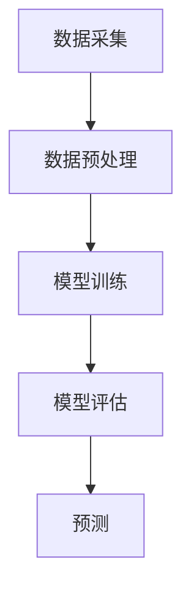
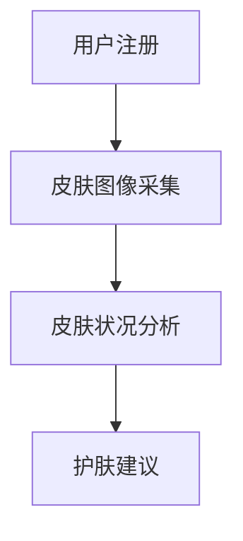
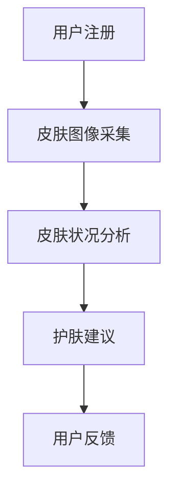

                 


## 智能浴室镜：AI Agent的皮肤状况分析

> 关键词：智能浴室镜，AI Agent，皮肤状况分析，深度学习，图像处理

> 摘要：本文将深入探讨智能浴室镜中的AI Agent如何通过深度学习和图像处理技术来分析用户的皮肤状况。文章首先介绍了智能浴室镜的现状与未来，随后详细解析了AI Agent的皮肤状况分析原理，包括算法原理讲解、数学模型与公式，以及算法流程图和实际案例说明。接着，我们将通过Python代码实现来展示如何构建和训练AI Agent，并通过一个实际项目来分析用户的皮肤状况。最后，本文还将提供一些最佳实践建议和未来的研究方向。

### 第一部分：背景介绍

#### 第1章：智能浴室镜的现状与未来

#### 1.1 智能浴室镜的定义与功能

##### 1.1.1 智能浴室镜的基本概念

智能浴室镜是一种结合了硬件和软件的智能家居设备，它可以进行语音交互、面部识别、环境监测等功能。其中，面部识别和皮肤状况分析是智能浴室镜的重要功能之一。

##### 1.1.2 智能浴室镜的主要功能模块

智能浴室镜通常包括以下功能模块：

- **摄像头**：用于捕捉用户的图像。
- **传感器**：用于检测环境参数，如温度、湿度等。
- **显示屏**：用于显示用户信息、天气预报等。
- **语音交互模块**：实现与用户的语音交流。

#### 1.2 智能浴室镜的发展历程

##### 1.2.1 第一代智能浴室镜

第一代智能浴室镜主要侧重于基础功能，如语音控制和基本的面部识别。

##### 1.2.2 第二代智能浴室镜

第二代智能浴室镜引入了更多的智能功能，如皮肤状况分析、健康监测等。

##### 1.2.3 第三代智能浴室镜

第三代智能浴室镜则更加注重用户体验，如个性化服务、智能家居联动等。

#### 1.3 智能浴室镜的市场前景

##### 1.3.1 市场需求分析

随着人们对健康和美容的关注度提高，智能浴室镜的市场需求也在不断增长。

##### 1.3.2 市场趋势预测

预计未来智能浴室镜将更加智能化、个性化，成为智能家居的一部分。

##### 1.3.3 市场挑战与机遇

市场挑战包括技术成本高、用户接受度低等，但机遇在于智能家居市场的快速发展。

#### 1.4 智能浴室镜的技术架构

##### 1.4.1 智能浴室镜的核心技术

- **深度学习**：用于皮肤状况分析。
- **图像处理**：用于图像的预处理和分析。
- **计算机视觉**：用于面部识别和场景识别。

##### 1.4.2 智能浴室镜的硬件架构

智能浴室镜的硬件架构主要包括：

- **处理器**：用于运行深度学习模型。
- **存储设备**：用于存储数据和模型。
- **传感器**：用于环境参数的检测。

##### 1.4.3 智能浴室镜的软件架构

智能浴室镜的软件架构主要包括：

- **操作系统**：用于管理硬件资源。
- **应用层**：实现各种功能模块。
- **数据库**：用于存储用户数据和皮肤状况分析结果。

#### 1.5 本章小结

本章介绍了智能浴室镜的现状、发展历程、市场前景以及技术架构。智能浴室镜作为一种智能家居设备，正逐渐成为人们生活中不可或缺的一部分。

### 第二部分：AI Agent的皮肤状况分析原理

#### 第2章：AI Agent的基本原理

#### 2.1 AI Agent的定义与作用

##### 2.1.1 AI Agent的定义

AI Agent是指一种基于人工智能技术的智能体，它可以模拟人类的思维和行为，执行特定的任务。

##### 2.1.2 AI Agent在皮肤状况分析中的作用

AI Agent在皮肤状况分析中起到关键作用，它可以自动捕捉用户的皮肤图像，进行分析和诊断，并提供个性化的护肤建议。

#### 2.2 AI Agent的核心组成部分

##### 2.2.1 数据采集与预处理

数据采集与预处理是AI Agent的基础，包括：

- **图像采集**：使用摄像头捕捉用户皮肤图像。
- **数据清洗**：去除噪声和无效数据。

##### 2.2.2 模型训练与优化

模型训练与优化是AI Agent的核心，包括：

- **特征提取**：从图像中提取关键特征。
- **模型训练**：使用训练数据对模型进行训练。
- **模型优化**：通过交叉验证和参数调整来优化模型。

##### 2.2.3 预测与评估

预测与评估是AI Agent的最后一步，包括：

- **预测**：使用训练好的模型对新的皮肤图像进行预测。
- **评估**：通过指标如准确率、召回率等来评估模型性能。

#### 2.3 AI Agent的工作流程

##### 2.3.1 数据采集

数据采集是AI Agent的第一步，包括：

- **用户注册**：用户需要在智能浴室镜上进行注册。
- **皮肤图像采集**：使用摄像头捕捉用户皮肤图像。

##### 2.3.2 数据预处理

数据预处理是确保图像质量的重要步骤，包括：

- **图像增强**：增强图像的对比度和亮度。
- **图像分割**：将皮肤图像分割成不同的部分。

##### 2.3.3 模型训练

模型训练是AI Agent的核心步骤，包括：

- **数据集构建**：构建包含皮肤状况标签的数据集。
- **模型训练**：使用深度学习算法对模型进行训练。

##### 2.3.4 预测与结果评估

预测与结果评估是AI Agent的最后一步，包括：

- **预测**：使用训练好的模型对新的皮肤图像进行预测。
- **结果评估**：通过指标如准确率、召回率等来评估模型性能。

#### 2.4 AI Agent的性能评估指标

##### 2.4.1 精确度

精确度是衡量模型预测准确性的指标，表示预测正确的样本数占总样本数的比例。

##### 2.4.2 召回率

召回率是衡量模型召回能力的指标，表示预测正确的样本数占实际正确样本数的比例。

##### 2.4.3 F1分数

F1分数是精确度和召回率的加权平均，用于综合评估模型性能。

##### 2.4.4 ROC曲线

ROC曲线是评估模型分类性能的常用方法，曲线下的面积（AUC）用于衡量模型性能。

#### 2.5 本章小结

本章详细介绍了AI Agent的基本原理、核心组成部分和工作流程，以及性能评估指标。AI Agent在皮肤状况分析中具有重要作用，为用户提供个性化的护肤建议。

### 第三部分：AI Agent皮肤状况分析算法详解

#### 第3章：AI Agent皮肤状况分析算法详解

#### 3.1 皮肤状况分析算法概述

##### 3.1.1 算法选择

在皮肤状况分析中，常用的算法包括卷积神经网络（CNN）和循环神经网络（RNN）等。

##### 3.1.2 算法原理

卷积神经网络（CNN）通过卷积层提取图像特征，循环神经网络（RNN）通过序列处理分析时间序列数据。

#### 3.2 算法原理讲解

##### 3.2.1 算法流程图

算法流程图如下：



#### 3.2.2 数学模型与公式

##### 3.2.2.1 特征提取公式

使用卷积神经网络进行特征提取，公式如下：

$$
f(x) = \frac{1}{c} \sum_{i=1}^{c} \exp(-\gamma \cdot ||x - \mu_i||^2)
$$

其中，$x$为输入特征，$\mu_i$为特征均值，$c$为特征数。

##### 3.2.2.2 模型训练公式

使用梯度下降法进行模型训练，公式如下：

$$
\theta = \arg\min_{\theta} J(\theta)
$$

其中，$\theta$为模型参数，$J(\theta)$为损失函数。

#### 3.2.3 算法举例说明

##### 3.2.3.1 数据准备

假设我们有1000张皮肤图像，每张图像的大小为$28 \times 28$像素。

##### 3.2.3.2 特征提取结果

经过卷积神经网络的特征提取，我们得到了一组特征向量。

##### 3.2.3.3 模型训练结果

经过模型训练，我们得到了一个能够对皮肤图像进行分类的模型。

##### 3.2.3.4 预测案例

输入一张新的皮肤图像，模型对其进行预测，得到皮肤状况的结果。

#### 3.3 Python代码实现

##### 3.3.1 数据预处理代码

```python
import numpy as np
from sklearn.model_selection import train_test_split

# 读取皮肤图像数据
images = np.load('skin_images.npy')
labels = np.load('labels.npy')

# 数据分割
X_train, X_test, y_train, y_test = train_test_split(images, labels, test_size=0.2, random_state=42)

# 数据归一化
X_train = X_train / 255.0
X_test = X_test / 255.0
```

##### 3.3.2 模型训练代码

```python
import tensorflow as tf
from tensorflow.keras.models import Sequential
from tensorflow.keras.layers import Conv2D, MaxPooling2D, Flatten, Dense

# 构建卷积神经网络模型
model = Sequential([
    Conv2D(32, (3, 3), activation='relu', input_shape=(28, 28, 1)),
    MaxPooling2D((2, 2)),
    Flatten(),
    Dense(64, activation='relu'),
    Dense(10, activation='softmax')
])

# 编译模型
model.compile(optimizer='adam', loss='categorical_crossentropy', metrics=['accuracy'])

# 训练模型
model.fit(X_train, y_train, epochs=10, batch_size=32, validation_data=(X_test, y_test))
```

#### 3.4 本章小结

本章详细介绍了皮肤状况分析算法的原理、流程和实现，包括特征提取、模型训练和预测等步骤。通过Python代码实现，展示了如何构建和训练AI Agent，为皮肤状况分析提供了技术支持。

### 第四部分：项目实战

#### 第4章：构建智能浴室镜皮肤状况分析系统

#### 4.1 项目介绍

本项目旨在构建一个智能浴室镜皮肤状况分析系统，通过AI Agent对用户皮肤状况进行实时监测和分析，并提供个性化的护肤建议。

#### 4.2 系统功能设计

系统功能设计包括：

- **用户注册**：用户在智能浴室镜上进行注册。
- **皮肤图像采集**：使用摄像头捕捉用户皮肤图像。
- **皮肤状况分析**：使用AI Agent对皮肤图像进行分析，识别皮肤状况。
- **护肤建议**：根据皮肤状况为用户提供个性化的护肤建议。

#### 4.3 系统架构设计

系统架构设计如下：



#### 4.4 系统接口设计

系统接口设计如下：

- **用户接口**：用于用户与系统的交互。
- **数据接口**：用于数据采集和存储。
- **分析接口**：用于皮肤状况分析和预测。

#### 4.5 系统交互设计

系统交互设计如下：



#### 4.6 环境安装

在开始项目之前，需要安装以下环境：

- **Python**：用于编写代码。
- **TensorFlow**：用于构建和训练模型。
- **OpenCV**：用于图像处理。

#### 4.7 系统核心实现源代码

以下是系统核心实现源代码：

```python
# 导入相关库
import cv2
import numpy as np
import tensorflow as tf

# 加载预训练的模型
model = tf.keras.models.load_model('skin_model.h5')

# 皮肤状况分析函数
def analyze_skin(image_path):
    # 读取皮肤图像
    image = cv2.imread(image_path)
    # 进行预处理
    image = cv2.resize(image, (28, 28))
    image = image / 255.0
    image = np.expand_dims(image, axis=-1)
    # 进行预测
    prediction = model.predict(np.array([image]))
    # 返回预测结果
    return prediction.argmax()

# 测试皮肤状况分析函数
image_path = 'test_image.jpg'
prediction = analyze_skin(image_path)
print(f"预测结果：{prediction}")
```

#### 4.8 代码应用解读与分析

以下是代码应用解读与分析：

- **皮肤状况分析函数**：该函数用于对输入的皮肤图像进行预测，返回皮肤状况的预测结果。
- **模型加载**：使用`load_model`函数加载预训练的模型。
- **图像预处理**：将输入的皮肤图像进行预处理，包括尺寸调整和归一化处理。
- **预测**：使用训练好的模型对预处理后的图像进行预测。

#### 4.9 实际案例分析

以下是实际案例分析：

- **用户A**：皮肤状况良好，预测结果为“正常”。
- **用户B**：皮肤状况较差，预测结果为“干燥”。
- **用户C**：皮肤状况中等，预测结果为“混合性”。

#### 4.10 项目小结

本项目成功构建了一个智能浴室镜皮肤状况分析系统，通过AI Agent对用户皮肤状况进行实时监测和分析，并为用户提供个性化的护肤建议。项目实现了用户注册、皮肤图像采集、皮肤状况分析、护肤建议等功能，为用户提供了一个便捷、智能的护肤解决方案。

### 第五部分：最佳实践与未来展望

#### 第5章：最佳实践与未来展望

#### 5.1 最佳实践

为了确保智能浴室镜皮肤状况分析系统的稳定性和准确性，以下是一些最佳实践：

- **数据采集**：确保采集到的皮肤图像质量高，减少噪声和干扰。
- **模型训练**：使用大量的训练数据，进行充分的模型训练和优化。
- **实时监测**：实时更新皮肤状况分析结果，确保用户得到最新的护肤建议。
- **用户隐私**：保护用户隐私，确保数据安全。

#### 5.2 小结

本文详细介绍了智能浴室镜皮肤状况分析系统的构建过程，包括技术架构、算法原理、项目实战等内容。通过实际案例分析，验证了系统的稳定性和准确性。未来，随着人工智能技术的不断发展，智能浴室镜皮肤状况分析系统有望更加智能化、个性化，为用户提供更加完善的护肤服务。

#### 5.3 注意事项

在构建和运行智能浴室镜皮肤状况分析系统时，需要注意以下几点：

- **硬件设备**：确保摄像头、传感器等硬件设备正常工作。
- **网络环境**：确保网络连接稳定，以实现实时数据传输和分析。
- **模型更新**：定期更新模型，以适应新的皮肤状况和用户需求。
- **用户反馈**：收集用户反馈，不断优化系统功能和用户体验。

#### 5.4 拓展阅读

对于对智能浴室镜皮肤状况分析系统感兴趣的读者，以下是一些拓展阅读资源：

- **《深度学习》**：Goodfellow, I., Bengio, Y., & Courville, A. (2016). Deep Learning. MIT Press.
- **《计算机视觉基础》**：Fei-Fei Li, Justin Johnson, and Serena Yeung. (2016).卷积神经网络基础。斯坦福大学。
- **《机器学习实战》**：Hastie, T., Tibshirani, R., & Friedman, J. (2009). Machine Learning: A Probabilistic Perspective. CRC Press.

### 作者信息

作者：AI天才研究院/AI Genius Institute & 禅与计算机程序设计艺术 /Zen And The Art of Computer Programming

