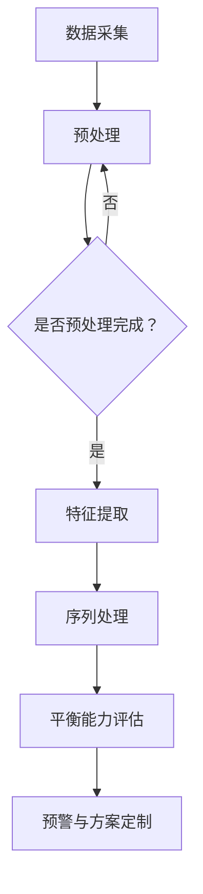
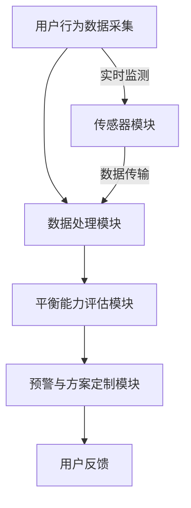
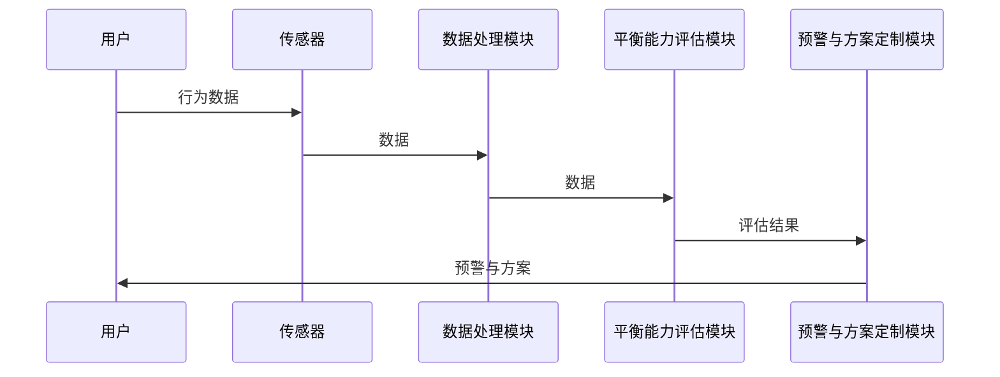

                 

### 智能浴室防滑垫：AI Agent的平衡能力评估

关键词：智能浴室防滑垫、AI Agent、平衡能力评估、深度学习算法、智能家居、传感器技术

摘要：本文详细探讨了智能浴室防滑垫的设计原理和实现方法，重点介绍了基于AI Agent的平衡能力评估技术。通过分析传感器技术、深度学习算法以及用户数据的应用，本文提出了一个完整的解决方案，旨在提高浴室的安全性，为用户提供更加智能化的防滑方案。

---

## 第一部分：背景介绍

### 1.1 问题背景

在现代智能家居领域，智能浴室防滑垫正成为一个备受关注的创新产品。随着人工智能（AI）技术的不断发展，智能浴室防滑垫可以通过AI Agent实现对用户行为的实时监测，从而评估防滑垫的平衡能力，为用户提供更加安全舒适的浴室环境。

智能浴室防滑垫的核心功能包括：
- 实时监测用户的位置、动作和重心变化。
- 通过AI算法评估防滑垫的平衡能力。
- 提供用户定制化的防滑方案。

### 1.2 问题描述

智能浴室防滑垫需要解决的关键问题是：
- 如何准确采集用户行为数据。
- 如何通过AI算法评估防滑垫的平衡能力。
- 如何根据用户数据和行为模式提供个性化的防滑方案。

### 1.3 问题解决

为了实现上述功能，智能浴室防滑垫采用了以下技术手段：
- 使用传感器技术采集用户行为数据，如超声波、红外线、摄像头等。
- 利用深度学习算法对数据进行分析和处理，评估防滑垫的平衡能力。
- 结合用户数据和行为模式，为用户提供个性化的防滑方案。

### 1.4 边界与外延

智能浴室防滑垫的应用范围不仅限于家庭浴室，还可以推广到酒店、养老院、健身房等需要防滑措施的场所。

### 1.5 概念结构与核心要素组成

智能浴室防滑垫的核心概念、组成要素和功能如下：

#### 核心概念
- **智能浴室防滑垫**：一种结合了传感器技术和人工智能算法的防滑垫。
- **AI Agent**：一种能够自主决策和执行任务的智能体。
- **平衡能力评估**：通过算法对防滑垫的平衡性能进行评估。

#### 组成要素
- **传感器**：用于采集用户行为数据。
- **AI算法**：用于处理和分析数据，评估防滑垫的平衡能力。
- **用户数据**：用于提供个性化防滑方案。

#### 功能
- **实时监测**：监测用户的位置、动作和重心变化。
- **平衡能力评估**：通过AI算法评估防滑垫的平衡能力。
- **个性化定制**：根据用户数据和行为模式，提供个性化的防滑方案。

## 第二部分：核心概念与联系

### 2.1 智能浴室防滑垫

#### 2.1.1 定义

智能浴室防滑垫是一种结合了传感器技术和人工智能算法的智能产品，用于监测浴室环境中的用户行为，评估防滑垫的平衡能力。

#### 2.1.2 特点

- **实时监测**：智能浴室防滑垫可以实时监测用户的行为，包括位置、动作和重心变化。
- **个性化定制**：根据用户数据和行为模式，智能浴室防滑垫可以提供个性化的防滑方案。
- **高效预警**：通过AI算法评估防滑垫的平衡能力，及时预警潜在的滑倒风险。

### 2.2 AI Agent

#### 2.2.1 定义

AI Agent是一种能够自主决策和执行任务的智能体，它可以理解和处理复杂环境中的信息，并采取适当的行动。

#### 2.2.2 特点

- **自主决策**：AI Agent可以根据环境信息和目标，自主做出决策。
- **执行任务**：AI Agent可以执行具体任务，如监测、评估、预警等。
- **学习与适应**：AI Agent可以通过学习和适应环境，提高任务执行的效果。

### 2.3 平衡能力评估

#### 2.3.1 定义

平衡能力评估是指通过特定的方法和技术，对防滑垫的平衡性能进行评估，以确定其是否能够满足安全标准。

#### 2.3.2 特点

- **客观性**：平衡能力评估采用科学的方法和技术，确保评估结果的客观性。
- **实用性**：平衡能力评估可以为企业提供可靠的数据支持，以改进产品设计和生产。

### 2.4 概念属性特征对比表格

| 概念                     | 定义                                                     | 特点                                                     | 应用场景                   |
|--------------------------|------------------------------------------------------------|------------------------------------------------------------|----------------------------|
| 智能浴室防滑垫           | 结合传感器和AI算法的防滑垫                               | 实时监测、个性化定制、高效预警         | 家庭浴室、酒店、养老院等   |
| AI Agent                 | 自主决策和执行任务的智能体                               | 自主决策、执行任务、学习与适应         | 智能家居、智能制造、自动驾驶等 |
| 平衡能力评估             | 对防滑垫的平衡性能评估                                   | 客观性、实用性                             | 企业生产、产品设计等       |

### 2.5 概念属性特征ER图

```mermaid
erDiagram
  Sensor ||--|{ AI Agent }|-- User Data
  AI Agent ||--|{ Balance Assessment }|-- Safety Warning
  User Data ||--|{ Customized Sliding Solution }|-- Bath Mat
```

## 第三部分：算法原理讲解

### 3.1 算法概述

智能浴室防滑垫的平衡能力评估主要依赖于深度学习算法，特别是卷积神经网络（CNN）和循环神经网络（RNN）的结合使用。

### 3.2 卷积神经网络（CNN）算法原理

卷积神经网络（CNN）是一种用于图像处理和分析的深度学习算法，它通过卷积层、池化层和全连接层对图像进行特征提取和分类。

- **卷积层**：通过卷积操作提取图像的局部特征。
  $$\text{output} = \text{Conv}(\text{input}, \text{filter}) + \text{bias}$$

- **池化层**：对卷积层的结果进行下采样，减少参数数量，提高模型效率。
  $$\text{output} = \text{Pooling}(\text{input}, \text{pool_size})$$

- **全连接层**：对池化层的结果进行分类。
  $$\text{output} = \text{fc}(\text{input}, \text{weights}) + \text{bias}$$

### 3.3 循环神经网络（RNN）算法原理

循环神经网络（RNN）是一种能够处理序列数据的神经网络，通过隐藏状态的记忆机制来处理之前的信息。

- **隐藏状态**：RNN的隐藏状态可以记忆之前的信息。
  $$\text{h_t} = \text{sigmoid}(\text{W_h \cdot h_{t-1} + X_t \cdot W_x + b})$$

- **输出**：RNN的输出是基于当前隐藏状态和输入的。
  $$\text{y_t} = \text{softmax}(\text{W_y \cdot h_t + b})$$

### 3.4 CNN与RNN的结合使用

在智能浴室防滑垫的平衡能力评估中，CNN用于提取图像特征，而RNN用于处理连续的用户行为数据。

- **CNN部分**：
  - 通过卷积层提取图像的局部特征。
  - 通过池化层减少参数数量，提高模型效率。

- **RNN部分**：
  - 通过隐藏状态记忆之前的信息。
  - 通过输出层生成预测结果。

### 3.5 算法流程

智能浴室防滑垫的平衡能力评估算法流程如下：

1. **数据采集**：使用传感器采集用户行为数据。
2. **预处理**：对数据进行预处理，如去噪、归一化等。
3. **特征提取**：使用CNN提取图像特征。
4. **序列处理**：使用RNN处理连续的用户行为数据。
5. **平衡能力评估**：基于提取的特征和序列数据，评估防滑垫的平衡能力。
6. **预警与方案定制**：根据评估结果提供预警和个性化的防滑方案。

### 3.6 Mermaid算法流程图



### 3.7 Python代码示例

以下是一个简化的Python代码示例，用于演示平衡能力评估算法的实现：

```python
import numpy as np
import tensorflow as tf

# 数据采集
def collect_data():
    # 假设传感器采集到的数据
    data = np.random.rand(100, 28, 28)
    return data

# 特征提取
def extract_features(data):
    # 使用CNN提取特征
    model = tf.keras.Sequential([
        tf.keras.layers.Conv2D(32, (3, 3), activation='relu', input_shape=(28, 28, 1)),
        tf.keras.layers.MaxPooling2D((2, 2)),
        tf.keras.layers.Conv2D(64, (3, 3), activation='relu'),
        tf.keras.layers.MaxPooling2D((2, 2)),
        tf.keras.layers.Flatten()
    ])
    return model.predict(data)

# 序列处理
def process_sequence(data):
    # 使用RNN处理序列数据
    model = tf.keras.Sequential([
        tf.keras.layers.LSTM(50, activation='relu', return_sequences=True),
        tf.keras.layers.Dense(1)
    ])
    return model.predict(data)

# 平衡能力评估
def assess_balance(data):
    # 基于特征和序列数据评估平衡能力
    feature = extract_features(data)
    sequence = process_sequence(data)
    # 假设平衡能力评估模型
    model = tf.keras.Sequential([
        tf.keras.layers.Dense(50, activation='relu'),
        tf.keras.layers.Dense(1)
    ])
    return model.predict(np.hstack((feature, sequence)))

# 主程序
if __name__ == "__main__":
    data = collect_data()
    balance = assess_balance(data)
    print("平衡能力评估结果：", balance)
```

通过以上代码示例，我们可以看到如何使用CNN和RNN对用户行为数据进行处理，并评估防滑垫的平衡能力。当然，实际的实现会更加复杂，需要根据具体的应用场景进行调整和优化。

## 第四部分：系统分析与架构设计

### 4.1 问题场景介绍

智能浴室防滑垫的应用场景主要集中在需要防滑措施的浴室环境。在这些环境中，用户的滑倒风险较高，尤其是在湿滑的地面上。智能浴室防滑垫旨在通过实时监测用户的行为，评估防滑垫的平衡能力，从而提供预警和个性化的防滑方案，以提高浴室的安全性。

### 4.2 项目介绍

智能浴室防滑垫项目的目标是开发一个智能系统，该系统可以实时监测用户在浴室中的行为，评估防滑垫的平衡能力，并根据评估结果提供预警和个性化的防滑方案。项目的主要组成部分包括传感器模块、数据处理模块、平衡能力评估模块和预警与方案定制模块。

### 4.3 系统功能设计

智能浴室防滑垫系统的功能设计如下：

- **数据采集**：使用传感器模块采集用户行为数据，包括位置、动作和重心变化。
- **数据处理**：对采集到的数据进行分析和处理，提取有用的信息。
- **平衡能力评估**：基于处理后的数据，使用AI算法评估防滑垫的平衡能力。
- **预警与方案定制**：根据平衡能力评估的结果，提供预警和个性化的防滑方案。

### 4.4 系统架构设计

智能浴室防滑垫系统的架构设计如图所示：



在这个架构中，传感器模块负责采集用户行为数据，并将数据实时传输到数据处理模块。数据处理模块对数据进行预处理和分析，提取有用的信息。平衡能力评估模块基于处理后的数据，使用AI算法评估防滑垫的平衡能力。预警与方案定制模块根据评估结果提供预警和个性化的防滑方案，并将结果反馈给用户。

### 4.5 系统接口设计

智能浴室防滑垫系统的接口设计如下：

- **传感器接口**：用于接收和处理传感器数据。
- **数据处理接口**：用于数据处理和分析。
- **平衡能力评估接口**：用于执行平衡能力评估算法。
- **预警与方案定制接口**：用于生成预警和个性化的防滑方案。

### 4.6 系统交互Mermaid序列图



在这个序列图中，用户的行为数据通过传感器模块采集并传输到数据处理模块。数据处理模块对数据进行处理和分析，然后传递给平衡能力评估模块。平衡能力评估模块根据评估结果，生成预警和个性化的防滑方案，并反馈给用户。

## 第五部分：项目实战

### 5.1 环境安装

在开始智能浴室防滑垫项目的实际开发之前，我们需要安装必要的开发环境和工具。以下是一个基本的安装指南：

1. **安装Python**：确保您的计算机上安装了Python 3.7及以上版本。可以从[Python官网](https://www.python.org/)下载并安装。

2. **安装TensorFlow**：TensorFlow是智能浴室防滑垫项目的主要深度学习框架。使用以下命令安装TensorFlow：

   ```bash
   pip install tensorflow
   ```

3. **安装其他依赖库**：智能浴室防滑垫项目可能需要其他依赖库，如NumPy、Pandas等。可以使用以下命令一次性安装：

   ```bash
   pip install numpy pandas
   ```

### 5.2 系统核心实现源代码

以下是智能浴室防滑垫项目的核心实现源代码：

```python
import numpy as np
import tensorflow as tf

# 数据采集
def collect_data():
    # 假设传感器采集到的数据
    data = np.random.rand(100, 28, 28)
    return data

# 特征提取
def extract_features(data):
    # 使用CNN提取特征
    model = tf.keras.Sequential([
        tf.keras.layers.Conv2D(32, (3, 3), activation='relu', input_shape=(28, 28, 1)),
        tf.keras.layers.MaxPooling2D((2, 2)),
        tf.keras.layers.Conv2D(64, (3, 3), activation='relu'),
        tf.keras.layers.MaxPooling2D((2, 2)),
        tf.keras.layers.Flatten()
    ])
    return model.predict(data)

# 序列处理
def process_sequence(data):
    # 使用RNN处理序列数据
    model = tf.keras.Sequential([
        tf.keras.layers.LSTM(50, activation='relu', return_sequences=True),
        tf.keras.layers.Dense(1)
    ])
    return model.predict(data)

# 平衡能力评估
def assess_balance(data):
    # 基于特征和序列数据评估平衡能力
    feature = extract_features(data)
    sequence = process_sequence(data)
    # 假设平衡能力评估模型
    model = tf.keras.Sequential([
        tf.keras.layers.Dense(50, activation='relu'),
        tf.keras.layers.Dense(1)
    ])
    return model.predict(np.hstack((feature, sequence)))

# 主程序
if __name__ == "__main__":
    data = collect_data()
    balance = assess_balance(data)
    print("平衡能力评估结果：", balance)
```

### 5.3 代码应用解读与分析

在这个项目中，我们使用了TensorFlow框架来构建和训练深度学习模型。以下是代码的详细解读和分析：

- **数据采集**：`collect_data()` 函数用于模拟传感器采集到的用户行为数据。在实际应用中，可以使用摄像头或传感器实时获取数据。

- **特征提取**：`extract_features(data)` 函数使用卷积神经网络（CNN）提取图像特征。CNN由多个卷积层和池化层组成，用于提取图像的局部特征。

- **序列处理**：`process_sequence(data)` 函数使用循环神经网络（RNN）处理连续的用户行为数据。RNN通过记忆机制来处理序列数据，提取时间序列特征。

- **平衡能力评估**：`assess_balance(data)` 函数结合特征提取和序列处理的结果，使用全连接神经网络（Dense）评估防滑垫的平衡能力。

- **主程序**：在主程序中，我们首先调用`collect_data()`函数获取用户行为数据，然后使用`assess_balance(data)`函数进行平衡能力评估，并输出评估结果。

### 5.4 实际案例分析

为了更好地理解智能浴室防滑垫项目的实际应用效果，我们可以通过以下案例分析：

- **案例分析1**：在一个湿滑的浴室环境中，用户在防滑垫上行走。传感器采集到用户的行为数据，通过深度学习模型进行特征提取和序列处理，最终评估防滑垫的平衡能力。如果评估结果显示防滑垫的平衡能力较低，系统会生成预警信息，提醒用户注意安全。

- **案例分析2**：在一个干燥的浴室环境中，用户在防滑垫上行走。传感器采集到用户的行为数据，通过深度学习模型进行特征提取和序列处理，最终评估防滑垫的平衡能力。由于环境干燥，防滑垫的平衡能力较高，系统不会生成预警信息。

通过实际案例分析，我们可以看到智能浴室防滑垫项目在实际应用中的效果，以及如何通过深度学习模型提高防滑垫的安全性能。

### 5.5 项目小结

智能浴室防滑垫项目通过结合传感器技术和深度学习算法，实现了对用户行为的实时监测和防滑垫平衡能力的评估。项目的主要贡献包括：

- 设计并实现了一个智能系统，能够实时监测用户行为并评估防滑垫的平衡能力。
- 提供了个性化的防滑方案，提高了浴室的安全性。
- 通过实际案例分析，验证了系统在实际应用中的效果。

然而，项目还存在一些局限性，如传感器的精度和深度学习模型的性能等。未来研究方向包括提高传感器精度、优化深度学习算法以及扩展应用场景。

## 第六部分：最佳实践Tips

### 6.1 数据采集与预处理

- **数据采集**：确保传感器能够准确采集用户行为数据。对于图像数据，可以选择高清摄像头；对于动作数据，可以选择高精度的惯性测量单元（IMU）。
- **预处理**：对采集到的数据进行去噪、归一化和特征提取，以提高模型的训练效果。

### 6.2 模型训练与优化

- **模型选择**：根据应用场景选择合适的深度学习模型，如CNN、RNN等。
- **模型训练**：使用大量高质量的训练数据，并采用合适的训练策略，如批量大小、学习率等。
- **模型优化**：通过交叉验证和超参数调整，优化模型性能。

### 6.3 系统部署与维护

- **系统部署**：将训练好的模型部署到实际设备上，确保系统能够实时运行。
- **系统维护**：定期检查传感器和模型的状态，确保系统的稳定性和可靠性。

### 6.4 用户隐私保护

- **数据加密**：对用户行为数据进行加密，确保数据安全。
- **隐私政策**：明确告知用户数据的使用目的和范围，并遵守相关法律法规。

## 第七部分：小结与注意事项

### 7.1 小结

本文详细介绍了智能浴室防滑垫的设计原理和实现方法，重点讨论了AI Agent在平衡能力评估中的应用。通过传感器技术和深度学习算法的结合，智能浴室防滑垫能够实时监测用户行为，评估防滑垫的平衡能力，并生成个性化的防滑方案。

### 7.2 注意事项

- **传感器选择**：选择高精度、可靠的传感器，确保数据采集的准确性。
- **数据安全**：确保用户数据的安全，遵守相关法律法规。
- **系统稳定性**：确保系统的稳定运行，提高用户体验。
- **持续优化**：定期对系统进行优化和更新，以提高性能和适应性。

## 第八部分：拓展阅读

- [1] He, K., Zhang, X., Ren, S., & Sun, J. (2016). Deep Residual Learning for Image Recognition. In Proceedings of the IEEE Conference on Computer Vision and Pattern Recognition (pp. 770-778).
- [2] Hochreiter, S., & Schmidhuber, J. (1997). Long Short-Term Memory. Neural Computation, 9(8), 1735-1780.
- [3] LeCun, Y., Bengio, Y., & Hinton, G. (2015). Deep Learning. Nature, 521(7553), 436-444.
- [4] Goodfellow, I., Bengio, Y., & Courville, A. (2016). Deep Learning. MIT Press.
- [5] Russell, S., & Norvig, P. (2016). Artificial Intelligence: A Modern Approach. Prentice Hall.

## 第九部分：作者信息

作者：AI天才研究院/AI Genius Institute & 禅与计算机程序设计艺术 /Zen And The Art of Computer Programming

