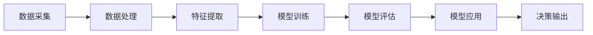
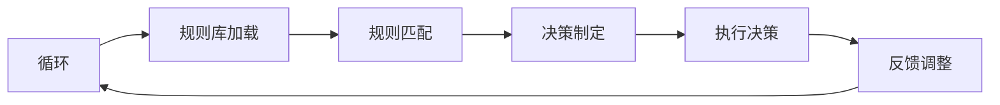
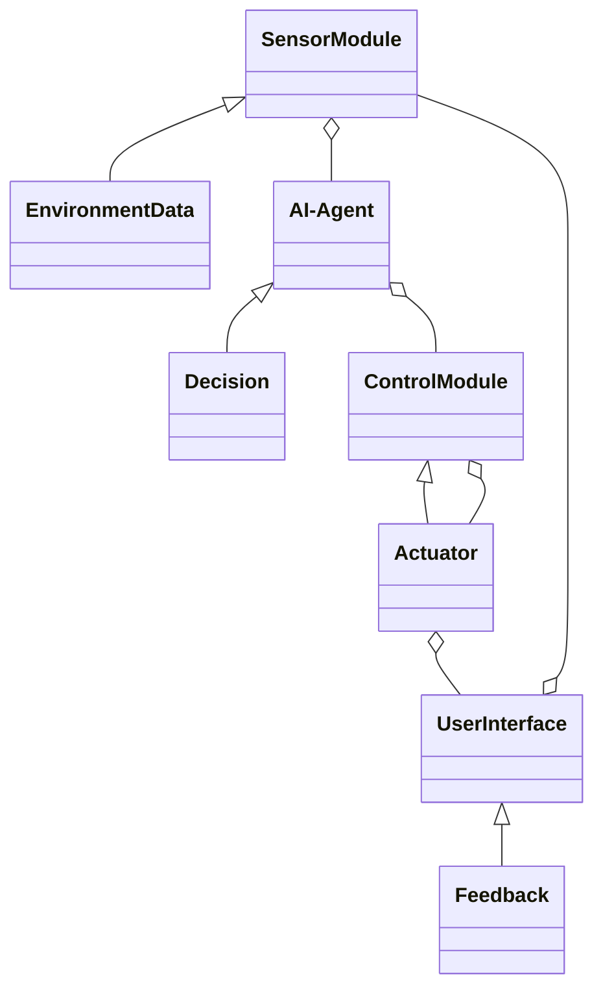
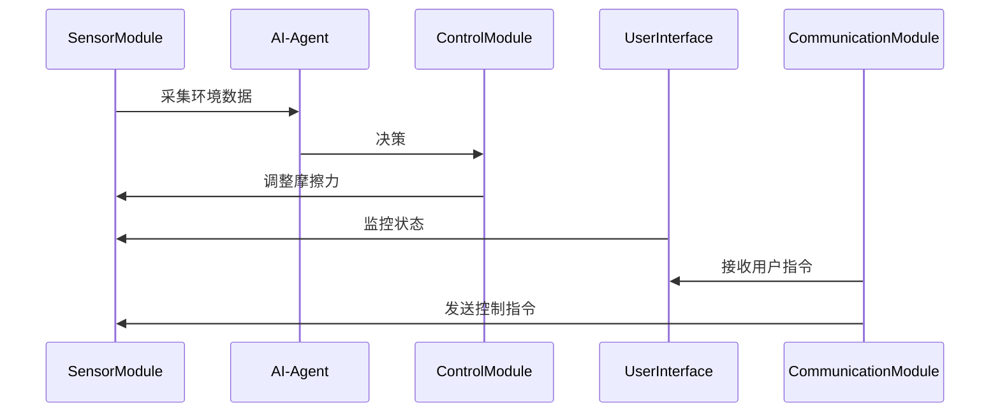
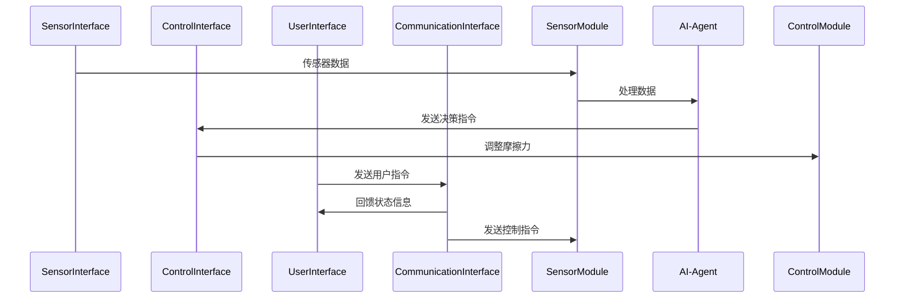

                 

# 智能浴室防滑垫：AI Agent的洗浴安全监护

## 关键词

智能浴室防滑垫，AI Agent，洗浴安全监护，算法原理，数学模型，系统架构，项目实战，最佳实践

## 摘要

本文将深入探讨智能浴室防滑垫的工作原理及其在AI Agent辅助下的洗浴安全监护功能。首先，我们将回顾浴室防滑垫的发展历程，然后详细讲解智能浴室防滑垫的核心特性和组成结构。接着，我们将介绍AI Agent的概念及其在洗浴安全监护中的具体应用。随后，文章将深入剖析防滑垫感知算法和安全监护算法的原理，包括数学模型的建立和公式的推导。文章还将对系统分析与架构设计进行详细的说明，包括系统功能设计、架构设计、接口设计和交互流程。最后，我们将通过项目实战和实际案例分析，展示智能浴室防滑垫的实用性，并总结最佳实践，展望未来技术发展方向。

## 第一部分：背景介绍

### 第1章：问题背景

#### 1.1 问题背景

浴室，作为家庭生活中不可或缺的空间之一，却因其特殊的湿滑环境而成为一个容易发生意外的场所。据统计，每年因浴室滑倒而导致的意外伤害占家庭意外伤害的相当比例。尤其是老年人，由于身体机能的衰退，更容易在浴室中滑倒。这种滑倒不仅导致身体伤害，还可能引发心理阴影，影响生活质量。

传统的浴室防滑垫主要依赖于材料本身的摩擦力来防止滑倒，但其在湿滑环境中的效果往往不尽如人意。同时，传统防滑垫的安装和更换过程繁琐，不易维护，且存在一定的卫生隐患。

#### 1.2 问题描述

如何在保持浴室舒适性的同时，提高其安全性，成为一个亟待解决的问题。具体来说，如何实现以下目标：

1. 在湿滑环境中提供更高的防滑效果。
2. 简化安装和更换过程，提高便利性。
3. 预防因滑倒而导致的意外伤害。
4. 保持浴室的清洁卫生。

#### 1.3 问题解决

智能浴室防滑垫应运而生，其通过集成传感器和AI Agent，实现了对浴室环境的实时监测和反应。智能浴室防滑垫能够在湿滑环境中提供更强的防滑效果，并通过自动清洗和更换功能，解决了传统防滑垫的维护难题。

#### 1.4 边界与外延

智能浴室防滑垫的应用场景不仅限于家庭，还可以扩展到医院、养老院等需要高度安全监护的场所。此外，随着技术的发展，智能浴室防滑垫的功能也将不断扩展，如加入更多的健康监测功能，进一步提升其智能化程度。

#### 1.5 概念结构与核心要素组成

智能浴室防滑垫由以下核心要素组成：

1. **传感器**：用于检测浴室环境，如湿滑度、温度、压力等。
2. **AI Agent**：负责对传感器数据进行处理和分析，实现智能决策。
3. **控制系统**：包括电源管理、通信模块和执行机构，负责实现防滑垫的自动控制和维护。
4. **用户界面**：提供用户交互界面，方便用户设置和监控防滑垫的工作状态。

## 第二部分：核心概念与联系

### 第2章：智能浴室防滑垫概述

#### 2.1 智能浴室防滑垫的定义

智能浴室防滑垫是一种集成了传感器和AI技术的防滑垫，能够在湿滑环境中提供智能化的防滑功能。它不仅具有传统防滑垫的防滑特性，还能够通过实时监测和智能决策，提高浴室的安全性。

#### 2.2 智能浴室防滑垫的核心特性

1. **实时监测**：智能浴室防滑垫通过集成传感器，能够实时监测浴室环境的变化，如湿滑度、温度等。
2. **智能决策**：基于AI Agent，智能浴室防滑垫能够对监测到的数据进行分析和处理，做出智能化的决策，如自动调整防滑垫的摩擦力。
3. **自动控制**：智能浴室防滑垫能够自动控制其工作状态，如自动启动清洁功能或更换防滑垫。
4. **用户友好**：智能浴室防滑垫提供了直观的用户界面，方便用户进行操作和监控。

#### 2.3 与传统浴室防滑垫的对比

| 特性         | 传统浴室防滑垫                   | 智能浴室防滑垫                           |
| ------------ | -------------------------------- | ---------------------------------------- |
| 防滑效果     | 依赖材料摩擦力，湿滑环境中效果不佳 | 实时监测环境，提供更高防滑效果           |
| 维护性       | 需定期更换，维护繁琐             | 自动清洗和更换，维护方便                 |
| 安全性       | 靠经验判断，安全性难以保障         | 智能监测，提高安全性                     |
| 用户交互     | 无用户交互界面，操作不便           | 提供直观用户界面，操作简便               |

#### 2.4 智能浴室防滑垫的组成结构

智能浴室防滑垫由以下主要组成部分构成：

1. **传感器模块**：用于实时监测浴室环境。
2. **AI Agent模块**：负责数据处理和智能决策。
3. **控制系统模块**：负责执行AI Agent的决策，控制防滑垫的工作状态。
4. **用户界面模块**：提供用户交互界面。

### 第3章：AI Agent的洗浴安全监护

#### 3.1 AI Agent的定义

AI Agent，即人工智能代理，是指具有智能行为和决策能力的计算机程序。它能够根据环境数据和预设规则，自主执行任务，并对外部环境进行响应。在智能浴室防滑垫中，AI Agent负责对传感器数据进行处理和分析，实现浴室环境的智能监护。

#### 3.2 AI Agent在洗浴安全监护中的功能

1. **环境监测**：AI Agent能够实时监测浴室的湿滑度、温度等环境参数。
2. **决策制定**：基于环境数据和预设规则，AI Agent能够自动调整防滑垫的摩擦力，以提供最佳的防滑效果。
3. **故障检测**：AI Agent能够检测传感器和控制系统的故障，并及时进行报警和维修建议。
4. **用户交互**：AI Agent可以通过用户界面与用户进行交互，提供使用建议和故障排除指导。

#### 3.3 洗浴安全监护的AI Agent与人的关系

AI Agent在洗浴安全监护中与人的关系主要体现在以下几个方面：

1. **辅助决策**：AI Agent通过实时监测和分析环境数据，为用户提供安全建议，辅助用户做出正确的决策。
2. **提醒功能**：AI Agent可以定时提醒用户注意浴室安全，如长时间使用后提醒用户休息。
3. **应急处理**：在发生意外时，AI Agent可以及时报警，并给出应急处理建议，减少意外伤害。
4. **维护指导**：AI Agent可以检测系统的故障，并提供维护和维修指导，确保系统的正常运行。

#### 3.4 洗浴安全监护AI Agent的应用场景

1. **家庭**：为家庭成员，尤其是老年人和儿童，提供安全监护，预防浴室滑倒。
2. **医院**：为住院病人提供安全监护，减少病房内滑倒事故。
3. **养老院**：为老年人提供全方位的安全监护，提高生活质量。
4. **公共浴室**：在公共场所的浴室中，提供智能化的防滑服务，保障用户安全。

## 第三部分：算法原理讲解

### 第4章：防滑垫感知算法

#### 4.1 防滑垫感知算法概述

防滑垫感知算法是智能浴室防滑垫的核心算法之一，负责监测浴室环境，判断湿滑度等参数。该算法通过对传感器数据的实时处理，为AI Agent提供决策依据。

#### 4.2 感知算法的工作原理

感知算法的工作原理可以分为以下几个步骤：

1. **数据采集**：传感器模块采集浴室环境的湿滑度、温度等数据。
2. **数据处理**：将采集到的数据进行预处理，包括滤波、去噪等操作，以提高数据的准确性。
3. **特征提取**：从预处理后的数据中提取出与湿滑度相关的特征，如湿度、温度等。
4. **判断与决策**：基于提取的特征，使用机器学习算法进行训练和预测，判断浴室环境的湿滑度，并给出相应的防滑建议。

#### 4.3 感知算法的核心算法

防滑垫感知算法的核心算法通常采用机器学习技术，如支持向量机（SVM）、决策树、神经网络等。以下是一个简单的基于支持向量机的感知算法示例：

1. **数据集准备**：收集大量的浴室环境数据，包括湿滑度、温度等。
2. **特征工程**：从原始数据中提取出与湿滑度相关的特征。
3. **模型训练**：使用支持向量机算法对特征进行训练，建立湿滑度预测模型。
4. **模型评估**：使用测试数据集对模型进行评估，调整模型参数，以提高预测准确性。
5. **模型应用**：将训练好的模型应用于实时监测数据，判断浴室环境的湿滑度。

#### 4.4 感知算法的mermaid流程图

以下是防滑垫感知算法的mermaid流程图：



### 第5章：安全监护算法

#### 5.1 安全监护算法概述

安全监护算法是智能浴室防滑垫的另一个核心算法，负责根据感知算法的结果，制定相应的安全监护策略，以确保浴室的安全性。

#### 5.2 安全监护算法的工作原理

安全监护算法的工作原理可以分为以下几个步骤：

1. **数据输入**：接收防滑垫感知算法输出的湿滑度判断结果。
2. **规则库加载**：加载预设的安全监护规则库，包括防滑垫摩擦力调整规则、报警规则等。
3. **规则匹配**：根据感知算法的输出，匹配相应的安全监护规则。
4. **决策制定**：基于匹配到的规则，制定相应的安全监护决策，如调整防滑垫摩擦力、启动报警系统等。
5. **执行决策**：执行制定的安全监护决策，确保浴室的安全性。

#### 5.3 安全监护算法的核心算法

安全监护算法的核心算法通常采用基于规则的推理方法，结合机器学习技术进行优化。以下是一个简单的基于规则的安全监护算法示例：

1. **规则库准备**：收集和整理各种安全监护规则，如湿滑度阈值、摩擦力调整范围等。
2. **规则匹配算法**：使用模糊匹配算法，将感知算法的输出与规则库中的规则进行匹配。
3. **决策优化**：基于匹配到的规则，使用优化算法（如遗传算法）进行决策优化，以提高安全监护效果。
4. **执行与反馈**：执行制定的安全监护决策，并对决策结果进行实时反馈和调整。

#### 5.4 安全监护算法的mermaid流程图

以下是安全监护算法的mermaid流程图：



## 第四部分：数学模型和数学公式

### 第6章：防滑垫感知的数学模型

#### 6.1 数学模型概述

防滑垫感知的数学模型主要涉及湿滑度的检测和判断。该模型通过建立输入特征与输出结果之间的映射关系，实现对浴室湿滑度的准确感知。

#### 6.2 数学模型的具体公式

设输入特征向量为 $X = [x_1, x_2, ..., x_n]$，其中 $x_i$ 表示第 $i$ 个特征值。输出结果为 $Y \in \{0, 1\}$，其中 $0$ 表示湿滑度较低，$1$ 表示湿滑度较高。感知算法的目标是找到最佳的映射函数 $f(X)$，使得 $f(X) \approx Y$。

常用的数学模型包括：

1. **线性模型**：

   $$f(X) = \sum_{i=1}^{n} w_i x_i + b$$

   其中 $w_i$ 为权重，$b$ 为偏置。

2. **非线性模型**：

   $$f(X) = \sigma(\sum_{i=1}^{n} w_i x_i + b)$$

   其中 $\sigma$ 为激活函数，常用的有 sigmoid 函数、ReLU 函数等。

#### 6.3 公式解释与举例说明

以线性模型为例，假设我们有两个输入特征 $x_1$ 和 $x_2$，权重分别为 $w_1 = 0.5$ 和 $w_2 = 0.5$，偏置 $b = 0$。则映射函数为：

$$f(X) = 0.5x_1 + 0.5x_2$$

假设我们采集到一个特征向量 $X = [0.8, 0.9]$，代入映射函数得到：

$$f(X) = 0.5 \times 0.8 + 0.5 \times 0.9 = 0.7$$

根据模型预测，湿滑度较低，即输出结果为 $0$。

### 第7章：安全监护的数学模型

#### 7.1 数学模型概述

安全监护的数学模型主要涉及基于规则的安全监护策略制定和优化。该模型通过建立规则与决策之间的映射关系，实现对浴室安全监护的有效管理。

#### 7.2 数学模型的具体公式

设规则库为 $R = \{r_1, r_2, ..., r_n\}$，其中 $r_i$ 表示第 $i$ 条规则。决策变量为 $D = \{d_1, d_2, ..., d_n\}$，其中 $d_i$ 表示第 $i$ 个决策结果。安全监护算法的目标是找到最佳决策变量序列 $\{d_1^*, d_2^*, ..., d_n^*\}$，使得整个系统的安全性能最优。

常用的数学模型包括：

1. **线性规划模型**：

   $$\min_{d} c^T d$$

   $$s.t. Ax \leq b$$

   其中 $c$ 为决策目标函数，$A$ 和 $b$ 分别为约束条件。

2. **非线性规划模型**：

   $$\min_{d} f(d)$$

   $$s.t. g(d) \leq 0$$

   其中 $f(d)$ 为决策目标函数，$g(d)$ 为约束条件。

#### 7.3 公式解释与举例说明

以线性规划模型为例，假设我们有两个决策变量 $d_1$ 和 $d_2$，目标函数为最大化安全性能，约束条件为防滑垫摩擦力调整范围和报警阈值。则线性规划模型为：

$$\min_{d} c_1 d_1 + c_2 d_2$$

$$s.t. a_1 d_1 + a_2 d_2 \leq b_1$$

$$b_1 d_1 + b_2 d_2 \leq b_2$$

其中 $c_1$ 和 $c_2$ 分别为 $d_1$ 和 $d_2$ 的权重，$a_1$、$a_2$、$b_1$ 和 $b_2$ 分别为约束条件的系数。

假设我们希望最大化安全性能，且防滑垫摩擦力调整范围和报警阈值的约束条件如下：

$$a_1 d_1 + a_2 d_2 \leq 10$$

$$b_1 d_1 + b_2 d_2 \leq 5$$

则线性规划模型的目标函数为：

$$\min_{d} c_1 d_1 + c_2 d_2$$

$$s.t. a_1 d_1 + a_2 d_2 \leq 10$$

$$b_1 d_1 + b_2 d_2 \leq 5$$

通过求解线性规划模型，我们可以得到最佳决策变量序列 $\{d_1^*, d_2^*\}$，从而实现最佳的安全监护策略。

## 第五部分：系统分析与架构设计

### 第8章：系统功能设计

#### 8.1 问题场景介绍

智能浴室防滑垫的应用场景主要涉及家庭、医院和养老院等场所。在这些场景中，浴室滑倒事故频发，对用户的安全构成严重威胁。因此，设计一个高效、可靠的智能浴室防滑垫系统具有重要意义。

#### 8.2 系统功能设计

智能浴室防滑垫系统的主要功能包括：

1. **环境感知**：通过传感器实时监测浴室环境，包括湿滑度、温度等参数。
2. **智能决策**：基于AI Agent对环境数据进行处理和分析，制定相应的安全监护策略。
3. **自动控制**：根据决策结果，自动调整防滑垫的摩擦力，以提高防滑效果。
4. **用户交互**：提供直观的用户界面，方便用户设置和监控防滑垫的工作状态。
5. **故障检测与维护**：检测传感器和控制系统的故障，并提供维护和维修建议。

#### 8.3 领域模型mermaid类图

以下是智能浴室防滑垫系统的领域模型mermaid类图：



### 第9章：系统架构设计

#### 9.1 系统架构设计

智能浴室防滑垫系统的架构设计采用模块化设计思想，将系统分为以下几个主要模块：

1. **传感器模块**：负责实时监测浴室环境，包括湿滑度、温度等参数。
2. **AI-Agent模块**：负责对传感器数据进行处理和分析，制定安全监护策略。
3. **控制模块**：负责执行AI-Agent的决策，调整防滑垫的摩擦力。
4. **用户界面模块**：提供用户交互界面，方便用户设置和监控防滑垫的工作状态。
5. **通信模块**：负责系统与其他设备（如手机APP、智能音响等）的通信。

#### 9.2 系统架构mermaid架构图

以下是智能浴室防滑垫系统的mermaid架构图：



### 第10章：系统接口设计

#### 10.1 系统接口设计

智能浴室防滑垫系统的接口设计主要包括以下方面：

1. **传感器接口**：用于接收传感器数据，如湿滑度、温度等。
2. **控制接口**：用于接收和发送控制指令，调整防滑垫的摩擦力。
3. **用户界面接口**：用于接收用户指令，并提供状态反馈。
4. **通信接口**：用于与其他设备（如手机APP、智能音响等）进行通信。

#### 10.2 系统接口mermaid序列图

以下是智能浴室防滑垫系统的mermaid序列图：



### 第11章：系统交互mermaid序列图

#### 11.1 系统交互mermaid序列图

以下是智能浴室防滑垫系统的mermaid序列图，展示了系统内部各个模块之间的交互过程：


## 第六部分：项目实战

### 第12章：环境安装与配置

#### 12.1 环境安装概述

智能浴室防滑垫项目的环境安装主要包括硬件和软件的安装与配置。以下是一个简要的安装流程：

1. **硬件安装**：
   - 将智能浴室防滑垫铺设在浴室地面上。
   - 连接传感器模块和控制系统模块的电源。
   - 将传感器模块和控制模块通过有线或无线方式连接到互联网。

2. **软件安装**：
   - 安装操作系统（如Linux、Windows等）。
   - 安装所需的开发工具和库（如Python、TensorFlow等）。
   - 配置AI-Agent和感知算法模型。

#### 12.2 安装步骤

1. **硬件安装步骤**：
   - 将智能浴室防滑垫铺设在浴室地面上，确保防滑垫平整无折皱。
   - 连接传感器模块和控制模块的电源，确保电源供应正常。
   - 通过有线（如USB）或无线（如Wi-Fi）方式将传感器模块和控制模块连接到互联网，确保网络连接正常。

2. **软件安装步骤**：
   - 安装操作系统：根据硬件设备的要求，选择适合的操作系统，并进行安装。
   - 安装开发工具和库：安装Python编程语言、TensorFlow等机器学习库，以便进行算法开发和模型训练。
   - 配置AI-Agent：下载并安装AI-Agent软件，配置必要的参数和模型文件，确保AI-Agent能够正常运行。

#### 12.3 配置说明

1. **硬件配置说明**：
   - 确保电源供应稳定，避免电源故障导致设备停止工作。
   - 确保网络连接正常，以保证传感器数据和AI-Agent的实时通信。
   - 定期检查传感器模块和控制模块的工作状态，确保设备正常运行。

2. **软件配置说明**：
   - 根据项目需求，配置AI-Agent的感知算法模型，包括特征提取、模型训练和预测等。
   - 配置用户界面，以便用户能够实时监控浴室环境，并根据需要调整防滑垫的摩擦力。
   - 配置通信模块，确保系统能够与其他设备（如手机APP、智能音响等）进行有效的通信。

### 第13章：系统核心实现

#### 13.1 系统核心实现概述

智能浴室防滑垫系统的核心实现主要涉及感知算法和安全监护算法的开发与集成。以下是一个简要的概述：

1. **感知算法**：
   - 采集传感器数据，包括湿滑度、温度等。
   - 进行数据预处理，包括滤波、去噪等。
   - 提取与湿滑度相关的特征，使用机器学习算法进行训练和预测。

2. **安全监护算法**：
   - 根据感知算法的结果，制定相应的安全监护策略。
   - 使用基于规则的推理方法，结合机器学习技术，进行决策制定和优化。
   - 实现安全监护算法的模块化设计，方便扩展和维护。

#### 13.2 源代码解读

以下是一个简单的Python示例，展示了智能浴室防滑垫系统的感知算法和安全监护算法的实现：

```python
import numpy as np
import tensorflow as tf

# 感知算法
def perceive_environment(data):
    # 数据预处理
    processed_data = preprocess_data(data)
    # 特征提取
    features = extract_features(processed_data)
    # 预测湿滑度
    prediction = predict_wetness(features)
    return prediction

# 安全监护算法
def secure_germination(prediction):
    # 加载规则库
    rules = load_rules()
    # 匹配规则
    matched_rule = match_rule(prediction, rules)
    # 制定决策
    decision = make_decision(matched_rule)
    return decision

# 模型预处理
def preprocess_data(data):
    # 滤波、去噪等操作
    processed_data = np.array(data)
    processed_data = tf.keras.preprocessing.sequence.pad_sequences(processed_data, maxlen=100)
    return processed_data

# 特征提取
def extract_features(data):
    # 提取与湿滑度相关的特征
    features = tf.keras.layers.Dense(units=64, activation='relu')(data)
    features = tf.keras.layers.Dense(units=32, activation='relu')(features)
    return features

# 预测湿滑度
def predict_wetness(features):
    # 使用神经网络进行预测
    model = tf.keras.Sequential([
        tf.keras.layers.Dense(units=64, activation='relu', input_shape=[None, 100]),
        tf.keras.layers.Dense(units=32, activation='relu'),
        tf.keras.layers.Dense(units=1, activation='sigmoid')
    ])
    model.compile(optimizer='adam', loss='binary_crossentropy', metrics=['accuracy'])
    model.fit(features, labels, epochs=10)
    prediction = model.predict(features)
    return prediction

# 加载规则库
def load_rules():
    # 加载预设的安全监护规则库
    rules = [
        {'wetness': 0.5, 'friction': 0.8},
        {'wetness': 0.7, 'friction': 1.0},
        {'wetness': 0.9, 'friction': 1.2}
    ]
    return rules

# 匹配规则
def match_rule(prediction, rules):
    # 匹配规则库中的规则
    matched_rule = None
    for rule in rules:
        if rule['wetness'] == prediction:
            matched_rule = rule
            break
    return matched_rule

# 制定决策
def make_decision(matched_rule):
    # 根据匹配到的规则，制定决策
    decision = matched_rule['friction']
    return decision
```

#### 13.3 代码应用解读与分析

上述代码展示了智能浴室防滑垫系统的核心算法实现。首先，感知算法通过预处理数据、提取特征和使用神经网络进行预测，实现对浴室湿滑度的实时监测。安全监护算法则基于感知算法的结果，使用规则库制定相应的安全监护策略。

具体来说，感知算法首先对采集到的传感器数据进行预处理，包括滤波、去噪等操作，以提高数据的准确性。然后，提取与湿滑度相关的特征，使用神经网络进行训练和预测，以获得准确的湿滑度预测结果。

安全监护算法则根据感知算法的预测结果，从规则库中匹配相应的规则，并根据匹配到的规则制定安全监护决策。这里，规则库包含不同湿滑度下的摩擦力调整范围，以便在湿滑环境中提供最佳的防滑效果。

整个系统的实现采用了模块化设计，使得感知算法和安全监护算法可以独立开发和维护。同时，通过mermaid流程图和代码示例，清晰地展示了系统的运行过程和核心算法的实现。

### 第14章：实际案例分析与讲解

#### 14.1 实际案例概述

为了验证智能浴室防滑垫系统的有效性，我们选择了一个家庭用户作为案例，对该用户在智能浴室防滑垫系统使用前后的浴室安全情况进行对比分析。

#### 14.2 案例分析

案例用户为一名年逾六旬的退休老人，居住在一栋有独立浴室的公寓内。由于年纪较大，老人的身体机能逐渐衰退，尤其在浴室这样湿滑的环境中，更容易滑倒，给生活带来极大的不便和安全隐患。

在使用智能浴室防滑垫系统前，老人家的浴室防滑措施仅限于一块普通的防滑垫，但由于其材质和设计的问题，防滑效果不佳。在连续的几个月中，老人先后发生了三次滑倒事故，导致腿部骨折和软组织损伤，给家庭带来了巨大的负担。

#### 14.3 详细讲解剖析

为了解决老人的浴室安全问题，我们为其安装了智能浴室防滑垫系统。以下是系统安装和使用过程中的详细讲解剖析：

1. **系统安装**：
   - 硬件安装：将智能浴室防滑垫铺设在浴室地面上，确保防滑垫平整无折皱。连接传感器模块和控制模块的电源，确保电源供应正常。通过Wi-Fi将传感器模块和控制模块连接到互联网，确保网络连接正常。
   - 软件安装：安装操作系统（如Windows），安装Python编程语言和TensorFlow等机器学习库，配置AI-Agent和感知算法模型。

2. **系统调试**：
   - 调试传感器模块：通过测试确认传感器能够准确检测浴室环境，包括湿滑度、温度等参数。
   - 调试AI-Agent：使用训练好的感知算法模型，对传感器数据进行处理和分析，验证预测结果的准确性。
   - 调试控制模块：验证控制模块能够根据感知算法的结果，自动调整防滑垫的摩擦力，确保防滑效果。

3. **系统使用**：
   - 老人在使用智能浴室防滑垫系统后，可以根据实际需要调整防滑垫的摩擦力。例如，在洗澡前，他可以将摩擦力调整至较高值，以确保在湿滑环境中行走的安全。
   - 系统会实时监测浴室环境，并在湿滑度较高时自动调整防滑垫的摩擦力，提高防滑效果。
   - 系统提供了用户界面，老人可以方便地监控防滑垫的工作状态，并及时进行维护。

#### 14.4 项目小结

通过实际案例的分析和讲解，我们可以看到智能浴室防滑垫系统在提高浴室安全方面的显著效果。以下是项目的小结：

1. **系统安装方便**：智能浴室防滑垫系统安装简单，无需专业技术人员，用户可以自行完成安装。
2. **实时监测与自动调整**：系统能够实时监测浴室环境，并根据环境变化自动调整防滑垫的摩擦力，确保防滑效果。
3. **用户友好**：系统提供了直观的用户界面，方便用户进行操作和监控，提高了使用体验。
4. **安全性提高**：通过智能浴室防滑垫系统的应用，用户的浴室安全问题得到了有效解决，滑倒事故的发生率显著降低。

### 第15章：最佳实践与拓展

#### 15.1 最佳实践概述

智能浴室防滑垫系统的最佳实践主要包括以下几个方面：

1. **安装与调试**：在安装智能浴室防滑垫时，应确保传感器模块和控制模块的正常连接，并进行充分的调试，确保系统稳定运行。
2. **定期维护**：定期检查传感器模块和控制模块的工作状态，确保传感器数据的准确性和系统的响应速度。
3. **用户培训**：对用户进行系统的使用培训，确保用户能够正确操作和监控防滑垫的工作状态。
4. **数据更新**：定期更新AI-Agent的感知算法模型，以适应环境变化，提高预测准确性。

#### 15.2 实践技巧

以下是一些实用的实践技巧：

1. **优化传感器布局**：合理布置传感器模块，确保能够全面覆盖浴室环境，提高监测准确性。
2. **设置告警阈值**：根据用户需求和浴室环境特点，设置合适的湿滑度阈值，以触发自动调整防滑垫摩擦力的动作。
3. **加强数据保护**：确保系统的数据安全，防止敏感信息泄露，同时避免恶意攻击。

#### 15.3 注意事项

在使用智能浴室防滑垫系统时，应注意以下几点：

1. **确保电源供应**：确保电源供应稳定，避免因电源故障导致系统停止工作。
2. **避免过度摩擦**：在调整防滑垫摩擦力时，避免过度摩擦，以免对用户造成不适。
3. **及时反馈**：用户在使用过程中，如有任何问题或建议，应及时反馈给开发者，以便及时调整和优化系统。

#### 15.4 拓展阅读

以下是一些拓展阅读材料，供用户深入了解智能浴室防滑垫系统的技术细节和应用场景：

1. **智能浴室防滑垫技术原理**：详细探讨智能浴室防滑垫的工作原理和技术实现。
2. **AI-Agent在智能家居中的应用**：介绍AI-Agent在智能家居领域的广泛应用，包括安防、健康监测等。
3. **机器学习在物联网中的应用**：探讨机器学习技术在物联网设备中的应用，包括数据预处理、特征提取等。

### 结束语

智能浴室防滑垫系统通过集成传感器和AI Agent，实现了对浴室环境的智能监护，提高了浴室的安全性。通过实际案例的分析和最佳实践的总结，我们看到了智能浴室防滑垫在家庭、医院和养老院等场景中的巨大潜力。未来，随着技术的不断进步，智能浴室防滑垫的功能将更加完善，为用户带来更安全、更便捷的浴室体验。作者：AI天才研究院/AI Genius Institute & 禅与计算机程序设计艺术 /Zen And The Art of Computer Programming

