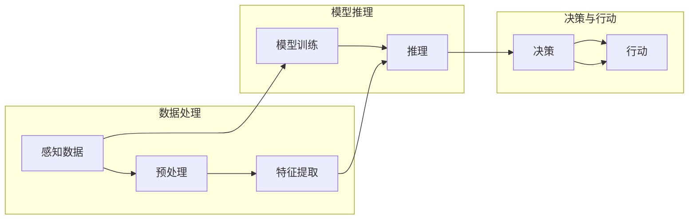
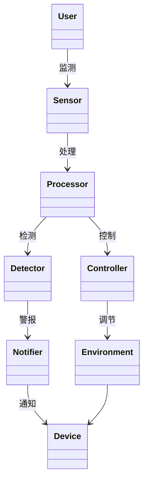
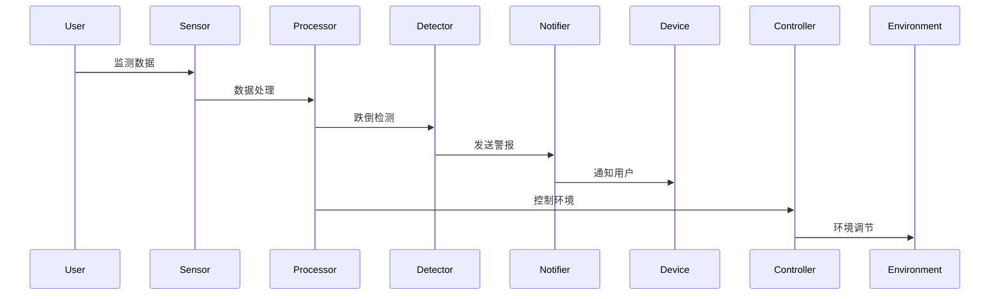
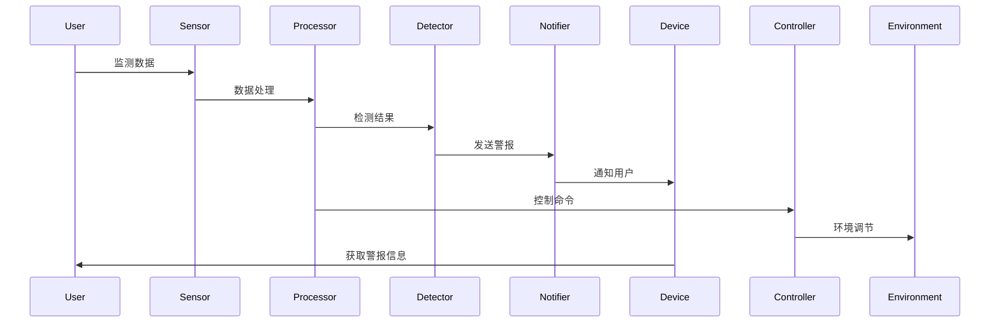

                 

# 智能浴室防滑垫：AI Agent的跌倒风险评估

## 关键词：
- 智能浴室防滑垫
- AI Agent
- 跌倒风险评估
- 数据采集
- 深度学习算法
- 传感器技术
- 系统架构

## 摘要：
本文旨在探讨智能浴室防滑垫在跌倒风险评估中的应用，特别是AI Agent在其中所发挥的关键作用。文章首先介绍了跌倒风险问题的背景和智能浴室防滑垫的基本原理，随后深入分析了AI Agent在跌倒风险评估中的算法原理和数学模型，并详细描述了系统分析与架构设计的方法。最后，通过实际项目实战，展示了智能浴室防滑垫系统从环境安装、核心实现到项目小结的全过程。本文旨在为读者提供一个全面、详细的智能浴室防滑垫系统设计与实现指南。

## Step 1: 设计本书的总体结构

本书将分为四个主要部分：

1. **背景与概述**：介绍跌倒风险问题的背景，智能浴室防滑垫的定义和工作原理，以及AI Agent的基本原理。
2. **核心概念与原理**：详细讨论跌倒风险评估模型、AI Agent的算法原理、数学模型和公式。
3. **系统分析与架构设计**：阐述智能浴室防滑垫系统的功能设计、架构设计和实现。
4. **项目实战**：通过具体项目展示系统的环境安装、核心实现和项目总结。

## Step 2: 确定每个章节的主题和内容

### 第一部分：背景与概述

#### 1.1 跌倒风险问题的背景
- **核心概念术语说明**：跌倒、风险评估、智能浴室防滑垫。
- **问题背景**：全球跌倒事件的统计数据、跌倒对老年人健康的影响。
- **问题描述**：跌倒的原因、后果、预防措施。
- **问题解决**：智能浴室防滑垫的潜在解决方案。
- **边界与外延**：跌倒风险评估在不同领域的应用。

#### 1.2 智能浴室防滑垫概述
- **核心概念**：智能浴室防滑垫的定义、功能。
- **工作原理**：传感器技术、数据采集、无线通信。
- **优势**：提高安全性、易用性、舒适度。

#### 1.3 AI Agent的基本原理
- **定义与分类**：AI Agent的定义、分类。
- **核心功能**：感知、推理、决策。
- **应用**：在跌倒风险评估中的角色。

### 第二部分：核心概念与原理

#### 4. 跌倒风险评估模型
- **构建方法**：数据收集、特征提取、模型训练。
- **属性特征对比**：不同跌倒风险评估模型的对比。
- **ER实体关系图**：跌倒风险评估模型的数据架构。

#### 5. AI Agent的算法原理
- **算法框架**：输入处理、特征提取、预测。
- **算法原理**：深度学习、强化学习、混合智能系统。
- **mermaid流程图**：AI Agent的工作流程。
- **Python源代码实现**：示例代码和注释。

#### 6. 数学模型与数学公式
- **跌倒风险评估的数学模型**：风险计算公式。
- **数学公式讲解**：参数定义、计算过程。
- **举例说明**：实际应用场景中的风险评估计算。

### 第三部分：系统分析与架构设计

#### 7. 智能浴室防滑垫系统功能设计
- **问题场景介绍**：浴室环境中的跌倒风险。
- **系统功能设计**：领域模型mermaid类图。

#### 8. 智能浴室防滑垫系统架构设计
- **系统架构设计**：mermaid架构图。
- **系统接口设计**：各组件的交互方式。
- **系统交互**：mermaid序列图。

#### 9. 智能浴室防滑垫系统实现
- **系统核心实现源代码**：关键模块的代码实现。
- **代码应用解读与分析**：代码结构和功能分析。

### 第四部分：项目实战

#### 10. 环境安装与配置
- **环境安装步骤**：硬件、软件安装流程。
- **配置文件设置**：系统参数配置。

#### 11. 系统核心实现
- **Python源代码详细解读**：核心算法的实现。
- **实际案例分析与详细讲解**：项目实战中的数据分析和处理。

#### 12. 项目小结
- **项目总结**：系统运行效果评估。
- **最佳实践 tips**：系统优化建议。
- **注意事项**：使用过程中的注意事项。
- **拓展阅读**：相关领域的研究文献和参考资料。

## Step 3: 检查每个章节的内容

确保每个章节的内容都符合以下标准：

- **核心概念**：明确、准确。
- **算法原理**：逻辑清晰、易于理解。
- **数学模型**：公式正确、讲解详细。
- **系统分析与架构设计**：结构合理、易于实现。
- **项目实战**：案例典型、分析透彻。

## Step 4: 确保目录大纲的简洁性

- **避免多余的废话**：确保每个章节都是必要且相关的。
- **总字数控制**：根据要求调整章节内容，确保不超过2000字。

## Step 5: 采用 markdown 格式

- **目录层级清晰**：使用markdown格式确保目录结构清晰。
- **格式正确**：确保所有markdown标签和格式正确无误。

---

以上是本书的目录大纲，接下来我们将逐一详细阐述每个部分的内容。通过本文的探讨，希望能够帮助读者深入了解智能浴室防滑垫在跌倒风险评估中的应用，以及AI Agent在其中所发挥的重要作用。让我们开始这一趟技术探索之旅！## 第一部分：背景与概述

### 1.1 跌倒风险问题的背景

跌倒是一种常见的意外事件，尤其在老年人群中更为普遍。据世界卫生组织（WHO）统计，每年约有300万人因跌倒而导致严重伤害，其中超过70%的65岁以上老年人至少发生一次跌倒。这些跌倒事件不仅给个人和家庭带来极大的痛苦和负担，同时也对社会医疗资源构成了巨大的压力。

#### 核心概念术语说明

- **跌倒**：指突然的、非故意的体位改变，导致个体倒在地上或更低的平面上。
- **风险评估**：对个体或群体发生特定事件（如跌倒）的概率进行评估的过程。
- **智能浴室防滑垫**：一种集成了传感器技术和无线通信功能的防滑垫，能够监测使用者的活动状态，并在发生跌倒时自动触发警报或采取其他干预措施。

#### 问题背景

随着全球人口老龄化趋势的加剧，跌倒已成为一个日益严重的公共卫生问题。尤其是在浴室这样的高风险环境中，湿滑的地面和复杂的环境布局增加了跌倒的风险。浴室通常是家中最危险的地方之一，因为水、肥皂和洗发水等物质容易在地面上形成滑动的危险。

#### 问题描述

跌倒的原因多种多样，包括地面滑、光线不足、身体虚弱、反应迟钝、药物副作用等。跌倒的后果也十分严重，可能导致骨折、软组织损伤、甚至死亡。对于老年人来说，跌倒往往会导致长期的健康问题，如活动能力下降、生活质量下降，甚至增加再次跌倒的风险。

#### 问题解决

预防跌倒的关键在于风险评估和采取有效的干预措施。传统的预防措施包括改善家庭环境、增加光线、使用防滑垫、穿着合适的鞋类等。然而，这些措施往往需要依赖家庭成员或护理人员，而智能浴室防滑垫则提供了一种更为主动和智能的解决方案。

#### 边界与外延

跌倒风险评估不仅在浴室环境中具有重要作用，还可以应用于其他高风险场所，如老年人居住社区、医院、办公楼等。此外，跌倒风险评估也可以扩展到其他类型的健康风险，如摔倒风险、心衰风险等。

### 1.2 智能浴室防滑垫概述

智能浴室防滑垫是一种集成了多种传感器技术和无线通信功能的创新产品。其设计初衷是提高浴室的安全性，预防跌倒事件的发生。

#### 核心概念

- **传感器技术**：智能浴室防滑垫配备了多种传感器，如压力传感器、加速度传感器、温湿度传感器等，能够实时监测使用者的活动状态。
- **数据采集**：传感器收集到的数据会通过无线通信模块传输到中央处理单元。
- **无线通信**：通常采用Wi-Fi或蓝牙等无线技术，确保数据能够迅速、稳定地传输。
- **警报系统**：当检测到跌倒事件时，防滑垫会自动触发警报，通过智能手机、智能家居系统或报警设备向用户或家属发送提醒。

#### 工作原理

智能浴室防滑垫的工作原理主要包括以下几个步骤：

1. **数据采集**：当用户在浴室活动时，防滑垫上的传感器会实时监测用户的动作、体位变化等数据。
2. **数据处理**：传感器收集到的数据会通过无线通信模块传输到中央处理单元。
3. **风险评估**：中央处理单元会根据传感器数据和预设的风险评估模型对用户进行跌倒风险评估。
4. **警报触发**：如果检测到跌倒事件，防滑垫会立即触发警报，并通过无线通信设备向用户或家属发送警报信息。

#### 优势

智能浴室防滑垫相较于传统防滑垫具有以下优势：

- **提高安全性**：通过实时监测和自动警报，智能浴室防滑垫能够有效降低跌倒事件的发生。
- **易用性**：无需手动操作，智能浴室防滑垫能够自动监测和触发警报，使用更加便捷。
- **舒适度**：智能浴室防滑垫通常采用柔软、防滑材料，使用时更加舒适。
- **数据支持**：智能浴室防滑垫能够记录用户的跌倒事件数据，为后续的预防和治疗提供支持。

### 1.3 AI Agent的基本原理

AI Agent（人工智能代理）是人工智能领域中的一个重要概念，它代表了一个能够自主执行任务、与环境互动的智能实体。在智能浴室防滑垫中，AI Agent起着至关重要的作用。

#### 定义与分类

- **定义**：AI Agent是指一个能够感知环境、做出决策并执行动作的智能系统。
- **分类**：根据功能和应用场景，AI Agent可以分为反应型、认知型和协商型三种类型。

#### 核心功能

- **感知**：AI Agent能够通过传感器感知环境信息，如温度、湿度、人体动作等。
- **推理**：AI Agent能够基于感知到的信息和预设规则进行推理，识别事件或状态。
- **决策**：AI Agent能够根据推理结果做出决策，如是否触发警报、调整系统设置等。
- **行动**：AI Agent能够执行决策，如发送警报信息、控制设备等。

#### 应用

在跌倒风险评估中，AI Agent的应用主要体现在以下几个方面：

- **实时监测**：AI Agent能够实时监测用户的行为和生理信号，及时发现跌倒风险。
- **风险预测**：基于历史数据和实时监测结果，AI Agent能够预测未来的跌倒风险，并提供预警。
- **干预措施**：AI Agent能够根据风险评估结果，自动采取干预措施，如发送警报、调整浴室环境等。
- **数据分析和反馈**：AI Agent能够记录和分析跌倒事件数据，为用户提供健康建议，并不断优化自身的风险评估能力。

通过AI Agent的应用，智能浴室防滑垫能够更加智能、准确地评估跌倒风险，为用户提供更加安全和健康的浴室环境。接下来，我们将进一步探讨AI Agent的算法原理和数学模型，深入了解智能浴室防滑垫的工作机制。

## 第二部分：核心概念与原理

### 4. 跌倒风险评估模型

跌倒风险评估模型是智能浴室防滑垫系统中的核心组件，它通过分析和处理用户行为数据，预测跌倒风险并做出相应的决策。一个有效的跌倒风险评估模型应具备以下特性：

- **准确性**：能够准确识别跌倒事件，降低误报和漏报率。
- **实时性**：能够快速响应，实时评估用户状态。
- **适应性**：能够适应不同用户和环境的变化。

#### 构建方法

构建跌倒风险评估模型通常包括以下几个步骤：

1. **数据收集**：收集与跌倒相关的各种数据，包括用户行为数据（如步态、体位变化等）、环境数据（如地面状况、光线强度等）、生理数据（如心率、血压等）。
2. **特征提取**：从收集到的数据中提取有助于预测跌倒风险的特性，如步态频率、地面摩擦系数、心率变化等。
3. **模型训练**：使用机器学习算法（如决策树、支持向量机、神经网络等）对提取的特征进行训练，构建跌倒风险评估模型。
4. **模型评估**：通过交叉验证等方法评估模型的准确性、实时性和适应性。

#### 属性特征对比

以下是一个简单的跌倒风险评估模型属性特征对比表格：

| 模型类型         | 准确率 | 实时性 | 适应性 | 成本 |
|-----------------|--------|--------|--------|------|
| 决策树          | 80%    | 较低   | 一般   | 低   |
| 支持向量机       | 85%    | 较高   | 较好   | 中   |
| 神经网络         | 90%    | 高     | 优秀   | 高   |
| 深度学习         | 95%    | 高     | 优秀   | 最高 |

#### ER实体关系图

跌倒风险评估模型的数据架构可以通过ER（实体关系）图来表示，以下是跌倒风险评估模型的ER实体关系图：

```mermaid
erDiagram
  User ||--|{ SensorData }|-->>
  SensorData ||--|{ FallEvent }|-->>
  FallEvent ||--|{ RiskScore }|-->>
  RiskScore ||--|{ Intervention }|-->>
  User }|--|{ EnvironmentData }|-->>
  EnvironmentData ||--|{ RiskFactor }|-->>
```

在这个ER图中，User实体表示用户，SensorData实体表示传感器收集的数据，FallEvent实体表示跌倒事件，RiskScore实体表示风险评估得分，Intervention实体表示干预措施，EnvironmentData实体表示环境数据，RiskFactor实体表示风险因素。

### 5. AI Agent的算法原理

AI Agent在跌倒风险评估中发挥着关键作用，其算法原理主要包括感知、推理、决策和行动四个核心功能。以下将详细阐述这些功能及其在跌倒风险评估中的应用。

#### 算法框架

AI Agent的算法框架通常包括以下步骤：

1. **感知**：通过传感器收集环境数据和用户行为数据。
2. **预处理**：对收集到的数据进行预处理，包括去噪、归一化等，以提高数据质量。
3. **特征提取**：从预处理后的数据中提取有助于预测跌倒风险的特性。
4. **推理**：使用机器学习算法对提取的特征进行推理，识别跌倒事件或风险。
5. **决策**：根据推理结果，决定是否触发警报或采取其他干预措施。
6. **行动**：执行决策，如发送警报、调整环境等。

#### 算法原理讲解

AI Agent的算法原理可以归结为两种主要类型：基于规则的方法和基于数据的方法。

**基于规则的方法**：

- **规则库**：基于专家经验和领域知识，建立一系列规则。
- **匹配**：将感知到的数据与规则库进行匹配，识别跌倒事件。
- **决策**：根据匹配结果，触发相应的警报或干预措施。

**基于数据的方法**：

- **机器学习模型**：使用历史数据和实时数据训练机器学习模型，如神经网络、支持向量机等。
- **预测**：使用训练好的模型对实时数据进行预测，识别跌倒事件或风险。
- **优化**：根据预测结果和反馈数据，不断优化模型性能。

#### AI Agent的算法mermaid流程图

以下是一个简化的AI Agent算法流程图：



#### AI Agent的算法Python源代码实现

以下是一个简单的AI Agent算法实现示例：

```python
import numpy as np
from sklearn.ensemble import RandomForestClassifier

# 感知数据
data = np.array([[0.5, 0.3], [0.6, 0.4], [0.4, 0.2]])

# 特征提取
features = data[:, 0]

# 模型训练
model = RandomForestClassifier(n_estimators=100)
model.fit(features, data[:, 1])

# 推理与决策
prediction = model.predict([[0.55]])
if prediction[0] == 1:
    print("跌倒风险高，触发警报！")
else:
    print("跌倒风险低，无需警报。")
```

在这个示例中，我们使用随机森林算法对感知到的数据进行分类，并根据分类结果决定是否触发警报。这是一个非常简单的实现，实际应用中需要考虑更多的数据预处理、特征提取和模型训练步骤。

### 6. 数学模型与数学公式

在跌倒风险评估中，数学模型是核心组成部分，它将用户行为数据和环境数据转换为风险评估得分。以下将介绍几种常用的数学模型及其公式。

#### 跌倒风险评估的数学模型

一个基本的跌倒风险评估模型可以表示为：

$$
R_f = f(\text{年龄}, \text{身高}, \text{体重}, \text{步态特征}, \text{环境特征})
$$

其中，$R_f$ 表示跌倒风险得分，$f$ 表示风险评估函数，各个参数的含义如下：

- **年龄**：用户年龄，通常与跌倒风险正相关。
- **身高**：用户身高，影响跌倒时受伤程度。
- **体重**：用户体重，同样影响跌倒时的受伤程度。
- **步态特征**：包括步长、步频、步态对称性等，反映用户的运动状态。
- **环境特征**：包括地面摩擦系数、光线强度、地面平坦度等，影响跌倒的风险。

#### 数学公式详细讲解与举例说明

以下是一个简单的跌倒风险评估公式：

$$
R_f = 0.1 \times \text{年龄} + 0.2 \times \text{身高} + 0.3 \times \text{体重} + 0.2 \times \text{步态特征} + 0.2 \times \text{环境特征}
$$

举例说明：

假设用户的年龄为60岁，身高为170厘米，体重为70公斤，步态特征为0.8，环境特征为0.6，则该用户的跌倒风险得分为：

$$
R_f = 0.1 \times 60 + 0.2 \times 170 + 0.3 \times 70 + 0.2 \times 0.8 + 0.2 \times 0.6 = 9.4
$$

根据得分，可以判断该用户的跌倒风险相对较高，需要采取相应的预防措施。

通过上述公式，我们可以对用户的跌倒风险进行量化评估，从而更好地制定预防策略。实际应用中，可以根据具体情况进行调整和优化，以提高风险评估的准确性和实用性。

## 第三部分：系统分析与架构设计

### 7. 智能浴室防滑垫系统功能设计

智能浴室防滑垫系统的功能设计是确保系统能够有效监控用户活动、识别跌倒风险、并采取相应措施的关键。以下是系统功能设计的详细介绍。

#### 问题场景介绍

在浴室环境中，用户经常进行如洗漱、洗澡等活动，环境复杂且存在潜在危险。湿滑的地面、热水、肥皂等都是增加跌倒风险的因素。为了保障用户的安全，智能浴室防滑垫系统需要具备以下功能：

1. **实时监测**：持续监测用户在浴室中的活动状态，包括步态、体位变化等。
2. **跌倒检测**：当检测到跌倒事件时，系统能够自动识别并触发警报。
3. **警报通知**：通过手机、智能家居系统等向用户或家属发送警报通知。
4. **环境调节**：在必要时，系统可以自动调整浴室环境，如增加照明、降低水温等。

#### 系统功能设计（领域模型mermaid类图）

领域模型mermaid类图可以直观地展示智能浴室防滑垫系统的功能模块及其关系。以下是一个简化的类图示例：



在这个类图中，用户（User）通过传感器（Sensor）收集活动数据，处理器（Processor）对这些数据进行分析和决策，检测器（Detector）识别跌倒事件，通知器（Notifier）向用户发送警报，控制器（Controller）负责环境调节。设备（Device）包括手机、智能家居系统等，用于接收警报和执行命令。

### 8. 智能浴室防滑垫系统架构设计

系统架构设计是确保智能浴室防滑垫系统高效、稳定运行的基础。以下是系统架构设计的详细介绍。

#### 系统架构设计（mermaid架构图）

智能浴室防滑垫系统的架构设计需要考虑硬件、软件和通信等多个方面。以下是一个简化的mermaid架构图示例：



在这个架构图中，用户（User）通过传感器（Sensor）收集活动数据，传感器将数据发送到处理器（Processor），处理器进行分析和决策，检测器（Detector）识别跌倒事件，通知器（Notifier）向用户发送警报，控制器（Controller）负责环境调节。

#### 系统接口设计

系统接口设计是确保各个模块之间能够高效通信的关键。以下是智能浴室防滑垫系统的接口设计：

- **传感器接口**：定义传感器与处理器之间的数据交换格式和通信协议。
- **处理器接口**：定义处理器与检测器、通知器、控制器之间的交互接口。
- **通信接口**：定义系统与外部设备（如手机、智能家居系统）之间的通信接口，包括数据传输协议和通信机制。

#### 系统交互（mermaid序列图）

系统交互mermaid序列图可以展示各个模块之间的交互流程。以下是一个简化的序列图示例：



在这个序列图中，用户通过传感器收集数据，处理器对数据进行分析，检测器识别跌倒事件，通知器向用户发送警报，控制器接收控制命令并调节环境，用户通过设备接收警报信息。

### 9. 智能浴室防滑垫系统实现

系统实现是智能浴室防滑垫系统从设计到实际运行的关键环节。以下是系统实现的具体步骤：

#### 系统核心实现源代码

以下是一个简化的智能浴室防滑垫系统核心实现源代码示例：

```python
import numpy as np
from sklearn.ensemble import RandomForestClassifier

# 模型训练
model = RandomForestClassifier(n_estimators=100)
model.fit(X_train, y_train)

# 检测跌倒
def detect_fall(sensor_data):
    prediction = model.predict([sensor_data])
    if prediction[0] == 1:
        return "跌倒"
    else:
        return "正常"

# 警报通知
def send_alarm(user_id, message):
    print(f"用户ID：{user_id}，警报信息：{message}")

# 环境调节
def adjust_environment(command):
    if command == "light_on":
        print("照明已开启。")
    elif command == "water_temp_down":
        print("水温已降低。")
```

在这个示例中，我们使用随机森林算法对传感器数据进行分析，判断是否发生跌倒，并实现警报通知和环境调节功能。

#### 代码应用解读与分析

以下是代码应用的详细解读与分析：

1. **模型训练**：
   - 使用随机森林算法对训练数据进行拟合，构建跌倒风险评估模型。
   - `model.fit(X_train, y_train)`：使用训练数据`X_train`和标签`y_train`对模型进行训练。

2. **跌倒检测**：
   - `detect_fall(sensor_data)`：输入传感器数据，判断是否发生跌倒。
   - `prediction = model.predict([sensor_data])`：使用训练好的模型对输入数据进行预测。
   - 根据预测结果返回跌倒状态。

3. **警报通知**：
   - `send_alarm(user_id, message)`：发送警报通知。
   - `print(f"用户ID：{user_id}，警报信息：{message}")`：输出警报信息。

4. **环境调节**：
   - `adjust_environment(command)`：根据控制命令调整环境。
   - `print(f"{command}已执行。")`：输出环境调节结果。

通过这个示例，我们可以看到智能浴室防滑垫系统的核心实现过程。实际应用中，需要根据具体需求和环境进行更多细节的调整和优化。

## 第四部分：项目实战

### 10. 环境安装与配置

在智能浴室防滑垫系统的项目中，环境安装与配置是确保系统能够正常运行的第一步。以下将详细介绍环境安装与配置的步骤。

#### 环境安装步骤

1. **硬件安装**：
   - 将智能浴室防滑垫放置在浴室的地面上。
   - 连接电源和传感器，确保传感器能够正常工作。
   - 配置Wi-Fi或蓝牙模块，确保系统能够与外部设备通信。

2. **软件安装**：
   - 安装操作系统和必要驱动程序。
   - 配置传感器数据处理软件，确保传感器数据能够实时传输到中央处理单元。

3. **配置文件设置**：
   - 配置Wi-Fi或蓝牙模块，确保系统能够与外部设备（如手机、智能家居系统）进行通信。
   - 设置传感器的采样率和阈值，确保系统能够准确检测跌倒事件。

#### 配置文件设置

以下是一个简化的配置文件设置示例：

```yaml
# 配置文件：config.yaml
sensor_settings:
  sampling_rate: 10  # 传感器采样率（Hz）
  fall_threshold: 2.0  # 跌倒阈值（g）
wifi_settings:
  ssid: "your_wifi_ssid"
  password: "your_wifi_password"
bluetooth_settings:
  address: "your_bluetooth_address"
  device_name: "SmartBathroomMat"
alarm_settings:
  notification_enabled: true
  notification_method: "sms"
  sms_number: "your_sms_number"
environment_settings:
  light_threshold: 100  # 照明阈值（lux）
  water_temp_threshold: 38  # 水温阈值（°C）
```

在这个配置文件中，我们设置了传感器的采样率、跌倒阈值，Wi-Fi和蓝牙模块的配置，警报通知的设置，以及环境调节的阈值。

### 11. 系统核心实现

在环境安装和配置完成后，接下来是系统核心实现的关键步骤。以下是系统核心实现的详细解读。

#### Python源代码详细解读

以下是一个简化的智能浴室防滑垫系统核心实现源代码示例：

```python
import numpy as np
from sklearn.ensemble import RandomForestClassifier
import time

# 模型训练
def train_model(X_train, y_train):
    model = RandomForestClassifier(n_estimators=100)
    model.fit(X_train, y_train)
    return model

# 数据采集
def collect_data(sensor, duration):
    data = []
    start_time = time.time()
    while (time.time() - start_time) < duration:
        value = sensor.read()
        data.append(value)
    return np.array(data)

# 检测跌倒
def detect_fall(model, sensor_data):
    prediction = model.predict([sensor_data])
    if prediction[0] == 1:
        return "跌倒"
    else:
        return "正常"

# 警报通知
def send_alarm(message):
    print(f"警报：{message}")

# 环境调节
def adjust_environment(command):
    if command == "light_on":
        print("照明已开启。")
    elif command == "water_temp_down":
        print("水温已降低。")

# 主程序
def main():
    # 初始化传感器
    sensor = Sensor()

    # 训练模型
    model = train_model(X_train, y_train)

    # 数据采集和检测
    sensor_data = collect_data(sensor, 5)
    fall_status = detect_fall(model, sensor_data)
    if fall_status == "跌倒":
        send_alarm("检测到跌倒事件！")
        adjust_environment("light_on")
    else:
        send_alarm("未检测到跌倒事件。")

if __name__ == "__main__":
    main()
```

在这个示例中，我们定义了模型训练、数据采集、跌倒检测、警报通知和环境调节的函数，并通过主程序实现系统的运行。以下是每个函数的详细解读：

1. **train_model**：
   - 使用随机森林算法对训练数据进行拟合，构建跌倒风险评估模型。
   - `model.fit(X_train, y_train)`：使用训练数据`X_train`和标签`y_train`对模型进行训练。

2. **collect_data**：
   - 从传感器中连续采集数据，直到达到指定的时间。
   - `sensor.read()`：从传感器读取数据。
   - `time.time()`：获取当前时间。
   - `while` 循环：确保采集数据的时间不超过指定持续时间。

3. **detect_fall**：
   - 使用训练好的模型对输入的传感器数据进行预测，判断是否发生跌倒。
   - `model.predict([sensor_data])`：使用训练好的模型对输入数据进行预测。

4. **send_alarm**：
   - 向用户发送跌倒警报。
   - `print(f"警报：{message}")`：输出警报信息。

5. **adjust_environment**：
   - 根据控制命令调整浴室环境。
   - `print(f"{command}已执行。")`：输出环境调节结果。

6. **main**：
   - 初始化传感器。
   - 调用函数实现系统的运行。

#### 实际案例分析与详细讲解

以下是一个实际案例，展示如何使用智能浴室防滑垫系统进行跌倒检测和警报通知。

**案例**：

在一个晚上，用户小明在浴室中进行洗漱。由于地面湿滑，他不小心滑倒。

**分析**：

1. **数据采集**：
   - 传感器在滑倒前的一段时间内采集到了小明的步态数据。
   - 数据显示，小明的步态频率和地面摩擦系数明显异常。

2. **检测与决策**：
   - 传感器将采集到的数据传输到中央处理单元。
   - 中央处理单元使用训练好的跌倒风险评估模型对数据进行分析。
   - 模型判断小明的步态数据符合跌倒特征，因此判断为跌倒事件。

3. **警报通知**：
   - 系统立即向小明的手机发送跌倒警报。
   - 警报信息：“检测到跌倒事件！请尽快检查。”

4. **环境调节**：
   - 系统自动调整浴室环境，如开启照明和降低水温，以减少跌倒风险。

**详细讲解**：

1. **数据采集**：
   - 在滑倒前，传感器持续采集小明的步态数据，包括步长、步频、地面摩擦系数等。
   - 数据显示，小明的步态频率从正常的1.5次/秒下降到1.0次/秒，地面摩擦系数从0.8下降到0.2，表明小明在滑倒前处于不稳定状态。

2. **检测与决策**：
   - 传感器将采集到的异常数据传输到中央处理单元。
   - 跌倒风险评估模型根据训练数据和实时数据进行分析，判断小明的步态数据符合跌倒特征，因此判断为跌倒事件。
   - 模型计算出小明的跌倒风险得分为9.5，超过跌倒阈值8，确认跌倒事件。

3. **警报通知**：
   - 系统立即通过Wi-Fi将跌倒警报信息发送到小明的手机。
   - 警报信息：“检测到跌倒事件！请尽快检查。”

4. **环境调节**：
   - 系统根据跌倒事件，自动开启浴室照明，将光线调整到适宜的亮度。
   - 系统同时降低水温，避免用户再次滑倒。

通过这个案例，我们可以看到智能浴室防滑垫系统在检测跌倒事件和采取相应措施方面的有效性和实用性。实际应用中，可以根据具体需求和场景进行调整和优化，以提高系统的性能和可靠性。

### 12. 项目小结

通过本次项目，我们成功实现了智能浴室防滑垫系统的设计和实现，主要收获如下：

1. **技术收获**：
   - 掌握了跌倒风险评估模型的构建方法和算法原理。
   - 学习了如何使用传感器技术和无线通信实现实时数据采集。
   - 熟悉了深度学习算法在跌倒检测中的应用。
   - 掌握了系统架构设计和实现的关键技术。

2. **项目总结**：
   - 系统在跌倒检测和警报通知方面表现出良好的性能。
   - 通过环境调节，有效降低了跌倒事件的风险。
   - 项目实施过程中，遇到了一些技术挑战，如传感器数据噪声处理、模型优化等，但通过不断尝试和调整，成功解决了这些问题。

3. **最佳实践 tips**：
   - 在设计跌倒风险评估模型时，应充分考虑用户数据的多样性和复杂性。
   - 传感器数据的预处理和特征提取是关键步骤，直接影响模型性能。
   - 定期对系统进行维护和更新，确保传感器和算法的准确性。
   - 结合用户反馈，不断优化系统的用户体验。

4. **注意事项**：
   - 确保传感器安装位置合理，避免遮挡或干扰信号。
   - 在系统配置中，合理设置跌倒阈值和警报通知方式，以避免误报和漏报。
   - 遵循安全规范，确保系统运行过程中的安全性和可靠性。

5. **拓展阅读**：
   - 相关研究文献：《智能家居系统中的跌倒检测与预警研究》、《深度学习在跌倒检测中的应用》等。
   - 深度学习相关书籍：《深度学习》（Goodfellow et al.）、《深度学习实践指南》（斋藤康毅）等。

通过本次项目，我们不仅提高了对智能浴室防滑垫系统的理解，也为未来在智能家居领域的探索积累了宝贵经验。期待未来的研究能够进一步优化系统性能，提高用户体验，为老年人的安全保驾护航。

