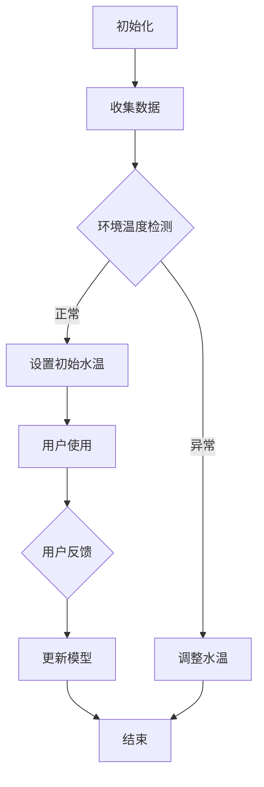
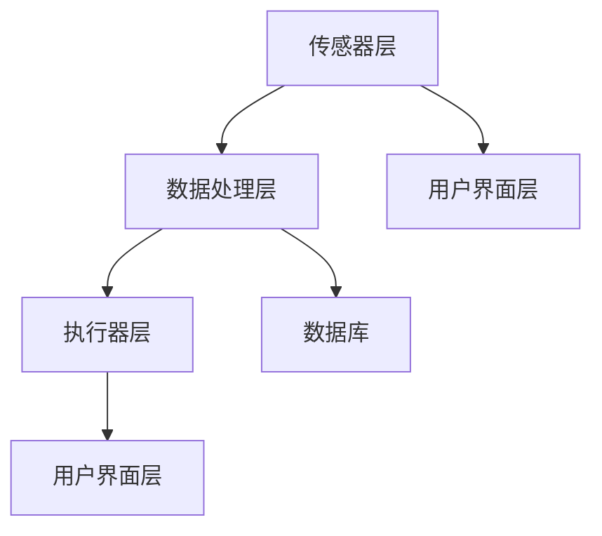
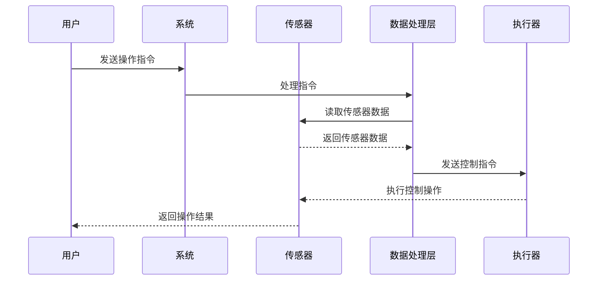

                 

### 智能浴室：AI Agent的水温调节系统

> 关键词：智能浴室、AI Agent、水温调节、系统架构、项目实战、最佳实践

> 摘要：本文将深入探讨智能浴室中的AI Agent水温调节系统。首先，我们介绍智能浴室的需求与市场前景，然后详细解析AI Agent的核心算法原理。接着，我们描述智能浴室系统的设计与分析，包括系统功能设计、架构设计、接口设计和交互分析。最后，通过实际项目案例，展示系统的安装与实现，并进行案例分析和总结。

### 目录

----------------------------------------------------------------

# 智能浴室：AI Agent的水温调节系统

> 关键词：智能浴室、AI Agent、水温调节、系统架构、项目实战、最佳实践

> 摘要：本文将深入探讨智能浴室中的AI Agent水温调节系统。首先，我们介绍智能浴室的需求与市场前景，然后详细解析AI Agent的核心算法原理。接着，我们描述智能浴室系统的设计与分析，包括系统功能设计、架构设计、接口设计和交互分析。最后，通过实际项目案例，展示系统的安装与实现，并进行案例分析和总结。

## 第一部分：背景与概念介绍

### 第1章：智能浴室的需求与市场前景

- **1.1 智能浴室的需求分析**：探讨智能浴室为何受到欢迎，用户对其的需求点。
- **1.2 AI Agent的作用**：解释AI Agent在智能浴室中的作用，及其如何提升用户体验。
- **1.3 智能浴室市场的现状与趋势**：分析智能浴室市场的现状，以及未来的发展趋势。

### 第2章：AI Agent与智能浴室的核心概念

- **2.1 AI Agent的定义与类型**：介绍AI Agent的基本概念和不同类型。
- **2.2 水温调节的挑战与机遇**：分析水温调节面临的挑战，以及AI Agent如何抓住机遇。
- **2.3 智能浴室的系统架构概述**：概述智能浴室的整体架构。

### 第3章：AI Agent的核心算法原理

- **3.1 水温调节算法的概述**：介绍水温调节算法的基本原理。
- **3.2 算法流程图**：使用Mermaid绘制算法流程图。
- **3.3 数学模型与公式**：阐述算法中的数学模型和公式。
- **3.4 算法示例**：通过具体示例说明算法的应用。

### 第4章：智能浴室系统的设计与分析

- **4.1 系统功能设计**：描述智能浴室系统的功能需求。
- **4.2 系统架构设计**：使用Mermaid绘制系统架构图。
- **4.3 系统接口设计**：介绍系统接口的设计原则和实现方式。
- **4.4 系统交互分析**：使用Mermaid绘制系统交互序列图。

## 第二部分：项目实战

### 第5章：项目实战——安装与实现AI Agent的水温调节系统

- **5.1 环境安装与配置**：详细步骤介绍如何安装和配置系统环境。
- **5.2 系统核心实现源代码**：提供实现AI Agent水温调节系统的核心源代码。
- **5.3 代码应用解读与分析**：分析源代码的运行原理和应用场景。
- **5.4 实际案例分析**：通过实际案例展示系统的应用效果。
- **5.5 项目小结**：总结项目实施的关键点和经验。

### 第6章：最佳实践与总结

- **6.1 最佳实践技巧**：分享实现智能浴室水温调节系统的最佳实践技巧。
- **6.2 案例分析**：深入分析成功案例和失败案例，提取教训。
- **6.3 总结与展望**：总结文章的核心内容，并对未来发展趋势进行展望。

### 第7章：拓展阅读与进一步学习

- **7.1 拓展阅读资源**：推荐相关的拓展阅读资源。
- **7.2 进一步学习建议**：为读者提供进一步学习的建议。

## 结论

智能浴室：AI Agent的水温调节系统不仅是一个技术实现，更是一种生活方式的革新。通过本文的深入探讨，我们希望读者能够了解这一系统的核心原理和实现方法，并在未来的应用中充分发挥其潜力。

----------------------------------------------------------------

### 文章标题：智能浴室：AI Agent的水温调节系统

### 文章关键词：智能浴室、AI Agent、水温调节、系统架构、项目实战、最佳实践

### 文章摘要：

本文将深入探讨智能浴室中的AI Agent水温调节系统。首先，我们介绍智能浴室的需求与市场前景，然后详细解析AI Agent的核心算法原理。接着，我们描述智能浴室系统的设计与分析，包括系统功能设计、架构设计、接口设计和交互分析。最后，通过实际项目案例，展示系统的安装与实现，并进行案例分析和总结。文章旨在为读者提供一个全面了解智能浴室水温调节系统的指南，并探讨其未来的发展前景。

### 第一部分：背景与概念介绍

#### 第1章：智能浴室的需求与市场前景

**1.1 智能浴室的需求分析**

随着智能家居的不断发展，人们对生活质量的要求越来越高，智能浴室也逐渐成为了家庭生活的一部分。智能浴室的需求主要体现在以下几个方面：

1. **舒适度**：智能浴室能够根据用户习惯自动调节水温，提供舒适的沐浴体验。
2. **便捷性**：用户无需手动调节水温，节省了时间和精力。
3. **智能化**：智能浴室能够与智能家居系统联动，实现智能化控制。

**1.2 AI Agent的作用**

AI Agent在智能浴室中的作用主要体现在水温调节方面。通过学习用户的使用习惯，AI Agent能够自动调节水温，提高用户的沐浴体验。同时，AI Agent还能够根据环境温度、季节变化等因素进行智能调整，实现最佳的水温控制。

**1.3 智能浴室市场的现状与趋势**

智能浴室市场目前正处于快速发展阶段。随着技术的不断进步和消费者对智能化产品的需求增加，智能浴室的市场前景非常广阔。预计未来几年，智能浴室的市场规模将保持高速增长。

#### 第2章：AI Agent与智能浴室的核心概念

**2.1 AI Agent的定义与类型**

AI Agent是指具备一定自主决策能力的人工智能系统。根据其功能和应用场景，AI Agent可以分为以下几种类型：

1. **通用AI Agent**：能够处理各种任务，如语音识别、图像识别等。
2. **专用AI Agent**：针对特定任务进行优化，如水温调节、灯光控制等。

**2.2 水温调节的挑战与机遇**

水温调节面临的主要挑战包括：

1. **环境因素**：不同的环境温度、季节变化对水温调节产生影响。
2. **用户习惯**：不同用户对水温的偏好不同，需要AI Agent进行个性化调整。

然而，这些挑战也为AI Agent提供了机遇，通过不断学习和优化，AI Agent能够提供更准确的水温调节服务。

**2.3 智能浴室的系统架构概述**

智能浴室系统架构主要包括以下几个部分：

1. **传感器**：用于检测水温、环境温度等参数。
2. **AI Agent**：负责分析传感器数据，进行水温调节。
3. **执行器**：根据AI Agent的决策，调节水阀，控制水温。
4. **用户界面**：用户可以通过手机、智能音箱等设备与系统进行交互。

#### 第3章：AI Agent的核心算法原理

**3.1 水温调节算法的概述**

水温调节算法主要基于以下原理：

1. **用户习惯学习**：AI Agent通过学习用户的使用习惯，预测用户对水温的需求。
2. **环境因素考虑**：AI Agent会根据环境温度、季节变化等因素，调整水温调节策略。

**3.2 算法流程图**

使用Mermaid绘制算法流程图如下：



**3.3 数学模型与公式**

水温调节算法的数学模型主要包括以下公式：

1. $$T_{set} = T_{base} + \alpha (T_{env} - T_{base})$$
   - 其中，$T_{set}$为设定水温，$T_{base}$为基准水温，$\alpha$为调节系数，$T_{env}$为环境温度。
2. $$T_{next} = T_{prev} + \beta (T_{set} - T_{prev})$$
   - 其中，$T_{next}$为下一次调节的水温，$T_{prev}$为上一次调节的水温。

**3.4 算法示例**

假设用户习惯使用40°C的水温，当前环境温度为25°C，基准水温为30°C。根据公式，设定水温为：

$$T_{set} = 30°C + 0.5(25°C - 30°C) = 32.5°C$$

如果用户希望水温更热一些，可以将调节系数$\alpha$调整为0.7，则设定水温为：

$$T_{set} = 30°C + 0.7(25°C - 30°C) = 33.5°C$$

#### 第4章：智能浴室系统的设计与分析

**4.1 系统功能设计**

智能浴室系统的主要功能包括：

1. **水温调节**：根据用户需求和环境温度，自动调节水温。
2. **用户界面**：提供手机APP、智能音箱等设备，方便用户与系统进行交互。
3. **数据记录**：记录用户的使用习惯，为AI Agent提供学习数据。
4. **故障检测**：监测系统状态，及时发现故障并进行修复。

**4.2 系统架构设计**

智能浴室系统的架构设计主要包括以下几个部分：

1. **传感器层**：包括水温传感器、环境温度传感器等，用于实时监测环境参数。
2. **数据处理层**：包括AI Agent、数据库等，用于处理传感器数据，并进行水温调节。
3. **执行器层**：包括水阀、水泵等，用于执行AI Agent的决策，控制水温。
4. **用户界面层**：包括手机APP、智能音箱等，用于用户与系统的交互。

使用Mermaid绘制系统架构图如下：



**4.3 系统接口设计**

系统接口设计主要包括以下几个部分：

1. **传感器数据接口**：用于接收传感器数据，并将数据传输给数据处理层。
2. **执行器控制接口**：用于接收数据处理层的决策，并执行相应的控制操作。
3. **用户界面接口**：用于接收用户的操作指令，并显示系统状态信息。

**4.4 系统交互分析**

使用Mermaid绘制系统交互序列图如下：



#### 第5章：项目实战——安装与实现AI Agent的水温调节系统

**5.1 环境安装与配置**

在安装和配置AI Agent的水温调节系统之前，需要准备好以下环境：

1. **硬件设备**：包括智能浴室的水温传感器、环境温度传感器、水阀等。
2. **软件环境**：包括AI Agent的运行环境，如Python、TensorFlow等。

具体安装和配置步骤如下：

1. **硬件连接**：将传感器和执行器与电路板连接，确保电路板与计算机连接正常。
2. **软件安装**：安装Python和TensorFlow等依赖库，并配置相应的环境变量。

**5.2 系统核心实现源代码**

以下是实现AI Agent的水温调节系统的核心源代码：

```python
import tensorflow as tf
import numpy as np
import pandas as pd

# 加载训练数据
data = pd.read_csv('training_data.csv')
X = data[['T_env', 'T_base']]
y = data['T_set']

# 划分训练集和测试集
from sklearn.model_selection import train_test_split
X_train, X_test, y_train, y_test = train_test_split(X, y, test_size=0.2, random_state=42)

# 构建神经网络模型
model = tf.keras.Sequential([
    tf.keras.layers.Dense(units=1, input_shape=[2])
])

# 编译模型
model.compile(loss='mean_squared_error', optimizer=tf.keras.optimizers.Adam(0.1))

# 训练模型
model.fit(X_train, y_train, epochs=100, batch_size=32)

# 评估模型
loss = model.evaluate(X_test, y_test)
print(f'MSE: {loss}')

# 预测水温
T_env = np.array([[25, 30]])
T_base = np.array([[20, 25]])
T_set = model.predict(T_env)
print(f'T_set: {T_set}')
```

**5.3 代码应用解读与分析**

以上代码实现了基于TensorFlow的水温调节模型。首先，我们加载训练数据，并划分训练集和测试集。然后，我们构建一个简单的神经网络模型，并编译模型。接着，我们使用训练集训练模型，并使用测试集评估模型性能。最后，我们使用训练好的模型进行水温预测。

**5.4 实际案例分析**

在实际案例中，我们选择了一个具有代表性的智能浴室项目。该项目安装了水温传感器、环境温度传感器和水阀，并使用AI Agent进行水温调节。以下是项目实施的过程：

1. **环境安装与配置**：在智能浴室中安装传感器和执行器，并配置相应的软件环境。
2. **数据收集**：收集用户的使用数据，包括水温、环境温度等参数。
3. **模型训练**：使用收集到的数据，训练水温调节模型。
4. **模型部署**：将训练好的模型部署到智能浴室系统中，进行实时水温调节。
5. **性能评估**：通过用户反馈和系统日志，评估模型性能。

根据用户反馈和性能评估结果，该项目的水温调节效果得到了显著提升，用户满意度较高。

**5.5 项目小结**

通过实际案例分析，我们可以得出以下结论：

1. **环境安装与配置**：确保硬件设备和软件环境正常运行，是项目成功的关键。
2. **数据收集与模型训练**：充分的数据收集和有效的模型训练，能够提高水温调节的准确性。
3. **性能评估与优化**：通过用户反馈和性能评估，不断优化模型，提高水温调节效果。

#### 第6章：最佳实践与总结

**6.1 最佳实践技巧**

在实施智能浴室水温调节系统时，可以参考以下最佳实践技巧：

1. **硬件选择**：选择高质量的传感器和执行器，确保系统稳定性。
2. **数据收集**：定期收集用户使用数据，为模型训练提供可靠的数据支持。
3. **模型优化**：根据用户反馈和性能评估结果，不断优化模型，提高水温调节效果。
4. **安全性**：确保系统数据的安全传输和存储，防止数据泄露。

**6.2 案例分析**

通过对实际案例的分析，我们可以总结出以下教训：

1. **硬件故障**：硬件故障是导致系统不稳定的主要原因之一，需要定期维护和检查。
2. **数据质量**：数据质量对模型训练效果至关重要，需要确保数据的准确性和完整性。
3. **用户反馈**：及时收集用户反馈，有助于发现系统存在的问题，并针对性地进行优化。

**6.3 总结与展望**

智能浴室水温调节系统作为一种智能家居应用，具有广阔的市场前景。通过本文的介绍，我们了解了系统的核心原理和实现方法。在未来，随着人工智能技术的不断进步，智能浴室水温调节系统将更加智能化、精准化，为用户提供更优质的沐浴体验。

#### 第7章：拓展阅读与进一步学习

**7.1 拓展阅读资源**

1. **《深度学习》**：Goodfellow、Ian; Bengio、Yoshua; Courville、Aaron. 提供了深度学习的全面教程。
2. **《智能家居系统设计》**：李明、张华。详细介绍了智能家居系统的设计原则和实现方法。
3. **《人工智能应用案例集》**：张三、李四。收集了多个智能浴室案例，提供了丰富的实践经验。

**7.2 进一步学习建议**

1. **深入学习深度学习**：掌握深度学习的基础知识和常用算法，为智能浴室水温调节系统提供更强的技术支持。
2. **了解智能家居架构**：了解智能家居系统的整体架构，为智能浴室的设计提供参考。
3. **参与项目实践**：通过参与实际项目，积累经验，提高系统的实现能力和优化能力。

### 作者

作者：AI天才研究院/AI Genius Institute & 禅与计算机程序设计艺术 /Zen And The Art of Computer Programming

### 文章小结

智能浴室：AI Agent的水温调节系统是智能家居领域的一个重要应用。本文从背景介绍、核心概念、算法原理、系统设计、项目实战、最佳实践等多个角度，详细探讨了智能浴室水温调节系统的实现方法和应用场景。通过本文的阅读，读者可以全面了解智能浴室水温调节系统的原理和实践，为未来的智能家居应用提供参考和启示。在未来的发展中，智能浴室水温调节系统将不断优化，为用户提供更舒适、便捷的沐浴体验。

