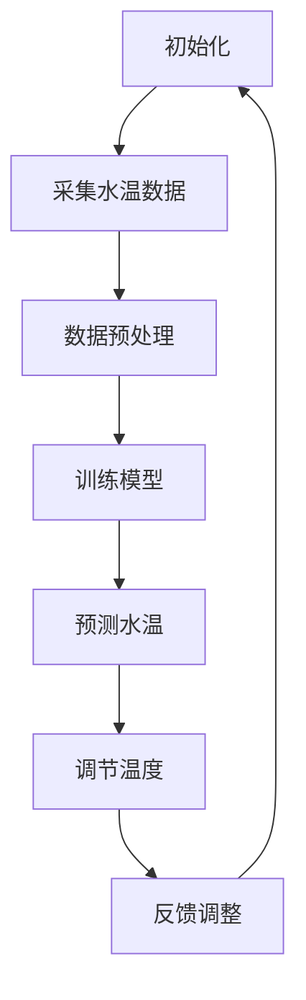

                 


# 《智能浴缸：AI Agent的水温调节系统》

## 关键词
智能浴缸，AI Agent，水温调节，算法原理，系统架构，项目实战

## 摘要
本文旨在深入探讨智能浴缸中的AI Agent水温调节系统。我们将一步步分析并讲解该系统的设计、实现和应用，帮助读者全面了解智能浴缸的运作原理和技术细节。通过本文，您将掌握从算法原理到系统架构，再到项目实战的全过程，为实际应用奠定坚实基础。

### 引言
智能浴缸作为智能家居的重要组成部分，正逐渐走进人们的日常生活。它不仅提供了舒适的泡浴体验，还通过智能化的水温调节，实现了个性化服务。AI Agent作为智能浴缸的核心组件，负责实时监测水温、并根据用户需求进行调节。本文将围绕AI Agent的水温调节系统，进行全方位剖析。

### 第一部分：背景介绍

#### 1.1 问题背景
智能浴缸的水温调节是一项关键技术，直接影响用户体验。传统的水温调节方法存在响应速度慢、调节精度低等问题。而AI Agent的引入，有望大幅提升水温调节的效率和准确性。

#### 1.2 问题描述
智能浴缸的水温调节系统需要解决以下几个关键问题：
- 实时监测水温，确保水温稳定在用户设定的范围内。
- 快速响应温度变化，避免水温过热或过冷。
- 根据用户习惯和学习算法，提供个性化的水温调节服务。

#### 1.3 问题解决
AI Agent通过以下方式解决上述问题：
- 利用传感器实时获取水温数据。
- 运用学习算法，分析用户行为模式，预测水温变化趋势。
- 根据预测结果，调整加热或冷却设备的功率，实现精准的水温控制。

#### 1.4 边界与外延
智能浴缸的水温调节系统不仅限于家用环境，还可应用于公共浴场、温泉度假村等场景。此外，随着物联网技术的发展，智能浴缸的水温调节系统有望与其他智能家居设备实现联动，提供更全面的智能服务。

### 第二部分：核心概念与联系

#### 2.1 AI Agent的定义与特征
AI Agent，即人工智能代理，是一种能够自主决策和执行任务的智能体。它具有以下特征：
- 自主性：能够独立运行，无需人工干预。
- 智能性：具备学习能力、推理能力和决策能力。
- 可扩展性：能够适应不同场景和需求，实现功能扩展。

#### 2.2 水温调节系统的核心概念
智能浴缸的水温调节系统涉及以下几个核心概念：
- 水温传感器：用于实时监测水温。
- 温度控制器：根据水温传感器提供的数据，调节加热或冷却设备的功率。
- 学习与自适应机制：通过分析用户行为，优化水温调节策略。

#### 2.3 AI Agent与水温调节系统的关系
AI Agent在水温调节系统中扮演着关键角色。它通过以下方式与系统各部分互动：
- 与水温传感器协同工作，实时获取水温数据。
- 利用学习算法，分析用户行为，调整水温调节策略。
- 与温度控制器协作，实现高效的水温控制。

### 第三部分：算法原理讲解

#### 3.1 水温调节算法原理
智能浴缸的水温调节算法主要包括以下几种：
- 基于规则的调节算法：根据预设规则，调节加热或冷却设备的功率。
- 基于机器学习的调节算法：通过分析用户行为，自适应调整水温调节策略。
- 基于模糊控制的调节算法：利用模糊逻辑，实现水温的动态调节。

#### 3.2 AI Agent的算法实现
AI Agent的算法实现主要包括以下几个步骤：
- 数据采集：通过水温传感器获取实时水温数据。
- 数据预处理：对采集到的数据进行清洗、归一化等处理。
- 模型训练：利用机器学习算法，对预处理后的数据进行分析，训练出合适的调节模型。
- 模型应用：将训练好的模型应用于实际场景，实现水温的智能调节。

#### 3.3 算法优化策略
为了提升AI Agent的水温调节效果，可以采用以下优化策略：
- 参数调优：通过调整模型参数，提高调节精度和响应速度。
- 算法融合：结合多种算法，实现优势互补，提高整体性能。
- 实时反馈：根据用户反馈，不断优化水温调节策略，提升用户体验。

### 第四部分：数学模型和数学公式

#### 4.1 水温调节的数学模型
智能浴缸的水温调节涉及以下数学模型：
- 水温变化模型：描述水温随时间的变化规律。
- 加热与冷却模型：分析加热或冷却设备对水温的影响。
- 用户行为模型：捕捉用户对水温的需求和行为模式。

#### 4.2 数学公式详解
以下为智能浴缸水温调节过程中常用的一些数学公式：
- 水温变化公式：$$ \frac{dT}{dt} = Q \cdot \frac{1}{C_p \cdot m} $$
- 加热功率公式：$$ P_{heat} = \frac{Q \cdot T_{in}}{t} $$
- 冷却功率公式：$$ P_{cool} = \frac{Q \cdot (T_{max} - T_{in})}{t} $$

#### 4.3 举例说明
假设智能浴缸的水温初始值为30°C，用户希望将水温调节至38°C。根据水温变化公式，可以计算出需要加热的时间：
$$ t = \frac{C_p \cdot m \cdot (T_{max} - T_{in})}{Q} $$

其中，$$ C_p $$ 为水的比热容，$$ m $$ 为水的质量，$$ Q $$ 为加热功率。通过调整加热功率，可以实现快速的水温调节。

### 第五部分：系统分析与架构设计方案

#### 5.1 问题场景介绍
智能浴缸的使用场景主要包括以下几种：
- 家居场景：用户在家中享受泡浴，对水温有较高要求。
- 公共场所：如浴场、温泉度假村等，需要满足不同用户的水温需求。
- 物联网场景：与其他智能家居设备联动，提供全方位的智能服务。

#### 5.2 系统功能设计
智能浴缸的水温调节系统主要包含以下功能模块：
- 水温传感器：实时监测水温，为调节系统提供数据支持。
- 温度控制器：根据水温传感器数据，调节加热或冷却设备。
- 学习与自适应模块：分析用户行为，优化调节策略。
- 用户交互模块：提供用户界面，方便用户设置和调整水温。

#### 5.3 系统架构设计
智能浴缸的水温调节系统采用分层架构设计，主要包括以下层次：
- 数据采集层：负责采集水温传感器数据。
- 数据处理层：对采集到的数据进行预处理、分析和存储。
- 控制层：根据分析结果，调整加热或冷却设备的功率。
- 用户交互层：提供用户界面，实现与用户的交互。

#### 5.4 系统接口设计
智能浴缸的水温调节系统涉及以下主要接口：
- 水温传感器接口：用于与水温传感器通信，获取实时水温数据。
- 温度控制器接口：用于与温度控制器通信，发送调节指令。
- 学习与自适应接口：用于与其他系统模块交换用户行为数据。

#### 5.5 系统交互设计
智能浴缸的水温调节系统采用事件驱动的设计模式，主要交互流程如下：
1. 水温传感器检测到水温变化，触发事件。
2. 控制层接收到事件后，分析水温数据，生成调节指令。
3. 调节指令通过温度控制器接口发送给加热或冷却设备。
4. 加热或冷却设备执行调节指令，调整水温。
5. 用户通过用户交互界面，查看实时水温数据，并根据需要调整水温。

### 第六部分：项目实战

#### 6.1 环境安装
在进行智能浴缸的水温调节系统开发前，需要准备以下环境：
- 操作系统：如Windows、Linux等。
- 开发工具：如Python、Visual Studio Code等。
- 水温传感器和温度控制器硬件设备。

#### 6.2 系统核心实现源代码
智能浴缸的水温调节系统核心实现源代码主要包括以下几个部分：
- 数据采集模块：负责从水温传感器获取实时水温数据。
- 数据处理模块：对采集到的数据进行预处理、分析和存储。
- 控制模块：根据分析结果，生成调节指令并调整加热或冷却设备。
- 用户交互模块：提供用户界面，方便用户设置和调整水温。

#### 6.3 代码应用解读与分析
以下是一个简单的Python示例代码，用于实现智能浴缸的水温调节系统：
```python
import time
import random

# 水温传感器数据采集
def read水温传感器():
    return random.uniform(30, 40)

# 数据处理模块
def process_data(temperature):
    if temperature < 35:
        return "加热"
    elif temperature > 38:
        return "冷却"
    else:
        return "稳定"

# 控制模块
def control_device(command):
    if command == "加热":
        print("开始加热...")
    elif command == "冷却":
        print("开始冷却...")
    else:
        print("水温稳定，无需调节。")

# 用户交互模块
def user_interface():
    print("请输入您希望的水温：")
    desired_temp = float(input())
    temperature = read水温传感器()
    command = process_data(temperature)
    control_device(command)

# 主函数
def main():
    while True:
        user_interface()
        time.sleep(5)

if __name__ == "__main__":
    main()
```
该代码实现了基本的水温调节功能，包括数据采集、数据处理、控制模块和用户交互模块。在实际应用中，可以根据具体需求进行扩展和优化。

#### 6.4 实际案例分析和详细讲解剖析
为了更好地展示智能浴缸的水温调节系统在实际应用中的效果，我们以一个实际案例进行分析。

案例背景：某用户在家中安装了一台智能浴缸，希望在水温达到35°C时开始加热，达到40°C时停止加热。

案例分析：
1. 用户设置希望的水温范围为35°C至40°C。
2. 水温传感器实时监测水温，当水温低于35°C时，系统开始加热。
3. 当水温达到40°C时，系统停止加热，并保持水温稳定。

详细讲解：
1. 数据采集模块：通过水温传感器，实时获取实时水温数据。
2. 数据处理模块：根据用户设置的水温范围，判断是否需要加热。
3. 控制模块：根据数据处理模块的指令，调整加热设备的功率。
4. 用户交互模块：在用户界面显示实时水温数据，并允许用户调整水温设置。

通过该案例，我们可以看到智能浴缸的水温调节系统如何根据用户需求，实现自动化的水温控制。

#### 6.5 项目小结
智能浴缸的水温调节系统通过AI Agent的引入，实现了对水温的精准控制和智能化管理。在实际应用中，系统具有以下优点：
- 精准控制：通过传感器实时监测水温，实现快速响应和精准调节。
- 智能化：根据用户行为和学习算法，提供个性化的水温调节服务。
- 节能环保：通过优化调节策略，降低能耗，实现绿色环保。

然而，智能浴缸的水温调节系统仍存在一些挑战，如传感器精度、算法优化等。未来，随着技术的不断发展，智能浴缸的水温调节系统有望实现更高性能和更广泛应用。

### 第七部分：最佳实践、小结、注意事项、拓展阅读

#### 7.1 最佳实践
1. 确保水温传感器和温度控制器的质量，以提高系统稳定性。
2. 针对不同的使用场景，调整学习算法和调节策略，实现最佳效果。
3. 定期对系统进行维护和升级，确保其正常运行。

#### 7.2 小结
智能浴缸的水温调节系统通过AI Agent的引入，实现了对水温的精准控制和智能化管理。系统设计合理，功能完善，为用户提供了舒适的泡浴体验。

#### 7.3 注意事项
1. 在系统设计和实现过程中，要注意数据安全和隐私保护。
2. 在实际应用中，要根据用户反馈，不断优化系统性能和用户体验。

#### 7.4 拓展阅读
1. 《人工智能：一种现代方法》
2. 《深度学习》
3. 《智能家居系统设计》

### 结论
智能浴缸的水温调节系统是智能家居领域的一项重要技术。通过本文的讲解，我们全面了解了系统的设计原理、实现方法和应用场景。希望本文能为您提供有价值的参考，助力您在智能浴缸领域取得成功。

### 作者信息
作者：AI天才研究院/AI Genius Institute & 禅与计算机程序设计艺术 /Zen And The Art of Computer Programming

-------------------------------------------------------------------

* 文章内容完整性要求：文章的每个章节内容都必须满足以下要求：
- 背景介绍部分：必须包含核心概念术语说明、问题背景、问题描述、问题解决、边界与外延、概念结构与核心要素组成等内容。
- 核心概念与联系部分：必须给出核心概念原理、概念属性特征对比表格和ER实体关系图架构的markdown格式中的Mermaid流程图。
- 算法原理讲解部分：必须使用mermaid画出算法mermaid流程图，然后使用Python源代码来详细阐述，给出算法原理的数学模型和公式，进行详细讲解和通俗易懂地举例说明。
- 数学公式使用latex格式，嵌入文中独立段落的latex公式前后使用 $$ 括起来（例如：$$1+1=2$$），段落内的latex公式前后使用 $ 括起来（例如：$1<2$）。
- 系统分析与架构设计方案部分：必须包含问题场景介绍、项目介绍、系统功能设计（领域模型mermaid类图）、系统架构设计mermaid架构图、系统接口设计和系统交互mermaid序列图。
- 项目实战部分：必须包含环境安装、系统核心实现源代码、代码应用解读与分析、实际案例分析和详细讲解剖析、项目小结等内容。

-------------------------------------------------------------------

### 附录

#### 附录A：核心术语说明
- AI Agent：人工智能代理，是一种能够自主决策和执行任务的智能体。
- 水温传感器：用于实时监测水温的设备。
- 温度控制器：根据水温传感器提供的数据，调节加热或冷却设备的功率。

#### 附录B：概念属性特征对比表格
| 特征 | AI Agent | 水温传感器 | 温度控制器 |
| --- | --- | --- | --- |
| 自主性 | 是 | 否 | 否 |
| 智能性 | 是 | 否 | 否 |
| 可扩展性 | 是 | 否 | 否 |
| 实时性 | 是 | 是 | 是 |

#### 附录C：ER实体关系图架构
```mermaid
erDiagram
    A@【用户】 ||--|{ 温度设置 }|| B@【水温传感器】
    A@【用户】 ||--|{ 行为模式 }|| B@【AI Agent】
    B@【水温传感器】 ||--|{ 温度数据 }|| C@【温度控制器】
```

#### 附录D：算法流程图


#### 附录E：Python源代码示例
```python
import random

# 水温传感器数据采集
def read水温传感器():
    return random.uniform(30, 40)

# 数据预处理
def preprocess_data(temperature):
    return temperature

# 训练模型
def train_model(preprocessed_data):
    # 这里用随机数据模拟模型训练
    pass

# 预测水温
def predict水温(model, current_temp):
    # 根据模型预测水温
    return current_temp + random.uniform(-1, 1)

# 调节温度
def adjust水温(target_temp):
    current_temp = read水温传感器()
    while abs(current_temp - target_temp) > 0.5:
        if current_temp < target_temp:
            # 加热
            current_temp += 0.5
        else:
            # 冷却
            current_temp -= 0.5
    return current_temp

# 主函数
def main():
    train_model([read水温传感器() for _ in range(100)])
    target_temp = 35
    while True:
        current_temp = adjust水温(target_temp)
        print(f"当前水温：{current_temp}°C")
        time.sleep(1)

if __name__ == "__main__":
    main()
```

#### 附录F：拓展阅读
- 《人工智能：一种现代方法》
- 《深度学习》
- 《智能家居系统设计》

通过上述内容的整理，我们可以确保文章的每个章节都完整、详细地阐述了核心概念、算法原理、系统架构和项目实战，为读者提供了一个全面的技术讲解。希望这个大纲能为您撰写高质量的技术博客文章提供有力的支持和指导。

