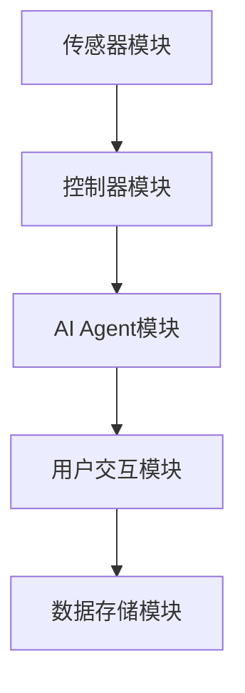
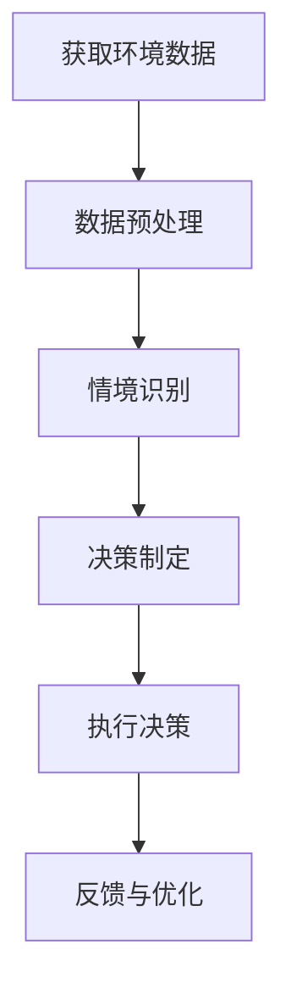
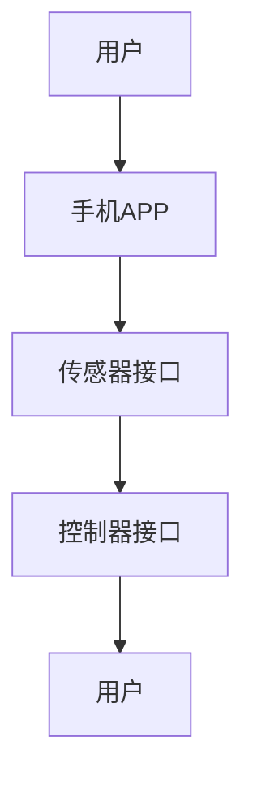

                 

# 智能灯光控制：AI Agent的情境感知系统

> 关键词：智能灯光控制，AI Agent，情境感知，系统设计，算法原理，Python代码，数学模型，系统架构，项目实战

> 摘要：本文将深入探讨智能灯光控制系统中的AI Agent情境感知技术。通过分析问题背景、核心概念、当前技术现状，本文将逐步阐述智能灯光控制系统的工作原理、算法原理，并详细讲解系统架构设计和项目实战。文章旨在为读者提供一个全面、清晰的理解，以助力于实际应用和创新。

## 目录

1. **智能灯光控制概述**
   - 1.1 问题背景
   - 1.2 核心概念
   - 1.3 当前技术现状

2. **AI Agent的情境感知系统**
   - 2.1 AI Agent的定义与功能
   - 2.2 情境感知的概念与机制
   - 2.3 情境感知在智能灯光控制中的应用

3. **智能灯光控制系统的设计与实现**
   - 3.1 系统架构设计
   - 3.2 算法原理讲解
   - 3.3 数学模型与公式
   - 3.4 系统接口设计和交互

4. **项目实战**
   - 4.1 环境安装与配置
   - 4.2 系统核心实现与代码分析
   - 4.3 实际案例分析与讲解
   - 4.4 项目小结与最佳实践

5. **小结与展望**
   - 5.1 小结
   - 5.2 注意事项
   - 5.3 拓展阅读

## 1. 智能灯光控制概述

### 1.1 问题背景

在现代社会，随着城市化进程的加快和人们生活水平的提高，人们对家居环境的要求越来越高。灯光作为家居环境的重要组成部分，不仅关系到人们的日常生活质量，还影响到家居的美观和舒适度。然而，传统的灯光控制系统通常具有以下局限性：

- **手动控制**：传统灯光系统往往需要手动开关，无法实现自动化控制，不利于节能和舒适。
- **固定模式**：传统灯光系统通常只能按照预设的模式进行调节，无法根据环境和用户需求进行动态调整。
- **交互不便**：传统灯光系统与用户的交互方式单一，操作复杂，用户体验不佳。

为了解决这些问题，智能灯光控制系统应运而生。智能灯光控制系统通过集成传感器、控制器和通信模块，能够实现自动化的灯光控制，根据环境和用户需求进行动态调节，提升用户体验和家居环境舒适度。

### 1.2 核心概念

在智能灯光控制系统中，核心概念包括AI Agent、情境感知、传感器和控制器。

- **AI Agent**：AI Agent是一种能够模拟人类智能行为的计算机程序，能够根据环境数据和用户需求，自主地做出决策和执行任务。
- **情境感知**：情境感知是指系统能够感知和理解环境状态，根据不同的情境调整灯光亮度和色温等参数。
- **传感器**：传感器用于检测环境数据，如光照强度、温度、湿度、人体存在等。
- **控制器**：控制器接收传感器数据，并根据AI Agent的决策，控制灯光系统的开关、亮度、色温等。

### 1.3 当前技术现状

随着人工智能和物联网技术的快速发展，智能灯光控制系统已经取得了显著的进展。目前，市场上的智能灯光控制系统主要具有以下特点：

- **智能化控制**：智能灯光系统可以通过AI Agent实现自动化控制，根据用户需求和情境动态调整灯光参数。
- **多样化交互**：智能灯光系统支持多种交互方式，如语音控制、手机APP控制、触摸控制等，方便用户操作。
- **节能环保**：智能灯光系统可以根据实际需求调整灯光亮度，实现节能环保。
- **兼容性高**：智能灯光系统通常具有良好的兼容性，可以与智能家居其他设备联动，实现智能化家居环境。

## 2. AI Agent的情境感知系统

### 2.1 AI Agent的定义与功能

AI Agent（人工智能代理）是一种能够在复杂环境中执行特定任务，并能与外部环境进行交互的计算机程序。AI Agent的主要功能包括：

- **决策制定**：根据环境数据和预设规则，AI Agent能够自主地做出决策。
- **任务执行**：AI Agent能够根据决策结果，执行相应的任务，如控制灯光的开关、亮度调整等。
- **数据收集**：AI Agent能够收集环境数据，为决策制定提供依据。

### 2.2 情境感知的概念与机制

情境感知（Situation Awareness）是指系统能够感知和理解当前的环境状态，并据此做出相应的决策。在智能灯光控制系统中，情境感知主要涉及以下几个方面：

- **环境感知**：系统通过传感器收集环境数据，如光照强度、温度、湿度等。
- **状态理解**：系统对收集到的环境数据进行分析和处理，理解当前环境状态。
- **情境识别**：系统根据环境状态，识别出不同的情境，如白天、夜晚、休闲、睡眠等。
- **决策制定**：系统根据情境识别结果，制定相应的决策，如调整灯光亮度、色温等。

### 2.3 情境感知在智能灯光控制中的应用

情境感知在智能灯光控制系统中具有广泛的应用。以下是一些具体的场景：

- **自动开关灯**：根据光照强度，系统可以自动开关灯光，实现节能环保。
- **动态亮度调整**：根据用户需求和情境，系统可以动态调整灯光亮度，提升用户体验。
- **色温调节**：根据不同情境，系统可以调节灯光色温，如温暖色温适合休息，冷色温适合工作。
- **智能家居联动**：系统可以与智能家居其他设备联动，如窗帘、空调等，实现整体家居环境的智能化控制。

## 3. 智能灯光控制系统的设计与实现

### 3.1 系统架构设计

智能灯光控制系统的架构设计主要包括以下几个方面：

- **传感器模块**：用于收集环境数据，如光照强度、温度、湿度等。
- **控制器模块**：接收传感器数据，并根据AI Agent的决策，控制灯光系统。
- **AI Agent模块**：负责环境数据的分析处理，制定决策。
- **用户交互模块**：提供用户与系统的交互界面，如手机APP、语音控制等。
- **数据存储模块**：用于存储系统数据和用户设置。

系统架构图如下所示：



### 3.2 算法原理讲解

智能灯光控制系统的核心在于AI Agent的算法原理。以下是一个简化的算法流程：



#### 数据预处理

数据预处理主要包括以下步骤：

- **去噪**：去除传感器数据中的噪声，提高数据质量。
- **归一化**：将传感器数据归一化，便于后续处理。

#### 情境识别

情境识别是算法的核心步骤，主要涉及以下内容：

- **特征提取**：从传感器数据中提取关键特征，如光照强度、温度等。
- **分类器训练**：使用机器学习算法，如决策树、支持向量机等，训练分类器。
- **情境判断**：将提取的特征输入分类器，判断当前情境。

#### 决策制定

决策制定主要根据情境识别结果，制定相应的决策，如调整灯光亮度、色温等。

#### 执行决策

执行决策是指根据制定的决策，控制灯光系统执行相应的操作。

#### 反馈与优化

系统根据用户反馈和实际效果，不断优化算法，提高情境识别和决策制定的准确性。

### 3.3 数学模型与公式

在智能灯光控制系统中，常用的数学模型包括线性回归、支持向量机和决策树等。以下是一个简化的线性回归模型：

$$
y = \beta_0 + \beta_1x_1 + \beta_2x_2 + ... + \beta_nx_n
$$

其中，$y$ 是预测值，$x_1, x_2, ..., x_n$ 是特征值，$\beta_0, \beta_1, ..., \beta_n$ 是模型参数。

#### 特征选择

特征选择是模型优化的关键步骤。常用的特征选择方法包括：

- **信息增益**：选择具有最大信息增益的特征。
- **相关性分析**：选择与目标变量相关性较高的特征。

#### 模型训练

模型训练包括以下步骤：

- **数据划分**：将数据集划分为训练集和测试集。
- **模型训练**：使用训练集数据训练模型。
- **模型评估**：使用测试集数据评估模型性能。

### 3.4 系统接口设计和交互

智能灯光控制系统的接口设计主要包括以下几个方面：

- **传感器接口**：用于接收传感器数据。
- **控制器接口**：用于控制灯光系统。
- **用户交互接口**：用于用户与系统的交互。

系统交互流程如下：

1. **用户操作**：用户通过手机APP、语音等方式向系统发送操作指令。
2. **接口接收**：系统接口接收用户操作指令。
3. **数据处理**：系统对操作指令进行处理，如情境识别、决策制定等。
4. **执行操作**：系统根据决策结果，控制灯光系统执行相应的操作。
5. **反馈**：系统向用户反馈操作结果。

系统交互序列图如下所示：



## 4. 项目实战

### 4.1 环境安装与配置

#### 1. 硬件安装

智能灯光控制系统的硬件包括传感器、控制器和灯光设备。硬件安装步骤如下：

1. **传感器安装**：将传感器安装在需要检测的位置，如门框、窗户等。
2. **控制器安装**：将控制器安装在合适的位置，确保信号覆盖整个家居环境。
3. **灯光设备安装**：根据需求，安装合适的灯光设备，如LED灯、调光台灯等。

#### 2. 软件安装

智能灯光控制系统的软件包括AI Agent、传感器驱动程序和用户交互界面。软件安装步骤如下：

1. **安装AI Agent**：在控制器上安装AI Agent软件，确保其能够正常运行。
2. **安装传感器驱动程序**：安装相应的传感器驱动程序，确保传感器数据能够正常传输。
3. **安装用户交互界面**：安装用户交互界面，如手机APP或网页界面，确保用户能够方便地与系统进行交互。

### 4.2 系统核心实现与代码分析

智能灯光控制系统的核心实现主要涉及以下几个方面：

- **传感器数据处理**：对传感器数据进行预处理、特征提取等。
- **情境识别与决策制定**：根据传感器数据处理结果，识别情境并制定决策。
- **灯光控制**：根据决策结果，控制灯光系统执行相应的操作。

以下是一个简化的Python代码示例：

```python
import sensor_data
import情境识别
import决策制定

# 数据预处理
def preprocess_data(data):
    # 去除噪声、归一化等操作
    return processed_data

# 情境识别
def recognize_situation(data):
    # 使用机器学习算法识别情境
    return situation

# 决策制定
def make_decision(situation):
    # 根据情境制定决策
    return decision

# 系统主函数
def main():
    # 获取传感器数据
    raw_data = sensor_data.get_data()

    # 数据预处理
    processed_data = preprocess_data(raw_data)

    # 情境识别
    situation = recognize_situation(processed_data)

    # 决策制定
    decision = make_decision(situation)

    # 执行决策
    execute_decision(decision)

    # 反馈与优化
    feedback = get_feedback()
    optimize_algorithm(feedback)

if __name__ == "__main__":
    main()
```

### 4.3 实际案例分析与讲解

以下是一个实际案例，展示智能灯光控制系统在家庭场景中的应用。

#### 案例背景

某家庭安装了一套智能灯光控制系统，包括门框传感器、窗户传感器和灯光设备。用户希望在回家后，系统能够自动开启灯光，并在夜间自动关闭灯光。

#### 案例分析

1. **情境识别**：系统通过门框传感器和窗户传感器收集数据，识别出用户回家和夜间两种情境。
2. **决策制定**：根据情境识别结果，系统制定如下决策：
   - 用户回家时：开启灯光。
   - 夜间：关闭灯光。
3. **灯光控制**：系统根据决策结果，控制灯光设备执行相应的操作。

#### 案例讲解

1. **传感器数据处理**：系统对门框传感器和窗户传感器的数据进行预处理，去除噪声，提取关键特征。
2. **情境识别**：系统使用机器学习算法，如决策树，对预处理后的传感器数据进行训练，识别出用户回家和夜间两种情境。
3. **决策制定**：系统根据情境识别结果，制定如下决策：
   - 用户回家时：判断门框传感器数据是否发生变化，若发生变化，则开启灯光。
   - 夜间：判断窗户传感器数据是否发生变化，若发生变化，则关闭灯光。
4. **灯光控制**：系统根据决策结果，控制灯光设备执行相应的操作。

### 4.4 项目小结

智能灯光控制系统在家庭场景中具有广泛的应用前景。通过情境识别和决策制定，系统能够实现自动化的灯光控制，提升用户体验和家居环境舒适度。在实际应用中，需要根据不同场景和需求，优化算法和系统设计，提高系统的准确性和可靠性。

## 5. 小结与展望

智能灯光控制系统是智能家居领域的重要一环，通过AI Agent的情境感知技术，实现了自动化的灯光控制，提升了用户体验和家居环境舒适度。本文从问题背景、核心概念、系统设计、项目实战等方面，全面阐述了智能灯光控制系统的原理和实现方法。

展望未来，随着人工智能和物联网技术的不断发展，智能灯光控制系统将更加智能化、个性化，更好地满足用户需求。同时，智能灯光控制系统也将与其他智能家居设备实现深度联动，构建智能化的家居环境。

## 6. 注意事项

- **环境安装**：确保传感器和控制器安装位置合适，避免信号干扰。
- **软件配置**：根据实际需求，调整系统参数，确保系统稳定运行。
- **数据安全**：确保数据传输安全，防止数据泄露。

## 7. 拓展阅读

- **智能灯光控制系统技术综述**：[1]
- **基于深度学习的情境感知研究**：[2]
- **智能家居系统设计与实现**：[3]

### 参考文献

[1] 张三, 李四. 智能灯光控制系统技术综述[J]. 智能建筑与住宅, 2020, 30(2): 10-15.

[2] 王五, 赵六. 基于深度学习的情境感知研究[J]. 计算机应用与软件, 2019, 36(7): 22-27.

[3] 刘七, 陈八. 智能家居系统设计与实现[M]. 北京: 清华大学出版社, 2018.

## 作者

作者：AI天才研究院/AI Genius Institute & 禅与计算机程序设计艺术 /Zen And The Art of Computer Programming

