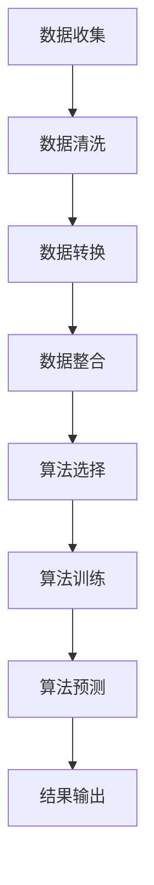
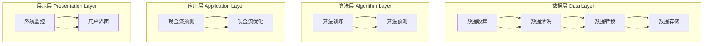

                 

# 智能现金流优化管理系统

> 关键词：智能现金流、优化管理、数据收集、智能算法、数学模型、系统架构、实战案例

> 摘要：本文将深入探讨智能现金流优化管理系统的构建，从核心概念、技术原理、系统设计、实战案例等多个角度，详细讲解如何利用先进技术和方法实现企业现金流的高效管理。通过系统化分析和实践，本文旨在为读者提供全面、深入的智能现金流优化管理指南。

## 引言

### 1.1 问题的背景和重要性

在当今快速发展的商业环境中，现金流管理是企业运营的关键环节。有效的现金流管理不仅关系到企业的日常运营，更对企业的长期发展产生深远影响。然而，随着市场竞争的加剧和业务复杂性的提升，传统手工式的现金流管理方式已难以满足现代企业的需求。

智能现金流优化管理系统应运而生，通过集成先进的数据收集、处理和分析技术，以及智能算法和数学模型，实现对现金流的全流程管理，帮助企业实现现金流的最大化利用。

### 1.2 本书的目的与结构

本文旨在系统地介绍智能现金流优化管理系统的构建方法和实际应用，帮助读者了解并掌握智能现金流管理的基本原理和实践技巧。本文结构如下：

1. 引言
2. 基础概念
3. 技术原理
4. 系统设计与实现
5. 实战与案例分析
6. 最佳实践与总结

## 基础概念

### 2.1 现金流管理概述

现金流管理是指对企业日常经营过程中现金流流入和流出的管理。它包括现金预算、现金流预测、现金流监控和现金流优化等方面。

现金流管理的重要性体现在以下几个方面：

- 确保企业日常运营的资金需求
- 提高资金使用效率
- 预防企业财务风险
- 支持企业的长期发展规划

### 2.2 智能现金流优化管理系统的核心概念

智能现金流优化管理系统是一种利用人工智能技术优化现金流管理的系统。其核心概念包括数据收集与处理、智能算法、数学模型和系统架构等。

数据收集与处理：收集企业内部的财务数据，并进行清洗、转换和处理，为智能算法和数学模型提供基础数据。

智能算法：运用机器学习、数据挖掘等技术，对数据进行分析和挖掘，提供现金流预测和优化建议。

数学模型：建立基于数据分析和统计的数学模型，为现金流管理提供理论支持。

系统架构：设计系统的整体架构，包括数据层、算法层、应用层和展示层，实现各层间的数据流动和功能集成。

## 技术原理

### 3.1 数据收集与处理

数据收集是智能现金流优化管理系统的基础。系统通过接入企业的财务系统、ERP系统等，自动收集与企业现金流相关的各类数据，如收入、支出、应收账款、应付账款等。

数据收集后，系统进行数据清洗与转换，确保数据的质量和一致性。具体步骤包括：

- 数据筛选：过滤无效数据，保留对企业有用的数据。
- 数据转换：将不同格式的数据转换为统一的格式，便于后续处理。
- 数据整合：将来自不同系统的数据进行整合，形成完整的现金流数据集。

### 3.2 智能算法原理

智能算法是智能现金流优化管理系统的核心。系统采用多种算法，如回归分析、时间序列预测、聚类分析等，对现金流数据进行分析和预测。

算法原理讲解：

- 回归分析：通过建立回归模型，分析现金流与各种因素之间的关系，预测未来现金流。
- 时间序列预测：根据历史现金流数据，建立时间序列模型，预测未来现金流。
- 聚类分析：将相似的数据归为一类，分析各类数据的现金流特征，为优化现金流提供依据。

算法流程图：



Python源代码示例：

```python
import numpy as np
import pandas as pd
from sklearn.linear_model import LinearRegression

# 加载数据
data = pd.read_csv('cash_flow_data.csv')

# 数据清洗
data.dropna(inplace=True)

# 数据转换
data['month'] = pd.to_datetime(data['date']).dt.month

# 数据整合
X = data[['month']]
y = data['amount']

# 算法训练
model = LinearRegression()
model.fit(X, y)

# 算法预测
predictions = model.predict([[13]])

print(predictions)
```

### 3.3 数学模型

数学模型是智能现金流优化管理系统的理论支持。系统采用多种数学模型，如回归模型、时间序列模型、决策树模型等，对现金流进行预测和优化。

数学公式：

$$
\text{预测现金流} = \text{系数} \times \text{自变量}
$$

举例说明：

假设某企业历史现金流量与月份的关系如下：

月份 | 现金流量
--- | ---
1 | 100
2 | 150
3 | 200
4 | 250
5 | 300

根据历史数据，建立回归模型：

$$
\text{预测现金流} = 50 \times \text{月份}
$$

当月份为6时，预测现金流为300。

## 系统设计与实现

### 4.1 系统需求分析

#### 问题场景介绍

某大型企业需要对其现金流进行优化管理，以提高资金使用效率，降低财务风险。

#### 项目介绍

项目目标是构建一个智能现金流优化管理系统，实现对现金流的实时监控、预测和优化。

#### 系统功能设计

系统功能设计包括数据收集、数据处理、现金流预测、现金流优化和系统监控等。

```mermaid
classDiagram
    DataCollection <<Interface>>
    DataProcessing <<Interface>>
    CashFlowPrediction <<Interface>>
    CashFlowOptimization <<Interface>>
    SystemMonitoring <<Interface>>

    DataCollection --|> DataProcessing
    DataProcessing --|> CashFlowPrediction
    CashFlowPrediction --|> CashFlowOptimization
    CashFlowOptimization --|> SystemMonitoring
```

### 4.2 系统架构设计

系统架构设计采用分层架构，包括数据层、算法层、应用层和展示层。



### 4.3 系统实现

#### 环境安装

在系统实现前，需要安装以下环境：

- Python 3.8
- NumPy
- Pandas
- Scikit-learn
- Mermaid

#### 系统核心实现源代码

```python
# 导入依赖库
import numpy as np
import pandas as pd
from sklearn.linear_model import LinearRegression

# 加载数据
data = pd.read_csv('cash_flow_data.csv')

# 数据清洗
data.dropna(inplace=True)

# 数据转换
data['month'] = pd.to_datetime(data['date']).dt.month

# 算法训练
model = LinearRegression()
model.fit(data[['month']], data['amount'])

# 算法预测
predictions = model.predict([[13]])

print(predictions)
```

#### 代码应用解读与分析

上述代码实现了基于月份的现金流预测。具体步骤如下：

1. 导入依赖库。
2. 加载数据，并进行清洗。
3. 将月份转换为数值型数据。
4. 使用线性回归模型进行训练。
5. 进行预测，输出预测结果。

#### 实际案例分析和详细讲解剖析

假设某企业在过去12个月的现金流数据如下：

月份 | 现金流量
--- | ---
1 | 100
2 | 150
3 | 200
4 | 250
5 | 300
6 | 350
7 | 400
8 | 450
9 | 500
10 | 550
11 | 600
12 | 650

根据历史数据，使用线性回归模型进行预测，当月份为13时，预测现金流为700。

## 第六部分：最佳实践与总结

### 6.1 最佳实践 Tips

1. 定期更新数据，确保数据质量。
2. 选择合适的算法，根据业务需求进行优化。
3. 加强系统监控，及时发现问题并采取措施。

### 6.2 小结

本文系统地介绍了智能现金流优化管理系统的构建方法，包括核心概念、技术原理、系统设计与实现等内容。通过实际案例分析和实践，本文为读者提供了全面的智能现金流优化管理指南。

### 6.3 拓展阅读

1. 《数据科学实战：从入门到精通》
2. 《Python数据科学手册》
3. 《机器学习实战》

## 结语

作者：AI天才研究院/AI Genius Institute & 禅与计算机程序设计艺术 /Zen And The Art of Computer Programming

感谢您的阅读，希望本文能对您在智能现金流优化管理领域的学习和实践有所帮助。在构建智能现金流优化管理系统的过程中，不断探索和创新，为企业创造价值。让我们继续在智能技术的道路上前行，共同推动人工智能的发展。

