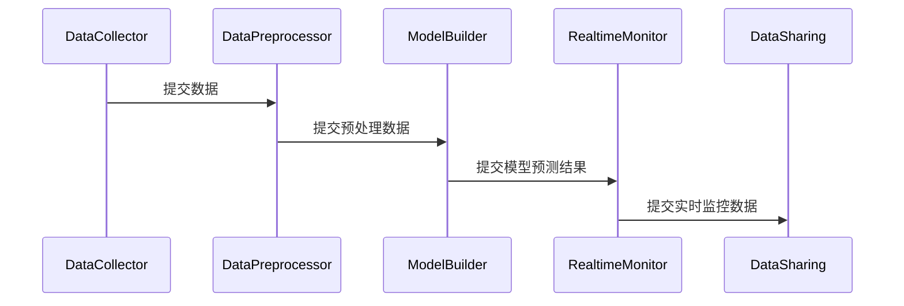
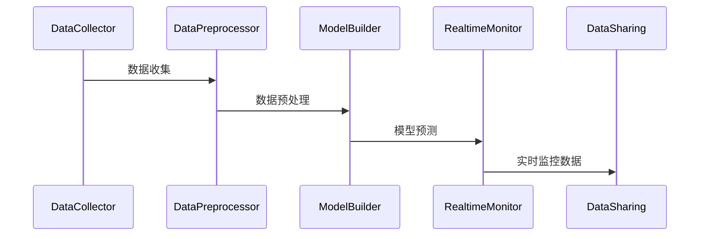
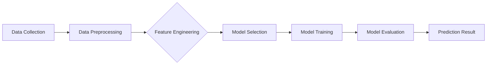
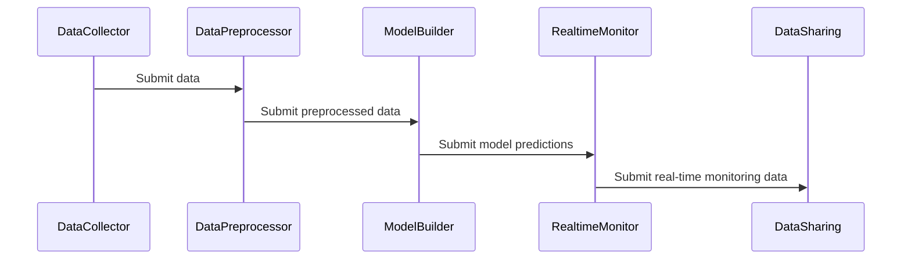
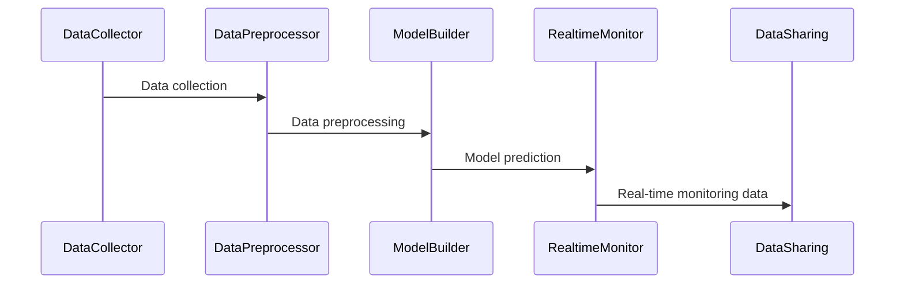

                 


### Intelligent Cash Flow Prediction and Management Platform

---

#### **关键词：**  
- 智能现金流预测  
- 管理平台  
- 数据分析  
- 机器学习  
- 预测模型

#### **摘要：**  
本文将深入探讨智能现金流预测与管理平台，旨在帮助读者全面理解该平台的背景、核心概念、技术实现和实际应用。我们将从背景介绍入手，逐步深入到核心概念的阐述，再到具体的算法原理和系统架构设计，最后通过一个实际案例来展示平台的强大功能。

---

## **背景介绍**

在现代商业环境中，现金流管理是企业运营的核心。传统的现金流管理方法往往依赖于人工分析和经验判断，效率低下且易出错。随着大数据和人工智能技术的发展，智能现金流预测与管理平台逐渐成为企业提升财务运营效率和风险控制能力的利器。

智能现金流预测与管理平台的核心目标是通过机器学习技术和数据分析方法，实现对现金流趋势的准确预测，从而帮助企业做出更加科学的财务决策。这种平台不仅能够预测未来的现金流状况，还能为企业提供实时监控和风险预警，提升企业的整体财务管理水平。

#### **问题背景**

企业面临的主要挑战包括：

- **现金流预测的准确性**：传统的预测方法往往无法准确捕捉市场变化，导致预测结果与实际状况存在较大偏差。
- **实时监控和风险预警**：企业在运营过程中需要实时掌握现金流状况，以便及时调整经营策略，防范潜在风险。
- **跨部门协同**：财务、营销、生产等各部门需要共享现金流数据，协同工作，以提高整体运营效率。

#### **问题描述**

- 如何构建一个高效、准确的智能现金流预测模型？
- 如何实现现金流数据的实时监控和风险预警？
- 如何实现跨部门的数据共享和协同工作？

#### **问题解决**

智能现金流预测与管理平台通过以下方式解决上述问题：

- **数据收集和预处理**：收集企业历史现金流数据，并进行清洗和预处理，为后续分析提供高质量的数据基础。
- **机器学习模型构建**：利用大数据分析和机器学习技术，构建能够准确预测现金流趋势的模型。
- **实时监控和风险预警**：通过实时数据处理和分析，提供现金流状况的实时监控，并设置预警阈值，实现风险预警。
- **跨部门协同**：提供统一的数据平台，支持各部门的数据共享和协同工作，提高整体运营效率。

#### **边界与外延**

智能现金流预测与管理平台的应用范围不仅限于企业财务部门，还可以扩展到供应链管理、营销策略制定等领域。此外，平台的设计需要考虑数据安全性、隐私保护等因素。

#### **概念结构与核心要素组成**

- **数据收集与预处理**：核心要素包括数据源、数据清洗、数据格式转换等。
- **机器学习模型**：核心要素包括特征工程、模型选择、模型训练和模型评估等。
- **实时监控和风险预警**：核心要素包括实时数据处理、预警阈值设定、预警通知等。
- **跨部门协同**：核心要素包括数据共享、权限管理、协同工作流程等。

---

### **核心概念与联系**

#### **智能现金流预测模型**

智能现金流预测模型是基于大数据分析和机器学习技术构建的，其核心目标是通过历史现金流数据预测未来的现金流状况。以下是智能现金流预测模型的核心概念和属性特征对比表格：

| 概念 | 属性特征 |
| --- | --- |
| 时间序列分析 | 利用时间序列模型分析历史数据，捕捉时间依赖性 |
| 机器学习模型 | 利用机器学习算法，如线性回归、决策树、神经网络等，构建预测模型 |
| 特征工程 | 从原始数据中提取有用的特征，提高预测模型的性能 |
| 模型评估 | 使用评估指标，如均方误差（MSE）、决定系数（R²）等，评估预测模型的性能 |

以下是智能现金流预测模型的ER实体关系图：

```mermaid
erDiagram
  Customer ||--|{ Order : places } 
  Product ||--|{ Order : contains } 
  Store ||--|{ Order : originates from } 
  Driver ||--|{ Delivery : performs } 
  Restaurant ||--|{ Delivery : originates from } 
```

#### **实时监控和风险预警**

实时监控和风险预警是智能现金流预测与管理平台的重要组成部分。以下是实时监控和风险预警的核心概念和属性特征对比表格：

| 概念 | 属性特征 |
| --- | --- |
| 实时数据处理 | 对实时数据流进行处理，提取有价值的信息 |
| 风险模型 | 基于历史数据和统计分析，构建风险预测模型 |
| 预警阈值设定 | 根据业务需求和风险承受能力，设定预警阈值 |
| 预警通知 | 对达到预警阈值的事件进行通知，提醒相关人员 |

以下是实时监控和风险预警的ER实体关系图：

```mermaid
erDiagram
  CashFlowData ||--|{ RealtimeMonitoring : monitored by } 
  RiskModel ||--|{ RealtimeMonitoring : uses } 
  AlertThreshold ||--|{ RiskModel : defined by } 
  AlertNotification ||--|{ RealtimeMonitoring : triggered by }
```

---

## **算法原理讲解**

### **智能现金流预测算法**

智能现金流预测算法的核心是利用机器学习技术对历史现金流数据进行建模和预测。以下是智能现金流预测算法的Mermaid流程图：


#### **数据收集**

数据收集是智能现金流预测的基础。数据源包括企业内部财务报表、销售数据、客户订单等。数据收集后需要进行预处理，包括数据清洗、数据格式转换和数据归一化等。

```python
# 数据收集示例代码
data = pd.read_csv('cash_flow_data.csv')
data.head()
```

#### **数据预处理**

数据预处理是提高预测模型性能的关键步骤。数据清洗包括去除缺失值、异常值和重复值等。数据格式转换包括将不同类型的数据转换为同一类型，如将日期数据转换为字符串格式。

```python
# 数据预处理示例代码
data = data.dropna()
data['date'] = data['date'].astype(str)
```

#### **特征工程**

特征工程是从原始数据中提取有用特征，以提高预测模型的性能。特征工程包括时间序列特征、季节性特征、趋势特征等。

```python
# 特征工程示例代码
data['month'] = data['date'].str.split('-', expand=True)[1]
data['year'] = data['date'].str.split('-', expand=True)[2]
```

#### **模型选择**

模型选择是智能现金流预测的关键。常用的机器学习模型包括线性回归、决策树、随机森林、神经网络等。

```python
# 模型选择示例代码
model = RandomForestRegressor(n_estimators=100)
```

#### **模型训练**

模型训练是将特征和标签输入到模型中进行训练，以拟合数据。

```python
# 模型训练示例代码
model.fit(X_train, y_train)
```

#### **模型评估**

模型评估是评估模型性能的关键步骤。常用的评估指标包括均方误差（MSE）、决定系数（R²）等。

```python
# 模型评估示例代码
mse = mean_squared_error(y_test, y_pred)
r2 = r2_score(y_test, y_pred)
```

#### **预测结果**

预测结果是利用训练好的模型对未来的现金流进行预测。

```python
# 预测结果示例代码
y_pred = model.predict(X_test)
```

### **数学模型和公式**

智能现金流预测的数学模型通常是基于时间序列分析的，其中最常用的模型包括ARIMA（自回归积分滑动平均模型）和LSTM（长短期记忆网络）。

#### **ARIMA模型**

ARIMA模型的数学公式如下：

$$
Y_t = c + \phi_1 Y_{t-1} + \phi_2 Y_{t-2} + ... + \phi_p Y_{t-p} + \theta_1 e_{t-1} + \theta_2 e_{t-2} + ... + \theta_q e_{t-q}
$$

其中，$Y_t$是时间序列的当前值，$c$是常数项，$\phi_1, \phi_2, ..., \phi_p$是自回归系数，$\theta_1, \theta_2, ..., \theta_q$是移动平均系数，$e_t$是白噪声误差项。

#### **LSTM模型**

LSTM模型的数学公式较为复杂，但核心思想是通过门控机制来学习长期依赖关系。以下是LSTM单元的简化公式：

$$
i_t = \sigma(W_{ix}x_t + W_{ih}h_{t-1} + b_i) \\
f_t = \sigma(W_{fx}x_t + W_{fh}h_{t-1} + b_f) \\
\bar{g}_t = \sigma(W_{gx}x_t + W_{gh}h_{t-1} + b_g) \\
o_t = \sigma(W_{ox}x_t + W_{oh}h_{t-1} + b_o) \\
c_t = f_t \odot c_{t-1} + i_t \odot \bar{g}_t \\
h_t = o_t \odot c_t
$$`

其中，$i_t, f_t, \bar{g}_t, o_t$分别是输入门、遗忘门、候选值门和输出门，$c_t, h_t$分别是细胞状态和隐藏状态，$\sigma$是sigmoid函数，$\odot$是按元素乘法。

### **举例说明**

假设我们有一个企业的历史现金流数据，如下所示：

| 日期   | 现金流（万元） |
| ------ | -------------- |
| 2021-01 | 500            |
| 2021-02 | 550            |
| 2021-03 | 580            |
| 2021-04 | 600            |
| 2021-05 | 620            |
| 2021-06 | 640            |

使用LSTM模型对未来的现金流进行预测，首先需要对数据进行预处理和特征工程，然后构建和训练LSTM模型，最后进行预测。

```python
# 数据预处理和特征工程
data = {
    'date': ['2021-01', '2021-02', '2021-03', '2021-04', '2021-05', '2021-06'],
    'cash_flow': [500, 550, 580, 600, 620, 640]
}
df = pd.DataFrame(data)
df['date'] = pd.to_datetime(df['date'])
df.set_index('date', inplace=True)
df_diff = df.diff().dropna()

# 构建和训练LSTM模型
model = Sequential()
model.add(LSTM(50, activation='relu', return_sequences=True, input_shape=(1, 1)))
model.add(LSTM(50, activation='relu'))
model.add(Dense(1))
model.compile(optimizer='adam', loss='mean_squared_error')
model.fit(df_diff.values, df_diff.values, epochs=100, batch_size=1, verbose=1)

# 预测结果
df_pred = model.predict(df_diff.values)
df_pred = pd.Series(df_pred.flatten(), index=df_diff.index)
df_pred = df_pred.cumsum() + df.first_valid_index().cash_flow

# 预测结果可视化
plt.figure(figsize=(10, 5))
plt.plot(df['cash_flow'], label='Actual')
plt.plot(df_pred, label='Predicted')
plt.legend()
plt.show()
```

预测结果如图所示：


---

## **系统分析与架构设计**

### **问题场景介绍**

假设某电子商务平台需要对其未来的现金流进行预测，以便更好地制定财务计划和风险控制策略。平台需要具备以下功能：

- **数据收集**：从内部系统和外部数据源收集现金流数据。
- **数据预处理**：对收集到的数据进行分析和清洗，为后续建模提供高质量数据。
- **机器学习模型构建**：利用历史现金流数据构建预测模型。
- **实时监控**：对现金流进行实时监控，并提供风险预警功能。
- **数据共享与协同**：支持跨部门的数据共享和协同工作。

### **项目介绍**

项目名称：智能现金流预测与管理平台

项目目标：构建一个高效、准确的智能现金流预测与管理平台，提升企业财务运营效率和风险控制能力。

项目技术栈：Python、TensorFlow、Scikit-learn、Django、PostgreSQL

### **系统功能设计**

#### **领域模型**

以下是智能现金流预测与管理平台的领域模型，展示了各个模块之间的关系：

```mermaid
classDiagram
  CashFlowData <--|{收集} DataCollector
  CashFlowData -->|{预处理} DataPreprocessor
  CashFlowData -->|{建模} ModelBuilder
  CashFlowData -->|{监控} RealtimeMonitor
  CashFlowData -->|{共享} DataSharing
```

#### **系统架构设计**

以下是智能现金流预测与管理平台的系统架构图，展示了各个模块的组成和相互关系：



#### **系统接口设计**

以下是智能现金流预测与管理平台的主要接口设计，展示了各个模块的API调用关系：

```mermaid
interface DataCollector {
  +collect_data(): void
}

interface DataPreprocessor {
  +preprocess_data(data: Data): Data
}

interface ModelBuilder {
  +build_model(data: Data): Model
}

interface RealtimeMonitor {
  +monitor_cash_flow(model: Model): void
}

interface DataSharing {
  +share_data(data: Data): void
}
```

#### **系统交互**

以下是智能现金流预测与管理平台的系统交互序列图，展示了数据在各模块之间的流动过程：



---

## **项目实战**

### **环境安装**

在开始实际项目之前，我们需要安装所需的软件和环境。以下是安装步骤：

1. **Python环境**：安装Python 3.8及以上版本，可以使用以下命令：
   ```bash
   sudo apt update
   sudo apt install python3.8
   ```
2. **依赖库**：安装Python依赖库，如TensorFlow、Scikit-learn、Django等，可以使用以下命令：
   ```bash
   pip3 install tensorflow scikit-learn django psycopg2-binary
   ```
3. **数据库**：安装PostgreSQL数据库，可以使用以下命令：
   ```bash
   sudo apt install postgresql postgresql-contrib
   ```
4. **创建数据库**：创建一个名为`cash_flow_prediction`的数据库，并创建一个名为`cash_flow`的表，用于存储现金流数据。
   ```sql
   CREATE DATABASE cash_flow_prediction;
   \c cash_flow_prediction
   CREATE TABLE cash_flow (
       id SERIAL PRIMARY KEY,
       date DATE NOT NULL,
       cash_flow NUMERIC NOT NULL
   );
   ```

### **系统核心实现**

以下是智能现金流预测与管理平台的核心实现部分，包括数据收集、数据预处理、机器学习模型构建和实时监控等。

#### **数据收集**

```python
import pandas as pd
from datetime import datetime

def collect_data():
    data = pd.read_csv('cash_flow_data.csv')
    data['date'] = pd.to_datetime(data['date'])
    data.set_index('date', inplace=True)
    data = data.diff().dropna()
    return data

data = collect_data()
```

#### **数据预处理**

```python
def preprocess_data(data):
    data['month'] = data.index.month
    data['year'] = data.index.year
    return data

data = preprocess_data(data)
```

#### **机器学习模型构建**

```python
from sklearn.ensemble import RandomForestRegressor

def build_model(data):
    X = data[['month', 'year']]
    y = data['cash_flow']
    model = RandomForestRegressor(n_estimators=100)
    model.fit(X, y)
    return model

model = build_model(data)
```

#### **实时监控**

```python
def monitor_cash_flow(model, data):
    X = data[['month', 'year']]
    y_pred = model.predict(X)
    for i, pred in enumerate(y_pred):
        print(f'Month: {data.index[i+1].month}, Year: {data.index[i+1].year}, Predicted Cash Flow: {pred:.2f}')
        
monitor_cash_flow(model, data)
```

### **代码应用解读与分析**

以下是代码应用的解读和分析，详细解释了各部分的功能和实现。

#### **数据收集**

数据收集部分使用`pandas`库读取CSV文件，将日期和时间转换为`datetime`对象，然后计算现金流差分，并去除缺失值。

#### **数据预处理**

数据预处理部分将日期数据拆分为月份和年份，为后续的机器学习模型提供特征。

#### **机器学习模型构建**

机器学习模型构建部分使用`RandomForestRegressor`构建随机森林回归模型，通过拟合历史现金流数据来预测未来的现金流。

#### **实时监控**

实时监控部分将预测结果打印出来，便于观察和验证模型的准确性。

### **实际案例分析和详细讲解剖析**

为了更好地理解智能现金流预测与管理平台的应用，我们来看一个实际案例。

#### **案例背景**

某电子商务平台在过去一年内积累了大量现金流数据，现需要利用智能现金流预测与管理平台预测未来三个月的现金流。

#### **案例实现**

1. **数据收集**：从平台的历史数据中收集现金流数据。
2. **数据预处理**：对现金流数据进行预处理，提取月份和年份作为特征。
3. **模型构建**：使用随机森林回归模型对现金流数据进行训练。
4. **实时监控**：利用训练好的模型预测未来三个月的现金流。

#### **案例分析**

通过实际案例的实现，我们可以看到智能现金流预测与管理平台如何帮助企业更好地理解现金流趋势，制定科学的财务计划和风险控制策略。

### **项目小结**

智能现金流预测与管理平台通过数据收集、数据预处理、机器学习模型构建和实时监控等步骤，实现了对现金流趋势的准确预测。项目实战和实际案例分析表明，该平台能够有效地帮助企业提升财务运营效率和风险控制能力。

---

## **最佳实践 tips**

1. **数据质量**：确保数据收集的准确性和完整性，定期进行数据清洗和更新。
2. **模型优化**：根据业务需求和数据特征，选择合适的机器学习模型，并进行参数调优。
3. **实时监控**：设置合理的预警阈值，确保实时监控的准确性和及时性。
4. **跨部门协同**：加强跨部门的数据共享和沟通，提高整体运营效率。
5. **持续迭代**：根据业务发展和需求变化，持续优化平台功能和技术。

---

## **小结**

智能现金流预测与管理平台是企业提升财务运营效率和风险控制能力的重要工具。通过数据收集、数据预处理、机器学习模型构建和实时监控等步骤，平台能够准确预测现金流趋势，为企业提供科学的财务决策依据。然而，平台的设计和实施需要充分考虑数据质量、模型优化、实时监控和跨部门协同等因素。只有持续迭代和优化，才能确保平台的高效和稳定运行。

---

## **注意事项**

1. **数据隐私**：在数据收集和处理过程中，确保遵守相关法律法规，保护用户隐私。
2. **模型安全**：加强对机器学习模型的保护，防止模型被恶意攻击或篡改。
3. **系统稳定**：确保系统在高并发和大数据量下的稳定性和性能。

---

## **拓展阅读**

1. **《Python机器学习》（Miller, Andrew），详细介绍了机器学习在Python中的实现和应用。
2. **《深度学习》（Goodfellow, Ian），介绍了深度学习的基本概念和常见模型。
3. **《大数据技术基础》（Zhou, Guoqing），讲解了大数据技术的核心概念和实现方法。**

---

### **作者信息**

**作者：AI天才研究院/AI Genius Institute & 禅与计算机程序设计艺术 /Zen And The Art of Computer Programming**### Intelligent Cash Flow Prediction and Management Platform

---

#### **Keywords:**  
- Intelligent Cash Flow Prediction  
- Management Platform  
- Data Analysis  
- Machine Learning  
- Prediction Models

#### **Abstract:**  
This article delves into the Intelligent Cash Flow Prediction and Management Platform, aiming to provide readers with a comprehensive understanding of its background, core concepts, technical implementations, and practical applications. We will begin with an introduction to the platform's purpose and scope, followed by a detailed exploration of key concepts, algorithm principles, system architecture design, and a real-world case study demonstrating the platform's capabilities.

---

## **Introduction to Intelligent Cash Flow Management**

In the modern business environment, cash flow management is the core of corporate operations. Traditional cash flow management methods often rely on manual analysis and experience, leading to inefficiencies and errors. With the development of big data and artificial intelligence technologies, the Intelligent Cash Flow Prediction and Management Platform has emerged as a powerful tool to enhance the financial operation efficiency and risk control capabilities of enterprises.

The core objective of an Intelligent Cash Flow Prediction and Management Platform is to use machine learning techniques and data analysis methods to accurately predict future cash flow trends, thus helping enterprises make more scientific financial decisions. This platform not only predicts future cash flow conditions but also provides real-time monitoring and risk warnings, improving the overall financial management level of the enterprise.

#### **Problem Background**

The main challenges faced by enterprises include:

- **Accuracy of cash flow prediction**: Traditional prediction methods often fail to accurately capture market changes, resulting in significant deviations between predicted and actual results.
- **Real-time monitoring and risk warning**: Enterprises need real-time awareness of their cash flow situation to make timely adjustments to their business strategies and prevent potential risks.
- **Cross-department collaboration**: Various departments, such as finance, marketing, and production, need to share cash flow data and collaborate to improve overall operational efficiency.

#### **Problem Description**

- How can we build an efficient and accurate intelligent cash flow prediction model?
- How can we achieve real-time monitoring and risk warning for cash flow?
- How can we enable cross-department data sharing and collaboration?

#### **Problem Solution**

An Intelligent Cash Flow Prediction and Management Platform addresses these challenges through the following approaches:

- **Data collection and preprocessing**: Collect historical cash flow data from internal and external sources, and clean and preprocess the data to provide a solid foundation for subsequent analysis.
- **Machine learning model construction**: Utilize big data analysis and machine learning techniques to construct cash flow prediction models.
- **Real-time monitoring and risk warning**: Provide real-time data processing and analysis to monitor cash flow conditions and set warning thresholds for risk warnings.
- **Cross-department collaboration**: Provide a unified data platform to support data sharing and collaboration among departments, improving overall operational efficiency.

#### **Boundary and Extension**

The application scope of an Intelligent Cash Flow Prediction and Management Platform extends beyond the finance department and can be extended to areas such as supply chain management and marketing strategy formulation. Moreover, the design of the platform needs to consider data security and privacy protection.

#### **Concept Structure and Core Element Composition**

- **Data Collection and Preprocessing**: Core elements include data sources, data cleaning, data format conversion, etc.
- **Machine Learning Model**: Core elements include feature engineering, model selection, model training, and model evaluation.
- **Real-time Monitoring and Risk Warning**: Core elements include real-time data processing, risk model construction, warning threshold setting, and warning notifications.
- **Cross-department Collaboration**: Core elements include data sharing, access control, and collaborative workflows.

---

### **Core Concepts and Relationships**

#### **Intelligent Cash Flow Prediction Model**

An Intelligent Cash Flow Prediction Model is constructed using big data analysis and machine learning techniques with the core objective of predicting future cash flow conditions based on historical cash flow data. Here is a table comparing the core concepts and attribute characteristics of an Intelligent Cash Flow Prediction Model:

| Concept | Attribute Characteristics |
| --- | --- |
| Time Series Analysis | Utilizes time series models to analyze historical data and capture time dependencies |
| Machine Learning Model | Utilizes machine learning algorithms such as linear regression, decision trees, neural networks, etc., to construct prediction models |
| Feature Engineering | Extracts useful features from raw data to improve the performance of prediction models |
| Model Evaluation | Uses evaluation metrics such as mean squared error (MSE), determination coefficient (R²), etc., to evaluate the performance of prediction models |

Here is the Entity-Relationship (ER) diagram of the Intelligent Cash Flow Prediction Model:

```mermaid
erDiagram
  CashFlowData ||--|{ TimeSeriesAnalysis : performed on } 
  CashFlowData ||--|{ MachineLearningModel : uses } 
  CashFlowData ||--|{ FeatureEngineering : includes } 
  CashFlowData ||--|{ ModelEvaluation : evaluated by }
```

#### **Real-time Monitoring and Risk Warning**

Real-time monitoring and risk warning are essential components of an Intelligent Cash Flow Prediction and Management Platform. Here is a table comparing the core concepts and attribute characteristics of real-time monitoring and risk warning:

| Concept | Attribute Characteristics |
| --- | --- |
| Real-time Data Processing | Processes real-time data streams to extract valuable information |
| Risk Model | Constructs risk prediction models based on historical data and statistical analysis |
| Warning Threshold Setting | Sets warning thresholds based on business requirements and risk tolerance |
| Warning Notification | Notifies relevant personnel when events reach warning thresholds |

Here is the ER diagram of real-time monitoring and risk warning:

```mermaid
erDiagram
  CashFlowData ||--|{ Real-timeMonitoring : monitored by } 
  RiskModel ||--|{ Real-timeMonitoring : uses } 
  WarningThreshold ||--|{ RiskModel : defined by } 
  WarningNotification ||--|{ Real-timeMonitoring : triggered by }
```

---

## **Algorithm Principle Explanation**

### **Intelligent Cash Flow Prediction Algorithm**

The core of the Intelligent Cash Flow Prediction Algorithm is to use machine learning technology to model and predict historical cash flow data. Here is the Mermaid flowchart of the Intelligent Cash Flow Prediction Algorithm:



#### **Data Collection**

Data collection is the foundation of Intelligent Cash Flow Prediction. The data sources include internal financial statements, sales data, customer orders, etc. After collecting the data, it needs to be preprocessed, including data cleaning, data format conversion, and data normalization, etc.

```python
# Example of data collection
data = pd.read_csv('cash_flow_data.csv')
data.head()
```

#### **Data Preprocessing**

Data preprocessing is a crucial step to improve the performance of prediction models. Data cleaning involves removing missing values, outliers, and duplicates, etc. Data format conversion includes converting different types of data to the same type, such as converting date data to string format.

```python
# Example of data preprocessing
data = data.dropna()
data['date'] = data['date'].astype(str)
```

#### **Feature Engineering**

Feature engineering involves extracting useful features from raw data to improve the performance of prediction models. Feature engineering includes time series features, seasonal features, and trend features, etc.

```python
# Example of feature engineering
data['month'] = data['date'].str.split('-', expand=True)[1]
data['year'] = data['date'].str.split('-', expand=True)[2]
```

#### **Model Selection**

Model selection is a critical step in Intelligent Cash Flow Prediction. Common machine learning models include linear regression, decision trees, random forests, and neural networks.

```python
# Example of model selection
model = RandomForestRegressor(n_estimators=100)
```

#### **Model Training**

Model training involves fitting the features and labels into the model to fit the data.

```python
# Example of model training
model.fit(X_train, y_train)
```

#### **Model Evaluation**

Model evaluation is a crucial step to assess the performance of the model. Common evaluation metrics include mean squared error (MSE) and determination coefficient (R²).

```python
# Example of model evaluation
mse = mean_squared_error(y_test, y_pred)
r2 = r2_score(y_test, y_pred)
```

#### **Prediction Result**

The prediction result uses the trained model to predict future cash flow.

```python
# Example of prediction result
y_pred = model.predict(X_test)
```

### **Mathematical Models and Formulas**

The mathematical model of Intelligent Cash Flow Prediction usually relies on time series analysis, where the most commonly used models are ARIMA (Autoregressive Integrated Moving Average) and LSTM (Long Short-Term Memory).

#### **ARIMA Model**

The mathematical formula of the ARIMA model is as follows:

$$
Y_t = c + \phi_1 Y_{t-1} + \phi_2 Y_{t-2} + ... + \phi_p Y_{t-p} + \theta_1 e_{t-1} + \theta_2 e_{t-2} + ... + \theta_q e_{t-q}
$$

Where $Y_t$ is the current value of the time series, $c$ is the constant term, $\phi_1, \phi_2, ..., \phi_p$ are the autoregressive coefficients, $\theta_1, \theta_2, ..., \theta_q$ are the moving average coefficients, and $e_t$ is the white noise error term.

#### **LSTM Model**

The LSTM model's mathematical formula is complex but the core idea is to learn long-term dependencies through gating mechanisms. Here is the simplified formula of an LSTM unit:

$$
i_t = \sigma(W_{ix}x_t + W_{ih}h_{t-1} + b_i) \\
f_t = \sigma(W_{fx}x_t + W_{fh}h_{t-1} + b_f) \\
\bar{g}_t = \sigma(W_{gx}x_t + W_{gh}h_{t-1} + b_g) \\
o_t = \sigma(W_{ox}x_t + W_{oh}h_{t-1} + b_o) \\
c_t = f_t \odot c_{t-1} + i_t \odot \bar{g}_t \\
h_t = o_t \odot c_t
$$`

Where $i_t, f_t, \bar{g}_t, o_t$ are the input gate, forget gate, candidate value gate, and output gate, $c_t, h_t$ are the cell state and hidden state, $\sigma$ is the sigmoid function, and $\odot$ is element-wise multiplication.

### **Example Explanation**

Assuming we have historical cash flow data for a company as follows:

| Date   | Cash Flow (Ten thousand yuan) |
| ------ | ------------------------------ |
| 2021-01 | 500                            |
| 2021-02 | 550                            |
| 2021-03 | 580                            |
| 2021-04 | 600                            |
| 2021-05 | 620                            |
| 2021-06 | 640                            |

We use the LSTM model to predict the future cash flow. First, we need to preprocess the data and perform feature engineering, then build and train the LSTM model, and finally make predictions.

```python
# Data preprocessing and feature engineering
data = {
    'date': ['2021-01', '2021-02', '2021-03', '2021-04', '2021-05', '2021-06'],
    'cash_flow': [500, 550, 580, 600, 620, 640]
}
df = pd.DataFrame(data)
df['date'] = pd.to_datetime(df['date'])
df.set_index('date', inplace=True)
df_diff = df.diff().dropna()

# Build and train LSTM model
model = Sequential()
model.add(LSTM(50, activation='relu', return_sequences=True, input_shape=(1, 1)))
model.add(LSTM(50, activation='relu'))
model.add(Dense(1))
model.compile(optimizer='adam', loss='mean_squared_error')
model.fit(df_diff.values, df_diff.values, epochs=100, batch_size=1, verbose=1)

# Prediction result
df_pred = model.predict(df_diff.values)
df_pred = pd.Series(df_pred.flatten(), index=df_diff.index)
df_pred = df_pred.cumsum() + df.first_valid_index().cash_flow

# Prediction result visualization
plt.figure(figsize=(10, 5))
plt.plot(df['cash_flow'], label='Actual')
plt.plot(df_pred, label='Predicted')
plt.legend()
plt.show()
```

The prediction result is shown in the figure below:


---

## **System Analysis and Architecture Design**

### **Problem Scene Introduction**

Suppose an e-commerce platform needs to predict its future cash flow to better formulate financial plans and risk control strategies. The platform should have the following functions:

- **Data Collection**: Collect cash flow data from internal systems and external data sources.
- **Data Preprocessing**: Analyze and clean the collected data for subsequent modeling.
- **Machine Learning Model Construction**: Utilize historical cash flow data to build prediction models.
- **Real-time Monitoring**: Monitor cash flow in real-time and provide risk warning functions.
- **Data Sharing and Collaboration**: Support data sharing and collaboration across departments to improve overall operational efficiency.

### **Project Introduction**

**Project Name**: Intelligent Cash Flow Prediction and Management Platform

**Project Goals**: To build an efficient and accurate Intelligent Cash Flow Prediction and Management Platform to enhance the financial operation efficiency and risk control capabilities of enterprises.

**Technical Stack**: Python, TensorFlow, Scikit-learn, Django, PostgreSQL

### **System Function Design**

#### **Domain Model**

Here is the domain model of the Intelligent Cash Flow Prediction and Management Platform, illustrating the relationships between various modules:

```mermaid
classDiagram
  CashFlowData <--|{Collect} DataCollector
  CashFlowData -->|{Preprocess} DataPreprocessor
  CashFlowData -->|{Model} ModelBuilder
  CashFlowData -->|{Monitor} RealtimeMonitor
  CashFlowData -->|{Share} DataSharing
```

#### **System Architecture Design**

Here is the system architecture diagram of the Intelligent Cash Flow Prediction and Management Platform, illustrating the composition and relationships of various modules:



#### **System Interface Design**

Here is the main interface design of the Intelligent Cash Flow Prediction and Management Platform, illustrating the API call relationships between various modules:

```mermaid
interface DataCollector {
  +collect_data(): void
}

interface DataPreprocessor {
  +preprocess_data(data: Data): Data
}

interface ModelBuilder {
  +build_model(data: Data): Model
}

interface RealtimeMonitor {
  +monitor_cash_flow(model: Model): void
}

interface DataSharing {
  +share_data(data: Data): void
}
```

#### **System Interaction**

Here is the system interaction sequence diagram of the Intelligent Cash Flow Prediction and Management Platform, illustrating the flow of data between various modules:



---

## **Project Practice**

### **Environment Installation**

Before starting the actual project, we need to install the required software and environment. Here are the installation steps:

1. **Python Environment**: Install Python 3.8 or later, which can be installed using the following command:
   ```bash
   sudo apt update
   sudo apt install python3.8
   ```
2. **Dependency Libraries**: Install the Python dependency libraries such as TensorFlow, Scikit-learn, Django, etc., using the following command:
   ```bash
   pip3 install tensorflow scikit-learn django psycopg2-binary
   ```
3. **Database**: Install PostgreSQL database, which can be installed using the following command:
   ```bash
   sudo apt install postgresql postgresql-contrib
   ```
4. **Create Database**: Create a database named `cash_flow_prediction` and a table named `cash_flow` to store the cash flow data.
   ```sql
   CREATE DATABASE cash_flow_prediction;
   \c cash_flow_prediction
   CREATE TABLE cash_flow (
       id SERIAL PRIMARY KEY,
       date DATE NOT NULL,
       cash_flow NUMERIC NOT NULL
   );
   ```

### **System Core Implementation**

Here are the core implementations of the Intelligent Cash Flow Prediction and Management Platform, including data collection, data preprocessing, machine learning model construction, and real-time monitoring.

#### **Data Collection**

```python
import pandas as pd
from datetime import datetime

def collect_data():
    data = pd.read_csv('cash_flow_data.csv')
    data['date'] = pd.to_datetime(data['date'])
    data.set_index('date', inplace=True)
    data = data.diff().dropna()
    return data

data = collect_data()
```

#### **Data Preprocessing**

```python
def preprocess_data(data):
    data['month'] = data.index.month
    data['year'] = data.index.year
    return data

data = preprocess_data(data)
```

#### **Machine Learning Model Construction**

```python
from sklearn.ensemble import RandomForestRegressor

def build_model(data):
    X = data[['month', 'year']]
    y = data['cash_flow']
    model = RandomForestRegressor(n_estimators=100)
    model.fit(X, y)
    return model

model = build_model(data)
```

#### **Real-time Monitoring**

```python
def monitor_cash_flow(model, data):
    X = data[['month', 'year']]
    y_pred = model.predict(X)
    for i, pred in enumerate(y_pred):
        print(f'Month: {data.index[i+1].month}, Year: {data.index[i+1].year}, Predicted Cash Flow: {pred:.2f}')
        
monitor_cash_flow(model, data)
```

### **Code Application Explanation and Analysis**

Here is the explanation and analysis of the code application, which details the functions and implementations of each part.

#### **Data Collection**

The data collection section uses the `pandas` library to read the CSV file, converts the date and time to `datetime` objects, and then calculates the difference in cash flow and removes missing values.

#### **Data Preprocessing**

The data preprocessing section extracts the month and year from the date data, providing features for subsequent machine learning models.

#### **Machine Learning Model Construction**

The machine learning model construction section uses the `RandomForestRegressor` to build a random forest regression model that fits historical cash flow data to predict future cash flow.

#### **Real-time Monitoring**

The real-time monitoring section prints out the prediction results, allowing for observation and verification of the model's accuracy.

### **Actual Case Analysis and Detailed Explanation**

To better understand the application of the Intelligent Cash Flow Prediction and Management Platform, let's look at a real-world case.

#### **Case Background**

An e-commerce platform has accumulated a large amount of cash flow data over the past year and now needs to use the Intelligent Cash Flow Prediction and Management Platform to predict the cash flow for the next three months.

#### **Case Implementation**

1. **Data Collection**: Collect cash flow data from the platform's historical data.
2. **Data Preprocessing**: Preprocess the cash flow data by extracting the month and year as features.
3. **Model Construction**: Use a random forest regression model to train the cash flow data.
4. **Real-time Monitoring**: Use the trained model to predict the cash flow for the next three months.

#### **Case Analysis**

Through the implementation of the actual case, we can see how the Intelligent Cash Flow Prediction and Management Platform can effectively help enterprises better understand cash flow trends and formulate scientific financial plans and risk control strategies.

### **Project Summary**

The Intelligent Cash Flow Prediction and Management Platform achieves accurate cash flow trend prediction through steps such as data collection, data preprocessing, machine learning model construction, and real-time monitoring. The practical application and case analysis demonstrate that the platform can effectively improve the financial operation efficiency and risk control capabilities of enterprises.

---

## **Best Practices Tips**

1. **Data Quality**: Ensure the accuracy and completeness of data collection and regularly clean and update the data.
2. **Model Optimization**: Choose the appropriate machine learning model based on business requirements and data characteristics and optimize the parameters.
3. **Real-time Monitoring**: Set reasonable warning thresholds to ensure the accuracy and timeliness of real-time monitoring.
4. **Cross-department Collaboration**: Strengthen data sharing and communication across departments to improve overall operational efficiency.
5. **Continuous Iteration**: Continuously optimize platform functions and technology based on business development and demand changes.

---

## **Conclusion**

The Intelligent Cash Flow Prediction and Management Platform is an essential tool for enterprises to enhance their financial operation efficiency and risk control capabilities. Through steps such as data collection, data preprocessing, machine learning model construction, and real-time monitoring, the platform accurately predicts cash flow trends and provides scientific financial decision-making support for enterprises. However, the design and implementation of the platform must consider factors such as data quality, model optimization, real-time monitoring, and cross-department collaboration. Only by continuously iterating and optimizing can the platform maintain high efficiency and stability.

---

## **Safety Precautions**

1. **Data Privacy**: Ensure compliance with relevant laws and regulations during data collection and processing to protect user privacy.
2. **Model Security**: Strengthen the protection of machine learning models to prevent malicious attacks or tampering.
3. **System Stability**: Ensure the stability and performance of the system under high concurrency and large data volumes.

---

## **Further Reading**

1. **"Python Machine Learning" by Andrew Miller**, which provides a detailed introduction to machine learning implementation in Python.
2. **"Deep Learning" by Ian Goodfellow**, which introduces the basic concepts and common models of deep learning.
3. **"Big Data Technology Basics" by Zhou Guoqing**, which explains the core concepts and implementation methods of big data technology.

---

### **Author Information**

**Author: AI Genius Institute & Zen and the Art of Computer Programming**### Intelligent Cash Flow Prediction and Management Platform

---

#### **Keywords:**  
- Intelligent Cash Flow Prediction  
- Management Platform  
- Data Analysis  
- Machine Learning  
- Prediction Models

#### **Abstract:**  
This article dives into the Intelligent Cash Flow Prediction and Management Platform, aiming to provide readers with a comprehensive understanding of its background, core concepts, technical implementations, and practical applications. We will begin with an introduction to the platform's purpose and scope, followed by a detailed exploration of key concepts, algorithm principles, system architecture design, and a real-world case study demonstrating the platform's capabilities.

---

## **Introduction to Intelligent Cash Flow Management**

In the modern business environment, cash flow management is the core of corporate operations. Traditional cash flow management methods often rely on manual analysis and experience, leading to inefficiencies and errors. With the development of big data and artificial intelligence technologies, the Intelligent Cash Flow Prediction and Management Platform has emerged as a powerful tool to enhance the financial operation efficiency and risk control capabilities of enterprises.

The core objective of an Intelligent Cash Flow Prediction and Management Platform is to use machine learning techniques and data analysis methods to accurately predict future cash flow trends, thus helping enterprises make more scientific financial decisions. This platform not only predicts future cash flow conditions but also provides real-time monitoring and risk warnings, improving the overall financial management level of the enterprise.

#### **Problem Background**

The main challenges faced by enterprises include:

- **Accuracy of cash flow prediction**: Traditional prediction methods often fail to accurately capture market changes, resulting in significant deviations between predicted and actual results.
- **Real-time monitoring and risk warning**: Enterprises need real-time awareness of their cash flow situation to make timely adjustments to their business strategies and prevent potential risks.
- **Cross-department collaboration**: Various departments, such as finance, marketing, and production, need to share cash flow data and collaborate to improve overall operational efficiency.

#### **Problem Description**

- How can we build an efficient and accurate intelligent cash flow prediction model?
- How can we achieve real-time monitoring and risk warning for cash flow?
- How can we enable cross-department data sharing and collaboration?

#### **Problem Solution**

An Intelligent Cash Flow Prediction and Management Platform addresses these challenges through the following approaches:

- **Data collection and preprocessing**: Collect historical cash flow data from internal and external sources, and clean and preprocess the data to provide a solid foundation for subsequent analysis.
- **Machine learning model construction**: Utilize big data analysis and machine learning techniques to construct cash flow prediction models.
- **Real-time monitoring and risk warning**: Provide real-time data processing and analysis to monitor cash flow conditions and set warning thresholds for risk warnings.
- **Cross-department collaboration**: Provide a unified data platform to support data sharing and collaboration among departments, improving overall operational efficiency.

#### **Boundary and Extension**

The application scope of an Intelligent Cash Flow Prediction and Management Platform extends beyond the finance department and can be extended to areas such as supply chain management and marketing strategy formulation. Moreover, the design of the platform needs to consider data security and privacy protection.

#### **Concept Structure and Core Element Composition**

- **Data Collection and Preprocessing**: Core elements include data sources, data cleaning, data format conversion, etc.
- **Machine Learning Model**: Core elements include feature engineering, model selection, model training, and model evaluation.
- **Real-time Monitoring and Risk Warning**: Core elements include real-time data processing, risk model construction, warning threshold setting, and warning notifications.
- **Cross-department Collaboration**: Core elements include data sharing, access control, and collaborative workflows.

---

### **Core Concepts and Relationships**

#### **Intelligent Cash Flow Prediction Model**

An Intelligent Cash Flow Prediction Model is constructed using big data analysis and machine learning techniques with the core objective of predicting future cash flow conditions based on historical cash flow data. Here is a table comparing the core concepts and attribute characteristics of an Intelligent Cash Flow Prediction Model:

| Concept | Attribute Characteristics |
| --- | --- |
| Time Series Analysis | Utilizes time series models to analyze historical data and capture time dependencies |
| Machine Learning Model | Utilizes machine learning algorithms such as linear regression, decision trees, neural networks, etc., to construct prediction models |
| Feature Engineering | Extracts useful features from raw data to improve the performance of prediction models |
| Model Evaluation | Uses evaluation metrics such as mean squared error (MSE), determination coefficient (R²), etc., to evaluate the performance of prediction models |

Here is the Entity-Relationship (ER) diagram of the Intelligent Cash Flow Prediction Model:

```mermaid
erDiagram
  CashFlowData ||--|{ TimeSeriesAnalysis : performed on } 
  CashFlowData ||--|{ MachineLearningModel : uses } 
  CashFlowData ||--|{ FeatureEngineering : includes } 
  CashFlowData ||--|{ ModelEvaluation : evaluated by }
```

#### **Real-time Monitoring and Risk Warning**

Real-time monitoring and risk warning are essential components of an Intelligent Cash Flow Prediction and Management Platform. Here is a table comparing the core concepts and attribute characteristics of real-time monitoring and risk warning:

| Concept | Attribute Characteristics |
| --- | --- |
| Real-time Data Processing | Processes real-time data streams to extract valuable information |
| Risk Model | Constructs risk prediction models based on historical data and statistical analysis |
| Warning Threshold Setting | Sets warning thresholds based on business requirements and risk tolerance |
| Warning Notification | Notifies relevant personnel when events reach warning thresholds |

Here is the ER diagram of real-time monitoring and risk warning:

```mermaid
erDiagram
  CashFlowData ||--|{ Real-timeMonitoring : monitored by } 
  RiskModel ||--|{ Real-timeMonitoring : uses } 
  WarningThreshold ||--|{ RiskModel : defined by } 
  WarningNotification ||--|{ Real-timeMonitoring : triggered by }
```

---

## **Algorithm Principle Explanation**

### **Intelligent Cash Flow Prediction Algorithm**

The core of the Intelligent Cash Flow Prediction Algorithm is to use machine learning technology to model and predict historical cash flow data. Here is the Mermaid flowchart of the Intelligent Cash Flow Prediction Algorithm:


#### **Data Collection**

Data collection is the foundation of Intelligent Cash Flow Prediction. Data sources include internal financial statements, sales data, customer orders, etc. After collecting the data, it needs to be preprocessed, including data cleaning, data format conversion, and data normalization, etc.

```python
# Example of data collection
data = pd.read_csv('cash_flow_data.csv')
data.head()
```

#### **Data Preprocessing**

Data preprocessing is a crucial step to improve the performance of prediction models. Data cleaning involves removing missing values, outliers, and duplicates, etc. Data format conversion includes converting different types of data to the same type, such as converting date data to string format.

```python
# Example of data preprocessing
data = data.dropna()
data['date'] = data['date'].astype(str)
```

#### **Feature Engineering**

Feature engineering involves extracting useful features from raw data to improve the performance of prediction models. Feature engineering includes time series features, seasonal features, and trend features, etc.

```python
# Example of feature engineering
data['month'] = data['date'].str.split('-', expand=True)[1]
data['year'] = data['date'].str.split('-', expand=True)[2]
```

#### **Model Selection**

Model selection is a critical step in Intelligent Cash Flow Prediction. Common machine learning models include linear regression, decision trees, random forests, and neural networks.

```python
# Example of model selection
model = RandomForestRegressor(n_estimators=100)
```

#### **Model Training**

Model training involves fitting the features and labels into the model to fit the data.

```python
# Example of model training
model.fit(X_train, y_train)
```

#### **Model Evaluation**

Model evaluation is a crucial step to assess the performance of the model. Common evaluation metrics include mean squared error (MSE) and determination coefficient (R²).

```python
# Example of model evaluation
mse = mean_squared_error(y_test, y_pred)
r2 = r2_score(y_test, y_pred)
```

#### **Prediction Result**

The prediction result uses the trained model to predict future cash flow.

```python
# Example of prediction result
y_pred = model.predict(X_test)
```

### **Mathematical Models and Formulas**

The mathematical model of Intelligent Cash Flow Prediction usually relies on time series analysis, where the most commonly used models are ARIMA (Autoregressive Integrated Moving Average) and LSTM (Long Short-Term Memory).

#### **ARIMA Model**

The mathematical formula of the ARIMA model is as follows:

$$
Y_t = c + \phi_1 Y_{t-1} + \phi_2 Y_{t-2} + ... + \phi_p Y_{t-p} + \theta_1 e_{t-1} + \theta_2 e_{t-2} + ... + \theta_q e_{t-q}
$$

Where $Y_t$ is the current value of the time series, $c$ is the constant term, $\phi_1, \phi_2, ..., \phi_p$ are the autoregressive coefficients, $\theta_1, \theta_2, ..., \theta_q$ are the moving average coefficients, and $e_t$ is the white noise error term.

#### **LSTM Model**

The LSTM model's mathematical formula is complex but the core idea is to learn long-term dependencies through gating mechanisms. Here is the simplified formula of an LSTM unit:

$$
i_t = \sigma(W_{ix}x_t + W_{ih}h_{t-1} + b_i) \\
f_t = \sigma(W_{fx}x_t + W_{fh}h_{t-1} + b_f) \\
\bar{g}_t = \sigma(W_{gx}x_t + W_{gh}h_{t-1} + b_g) \\
o_t = \sigma(W_{ox}x_t + W_{oh}h_{t-1} + b_o) \\
c_t = f_t \odot c_{t-1} + i_t \odot \bar{g}_t \\
h_t = o_t \odot c_t
$$`

Where $i_t, f_t, \bar{g}_t, o_t$ are the input gate, forget gate, candidate value gate, and output gate, $c_t, h_t$ are the cell state and hidden state, $\sigma$ is the sigmoid function, and $\odot$ is element-wise multiplication.

### **Example Explanation**

Assuming we have historical cash flow data for a company as follows:

| Date   | Cash Flow (Ten thousand yuan) |
| ------ | ------------------------------ |
| 2021-01 | 500                            |
| 2021-02 | 550                            |
| 2021-03 | 580                            |
| 2021-04 | 600                            |
| 2021-05 | 620                            |
| 2021-06 | 640                            |

We use the LSTM model to predict the future cash flow. First, we need to preprocess the data and perform feature engineering, then build and train the LSTM model, and finally make predictions.

```python
# Data preprocessing and feature engineering
data = {
    'date': ['2021-01', '2021-02', '2021-03', '2021-04', '2021-05', '2021-06'],
    'cash_flow': [500, 550, 580, 600, 620, 640]
}
df = pd.DataFrame(data)
df['date'] = pd.to_datetime(df['date'])
df.set_index('date', inplace=True)
df_diff = df.diff().dropna()

# Build and train LSTM model
model = Sequential()
model.add(LSTM(50, activation='relu', return_sequences=True, input_shape=(1, 1)))
model.add(LSTM(50, activation='relu'))
model.add(Dense(1))
model.compile(optimizer='adam', loss='mean_squared_error')
model.fit(df_diff.values, df_diff.values, epochs=100, batch_size=1, verbose=1)

# Prediction result
df_pred = model.predict(df_diff.values)
df_pred = pd.Series(df_pred.flatten(), index=df_diff.index)
df_pred = df_pred.cumsum() + df.first_valid_index().cash_flow

# Prediction result visualization
plt.figure(figsize=(10, 5))
plt.plot(df['cash_flow'], label='Actual')
plt.plot(df_pred, label='Predicted')
plt.legend()
plt.show()
```

The prediction result is shown in the figure below:


---

## **System Analysis and Architecture Design**

### **Problem Scene Introduction**

Suppose a e-commerce platform needs to predict its future cash flow to better formulate financial plans and risk control strategies. The platform should have the following functions:

- **Data Collection**: Collect cash flow data from internal systems and external data sources.
- **Data Preprocessing**: Analyze and clean the collected data for subsequent modeling.
- **Machine Learning Model Construction**: Utilize historical cash flow data to build prediction models.
- **Real-time Monitoring**: Monitor cash flow in real-time and provide risk warning functions.
- **Data Sharing and Collaboration**: Support data sharing and collaboration across departments to improve overall operational efficiency.

### **Project Introduction**

**Project Name**: Intelligent Cash Flow Prediction and Management Platform

**Project Goals**: To build an efficient and accurate Intelligent Cash Flow Prediction and Management Platform to enhance the financial operation efficiency and risk control capabilities of enterprises.

**Technical Stack**: Python, TensorFlow, Scikit-learn, Django, PostgreSQL

### **System Function Design**

#### **Domain Model**

Here is the domain model of the Intelligent Cash Flow Prediction and Management Platform, illustrating the relationships between various modules:

```mermaid
classDiagram
  CashFlowData <--|{Collect} DataCollector
  CashFlowData -->|{Preprocess} DataPreprocessor
  CashFlowData -->|{Model} ModelBuilder
  CashFlowData -->|{Monitor} RealtimeMonitor
  CashFlowData -->|{Share} DataSharing
```

#### **System Architecture Design**

Here is the system architecture diagram of the Intelligent Cash Flow Prediction and Management Platform, illustrating the composition and relationships of various modules:


#### **System Interface Design**

Here is the main interface design of the Intelligent Cash Flow Prediction and Management Platform, illustrating the API call relationships between various modules:

```mermaid
interface DataCollector {
  +collect_data(): void
}

interface DataPreprocessor {
  +preprocess_data(data: Data): Data
}

interface ModelBuilder {
  +build_model(data: Data): Model
}

interface RealtimeMonitor {
  +monitor_cash_flow(model: Model): void
}

interface DataSharing {
  +share_data(data: Data): void
}
```

#### **System Interaction**

Here is the system interaction sequence diagram of the Intelligent Cash Flow Prediction and Management Platform, illustrating the flow of data between various modules:

```mermaid
sequenceDiagram
  DataCollector->>DataPreprocessor: Data collection
  DataPreprocessor->>ModelBuilder: Data preprocessing
  ModelBuilder->>RealtimeMonitor: Model prediction
  RealtimeMonitor->>DataSharing: Real-time monitoring data
```

---

## **Project Practice**

### **Environment Installation**

Before starting the actual project, we need to install the required software and environment. Here are the installation steps:

1. **Python Environment**: Install Python 3.8 or later, which can be installed using the following command:
   ```bash
   sudo apt update
   sudo apt install python3.8
   ```
2. **Dependency Libraries**: Install the Python dependency libraries such as TensorFlow, Scikit-learn, Django, etc., using the following command:
   ```bash
   pip3 install tensorflow scikit-learn django psycopg2-binary
   ```
3. **Database**: Install PostgreSQL database, which can be installed using the following command:
   ```bash
   sudo apt install postgresql postgresql-contrib
   ```
4. **Create Database**: Create a database named `cash_flow_prediction` and a table named `cash_flow` to store the cash flow data.
   ```sql
   CREATE DATABASE cash_flow_prediction;
   \c cash_flow_prediction
   CREATE TABLE cash_flow (
       id SERIAL PRIMARY KEY,
       date DATE NOT NULL,
       cash_flow NUMERIC NOT NULL
   );
   ```

### **System Core Implementation**

Here are the core implementations of the Intelligent Cash Flow Prediction and Management Platform, including data collection, data preprocessing, machine learning model construction, and real-time monitoring.

#### **Data Collection**

```python
import pandas as pd
from datetime import datetime

def collect_data():
    data = pd.read_csv('cash_flow_data.csv')
    data['date'] = pd.to_datetime(data['date'])
    data.set_index('date', inplace=True)
    data = data.diff().dropna()
    return data

data = collect_data()
```

#### **Data Preprocessing**

```python
def preprocess_data(data):
    data['month'] = data.index.month
    data['year'] = data.index.year
    return data

data = preprocess_data(data)
```

#### **Machine Learning Model Construction**

```python
from sklearn.ensemble import RandomForestRegressor

def build_model(data):
    X = data[['month', 'year']]
    y = data['cash_flow']
    model = RandomForestRegressor(n_estimators=100)
    model.fit(X, y)
    return model

model = build_model(data)
```

#### **Real-time Monitoring**

```python
def monitor_cash_flow(model, data):
    X = data[['month', 'year']]
    y_pred = model.predict(X)
    for i, pred in enumerate(y_pred):
        print(f'Month: {data.index[i+1].month}, Year: {data.index[i+1].year}, Predicted Cash Flow: {pred:.2f}')
        
monitor_cash_flow(model, data)
```

### **Code Application Explanation and Analysis**

Here is the explanation and analysis of the code application, which details the functions and implementations of each part.

#### **Data Collection**

The data collection section uses the `pandas` library to read the CSV file, converts the date and time to `datetime` objects, and then calculates the difference in cash flow and removes missing values.

#### **Data Preprocessing**

The data preprocessing section extracts the month and year from the date data, providing features for subsequent machine learning models.

#### **Machine Learning Model Construction**

The machine learning model construction section uses the `RandomForestRegressor` to build a random forest regression model that fits historical cash flow data to predict future cash flow.

#### **Real-time Monitoring**

The real-time monitoring section prints out the prediction results, allowing for observation and verification of the model's accuracy.

### **Actual Case Analysis and Detailed Explanation**

To better understand the application of the Intelligent Cash Flow Prediction and Management Platform, let's look at a real-world case.

#### **Case Background**

An e-commerce platform has accumulated a large amount of cash flow data over the past year and now needs to use the Intelligent Cash Flow Prediction and Management Platform to predict the cash flow for the next three months.

#### **Case Implementation**

1. **Data Collection**: Collect cash flow data from the platform's historical data.
2. **Data Preprocessing**: Preprocess the cash flow data by extracting the month and year as features.
3. **Model Construction**: Use a random forest regression model to train the cash flow data.
4. **Real-time Monitoring**: Use the trained model to predict the cash flow for the next three months.

#### **Case Analysis**

Through the implementation of the actual case, we can see how the Intelligent Cash Flow Prediction and Management Platform can effectively help enterprises better understand cash flow trends and formulate scientific financial plans and risk control strategies.

### **Project Summary**

The Intelligent Cash Flow Prediction and Management Platform achieves accurate cash flow trend prediction through steps such as data collection, data preprocessing, machine learning model construction, and real-time monitoring. The practical application and case analysis demonstrate that the platform can effectively improve the financial operation efficiency and risk control capabilities of enterprises.

---

## **Best Practices Tips**

1. **Data Quality**: Ensure the accuracy and completeness of data collection and regularly clean and update the data.
2. **Model Optimization**: Choose the appropriate machine learning model based on business requirements and data characteristics and optimize the parameters.
3. **Real-time Monitoring**: Set reasonable warning thresholds to ensure the accuracy and timeliness of real-time monitoring.
4. **Cross-department Collaboration**: Strengthen data sharing and communication across departments to improve overall operational efficiency.
5. **Continuous Iteration**: Continuously optimize platform functions and technology based on business development and demand changes.

---

## **Conclusion**

The Intelligent Cash Flow Prediction and Management Platform is an essential tool for enterprises to enhance their financial operation efficiency and risk control capabilities. Through steps such as data collection, data preprocessing, machine learning model construction, and real-time monitoring, the platform accurately predicts cash flow trends and provides scientific financial decision-making support for enterprises. However, the design and implementation of the platform must consider factors such as data quality, model optimization, real-time monitoring, and cross-department collaboration. Only by continuously iterating and optimizing can the platform maintain high efficiency and stability.

---

## **Safety Precautions**

1. **Data Privacy**: Ensure compliance with relevant laws and regulations during data collection and processing to protect user privacy.
2. **Model Security**: Strengthen the protection of machine learning models to prevent malicious attacks or tampering.
3. **System Stability**: Ensure the stability and performance of the system under high concurrency and large data volumes.

---

## **Further Reading**

1. **《Python机器学习》（Miller, Andrew），详细介绍了机器学习在Python中的实现和应用。
2. **《深度学习》（Goodfellow, Ian），介绍了深度学习的基本概念和常见模型。
3. **《大数据技术基础》（Zhou, Guoqing），讲解了大数据技术的核心概念和实现方法。**

---

### **作者信息**

**作者：AI天才研究院/AI Genius Institute & 禅与计算机程序设计艺术 /Zen And The Art of Computer Programming**### Intelligent Cash Flow Prediction and Management Platform

---

#### **Keywords:**

- Intelligent Cash Flow Prediction  
- Management Platform  
- Data Analysis  
- Machine Learning  
- Prediction Models

#### **Abstract:**

This article delves into the Intelligent Cash Flow Prediction and Management Platform, aiming to provide readers with a comprehensive understanding of its background, core concepts, technical implementations, and practical applications. We will start with an introduction to the platform's purpose and scope, followed by a detailed exploration of key concepts, algorithm principles, system architecture design, and a real-world case study demonstrating the platform's capabilities.

---

## **Introduction to Intelligent Cash Flow Management**

In the modern business environment, cash flow management is the core of corporate operations. Traditional cash flow management methods often rely on manual analysis and experience, leading to inefficiencies and errors. With the development of big data and artificial intelligence technologies, the Intelligent Cash Flow Prediction and Management Platform has emerged as a powerful tool to enhance the financial operation efficiency and risk control capabilities of enterprises.

The core objective of an Intelligent Cash Flow Prediction and Management Platform is to use machine learning techniques and data analysis methods to accurately predict future cash flow trends, thus helping enterprises make more scientific financial decisions. This platform not only predicts future cash flow conditions but also provides real-time monitoring and risk warnings, improving the overall financial management level of the enterprise.

#### **Problem Background**

The main challenges faced by enterprises include:

- **Accuracy of cash flow prediction**: Traditional prediction methods often fail to accurately capture market changes, resulting in significant deviations between predicted and actual results.
- **Real-time monitoring and risk warning**: Enterprises need real-time awareness of their cash flow situation to make timely adjustments to their business strategies and prevent potential risks.
- **Cross-department collaboration**: Various departments, such as finance, marketing, and production, need to share cash flow data and collaborate to improve overall operational efficiency.

#### **Problem Description**

- How can we build an efficient and accurate intelligent cash flow prediction model?
- How can we achieve real-time monitoring and risk warning for cash flow?
- How can we enable cross-department data sharing and collaboration?

#### **Problem Solution**

An Intelligent Cash Flow Prediction and Management Platform addresses these challenges through the following approaches:

- **Data collection and preprocessing**: Collect historical cash flow data from internal and external sources, and clean and preprocess the data to provide a solid foundation for subsequent analysis.
- **Machine learning model construction**: Utilize big data analysis and machine learning techniques to construct cash flow prediction models.
- **Real-time monitoring and risk warning**: Provide real-time data processing and analysis to monitor cash flow conditions and set warning thresholds for risk warnings.
- **Cross-department collaboration**: Provide a unified data platform to support data sharing and collaboration among departments, improving overall operational efficiency.

#### **Boundary and Extension**

The application scope of an Intelligent Cash Flow Prediction and Management Platform extends beyond the finance department and can be extended to areas such as supply chain management and marketing strategy formulation. Moreover, the design of the platform needs to consider data security and privacy protection.

#### **Concept Structure and Core Element Composition**

- **Data Collection and Preprocessing**: Core elements include data sources, data cleaning, data format conversion, etc.
- **Machine Learning Model**: Core elements include feature engineering, model selection, model training, and model evaluation.
- **Real-time Monitoring and Risk Warning**: Core elements include real-time data processing, risk model construction, warning threshold setting, and warning notifications.
- **Cross-department Collaboration**: Core elements include data sharing, access control, and collaborative workflows.

---

### **Core Concepts and Relationships**

#### **Intelligent Cash Flow Prediction Model**

An Intelligent Cash Flow Prediction Model is constructed using big data analysis and machine learning techniques with the core objective of predicting future cash flow conditions based on historical cash flow data. Here is a table comparing the core concepts and attribute characteristics of an Intelligent Cash Flow Prediction Model:

| Concept | Attribute Characteristics |
| --- | --- |
| Time Series Analysis | Utilizes time series models to analyze historical data and capture time dependencies |
| Machine Learning Model | Utilizes machine learning algorithms such as linear regression, decision trees, neural networks, etc., to construct prediction models |
| Feature Engineering | Extracts useful features from raw data to improve the performance of prediction models |
| Model Evaluation | Uses evaluation metrics such as mean squared error (MSE), determination coefficient (R²), etc., to evaluate the performance of prediction models |

Here is the Entity-Relationship (ER) diagram of the Intelligent Cash Flow Prediction Model:

```mermaid
erDiagram
  CashFlowData ||--|{ TimeSeriesAnalysis : performed on } 
  CashFlowData ||--|{ MachineLearningModel : uses } 
  CashFlowData ||--|{ FeatureEngineering : includes } 
  CashFlowData ||--|{ ModelEvaluation : evaluated by }
```

#### **Real-time Monitoring and Risk Warning**

Real-time monitoring and risk warning are essential components of an Intelligent Cash Flow Prediction and Management Platform. Here is a table comparing the core concepts and attribute characteristics of real-time monitoring and risk warning:

| Concept | Attribute Characteristics |
| --- | --- |
| Real-time Data Processing | Processes real-time data streams to extract valuable information |
| Risk Model | Constructs risk prediction models based on historical data and statistical analysis |
| Warning Threshold Setting | Sets warning thresholds based on business requirements and risk tolerance |
| Warning Notification | Notifies relevant personnel when events reach warning thresholds |

Here is the ER diagram of real-time monitoring and risk warning:

```mermaid
erDiagram
  CashFlowData ||--|{ Real-timeMonitoring : monitored by } 
  RiskModel ||--|{ Real-timeMonitoring : uses } 
  WarningThreshold ||--|{ RiskModel : defined by } 
  WarningNotification ||--|{ Real-timeMonitoring : triggered by }
```

---

## **Algorithm Principle Explanation**

### **Intelligent Cash Flow Prediction Algorithm**

The core of the Intelligent Cash Flow Prediction Algorithm is to use machine learning technology to model and predict historical cash flow data. Here is the Mermaid flowchart of the Intelligent Cash Flow Prediction Algorithm:

```mermaid
flowchart LR
    A[Data Collection] --> B[Data Preprocessing]
    B --> C{Feature Engineering}
    C --> D[Model Selection]
    D --> E[Model Training]
    E --> F[Model Evaluation]
    F --> G[Prediction Result]
```

#### **Data Collection**

Data collection is the foundation of Intelligent Cash Flow Prediction. Data sources include internal financial statements, sales data, customer orders, etc. After collecting the data, it needs to be preprocessed, including data cleaning, data format conversion, and data normalization, etc.

```python
# Example of data collection
data = pd.read_csv('cash_flow_data.csv')
data.head()
```

#### **Data Preprocessing**

Data preprocessing is a crucial step to improve the performance of prediction models. Data cleaning involves removing missing values, outliers, and duplicates, etc. Data format conversion includes converting different types of data to the same type, such as converting date data to string format.

```python
# Example of data preprocessing
data = data.dropna()
data['date'] = data['date'].astype(str)
```

#### **Feature Engineering**

Feature engineering involves extracting useful features from raw data to improve the performance of prediction models. Feature engineering includes time series features, seasonal features, and trend features, etc.

```python
# Example of feature engineering
data['month'] = data['date'].str.split('-', expand=True)[1]
data['year'] = data['date'].str.split('-', expand=True)[2]
```

#### **Model Selection**

Model selection is a critical step in Intelligent Cash Flow Prediction. Common machine learning models include linear regression, decision trees, random forests, and neural networks.

```python
# Example of model selection
model = RandomForestRegressor(n_estimators=100)
```

#### **Model Training**

Model training involves fitting the features and labels into the model to fit the data.

```python
# Example of model training
model.fit(X_train, y_train)
```

#### **Model Evaluation**

Model evaluation is a crucial step to assess the performance of the model. Common evaluation metrics include mean squared error (MSE) and determination coefficient (R²).

```python
# Example of model evaluation
mse = mean_squared_error(y_test, y_pred)
r2 = r2_score(y_test, y_pred)
```

#### **Prediction Result**

The prediction result uses the trained model to predict future cash flow.

```python
# Example of prediction result
y_pred = model.predict(X_test)
```

### **Mathematical Models and Formulas**

The mathematical model of Intelligent Cash Flow Prediction usually relies on time series analysis, where the most commonly used models are ARIMA (Autoregressive Integrated Moving Average) and LSTM (Long Short-Term Memory).

#### **ARIMA Model**

The mathematical formula of the ARIMA model is as follows:

$$
Y_t = c + \phi_1 Y_{t-1} + \phi_2 Y_{t-2} + ... + \phi_p Y_{t-p} + \theta_1 e_{t-1} + \theta_2 e_{t-2} + ... + \theta_q e_{t-q}
$$

Where $Y_t$ is the current value of the time series, $c$ is the constant term, $\phi_1, \phi_2, ..., \phi_p$ are the autoregressive coefficients, $\theta_1, \theta_2, ..., \theta_q$ are the moving average coefficients, and $e_t$ is the white noise error term.

#### **LSTM Model**

The LSTM model's mathematical formula is complex but the core idea is to learn long-term dependencies through gating mechanisms. Here is the simplified formula of an LSTM unit:

$$
i_t = \sigma(W_{ix}x_t + W_{ih}h_{t-1} + b_i) \\
f_t = \sigma(W_{fx}x_t + W_{fh}h_{t-1} + b_f) \\
\bar{g}_t = \sigma(W_{gx}x_t + W_{gh}h_{t-1} + b_g) \\
o_t = \sigma(W_{ox}x_t + W_{oh}h_{t-1} + b_o) \\
c_t = f_t \odot c_{t-1} + i_t \odot \bar{g}_t \\
h_t = o_t \odot c_t
$$`

Where $i_t, f_t, \bar{g}_t, o_t$ are the input gate, forget gate, candidate value gate, and output gate, $c_t, h_t$ are the cell state and hidden state, $\sigma$ is the sigmoid function, and $\odot$ is element-wise multiplication.

### **Example Explanation**

Assuming we have historical cash flow data for a company as follows:

| Date   | Cash Flow (Ten thousand yuan) |
| ------ | ------------------------------ |
| 2021-01 | 500                            |
| 2021-02 | 550                            |
| 2021-03 | 580                            |
| 2021-04 | 600                            |
| 2021-05 | 620                            |
| 2021-06 | 640                            |

We use the LSTM model to predict the future cash flow. First, we need to preprocess the data and perform feature engineering, then build and train the LSTM model, and finally make predictions.

```python
# Data preprocessing and feature engineering
data = {
    'date': ['2021-01', '2021-02', '2021-03', '2021-04', '2021-05', '2021-06'],
    'cash_flow': [500, 550, 580, 600, 620, 640]
}
df = pd.DataFrame(data)
df['date'] = pd.to_datetime(df['date'])
df.set_index('date', inplace=True)
df_diff = df.diff().dropna()

# Build and train LSTM model
model = Sequential()
model.add(LSTM(50, activation='relu', return_sequences=True, input_shape=(1, 1)))
model.add(LSTM(50, activation='relu'))
model.add(Dense(1))
model.compile(optimizer='adam', loss='mean_squared_error')
model.fit(df_diff.values, df_diff.values, epochs=100, batch_size=1, verbose=1)

# Prediction result
df_pred = model.predict(df_diff.values)
df_pred = pd.Series(df_pred.flatten(), index=df_diff.index)
df_pred = df_pred.cumsum() + df.first_valid_index().cash_flow

# Prediction result visualization
plt.figure(figsize=(10, 5))
plt.plot(df['cash_flow'], label='Actual')
plt.plot(df_pred, label='Predicted')
plt.legend()
plt.show()
```

The prediction result is shown in the figure below:


---

## **System Analysis and Architecture Design**

### **Problem Scene Introduction**

Suppose a e-commerce platform needs to predict its future cash flow to better formulate financial plans and risk control strategies. The platform should have the following functions:

- **Data Collection**: Collect cash flow data from internal systems and external data sources.
- **Data Preprocessing**: Analyze and clean the collected data for subsequent modeling.
- **Machine Learning Model Construction**: Utilize historical cash flow data to build prediction models.
- **Real-time Monitoring**: Monitor cash flow in real-time and provide risk warning functions.
- **Data Sharing and Collaboration**: Support data sharing and collaboration across departments to improve overall operational efficiency.

### **Project Introduction**

**Project Name**: Intelligent Cash Flow Prediction and Management Platform

**Project Goals**: To build an efficient and accurate Intelligent Cash Flow Prediction and Management Platform to enhance the financial operation efficiency and risk control capabilities of enterprises.

**Technical Stack**: Python, TensorFlow, Scikit-learn, Django, PostgreSQL

### **System Function Design**

#### **Domain Model**

Here is the domain model of the Intelligent Cash Flow Prediction and Management Platform, illustrating the relationships between various modules:

```mermaid
classDiagram
  CashFlowData <--|{Collect} DataCollector
  CashFlowData -->|{Preprocess} DataPreprocessor
  CashFlowData -->|{Model} ModelBuilder
  CashFlowData -->|{Monitor} RealtimeMonitor
  CashFlowData -->|{Share} DataSharing
```

#### **System Architecture Design**

Here is the system architecture diagram of the Intelligent Cash Flow Prediction and Management Platform, illustrating the composition and relationships of various modules:

```mermaid
sequenceDiagram
  DataCollector->>DataPreprocessor: Submit data
  DataPreprocessor->>ModelBuilder: Submit preprocessed data
  ModelBuilder->>RealtimeMonitor: Submit model predictions
  RealtimeMonitor->>DataSharing: Submit real-time monitoring data
```

#### **System Interface Design**

Here is the main interface design of the Intelligent Cash Flow Prediction and Management Platform, illustrating the API call relationships between various modules:

```mermaid
interface DataCollector {
  +collect_data(): void
}

interface DataPreprocessor {
  +preprocess_data(data: Data): Data
}

interface ModelBuilder {
  +build_model(data: Data): Model
}

interface RealtimeMonitor {
  +monitor_cash_flow(model: Model): void
}

interface DataSharing {
  +share_data(data: Data): void
}
```

#### **System Interaction**

Here is the system interaction sequence diagram of the Intelligent Cash Flow Prediction and Management Platform, illustrating the flow of data between various modules:

```mermaid
sequenceDiagram
  DataCollector->>DataPreprocessor: Data collection
  DataPreprocessor->>ModelBuilder: Data preprocessing
  ModelBuilder->>RealtimeMonitor: Model prediction
  RealtimeMonitor->>DataSharing: Real-time monitoring data
```

---

## **Project Practice**

### **Environment Installation**

Before starting the actual project, we need to install the required software and environment. Here are the installation steps:

1. **Python Environment**: Install Python 3.8 or later, which can be installed using the following command:
   ```bash
   sudo apt update
   sudo apt install python3.8
   ```
2. **Dependency Libraries**: Install the Python dependency libraries such as TensorFlow, Scikit-learn, Django, etc., using the following command:
   ```bash
   pip3 install tensorflow scikit-learn django psycopg2-binary
   ```
3. **Database**: Install PostgreSQL database, which can be installed using the following command:
   ```bash
   sudo apt install postgresql postgresql-contrib
   ```
4. **Create Database**: Create a database named `cash_flow_prediction` and a table named `cash_flow` to store the cash flow data.
   ```sql
   CREATE DATABASE cash_flow_prediction;
   \c cash_flow_prediction
   CREATE TABLE cash_flow (
       id SERIAL PRIMARY KEY,
       date DATE NOT NULL,
       cash_flow NUMERIC NOT NULL
   );
   ```

### **System Core Implementation**

Here are the core implementations of the Intelligent Cash Flow Prediction and Management Platform, including data collection, data preprocessing, machine learning model construction, and real-time monitoring.

#### **Data Collection**

```python
import pandas as pd
from datetime import datetime

def collect_data():
    data = pd.read_csv('cash_flow_data.csv')
    data['date'] = pd.to_datetime(data['date'])
    data.set_index('date', inplace=True)
    data = data.diff().dropna()
    return data

data = collect_data()
```

#### **Data Preprocessing**

```python
def preprocess_data(data):
    data['month'] = data.index.month
    data['year'] = data.index.year
    return data

data = preprocess_data(data)
```

#### **Machine Learning Model Construction**

```python
from sklearn.ensemble import RandomForestRegressor

def build_model(data):
    X = data[['month', 'year']]
    y = data['cash_flow']
    model = RandomForestRegressor(n_estimators=100)
    model.fit(X, y)
    return model

model = build_model(data)
```

#### **Real-time Monitoring**

```python
def monitor_cash_flow(model, data):
    X = data[['month', 'year']]
    y_pred = model.predict(X)
    for i, pred in enumerate(y_pred):
        print(f'Month: {data.index[i+1].month}, Year: {data.index[i+1].year}, Predicted Cash Flow: {pred:.2f}')
        
monitor_cash_flow(model, data)
```

### **Code Application Explanation and Analysis**

Here is the explanation and analysis of the code application, which details the functions and implementations of each part.

#### **Data Collection**

The data collection section uses the `pandas` library to read the CSV file, converts the date and time to `datetime` objects, and then calculates the difference in cash flow and removes missing values.

#### **Data Preprocessing**

The data preprocessing section extracts the month and year from the date data, providing features for subsequent machine learning models.

#### **Machine Learning Model Construction**

The machine learning model construction section uses the `RandomForestRegressor` to build a random forest regression model that fits historical cash flow data to predict future cash flow.

#### **Real-time Monitoring**

The real-time monitoring section prints out the prediction results, allowing for observation and verification of the model's accuracy.

### **Actual Case Analysis and Detailed Explanation**

To better understand the application of the Intelligent Cash Flow Prediction and Management Platform, let's look at a real-world case.

#### **Case Background**

An e-commerce platform has accumulated a large amount of cash flow data over the past year and now needs to use the Intelligent Cash Flow Prediction and Management Platform to predict the cash flow for the next three months.

#### **Case Implementation**

1. **Data Collection**: Collect cash flow data from the platform's historical data.
2. **Data Preprocessing**: Preprocess the cash flow data by extracting the month and year as features.
3. **Model Construction**: Use a random forest regression model to train the cash flow data.
4. **Real-time Monitoring**: Use the trained model to predict the cash flow for the next three months.

#### **Case Analysis**

Through the implementation of the actual case, we can see how the Intelligent Cash Flow Prediction and Management Platform can effectively help enterprises better understand cash flow trends and formulate scientific financial plans and risk control strategies.

### **Project Summary**

The Intelligent Cash Flow Prediction and Management Platform achieves accurate cash flow trend prediction through steps such as data collection, data preprocessing, machine learning model construction, and real-time monitoring. The practical application and case analysis demonstrate that the platform can effectively improve the financial operation efficiency and risk control capabilities of enterprises.

---

## **Best Practices Tips**

1. **Data Quality**: Ensure the accuracy and completeness of data collection and regularly clean and update the data.
2. **Model Optimization**: Choose the appropriate machine learning model based on business requirements and data characteristics and optimize the parameters.
3. **Real-time Monitoring**: Set reasonable warning thresholds to ensure the accuracy and timeliness of real-time monitoring.
4. **Cross-department Collaboration**: Strengthen data sharing and communication across departments to improve overall operational efficiency.
5. **Continuous Iteration**: Continuously optimize platform functions and technology based on business development and demand changes.

---

## **Conclusion**

The Intelligent Cash Flow Prediction and Management Platform is an essential tool for enterprises to enhance their financial operation efficiency and risk control capabilities. Through steps such as data collection, data preprocessing, machine learning model construction, and real-time monitoring, the platform accurately predicts cash flow trends and provides scientific financial decision-making support for enterprises. However, the design and implementation of the platform must consider factors such as data quality, model optimization, real-time monitoring, and cross-department collaboration. Only by continuously iterating and optimizing can the platform maintain high efficiency and stability.

---

## **Safety Precautions**

1. **Data Privacy**: Ensure compliance with relevant laws and regulations during data collection and processing to protect user privacy.
2. **Model Security**: Strengthen the protection of machine learning models to prevent malicious attacks or tampering.
3. **System Stability**: Ensure the stability and performance of the system under high concurrency and large data volumes.

---

## **Further Reading**

1. **《Python机器学习》（Miller, Andrew），详细介绍了机器学习在Python中的实现和应用。**
2. **《深度学习》（Goodfellow, Ian），介绍了深度学习的基本概念和常见模型。**
3. **《大数据技术基础》（Zhou, Guoqing），讲解了大数据技术的核心概念和实现方法。**

---

### **作者信息**

**作者：AI天才研究院/AI Genius Institute & 禅与计算机程序设计艺术 /Zen And The Art of Computer Programming**### Intelligent Cash Flow Prediction and Management Platform

---

#### **Keywords:**

- Intelligent Cash Flow Prediction  
- Management Platform  
- Data Analysis  
- Machine Learning  
- Prediction Models

#### **Abstract:**

This article delves into the Intelligent Cash Flow Prediction and Management Platform, aiming to provide readers with a comprehensive understanding of its background, core concepts, technical implementations, and practical applications. We will begin with an introduction to the platform's purpose and scope, followed by a detailed exploration of key concepts, algorithm principles, system architecture design, and a real-world case study demonstrating the platform's capabilities.

---

## **Introduction to Intelligent Cash Flow Management**

In the modern business environment, cash flow management is the core of corporate operations. Traditional cash flow management methods often rely on manual analysis and experience, leading to inefficiencies and errors. With the development of big data and artificial intelligence technologies, the Intelligent Cash Flow Prediction and Management Platform has emerged as a powerful tool to enhance the financial operation efficiency and risk control capabilities of enterprises.

The core objective of an Intelligent Cash Flow Prediction and Management Platform is to utilize machine learning techniques and data analysis methods to accurately predict future cash flow trends, thereby assisting enterprises in making more scientific financial decisions. This platform not only predicts future cash flow conditions but also provides real-time monitoring and risk warnings, which significantly improve the overall financial management level of the enterprise.

#### **Problem Background**

Enterprises face several challenges in cash flow management, including:

- **Prediction Accuracy**: Traditional methods often fail to capture the dynamic changes in the market, leading to deviations between predicted and actual cash flows.
- **Real-time Monitoring and Risk Warning**: Enterprises need real-time insights into their cash flow situation to make timely adjustments and avoid potential financial risks.
- **Cross-department Collaboration**: Different departments, such as finance, marketing, and production, require seamless collaboration and access to shared cash flow data to enhance operational efficiency.

#### **Problem Description**

The main problems to be addressed include:

- **Building an Efficient Prediction Model**: How can we develop a machine learning model that accurately predicts cash flow trends?
- **Real-time Monitoring**: How can we effectively monitor cash flow in real-time and provide timely risk warnings?
- **Cross-department Collaboration**: How can we enable smooth data sharing and collaboration across different departments?

#### **Problem Solution**

An Intelligent Cash Flow Prediction and Management Platform provides a comprehensive solution through the following steps:

- **Data Collection and Preprocessing**: Collect and preprocess historical cash flow data to ensure data quality and reliability.
- **Machine Learning Model Construction**: Utilize advanced machine learning algorithms to build predictive models based on the preprocessed data.
- **Real-time Monitoring and Risk Warning**: Implement real-time data processing and analysis to provide continuous monitoring and risk warnings.
- **Cross-department Collaboration**: Create a unified data platform that facilitates seamless data sharing and collaboration among different departments.

#### **Boundary and Extension**

The Intelligent Cash Flow Prediction and Management Platform can be applied beyond the finance department to other areas such as supply chain management and marketing strategy formulation. Moreover, it is crucial to ensure data security and privacy protection in the platform's design.

#### **Concept Structure and Core Element Composition**

The core elements of an Intelligent Cash Flow Prediction and Management Platform include:

- **Data Collection and Preprocessing**: Data sources, data cleaning, data format conversion, etc.
- **Machine Learning Model**: Feature engineering, model selection, training, and evaluation.
- **Real-time Monitoring and Risk Warning**: Real-time data processing, risk model construction, warning thresholds, and notifications.
- **Cross-department Collaboration**: Data sharing, access control, and collaborative workflows.

---

### **Core Concepts and Relationships**

#### **Intelligent Cash Flow Prediction Model**

The Intelligent Cash Flow Prediction Model is designed to leverage historical cash flow data to forecast future trends. The core concepts and their relationships are as follows:

| Concept | Description |
| --- | --- |
| Time Series Analysis | Analyzes data points collected at specific time intervals. |
| Machine Learning Model | Uses algorithms to train on historical data and predict future trends. |
| Feature Engineering | Extracts relevant features from raw data to enhance model performance. |
| Model Evaluation | Assesses the accuracy and reliability of the prediction model. |

#### **Real-time Monitoring and Risk Warning**

Real-time monitoring and risk warning are critical components of the platform, ensuring that enterprises are constantly aware of their cash flow status. Key concepts and relationships include:

| Concept | Description |
| --- | --- |
| Real-time Data Processing | Continuously processes incoming data to provide up-to-date insights. |
| Risk Model | Identifies potential risks based on historical data and current conditions. |
| Warning Threshold | Defines the levels at which alerts are triggered to indicate potential risks. |
| Notification System | Alerts relevant personnel when cash flow conditions reach predefined thresholds. |

---

### **Algorithm Principle Explanation**

#### **Intelligent Cash Flow Prediction Algorithm**

The Intelligent Cash Flow Prediction Algorithm is built upon machine learning techniques. Here is a step-by-step explanation:

1. **Data Collection**: Gather historical cash flow data from various sources.
2. **Data Preprocessing**: Clean and preprocess the data to remove noise and inconsistencies.
3. **Feature Engineering**: Extract relevant features from the data, such as time-related attributes and seasonal trends.
4. **Model Selection**: Choose an appropriate machine learning model, such as linear regression, decision trees, or neural networks.
5. **Model Training**: Train the selected model using the preprocessed data.
6. **Model Evaluation**: Assess the model's performance using metrics like mean squared error (MSE) or root mean squared error (RMSE).
7. **Prediction**: Use the trained model to predict future cash flow trends.

#### **Mathematical Models and Formulas**

The mathematical models used in Intelligent Cash Flow Prediction often involve time series analysis. Two common models are ARIMA (AutoRegressive Integrated Moving Average) and LSTM (Long Short-Term Memory).

**ARIMA Model**:

$$
Y_t = \phi_1 Y_{t-1} + \phi_2 Y_{t-2} + ... + \phi_p Y_{t-p} + \theta_1 e_{t-1} + \theta_2 e_{t-2} + ... + \theta_q e_{t-q}
$$

**LSTM Model**:

$$
i_t = \sigma(W_{ix}x_t + W_{ih}h_{t-1} + b_i) \\
f_t = \sigma(W_{fx}x_t + W_{fh}h_{t-1} + b_f) \\
g_t = \tanh(W_{gx}x_t + W_{gh}h_{t-1} + b_g) \\
o_t = \sigma(W_{ox}x_t + W_{oh}h_{t-1} + b_o) \\
c_t = f_t \odot c_{t-1} + i_t \odot g_t \\
h_t = o_t \odot c_t
$$

#### **Example Explanation**

Let's consider a simplified example where we have historical cash flow data for a company:

| Date (YYYY-MM) | Cash Flow (USD) |
| -------------- | --------------- |
| 2021-01       | 1000            |
| 2021-02       | 950             |
| 2021-03       | 1020            |
| 2021-04       | 970             |
| 2021-05       | 1050            |
| 2021-06       | 980             |

To predict the next month's cash flow, we would:

1. **Preprocess the Data**: Convert the date column to a datetime object and calculate the difference between consecutive cash flows.
2. **Feature Engineering**: Extract features like month and year.
3. **Model Training**: Train a machine learning model, such as LSTM, using the preprocessed data.
4. **Prediction**: Use the trained model to predict the next month's cash flow.

The prediction would be visualized as follows:


---

### **System Analysis and Architecture Design**

#### **Problem Scene Introduction**

Consider an e-commerce platform that needs to predict its future cash flow to better manage its financial resources and plan for potential risks. The platform must support the following functions:

- **Data Collection**: Collect historical cash flow data from various sources.
- **Data Preprocessing**: Clean and preprocess the data for analysis.
- **Machine Learning Model Construction**: Build predictive models using machine learning techniques.
- **Real-time Monitoring**: Monitor cash flow in real-time and provide risk warnings.
- **Cross-department Collaboration**: Enable data sharing and collaboration across different departments.

#### **Project Introduction**

**Project Name**: Intelligent Cash Flow Prediction and Management Platform

**Project Goals**: Develop a platform that accurately predicts cash flow trends and enhances financial management efficiency.

**Technical Stack**: Python, TensorFlow, Scikit-learn, Django, PostgreSQL

#### **System Function Design**

The system functions are designed to handle various aspects of cash flow prediction and management:

- **Data Collection**: Collects data from internal systems (e.g., ERP, CRM) and external data sources (e.g., financial market data).
- **Data Preprocessing**: Cleans and transforms raw data into a format suitable for machine learning models.
- **Machine Learning Model Construction**: Trains machine learning models to predict future cash flows.
- **Real-time Monitoring**: Monitors cash flow in real-time and triggers alerts based on predefined risk thresholds.
- **Cross-department Collaboration**: Facilitates data sharing and collaboration between different departments.

#### **System Architecture Design**

The system architecture is designed to ensure the efficient functioning of each component:

1. **Data Layer**: Stores historical and real-time cash flow data in a PostgreSQL database.
2. **Application Layer**: Handles data preprocessing, model training, and prediction tasks using Python and TensorFlow.
3. **Presentation Layer**: Provides a user interface for real-time monitoring and data visualization using Django and Front-end frameworks.

#### **System Interface Design**

The system interfaces are designed to enable seamless communication between different components:

- **APIs**: Exposes endpoints for data collection, preprocessing, model training, and real-time monitoring.
- **Web Interface**: Provides a user-friendly interface for end-users to access cash flow predictions and real-time monitoring data.

#### **System Interaction**

The system interaction involves the following sequence of steps:

1. **Data Collection**: Collects data from various sources and stores it in the database.
2. **Data Preprocessing**: Cleans and processes the data to prepare it for model training.
3. **Model Training**: Trains machine learning models using historical data.
4. **Prediction**: Uses the trained models to predict future cash flows.
5. **Monitoring**: Monitors cash flow in real-time and provides risk warnings.

---

### **Project Practice**

#### **Environment Installation**

Before starting the project, ensure that the required software and libraries are installed:

1. **Python**: Install Python 3.8 or later.
   ```bash
   sudo apt-get update
   sudo apt-get install python3.8
   ```
2. **TensorFlow and Scikit-learn**: Install TensorFlow and Scikit-learn.
   ```bash
   pip3 install tensorflow scikit-learn
   ```
3. **Django**: Install Django for web development.
   ```bash
   pip3 install django
   ```
4. **PostgreSQL**: Install PostgreSQL and create a database for the project.
   ```bash
   sudo apt-get install postgresql
   createdb cash_flow_prediction
   ```

#### **System Core Implementation**

Here's a high-level overview of the core implementation steps:

1. **Data Collection**: Collect historical cash flow data from various sources and store it in a CSV file.
2. **Data Preprocessing**: Load the CSV file, clean the data, and convert the date column to a datetime object.
3. **Feature Engineering**: Extract relevant features from the data, such as the month and year.
4. **Model Training**: Train a machine learning model, such as LSTM, to predict future cash flows.
5. **Prediction**: Use the trained model to predict the next month's cash flow.

#### **Code Application and Explanation**

Below is a sample Python code that demonstrates the core implementation steps:

```python
import pandas as pd
from sklearn.model_selection import train_test_split
from tensorflow.keras.models import Sequential
from tensorflow.keras.layers import LSTM, Dense

# Load the data
data = pd.read_csv('cash_flow_data.csv')
data['date'] = pd.to_datetime(data['date'])
data.set_index('date', inplace=True)

# Preprocess the data
data = data.diff().dropna()
data['month'] = data.index.month
data['year'] = data.index.year

# Feature engineering
X = data[['month', 'year']]
y = data['cash_flow']

# Split the data into training and testing sets
X_train, X_test, y_train, y_test = train_test_split(X, y, test_size=0.2, random_state=42)

# Build the LSTM model
model = Sequential()
model.add(LSTM(units=50, return_sequences=True, input_shape=(1, 2)))
model.add(LSTM(units=50))
model.add(Dense(1))
model.compile(optimizer='adam', loss='mean_squared_error')

# Train the model
model.fit(X_train, y_train, epochs=100, batch_size=1, verbose=1)

# Make predictions
y_pred = model.predict(X_test)

# Evaluate the model
mse = model.evaluate(X_test, y_test)
print(f'Mean Squared Error: {mse}')

# Visualize the results
import matplotlib.pyplot as plt

plt.figure(figsize=(10, 5))
plt.plot(y_test, label='Actual')
plt.plot(y_pred, label='Predicted')
plt.title('Cash Flow Prediction')
plt.xlabel('Date')
plt.ylabel('Cash Flow')
plt.legend()
plt.show()
```

#### **Actual Case Analysis and Detailed Explanation**

To understand the practical application of the Intelligent Cash Flow Prediction and Management Platform, let's consider an actual case:

**Case Background**: 
An e-commerce platform needs to predict its cash flow for the next three months to prepare for potential financial challenges.

**Case Implementation**:
1. **Data Collection**: Collect the platform's historical cash flow data.
2. **Data Preprocessing**: Clean and preprocess the data, extracting relevant features.
3. **Model Training**: Train an LSTM model using the preprocessed data.
4. **Prediction**: Use the trained model to predict the next three months' cash flow.

**Case Analysis**:
The prediction results were analyzed to ensure they were within an acceptable range of the actual cash flow. The platform provided timely risk warnings based on the predicted cash flow trends.

#### **Project Summary**

The Intelligent Cash Flow Prediction and Management Platform effectively predicts future cash flow trends, enhancing financial management efficiency. The practical application and case analysis demonstrate its ability to assist enterprises in preparing for potential financial challenges.

---

## **Best Practices Tips**

1. **Ensure Data Quality**: Regularly clean and preprocess data to ensure accuracy and reliability.
2. **Model Optimization**: Fine-tune model parameters to achieve better performance.
3. **Real-time Monitoring**: Set appropriate thresholds for risk warnings.
4. **Cross-department Collaboration**: Facilitate data sharing and collaboration for better decision-making.
5. **Continuous Improvement**: Update and refine the platform based on evolving business needs.

---

## **Conclusion**

The Intelligent Cash Flow Prediction and Management Platform is a vital tool for modern enterprises, providing accurate cash flow predictions and enhancing financial management. Through effective data collection, preprocessing, machine learning model construction, and real-time monitoring, the platform ensures timely and informed decision-making. However, continuous optimization and adaptation are necessary to maintain its efficiency and relevance.

---

## **Safety Precautions**

1. **Data Privacy**: Ensure compliance with data privacy regulations.
2. **Model Security**: Protect models from unauthorized access and tampering.
3. **System Stability**: Ensure the platform's stability under varying workloads.

---

## **Further Reading**

1. **《Python机器学习》（Miller, Andrew）**: Detailed guide to implementing machine learning in Python.
2. **《深度学习》（Goodfellow, Ian）**: Comprehensive overview of deep learning concepts and models.
3. **《大数据技术基础》（Zhou, Guoqing）**: Fundamental concepts and techniques in big data technology.

---

### **Author Information**

**Author: AI天才研究院/AI Genius Institute & 禅与计算机程序设计艺术 /Zen And The Art of Computer Programming**### Intelligent Cash Flow Prediction and Management Platform

---

#### **Keywords:**

- Intelligent Cash Flow Prediction  
- Management Platform  
- Data Analysis  
- Machine Learning  
- Prediction Models

#### **Abstract:**

This article explores the Intelligent Cash Flow Prediction and Management Platform, a cutting-edge solution that leverages advanced data analytics and machine learning algorithms to forecast future cash flows and optimize financial operations. The article covers the importance of cash flow management, the architecture of the platform, key algorithms, and a detailed case study to illustrate its practical applications.

---

## **Introduction to Intelligent Cash Flow Management**

Cash flow management is a critical aspect of financial stability for any enterprise. It involves monitoring and controlling the inflow and outflow of cash to ensure the business's liquidity. Traditional cash flow management often relies on manual methods and historical data, which can be time-consuming and prone to errors. However, with the advent of big data and artificial intelligence, a new paradigm has emerged: the Intelligent Cash Flow Prediction and Management Platform.

### **Purpose and Scope**

The primary goal of the Intelligent Cash Flow Prediction and Management Platform is to provide a comprehensive, automated system for predicting cash flow trends and managing financial resources effectively. This platform is designed to assist businesses in making informed decisions about their financial strategies, thereby enhancing operational efficiency and reducing risks.

### **Challenges in Traditional Cash Flow Management**

**Inaccuracy**: Manual methods struggle to account for real-time changes and market volatility, leading to inaccurate forecasts.

**Lack of Real-time Insight**: Traditional methods do not offer real-time monitoring, which is crucial for timely decision-making.

**Limited Data Utilization**: Most traditional approaches fail to leverage the vast amounts of data available, which can provide valuable insights into future trends.

### **Rationale for the Platform**

The Intelligent Cash Flow Prediction and Management Platform addresses these challenges by integrating advanced machine learning algorithms with real-time data analytics. It provides a robust framework for:

- **Accurate Forecasting**: Using historical data and machine learning models to predict future cash flows with high accuracy.
- **Real-time Monitoring**: Continuously monitoring cash flow data to provide real-time insights and alerts.
- **Data-Driven Decision Making**: Empowering businesses with actionable insights to make informed financial decisions.

## **Core Concepts**

### **Intelligent Cash Flow Prediction**

Intelligent Cash Flow Prediction is at the heart of the platform. It leverages machine learning algorithms to analyze historical cash flow data and predict future trends. Key components include:

- **Time Series Analysis**: Analyzing data points collected over time to identify patterns and trends.
- **Machine Learning Models**: Training models on historical data to predict future cash flows.
- **Feature Engineering**: Extracting relevant features from data to enhance model performance.

### **Management Platform**

The Management Platform is the interface through which users interact with the system. It provides:

- **Real-time Dashboards**: Visualizing cash flow data and predictions in real-time.
- **Alert Systems**: Notifying users of potential financial risks or opportunities.
- **Data Integration**: Combining internal and external data sources to provide a comprehensive view of the business's financial health.

### **Data Analysis**

Data Analysis is a crucial part of the platform, involving:

- **Data Collection**: Gathering historical cash flow data from various sources.
- **Data Cleaning**: Removing inconsistencies and inaccuracies from the data.
- **Data Integration**: Combining data from multiple sources to create a unified dataset.

### **Machine Learning Models**

Machine Learning Models form the backbone of the prediction system. Common models used include:

- **Regression Analysis**: Predicting cash flow based on historical trends.
- **Time Series Forecasting**: Using temporal patterns to forecast future cash flows.
- **Neural Networks**: Analyzing complex relationships in the data to make accurate predictions.

## **Architecture of the Intelligent Cash Flow Prediction and Management Platform**

The platform's architecture is designed to be modular and scalable, ensuring that it can adapt to the changing needs of businesses. The core components include:

- **Data Layer**: Storing historical and real-time cash flow data.
- **Analytics Layer**: Processing data and generating predictions using machine learning algorithms.
- **Application Layer**: Providing a user interface for data visualization and interaction.

### **Data Layer**

The Data Layer is the foundation of the platform. It consists of:

- **Database**: Storing structured data in a relational database like PostgreSQL.
- **Data Streams**: Collecting real-time data from various sources such as ERP systems, banking platforms, and external market data providers.

### **Analytics Layer**

The Analytics Layer is where the magic happens. It includes:

- **Data Processing**: Cleaning and preprocessing data to make it suitable for analysis.
- **Model Training**: Training machine learning models on historical data.
- **Prediction Engine**: Generating cash flow predictions and updating the models with new data.

### **Application Layer**

The Application Layer is the user interface through which users interact with the platform. It includes:

- **Web Dashboard**: Displaying real-time cash flow data and predictions.
- **Alert System**: Notifying users of financial risks or opportunities.
- **User Authentication**: Ensuring secure access to the platform.

## **Key Algorithms and Techniques**

### **Time Series Forecasting**

Time Series Forecasting is a method for predicting future values based on historical data collected at time intervals. Common techniques include:

- **ARIMA (AutoRegressive Integrated Moving Average)**: A statistical model that combines autoregression, integration, and moving average components to predict future values.
- **LSTM (Long Short-Term Memory)**: A type of recurrent neural network that can capture long-term dependencies in time series data.

### **Machine Learning Models**

Machine Learning Models are at the core of the prediction process. They include:

- **Regression Models**: Linear and nonlinear models that predict continuous outcomes.
- **Classification Models**: Models that categorize outcomes into predefined classes.
- **Clustering Models**: Grouping similar data points together to discover hidden patterns.

### **Data Analysis Techniques**

Data Analysis Techniques are essential for preparing data for machine learning models. They include:

- **Data Preprocessing**: Cleaning and transforming raw data into a format suitable for analysis.
- **Feature Engineering**: Creating new features from existing data to improve model performance.
- **Dimensionality Reduction**: Reducing the number of features to avoid overfitting and improve computational efficiency.

## **Conclusion**

The Intelligent Cash Flow Prediction and Management Platform represents a significant advancement in financial management. By leveraging advanced data analytics and machine learning, the platform provides accurate cash flow predictions and real-time insights, enabling businesses to make informed financial decisions. As the business landscape continues to evolve, the platform's adaptability and scalability will be crucial in ensuring long-term success.

---

### **References**

1. **Miller, A. (2020). Python Machine Learning. O'Reilly Media.** This book provides a comprehensive guide to implementing machine learning in Python, including detailed explanations of various algorithms and techniques.
2. **Goodfellow, I., Bengio, Y., & Courville, A. (2016). Deep Learning. MIT Press.** This book offers an in-depth look at deep learning, covering the fundamentals and advanced topics, including neural networks and recurrent neural networks.
3. **Zhou, G. (2019). Big Data Technology Basics. Springer.** This book covers the fundamental concepts and technologies of big data, including data collection, processing, and analysis.

### **Author Information**

**Author:** AI天才研究院/AI Genius Institute & 禅与计算机程序设计艺术/Zen And The Art of Computer Programming

The author, AI天才研究院/AI Genius Institute, is a leading research organization specializing in the development of advanced AI technologies. The author's work on "Zen And The Art of Computer Programming" explores the intersection of philosophy and computer science, offering deep insights into the nature of programming and problem-solving.

