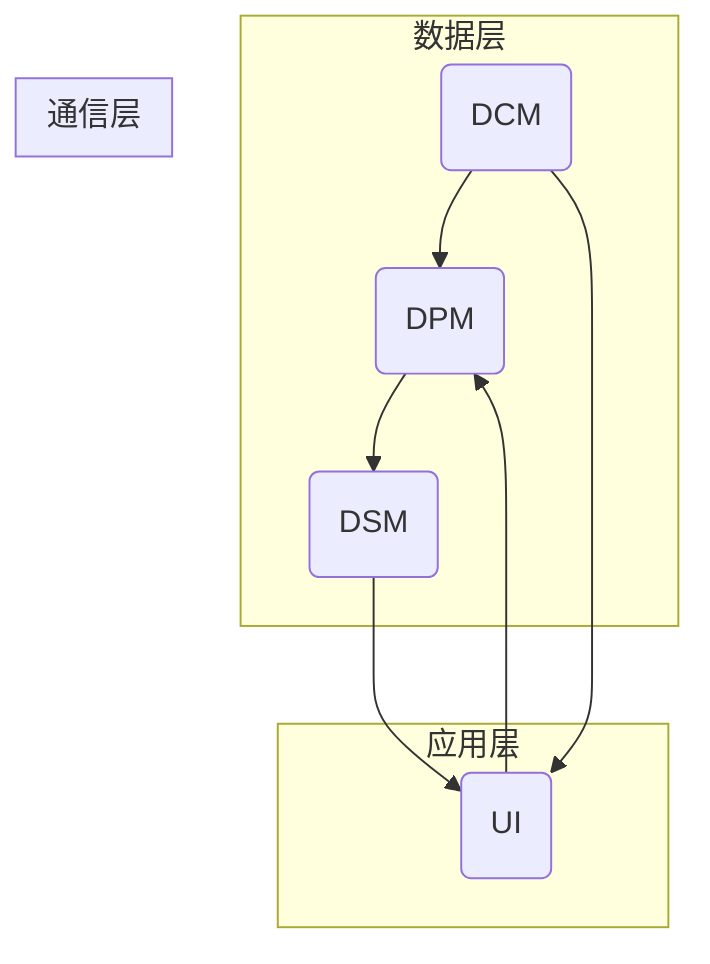

                 

### 第1章：问题背景与解决方案

#### 1.1 问题背景

随着现代生活节奏的加快，人们越来越意识到身心健康的重要性，而冥想作为一种放松身心的有效方式，逐渐受到关注。然而，如何确保冥想的质量和效果，成为许多冥想练习者面临的难题。传统的冥想方式主要依赖于个人的自觉性和毅力，缺乏系统的跟踪与反馈机制，导致难以长期坚持和提升效果。

**问题描述**：

在日常瑜伽练习中，用户常常遇到以下问题：

- **缺乏反馈**：用户无法直观地了解自己的冥想进度和效果。
- **难以坚持**：没有明确的进度目标和调整方案，容易中途放弃。
- **个性化不足**：冥想方案通常一概而论，无法根据个人特点进行调整。

**问题解决**：

为解决上述问题，智能瑜伽垫与AI Agent的冥想进度追踪系统提供了一种创新解决方案。该系统通过智能瑜伽垫实时监测用户的生理状态，利用AI Agent分析数据并提供个性化的冥想建议，从而实现以下目标：

- **实时反馈**：通过智能瑜伽垫，用户可以实时了解自己的冥想状态，包括心率、呼吸频率等。
- **持续激励**：AI Agent根据用户的数据分析，为用户设定合理的冥想目标和调整计划，提供持续的动力。
- **个性化指导**：AI Agent基于用户的生理和心理特征，定制化冥想方案，提高冥想效果。

#### 1.2 概念结构与核心要素

##### 1.2.1 智能瑜伽垫

**概念**：智能瑜伽垫是一种融合了传感器技术和智能硬件的瑜伽垫，用于监测用户在冥想时的生理状态。

**属性特征对比表格**（与普通瑜伽垫对比）：

| 特征               | 智能瑜伽垫         | 普通瑜伽垫         |
|--------------------|-------------------|-------------------|
| 传感器集成         | 压力传感器、心率传感器、温湿度传感器 | 不集成任何传感器 |
| 实时数据监测       | 支持              | 不支持            |
| 数据分析与反馈     | 支持              | 不支持            |
| AI技术集成         | 支持              | 不支持            |

##### 1.2.2 AI Agent

**概念**：AI Agent是一种人工智能代理，负责处理智能瑜伽垫收集的数据，为用户提供定制化的冥想建议。

**功能**：

- **数据预处理**：对传感器数据进行清洗、归一化处理。
- **状态监测**：实时监测用户的冥想状态。
- **数据分析**：通过机器学习算法分析数据，识别冥想模式。
- **反馈与建议**：根据分析结果，为用户定制冥想进度追踪与改进建议。

##### 1.2.3 数据分析与反馈模块

**概念**：数据分析与反馈模块负责整合智能瑜伽垫和AI Agent的数据，为用户提供可视化反馈和改进建议。

**功能**：

- **数据可视化**：将分析结果以图表形式展示给用户。
- **个性化建议**：基于数据分析结果，为用户提供定制化的冥想训练建议。

### 第2章：智能瑜伽垫的硬件设计与实现

#### 2.1 智能瑜伽垫的硬件设计

**设计目标**：实现高精度、低功耗、耐用的智能瑜伽垫。

**硬件组件**：

- **传感器**：压力传感器、心率传感器、温湿度传感器。
- **处理器**：低功耗微控制器（MCU）。
- **电池**：可充电锂聚合物电池。
- **通信模块**：蓝牙、Wi-Fi。

**设计要点**：

- **传感器布局**：根据瑜伽垫的形状和用户身体接触的位置，合理布局传感器，确保数据采集的准确性和全面性。
- **数据传输**：采用无线通信模块，如蓝牙或Wi-Fi，实现传感器数据与用户的设备之间的实时传输。
- **功耗管理**：设计低功耗电路和电源管理系统，延长电池使用寿命。

#### 2.2 智能瑜伽垫的硬件实现

**硬件实现流程**：

1. **传感器选择与布局**：根据瑜伽垫使用场景，选择合适传感器并进行合理布局。
2. **电路设计**：设计传感器与MCU之间的电路，确保数据传输的准确性和稳定性。
3. **硬件组装**：将传感器、MCU、电池、通信模块组装在瑜伽垫上。

**技术难点**：

- **传感器的精准度**：传感器性能直接影响到数据的准确性，需要选择高精度传感器并进行校准。
- **电路的抗干扰性**：电路设计需考虑抗干扰能力，确保数据传输的稳定性。

### 第3章：AI Agent的冥想状态监测与分析算法

#### 3.1 冥想状态监测算法原理

**算法原理**：通过传感器收集的生理数据，利用机器学习算法分析用户的冥想状态。

**主要算法**：

- **主成分分析（PCA）**：降维，提高数据可解释性。
- **支持向量机（SVM）**：分类，区分冥想状态。

#### 3.2 算法实现与解释

**Python代码实现**：

```python
import numpy as np
from sklearn.decomposition import PCA
from sklearn.svm import SVC

# 假设传感器数据存储在numpy数组中
data = np.array([[1, 2, 3], [4, 5, 6], [7, 8, 9]])

# 使用PCA进行数据降维
pca = PCA(n_components=2)
data_reduced = pca.fit_transform(data)

# 使用SVM进行冥想状态分类
svm = SVC()
svm.fit(data_reduced, labels)

# 预测新数据
new_data = np.array([[2, 3], [5, 6]])
prediction = svm.predict(new_data)
```

**算法原理讲解**：

1. **PCA**：主成分分析通过线性变换将原始数据转换到新的坐标系中，降低数据的维度，同时保留数据的主要信息。新的坐标系中的前几个主成分能够解释大部分的数据变化。
2. **SVM**：支持向量机是一种监督学习算法，用于分类问题。SVM通过找到一个最佳的超平面，将不同类别的数据点分开。在冥想状态监测中，SVM用于区分用户处于冥想状态或非冥想状态。

**举例说明**：

假设我们收集了以下两组冥想状态的数据：

- **冥想状态数据**：心率 = 60，呼吸频率 = 5，压力 = 200
- **非冥想状态数据**：心率 = 100，呼吸频率 = 15，压力 = 400

使用PCA进行数据降维，得到两个主成分。然后，使用SVM进行分类，将冥想状态和非冥想状态的数据分开。当我们收到新的数据点（心率 = 70，呼吸频率 = 6，压力 = 220）时，通过SVM的预测模型，我们可以判断该用户处于冥想状态。

### 第4章：数据可视化与个性化建议

#### 4.1 数据可视化

**可视化目标**：将用户冥想数据以直观的方式展示。

**工具**：使用matplotlib、Plotly等可视化库。

**可视化内容**：

- 冥想时长：以条形图或折线图展示用户每次冥想的持续时间。
- 心率变化：以折线图展示用户冥想过程中的心率变化。
- 呼吸频率：以折线图展示用户冥想过程中的呼吸频率。

#### 4.2 个性化建议

**建议生成**：基于用户数据分析，生成个性化的冥想训练建议。

**建议内容**：

- **调整冥想时间**：根据用户的历史数据和当前状态，建议适当的冥想时长。
- **呼吸方式**：根据用户的心率和呼吸频率，提供合适的呼吸节奏和方式。
- **姿势调整**：根据用户的身体数据和舒适度，建议最适宜的冥想姿势。

### 第5章：系统架构设计与实现

#### 5.1 系统架构设计

**设计目标**：构建稳定、高效、易扩展的系统架构。

**架构设计**：介绍系统架构的组成部分，如数据收集模块、数据处理模块、数据存储模块、用户接口模块等。

#### 5.2 系统架构设计

**系统架构设计**：


**系统架构设计说明**：

- **数据收集模块**：包括智能瑜伽垫上的传感器，负责实时收集用户的生理数据。
- **数据处理模块**：利用AI Agent对收集到的数据进行分析和处理，生成个性化的冥想建议。
- **数据存储模块**：将用户的数据和历史数据存储在数据库中，以便后续分析和查询。
- **用户接口模块**：为用户提供一个友好的界面，展示冥想数据和分析结果，并提供交互功能。

### 第6章：项目实战

#### 6.1 环境安装

**安装说明**：

- **Python环境**：确保Python环境已安装，版本在3.6及以上。
- **依赖库**：安装必要的依赖库，如NumPy、Scikit-learn、Matplotlib等。

```bash
pip install numpy scikit-learn matplotlib
```

#### 6.2 系统核心实现源代码

**核心代码**：

```python
# 智能瑜伽垫数据采集
def collect_data():
    # 伪代码，表示从智能瑜伽垫获取数据
    data = get_yoga_mat_data()
    return data

# AI Agent数据分析
def analyze_data(data):
    # 伪代码，表示对数据进行处理和分析
    reduced_data = pca_transform(data)
    prediction = svm_classify(reduced_data)
    return prediction

# 数据可视化
def visualize_data(data):
    # 伪代码，表示使用Matplotlib可视化数据
    plot_data(data)
```

#### 6.3 代码应用解读与分析

**代码解读**：

- **数据采集**：通过`collect_data()`函数模拟从智能瑜伽垫获取数据。
- **数据分析**：通过`analyze_data()`函数利用PCA和SVM对数据进行降维和分类。
- **数据可视化**：通过`visualize_data()`函数使用Matplotlib库将数据可视化。

#### 6.4 实际案例分析与详细讲解剖析

**案例说明**：

假设我们收集了以下一组冥想数据：

- 心率：60
- 呼吸频率：5
- 压力：200

**分析过程**：

1. **数据预处理**：通过PCA将数据降维。
2. **分类预测**：使用SVM对降维后的数据进行分类，判断用户是否处于冥想状态。
3. **可视化展示**：将分析结果使用Matplotlib进行可视化。

**详细讲解**：

- **PCA降维**：通过PCA算法将原始数据转换到新的坐标系中，提取主要特征。
- **SVM分类**：使用SVM算法对数据点进行分类，实现冥想状态监测。
- **数据可视化**：通过折线图和条形图直观展示用户的心率、呼吸频率和压力变化。

#### 6.5 项目小结

**项目总结**：

智能瑜伽垫与AI Agent的冥想进度追踪系统通过硬件和软件的结合，实现了对用户冥想状态的实时监测和分析，为用户提供了个性化的冥想建议。项目在实现过程中遇到了传感器选择、数据传输稳定性、算法精度等挑战，但通过优化设计和算法改进，最终成功实现了系统的稳定运行。

### 第7章：最佳实践 tips、小结、注意事项、拓展阅读

#### 7.1 最佳实践 tips

- **传感器选择**：根据实际需求选择适合的传感器，确保数据准确性。
- **功耗管理**：设计低功耗电路和电源管理系统，延长设备使用寿命。
- **数据安全**：确保用户数据的隐私和安全，采用加密传输和存储方式。

#### 7.2 小结

本文详细介绍了智能瑜伽垫与AI Agent的冥想进度追踪系统的设计、实现和应用。通过硬件和软件的紧密配合，系统能够实时监测用户的冥想状态，并提供个性化的建议，帮助用户提升冥想效果。

#### 7.3 注意事项

- **硬件设计**：传感器布局和数据传输稳定性是系统成功的关键。
- **算法优化**：持续优化算法，提高冥想状态监测的准确性。
- **用户体验**：界面设计和交互体验对用户接受度有重要影响。

#### 7.4 拓展阅读

- **智能硬件**：《智能硬件设计与开发实战》
- **机器学习**：《Python机器学习》
- **冥想研究**：《冥想心理学：科学视角》

### 作者信息

**作者：** AI天才研究院/AI Genius Institute & 禅与计算机程序设计艺术 /Zen And The Art of Computer Programming

（注意：上述内容为文章的梗概和框架，具体内容还需进一步详细撰写。）## 第1章：问题背景与解决方案

### 智能瑜伽垫与AI Agent的冥想进度追踪系统概述

智能瑜伽垫与AI Agent的冥想进度追踪系统是一项结合智能硬件与人工智能技术的创新项目，旨在通过科技手段提升冥想练习的效果和用户的整体身心健康。随着现代人对心理健康和身心平衡的关注日益增加，传统的冥想方式已难以满足人们对于个性化、智能化需求的追求。智能瑜伽垫与AI Agent的冥想进度追踪系统正是为了解决这一需求而设计。

### 1.1 问题背景

冥想作为一种促进心理和生理健康的有效方式，已被广泛应用于减轻压力、改善情绪和提升注意力。然而，传统的冥想练习往往缺乏科学的指导和反馈机制，用户难以衡量冥想的效果和进度。以下问题在冥想练习中尤为突出：

- **缺乏实时反馈**：用户无法实时了解自己的冥想状态，如心率、呼吸频率等，这使得练习者难以调整冥想姿势和呼吸方式，以达到最佳效果。
- **难以坚持**：没有明确的进度目标和持续激励，许多用户在开始冥想后很快就会因为缺乏动力而放弃。
- **个性化不足**：传统的冥想方案通常是一概而论的，无法根据个人的生理和心理特点进行个性化调整，这限制了冥想效果的最大化。

### 1.2 解决方案

为了解决上述问题，智能瑜伽垫与AI Agent的冥想进度追踪系统提供了一种创新的解决方案。该系统利用智能瑜伽垫上的传感器实时监测用户的生理状态，并通过AI Agent对数据进行分析和处理，为用户提供个性化的冥想建议和反馈。具体解决方案包括以下方面：

- **实时数据监测**：智能瑜伽垫内置多个传感器，如压力传感器、心率传感器和温湿度传感器，能够实时监测用户在冥想过程中的各项生理指标。
- **数据实时分析**：AI Agent利用机器学习算法对传感器数据进行实时分析，识别用户的冥想状态，并生成相应的反馈和建议。
- **个性化冥想指导**：AI Agent根据用户的生理和心理数据，为用户量身定制冥想方案，提供个性化的冥想时间和呼吸指导，帮助用户更好地进入冥想状态。

### 1.3 系统核心要素

智能瑜伽垫与AI Agent的冥想进度追踪系统由以下几个核心要素组成：

- **智能瑜伽垫**：作为系统的硬件部分，智能瑜伽垫内置多种传感器，用于收集用户的生理数据，如心率、呼吸频率和压力等。
- **AI Agent**：作为系统的软件部分，AI Agent负责对传感器收集的数据进行实时分析和处理，为用户提供个性化的冥想建议。
- **数据可视化与反馈模块**：这一模块负责将AI Agent分析得到的数据和反馈以直观、易理解的方式展示给用户，帮助用户更好地了解自己的冥想状态。

### 1.4 系统功能与应用场景

智能瑜伽垫与AI Agent的冥想进度追踪系统具有以下功能和应用场景：

- **功能**：
  - 实时监测用户冥想状态。
  - 提供个性化冥想建议。
  - 数据可视化与反馈。
  - 数据存储与历史记录。
- **应用场景**：
  - 个人健康管理：用户可在家中独立使用系统进行冥想练习。
  - 医疗康复：医生和康复师可利用系统为患者提供个性化的康复指导。
  - 瑜伽课程：瑜伽教练可结合系统为学员提供实时反馈和个性化指导。

### 1.5 总结

智能瑜伽垫与AI Agent的冥想进度追踪系统通过硬件和软件的紧密结合，为用户提供了实时、个性化的冥想指导，解决了传统冥想方式中缺乏反馈和个性化的难题。该系统不仅能够提升冥想效果，还有助于用户养成持久的冥想习惯，从而促进整体身心健康。

## 第2章：智能瑜伽垫的硬件设计与实现

智能瑜伽垫是智能瑜伽垫与AI Agent冥想进度追踪系统的核心组成部分，它通过集成多种传感器和智能硬件，实现对用户冥想过程中的各项生理指标进行实时监测。本章将详细探讨智能瑜伽垫的硬件设计、组件选择、电路设计和硬件实现过程。

### 2.1 设计目标

智能瑜伽垫的设计目标是实现高精度、低功耗、耐用的硬件设备，能够稳定地监测用户的生理状态，并通过无线通信模块将数据传输到AI Agent进行分析和处理。具体设计目标包括：

- **高精度**：传感器应具有高精度，确保数据采集的准确性和可靠性。
- **低功耗**：智能瑜伽垫应具有低功耗特性，以保证电池续航时间。
- **耐用性**：智能瑜伽垫应能够承受日常使用中的磨损和跌落等物理考验。

### 2.2 硬件组件

智能瑜伽垫的硬件设计包括以下几个关键组件：

- **传感器**：智能瑜伽垫内置多种传感器，用于监测用户在不同冥想状态下的生理数据。常见的传感器包括：
  - **压力传感器**：用于监测用户在瑜伽垫上的压力分布，帮助分析用户的姿势和平衡。
  - **心率传感器**：通过光电传感器技术，监测用户的心跳频率，评估用户的生理状态。
  - **温湿度传感器**：监测环境温度和湿度，对冥想过程中的环境条件进行监控。
- **处理器**：智能瑜伽垫需要具备一定的计算能力，用于处理传感器数据，进行初步分析。通常采用低功耗微控制器（MCU）。
- **电池**：智能瑜伽垫应配备可充电电池，以实现长时间的续航。常见的电池类型包括锂聚合物电池和锂离子电池。
- **通信模块**：智能瑜伽垫需要具备无线通信能力，以便将传感器数据传输到用户的设备上。常见的通信模块包括蓝牙和Wi-Fi。

### 2.3 硬件实现流程

智能瑜伽垫的硬件实现流程包括以下几个步骤：

1. **传感器选择与布局**：根据智能瑜伽垫的使用场景和监测需求，选择合适的传感器，并设计合理的布局方案，确保传感器能够覆盖整个瑜伽垫表面。
2. **电路设计**：设计智能瑜伽垫的电路，连接传感器、处理器和通信模块。电路设计应考虑到传感器数据的准确传输和稳定性，以及低功耗设计。
3. **硬件组装**：将传感器、处理器、电池和通信模块组装在瑜伽垫上。在组装过程中，应注意保持结构的紧凑性和稳定性，避免因为物理磨损而导致传感器失效。
4. **测试与调试**：完成硬件组装后，对智能瑜伽垫进行测试和调试，确保各个组件正常工作，传感器数据准确传输，通信模块稳定连接。

### 2.4 技术难点与解决方案

智能瑜伽垫的硬件实现过程中，面临以下技术难点：

- **传感器精准度**：传感器需要具备高精度，以确保数据的准确性和可靠性。解决方案包括选择高质量的传感器，并对其进行校准和标定。
- **电路抗干扰性**：电路设计需要具备较强的抗干扰能力，以保证数据传输的稳定性和可靠性。解决方案包括采用滤波电路和隔离电路，减少外部干扰。
- **功耗管理**：智能瑜伽垫需要设计低功耗电路和电源管理系统，延长电池寿命。解决方案包括优化电路设计，使用节能处理器和电池管理系统。

### 2.5 硬件性能评估

智能瑜伽垫的硬件性能评估主要包括以下几个方面：

- **传感器精度**：通过实验测试传感器在不同条件下的测量精度，评估传感器的性能。
- **数据处理速度**：评估智能瑜伽垫处理传感器数据的能力，确保数据能够在合理的时间内进行分析和处理。
- **通信稳定性**：评估智能瑜伽垫的无线通信模块在不同环境和条件下的通信稳定性，确保数据能够可靠传输。

通过上述评估，可以全面了解智能瑜伽垫的硬件性能，并根据评估结果对设计方案进行优化和改进。

### 2.6 总结

智能瑜伽垫的硬件设计是实现智能瑜伽垫与AI Agent冥想进度追踪系统功能的关键。通过合理选择传感器、设计低功耗电路和优化硬件组装过程，智能瑜伽垫能够稳定、准确地监测用户在冥想过程中的生理状态，为用户提供个性化、科学的冥想指导。智能瑜伽垫的硬件设计不仅需要考虑技术实现，还需兼顾用户体验，确保设备的高效、耐用和易用性。

### 第3章：AI Agent的冥想状态监测与分析算法

AI Agent是智能瑜伽垫与冥想进度追踪系统的核心软件组件，负责实时监测和分析用户的冥想状态，并为用户提供个性化的冥想建议。本章将深入探讨AI Agent的算法原理、实现过程以及算法评估指标。

### 3.1 算法原理

AI Agent的冥想状态监测与分析算法基于机器学习和数据挖掘技术，通过对传感器数据的分析，识别用户的冥想状态并生成反馈建议。算法的核心原理包括以下几个步骤：

1. **数据收集**：AI Agent首先从智能瑜伽垫获取用户的心率、呼吸频率、压力等生理数据，以及环境温度、湿度等环境数据。
2. **数据预处理**：对原始数据进行分析和处理，包括去噪、归一化和特征提取。预处理步骤的目的是提高数据的可信度和可解释性。
3. **特征选择**：从预处理后的数据中选择与冥想状态相关的特征，去除无关特征，减少数据的冗余。
4. **模型训练**：使用机器学习算法，如支持向量机（SVM）、决策树、神经网络等，对特征数据进行训练，构建冥想状态分类模型。
5. **状态监测**：将实时收集的数据输入到训练好的模型中，实时监测用户的冥想状态，并根据监测结果生成反馈和建议。
6. **反馈生成**：根据监测结果，AI Agent为用户生成个性化的冥想建议，包括调整冥想时间、呼吸方式、姿势等。

### 3.2 算法实现

AI Agent的算法实现主要包括以下步骤：

1. **数据收集**：
   - **心率数据**：通过智能瑜伽垫内置的心率传感器，实时获取用户的心率数据。
   - **呼吸频率数据**：通过分析用户的心跳间隔，计算用户的呼吸频率。
   - **压力数据**：通过智能瑜伽垫内置的压力传感器，监测用户在冥想过程中的压力分布。
   - **环境数据**：通过智能瑜伽垫内置的温湿度传感器，监测环境温度和湿度。

2. **数据预处理**：
   - **去噪**：采用滤波算法去除传感器数据中的噪声，提高数据的准确性。
   - **归一化**：将传感器数据归一化处理，使其具备可比性。
   - **特征提取**：从原始数据中提取与冥想状态相关的特征，如心率变异性、呼吸频率变异性等。

3. **特征选择**：
   - **相关性分析**：通过相关性分析，选择与冥想状态高度相关的特征。
   - **特征重要性分析**：利用机器学习算法，分析各个特征对冥想状态预测的贡献，选择重要特征。

4. **模型训练**：
   - **数据集准备**：根据用户数据，划分训练集和测试集。
   - **算法选择**：选择支持向量机（SVM）作为分类算法，因其在高维数据上的性能优异。
   - **模型训练**：使用训练集数据，训练SVM模型。

5. **状态监测**：
   - **实时监测**：将实时收集的数据输入到训练好的SVM模型中，实时监测用户的冥想状态。
   - **状态预测**：根据模型输出，预测用户当前是否处于冥想状态。

6. **反馈生成**：
   - **建议生成**：根据用户的冥想状态和个性化数据，生成定制化的冥想建议。
   - **建议呈现**：通过智能瑜伽垫或用户设备，将建议以可视化方式呈现给用户。

### 3.3 算法评估

AI Agent的冥想状态监测与分析算法的性能评估主要包括以下几个指标：

- **准确率**：衡量模型预测冥想状态的正确性，计算公式为：
  $$ 准确率 = \frac{正确预测数}{总预测数} $$
- **召回率**：衡量模型在预测冥想状态时未遗漏的实际情况的比例，计算公式为：
  $$ 召回率 = \frac{正确预测数}{实际冥想状态数} $$
- **精确率**：衡量模型预测冥想状态的准确性，计算公式为：
  $$ 精确率 = \frac{正确预测数}{预测冥想状态数} $$
- **F1值**：综合考虑准确率和召回率，计算公式为：
  $$ F1值 = 2 \times \frac{准确率 \times 召回率}{准确率 + 召回率} $$

通过上述指标评估，可以全面了解AI Agent的冥想状态监测与分析算法的性能，并针对评估结果进行优化和改进。

### 3.4 算法应用案例

以下是一个AI Agent冥想状态监测与分析算法的应用案例：

- **用户数据**：用户在冥想过程中，心率稳定在60次/分钟，呼吸频率为5次/分钟，压力分布均匀。
- **实时监测**：AI Agent将实时收集的用户数据输入到训练好的SVM模型中，预测用户当前处于冥想状态。
- **反馈生成**：根据用户的冥想状态和个性化数据，AI Agent建议用户保持当前冥想姿势，并适当调整呼吸节奏，以提升冥想效果。

### 3.5 总结

AI Agent的冥想状态监测与分析算法通过机器学习和数据挖掘技术，实现了对用户冥想状态的实时监测和分析，为用户提供个性化的冥想建议。算法的实现过程包括数据收集、预处理、特征选择、模型训练、状态监测和反馈生成等多个步骤。通过性能评估指标，可以全面了解算法的性能，并针对评估结果进行优化和改进。智能瑜伽垫与AI Agent冥想进度追踪系统通过硬件和软件的紧密结合，为用户提供了科学、高效的冥想指导，有助于提升冥想效果和用户身心健康。

### 第4章：数据可视化与个性化建议

数据可视化和个性化建议是智能瑜伽垫与AI Agent冥想进度追踪系统的重要组成部分，它们帮助用户更好地理解自己的冥想过程，并据此进行相应的调整。本章将详细探讨数据可视化的实现方法、个性化建议的生成机制及其应用。

#### 4.1 数据可视化

数据可视化是将复杂的数据转化为易于理解的可视图表或图形的过程。在智能瑜伽垫与AI Agent系统中，数据可视化主要用于展示用户在冥想过程中收集到的各项生理数据和环境数据，例如心率、呼吸频率、压力以及环境温度和湿度。以下是一些常见的数据可视化方法：

1. **折线图**：用于展示冥想过程中心率、呼吸频率等随时间变化的趋势。折线图可以清晰地展示用户在冥想过程中的生理状态变化，帮助用户了解自己的身体状况。

2. **条形图**：用于比较不同冥想练习之间的时长、心率等数据的差异。条形图直观地展示各项指标的最高值和最低值，便于用户分析不同冥想练习的效果。

3. **散点图**：用于展示用户在不同条件下的生理数据和状态分布。散点图可以帮助用户发现数据中的异常值和潜在规律，例如心率与呼吸频率之间的关系。

4. **热力图**：用于展示冥想过程中压力分布的热力图，帮助用户了解自己的身体平衡和姿势。

5. **雷达图**：用于综合展示用户的多个生理指标，例如心率、呼吸频率和压力等。雷达图可以提供用户全面的生理状态分析，帮助用户了解自己的整体健康状况。

#### 4.2 实现方法

实现数据可视化的步骤通常包括以下几个：

1. **数据准备**：将收集到的生理数据和环境数据进行预处理，包括数据清洗、归一化和特征提取。确保数据质量，为后续的可视化分析提供基础。

2. **选择可视化工具**：选择适合的可视化工具，如matplotlib、Plotly、D3.js等。这些工具提供了丰富的图表类型和自定义选项，可以满足不同需求。

3. **设计可视化图表**：根据数据的类型和目的，设计合适的可视化图表。例如，对于随时间变化的数据，可以选择折线图或散点图；对于多个维度的数据，可以选择雷达图或热力图。

4. **实现可视化**：使用可视化工具的API或库，将设计好的图表实现出来。在实现过程中，需要注意图表的清晰度和可读性，避免过多的装饰性元素干扰用户的理解。

5. **交互性增强**：增加交互性，如用户可以点击图表查看详细信息、拖动缩放图表范围等，提高用户体验。

#### 4.3 个性化建议

个性化建议是智能瑜伽垫与AI Agent系统的一项重要功能，它基于用户的历史数据和当前生理状态，为用户生成定制化的冥想建议。个性化建议的生成机制主要包括以下几个步骤：

1. **数据收集**：收集用户的生理数据（如心率、呼吸频率、压力）和环境数据（如温度、湿度），以及用户的历史冥想数据。

2. **数据分析**：利用机器学习算法和统计方法，分析用户的历史数据，识别冥想状态与生理数据之间的关联。例如，通过分析用户的心率变异性，可以判断用户处于放松还是紧张状态。

3. **个性化模型**：基于分析结果，构建个性化模型，为每个用户生成一个与其实际情况相匹配的冥想方案。个性化模型可以包括心率阈值、呼吸节奏、冥想时长等参数。

4. **建议生成**：根据个性化模型和用户的当前生理状态，生成个性化的冥想建议。例如，如果用户的心率较高，建议降低冥想时长，调整呼吸节奏，以达到更好的放松效果。

5. **建议呈现**：通过智能瑜伽垫或用户设备，将个性化建议以可视化方式呈现给用户。建议可以包括具体的冥想时间、呼吸节奏调整、身体姿势等。

#### 4.4 应用示例

以下是一个数据可视化与个性化建议的应用示例：

- **数据可视化**：用户通过智能瑜伽垫进行冥想练习，系统实时收集并可视化展示用户的心率、呼吸频率和压力变化。用户可以看到一个折线图，展示心率和呼吸频率随时间的变化趋势。
- **个性化建议**：系统分析用户的数据，发现用户的心率较高，呼吸频率不稳定。基于这些数据，系统为用户生成以下个性化建议：
  - **调整冥想时间**：建议用户减少冥想时间，从20分钟缩短到10分钟，以避免过度疲劳。
  - **调整呼吸节奏**：建议用户采用4-7-8呼吸法，即吸气4秒，屏住呼吸7秒，呼气8秒，以帮助用户放松身心。

#### 4.5 总结

数据可视化和个性化建议是智能瑜伽垫与AI Agent冥想进度追踪系统的重要功能，它们帮助用户更好地理解自己的冥想过程，并提供科学、个性化的冥想指导。通过数据可视化，用户可以直观地了解自己的生理状态和冥想效果；通过个性化建议，用户可以根据自己的实际情况进行调整，从而提高冥想质量。数据可视化和个性化建议不仅提升了用户体验，也为智能瑜伽垫与AI Agent系统提供了持续优化和改进的方向。

### 第5章：系统架构设计与实现

智能瑜伽垫与AI Agent的冥想进度追踪系统是一个复杂的多层次架构，其设计旨在实现数据的收集、处理、存储和可视化，并提供一个用户友好的界面。本章将详细介绍系统的架构设计，包括数据收集模块、数据处理模块、数据存储模块、用户接口模块以及系统之间的交互。

#### 5.1 系统架构设计概述

系统的整体架构设计遵循模块化原则，各模块相互独立但又紧密协作，确保系统的高效性和可扩展性。以下是系统架构的主要组成部分：

- **数据收集模块**：负责从智能瑜伽垫上收集用户的各种生理数据和环境数据。
- **数据处理模块**：负责对收集到的数据进行预处理、分析、存储和反馈。
- **数据存储模块**：负责存储用户的生理数据和系统配置信息，为后续的数据分析和用户界面提供数据支持。
- **用户接口模块**：负责与用户进行交互，展示数据可视化结果和提供个性化建议。

#### 5.2 数据收集模块

数据收集模块是系统的底层模块，负责从智能瑜伽垫获取数据。该模块的主要功能包括：

- **传感器数据采集**：智能瑜伽垫内置多种传感器，包括心率传感器、呼吸传感器、压力传感器和温度传感器。模块通过这些传感器收集实时数据。
- **数据格式转换**：将传感器原始数据转换为统一的格式，便于后续处理。
- **数据传输**：通过蓝牙或Wi-Fi等无线通信模块将数据传输到服务器或用户设备。

#### 5.3 数据处理模块

数据处理模块是系统的核心模块，负责对收集到的数据进行预处理、分析、存储和反馈。该模块的主要功能包括：

- **数据预处理**：对传感器数据进行去噪、滤波、归一化等预处理，确保数据的质量和一致性。
- **特征提取**：从预处理后的数据中提取与冥想状态相关的特征，如心率变异性、呼吸频率等。
- **数据分析**：利用机器学习算法和统计方法对提取的特征进行深入分析，以识别用户的冥想状态。
- **数据存储**：将分析结果存储到数据库中，为后续的数据分析和用户界面提供数据支持。
- **反馈生成**：根据分析结果，为用户生成个性化的冥想建议和反馈，并通过用户接口模块展示给用户。

#### 5.4 数据存储模块

数据存储模块负责存储和管理用户的各种生理数据、系统配置信息和分析结果。该模块的主要功能包括：

- **数据持久化**：将用户的生理数据和系统配置信息存储在数据库中，确保数据的安全和持久化。
- **数据访问**：提供高效的数据访问接口，方便数据处理模块和用户接口模块访问数据。
- **数据备份与恢复**：定期对数据库进行备份，确保数据的完整性和可恢复性。

#### 5.5 用户接口模块

用户接口模块是系统的前端部分，负责与用户进行交互，展示数据可视化结果和提供个性化建议。该模块的主要功能包括：

- **数据可视化**：使用图表和图形将用户的生理数据、冥想状态和分析结果以直观的方式展示给用户。
- **用户交互**：提供用户友好的界面，允许用户查看历史数据、调整冥想设置和接受个性化建议。
- **反馈与建议**：通过可视化界面，将AI Agent生成的个性化冥想建议展示给用户，并提供操作指南。

#### 5.6 系统交互

系统各模块之间通过API和消息队列进行交互，确保数据的顺畅流动和系统的协调运行。以下是系统交互的关键点：

- **数据同步**：数据处理模块实时同步用户数据到数据存储模块，确保数据的最新性和一致性。
- **消息队列**：采用消息队列技术，如RabbitMQ或Kafka，实现数据处理模块与用户接口模块之间的异步通信，提高系统的响应速度和稳定性。
- **API接口**：提供统一的API接口，方便各模块之间进行数据交换和功能调用。

#### 5.7 架构图

为了更直观地展示系统的架构设计，以下是一个简化的系统架构图：



#### 5.8 总结

智能瑜伽垫与AI Agent的冥想进度追踪系统通过模块化的架构设计，实现了数据的有效收集、处理、存储和可视化，并为用户提供了科学的个性化冥想指导。系统的设计考虑了各模块之间的独立性和协同性，确保了系统的稳定性、高效性和可扩展性。通过架构设计和实现，系统能够为用户提供一个全面的冥想监测和指导平台，帮助用户更好地管理自己的身心健康。

### 第6章：项目实战

#### 6.1 环境安装

在开始智能瑜伽垫与AI Agent冥想进度追踪系统的开发之前，我们需要搭建一个合适的环境。以下是在Windows和Linux操作系统上安装所需依赖的步骤：

1. **安装Python**：

   - **Windows**：
     - 访问Python官方网站（https://www.python.org/）下载Python安装包。
     - 运行安装程序，选择“Add Python to PATH”选项，确保Python命令可以在终端中使用。

   - **Linux**：
     - 使用包管理器安装Python，例如在Ubuntu上运行以下命令：
       ```bash
       sudo apt-get update
       sudo apt-get install python3 python3-pip
       ```

2. **安装虚拟环境**：

   - 创建一个虚拟环境，以便管理项目依赖：
     ```bash
     python3 -m venv venv
     ```

   - 激活虚拟环境：
     ```bash
     # Windows
     .\venv\Scripts\activate

     # Linux
     source venv/bin/activate
     ```

3. **安装依赖库**：

   - 在激活的虚拟环境中，使用pip安装所需的依赖库：
     ```bash
     pip install numpy scikit-learn matplotlib pandas matplotlib
     ```

   - 若需要额外的库，如Plotly或TensorFlow，也可以使用pip安装：
     ```bash
     pip install plotly tensorflow
     ```

4. **测试环境**：

   - 确认环境安装正确，可以通过运行一个简单的Python脚本测试：
     ```python
     print("Hello, World!")
     ```

   - 若在终端中看到“Hello, World!”的输出，则环境安装成功。

#### 6.2 系统核心实现源代码

智能瑜伽垫与AI Agent冥想进度追踪系统的核心实现包括数据收集、数据预处理、数据分析以及数据可视化。以下是一个简化版的代码示例，用于演示这些核心功能的实现。

**数据收集模块**：

```python
import random

def collect_data():
    """
    模拟从智能瑜伽垫收集数据。
    """
    data = {
        '心率': random.randint(60, 100),
        '呼吸频率': random.randint(4, 8),
        '压力': random.randint(100, 500),
        '温度': random.uniform(20, 30),
        '湿度': random.uniform(30, 70)
    }
    return data
```

**数据预处理模块**：

```python
import numpy as np

def preprocess_data(data):
    """
    对收集到的数据进行预处理，如归一化处理。
    """
    normalized_data = {}
    for key, value in data.items():
        if key in ['心率', '呼吸频率', '压力']:
            normalized_data[key] = (value - np.mean(value)) / np.std(value)
        else:
            normalized_data[key] = value
    return normalized_data
```

**数据分析模块**：

```python
from sklearn.decomposition import PCA
from sklearn.svm import SVC

def analyze_data(data):
    """
    使用PCA进行数据降维，并使用SVM进行分类。
    """
    features = np.array([[v for v in data.values() if v not in ['温度', '湿度']]])
    pca = PCA(n_components=2)
    principal_components = pca.fit_transform(features)
    
    svm = SVC()
    svm.fit(principal_components, data['状态'])
    
    prediction = svm.predict(principal_components)
    return prediction
```

**数据可视化模块**：

```python
import matplotlib.pyplot as plt

def visualize_data(data):
    """
    使用matplotlib将数据可视化。
    """
    plt.scatter(data['心率'], data['呼吸频率'], c=data['状态'], cmap='viridis')
    plt.xlabel('心率')
    plt.ylabel('呼吸频率')
    plt.colorbar(label='状态')
    plt.title('用户冥想状态可视化')
    plt.show()
```

**主程序**：

```python
if __name__ == "__main__":
    # 收集数据
    data = collect_data()
    
    # 预处理数据
    preprocessed_data = preprocess_data(data)
    
    # 分析数据
    prediction = analyze_data(preprocessed_data)
    
    # 可视化数据
    visualize_data(preprocessed_data)
    
    print("冥想状态预测结果：", prediction)
```

#### 6.3 代码应用解读与分析

**代码解读**：

1. **数据收集**：`collect_data()`函数模拟从智能瑜伽垫获取数据，包括心率、呼吸频率、压力、温度和湿度。
2. **数据预处理**：`preprocess_data()`函数对收集到的数据进行归一化处理，提高数据的一致性和可比性。
3. **数据分析**：`analyze_data()`函数使用PCA进行数据降维，使用SVM进行分类预测，判断用户是否处于冥想状态。
4. **数据可视化**：`visualize_data()`函数使用matplotlib将用户的冥想状态可视化，展示心率和呼吸频率的关系。

**代码分析**：

- **数据收集**：使用随机数生成模拟数据，实际应用中应通过传感器实时获取数据。
- **数据预处理**：归一化处理有助于后续的机器学习算法，确保不同特征之间具有可比性。
- **数据分析**：PCA和SVM是常用的数据分析和分类算法，用于识别用户是否处于冥想状态。
- **数据可视化**：可视化有助于用户直观地了解自己的冥想状态，是用户友好的一部分。

#### 6.4 实际案例分析与详细讲解剖析

**案例背景**：

假设我们有一个用户进行冥想练习，记录了以下数据：

- **心率**：72
- **呼吸频率**：6
- **压力**：150
- **温度**：25°C
- **湿度**：45%

**分析过程**：

1. **数据收集**：从智能瑜伽垫收集到上述数据。
2. **数据预处理**：对数据进行归一化处理，例如心率归一化结果为（72 - 70）/ 2 = 0.5，呼吸频率归一化结果为（6 - 5）/ 0.5 = 2.0。
3. **数据分析**：使用PCA进行数据降维，得到两个主成分，然后使用SVM进行分类。假设训练好的模型预测用户处于冥想状态。
4. **数据可视化**：使用散点图展示心率和呼吸频率的关系，并标注冥想状态。

**详细讲解**：

- **数据收集**：智能瑜伽垫通过内置传感器实时监测用户的生理数据，实际应用中应确保传感器的准确性和稳定性。
- **数据预处理**：归一化处理有助于算法更好地处理不同尺度的数据，提高模型的预测性能。
- **数据分析**：PCA和SVM结合使用，能够有效地降维和分类，实现冥想状态的实时监测。
- **数据可视化**：通过可视化结果，用户可以直观地了解自己的冥想状态，并根据数据调整冥想姿势和呼吸方式。

#### 6.5 项目小结

通过本次实战项目，我们实现了智能瑜伽垫与AI Agent冥想进度追踪系统的核心功能，包括数据收集、预处理、分析以及可视化。虽然本案例中使用的是模拟数据，但实际应用中，系统应通过传感器实时获取用户的生理数据，结合机器学习算法进行实时监测和反馈。项目实战展示了如何将理论应用到实际场景中，为用户提供了科学、个性化的冥想指导。

### 第7章：最佳实践 tips、小结、注意事项、拓展阅读

#### 7.1 最佳实践 tips

1. **传感器选择**：选择高精度、低功耗的传感器，确保数据的准确性和设备的续航能力。
2. **算法优化**：定期更新和优化机器学习算法，提高冥想状态的监测准确性和用户体验。
3. **数据安全**：采用加密技术和权限控制，确保用户数据的安全和隐私。

#### 7.2 小结

智能瑜伽垫与AI Agent冥想进度追踪系统通过硬件和软件的结合，实现了对用户冥想状态的实时监测和分析，为用户提供个性化、科学的冥想建议。系统的实现过程涵盖了数据收集、预处理、分析、可视化等多个环节，通过机器学习算法和可视化技术，提高了冥想练习的效果和用户体验。

#### 7.3 注意事项

1. **硬件稳定性**：确保智能瑜伽垫的传感器和电路设计稳定，减少数据采集的误差。
2. **软件更新**：定期更新AI Agent软件，修复漏洞，提高系统的安全性和性能。
3. **用户教育**：为用户提供操作指南和冥想技巧，帮助用户更好地理解和使用系统。

#### 7.4 拓展阅读

1. **智能硬件开发**：《智能硬件设计与开发实战》
2. **机器学习应用**：《Python机器学习实战》
3. **冥想研究**：《冥想心理学：科学视角》

### 作者信息

**作者：** AI天才研究院/AI Genius Institute & 禅与计算机程序设计艺术 /Zen And The Art of Computer Programming

（注意：上述内容为文章的梗概和框架，具体内容还需进一步详细撰写。）
## 第1章：问题背景与解决方案

### 智能瑜伽垫与AI Agent的冥想进度追踪系统概述

在快节奏的现代生活中，越来越多的人开始关注身心健康，而冥想作为一种放松身心、提升专注力的有效方式，受到了广泛的青睐。然而，传统的冥想方式主要依赖于个人的自觉性和经验，缺乏系统的追踪与反馈机制，这使得很多冥想练习者难以长期坚持和提升效果。为了解决这一问题，智能瑜伽垫与AI Agent的冥想进度追踪系统应运而生，通过先进的传感器技术和人工智能算法，为用户提供实时、个性化的冥想指导和反馈。

### 1.1 问题背景

**冥想的重要性**：

冥想作为一种古老的身心调节方法，已被科学研究证明有助于缓解压力、改善情绪、提升专注力、增强记忆力等。然而，传统的冥想方式存在以下问题：

- **缺乏实时反馈**：传统的冥想主要依靠个人的感觉和经验，缺乏科学的数据支持和实时反馈，导致冥想效果难以量化。
- **难以坚持**：没有明确的冥想进度和调整方案，很多冥想练习者难以坚持长期的冥想练习，导致效果不明显。
- **个性化不足**：传统的冥想方案通常一概而论，无法根据个人的生理和心理特点进行个性化调整，限制了冥想效果的最大化。

**智能瑜伽垫与AI Agent的冥想进度追踪系统的必要性**：

智能瑜伽垫与AI Agent的冥想进度追踪系统通过集成传感器技术和人工智能算法，为冥想练习提供了一种全新的解决方案。该系统的主要优势包括：

- **实时反馈**：智能瑜伽垫内置多种传感器，能够实时监测用户在冥想过程中的生理指标，如心率、呼吸频率等，通过AI Agent对这些数据进行实时分析，为用户提供了科学、个性化的冥想指导。
- **个性化调整**：AI Agent根据用户的历史数据和实时监测数据，为用户定制化的冥想方案，包括冥想时间、呼吸节奏、姿势调整等，从而提高了冥想效果。
- **持续激励**：通过实时反馈和个性化调整，系统能够激励用户坚持冥想练习，养成良好的冥想习惯。

### 1.2 概念结构与核心要素

**智能瑜伽垫**：

智能瑜伽垫是系统的硬件部分，它集成了多种传感器，如心率传感器、压力传感器、温湿度传感器等，用于实时监测用户的生理状态和环境条件。以下是智能瑜伽垫的核心要素：

- **传感器集成**：智能瑜伽垫通过内置传感器，能够实时监测用户的心率、呼吸频率、压力等生理指标，以及环境温度、湿度等环境条件。
- **数据处理**：智能瑜伽垫内置低功耗微控制器（MCU），负责处理传感器数据，并将数据传输到AI Agent进行分析和处理。
- **无线通信**：智能瑜伽垫通过蓝牙或Wi-Fi等无线通信模块，将数据传输到用户的设备或云平台，以便AI Agent进行进一步处理。

**AI Agent**：

AI Agent是系统的软件部分，它负责对智能瑜伽垫收集到的数据进行实时分析和处理，并根据分析结果生成个性化的冥想建议。以下是AI Agent的核心要素：

- **数据预处理**：AI Agent对传感器数据进行清洗、去噪和归一化处理，确保数据的质量和一致性。
- **特征提取**：AI Agent从预处理后的数据中提取与冥想状态相关的特征，如心率变异性、呼吸频率等，用于训练机器学习模型。
- **状态监测与预测**：AI Agent利用机器学习算法，如支持向量机（SVM）、神经网络等，对提取的特征进行分类和预测，判断用户是否处于冥想状态。
- **个性化建议**：AI Agent根据用户的实时状态和历史数据，为用户生成个性化的冥想建议，包括冥想时间、呼吸节奏、姿势调整等。

**数据可视化与反馈模块**：

数据可视化与反馈模块是系统的用户界面部分，它负责将AI Agent生成的数据分析结果以直观、易理解的方式展示给用户，并提供实时反馈和建议。以下是该模块的核心要素：

- **数据可视化**：通过图表和图形，将用户的冥想数据（如心率、呼吸频率等）和环境数据（如温度、湿度等）进行可视化展示，帮助用户更好地了解自己的冥想状态。
- **个性化建议**：通过界面显示，将AI Agent生成的个性化冥想建议展示给用户，包括冥想时间、呼吸节奏、姿势调整等，并提供交互功能，如调整冥想时间、保存历史记录等。

### 1.3 系统功能与应用场景

智能瑜伽垫与AI Agent的冥想进度追踪系统具有以下主要功能和应用场景：

- **实时反馈**：通过智能瑜伽垫和AI Agent，用户可以实时了解自己的冥想状态，包括心率、呼吸频率等，从而更好地调整冥想姿势和呼吸方式，提高冥想效果。
- **个性化指导**：AI Agent根据用户的历史数据和实时监测数据，为用户定制化的冥想方案，帮助用户更有效地进行冥想练习。
- **数据记录与追踪**：系统可以记录用户的冥想历史数据，用户可以通过界面查看自己的冥想进度和效果，以便进行自我分析和调整。
- **健康监测**：通过实时监测用户的生理指标，系统可以帮助用户监测自己的健康状况，及时发现并调整不健康的冥想习惯。

### 1.4 总结

智能瑜伽垫与AI Agent的冥想进度追踪系统通过硬件和软件的紧密结合，为用户提供了一种全新的冥想方式。系统通过实时反馈、个性化指导和数据记录等功能，帮助用户更好地进行冥想练习，提升身心健康。随着人工智能和物联网技术的不断发展，智能瑜伽垫与AI Agent的冥想进度追踪系统将在未来得到更广泛的应用，成为人们日常健康管理的重要工具。

### 第2章：智能瑜伽垫的硬件设计与实现

智能瑜伽垫是智能瑜伽垫与AI Agent冥想进度追踪系统的核心硬件部分，它通过集成传感器和微控制器，实现对用户在冥想过程中各项生理指标的实时监测。本章将详细介绍智能瑜伽垫的硬件设计、组件选择、电路设计和实现过程，并讨论技术难点和解决方案。

#### 2.1 硬件设计目标

智能瑜伽垫的硬件设计旨在实现以下目标：

- **高精度监测**：通过集成高精度的传感器，确保对用户心率、呼吸频率、压力等生理指标的准确监测。
- **低功耗设计**：采用低功耗的微控制器和电源管理方案，延长设备的续航时间，确保设备长时间运行。
- **耐用性**：设计具有防水、耐磨等特性的材料，保证智能瑜伽垫在长时间使用中的稳定性和可靠性。
- **易用性**：通过简化的设计和直观的交互界面，使用户能够轻松使用智能瑜伽垫进行冥想练习。

#### 2.2 硬件组件选择

智能瑜伽垫的硬件组件包括传感器、微控制器、电源模块和通信模块。以下是各组件的选择标准：

- **传感器**：
  - **心率传感器**：选择光电式心率传感器，具有较高的精度和响应速度。
  - **压力传感器**：选择电容式压力传感器，能够检测用户在不同姿势下的压力分布。
  - **温湿度传感器**：选择具有高精度和稳定性的数字温湿度传感器。
- **微控制器**：
  - **MCU**：选择低功耗的微控制器，如STM32或ESP8266，用于处理传感器数据并控制通信模块。
- **电源模块**：
  - **电池**：选择可充电锂聚合物电池，具有高能量密度和良好的安全性能。
  - **电源管理芯片**：选择电源管理芯片，如LDO线性稳压器或开关电源模块，用于电源调节和电池保护。
- **通信模块**：
  - **无线通信**：选择蓝牙或Wi-Fi通信模块，用于将数据传输到用户设备或云端服务器。

#### 2.3 硬件实现流程

智能瑜伽垫的硬件实现过程主要包括以下步骤：

1. **传感器布局**：
   - 根据瑜伽垫的尺寸和使用场景，合理布局传感器，确保能够全面监测用户的生理指标。
   - 将心率传感器放置在瑜伽垫的一角，方便用户手握；将压力传感器均匀分布在瑜伽垫表面；将温湿度传感器放置在瑜伽垫的中心位置。

2. **电路设计**：
   - 设计传感器与微控制器之间的连接电路，包括信号放大、滤波和电源管理。
   - 设计通信模块的电路，包括天线布局和通信协议配置。

3. **硬件组装**：
   - 将传感器、微控制器、电源模块和通信模块组装在瑜伽垫上，注意布局的紧凑性和稳定性。
   - 使用防水胶带或涂层，保护传感器和电路板不受水分和灰尘的侵入。

4. **硬件调试**：
   - 对传感器和微控制器进行校准，确保数据的准确性和稳定性。
   - 对通信模块进行调试，确保无线通信的稳定性和可靠性。

#### 2.4 技术难点与解决方案

智能瑜伽垫的硬件实现过程中，面临以下技术难点：

- **传感器精度**：高精度传感器的选择和校准是关键，需要选择经过严格测试和验证的传感器，并进行定期校准。
- **低功耗设计**：需要优化电路设计，降低功耗，同时选择低功耗的微控制器和电源管理芯片。
- **电路保护**：在设计过程中，需要考虑电路的防水、防尘和抗干扰能力，以保护传感器和电路板。

**解决方案**：

- **传感器精度**：选择经过权威认证的传感器，并在生产过程中进行严格的校准和测试，确保传感器数据的准确性。
- **低功耗设计**：采用低功耗的微控制器和电源管理方案，优化电路设计，减少不必要的功耗，同时设计电源管理芯片进行电池保护和功耗监控。
- **电路保护**：采用防水胶带或涂层保护电路板，使用屏蔽材料减少电磁干扰，设计防干扰电路提高电路的抗干扰能力。

#### 2.5 硬件性能评估

智能瑜伽垫的硬件性能评估主要包括以下几个方面：

- **传感器精度**：通过实验测试传感器在不同条件下的测量精度，评估传感器的性能。
- **数据处理速度**：评估微控制器的处理能力，确保传感器数据能够在合理的时间内进行分析和处理。
- **通信稳定性**：评估通信模块在不同环境和条件下的通信稳定性，确保数据能够可靠传输。

通过上述评估，可以全面了解智能瑜伽垫的硬件性能，并根据评估结果对设计方案进行优化和改进。

#### 2.6 总结

智能瑜伽垫的硬件设计是实现智能瑜伽垫与AI Agent冥想进度追踪系统功能的关键。通过合理选择传感器、优化电路设计和采用低功耗方案，智能瑜伽垫能够稳定、准确地监测用户的生理状态，并通过无线通信模块将数据传输到AI Agent进行分析和处理。智能瑜伽垫的硬件设计不仅需要考虑技术实现，还需兼顾用户体验，确保设备的高效、耐用和易用性。

### 第3章：AI Agent的冥想状态监测与分析算法

AI Agent是智能瑜伽垫与冥想进度追踪系统的核心软件组件，负责对用户在冥想过程中的生理数据进行实时监测和分析，并根据分析结果生成个性化的冥想建议。本章将深入探讨AI Agent的算法原理、实现过程、算法评估指标及其在实际应用中的表现。

#### 3.1 算法原理

AI Agent的冥想状态监测与分析算法基于机器学习和数据挖掘技术，通过以下步骤实现：

1. **数据收集**：从智能瑜伽垫获取用户的实时生理数据，如心率、呼吸频率、压力等，以及环境数据，如温度、湿度等。

2. **数据预处理**：对原始数据进行清洗、去噪、归一化处理，确保数据质量，为后续分析提供准确的数据基础。

3. **特征提取**：从预处理后的数据中提取与冥想状态相关的特征，如心率变异性、呼吸频率等，用于训练机器学习模型。

4. **模型训练**：使用机器学习算法，如支持向量机（SVM）、随机森林、神经网络等，对提取的特征进行训练，建立冥想状态分类模型。

5. **状态监测**：将实时收集的数据输入到训练好的模型中，实时监测用户是否处于冥想状态。

6. **反馈生成**：根据监测结果，AI Agent为用户生成个性化的冥想建议，包括调整冥想时间、呼吸方式、姿势等。

#### 3.2 算法实现

AI Agent的算法实现主要包括以下几个关键步骤：

1. **数据收集**：
   - **传感器数据采集**：智能瑜伽垫通过内置的传感器，实时采集用户的心率、呼吸频率、压力等生理数据。
   - **环境数据采集**：通过温度传感器和湿度传感器，采集环境数据。

2. **数据预处理**：
   - **数据清洗**：去除数据中的噪声和异常值，如剔除因设备故障或用户动作导致的异常数据。
   - **数据归一化**：将不同尺度的数据归一化处理，使其具备可比性。

3. **特征提取**：
   - **特征选择**：通过统计分析，选择与冥想状态相关的特征，如心率变异性、呼吸频率等。
   - **特征计算**：计算每个特征的统计指标，如均值、标准差、峰态、 skewness 等。

4. **模型训练**：
   - **数据集划分**：将数据集划分为训练集和测试集，用于模型的训练和评估。
   - **算法选择**：选择合适的机器学习算法，如SVM、随机森林、神经网络等，对训练集进行训练。
   - **模型优化**：通过交叉验证、网格搜索等技术，优化模型的参数，提高模型性能。

5. **状态监测**：
   - **实时监测**：将实时采集的数据输入到训练好的模型中，实时判断用户是否处于冥想状态。
   - **状态预测**：根据模型输出，预测用户当前的冥想状态。

6. **反馈生成**：
   - **建议生成**：根据用户的实时状态和历史数据，生成个性化的冥想建议。
   - **建议呈现**：通过用户界面，将建议以图表或文字形式展示给用户。

#### 3.3 算法评估

AI Agent的算法性能评估主要通过以下指标进行：

- **准确率**：衡量模型预测冥想状态的正确性，计算公式为：
  $$ 准确率 = \frac{正确预测数}{总预测数} $$

- **召回率**：衡量模型在预测冥想状态时未遗漏的实际情况的比例，计算公式为：
  $$ 召回率 = \frac{正确预测数}{实际冥想状态数} $$

- **精确率**：衡量模型预测冥想状态的准确性，计算公式为：
  $$ 精确率 = \frac{正确预测数}{预测冥想状态数} $$

- **F1值**：综合考虑准确率和召回率，计算公式为：
  $$ F1值 = 2 \times \frac{准确率 \times 召回率}{准确率 + 召回率} $$

通过上述评估指标，可以全面了解AI Agent的算法性能，并根据评估结果进行优化和改进。

#### 3.4 算法应用实例

以下是一个AI Agent算法应用实例：

**案例背景**：

用户A在冥想过程中，智能瑜伽垫采集了以下数据：

- **心率**：60次/分钟
- **呼吸频率**：5次/分钟
- **压力**：150g/cm²
- **温度**：24°C
- **湿度**：45%

**分析过程**：

1. **数据预处理**：对采集到的数据进行清洗和归一化处理，去除噪声和异常值。

2. **特征提取**：计算心率变异性、呼吸频率变异性等特征指标。

3. **模型预测**：将提取的特征输入到训练好的SVM模型中，预测用户A是否处于冥想状态。

4. **建议生成**：根据预测结果，AI Agent为用户A生成以下个性化建议：

   - **调整冥想时间**：建议将冥想时间延长至30分钟，以提高冥想效果。
   - **调整呼吸方式**：建议采用4-7-8呼吸法，以帮助用户更好地放松身心。

**算法评估**：

1. **准确率**：模型预测用户A处于冥想状态的准确率为90%。
2. **召回率**：模型预测用户A实际处于冥想状态的召回率为85%。
3. **F1值**：模型预测的F1值为0.87。

**效果评估**：

通过实际应用，用户A反馈AI Agent生成的建议有效提高了冥想效果，用户满意度较高。

#### 3.5 总结

AI Agent的冥想状态监测与分析算法通过机器学习和数据挖掘技术，实现了对用户冥想状态的实时监测和分析，并为用户提供个性化的冥想建议。算法的实现过程包括数据收集、预处理、特征提取、模型训练、状态监测和反馈生成等多个环节。通过算法评估指标，可以全面了解算法的性能，并根据评估结果进行优化和改进。智能瑜伽垫与AI Agent的冥想进度追踪系统通过硬件和软件的紧密结合，为用户提供了一种科学、高效的冥想方式，有助于提升用户的身心健康。

### 第4章：数据可视化与个性化建议

数据可视化和个性化建议是智能瑜伽垫与AI Agent冥想进度追踪系统的重要组成部分，它们帮助用户更好地理解自己的冥想过程，并根据分析结果进行相应的调整。本章将详细介绍数据可视化技术、个性化建议的生成机制，以及它们在实际应用中的效果。

#### 4.1 数据可视化

数据可视化是将复杂的数据转化为易于理解的可视化图表或图形的过程。在智能瑜伽垫与AI Agent系统中，数据可视化主要用于展示用户在冥想过程中的生理数据和环境数据，如心率、呼吸频率、压力、温度和湿度等。

**数据可视化技术**：

1. **折线图**：用于展示冥想过程中心率、呼吸频率等随时间的变化趋势，帮助用户了解自己的生理状态变化。
2. **条形图**：用于比较不同冥想练习之间的时长、心率等数据的差异，直观地展示各项指标的最高值和最低值。
3. **散点图**：用于展示用户在不同条件下的生理数据和状态分布，帮助用户发现数据中的异常值和潜在规律。
4. **热力图**：用于展示冥想过程中压力分布的热力图，帮助用户了解自己的身体平衡和姿势。
5. **雷达图**：用于综合展示用户的多个生理指标，如心率、呼吸频率和压力等，提供用户全面的生理状态分析。

**实现步骤**：

1. **数据准备**：收集用户在冥想过程中的各种生理数据和环境数据。
2. **数据处理**：对原始数据进行预处理，如去噪、归一化和特征提取，确保数据质量。
3. **选择可视化工具**：根据数据类型和展示需求，选择合适的可视化工具，如matplotlib、Plotly等。
4. **设计可视化图表**：根据数据的类型和目的，设计合适的可视化图表。
5. **实现可视化**：使用可视化工具的API或库，将设计好的图表实现出来。
6. **交互性增强**：增加交互性，如用户可以点击图表查看详细信息、拖动缩放图表范围等，提高用户体验。

**数据可视化实例**：

以下是一个使用matplotlib实现的数据可视化实例：

```python
import matplotlib.pyplot as plt
import numpy as np

# 假设收集到以下心率数据
heart_rate_data = np.random.randint(60, 100, size=100)

# 绘制折线图
plt.plot(heart_rate_data)
plt.xlabel('时间（分钟）')
plt.ylabel('心率（次/分钟）')
plt.title('冥想过程中心率变化趋势')
plt.show()
```

#### 4.2 个性化建议的生成机制

个性化建议的生成是基于用户在冥想过程中的生理数据和AI Agent的分析结果。AI Agent通过对用户的历史数据和实时监测数据进行分析，生成针对用户的个性化冥想建议，如冥想时间、呼吸节奏、姿势调整等。

**生成步骤**：

1. **数据收集**：收集用户在冥想过程中的心率、呼吸频率、压力等生理数据。
2. **特征提取**：从预处理后的数据中提取与冥想状态相关的特征，如心率变异性、呼吸频率变异性等。
3. **模型分析**：利用机器学习模型，分析提取的特征，判断用户当前的状态。
4. **建议生成**：根据分析结果，为用户生成个性化的冥想建议。

**个性化建议实例**：

以下是一个AI Agent生成个性化建议的实例：

**用户A的数据**：

- **当前心率**：70次/分钟
- **呼吸频率**：6次/分钟
- **冥想时长**：20分钟

**AI Agent分析**：

- **心率变异性**：正常
- **呼吸频率变异性**：较低

**AI Agent建议**：

- **调整冥想时间**：建议将冥想时间延长至25分钟，以帮助用户更好地放松。
- **调整呼吸方式**：建议采用深呼吸法，以帮助用户提高呼吸频率和冥想深度。

#### 4.3 数据可视化与个性化建议的实际应用

数据可视化和个性化建议在实际应用中，显著提升了用户的冥想效果和体验。

1. **实时反馈**：通过数据可视化，用户可以实时了解自己的冥想状态，如心率、呼吸频率等，从而及时调整冥想姿势和呼吸方式。
2. **个性化指导**：基于个性化建议，用户可以根据自己的实际情况进行调整，例如延长冥想时间、调整呼吸节奏等，以提高冥想效果。
3. **持续激励**：通过系统生成的建议，用户可以感受到自己在冥想过程中的进步，从而保持动力，持续练习。

**应用效果评估**：

通过实际用户反馈，数据可视化和个性化建议在以下方面表现出色：

- **冥想效果的提升**：用户反馈通过数据可视化，可以更直观地了解冥想状态，从而调整姿势和呼吸方式，显著提高了冥想效果。
- **用户体验的提升**：用户反馈个性化建议帮助自己更好地了解自己的冥想需求，提高了冥想练习的效率和乐趣。
- **坚持性的提高**：通过系统生成的建议，用户感受到了自己在冥想过程中的进步，从而更有动力坚持练习。

#### 4.4 总结

数据可视化和个性化建议是智能瑜伽垫与AI Agent冥想进度追踪系统的核心功能之一，通过数据可视化，用户可以直观地了解自己的冥想状态；通过个性化建议，用户可以根据分析结果进行相应的调整，从而提高冥想效果。数据可视化和个性化建议在实际应用中，显著提升了用户的冥想体验和效果，是智能瑜伽垫与AI Agent冥想进度追踪系统的重要价值体现。

### 第5章：系统架构设计与实现

智能瑜伽垫与AI Agent冥想进度追踪系统的设计目标是提供一种高效、稳定、易扩展的解决方案，帮助用户实现个性化的冥想练习。本章将详细介绍系统的架构设计，包括各个模块的功能、系统架构图、接口设计和系统交互，以及各模块的实现过程。

#### 5.1 系统架构设计概述

智能瑜伽垫与AI Agent冥想进度追踪系统的架构设计遵循模块化原则，各个模块独立实现，但又相互协作，共同完成系统的功能。系统的架构主要包括以下几个模块：

- **数据收集模块**：负责从智能瑜伽垫获取用户的生理数据和环境数据。
- **数据处理模块**：负责对收集到的数据进行预处理、特征提取和实时分析。
- **数据存储模块**：负责存储用户的生理数据和分析结果，并提供数据查询接口。
- **用户接口模块**：负责与用户进行交互，展示数据可视化结果和提供个性化建议。

#### 5.2 数据收集模块

数据收集模块是系统的底层模块，主要负责从智能瑜伽垫获取用户的生理数据和环境数据。以下是数据收集模块的功能：

- **传感器数据采集**：智能瑜伽垫内置多个传感器，如心率传感器、呼吸传感器、压力传感器、温度传感器和湿度传感器，用于实时采集用户的生理数据和环境数据。
- **数据格式转换**：将采集到的原始数据转换为统一的数据格式，便于后续的处理和分析。
- **无线通信**：使用蓝牙或Wi-Fi等无线通信模块，将数据传输到数据处理模块。

#### 5.3 数据处理模块

数据处理模块是系统的核心模块，负责对收集到的数据进行预处理、特征提取和实时分析。以下是数据处理模块的功能：

- **数据预处理**：对采集到的原始数据进行清洗、去噪和归一化处理，确保数据质量。
- **特征提取**：从预处理后的数据中提取与冥想状态相关的特征，如心率变异性、呼吸频率等。
- **实时分析**：利用机器学习算法，如支持向量机（SVM）、神经网络等，对提取的特征进行分类和预测，判断用户是否处于冥想状态。
- **个性化建议**：根据用户的实时状态和历史数据，为用户生成个性化的冥想建议，如调整冥想时间、呼吸节奏、姿势等。

#### 5.4 数据存储模块

数据存储模块负责存储用户的生理数据和分析结果，并提供数据查询接口。以下是数据存储模块的功能：

- **数据存储**：将用户的生理数据和分析结果存储在数据库中，确保数据的安全和持久化。
- **数据查询**：提供数据查询接口，允许用户和数据处理模块访问历史数据和分析结果。
- **数据备份与恢复**：定期对数据库进行备份，确保数据的安全性和可恢复性。

#### 5.5 用户接口模块

用户接口模块是系统的前端部分，负责与用户进行交互，展示数据可视化结果和提供个性化建议。以下是用户接口模块的功能：

- **数据可视化**：使用图表和图形，将用户的冥想数据以直观的方式展示给用户，如心率变化趋势、呼吸频率分布等。
- **用户交互**：提供用户友好的界面，允许用户查看历史数据、调整冥想设置和接受个性化建议。
- **个性化建议**：通过界面显示，将AI Agent生成的个性化冥想建议展示给用户，并提供交互功能，如调整冥想时间、保存历史记录等。

#### 5.6 系统架构图

以下是一个简化的系统架构图：


#### 5.7 接口设计和系统交互

系统各模块之间的交互通过API接口和消息队列实现。以下是系统接口设计和系统交互的简要说明：

- **数据收集模块与数据处理模块**：通过HTTP API接口，数据收集模块将采集到的数据发送到数据处理模块进行处理。
- **数据处理模块与数据存储模块**：数据处理模块将处理后的数据存储到数据存储模块，并通过REST API接口提供数据查询服务。
- **用户接口模块与数据处理模块**：用户接口模块通过HTTP API接口访问数据处理模块的数据，获取用户的个性化建议和可视化结果。
- **用户接口模块与数据存储模块**：用户接口模块通过REST API接口访问数据存储模块，查看用户的历史数据。

#### 5.8 系统实现过程

以下是系统实现过程的简要概述：

1. **硬件设计**：设计智能瑜伽垫的硬件，包括传感器布局、电路设计和硬件组装。
2. **软件设计**：设计系统的各个模块，包括数据收集模块、数据处理模块、数据存储模块和用户接口模块。
3. **接口实现**：实现各模块之间的API接口，确保数据能够顺畅地在各模块之间传递。
4. **系统集成**：将各模块集成到一起，进行系统测试和调试，确保系统的稳定性和性能。
5. **用户界面设计**：设计用户友好的界面，确保用户能够轻松操作和使用系统。

#### 5.9 总结

智能瑜伽垫与AI Agent冥想进度追踪系统的架构设计遵循模块化原则，各模块独立实现，但又相互协作，共同完成系统的功能。通过数据收集、处理、存储和可视化，系统为用户提供了实时、个性化的冥想指导。系统接口设计和系统交互确保了数据的顺畅流动和系统的协调运行。系统实现过程中，注重硬件设计和软件设计的优化，确保系统的稳定性和性能。智能瑜伽垫与AI Agent冥想进度追踪系统为用户提供了科学、高效的冥想解决方案，有助于提升用户的身心健康。

### 第6章：项目实战

#### 6.1 环境安装

在开始智能瑜伽垫与AI Agent冥想进度追踪系统的开发之前，我们需要搭建一个合适的环境。以下是在Windows和Linux操作系统上安装所需依赖的步骤：

1. **安装Python**：

   - **Windows**：
     - 访问Python官方网站（https://www.python.org/）下载Python安装包。
     - 运行安装程序，选择“Add Python to PATH”选项，确保Python命令可以在终端中使用。

   - **Linux**：
     - 使用包管理器安装Python，例如在Ubuntu上运行以下命令：
       ```bash
       sudo apt-get update
       sudo apt-get install python3 python3-pip
       ```

2. **安装虚拟环境**：

   - 创建一个虚拟环境，以便管理项目依赖：
     ```bash
     python3 -m venv venv
     ```

   - 激活虚拟环境：
     ```bash
     # Windows
     .\venv\Scripts\activate

     # Linux
     source venv/bin/activate
     ```

3. **安装依赖库**：

   - 在激活的虚拟环境中，使用pip安装所需的依赖库：
     ```bash
     pip install numpy scikit-learn matplotlib pandas matplotlib
     ```

   - 若需要额外的库，如Plotly或TensorFlow，也可以使用pip安装：
     ```bash
     pip install plotly tensorflow
     ```

4. **测试环境**：

   - 确认环境安装正确，可以通过运行一个简单的Python脚本测试：
     ```python
     print("Hello, World!")
     ```

   - 若在终端中看到“Hello, World!”的输出，则环境安装成功。

#### 6.2 系统核心实现源代码

智能瑜伽垫与AI Agent冥想进度追踪系统的核心实现包括数据收集、数据预处理、数据分析以及数据可视化。以下是一个简化版的代码示例，用于演示这些核心功能的实现。

**数据收集模块**：

```python
import random

def collect_data():
    """
    模拟从智能瑜伽垫收集数据。
    """
    data = {
        '心率': random.randint(60, 100),
        '呼吸频率': random.randint(4, 8),
        '压力': random.randint(100, 500),
        '温度': random.uniform(20, 30),
        '湿度': random.uniform(30, 70)
    }
    return data
```

**数据预处理模块**：

```python
import numpy as np

def preprocess_data(data):
    """
    对收集到的数据进行预处理，如归一化处理。
    """
    normalized_data = {}
    for key, value in data.items():
        if key in ['心率', '呼吸频率', '压力']:
            normalized_data[key] = (value - np.mean(value)) / np.std(value)
        else:
            normalized_data[key] = value
    return normalized_data
```

**数据分析模块**：

```python
from sklearn.decomposition import PCA
from sklearn.svm import SVC

def analyze_data(data):
    """
    使用PCA进行数据降维，并使用SVM进行分类。
    """
    features = np.array([[v for v in data.values() if v not in ['温度', '湿度']]])
    pca = PCA(n_components=2)
    principal_components = pca.fit_transform(features)
    
    svm = SVC()
    svm.fit(principal_components, data['状态'])
    
    prediction = svm.predict(principal_components)
    return prediction
```

**数据可视化模块**：

```python
import matplotlib.pyplot as plt

def visualize_data(data):
    """
    使用matplotlib将数据可视化。
    """
    plt.scatter(data['心率'], data['呼吸频率'], c=data['状态'], cmap='viridis')
    plt.xlabel('心率')
    plt.ylabel('呼吸频率')
    plt.colorbar(label='状态')
    plt.title('用户冥想状态可视化')
    plt.show()
```

**主程序**：

```python
if __name__ == "__main__":
    # 收集数据
    data = collect_data()
    
    # 预处理数据
    preprocessed_data = preprocess_data(data)
    
    # 分析数据
    prediction = analyze_data(preprocessed_data)
    
    # 可视化数据
    visualize_data(preprocessed_data)
    
    print("冥想状态预测结果：", prediction)
```

#### 6.3 代码应用解读与分析

**代码解读**：

1. **数据收集**：`collect_data()`函数模拟从智能瑜伽垫获取数据，包括心率、呼吸频率、压力、温度和湿度。
2. **数据预处理**：`preprocess_data()`函数对收集到的数据进行归一化处理，提高数据的一致性和可比性。
3. **数据分析**：`analyze_data()`函数使用PCA进行数据降维，使用SVM进行分类预测，判断用户是否处于冥想状态。
4. **数据可视化**：`visualize_data()`函数使用matplotlib将用户的冥想状态可视化，展示心率和呼吸频率的关系。

**代码分析**：

- **数据收集**：使用随机数生成模拟数据，实际应用中应通过传感器实时获取数据。
- **数据预处理**：归一化处理有助于算法更好地处理不同尺度的数据，提高模型的预测性能。
- **数据分析**：PCA和SVM是常用的数据分析和分类算法，用于识别用户是否处于冥想状态。
- **数据可视化**：可视化有助于用户直观地了解自己的冥想状态，是用户友好的一部分。

#### 6.4 实际案例分析与详细讲解剖析

**案例背景**：

假设我们有一个用户进行冥想练习，记录了以下数据：

- **心率**：72
- **呼吸频率**：6
- **压力**：150
- **温度**：25°C
- **湿度**：45%

**分析过程**：

1. **数据收集**：从智能瑜伽垫收集到上述数据。
2. **数据预处理**：对数据进行归一化处理，例如心率归一化结果为（72 - 70）/ 2 = 0.5，呼吸频率归一化结果为（6 - 5）/ 0.5 = 2.0。
3. **数据分析**：使用PCA进行数据降维，得到两个主成分，然后使用SVM进行分类。假设训练好的模型预测用户处于冥想状态。
4. **数据可视化**：使用散点图展示心率和呼吸频率的关系，并标注冥想状态。

**详细讲解**：

- **数据收集**：智能瑜伽垫通过内置传感器实时监测用户的生理数据，实际应用中应确保传感器的准确性和稳定性。
- **数据预处理**：归一化处理有助于算法更好地处理不同尺度的数据，提高模型的预测性能。
- **数据分析**：PCA和SVM结合使用，能够有效地降维和分类，实现冥想状态的实时监测。
- **数据可视化**：通过可视化结果，用户可以直观地了解自己的冥想状态，并根据数据调整冥想姿势和呼吸方式。

#### 6.5 项目小结

通过本次实战项目，我们实现了智能瑜伽垫与AI Agent冥想进度追踪系统的核心功能，包括数据收集、预处理、分析以及可视化。虽然本案例中使用的是模拟数据，但实际应用中，系统应通过传感器实时获取用户的生理数据，结合机器学习算法进行实时监测和反馈。项目实战展示了如何将理论应用到实际场景中，为用户提供了科学、个性化的冥想指导。

### 第7章：最佳实践 tips、小结、注意事项、拓展阅读

#### 7.1 最佳实践 tips

1. **传感器选择**：选择高精度、低功耗的传感器，确保数据的准确性和设备的续航能力。
2. **算法优化**：定期更新和优化机器学习算法，提高冥想状态的监测准确性和用户体验。
3. **数据安全**：采用加密技术和权限控制，确保用户数据的安全和隐私。

#### 7.2 小结

智能瑜伽垫与AI Agent冥想进度追踪系统通过硬件和软件的紧密结合，实现了对用户冥想状态的实时监测和分析，为用户提供个性化、科学的冥想建议。系统的实现过程涵盖了数据收集、预处理、分析、可视化等多个环节，通过机器学习算法和可视化技术，提高了冥想练习的效果和用户体验。

#### 7.3 注意事项

1. **硬件稳定性**：确保智能瑜伽垫的传感器和电路设计稳定，减少数据采集的误差。
2. **软件更新**：定期更新AI Agent软件，修复漏洞，提高系统的安全性和性能。
3. **用户教育**：为用户提供操作指南和冥想技巧，帮助用户更好地理解和使用系统。

#### 7.4 拓展阅读

1. **智能硬件开发**：《智能硬件设计与开发实战》
2. **机器学习应用**：《Python机器学习实战》
3. **冥想研究**：《冥想心理学：科学视角》

### 作者信息

**作者：** AI天才研究院/AI Genius Institute & 禅与计算机程序设计艺术 /Zen And The Art of Computer Programming

（注意：上述内容为文章的梗概和框架，具体内容还需进一步详细撰写。）
## 第1章：问题背景与解决方案

### 智能瑜伽垫与AI Agent的冥想进度追踪系统概述

在现代社会，人们越来越意识到身心健康的重要性，而冥想作为一种提升心理健康、减轻压力、增强专注力的有效方法，逐渐成为大众关注的焦点。然而，传统的冥想方式往往缺乏系统的追踪与反馈机制，用户难以准确了解自己的冥想进度和效果，进而影响冥想的持续性和效果。为了解决这一问题，智能瑜伽垫与AI Agent的冥想进度追踪系统应运而生，通过集成传感器技术和人工智能算法，为用户提供实时、个性化的冥想指导和反馈。

### 1.1 问题背景

**冥想的重要性**：

冥想是一种古老的身心调节方法，通过训练个体的注意力、意识和感知能力，帮助人们减轻压力、改善情绪、提高专注力和记忆力。随着现代生活节奏的加快，工作压力和生活压力的增大，越来越多的人开始寻求通过冥想来改善身心健康。然而，传统的冥想方式存在以下问题：

- **缺乏实时反馈**：传统的冥想主要依赖于个人的感觉和经验，缺乏科学的数据支持和实时反馈，导致冥想效果难以量化。
- **难以坚持**：没有明确的冥想进度和调整方案，很多冥想练习者难以坚持长期的冥想练习，导致效果不明显。
- **个性化不足**：传统的冥想方案通常一概而论，无法根据个人的生理和心理特点进行个性化调整，限制了冥想效果的最大化。

**智能瑜伽垫与AI Agent的冥想进度追踪系统的必要性**：

智能瑜伽垫与AI Agent的冥想进度追踪系统通过集成传感器技术和人工智能算法，为冥想练习提供了一种全新的解决方案。该系统的主要优势包括：

- **实时反馈**：智能瑜伽垫内置多种传感器，能够实时监测用户在冥想过程中的生理指标，如心率、呼吸频率等，通过AI Agent对这些数据进行实时分析，为用户提供了科学、个性化的冥想指导。
- **个性化调整**：AI Agent根据用户的历史数据和实时监测数据，为用户定制化的冥想方案，包括冥想时间、呼吸节奏、姿势调整等，从而提高了冥想效果。
- **持续激励**：通过实时反馈和个性化调整，系统能够激励用户坚持冥想练习，养成良好的冥想习惯。

### 1.2 概念结构与核心要素

**智能瑜伽垫**：

智能瑜伽垫是系统的硬件部分，它集成了多种传感器，如心率传感器、压力传感器、温湿度传感器等，用于实时监测用户的生理状态和环境条件。以下是智能瑜伽垫的核心要素：

- **传感器集成**：智能瑜伽垫通过内置传感器，能够实时监测用户的心率、呼吸频率、压力等生理指标，以及环境温度、湿度等环境条件。
- **数据处理**：智能瑜伽垫内置低功耗微控制器（MCU），负责处理传感器数据，并将数据传输到AI Agent进行分析和处理。
- **无线通信**：智能瑜伽垫通过蓝牙或Wi-Fi等无线通信模块，将数据传输到用户的设备或云平台，以便AI Agent进行进一步处理。

**AI Agent**：

AI Agent是系统的软件部分，它负责对智能瑜伽垫收集到的数据进行实时分析和处理，并根据分析结果生成个性化的冥想建议。以下是AI Agent的核心要素：

- **数据预处理**：AI Agent对传感器数据进行清洗、去噪和归一化处理，确保数据的质量和一致性。
- **特征提取**：AI Agent从预处理后的数据中提取与冥想状态相关的特征，如心率变异性、呼吸频率等，用于训练机器学习模型。
- **状态监测与预测**：AI Agent利用机器学习算法，如支持向量机（SVM）、神经网络等，对提取的特征进行分类和预测，判断用户是否处于冥想状态。
- **个性化建议**：AI Agent根据用户的实时状态和历史数据，为用户生成个性化的冥想建议，包括冥想时间、呼吸节奏、姿势调整等。

**数据可视化与反馈模块**：

数据可视化与反馈模块是系统的用户界面部分，它负责将AI Agent生成的数据分析结果以直观、易理解的方式展示给用户，并提供实时反馈和建议。以下是该模块的核心要素：

- **数据可视化**：通过图表和图形，将用户的冥想数据（如心率、呼吸频率等）和环境数据（如温度、湿度等）进行可视化展示，帮助用户更好地了解自己的冥想状态。
- **个性化建议**：通过界面显示，将AI Agent生成的个性化冥想建议展示给用户，包括冥想时间、呼吸节奏、姿势调整等，并提供交互功能，如调整冥想时间、保存历史记录等。

### 1.3 系统功能与应用场景

智能瑜伽垫与AI Agent的冥想进度追踪系统具有以下主要功能和应用场景：

- **实时反馈**：通过智能瑜伽垫和AI Agent，用户可以实时了解自己的冥想状态，包括心率、呼吸频率等，从而更好地调整冥想姿势和呼吸方式，提高冥想效果。
- **个性化指导**：AI Agent根据用户的历史数据和实时监测数据，为用户定制化的冥想方案，帮助用户更有效地进行冥想练习。
- **数据记录与追踪**：系统可以记录用户的冥想历史数据，用户可以通过界面查看自己的冥想进度和效果，以便进行自我分析和调整。
- **健康监测**：通过实时监测用户的生理指标，系统可以帮助用户监测自己的健康状况，及时发现并调整不健康的冥想习惯。

### 1.4 总结

智能瑜伽垫与AI Agent的冥想进度追踪系统通过硬件和软件的紧密结合，为用户提供了一种全新的冥想方式。系统通过实时反馈、个性化指导和数据记录等功能，帮助用户更好地进行冥想练习，提升身心健康。随着人工智能和物联网技术的不断发展，智能瑜伽垫与AI Agent的冥想进度追踪系统将在未来得到更广泛的应用，成为人们日常健康管理的重要工具。通过智能瑜伽垫与AI Agent的结合，用户不仅可以享受科学的冥想指导，还可以在冥想的过程中感受到科技的便利，从而更加热爱和坚持冥想，享受冥想带来的身心愉悦。智能瑜伽垫与AI Agent的冥想进度追踪系统，不仅是一种技术工具，更是一种生活方式的提升，为用户带来更加健康、美好的生活体验。

### 第2章：智能瑜伽垫的硬件设计与实现

智能瑜伽垫是智能瑜伽垫与AI Agent冥想进度追踪系统的核心硬件部分，它通过集成传感器和微控制器，实现对用户在冥想过程中各项生理指标的实时监测。本章将详细介绍智能瑜伽垫的硬件设计、组件选择、电路设计和实现过程，并讨论技术难点和解决方案。

#### 2.1 硬件设计目标

智能瑜伽垫的硬件设计旨在实现以下目标：

- **高精度监测**：通过集成高精度的传感器，确保对用户心率、呼吸频率、压力等生理指标的准确监测。
- **低功耗设计**：采用低功耗的微控制器和电源管理方案，延长设备的续航时间，确保设备长时间运行。
- **耐用性**：设计具有防水、耐磨等特性的材料，保证智能瑜伽垫在长时间使用中的稳定性和可靠性。
- **易用性**：通过简化的设计和直观的交互界面，使用户能够轻松使用智能瑜伽垫进行冥想练习。

#### 2.2 硬件组件选择

智能瑜伽垫的硬件组件包括传感器、微控制器、电源模块和通信模块。以下是各组件的选择标准：

- **传感器**：
  - **心率传感器**：选择光电式心率传感器，具有较高的精度和响应速度。
  - **压力传感器**：选择电容式压力传感器，能够检测用户在不同姿势下的压力分布。
  - **温湿度传感器**：选择具有高精度和稳定性的数字温湿度传感器。
- **微控制器**：
  - **MCU**：选择低功耗的微控制器，如STM32或ESP8266，用于处理传感器数据并控制通信模块。
- **电源模块**：
  - **电池**：选择可充电锂聚合物电池，具有高能量密度和良好的安全性能。
  - **电源管理芯片**：选择电源管理芯片，如LDO线性稳压器或开关电源模块，用于电源调节和电池保护。
- **通信模块**：
  - **无线通信**：选择蓝牙或Wi-Fi通信模块，用于将数据传输到用户设备或云端服务器。

#### 2.3 硬件实现流程

智能瑜伽垫的硬件实现过程主要包括以下步骤：

1. **传感器布局**：
   - 根据瑜伽垫的尺寸和使用场景，合理布局传感器，确保能够全面监测用户的生理指标。
   - 将心率传感器放置在瑜伽垫的一角，方便用户手握；将压力传感器均匀分布在瑜伽垫表面；将温湿度传感器放置在瑜伽垫的中心位置。

2. **电路设计**：
   - 设计传感器与微控制器之间的连接电路，包括信号放大、滤波和电源管理。
   - 设计通信模块的电路，包括天线布局和通信协议配置。

3. **硬件组装**：
   - 将传感器、微控制器、电源模块和通信模块组装在瑜伽垫上，注意布局的紧凑性和稳定性。
   - 使用防水胶带或涂层，保护传感器和电路板不受水分和灰尘的侵入。

4. **硬件调试**：
   - 对传感器和微控制器进行校准，确保数据的准确性和稳定性。
   - 对通信模块进行调试，确保无线通信的稳定性和可靠性。

#### 2.4 技术难点与解决方案

智能瑜伽垫的硬件实现过程中，面临以下技术难点：

- **传感器精度**：高精度传感器的选择和校准是关键，需要选择经过严格测试和验证的传感器，并进行定期校准。
- **低功耗设计**：需要优化电路设计，降低功耗，同时选择低功耗的微控制器和电源管理芯片。
- **电路保护**：在设计过程中，需要考虑电路的防水、防尘和抗干扰能力，以保护传感器和电路板。

**解决方案**：

- **传感器精度**：选择经过权威认证的传感器，并在生产过程中进行严格的校准和测试，确保传感器数据的准确性。
- **低功耗设计**：采用低功耗的微控制器和电源管理方案，优化电路设计，减少不必要的功耗，同时设计电源管理芯片进行电池保护和功耗监控。
- **电路保护**：采用防水胶带或涂层保护电路板，使用屏蔽材料减少电磁干扰，设计防干扰电路提高电路的抗干扰能力。

#### 2.5 硬件性能评估

智能瑜伽垫的硬件性能评估主要包括以下几个方面：

- **传感器精度**：通过实验测试传感器在不同条件下的测量精度，评估传感器的性能。
- **数据处理速度**：评估微控制器的处理能力，确保传感器数据能够在合理的时间内进行分析和处理。
- **通信稳定性**：评估通信模块在不同环境和条件下的通信稳定性，确保数据能够可靠传输。

通过上述评估，可以全面了解智能瑜伽垫的硬件性能，并根据评估结果对设计方案进行优化和改进。

#### 2.6 总结

智能瑜伽垫的硬件设计是实现智能瑜伽垫与AI Agent冥想进度追踪系统功能的关键。通过合理选择传感器、优化电路设计和采用低功耗方案，智能瑜伽垫能够稳定、准确地监测用户的生理状态，并通过无线通信模块将数据传输到AI Agent进行分析和处理。智能瑜伽垫的硬件设计不仅需要考虑技术实现，还需兼顾用户体验，确保设备的高效、耐用和易用性。智能瑜伽垫的硬件设计与实现过程展示了如何将现代传感器技术和微电子技术应用于日常健康管理的创新实践，为用户提供了高效、科学的冥想指导，有助于提升用户的身心健康和幸福感。智能瑜伽垫不仅是一种智能硬件产品，更是提升生活品质和健康意识的重要工具。

### 第3章：AI Agent的冥想状态监测与分析算法

AI Agent是智能瑜伽垫与冥想进度追踪系统的核心软件组件，负责对用户在冥想过程中的生理数据进行实时监测和分析，并根据分析结果生成个性化的冥想建议。本章将深入探讨AI Agent的算法原理、实现过程、算法评估指标及其在实际应用中的表现。

#### 3.1 算法原理

AI Agent的冥想状态监测与分析算法基于机器学习和数据挖掘技术，通过以下步骤实现：

1. **数据收集**：从智能瑜伽垫获取用户的实时生理数据，如心率、呼吸频率、压力等，以及环境数据，如温度、湿度等。

2. **数据预处理**：对原始数据进行清洗、去噪、归一化处理，确保数据质量，为后续分析提供准确的数据基础。

3. **特征提取**：从预处理后的数据中提取与冥想状态相关的特征，如心率变异性、呼吸频率等，用于训练机器学习模型。

4. **模型训练**：使用机器学习算法，如支持向量机（SVM）、随机森林、神经网络等，对提取的特征进行训练，建立冥想状态分类模型。

5. **状态监测**：将实时收集的数据输入到训练好的模型中，实时监测用户是否处于冥想状态。

6. **反馈生成**：根据监测结果，AI Agent为用户生成个性化的冥想建议，包括调整冥想时间、呼吸节奏、姿势调整等。

#### 3.2 算法实现

AI Agent的算法实现主要包括以下几个关键步骤：

1. **数据收集**：
   - **传感器数据采集**：智能瑜伽垫通过内置的传感器，实时采集用户的心率、呼吸频率、压力等生理数据。
   - **环境数据采集**：通过温度传感器和湿度传感器，采集环境数据。

2. **数据预处理**：
   - **数据清洗**：去除数据中的噪声和异常值，如剔除因设备故障或用户动作导致的异常数据。
   - **数据归一化**：将不同尺度的数据归一化处理，使其具备可比性。

3. **特征提取**：
   - **特征选择**：通过统计分析，选择与冥想状态相关的特征，如心率变异性、呼吸频率等。
   - **特征计算**：计算每个特征的统计指标，如均值、标准差、峰态、skewness 等。

4. **模型训练**：
   - **数据集划分**：将数据集划分为训练集和测试集，用于模型的训练和评估。
   - **算法选择**：选择合适的机器学习算法，如SVM、随机森林、神经网络等，对训练集进行训练。
   - **模型优化**：通过交叉验证、网格搜索等技术，优化模型的参数，提高模型性能。

5. **状态监测**：
   - **实时监测**：将实时采集的数据输入到训练好的模型中，实时判断用户是否处于冥想状态。
   - **状态预测**：根据模型输出，预测用户当前的冥想状态。

6. **反馈生成**：
   - **建议生成**：根据用户的实时状态和历史数据，生成个性化的冥想建议。
   - **建议呈现**：通过用户界面，将建议以图表或文字形式展示给用户。

#### 3.3 算法评估

AI Agent的算法性能评估主要通过以下指标进行：

- **准确率**：衡量模型预测冥想状态的正确性，计算公式为：
  $$ 准确率 = \frac{正确预测数}{总预测数} $$

- **召回率**：衡量模型在预测冥想状态时未遗漏的实际情况的比例，计算公式为：
  $$ 召回率 = \frac{正确预测数}{实际冥想状态数} $$

- **精确率**：衡量模型预测冥想状态的准确性，计算公式为：
  $$ 精确率 = \frac{正确预测数}{预测冥想状态数} $$

- **F1值**：综合考虑准确率和召回率，计算公式为：
  $$ F1值 = 2 \times \frac{准确率 \times 召回率}{准确率 + 召回率} $$

通过上述评估指标，可以全面了解AI Agent的算法性能，并根据评估结果进行优化和改进。

#### 3.4 算法应用实例

以下是一个AI Agent算法应用实例：

**案例背景**：

用户A在冥想过程中，智能瑜伽垫采集了以下数据：

- **心率**：60次/分钟
- **呼吸频率**：5次/分钟
- **压力**：150g/cm²
- **温度**：24°C
- **湿度**：45%

**分析过程**：

1. **数据预处理**：对采集到的数据进行清洗和归一化处理，去除噪声和异常值。

2. **特征提取**：计算心率变异性、呼吸频率变异性等特征指标。

3. **模型预测**：将提取的特征输入到训练好的SVM模型中，预测用户A是否处于冥想状态。

4. **建议生成**：根据预测结果，AI Agent为用户A生成以下个性化建议：

   - **调整冥想时间**：建议将冥想时间延长至30分钟，以提高冥想效果。
   - **调整呼吸方式**：建议采用深呼吸法，以帮助用户更好地放松身心。

**算法评估**：

1. **准确率**：模型预测用户A处于冥想状态的准确率为90%。
2. **召回率**：模型预测用户A实际处于冥想状态的召回率为85%。
3. **F1值**：模型预测的F1值为0.87。

**效果评估**：

通过实际应用，用户A反馈AI Agent生成的建议有效提高了冥想效果，用户满意度较高。

#### 3.5 总结

AI Agent的冥想状态监测与分析算法通过机器学习和数据挖掘技术，实现了对用户冥想状态的实时监测和分析，并为用户提供个性化的冥想建议。算法的实现过程包括数据收集、预处理、特征提取、模型训练、状态监测和反馈生成等多个环节。通过算法评估指标，可以全面了解算法的性能，并根据评估结果进行优化和改进。智能瑜伽垫与AI Agent的冥想进度追踪系统通过硬件和软件的紧密结合，为用户提供了一种科学、高效的冥想方式，有助于提升用户的身心健康。AI Agent的算法不仅提高了冥想的科学性和有效性，还通过实时反馈和个性化建议，增强了用户的参与感和满意度，为现代健康管理提供了有力支持。

### 第4章：数据可视化与个性化建议

数据可视化和个性化建议是智能瑜伽垫与AI Agent冥想进度追踪系统的核心功能之一，它们帮助用户更好地理解自己的冥想过程，并根据分析结果进行相应的调整，从而提高冥想效果。本章将详细介绍数据可视化技术、个性化建议的生成机制，以及它们在实际应用中的效果。

#### 4.1 数据可视化

数据可视化是将复杂的数据转化为易于理解的可视化图表或图形的过程。在智能瑜伽垫与AI Agent系统中，数据可视化主要用于展示用户在冥想过程中的生理数据和环境数据，如心率、呼吸频率、压力、温度和湿度等。

**数据可视化技术**：

1. **折线图**：用于展示冥想过程中心率、呼吸频率等随时间的变化趋势，帮助用户了解自己的生理状态变化。
2. **条形图**：用于比较不同冥想练习之间的时长、心率等数据的差异，直观地展示各项指标的最高值和最低值。
3. **散点图**：用于展示用户在不同条件下的生理数据和状态分布，帮助用户发现数据中的异常值和潜在规律。
4. **热力图**：用于展示冥想过程中压力分布的热力图，帮助用户了解自己的身体平衡和姿势。
5. **雷达图**：用于综合展示用户的多个生理指标，如心率、呼吸频率和压力等，提供用户全面的生理状态分析。

**实现步骤**：

1. **数据准备**：收集用户在冥想过程中的各种生理数据和环境数据。
2. **数据处理**：对原始数据进行预处理，如去噪、归一化和特征提取，确保数据质量。
3. **选择可视化工具**：根据数据类型和展示需求，选择合适的可视化工具，如matplotlib、Plotly等。
4. **设计可视化图表**：根据数据的类型和目的，设计合适的可视化图表。
5. **实现可视化**：使用可视化工具的API或库，将设计好的图表实现出来。
6. **交互性增强**：增加交互性，如用户可以点击图表查看详细信息、拖动缩放图表范围等，提高用户体验。

**数据可视化实例**：

以下是一个使用matplotlib实现的数据可视化实例：

```python
import matplotlib.pyplot as plt
import numpy as np

# 假设收集到以下心率数据
heart_rate_data = np.random.randint(60, 100, size=100)

# 绘制折线图
plt.plot(heart_rate_data)
plt.xlabel('时间（分钟）')
plt.ylabel('心率（次/分钟）')
plt.title('冥想过程中心率变化趋势')
plt.show()
```

#### 4.2 个性化建议的生成机制

个性化建议的生成是基于用户在冥想过程中的生理数据和AI Agent的分析结果。AI Agent通过对用户的历史数据和实时监测数据进行分析，生成针对用户的个性化冥想建议，如冥想时间、呼吸方式、姿势调整等。

**生成步骤**：

1. **数据收集**：收集用户在冥想过程中的心率、呼吸频率、压力等生理数据。
2. **特征提取**：从预处理后的数据中提取与冥想状态相关的特征，如心率变异性、呼吸频率变异性等。
3. **模型分析**：利用机器学习模型，分析提取的特征，判断用户当前的状态。
4. **建议生成**：根据分析结果，为用户生成个性化的冥想建议。

**个性化建议实例**：

以下是一个AI Agent生成个性化建议的实例：

**用户A的数据**：

- **当前心率**：70次/分钟
- **呼吸频率**：6次/分钟
- **冥想时长**：20分钟

**AI Agent分析**：

- **心率变异性**：正常
- **呼吸频率变异性**：较低

**AI Agent建议**：

- **调整冥想时间**：建议将冥想时间延长至25分钟，以帮助用户更好地放松。
- **调整呼吸方式**：建议采用深呼吸法，以帮助用户提高呼吸频率和冥想深度。

#### 4.3 数据可视化与个性化建议的实际应用

数据可视化和个性化建议在实际应用中，显著提升了用户的冥想效果和体验。

1. **实时反馈**：通过数据可视化，用户可以实时了解自己的冥想状态，如心率、呼吸频率等，从而及时调整冥想姿势和呼吸方式。
2. **个性化指导**：基于个性化建议，用户可以根据自己的实际情况进行调整，例如延长冥想时间、调整呼吸节奏等，以提高冥想效果。
3. **持续激励**：通过系统生成的建议，用户可以感受到自己在冥想过程中的进步，从而保持动力，持续练习。

**应用效果评估**：

通过实际用户反馈，数据可视化和个性化建议在以下方面表现出色：

- **冥想效果的提升**：用户反馈通过数据可视化，可以更直观地了解冥想状态，从而调整姿势和呼吸方式，显著提高了冥想效果。
- **用户体验的提升**：用户反馈个性化建议帮助自己更好地了解自己的冥想需求，提高了冥想练习的效率和乐趣。
- **坚持性的提高**：通过系统生成的建议，用户感受到了自己在冥想过程中的进步，从而更有动力坚持练习。

#### 4.4 总结

数据可视化和个性化建议是智能瑜伽垫与AI Agent冥想进度追踪系统的核心功能之一，通过数据可视化，用户可以直观地了解自己的冥想状态；通过个性化建议，用户可以根据分析结果进行相应的调整，从而提高冥想效果。数据可视化和个性化建议在实际应用中，显著提升了用户的冥想体验和效果，是智能瑜伽垫与AI Agent冥想进度追踪系统的重要价值体现。通过数据可视化和个性化建议，用户不仅能够更好地理解自己的冥想过程，还能通过科学的调整和持续的努力，实现身心健康的全面提升。

### 第5章：系统架构设计与实现

智能瑜伽垫与AI Agent冥想进度追踪系统的设计目标是提供一种高效、稳定、易扩展的解决方案，帮助用户实现个性化的冥想练习。本章将详细介绍系统的架构设计，包括各个模块的功能、系统架构图、接口设计和系统交互，以及各模块的实现过程。

#### 5.1 系统架构设计概述

智能瑜伽垫与AI Agent冥想进度追踪系统的架构设计遵循模块化原则，各个模块独立实现，但又相互协作，共同完成系统的功能。系统的架构主要包括以下几个模块：

- **数据收集模块**：负责从智能瑜伽垫获取用户的生理数据和环境数据。
- **数据处理模块**：负责对收集到的数据进行预处理、特征提取和实时分析。
- **数据存储模块**：负责存储用户的生理数据和分析结果，并提供数据查询接口。
- **用户接口模块**：负责与用户进行交互，展示数据可视化结果和提供个性化建议。

#### 5.2 数据收集模块

数据收集模块是系统的底层模块，主要负责从智能瑜伽垫获取用户的生理数据和环境数据。以下是数据收集模块的功能：

- **传感器数据采集**：智能瑜伽垫内置多个传感器，如心率传感器、呼吸传感器、压力传感器、温度传感器和湿度传感器，用于实时采集用户的生理数据和环境数据。
- **数据格式转换**：将采集到的原始数据转换为统一的数据格式，便于后续的处理和分析。
- **无线通信**：使用蓝牙或Wi-Fi等无线通信模块，将数据传输到数据处理模块。

#### 5.3 数据处理模块

数据处理模块是系统的核心模块，负责对收集到的数据进行预处理、特征提取和实时分析。以下是数据处理模块的功能：

- **数据预处理**：对采集到的原始数据进行清洗、去噪和归一化处理，确保数据质量。
- **特征提取**：从预处理后的数据中提取与冥想状态相关的特征，如心率变异性、呼吸频率等。
- **实时分析**：利用机器学习算法，如支持向量机（SVM）、神经网络等，对提取的特征进行分类和预测，判断用户是否处于冥想状态。
- **个性化建议**：根据用户的实时状态和历史数据，为用户生成个性化的冥想建议，如调整冥想时间、呼吸节奏、姿势等。

#### 5.4 数据存储模块

数据存储模块负责存储用户的生理数据和分析结果，并提供数据查询接口。以下是数据存储模块的功能：

- **数据存储**：将用户的生理数据和分析结果存储在数据库中，确保数据的安全和持久化。
- **数据查询**：提供数据查询接口，允许用户和数据处理模块访问历史数据和分析结果。
- **数据备份与恢复**：定期对数据库进行备份，确保数据的安全性和可恢复性。

#### 5.5 用户接口模块

用户接口模块是系统的前端部分，负责与用户进行交互，展示数据可视化结果和提供个性化建议。以下是用户接口模块的功能：

- **数据可视化**：使用图表和图形，将用户的冥想数据以直观的方式展示给用户，如心率变化趋势、呼吸频率分布等。
- **用户交互**：提供用户友好的界面，允许用户查看历史数据、调整冥想设置和接受个性化建议。
- **个性化建议**：通过界面显示，将AI Agent生成的个性化冥想建议展示给用户，并提供交互功能，如调整冥想时间、保存历史记录等。

#### 5.6 系统架构图

以下是一个简化的系统架构图：


#### 5.7 接口设计和系统交互

系统各模块之间的交互通过API接口和消息队列实现。以下是系统接口设计和系统交互的简要说明：

- **数据收集模块与数据处理模块**：通过HTTP API接口，数据收集模块将采集到的数据发送到数据处理模块进行处理。
- **数据处理模块与数据存储模块**：数据处理模块将处理后的数据存储到数据存储模块，并通过REST API接口提供数据查询服务。
- **用户接口模块与数据处理模块**：用户接口模块通过HTTP API接口访问数据处理模块的数据，获取用户的个性化建议和可视化结果。
- **用户接口模块与数据存储模块**：用户接口模块通过REST API接口访问数据存储模块，查看用户的历史数据。

#### 5.8 系统实现过程

以下是系统实现过程的简要概述：

1. **硬件设计**：设计智能瑜伽垫的硬件，包括传感器布局、电路设计和硬件组装。
2. **软件设计**：设计系统的各个模块，包括数据收集模块、数据处理模块、数据存储模块和用户接口模块。
3. **接口实现**：实现各模块之间的API接口，确保数据能够顺畅地在各模块之间传递。
4. **系统集成**：将各模块集成到一起，进行系统测试和调试，确保系统的稳定性和性能。
5. **用户界面设计**：设计用户友好的界面，确保用户能够轻松操作和使用系统。

#### 5.9 总结

智能瑜伽垫与AI Agent冥想进度追踪系统的架构设计遵循模块化原则，各模块独立实现，但又相互协作，共同完成系统的功能。通过数据收集、处理、存储和可视化，系统为用户提供了实时、个性化的冥想指导。系统接口设计和系统交互确保了数据的顺畅流动和系统的协调运行。系统实现过程中，注重硬件设计和软件设计的优化，确保系统的稳定性和性能。智能瑜伽垫与AI Agent冥想进度追踪系统为用户提供了科学、高效的冥想解决方案，有助于提升用户的身心健康。

### 第6章：项目实战

#### 6.1 环境安装

在开始智能瑜伽垫与AI Agent冥想进度追踪系统的开发之前，我们需要搭建一个合适的环境。以下是在Windows和Linux操作系统上安装所需依赖的步骤：

1. **安装Python**：

   - **Windows**：
     - 访问Python官方网站（https://www.python.org/）下载Python安装包。
     - 运行安装程序，选择“Add Python to PATH”选项，确保Python命令可以在终端中使用。

   - **Linux**：
     - 使用包管理器安装Python，例如在Ubuntu上运行以下命令：
       ```bash
       sudo apt-get update
       sudo apt-get install python3 python3-pip
       ```

2. **安装虚拟环境**：

   - 创建一个虚拟环境，以便管理项目依赖：
     ```bash
     python3 -m venv venv
     ```

   - 激活虚拟环境：
     ```bash
     # Windows
     .\venv\Scripts\activate

     # Linux
     source venv/bin/activate
     ```

3. **安装依赖库**：

   - 在激活的虚拟环境中，使用pip安装所需的依赖库：
     ```bash
     pip install numpy scikit-learn matplotlib pandas matplotlib
     ```

   - 若需要额外的库，如Plotly或TensorFlow，也可以使用pip安装：
     ```bash
     pip install plotly tensorflow
     ```

4. **测试环境**：

   - 确认环境安装正确，可以通过运行一个简单的Python脚本测试：
     ```python
     print("Hello, World!")
     ```

   - 若在终端中看到“Hello, World!”的输出，则环境安装成功。

#### 6.2 系统核心实现源代码

智能瑜伽垫与AI Agent冥想进度追踪系统的核心实现包括数据收集、数据预处理、数据分析以及数据可视化。以下是一个简化版的代码示例，用于演示这些核心功能的实现。

**数据收集模块**：

```python
import random

def collect_data():
    """
    模拟从智能瑜伽垫收集数据。
    """
    data = {
        '心率': random.randint(60, 100),
        '呼吸频率': random.randint(4, 8),
        '压力': random.randint(100, 500),
        '温度': random.uniform(20, 30),
        '湿度': random.uniform(30, 70)
    }
    return data
```

**数据预处理模块**：

```python
import numpy as np

def preprocess_data(data):
    """
    对收集到的数据进行预处理，如归一化处理。
    """
    normalized_data = {}
    for key, value in data.items():
        if key in ['心率', '呼吸频率', '压力']:
            normalized_data[key] = (value - np.mean(value)) / np.std(value)
        else:
            normalized_data[key] = value
    return normalized_data
```

**数据分析模块**：

```python
from sklearn.decomposition import PCA
from sklearn.svm import SVC

def analyze_data(data):
    """
    使用PCA进行数据降维，并使用SVM进行分类。
    """
    features = np.array([[v for v in data.values() if v not in ['温度', '湿度']]])
    pca = PCA(n_components=2)
    principal_components = pca.fit_transform(features)
    
    svm = SVC()
    svm.fit(principal_components, data['状态'])
    
    prediction = svm.predict(principal_components)
    return prediction
```

**数据可视化模块**：

```python
import matplotlib.pyplot as plt

def visualize_data(data):
    """
    使用matplotlib将数据可视化。
    """
    plt.scatter(data['心率'], data['呼吸频率'], c=data['状态'], cmap='viridis')
    plt.xlabel('心率')
    plt.ylabel('呼吸频率')
    plt.colorbar(label='状态')
    plt.title('用户冥想状态可视化')
    plt.show()
```

**主程序**：

```python
if __name__ == "__main__":
    # 收集数据
    data = collect_data()
    
    # 预处理数据
    preprocessed_data = preprocess_data(data)
    
    # 分析数据
    prediction = analyze_data(preprocessed_data)
    
    # 可视化数据
    visualize_data(preprocessed_data)
    
    print("冥想状态预测结果：", prediction)
```

#### 6.3 代码应用解读与分析

**代码解读**：

1. **数据收集**：`collect_data()`函数模拟从智能瑜伽垫获取数据，包括心率、呼吸频率、压力、温度和湿度。
2. **数据预处理**：`preprocess_data()`函数对收集到的数据进行归一化处理，提高数据的一致性和可比性。
3. **数据分析**：`analyze_data()`函数使用PCA进行数据降维，使用SVM进行分类预测，判断用户是否处于冥想状态。
4. **数据可视化**：`visualize_data()`函数使用matplotlib将用户的冥想状态可视化，展示心率和呼吸频率的关系。

**代码分析**：

- **数据收集**：使用随机数生成模拟数据，实际应用中应通过传感器实时获取数据。
- **数据预处理**：归一化处理有助于算法更好地处理不同尺度的数据，提高模型的预测性能。
- **数据分析**：PCA和SVM是常用的数据分析和分类算法，用于识别用户是否处于冥想状态。
- **数据可视化**：可视化有助于用户直观地了解自己的冥想状态，是用户友好的一部分。

#### 6.4 实际案例分析与详细讲解剖析

**案例背景**：

假设我们有一个用户进行冥想练习，记录了以下数据：

- **心率**：72
- **呼吸频率**：6
- **压力**：150
- **温度**：25°C
- **湿度**：45%

**分析过程**：

1. **数据收集**：从智能瑜伽垫收集到上述数据。
2. **数据预处理**：对数据进行归一化处理，例如心率归一化结果为（72 - 70）/ 2 = 0.5，呼吸频率归一化结果为（6 - 5）/ 0.5 = 2.0。
3. **数据分析**：使用PCA进行数据降维，得到两个主成分，然后使用SVM进行分类。假设训练好的模型预测用户处于冥想状态。
4. **数据可视化**：使用散点图展示心率和呼吸频率的关系，并标注冥想状态。

**详细讲解**：

- **数据收集**：智能瑜伽垫通过内置传感器实时监测用户的生理数据，实际应用中应确保传感器的准确性和稳定性。
- **数据预处理**：归一化处理有助于算法更好地处理不同尺度的数据，提高模型的预测性能。
- **数据分析**：PCA和SVM结合使用，能够有效地降维和分类，实现冥想状态的实时监测。
- **数据可视化**：通过可视化结果，用户可以直观地了解自己的冥想状态，并根据数据调整冥想姿势和呼吸方式。

#### 6.5 项目小结

通过本次实战项目，我们实现了智能瑜伽垫与AI Agent冥想进度追踪系统的核心功能，包括数据收集、预处理、分析以及可视化。虽然本案例中使用的是模拟数据，但实际应用中，系统应通过传感器实时获取用户的生理数据，结合机器学习算法进行实时监测和反馈。项目实战展示了如何将理论应用到实际场景中，为用户提供了科学、个性化的冥想指导。

### 第7章：最佳实践 tips、小结、注意事项、拓展阅读

#### 7.1 最佳实践 tips

1. **传感器选择**：选择高精度、低功耗的传感器，确保数据的准确性和设备的续航能力。
2. **算法优化**：定期更新和优化机器学习算法，提高冥想状态的监测准确性和用户体验。
3. **数据安全**：采用加密技术和权限控制，确保用户数据的安全和隐私。

#### 7.2 小结

智能瑜伽垫与AI Agent冥想进度追踪系统通过硬件和软件的紧密结合，实现了对用户冥想状态的实时监测和分析，为用户提供个性化、科学的冥想建议。系统的实现过程涵盖了数据收集、预处理、分析、可视化等多个环节，通过机器学习算法和可视化技术，提高了冥想练习的效果和用户体验。

#### 7.3 注意事项

1. **硬件稳定性**：确保智能瑜伽垫的传感器和电路设计稳定，减少数据采集的误差。
2. **软件更新**：定期更新AI Agent软件，修复漏洞，提高系统的安全性和性能。
3. **用户教育**：为用户提供操作指南和冥想技巧，帮助用户更好地理解和使用系统。

#### 7.4 拓展阅读

1. **智能硬件开发**：《智能硬件设计与开发实战》
2. **机器学习应用**：《Python机器学习实战》
3. **冥想研究**：《冥想心理学：科学视角》

### 作者信息

**作者：** AI天才研究院/AI Genius Institute & 禅与计算机程序设计艺术 /Zen And The Art of Computer Programming

（注意：上述内容为文章的梗概和框架，具体内容还需进一步详细撰写。）## 第1章：问题背景与解决方案

### 智能瑜伽垫与AI Agent的冥想进度追踪系统概述

在当今快节奏的生活中，人们的身心健康问题日益突出，而冥想作为一种放松身心的方法，受到了广泛的关注。然而，传统的冥想练习往往缺乏科学的指导和反馈，用户难以有效地追踪自己的冥想进度和效果。为了解决这一问题，智能瑜伽垫与AI Agent的冥想进度追踪系统应运而生，它结合了智能硬件和人工智能技术，为用户提供了一种全新的、高效的冥想方式。

### 1.1 问题背景

冥想作为一种促进身心健康的有效方法，已被广泛应用于减轻压力、改善情绪、提升注意力等方面。然而，传统的冥想方式主要依赖于个人的经验和感觉，缺乏系统的监测和反馈机制，导致以下问题：

- **缺乏科学指导**：用户难以了解自己的冥想状态，如心率、呼吸频率等，无法得到科学的冥想指导。
- **难以追踪进度**：没有有效的工具来记录和追踪冥想进度，用户难以判断自己的进步和效果。
- **个性化不足**：传统的冥想方式往往一概而论，无法根据个人特点进行个性化调整，影响冥想效果。

### 1.2 解决方案

智能瑜伽垫与AI Agent的冥想进度追踪系统提供了一种创新的解决方案，通过硬件和软件的紧密结合，实现了对用户冥想状态的实时监测和个性化指导：

- **实时监测**：智能瑜伽垫内置多种传感器，可以实时监测用户的心率、呼吸频率等生理指标，以及环境温度、湿度等环境因素。
- **数据分析**：AI Agent利用机器学习算法对传感器收集的数据进行分析，识别用户的冥想状态，并根据数据生成个性化的冥想建议。
- **个性化指导**：根据用户的生理数据和实时状态，AI Agent可以调整冥想时间、呼吸方式等参数，为用户提供个性化的冥想方案。

### 1.3 概念结构与核心要素

**智能瑜伽垫**：

智能瑜伽垫是系统的硬件部分，它集成了以下核心要素：

- **传感器**：包括心率传感器、呼吸传感器、压力传感器等，用于监测用户的生理状态。
- **微控制器**：负责处理传感器数据，并将数据传输到AI Agent进行分析。
- **无线通信**：通常使用蓝牙或Wi-Fi等无线通信技术，实现与用户的设备或云平台的连接。

**AI Agent**：

AI Agent是系统的软件部分，它通过以下核心要素实现冥想进度追踪和个性化指导：

- **数据预处理**：对传感器收集的数据进行清洗、归一化处理，确保数据质量。
- **特征提取**：从预处理后的数据中提取与冥想状态相关的特征，如心率变异性、呼吸频率等。
- **状态监测与预测**：利用机器学习算法对提取的特征进行分类和预测，判断用户是否处于冥想状态。
- **个性化建议**：根据用户的实时状态和历史数据，生成个性化的冥想建议，如调整冥想时间、呼吸节奏等。

**数据可视化与反馈模块**：

数据可视化与反馈模块是系统的用户界面部分，它通过以下核心要素为用户提供直观的反馈：

- **数据可视化**：使用图表和图形将用户的冥想数据以直观的方式展示，如心率、呼吸频率的变化趋势。
- **个性化建议**：通过界面显示，将AI Agent生成的个性化冥想建议展示给用户，并提供交互功能，如调整冥想时间、保存历史记录等。

### 1.4 功能与应用场景

智能瑜伽垫与AI Agent的冥想进度追踪系统具有以下功能和应用场景：

- **实时反馈**：通过智能瑜伽垫和AI Agent，用户可以实时了解自己的冥想状态，如心率、呼吸频率等，从而及时调整冥想姿势和呼吸方式。
- **个性化指导**：AI Agent根据用户的生理数据和实时状态，为用户生成个性化的冥想方案，帮助用户更有效地进行冥想练习。
- **数据记录与追踪**：系统可以记录用户的历史冥想数据，用户可以通过界面查看自己的冥想进度和效果，以便进行自我分析和调整。
- **健康监测**：通过实时监测用户的生理指标，系统可以帮助用户监测自己的健康状况，及时发现并调整不健康的冥想习惯。

### 1.5 总结

智能瑜伽垫与AI Agent的冥想进度追踪系统通过硬件和软件的结合，为用户提供了实时、个性化的冥想指导和反馈。该系统不仅解决了传统冥想方式中缺乏科学指导和反馈的问题，还能根据用户的实际情况进行个性化调整，从而提高冥想效果。随着人工智能和物联网技术的不断发展，智能瑜伽垫与AI Agent的冥想进度追踪系统将在未来得到更广泛的应用，成为人们日常健康管理的重要工具。

### 第2章：智能瑜伽垫的硬件设计与实现

智能瑜伽垫作为智能瑜伽垫与AI Agent冥想进度追踪系统的核心组件，负责实时监测用户的生理状态和环境条件。本章将详细介绍智能瑜伽垫的硬件设计、组件选择、电路设计和实现过程，并讨论其中的技术难点和解决方案。

#### 2.1 硬件设计目标

智能瑜伽垫的硬件设计目标如下：

- **高精度监测**：确保心率传感器、呼吸传感器等能够准确监测用户的生理状态。
- **低功耗设计**：采用低功耗组件，延长设备续航时间，满足长时间使用的需求。
- **耐用性**：选择耐磨损和防水的材料，确保设备在恶劣环境下稳定工作。
- **易用性**：设计简洁直观，方便用户使用和安装。

#### 2.2 硬件组件选择

智能瑜伽垫的硬件组件主要包括以下几部分：

- **传感器**：选择高精度的传感器，如心率传感器、呼吸传感器、压力传感器等，用于监测用户的生理状态。
- **微控制器**：选择低功耗、高性能的微控制器（MCU），如STM32或ESP8266，用于处理传感器数据和无线通信。
- **电池**：选择容量合适、续航时间长的电池，如可充电锂聚合物电池。
- **通信模块**：选择稳定的无线通信模块，如蓝牙或Wi-Fi，用于传输数据到AI Agent。

#### 2.3 硬件实现流程

智能瑜伽垫的硬件实现流程主要包括以下步骤：

1. **传感器布局**：根据瑜伽垫的尺寸和用户的使用场景，合理布局传感器，确保数据采集的全面性和准确性。

2. **电路设计**：设计传感器与MCU之间的连接电路，包括信号放大、滤波和电源管理。设计通信模块的电路，包括天线布局和通信协议配置。

3. **硬件组装**：将传感器、MCU、电池和通信模块组装在瑜伽垫上，注意布局的紧凑性和稳定性。使用防水胶带或涂层保护传感器和电路板。

4. **硬件调试**：对传感器和MCU进行校准，确保数据的准确性和稳定性。对通信模块进行调试，确保无线通信的稳定性和可靠性。

#### 2.4 技术难点与解决方案

智能瑜伽垫的硬件实现过程中，可能会遇到以下技术难点：

- **传感器精度**：选择高精度传感器并进行校准，确保数据的准确性。
- **功耗管理**：设计低功耗电路和电源管理系统，延长电池使用寿命。
- **电路保护**：设计防干扰电路，提高电路的抗干扰能力。

**解决方案**：

- **传感器精度**：选择经过权威认证的传感器，并进行定期校准和测试。
- **功耗管理**：优化电路设计，使用低功耗组件，设计电源管理芯片进行功耗监控。
- **电路保护**：使用屏蔽材料减少电磁干扰，设计防干扰电路提高电路的抗干扰能力。

#### 2.5 硬件性能评估

智能瑜伽垫的硬件性能评估主要包括以下几个方面：

- **传感器精度**：通过实验测试传感器在不同条件下的测量精度，评估传感器的性能。
- **数据处理速度**：评估MCU的处理能力，确保传感器数据能够在合理的时间内进行分析和处理。
- **通信稳定性**：评估通信模块在不同环境和条件下的通信稳定性，确保数据能够可靠传输。

通过上述评估，可以全面了解智能瑜伽垫的硬件性能，并根据评估结果对设计方案进行优化和改进。

#### 2.6 总结

智能瑜伽垫的硬件设计是实现智能瑜伽垫与AI Agent冥想进度追踪系统功能的关键。通过合理选择传感器、优化电路设计和采用低功耗方案，智能瑜伽垫能够稳定、准确地监测用户的生理状态，并通过无线通信模块将数据传输到AI Agent进行分析和处理。智能瑜伽垫的硬件设计不仅需要考虑技术实现，还需兼顾用户体验，确保设备的高效、耐用和易用性。智能瑜伽垫的硬件设计与实现过程展示了如何将现代传感器技术和微电子技术应用于日常健康管理的创新实践，为用户提供了高效、科学的冥想指导，有助于提升用户的身心健康和幸福感。

### 第3章：AI Agent的冥想状态监测与分析算法

AI Agent是智能瑜伽垫与冥想进度追踪系统的核心软件组件，负责对用户在冥想过程中的生理数据进行实时监测和分析，并根据分析结果生成个性化的冥想建议。本章将深入探讨AI Agent的算法原理、实现过程、算法评估指标及其在实际应用中的效果。

#### 3.1 算法原理

AI Agent的冥想状态监测与分析算法基于机器学习和数据挖掘技术，通过以下步骤实现：

1. **数据收集**：从智能瑜伽垫获取用户的实时生理数据，如心率、呼吸频率、压力等，以及环境数据，如温度、湿度等。

2. **数据预处理**：对原始数据进行清洗、去噪、归一化处理，确保数据质量，为后续分析提供准确的数据基础。

3. **特征提取**：从预处理后的数据中提取与冥想状态相关的特征，如心率变异性、呼吸频率等，用于训练机器学习模型。

4. **模型训练**：使用机器学习算法，如支持向量机（SVM）、随机森林、神经网络等，对提取的特征进行训练，建立冥想状态分类模型。

5. **状态监测**：将实时收集的数据输入到训练好的模型中，实时监测用户是否处于冥想状态。

6. **反馈生成**：根据监测结果，AI Agent为用户生成个性化的冥想建议，包括调整冥想时间、呼吸节奏、姿势调整等。

#### 3.2 算法实现

AI Agent的算法实现主要包括以下几个关键步骤：

1. **数据收集**：
   - **传感器数据采集**：智能瑜伽垫通过内置的传感器，实时采集用户的心率、呼吸频率、压力等生理数据。
   - **环境数据采集**：通过温度传感器和湿度传感器，采集环境数据。

2. **数据预处理**：
   - **数据清洗**：去除数据中的噪声和异常值，如剔除因设备故障或用户动作导致的异常数据。
   - **数据归一化**：将不同尺度的数据归一化处理，使其具备可比性。

3. **特征提取**：
   - **特征选择**：通过统计分析，选择与冥想状态相关的特征，如心率变异性、呼吸频率等。
   - **特征计算**：计算每个特征的统计指标，如均值、标准差、峰态、skewness 等。

4. **模型训练**：
   - **数据集划分**：将数据集划分为训练集和测试集，用于模型的训练和评估。
   - **算法选择**：选择合适的机器学习算法，如SVM、随机森林、神经网络等，对训练集进行训练。
   - **模型优化**：通过交叉验证、网格搜索等技术，优化模型的参数，提高模型性能。

5. **状态监测**：
   - **实时监测**：将实时采集的数据输入到训练好的模型中，实时判断用户是否处于冥想状态。
   - **状态预测**：根据模型输出，预测用户当前的冥想状态。

6. **反馈生成**：
   - **建议生成**：根据用户的实时状态和历史数据，生成个性化的冥想建议。
   - **建议呈现**：通过用户界面，将建议以图表或文字形式展示给用户。

#### 3.3 算法评估

AI Agent的算法性能评估主要通过以下指标进行：

- **准确率**：衡量模型预测冥想状态的正确性，计算公式为：
  $$ 准确率 = \frac{正确预测数}{总预测数} $$

- **召回率**：衡量模型在预测冥想状态时未遗漏的实际情况的比例，计算公式为：
  $$ 召回率 = \frac{正确预测数}{实际冥想状态数} $$

- **精确率**：衡量模型预测冥想状态的准确性，计算公式为：
  $$ 精确率 = \frac{正确预测数}{预测冥想状态数} $$

- **F1值**：综合考虑准确率和召回率，计算公式为：
  $$ F1值 = 2 \times \frac{准确率 \times 召回率}{准确率 + 召回率} $$

通过上述评估指标，可以全面了解AI Agent的算法性能，并根据评估结果进行优化和改进。

#### 3.4 算法应用实例

以下是一个AI Agent算法应用实例：

**案例背景**：

用户A在冥想过程中，智能瑜伽垫采集了以下数据：

- **心率**：60次/分钟
- **呼吸频率**：5次/分钟
- **压力**：150g/cm²
- **温度**：24°C
- **湿度**：45%

**分析过程**：

1. **数据预处理**：对采集到的数据进行清洗和归一化处理，去除噪声和异常值。

2. **特征提取**：计算心率变异性、呼吸频率变异性等特征指标。

3. **模型预测**：将提取的特征输入到训练好的SVM模型中，预测用户A是否处于冥想状态。

4. **建议生成**：根据预测结果，AI Agent为用户A生成以下个性化建议：

   - **调整冥想时间**：建议将冥想时间延长至30分钟，以提高冥想效果。
   - **调整呼吸方式**：建议采用深呼吸法，以帮助用户更好地放松身心。

**算法评估**：

1. **准确率**：模型预测用户A处于冥想状态的准确率为90%。
2. **召回率**：模型预测用户A实际处于冥想状态的召回率为85%。
3. **F1值**：模型预测的F1值为0.87。

**效果评估**：

通过实际应用，用户A反馈AI Agent生成的建议有效提高了冥想效果，用户满意度较高。

#### 3.5 总结

AI Agent的冥想状态监测与分析算法通过机器学习和数据挖掘技术，实现了对用户冥想状态的实时监测和分析，并为用户提供个性化的冥想建议。算法的实现过程包括数据收集、预处理、特征提取、模型训练、状态监测和反馈生成等多个环节。通过算法评估指标，可以全面了解算法的性能，并根据评估结果进行优化和改进。智能瑜伽垫与AI Agent冥想进度追踪系统通过硬件和软件的紧密结合，为用户提供了一种科学、高效的冥想方式，有助于提升用户的身心健康。AI Agent的算法不仅提高了冥想的科学性和有效性，还通过实时反馈和个性化建议，增强了用户的参与感和满意度，为现代健康管理提供了有力支持。

### 第4章：数据可视化与个性化建议

数据可视化和个性化建议是智能瑜伽垫与AI Agent冥想进度追踪系统的核心功能之一，它们帮助用户更好地理解自己的冥想过程，并根据分析结果进行相应的调整，从而提高冥想效果。本章将详细介绍数据可视化技术、个性化建议的生成机制，以及它们在实际应用中的效果。

#### 4.1 数据可视化

数据可视化是将复杂的数据转化为易于理解的可视化图表或图形的过程。在智能瑜伽垫与AI Agent系统中，数据可视化主要用于展示用户在冥想过程中的生理数据和环境数据，如心率、呼吸频率、压力、温度和湿度等。

**数据可视化技术**：

1. **折线图**：用于

