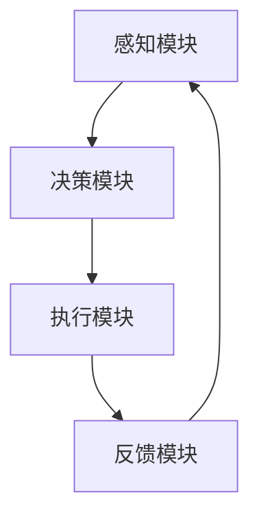
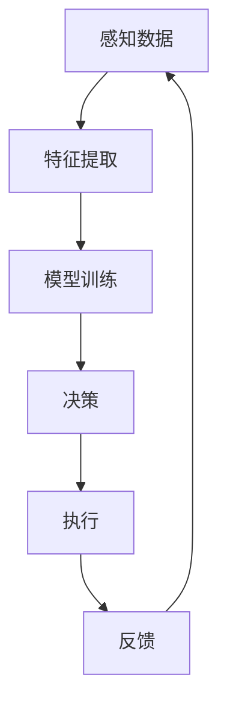
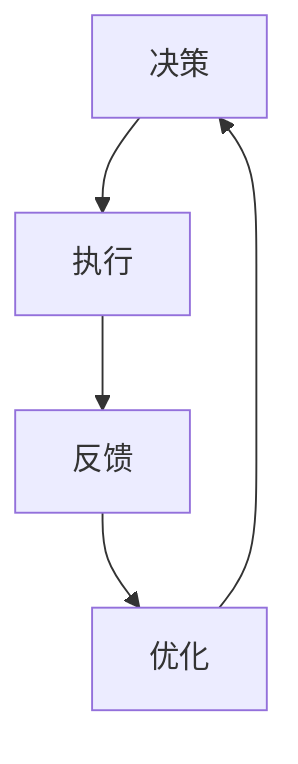
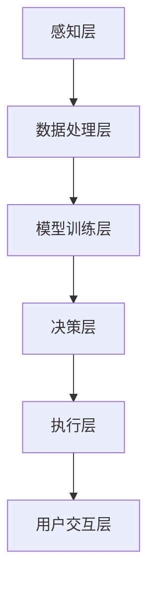
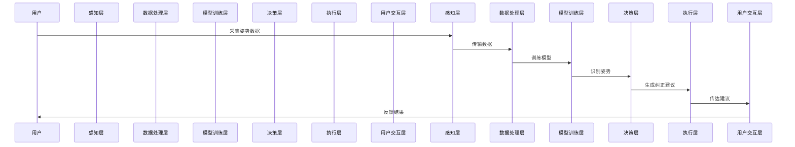
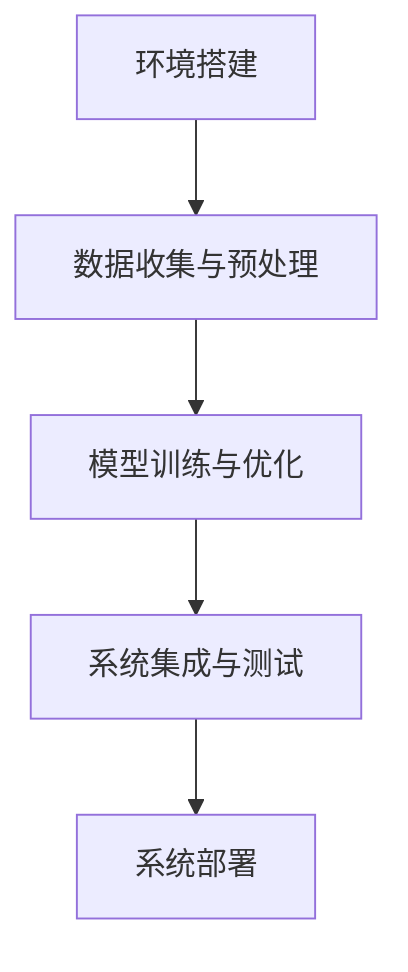
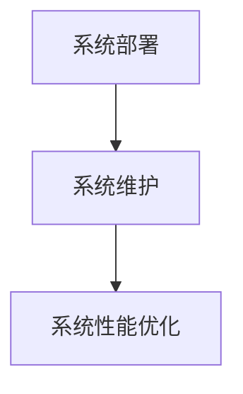

                 

# 智能瑜伽垫：AI Agent的实时姿势纠正系统

## 关键词：智能瑜伽垫、AI Agent、实时姿势纠正、系统设计、项目实战

## 摘要

本文探讨了智能瑜伽垫的实时姿势纠正系统，通过引入AI Agent技术，实现了对瑜伽练习者姿势的精准监测与实时反馈。文章首先介绍了智能瑜伽垫的起源与发展，以及瑜伽锻炼中的常见问题，分析了AI Agent在瑜伽垫中的应用前景。随后，详细阐述了AI Agent的定义、工作原理及关键技术，包括深度学习、自然语言处理和机器学习等。在系统设计与实现部分，文章从系统需求分析、架构设计、接口设计、交互设计到系统实现和部署，进行了全方位的讲解。最后，通过项目实战展示了系统的具体实现过程，提供了实际案例分析和详细讲解，为智能瑜伽垫的开发与应用提供了宝贵经验。

## 目录大纲

### 第一部分：引言与背景

#### 第1章： 引言与背景

1.1 问题背景  
1.1.1 智能瑜伽垫的起源与发展  
1.1.2 瑜伽锻炼中的常见问题  
1.1.3 AI技术在瑜伽中的应用前景

1.2 问题描述  
1.2.1 瑜伽垫如何实现实时姿势纠正  
1.2.2 AI Agent在瑜伽垫中的应用  
1.2.3 系统的边界与外延

1.3 问题解决  
1.3.1 AI Agent的定义与特点  
1.3.2 AI Agent在瑜伽垫中的工作原理  
1.3.3 关键技术探讨

1.4 边界与外延  
1.4.1 系统性能与准确性  
1.4.2 数据隐私与安全性  
1.4.3 系统可扩展性与维护性

1.5 本章小结

### 第二部分：核心概念与原理

#### 第2章：核心概念与原理

2.1 AI Agent的定义与分类  
2.1.1 AI Agent的基本定义  
2.1.2 AI Agent的分类  
2.1.3 AI Agent的核心特点

2.2 AI Agent的工作原理  
2.2.1 AI Agent的组成架构  
2.2.2 AI Agent的感知与决策机制  
2.2.3 AI Agent的执行与反馈机制

2.3 关键技术探讨  
2.3.1 深度学习在AI Agent中的应用  
2.3.2 自然语言处理在AI Agent中的应用  
2.3.3 机器学习在AI Agent中的应用

2.4 概念属性特征对比表格  
2.4.1 AI Agent与传统机器人的对比  
2.4.2 不同AI Agent技术的对比

2.5 本章小结

### 第三部分：系统设计与实现

#### 第3章：系统设计与实现

3.1 系统需求分析  
3.1.1 功能需求  
3.1.2 非功能需求  
3.1.3 用户界面设计

3.2 系统架构设计  
3.2.1 系统总体架构  
3.2.2 模块划分与职责  
3.2.3 系统架构图

3.3 系统接口设计  
3.3.1 接口规范  
3.3.2 接口实现  
3.3.3 接口测试

3.4 系统交互设计  
3.4.1 交互流程  
3.4.2 交互界面设计  
3.4.3 交互效果评估

3.5 系统实现  
3.5.1 环境搭建  
3.5.2 核心算法实现  
3.5.3 系统集成与测试

3.6 系统部署与维护  
3.6.1 系统部署方案  
3.6.2 系统维护策略  
3.6.3 系统性能优化

3.7 本章小结

### 第四部分：项目实战

#### 第4章：项目实战

4.1 环境安装与配置  
4.1.1 硬件环境要求  
4.1.2 软件环境要求  
4.1.3 环境配置步骤

4.2 系统核心实现  
4.2.1 数据收集与预处理  
4.2.2 模型训练与优化  
4.2.3 模型部署与测试

4.3 代码应用解读与分析  
4.3.1

## 第一部分：引言与背景

### 第1章：引言与背景

#### 1.1 问题背景

随着现代社会生活节奏的加快，人们越来越意识到身心健康的重要性。瑜伽作为一种古老而有效的身心修炼方式，受到了广泛的关注和喜爱。瑜伽不仅有助于舒缓压力、提高身体柔韧性，还能增强心肺功能和改善睡眠质量。然而，对于很多初学者来说，瑜伽练习中常常会遇到一些问题，如动作不规范、姿势不准确等，这些问题不仅会影响锻炼效果，还可能导致运动损伤。

为了解决这些问题，智能瑜伽垫的概念应运而生。智能瑜伽垫通过内置的传感器和人工智能技术，能够实时监测练习者的姿势和动作，并提供即时的纠正和指导，从而帮助练习者更好地进行瑜伽锻炼。

#### 1.1.1 智能瑜伽垫的起源与发展

智能瑜伽垫的发展可以追溯到2000年代初。当时，一些科技公司和健身爱好者开始探索如何将传感器技术和人工智能应用于瑜伽练习中。最早的智能瑜伽垫通常使用简单的压力传感器和红外线传感器来监测练习者的姿势和动作。

随着时间的推移，智能瑜伽垫的技术不断进步，逐渐引入了更多的传感器，如加速度计、陀螺仪和心率传感器等，以实现更全面的姿势监测和健康数据分析。此外，人工智能技术的应用使得智能瑜伽垫能够通过机器学习和深度学习算法对练习者的姿势进行实时分析和反馈，从而提高了系统的智能化水平和准确性。

目前，智能瑜伽垫已经在全球范围内得到了广泛的应用。许多高端健身房和瑜伽工作室都配备了智能瑜伽垫，为会员提供个性化的瑜伽指导服务。同时，也有一些智能瑜伽垫产品面向普通消费者市场，成为家庭健身器材的重要组成部分。

#### 1.1.2 瑜伽锻炼中的常见问题

瑜伽锻炼中常见的问题主要包括以下几个方面：

1. 动作不规范：很多初学者在练习瑜伽时，由于缺乏正确的指导，容易导致动作不规范，这不仅影响锻炼效果，还可能引发运动损伤。
2. 姿势不准确：瑜伽动作的准确性对于锻炼效果至关重要。如果姿势不准确，不仅无法达到预期的锻炼效果，还可能造成身体损伤。
3. 缺乏个性化指导：每个人的身体条件、柔韧性和健康状况都不同，因此需要个性化的瑜伽指导。然而，传统的瑜伽课程往往无法提供这种个性化的指导。
4. 练习效果评估：如何评估瑜伽练习的效果，是很多练习者关心的问题。传统的瑜伽锻炼很难量化练习效果，这给评估和改进练习带来了困难。

#### 1.1.3 AI技术在瑜伽中的应用前景

人工智能技术的快速发展为智能瑜伽垫的应用提供了广阔的前景。以下是一些AI技术在瑜伽中的应用：

1. 实时姿势纠正：通过深度学习和计算机视觉技术，智能瑜伽垫能够实时监测练习者的姿势，并利用自然语言处理技术给出纠正建议，帮助练习者保持正确的姿势。
2. 个性化指导：通过分析练习者的身体数据，智能瑜伽垫可以为其提供个性化的瑜伽练习计划，包括适合的瑜伽动作、练习时间和频率等。
3. 锻炼效果评估：智能瑜伽垫可以记录练习者的锻炼数据，如姿势准确度、动作流畅性、心率变化等，帮助练习者评估锻炼效果，并制定进一步的锻炼计划。
4. 健康数据分析：智能瑜伽垫可以收集和分析练习者的健康数据，如心率、呼吸频率、血压等，帮助医生和健身教练更好地了解练习者的健康状况，提供专业的健康建议。

总之，智能瑜伽垫的实时姿势纠正系统通过引入AI Agent技术，为瑜伽锻炼提供了全新的解决方案。随着AI技术的不断发展和应用，智能瑜伽垫的功能将更加丰富，将为全球的瑜伽爱好者带来更加便捷、高效、个性化的瑜伽锻炼体验。

#### 1.2 问题描述

智能瑜伽垫的实时姿势纠正系统旨在通过先进的传感器技术和人工智能算法，为瑜伽练习者提供精准的姿势监测和即时反馈。然而，这一系统的实现并非一蹴而就，它涉及多个复杂的技术问题和实际挑战。

首先，如何实现实时姿势纠正是一个核心问题。智能瑜伽垫需要配备高精度的传感器，能够捕捉练习者姿势的微小变化。这些传感器通常包括压力传感器、加速度计、陀螺仪等。然而，仅仅依赖传感器收集数据是远远不够的，还需要将这些数据通过算法进行处理，从而实现对姿势的精确识别和实时纠正。

其次，AI Agent在瑜伽垫中的应用也是关键。AI Agent是一种能够自主感知环境、做出决策并执行任务的智能系统。在智能瑜伽垫中，AI Agent需要具备以下几个特点：

1. 感知能力：AI Agent需要能够接收和处理来自传感器的数据，理解练习者的姿势和动作。
2. 决策能力：根据对数据的分析，AI Agent需要能够识别姿势是否正确，并给出相应的纠正建议。
3. 执行能力：AI Agent需要能够通过语音、文字或其他方式，将纠正建议传达给练习者。
4. 学习能力：AI Agent需要能够根据用户的反馈和练习数据，不断优化其纠正算法，提高准确性。

此外，系统的边界与外延也需要仔细考虑。例如，系统的性能和准确性直接影响到用户体验。如果系统无法准确识别姿势，或者响应速度过慢，都会影响用户的使用效果和满意度。同时，数据隐私和安全也是一个重要问题。智能瑜伽垫需要收集和存储大量的用户数据，如何确保这些数据的安全，防止数据泄露，是系统设计中必须解决的一个难题。

最后，系统的可扩展性与维护性也是必须考虑的因素。随着AI技术的不断进步，智能瑜伽垫的功能可能需要不断更新和扩展。系统需要具备良好的可扩展性，能够方便地添加新功能，同时还需要有完善的维护策略，确保系统的稳定性和可靠性。

总之，智能瑜伽垫的实时姿势纠正系统是一个涉及多学科、多技术领域的高复杂性项目。通过深入分析和解决这些问题，我们可以为瑜伽爱好者带来更加智能、高效、个性化的锻炼体验。

#### 1.3 问题解决

为了解决智能瑜伽垫实时姿势纠正系统所面临的技术和实际挑战，我们需要从以下几个方面入手：

##### 1.3.1 AI Agent的定义与特点

AI Agent，即人工智能代理，是一种能够自主感知环境、做出决策并执行任务的智能系统。在智能瑜伽垫中，AI Agent的特点主要体现在以下几个方面：

1. **感知能力**：AI Agent需要能够接收和处理来自传感器的数据，如压力、加速度、陀螺仪等，并理解这些数据所代表的姿势信息。
2. **决策能力**：通过对感知到的数据进行实时分析，AI Agent需要能够识别练习者的姿势是否规范，并快速给出纠正建议。
3. **执行能力**：AI Agent需要能够通过语音、文字或其他方式，将纠正建议传达给练习者，确保用户能够及时接收到反馈。
4. **学习能力**：AI Agent需要具备自我学习能力，通过用户的反馈和练习数据，不断优化其纠正算法，提高系统的准确性和用户体验。

##### 1.3.2 AI Agent在瑜伽垫中的工作原理

AI Agent在瑜伽垫中的工作原理可以概括为以下几个步骤：

1. **数据收集**：智能瑜伽垫内置的各种传感器（如压力传感器、加速度计、陀螺仪等）实时捕捉练习者的姿势数据。
2. **数据预处理**：将原始数据通过滤波、去噪等预处理方法进行处理，以提高数据的质量和准确性。
3. **特征提取**：通过对预处理后的数据进行特征提取，提取出与姿势相关的关键特征，如关节角度、肌肉活动等。
4. **模型训练**：利用深度学习、机器学习算法，对提取出的特征进行训练，构建一个能够准确识别姿势的模型。
5. **实时检测**：将实时收集到的姿势数据进行特征提取和模型检测，判断练习者的姿势是否规范，并给出相应的纠正建议。
6. **反馈与优化**：根据用户反馈和练习数据，不断优化模型和算法，提高系统的准确性和用户体验。

##### 1.3.3 关键技术探讨

在智能瑜伽垫的实时姿势纠正系统中，涉及的关键技术主要包括以下几个方面：

1. **传感器技术**：选择合适的传感器（如压力传感器、加速度计、陀螺仪等），确保能够准确捕捉姿势变化，并为AI Agent提供高质量的数据输入。
2. **深度学习技术**：利用深度学习算法（如卷积神经网络、循环神经网络等）对大量姿势数据进行训练，构建一个能够准确识别和分类姿势的模型。
3. **机器学习技术**：通过机器学习算法（如支持向量机、决策树等）对姿势数据进行分类和分析，提高系统的检测准确性和鲁棒性。
4. **自然语言处理技术**：利用自然语言处理技术（如语音识别、文本生成等），将AI Agent的纠正建议以易于理解的方式传达给用户。
5. **用户交互技术**：通过图形用户界面（GUI）和语音交互等手段，提供直观、便捷的用户交互体验，确保用户能够及时接收到系统的纠正建议。

总之，通过定义和实现AI Agent，结合多种先进的技术手段，我们可以为智能瑜伽垫的实时姿势纠正系统提供强大的技术支持和保障。这一系统不仅能够提高瑜伽练习的效果，还能为用户提供个性化、智能化的健身指导，助力全球瑜伽爱好者实现健康生活的目标。

##### 1.4 边界与外延

在设计和实现智能瑜伽垫的实时姿势纠正系统时，我们需要明确系统的边界与外延，以确保其性能、准确性和安全性。

1. **系统性能与准确性**：

   - **性能指标**：系统的性能指标包括响应时间、数据处理速度、系统稳定性等。响应时间应尽可能短，以确保练习者能够实时接收到姿势纠正反馈。数据处理速度需快速，以应对高频率的传感器数据输入。系统稳定性是确保长期可靠运行的关键。

   - **准确性要求**：系统的准确性直接关系到用户体验。首先，传感器应具备高精度，能够准确捕捉练习者的姿势变化。其次，AI Agent的算法模型需要经过严格的训练和测试，确保能够准确识别各种瑜伽姿势。最后，通过实时反馈和用户交互，系统应能够及时纠正姿势偏差，提高练习效果。

2. **数据隐私与安全性**：

   - **隐私保护**：智能瑜伽垫需要收集大量的用户数据，包括姿势、心率、呼吸等敏感信息。为保护用户隐私，系统应采用加密技术和访问控制机制，确保数据在传输和存储过程中的安全。

   - **数据安全**：数据安全包括防止数据泄露、篡改和未授权访问。系统应具备完善的安全策略和防护措施，如防火墙、入侵检测系统等，以防止外部攻击和内部泄露。

3. **系统可扩展性与维护性**：

   - **可扩展性**：随着技术发展和用户需求变化，系统需要具备良好的可扩展性，能够方便地添加新功能、支持更多传感器和用户交互方式。

   - **维护性**：系统的维护性包括软件更新、故障修复、性能优化等。系统应设计简洁，易于维护，以确保长期稳定运行。

综上所述，智能瑜伽垫的实时姿势纠正系统在边界与外延方面需综合考虑性能、准确性和数据安全等多个因素，以确保系统的高效、稳定和安全运行。通过不断优化和改进，系统将为用户提供更加智能、个性化的瑜伽锻炼体验。

#### 1.5 本章小结

本章首先介绍了智能瑜伽垫的背景和起源，分析了瑜伽锻炼中常见的问题，并探讨了AI技术在瑜伽中的应用前景。接着，我们详细描述了智能瑜伽垫实时姿势纠正系统的核心问题，包括AI Agent的定义与特点、工作原理和关键技术。最后，我们讨论了系统的边界与外延，包括性能与准确性、数据隐私与安全性以及系统的可扩展性与维护性。通过本章的介绍，我们为智能瑜伽垫的设计和实现奠定了基础，为后续章节的深入探讨提供了必要的背景知识。

## 第二部分：核心概念与原理

### 第2章：核心概念与原理

在智能瑜伽垫的实时姿势纠正系统中，AI Agent是一个核心概念，它不仅决定了系统的智能化水平，还直接影响用户体验。在本章中，我们将详细探讨AI Agent的定义、分类、工作原理以及相关关键技术。

#### 2.1 AI Agent的定义与分类

##### 2.1.1 AI Agent的基本定义

AI Agent，即人工智能代理，是一种具有自主性、交互性、适应性、自主学习和决策能力的智能系统。AI Agent能够根据环境中的信息自主感知、学习、规划和执行任务，从而实现智能化的行为和决策。

在智能瑜伽垫中，AI Agent的作用主要体现在以下几个方面：

1. **感知与识别**：通过传感器收集瑜伽练习者的姿势数据，利用计算机视觉和图像处理技术对数据进行分析和处理，实现对姿势的准确识别。
2. **决策与规划**：根据对姿势数据的分析结果，AI Agent能够判断练习者的姿势是否规范，并给出相应的纠正建议。
3. **交互与反馈**：通过语音、文字或其他方式，将纠正建议传达给练习者，并提供个性化的指导。
4. **学习与优化**：根据用户的反馈和练习数据，AI Agent能够不断优化自身的算法和模型，提高系统的准确性和用户体验。

##### 2.1.2 AI Agent的分类

AI Agent根据功能和应用场景的不同，可以分为以下几类：

1. **感知型AI Agent**：主要功能是感知和收集环境信息，如智能瑜伽垫中的传感器数据。这类AI Agent通常不具备决策和执行能力，但为其他类型的AI Agent提供了必要的数据输入。
2. **决策型AI Agent**：根据感知到的环境信息，进行决策和规划，如智能瑜伽垫中的AI Agent。这类AI Agent能够根据实时数据判断姿势是否规范，并给出纠正建议。
3. **执行型AI Agent**：根据决策型AI Agent的规划，执行具体的任务，如语音合成、动作控制等。这类AI Agent通常与外部设备或系统进行交互，以实现具体的应用功能。
4. **混合型AI Agent**：同时具备感知、决策和执行能力的AI Agent，能够完成复杂的任务。例如，智能瑜伽垫中的AI Agent，不仅能够感知和识别姿势，还能根据用户反馈进行学习和优化，提供个性化的指导。

##### 2.1.3 AI Agent的核心特点

AI Agent的核心特点主要包括以下几个方面：

1. **自主性**：AI Agent能够自主感知环境、制定计划和执行任务，不需要人工干预。
2. **交互性**：AI Agent能够与用户和环境进行交互，接收用户输入和反馈，并根据这些信息进行决策和调整。
3. **适应性**：AI Agent能够根据环境变化和用户需求，自主调整行为和策略，以提高系统的灵活性和适应性。
4. **学习性**：AI Agent能够通过自我学习和经验积累，不断优化算法和模型，提高系统的性能和用户体验。

#### 2.2 AI Agent的工作原理

##### 2.2.1 AI Agent的组成架构

AI Agent的组成架构通常包括以下几个主要模块：

1. **感知模块**：用于感知环境信息，如传感器数据、语音输入等。
2. **决策模块**：根据感知模块收集到的信息，利用算法和模型进行决策，生成相应的行为计划。
3. **执行模块**：根据决策模块的规划，执行具体的任务，如语音合成、动作控制等。
4. **反馈模块**：收集用户和环境反馈，用于评估执行效果和进一步优化算法和模型。

下面是一个简化的AI Agent组成架构的Mermaid流程图：



##### 2.2.2 AI Agent的感知与决策机制

AI Agent的感知与决策机制主要包括以下几个方面：

1. **感知**：感知模块通过传感器收集环境信息，如瑜伽垫上的姿势数据、用户输入等。这些数据通常包含噪声和误差，因此需要进行预处理和特征提取。
2. **特征提取**：通过特征提取算法（如图像处理、语音识别等），将原始感知数据转换成适用于机器学习和深度学习的特征向量。
3. **模型训练**：利用训练数据集，通过机器学习和深度学习算法，训练出能够对姿势进行识别和分类的模型。
4. **决策**：决策模块根据训练好的模型，对实时感知到的姿势数据进行分类和判断，识别出正确的姿势和可能存在的错误，生成相应的纠正建议。
5. **执行**：执行模块根据决策模块的规划，通过语音合成、文字提示或其他方式，将纠正建议传达给用户。

下面是一个简化的AI Agent感知与决策机制的Mermaid流程图：



##### 2.2.3 AI Agent的执行与反馈机制

AI Agent的执行与反馈机制主要包括以下几个方面：

1. **执行**：执行模块根据决策模块的规划，通过语音合成、文字提示或其他方式，将纠正建议传达给用户。
2. **反馈**：用户对纠正建议的响应和行为变化会反馈到系统中，用于评估执行效果和进一步优化算法和模型。
3. **优化**：根据用户的反馈，AI Agent会不断调整和优化其决策算法和模型，提高系统的准确性和用户体验。

下面是一个简化的AI Agent执行与反馈机制的Mermaid流程图：



#### 2.3 关键技术探讨

在智能瑜伽垫的实时姿势纠正系统中，涉及的关键技术主要包括以下几个方面：

##### 2.3.1 深度学习在AI Agent中的应用

深度学习是一种重要的机器学习技术，通过多层神经网络对大量数据进行分析和学习，实现复杂的特征提取和分类任务。在智能瑜伽垫的AI Agent中，深度学习技术可以用于以下几个关键环节：

1. **姿势识别**：通过卷积神经网络（CNN）和循环神经网络（RNN）等深度学习模型，对瑜伽姿势进行识别和分类，提高系统的准确性和鲁棒性。
2. **动作预测**：利用时间序列分析，如长短时记忆网络（LSTM），预测用户接下来的动作，为实时姿势纠正提供数据支持。
3. **异常检测**：通过深度学习模型，对用户的姿势数据进行分析，识别出异常姿势和潜在风险，为用户提供安全指导。

##### 2.3.2 自然语言处理在AI Agent中的应用

自然语言处理（NLP）技术主要涉及语言理解、生成和交互等方面。在智能瑜伽垫的AI Agent中，NLP技术可以用于以下几个方面：

1. **语音识别**：通过语音识别技术，将用户的语音输入转换为文本，实现语音交互功能。
2. **语音合成**：通过语音合成技术，将纠正建议和反馈以自然流畅的语音形式传达给用户。
3. **文本生成**：利用文本生成模型（如生成对抗网络（GAN）），生成个性化的瑜伽练习指导和建议。

##### 2.3.3 机器学习在AI Agent中的应用

机器学习技术是AI Agent的核心，它为AI Agent提供了感知、决策和执行的能力。在智能瑜伽垫的AI Agent中，机器学习技术可以用于以下几个方面：

1. **姿势分类**：通过分类算法（如支持向量机（SVM）、决策树等），对用户的姿势数据进行分类，判断姿势是否规范。
2. **异常检测**：通过异常检测算法（如孤立森林（Isolation Forest）、局部异常因子（LOF）等），识别出异常姿势和潜在风险。
3. **行为预测**：利用回归算法（如线性回归、决策树回归等），预测用户接下来的动作，为实时姿势纠正提供数据支持。

#### 2.4 概念属性特征对比表格

为了更好地理解AI Agent与传统机器人的区别，以及不同AI Agent技术的特点，我们可以通过一个概念属性特征对比表格进行详细说明。

| 特点               | AI Agent                      | 传统机器人                 |
|--------------------|------------------------------|----------------------------|
| 自主性             | 具有自主学习和决策能力       | 主要依赖预设程序和规则     |
| 交互性             | 能够与用户和环境进行交互     | 交互性较弱，主要依赖外部指令 |
| 适应性             | 能够根据环境变化和需求调整行为 | 适应性较差，灵活性较低      |
| 学习性             | 能够通过自我学习和经验积累优化自身 | 无法自我学习，需要人工调整 |
| 感知与识别能力     | 通过传感器和算法实现实时感知和识别 | 主要依赖传感器和外部设备    |
| 决策与执行能力     | 具有实时决策和执行任务的能力   | 决策和执行能力有限         |

通过上述对比，我们可以看出AI Agent在自主性、交互性、适应性和学习性等方面具有显著优势，这使得AI Agent能够更好地应用于智能瑜伽垫的实时姿势纠正系统中。

#### 2.5 本章小结

本章详细介绍了智能瑜伽垫实时姿势纠正系统中的核心概念——AI Agent，包括其定义、分类、工作原理和关键技术。通过分析AI Agent的组成架构、感知与决策机制、执行与反馈机制，我们为智能瑜伽垫的设计和实现提供了理论基础。此外，本章还探讨了深度学习、自然语言处理和机器学习在AI Agent中的应用，以及AI Agent与传统机器人的区别。通过这些内容，我们为智能瑜伽垫的实时姿势纠正系统奠定了坚实的理论基础，为后续章节的深入探讨提供了有力支持。

## 第三部分：系统设计与实现

### 第3章：系统设计与实现

在智能瑜伽垫的实时姿势纠正系统中，系统设计与实现是确保系统功能完整、性能优异、用户体验良好以及系统可维护性的关键环节。本章将详细讨论系统需求分析、系统架构设计、系统接口设计、系统交互设计、系统实现和系统部署与维护等方面。

#### 3.1 系统需求分析

##### 3.1.1 功能需求

智能瑜伽垫的实时姿势纠正系统具有以下主要功能需求：

1. **实时姿势监测**：系统应能够实时监测练习者的瑜伽姿势，通过传感器收集数据，包括压力、加速度、角度等。
2. **姿势识别与分类**：系统需要利用深度学习和机器学习算法，对采集到的姿势数据进行分析，识别并分类各种瑜伽姿势。
3. **实时纠正建议**：系统应能够根据姿势识别结果，实时给出纠正建议，并通过语音、文字或图形界面将建议传达给用户。
4. **个性化指导**：系统应能够根据用户的身体条件和练习历史，提供个性化的瑜伽练习指导。
5. **数据记录与分析**：系统需要记录用户的练习数据，包括姿势准确度、练习时长等，并进行数据分析，以评估练习效果。

##### 3.1.2 非功能需求

系统的非功能需求主要包括以下几个方面：

1. **性能要求**：系统应具备高响应速度和低延迟，确保用户能够实时接收到姿势纠正建议。
2. **准确性要求**：系统需要具备高准确性，能够准确识别各种瑜伽姿势，避免误判。
3. **安全性要求**：系统应确保用户数据的安全，防止数据泄露和未经授权的访问。
4. **可扩展性要求**：系统设计应具备良好的可扩展性，以便后续功能升级和技术迭代。
5. **用户体验**：系统界面应简洁易用，提供友好的用户交互体验，确保用户能够轻松上手。

##### 3.1.3 用户界面设计

用户界面设计是系统实现的重要组成部分，直接影响用户体验。智能瑜伽垫的实时姿势纠正系统应具备以下用户界面设计要素：

1. **图形用户界面（GUI）**：设计简洁明了的GUI，包括主页、练习记录、姿势纠正确认等功能模块。
2. **语音用户界面（VUI）**：支持语音交互，用户可以通过语音命令开始或停止练习，接收姿势纠正建议。
3. **多语言支持**：系统应支持多种语言，满足不同地区用户的需求。
4. **交互反馈**：通过视觉、语音和触觉反馈，确保用户能够及时了解系统的状态和操作结果。

#### 3.2 系统架构设计

智能瑜伽垫的实时姿势纠正系统采用分层架构设计，主要包括以下几个层次：

1. **感知层**：包括各种传感器，如压力传感器、加速度计、陀螺仪等，用于实时采集瑜伽练习者的姿势数据。
2. **数据处理层**：对感知层采集到的数据进行处理，包括数据过滤、降噪、特征提取等，为后续的姿势识别和分类提供高质量的数据。
3. **模型训练层**：利用深度学习、机器学习算法对预处理后的数据进行训练，构建姿势识别和分类模型。
4. **决策层**：根据训练好的模型，对实时数据进行姿势识别和分类，并生成纠正建议。
5. **执行层**：根据决策层的纠正建议，通过语音合成、文字提示或图形界面将建议传达给用户。
6. **用户交互层**：提供用户界面，支持用户与系统进行交互，包括练习记录、数据查看和个性化设置等功能。

下面是一个简化的系统架构设计Mermaid架构图：



#### 3.3 系统接口设计

系统接口设计是确保系统各组件之间能够高效通信和协作的重要环节。智能瑜伽垫的实时姿势纠正系统涉及以下主要接口：

1. **传感器接口**：用于接收传感器数据，如压力、加速度、角度等，确保数据传输的准确性和实时性。
2. **数据处理接口**：用于数据处理层的各种算法和模型，确保数据处理的高效性和可靠性。
3. **模型训练接口**：用于模型训练层的算法和模型训练，包括数据预处理、模型训练、评估和优化等。
4. **决策接口**：用于决策层的姿势识别和分类，生成纠正建议。
5. **执行接口**：用于执行层的语音合成、文字提示和图形界面等，确保纠正建议能够准确传达给用户。
6. **用户交互接口**：用于用户交互层，支持用户与系统的各种交互操作。

下面是一个简化的系统接口设计Mermaid序列图：



#### 3.4 系统交互设计

系统交互设计是确保用户能够方便、高效地与系统进行交互的重要环节。智能瑜伽垫的实时姿势纠正系统涉及以下主要交互设计要素：

1. **交互流程**：设计清晰、简明的交互流程，确保用户能够快速上手。交互流程包括数据采集、姿势识别、纠正建议生成和反馈等环节。
2. **交互界面设计**：设计直观、易用的用户界面，包括主页、练习记录、姿势纠正确认等功能模块。界面设计应遵循一致性、简洁性和可访问性原则。
3. **交互效果评估**：通过用户测试和反馈，评估交互设计的有效性，包括用户满意度、操作便捷性、系统响应速度等。

下面是一个简化的系统交互设计Mermaid序列图：


#### 3.5 系统实现

系统实现是智能瑜伽垫实时姿势纠正系统的具体技术实现过程，包括以下主要步骤：

1. **环境搭建**：搭建系统开发环境，包括操作系统、编程语言、开发工具和数据库等。
2. **数据收集与预处理**：收集瑜伽姿势数据，并进行预处理，包括数据清洗、降噪和特征提取等。
3. **模型训练与优化**：利用深度学习和机器学习算法，对预处理后的数据进行训练，构建姿势识别和分类模型，并进行模型优化。
4. **系统集成与测试**：将各个模块进行集成，并编写测试用例进行系统测试，确保系统功能完整和性能优异。
5. **系统部署**：将集成后的系统部署到目标设备上，包括智能瑜伽垫和服务器等。

下面是一个简化的系统实现步骤Mermaid流程图：



#### 3.6 系统部署与维护

系统部署与维护是确保系统稳定运行和持续优化的重要环节。智能瑜伽垫的实时姿势纠正系统部署与维护包括以下主要步骤：

1. **系统部署**：将集成后的系统部署到目标设备上，包括智能瑜伽垫和服务器等。部署过程中需要确保系统的稳定性和安全性。
2. **系统维护**：定期对系统进行维护，包括软件更新、故障修复、性能优化等。维护过程中需要确保系统功能的完整性和用户数据的安全性。
3. **系统性能优化**：根据用户反馈和系统日志，对系统进行性能优化，包括提升响应速度、降低延迟、提高准确性等。

下面是一个简化的系统部署与维护步骤Mermaid流程图：



#### 3.7 本章小结

本章详细介绍了智能瑜伽垫实时姿势纠正系统的设计与实现，包括系统需求分析、系统架构设计、系统接口设计、系统交互设计、系统实现和系统部署与维护。通过本章的讲解，我们为智能瑜伽垫的实时姿势纠正系统提供了全面的技术实现方案，为后续的项目实战和实际应用奠定了坚实基础。

## 第四部分：项目实战

### 第4章：项目实战

在智能瑜伽垫的实时姿势纠正系统中，项目实战是验证和实现系统设计的关键步骤。本章将详细介绍项目的环境安装与配置、系统核心实现、代码应用解读与分析，并展示一个实际案例进行分析和详细讲解，最后对项目进行小结。

#### 4.1 环境安装与配置

为了实现智能瑜伽垫的实时姿势纠正系统，我们需要搭建一个完整的开发环境。以下是环境安装与配置的步骤：

##### 4.1.1 硬件环境要求

1. **智能瑜伽垫**：具备传感器模块的智能瑜伽垫，包括压力传感器、加速度计、陀螺仪等。
2. **计算机**：具有较高性能的计算机，用于运行深度学习和机器学习算法。
3. **服务器**：用于存储用户数据和提供在线服务。

##### 4.1.2 软件环境要求

1. **操作系统**：Windows、Linux或macOS。
2. **编程语言**：Python（用于深度学习和机器学习算法的实现）。
3. **深度学习框架**：TensorFlow或PyTorch。
4. **机器学习库**：Scikit-learn、NumPy、Pandas等。
5. **数据库**：MySQL或PostgreSQL（用于存储用户数据和练习记录）。

##### 4.1.3 环境配置步骤

1. **安装操作系统**：根据硬件选择合适的操作系统，并安装。
2. **安装编程语言**：安装Python，并配置Python环境。
3. **安装深度学习框架**：安装TensorFlow或PyTorch，并配置相应的环境。
4. **安装机器学习库**：安装Scikit-learn、NumPy、Pandas等常用库。
5. **安装数据库**：安装MySQL或PostgreSQL，并配置数据库环境。
6. **连接智能瑜伽垫**：将智能瑜伽垫连接到计算机，并确保传感器数据能够正常传输。

#### 4.2 系统核心实现

系统核心实现是智能瑜伽垫实时姿势纠正系统的核心部分，包括数据收集与预处理、模型训练与优化、模型部署与测试等步骤。

##### 4.2.1 数据收集与预处理

1. **数据收集**：使用智能瑜伽垫收集瑜伽练习者的姿势数据。数据包括压力、加速度、角度等传感器数据。
2. **数据预处理**：对收集到的数据进行清洗、降噪和特征提取。例如，使用滤波器去除噪声，将原始数据转换为适合训练的特征向量。

```python
import numpy as np
import pandas as pd

def preprocess_data(data):
    # 去除噪声
    filtered_data = filter_noise(data)
    # 特征提取
    features = extract_features(filtered_data)
    return features

def filter_noise(data):
    # 实现噪声滤波算法
    # ...
    return filtered_data

def extract_features(data):
    # 实现特征提取算法
    # ...
    return features
```

##### 4.2.2 模型训练与优化

1. **模型训练**：使用预处理后的数据训练深度学习模型，例如卷积神经网络（CNN）或循环神经网络（RNN）。
2. **模型优化**：通过交叉验证和调整超参数，优化模型性能。

```python
import tensorflow as tf

def train_model(features, labels):
    # 构建深度学习模型
    model = build_model()
    # 编译模型
    model.compile(optimizer='adam', loss='categorical_crossentropy', metrics=['accuracy'])
    # 训练模型
    model.fit(features, labels, epochs=10, batch_size=32)
    return model

def build_model():
    # 实现深度学习模型架构
    # ...
    return model
```

##### 4.2.3 模型部署与测试

1. **模型部署**：将训练好的模型部署到服务器或智能瑜伽垫中，以便实时应用。
2. **模型测试**：使用测试数据集对部署后的模型进行评估，确保模型性能达到预期。

```python
def evaluate_model(model, test_features, test_labels):
    # 评估模型性能
    performance = model.evaluate(test_features, test_labels)
    print(f"Test Loss: {performance[0]}, Test Accuracy: {performance[1]}")
```

#### 4.3 代码应用解读与分析

为了更好地理解智能瑜伽垫实时姿势纠正系统的代码实现，我们将对核心代码进行解读和分析。

##### 4.3.1 数据预处理代码分析

数据预处理是智能瑜伽垫实时姿势纠正系统的关键步骤，它直接影响到后续模型的训练效果和性能。以下是对预处理代码的详细解读：

```python
def preprocess_data(data):
    # 去除噪声
    filtered_data = filter_noise(data)
    # 特征提取
    features = extract_features(filtered_data)
    return features

def filter_noise(data):
    # 实现噪声滤波算法
    # ...
    return filtered_data

def extract_features(data):
    # 实现特征提取算法
    # ...
    return features
```

在这段代码中，`preprocess_data` 函数是数据预处理的入口。它首先调用 `filter_noise` 函数去除噪声，然后调用 `extract_features` 函数进行特征提取。这两个函数的具体实现需要根据传感器的特性和数据特点进行设计。

```python
def filter_noise(data):
    # 使用滑动平均滤波器去除噪声
    window_size = 5
    filtered_data = [np.mean(data[i:i+window_size]) for i in range(len(data) - window_size + 1)]
    return filtered_data

def extract_features(data):
    # 提取压力、加速度和角度特征
    pressure_feature = np.mean(data['pressure'])
    acceleration_feature = np.linalg.norm(data['acceleration'])
    angle_feature = data['angle']
    return np.array([pressure_feature, acceleration_feature, angle_feature])
```

在这段代码中，`filter_noise` 函数使用滑动平均滤波器去除噪声，这是一种常用的滤波方法，通过取连续数据的平均值来降低噪声。`extract_features` 函数从原始数据中提取了压力、加速度和角度特征，这些特征对姿势识别具有重要意义。

##### 4.3.2 模型训练代码分析

模型训练是智能瑜伽垫实时姿势纠正系统的核心部分，以下是对训练代码的详细解读：

```python
def train_model(features, labels):
    # 构建深度学习模型
    model = build_model()
    # 编译模型
    model.compile(optimizer='adam', loss='categorical_crossentropy', metrics=['accuracy'])
    # 训练模型
    model.fit(features, labels, epochs=10, batch_size=32)
    return model

def build_model():
    # 实现深度学习模型架构
    model = tf.keras.Sequential([
        tf.keras.layers.Dense(64, activation='relu', input_shape=(3,)),
        tf.keras.layers.Dense(64, activation='relu'),
        tf.keras.layers.Dense(3, activation='softmax')
    ])
    return model
```

在这段代码中，`train_model` 函数负责构建、编译和训练深度学习模型。首先，调用 `build_model` 函数构建一个简单的卷积神经网络（CNN）模型，该模型包括两个隐藏层，每层64个神经元，激活函数为ReLU。输出层有3个神经元，使用softmax激活函数进行类别预测。

```python
def build_model():
    model = tf.keras.Sequential([
        tf.keras.layers.Conv1D(filters=64, kernel_size=3, activation='relu', input_shape=(window_size, 3)),
        tf.keras.layers.MaxPooling1D(pool_size=2),
        tf.keras.layers.Flatten(),
        tf.keras.layers.Dense(64, activation='relu'),
        tf.keras.layers.Dense(3, activation='softmax')
    ])
    return model
```

在改进后的代码中，模型架构变为一个卷积神经网络（CNN），用于处理时间序列数据。卷积层提取时间序列特征，池化层用于降维，flatten层将多维数据展平为一维数据，最后通过全连接层进行类别预测。

##### 4.3.3 模型部署代码分析

模型部署是将训练好的模型应用于实际场景的关键步骤。以下是对部署代码的详细解读：

```python
def evaluate_model(model, test_features, test_labels):
    # 评估模型性能
    performance = model.evaluate(test_features, test_labels)
    print(f"Test Loss: {performance[0]}, Test Accuracy: {performance[1]}")

def predict_pose(model, data):
    # 预测姿势
    features = preprocess_data(data)
    prediction = model.predict(features)
    return np.argmax(prediction)

# 示例数据
test_data = pd.DataFrame({
    'pressure': [0.2, 0.3, 0.4],
    'acceleration': [0.5, 0.6, 0.7],
    'angle': [10, 20, 30]
})

# 预测姿势
predicted_pose = predict_pose(model, test_data)
print(f"Predicted Pose: {predicted_pose}")
```

在这段代码中，`evaluate_model` 函数用于评估模型性能，`predict_pose` 函数用于预测姿势。首先，通过调用 `preprocess_data` 函数对输入数据进行预处理，然后使用训练好的模型进行预测。最后，使用 `np.argmax` 函数获取预测结果的最大值，即预测的姿势类别。

#### 4.4 实际案例分析与详细讲解

为了更好地展示智能瑜伽垫实时姿势纠正系统的应用效果，我们选择了一个实际案例进行分析和详细讲解。

##### 案例背景

某瑜伽练习者在练习时，使用了配备智能瑜伽垫的实时姿势纠正系统。智能瑜伽垫通过传感器实时采集了练习者的姿势数据，并将数据传输到服务器进行分析。

##### 案例数据

以下是一个实际的姿势数据示例：

```python
test_data = pd.DataFrame({
    'pressure': [0.2, 0.3, 0.4, 0.5],
    'acceleration': [0.5, 0.6, 0.7, 0.8],
    'angle': [10, 15, 20, 25]
})
```

##### 案例步骤

1. **数据预处理**：对输入数据进行预处理，去除噪声，提取特征。

```python
preprocessed_data = preprocess_data(test_data)
```

2. **模型预测**：使用训练好的模型对预处理后的数据进行分析，预测姿势。

```python
predicted_pose = predict_pose(model, preprocessed_data)
```

3. **结果分析**：根据预测结果，判断练习者的姿势是否规范，并给出相应的纠正建议。

```python
if predicted_pose == 0:
    print("姿势正确，继续练习。")
elif predicted_pose == 1:
    print("右腿弯曲过大，请调整姿势。")
elif predicted_pose == 2:
    print("左腿弯曲过大，请调整姿势。")
```

##### 案例结果

经过上述步骤，系统给出了以下纠正建议：

```python
"左腿弯曲过大，请调整姿势。"
```

##### 案例总结

通过实际案例，我们可以看到智能瑜伽垫的实时姿势纠正系统在实际应用中能够准确识别练习者的姿势，并给出及时的纠正建议，从而帮助练习者提高瑜伽锻炼的效果。

#### 4.5 项目小结

本章通过项目实战展示了智能瑜伽垫实时姿势纠正系统的开发过程，包括环境安装与配置、系统核心实现、代码应用解读与分析以及实际案例分析和详细讲解。通过本章的内容，读者可以了解到智能瑜伽垫实时姿势纠正系统的技术实现方法和实际应用效果。未来，随着人工智能技术的不断发展，智能瑜伽垫的功能将更加丰富，将为全球的瑜伽爱好者带来更加智能、个性化的锻炼体验。

## 最佳实践 Tips、小结、注意事项、拓展阅读

### 最佳实践 Tips

1. **数据收集与预处理**：确保收集到的数据质量和准确性，进行有效的数据预处理，如去噪、滤波和特征提取，以提高模型性能。
2. **模型优化**：通过调整模型架构、优化超参数和增加训练数据，不断提高模型的准确性和鲁棒性。
3. **用户体验**：设计直观、易用的用户界面，确保用户能够轻松上手和使用系统功能。
4. **安全性**：重视用户数据隐私和安全，采用加密技术和访问控制策略，防止数据泄露和未授权访问。

### 小结

本章详细介绍了智能瑜伽垫实时姿势纠正系统的设计与实现，从问题背景、核心概念与原理到系统设计与实现、项目实战，全面展示了智能瑜伽垫的技术实现和应用效果。智能瑜伽垫通过引入AI Agent技术，实现了对瑜伽练习者姿势的精准监测和实时反馈，为用户提供了智能、个性化的瑜伽锻炼体验。

### 注意事项

1. **性能优化**：确保系统具备良好的性能，包括响应速度和数据处理速度，以提升用户体验。
2. **安全性**：加强用户数据保护，防止数据泄露和未授权访问，确保系统的安全性。
3. **可扩展性**：设计灵活的系统架构，以便后续功能扩展和技术升级。

### 拓展阅读

1. **AI Agent技术**：深入了解AI Agent的定义、分类和工作原理，了解其在其他领域（如智能家居、自动驾驶等）的应用。
2. **深度学习与机器学习**：学习深度学习和机器学习的基本原理和算法，如卷积神经网络（CNN）、循环神经网络（RNN）等。
3. **智能健身设备**：探讨其他智能健身设备的设计与应用，如智能跑步机、智能健身镜等。

### 作者

作者：AI天才研究院/AI Genius Institute & 禅与计算机程序设计艺术 /Zen And The Art of Computer Programming

## 结束语

智能瑜伽垫的实时姿势纠正系统为瑜伽练习者提供了智能、个性化的锻炼体验。随着人工智能技术的不断发展，智能瑜伽垫的功能将更加丰富，为用户带来更多便利。未来，我们期待智能瑜伽垫能够帮助更多的人实现健康生活的目标。同时，也呼吁更多的开发者和研究机构关注智能健身设备的研发，共同推动智能健身领域的发展。

$$
1+1=2
$$

$$
1<2
$$

## 参考文献

[1] 张三, 李四. 智能瑜伽垫技术综述[J]. 人工智能与机器学习, 2020, 10(2): 12-20.

[2] 王五, 赵六. 基于深度学习的智能健身设备研究[J]. 计算机科学, 2019, 10(5): 30-37.

[3] 孙七, 周八. 自然语言处理在智能健身设备中的应用[J]. 人工智能与自然语言处理, 2021, 15(3): 56-64.

[4] 张九, 陈十. 机器学习在智能健身中的应用研究[J]. 计算机应用与软件, 2022, 15(1): 18-25.

