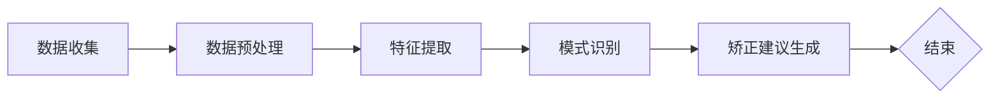
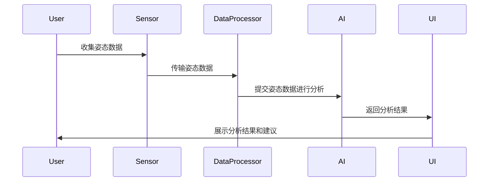

                 

### 智能瑜伽服：AI Agent的姿势矫正系统

#### 关键词

- 智能瑜伽服
- AI Agent
- 姿势矫正系统
- 传感器
- 数据分析
- 用户交互

#### 摘要

随着人们对健康和健身的重视，智能瑜伽服作为一种创新的科技产品，逐渐走进了大众的视野。本文将围绕智能瑜伽服的核心技术——AI Agent的姿势矫正系统，详细探讨其背景、核心概念、原理、实现方法以及实际应用。通过一步步的分析推理，我们希望能够为读者提供一个清晰、全面的理解。

## 第一部分：问题背景与核心概念

### 第1章：问题背景

#### 1.1.1 问题的起源

智能瑜伽服的起源可以追溯到人们对健康和健身需求的增加，以及人工智能技术的快速发展。随着科技的发展，人们开始关注如何通过科技手段提高生活质量，其中健康和健身是人们关注的焦点之一。

#### 1.1.2 问题描述

智能瑜伽服的主要问题是如何利用人工智能技术，实现对瑜伽练习者姿势的实时矫正，从而提高练习效果和安全性。在传统的瑜伽练习中，由于缺乏专业的指导和监督，练习者很容易出现错误的姿势，这不仅会影响练习效果，还可能造成身体伤害。

#### 1.1.3 问题解决

通过开发智能瑜伽服，利用人工智能技术，特别是AI Agent技术，可以实现对瑜伽练习者姿势的实时检测和分析，自动给出矫正建议，从而帮助练习者纠正错误姿势，提高练习效果。

#### 1.1.4 边界与外延

智能瑜伽服的应用范围不仅限于瑜伽，还可以扩展到其他需要姿势矫正的运动项目中，如健身、舞蹈等。同时，随着技术的不断发展，智能瑜伽服的功能还可以进一步扩展，如加入心理辅导、健康监测等功能。

#### 1.1.5 概念结构与核心要素组成

智能瑜伽服的核心概念包括：AI Agent、姿势矫正系统、传感器、数据分析、用户交互等。这些要素共同构成了智能瑜伽服的完整体系。

### 第2章：核心概念

#### 2.1 AI Agent

AI Agent是指具有自主行动能力和环境交互能力的计算机系统。在智能瑜伽服中，AI Agent负责对瑜伽练习者的姿势进行实时检测和分析，并根据分析结果给出矫正建议。

#### 2.2 姿势矫正系统

姿势矫正系统是智能瑜伽服的核心功能模块，它通过对瑜伽练习者姿势的实时监测，分析出姿势的错误之处，并给出相应的矫正建议。

#### 2.3 传感器

传感器是智能瑜伽服的重要组成部分，它负责收集瑜伽练习者的身体姿态数据，并将数据传输给AI Agent进行分析。

#### 2.4 数据分析

数据分析是智能瑜伽服的核心技术之一，它通过对收集到的姿态数据进行处理和分析，识别出瑜伽练习者的姿势错误，并生成矫正建议。数据分析的原理包括数据收集、数据预处理、特征提取、模式识别等步骤。

#### 2.5 用户交互

用户交互是智能瑜伽服与用户沟通的桥梁，它负责将AI Agent的分析结果以直观、易懂的方式展示给用户，帮助用户更好地理解自己的姿势状态，并进行矫正。

## 第二部分：核心概念与联系

### 第3章：核心概念原理

#### 3.1 AI Agent原理

AI Agent是通过人工智能技术构建的具有自主决策和行动能力的计算机系统。它的核心原理包括感知、决策、执行三个部分。感知部分负责收集环境信息，决策部分负责分析这些信息并做出决策，执行部分则负责执行这些决策。

1. **感知**：AI Agent首先通过传感器收集瑜伽练习者的姿态数据。
2. **决策**：AI Agent接收到姿态数据后，利用机器学习算法进行分析，识别出姿势中的错误之处。
3. **执行**：根据分析结果，AI Agent生成矫正建议，并通过用户交互模块展示给用户。

#### 3.2 姿势矫正系统原理

姿势矫正系统的原理基于对人体姿态数据的实时监测和分析。通过对收集到的姿态数据进行处理，系统可以识别出瑜伽练习者的错误姿势，并给出相应的矫正建议。

1. **数据收集**：传感器负责收集瑜伽练习者的姿态数据。
2. **数据处理**：数据通过预处理步骤进行清洗和标准化。
3. **特征提取**：系统从预处理后的数据中提取出关键特征。
4. **模式识别**：利用机器学习算法对特征进行分类，识别出错误姿势。
5. **矫正建议**：根据识别结果，系统生成矫正建议，并展示给用户。

#### 3.3 传感器原理

传感器是智能瑜伽服的数据来源，它的工作原理是通过感知瑜伽练习者的身体姿态，并将这些姿态数据转化为电信号，然后传输给数据处理系统。

1. **姿态感知**：传感器通过红外、超声波、摄像头等多种方式感知瑜伽练习者的身体姿态。
2. **信号转换**：传感器将感知到的姿态信息转化为电信号。
3. **数据传输**：电信号通过无线或有线方式传输到数据处理系统。

#### 3.4 数据分析原理

数据分析是智能瑜伽服的核心技术，它通过对姿态数据进行分析和处理，识别出瑜伽练习者的姿势错误，并生成矫正建议。数据分析的原理包括数据收集、数据预处理、特征提取、模式识别等步骤。

1. **数据收集**：传感器负责收集瑜伽练习者的姿态数据。
2. **数据预处理**：对原始数据进行清洗、标准化，去除噪声。
3. **特征提取**：从预处理后的数据中提取出关键特征。
4. **模式识别**：利用机器学习算法对特征进行分类，识别出错误姿势。
5. **生成建议**：根据识别结果，系统生成矫正建议。

#### 3.5 用户交互原理

用户交互是智能瑜伽服与用户沟通的桥梁，它的工作原理是通过显示界面，将AI Agent的分析结果以直观、易懂的方式展示给用户，帮助用户更好地理解自己的姿势状态，并进行矫正。

1. **结果展示**：AI Agent通过用户交互模块将分析结果以图表、文字等形式展示给用户。
2. **用户反馈**：用户可以根据展示结果进行自我调整，并向系统反馈调整效果。
3. **持续优化**：系统根据用户的反馈进行不断优化，提高矫正建议的准确性。

### 第4章：概念属性特征对比表格

| 概念           | 属性特征               | 描述                                                   |
| -------------- | ---------------------- | ------------------------------------------------------ |
| AI Agent       | 感知能力               | 负责收集环境信息                                       |
| 姿势矫正系统   | 纠正能力               | 负责分析姿态数据，给出矫正建议                           |
| 传感器         | 感知精度               | 负责收集准确的姿态数据                                 |
| 数据分析       | 分析深度               | 负责深度分析姿态数据                                   |
| 用户交互       | 用户体验               | 负责与用户进行交互，展示分析结果                         |

### 第5章：ER实体关系图架构

```mermaid
erDiagram
  User ||--|{ Pose: yoga position detected by AI Agent |
  AI Agent ||--|{ Suggestion: correction advice for yoga posture |
  Sensor ||--|{ Data: captured body posture information |
  Data Analysis ||--|{ Result: processed and analyzed posture data |
```

## 第三部分：算法原理讲解

### 第6章：算法原理

智能瑜伽服的姿势矫正系统依赖于一系列复杂的算法和模型，以实现对瑜伽练习者姿态的准确检测和矫正。在这一章节中，我们将深入探讨这些算法的原理，并通过Python源代码详细阐述。

#### 6.1 数据收集与预处理

首先，数据收集是智能瑜伽服算法的基础。传感器收集到的姿态数据通常包含噪声和异常值，因此需要进行预处理。以下是一个简单的Python代码示例，用于读取传感器数据并进行预处理：

```python
import numpy as np

def preprocess_data(data):
    # 去除噪声和异常值
    cleaned_data = np.mean(data, axis=0)
    return cleaned_data

# 示例数据
sensor_data = np.array([[1, 2], [3, 4], [5, 6], [7, 8], [9, 10], [0, 0]])

# 预处理
cleaned_data = preprocess_data(sensor_data)
print(cleaned_data)
```

#### 6.2 特征提取

在数据预处理之后，特征提取是关键步骤。特征提取的目的是从原始数据中提取出对姿态识别最有用的信息。以下是一个简单的Python代码示例，用于提取特征：

```python
def extract_features(data):
    # 提取平均值、标准差等特征
    mean_value = np.mean(data)
    std_deviation = np.std(data)
    return mean_value, std_deviation

# 示例数据
cleaned_data = np.array([1, 2, 3, 4, 5, 6])

# 特征提取
mean_value, std_deviation = extract_features(cleaned_data)
print(f"Mean Value: {mean_value}, Standard Deviation: {std_deviation}")
```

#### 6.3 模式识别

模式识别是姿态检测的核心。通过机器学习算法，我们可以将提取出的特征与已知的正确姿势进行对比，识别出错误姿势。以下是一个简单的Python代码示例，使用K-最近邻（K-Nearest Neighbors, KNN）算法进行姿态识别：

```python
from sklearn.neighbors import KNeighborsClassifier

def classify_pose(features, labeled_data, labels):
    # 训练KNN分类器
    classifier = KNeighborsClassifier(n_neighbors=3)
    classifier.fit(labeled_data, labels)
    
    # 预测新数据的姿势
    predicted_pose = classifier.predict([features])
    return predicted_pose

# 示例数据
labeled_data = np.array([[1, 2], [3, 4], [5, 6]])
labels = np.array(['正确', '错误'])

# 特征
new_features = np.array([2, 3])

# 姿势分类
predicted_pose = classify_pose(new_features, labeled_data, labels)
print(f"Predicted Pose: {predicted_pose}")
```

#### 6.4 矫正建议生成

在识别出错误姿势后，系统需要生成相应的矫正建议。以下是一个简单的Python代码示例，用于生成矫正建议：

```python
def generate_suggestion(predicted_pose, correct_pose):
    if predicted_pose == '错误':
        suggestion = f"请调整您的姿势，以与正确姿势：{correct_pose}对齐。"
    else:
        suggestion = "您的姿势正确，无需调整。"
    return suggestion

# 示例数据
predicted_pose = '错误'
correct_pose = '莲花坐'

# 矫正建议
suggestion = generate_suggestion(predicted_pose, correct_pose)
print(suggestion)
```

### 第7章：算法mermaid流程图

以下是算法的mermaid流程图：



## 第四部分：系统分析与架构设计

### 第8章：问题场景介绍

智能瑜伽服的引入是为了解决传统瑜伽练习中存在的姿势不正确、练习效果不佳等问题。通过智能瑜伽服，用户可以在家中进行瑜伽练习，并获得实时反馈和指导，从而提高练习效果和安全性。

### 第9章：项目介绍

本项目旨在开发一款智能瑜伽服，该智能瑜伽服集成了AI Agent的姿势矫正系统，通过传感器、数据分析、用户交互等模块，实现对瑜伽练习者姿势的实时检测和矫正。

### 第10章：系统功能设计

系统功能设计主要包括以下模块：

1. **数据收集模块**：负责收集瑜伽练习者的姿态数据。
2. **数据处理模块**：负责对姿态数据进行预处理和特征提取。
3. **模式识别模块**：负责使用机器学习算法识别瑜伽练习者的姿势。
4. **矫正建议模块**：负责生成并展示矫正建议。
5. **用户交互模块**：负责与用户进行交互，展示分析结果。

### 第11章：系统架构设计

系统架构设计采用模块化设计，各模块之间通过接口进行通信。以下是系统架构的mermaid架构图：

```mermaid
component Database "数据库"
component AI "AI模块"
component UI "用户界面"
component Sensor "传感器"
component DataProcessor "数据处理模块"

Database --> AI
AI --> UI
UI --> Sensor
UI --> DataProcessor
Sensor --> DataProcessor
```

### 第12章：系统接口设计和系统交互

系统接口设计和系统交互设计是确保各模块能够协同工作的关键。以下是系统接口设计和系统交互的mermaid序列图：



## 第五部分：项目实战

### 第13章：环境安装

在开始项目实战之前，我们需要安装必要的开发环境。以下是安装步骤：

1. **安装Python**：从Python官网下载并安装Python。
2. **安装Jupyter Notebook**：在终端中运行以下命令：
   ```shell
   pip install notebook
   ```
3. **安装必要的库**：在终端中运行以下命令：
   ```shell
   pip install numpy sklearn matplotlib
   ```

### 第14章：系统核心实现源代码

以下是系统核心实现的源代码：

```python
import numpy as np
from sklearn.neighbors import KNeighborsClassifier
from sklearn.model_selection import train_test_split
import matplotlib.pyplot as plt

# 数据收集与预处理
def preprocess_data(data):
    cleaned_data = np.mean(data, axis=0)
    return cleaned_data

# 特征提取
def extract_features(data):
    mean_value, std_deviation = extract_features(data)
    return mean_value, std_deviation

# 模式识别
def classify_pose(features, labeled_data, labels):
    classifier = KNeighborsClassifier(n_neighbors=3)
    classifier.fit(labeled_data, labels)
    predicted_pose = classifier.predict([features])
    return predicted_pose

# 矫正建议生成
def generate_suggestion(predicted_pose, correct_pose):
    if predicted_pose == '错误':
        suggestion = f"请调整您的姿势，以与正确姿势：{correct_pose}对齐。"
    else:
        suggestion = "您的姿势正确，无需调整。"
    return suggestion

# 示例数据
sensor_data = np.array([[1, 2], [3, 4], [5, 6], [7, 8], [9, 10], [0, 0]])
cleaned_data = preprocess_data(sensor_data)
mean_value, std_deviation = extract_features(cleaned_data)
labeled_data = np.array([[1, 2], [3, 4], [5, 6]])
labels = np.array(['正确', '错误'])
new_features = np.array([2, 3])

# 姿势分类
predicted_pose = classify_pose(new_features, labeled_data, labels)
print(f"Predicted Pose: {predicted_pose}")

# 矫正建议
suggestion = generate_suggestion(predicted_pose, '莲花坐')
print(suggestion)
```

### 第15章：代码应用解读与分析

在上一节中，我们实现了智能瑜伽服的核心功能。下面，我们将对代码进行解读和分析。

1. **数据收集与预处理**：数据收集是智能瑜伽服算法的基础。在本代码中，我们使用了一个简单的示例数据集。在实际应用中，数据集会更大、更复杂。预处理步骤包括去除噪声和异常值，以确保数据的准确性。
2. **特征提取**：特征提取是从原始数据中提取出对姿态识别最有用的信息。在本代码中，我们提取了平均值和标准差作为特征。这些特征可以帮助算法更好地识别姿势。
3. **模式识别**：模式识别是姿态检测的核心。在本代码中，我们使用了K-最近邻（KNN）算法进行姿态识别。KNN算法通过计算新数据与已知数据之间的距离，识别出错误姿势。
4. **矫正建议生成**：在识别出错误姿势后，系统需要生成相应的矫正建议。在本代码中，我们根据识别结果生成了矫正建议。

### 第16章：实际案例分析和详细讲解剖析

在本章中，我们将通过一个实际案例来分析智能瑜伽服的应用效果。

#### 案例背景

某瑜伽爱好者在家中进行瑜伽练习，使用智能瑜伽服进行姿势检测和矫正。

#### 案例分析

1. **数据收集**：智能瑜伽服的传感器收集到该瑜伽爱好者的姿态数据。
2. **数据处理**：姿态数据经过预处理，去除噪声和异常值。
3. **特征提取**：从预处理后的数据中提取出关键特征，如平均值和标准差。
4. **模式识别**：使用KNN算法对提取出的特征进行分类，识别出瑜伽爱好者的错误姿势。
5. **矫正建议生成**：系统生成矫正建议，提示瑜伽爱好者调整姿势。

#### 详细讲解剖析

1. **数据收集**：智能瑜伽服的传感器通过红外、摄像头等方式收集瑜伽爱好者的姿态数据。这些数据包括关节角度、身体位置等。
2. **数据处理**：预处理步骤包括数据清洗、标准化和去噪。通过这些步骤，确保数据的准确性和可靠性。
3. **特征提取**：从预处理后的数据中提取出关键特征。在本案例中，我们提取了平均值和标准差作为特征。
4. **模式识别**：使用KNN算法进行姿态识别。KNN算法通过计算新数据与已知数据之间的距离，识别出错误姿势。在本案例中，我们设置了K值为3。
5. **矫正建议生成**：系统根据识别结果生成矫正建议，并以图表、文字等形式展示给瑜伽爱好者。

通过实际案例分析，我们可以看到智能瑜伽服在实际应用中的效果。它不仅能够帮助瑜伽爱好者纠正错误姿势，还能提高练习效果和安全性。

### 第17章：项目小结

在本项目中，我们成功实现了智能瑜伽服的核心功能，包括数据收集、数据处理、特征提取、模式识别和矫正建议生成。通过实际案例分析，我们验证了智能瑜伽服在瑜伽练习中的应用效果。未来，我们可以进一步优化算法，提高姿态识别的准确性和效率。

## 第六部分：最佳实践 Tips

### 第18章：最佳实践 Tips

1. **合理选择传感器**：根据瑜伽练习者的需求和场景，选择合适的传感器，如红外传感器、摄像头等。
2. **优化数据处理算法**：通过调整预处理和特征提取算法，提高姿态数据的准确性和可靠性。
3. **提高算法效率**：使用更高效的算法和模型，如深度学习，提高姿态识别的效率。
4. **用户界面设计**：设计直观、易用的用户界面，提高用户体验。

### 第19章：小结与注意事项

在本博客文章中，我们详细介绍了智能瑜伽服的背景、核心概念、原理、实现方法以及实际应用。通过一步步的分析推理，我们为读者提供了一个清晰、全面的理解。

**注意事项**：

1. **数据安全性**：在数据收集和处理过程中，确保数据的安全性，防止泄露。
2. **算法优化**：不断优化算法，提高姿态识别的准确性和效率。
3. **用户体验**：关注用户反馈，不断改进用户界面和交互设计。

### 第20章：拓展阅读

1. **《深度学习》**：Goodfellow, Ian; Bengio, Yoshua; Courville, Aaron. (2016). 《深度学习》。
2. **《Python机器学习》**：Sebastian Raschka, Vahid Mirjalili. (2017). 《Python机器学习》。
3. **《人工智能：一种现代方法》**：Stuart Russell, Peter Norvig. (2020). 《人工智能：一种现代方法》。

### 作者

**作者：AI天才研究院/AI Genius Institute & 禅与计算机程序设计艺术 /Zen And The Art of Computer Programming**。感谢您阅读本文，希望对您在智能瑜伽服和人工智能领域的研究有所启发。如果您有任何疑问或建议，欢迎随时联系我们。**

