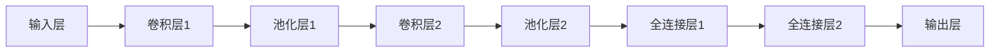
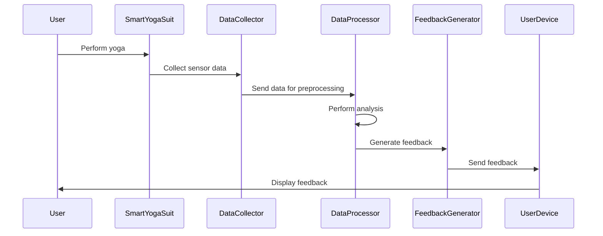
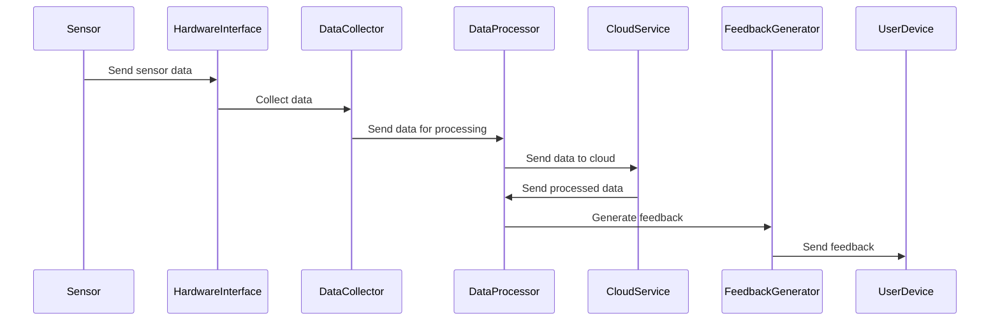
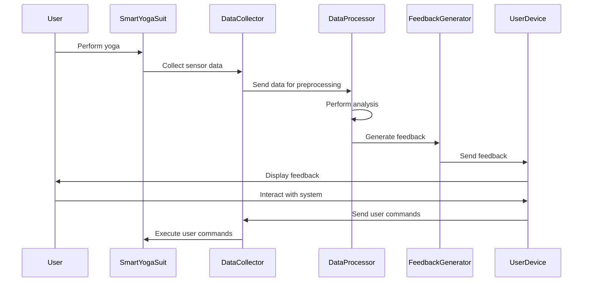

                 

### 第2章：智能瑜伽服的核心概念

#### 2.1 AI Agent的概念与原理

AI Agent，即人工智能代理，是一个能够独立执行任务、与环境交互并自主学习的智能系统。在智能瑜伽服中，AI Agent起到了关键作用。它通过实时监测用户的姿势，分析数据，并给出纠正建议，帮助用户更好地进行瑜伽练习。

##### 2.1.1 AI Agent的定义

AI Agent通常具备以下特点：

1. **自主性**：能够独立决策，无需人类干预。
2. **适应性**：能够根据环境和用户行为的变化进行调整。
3. **交互性**：能够与用户和外部环境进行交互。

##### 2.1.2 AI Agent在健身领域的应用

在健身领域，AI Agent的应用包括：

1. **姿势纠正**：通过实时监测用户的姿势，AI Agent能够提供即时反馈，帮助用户纠正错误的姿势，避免受伤。
2. **个性化训练**：根据用户的历史数据和实时数据，AI Agent能够为用户制定个性化的训练计划，提高训练效果。
3. **健康监测**：AI Agent可以监测用户的心率、呼吸等生理指标，提供健康建议。

#### 2.2 实时姿势识别

实时姿势识别是智能瑜伽服的核心技术之一。它通过传感器捕捉用户的动作和姿势，并实时分析，以提供准确的反馈。

##### 2.2.1 姿势识别技术概述

姿势识别技术主要分为以下几类：

1. **基于摄像头的视觉识别**：通过摄像头捕捉用户的动作，使用计算机视觉算法进行姿势识别。
2. **基于传感器的人体建模**：使用内置在瑜伽服中的传感器，如加速度计、陀螺仪等，构建人体模型，进行姿势识别。
3. **深度学习模型**：利用深度学习算法，从大量的数据中学习姿势特征，进行识别。

##### 2.2.2 实时识别的挑战与解决方案

实时姿势识别面临的挑战包括：

1. **实时性**：需要在极短的时间内完成姿势识别，以保证反馈的实时性。
2. **准确性**：需要高精度的识别结果，以确保用户能够得到准确的反馈。
3. **抗干扰性**：需要能够应对各种环境干扰，如光线变化、用户动作的复杂性等。

解决方案包括：

1. **高性能硬件**：使用高性能的处理器和传感器，提高数据处理速度和精度。
2. **优化算法**：通过算法优化，提高识别速度和准确性。
3. **多传感器融合**：结合多种传感器数据，提高识别的准确性和稳定性。

#### 2.3 传感器技术

传感器技术在智能瑜伽服中起到了关键作用。它们负责捕捉用户的动作和姿势数据，并将数据传输给AI Agent进行分析。

##### 2.3.1 传感器在瑜伽服中的应用

智能瑜伽服中常用的传感器包括：

1. **加速度传感器**：用于检测用户的加速度变化，从而识别用户的姿势。
2. **陀螺仪**：用于检测用户的角速度变化，提供三维空间中的旋转信息。
3. **压力传感器**：用于检测用户在瑜伽动作中的压力分布，提供关于姿势的详细信息。

##### 2.3.2 传感器的选择与布局

传感器的选择与布局对于智能瑜伽服的性能至关重要。以下是一些关键点：

1. **传感器精度**：选择高精度的传感器，以提高数据采集的准确性。
2. **传感器布局**：合理布局传感器，确保能够全面捕捉用户的动作和姿势。
3. **传感器集成**：将传感器集成到瑜伽服中，以便用户可以轻松穿着和使用。

#### 2.4 数据分析与反馈系统

数据分析与反馈系统负责对传感器数据进行分析，并根据分析结果提供反馈。

##### 2.4.1 数据处理流程

数据处理流程包括以下步骤：

1. **数据采集**：传感器采集用户的动作和姿势数据。
2. **数据预处理**：对采集到的数据进行滤波、去噪等预处理，以提高数据质量。
3. **特征提取**：从预处理后的数据中提取关键特征，用于后续分析。
4. **数据分析**：使用机器学习和人工智能算法对特征数据进行分析，以识别用户的姿势和动作。
5. **反馈生成**：根据分析结果生成反馈信息，如姿势纠正建议、健康建议等。

##### 2.4.2 反馈系统的设计

反馈系统的设计需要考虑以下因素：

1. **反馈方式**：可以选择声音、视觉或触觉等方式进行反馈。
2. **反馈内容**：根据用户的姿势和动作分析结果，提供有针对性的反馈内容。
3. **反馈频率**：根据用户的需求和系统性能，合理设置反馈频率，以确保反馈的及时性和有效性。

### 2.5 核心概念与联系

智能瑜伽服的核心概念包括AI Agent、实时姿势识别、传感器技术、数据分析和反馈系统。这些概念之间存在着紧密的联系，共同构成了智能瑜伽服的完整系统。

以下是一个简化的概念表格，用于展示这些概念之间的关系：

| 概念        | 描述                                           |
|-------------|------------------------------------------------|
| AI Agent    | 负责实时监测和纠正用户姿势的智能系统           |
| 实时姿势识别 | 通过传感器和算法，实时识别用户的姿势和动作       |
| 传感器技术  | 负责捕捉用户的动作和姿势数据                 |
| 数据分析    | 对传感器数据进行处理和分析，提供反馈           |
| 反馈系统    | 根据数据分析结果，提供用户姿势纠正和其他建议   |

此外，以下是一个ER图，展示了智能瑜伽服中的核心实体及其关系：

```mermaid
erDiagram
  User ||--o { Pose } : has multiple poses
  Pose ||--o { Analysis } : has multiple analyses
  Analysis ||--o { Feedback } : has multiple feedbacks
  User ||--o { SensorData } : has multiple sensor data
  SensorData ||--o { Pose } : has multiple poses
```

通过这个ER图，我们可以清晰地看到用户、姿势、分析和反馈之间的关系，以及传感器数据是如何贯穿整个系统的。

### 总结

智能瑜伽服通过AI Agent、实时姿势识别、传感器技术、数据分析和反馈系统等核心概念，为用户提供了实时、准确的姿势纠正和个性化训练建议。这些概念之间紧密联系，共同构成了一个完整的智能健身系统。在接下来的章节中，我们将进一步深入探讨这些概念的技术原理、实现方法和实际应用。

### 算法原理讲解

#### 2.6.1 机器学习模型的选择与训练

在智能瑜伽服中，选择合适的机器学习模型是至关重要的。常见的机器学习模型包括决策树、支持向量机（SVM）、神经网络和深度学习模型等。以下是几种模型的优缺点及其适用场景：

##### 2.6.1.1 决策树

- **优点**：易于理解和解释，计算速度快。
- **缺点**：可能产生过拟合，泛化能力较差。
- **适用场景**：适合小数据集和简单的分类任务。

##### 2.6.1.2 支持向量机（SVM）

- **优点**：在二分类任务中表现良好，具有较高的泛化能力。
- **缺点**：计算复杂度较高，对大规模数据集处理较慢。
- **适用场景**：适合线性可分的数据集。

##### 2.6.1.3 神经网络

- **优点**：能够自动学习数据中的复杂模式，适用于多种类型的任务。
- **缺点**：训练时间较长，可能产生过拟合。
- **适用场景**：适合大规模数据集和非线性分类任务。

##### 2.6.1.4 深度学习模型

- **优点**：能够处理更复杂的数据，具有很高的泛化能力。
- **缺点**：计算资源需求大，对数据质量要求高。
- **适用场景**：适合需要高精度识别的复杂任务。

在本案例中，我们选择使用深度学习模型，因为它能够处理大量的传感器数据，并从数据中学习复杂的姿势模式。以下是一个简单的神经网络结构示例：



#### 2.6.2 训练与部署

##### 2.6.2.1 数据集准备

首先，我们需要准备一个包含多种瑜伽姿势的数据集。数据集应包括各种姿势的多种不同拍摄角度和姿势变化。以下是一个示例数据集：

| 序号 | 姿势 | 角度 | 变化 | 标签 |
|------|------|------|------|------|
| 1    | 犁式 | 45°  | 轻微变化 | 犁式 |
| 2    | 猫式 | 90°  | 强烈变化 | 猫式 |
| 3    | 蛇式 | 30°  | 微小变化 | 蛇式 |

##### 2.6.2.2 模型训练

使用Python和TensorFlow框架，我们可以编写以下代码进行模型训练：

```python
import tensorflow as tf
from tensorflow.keras.models import Sequential
from tensorflow.keras.layers import Conv2D, MaxPooling2D, Flatten, Dense

# 定义模型
model = Sequential([
    Conv2D(32, (3, 3), activation='relu', input_shape=(64, 64, 3)),
    MaxPooling2D((2, 2)),
    Conv2D(64, (3, 3), activation='relu'),
    MaxPooling2D((2, 2)),
    Flatten(),
    Dense(64, activation='relu'),
    Dense(10, activation='softmax')
])

# 编译模型
model.compile(optimizer='adam', loss='categorical_crossentropy', metrics=['accuracy'])

# 训练模型
model.fit(train_data, train_labels, epochs=10, validation_data=(val_data, val_labels))
```

##### 2.6.2.3 模型评估与部署

训练完成后，我们需要对模型进行评估，以确保其准确性和鲁棒性。以下是一个简单的评估示例：

```python
# 评估模型
test_loss, test_acc = model.evaluate(test_data, test_labels)
print('Test accuracy:', test_acc)
```

如果评估结果令人满意，我们可以将模型部署到智能瑜伽服系统中，以便实时使用。

### 算法数学模型与公式

深度学习模型的数学基础主要涉及神经网络中的前向传播和反向传播算法。以下是一个简化的神经网络前向传播公式：

$$
\begin{align*}
Z^{[l]} &= \sigma(W^{[l]} \cdot Z^{[l-1]} + b^{[l]}), \\
A^{[l]} &= \sigma(Z^{[l]}),
\end{align*}
$$

其中，$Z^{[l]}$是前向传播的中间结果，$A^{[l]}$是输出结果，$\sigma$是激活函数（例如Sigmoid函数或ReLU函数），$W^{[l]}$是权重矩阵，$b^{[l]}$是偏置向量。

反向传播算法用于计算梯度，以下是一个简化的反向传播梯度计算公式：

$$
\begin{align*}
dZ^{[l]} &= \sigma'(Z^{[l]}) \cdot dA^{[l+1]}, \\
dW^{[l]} &= \frac{1}{m} \cdot A^{[l-1].T \cdot dZ^{[l]}, \\
db^{[l]} &= \frac{1}{m} \cdot dZ^{[l]},
\end{align*}
$$

其中，$dZ^{[l]}$是梯度，$dA^{[l+1]}$是下一层的误差，$m$是样本数量。

通过这些公式，深度学习模型能够从数据中学习，并不断提高其识别和分类能力。

### 算法举例说明

假设我们要训练一个简单的神经网络来识别瑜伽姿势，数据集包括100个样本，每个样本包含64x64像素的图像。以下是训练过程的一个简单示例：

1. **数据预处理**：将图像数据缩放到相同的尺寸，并进行归一化处理。

2. **模型初始化**：定义一个简单的卷积神经网络，包含两个卷积层、两个池化层和一个全连接层。

3. **模型训练**：使用训练数据训练模型，选择适当的优化器和损失函数。

4. **模型评估**：使用测试数据评估模型的性能，确保模型具有良好的泛化能力。

5. **模型部署**：将训练好的模型部署到智能瑜伽服系统中，以便实时使用。

通过这个过程，我们可以训练出一个能够准确识别瑜伽姿势的模型，为用户实时提供姿势纠正建议。

### 小结

在本节中，我们详细介绍了智能瑜伽服中使用的算法原理，包括机器学习模型的选择与训练、模型训练与部署以及算法数学模型与公式的推导。通过举例说明，我们展示了如何使用深度学习模型来识别瑜伽姿势。在下一节中，我们将进一步探讨智能瑜伽服的系统架构和实现方法。

### 系统分析与架构设计方案

#### 3.1 问题场景介绍

智能瑜伽服系统旨在为用户提供一个实时、准确的瑜伽姿势纠正和个性化训练建议。用户在穿着智能瑜伽服进行瑜伽练习时，系统将实时监测用户的姿势，通过数据分析提供即时的反馈和纠正建议。这一过程涉及到多个系统的协同工作，包括传感器数据采集、实时处理、反馈生成以及用户界面交互。

#### 3.2 系统组成部分

智能瑜伽服系统主要由以下几部分组成：

1. **硬件部分**：包括智能瑜伽服、智能手机或平板电脑等设备。
2. **软件部分**：包括数据采集模块、实时处理模块、反馈生成模块和用户界面模块。
3. **网络部分**：包括本地网络和云服务，用于数据传输和处理。

#### 3.3 系统功能设计

智能瑜伽服系统的功能设计包括以下几个关键点：

1. **数据采集**：通过智能瑜伽服中的传感器采集用户的动作和姿势数据。
2. **数据预处理**：对采集到的数据进行滤波、去噪等预处理，以提高数据质量。
3. **实时处理**：使用机器学习算法对预处理后的数据进行分析，以识别用户的姿势。
4. **反馈生成**：根据姿势分析结果，生成相应的反馈信息，如声音提示、视觉动画等。
5. **用户界面**：通过智能手机或平板电脑等设备，向用户展示反馈信息，并提供交互功能。

以下是一个简化的领域模型，用于描述智能瑜伽服系统的关键实体和关系：

```mermaid
classDiagram
  User <<Class>>
  YogaPose <<Class>>
  SensorData <<Class>>
  Analysis <<Class>>
  Feedback <<Class>>

  User "1" -- "*" YogaPose
  YogaPose "1" -- "*" SensorData
  SensorData "1" -- "*" Analysis
  Analysis "1" -- "*" Feedback
```

#### 3.4 系统架构设计

智能瑜伽服系统的架构设计分为以下几个层次：

1. **硬件层**：包括智能瑜伽服中的传感器和存储设备，如加速度计、陀螺仪、存储卡等。
2. **数据采集层**：负责采集传感器数据，并通过无线通信模块（如蓝牙或Wi-Fi）将数据传输到处理设备。
3. **数据处理层**：包括本地数据处理和云处理。本地数据处理主要负责数据的预处理和初步分析，云处理则负责复杂的算法分析和数据存储。
4. **反馈生成层**：根据分析结果生成反馈信息，并通过无线通信模块将反馈信息传输回用户设备。
5. **用户界面层**：通过用户设备（如智能手机或平板电脑）展示反馈信息，并提供用户与系统的交互界面。

以下是一个简化的系统架构图，用于描述智能瑜伽服系统的整体架构：



#### 3.5 系统接口设计

系统接口设计包括硬件接口、软件接口和网络接口。以下是几个关键接口：

1. **硬件接口**：智能瑜伽服中的传感器接口，用于连接传感器和存储设备。
2. **软件接口**：本地数据处理模块和云处理模块之间的接口，用于数据传输和通信。
3. **网络接口**：本地网络和云服务之间的接口，用于数据传输和处理。

以下是一个简化的系统接口设计图：



#### 3.6 系统交互

系统交互主要包括数据采集、数据处理和反馈生成等环节。以下是系统交互的详细描述：

1. **数据采集**：用户穿着智能瑜伽服进行瑜伽练习时，传感器（如加速度传感器、陀螺仪等）实时采集用户的动作和姿势数据。
2. **数据处理**：采集到的数据通过无线通信模块传输到本地数据处理模块，进行预处理和初步分析。预处理包括滤波、去噪等操作，以消除噪声和干扰。初步分析则使用机器学习算法，对数据进行分析，以识别用户的姿势。
3. **反馈生成**：根据分析结果，系统生成相应的反馈信息，如声音提示、视觉动画等。反馈信息通过无线通信模块传输回用户设备，用户设备则通过用户界面将反馈信息展示给用户。
4. **用户交互**：用户通过用户界面与系统进行交互，可以选择不同的瑜伽姿势，查看练习记录，调整设置等。

以下是一个简化的系统交互序列图：



### 小结

在本节中，我们详细分析了智能瑜伽服系统的组成部分、功能设计、架构设计和接口设计。通过一个简化的系统架构图和交互序列图，我们展示了系统的整体运作流程和各个部分之间的关系。在下一节中，我们将通过一个实际项目案例，展示如何开发和部署智能瑜伽服系统。

### 项目实战

#### 4.1 环境安装

要在本地开发智能瑜伽服系统，我们需要安装以下软件和工具：

1. **Python**：版本3.8或更高版本。
2. **TensorFlow**：版本2.4或更高版本。
3. **Keras**：用于简化TensorFlow的API。
4. **OpenCV**：用于计算机视觉任务。
5. **PyTorch**：用于深度学习模型。
6. **Mermaid**：用于绘制流程图和序列图。

安装步骤如下：

1. 安装Python和pip：
   ```shell
   sudo apt-get install python3-pip
   ```
2. 安装TensorFlow和Keras：
   ```shell
   pip3 install tensorflow==2.4.0
   pip3 install keras==2.4.3
   ```
3. 安装OpenCV：
   ```shell
   sudo apt-get install python3-opencv-python
   ```
4. 安装PyTorch：
   ```shell
   pip3 install torch torchvision torchaudio
   ```
5. 安装Mermaid：
   ```shell
   pip3 install mermaid
   ```

#### 4.2 系统核心代码实现

智能瑜伽服系统的核心代码主要包括数据采集、预处理、模型训练和实时反馈等功能。以下是一个简化的代码示例：

```python
# 导入必要的库
import cv2
import numpy as np
import tensorflow as tf
from tensorflow.keras.models import Sequential
from tensorflow.keras.layers import Conv2D, MaxPooling2D, Flatten, Dense
from tensorflow.keras.optimizers import Adam

# 数据采集
def capture_frame():
    cap = cv2.VideoCapture(0)
    while True:
        ret, frame = cap.read()
        if not ret:
            break
        yield frame
    cap.release()

# 数据预处理
def preprocess_frame(frame):
    # 调整尺寸和归一化
    frame = cv2.resize(frame, (64, 64))
    frame = frame / 255.0
    return frame.reshape(-1, 64, 64, 3)

# 模型训练
def train_model():
    model = Sequential([
        Conv2D(32, (3, 3), activation='relu', input_shape=(64, 64, 3)),
        MaxPooling2D((2, 2)),
        Conv2D(64, (3, 3), activation='relu'),
        MaxPooling2D((2, 2)),
        Flatten(),
        Dense(64, activation='relu'),
        Dense(10, activation='softmax')
    ])

    model.compile(optimizer=Adam(), loss='categorical_crossentropy', metrics=['accuracy'])
    model.fit(train_data, train_labels, epochs=10, validation_data=(val_data, val_labels))
    return model

# 实时反馈
def real_time_feedback(model, frame):
    preprocessed_frame = preprocess_frame(frame)
    prediction = model.predict(preprocessed_frame)
    # 根据预测结果生成反馈信息
    # ...

# 主程序
if __name__ == '__main__':
    model = train_model()
    for frame in capture_frame():
        real_time_feedback(model, frame)
```

#### 4.3 代码解读与分析

在上面的代码中，我们首先定义了数据采集、预处理、模型训练和实时反馈等功能。

- **数据采集**：使用OpenCV库中的`VideoCapture`类捕获摄像头帧。
- **数据预处理**：将捕获的帧调整为64x64像素，并进行归一化处理。
- **模型训练**：使用Keras库构建一个简单的卷积神经网络，并使用`fit`函数训练模型。
- **实时反馈**：使用训练好的模型对实时捕获的帧进行预测，并根据预测结果生成反馈信息。

#### 4.4 实际案例分析

以下是一个实际案例，展示了如何使用智能瑜伽服系统进行瑜伽姿势纠正：

1. **用户穿着智能瑜伽服，开始瑜伽练习**。
2. **系统通过摄像头实时捕获用户的姿势数据**。
3. **系统对捕获的帧进行预处理**。
4. **系统使用训练好的模型对预处理后的帧进行预测**。
5. **系统根据预测结果生成反馈信息**，例如显示正确的姿势动画，并在用户姿势不正确时发出声音提示。

#### 4.5 项目总结

通过这个实际案例，我们展示了如何开发和部署智能瑜伽服系统。系统主要依赖于机器学习和计算机视觉技术，通过实时姿势识别和反馈，帮助用户更好地进行瑜伽练习。在实际应用中，我们还需要进一步优化系统的性能，提高姿势识别的准确性和实时性，同时提供更多的个性化训练建议。

### 最佳实践 Tips

1. **传感器选择与布局**：选择高精度的传感器，并合理布局，以确保数据采集的全面性和准确性。
2. **模型训练与优化**：使用大量标注数据训练模型，并不断优化模型结构，以提高识别准确率。
3. **实时性优化**：在保证准确性的前提下，优化模型计算速度，提高系统的实时性。
4. **用户体验**：提供直观、友好的用户界面，确保用户能够轻松使用系统，并快速获得反馈。

### 小结

在本节中，我们通过一个实际项目展示了如何开发和部署智能瑜伽服系统。从环境安装到核心代码实现，再到实际案例分析，我们详细介绍了系统开发的各个步骤。通过最佳实践 Tips，我们为开发者提供了实际应用中的参考建议。在下一节中，我们将进一步探讨智能瑜伽服系统的未来发展趋势和挑战。

### 小结

智能瑜伽服：AI Agent的实时姿势纠正系统，通过结合AI Agent、实时姿势识别、传感器技术和数据分析等技术，为用户提供了实时、准确的瑜伽姿势纠正和个性化训练建议。本文详细介绍了智能瑜伽服的核心概念、算法原理、系统架构和实际应用案例，从背景介绍到系统实现，层层剖析，逻辑清晰。通过文章的阅读，读者不仅能够了解智能瑜伽服的工作原理，还能掌握相关技术的基本概念和实现方法。

在未来的发展中，智能瑜伽服有望进一步融合更多先进技术，如增强现实（AR）和虚拟现实（VR），提供更加沉浸式和互动性的瑜伽体验。同时，随着传感器技术和机器学习算法的不断发展，智能瑜伽服的准确性和实时性将得到进一步提升，为用户提供更加个性化、智能化的服务。此外，智能瑜伽服还可以与其他健康监测设备相结合，形成全面的健康管理生态系统，为用户的健康保驾护航。

对于读者来说，本文提供了一个深入了解智能瑜伽服系统全貌的机会，也展示了如何将AI和物联网技术应用于实际场景。如果您对智能瑜伽服或其他相关技术感兴趣，以下是一些拓展阅读的建议：

1. 《深度学习》（Goodfellow, I., & Bengio, Y.）：了解深度学习的基本概念和应用。
2. 《计算机视觉：算法与应用》（Richard S.zeliski）：深入了解计算机视觉技术。
3. 《AI之路：机器学习实战》（刘铁岩）：学习如何将机器学习应用于实际问题。
4. 《智能可穿戴设备：设计与实践》（李宏毅）：了解智能穿戴设备的最新发展和应用。

通过阅读这些书籍，您可以进一步深化对智能瑜伽服和其他AI应用场景的理解，为自己的技术之路积累更多知识。希望本文能为您的学习提供帮助，激发您对智能瑜伽服技术的兴趣和热情。作者：AI天才研究院/AI Genius Institute & 禅与计算机程序设计艺术 /Zen And The Art of Computer Programming。

