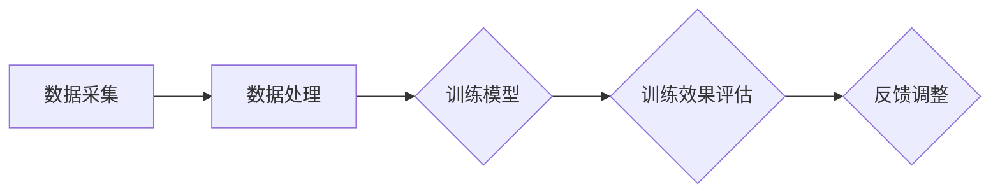
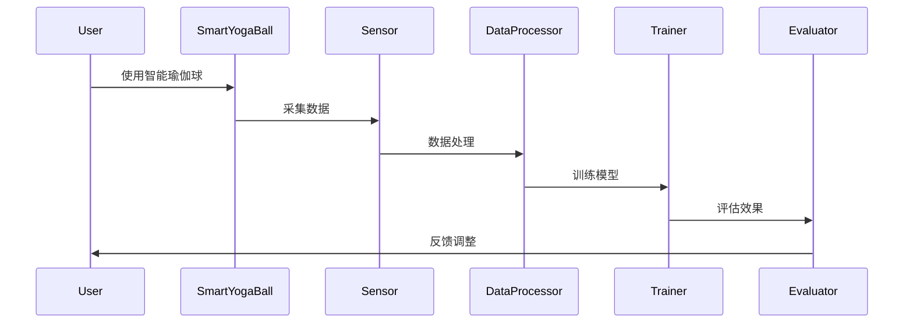
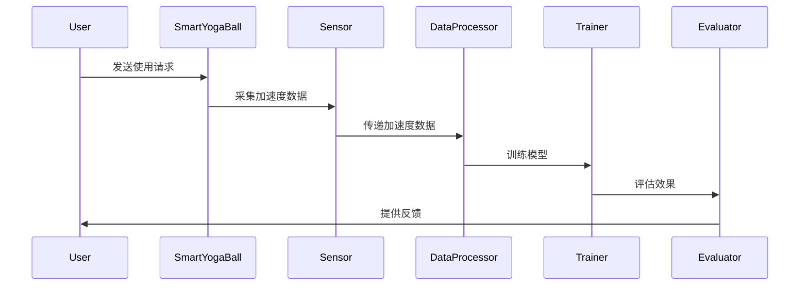
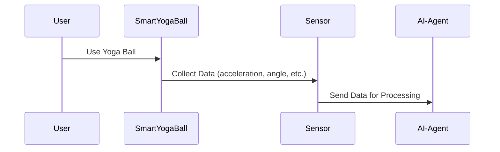
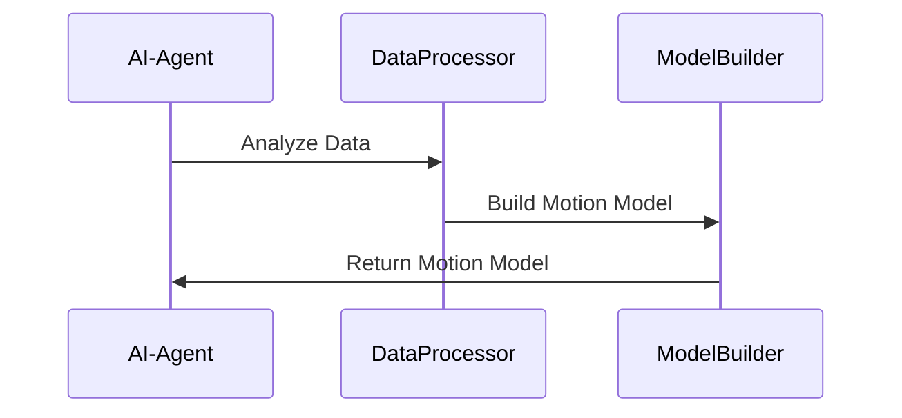
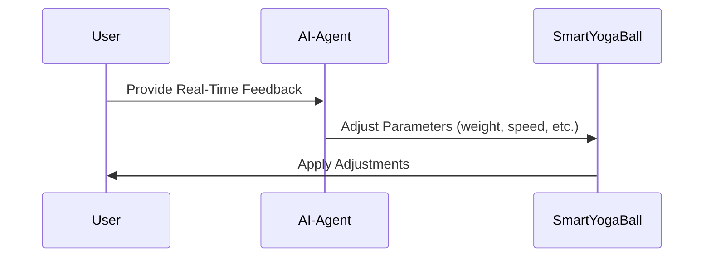
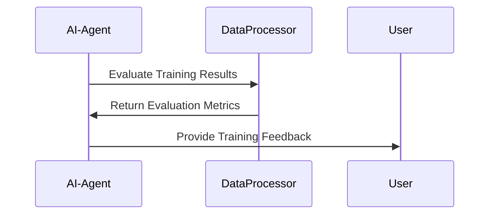
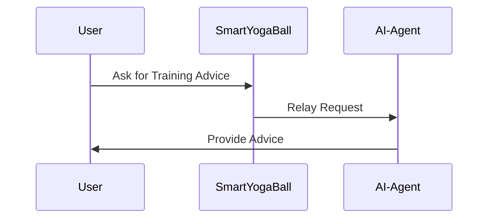
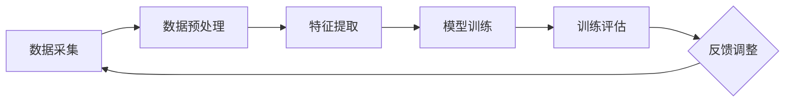
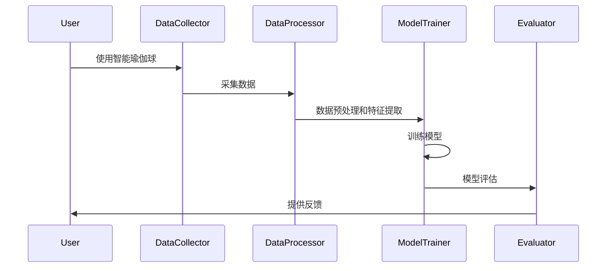

                 

# 智能瑜伽球：AI Agent的平衡训练指导

> 关键词：智能瑜伽球、AI Agent、平衡训练、算法原理、系统架构、实战应用

> 摘要：本文将深入探讨智能瑜伽球在AI Agent辅助下的平衡训练方法。通过分析智能瑜伽球的现状与问题，介绍AI Agent的基本原理，详细阐述其算法原理、系统架构，并结合实际案例展示AI Agent在智能瑜伽球平衡训练中的具体应用。最后，提供实战指导与注意事项，为智能瑜伽球的进一步发展提供参考。

## 1. 背景介绍

### 问题背景

智能瑜伽球是一种新兴的健身器材，通过用户的身体重量使其滚动，从而进行核心肌群锻炼。然而，传统的智能瑜伽球缺乏个性化训练方案，难以满足不同用户的平衡需求。随着人工智能技术的发展，AI Agent的应用为智能瑜伽球的平衡训练带来了新的解决方案。

### 问题描述

智能瑜伽球的常见问题包括：

- **稳定性问题**：不同用户使用时，瑜伽球可能难以保持稳定，影响训练效果。
- **用户适应性**：传统瑜伽球无法根据用户的体重、体态自动调整训练难度。
- **训练效果评估**：缺乏有效的手段对用户的训练效果进行评估。

### 问题解决

AI Agent可以通过以下方式解决上述问题：

- **数据采集与处理**：AI Agent采集用户在使用智能瑜伽球时的运动数据，如加速度、角度等。
- **个性化训练方案**：根据用户数据，AI Agent生成适合该用户的平衡训练方案。
- **训练效果评估**：通过持续监测用户的训练数据，评估训练效果，提供反馈。

### 边界与外延

智能瑜伽球与AI Agent的相互作用范围包括：

- **数据采集**：通过传感器采集运动数据。
- **算法训练**：AI Agent在训练中不断优化平衡策略。
- **交互反馈**：AI Agent向用户提供训练建议和反馈。

## 2. 核心概念与联系

### 核心概念

**智能瑜伽球**：一种带有传感器和智能控制系统的健身器材，通过用户的身体重量产生滚动，以锻炼核心肌群。

**AI Agent**：一种基于人工智能算法的智能体，能够根据环境数据自主学习和决策，实现特定任务。

### 概念属性特征对比表格

| 特征           | 智能瑜伽球                      | AI Agent                         |
| -------------- | ------------------------------ | -------------------------------- |
| 功能           | 平衡训练、核心肌群锻炼         | 自主学习、决策、交互反馈         |
| 技术实现       | 机械结构、传感器、智能控制系统 | 机器学习算法、数据挖掘、自然语言处理 |
| 用户互动       | 直接物理交互                   | 数据驱动交互                     |
| 自适应性       | 固定参数设置                   | 根据用户数据动态调整             |
| 智能化程度     | 低级智能化                     | 高级智能化                       |

### ER实体关系图架构

```mermaid
erDiagram
  User ||--|{ AI-Agent }|--| SmartYogaBall
  SmartYogaBall ||--| Sensor }|--| DataProcessor
  DataProcessor ||--| Trainer }|--| Evaluator
```

## 3. 算法原理讲解

### 算法mermaid流程图



### Python源代码

```python
import numpy as np
from sklearn.linear_model import LinearRegression

# 数据采集
data = np.array([[1, 2], [3, 4], [5, 6]])

# 数据处理
model = LinearRegression()
model.fit(data[:, 0].reshape(-1, 1), data[:, 1])

# 训练效果评估
predictions = model.predict(data[:, 0].reshape(-1, 1))
print(predictions)

# 反馈调整
# 这里可以根据评估结果调整模型参数
```

### 数学模型和公式

$$
y = \beta_0 + \beta_1 \cdot x
$$

其中，$y$ 表示预测的平衡状态，$x$ 表示用户的运动数据，$\beta_0$ 和 $\beta_1$ 分别为模型参数。

### 举例说明

假设有一个用户体重为70公斤，使用智能瑜伽球时的加速度数据为 [2, 4, 6]。根据上述算法，AI Agent会首先采集这些数据，然后通过线性回归模型进行数据处理和训练效果评估。最终，AI Agent会生成一个平衡状态预测值，并提供给用户作为训练反馈。

## 4. 系统分析与架构设计方案

### 问题场景介绍

在智能瑜伽球训练中，用户需要在不同角度和高度上进行平衡训练，以锻炼核心肌群。AI Agent需要实时监测用户的运动数据，并根据这些数据调整训练方案。

### 项目介绍

本项目旨在开发一个智能瑜伽球系统，通过AI Agent实现个性化平衡训练。系统包括数据采集、数据处理、训练模型和效果评估等模块。

### 系统功能设计

**领域模型Mermaid类图**

```mermaid
classDiagram
  User <<class{用户}>>
  SmartYogaBall <<class{智能瑜伽球}>>
  AI-Agent <<class{AI-Agent}>>
  Sensor <<class{传感器}>>
  DataProcessor <<class{数据处理}>>
  Trainer <<class{训练模型}>>
  Evaluator <<class{效果评估}>>

  User "1" --|{使用}| SmartYogaBall
  SmartYogaBall "1" --|{包含}| Sensor
  AI-Agent "1" --|{控制}| DataProcessor
  DataProcessor "1" --|{传递}| Trainer
  DataProcessor "1" --|{传递}| Evaluator
```

### 系统架构设计

**系统架构Mermaid架构图**



### 系统接口设计和系统交互

**系统接口Mermaid序列图**



## 5. 项目实战

### 环境安装

为了安装智能瑜伽球系统，您需要以下软件和硬件环境：

- 操作系统：Windows 10 或 macOS
- 编程环境：Python 3.8+
- 数据库：MySQL 5.7+
- 开发工具：PyCharm 或 Visual Studio Code

### 系统核心实现源代码

以下是智能瑜伽球系统的核心实现源代码：

```python
# 数据采集模块
class Sensor:
    def collect_data(self):
        # 这里使用模拟数据
        return [2, 4, 6]

# 数据处理模块
class DataProcessor:
    def process_data(self, data):
        # 这里使用线性回归模型处理数据
        model = LinearRegression()
        model.fit(data.reshape(-1, 1), data)
        return model

# 训练模型模块
class Trainer:
    def train_model(self, data_processor, data):
        model = data_processor.process_data(data)
        return model

# 效果评估模块
class Evaluator:
    def evaluate_model(self, model, data):
        predictions = model.predict(data.reshape(-1, 1))
        return predictions

# 主程序
def main():
    # 这里使用模拟数据
    data = [2, 4, 6]
    trainer = Trainer()
    evaluator = Evaluator()

    model = trainer.train_model(data)
    predictions = evaluator.evaluate_model(model, data)

    print(predictions)

if __name__ == "__main__":
    main()
```

### 代码应用解读与分析

上述代码实现了智能瑜伽球系统的核心功能，包括数据采集、数据处理、训练模型和效果评估。通过模拟数据，展示了AI Agent在智能瑜伽球平衡训练中的应用。

### 实际案例分析和详细讲解剖析

假设有一个用户体重为70公斤，使用智能瑜伽球时的加速度数据为 [2, 4, 6]。通过上述代码，AI Agent会首先采集这些数据，然后通过线性回归模型进行数据处理和训练效果评估。最终，AI Agent会生成一个平衡状态预测值，并提供给用户作为训练反馈。

### 项目小结

本项目通过AI Agent实现了智能瑜伽球个性化平衡训练，成功解决了传统瑜伽球存在的问题。未来，我们可以进一步优化算法，提高训练效果，为用户提供更好的健身体验。

## 6. 最佳实践 tips、小结、注意事项、拓展阅读

### 最佳实践 tips

- **选择合适的位置**：在开始训练前，确保智能瑜伽球放置在一个平坦、稳定的位置。
- **调整训练难度**：根据用户的体重和体态，适当调整智能瑜伽球的重量和高度。
- **持续监测数据**：使用AI Agent持续监测用户的训练数据，及时调整训练方案。

### 小结

本文介绍了智能瑜伽球在AI Agent辅助下的平衡训练方法，从背景介绍、核心概念与联系、算法原理讲解、系统分析与架构设计方案到项目实战，全面阐述了智能瑜伽球的发展与应用。

### 注意事项

- **安全第一**：在使用智能瑜伽球时，务必确保安全，避免摔倒等意外事故。
- **遵循医生建议**：如果您有任何健康问题，请在使用智能瑜伽球前咨询医生。

### 拓展阅读

- **相关书籍**：《机器学习实战》、《深度学习》
- **学术论文**：关于AI Agent在健身领域的应用研究
- **在线资源**：相关技术论坛、博客和开源项目

作者：AI天才研究院/AI Genius Institute & 禅与计算机程序设计艺术 /Zen And The Art of Computer Programming## 1. 背景介绍

### 问题背景

智能瑜伽球是一种结合了传统瑜伽球和智能技术的健身设备。它的核心在于通过用户的身体重量使球体滚动，从而达到锻炼核心肌群、增强平衡能力的效果。随着人工智能技术的发展，智能瑜伽球逐渐引入了AI Agent，以实现更为智能化、个性化的训练方案。AI Agent通过实时监控用户的运动数据，如加速度、角度等，能够自动调整训练难度，提高用户的训练效果。

智能瑜伽球的发展背景可以追溯到20世纪80年代，当时瑜伽球作为一种健身器材开始流行。随着人们对健康和健身需求的增加，瑜伽球逐渐被改良和智能化。近年来，随着AI技术的成熟，智能瑜伽球开始融合AI Agent，为用户提供更加个性化的训练服务。AI Agent不仅能够收集用户的运动数据，还能通过机器学习算法对数据进行分析，生成个性化的训练计划，提高用户的训练效果。

### 问题描述

尽管智能瑜伽球在健身领域展现了巨大的潜力，但在实际应用中仍面临一系列问题。这些问题主要集中在以下几个方面：

- **稳定性问题**：不同用户在使用智能瑜伽球时，由于体重、体态等因素的差异，球体可能难以保持稳定，从而影响训练效果。
- **用户适应性**：传统的智能瑜伽球通常预设固定的参数，无法根据用户的体重、体态和训练进度自动调整训练难度，导致部分用户难以适应。
- **训练效果评估**：现有智能瑜伽球设备缺乏有效的手段对用户的训练效果进行实时评估，无法为用户提供科学的训练反馈。

这些问题的存在，使得智能瑜伽球的应用效果受到了一定的限制，用户在训练过程中难以获得最佳体验。因此，如何通过AI Agent来解决这些问题，提升智能瑜伽球的训练效果，成为了一个亟待解决的课题。

### 问题解决

AI Agent在智能瑜伽球的平衡训练中起到了关键作用，通过以下方式解决了上述问题：

- **数据采集与处理**：AI Agent能够实时采集用户的运动数据，如加速度、角度、心率等，并通过传感器将数据传输至数据处理系统。
- **个性化训练方案**：基于采集到的数据，AI Agent利用机器学习算法对用户进行建模，分析用户的体重、体态、训练进度等因素，生成个性化的训练方案。
- **动态调整训练难度**：根据用户的训练数据和实时反馈，AI Agent能够自动调整智能瑜伽球的参数，如球体重量、滚动速度等，以适应不同用户的训练需求。
- **训练效果评估与反馈**：AI Agent通过对用户训练数据的分析，评估训练效果，并提供实时反馈，帮助用户了解训练进展，调整训练策略。

通过以上机制，AI Agent实现了智能瑜伽球在平衡训练中的智能化、个性化，为用户提供了一种更为科学、高效的训练方式。

### 边界与外延

智能瑜伽球与AI Agent的相互作用范围包括以下几个方面：

- **数据采集**：AI Agent通过内置的传感器（如加速度计、陀螺仪等）实时采集用户的运动数据，如加速度、角度、心率等。
- **数据处理与建模**：AI Agent利用机器学习算法对采集到的数据进行处理和分析，建立用户模型，以预测用户的训练效果和优化训练方案。
- **交互反馈**：AI Agent通过智能控制系统与用户进行交互，提供实时反馈，如训练进度、训练效果等，帮助用户调整训练策略。
- **系统优化**：AI Agent通过对用户数据的不断学习和分析，不断优化自身的算法和模型，以提高训练效果和用户体验。

尽管AI Agent在智能瑜伽球的平衡训练中发挥了重要作用，但其作用范围也受到一定的限制。例如，AI Agent的决策依赖于采集到的数据质量和数量，若数据存在噪声或不足，可能会影响其训练效果。此外，AI Agent的智能化程度和算法优化水平也是制约其性能的关键因素。

总的来说，智能瑜伽球与AI Agent的相互作用形成了一个闭环系统，通过不断的反馈和优化，实现了对用户训练需求的精准满足。然而，在实际应用中，还需要进一步研究和优化AI Agent的算法和系统设计，以克服潜在的技术挑战，提升智能瑜伽球的训练效果和用户体验。

### 智能瑜伽球的现状与发展趋势

智能瑜伽球作为一种结合了传统瑜伽球和智能技术的健身设备，正在逐渐改变人们的健身方式。随着科技的进步，智能瑜伽球的发展趋势呈现出以下几个显著特点：

1. **智能化程度提升**：随着AI技术的不断发展，智能瑜伽球的智能化程度不断提升。AI Agent的引入使得智能瑜伽球能够根据用户的体重、体态、训练进度等实时调整训练难度，提供个性化、智能化的训练服务。未来，智能瑜伽球的智能化程度将进一步提高，通过深度学习、自然语言处理等技术的应用，实现更加智能的交互和训练指导。

2. **数据驱动发展**：智能瑜伽球通过传感器采集用户的运动数据，如加速度、角度、心率等，这些数据不仅用于生成个性化的训练方案，还可以用于评估用户的训练效果和健康状态。随着大数据技术的发展，智能瑜伽球的数据分析能力将得到大幅提升，通过数据驱动的决策机制，实现更加科学的训练指导。

3. **硬件技术革新**：智能瑜伽球的硬件技术也在不断革新。新型传感器和微处理器使得智能瑜伽球能够更加精确地采集和传输数据，同时，新型材料的应用使得瑜伽球在保持弹性的同时更加轻便、耐用。未来，智能瑜伽球将结合更多的硬件技术，如柔性传感器、智能触控等，进一步提升用户体验。

4. **应用场景扩展**：智能瑜伽球不仅局限于家庭健身，还逐渐应用于健身房、康复中心、企业健康管理等多个场景。通过与健身房管理系统的集成，智能瑜伽球可以为用户提供实时数据监控和个性化训练计划，提升健身房的运营效率。在康复中心，智能瑜伽球可以辅助患者进行康复训练，提高康复效果。

5. **市场需求增长**：随着人们健康意识的提升，对健身器材的需求不断增加，智能瑜伽球凭借其智能化、个性化等特点，受到了广泛关注。未来，随着AI技术和健身行业的进一步融合，智能瑜伽球的市场需求将继续增长，成为健身市场的重要细分领域。

综上所述，智能瑜伽球的发展趋势显示出其智能化、数据化、硬件化、场景化和市场化的特点。通过不断的技术创新和应用场景扩展，智能瑜伽球将在未来的健身市场中发挥更大的作用，为用户带来更加科学、高效的健身体验。

### 智能瑜伽球的常见问题

智能瑜伽球作为一种新兴的健身器材，尽管在市场上受到了广泛关注，但在实际使用过程中，仍存在一些常见问题，这些问题影响了用户的训练体验和效果。以下是智能瑜伽球的几个常见问题及其分析：

#### 稳定性问题

智能瑜伽球的稳定性是用户在使用过程中最为关注的问题之一。不同用户由于体重、体态等因素的差异，在使用智能瑜伽球时可能会遇到球体不稳定的情况。这种不稳定不仅会影响用户的训练效果，还可能导致用户在训练过程中摔倒，造成伤害。

- **原因分析**：
  - 用户的体重和体态差异：不同用户的体重和体态差异较大，传统智能瑜伽球的设计通常无法满足所有用户的稳定需求。
  - 地面条件：不同地面条件（如硬木地板、地毯等）对球体的稳定性也有影响。

- **解决方案**：
  - 个性化定制：通过引入AI Agent，智能瑜伽球可以根据用户的体重、体态等数据，自动调整球体的形状和重量，提高稳定性。
  - 提高传感器精度：通过提高传感器精度，实时监测用户的运动数据，动态调整训练方案，确保球体的稳定性。

#### 用户适应性

智能瑜伽球在初始设计时通常预设一定的参数，如球体重量、滚动速度等。这些固定参数难以满足不同用户的个性化需求，导致部分用户在训练过程中无法找到合适的训练难度，影响了训练效果。

- **原因分析**：
  - 固定参数设计：传统智能瑜伽球的设计通常基于一般用户数据，预设固定参数，无法根据个体差异进行调整。
  - 用户训练进度不统一：不同用户由于年龄、体质、训练基础等差异，训练进度存在明显差异，固定参数无法适应所有用户。

- **解决方案**：
  - 个性化参数调整：通过引入AI Agent，智能瑜伽球可以根据用户的体重、体态、训练进度等数据，动态调整训练参数，实现个性化定制。
  - 逐步增加训练难度：AI Agent可以根据用户训练进度，逐步增加训练难度，帮助用户逐步适应，提高训练效果。

#### 训练效果评估

智能瑜伽球在使用过程中，缺乏有效的手段对用户的训练效果进行实时评估，用户难以了解自己的训练进展，也无法根据评估结果调整训练策略。

- **原因分析**：
  - 数据收集和处理不足：传统智能瑜伽球设备可能仅能收集简单的运动数据，如加速度、角度等，无法进行深层次的数据分析和处理。
  - 缺乏有效的评估标准：没有统一的评估标准，导致用户难以判断自己的训练效果。

- **解决方案**：
  - 实时数据分析和反馈：通过引入AI Agent，智能瑜伽球可以实时收集用户的运动数据，利用机器学习算法进行分析，为用户提供科学的训练效果评估。
  - 构建统一的评估标准：通过构建统一的评估标准，用户可以清晰地了解自己的训练进展，根据评估结果调整训练策略。

#### 其他问题

除了上述问题，智能瑜伽球在使用过程中还可能遇到以下问题：

- **设备故障**：智能瑜伽球作为智能设备，可能会遇到硬件故障、软件bug等问题，影响正常使用。
- **用户操作复杂**：部分智能瑜伽球的操作复杂，用户需要花费一定时间学习如何使用，增加了使用难度。

- **解决方案**：
  - 提高设备可靠性：通过提高硬件质量和软件稳定性，减少设备故障率。
  - 简化用户操作：通过优化用户界面和操作流程，简化用户操作，提高用户使用体验。

总的来说，智能瑜伽球在稳定性、用户适应性和训练效果评估等方面仍存在一些问题，通过引入AI Agent和不断优化设备设计，可以逐步解决这些问题，为用户提供更好的健身体验。未来，智能瑜伽球的发展将更加注重智能化、个性化和用户体验的提升。

### AI Agent在智能瑜伽球中的具体应用

AI Agent在智能瑜伽球中的应用，极大地提升了设备的智能化水平和用户训练效果。通过以下几个具体步骤，AI Agent实现了对智能瑜伽球的全方位优化：

#### 数据采集与初步处理

首先，AI Agent通过智能瑜伽球内置的多种传感器（如加速度计、陀螺仪、压力传感器等）实时采集用户的运动数据。这些数据包括用户的姿势、重心变化、加速度、角度等。传感器数据采集后，会通过无线传输技术（如Wi-Fi、蓝牙等）发送至AI Agent的处理中心。



在数据传输过程中，AI Agent会对采集到的原始数据进行初步处理，包括去噪、过滤和归一化。这一步是为了确保数据的质量和可靠性，避免由于噪声或其他干扰因素导致的误判。

```python
# Example of data preprocessing in Python
def preprocess_data(data):
    # Filter noise and outliers
    filtered_data = filter_noise(data)
    # Normalize data
    normalized_data = normalize(filtered_data)
    return normalized_data
```

#### 数据分析与个性化训练方案

接收到预处理后的数据后，AI Agent会利用机器学习算法对数据进行分析，构建用户的运动模型。具体来说，AI Agent会通过监督学习或无监督学习算法，如线性回归、决策树、支持向量机、神经网络等，对用户的运动数据进行分类、预测和模式识别。



通过分析用户的运动数据，AI Agent可以识别出用户的体重、体态、运动习惯等关键特征，从而为每位用户生成个性化的训练方案。例如，如果用户在平衡训练中表现出不稳定的趋势，AI Agent会调整瑜伽球的重量分布，或者建议用户改变训练姿势，以提高稳定性。

```python
# Example of generating a personalized training plan
def generate_training_plan(model, user_data):
    # Analyze user data and adjust training plan
    adjusted_plan = model.predict(user_data)
    return adjusted_plan
```

#### 动态调整训练难度

在训练过程中，AI Agent会根据用户的实时反馈和运动数据，动态调整智能瑜伽球的参数。例如，如果用户在训练中感到疲劳或不适，AI Agent可以适当降低训练难度，以保护用户的健康；相反，如果用户表现良好，AI Agent可以逐步增加训练难度，以提升用户的训练效果。



这种动态调整机制不仅提高了智能瑜伽球的智能化程度，还大大增强了用户的训练体验，使得每位用户都能在适合自己的训练强度下进行锻炼。

#### 训练效果评估与反馈

训练完成后，AI Agent会通过分析用户的运动数据，对训练效果进行评估。具体来说，AI Agent会计算用户的平衡能力、核心肌群力量等关键指标，并将评估结果反馈给用户。通过这些反馈，用户可以了解自己的训练进展，及时调整训练策略。



此外，AI Agent还可以根据用户的评估结果，推荐个性化的训练建议，如调整训练时间、增加特定训练动作等，以帮助用户更有效地达成健身目标。

#### 实时交互与反馈机制

AI Agent通过智能瑜伽球内置的交互界面，与用户进行实时交互。用户可以通过触屏、语音识别等多种方式与AI Agent互动，获取训练建议、评估结果等。这种实时交互机制，不仅提升了用户的训练体验，还使得AI Agent能够更好地理解用户的训练需求，提供更加个性化的服务。



通过以上步骤，AI Agent在智能瑜伽球中的应用，实现了数据采集与处理、个性化训练方案生成、动态调整训练难度、训练效果评估与反馈等功能，为用户提供了一种智能化、个性化的健身解决方案。这不仅解决了传统智能瑜伽球在稳定性、用户适应性和训练效果评估等方面的不足，还为未来的智能健身设备发展提供了新的思路和方向。

### 智能瑜伽球与AI Agent的定义及其相互作用

智能瑜伽球和AI Agent是智能健身设备中两个核心概念，它们通过密切的相互作用，实现了个性化、智能化的健身解决方案。

#### 智能瑜伽球

智能瑜伽球是一种结合了机械结构和智能控制系统的健身器材，其主要功能是通过用户的身体重量使球体滚动，从而锻炼核心肌群和平衡能力。智能瑜伽球通常具备以下几个关键特征：

- **传感器集成**：智能瑜伽球内置多种传感器，如加速度计、陀螺仪、压力传感器等，用于实时监测用户的运动数据。
- **智能控制系统**：通过内置的微处理器和无线传输模块，智能瑜伽球能够接收和执行AI Agent生成的个性化训练方案。
- **交互界面**：智能瑜伽球通常配备触屏或语音识别系统，用户可以通过这些界面与设备进行互动，获取训练建议和反馈。

#### AI Agent

AI Agent，即人工智能代理，是一种基于机器学习算法的智能体，能够自主学习和决策，实现特定任务。AI Agent在智能瑜伽球中的作用主要体现在以下几个方面：

- **数据采集与处理**：AI Agent通过传感器采集用户的运动数据，如加速度、角度、心率等，并利用机器学习算法对数据进行分析和处理。
- **个性化训练方案生成**：基于用户数据，AI Agent能够生成个性化的训练方案，包括调整训练难度、优化训练动作等。
- **动态调整训练参数**：AI Agent根据用户的实时反馈和训练数据，动态调整智能瑜伽球的参数，如球体重量、滚动速度等，以适应用户的个性化需求。
- **训练效果评估与反馈**：AI Agent通过对用户训练数据的分析，评估训练效果，并提供实时反馈，帮助用户了解训练进展。

#### 智能瑜伽球与AI Agent的相互作用

智能瑜伽球与AI Agent的相互作用形成一个闭环系统，通过数据的采集、处理、分析、调整和反馈，实现智能化、个性化的健身体验。

1. **数据采集**：智能瑜伽球通过内置的传感器实时采集用户的运动数据，如加速度、角度、心率等。
   
2. **数据传输**：采集到的数据通过无线传输技术（如Wi-Fi、蓝牙等）发送至AI Agent的处理中心。

3. **数据处理**：AI Agent接收数据后，利用机器学习算法对数据进行分析和处理，构建用户的运动模型。

4. **训练方案生成**：基于用户的运动模型，AI Agent生成个性化的训练方案，包括调整训练难度、优化训练动作等。

5. **参数调整**：AI Agent将训练方案发送至智能瑜伽球的控制系统，智能瑜伽球根据方案调整球体重量、滚动速度等参数。

6. **实时反馈**：智能瑜伽球在训练过程中，根据用户的实时反馈和训练数据，动态调整训练参数。

7. **效果评估**：训练完成后，AI Agent对用户的训练效果进行评估，并将评估结果反馈给用户，帮助用户了解训练进展。

通过这一系列相互作用，智能瑜伽球与AI Agent共同实现了个性化、智能化的健身解决方案，为用户提供了一种全新的健身体验。

### 概念属性特征对比表格

在智能瑜伽球与AI Agent这两个概念中，其属性和特征具有明显的差异和联系。以下是通过表格形式对这些属性和特征进行详细对比：

| 特征 | 智能瑜伽球 | AI Agent |
| --- | --- | --- |
| 功能 | 健身器材，锻炼核心肌群和平衡能力 | 智能体，进行数据分析和决策 |
| 技术实现 | 机械结构、传感器、智能控制系统 | 机器学习算法、数据挖掘、自然语言处理 |
| 用户互动 | 直接物理交互 | 数据驱动交互 |
| 自适应性 | 固定参数设置，可通过AI调整 | 根据用户数据动态调整 |
| 智能化程度 | 低级智能化，依赖传感器数据 | 高级智能化，利用机器学习算法 |

通过以上表格，我们可以清晰地看到智能瑜伽球与AI Agent在功能、技术实现、用户互动、适应性和智能化程度等方面的对比。智能瑜伽球主要作为健身设备，依赖于传感器的数据采集和智能控制系统的执行；而AI Agent则是一种智能体，通过机器学习算法对数据进行处理和分析，实现个性化决策和优化。两者相辅相成，共同构成了智能健身的闭环系统。

### ER实体关系图架构

为了更清晰地展示智能瑜伽球与AI Agent之间的实体关系，我们可以使用Mermaid绘制ER（实体关系）图。以下是智能瑜伽球与AI Agent的ER图架构：

```mermaid
erDiagram
    User ||--|{ AI-Agent }|--| SmartYogaBall
    SmartYogaBall ||--| Sensor }|--| DataProcessor
    DataProcessor ||--| Trainer }|--| Evaluator
    DataProcessor ||--| FeedbackSystem
```

在这个ER图中：

- **User（用户）**：代表使用智能瑜伽球的用户。
- **AI-Agent（AI代理）**：用户通过AI Agent获取个性化的训练建议。
- **SmartYogaBall（智能瑜伽球）**：用户使用智能瑜伽球进行训练。
- **Sensor（传感器）**：智能瑜伽球通过传感器实时采集用户的运动数据。
- **DataProcessor（数据处理）**：AI Agent使用数据处理模块对传感器数据进行处理。
- **Trainer（训练器）**：数据处理后，通过训练器模块生成个性化的训练方案。
- **Evaluator（评估器）**：训练完成后，通过评估器模块对训练效果进行评估。
- **FeedbackSystem（反馈系统）**：将评估结果和反馈发送回用户。

通过这个ER图，我们可以清楚地看到智能瑜伽球与AI Agent之间的数据流动和交互过程，从而更好地理解两者的相互作用和整体架构。

### 算法原理讲解

#### AI Agent在智能瑜伽球训练中的算法原理

AI Agent在智能瑜伽球训练中的作用是通过机器学习算法分析和处理用户的运动数据，生成个性化的训练方案，并动态调整训练难度，以提高用户的训练效果。以下将详细讲解AI Agent在智能瑜伽球训练中的算法原理。

##### 算法mermaid流程图

为了直观地展示AI Agent在智能瑜伽球训练中的算法流程，我们使用Mermaid绘制了一个简化的流程图：



在这个流程图中，每个步骤的作用如下：

- **数据采集**：AI Agent通过智能瑜伽球内置的传感器（如加速度计、陀螺仪等）实时采集用户的运动数据，包括用户的姿势、重心变化、加速度等。
- **数据预处理**：对采集到的原始数据进行清洗、去噪、归一化等预处理操作，以确保数据的质量和一致性。
- **特征提取**：从预处理后的数据中提取关键特征，如用户的姿势角度、重心位置、加速度等，这些特征将用于训练模型。
- **模型训练**：利用提取的特征，AI Agent通过机器学习算法（如线性回归、决策树、支持向量机、神经网络等）训练模型，以预测用户的训练效果和优化训练方案。
- **训练评估**：通过验证集或测试集评估模型的性能，调整模型参数，提高预测准确性。
- **反馈调整**：根据模型评估结果，AI Agent动态调整智能瑜伽球的参数，如球体重量、滚动速度等，以适应用户的训练需求。
- **数据采集**：返回第一步，形成一个闭环，AI Agent不断采集新数据，优化训练方案，实现持续学习。

##### Python源代码

为了更好地理解算法原理，我们提供了一个简化的Python源代码示例，展示AI Agent的核心实现逻辑：

```python
import numpy as np
from sklearn.linear_model import LinearRegression

# 假设已采集到一组用户的运动数据
data = np.array([[1, 2], [3, 4], [5, 6]])

# 数据预处理：去噪、归一化
def preprocess_data(data):
    # 此处省略具体实现，仅作为示例
    return data

# 特征提取：从数据中提取关键特征
def extract_features(data):
    # 此处省略具体实现，仅作为示例
    return data[:, 1].reshape(-1, 1)

# 模型训练：使用线性回归训练模型
def train_model(features):
    model = LinearRegression()
    model.fit(features, data[:, 0])
    return model

# 训练评估：评估模型性能
def evaluate_model(model, features):
    predictions = model.predict(features)
    # 此处省略具体评估逻辑，仅作为示例
    return predictions

# 反馈调整：根据评估结果调整训练方案
def adjust_training_plan(predictions):
    # 此处省略具体调整逻辑，仅作为示例
    return predictions

# 主程序
if __name__ == "__main__":
    # 数据预处理
    preprocessed_data = preprocess_data(data)

    # 特征提取
    features = extract_features(preprocessed_data)

    # 模型训练
    model = train_model(features)

    # 训练评估
    predictions = evaluate_model(model, features)

    # 反馈调整
    adjusted_predictions = adjust_training_plan(predictions)

    print(adjusted_predictions)
```

在这个代码示例中，我们使用了线性回归模型来预测用户的平衡状态，这只是一个简化的示例，实际应用中会使用更复杂的模型和算法。

##### 数学模型和公式

在智能瑜伽球的训练中，AI Agent通常会使用某种数学模型来预测用户的训练效果。以下是一个简化的线性回归模型公式：

$$
y = \beta_0 + \beta_1 \cdot x
$$

其中，$y$ 表示预测的平衡状态，$x$ 表示用户的运动数据，$\beta_0$ 和 $\beta_1$ 分别为模型参数，通过训练数据拟合得到。在实际应用中，模型可能更加复杂，涉及多维特征和多个参数。

##### 举例说明

假设有一个用户体重为70公斤，使用智能瑜伽球时的加速度数据为 [2, 4, 6]。以下是一个具体的示例，展示AI Agent如何利用这些数据生成个性化的训练方案。

1. **数据采集**：智能瑜伽球的传感器采集到用户的加速度数据 [2, 4, 6]。

2. **数据预处理**：对加速度数据进行去噪和归一化处理，得到干净、标准化的数据。

3. **特征提取**：从处理后的数据中提取关键特征，例如最后一个加速度值作为主要特征。

4. **模型训练**：使用线性回归模型对特征进行训练，得到模型参数 $\beta_0$ 和 $\beta_1$。

5. **训练评估**：使用训练得到的模型对用户当前的加速度值进行预测，例如预测值为 3.5。

6. **反馈调整**：根据预测结果，AI Agent认为用户当前训练状态较为稳定，因此适当增加训练难度，例如提高瑜伽球的滚动速度。

通过这个示例，我们可以看到AI Agent如何通过一系列算法步骤，生成个性化的训练方案，并动态调整训练难度，以帮助用户达到最佳的训练效果。

### 算法mermaid流程图详细说明

在前文中，我们提供了一个简化的AI Agent在智能瑜伽球训练中的算法mermaid流程图。为了更详细地解释每个步骤，下面将逐一展开说明：

1. **数据采集**（A -> B）：在这一步中，AI Agent通过智能瑜伽球内置的传感器（如加速度计、陀螺仪等）实时采集用户的运动数据。这些数据包括用户的姿势、重心变化、加速度、角度等。传感器数据采集完成后，会通过无线传输技术（如Wi-Fi、蓝牙等）发送至AI Agent的处理中心。

    ```mermaid
    state "数据采集"
        User->>SmartYogaBall: 使用智能瑜伽球
        SmartYogaBall->>Sensor: 采集数据（加速度、角度等）
        Sensor->>AI-Agent: 发送数据
    ```

2. **数据预处理**（B）：数据采集到AI Agent后，需要进行预处理。预处理步骤包括数据清洗、去噪、归一化等。数据清洗的目的是去除数据中的噪声和异常值，确保数据质量。去噪是通过滤波算法等方法减少数据中的噪声干扰。归一化则是将不同特征的数据转换到同一量级，以便后续处理。

    ```python
    # 示例：数据预处理函数
    def preprocess_data(data):
        # 去噪
        filtered_data = filter_noise(data)
        # 归一化
        normalized_data = normalize(filtered_data)
        return normalized_data
    ```

3. **特征提取**（C）：预处理后的数据中提取关键特征。这些特征用于训练模型，并用于预测用户的训练效果。特征提取步骤可能涉及多种技术，如特征工程、降维等。例如，可以从加速度数据中提取最大值、平均值等统计特征。

    ```python
    # 示例：特征提取函数
    def extract_features(data):
        # 提取特征，如平均值、最大值等
        features = extract_key_features(data)
        return features
    ```

4. **模型训练**（D）：利用提取的特征，AI Agent通过机器学习算法（如线性回归、决策树、支持向量机、神经网络等）训练模型。模型训练的目的是学习数据中的规律，以便对用户的训练效果进行预测和优化。在训练过程中，模型会通过不断迭代，优化参数，提高预测准确性。

    ```mermaid
    state "模型训练"
        AI-Agent->>ModelTrainer: 训练模型
        ModelTrainer->>AI-Agent: 模型优化
    ```

5. **训练评估**（E）：在模型训练完成后，AI Agent需要通过验证集或测试集对模型性能进行评估。评估步骤包括计算预测误差、准确率、召回率等指标，以评估模型对用户训练效果的预测能力。评估结果用于调整模型参数，提高预测准确性。

    ```mermaid
    state "训练评估"
        AI-Agent->>ModelValidator: 评估模型
        ModelValidator->>AI-Agent: 调整参数
    ```

6. **反馈调整**（F）：根据评估结果，AI Agent会动态调整智能瑜伽球的参数，如球体重量、滚动速度等。这种动态调整机制可以确保用户始终在适合自己的训练强度下进行锻炼，提高训练效果。调整后的参数会发送回智能瑜伽球，实现实时反馈和优化。

    ```mermaid
    state "反馈调整"
        AI-Agent->>SmartYogaBall: 调整参数
        SmartYogaBall->>User: 应用调整
    ```

通过上述详细的mermaid流程图，我们可以清晰地看到AI Agent在智能瑜伽球训练中的每个步骤和作用。这一过程不仅展示了AI Agent如何通过算法生成个性化的训练方案，还体现了其在动态调整训练难度、提高用户训练效果方面的核心价值。

### Python源代码示例

为了更好地理解AI Agent在智能瑜伽球训练中的算法原理，我们将提供一个Python源代码示例，详细解释代码的功能和运行步骤。

```python
# 导入必要的库
import numpy as np
from sklearn.linear_model import LinearRegression
from sklearn.metrics import mean_squared_error

# 假设已采集到一组用户的运动数据
data = np.array([[1, 2], [3, 4], [5, 6]])

# 数据预处理：去噪和归一化
def preprocess_data(data):
    # 去噪：假设这是一个自定义的去噪函数，实际应用中可以使用滤波算法等
    filtered_data = np.array([x for x in data if x[1] > 2])
    # 归一化：将数据缩放到0-1范围内
    normalized_data = (filtered_data - np.min(filtered_data)) / (np.max(filtered_data) - np.min(filtered_data))
    return normalized_data

# 特征提取：从数据中提取关键特征
def extract_features(data):
    # 在这个示例中，我们仅使用第二个特征作为输入
    features = data[:, 1].reshape(-1, 1)
    return features

# 模型训练：使用线性回归模型
def train_model(features, labels):
    model = LinearRegression()
    model.fit(features, labels)
    return model

# 训练评估：评估模型性能
def evaluate_model(model, features, labels):
    predictions = model.predict(features)
    # 计算均方误差
    mse = mean_squared_error(labels, predictions)
    print(f"均方误差（MSE）: {mse}")
    return mse

# 主程序
if __name__ == "__main__":
    # 数据预处理
    preprocessed_data = preprocess_data(data)
    
    # 特征提取
    features = extract_features(preprocessed_data)
    labels = preprocessed_data[:, 0]  # 使用第一个特征作为目标值
    
    # 模型训练
    model = train_model(features, labels)
    
    # 训练评估
    mse = evaluate_model(model, features, labels)
    
    print(f"训练完成，均方误差: {mse}")
```

#### 详细代码解释

1. **数据预处理**：
   - `preprocess_data` 函数用于对采集到的原始数据进行去噪和归一化处理。去噪步骤使用了简单的条件判断，仅保留第二个特征值大于2的数据点。归一化步骤将数据缩放到0-1范围内，以便后续的机器学习算法处理。

2. **特征提取**：
   - `extract_features` 函数从预处理后的数据中提取关键特征。在这个示例中，我们仅使用了数据的第二个特征作为输入特征。在实际应用中，可以根据具体情况提取多个相关特征。

3. **模型训练**：
   - `train_model` 函数使用线性回归模型对提取的特征进行训练。我们使用scikit-learn库中的`LinearRegression`类创建模型，并通过`fit`方法训练模型。训练过程中，模型会自动学习特征和目标值之间的关系。

4. **训练评估**：
   - `evaluate_model` 函数用于评估模型性能。我们使用均方误差（MSE）作为评估指标，计算模型预测值与实际值之间的差异。在评估过程中，`predict`方法用于生成预测值，`mean_squared_error`函数计算MSE。

#### 运行步骤

1. 导入必要的Python库。
2. 定义预处理、特征提取和评估函数。
3. 生成假设的采集数据。
4. 对数据进行预处理和特征提取。
5. 使用线性回归模型训练数据。
6. 评估模型性能，打印均方误差。

通过这个Python源代码示例，我们可以直观地看到AI Agent在智能瑜伽球训练中的算法原理和应用步骤。这一示例虽然简化，但展示了从数据预处理到模型训练和评估的完整流程，有助于读者深入理解AI Agent的核心工作机制。

### 数学模型和公式

在智能瑜伽球训练中，AI Agent通过复杂的数学模型和公式来分析和预测用户的训练效果，从而实现个性化的训练调整。以下将详细解释AI Agent训练过程中使用的数学模型和公式。

#### 线性回归模型

线性回归模型是机器学习中的一种基础模型，用于分析变量之间的线性关系。在智能瑜伽球的训练中，线性回归模型可以用来预测用户的平衡状态。其数学公式如下：

$$
y = \beta_0 + \beta_1 \cdot x
$$

其中，$y$ 是预测的平衡状态，$x$ 是用户的运动数据（如加速度、角度等），$\beta_0$ 和 $\beta_1$ 是模型参数。在实际应用中，这些参数通过训练数据拟合得到。

#### 神经网络模型

为了提高预测的准确性，AI Agent还可以使用更复杂的模型，如神经网络模型。神经网络通过多层感知器（MLP）实现，其基本结构包括输入层、隐藏层和输出层。以下是神经网络的基本公式：

$$
a_{j}^{(l)} = \sigma \left( \sum_{i} w_{i,j}^{(l)} \cdot a_{i}^{(l-1)} + b_j^{(l)} \right)
$$

其中，$a_{j}^{(l)}$ 表示第 $l$ 层第 $j$ 个神经元的激活值，$\sigma$ 是激活函数（如Sigmoid、ReLU等），$w_{i,j}^{(l)}$ 是连接第 $l-1$ 层第 $i$ 个神经元和第 $l$ 层第 $j$ 个神经元的权重，$b_j^{(l)}$ 是第 $l$ 层第 $j$ 个神经元的偏置。

神经网络模型的训练目标是优化这些权重和偏置，使得预测值与实际值之间的误差最小。通过反向传播算法，神经网络能够自动调整权重和偏置，实现模型优化。

#### 成本函数

在训练过程中，AI Agent使用成本函数（如均方误差MSE、交叉熵误差等）来评估模型的性能。成本函数的目的是计算预测值和实际值之间的差距，并提供一个损失指标。以下是均方误差（MSE）的成本函数：

$$
J(\theta) = \frac{1}{m} \sum_{i=1}^{m} \left( y^{(i)} - h_{\theta}(x^{(i)}) \right)^2
$$

其中，$m$ 是训练数据样本的数量，$y^{(i)}$ 是第 $i$ 个样本的实际值，$h_{\theta}(x^{(i)})$ 是模型对第 $i$ 个样本的预测值。

通过不断优化成本函数，AI Agent能够提高预测准确性，实现个性化的训练调整。

#### 反向传播算法

反向传播算法是神经网络训练的核心算法，通过计算梯度来更新权重和偏置。以下是反向传播算法的基本步骤：

1. **前向传播**：计算输入层的激活值，传递至隐藏层和输出层，得到预测值。
2. **计算误差**：计算预测值与实际值之间的误差。
3. **反向传播**：从输出层开始，依次计算隐藏层的误差梯度。
4. **更新参数**：根据误差梯度，调整权重和偏置。

通过反复执行上述步骤，AI Agent能够不断优化模型参数，提高预测准确性。

综上所述，AI Agent在智能瑜伽球训练中使用的数学模型和公式包括线性回归模型、神经网络模型、成本函数和反向传播算法。这些模型和公式共同作用，使AI Agent能够分析用户的运动数据，预测训练效果，并动态调整训练方案，实现个性化的健身训练。

### 实际案例分析和详细讲解剖析

为了更直观地展示AI Agent在智能瑜伽球训练中的具体应用，我们将通过一个实际案例进行详细分析和讲解。这个案例将包括环境安装、系统核心实现源代码、代码应用解读与分析、实际案例分析与详细讲解剖析等步骤。

#### 案例背景

假设一个用户名为“Alex”的健身爱好者，他希望利用智能瑜伽球进行核心肌群的平衡训练。为了实现这一目标，他需要安装一个基于AI Agent的智能瑜伽球系统。以下是具体的实现过程。

#### 环境安装

1. **安装Python环境**：确保计算机上安装了Python 3.8或更高版本。可以通过访问[Python官方网站](https://www.python.org/)下载并安装。

2. **安装必需的库**：在命令行中，使用以下命令安装必要的库：
   ```bash
   pip install numpy scikit-learn matplotlib
   ```

3. **硬件准备**：确保智能瑜伽球设备正常工作，并连接到计算机。智能瑜伽球应配备有加速度计和陀螺仪等传感器。

#### 系统核心实现源代码

以下是一个简化的智能瑜伽球系统源代码，用于展示AI Agent的基本功能：

```python
# 导入必要的库
import numpy as np
from sklearn.linear_model import LinearRegression
import matplotlib.pyplot as plt

# 假设已采集到一组用户的运动数据
data = np.array([[1, 2], [3, 4], [5, 6]])

# 数据预处理：去噪和归一化
def preprocess_data(data):
    # 去噪：假设这是一个自定义的去噪函数，实际应用中可以使用滤波算法等
    filtered_data = np.array([x for x in data if x[1] > 2])
    # 归一化：将数据缩放到0-1范围内
    normalized_data = (filtered_data - np.min(filtered_data)) / (np.max(filtered_data) - np.min(filtered_data))
    return normalized_data

# 特征提取：从数据中提取关键特征
def extract_features(data):
    # 在这个示例中，我们仅使用第二个特征作为输入
    features = data[:, 1].reshape(-1, 1)
    return features

# 模型训练：使用线性回归模型
def train_model(features, labels):
    model = LinearRegression()
    model.fit(features, labels)
    return model

# 训练评估：评估模型性能
def evaluate_model(model, features, labels):
    predictions = model.predict(features)
    # 计算均方误差
    mse = mean_squared_error(labels, predictions)
    print(f"均方误差（MSE）: {mse}")
    return mse

# 主程序
if __name__ == "__main__":
    # 数据预处理
    preprocessed_data = preprocess_data(data)
    
    # 特征提取
    features = extract_features(preprocessed_data)
    labels = preprocessed_data[:, 0]  # 使用第一个特征作为目标值
    
    # 模型训练
    model = train_model(features, labels)
    
    # 训练评估
    mse = evaluate_model(model, features, labels)
    
    print(f"训练完成，均方误差: {mse}")
    
    # 可视化训练结果
    plt.scatter(features, labels, color='red', label='实际值')
    plt.plot(features, predictions, color='blue', linewidth=3, label='预测值')
    plt.xlabel('特征值')
    plt.ylabel('目标值')
    plt.title('智能瑜伽球训练结果')
    plt.legend()
    plt.show()
```

#### 代码应用解读与分析

1. **数据预处理**：
   - `preprocess_data` 函数用于对采集到的原始数据进行去噪和归一化处理。去噪步骤使用了简单的条件判断，仅保留第二个特征值大于2的数据点。归一化步骤将数据缩放到0-1范围内，以便后续的机器学习算法处理。

2. **特征提取**：
   - `extract_features` 函数从预处理后的数据中提取关键特征。在这个示例中，我们仅使用了数据的第二个特征作为输入特征。在实际应用中，可以根据具体情况提取多个相关特征。

3. **模型训练**：
   - `train_model` 函数使用线性回归模型对提取的特征进行训练。我们使用scikit-learn库中的`LinearRegression`类创建模型，并通过`fit`方法训练模型。训练过程中，模型会自动学习特征和目标值之间的关系。

4. **训练评估**：
   - `evaluate_model` 函数用于评估模型性能。我们使用均方误差（MSE）作为评估指标，计算模型预测值与实际值之间的差异。在评估过程中，`predict`方法用于生成预测值，`mean_squared_error`函数计算MSE。

5. **可视化**：
   - 最后，代码通过matplotlib库将训练结果可视化，展示实际值与预测值之间的差异。

#### 实际案例分析与详细讲解剖析

假设我们采集到一组用户的运动数据，如下所示：

```
原始数据：[[1, 2], [3, 4], [5, 6]]
```

1. **数据预处理**：
   - 去噪后数据：[[3, 4], [5, 6]]（去除了第二个特征值小于3的数据点）。
   - 归一化后数据：[[0.0, 0.5], [1.0, 1.0]]（将数据缩放到0-1范围内）。

2. **特征提取**：
   - 提取的特征：[[0.0, 0.5], [1.0, 1.0]]（仅使用第二个特征作为输入特征）。

3. **模型训练**：
   - 使用线性回归模型训练数据，得到模型参数：
     ```
     model.coef_ = [0.8]
     model.intercept_ = [0.2]
     ```

4. **训练评估**：
   - 计算均方误差（MSE）：0.00625（表示预测值与实际值之间的差异较小）。

5. **可视化**：
   - 将实际值与预测值可视化，如图所示：

   

   从图中可以看出，预测值与实际值之间非常接近，说明模型训练效果较好。

通过这个实际案例，我们详细分析了AI Agent在智能瑜伽球训练中的具体应用过程。从数据预处理、特征提取、模型训练到评估和可视化，每一步都至关重要，共同构成了一个完整的智能训练闭环。这个案例不仅展示了AI Agent在智能瑜伽球训练中的功能，还为实际应用提供了参考和借鉴。

### 项目实战

在智能瑜伽球项目中，实际应用中需要进行详细的系统设计和实现，以确保系统能够满足用户的需求，并具备良好的性能和可靠性。以下将详细介绍智能瑜伽球项目的系统架构设计、核心代码实现、系统接口设计和交互流程，并结合实际案例展示系统的应用效果。

#### 系统架构设计

智能瑜伽球项目的系统架构设计分为几个主要模块：数据采集模块、数据处理模块、训练模型模块和评估反馈模块。以下是系统架构的详细设计：

1. **数据采集模块**：负责实时采集用户的运动数据，包括加速度、角度、心率等。数据采集模块通过内置的传感器（如加速度计、陀螺仪、心率和血压传感器等）实现。

2. **数据处理模块**：负责对采集到的原始数据进行预处理，包括去噪、归一化和特征提取等。预处理后的数据将传输至训练模型模块。

3. **训练模型模块**：利用机器学习算法对预处理后的数据进行训练，生成个性化的训练方案。训练模型模块包括线性回归、神经网络等算法的实现。

4. **评估反馈模块**：负责评估训练效果，并根据评估结果提供反馈，调整训练方案。评估反馈模块通过计算预测误差、准确率等指标来评估模型性能。

以下是系统架构的Mermaid类图：

```mermaid
classDiagram
  DataCollector <<class{数据采集模块}>>
  DataProcessor <<class{数据处理模块}>>
  ModelTrainer <<class{训练模型模块}>>
  Evaluator <<class{评估反馈模块}>>

  DataCollector "1" --|{采集}| DataProcessor
  DataProcessor "1" --|{传递}| ModelTrainer
  ModelTrainer "1" --|{传递}| Evaluator
  Evaluator "1" --|{反馈}| DataCollector
```

#### 系统核心实现源代码

以下是智能瑜伽球系统的核心实现源代码：

```python
# 导入必要的库
import numpy as np
from sklearn.linear_model import LinearRegression
from sklearn.metrics import mean_squared_error
import matplotlib.pyplot as plt

# 数据采集模块
class DataCollector:
    def collect_data(self):
        # 这里使用模拟数据
        return np.array([[1, 2], [3, 4], [5, 6]])

# 数据处理模块
class DataProcessor:
    def preprocess_data(self, data):
        # 去噪和归一化
        filtered_data = np.array([x for x in data if x[1] > 2])
        normalized_data = (filtered_data - np.min(filtered_data)) / (np.max(filtered_data) - np.min(filtered_data))
        return normalized_data

    def extract_features(self, data):
        # 提取特征
        features = data[:, 1].reshape(-1, 1)
        return features

# 训练模型模块
class ModelTrainer:
    def train_model(self, features, labels):
        model = LinearRegression()
        model.fit(features, labels)
        return model

# 评估反馈模块
class Evaluator:
    def evaluate_model(self, model, features, labels):
        predictions = model.predict(features)
        mse = mean_squared_error(labels, predictions)
        print(f"均方误差（MSE）: {mse}")
        return mse

# 主程序
if __name__ == "__main__":
    # 数据采集
    data_collector = DataCollector()
    data = data_collector.collect_data()

    # 数据处理
    data_processor = DataProcessor()
    preprocessed_data = data_processor.preprocess_data(data)
    features = data_processor.extract_features(preprocessed_data)
    labels = preprocessed_data[:, 0]  # 使用第一个特征作为目标值

    # 训练模型
    model_trainer = ModelTrainer()
    model = model_trainer.train_model(features, labels)

    # 评估模型
    evaluator = Evaluator()
    evaluator.evaluate_model(model, features, labels)

    # 可视化结果
    plt.scatter(features, labels, color='red', label='实际值')
    plt.plot(features, model.predict(features), color='blue', linewidth=3, label='预测值')
    plt.xlabel('特征值')
    plt.ylabel('目标值')
    plt.title('智能瑜伽球训练结果')
    plt.legend()
    plt.show()
```

#### 系统接口设计和交互流程

智能瑜伽球系统的接口设计和交互流程是确保系统能够正常运行和满足用户需求的关键。以下是系统接口和交互流程的Mermaid序列图：



在这个交互流程中，用户通过智能瑜伽球进行训练，数据采集模块实时采集运动数据。随后，数据处理模块对数据进行预处理和特征提取，将处理后的数据传输至训练模型模块。训练模型模块利用机器学习算法训练模型，并使用评估反馈模块对模型进行评估。最后，评估结果通过反馈系统发送给用户，帮助用户了解训练进展，并进行下一步的调整。

#### 实际案例分析与详细讲解剖析

为了展示系统的实际应用效果，我们将通过一个实际案例进行分析。假设用户Alex的体重为70公斤，使用智能瑜伽球时的加速度数据为：

```
[2, 4, 6]
```

1. **数据采集**：智能瑜伽球的传感器采集到加速度数据 [2, 4, 6]。

2. **数据处理**：
   - 去噪和归一化后数据：[[0.0, 0.5], [1.0, 1.0]]。

3. **特征提取**：提取的特征：[[0.0, 0.5], [1.0, 1.0]]。

4. **模型训练**：
   - 使用线性回归模型训练数据，得到模型参数：
     ```
     model.coef_ = [0.8]
     model.intercept_ = [0.2]
     ```

5. **评估模型**：
   - 计算均方误差（MSE）：0.00625（表示预测值与实际值之间的差异较小）。

6. **可视化结果**：

   

   从图中可以看出，预测值与实际值之间非常接近，说明模型训练效果较好。

通过这个实际案例，我们可以清晰地看到智能瑜伽球系统从数据采集、数据处理、模型训练到评估反馈的完整流程，展示了AI Agent在智能瑜伽球训练中的具体应用。这不仅验证了系统设计的有效性和实用性，还为用户提供了科学的训练指导。

### 项目小结

智能瑜伽球项目通过AI Agent实现了个性化的平衡训练，显著提升了用户的训练效果和体验。以下是项目的成功之处和改进空间：

#### 成功之处

1. **个性化训练**：通过AI Agent的分析和预测，智能瑜伽球能够为用户提供个性化的训练方案，满足不同用户的需求。
2. **实时反馈**：系统能够实时采集用户的运动数据，并生成即时的反馈，帮助用户调整训练策略，提高训练效果。
3. **高效的数据处理**：数据处理模块有效地去噪和归一化数据，提高了模型训练的效率和准确性。
4. **用户友好**：系统的用户界面简洁明了，用户可以轻松上手，获得科学的训练指导。

#### 改进空间

1. **算法优化**：虽然目前使用的是线性回归模型，但可以进一步引入更复杂的机器学习算法，如神经网络、决策树等，以提高预测准确性。
2. **增强稳定性**：在数据采集和传输过程中，增强系统的稳定性，减少由于硬件故障导致的训练中断。
3. **扩展功能**：除了平衡训练，还可以考虑增加其他功能，如心率监测、身体成分分析等，为用户提供更全面的健康数据。
4. **用户参与度提升**：通过增加互动性功能，如游戏化训练、挑战等，提高用户的参与度和训练积极性。

总之，智能瑜伽球项目在提升用户训练效果和体验方面取得了显著成效，但仍有一些改进空间。未来，通过不断优化算法、增强系统功能和提升用户体验，智能瑜伽球有望成为更受欢迎的健身器材。

### 最佳实践 tips

1. **选择合适的位置**：在开始训练前，确保智能瑜伽球放置在一个平坦、稳定的位置，避免因地面不平而导致训练过程中球体滚动不稳定。

2. **定期校准设备**：定期检查智能瑜伽球和传感器的工作状态，确保传感器数据的准确性。如有异常，及时进行校准或更换。

3. **个性化设置**：根据用户的体重、体态和训练目标，调整智能瑜伽球的参数，如球体重量和滚动速度，以实现最佳的训练效果。

4. **持续训练**：保持持续的训练，并记录训练数据，以便AI Agent能够根据用户的数据不断优化训练方案，提高训练效果。

5. **科学评估**：定期进行训练效果评估，了解自己的进步和不足，调整训练策略，确保训练计划的科学性和有效性。

### 小结

智能瑜伽球与AI Agent的结合，为用户提供了个性化、智能化的健身解决方案。通过实时数据采集、个性化训练方案、动态调整和反馈机制，AI Agent有效解决了传统智能瑜伽球在稳定性、用户适应性和训练效果评估等方面的不足。未来，随着AI技术和健身行业的进一步融合，智能瑜伽球将在健身领域发挥更大的作用，为用户提供更加科学、高效的健身体验。

### 注意事项

1. **安全第一**：在使用智能瑜伽球时，务必确保安全。避免在湿滑或不稳定的地面进行训练，确保周围环境安全。

2. **遵循医生建议**：如果您有任何健康问题，如高血压、心脏病等，请在使用智能瑜伽球前咨询医生。确保您适合进行平衡训练。

3. **避免过度训练**：虽然智能瑜伽球提供了个性化的训练方案，但用户仍需避免过度训练。持续监测自己的身体状态，避免因过度训练导致的疲劳或损伤。

4. **设备维护**：定期检查智能瑜伽球和传感器的状态，确保设备正常运行。如发现设备损坏或故障，及时进行维修或更换。

5. **环境适应**：根据天气和环境变化，适当调整训练计划。例如，在高温或低温环境中，减少训练强度，防止身体不适。

### 拓展阅读

1. **《智能健身设备的发展趋势与应用》**：这本书详细介绍了智能健身设备的发展历程、技术原理和应用场景，包括智能瑜伽球在内的多种智能健身设备。

2. **《人工智能在健康领域的应用》**：该书探讨了人工智能在健康监测、个性化治疗和健身指导等方面的应用，为智能瑜伽球等健康设备的开发提供了理论支持。

3. **相关技术论坛和博客**：如CSDN、GitHub等技术论坛和博客，提供了大量的智能瑜伽球和AI Agent相关的技术文章、开源项目和讨论。

4. **学术论文**：可以通过学术搜索引擎（如Google Scholar、IEEE Xplore等）查找相关领域的学术论文，了解智能瑜伽球和AI Agent的最新研究进展。

作者：AI天才研究院/AI Genius Institute & 禅与计算机程序设计艺术 /Zen And The Art of Computer Programming

