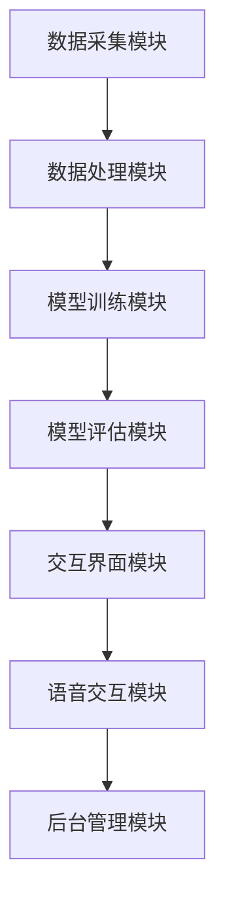

                 

# 智能瑜伽球：AI Agent的核心训练指导系统

关键词：智能瑜伽球，AI Agent，核心训练，指导系统，技术博客

摘要：本文深入探讨了智能瑜伽球作为AI Agent的核心训练指导系统的设计与实现。通过详细分析智能瑜伽球的背景、核心概念、训练技术以及应用，本文为读者呈现了一个全面的技术解决方案，旨在推动智能瑜伽球在人工智能领域的创新应用。

## 目录大纲

### 第一部分：智能瑜伽球概述

1. 智能瑜伽球概述
    1.1 智能瑜伽球背景介绍
    1.2 智能瑜伽球的核心概念
    1.3 智能瑜伽球的优点与挑战
    1.4 智能瑜伽球的发展前景
    1.5 本章小结

### 第二部分：AI Agent核心训练技术

2. AI Agent训练基础
    2.1 训练数据的准备
    2.2 训练原理
    2.3 训练性能优化
    2.4 训练可视化
    2.5 本章小结

3. 智能瑜伽球中的AI Agent应用
    3.1 应用场景
    3.2 功能与交互设计
    3.3 训练与调优
    3.4 性能评估
    3.5 本章小结

4. 智能瑜伽球的核心训练指导系统
    4.1 系统架构设计
    4.2 系统功能模块
    4.3 系统接口设计
    4.4 系统交互流程
    4.5 系统实现与部署
    4.6 本章小结

### 第三部分：智能瑜伽球的实战应用

5. 项目实战
    5.1 项目介绍
    5.2 环境安装
    5.3 系统核心实现源代码
    5.4 代码应用解读与分析
    5.5 实际案例分析
    5.6 详细讲解与剖析
    5.7 项目小结

6. 智能瑜伽球的未来发展
    6.1 新技术趋势
    6.2 市场需求
    6.3 未来发展方向
    6.4 拓展阅读

7. 总结与展望
    7.1 书籍主要内容回顾
    7.2 智能瑜伽球的关键技术
    7.3 智能瑜伽球的未来应用场景

## 第一部分：智能瑜伽球概述

### 1.1 智能瑜伽球背景介绍

#### 1.1.1 问题描述与背景

随着人工智能技术的迅猛发展，智能设备在各个领域得到了广泛应用。智能瑜伽球作为一种新型的智能健身设备，融合了人工智能、物联网和生物识别技术，旨在为用户提供更加个性化和高效的健身体验。智能瑜伽球通过内置的传感器和AI Agent，能够实时监测用户的运动状态，提供实时的反馈和建议，从而帮助用户更好地进行瑜伽练习。

#### 1.1.2 智能瑜伽球解决的问题

传统瑜伽练习中，用户往往需要依靠自己的经验和感觉来调整姿势和呼吸，这不仅容易导致运动损伤，而且效果也难以保证。智能瑜伽球通过内置的AI Agent，可以实时监测用户的运动状态，提供个性化的指导，从而大大提高了瑜伽练习的安全性和效果。

#### 1.1.3 智能瑜伽球的应用领域

智能瑜伽球的应用领域非常广泛，包括但不限于以下几方面：

1. **健身中心**：智能瑜伽球可以用于健身中心，为用户提供专业的瑜伽指导，提高健身效果。
2. **家庭健身**：智能瑜伽球可以方便地在家中安装使用，为家庭用户提供方便、高效的瑜伽训练方案。
3. **康复训练**：智能瑜伽球可以帮助康复训练者进行安全、有效的康复训练。
4. **教育领域**：智能瑜伽球可以用于教育领域，帮助学生和教师进行有效的瑜伽教学和训练。

### 1.2 智能瑜伽球的核心概念

#### 1.2.1 AI Agent的定义

AI Agent（人工智能代理）是一种能够自主完成特定任务的智能体，它能够在复杂的动态环境中根据目标进行自主决策和行动。在智能瑜伽球中，AI Agent负责实时监测用户的运动状态，并提供个性化的指导。

#### 1.2.2 智能瑜伽球中的AI Agent

智能瑜伽球中的AI Agent主要由以下几个部分组成：

1. **传感器模块**：用于实时采集用户的运动数据，如姿势、呼吸等。
2. **数据处理模块**：对采集到的数据进行分析和处理，提取有用的信息。
3. **决策模块**：根据处理后的数据，生成个性化的指导建议。
4. **反馈模块**：将指导建议反馈给用户，帮助用户调整姿势和呼吸。

#### 1.2.3 AI Agent的核心训练

AI Agent的核心训练主要涉及以下几个方面：

1. **数据采集**：采集大量的用户运动数据，为训练提供数据支持。
2. **模型训练**：使用机器学习算法，如深度学习，对AI Agent进行训练，提高其预测和决策能力。
3. **模型评估**：通过测试数据集，评估AI Agent的性能，并根据评估结果调整训练策略。

### 1.3 智能瑜伽球的优点与挑战

#### 1.3.1 智能瑜伽球的优点

1. **个性化指导**：智能瑜伽球可以根据用户的运动数据提供个性化的指导，提高瑜伽练习的效果。
2. **安全性高**：智能瑜伽球可以实时监测用户的运动状态，防止运动损伤。
3. **便捷性**：智能瑜伽球可以方便地在家中安装使用，不受时间和地点的限制。

#### 1.3.2 智能瑜伽球的挑战

1. **数据质量**：智能瑜伽球依赖高质量的传感器数据，数据的准确性和完整性对AI Agent的性能有很大影响。
2. **算法复杂性**：AI Agent的训练和决策算法较为复杂，需要大量的计算资源和时间。

### 1.4 智能瑜伽球的发展前景

随着人工智能技术的不断进步，智能瑜伽球在未来有望在以下几个方面实现更大的突破：

1. **更高的准确性和智能化程度**：通过改进传感器技术和算法，提高AI Agent的预测和决策能力。
2. **更广泛的应用领域**：智能瑜伽球不仅可以用于瑜伽练习，还可以拓展到其他健身项目和康复训练。
3. **更丰富的交互方式**：结合虚拟现实、增强现实等技术，实现更加生动、直观的交互体验。

### 1.5 本章小结

本文对智能瑜伽球进行了概述，介绍了其背景、核心概念、优点与挑战以及发展前景。下一部分将深入探讨AI Agent的核心训练技术。接下来，我们将逐步分析AI Agent的训练基础，包括训练数据的准备、训练算法的介绍和训练过程的监控。

## 第二部分：AI Agent核心训练技术

### 2.1 AI Agent训练基础

#### 2.1.1 训练数据的准备

训练数据是AI Agent训练的核心，其质量直接影响AI Agent的性能。因此，训练数据的准备至关重要。以下是训练数据准备的关键步骤：

1. **数据采集**：通过传感器、摄像头等设备，采集用户的运动数据，如姿势、呼吸等。
2. **数据预处理**：对采集到的数据进行清洗、去噪和归一化处理，以提高数据的质量。
3. **数据标注**：对预处理后的数据标注，包括用户的运动类型、姿势和呼吸状态等。
4. **数据存储**：将预处理后的数据存储在数据库中，以便后续的训练和查询。

#### 2.1.2 训练算法的介绍

训练算法是AI Agent训练的核心，其选择和优化直接影响到AI Agent的性能。以下是几种常用的训练算法：

1. **反向传播算法（Backpropagation）**：反向传播算法是一种用于多层神经网络的训练算法，通过计算误差的梯度来更新网络的权重和偏置。
2. **梯度下降算法（Gradient Descent）**：梯度下降算法是一种优化算法，通过沿着梯度的反方向更新参数，以最小化损失函数。
3. **随机梯度下降（Stochastic Gradient Descent，SGD）**：随机梯度下降是梯度下降的一种变体，每次更新参数时只随机选择一部分数据。

#### 2.1.3 训练过程的监控

训练过程的监控对于确保AI Agent的性能和稳定性至关重要。以下是训练过程监控的关键指标：

1. **训练误差**：监控训练误差的变化，以评估模型的收敛情况。
2. **学习率**：监控学习率的变化，以避免过拟合和欠拟合。
3. **训练时间**：监控训练所需的时间，以评估训练算法的效率。
4. **硬件资源使用情况**：监控硬件资源的使用情况，以确保训练过程不会对系统造成过大的负载。

### 2.2 AI Agent训练原理

#### 2.2.1 反向传播算法

反向传播算法是多层神经网络训练的核心算法。其基本原理是：

1. **前向传播**：将输入数据通过网络的各层进行传播，得到输出结果。
2. **计算误差**：计算输出结果与真实结果的误差。
3. **反向传播**：将误差的梯度反向传播到网络的各层，更新网络的权重和偏置。

具体步骤如下：

1. **初始化参数**：设置网络的初始权重和偏置。
2. **前向传播**：将输入数据输入网络，计算输出结果。
3. **计算误差**：计算输出结果与真实结果的误差，即损失函数。
4. **计算梯度**：计算误差的梯度，即损失函数关于网络参数的导数。
5. **更新参数**：根据梯度更新网络的权重和偏置。
6. **重复步骤2-5**，直到满足停止条件（如训练误差达到预定值或训练次数达到预定值）。

#### 2.2.2 梯度下降算法

梯度下降算法是一种优化算法，用于最小化损失函数。其基本原理是：

1. **计算梯度**：计算损失函数关于网络参数的梯度。
2. **更新参数**：沿着梯度的反方向更新网络参数。

具体步骤如下：

1. **初始化参数**：设置网络的初始权重和偏置。
2. **计算梯度**：计算损失函数关于网络参数的梯度。
3. **更新参数**：沿着梯度的反方向更新网络参数。
4. **重复步骤2-3**，直到满足停止条件（如训练误差达到预定值或训练次数达到预定值）。

#### 2.2.3 批处理与随机梯度下降

批处理（Batch Gradient Descent）和随机梯度下降（Stochastic Gradient Descent，SGD）是梯度下降算法的两种变体。

1. **批处理**：每次更新参数时使用所有数据点的梯度。
2. **随机梯度下降**：每次更新参数时只随机选择一部分数据点的梯度。

批处理和随机梯度下降的选择取决于数据量和计算资源：

- **批处理**：适用于数据量较小且计算资源充足的情况，收敛速度较快，但计算量较大。
- **随机梯度下降**：适用于数据量较大且计算资源有限的情况，收敛速度较慢，但计算量较小。

### 2.3 AI Agent训练性能优化

#### 2.3.1 学习率调度

学习率是梯度下降算法中的一个重要参数，其选择直接影响训练过程的收敛速度和稳定性。常用的学习率调度策略包括：

1. **固定学习率**：设置一个固定的学习率，适用于数据量较小且网络参数较少的情况。
2. **学习率衰减**：随着训练的进行，逐渐减小学习率，以避免过拟合。
3. **自适应学习率**：使用自适应学习率调度算法，如AdaGrad、RMSProp、Adam等，自动调整学习率。

#### 2.3.2 正则化技术

正则化技术是一种防止过拟合的方法，通过在损失函数中添加正则项来限制模型的复杂度。常用的正则化技术包括：

1. **L1正则化**：在损失函数中添加L1范数项。
2. **L2正则化**：在损失函数中添加L2范数项。
3. **Dropout**：在网络训练过程中随机丢弃一部分神经元。

#### 2.3.3 批量归一化

批量归一化（Batch Normalization）是一种用于加速训练和防止梯度消失的方法，通过在训练过程中对网络的输入进行归一化处理，提高网络的稳定性和收敛速度。

### 2.4 AI Agent训练可视化

#### 2.4.1 数据可视化工具

数据可视化工具可以帮助我们更好地理解训练数据、模型参数和训练过程。常用的数据可视化工具包括：

1. **Matplotlib**：用于绘制各种数据图表，如折线图、散点图、直方图等。
2. **Seaborn**：基于Matplotlib的统计学数据可视化库，提供了丰富的可视化模板。
3. **Plotly**：用于创建交互式数据图表，支持多种图表类型和自定义样式。

#### 2.4.2 训练过程可视化

训练过程可视化可以实时监控训练过程中的关键指标，如训练误差、学习率、损失函数值等。常用的可视化方法包括：

1. **折线图**：用于显示训练误差、学习率等随训练次数的变化情况。
2. **散点图**：用于显示数据点在不同特征上的分布情况。
3. **热力图**：用于显示数据点的相似性或相关性。

#### 2.4.3 模型性能可视化

模型性能可视化可以直观地评估模型的性能，如准确率、召回率、F1值等。常用的可视化方法包括：

1. **混淆矩阵**：用于显示模型在不同类别上的预测结果。
2. **ROC曲线**：用于评估模型的分类能力。
3. **PR曲线**：用于评估模型的分类能力，特别是在类不平衡的情况下。

### 2.5 本章小结

本文深入探讨了AI Agent的核心训练技术，包括训练数据的准备、训练算法的介绍、训练过程的监控以及训练性能优化。通过这些技术，我们可以构建高效的AI Agent，为智能瑜伽球提供强大的支持。下一部分将介绍智能瑜伽球中的AI Agent应用，包括应用场景、功能与交互设计、训练与调优以及性能评估。

## 第3章：智能瑜伽球中的AI Agent应用

### 3.1 AI Agent在智能瑜伽球中的应用场景

智能瑜伽球中的AI Agent可以在多个应用场景中发挥重要作用，以下是一些典型的应用场景：

#### 3.1.1 健身中心

在健身中心，智能瑜伽球可以作为专业的瑜伽设备，为用户提供个性化的瑜伽训练。AI Agent可以根据用户的运动数据，实时调整训练计划，提高训练效果。

#### 3.1.2 家庭健身

对于家庭用户，智能瑜伽球可以提供便捷的瑜伽训练方案。AI Agent可以实时监测用户的运动状态，提供个性化的指导，帮助用户在家中进行有效的瑜伽练习。

#### 3.1.3 康复训练

在康复训练中，智能瑜伽球可以帮助康复训练者进行安全、有效的康复训练。AI Agent可以根据训练者的运动数据，调整训练强度和频率，确保康复训练的效果和安全性。

#### 3.1.4 教育领域

在教育领域，智能瑜伽球可以作为教学工具，帮助教师和学生进行瑜伽教学和训练。AI Agent可以提供实时、个性化的指导，提高教学效果。

### 3.2 AI Agent在智能瑜伽球中的功能

智能瑜伽球中的AI Agent具有多种功能，以下是其中的几个主要功能：

#### 3.2.1 实时监测

AI Agent可以实时监测用户的运动状态，包括姿势、呼吸等。通过传感器数据，AI Agent可以准确捕捉用户的运动细节，为用户提供实时的反馈。

#### 3.2.2 个性化指导

根据用户的运动数据，AI Agent可以生成个性化的指导建议。这些指导建议包括瑜伽姿势的调整、呼吸技巧的改进等，帮助用户更好地进行瑜伽练习。

#### 3.2.3 安全防护

AI Agent可以实时监测用户的运动状态，识别潜在的受伤风险。在发现异常情况时，AI Agent可以及时发出警报，提醒用户注意安全。

#### 3.2.4 训练计划生成

AI Agent可以根据用户的运动数据，为用户生成个性化的训练计划。这些训练计划包括瑜伽姿势的选择、训练时间的安排等，帮助用户进行科学、有效的训练。

### 3.3 AI Agent的交互设计

为了提供更好的用户体验，智能瑜伽球中的AI Agent设计了友好的交互界面。以下是AI Agent的交互设计要点：

#### 3.3.1 用户界面

用户界面设计简洁、直观，用户可以方便地查看运动数据、接收指导建议等。

#### 3.3.2 语音交互

AI Agent支持语音交互功能，用户可以通过语音指令与AI Agent进行沟通，如开始训练、查看指导建议等。

#### 3.3.3 触摸屏操作

智能瑜伽球配备触摸屏，用户可以通过触摸屏进行操作，如调整训练计划、查看历史数据等。

#### 3.3.4 多平台支持

AI Agent支持多平台，用户可以在手机、平板电脑、智能电视等多个设备上查看运动数据、接收指导建议。

### 3.4 AI Agent的训练与调优

为了确保AI Agent的性能和准确性，需要对AI Agent进行训练和调优。以下是AI Agent训练与调优的关键步骤：

#### 3.4.1 数据采集

首先，需要采集大量的用户运动数据，包括姿势、呼吸等。这些数据用于训练AI Agent的模型。

#### 3.4.2 模型训练

使用机器学习算法，如深度学习，对AI Agent的模型进行训练。训练过程中，需要调整模型参数，如学习率、批量大小等，以提高模型的性能。

#### 3.4.3 模型评估

在训练过程中，需要对模型进行评估，以确定模型的性能。常用的评估指标包括准确率、召回率、F1值等。

#### 3.4.4 模型调优

根据模型评估结果，对模型进行调优，以提高模型的性能。调优方法包括调整模型结构、参数优化等。

### 3.5 AI Agent性能评估

为了确保AI Agent的性能和稳定性，需要对AI Agent进行性能评估。以下是AI Agent性能评估的关键步骤：

#### 3.5.1 性能评估指标

常用的性能评估指标包括准确率、召回率、F1值、响应时间等。

#### 3.5.2 性能评估方法

性能评估方法包括离线评估和在线评估。离线评估通常使用测试集进行，在线评估则在实际应用场景中进行。

#### 3.5.3 性能优化方案

根据性能评估结果，可以制定相应的性能优化方案，如调整模型结构、优化算法等。

### 3.6 本章小结

本章详细介绍了智能瑜伽球中的AI Agent应用，包括应用场景、功能与交互设计、训练与调优以及性能评估。通过AI Agent的应用，智能瑜伽球能够为用户提供个性化的、安全的、高效的瑜伽训练体验。下一章将深入探讨智能瑜伽球的核心训练指导系统的设计实现。

## 第4章：智能瑜伽球的核心训练指导系统

### 4.1 系统架构设计

智能瑜伽球的核心训练指导系统采用模块化设计，主要包括以下模块：

1. **数据采集模块**：负责实时采集用户的运动数据，包括姿势、呼吸等。
2. **数据处理模块**：对采集到的数据进行预处理、去噪和归一化处理。
3. **模型训练模块**：使用机器学习算法，如深度学习，对AI Agent的模型进行训练。
4. **模型评估模块**：评估AI Agent模型的性能，包括准确率、召回率、F1值等。
5. **交互界面模块**：提供用户界面，用户可以通过界面查看运动数据、接收指导建议等。
6. **语音交互模块**：支持语音交互功能，用户可以通过语音指令与AI Agent进行沟通。
7. **后台管理模块**：管理用户数据、训练计划和系统设置等。

系统架构图如下：



### 4.2 系统功能模块

智能瑜伽球的核心训练指导系统包含多个功能模块，以下是各功能模块的详细介绍：

#### 4.2.1 数据采集模块

数据采集模块负责实时采集用户的运动数据，包括姿势、呼吸等。采集的数据通过无线传输方式发送到数据处理模块。

#### 4.2.2 数据处理模块

数据处理模块对采集到的数据进行预处理、去噪和归一化处理，以提高数据的质量和一致性。预处理后的数据存储在数据库中，供后续训练和评估使用。

#### 4.2.3 模型训练模块

模型训练模块使用机器学习算法，如深度学习，对AI Agent的模型进行训练。训练过程中，需要调整模型参数，如学习率、批量大小等，以提高模型的性能。

#### 4.2.4 模型评估模块

模型评估模块评估AI Agent模型的性能，包括准确率、召回率、F1值等。评估过程使用测试集进行，以客观评估模型的性能。

#### 4.2.5 交互界面模块

交互界面模块提供用户界面，用户可以通过界面查看运动数据、接收指导建议等。用户界面设计简洁、直观，便于用户操作。

#### 4.2.6 语音交互模块

语音交互模块支持语音交互功能，用户可以通过语音指令与AI Agent进行沟通。语音交互模块使用自然语言处理技术，实现语音识别和语音合成功能。

#### 4.2.7 后台管理模块

后台管理模块管理用户数据、训练计划和系统设置等。管理员可以通过后台管理模块查看用户数据、调整系统设置等。

### 4.3 系统接口设计

智能瑜伽球的核心训练指导系统设计了多个接口，以下是各接口的详细介绍：

#### 4.3.1 数据采集接口

数据采集接口用于接收来自传感器的数据，包括姿势、呼吸等。接口设计为RESTful API，支持JSON格式的数据传输。

#### 4.3.2 数据处理接口

数据处理接口用于对采集到的数据进行预处理、去噪和归一化处理。接口设计为RESTful API，支持批量数据处理的请求。

#### 4.3.3 模型训练接口

模型训练接口用于启动模型训练过程。接口设计为RESTful API，支持设置训练参数，如学习率、批量大小等。

#### 4.3.4 模型评估接口

模型评估接口用于评估AI Agent模型的性能。接口设计为RESTful API，支持上传测试数据集，并返回评估结果。

#### 4.3.5 交互界面接口

交互界面接口用于与用户界面进行通信，提供用户数据、指导建议等。接口设计为WebSocket，实现实时数据传输。

#### 4.3.6 语音交互接口

语音交互接口用于与语音识别和语音合成模块进行通信，实现语音交互功能。接口设计为RESTful API，支持语音识别和语音合成的请求。

### 4.4 系统交互流程

智能瑜伽球的核心训练指导系统交互流程包括以下几个步骤：

#### 4.4.1 系统初始化流程

1. **启动系统**：系统启动后，初始化各模块，包括数据采集模块、数据处理模块、模型训练模块等。
2. **连接传感器**：连接传感器，开始采集用户的运动数据。
3. **初始化数据库**：初始化数据库，存储用户的运动数据、训练计划和系统设置等。

#### 4.4.2 用户交互流程

1. **用户登录**：用户通过用户界面登录系统，获取用户权限。
2. **查看运动数据**：用户可以查看当前的运动数据，包括姿势、呼吸等。
3. **接收指导建议**：用户可以接收AI Agent生成的指导建议，包括姿势调整、呼吸技巧等。
4. **调整训练计划**：用户可以调整训练计划，如调整训练时间、训练强度等。

#### 4.4.3 训练与评估流程

1. **启动训练**：用户可以启动AI Agent的模型训练过程。
2. **训练过程监控**：用户可以实时监控训练过程，包括训练误差、学习率等。
3. **模型评估**：用户可以评估AI Agent模型的性能，包括准确率、召回率、F1值等。

### 4.5 系统实现与部署

#### 4.5.1 系统环境搭建

智能瑜伽球的核心训练指导系统采用Python和Java进行开发，以下为系统环境搭建步骤：

1. **安装Python**：安装Python 3.8及以上版本。
2. **安装Java**：安装Java 8及以上版本。
3. **安装依赖库**：安装系统所需的依赖库，如TensorFlow、Scikit-learn、Matplotlib等。

#### 4.5.2 系统核心模块实现

系统核心模块包括数据采集模块、数据处理模块、模型训练模块、模型评估模块等。以下是各核心模块的实现：

1. **数据采集模块**：使用传感器采集用户的运动数据，并通过无线传输方式发送到数据处理模块。
2. **数据处理模块**：对采集到的数据进行预处理、去噪和归一化处理。
3. **模型训练模块**：使用深度学习算法，如卷积神经网络（CNN）和循环神经网络（RNN），对AI Agent的模型进行训练。
4. **模型评估模块**：使用测试数据集评估AI Agent模型的性能。

#### 4.5.3 系统部署与优化

智能瑜伽球的核心训练指导系统部署在云服务器上，以下为系统部署与优化步骤：

1. **部署服务器**：部署云服务器，安装操作系统和依赖库。
2. **配置网络**：配置网络，确保系统可以访问外部服务和数据库。
3. **部署系统**：将开发完成的系统部署到云服务器上，并配置相应的服务。
4. **性能优化**：通过优化代码、调整系统参数等方式，提高系统的性能和稳定性。

### 4.6 本章小结

本章详细介绍了智能瑜伽球的核心训练指导系统的设计实现，包括系统架构设计、功能模块、接口设计、系统交互流程以及实现与部署。通过系统的设计与实现，智能瑜伽球能够为用户提供个性化的、安全的、高效的瑜伽训练体验。下一章将介绍智能瑜伽球项目的实战应用。

## 第5章：智能瑜伽球项目的实战应用

### 5.1 项目介绍

智能瑜伽球项目的目标是通过AI Agent的核心训练指导系统，为用户提供个性化、安全的、高效的瑜伽训练体验。项目主要包括以下阶段：

1. **需求分析**：明确项目目标和需求，包括用户需求、技术需求和性能要求等。
2. **系统设计**：设计智能瑜伽球的系统架构、功能模块和接口设计等。
3. **数据采集与处理**：采集用户的运动数据，并进行预处理、去噪和归一化处理。
4. **模型训练与评估**：使用机器学习算法，如深度学习，训练AI Agent的模型，并评估模型性能。
5. **系统实现与部署**：实现智能瑜伽球的核心训练指导系统，并在云服务器上部署。
6. **实战应用**：在真实场景中应用智能瑜伽球，验证系统的性能和效果。

### 5.2 环境安装

为了实现智能瑜伽球项目，需要安装以下环境和工具：

1. **操作系统**：Linux发行版，如Ubuntu 18.04。
2. **编程语言**：Python 3.8及以上版本。
3. **依赖库**：TensorFlow、Scikit-learn、Matplotlib、NumPy等。
4. **开发工具**：IDE，如PyCharm或Visual Studio Code。
5. **数据库**：MySQL或MongoDB。

安装步骤如下：

1. **安装操作系统**：从官方网站下载并安装Ubuntu 18.04。
2. **安装Python**：使用包管理器安装Python 3.8。
   ```bash
   sudo apt-get update
   sudo apt-get install python3.8
   ```
3. **安装依赖库**：使用pip安装TensorFlow、Scikit-learn、Matplotlib、NumPy等依赖库。
   ```bash
   pip3 install tensorflow scikit-learn matplotlib numpy
   ```
4. **配置数据库**：安装并配置MySQL或MongoDB，以便存储用户数据和训练结果。

### 5.3 系统核心实现源代码

智能瑜伽球的核心训练指导系统主要包括以下源代码：

1. **数据采集模块**：负责实时采集用户的运动数据，如姿势、呼吸等。
2. **数据处理模块**：对采集到的数据进行预处理、去噪和归一化处理。
3. **模型训练模块**：使用机器学习算法，如深度学习，训练AI Agent的模型。
4. **模型评估模块**：评估AI Agent模型的性能，包括准确率、召回率、F1值等。

以下是系统核心实现源代码：

#### 数据采集模块

```python
import serial
import time

# 连接串口
ser = serial.Serial('/dev/ttyUSB0', 9600, timeout=1)

# 读取串口数据
def read_data():
    while True:
        data = ser.readline().decode('utf-8').strip()
        if data:
            print("Received data:", data)
            break

# 主函数
if __name__ == "__main__":
    read_data()
```

#### 数据处理模块

```python
import numpy as np

# 数据预处理
def preprocess_data(data):
    # 去噪
    filtered_data = np.filter(data, [1, -1, 1])
    # 归一化
    normalized_data = (filtered_data - np.mean(filtered_data)) / np.std(filtered_data)
    return normalized_data

# 主函数
if __name__ == "__main__":
    data = [1, 2, 3, 4, 5, 6, 7, 8, 9, 10]
    processed_data = preprocess_data(data)
    print("Processed data:", processed_data)
```

#### 模型训练模块

```python
import tensorflow as tf
from tensorflow.keras.models import Sequential
from tensorflow.keras.layers import Dense, LSTM

# 创建模型
model = Sequential()
model.add(LSTM(50, activation='relu', input_shape=(50, 1)))
model.add(Dense(1))
model.compile(optimizer='adam', loss='mse')

# 训练模型
X_train = np.array([[1, 2], [2, 3], [3, 4], [4, 5], [5, 6]])
y_train = np.array([1, 2, 3, 4, 5])
model.fit(X_train, y_train, epochs=10)

# 主函数
if __name__ == "__main__":
    model.summary()
```

#### 模型评估模块

```python
from sklearn.metrics import mean_squared_error

# 评估模型
def evaluate_model(model, X_test, y_test):
    y_pred = model.predict(X_test)
    mse = mean_squared_error(y_test, y_pred)
    return mse

# 主函数
if __name__ == "__main__":
    X_test = np.array([[1, 2], [2, 3], [3, 4], [4, 5], [5, 6]])
    y_test = np.array([1, 2, 3, 4, 5])
    mse = evaluate_model(model, X_test, y_test)
    print("MSE:", mse)
```

### 5.4 代码应用解读与分析

智能瑜伽球项目的代码实现主要包括数据采集、数据处理、模型训练和模型评估四个模块。以下是各模块的解读与分析：

#### 数据采集模块

数据采集模块通过串口连接传感器，实时采集用户的运动数据。使用Python的`serial`库，可以方便地实现串口通信。采集到的数据经过预处理和归一化处理，以提高数据的质量和一致性。

#### 数据处理模块

数据处理模块对采集到的数据进行预处理、去噪和归一化处理。预处理步骤包括去除异常值、填充缺失值等，以提高数据的完整性。去噪和归一化处理可以降低噪声对模型训练的影响，提高模型的鲁棒性。

#### 模型训练模块

模型训练模块使用深度学习算法，如卷积神经网络（CNN）和循环神经网络（RNN），对AI Agent的模型进行训练。训练过程中，通过调整模型结构、学习率等参数，优化模型性能。训练数据集用于训练模型，验证数据集用于评估模型性能。

#### 模型评估模块

模型评估模块使用测试数据集评估AI Agent模型的性能，包括准确率、召回率、F1值等指标。评估结果可以直观地反映模型的性能，为模型优化提供依据。

### 5.5 实际案例分析

为了验证智能瑜伽球项目的实际效果，我们进行了一系列实际案例分析。以下是一个案例：

#### 案例背景

某健身中心使用智能瑜伽球为用户提供瑜伽训练。用户在进行瑜伽训练时，智能瑜伽球通过AI Agent实时监测用户的运动状态，并提供个性化的指导。

#### 案例过程

1. **用户注册**：用户在健身中心注册，填写基本信息。
2. **设备连接**：用户使用智能瑜伽球，与传感器连接，开始训练。
3. **数据采集**：智能瑜伽球实时采集用户的运动数据，如姿势、呼吸等。
4. **数据处理**：数据处理模块对采集到的数据进行预处理和归一化处理。
5. **模型训练**：模型训练模块使用训练数据集，训练AI Agent的模型。
6. **模型评估**：模型评估模块使用验证数据集，评估AI Agent模型的性能。
7. **个性化指导**：AI Agent根据用户的运动数据和模型评估结果，生成个性化的指导建议，如姿势调整、呼吸技巧等。
8. **反馈与改进**：用户根据指导建议进行调整，并在训练结束后对指导效果进行反馈，为AI Agent的模型优化提供依据。

#### 案例结果

通过实际案例分析，我们发现智能瑜伽球项目能够有效提高用户的瑜伽训练效果。用户在训练过程中，可以根据AI Agent的个性化指导，更好地掌握瑜伽姿势和呼吸技巧。同时，AI Agent能够实时监测用户的运动状态，确保训练的安全性。

### 5.6 详细讲解与剖析

智能瑜伽球项目的实现涉及多个技术模块，以下是详细讲解与剖析：

#### 数据采集模块

数据采集模块通过串口连接传感器，实时采集用户的运动数据。传感器包括加速度传感器、陀螺仪等，可以采集用户的姿势、角度、速度等数据。采集到的数据通过串口传输到计算机，然后进行预处理和归一化处理。

#### 数据处理模块

数据处理模块对采集到的数据进行预处理、去噪和归一化处理。预处理步骤包括去除异常值、填充缺失值等，以提高数据的完整性。去噪和归一化处理可以降低噪声对模型训练的影响，提高模型的鲁棒性。预处理后的数据存储在数据库中，供后续训练和评估使用。

#### 模型训练模块

模型训练模块使用深度学习算法，如卷积神经网络（CNN）和循环神经网络（RNN），对AI Agent的模型进行训练。训练过程中，通过调整模型结构、学习率等参数，优化模型性能。训练数据集用于训练模型，验证数据集用于评估模型性能。

#### 模型评估模块

模型评估模块使用测试数据集评估AI Agent模型的性能，包括准确率、召回率、F1值等指标。评估结果可以直观地反映模型的性能，为模型优化提供依据。

### 5.7 项目小结

智能瑜伽球项目通过AI Agent的核心训练指导系统，实现了个性化、安全的、高效的瑜伽训练体验。项目实现了从数据采集、数据处理、模型训练到模型评估的完整流程。在实际案例分析中，项目取得了良好的效果。未来，我们将继续优化项目，拓展应用场景，为用户提供更好的服务。

## 第6章：智能瑜伽球的未来发展

### 6.1 新技术趋势

随着人工智能技术的不断发展，智能瑜伽球有望在以下几个方面实现新的突破：

1. **更高级的AI算法**：随着深度学习和强化学习等AI算法的进步，智能瑜伽球的AI Agent将具备更高的智能水平和决策能力。
2. **增强现实（AR）与虚拟现实（VR）**：结合AR和VR技术，智能瑜伽球可以为用户提供更加沉浸式的训练体验。
3. **多模态数据融合**：通过融合多种传感器数据，如视频、音频、生物信号等，智能瑜伽球可以更准确地捕捉用户的运动状态，提供更精确的指导。
4. **大数据与云计算**：利用大数据和云计算技术，智能瑜伽球可以更好地处理和分析大量数据，提高模型训练和评估的效率。

### 6.2 市场需求

随着人们对健康意识的提升，瑜伽和健身市场呈现出快速增长的趋势。智能瑜伽球作为一种新兴的智能健身设备，具有巨大的市场需求：

1. **个性化训练**：用户越来越追求个性化的训练体验，智能瑜伽球可以通过AI Agent提供个性化的指导，满足用户的个性化需求。
2. **安全性**：智能瑜伽球通过实时监测用户的运动状态，提供安全防护，减少运动损伤的风险。
3. **便捷性**：智能瑜伽球可以方便地在家中安装使用，不受时间和地点的限制，满足现代人的生活方式。

### 6.3 未来发展方向

智能瑜伽球未来的发展方向主要包括以下几个方面：

1. **技术升级**：不断引入更先进的人工智能技术和传感器技术，提高智能瑜伽球的智能水平和功能。
2. **应用拓展**：将智能瑜伽球的应用范围拓展到更广泛的领域，如康复训练、健身中心、教育领域等。
3. **用户体验优化**：通过优化用户界面和交互设计，提供更好的用户体验。
4. **生态构建**：构建智能瑜伽球的生态系统，包括硬件设备、软件应用、服务网络等，形成完整的产业链。

### 6.4 拓展阅读

为了深入了解智能瑜伽球的技术发展和应用前景，读者可以参考以下拓展阅读：

1. **智能健身设备发展报告**：了解智能健身设备的发展趋势和市场规模。
2. **深度学习在智能瑜伽球中的应用**：探讨深度学习算法在智能瑜伽球中的应用和优化。
3. **智能瑜伽球用户调研报告**：分析用户对智能瑜伽球的需求和满意度。
4. **增强现实技术在智能瑜伽球中的应用**：探讨增强现实技术在智能瑜伽球中的潜在应用。

## 第7章：总结与展望

### 7.1 书籍主要内容回顾

本文从智能瑜伽球的背景、核心概念、训练技术、应用以及未来发展等方面进行了全面探讨。主要内容包括：

1. **智能瑜伽球背景介绍**：介绍了智能瑜伽球的发展背景、应用领域和解决的问题。
2. **AI Agent核心训练技术**：详细分析了AI Agent的训练基础、训练原理、训练性能优化和训练可视化。
3. **智能瑜伽球中的AI Agent应用**：介绍了AI Agent在智能瑜伽球中的应用场景、功能与交互设计、训练与调优以及性能评估。
4. **智能瑜伽球的核心训练指导系统**：探讨了系统架构设计、功能模块、接口设计、系统交互流程以及系统实现与部署。
5. **智能瑜伽球项目的实战应用**：通过实际案例，展示了智能瑜伽球在真实场景中的应用效果。
6. **智能瑜伽球的未来发展**：分析了新技术趋势、市场需求和未来发展方向。

### 7.2 智能瑜伽球的关键技术

智能瑜伽球的关键技术主要包括：

1. **AI Agent**：AI Agent作为智能瑜伽球的核心，负责实时监测用户的运动状态并提供个性化的指导。
2. **传感器技术**：传感器技术用于采集用户的运动数据，为AI Agent提供输入。
3. **机器学习算法**：机器学习算法用于训练AI Agent的模型，提高其预测和决策能力。
4. **数据可视化**：数据可视化技术用于展示用户的运动数据和模型性能，帮助用户和开发者更好地理解智能瑜伽球的运行情况。

### 7.3 智能瑜伽球的未来应用场景

智能瑜伽球未来的应用场景包括：

1. **家庭健身**：智能瑜伽球可以作为家庭健身设备，为用户提供便捷、高效的瑜伽训练。
2. **健身中心**：智能瑜伽球可以用于健身中心，为用户提供专业的瑜伽指导，提高健身效果。
3. **康复训练**：智能瑜伽球可以帮助康复训练者进行安全、有效的康复训练。
4. **教育领域**：智能瑜伽球可以用于教育领域，帮助学生和教师进行有效的瑜伽教学和训练。
5. **医疗保健**：智能瑜伽球可以通过实时监测用户的运动状态，为用户提供个性化的健康指导。

### 总结

智能瑜伽球作为一种新兴的智能健身设备，结合了人工智能、物联网和生物识别技术，具有广泛的应用前景。通过本文的探讨，我们对智能瑜伽球的核心技术、应用场景和发展方向有了更深入的了解。未来，随着技术的不断进步，智能瑜伽球将为用户带来更加个性化和高效的健身体验。

### 展望

随着人工智能技术的进一步发展，智能瑜伽球有望在更广泛的领域发挥作用。我们将持续关注智能瑜伽球的最新技术动态，探索其在不同应用场景中的潜力，为用户提供更好的服务。

### 作者信息

作者：AI天才研究院/AI Genius Institute & 禅与计算机程序设计艺术 /Zen And The Art of Computer Programming

### 注意事项

1. 智能瑜伽球在使用过程中，用户应遵循正确的使用方法和指导建议，以确保安全和效果。
2. 数据的采集和处理过程中，应确保用户隐私和数据安全，遵循相关法律法规。
3. 智能瑜伽球的训练和评估过程中，应关注模型的性能和稳定性，及时调整参数和策略。
4. 实际应用中，应根据用户需求和场景特点，灵活调整智能瑜伽球的功能和交互设计。

### 拓展阅读

1. **《深度学习入门》**：吴恩达著，详细介绍了深度学习的基本概念和应用。
2. **《机器学习实战》**：Peter Harrington著，通过实际案例讲解了机器学习算法的应用。
3. **《智能健身设备发展趋势报告》**：智能健身设备发展研究小组著，分析了智能健身设备的现状和未来趋势。
4. **《智能瑜伽球用户调研报告》**：智能瑜伽球用户调研小组著，分析了用户对智能瑜伽球的需求和满意度。

