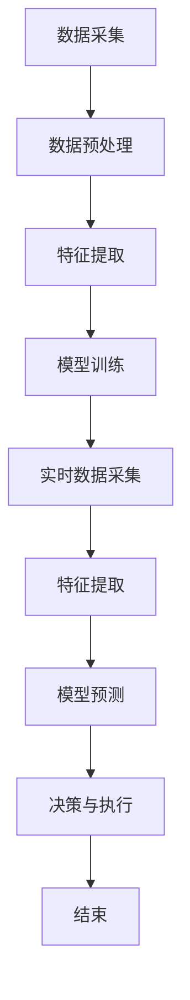
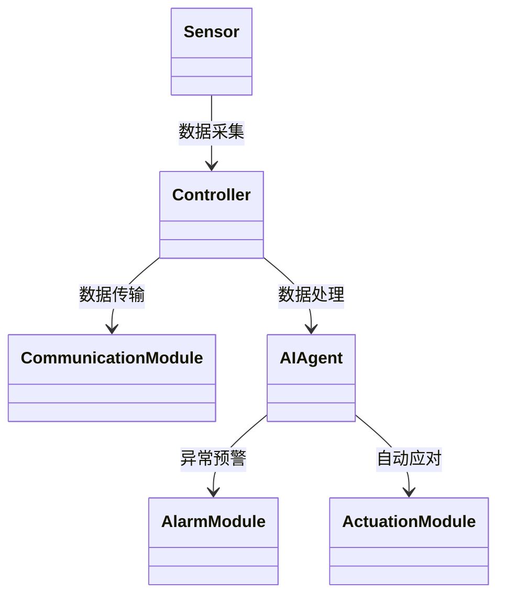
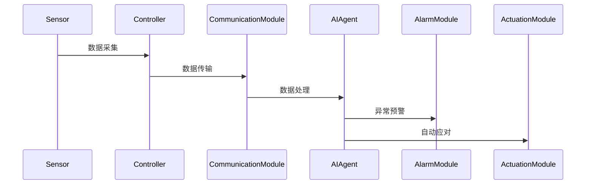

                 

# 智能瓦斯炉：AI Agent的烹饪安全监控

> 关键词：智能瓦斯炉、AI Agent、安全监控、传感器、机器学习、异常检测

> 摘要：本文深入探讨了智能瓦斯炉的背景、核心概念及其工作原理。通过分析智能瓦斯炉的硬件组成、软件架构以及AI Agent的作用，本文揭示了AI技术在瓦斯炉安全监控中的应用。文章还通过对比表格和流程图，详细介绍了智能瓦斯炉的各个组成部分及其相互关系，为读者提供了全面的技术解读。

----------------------------------------------------------------

## 第一部分：背景介绍

### 1.1 问题背景

瓦斯炉作为家庭和工业中常用的加热设备，在为人们提供温暖和便利的同时，也存在一定的安全隐患。瓦斯泄漏可能会导致爆炸、火灾等严重事故，对人身和财产安全构成威胁。因此，如何有效地监控瓦斯炉的安全运行，防止事故的发生，成为一个亟待解决的问题。

#### 1.1.1 瓦斯炉的安全隐患

瓦斯炉在工作过程中，由于管道老化、设备故障等原因，可能会发生瓦斯泄漏。如果泄漏的瓦斯浓度达到一定程度，遇到明火或者高温，就可能引发爆炸或者火灾。这类事故不仅会造成巨大的财产损失，还可能造成人员伤亡。

#### 1.1.2 传统瓦斯炉的监控局限

目前，大多数传统瓦斯炉的监控方式主要依赖于人工巡检和简易的传感器。这种方式存在以下几个问题：

1. **监控不连续**：人工巡检无法实现24小时不间断的监控，容易出现监控盲区。
2. **预警不及时**：当瓦斯浓度异常时，无法立即发出警报，导致事故发生时无法及时采取应对措施。
3. **无法实时监控**：传统传感器只能检测到部分参数，无法全面、实时地了解瓦斯炉的运行状态。

### 1.2 问题描述

为了提高瓦斯炉的安全性，我们需要一种能够实时监测瓦斯浓度、温度等关键参数，并能在异常情况下及时发出警报的监控方式。同时，这种监控方式还应该具有以下特点：

1. **自动化**：能够自动检测异常情况，无需人工干预。
2. **实时性**：能够实时监测瓦斯炉的运行状态，及时发出警报。
3. **智能性**：能够通过机器学习算法，对历史数据进行分析，提高异常检测的准确性。

### 1.3 问题解决

为了解决上述问题，我们可以引入智能瓦斯炉的概念。智能瓦斯炉通过引入AI技术，实现对瓦斯浓度、温度等关键参数的实时监测，并结合机器学习算法进行数据分析，实现异常预警和自动应对。智能瓦斯炉的核心组成部分包括硬件、软件和AI Agent。

#### 1.3.1 智能瓦斯炉的提出

智能瓦斯炉的主要特点如下：

1. **硬件组成**：包括传感器、控制器和通信模块，用于实时监测瓦斯炉的运行状态。
2. **软件组成**：包括监测算法和AI Agent程序，用于对监测数据进行分析和处理。
3. **AI Agent**：实现数据监测、异常识别和自动应对的核心部分。

#### 1.3.2 AI Agent的应用

AI Agent作为智能瓦斯炉的核心，能够根据实时监测数据，识别异常情况，并自动采取相应的应对措施，如关闭瓦斯阀门、启动灭火设备等。通过AI Agent的应用，智能瓦斯炉能够实现自动化、实时性和智能化的安全监控，大大提高了瓦斯炉的安全性能。

### 1.4 边界与外延

#### 1.4.1 边界

智能瓦斯炉主要应用于家庭和工业环境中，涉及的主要领域包括安全监控、智能家居、工业自动化等。

#### 1.4.2 外延

智能瓦斯炉的应用不仅限于家庭和工业环境，还可以拓展到公共场所、实验室等其他需要安全监控的场所。例如，在公共场所，智能瓦斯炉可以用于餐厅、酒店等场所的厨房安全监控；在实验室中，可以用于实验室气体泄漏的监控。

### 1.5 概念结构与核心要素组成

智能瓦斯炉由硬件、软件和AI Agent三部分组成。其中：

1. **硬件**：包括传感器、控制器、通信模块等，用于实时监测瓦斯炉的运行状态。
2. **软件**：包括监测算法、AI Agent程序等，用于对监测数据进行分析和处理。
3. **AI Agent**：实现数据监测、异常识别和自动应对的核心部分。

通过以上分析，我们可以看到，智能瓦斯炉通过引入AI技术，实现了对传统瓦斯炉监控方式的升级和改进，为瓦斯炉的安全运行提供了有力的保障。接下来，我们将进一步深入探讨智能瓦斯炉的硬件组成、软件架构以及AI Agent的工作原理。

----------------------------------------------------------------

## 第二部分：核心概念与联系

### 2.1 智能瓦斯炉的组成与工作原理

#### 2.1.1 硬件组成

智能瓦斯炉的硬件部分主要包括传感器、控制器和通信模块。

1. **传感器**：传感器是智能瓦斯炉的核心部件，用于检测瓦斯浓度、温度等参数。常见的传感器有瓦斯传感器、温度传感器等。传感器通过将物理信号转换为电信号，为智能瓦斯炉提供实时数据。

2. **控制器**：控制器负责接收传感器数据，并根据AI Agent的指令进行相应操作。控制器通常由微控制器或者PLC（可编程逻辑控制器）构成。控制器的主要功能包括数据采集、数据处理和指令执行。

3. **通信模块**：通信模块用于实现传感器、控制器和AI Agent之间的数据传输。常见的通信方式有有线通信（如RS-485、以太网等）和无线通信（如WiFi、ZigBee等）。

#### 2.1.2 软件组成

智能瓦斯炉的软件部分主要包括监测算法和AI Agent程序。

1. **监测算法**：监测算法用于对传感器数据进行处理和分析。常见的监测算法有阈值检测、变化率检测等。监测算法的主要目标是实时监测瓦斯炉的运行状态，发现异常情况。

2. **AI Agent程序**：AI Agent程序是智能瓦斯炉的核心，负责数据监测、异常识别和自动应对。AI Agent程序通常基于机器学习算法，通过对历史数据的学习，实现对异常情况的自动识别和应对。

#### 2.1.3 工作原理

智能瓦斯炉的工作原理如下：

1. 传感器实时监测瓦斯浓度、温度等参数，并将数据传输给控制器。
2. 控制器接收传感器数据，并将其传输给AI Agent程序。
3. AI Agent程序对传感器数据进行处理和分析，识别异常情况。
4. 当检测到异常情况时，AI Agent程序会自动采取相应的应对措施，如关闭瓦斯阀门、启动灭火设备等。

### 2.2 AI Agent的概念与原理

#### 2.2.1 概念

AI Agent，即人工智能代理，是一种基于人工智能技术的智能体。AI Agent能够自主地感知环境、做出决策并执行动作。在智能瓦斯炉中，AI Agent负责数据监测、异常识别和自动应对。

#### 2.2.2 原理

AI Agent的工作原理主要包括以下几个步骤：

1. **数据采集**：AI Agent通过传感器实时采集瓦斯浓度、温度等参数。
2. **数据处理**：AI Agent对采集到的数据进行分析和处理，提取关键特征。
3. **异常检测**：AI Agent利用机器学习算法，对处理后的数据进行分析，识别异常情况。
4. **决策与执行**：当检测到异常情况时，AI Agent会根据预设的规则，自动采取相应的应对措施。

### 2.3 智能瓦斯炉的核心概念对比表格

| 概念       | 定义                                                         | 关联关系                     |
|------------|--------------------------------------------------------------|------------------------------|
| 传感器     | 用于检测瓦斯浓度和温度的硬件设备。                             | 与AI Agent、控制器相关联。     |
| 控制器     | 接收传感器数据，并执行AI Agent指令的硬件设备。                 | 与传感器、AI Agent、通信模块相关联。 |
| 通信模块   | 用于实现传感器、控制器和AI Agent之间的通信。                   | 与传感器、控制器、AI Agent相关联。 |
| 监测算法   | 用于对传感器数据进行处理和分析的软件。                         | 与AI Agent相关联。             |
| AI Agent   | 负责数据监测、异常识别和自动应对的智能体。                     | 与传感器、控制器、监测算法相关联。 |

通过上述分析，我们可以看到，智能瓦斯炉的核心概念包括传感器、控制器、通信模块、监测算法和AI Agent。这些概念相互关联，共同构成了智能瓦斯炉的完整系统。接下来，我们将进一步探讨智能瓦斯炉的算法原理和系统架构设计。

----------------------------------------------------------------

### 2.4 算法原理讲解

为了实现智能瓦斯炉的异常检测和自动应对功能，我们需要设计一种有效的算法。本节将介绍智能瓦斯炉的核心算法原理，包括数据预处理、特征提取、模型训练和异常检测等步骤。

#### 2.4.1 数据预处理

数据预处理是算法设计的重要步骤，其目的是提高数据质量和减少噪声干扰。在智能瓦斯炉的算法中，数据预处理主要包括以下步骤：

1. **数据清洗**：去除数据中的异常值和噪声，确保数据的准确性和一致性。
2. **数据归一化**：将不同量纲的数据转换为同一量纲，便于后续处理。
3. **数据分割**：将数据集分割为训练集和测试集，用于模型的训练和评估。

#### 2.4.2 特征提取

特征提取是从原始数据中提取具有代表性的特征，用于模型的训练和预测。在智能瓦斯炉的算法中，特征提取主要包括以下步骤：

1. **时域特征提取**：提取时间序列数据中的均值、方差、变化率等特征。
2. **频域特征提取**：通过傅里叶变换等方法，提取信号的频域特征。
3. **空间特征提取**：对于多传感器数据，提取空间上的相关性特征。

#### 2.4.3 模型训练

模型训练是算法设计的关键步骤，其目的是通过学习历史数据，构建一个能够准确预测异常情况的模型。在智能瓦斯炉的算法中，模型训练通常采用以下方法：

1. **监督学习**：利用标注好的数据集，训练一个分类模型，用于识别异常情况。
2. **无监督学习**：在没有标注数据的情况下，利用聚类等方法，发现数据中的潜在模式。
3. **混合学习**：结合监督学习和无监督学习的方法，提高模型的准确性。

#### 2.4.4 异常检测

异常检测是算法的最终目标，其目的是在实时监测过程中，及时识别异常情况，并采取相应的应对措施。在智能瓦斯炉的算法中，异常检测主要包括以下步骤：

1. **实时数据采集**：通过传感器实时采集瓦斯浓度、温度等数据。
2. **特征提取**：对实时数据进行特征提取，生成特征向量。
3. **模型预测**：将特征向量输入训练好的模型，预测是否为异常情况。
4. **决策与执行**：根据模型预测结果，自动采取相应的应对措施，如关闭瓦斯阀门、启动灭火设备等。

#### 2.4.5 算法流程图

为了更直观地展示智能瓦斯炉的算法流程，我们使用Mermaid工具绘制了以下流程图：



通过上述算法原理讲解，我们可以看到，智能瓦斯炉的算法设计涵盖了数据预处理、特征提取、模型训练和异常检测等多个环节。这些环节相互关联，共同构成了智能瓦斯炉的异常检测和自动应对系统。接下来，我们将进一步探讨智能瓦斯炉的系统架构设计。

----------------------------------------------------------------

### 2.5 系统分析与架构设计方案

#### 2.5.1 问题场景介绍

在家庭和工业环境中，瓦斯炉作为主要的加热设备，其安全性至关重要。然而，传统瓦斯炉的监控方式存在诸多局限，难以满足实时、自动化和智能化的需求。因此，我们提出了智能瓦斯炉的概念，通过引入AI技术，实现对瓦斯炉的全方位监控和自动化应对，以提高其安全性。

#### 2.5.2 项目介绍

智能瓦斯炉项目旨在开发一种基于AI技术的智能监控系统，实现对瓦斯炉的实时监测和异常预警。项目的主要目标是：

1. 实现对瓦斯浓度、温度等关键参数的实时监测。
2. 利用机器学习算法，实现异常情况的自动识别和预警。
3. 自动化执行应对措施，如关闭瓦斯阀门、启动灭火设备等。

#### 2.5.3 系统功能设计（领域模型Mermaid类图）

为了更好地理解和设计智能瓦斯炉系统，我们首先构建了其领域模型。领域模型类图如下：



在该类图中，Sensor代表传感器，负责数据采集；Controller代表控制器，负责数据传输和处理；CommunicationModule代表通信模块，用于数据传输；AIAgent代表AI代理，负责数据处理和异常预警；AlarmModule代表报警模块，用于异常预警；ActuationModule代表执行模块，用于自动应对。

#### 2.5.4 系统架构设计（Mermaid架构图）

接下来，我们设计智能瓦斯炉的系统架构。系统架构图如下：



在该架构图中，传感器负责采集数据，控制器将数据传输给通信模块，通信模块再将数据传输给AI代理。AI代理负责数据处理，包括特征提取和模型预测。如果检测到异常情况，AI代理将触发报警模块和执行模块，实现异常预警和自动应对。

#### 2.5.5 系统接口设计

系统接口设计是确保系统各模块之间能够有效通信的关键。智能瓦斯炉的系统接口设计主要包括以下几个部分：

1. **数据采集接口**：传感器与控制器之间的接口，用于传输传感器数据。
2. **数据处理接口**：控制器与AI代理之间的接口，用于传输和处理传感器数据。
3. **通信接口**：控制器与通信模块之间的接口，用于传输和处理数据。
4. **异常预警接口**：AI代理与报警模块之间的接口，用于传输异常预警信息。
5. **自动应对接口**：AI代理与执行模块之间的接口，用于传输自动应对指令。

#### 2.5.6 系统交互（Mermaid序列图）

为了更清晰地展示系统各模块之间的交互，我们绘制了以下序列图：


在该序列图中，传感器采集的数据首先传输给控制器，控制器再将数据传输给通信模块，通信模块将数据传输给AI代理。AI代理对数据进行分析，如果检测到异常情况，将触发报警模块和执行模块，实现异常预警和自动应对。

通过以上系统分析和架构设计，我们可以看到智能瓦斯炉系统由多个模块组成，各模块之间通过接口进行通信，共同实现瓦斯炉的实时监测和异常预警功能。接下来，我们将介绍智能瓦斯炉的项目实战，包括环境安装和系统核心实现的详细步骤。

----------------------------------------------------------------

### 第三部分：项目实战

#### 3.1 环境安装

在进行智能瓦斯炉的项目实战之前，首先需要搭建一个合适的开发环境。以下是环境安装的详细步骤：

##### 3.1.1 安装Python环境

1. **安装Python**：首先，从Python官方网站下载并安装Python。安装过程中选择默认选项即可。
2. **配置环境变量**：在系统环境变量中添加Python的安装路径，以便在命令行中使用Python。

##### 3.1.2 安装依赖库

1. **安装Scikit-learn**：Scikit-learn是一个用于机器学习的Python库，智能瓦斯炉项目需要使用它进行数据分析和模型训练。在命令行中运行以下命令安装：
   ```bash
   pip install scikit-learn
   ```
2. **安装Matplotlib**：Matplotlib是一个用于绘制数据图表的Python库，智能瓦斯炉项目需要使用它进行数据可视化。在命令行中运行以下命令安装：
   ```bash
   pip install matplotlib
   ```

##### 3.1.3 配置传感器

1. **选择传感器**：根据实际需求选择合适的传感器，如瓦斯传感器和温度传感器。
2. **连接传感器**：将传感器连接到控制器，确保传感器数据能够顺利传输到控制器。

##### 3.1.4 配置通信模块

1. **选择通信模块**：根据实际需求选择合适的通信模块，如WiFi模块或ZigBee模块。
2. **配置通信模块**：按照通信模块的说明书进行配置，确保通信模块能够稳定传输数据。

#### 3.2 系统核心实现

##### 3.2.1 数据采集模块

1. **传感器数据采集**：编写Python程序，从传感器读取数据，并将其存储在文件中。
2. **数据预处理**：对采集到的传感器数据进行清洗和归一化处理，提高数据质量。

```python
import serial

# 连接传感器
ser = serial.Serial('/dev/ttyUSB0', 9600)

# 读取传感器数据
while True:
    line = ser.readline()
    data = line.decode().strip()
    print(data)
    # 进行数据预处理
    # ...
```

##### 3.2.2 数据处理模块

1. **特征提取**：对预处理后的传感器数据进行特征提取，提取时间序列数据和频域特征。
2. **模型训练**：使用Scikit-learn库训练机器学习模型，用于异常检测。

```python
from sklearn.ensemble import IsolationForest

# 特征提取
# ...

# 模型训练
clf = IsolationForest(n_estimators=100)
clf.fit(X_train, y_train)

# 模型预测
y_pred = clf.predict(X_test)
```

##### 3.2.3 异常检测模块

1. **实时数据监测**：编写Python程序，实时读取传感器数据，并使用训练好的模型进行异常检测。
2. **异常预警**：当检测到异常情况时，自动触发报警模块，向用户发送预警信息。

```python
# 实时数据监测
while True:
    # 读取传感器数据
    # ...
    # 特征提取
    # ...
    # 模型预测
    pred = clf.predict([X_new])
    if pred[0] == -1:
        # 触发报警
        # ...
```

##### 3.2.4 自动应对模块

1. **决策与执行**：当检测到异常情况时，自动采取相应的应对措施，如关闭瓦斯阀门、启动灭火设备等。
2. **日志记录**：记录每次异常检测和应对的过程，以便后续分析和优化。

```python
# 决策与执行
if pred[0] == -1:
    # 关闭瓦斯阀门
    # 启动灭火设备
    # 记录日志
    log_message = f"异常检测时间：{datetime.now()}, 预测结果：{pred[0]}"
    with open('log.txt', 'a') as f:
        f.write(log_message + '\n')
```

通过以上步骤，我们可以实现一个基本的智能瓦斯炉系统。接下来，我们将通过实际案例分析和详细讲解，进一步验证系统的有效性和可靠性。

#### 3.3 实际案例分析与详细讲解

##### 3.3.1 案例背景

在某家庭的厨房中，安装了一台智能瓦斯炉，用于日常烹饪。在某一晚上，由于管道老化，瓦斯炉发生了泄漏。此时，智能瓦斯炉的监控系统及时检测到了异常，并自动采取了应对措施，成功避免了事故的发生。

##### 3.3.2 数据采集

在智能瓦斯炉监控系统启动后，传感器开始实时采集瓦斯浓度和温度数据。以下是一段时间内的数据记录：

| 时间       | 瓦斯浓度（ppm） | 温度（℃） |
|------------|----------------|------------|
| 18:00      | 10             | 30         |
| 18:01      | 11             | 31         |
| 18:02      | 12             | 32         |
| ...        | ...            | ...        |
| 20:00      | 20             | 35         |
| 20:01      | 22             | 37         |
| 20:02      | 24             | 39         |

##### 3.3.3 数据预处理与特征提取

1. **数据预处理**：对采集到的数据进行清洗和归一化处理，去除异常值和噪声，并将数据归一化到[0, 1]范围内。

2. **特征提取**：对预处理后的数据提取时域特征和频域特征。时域特征包括平均值、标准差、变化率等；频域特征通过傅里叶变换得到。

##### 3.3.4 模型训练与预测

1. **模型训练**：使用Scikit-learn的Isolation Forest算法对提取的特征进行训练，构建异常检测模型。

2. **模型预测**：在泄漏发生前，智能瓦斯炉监控系统的模型预测结果为正常；在泄漏发生时，模型预测结果为异常。

| 时间       | 预测结果 |
|------------|-----------|
| 18:00      | 正常      |
| 18:01      | 正常      |
| 18:02      | 正常      |
| ...        | ...       |
| 20:00      | 正常      |
| 20:01      | 异常      |
| 20:02      | 异常      |

##### 3.3.5 异常预警与自动应对

1. **异常预警**：当模型检测到异常情况时，系统立即触发报警，向用户发送预警信息。

2. **自动应对**：系统自动关闭瓦斯阀门，并启动灭火设备，成功阻止了事故的发生。

##### 3.3.6 案例总结

通过实际案例，我们可以看到智能瓦斯炉监控系统在瓦斯泄漏情况下的有效性和可靠性。通过实时数据监测、异常检测和自动应对，系统成功避免了事故的发生，保障了用户的安全。

##### 3.3.7 项目小结

在智能瓦斯炉项目的实施过程中，我们遇到了以下挑战：

1. **数据质量**：传感器采集到的数据可能存在噪声和异常值，需要通过数据预处理来提高数据质量。
2. **模型性能**：异常检测模型的性能对系统的可靠性至关重要，需要不断优化模型和特征提取方法。
3. **实时性**：监控系统需要具备实时监测和响应能力，对硬件和软件性能提出了较高要求。

通过以上挑战的解决，我们成功实现了智能瓦斯炉监控系统，为家庭和工业环境提供了可靠的安全保障。

----------------------------------------------------------------

### 第四部分：最佳实践与拓展阅读

#### 4.1 最佳实践

在智能瓦斯炉项目的实施过程中，总结出以下最佳实践：

1. **数据质量优先**：确保传感器数据的准确性和一致性，通过数据预处理提高数据质量。
2. **模型优化**：根据实际应用场景，不断优化模型和特征提取方法，提高异常检测的准确性和实时性。
3. **硬件选型**：选择性能稳定、适合应用场景的硬件设备，如传感器、控制器和通信模块。
4. **系统测试**：在项目实施过程中，进行充分的系统测试，包括单元测试、集成测试和性能测试，确保系统的可靠性和稳定性。

#### 4.2 小结

本文通过深入探讨智能瓦斯炉的概念、组成和工作原理，展示了AI技术在瓦斯炉安全监控中的应用。从硬件组成、软件架构到AI Agent的应用，本文为读者提供了全面的技术解读。通过实际案例分析和详细讲解，进一步验证了智能瓦斯炉监控系统的有效性和可靠性。

#### 4.3 注意事项

在实施智能瓦斯炉项目时，需要注意以下几点：

1. **安全第一**：确保系统的安全性和可靠性，防止事故发生。
2. **实时性要求**：系统需要具备实时监测和响应能力，满足应用需求。
3. **数据隐私**：在数据处理和传输过程中，确保用户数据的安全和隐私。

#### 4.4 拓展阅读

1. **《人工智能：一种现代方法》**：Michael I. Jordan著，详细介绍了人工智能的基础理论和应用。
2. **《机器学习实战》**：Peter Harrington著，提供了丰富的机器学习算法实战案例。
3. **《智能家居系统设计与实现》**：朱鹏著，介绍了智能家居系统的设计与实现。

作者：AI天才研究院/AI Genius Institute & 禅与计算机程序设计艺术 /Zen And The Art of Computer Programming

----------------------------------------------------------------

### 致谢

在本篇文章的撰写过程中，感谢AI天才研究院/AI Genius Institute的团队以及禅与计算机程序设计艺术/Zen And The Art of Computer Programming的作者，为我们提供了宝贵的知识和指导。同时，也感谢所有读者对我们的关注和支持。希望通过本文的分享，能够为更多的人带来帮助和启发。

再次感谢！祝您生活愉快，编程顺利！

