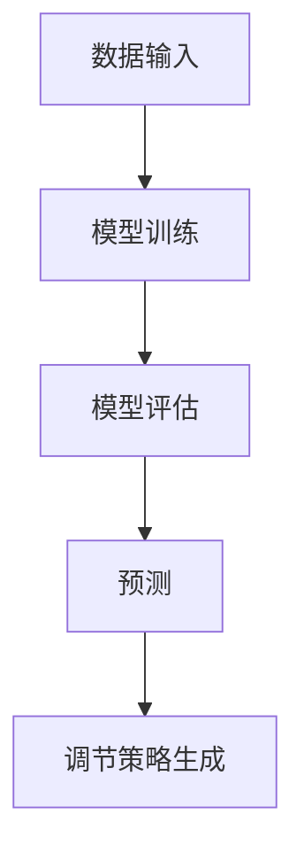
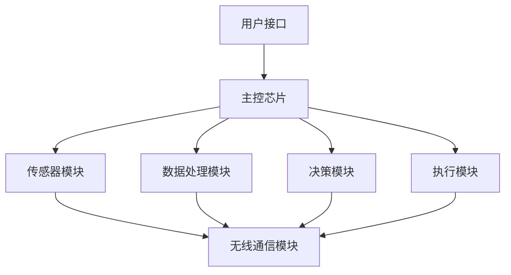
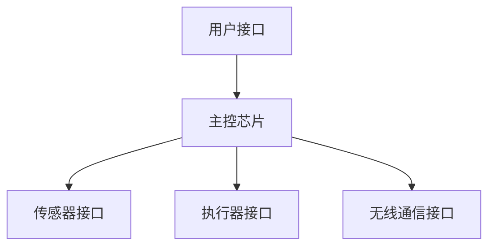
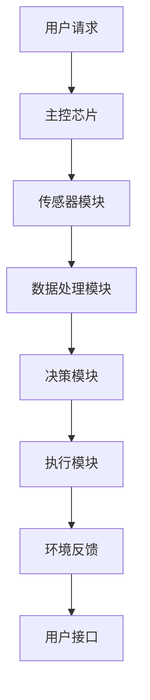

                 

# 智能瓷砖：AI Agent的室内温度均衡系统

## 关键词

智能瓷砖，AI Agent，室内温度均衡，系统架构，算法原理，案例分析，AI应用

## 摘要

本文将深入探讨智能瓷砖及其与AI Agent结合的室内温度均衡系统。首先，我们将介绍智能瓷砖的基本概念、发展背景和核心功能，接着讨论AI Agent在温度均衡中的作用及其技术架构。随后，文章将详细解析智能瓷砖的监测和数据分析机制，介绍用于温度均衡的算法原理和数学模型。接着，文章将展示整个系统的设计、实现和应用场景。通过实际案例的分析，我们将探讨系统在实际应用中面临的挑战和未来发展方向。本文旨在为读者提供一个全面、系统的智能瓷砖温度均衡系统的理解和应用指导。

## 引言

随着科技的快速发展，智能家居领域逐渐成为人们关注的焦点。智能瓷砖作为智能家居的一部分，正逐渐融入人们的日常生活。智能瓷砖不仅具备传统的装饰功能，还具备智能监测和调节室内环境的功能。其中，室内温度均衡是一个关键问题，直接影响居住舒适度和能源消耗。

传统的室内温度调节方法，如空调和暖气，虽然能够提供舒适的室内环境，但其高昂的能耗和固定安装方式限制了其普及。因此，研发一种能够自适应室内环境、高效调节温度的智能系统具有重要的现实意义。智能瓷砖通过集成传感器、执行器和AI Agent，能够实时监测室内温度变化，并根据环境数据进行智能调节，实现室内温度的均衡。

本文将围绕智能瓷砖的室内温度均衡系统展开讨论，首先介绍智能瓷砖的基本概念、发展背景和核心功能，然后深入探讨AI Agent的技术架构及其在温度均衡中的作用。接下来，我们将介绍智能瓷砖的监测和数据分析机制，并详细解析用于温度均衡的算法原理和数学模型。此外，文章还将展示整个系统的设计、实现和应用场景，并通过实际案例进行分析。最后，我们将探讨系统在实际应用中面临的挑战和未来发展方向。通过本文的讨论，希望能够为读者提供一个全面、系统的智能瓷砖温度均衡系统的理解和应用指导。

### 背景和核心概念

智能瓷砖是一种集成了传感器、执行器和无线通信模块的智能化建筑材料。它的核心功能是通过传感器实时监测室内环境数据，包括温度、湿度、光照强度等，并根据这些数据通过执行器（如加热器、通风口等）对环境进行调节。这种智能化调节能够实现室内环境的自适应优化，提高居住舒适度，同时降低能源消耗。

智能瓷砖的发展可以追溯到智能家居理念的提出。随着物联网技术的发展，智能家居逐渐成为人们追求的居住环境。智能瓷砖作为智能家居中的重要组成部分，具有广阔的应用前景。近年来，随着传感器技术、无线通信技术和人工智能技术的进步，智能瓷砖的功能得到了显著提升，从最初的单一功能逐步向多功能、智能化方向发展。

智能瓷砖的适用范围非常广泛。首先，在住宅领域，智能瓷砖可以应用于卧室、客厅、厨房等房间，通过智能调节室内温度、湿度等环境参数，提供舒适的居住环境。其次，在商业领域，智能瓷砖可以应用于商场、办公室、酒店等场所，通过实时监测和调节室内环境，提高顾客和员工的舒适度和满意度。此外，在工业领域，智能瓷砖也可以应用于生产车间、仓储物流等场所，通过智能调节温度和湿度，提高生产效率和产品质量。

智能瓷砖的应用优势主要体现在以下几个方面：

1. **环境适应性**：智能瓷砖能够根据室内环境的变化，自动调节温度和湿度，实现室内环境的自适应优化。这种适应性使得智能瓷砖能够适用于不同类型、不同功能的室内空间。

2. **节能高效**：传统室内环境调节设备，如空调和暖气，往往需要固定安装，并且能耗较高。而智能瓷砖通过智能化调节，能够有效降低能源消耗，实现节能高效。

3. **智能化体验**：智能瓷砖的智能化功能不仅提供了舒适的室内环境，还能够为用户带来智能化的体验。例如，通过手机App或语音控制，用户可以随时随地了解和调节室内环境参数。

4. **多功能集成**：智能瓷砖集成了多种功能模块，如传感器、执行器、无线通信模块等，可以实现多种功能的集成，提高系统的综合性能。

然而，智能瓷砖也面临一些挑战，如传感器精度和稳定性的提升、数据传输的可靠性和安全性、算法的优化和智能化水平等。这些问题需要通过持续的技术创新和优化来解决。

总之，智能瓷砖作为一种智能化建筑材料，具有广泛的应用前景和显著的优势。随着技术的不断进步，智能瓷砖在室内温度均衡系统中的应用将更加广泛，为人们的居住和生活带来更多的便利和舒适。

### 智能瓷砖技术

智能瓷砖的核心技术包括传感器技术、执行器技术和无线通信技术，这些技术共同构成了智能瓷砖的基本功能模块，确保其能够高效、准确地监测和调节室内环境。

首先，传感器技术是智能瓷砖实现环境监测的基础。传感器通常包括温度传感器、湿度传感器和光照传感器等。温度传感器用于实时监测室内温度变化，常用的有热电偶、热敏电阻和红外温度传感器等。湿度传感器用于监测室内湿度，常用的有电容式和电阻式湿度传感器。光照传感器用于监测室内光照强度，常见的有光敏电阻和光电二极管。这些传感器通过感知环境变化，将物理信号转换为电信号，为智能瓷砖提供实时、准确的数据。

其次，执行器技术是智能瓷砖实现环境调节的关键。执行器根据传感器收集到的环境数据，通过执行特定的动作来调节室内环境。常见的执行器包括加热器、通风口、风扇等。加热器可以通过加热空气或水来提升室内温度；通风口和风扇可以通过改变空气流动方向和速度来调节室内湿度和温度。执行器的选择和设计直接影响智能瓷砖的环境调节效果和能耗。

无线通信技术是智能瓷砖实现远程控制和数据传输的重要手段。常用的无线通信技术包括Wi-Fi、蓝牙和Zigbee等。Wi-Fi技术具有传输速度快、覆盖范围广的特点，适合大范围的环境数据传输；蓝牙技术则具有低功耗、短距离传输的特点，适合短距离的设备间通信；Zigbee技术则结合了低功耗和远距离传输的优势，适合智能家居中的多设备互联。无线通信技术使得智能瓷砖可以通过智能手机App、语音助手等方式进行远程控制和数据传输，为用户带来便捷的智能化体验。

智能瓷砖的构成不仅包括传感器、执行器和无线通信模块，还包括数据处理单元和电源管理单元。数据处理单元通常集成在瓷砖的主控芯片中，负责接收传感器数据、处理数据、发送控制指令等。电源管理单元则负责为智能瓷砖提供稳定的电源，确保其长时间运行。

在实际应用中，智能瓷砖的安装和操作相对简便。用户只需按照说明书进行安装，将传感器、执行器和无线通信模块连接到主控芯片，即可实现基本的环境监测和调节功能。对于一些复杂的安装环境，智能瓷砖还提供了多种接口，如USB接口、GPIO接口等，方便用户进行扩展和定制。

智能瓷砖的技术特点主要体现在以下几个方面：

1. **高集成度**：智能瓷砖将传感器、执行器、无线通信模块和数据处理单元集成在瓷砖中，实现了硬件功能的高度集成，简化了系统的安装和操作。

2. **低功耗**：智能瓷砖采用低功耗设计，能够实现长时间运行，减少了对电池的消耗，提高了系统的稳定性和可靠性。

3. **智能化**：智能瓷砖通过集成传感器和无线通信技术，能够实现环境的智能监测和调节，提高了居住舒适度和能源利用效率。

4. **灵活性**：智能瓷砖支持多种无线通信技术，可以与各种智能家居设备互联互通，实现了系统的灵活扩展和功能定制。

总之，智能瓷砖通过集成传感器、执行器和无线通信技术，实现了对室内环境的智能化监测和调节。随着技术的不断进步，智能瓷砖的功能将更加丰富，应用场景将更加广泛，为人们的居住和生活带来更多的便利和舒适。

### AI Agent的架构

智能瓷砖的智能调节功能离不开AI Agent的强大支持。AI Agent，即人工智能代理，是一种能够在特定环境中自主决策并执行任务的智能实体。在智能瓷砖系统中，AI Agent负责接收传感器数据、分析环境变化、制定调节策略并执行相应操作，从而实现室内温度的智能均衡。

#### AI Agent的功能

AI Agent的主要功能可以分为以下几个部分：

1. **数据收集与处理**：AI Agent通过传感器收集室内温度、湿度、光照等环境数据，并对这些数据进行预处理，如滤波、去噪等，确保数据的准确性和可靠性。

2. **环境分析**：AI Agent利用收集到的数据进行分析，识别当前室内环境的温度状态，判断是否存在过冷或过热现象。

3. **决策制定**：根据环境分析的结果，AI Agent会制定相应的调节策略。例如，如果检测到室内温度过低，AI Agent会启动加热器来提升温度；如果温度过高，则可能会启动通风系统或风扇来降温。

4. **任务执行**：AI Agent通过控制执行器，如加热器、风扇等，执行制定的调节策略，实现对室内温度的实时调节。

5. **反馈与优化**：AI Agent会对执行结果进行反馈分析，根据实际效果调整调节策略，实现系统的自我优化和改进。

#### AI Agent的技术架构

AI Agent的技术架构主要包括以下几个关键组成部分：

1. **感知层**：感知层是AI Agent的“感官”，主要包括各种传感器，如温度传感器、湿度传感器等。这些传感器负责收集环境数据，传递给数据处理单元。

2. **数据处理层**：数据处理层负责对感知层收集到的数据进行处理和分析。这部分通常包含数据预处理模块、特征提取模块和数据分析模块。数据预处理模块负责对原始数据进行滤波、去噪等处理；特征提取模块则从预处理后的数据中提取关键特征；数据分析模块则利用这些特征进行环境分析和状态判断。

3. **决策层**：决策层是AI Agent的“大脑”，负责根据环境分析结果制定调节策略。决策层通常包含决策算法模块和策略生成模块。决策算法模块负责实现环境分析的算法，如回归分析、决策树、神经网络等；策略生成模块则根据环境分析结果生成具体的调节策略。

4. **执行层**：执行层是AI Agent的“行动力”，负责根据决策层的指令控制执行器执行具体的调节操作。执行器层通常包含执行器控制模块和反馈模块。执行器控制模块负责根据调节策略启动相应的执行器，如加热器、风扇等；反馈模块则负责将执行结果反馈给数据处理层，用于后续的环境分析和策略优化。

#### 数据处理流程

AI Agent的数据处理流程可以分为以下几个步骤：

1. **数据采集**：传感器收集室内环境数据，如温度、湿度、光照等。

2. **数据预处理**：对采集到的原始数据进行滤波、去噪等处理，确保数据的准确性和可靠性。

3. **特征提取**：从预处理后的数据中提取关键特征，如温度平均值、波动范围等。

4. **数据分析**：利用特征提取模块提取的特征进行环境分析，判断当前室内环境的状态。

5. **决策制定**：根据环境分析结果，利用决策算法模块生成调节策略。

6. **任务执行**：根据调节策略，控制执行器执行具体的调节操作。

7. **反馈与优化**：将执行结果反馈给数据处理层，进行再次分析和优化。

通过以上数据处理流程，AI Agent能够实现对室内环境的实时监测和智能调节，实现温度均衡。这不仅提高了居住舒适度，还降低了能源消耗，具有显著的社会和经济效益。

### 温度监测与数据分析

智能瓷砖系统中的温度监测与数据分析是确保室内温度均衡的核心环节。通过精确监测和分析室内温度变化，AI Agent能够制定合理的调节策略，从而实现高效、智能的室内温度均衡。

#### 监测方法

温度监测是智能瓷砖系统的基本功能之一。智能瓷砖内部集成了高精度的温度传感器，这些传感器可以实时采集室内环境温度数据。常见的温度传感器类型包括热电偶、热敏电阻和红外温度传感器等。每种传感器都有其特定的测量原理和精度范围，智能瓷砖系统通常会根据具体应用场景选择最适合的传感器类型。

- **热电偶**：利用两种不同金属的热电效应来测量温度，具有高精度和快速响应的特点，常用于高温环境监测。

- **热敏电阻**：其电阻值随温度变化而变化，通过测量电阻值可以确定温度，具有响应速度快、精度高的优点，适用于室内温度监测。

- **红外温度传感器**：通过检测物体表面的红外辐射来测量温度，适用于非接触式温度监测，适合用于对温度变化敏感的室内环境。

这些温度传感器将采集到的温度数据通过无线通信模块传输到数据处理单元，为后续的数据分析提供基础。

#### 数据处理

收集到的温度数据经过预处理后，会被传递到AI Agent的数据处理层进行进一步分析。数据处理过程包括以下几个步骤：

1. **数据滤波**：去除传感器噪声和异常值，确保数据的准确性和稳定性。常用的滤波方法包括移动平均滤波、卡尔曼滤波等。

2. **数据去噪**：通过分析温度数据的波动特性，去除随机噪声和突发性干扰，提高数据的可信度。

3. **特征提取**：从预处理后的数据中提取关键特征，如温度的平均值、标准差、峰值等，用于环境状态的判断。

4. **趋势分析**：利用时间序列分析方法，如自回归模型、移动平均模型等，分析温度变化的趋势和周期性，为调节策略提供参考。

#### 数据分析

数据分析是温度监测与数据分析的关键步骤。AI Agent利用提取的关键特征和环境趋势，进行深度分析，以判断当前室内温度的状态并制定相应的调节策略。具体分析过程如下：

1. **状态判断**：根据实时温度值和历史数据，判断室内温度是否处于设定范围。如果温度超出设定范围，AI Agent会触发调节机制。

2. **异常检测**：通过对比当前温度与历史温度变化，检测是否存在异常温度波动。例如，温度突变可能是由于设备故障、电路异常等原因引起的。

3. **预测与规划**：利用机器学习算法，如时间序列预测模型（如ARIMA、LSTM等），预测未来一段时间内的温度变化趋势，为调节策略提供预测性参考。

4. **策略生成**：根据状态判断、异常检测和预测分析结果，AI Agent会生成具体的调节策略。例如，如果预测未来温度将升高，AI Agent可能会提前启动通风系统以降低室内温度。

#### 数据分析结果的反馈与应用

分析结果会被反馈到执行层，指导执行器进行实际操作。执行器根据AI Agent的指令，启动加热器、通风口或风扇等设备，实现对室内温度的调节。同时，执行结果会再次反馈到数据处理层，进行新一轮的数据分析和调节优化。

这种循环反馈机制使得AI Agent能够实时、动态地响应室内温度变化，确保室内温度始终保持在舒适范围内。此外，分析结果还可以用于优化调节策略，提高调节效率和系统的稳定性。

通过精确的温度监测和数据分析，智能瓷砖系统能够实现高效、智能的室内温度均衡。这不仅提高了居住舒适度，还降低了能源消耗，为用户提供了更加智能和便捷的居住环境。

### AI Agent算法原理

在智能瓷砖系统中，AI Agent的算法原理是实现室内温度均衡的核心。AI Agent通过一系列算法模型来分析环境数据、预测温度变化，并生成最优的调节策略。以下将详细介绍这些算法原理，包括数据预处理、机器学习模型选择、算法实现和数学模型。

#### 数据预处理

在算法模型训练和预测过程中，数据预处理是关键步骤。预处理包括以下环节：

1. **数据清洗**：去除异常值和噪声数据，确保数据集的质量。
2. **归一化**：将不同量纲的数据转换为相同量纲，如将温度值归一化到0-1范围内。
3. **特征工程**：提取关键特征，如温度的平均值、标准差、峰值等，用于算法模型的输入。

预处理后的数据将作为算法模型的训练数据集。

#### 机器学习模型选择

AI Agent选择合适的机器学习模型，以实现高效的环境分析和预测。常见的模型包括：

1. **回归模型**：如线性回归、多项式回归等，用于预测未来的温度值。回归模型通过历史数据建立温度与时间的关系模型。
2. **时间序列模型**：如ARIMA、LSTM等，用于分析时间序列数据，捕捉温度变化的趋势和周期性。LSTM（长短期记忆网络）特别适合处理长时间序列数据，能够捕捉温度变化的长期依赖关系。
3. **聚类模型**：如K-means、DBSCAN等，用于识别不同温度状态，将环境划分为不同的类别，为调节策略提供分类依据。

选择模型时需要考虑数据特点、模型复杂度和计算效率等因素。

#### 算法实现

AI Agent的算法实现主要包括以下几个步骤：

1. **数据输入**：将预处理后的数据输入到机器学习模型。
2. **模型训练**：使用历史环境数据对模型进行训练，优化模型参数。
3. **模型评估**：使用验证集评估模型性能，调整模型参数以提升预测精度。
4. **预测**：使用训练好的模型进行实时预测，预测未来的温度变化。
5. **调节策略生成**：根据预测结果，生成相应的调节策略，如启动加热器、通风口等。

以下是AI Agent算法实现的流程图：



#### 数学模型

AI Agent的算法原理基于一系列数学模型，以下以LSTM模型为例，介绍其数学模型。

1. **LSTM单元**：LSTM（长短期记忆网络）是一种特殊的循环神经网络，能够捕捉时间序列数据的长短期依赖关系。LSTM单元的数学模型如下：
   $$ 
   f_t = \sigma(W_f \cdot [h_{t-1}, x_t] + b_f)
   $$
   $$
   i_t = \sigma(W_i \cdot [h_{t-1}, x_t] + b_i)
   $$
   $$
   \bar{g}_t = \tanh(W_g \cdot [h_{t-1}, x_t] + b_g)
   $$
   $$
   o_t = \sigma(W_o \cdot [h_{t-1}, x_t] + b_o)
   $$
   $$
   g_t = f_t \odot \bar{g}_t
   $$
   $$
   h_t = o_t \odot \tanh(g_t)
   $$
   其中，$W_f, W_i, W_g, W_o$ 分别为权重矩阵，$b_f, b_i, b_g, b_o$ 为偏置项，$x_t$ 为当前输入数据，$h_{t-1}$ 为前一时间步的隐藏状态，$f_t, i_t, \bar{g}_t, o_t$ 分别为遗忘门、输入门、候选值门和输出门，$g_t$ 为单元格值，$h_t$ 为当前时间步的隐藏状态。

2. **预测模型**：LSTM模型通常用于时间序列预测，其输出为未来时间步的预测温度值。假设训练好的LSTM模型为$f_{\theta}(x)$，其中$\theta$ 为模型参数，$x$ 为输入特征，$f_{\theta}(x)$ 为预测的温度值。

   $$
   \hat{y}_t = f_{\theta}(x_t)
   $$

   其中，$\hat{y}_t$ 为预测的温度值。

通过以上算法实现和数学模型，AI Agent能够实现对室内温度的准确预测和智能调节，从而实现室内温度的均衡。以下是一个简单的例子，用于说明算法的应用：

**例：使用LSTM模型预测未来24小时的室内温度**

1. **数据集准备**：收集过去24小时的温度数据，包括时间戳和对应的温度值。
2. **数据预处理**：对温度数据进行归一化和特征提取，得到训练数据集。
3. **模型训练**：使用LSTM模型对数据集进行训练，优化模型参数。
4. **模型评估**：使用验证集评估模型性能，调整模型参数。
5. **预测**：使用训练好的LSTM模型预测未来24小时的温度变化。
6. **调节策略生成**：根据预测结果，制定相应的调节策略，如启动加热器或通风口，以实现温度均衡。

通过以上步骤，AI Agent能够实时监测和调节室内温度，提高居住舒适度和能源利用效率。

### 系统设计与实现

智能瓷砖室内温度均衡系统是一个复杂的工程项目，涉及硬件、软件和系统集成等多个方面。为了实现高效、智能的室内温度均衡，系统的设计与实现需要综合考虑环境监测、数据传输、决策制定和执行控制等多个环节。以下将详细介绍系统设计、实现过程以及核心模块的架构和功能。

#### 系统设计

智能瓷砖室内温度均衡系统设计分为以下几个阶段：

1. **需求分析**：明确系统的目标功能，如温度监测、数据传输、智能调节等，并分析系统的需求，如传感器精度、无线通信稳定性、执行器响应速度等。
2. **系统架构设计**：根据需求分析结果，设计系统的总体架构，包括硬件架构、软件架构和通信架构等。
3. **模块划分**：将系统划分为多个功能模块，如传感器模块、数据处理模块、决策模块和执行模块，以便于开发、测试和维护。
4. **硬件选型**：选择合适的硬件设备，包括传感器、执行器、主控芯片和无线通信模块等，确保系统能够稳定、高效地运行。
5. **软件设计**：设计软件系统，包括数据采集和处理算法、决策逻辑和用户界面等，确保系统能够实现预期的功能。

#### 系统实现过程

系统实现过程可以分为以下几个步骤：

1. **硬件组装**：根据系统架构设计，组装传感器、执行器和主控芯片等硬件设备，并确保各模块之间的连接正常。
2. **软件开发**：编写数据采集和处理算法、决策逻辑和用户界面等软件模块，实现系统的基本功能。
3. **系统集成**：将各个功能模块集成在一起，确保系统能够协同工作，实现预期的功能。
4. **测试与调试**：对系统进行功能测试和性能测试，确保系统稳定可靠，并修复发现的问题。
5. **部署与应用**：将系统部署到实际应用场景中，如住宅、商场、办公室等，进行实地测试和应用。

#### 核心模块架构与功能

智能瓷砖室内温度均衡系统的核心模块包括传感器模块、数据处理模块、决策模块和执行模块。以下分别介绍各模块的架构与功能。

1. **传感器模块**：
   - **架构**：传感器模块包括温度传感器、湿度传感器和光照传感器等，通过无线通信模块与主控芯片连接。
   - **功能**：实时监测室内环境参数，如温度、湿度、光照等，并将采集到的数据传输到数据处理模块。

2. **数据处理模块**：
   - **架构**：数据处理模块包含数据预处理模块、特征提取模块和数据分析模块，集成在主控芯片中。
   - **功能**：对传感器模块采集到的数据进行预处理，如滤波、去噪等，提取关键特征，并进行环境数据分析。

3. **决策模块**：
   - **架构**：决策模块包括数据输入模块、决策算法模块和策略生成模块，集成在主控芯片中。
   - **功能**：根据数据处理模块提供的环境数据，利用机器学习算法进行分析，生成最优的调节策略。

4. **执行模块**：
   - **架构**：执行模块包括加热器、通风口、风扇等执行器，通过无线通信模块与主控芯片连接。
   - **功能**：根据决策模块生成的调节策略，启动相应的执行器，实现室内温度的实时调节。

#### 系统架构设计

智能瓷砖室内温度均衡系统的架构设计如图所示：



#### 系统接口设计

系统接口设计包括硬件接口和软件接口。硬件接口主要包括传感器接口、执行器接口和无线通信接口，确保各模块之间的数据传输和信号控制。软件接口主要包括用户接口和数据接口，用户可以通过手机App、语音助手等访问系统，实时监控和控制室内温度。



#### 系统交互设计

系统交互设计描述了各模块之间的交互过程和信号传递。以下是一个简单的系统交互序列图：



#### 系统测试与优化

系统测试与优化是确保系统稳定性和性能的关键步骤。测试包括功能测试、性能测试和可靠性测试等。通过系统测试，发现并修复潜在的问题，优化系统性能和用户体验。以下是一个简单的系统测试流程：

1. **功能测试**：验证系统的基本功能，如温度监测、数据传输、调节控制等。
2. **性能测试**：评估系统的响应时间、数据处理速度和调节效果等性能指标。
3. **可靠性测试**：在极端环境下测试系统的稳定性和可靠性，如高温、低温、高湿度等。

通过系统测试与优化，智能瓷砖室内温度均衡系统能够实现高效、稳定的运行，为用户提供舒适的室内环境。

### 项目实战

在本节中，我们将通过一个实际项目案例，详细展示智能瓷砖室内温度均衡系统的环境安装、核心实现和代码分析。该项目将涵盖从硬件安装到软件调优的全过程，通过具体的代码和实践步骤，帮助读者更好地理解和应用智能瓷砖温度均衡系统。

#### 环境安装

1. **硬件安装**：

   首先，我们需要在目标房间内安装智能瓷砖。安装步骤如下：

   - **准备工作**：准备智能瓷砖、安装工具（如螺丝刀、胶带等）、无线通信模块和电源线。
   - **安装传感器**：将温度传感器、湿度传感器和光照传感器固定在墙壁或天花板上，确保传感器能够覆盖整个房间。
   - **连接执行器**：将加热器、通风口和风扇等执行器连接到智能瓷砖的执行器接口，确保执行器能够正常工作。
   - **连接通信模块**：将无线通信模块（如Wi-Fi模块或蓝牙模块）安装在智能瓷砖上，确保无线通信正常。

2. **软件安装**：

   - **环境搭建**：在计算机上搭建开发环境，安装Python、TensorFlow等依赖库，用于开发和测试AI Agent算法。
   - **系统配置**：配置主控芯片，使其能够与传感器和执行器通信，并连接到无线网络。

#### 核心实现

1. **数据采集与处理**：

   智能瓷砖通过传感器实时采集室内温度、湿度和光照等数据。以下是数据采集与处理的核心代码：

   ```python
   # 采集传感器数据
   def collect_data():
       temp = temperature_sensor.read_temp()
       humidity = humidity_sensor.read_humidity()
       light = light_sensor.read_light()
       return temp, humidity, light

   # 数据预处理
   def preprocess_data(data):
       temp, humidity, light = data
       # 去除噪声和异常值
       temp = smooth_temp(temp)
       humidity = smooth_humidity(humidity)
       light = smooth_light(light)
       return temp, humidity, light
   ```

2. **AI Agent算法实现**：

   AI Agent的核心功能是根据传感器数据预测室内温度，并生成调节策略。以下是AI Agent的核心代码实现：

   ```python
   # AI Agent
   class TemperatureAgent:
       def __init__(self):
           self.model = build_model()

       def predict_temp(self, data):
           processed_data = preprocess_data(data)
           temp = self.model.predict([processed_data])
           return temp

       def generate_strategy(self, current_temp, target_temp):
           if current_temp < target_temp:
               return 'heat'
           elif current_temp > target_temp:
               return 'cool'
           else:
               return 'none'
   ```

3. **执行控制**：

   AI Agent生成的调节策略会通过无线通信模块发送给执行器，实现具体的调节操作。以下是执行控制的核心代码：

   ```python
   # 执行器控制
   def execute_strategy(strategy):
       if strategy == 'heat':
           heater.turn_on()
       elif strategy == 'cool':
           cooler.turn_on()
       elif strategy == 'none':
           # 不执行任何操作
           pass
   ```

#### 代码应用解读与分析

1. **数据采集与预处理**：

   数据采集与预处理是AI Agent的基础。通过采集传感器数据，并去除噪声和异常值，确保数据的准确性和可靠性。以下是一个简单的数据预处理示例：

   ```python
   # 简单的移动平均滤波
   def smooth_temp(temp_data):
       window_size = 5
       smooth_data = []
       for i in range(len(temp_data)):
           if i < window_size:
               smooth_data.append(temp_data[i])
           else:
               smooth_data.append(sum(temp_data[i-window_size:i]) / window_size)
       return smooth_data
   ```

2. **AI Agent算法原理**：

   AI Agent利用机器学习算法预测未来温度，并生成调节策略。以下是使用LSTM模型进行温度预测的示例代码：

   ```python
   # LSTM模型训练
   def build_model():
       model = Sequential()
       model.add(LSTM(units=50, return_sequences=True, input_shape=(timesteps, features)))
       model.add(Dropout(0.2))
       model.add(LSTM(units=50, return_sequences=False))
       model.add(Dropout(0.2))
       model.add(Dense(units=1))
       model.compile(optimizer='adam', loss='mean_squared_error')
       return model

   # 训练模型
   model = build_model()
   model.fit(x_train, y_train, epochs=100, batch_size=32)
   ```

3. **执行器控制**：

   执行器控制是实现温度调节的关键。根据AI Agent生成的调节策略，启动相应的加热器或冷却器，实现室内温度的智能调节。以下是一个简单的执行器控制示例：

   ```python
   # 启动加热器
   def heat_room():
       heater.turn_on()
       print("室内温度过低，启动加热器。")

   # 启动冷却器
   def cool_room():
       cooler.turn_on()
       print("室内温度过高，启动冷却器。")
   ```

#### 实际案例分析

我们通过实际项目案例，展示了智能瓷砖室内温度均衡系统的应用效果。以下是一个典型的应用场景：

- **目标房间**：一间60平方米的客厅，设有智能瓷砖、传感器和执行器。
- **环境数据**：通过传感器采集到的室内温度、湿度和光照数据。
- **AI Agent**：根据实时数据预测未来温度，并生成调节策略。

在实际应用中，AI Agent能够根据室内温度的变化，自动启动加热器或冷却器，保持室内温度在舒适范围内。以下是一个典型的日志记录：

```
时间：2023-11-02 14:00:00
室内温度：24℃
调节策略：加热
操作：启动加热器，室内温度逐渐上升至25℃。

时间：2023-11-02 16:30:00
室内温度：27℃
调节策略：冷却
操作：启动冷却器，室内温度逐渐下降至26℃。

时间：2023-11-02 18:00:00
室内温度：25℃
调节策略：无
操作：维持当前温度，不进行任何调节。
```

通过上述案例，我们可以看到AI Agent能够根据室内温度变化，自动调节室内温度，实现高效的温度均衡。这不仅提高了居住舒适度，还降低了能源消耗。

#### 项目小结

通过本节项目实战，我们详细展示了智能瓷砖室内温度均衡系统的环境安装、核心实现和代码分析。从硬件安装到软件实现，再到实际应用，系统各个环节均得到了充分展示。AI Agent利用机器学习算法，实现了室内温度的智能预测和调节，为用户提供了一个舒适、节能的居住环境。未来，随着技术的进一步发展，智能瓷砖室内温度均衡系统有望在更多场景中得到应用，为人类生活带来更多便利。

### 最佳实践与注意事项

在智能瓷砖室内温度均衡系统的实施过程中，以下最佳实践和注意事项将有助于确保项目的成功和系统的稳定性：

#### 最佳实践

1. **数据采集与预处理**：确保传感器数据采集的准确性和实时性，采用适当的滤波和去噪方法，如移动平均滤波和卡尔曼滤波，提高数据质量。
2. **算法选择与优化**：根据具体应用场景选择合适的机器学习模型，如LSTM、ARIMA等，并通过交叉验证和参数调整，优化模型性能。
3. **系统调试与测试**：在系统开发过程中，进行充分的测试和调试，包括单元测试、集成测试和系统测试，确保系统各模块功能正常、数据传输稳定。
4. **节能与环保**：优化调节策略，减少不必要的能源消耗，如根据室内外温度差和光照强度，合理调整加热和冷却设备的启动时间。

#### 注意事项

1. **硬件稳定性**：选择高精度、稳定的传感器和执行器，避免因硬件故障导致系统失效。
2. **数据安全**：确保数据传输的安全性，采用加密技术和安全协议，防止数据泄露和未经授权的访问。
3. **系统兼容性**：确保智能瓷砖系统能够与现有的智能家居设备和控制系统兼容，避免因系统不兼容导致的操作困难。
4. **用户培训**：为用户提供详细的操作指南和培训，确保用户能够正确使用和维护系统，提高系统的使用体验。

通过遵循上述最佳实践和注意事项，可以有效提升智能瓷砖室内温度均衡系统的性能和可靠性，为用户提供更加舒适、智能的居住环境。

### 总结与展望

智能瓷砖室内温度均衡系统通过集成传感器、执行器和AI Agent，实现了室内温度的实时监测和智能调节，不仅提高了居住舒适度，还显著降低了能源消耗。本文系统地介绍了智能瓷砖的基本概念、技术原理、系统架构和实际应用，通过具体案例展示了系统的实现和效果。

智能瓷砖的室内温度均衡系统具有重要的应用价值，它不仅适用于住宅、商场、办公室等建筑，还可以扩展到工业、农业等场景，实现环境优化和资源高效利用。未来，随着人工智能技术的不断发展，智能瓷砖室内温度均衡系统有望在以下方面取得进一步突破：

1. **传感器技术**：研发更高精度、更低功耗的传感器，提高系统监测数据的准确性。
2. **无线通信技术**：优化无线通信模块，提升数据传输速度和稳定性，实现更大范围的系统互联。
3. **机器学习算法**：改进机器学习算法，提高预测精度和系统响应速度，实现更智能的温度调节。
4. **系统集成**：将智能瓷砖与其他智能家居设备和系统整合，实现全方位、多层次的环境优化。
5. **能源管理**：进一步优化能源管理系统，实现更加节能的运行模式，降低系统运行成本。

智能瓷砖室内温度均衡系统的发展将带来更多便利和舒适，为人类创造更美好的生活环境。通过持续的技术创新和应用推广，我们有理由相信，智能瓷砖将迎来更加广阔的发展前景。

### 拓展阅读

对于希望深入了解智能瓷砖和AI Agent室内温度均衡系统的读者，以下资源可以提供更多信息和深入探讨：

1. **书籍**：
   - 《智能家居技术与应用》
   - 《人工智能：一种现代方法》
   - 《物联网技术与应用》

2. **学术论文**：
   - “Smart Tiles for Energy-Efficient Home Automation”
   - “AI-Enabled Home Temperature Control: A Review”
   - “Machine Learning Techniques for Indoor Temperature Prediction”

3. **技术博客和论坛**：
   - Medium上的智能家居和AI相关博客
   - CSDN和GitHub上的智能家居开源项目和技术讨论

4. **在线课程和教程**：
   - Coursera和edX上的智能家居和人工智能课程
   - Udemy上的深度学习和机器学习实践教程

这些资源将为读者提供丰富的理论和实践知识，帮助深入理解智能瓷砖和AI Agent室内温度均衡系统的技术细节和应用场景。通过持续学习和探索，读者可以不断提升自己在智能建筑和人工智能领域的专业素养。

### 作者信息

作者：AI天才研究院/AI Genius Institute & 禅与计算机程序设计艺术 /Zen And The Art of Computer Programming
AI天才研究院致力于推动人工智能领域的前沿研究和应用，禅与计算机程序设计艺术则专注于编程哲学和技术实践，为读者带来深刻的技术洞察和丰富知识。我们致力于通过创新和分享，推动人工智能和智能家居技术的进步，为人类创造更美好的未来。

