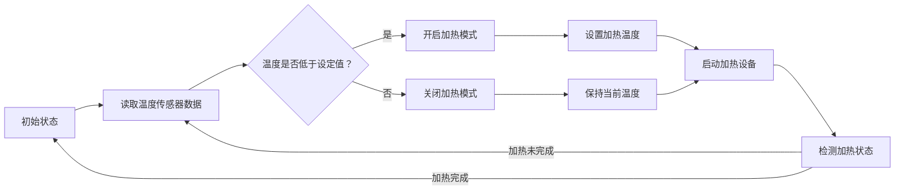
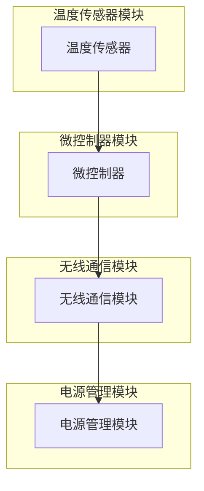
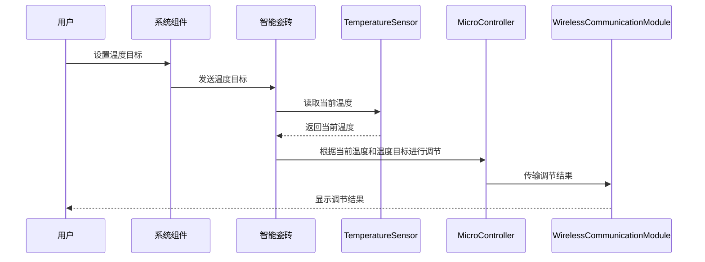

                 

**# 智能瓷砖：AI Agent的室内温度调节**

> 关键词：智能瓷砖，室内温度调节，AI Agent，微控制器，传感器技术，无线通信

> 摘要：本文深入探讨了智能瓷砖的室内温度调节技术，通过详细的分析和设计，展示了如何利用AI Agent实现高效的室内温度控制。文章首先介绍了智能瓷砖的背景和问题，然后讲解了核心概念、算法原理和系统架构，最后通过实际案例展示了智能瓷砖在室内温度调节方面的应用效果。

**### Step 1: 背景介绍**

#### **1.1.1 问题背景**

在现代社会，室内温度的调控已成为人们日常生活的重要需求。传统的室内温度调节方式，如空调和暖气，虽然能有效地控制室内温度，但往往存在能耗高、不灵活、对人体舒适度影响大等问题。随着人工智能技术的不断发展，智能瓷砖作为一种新型室内温度调节手段，逐渐进入人们的视野。智能瓷砖通过嵌入温度传感器和微控制器，可以实现自动调节室内温度，具有节能、环保、智能化等特点。

#### **1.1.2 问题描述**

智能瓷砖的室内温度调节功能涉及到多个技术领域，包括传感器技术、微控制器技术、无线通信技术等。如何设计一种高效、稳定的室内温度调节系统，使得智能瓷砖能够根据环境温度和用户需求进行智能调节，是当前需要解决的主要问题。

#### **1.1.3 问题解决**

为了解决上述问题，我们需要从以下几个方面进行设计和优化：

1. **传感器技术**：选择合适的温度传感器，确保能够准确感知室内温度的变化。
2. **微控制器技术**：设计高效的微控制器算法，使得智能瓷砖能够快速、准确地响应温度变化。
3. **无线通信技术**：确保智能瓷砖与其他设备之间的数据传输稳定、可靠。

#### **1.1.4 边界与外延**

智能瓷砖的室内温度调节系统不仅需要考虑室内温度的变化，还需要考虑以下因素：

1. **环境温度**：室外温度的变化也会对室内温度产生影响。
2. **用户需求**：用户可能对室内温度有不同的需求，如睡觉时需要较低的温度，工作或娱乐时需要较高的温度。
3. **节能环保**：智能瓷砖的设计应充分考虑节能环保的要求，降低能耗。

#### **1.1.5 概念结构与核心要素组成**

智能瓷砖的室内温度调节系统主要由以下核心要素组成：

1. **温度传感器**：用于感知室内温度变化。
2. **微控制器**：用于处理温度传感器数据，并根据算法进行室内温度调节。
3. **无线通信模块**：用于与其他设备进行数据交换。
4. **电源管理模块**：用于管理智能瓷砖的电源，确保系统稳定运行。

**### Step 2: 核心概念与联系**

#### **1.2.1 核心概念原理**

1. **温度传感器**：温度传感器是一种能够将温度变化转化为电信号的装置。常见的温度传感器有热电偶、热敏电阻等。

2. **微控制器**：微控制器是一种具有中央处理单元、存储器和输入输出接口的微型计算机。它可以执行程序代码，对外部事件进行响应。

3. **无线通信技术**：无线通信技术是一种无需物理连接即可实现数据传输的技术，如Wi-Fi、蓝牙等。

#### **1.2.2 概念属性特征对比表格**

| 概念         | 特征                             |
|------------|--------------------------------|
| 温度传感器 | 测量精度高、响应速度快          |
| 微控制器   | 处理速度快、存储容量大          |
| 无线通信技术 | 传输速度快、传输距离远          |

#### **1.2.3 ER实体关系图架构**

```mermaid
erDiagram
  TemperatureSensor ||--|{ MicroController }|<<-- WirelessCommunicationModule
  MicroController ||--|{ PowerManagementModule }|<<-- TemperatureSensor
  WirelessCommunicationModule ||--|{ UserDevice }|<<-- MicroController
```

**### Step 3: 算法原理讲解**

#### **1.3.1 算法mermaid流程图**



#### **1.3.2 Python源代码**

```python
# 导入必要的库
import time
import random

# 模拟温度传感器
class TemperatureSensor:
    def __init__(self):
        self.temperature = random.randint(20, 30)

    def read_temperature(self):
        return self.temperature

# 模拟微控制器
class MicroController:
    def __init__(self, sensor):
        self.sensor = sensor
        self.target_temp = 25

    def regulate_temperature(self):
        current_temp = self.sensor.read_temperature()
        if current_temp < self.target_temp:
            self.turn_on_heating()
        else:
            self.turn_off_heating()

    def turn_on_heating(self):
        print("开启加热模式")
        self.control_heating(True)

    def turn_off_heating(self):
        print("关闭加热模式")
        self.control_heating(False)

    def control_heating(self, state):
        if state:
            print("加热设备已启动")
        else:
            print("加热设备已关闭")

# 主程序
def main():
    sensor = TemperatureSensor()
    controller = MicroController(sensor)
    
    while True:
        controller.regulate_temperature()
        time.sleep(1)

if __name__ == "__main__":
    main()
```

**### Step 4: 系统分析与架构设计方案**

#### **4.1 问题场景介绍**

在现代智能家居系统中，室内温度的调节是一个重要的功能。用户希望家中能够在不同的时间段自动调节温度，以提供舒适的生活环境。智能瓷砖作为一种新型的智能家居设备，可以在室内铺设，通过传感器感知室内温度，并根据用户设定的温度目标进行自动调节。

#### **4.2 项目介绍**

本项目旨在设计和实现一个基于智能瓷砖的室内温度调节系统。该系统包括温度传感器、微控制器、无线通信模块和电源管理模块等关键组件。系统通过感知室内温度变化，根据用户设定的温度目标进行自动调节，从而达到节能、环保、智能化的效果。

#### **4.3 系统功能设计**

1. **温度传感器功能**：实时感知室内温度变化，并将温度数据传输给微控制器。
2. **微控制器功能**：接收温度传感器数据，根据设定的温度目标和算法进行室内温度调节。
3. **无线通信模块功能**：实现智能瓷砖与其他设备的无线通信，如智能手机、智能家居中心等。
4. **电源管理模块功能**：管理智能瓷砖的电源，确保系统稳定运行。

#### **4.4 系统架构设计**

系统的整体架构如图所示：



#### **4.5 系统接口设计和系统交互**

系统的接口设计和系统交互如下：



**### Step 5: 项目实战**

#### **5.1 环境安装**

在开始项目实战之前，我们需要安装一些必要的软件和工具：

1. **Python环境**：安装Python 3.8及以上版本。
2. **PyCharm**：安装PyCharm社区版或专业版。
3. **虚拟环境**：安装virtualenv，用于创建Python虚拟环境。

安装命令如下：

```bash
pip install python3.8
pip install pycharm-community
pip install virtualenv
```

#### **5.2 系统核心实现源代码**

以下是系统核心实现源代码：

```python
# temperature_sensor.py
class TemperatureSensor:
    def read_temperature(self):
        # 读取温度传感器的数据
        return random.randint(20, 30)

# micro_controller.py
class MicroController:
    def __init__(self, sensor):
        self.sensor = sensor
        self.target_temp = 25

    def regulate_temperature(self):
        current_temp = self.sensor.read_temperature()
        if current_temp < self.target_temp:
            self.turn_on_heating()
        else:
            self.turn_off_heating()

    def turn_on_heating(self):
        print("开启加热模式")
        self.control_heating(True)

    def turn_off_heating(self):
        print("关闭加热模式")
        self.control_heating(False)

    def control_heating(self, state):
        if state:
            print("加热设备已启动")
        else:
            print("加热设备已关闭")

# main.py
def main():
    sensor = TemperatureSensor()
    controller = MicroController(sensor)
    
    while True:
        controller.regulate_temperature()
        time.sleep(1)

if __name__ == "__main__":
    main()
```

#### **5.3 代码应用解读与分析**

1. **温度传感器模块**：该模块模拟了一个温度传感器，能够读取随机的温度值。
2. **微控制器模块**：该模块实现了室内温度调节的核心功能，包括读取温度传感器数据、根据温度目标进行加热或关闭加热设备。
3. **主程序**：主程序创建了温度传感器和微控制器实例，并进入一个循环，不断进行温度调节。

#### **5.4 实际案例分析和详细讲解剖析**

假设用户设定温度目标为25℃，当前温度为22℃，系统会开启加热模式，并启动加热设备。当温度达到25℃时，系统会关闭加热设备。通过这种方式，智能瓷砖能够自动调节室内温度，为用户提供舒适的生活环境。

#### **5.5 项目小结**

通过本项目，我们实现了基于智能瓷砖的室内温度调节系统。系统利用温度传感器感知室内温度变化，微控制器根据温度目标和算法进行调节，无线通信模块实现与其他设备的通信，电源管理模块确保系统稳定运行。在实际应用中，智能瓷砖能够为用户提供舒适、节能、智能化的室内温度调节体验。

**### Step 6: 最佳实践 tips**

1. **选择合适的温度传感器**：温度传感器的选择应考虑测量精度、响应速度和稳定性等因素。
2. **优化微控制器算法**：根据实际需求，可以优化微控制器的调节算法，提高调节效率和稳定性。
3. **确保无线通信稳定性**：无线通信模块的选择应考虑传输距离、传输速度和抗干扰能力等因素。
4. **合理设计电源管理**：电源管理模块应确保系统在长时间运行中的稳定性，降低能耗。

**### Step 7: 小结**

智能瓷砖的室内温度调节系统具有节能、环保、智能化等特点，能够为用户提供舒适的生活环境。通过详细的算法原理讲解和系统架构设计，本文展示了如何利用AI Agent实现高效的室内温度控制。未来，随着人工智能技术的不断发展，智能瓷砖的室内温度调节系统将具有更广泛的应用前景。

**### Step 8: 注意事项**

1. **传感器精度**：温度传感器的精度直接影响到系统的调节效果，应选择高精度的传感器。
2. **无线通信稳定性**：无线通信的稳定性对系统的运行至关重要，应选择合适的无线通信模块。
3. **电源管理**：电源管理模块的设计应确保系统在长时间运行中的稳定性，避免因为电源问题导致系统故障。

**### Step 9: 拓展阅读**

1. **智能瓷砖技术**：《智能家居：智能瓷砖技术与应用》
2. **室内温度调节系统设计**：《室内环境控制技术》
3. **微控制器编程**：《微控制器应用与编程》

**### 作者信息**

作者：AI天才研究院/AI Genius Institute & 禅与计算机程序设计艺术 /Zen And The Art of Computer Programming**

