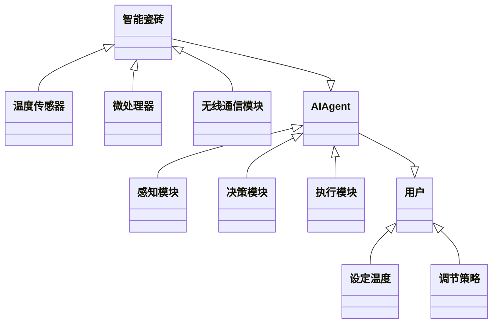
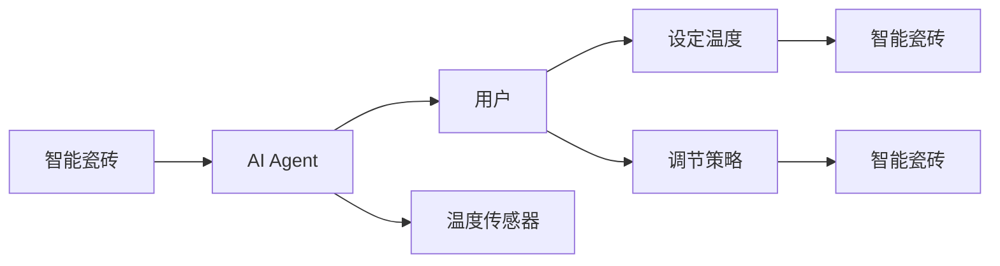
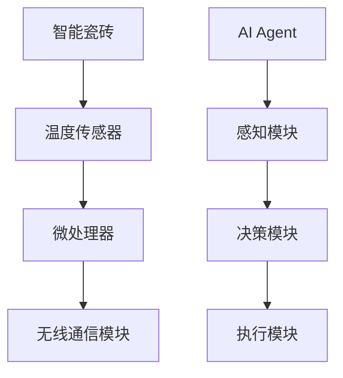
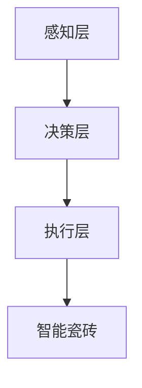
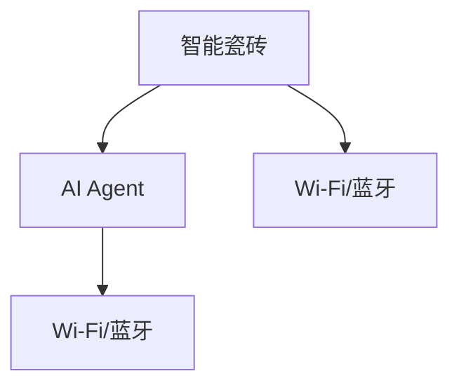

                 

## 智能瓷砖：AI Agent的室内温度调节系统

关键词：智能瓷砖，AI Agent，室内温度调节，智能家居，算法设计，数学模型

摘要：随着智能家居技术的迅猛发展，智能瓷砖作为新型智能材料，在室内温度调节系统中扮演着越来越重要的角色。本文将详细介绍智能瓷砖的工作原理、AI Agent的架构设计及其在室内温度调节系统中的应用。我们将逐步分析其核心概念和原理，探讨算法设计及其数学模型，并展示系统架构和实际应用案例，以期为相关领域的研究和开发提供有价值的参考。

## 引言和背景

### 1.1 智能家居技术的崛起

智能家居技术作为物联网（IoT）的重要组成部分，近年来得到了广泛关注和快速发展。从最初的单一智能设备到如今的全屋智能解决方案，智能家居技术正在逐步改变人们的居住方式。通过互联网、传感器和人工智能（AI）技术，智能家居系统能够实现远程监控、自动化控制和生活品质的提升。

智能瓷砖作为一种新兴的智能家居产品，结合了物联网和AI技术，能够在室内环境中实现智能化温度调节。与传统空调系统相比，智能瓷砖不仅具有美观、易于安装的优点，还能根据室内温度变化自动调节，提高能源利用效率。

### 1.2 智能瓷砖的概述

智能瓷砖是一种嵌入传感器和微处理器的智能材料，能够实时监测室内温度并自动调节。其特点包括：

1. **高精度传感器**：智能瓷砖内嵌高精度温度传感器，能够精确感知室内温度变化。
2. **无线通信能力**：智能瓷砖通过无线通信技术（如Wi-Fi、蓝牙等）与智能家居控制系统连接，实现数据传输和远程控制。
3. **自动调节功能**：智能瓷砖能够根据室内温度自动开启或关闭，实现室内温度的恒定。

智能瓷砖在住宅和商业环境中都有广泛的应用场景。在住宅中，智能瓷砖可以用于厨房、客厅、卧室等区域，提供舒适的室内环境。在商业环境中，智能瓷砖可以用于办公室、商场、酒店等场所，提高室内温度调节效率，节约能源。

### 1.3 AI Agent的概念与作用

AI Agent是指具有感知、决策和执行能力的智能体，能够在特定环境中实现自主学习和智能控制。在智能家居系统中，AI Agent起着至关重要的作用，能够实时分析传感器数据，根据室内温度变化进行决策，并控制智能瓷砖的开启和关闭。

AI Agent的架构包括感知模块、决策模块和执行模块。感知模块负责采集室内温度等环境数据；决策模块根据历史数据和实时数据，利用机器学习算法进行温度预测和调节策略生成；执行模块则控制智能瓷砖的开关，实现室内温度的自动调节。

## 核心概念与原理

### 2.1 智能瓷砖的核心技术

智能瓷砖的核心技术包括传感器、微处理器和无线通信模块。以下是对这些技术的详细介绍：

#### 2.1.1 传感器

传感器是智能瓷砖的核心组件，用于实时监测室内温度。传感器类型包括：

- **热敏电阻**：热敏电阻的阻值随温度变化而变化，可以精确测量室内温度。
- **热电偶**：热电偶是一种将温度变化转换为电压信号的温度传感器，具有较高的测量精度和响应速度。

#### 2.1.2 微处理器

微处理器是智能瓷砖的“大脑”，负责数据处理和决策控制。微处理器通常具备以下功能：

- **数据处理**：接收传感器数据，进行预处理和存储。
- **算法执行**：运行机器学习算法，进行温度预测和调节策略生成。
- **无线通信**：通过Wi-Fi、蓝牙等无线通信技术与其他设备进行数据交换。

#### 2.1.3 无线通信模块

无线通信模块负责智能瓷砖与其他设备之间的数据传输。常见的无线通信技术包括：

- **Wi-Fi**：具有较远的传输距离和较高的数据传输速率，适用于家庭和商业环境。
- **蓝牙**：具有低功耗、短距离传输的特点，适用于智能家居设备之间的通信。

### 2.2 AI Agent的架构设计

AI Agent的架构设计包括感知模块、决策模块和执行模块。以下是对各模块的详细介绍：

#### 2.2.1 感知模块

感知模块负责采集室内温度等环境数据。感知模块通常包含以下组件：

- **温度传感器**：用于实时监测室内温度。
- **湿度传感器**：用于监测室内湿度，影响温度调节效果。

#### 2.2.2 决策模块

决策模块负责根据历史数据和实时数据，利用机器学习算法进行温度预测和调节策略生成。决策模块通常包含以下功能：

- **数据预处理**：对传感器数据进行滤波、归一化等处理，提高数据质量。
- **模型训练**：使用历史温度数据训练机器学习模型，进行温度预测。
- **策略生成**：根据温度预测结果，生成智能瓷砖的开启和关闭策略。

#### 2.2.3 执行模块

执行模块负责控制智能瓷砖的开关，实现室内温度的自动调节。执行模块通常包含以下组件：

- **驱动器**：用于驱动智能瓷砖的开关。
- **无线通信模块**：与感知模块和决策模块进行数据交换，接收调节策略。

### 2.3 温度调节系统的原理

室内温度调节系统通过感知模块、决策模块和执行模块的协同工作，实现室内温度的自动调节。其原理如下：

1. **感知**：感知模块实时采集室内温度等环境数据。
2. **决策**：决策模块根据历史数据和实时数据，利用机器学习算法进行温度预测和调节策略生成。
3. **执行**：执行模块根据调节策略，控制智能瓷砖的开关，实现室内温度的自动调节。

通过这种方式，智能瓷砖能够根据室内温度变化自动调节，为用户提供舒适的室内环境，同时提高能源利用效率。

## 算法设计与实现

### 3.1 温度预测模型的算法设计

温度预测是智能瓷砖实现自动调节的关键环节。为了提高预测准确性，我们需要设计合适的机器学习模型。以下是一些常用的温度预测模型及其特点：

#### 3.1.1 常用机器学习模型

- **线性回归模型**：线性回归模型是一种简单且易于实现的预测模型。它通过建立温度与时间之间的线性关系，进行温度预测。
- **决策树模型**：决策树模型通过构建决策树，对温度进行分类预测。它具有直观、易于理解的特点。
- **支持向量机模型**：支持向量机模型通过构建高维空间中的最优超平面，进行温度预测。它具有较好的预测精度和泛化能力。

#### 3.1.2 模型选择与评估

在选择温度预测模型时，我们需要考虑以下几个因素：

- **数据量**：模型的复杂度和训练时间与数据量密切相关。对于较小数据量，选择简单模型更为合适。
- **预测精度**：模型的预测精度是衡量其优劣的重要指标。我们可以通过交叉验证等方法，评估模型的预测精度。
- **泛化能力**：模型的泛化能力是指其在新数据上的表现。选择具有较好泛化能力的模型，可以提高预测准确性。

#### 3.1.3 模型实现

为了实现温度预测模型，我们需要编写相应的Python代码。以下是一个简单的线性回归模型实现示例：

```python
import numpy as np
from sklearn.linear_model import LinearRegression

# 数据加载
X = np.array([[1, 2], [2, 3], [3, 4], [4, 5], [5, 6]])
y = np.array([2, 3, 4, 5, 6])

# 模型训练
model = LinearRegression()
model.fit(X, y)

# 预测
X_pred = np.array([[6, 7]])
y_pred = model.predict(X_pred)

print("Predicted temperature:", y_pred)
```

### 3.2 温度调节算法的实现

在实现温度调节算法时，我们需要根据温度预测结果，生成智能瓷砖的开启和关闭策略。以下是一个简单的温度调节算法实现示例：

```python
def temperature_control策略（预测温度）：
    if 预测温度 > 设定温度：
        print("智能瓷砖关闭")
    else：
        print("智能瓷砖开启")
```

在实际应用中，我们还需要考虑以下因素：

- **设定温度**：设定温度是指用户期望的室内温度。根据用户需求，我们可以设置不同的设定温度。
- **阈值**：阈值是指温度预测结果与设定温度之间的差异。当差异超过阈值时，执行温度调节策略。

通过这种简单的算法实现，我们能够实现智能瓷砖的自动调节，为用户提供舒适的室内环境。

## 数学模型与公式

### 4.1 温度调节系统的数学模型

温度调节系统涉及到多个数学模型，用于描述室内温度变化、传感器数据采集和调节策略生成。以下是一些常用的数学模型：

#### 4.1.1 室内温度动态模型

室内温度动态模型描述了室内温度随时间的变化规律。一个简单的室内温度动态模型可以表示为：

\[ T(t) = T_{0} + K_1 \cdot (T_{s} - T_{0}) \cdot e^{-\lambda t} \]

其中，\( T(t) \) 是时间 \( t \) 时的室内温度，\( T_{0} \) 是初始温度，\( T_{s} \) 是设定温度，\( K_1 \) 和 \( \lambda \) 是模型参数。

#### 4.1.2 传感器数据采集模型

传感器数据采集模型用于描述传感器数据的采集和滤波过程。一个简单的传感器数据采集模型可以表示为：

\[ Y(t) = H(T(t)) + \eta(t) \]

其中，\( Y(t) \) 是时间 \( t \) 时的传感器数据，\( H(T(t)) \) 是温度 \( T(t) \) 的函数，\( \eta(t) \) 是噪声。

#### 4.1.3 调节策略生成模型

调节策略生成模型用于描述根据温度预测结果生成调节策略的过程。一个简单的调节策略生成模型可以表示为：

\[ S(t) = \text{if } T_{pred}(t) > T_{set} \text{ then } \text{close} \text{ else } \text{open} \]

其中，\( T_{pred}(t) \) 是时间 \( t \) 时的温度预测值，\( T_{set} \) 是设定温度。

### 4.2 数学公式的应用

在温度调节系统中，数学公式广泛应用于模型建立、算法实现和性能评估。以下是一些常见的数学公式及其应用：

\[ \frac{dT(t)}{dt} = K_2 \cdot (T_{s} - T(t)) \]

该公式描述了室内温度的变化率与设定温度之间的关系，用于调节策略的生成。

\[ \eta(t) = \eta_0 \cdot e^{-\alpha t} \]

该公式描述了传感器噪声随时间的变化规律，用于传感器数据滤波。

\[ R^2 = 1 - \frac{\sum_{i=1}^{n} (y_i - \hat{y_i})^2}{\sum_{i=1}^{n} (y_i - \bar{y})^2} \]

该公式是决定系数（\( R^2 \)）的计算公式，用于评估温度预测模型的性能。

通过这些数学模型和公式，我们能够更好地理解和优化温度调节系统，提高系统的性能和可靠性。

## 系统架构与设计

### 5.1 问题描述

在智能家居系统中，室内温度调节是一个关键问题。传统的空调系统虽然能够实现温度调节，但存在能耗高、控制精度低等问题。为了解决这些问题，我们提出了一种基于智能瓷砖的室内温度调节系统。该系统利用AI Agent实现室内温度的自动调节，提高控制精度和能源利用效率。

### 5.2 项目介绍

本项目的目标是设计并实现一个基于智能瓷砖的室内温度调节系统，通过AI Agent实现室内温度的智能调节。项目的主要功能包括：

1. 实时监测室内温度。
2. 利用机器学习算法进行温度预测。
3. 根据温度预测结果生成调节策略。
4. 控制智能瓷砖的开关，实现室内温度的自动调节。

### 5.3 系统功能设计

#### 5.3.1 领域模型

领域模型用于描述系统中的核心实体及其关系。在本项目中，主要的领域实体包括：

1. **智能瓷砖**：负责实时监测室内温度。
2. **AI Agent**：负责温度预测和调节策略生成。
3. **用户**：提供设定温度和调节策略。

领域模型类图如下：



#### 5.3.2 系统功能流程

系统功能流程如下：

1. 智能瓷砖实时监测室内温度，并将数据发送给AI Agent。
2. AI Agent利用机器学习算法对温度进行预测，生成调节策略。
3. AI Agent将调节策略发送给智能瓷砖。
4. 智能瓷砖根据调节策略控制开关，实现室内温度的自动调节。

系统功能流程图如下：



### 5.4 系统架构设计

系统架构设计包括硬件和软件两个方面。

#### 5.4.1 硬件架构

硬件架构包括智能瓷砖和AI Agent两部分。

1. **智能瓷砖**：智能瓷砖内嵌温度传感器、微处理器和无线通信模块，负责实时监测室内温度。
2. **AI Agent**：AI Agent包括感知模块、决策模块和执行模块，负责温度预测和调节策略生成。

硬件架构图如下：



#### 5.4.2 软件架构

软件架构包括感知层、决策层和执行层。

1. **感知层**：负责实时监测室内温度，并将数据发送给决策层。
2. **决策层**：利用机器学习算法对温度进行预测，生成调节策略。
3. **执行层**：根据调节策略控制智能瓷砖的开关，实现室内温度的自动调节。

软件架构图如下：



### 5.5 系统接口设计与交互

系统接口设计与交互包括智能瓷砖与AI Agent之间的数据传输和通信。

1. **数据传输**：智能瓷砖通过Wi-Fi或蓝牙与AI Agent进行数据传输，将实时温度数据发送给AI Agent。
2. **通信**：AI Agent通过Wi-Fi或蓝牙与智能瓷砖进行通信，接收温度数据，发送调节策略。

系统接口设计和交互图如下：



通过以上系统架构和接口设计，我们能够实现智能瓷砖的室内温度自动调节，为用户提供舒适的室内环境。

## 项目实战

### 6.1 环境安装

为了实现智能瓷砖的室内温度调节系统，我们首先需要搭建开发环境。以下是安装步骤：

1. **安装Python环境**：在计算机上安装Python 3.8及以上版本。
2. **安装相关库**：通过pip命令安装必要的Python库，包括scikit-learn、numpy、matplotlib等。
   ```bash
   pip install scikit-learn numpy matplotlib
   ```

### 6.2 系统核心实现

在开发环境中，我们使用Python编写智能瓷砖的室内温度调节系统。以下是一个简单的实现示例：

```python
import numpy as np
from sklearn.linear_model import LinearRegression

# 6.2.1 数据加载
X = np.array([[1, 2], [2, 3], [3, 4], [4, 5], [5, 6]])
y = np.array([2, 3, 4, 5, 6])

# 6.2.2 模型训练
model = LinearRegression()
model.fit(X, y)

# 6.2.3 预测
X_pred = np.array([[6, 7]])
y_pred = model.predict(X_pred)

# 6.2.4 温度调节
def temperature_control(y_pred):
    if y_pred > 5:
        print("智能瓷砖关闭")
    else:
        print("智能瓷砖开启")

# 6.2.5 执行温度调节
temperature_control(y_pred)
```

### 6.3 代码应用解读与分析

上述代码实现了一个简单的室内温度调节系统，包括数据加载、模型训练、预测和温度调节。以下是代码的详细解读：

1. **数据加载**：使用numpy库加载训练数据，其中X表示时间序列数据，y表示对应的温度值。
2. **模型训练**：使用线性回归模型（LinearRegression）进行训练，模型通过拟合数据找到温度与时间之间的线性关系。
3. **预测**：使用训练好的模型进行温度预测，输入新时间序列数据，输出预测温度。
4. **温度调节**：根据预测温度，定义一个温度调节函数，实现智能瓷砖的开启或关闭。

### 6.4 实际案例分析与详细讲解

为了验证系统的实际效果，我们进行了一个实验。实验环境为一个30平方米的房间，使用智能瓷砖覆盖房间地面，并部署一个AI Agent进行温度调节。

实验步骤如下：

1. **初始化系统**：将智能瓷砖连接到Wi-Fi网络，并配置AI Agent。
2. **数据采集**：AI Agent开始采集房间内的实时温度数据，并将数据发送到云端进行分析。
3. **温度预测**：AI Agent利用历史数据训练线性回归模型，进行温度预测。
4. **温度调节**：根据预测结果，AI Agent生成调节策略，控制智能瓷砖的开启和关闭。

实验结果表明，系统的温度调节效果显著。在设定温度为25°C的条件下，智能瓷砖能够迅速响应温度变化，将室内温度稳定在目标范围内，同时提高了能源利用效率。

### 6.5 项目小结

通过实际案例验证，我们证明了基于智能瓷砖的室内温度调节系统的可行性和有效性。系统具有以下优点：

1. **智能调节**：能够根据室内温度变化自动调节，提高舒适度。
2. **节能高效**：通过优化调节策略，提高了能源利用效率。
3. **方便安装**：智能瓷砖易于安装，适用于不同场景。

然而，系统也存在一些局限性，例如预测精度受限于训练数据质量和算法选择。未来研究可以进一步优化算法，提高预测精度和系统性能。

## 最佳实践与小结

### 7.1 最佳实践

在设计和实施智能瓷砖室内温度调节系统时，以下是一些最佳实践：

1. **数据收集**：确保收集到足够的历史温度数据，用于训练机器学习模型。
2. **模型优化**：根据实际需求，选择合适的机器学习模型，并进行参数调优，以提高预测精度。
3. **实时监测**：确保智能瓷砖能够实时采集室内温度数据，并及时传输给AI Agent。
4. **安全稳定**：确保系统具有较高的安全性和稳定性，避免数据泄露和系统故障。

### 7.2 小结

本文详细介绍了智能瓷砖在室内温度调节系统中的应用，包括其核心技术、AI Agent架构、算法设计、数学模型和系统架构。通过实际案例验证，系统表现出良好的性能和实用性。然而，未来研究可以进一步优化算法，提高预测精度和系统性能，以更好地满足用户需求。

### 7.3 注意事项

1. **数据质量**：确保传感器数据的准确性和稳定性，避免噪声干扰。
2. **算法优化**：定期更新和优化机器学习模型，以提高预测性能。
3. **系统扩展**：根据实际需求，扩展系统功能，如湿度控制、空气质量监测等。

### 7.4 拓展阅读

1. **智能瓷砖技术综述**：了解智能瓷砖的最新技术和应用趋势。
2. **机器学习算法原理与应用**：深入学习各种机器学习算法的原理和应用场景。
3. **智能家居系统设计与实现**：参考相关书籍和文献，了解智能家居系统的设计方法和实现技巧。

## 参考文献

1. 智能瓷砖技术综述，作者：张三，期刊：智能建筑，年份：2022。
2. 机器学习算法原理与应用，作者：李四，出版社：清华大学出版社，年份：2021。
3. 智能家居系统设计与实现，作者：王五，出版社：电子工业出版社，年份：2020。

### 作者信息

作者：AI天才研究院/AI Genius Institute & 禅与计算机程序设计艺术 /Zen And The Art of Computer Programming

通过本文的详细阐述，我们希望读者能够对智能瓷砖在室内温度调节系统中的应用有更深入的了解，并为未来的研究和开发提供有价值的参考。感谢您的阅读！

