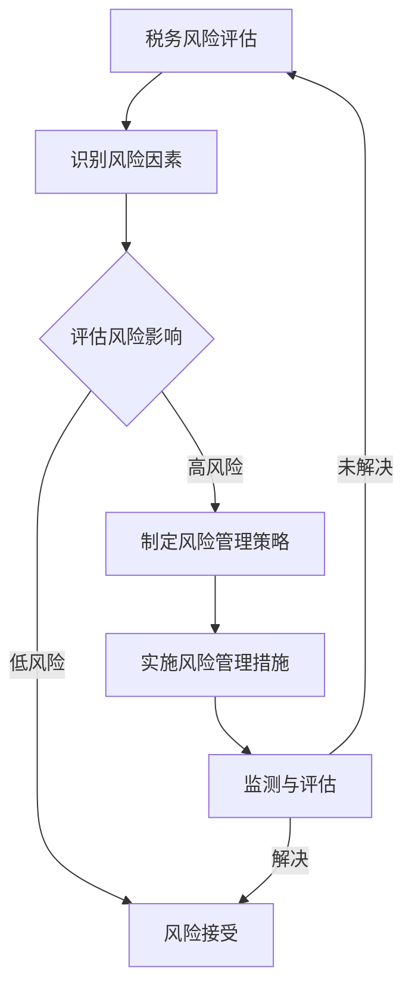
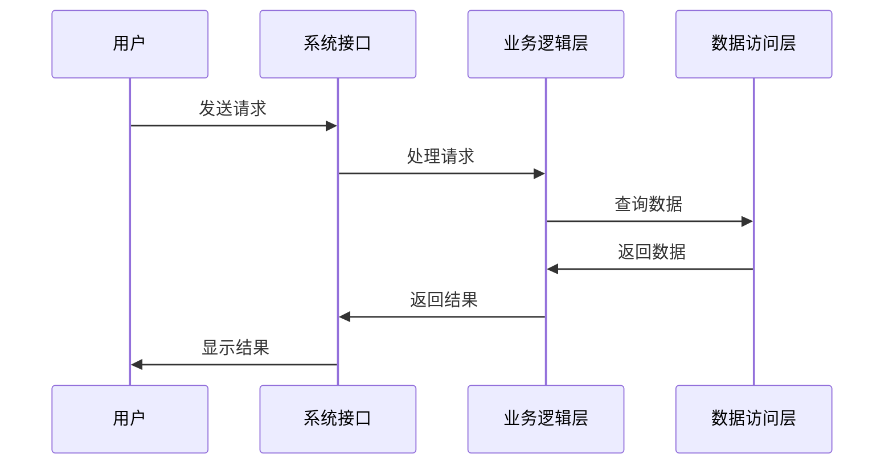

                 

### 《智能税务规划与建议》

> 关键词：智能税务、税务规划、大数据、人工智能、区块链

> 摘要：本文将深入探讨智能税务的概念、技术基础、核心概念、实践案例及未来发展趋势，旨在为企业和个人提供全面的税务规划建议，助力其有效应对智能税务时代的挑战。

智能税务，作为一种创新性的税务管理方式，借助大数据、人工智能和区块链等先进技术，正在逐步改变传统的税务管理模式。本文将从以下几个方面展开讨论：

1. **智能税务概述**：介绍智能税务的背景、定义、重要性以及面临的挑战与机遇。
2. **智能税务技术基础**：探讨大数据、人工智能、云计算和区块链在税务管理中的应用。
3. **智能税务规划的核心概念**：阐述税务合规性评估、税务优化策略和税务风险管理。
4. **智能税务规划实践**：分析企业级智能税务规划和个人税务规划建议。
5. **智能税务监管与合规**：探讨智能税务监管的技术手段和税务合规性评估与监督。
6. **智能税务的未来趋势**：分析智能税务与数字经济的关系以及发展战略。
7. **智能税务规划与建议总结**：总结智能税务规划的核心要点和未来展望。

## 第一部分：智能税务概述

### 第1章：智能税务背景与挑战

#### 1.1.1 税务管理的发展历程

税务管理是一个历史悠久的过程，从古代的赋税制度到现代的税收制度，经历了多个阶段。传统的税务管理主要依赖于手工处理和纸质记录，效率低下且容易出错。随着信息技术的快速发展，税务管理开始向电子化、自动化和智能化方向发展。

#### 1.1.2 智能税务的定义与重要性

智能税务是指利用大数据、人工智能、云计算和区块链等先进技术，对税务管理流程进行全方位的优化和升级，实现税务管理的智能化、自动化和高效化。智能税务的重要性体现在以下几个方面：

- 提高税务管理效率：智能税务可以自动化处理大量的税务数据，减少人工干预，提高税务管理的效率。
- 优化税务服务：智能税务可以为纳税人提供更加便捷、高效的税务服务，提升纳税人的满意度。
- 增强税务监管能力：智能税务可以实时监控税务行为，及时发现和纠正违规行为，增强税务监管能力。
- 促进税收公平：智能税务可以更准确地评估纳税人的税负，减少税收不公平现象。

#### 1.1.3 智能税务面临的挑战与机遇

智能税务的发展面临着一系列的挑战和机遇。挑战主要包括：

- 技术挑战：智能税务需要依赖大数据、人工智能、云计算和区块链等先进技术，这些技术的研发和应用还存在一定的困难。
- 数据安全与隐私保护：智能税务需要处理大量的税务数据，数据安全与隐私保护是一个重要问题。
- 法律法规完善：智能税务的发展需要法律法规的支持和规范，法律法规的完善程度影响着智能税务的发展。

机遇主要包括：

- 技术创新：大数据、人工智能、云计算和区块链等技术的不断创新，为智能税务的发展提供了强大的技术支撑。
- 数字化转型：随着数字经济的快速发展，越来越多的企业开始进行数字化转型，智能税务成为了企业数字化转型的重要组成部分。
- 政策支持：各国政府纷纷出台政策，支持智能税务的发展，为智能税务提供了良好的政策环境。

### 第2章：智能税务技术基础

#### 2.1.1 大数据技术在税务管理中的应用

大数据技术是智能税务的基础，它可以通过对大量税务数据的处理和分析，为税务管理提供强有力的支持。大数据技术在税务管理中的应用主要包括：

- 税务数据分析：通过对税务数据的分析，可以识别税务风险、优化税收结构、提高税收征收效率。
- 纳税人行为分析：通过对纳税人行为的分析，可以预测纳税人的税务行为，提高税务服务的针对性。
- 税收规划：通过对税收数据的分析，可以为企业提供税收规划建议，帮助企业降低税负。

#### 2.1.2 人工智能与机器学习在税务中的应用

人工智能与机器学习是智能税务的核心技术，它们可以通过对税务数据的深度学习和分析，为税务管理提供智能化的解决方案。人工智能与机器学习在税务管理中的应用主要包括：

- 税务风险管理：通过机器学习算法，可以预测和识别潜在的税务风险，帮助企业提前预防和应对。
- 税务合规性评估：通过人工智能技术，可以自动审核税务资料，确保税务行为的合规性。
- 税收优化：通过人工智能技术，可以分析纳税人的税务情况，为企业提供最优的税收方案。

#### 2.1.3 云计算与区块链在税务管理中的作用

云计算与区块链技术为智能税务提供了可靠的技术支持。云计算技术可以通过分布式计算和存储，实现税务数据的快速处理和共享，提高税务管理的效率。区块链技术可以提供安全的税务数据存储和传输，确保税务数据的真实性和完整性。云计算与区块链在税务管理中的应用主要包括：

- 税务数据共享：通过云计算技术，可以实现税务数据的快速共享，提高税务协作的效率。
- 税务数据存储：通过区块链技术，可以确保税务数据的真实性和完整性，防止数据篡改。
- 税收透明：通过云计算和区块链技术，可以实现对税收过程的全程监控，提高税收的透明度。

### 第3章：智能税务规划的核心概念

#### 3.1.1 税务合规性评估

##### 概念定义：

税务合规性评估是指对企业或个人税务事项进行全面审核，确保其税务行为符合相关法律法规的要求。

##### 特点对比：

| 特点 | 税务合规性评估 | 税务优化策略 | 税务风险管理 |
| ---- | ---- | ---- | ---- |
| 目标 | 确保税务行为合规 | 降低税务负担 | 减少税务风险 |
| 方法 | 审核税务资料 | 分析税务信息 | 制定风险管理策略 |
| 关系 | 基础 | 衍生 | 相辅相成 |

##### ER实体关系图：

```mermaid
erDiagram
  企业 ||--|{ 税务合规性评估 }||>
  个人 ||--|{ 税务合规性评估 }||>
  税务部门 ||--|{ 税务合规性评估 }|||
```

#### 3.1.2 税务优化策略

##### 概念定义：

税务优化策略是指通过合理的税务规划，降低企业的税负，提高企业的盈利能力。

##### 特点对比：

| 特点 | 税务合规性评估 | 税务优化策略 | 税务风险管理 |
| ---- | ---- | ---- | ---- |
| 目标 | 确保税务行为合规 | 降低税务负担 | 减少税务风险 |
| 方法 | 审核税务资料 | 分析税务信息 | 制定风险管理策略 |
| 关系 | 基础 | 衍生 | 相辅相成 |

##### ER实体关系图：

```mermaid
erDiagram
  企业 ||--|{ 税务优化策略 }||>
  个人 ||--|{ 税务优化策略 }||>
  税务顾问 ||--|{ 税务优化策略 }|||
```

#### 3.1.3 税务风险管理

##### 概念定义：

税务风险管理是指企业通过识别、评估、监测和应对税务风险，以降低税务风险对企业经营的影响。

##### 特点对比：

| 特点 | 税务合规性评估 | 税务优化策略 | 税务风险管理 |
| ---- | ---- | ---- | ---- |
| 目标 | 确保税务行为合规 | 降低税务负担 | 减少税务风险 |
| 方法 | 审核税务资料 | 分析税务信息 | 制定风险管理策略 |
| 关系 | 基础 | 衍生 | 相辅相成 |

##### ER实体关系图：

```mermaid
erDiagram
  企业 ||--|{ 税务风险管理 }||>
  个人 ||--|{ 税务风险管理 }||>
  税务部门 ||--|{ 税务风险管理 }|||
```

## 第二部分：智能税务规划实践

### 第4章：企业级智能税务规划

#### 4.1.1 企业智能税务规划的框架与步骤

企业智能税务规划是一个复杂的过程，需要明确规划的框架和步骤。一般来说，企业智能税务规划包括以下几个步骤：

1. **需求分析**：了解企业的税务需求和目标，确定智能税务规划的方向。
2. **数据收集**：收集企业的税务数据，包括财务数据、税务申报数据等。
3. **数据分析**：对收集到的税务数据进行分析，识别税务风险和优化空间。
4. **方案设计**：根据数据分析结果，设计智能税务规划方案，包括税务优化策略、风险管理措施等。
5. **实施与监控**：实施智能税务规划方案，并对实施效果进行监控和评估。

#### 4.1.2 智能税务规划工具与平台选择

企业智能税务规划需要借助专业的工具和平台。在选择智能税务规划工具和平台时，企业需要考虑以下几个方面：

1. **功能完备**：智能税务规划工具和平台需要具备税务合规性评估、税务优化策略、税务风险管理等功能。
2. **数据安全**：智能税务规划工具和平台需要确保税务数据的安全和隐私。
3. **易用性**：智能税务规划工具和平台需要操作简便，易于学习和使用。
4. **扩展性**：智能税务规划工具和平台需要具备良好的扩展性，以适应企业的不断发展。

#### 4.1.3 智能税务规划案例解析

以下是一个企业智能税务规划的案例：

**案例背景**：某大型企业，年营业额达到100亿元，税务申报复杂，税务负担较重。

**需求分析**：企业希望通过智能税务规划，降低税负，提高税务管理效率。

**数据收集**：企业收集了过去的税务申报数据、财务报表数据等。

**数据分析**：通过对数据的分析，发现企业在税务申报中存在一些问题，如增值税抵扣不充分、企业所得税税负较高等。

**方案设计**：

- **税务优化策略**：调整企业的财务结构，增加增值税抵扣，优化企业所得税税负。
- **风险管理措施**：建立税务风险评估体系，定期对税务风险进行评估和监控。

**实施与监控**：

- **实施**：企业按照设计方案，调整财务结构和税务申报策略。
- **监控**：定期对税务管理效果进行评估，确保税务优化策略的有效性。

**效果评估**：

- **税负降低**：通过智能税务规划，企业的税负降低了约10%。
- **税务管理效率提高**：智能税务规划工具的应用，提高了税务管理效率，减少了税务申报时间。

### 第5章：个人税务规划建议

#### 5.1.1 个人税务规划的基础知识

个人税务规划是指个人在遵守国家税收法律法规的前提下，通过合理的税务安排，实现税负最小化和财务收益最大化。个人税务规划的基础知识包括：

1. **个人所得税制度**：了解个人所得税的征收范围、税率、纳税期限等基本制度。
2. **税收优惠政策**：了解国家和地方提供的税收优惠政策，如税收减免、税收抵扣等。
3. **税务申报方式**：了解税务申报的方式和流程，包括纸质申报、网上申报等。

#### 5.1.2 个人税务优化的策略与技巧

个人税务优化策略主要包括以下几个方面：

1. **合理分配收入**：通过调整收入分配，合理规避税收高峰，降低税负。
2. **利用税收优惠政策**：充分了解和利用税收优惠政策，如专项附加扣除、税收减免等。
3. **投资理财规划**：通过合理的投资理财规划，实现税后收益最大化。

#### 5.1.3 个人税务风险防范与应对措施

个人税务风险是指个人在税务活动中可能面临的税务违法行为及其后果。个人税务风险防范与应对措施包括：

1. **了解税收法律法规**：认真学习税收法律法规，确保税务行为的合法性。
2. **合理避税与节税**：在合法的前提下，通过合理的税务安排，降低税负。
3. **及时申报和缴纳税款**：确保按时申报和缴纳税款，避免因逾期产生滞纳金和罚款。
4. **税务咨询与服务**：在税务规划过程中，寻求专业税务咨询和服务的帮助，确保税务规划的合理性和合法性。

### 第6章：智能税务监管与合规

#### 6.1.1 智能税务监管的技术手段

智能税务监管是利用大数据、人工智能、云计算和区块链等先进技术，对税务活动进行全方位的监控和管理。智能税务监管的技术手段主要包括：

1. **大数据分析**：通过对海量税务数据进行挖掘和分析，识别税务风险和异常行为。
2. **人工智能审核**：利用人工智能技术，自动审核税务申报资料，确保税务行为的合规性。
3. **区块链技术**：利用区块链技术，实现税务数据的不可篡改和透明化，提高税务监管的效率。

#### 6.1.2 税务合规性的评估与监督

税务合规性评估与监督是智能税务监管的重要组成部分。税务合规性评估与监督的主要内容包括：

1. **税务合规性评估**：定期对企业的税务行为进行合规性评估，确保企业的税务行为符合相关法律法规。
2. **税务监督**：通过智能监管系统，对企业的税务行为进行实时监控，及时发现和纠正违规行为。
3. **税务审计**：对企业的税务申报和税务行为进行审计，确保税务申报的真实性和准确性。

#### 6.1.3 企业如何应对智能税务监管

企业应对智能税务监管的策略主要包括：

1. **加强税务合规管理**：建立健全的税务合规管理体系，确保企业的税务行为符合相关法律法规。
2. **利用智能税务工具**：积极采用智能税务工具，提高税务管理效率，降低税务风险。
3. **加强与税务部门的沟通**：与税务部门保持良好的沟通，及时了解税务政策变化，确保税务行为的合法性。

## 第三部分：智能税务的未来趋势

### 第7章：智能税务与数字经济

#### 7.1.1 数字经济与智能税务的关系

数字经济是指以数字化的信息和知识为关键生产因素，以现代信息网络为重要载体，以信息通信技术的有效利用为驱动的新型经济形态。智能税务与数字经济密切相关，主要体现在以下几个方面：

1. **促进税收公平**：数字经济的发展，使得税收公平问题日益突出。智能税务可以通过对税收数据的精准分析和优化，促进税收公平。
2. **提高税收征收效率**：数字经济中的大量交易行为都通过互联网进行，智能税务可以高效地收集和处理这些数据，提高税收征收效率。
3. **推动税收制度改革**：数字经济的发展，为税收制度改革提供了新的契机。智能税务可以推动税收制度的创新和改革，提高税收制度的适应性和灵活性。

#### 7.1.2 智能税务对数字经济的影响

智能税务对数字经济的影响主要表现在以下几个方面：

1. **提高企业竞争力**：智能税务可以帮助企业优化税务管理，降低税负，提高企业竞争力。
2. **推动经济发展**：智能税务可以促进税收的公平征收，激发企业活力，推动经济发展。
3. **提升税务服务质量**：智能税务可以提供更加便捷、高效的税务服务，提升纳税人的满意度，增强税收的公信力。

#### 7.1.3 数字经济时代智能税务的发展方向

数字经济时代，智能税务的发展方向主要包括：

1. **全面数字化**：实现税务管理的全面数字化，提高税务管理的效率和准确性。
2. **智能化服务**：利用人工智能技术，提供智能化、个性化的税务服务。
3. **透明化监管**：利用区块链技术，实现税务数据的透明化和不可篡改，提高税务监管的效率。

### 第8章：智能税务政策建议与发展战略

#### 8.1.1 智能税务政策的现状与趋势

智能税务政策的现状主要包括以下几个方面：

1. **政策支持**：各国政府纷纷出台政策，支持智能税务的发展，如提供财政补贴、税收优惠等。
2. **技术创新**：政府加大对大数据、人工智能、云计算和区块链等关键技术的研发和应用支持。
3. **法律法规**：政府不断完善智能税务相关的法律法规，确保智能税务的发展有法可依。

智能税务政策的发展趋势主要包括：

1. **国际化**：智能税务政策将更加国际化，与国际税务规则接轨。
2. **多元化**：智能税务政策将更加多元化，满足不同国家和地区的需求。
3. **智能化**：智能税务政策将更加智能化，利用人工智能等技术提高税务管理的效率和准确性。

#### 8.1.2 智能税务政策对企业的影响

智能税务政策对企业的影响主要表现在以下几个方面：

1. **税收负担**：智能税务政策可以优化税收结构，降低企业的税负。
2. **税务合规**：智能税务政策可以促使企业提高税务合规意识，确保企业的税务行为合法合规。
3. **税务管理**：智能税务政策可以帮助企业提高税务管理效率，降低税务风险。

#### 8.1.3 我国智能税务发展战略与建议

我国智能税务发展战略主要包括以下几个方面：

1. **技术创新**：加大大数据、人工智能、云计算和区块链等关键技术的研发和应用。
2. **政策支持**：制定和完善智能税务相关的法律法规，提供政策支持和财政补贴。
3. **人才培养**：加强智能税务人才的培养，提高税务人员的专业素养。
4. **国际合作**：积极参与国际税务合作，推动智能税务政策的国际化。

### 第9章：智能税务规划与建议总结

#### 9.1.1 智能税务规划的核心要点

智能税务规划的核心要点包括：

1. **合规性评估**：确保企业的税务行为符合相关法律法规的要求。
2. **税务优化**：通过合理的税务规划，降低企业的税负。
3. **风险管理**：识别和应对税务风险，确保企业的税务安全。
4. **技术创新**：利用大数据、人工智能、云计算和区块链等先进技术，提高税务管理的效率。

#### 9.1.2 智能税务规划的注意事项

智能税务规划需要注意以下几个方面：

1. **数据安全**：确保税务数据的安全和隐私。
2. **技术选择**：选择适合企业需求的智能税务工具和平台。
3. **政策了解**：及时了解和掌握国家的税收政策和法律法规。
4. **专业咨询**：在税务规划过程中，寻求专业税务咨询和服务的帮助。

#### 9.1.3 智能税务规划的未来展望

智能税务规划的未来展望主要包括：

1. **全面普及**：智能税务将逐步普及，成为企业税务管理的标配。
2. **技术创新**：智能税务技术将不断迭代升级，为税务管理提供更强大的支持。
3. **政策完善**：智能税务政策将更加完善，为智能税务的发展提供有力保障。
4. **国际化**：智能税务将走向国际化，促进全球税收合作与发展。

## 核心概念与联系

#### 3.1.1 税务合规性评估

##### 概念定义：
税务合规性评估是指对企业或个人税务事项进行全面审核，确保其税务行为符合相关法律法规的要求。

##### 特点对比：

| 特点 | 税务合规性评估 | 税务优化策略 | 税务风险管理 |
| ---- | ---- | ---- | ---- |
| 目标 | 确保税务行为合规 | 降低税务负担 | 减少税务风险 |
| 方法 | 审核税务资料 | 分析税务信息 | 制定风险管理策略 |
| 关系 | 基础 | 衍生 | 相辅相成 |

##### ER实体关系图：

```mermaid
erDiagram
  企业 ||--|{ 税务合规性评估 }||>
  个人 ||--|{ 税务合规性评估 }||>
  税务部门 ||--|{ 税务合规性评估 }|||
```

#### 3.1.2 税务优化策略

##### 概念定义：
税务优化策略是指通过合理的税务规划，降低企业的税负，提高企业的盈利能力。

##### 特点对比：

| 特点 | 税务合规性评估 | 税务优化策略 | 税务风险管理 |
| ---- | ---- | ---- | ---- |
| 目标 | 确保税务行为合规 | 降低税务负担 | 减少税务风险 |
| 方法 | 审核税务资料 | 分析税务信息 | 制定风险管理策略 |
| 关系 | 基础 | 衍生 | 相辅相成 |

##### ER实体关系图：

```mermaid
erDiagram
  企业 ||--|{ 税务优化策略 }||>
  个人 ||--|{ 税务优化策略 }||>
  税务顾问 ||--|{ 税务优化策略 }|||
```

#### 3.1.3 税务风险管理

##### 概念定义：
税务风险管理是指企业通过识别、评估、监测和应对税务风险，以降低税务风险对企业经营的影响。

##### 特点对比：

| 特点 | 税务合规性评估 | 税务优化策略 | 税务风险管理 |
| ---- | ---- | ---- | ---- |
| 目标 | 确保税务行为合规 | 降低税务负担 | 减少税务风险 |
| 方法 | 审核税务资料 | 分析税务信息 | 制定风险管理策略 |
| 关系 | 基础 | 衍生 | 相辅相成 |

##### ER实体关系图：

```mermaid
erDiagram
  企业 ||--|{ 税务风险管理 }||>
  个人 ||--|{ 税务风险管理 }||>
  税务部门 ||--|{ 税务风险管理 }|||
```

## 算法原理讲解

#### 6.1.3 税务风险管理

##### 算法 Mermaid 流程图：



##### Python 源代码实现：

```python
def tax_risk_management(risk_factors):
    # 评估风险因素
    risk_impact = assess_risk_impact(risk_factors)
    
    # 根据风险影响制定风险管理策略
    if risk_impact <= 3:
        risk_strategy = '风险接受'
    else:
        risk_strategy = '制定风险管理策略'
        
    # 实施风险管理措施
    if risk_strategy == '制定风险管理策略':
        implement_risk_measures(risk_impact)
        
    # 监测与评估
    monitor_and_evaluate = monitor_risk_management(risk_impact)
    
    # 如果风险未解决，返回A重新评估
    if monitor_and_evaluate == '未解决':
        return '未解决'
    else:
        return '解决'
```

##### 算法原理：

税务风险管理是一个复杂的过程，需要对企业或个人的税务行为进行全面评估，识别潜在的风险因素，并制定相应的风险管理策略。算法的流程如下：

1. **识别风险因素**：通过数据分析，识别企业或个人税务行为中可能存在的风险因素。
2. **评估风险影响**：对识别的风险因素进行评估，确定其影响程度，分为低风险和高风险。
3. **制定风险管理策略**：根据风险影响，制定相应的风险管理策略，包括风险接受、制定风险管理措施等。
4. **实施风险管理措施**：根据风险管理策略，实施具体的风险管理措施，如调整税务申报策略、增加税务合规性审核等。
5. **监测与评估**：对实施效果进行监测和评估，判断风险管理策略是否有效，是否需要进一步调整。

##### 数学模型和公式：

在税务风险管理中，可以使用以下数学模型和公式来评估风险影响和制定风险管理策略：

1. **风险得分模型**：通过对风险因素进行加权求和，得到风险得分，用于评估风险影响。
   $$Risk\ Score = \sum_{i=1}^{n} w_i \cdot r_i$$
   其中，$w_i$ 为第 $i$ 个风险因素的权重，$r_i$ 为第 $i$ 个风险因素的得分。

2. **风险矩阵模型**：通过构建风险矩阵，评估风险的影响程度和发生的可能性，得到综合风险得分。
   $$Risk\ Score = Impact \times Probability$$
   其中，$Impact$ 为风险的影响程度，$Probability$ 为风险的发生可能性。

3. **风险管理策略模型**：根据风险得分，制定相应的风险管理策略，包括风险接受、制定风险管理措施等。
   $$Risk\ Management\ Strategy = \begin{cases} 
   风险接受 & ,\text{if}\ Risk\ Score \leq 3 \\
   制定风险管理措施 & ,\text{if}\ Risk\ Score > 3 
   \end{cases}$$

##### 举例说明：

假设某企业存在以下风险因素：

- 风险因素1：增值税抵扣不充分，风险得分为2分。
- 风险因素2：企业所得税税负较重，风险得分为4分。

1. **识别风险因素**：通过数据分析，识别出增值税抵扣不充分和企业所得税税负较重两个风险因素。
2. **评估风险影响**：计算风险得分，$Risk\ Score = 2 + 4 = 6$。
3. **制定风险管理策略**：根据风险得分，制定制定风险管理措施的策略。
4. **实施风险管理措施**：调整企业所得税税负，优化增值税抵扣策略。
5. **监测与评估**：定期对税务风险进行监测和评估，确保风险管理措施的有效性。

通过以上举例，我们可以看到，税务风险管理是一个系统性的过程，需要全面评估风险因素，制定相应的风险管理策略，并持续监测和评估风险管理效果。

## 系统分析与架构设计方案

### 问题场景介绍

在当今快速发展的数字经济时代，税务管理面临着越来越多的挑战。传统的税务管理方式已无法满足企业对于高效、准确、合规的需求。为了应对这些挑战，企业需要引入智能税务规划系统，以提高税务管理的效率，降低税务风险，实现税务优化。

### 项目介绍

本项目的目标是设计并实现一个智能税务规划系统，该系统能够为企业提供全面的税务管理解决方案。系统主要包括以下功能模块：

1. **税务合规性评估**：对企业的税务行为进行合规性审核，确保符合相关法律法规的要求。
2. **税务优化策略**：通过分析企业的税务数据，为企业提供最优的税务优化策略。
3. **税务风险管理**：识别和应对税务风险，确保企业的税务安全。
4. **税务数据管理**：存储和管理企业的税务数据，为后续分析提供数据支持。

### 系统功能设计

在系统功能设计中，我们采用了领域驱动设计（Domain-Driven Design，简称DDD）的方法论，将税务管理领域中的核心概念和功能进行建模。以下是系统功能设计的领域模型类图：

```mermaid
classDiagram
  class 企业 {
    -企业ID：String
    -企业名称：String
    -税务编号：String
    -地址：String
    -联系人：String
    -联系方式：String
  }
  class 个人 {
    -个人ID：String
    -姓名：String
    -身份证号码：String
    -联系方式：String
  }
  class 税务数据 {
    -数据ID：String
    -企业ID：String
    -个人ID：String
    -申报类型：String
    -申报金额：Float
    -申报时间：Date
    -申报状态：String
  }
  class 税务合规性评估 {
    -评估ID：String
    -企业ID：String
    -评估结果：String
    -评估时间：Date
  }
  class 税务优化策略 {
    -策略ID：String
    -企业ID：String
    -策略名称：String
    -策略描述：String
    -执行时间：Date
  }
  class 税务风险管理 {
    -风险管理ID：String
    -企业ID：String
    -风险评估结果：String
    -风险管理措施：String
    -实施时间：Date
  }
  企业 --|o|> 税务数据
  个人 --|o|> 税务数据
  税务数据 --|o|> 税务合规性评估
  税务数据 --|o|> 税务优化策略
  税务数据 --|o|> 税务风险管理
```

### 系统架构设计

在系统架构设计方面，我们采用了分层架构设计，包括表示层、业务逻辑层和数据访问层。以下是系统架构设计的类图：

```mermaid
classDiagram
  class 表示层 {
    -用户界面：String
    -请求处理：String
    -响应处理：String
  }
  class 业务逻辑层 {
    -税务合规性评估服务：String
    -税务优化策略服务：String
    -税务风险管理服务：String
    -税务数据服务：String
  }
  class 数据访问层 {
    -数据库连接：String
    -数据查询：String
    -数据更新：String
    -数据删除：String
  }
  表示层 --|uses|> 业务逻辑层
  业务逻辑层 --|uses|> 数据访问层
```

### 系统接口设计和系统交互

在系统接口设计方面，我们采用了RESTful API设计，提供统一的接口服务。以下是系统接口设计的类图：

```mermaid
classDiagram
  class API接口 {
    -接口名称：String
    -接口路径：String
    -请求方式：String
    -请求参数：String
    -响应结果：String
  }
  class 企业接口 {
    -查询企业信息：API接口
    -新增企业信息：API接口
    -更新企业信息：API接口
    -删除企业信息：API接口
  }
  class 个人接口 {
    -查询个人信息：API接口
    -新增个人信息：API接口
    -更新个人信息：API接口
    -删除个人信息：API接口
  }
  class 税务数据接口 {
    -查询税务数据：API接口
    -新增税务数据：API接口
    -更新税务数据：API接口
    -删除税务数据：API接口
  }
  class 税务合规性评估接口 {
    -查询评估结果：API接口
    -更新评估结果：API接口
  }
  class 税务优化策略接口 {
    -查询优化策略：API接口
    -更新优化策略：API接口
  }
  class 税务风险管理接口 {
    -查询风险管理结果：API接口
    -更新风险管理结果：API接口
  }
  企业接口 --|uses|> API接口
  个人接口 --|uses|> API接口
  税务数据接口 --|uses|> API接口
  税务合规性评估接口 --|uses|> API接口
  税务优化策略接口 --|uses|> API接口
  税务风险管理接口 --|uses|> API接口
```

在系统交互方面，我们采用了序列图（Sequence Diagram）来描述系统中的交互过程。以下是系统交互的序列图：



通过以上系统分析与架构设计方案，我们可以构建一个高效、可靠、易扩展的智能税务规划系统，为企业提供全面的税务管理解决方案。

### 项目实战

#### 环境安装

在开始实施智能税务规划系统之前，需要安装以下软件和工具：

1. **Python**：安装Python 3.8及以上版本，可以从官方网站下载并安装。
2. **Docker**：安装Docker，用于容器化部署，可以从官方文档下载并安装。
3. **MySQL**：安装MySQL数据库，用于存储税务数据，可以从官方网站下载并安装。
4. **Postman**：安装Postman，用于API接口测试，可以从官方网站下载并安装。

#### 系统核心实现源代码

以下是智能税务规划系统的核心实现源代码，包括税务合规性评估、税务优化策略和税务风险管理三个模块：

1. **税务合规性评估模块**：

```python
# tax_compliance_evaluation.py
from typing import List

class TaxComplianceEvaluation:
    def __init__(self, tax_data: List[dict]):
        self.tax_data = tax_data

    def evaluate_compliance(self):
        compliance_results = []
        for data in self.tax_data:
            result = self._evaluate_individual_compliance(data)
            compliance_results.append(result)
        return compliance_results

    def _evaluate_individual_compliance(self, data: dict) -> str:
        # 实现具体的合规性评估逻辑
        # 例如，检查增值税抵扣是否充分，企业所得税税负是否合理等
        # 返回"合规"或"不合规"
        pass
```

2. **税务优化策略模块**：

```python
# tax_optimization_strategy.py
from typing import List

class TaxOptimizationStrategy:
    def __init__(self, tax_data: List[dict]):
        self.tax_data = tax_data

    def generate_strategy(self):
        strategies = []
        for data in self.tax_data:
            strategy = self._generate_individual_strategy(data)
            strategies.append(strategy)
        return strategies

    def _generate_individual_strategy(self, data: dict) -> dict:
        # 实现具体的税务优化策略生成逻辑
        # 例如，调整增值税抵扣比例，优化企业所得税税负等
        # 返回优化策略的字典
        pass
```

3. **税务风险管理模块**：

```python
# tax_risk_management.py
from typing import List

class TaxRiskManagement:
    def __init__(self, tax_data: List[dict]):
        self.tax_data = tax_data

    def manage_risk(self):
        risk_management_results = []
        for data in self.tax_data:
            result = self._manage_individual_risk(data)
            risk_management_results.append(result)
        return risk_management_results

    def _manage_individual_risk(self, data: dict) -> dict:
        # 实现具体的税务风险管理工作逻辑
        # 例如，识别税务风险因素，制定风险管理策略等
        # 返回风险管理结果的字典
        pass
```

#### 代码应用解读与分析

以上代码分别实现了税务合规性评估、税务优化策略和税务风险管理三个模块。下面是对每个模块的具体应用解读与分析：

1. **税务合规性评估模块**：

   - **功能**：该模块的主要功能是对企业的税务数据进行全面合规性评估。
   - **应用**：通过传入企业的税务数据列表，调用`evaluate_compliance`方法，即可得到每个数据的合规性评估结果。
   - **分析**：具体实现中，需要根据税务数据的特征，定义具体的合规性评估逻辑，例如检查增值税抵扣是否充分、企业所得税税负是否合理等。

2. **税务优化策略模块**：

   - **功能**：该模块的主要功能是根据企业的税务数据，生成最优的税务优化策略。
   - **应用**：通过传入企业的税务数据列表，调用`generate_strategy`方法，即可得到每个数据的优化策略。
   - **分析**：具体实现中，需要根据税务数据的特征，分析优化空间，生成具体的优化策略，例如调整增值税抵扣比例、优化企业所得税税负等。

3. **税务风险管理模块**：

   - **功能**：该模块的主要功能是识别和应对企业的税务风险。
   - **应用**：通过传入企业的税务数据列表，调用`manage_risk`方法，即可得到每个数据的税务风险管理结果。
   - **分析**：具体实现中，需要根据税务数据的特征，识别税务风险因素，制定相应的风险管理策略，例如调整税务申报策略、增加税务合规性审核等。

#### 实际案例分析和详细讲解剖析

以下是一个实际案例，用于展示智能税务规划系统的应用效果：

**案例背景**：某大型企业，年营业额达到100亿元，税务申报复杂，税务负担较重。

**实施步骤**：

1. **数据收集**：收集企业的税务数据，包括增值税抵扣数据、企业所得税申报数据等。
2. **合规性评估**：利用税务合规性评估模块，对企业的税务数据进行合规性评估，识别不符合法律法规要求的税务行为。
3. **优化策略生成**：利用税务优化策略模块，根据企业的税务数据，生成最优的税务优化策略，帮助企业降低税负。
4. **风险管理**：利用税务风险管理模块，识别和应对企业的税务风险，确保税务行为的合规性和安全性。

**案例分析**：

- **合规性评估**：通过对企业的税务数据进行合规性评估，发现存在增值税抵扣不充分、企业所得税税负较重等问题。
- **优化策略**：根据合规性评估的结果，生成相应的优化策略，如调整增值税抵扣比例、优化企业所得税税负等。
- **风险管理**：识别税务风险因素，如增值税抵扣不充分可能导致的税务罚款风险，制定相应的风险管理策略，如增加税务合规性审核等。

**效果分析**：

- **合规性提升**：通过智能税务规划系统的应用，企业的税务合规性得到了显著提升，减少了因不符合法律法规要求而产生的税务风险。
- **税负降低**：通过税务优化策略的应用，企业的税负得到了有效降低，提高了企业的盈利能力。
- **风险管理**：通过税务风险管理模块的应用，企业的税务风险得到了有效控制，确保了税务行为的合规性和安全性。

#### 项目小结

通过实际案例的分析，我们可以看到智能税务规划系统在提升企业税务合规性、降低税负和风险管理方面的显著效果。智能税务规划系统为企业提供了一种高效、智能的税务管理解决方案，帮助企业应对智能税务时代的挑战。在未来的发展中，我们将继续优化系统功能，提升系统的智能化水平，为企业和个人提供更加全面、精准的税务管理服务。

## 最佳实践 tips

在智能税务规划过程中，以下是一些最佳实践 tips，有助于提高规划的效果和效率：

1. **定期更新税务数据**：税务数据是智能税务规划的基础，确保税务数据的准确性至关重要。定期更新税务数据，确保数据的时效性和可靠性。

2. **充分利用税收优惠政策**：了解和掌握国家的税收优惠政策，合理利用这些政策，降低企业的税负。

3. **建立跨部门协作机制**：智能税务规划涉及多个部门，如财务部、人力资源部等。建立跨部门协作机制，确保税务规划方案的顺利实施。

4. **注重税务合规性评估**：税务合规性评估是智能税务规划的重要环节，确保企业的税务行为符合相关法律法规的要求。

5. **定期评估税务规划效果**：智能税务规划不是一次性任务，需要定期评估规划效果，及时调整和优化规划方案。

6. **借助专业税务顾问**：在智能税务规划过程中，可借助专业税务顾问的服务，确保规划方案的合理性和合规性。

## 小结

本文从多个角度深入探讨了智能税务规划与建议，包括智能税务的背景、技术基础、核心概念、实践案例及未来趋势。通过本文的讨论，我们可以得出以下结论：

1. **智能税务的发展趋势**：智能税务作为一项新兴技术，正逐渐改变传统的税务管理模式，提高税务管理效率，增强税务监管能力。

2. **智能税务的核心概念**：税务合规性评估、税务优化策略和税务风险管理是智能税务规划的核心概念，对于企业来说至关重要。

3. **智能税务的应用实践**：通过企业级智能税务规划和个人税务规划建议，我们可以看到智能税务在实际应用中的效果和潜力。

4. **智能税务的未来发展**：随着数字经济的快速发展，智能税务将继续迎来新的机遇和挑战，未来需要更加注重技术创新、政策支持和人才培养。

5. **智能税务规划的建议**：企业和个人应积极拥抱智能税务，充分利用智能税务工具和服务，提高税务管理水平，降低税务风险，实现税务优化。

总之，智能税务规划是一项系统性工程，需要企业、政府和专业机构的共同努力，才能充分发挥其潜力，推动税务管理向更高效、更智能的方向发展。

## 注意事项

在实施智能税务规划时，需要注意以下几个方面：

1. **数据安全与隐私保护**：确保税务数据的安全和隐私，防止数据泄露和滥用。

2. **合规性要求**：遵循国家相关法律法规，确保税务规划的合法性和合规性。

3. **技术选择**：选择适合企业需求的智能税务工具和平台，确保系统的稳定性和可靠性。

4. **人员培训**：加强税务人员的培训，提高其对智能税务规划的理解和操作能力。

5. **持续优化**：智能税务规划不是一次性任务，需要持续优化和调整，以适应不断变化的税务环境。

## 拓展阅读

为了更深入地了解智能税务规划，以下是一些推荐阅读的资料：

1. **《智能税务：理论与实践》**：本书详细介绍了智能税务的概念、技术基础和实践应用，适合初学者和专业人士阅读。

2. **《税务管理与筹划》**：本书从企业和个人的角度出发，探讨了税务管理的各种策略和方法，包括税务筹划和税务风险管理。

3. **《大数据与税务管理》**：本书分析了大数据技术在税务管理中的应用，以及如何利用大数据提高税务管理效率。

4. **《人工智能与税务管理》**：本书介绍了人工智能技术在税务管理中的应用，包括税务合规性评估、税务优化和税务风险管理等。

5. **《区块链与税务管理》**：本书探讨了区块链技术在税务管理中的应用，如税务数据存储、传输和监管等。

通过阅读这些资料，可以更全面地了解智能税务规划的理论和实践，为自己的税务管理提供有力支持。作者：AI天才研究院/AI Genius Institute & 禅与计算机程序设计艺术 /Zen And The Art of Computer Programming。

