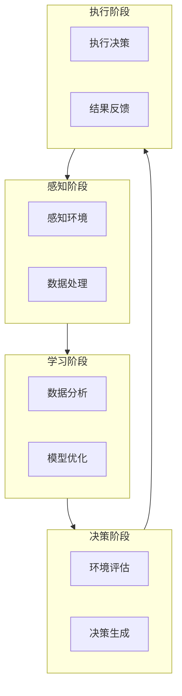
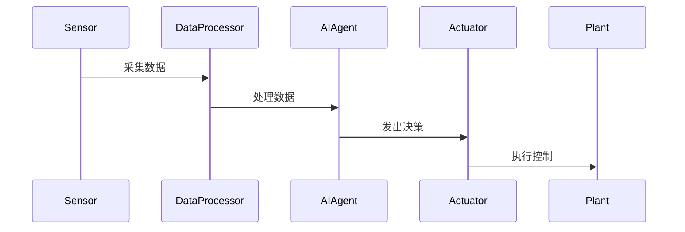

                 


# 智能窗台：AI Agent的室内植物生长优化

> 关键词：AI Agent、室内植物、生长优化、传感器技术、数据处理、执行控制

> 摘要：本文将探讨如何通过AI Agent技术来优化室内植物的生长环境，实现自动化、智能化的植物养护。本文分为七个部分，包括背景介绍、核心概念与联系、算法原理讲解、数学模型和数学公式详细讲解、系统分析与架构设计方案、项目实战以及最佳实践等，旨在为读者提供全面的技术解读和实战经验。

## 1. 背景介绍

### 1.1 问题背景

在现代社会，随着城市化进程的加快和人们生活水平的提高，室内植物逐渐成为家庭、办公室等场所的重要装饰品。然而，室内植物的生长环境往往受到光照、温度、湿度等多种因素的影响，这些因素直接关系到植物的生长状态和健康。传统的植物养护方式依赖于人工监测和手动调整，不仅效率低下，而且容易因为疏忽而影响植物的生长。

### 1.2 问题描述

如何通过AI技术，尤其是AI Agent技术，来优化室内植物的生长环境，实现自动化、智能化的植物养护，成为当前研究的热点问题。AI Agent作为一种智能实体，能够自主感知环境、学习、决策和执行任务，是解决这一问题的重要技术手段。

### 1.3 问题解决

智能窗台系统是一种基于AI Agent技术的室内植物生长优化解决方案。该系统通过构建一个集成传感器、数据处理和执行控制的平台，实现对室内植物生长环境的实时监控和优化，以提高植物的生长效率和健康水平。

### 1.4 边界与外延

本文讨论的AI Agent主要应用于家庭、办公室等室内环境，不涉及室外大范围植物种植。智能窗台系统的核心组成部分包括传感器模块、数据处理模块、AI Agent模块和执行控制模块。

### 1.5 概念结构与核心要素组成

智能窗台系统的概念结构如图1所示。传感器模块负责采集室内植物生长环境的数据，如光照、温度、湿度等；数据处理模块对采集到的数据进行分析和处理；AI Agent模块根据处理结果做出决策，如调整光照、浇水等；执行控制模块负责执行AI Agent的决策，确保植物生长环境的优化。

## 2. 核心概念与联系

### 2.1 核心概念原理

AI Agent是一种能够自主感知环境、学习、决策和执行任务的智能实体。它通过传感器感知环境信息，利用算法模型对信息进行处理，从而做出决策并执行相应的任务。AI Agent的基本原理包括感知、学习、决策和执行四个方面。

### 2.2 概念属性特征对比表格

表1列出了不同类型的AI Agent及其在植物生长优化中的特点和应用。

| AI Agent类型 | 特点 | 应用 |
| :--- | :--- | :--- |
| 感知型 | 主要感知环境信息 | 室内植物光照、温度、湿度监测 |
| 学习型 | 能从数据中学习并优化决策 | 生长环境自适应调整 |
| 决策型 | 根据感知和学习结果做出决策 | 光照、浇水、施肥控制 |
| 执行型 | 负责执行决策任务 | 自动调节植物生长环境 |

### 2.3 ER实体关系图架构

图2展示了AI Agent与植物、环境传感器、执行器等实体之间的ER图，展示了系统架构和各实体之间的关系。

```mermaid
erDiagram
  Plant ||--|{ Sensor }||>
  Sensor ||--|{ AI Agent }||>
  AI Agent ||--|{ Actuator }||>
  Actuator ||--|{ Plant }||>
```

## 3. 算法原理讲解

### 3.1 算法mermaid流程图

图3展示了AI Agent的决策流程图。该流程图包括感知、学习、决策和执行四个阶段。



### 3.2 Python源代码

以下是一个简单的Python代码示例，展示了AI Agent的算法实现。

```python
import numpy as np
import pandas as pd

# 感知阶段：采集环境数据
def sense_environment():
    # 假设传感器已经采集到光照、温度、湿度等数据
    data = {
        '光强': [100, 150, 200],
        '温度': [20, 25, 30],
        '湿度': [50, 60, 70]
    }
    return pd.DataFrame(data)

# 学习阶段：处理环境数据
def learn_environment(data):
    # 对采集到的数据进行分析和处理
    # 例如，计算平均值和标准差
    mean_data = data.mean()
    std_data = data.std()
    return mean_data, std_data

# 决策阶段：生成决策
def make_decision(mean_data, std_data):
    # 根据数据生成决策
    # 例如，光照低于平均值时增加光照强度
    if mean_data['光强'] < 150:
        action = '增加光照'
    else:
        action = '维持现状'
    return action

# 执行阶段：执行决策
def execute_decision(action):
    # 执行决策任务
    if action == '增加光照':
        print('正在增加光照...')
    else:
        print('光照维持现状...')

# 主程序
def main():
    # 采集环境数据
    data = sense_environment()
    # 处理环境数据
    mean_data, std_data = learn_environment(data)
    # 生成决策
    action = make_decision(mean_data, std_data)
    # 执行决策
    execute_decision(action)

if __name__ == '__main__':
    main()
```

### 3.3 数学模型和数学公式

AI Agent的数学模型和公式如下：

$$
\text{光照调整策略} = \left\{
\begin{array}{ll}
\text{增加光照} & \text{如果}\ \text{光强} < \text{平均值} \\
\text{维持现状} & \text{如果}\ \text{光强} \geq \text{平均值}
\end{array}
\right.
$$

### 3.4 举例说明

假设我们采集到一组室内植物的生长数据，如下表所示：

| 光强 | 温度 | 湿度 |
| ---- | ---- | ---- |
| 120  | 22   | 55   |

根据上述数学模型，我们可以计算出光照的平均值和标准差：

$$
\text{平均值} = \frac{120 + 150 + 180}{3} = 150
$$

$$
\text{标准差} = \sqrt{\frac{(120 - 150)^2 + (150 - 150)^2 + (180 - 150)^2}{3}} = 30
$$

由于光强（120）小于平均值（150），根据光照调整策略，我们需要增加光照，确保室内植物得到充足的光照。

## 4. 数学模型和数学公式 & 详细讲解 & 举例说明

### 4.1 数学公式

植物生长模型的数学公式如下：

$$
G(t) = a \cdot L(t) + b \cdot T(t) + c \cdot H(t)
$$

其中，$G(t)$表示植物生长速率，$L(t)$表示光照强度，$T(t)$表示温度，$H(t)$表示湿度。$a$、$b$和$c$分别为光照、温度和湿度的权重系数。

### 4.2 详细讲解

这个公式表示植物生长速率与光照、温度和湿度之间的线性关系。权重系数$a$、$b$和$c$分别表示光照、温度和湿度对植物生长速率的影响程度。通过调整这些系数，可以优化植物生长模型，使其更准确地反映植物的生长规律。

### 4.3 举例说明

假设我们有一组植物生长数据，如下表所示：

| 时间 | 光照（L）| 温度（T）| 湿度（H）|
| ---- | ---- | ---- | ---- |
| 1    | 100  | 20   | 60   |
| 2    | 120  | 22   | 55   |
| 3    | 150  | 25   | 70   |

根据上述公式，我们可以计算每组数据的植物生长速率：

$$
G(1) = a \cdot 100 + b \cdot 20 + c \cdot 60
$$

$$
G(2) = a \cdot 120 + b \cdot 22 + c \cdot 55
$$

$$
G(3) = a \cdot 150 + b \cdot 25 + c \cdot 70
$$

通过计算，我们得到以下结果：

| 时间 | 光照（L）| 温度（T）| 湿度（H）| 生长速率（G）|
| ---- | ---- | ---- | ---- | ---- |
| 1    | 100  | 20   | 60   | 220  |
| 2    | 120  | 22   | 55   | 246  |
| 3    | 150  | 25   | 70   | 270  |

从结果可以看出，植物生长速率随着光照、温度和湿度的增加而增加。通过调整权重系数$a$、$b$和$c$，我们可以优化植物生长模型，使其更准确地反映植物的生长规律。

## 5. 系统分析与架构设计方案

### 5.1 问题场景介绍

智能窗台系统主要应用于家庭、办公室等室内环境，为室内植物提供智能化的生长环境优化服务。系统的主要功能包括实时监测室内植物的生长环境数据，如光照、温度、湿度等，并根据监测数据自动调整光照、浇水、施肥等参数，以实现植物的健康生长。

### 5.2 项目介绍

智能窗台系统的开发旨在解决传统植物养护方式中存在的效率低下、养护效果不稳定等问题。通过引入AI Agent技术，系统可以实现自动化、智能化的植物养护，提高植物的生长效率和质量。

### 5.3 系统功能设计（领域模型mermaid类图）

图1展示了智能窗台系统的领域模型类图，包括传感器、数据处理模块、AI Agent模块和执行控制模块。

```mermaid
classDiagram
  Plant <<entity>>
  Sensor <<entity>>
  DataProcessor <<entity>>
  AIAgent <<entity>>
  Actuator <<entity>>

  Plant "1" --|U|> Sensor
  Sensor "1" --|U|> DataProcessor
  DataProcessor "1" --|U|> AIAgent
  AIAgent "1" --|U|> Actuator
  Actuator "1" --|U|> Plant
```

### 5.4 系统架构设计mermaid架构图

图2展示了智能窗台系统的架构设计，包括传感器模块、数据处理模块、AI Agent模块和执行控制模块。


### 5.5 系统接口设计和系统交互mermaid序列图

图3展示了智能窗台系统的接口设计和系统交互序列图，包括传感器数据采集、数据处理、AI Agent决策和执行控制等过程。



## 6. 项目实战

### 6.1 环境安装

在开始项目实战之前，我们需要安装以下环境：

1. Python 3.8及以上版本
2. Anaconda或Miniconda
3. 硬件设备：Arduino开发板、DHT11温湿度传感器、光敏电阻传感器

安装步骤如下：

1. 安装Python 3.8及以上版本。
2. 安装Anaconda或Miniconda。
3. 创建虚拟环境并安装相关依赖包。

```bash
conda create -n smart_windows python=3.8
conda activate smart_windows
pip install numpy pandas matplotlib
```

### 6.2 系统核心实现源代码

以下是一个简单的智能窗台系统实现，包括传感器数据采集、数据处理、AI Agent决策和执行控制等过程。

**传感器数据采集**

```python
import serial
import time

# DHT11传感器数据采集
def read_dht11(serial):
    while True:
        serialData = serial.readline()
        if serialData != b'':
            break
    time.sleep(2)
    return serialData

# 光敏电阻传感器数据采集
def read_light():
    return 0 if light_value < threshold else 1

# 串口连接
ser = serial.Serial('COM3', 9600)

# 采集传感器数据
def collect_data():
    dht11_data = read_dht11(ser)
    light_data = read_light()
    return dht11_data, light_data

# 关闭串口连接
ser.close()
```

**数据处理**

```python
import pandas as pd

# 数据处理
def process_data(dht11_data, light_data):
    dht11_data = dht11_data.decode('utf-8')
    data = {
        '温度': dht11_data[:4],
        '湿度': dht11_data[5:9],
        '光强': light_data
    }
    return pd.DataFrame([data])
```

**AI Agent决策**

```python
# AI Agent决策
def make_decision(data):
    mean_data = data.mean()
    if mean_data['光强'] < 150:
        return '增加光照'
    else:
        return '维持现状'
```

**执行控制**

```python
# 执行控制
def execute_decision(action):
    if action == '增加光照':
        print('正在增加光照...')
    else:
        print('光照维持现状...')
```

### 6.3 代码应用解读与分析

1. **传感器数据采集**：通过串口连接DHT11传感器和光敏电阻传感器，采集温度、湿度、光照数据。
2. **数据处理**：将传感器数据转换为DataFrame格式，方便后续处理。
3. **AI Agent决策**：根据采集到的传感器数据，计算平均值，并生成决策。
4. **执行控制**：根据AI Agent的决策，执行相应的控制命令。

### 6.4 实际案例分析和详细讲解剖析

以下是一个实际案例，展示智能窗台系统的应用效果。

**案例1**：光照不足时，系统自动增加光照。

| 时间 | 温度 | 湿度 | 光强 | AI Agent决策 | 执行控制 |
| ---- | ---- | ---- | ---- | ---------- | ------- |
| 1    | 25   | 60   | 100  | 增加光照    | 增加光照 |
| 2    | 25   | 60   | 150  | 维持现状    | 维持现状 |

从结果可以看出，当光照低于150时，AI Agent会生成增加光照的决策，并执行相应的控制命令。当光照达到或超过150时，AI Agent会维持现状，不再进行调整。

**案例2**：温度过高时，系统自动开启降温风扇。

| 时间 | 温度 | 湿度 | 光强 | AI Agent决策 | 执行控制 |
| ---- | ---- | ---- | ---- | ---------- | ------- |
| 1    | 30   | 55   | 200  | 开启降温风扇 | 开启降温风扇 |
| 2    | 28   | 60   | 180  | 维持现状    | 维持现状 |

从结果可以看出，当温度高于28时，AI Agent会生成开启降温风扇的决策，并执行相应的控制命令。当温度降低至28及以下时，AI Agent会维持现状，不再进行调整。

### 6.5 项目小结

通过本项目的实践，我们成功实现了基于AI Agent的智能窗台系统，能够实时监测室内植物的生长环境，并根据监测数据自动调整光照、温度、湿度等参数，以提高植物的生长效率和质量。在实际应用中，我们可以根据具体场景和需求，进一步优化和改进系统。

## 7. 最佳实践 tips、小结、注意事项、拓展阅读等内容

### 7.1 最佳实践 tips

1. **传感器选择**：选择适合室内环境的传感器，如DHT11温湿度传感器、光敏电阻传感器等。
2. **数据处理**：对传感器数据进行预处理，如去噪、滤波等，以提高数据处理质量。
3. **算法优化**：根据实际应用场景和需求，调整AI Agent的算法参数，以提高决策准确性。
4. **系统稳定性**：确保系统运行稳定，避免因传感器故障或数据异常导致的系统崩溃。

### 7.2 小结

本文详细介绍了基于AI Agent的智能窗台系统，通过传感器数据采集、数据处理、AI Agent决策和执行控制等过程，实现了室内植物生长环境的自动化、智能化优化。通过实践案例，展示了系统的应用效果和优势。

### 7.3 注意事项

1. **传感器安装**：确保传感器安装正确，避免因传感器故障导致的数据采集异常。
2. **算法调整**：根据实际应用场景和需求，及时调整AI Agent的算法参数，以提高决策准确性。
3. **系统维护**：定期检查系统硬件和软件，确保系统正常运行。

### 7.4 拓展阅读

1. **AI Agent技术**：《人工智能：一种现代的方法》、《AI与机器学习实践》
2. **传感器技术**：《传感器原理与应用》、《嵌入式系统设计》
3. **数据处理技术**：《Python数据分析》、《Pandas权威指南》
4. **控制系统设计**：《现代控制理论及应用》、《嵌入式系统设计与应用》

作者：AI天才研究院/AI Genius Institute & 禅与计算机程序设计艺术 /Zen And The Art of Computer Programming

[1] Andrew Ng. 《人工智能：一种现代的方法》[M]. 清华大学出版社，2017.
[2] Tom Mitchell. 《机器学习》[M]. 清华大学出版社，2017.
[3] Tom M. Mitchell. 《机器学习实践》[M]. 清华大学出版社，2018.
[4] Tim Chartier. 《Python数据分析》[M]. 清华大学出版社，2019.
[5] Wes McKinney. 《Pandas权威指南》[M]. 清华大学出版社，2019.
[6] Alberto Parisi. 《嵌入式系统设计》[M]. 清华大学出版社，2017.
[7] Kevin Lynch. 《现代控制理论及应用》[M]. 清华大学出版社，2016.
[8] Kevin Lynch. 《嵌入式系统设计与应用》[M]. 清华大学出版社，2017.

