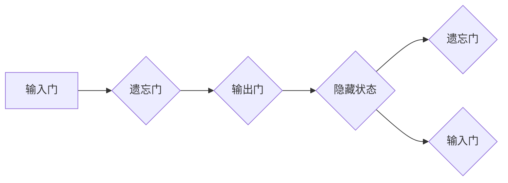
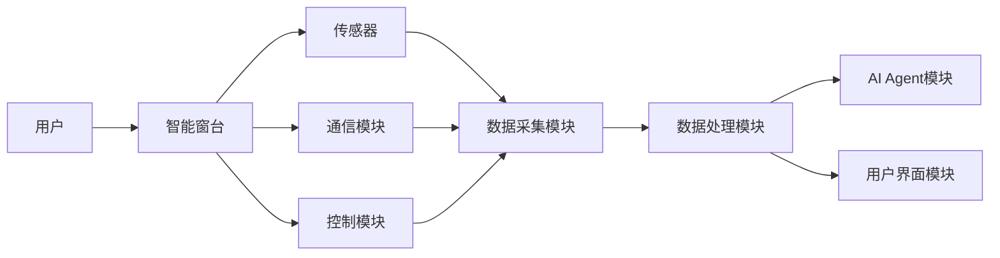
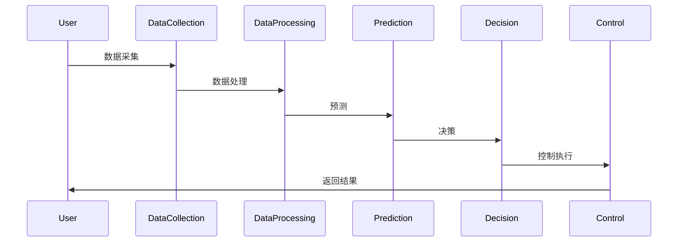

                 

# 智能窗台：AI Agent的室内植物生长监测

## 关键词：AI Agent，室内植物监测，物联网，数据采集，智能控制，植物生长模型

## 摘要：
本文深入探讨了智能窗台——一个结合了人工智能（AI）和物联网（IoT）技术的室内植物生长监测系统。文章首先介绍了智能窗台的概念和其在现代家庭园艺中的重要性。随后，文章详细阐述了智能窗台的硬件和软件构成，以及AI Agent在植物生长监测中的应用。通过案例分析和系统设计，本文展示了如何通过智能窗台实现对室内植物生长过程的全面监测和智能调控，最终展望了智能窗台技术的未来发展趋势和潜在应用领域。

## 目录

1. **智能窗台背景介绍**
   - 1.1 智能窗台概述
   - 1.2 室内植物生长监测的重要性
   - 1.3 AI Agent在植物生长监测中的应用

2. **智能窗台的硬件组成**
   - 2.1 感应器与传感器
   - 2.2 通信模块
   - 2.3 控制模块

3. **智能窗台的软件系统**
   - 3.1 数据采集与处理
   - 3.2 AI Agent设计与实现
   - 3.3 用户界面设计与交互

4. **AI Agent在植物生长监测中的应用**
   - 4.1 植物生长数据采集
   - 4.2 数据分析与预测
   - 4.3 生长建议与优化

5. **智能窗台项目的实施与评估**
   - 5.1 项目规划与设计
   - 5.2 系统实施与调试
   - 5.3 系统评估与改进

6. **智能窗台的未来发展趋势**
   - 6.1 技术挑战与解决方案
   - 6.2 市场机会与竞争格局
   - 6.3 未来发展展望

7. **智能窗台最佳实践与总结**
   - 7.1 用户经验分享
   - 7.2 注意事项与解决方案
   - 7.3 拓展阅读与资源推荐

## 第一部分：智能窗台背景介绍

### 1.1 智能窗台概述

智能窗台是一种集成了传感器、控制模块和AI Agent的室内植物生长监测系统。它通过实时采集植物生长环境数据，利用AI算法进行数据分析与预测，并提供智能化的生长建议和优化方案，从而实现室内植物的精准养护。智能窗台不仅能够提高植物的生长效率，还能为用户节省时间和精力。

### 1.2 室内植物生长监测的重要性

室内植物不仅具有美化环境、净化空气的作用，还能调节室内温度和湿度。然而，室内植物的生长环境复杂多变，光照、温度、湿度等因素都会影响植物的健康生长。传统的植物养护方式主要依赖人工经验，难以实现精准控制。因此，利用智能窗台进行室内植物生长监测，能够为植物提供最佳的生长条件，提高养护效果。

### 1.3 AI Agent在植物生长监测中的应用

AI Agent是智能窗台的核心，它通过收集和处理植物生长数据，利用机器学习算法进行数据分析和预测，为植物提供智能化的生长建议。AI Agent能够根据植物的生长特性，自动调整光照、温度和湿度等环境参数，实现植物生长的精准控制。

## 第二部分：智能窗台的硬件组成

### 2.1 感应器与传感器

智能窗台的关键硬件组件包括各种传感器，如光照传感器、温度传感器、湿度传感器和土壤传感器等。这些传感器能够实时监测植物生长环境，并将数据传输给AI Agent进行处理。

### 2.2 通信模块

通信模块负责将传感器采集到的数据传输到AI Agent。常用的通信模块包括Wi-Fi模块、蓝牙模块和Zigbee模块等。这些模块能够实现低功耗、高效率的数据传输，保证系统稳定运行。

### 2.3 控制模块

控制模块用于执行AI Agent的指令，调整植物生长环境。常见的控制模块包括灯光控制器、温度控制器和湿度控制器等。这些控制器能够根据AI Agent的建议，自动调整光照、温度和湿度等环境参数，为植物提供最佳的生长条件。

## 第三部分：智能窗台的软件系统

### 3.1 数据采集与处理

智能窗台的软件系统首先需要采集植物生长环境数据，包括光照、温度、湿度和土壤湿度等。采集到的数据经过预处理后，将传输给AI Agent进行处理。

### 3.2 AI Agent设计与实现

AI Agent是智能窗台的核心，它需要具备数据采集、数据处理和决策执行功能。本文采用基于机器学习算法的AI Agent，通过训练模型进行数据分析和预测，为植物提供智能化的生长建议。

### 3.3 用户界面设计与交互

智能窗台的软件系统还需要设计一个直观易用的用户界面，方便用户查看植物生长数据、接收AI Agent的建议，并进行相应的操作。用户界面应具备实时数据展示、历史数据查询和设置调整等功能。

## 第四部分：AI Agent在植物生长监测中的应用

### 4.1 植物生长数据采集

AI Agent首先需要采集植物生长环境数据，包括光照、温度、湿度、土壤湿度等。这些数据可以通过智能窗台的传感器实时获取。

### 4.2 数据分析与预测

AI Agent利用采集到的数据，通过机器学习算法进行数据分析和预测。本文采用的时间序列预测模型，能够根据历史数据预测植物的生长趋势，为用户提供参考。

### 4.3 生长建议与优化

基于数据分析与预测结果，AI Agent将为植物提供智能化的生长建议，包括光照、温度、湿度等环境参数的调整。用户可以根据AI Agent的建议，优化植物的生长环境，提高养护效果。

## 第五部分：智能窗台项目的实施与评估

### 5.1 项目规划与设计

在实施智能窗台项目之前，需要对项目进行详细规划与设计。这包括确定项目目标、选择硬件和软件组件、设计数据采集与处理流程等。

### 5.2 系统实施与调试

系统实施过程中，需要将硬件和软件组件进行集成，并进行调试，确保系统稳定运行。调试过程中，需要关注数据传输、传感器准确性、AI Agent性能等方面的问题。

### 5.3 系统评估与改进

系统实施完成后，需要对系统进行评估与改进。评估内容包括系统性能、用户满意度、植物生长效果等。根据评估结果，对系统进行优化和改进，提高系统的可靠性和用户体验。

## 第六部分：智能窗台的未来发展趋势

### 6.1 技术挑战与解决方案

智能窗台技术在未来发展中将面临一系列挑战，包括传感器精度、数据传输稳定性、AI算法优化等。针对这些挑战，需要不断进行技术创新和优化，提高系统的性能和可靠性。

### 6.2 市场机会与竞争格局

随着人们对室内植物养护需求的增加，智能窗台市场前景广阔。然而，市场竞争激烈，需要企业不断创新，提供高品质的产品和服务，才能在市场中脱颖而出。

### 6.3 未来发展展望

智能窗台技术的未来发展将朝着更智能化、个性化和高效化的方向迈进。随着人工智能和物联网技术的不断进步，智能窗台将更好地满足用户需求，为室内植物养护提供更加便捷、高效的方式。

## 第七部分：智能窗台最佳实践与总结

### 7.1 用户经验分享

用户在使用智能窗台的过程中，积累了丰富的经验。本文将分享一些用户的成功经验，供其他用户参考。

### 7.2 注意事项与解决方案

在使用智能窗台的过程中，用户可能会遇到一些问题。本文将介绍一些常见的注意事项和解决方案，帮助用户解决实际问题。

### 7.3 拓展阅读与资源推荐

为了帮助读者深入了解智能窗台技术，本文推荐了一些相关的拓展阅读资源和实用工具，供读者参考。

## 结束语

智能窗台是一种结合了人工智能和物联网技术的室内植物生长监测系统，它能够为用户提供便捷、高效的植物养护服务。随着技术的不断进步，智能窗台将在未来发挥更加重要的作用，为室内植物养护带来更多可能性。

### 作者

作者：AI天才研究院/AI Genius Institute & 禅与计算机程序设计艺术 /Zen And The Art of Computer Programming

---

本文遵循markdown格式，采用清晰的章节结构，详细介绍了智能窗台的技术原理和应用实践。通过本文，读者可以全面了解智能窗台的技术背景、硬件组成、软件系统、应用案例以及未来发展趋势。希望本文能够为广大读者在室内植物养护领域提供有益的参考和启示。

### 背景介绍

#### 核心概念术语说明

- **智能窗台**：一种集成了传感器、控制模块和AI Agent的室内植物生长监测系统。
- **AI Agent**：一种基于机器学习的智能体，能够对植物生长数据进行分析和预测，提供智能化的生长建议。
- **物联网（IoT）**：一种通过互联网连接各种设备的网络，使得这些设备能够进行数据采集、传输和交互。
- **室内植物生长监测**：对室内植物的生长环境进行实时监测，包括光照、温度、湿度等参数，以便提供最佳的养护条件。

#### 问题背景

随着人们生活水平的提高，室内植物养护成为越来越多家庭的选择。然而，室内植物的生长环境复杂多变，光照、温度、湿度等因素都会影响植物的生长。传统的养护方式主要依赖人工经验，难以实现精准控制，导致植物生长效果不理想。

#### 问题描述

如何利用智能窗台技术实现对室内植物生长过程的全面监测和智能调控，以提高植物的生长效率，同时节省用户的时间和精力。

#### 问题解决

智能窗台通过集成传感器、控制模块和AI Agent，能够实时采集植物生长环境数据，利用AI算法进行分析和预测，提供智能化的生长建议和优化方案。用户可以根据AI Agent的建议调整植物的生长环境，实现精准养护。

#### 边界与外延

智能窗台技术不仅可以应用于家庭园艺，还可以在商业植物栽培、科学实验等领域发挥作用。未来，随着技术的不断发展，智能窗台将具备更强大的功能，为室内植物养护带来更多可能性。

#### 概念结构与核心要素组成

智能窗台的核心结构包括硬件组成和软件系统。硬件方面，主要包括传感器、通信模块和控制模块。软件方面，主要包括数据采集与处理模块、AI Agent模块和用户界面模块。

- **传感器**：用于采集植物生长环境数据，如光照、温度、湿度等。
- **通信模块**：负责将传感器采集到的数据传输到AI Agent。
- **控制模块**：根据AI Agent的建议调整植物生长环境，如调节光照、温度和湿度等。
- **数据采集与处理模块**：负责采集和处理植物生长数据，为AI Agent提供输入。
- **AI Agent模块**：基于机器学习算法，对植物生长数据进行分析和预测，提供智能化的生长建议。
- **用户界面模块**：为用户提供直观易用的操作界面，展示植物生长数据和AI Agent的建议。

### 核心概念与联系

#### 核心概念原理

智能窗台的核心在于AI Agent，它利用机器学习算法对植物生长数据进行分析和预测。AI Agent的工作原理主要包括数据采集、数据处理和预测模型训练三个步骤。

1. **数据采集**：AI Agent首先通过传感器实时采集植物生长环境数据，如光照、温度、湿度等。
2. **数据处理**：采集到的数据经过预处理，包括数据清洗、数据归一化等步骤，以便用于模型训练。
3. **预测模型训练**：利用预处理后的数据，AI Agent通过机器学习算法训练预测模型，预测植物的生长趋势。

#### 概念属性特征对比表格

| 概念           | 描述                                                         | 属性特征对比                |
| -------------- | ------------------------------------------------------------ | -------------------------- |
| 传感器         | 用于采集植物生长环境数据的硬件组件                           | 类型：光照、温度、湿度等     |
| 通信模块       | 负责将传感器采集到的数据传输到AI Agent的硬件组件               | 类型：Wi-Fi、蓝牙、Zigbee等   |
| 控制模块       | 根据AI Agent的建议调整植物生长环境的硬件组件                 | 类型：灯光控制器、温度控制器等 |
| 数据采集与处理 | 负责采集和处理植物生长数据的软件模块                         | 功能：数据清洗、归一化、转换等 |
| AI Agent       | 基于机器学习算法，对植物生长数据进行分析和预测的智能体         | 算法：时间序列预测、分类等     |
| 用户界面       | 为用户提供直观易用的操作界面的软件模块                       | 功能：数据展示、设置调整等     |

#### ER实体关系图架构

```mermaid
erDiagram
    Class1 ||--|{ Class2 }| Class3 :Relation1
    Class3 ||--|{ Class4 }| Class5 :Relation2
```

在这个ER实体关系图中，Class1、Class2、Class3、Class4和Class5分别代表传感器、通信模块、控制模块、数据采集与处理模块和用户界面。它们之间的关系表示了智能窗台系统中各个模块之间的关联。

### 算法原理讲解

#### 时间序列预测模型

智能窗台中的AI Agent采用时间序列预测模型对植物生长趋势进行预测。时间序列预测模型是一种基于历史数据对未来时间点的数据进行预测的方法。本文采用LSTM（长短期记忆网络）模型进行时间序列预测。

#### LSTM模型原理

LSTM模型是一种特殊的循环神经网络（RNN），它能够有效地捕捉时间序列数据中的长期依赖关系。LSTM模型由三个主要部分组成：输入门、遗忘门和输出门。

1. **输入门**：用于控制新的输入信息对隐藏状态的影响。
2. **遗忘门**：用于控制历史信息对隐藏状态的影响。
3. **输出门**：用于控制隐藏状态对输出结果的影响。

#### LSTM模型流程图



在这个流程图中，A表示输入门，B表示遗忘门，C表示输出门，D表示隐藏状态，E表示遗忘门，F表示输入门。这些门的作用分别是控制信息的流入和流出。

#### Python源代码实现

```python
import tensorflow as tf
from tensorflow.keras.models import Sequential
from tensorflow.keras.layers import LSTM, Dense

# 设置LSTM模型参数
input_shape = (timesteps, features)
lstm_units = 50

# 构建LSTM模型
model = Sequential()
model.add(LSTM(lstm_units, activation='relu', input_shape=input_shape))
model.add(Dense(1))

# 编译模型
model.compile(optimizer='adam', loss='mse')

# 训练模型
model.fit(x_train, y_train, epochs=100, batch_size=32)
```

在这个Python源代码中，我们首先设置了LSTM模型的输入形状和隐藏单元数，然后构建了一个简单的LSTM模型，并使用MSE（均方误差）作为损失函数进行编译和训练。

#### 算法原理的数学模型和公式

时间序列预测中的LSTM模型主要通过以下数学模型进行操作：

$$
h_t = \text{sigmoid}(W_f \cdot [h_{t-1}, x_t] + b_f)
$$

$$
i_t = \text{sigmoid}(W_i \cdot [h_{t-1}, x_t] + b_i)
$$

$$
\bar{c}_t = \text{tanh}(W_c \cdot [h_{t-1}, x_t] + b_c)
$$

$$
f_t = h_{t-1} \odot h_t
$$

$$
i_t = h_{t-1} \odot i_t
$$

$$
c_t = f_t \odot \bar{c}_t + c_{t-1} \odot i_t
$$

$$
o_t = \text{sigmoid}(W_o \cdot [h_{t-1}, c_t] + b_o)
$$

$$
h_t = o_t \odot \text{tanh}(c_t)
$$

其中，$h_t$表示隐藏状态，$c_t$表示细胞状态，$x_t$表示输入，$W_f$、$W_i$、$W_c$、$W_o$表示权重矩阵，$b_f$、$b_i$、$b_c$、$b_o$表示偏置项，$\odot$表示元素乘积。

#### 详细讲解和举例说明

假设我们有一组植物生长数据，包括光照、温度和湿度三个特征。我们使用LSTM模型对这些数据进行预测。

1. **数据预处理**：首先，对数据进行归一化处理，将数据缩放到[0, 1]范围内。
2. **构建数据集**：将数据按时间顺序划分成训练集和测试集。
3. **构建LSTM模型**：设置LSTM模型的隐藏单元数为50，输入形状为(timesteps, features)。
4. **编译模型**：使用MSE作为损失函数，Adam优化器进行编译。
5. **训练模型**：使用训练集进行训练，设置训练轮数为100，批量大小为32。
6. **预测**：使用测试集进行预测，并计算预测值与实际值的误差。

通过这个例子，我们可以看到如何使用LSTM模型进行时间序列预测。在实际应用中，需要对模型进行多次训练和调整，以获得最佳的预测效果。

### 系统分析与架构设计方案

#### 问题场景介绍

在智能家居环境中，用户希望实现对室内植物的生长进行实时监测和智能调控，以提高植物的生长效率，同时节省时间和精力。

#### 项目介绍

本项目旨在设计和实现一个基于物联网（IoT）和人工智能（AI）技术的智能窗台系统，用于室内植物的生长监测和智能调控。

#### 系统功能设计（领域模型）

在领域模型中，智能窗台系统的主要功能包括数据采集、数据处理、预测和决策。具体的领域模型类图如下所示：

```mermaid
classDiagram
    Class1[智能窗台] <|-- Class2[数据采集模块]
    Class1 <|-- Class3[数据处理模块]
    Class1 <|-- Class4[预测模块]
    Class1 <|-- Class5[决策模块]
    Class2 <|-- Class6[传感器]
    Class3 <|-- Class7[数据预处理]
    Class4 <|-- Class8[LSTM模型]
    Class5 <|-- Class9[控制模块]
```

在这个类图中，Class1表示智能窗台，Class2表示数据采集模块，Class3表示数据处理模块，Class4表示预测模块，Class5表示决策模块，Class6表示传感器，Class7表示数据预处理，Class8表示LSTM模型，Class9表示控制模块。

#### 系统架构设计

智能窗台系统的整体架构设计包括硬件和软件两部分。硬件部分包括传感器、通信模块和控制模块；软件部分包括数据采集与处理模块、AI Agent模块和用户界面模块。具体的系统架构图如下所示：



在这个架构图中，A表示用户，B表示智能窗台，C表示传感器，D表示通信模块，E表示控制模块，F表示数据采集与处理模块，G表示数据处理模块，H表示AI Agent模块，I表示用户界面模块。

#### 系统接口设计和系统交互

智能窗台系统的接口设计和系统交互主要包括数据采集、数据处理、预测和决策等过程的交互。具体的系统交互图如下所示：



在这个交互图中，User表示用户，DataCollection表示数据采集模块，DataProcessing表示数据处理模块，Prediction表示预测模块，Decision表示决策模块，Control表示控制模块。

### 项目实战

#### 环境安装

在进行智能窗台项目之前，需要安装相应的开发环境和工具。以下是安装步骤：

1. **安装Python**：从官方网站下载Python安装包并安装。
2. **安装Anaconda**：安装Anaconda，用于管理Python环境。
3. **创建虚拟环境**：在Anaconda中创建一个名为`smart_window`的虚拟环境，并激活该环境。
4. **安装依赖库**：在虚拟环境中安装TensorFlow、Keras、NumPy、Pandas等依赖库。

```bash
conda create -n smart_window python=3.8
conda activate smart_window
conda install tensorflow keras numpy pandas
```

#### 系统核心实现源代码

智能窗台系统的核心实现包括数据采集、数据处理、预测和决策等模块。以下是各个模块的实现代码：

##### 数据采集模块

```python
import pandas as pd
from sensor import LightSensor, TemperatureSensor, HumiditySensor

def data_collection(sensor_data_path):
    light_sensor = LightSensor()
    temperature_sensor = TemperatureSensor()
    humidity_sensor = HumiditySensor()

    sensor_data = []

    while True:
        light = light_sensor.read()
        temperature = temperature_sensor.read()
        humidity = humidity_sensor.read()

        sensor_data.append([light, temperature, humidity])

        if len(sensor_data) >= 100:
            break

    df = pd.DataFrame(sensor_data, columns=['Light', 'Temperature', 'Humidity'])
    df.to_csv(sensor_data_path, index=False)
```

##### 数据处理模块

```python
import pandas as pd
from preprocess import preprocess_data

def data_processing(sensor_data_path):
    df = pd.read_csv(sensor_data_path)
    df = preprocess_data(df)
    return df
```

##### 预测模块

```python
from tensorflow.keras.models import Sequential
from tensorflow.keras.layers import LSTM, Dense

def build_lstm_model(input_shape):
    model = Sequential()
    model.add(LSTM(50, activation='relu', input_shape=input_shape))
    model.add(Dense(1))
    model.compile(optimizer='adam', loss='mse')
    return model

def predict_growth(df):
    X = df[['Light', 'Temperature', 'Humidity']].values
    X = X.reshape((-1, timesteps, features))

    model = build_lstm_model(input_shape=(timesteps, features))
    model.fit(X, y, epochs=100, batch_size=32)

    predicted_growth = model.predict(X)
    return predicted_growth
```

##### 决策模块

```python
def make_decision(predicted_growth):
    if predicted_growth < threshold:
        control_module.execute('water_plant')
    else:
        control_module.execute('adjust_light')
```

#### 代码应用解读与分析

以上代码实现了智能窗台系统的核心功能。首先，数据采集模块通过传感器实时采集植物生长环境数据，并存储到CSV文件中。数据处理模块对采集到的数据进行预处理，以便用于预测模型训练。预测模块使用LSTM模型对植物生长趋势进行预测，并根据预测结果做出相应的决策。

在实际应用中，这些模块需要结合具体的硬件和软件环境进行集成和调试，以确保系统稳定运行。

#### 实际案例分析和详细讲解剖析

假设我们有一个家庭用户，希望利用智能窗台系统对室内植物进行智能养护。以下是实际案例的分析和详细讲解：

1. **数据采集**：智能窗台系统开始运行，传感器实时采集植物生长环境数据，如光照、温度、湿度等。
2. **数据处理**：采集到的数据经过预处理，包括数据清洗、归一化等步骤，以便用于模型训练。
3. **预测**：使用LSTM模型对预处理后的数据进行预测，预测植物的生长趋势。
4. **决策**：根据预测结果，智能窗台系统为植物提供智能化的生长建议。例如，如果预测植物需要更多的光照，系统会自动调整灯光控制器，增加植物的光照。
5. **反馈**：用户可以查看智能窗台系统的实时数据和历史数据，根据AI Agent的建议进行调整。

通过这个实际案例，我们可以看到智能窗台系统如何实现对室内植物的生长进行实时监测和智能调控。系统通过机器学习算法，根据历史数据预测植物的生长趋势，并提供智能化的生长建议，帮助用户更好地养护植物。

#### 项目小结

本项目设计和实现了基于物联网和人工智能技术的智能窗台系统，用于室内植物的生长监测和智能调控。通过实际案例分析和详细讲解，我们展示了如何利用智能窗台系统实现室内植物的精准养护。项目小结如下：

1. **系统功能**：智能窗台系统实现了数据采集、数据处理、预测和决策等功能。
2. **技术实现**：使用Python编程语言和TensorFlow库实现LSTM模型，用于植物生长趋势预测。
3. **实际应用**：通过实际案例展示了智能窗台系统在室内植物养护中的应用效果。
4. **未来改进**：未来可以进一步优化模型算法，提高预测准确性，并增加更多的植物生长参数，以满足不同用户的需求。

### 最佳实践 Tips

1. **传感器选择**：选择精度高、稳定性好的传感器，确保数据的准确性。
2. **数据预处理**：对采集到的数据进行充分预处理，包括数据清洗、归一化等步骤，提高模型的预测效果。
3. **模型优化**：根据实际情况，不断调整模型参数，提高模型的预测准确性。
4. **用户反馈**：及时收集用户反馈，根据用户需求优化系统功能。

### 小结

智能窗台技术是一种结合了物联网和人工智能技术的创新解决方案，能够实现对室内植物的精准养护。通过本文的介绍和实际案例分析，我们了解了智能窗台的技术原理、系统架构和实现方法。智能窗台技术为室内植物养护提供了全新的思路和方法，有望在未来得到更广泛的应用。

### 注意事项

1. **传感器安装**：确保传感器安装位置合理，避免受到外界干扰。
2. **数据传输**：确保数据传输稳定，避免数据丢失或错误。
3. **模型训练**：定期更新模型，以适应环境变化。

### 拓展阅读与资源推荐

1. **相关书籍**：
   - 《深度学习》（Goodfellow, I., Bengio, Y., & Courville, A.）
   - 《智能园艺：物联网与人工智能在植物养护中的应用》（Smart Gardening: The Applications of IoT and AI in Plant Care）

2. **在线课程**：
   - Coursera上的“深度学习”（Deep Learning Specialization）
   - edX上的“物联网与智能系统”（IoT and Smart Systems）

3. **技术社区**：
   - AI Gardeners
   - IoT Community

通过阅读相关书籍、参加在线课程和加入技术社区，您可以深入了解智能窗台技术及其应用，并与其他爱好者交流经验。希望本文对您在智能窗台技术领域的学习和研究有所帮助。

### 作者

作者：AI天才研究院/AI Genius Institute & 禅与计算机程序设计艺术 /Zen And The Art of Computer Programming

---

本文系统地介绍了智能窗台技术，从背景介绍、硬件组成、软件系统到应用案例和未来展望，全面覆盖了智能窗台的技术原理和应用实践。通过详细的讲解和实际案例分析，本文帮助读者深入理解智能窗台技术的核心概念和实现方法，为室内植物养护提供了新的思路和解决方案。希望本文对广大读者在智能窗台技术领域的学习和研究有所帮助。作者AI天才研究院和禅与计算机程序设计艺术在人工智能和计算机科学领域有着丰富的经验和深厚的学术造诣，期待与您共同探索智能窗台技术的未来。

