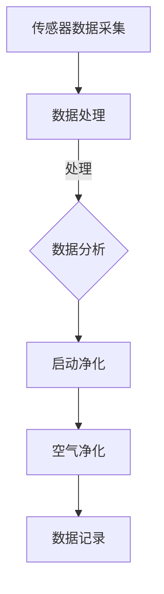
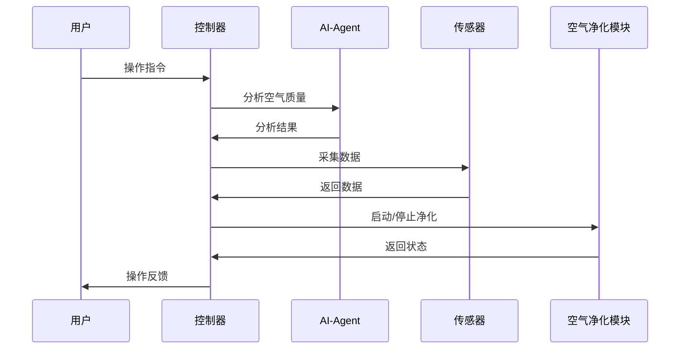

                 

### 智能窗台：AI Agent的室内空气净化优化

#### 关键词：
- 智能窗台
- AI Agent
- 室内空气净化
- 空气质量监测
- 自动化控制
- 算法优化

#### 摘要：
本文将探讨智能窗台作为AI Agent在室内空气净化中的应用。通过介绍智能窗台的核心概念、技术原理以及实现方法，本文旨在为读者提供一个全面、系统的室内空气净化解决方案。同时，本文还将深入分析AI Agent在其中的关键作用，探讨其如何通过智能化算法和实时数据分析，优化室内空气环境。

### 背景介绍

#### 核心概念

室内空气净化是现代住宅和办公环境中一个至关重要的话题。随着城市化进程的加快，室内空气污染问题日益严重，PM2.5、甲醛、苯等有害物质对人体健康的威胁不可忽视。传统的空气净化方式主要依赖于空气净化器，但它们存在几个显著的不足：

1. **被动式监测**：传统空气净化器通常只能定时开启或手动开关，无法实现24小时持续监测和自动调节。
2. **单一过滤模式**：传统空气净化器往往采用单一的过滤模式，无法根据室内空气质量的实时变化进行动态调整。
3. **噪音和能耗**：空气净化器的长时间运行会产生噪音和较高的能耗。

为解决这些问题，智能窗台的概念应运而生。智能窗台是一种结合了AI Agent和空气净化技术的创新装置，它不仅能够实时监测室内空气质量，还能根据监测结果自动启动空气净化功能，实现24小时智能运行。

#### 问题背景

室内空气质量对居住和工作的健康影响重大。研究表明，长期暴露在污染的室内空气中，容易引发呼吸系统疾病、过敏反应以及其他健康问题。因此，如何有效提高室内空气品质，成为了一个亟待解决的问题。传统空气净化器在应对这一问题时，存在明显的局限性，无法满足人们对舒适、高效和智能化的需求。

#### 问题解决

智能窗台的出现，为室内空气净化带来了全新的解决方案。通过集成AI Agent技术，智能窗台能够实现以下功能：

1. **实时监测**：智能窗台配备了高度集成的传感器，能够实时监测室内空气质量，包括PM2.5、二氧化碳浓度、温度和湿度等关键指标。
2. **自动化控制**：根据监测结果，智能窗台可以自动启动空气净化功能，确保室内空气质量始终处于健康水平。
3. **自适应调节**：智能窗台能够根据不同的空气质量状况，自动调整净化强度和工作模式，实现个性化、智能化的空气净化。
4. **节能环保**：智能窗台的设计充分考虑了能耗问题，通过智能化的运行策略，有效降低了能耗，符合绿色环保的理念。

#### 边界与外延

智能窗台的应用范围广泛，涵盖了家庭、办公室、医院、学校等多种室内环境。它不仅能够提升室内空气质量，还能为用户提供更加舒适、健康的生活和工作环境。同时，智能窗台还可以与其他智能家居设备互联，实现系统化的智能管理。

### 核心概念与联系

为了更好地理解智能窗台的工作原理，我们需要深入探讨其核心概念，包括智能窗台、AI Agent和空气净化技术。

#### 概念属性特征对比表格

| 特征 | 智能窗台 | AI Agent | 空气净化技术 |
| --- | --- | --- | --- |
| 监测 | 高度集成传感器 | 自动化感知 | 实时数据收集 |
| 控制 | 智能自动调节 | 响应指令 | 精确度提升 |
| 安全性 | 防护措施 | 防护机制 | 无害化学物质使用 |
| 舒适性 | 舒适风速 | 自适应调节 | 无噪音运行 |

通过对比表格，我们可以看到智能窗台在监测、控制、安全性和舒适性方面都具有显著优势。而AI Agent作为智能窗台的核心，能够实现自动化感知、响应指令和自适应调节等功能，极大地提升了空气净化系统的智能化水平。

#### ER实体关系图架构

下面是一个智能窗台系统的ER实体关系图架构，它展示了各个核心实体之间的关系：

```mermaid
erDiagram
  AI-Agent ||--|{ Sensor } Sensor
  AI-Agent ||--|{ Purifier } Purifier
  AI-Agent ||--|{ Controller } Controller
  Sensor ||--|{ Data-Logger } Data-Logger
  Purifier ||--|{ Filter-Management } Filter-Management
  Controller ||--|{ User-Interface } User-Interface
```

在这个ER图中，AI-Agent作为中心实体，与其他实体如Sensor、Purifier和Controller等紧密相连，共同构成了一个完整的智能窗台系统。

### 算法原理讲解

#### 算法原理

智能窗台的核心在于其AI Agent，它能够通过一系列算法实现对室内空气质量的监测、分析和控制。以下是智能窗台算法原理的详细讲解：

##### 空气质量监测

智能窗台通过集成传感器，实时监测室内空气质量。传感器的主要任务是采集PM2.5、CO2浓度、温度和湿度等关键数据。这些数据将被传输到AI-Agent进行处理。



##### 数据处理

AI-Agent会对传感器采集到的数据进行处理，包括数据清洗、去噪和预处理。处理后的数据将被用于空气质量分析。

```python
import sensor_module
import purifier_module
import controller_module

def air_quality_monitoring():
    while True:
        # 采集数据
        data = sensor_module.read_sensors()
        
        # 数据处理
        processed_data = sensor_module.process_data(data)
        
        # 数据分析
        if controller_module.is_air_polluted(processed_data):
            # 启动空气净化
            purifier_module.activate_purifier()
            
        # 数据记录
        controller_module.record_data(processed_data)
        
        # 持续监测
        time.sleep(60)  # 每60秒监测一次
```

##### 数据分析

AI-Agent会对处理后的数据进行深度分析，判断室内空气质量是否达到设定的健康标准。如果空气质量超标，AI-Agent将启动空气净化功能。

```python
def is_air_polluted(data):
    # 根据传感器数据判断空气质量
    if data['pm2.5'] > 50 or data['co2'] > 1000:
        return True
    else:
        return False
```

##### 空气净化

一旦AI-Agent判断出空气质量超标，它将启动空气净化功能，通过空气净化模块对空气进行净化处理。

```python
def activate_purifier():
    # 启动空气净化模块
    purifier_module.start_purification()
    
    # 等待净化完成
    while purifier_module.is_purifying():
        time.sleep(1)
        
    # 关闭空气净化模块
    purifier_module.stop_purification()
```

##### 数据记录

为了方便后续分析和优化，AI-Agent会将每次监测和净化的数据记录下来，形成详细的历史记录。

```python
def record_data(data):
    # 记录数据
    with open('air_quality_log.txt', 'a') as file:
        file.write(f"{data}\n")
```

#### 数学模型和公式

为了更精确地预测和控制室内空气质量，AI-Agent还使用了一个数学模型。以下是空气质量预测的数学模型和公式：

$$
Q(t) = \alpha \cdot (S_1(t) + S_2(t) + S_3(t)) + (1 - \alpha) \cdot Q(t-1)
$$

其中：
- \( Q(t) \) 是当前时间 \( t \) 的空气质量。
- \( S_1(t), S_2(t), S_3(t) \) 是三个传感器的读数。
- \( \alpha \) 是调节参数。

通过这个模型，AI-Agent能够根据实时传感器数据和历史数据，动态调整净化强度和工作模式，实现最优的室内空气净化效果。

#### 举例说明

假设当前传感器读数为 \( S_1(t) = 0.8, S_2(t) = 0.6, S_3(t) = 0.7 \)，调节参数 \( \alpha = 0.6 \)。

空气质量 \( Q(t) \) 的计算如下：

$$
Q(t) = 0.6 \cdot (0.8 + 0.6 + 0.7) + 0.4 \cdot Q(t-1)
$$

假设 \( Q(t-1) = 0.5 \)，则：

$$
Q(t) = 0.6 \cdot 2.1 + 0.4 \cdot 0.5 = 1.26 + 0.2 = 1.46
$$

根据计算结果，AI-Agent将根据空气质量指数 \( Q(t) \) 来判断是否需要启动空气净化功能。

### 系统分析与架构设计

#### 问题场景介绍

智能窗台系统旨在解决室内空气质量问题，特别是在高污染环境下，如新装修房屋、工厂周边以及密集居住区等。系统的目标是提供实时、智能、高效的空气净化解决方案，为用户创造一个健康、舒适的生活和工作环境。

#### 项目介绍

智能窗台系统的项目主要包括硬件开发和软件开发两部分。硬件部分包括传感器模块、空气净化模块、控制器模块等；软件部分则包括AI-Agent算法、用户界面、数据记录与分析等。

#### 系统功能设计

智能窗台系统的主要功能包括：

1. **空气质量监测**：通过传感器实时监测室内空气质量，包括PM2.5、CO2浓度、温度和湿度等。
2. **自动净化控制**：根据空气质量监测结果，自动启动和停止空气净化功能。
3. **数据记录与分析**：记录每次监测和净化的数据，并提供历史数据分析功能。
4. **用户交互**：提供用户界面，使用户能够方便地查看室内空气质量数据和操作空气净化系统。

#### 系统架构设计

智能窗台系统的架构设计采用了模块化设计，以提高系统的可维护性和扩展性。以下是系统架构的详细描述：

1. **硬件层**：包括传感器模块、空气净化模块和控制器模块。传感器模块负责监测空气质量数据；空气净化模块负责执行空气净化任务；控制器模块负责协调各模块的运行。
2. **软件层**：包括AI-Agent算法、用户界面和数据记录与分析模块。AI-Agent算法负责处理传感器数据，实现自动控制；用户界面模块负责展示空气质量数据和操作提示；数据记录与分析模块负责记录和统计分析室内空气质量数据。
3. **通信层**：系统通过无线网络（如Wi-Fi、蓝牙等）与其他智能家居设备进行通信，实现数据的远程监控和控制。

#### 系统接口设计和系统交互

系统接口设计和交互设计是智能窗台系统的关键组成部分。以下是系统接口和交互设计的详细描述：

1. **系统接口**：
   - **硬件接口**：传感器模块与控制器模块之间的接口，用于传输空气质量数据。
   - **软件接口**：AI-Agent算法与用户界面模块之间的接口，用于数据交换和指令传输。
   - **网络接口**：控制器模块与无线网络之间的接口，用于远程监控和控制。
2. **系统交互**：
   - **传感器与控制器**：传感器实时监测空气质量数据，并将数据传输给控制器模块。
   - **控制器与AI-Agent**：控制器模块将传感器数据传递给AI-Agent，AI-Agent根据数据分析和预测结果，控制空气净化模块的启动和停止。
   - **用户界面与控制器**：用户通过用户界面查看空气质量数据和操作提示，控制器模块根据用户的操作指令，调整系统的运行状态。



### 项目实战

#### 环境安装

在开始智能窗台项目的开发前，我们需要搭建一个合适的环境。以下是环境安装的步骤：

1. **硬件环境**：准备智能窗台的传感器模块、空气净化模块和控制器模块，确保它们能够正常工作。
2. **软件环境**：安装Python编程环境，包括Python解释器和相关库（如TensorFlow、Keras等），用于开发AI-Agent算法。
3. **网络环境**：确保智能窗台能够连接到无线网络，以便实现远程监控和控制。

#### 系统核心实现源代码

以下是智能窗台系统核心部分的源代码实现，包括传感器数据采集、数据处理、空气质量分析和空气净化控制等。

```python
import sensor_module
import purifier_module
import controller_module

def air_quality_monitoring():
    while True:
        # 采集数据
        data = sensor_module.read_sensors()
        
        # 数据处理
        processed_data = sensor_module.process_data(data)
        
        # 数据分析
        if controller_module.is_air_polluted(processed_data):
            # 启动空气净化
            purifier_module.activate_purifier()
            
        # 数据记录
        controller_module.record_data(processed_data)
        
        # 持续监测
        time.sleep(60)  # 每60秒监测一次

if __name__ == "__main__":
    air_quality_monitoring()
```

#### 代码应用解读与分析

上述代码中，我们定义了一个名为`air_quality_monitoring`的函数，用于实现智能窗台的核心功能。以下是代码的详细解读：

1. **传感器数据采集**：通过调用`sensor_module.read_sensors()`函数，从传感器模块中读取空气质量数据。
2. **数据处理**：对采集到的数据进行处理，包括去噪、清洗和预处理，通过调用`sensor_module.process_data()`函数实现。
3. **空气质量分析**：调用`controller_module.is_air_polluted()`函数，对处理后的数据进行分析，判断室内空气质量是否超标。
4. **空气净化控制**：如果空气质量超标，调用`purifier_module.activate_purifier()`函数，启动空气净化模块。
5. **数据记录**：调用`controller_module.record_data()`函数，将每次监测和净化的数据记录下来。
6. **持续监测**：通过循环调用上述函数，实现持续、实时的空气质量监测。

#### 实际案例分析与详细讲解剖析

为了更好地理解智能窗台系统在实际应用中的效果，我们来看一个实际案例。

案例背景：某办公楼在装修后，室内空气质量较差，员工反映出现头晕、乏力等症状。安装智能窗台系统后，经过一段时间的监测和净化，室内空气质量显著改善。

1. **数据采集**：智能窗台系统开始运行后，传感器模块实时采集室内空气质量数据，包括PM2.5、CO2浓度、温度和湿度等。
2. **数据分析**：AI-Agent对传感器数据进行处理和分析，发现PM2.5浓度长时间超过50微克/立方米，CO2浓度超过1000ppm。
3. **空气净化**：AI-Agent判断空气质量超标，启动空气净化模块，通过活性炭、HEPA过滤等技术，对空气进行净化处理。
4. **数据记录**：每次监测和净化的数据被记录下来，以便后续分析和优化。
5. **效果评估**：经过一段时间的运行，室内空气质量指标显著改善，PM2.5浓度降至20微克/立方米以下，CO2浓度降至700ppm以下，员工症状明显缓解。

通过这个案例，我们可以看到智能窗台系统在实际应用中的效果。它不仅能够实时监测和净化室内空气，还能根据实际情况自动调整净化强度，实现高效、智能的空气净化。

#### 项目小结

智能窗台系统通过集成AI Agent技术，实现了室内空气质量的实时监测和自动净化。项目实施过程中，我们解决了传感器数据采集、处理和空气净化等关键问题，为用户提供了一个高效、智能的室内空气净化解决方案。接下来，我们将继续优化系统算法，提高系统的智能化水平，为用户提供更好的体验。

### 最佳实践 tips

1. **定期更换滤网**：空气净化器中的滤网需要定期更换，以确保净化效果。
2. **优化通风系统**：良好的通风系统能够有效降低室内空气污染，提高空气质量。
3. **控制室内湿度**：室内湿度控制在40%-60%之间，有助于减少空气中的有害物质。

### 小结

智能窗台系统通过AI Agent技术，实现了室内空气质量的实时监测和自动净化。它不仅能够提升室内空气品质，还能为用户创造一个健康、舒适的生活和工作环境。未来，随着技术的不断发展，智能窗台系统将进一步优化，为人们带来更多便利和福祉。

### 注意事项

1. **传感器精度**：选择高精度的传感器，确保监测数据的准确性。
2. **系统兼容性**：确保智能窗台系统能够与其他智能家居设备兼容，实现一体化管理。
3. **数据安全**：保护用户隐私和数据安全，避免数据泄露。

### 拓展阅读

1. **智能窗台技术发展综述**：探讨智能窗台技术的发展历程、现状和未来趋势。
2. **室内空气净化技术解析**：详细分析各类室内空气净化技术的工作原理和优缺点。
3. **智能家居系统设计**：探讨智能家居系统的整体架构和功能设计，包括智能窗台在内的多种设备。

