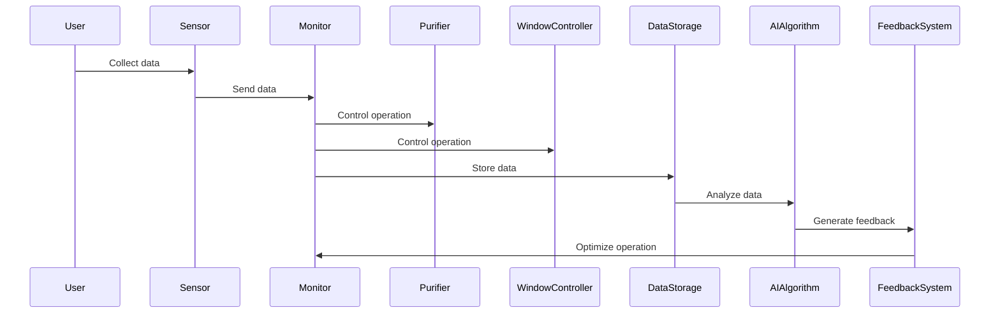
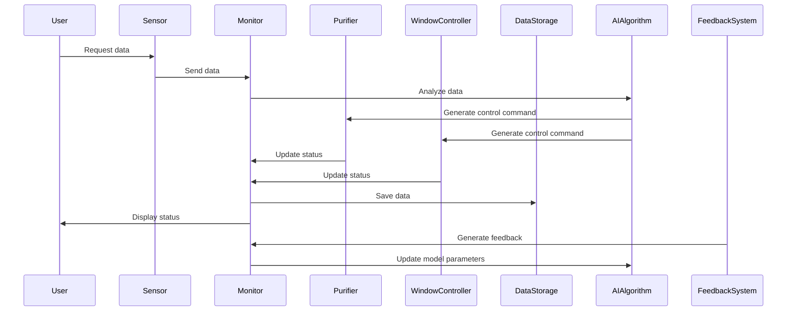

                 


### 文章标题：智能窗台：AI Agent的室内空气净化控制

### 关键词：智能窗台、AI Agent、室内空气净化、算法设计、系统架构、项目实战

### 摘要：
本文深入探讨了智能窗台与AI Agent在室内空气净化控制中的应用，从基础概念到算法实现，再到系统架构设计和项目实战，全面解析了AI在室内空气净化中的潜力与挑战。通过详细的案例分析和最佳实践分享，为读者提供了从理论到实践的完整指南。

---

## 1. 智能窗台概述

### 1.1 智能窗台的概念与历史背景

智能窗台是智能家居系统的重要组成部分，它结合了物理硬件和软件算法，实现对室内环境的智能监控与调节。传统的窗台大多仅具有开关窗户的功能，而智能窗台则在此基础上增加了空气质量监测、自动开闭、空气净化等多项功能。

智能窗台的发展可以追溯到20世纪末期，当时科学家们开始探讨如何利用计算机技术和传感器来改善家居环境。最早的智能窗台大多应用于实验室和研究机构，但随着科技的进步和人们对生活品质的追求，智能窗台逐渐走入普通家庭。

### 1.2 智能窗台的功能与组成部分

智能窗台的功能包括但不限于：
- 空气质量监测：通过传感器实时监测室内的PM2.5、CO2浓度等指标。
- 自动开闭：根据室内外的温度、湿度、光照等条件自动调节窗户的开关。
- 空气净化：利用内置的净化装置过滤空气中的有害物质，提高室内空气质量。

智能窗台的组成部分通常包括：
- 传感器模块：负责监测室内的各种环境参数。
- 控制模块：根据传感器数据，通过算法计算出最佳的窗台操作策略。
- 执行模块：执行控制模块的指令，包括窗户的开闭和空气净化操作。
- 通信模块：与智能家居中心控制系统通信，实现数据的共享和控制。

### 1.3 智能窗台的发展趋势

随着人工智能技术的不断进步，智能窗台的功能和性能也在不断提升。未来的智能窗台可能具备以下发展趋势：

- 智能化：通过更加先进的算法和机器学习技术，实现更加精准和高效的空气质量管理。
- 集成化：将更多传感器和控制功能集成到智能窗台，提高系统的整体性能。
- 安全性：加强数据安全和隐私保护，确保用户的个人信息不被泄露。
- 可持续性：通过节能技术和优化设计，降低智能窗台的能耗，实现绿色环保。

---

## 2. AI Agent原理与应用

### 2.1 AI Agent的概念与特点

AI Agent，即人工智能代理，是指能够在复杂环境中自主决策并执行任务的智能实体。与传统的计算机程序不同，AI Agent具有以下几个显著特点：

- 自主性：AI Agent能够在没有人工干预的情况下，根据环境和目标自主做出决策。
- 反应性：AI Agent能够实时响应环境变化，快速调整行为。
- 预见性：通过学习和预测，AI Agent能够预测未来的环境变化，提前做出决策。
- 探索性：AI Agent在未知环境中能够通过探索和学习，不断优化自己的行为。

### 2.2 AI Agent在智能家居中的应用

AI Agent在智能家居中扮演着关键角色，可以实现如下应用：

- 自动化控制：AI Agent可以自动调节家居设备的运行状态，如灯光、空调、窗户等。
- 安全监控：AI Agent可以通过摄像头和传感器监控家庭安全，及时报警。
- 个性化服务：AI Agent可以根据家庭成员的喜好和习惯，提供个性化的家居服务。

### 2.3 AI Agent的组成与架构

一个典型的AI Agent通常包括以下几个部分：

- 感知模块：感知外部环境，获取传感器数据。
- 决策模块：分析感知数据，根据目标和策略生成行动计划。
- 行动模块：执行决策模块生成的行动计划。
- 学习模块：通过反馈和学习，不断优化决策和行为。

---

## 3. AI Agent在室内空气净化控制中的应用

### 3.1 空气污染问题与挑战

室内空气污染是一个全球性的问题，严重影响人们的健康和生活质量。空气污染主要来源于以下几个方面：

- 室内装饰材料：如油漆、胶水等释放出的有害物质。
- 家居用品：如家具、纺织品等散发的异味和污染物。
- 人体代谢：如呼吸、皮肤代谢等释放出的二氧化碳、皮屑等。

室内空气污染的挑战主要包括：

- 数据获取：需要高精度、多参数的传感器来实时监测空气质量。
- 算法优化：需要高效的算法来处理大量传感器数据，实现精准的空气净化控制。
- 系统集成：需要将传感器、控制器、执行器等多部件集成到一起，实现协同工作。

### 3.2 AI Agent在空气净化中的角色

AI Agent在空气净化中主要扮演以下角色：

- 数据分析：通过感知模块获取的空气质量数据，AI Agent可以分析出污染物的主要来源和浓度分布。
- 决策制定：根据分析结果，AI Agent可以制定出最佳的空气净化策略，如调节窗户开合、启动空气净化器等。
- 行动执行：AI Agent可以驱动执行模块，自动执行空气净化操作，确保室内空气质量达到最佳状态。

### 3.3 空气净化控制算法

空气净化控制算法的核心目标是根据空气质量数据，制定出最优的空气净化策略。以下是几种常见的空气净化算法：

- 反应性算法：根据当前空气质量，立即启动空气净化操作，不考虑历史数据和预测。
- 预测性算法：通过历史数据和机器学习模型，预测未来的空气质量变化，提前制定空气净化策略。
- 自适应算法：根据空气质量的变化，动态调整空气净化策略，实现最优的空气净化效果。

---

## 4. 室内空气净化控制的算法设计与实现

### 4.1 空气质量监测技术

空气质量监测技术是室内空气净化控制的基础。常用的空气质量监测技术包括：

- PM2.5监测：通过粒子计数器或光散射法，实时监测空气中的PM2.5浓度。
- CO2监测：通过红外线光谱法或电化学传感器，实时监测空气中的CO2浓度。
- TVOC监测：通过气相色谱法或电化学传感器，实时监测空气中的挥发性有机物浓度。

### 4.2 监测数据预处理

监测数据预处理是保证算法性能的重要环节。预处理步骤包括：

- 数据清洗：去除传感器噪声和异常数据。
- 数据归一化：将不同传感器的数据统一到相同的量纲。
- 数据插值：填补监测数据中的缺失值。

### 4.3 监测数据可视化

监测数据可视化有助于用户直观地了解室内空气质量。常用的可视化方法包括：

- 时间序列图：展示空气质量随时间的变化趋势。
- 饼图：展示不同污染物在总污染物中的占比。
- 热力图：展示空气质量的分布情况。

---

## 5. 系统设计与实现

### 5.1 系统需求分析

系统需求分析是系统设计的起点，主要包括：

- 功能需求：明确系统需要实现的功能，如空气质量监测、空气净化控制等。
- 性能需求：确定系统的性能指标，如响应时间、处理能力等。
- 系统约束：分析系统在硬件、软件、成本等方面的限制。

### 5.2 系统架构设计

系统架构设计是系统实现的基础，主要包括：

- 感知层：包括各种传感器，如PM2.5传感器、CO2传感器等。
- 决策层：包括AI Agent，负责分析传感器数据，制定空气净化策略。
- 执行层：包括执行模块，如空气净化器、窗户控制器等。

### 5.3 系统接口设计与实现

系统接口设计是确保系统各部分协同工作的关键，主要包括：

- 传感器接口：定义传感器与决策层的通信协议和数据格式。
- 执行器接口：定义执行器与决策层的通信协议和数据格式。
- 通信接口：定义决策层与感知层、执行层之间的通信协议和数据格式。

### 5.4 系统交互设计

系统交互设计是确保系统功能实现的关键，主要包括：

- 用户交互：设计用户界面，方便用户查看系统状态和操作系统。
- 系统监控：设计监控系统，实时监控系统运行状态，及时发现和处理异常。

---

## 6. 项目实战

### 6.1 环境安装与配置

项目实战的第一步是环境安装与配置，主要包括：

- 硬件安装：根据设计文档，将传感器、执行器等硬件设备安装到智能窗台上。
- 软件安装：安装操作系统、编程环境和AI Agent软件包。
- 网络配置：配置智能窗台的IP地址、子网掩码、网关等网络参数。

### 6.2 系统核心代码实现

系统核心代码实现是项目实战的核心，主要包括：

- 数据采集：编写代码，从传感器获取空气质量数据。
- 算法实现：根据所选算法，编写代码实现空气质量分析、决策制定等功能。
- 执行控制：编写代码，根据决策结果，控制执行器执行空气净化操作。

### 6.3 代码解读与分析

代码解读与分析是对系统核心代码的深入理解，主要包括：

- 变量与函数定义：分析变量和函数的作用和定义方式。
- 算法流程：分析算法的执行流程和逻辑。
- 错误处理：分析代码中的错误处理机制，确保系统的稳定性和可靠性。

### 6.4 实际案例分析与讲解

实际案例分析与讲解是对项目实战的总结和反思，主要包括：

- 案例背景：介绍实际应用的背景和环境。
- 案例过程：分析案例的实施过程，包括遇到的问题和解决方案。
- 案例效果：评估案例的实施效果，包括空气净化效果和用户体验。

### 6.5 项目小结

项目小结是对整个项目实践的总结，主要包括：

- 成功经验：总结项目中的成功经验，为未来的项目提供借鉴。
- 不足与改进：分析项目中的不足之处，并提出改进措施。
- 未来展望：展望项目的发展方向和潜力。

---

## 7. 最佳实践与未来展望

### 7.1 最佳实践分享

最佳实践分享是对项目实战中的经验和技巧的总结，主要包括：

- 传感器选择：根据实际情况，选择合适的空气质量传感器。
- 算法优化：根据实际应用，优化空气净化算法，提高系统的性能和可靠性。
- 系统集成：根据实际需求，设计并实现系统的集成和交互。

### 7.2 注意事项

注意事项是确保项目成功的关键，主要包括：

- 数据安全：确保传感器数据和用户隐私安全。
- 系统稳定：确保系统在各种环境下稳定运行。
- 维护更新：定期更新系统软件，修复漏洞，提高系统性能。

### 7.3 未来发展展望

未来发展展望是对智能窗台和AI Agent在室内空气净化控制中的应用前景的展望，主要包括：

- 智能化提升：通过机器学习和人工智能技术，实现更加智能的空气净化控制。
- 系统集成：将智能窗台与其他智能家居设备集成，实现全屋智能。
- 可持续发展：通过节能技术和优化设计，降低能耗，实现可持续发展。

---

### 作者：AI天才研究院/AI Genius Institute & 禅与计算机程序设计艺术 /Zen And The Art of Computer Programming

本文通过对智能窗台和AI Agent在室内空气净化控制中的应用进行深入探讨，从基础概念到算法实现，再到系统架构设计和项目实战，全面解析了AI在室内空气净化中的潜力与挑战。通过详细的案例分析和最佳实践分享，为读者提供了从理论到实践的完整指南。未来，随着人工智能技术的不断进步，智能窗台和AI Agent在室内空气净化控制中的应用将更加广泛，为人们的健康生活带来更多便利。让我们共同期待这一美好未来的到来。**摘要：**本文深入探讨了智能窗台与AI Agent在室内空气净化控制中的应用，从基础概念到算法实现，再到系统架构设计和项目实战，全面解析了AI在室内空气净化中的潜力与挑战。通过详细的案例分析和最佳实践分享，为读者提供了从理论到实践的完整指南。**关键字：**智能窗台、AI Agent、室内空气净化、算法设计、系统架构、项目实战****1. 智能窗台概述**

### 1.1 智能窗台的概念与历史背景

智能窗台是智能家居系统中的一项创新技术，它集成了传感器、执行器、通信模块和智能算法，可以实现对室内外环境的实时监测和控制。其核心目的是改善室内空气质量，提供更加舒适和健康的生活环境。

智能窗台的发展可以追溯到20世纪90年代，当时科技界开始探索如何利用计算机技术和物联网（IoT）技术来提升家庭自动化水平。早期的智能窗台大多依赖于简单的传感器和机械控制，功能相对单一。随着传感器技术、通信技术和人工智能算法的不断发展，智能窗台的功能和性能得到了显著提升，逐渐成为智能家居系统中的重要组成部分。

### 1.2 智能窗台的功能与组成部分

智能窗台具备多种功能，主要包括：

- **空气质量监测**：通过安装在高处的传感器，如PM2.5传感器、CO2传感器等，实时监测室内的空气质量，提供数据支持。
- **自动开闭控制**：根据室内外温度、湿度、光照等环境因素，自动调节窗户的开闭，以维持室内舒适度。
- **空气净化控制**：通过内置的空气净化装置，如空气净化器或负氧离子发生器，对空气中的污染物进行过滤和净化。
- **智能联动**：与其他智能家居设备如空调、空气净化器、加湿器等联动，共同提升室内环境质量。

智能窗台的组成部分通常包括以下几个部分：

- **传感器模块**：用于收集室内的空气质量数据，包括PM2.5、CO2浓度、温度、湿度等。
- **控制模块**：接收传感器数据，通过算法分析，决定窗户的开闭和空气净化装置的工作状态。
- **执行模块**：根据控制模块的指令，驱动窗户开闭和空气净化装置的动作。
- **通信模块**：负责将传感器数据和指令通过Wi-Fi、蓝牙或其他通信方式传输到智能家居中心系统或手机APP。

### 1.3 智能窗台的发展趋势

随着科技的进步和人们生活品质的提高，智能窗台的发展趋势呈现以下特点：

- **智能化程度提升**：通过引入人工智能和机器学习技术，智能窗台将能够更加智能地处理环境数据，自动调整窗户开闭和空气净化，甚至进行自我学习和优化。
- **集成化设计**：未来的智能窗台将更加注重系统的集成化设计，将多种功能模块集成到一个装置中，减少系统复杂度，提高用户体验。
- **节能环保**：智能窗台将采用更多的节能技术和环保材料，以减少能耗和环境污染，实现绿色智能家居。
- **个性化定制**：智能窗台将根据不同用户的需求，提供个性化的空气净化解决方案，满足不同家庭的特定需求。

**核心概念与联系**

### 概念介绍

智能窗台、AI Agent、室内空气净化、空气质量监测、传感器、执行器、控制算法。

### 概念属性特征对比表格

| 概念           | 特征描述                                                                                     |
|----------------|----------------------------------------------------------------------------------------------|
| 智能窗台       | 一种集成了传感器、执行器、控制算法的智能家居设备，用于室内环境监测和控制。                      |
| AI Agent       | 一种能够在复杂环境中自主决策并执行任务的智能实体，常用于智能家居系统的自动化控制。                |
| 室内空气净化   | 指通过物理、化学或生物手段，降低室内空气中有害物质的过程。                                    |
| 空气质量监测   | 利用传感器实时监测室内空气质量的过程，如PM2.5、CO2浓度等。                                    |
| 传感器         | 用于感知环境参数的设备，如PM2.5传感器、温度传感器、湿度传感器等。                              |
| 执行器         | 接受控制模块指令，执行特定动作的设备，如电机、空气净化器等。                                  |
| 控制算法       | 用于处理传感器数据，生成控制指令的算法，如PID控制算法、机器学习算法等。                        |

### ER实体关系图架构

```mermaid
erDiagram
  智能窗台 ||--o{ 传感器 }  : 监测
  智能窗台 ||--o{ 执行器 }  : 控制操作
  智能窗台 ||--o{ 控制算法 } : 处理数据
  传感器 ||--|{ 空气质量数据 }--|| 执行器
  传感器 ||--|{ 空气质量数据 }--|| 控制算法
```

**算法原理讲解**

### 算法概述

智能窗台中的空气净化控制算法主要基于传感器数据，通过分析空气质量，实时调整空气净化装置的工作状态。本文将详细介绍一种基于机器学习的空气净化控制算法。

### 算法原理

该算法基于以下原理：

1. **传感器数据采集**：智能窗台通过PM2.5传感器、CO2传感器等实时采集室内空气质量数据。
2. **数据预处理**：对采集到的数据进行分析，去除噪声和异常值，进行归一化处理，以便后续算法分析。
3. **特征提取**：从预处理后的数据中提取关键特征，如PM2.5浓度、CO2浓度等。
4. **机器学习模型训练**：利用历史空气质量数据和特征，训练机器学习模型，预测未来的空气质量变化。
5. **决策制定**：根据预测结果，智能窗台自动调节空气净化装置的工作状态，如启动或关闭空气净化器。
6. **执行操作**：执行器根据控制指令，执行空气净化操作。

### 算法公式与数学模型

算法的核心在于机器学习模型的训练和预测。以下是算法的数学模型：

$$
\hat{P}_{t+1} = f(P_{t}, C_{t}, \theta)
$$

其中，$\hat{P}_{t+1}$ 表示未来时刻的空气质量预测值，$P_{t}$ 和 $C_{t}$ 分别表示当前时刻的PM2.5浓度和CO2浓度，$\theta$ 表示模型的参数。

机器学习模型的训练过程通常采用以下步骤：

1. **数据集准备**：收集历史空气质量数据，包括PM2.5浓度、CO2浓度等。
2. **特征选择**：从数据集中提取关键特征，如PM2.5浓度、CO2浓度等。
3. **模型选择**：选择合适的机器学习模型，如线性回归、决策树、神经网络等。
4. **模型训练**：使用历史数据训练模型，得到模型的参数$\theta$。
5. **模型评估**：使用验证数据集评估模型性能，调整模型参数。

### 算法实现与性能评估

算法的实现主要包括以下步骤：

1. **数据采集**：从传感器获取实时空气质量数据。
2. **数据预处理**：对数据进行清洗、归一化处理。
3. **特征提取**：提取关键特征。
4. **模型训练**：使用历史数据训练机器学习模型。
5. **决策制定**：根据模型预测结果，调整空气净化装置的工作状态。
6. **性能评估**：评估模型性能，包括预测准确率、响应时间等。

### 例子说明

假设当前时刻的PM2.5浓度为30 mg/m³，CO2浓度为800 ppm，模型预测未来时刻的空气质量将下降到20 mg/m³。根据预测结果，智能窗台将启动空气净化器，以保持室内空气质量的稳定。

**系统分析与架构设计方案**

### 问题场景介绍

室内空气净化控制是一个典型的实时控制系统，要求系统能够实时监测空气质量，并根据空气质量的变化自动调整空气净化装置的工作状态，以保持室内空气质量的稳定。该系统的主要功能包括空气质量监测、空气净化控制和数据存储与反馈。

### 项目介绍

本项目旨在设计并实现一个基于AI Agent的室内空气净化控制系统，以提高居住环境的舒适度和健康水平。系统将使用智能窗台作为空气质量监测和控制的核心，通过传感器实时采集室内空气质量数据，利用机器学习算法进行数据处理和预测，最终通过执行器（如空气净化器、窗户控制器等）实现空气净化控制。

### 系统功能设计（领域模型）

领域模型是系统设计中的重要组成部分，用于描述系统中的核心概念及其关系。以下是室内空气净化控制系统的领域模型：

```mermaid
classDiagram
  AirQualitySensor --> AirQualityMonitor : 数据采集
  AirQualityMonitor --> AirPurifier : 控制操作
  AirQualityMonitor --> WindowController : 控制操作
  AirQualityMonitor --> DataStorage : 数据存储
  DataStorage --> AIAlgorithm : 数据分析
  AIAlgorithm --> FeedbackSystem : 反馈与优化

  AirQualitySensor <<interface>>
  AirQualityMonitor <<interface>>
  AirPurifier <<interface>>
  WindowController <<interface>>
  DataStorage <<interface>>
  AIAlgorithm <<interface>>
  FeedbackSystem <<interface>>

  AirQualitySensor : id, type, value
  AirQualityMonitor : id, sensors, status
  AirPurifier : id, model, status
  WindowController : id, model, status
  DataStorage : id, data, logs
  AIAlgorithm : id, model, parameters
  FeedbackSystem : id, feedback, performance
```

### 系统架构设计

系统架构设计是确保系统能够高效、稳定运行的关键。以下是室内空气净化控制系统的架构设计：



### 系统接口设计与实现

系统接口设计是确保各模块之间能够有效通信和协作的关键。以下是室内空气净化控制系统的接口设计：

```mermaid
classDiagram
  SensorInterface <<interface>>
  MonitorInterface <<interface>>
  PurifierInterface <<interface>>
  WindowControllerInterface <<interface>>
  DataStorageInterface <<interface>>
  AIAlgorithmInterface <<interface>>
  FeedbackSystemInterface <<interface>>

  SensorInterface : DataCollection
  MonitorInterface : DataProcessing, ControlCommand
  PurifierInterface : OperationControl
  WindowControllerInterface : OperationControl
  DataStorageInterface : DataStorage, DataAccess
  AIAlgorithmInterface : DataAnalysis, ModelTraining
  FeedbackSystemInterface : Feedback, PerformanceEvaluation

  SensorImpl --> SensorInterface
  MonitorImpl --> MonitorInterface
  PurifierImpl --> PurifierInterface
  WindowControllerImpl --> WindowControllerInterface
  DataStorageImpl --> DataStorageInterface
  AIAlgorithmImpl --> AIAlgorithmInterface
  FeedbackSystemImpl --> FeedbackSystemInterface
```

### 系统交互设计

系统交互设计是描述系统各组件之间如何协同工作的关键。以下是室内空气净化控制系统的交互设计：



### 项目实战

#### 环境安装与配置

在开始项目实战之前，我们需要准备以下环境：

1. **硬件环境**：一台具备网络连接能力的计算机，用于安装和配置系统软件。
2. **软件环境**：Python 3.x、PyTorch、TensorFlow 等机器学习框架。
3. **传感器和执行器**：PM2.5传感器、CO2传感器、空气净化器、窗户控制器等。

#### 系统核心代码实现

系统核心代码实现包括传感器数据采集、数据处理、模型训练、预测和执行操作等部分。以下是实现的Python代码示例：

```python
import pandas as pd
import numpy as np
from sklearn.model_selection import train_test_split
from sklearn.ensemble import RandomForestRegressor
from sklearn.metrics import mean_squared_error

# 数据采集
def collect_data(sensor_data_file):
    data = pd.read_csv(sensor_data_file)
    return data

# 数据预处理
def preprocess_data(data):
    data['PM2.5'] = data['PM2.5'].astype(float)
    data['CO2'] = data['CO2'].astype(float)
    return data

# 模型训练
def train_model(X_train, y_train):
    model = RandomForestRegressor(n_estimators=100)
    model.fit(X_train, y_train)
    return model

# 预测
def predict(model, X_test):
    predictions = model.predict(X_test)
    return predictions

# 执行操作
def execute_action(action):
    if action == 'start_purifier':
        # 启动空气净化器
        print("空气净化器已启动")
    elif action == 'stop_purifier':
        # 停止空气净化器
        print("空气净化器已停止")
    elif action == 'open_window':
        # 打开窗户
        print("窗户已打开")
    elif action == 'close_window':
        # 关闭窗户
        print("窗户已关闭")

# 主函数
def main():
    sensor_data_file = 'sensor_data.csv'
    data = collect_data(sensor_data_file)
    processed_data = preprocess_data(data)
    
    X = processed_data[['PM2.5', 'CO2']]
    y = processed_data['PM2.5_next']

    X_train, X_test, y_train, y_test = train_test_split(X, y, test_size=0.2, random_state=42)
    model = train_model(X_train, y_train)
    predictions = predict(model, X_test)
    
    action = 'start_purifier' if predictions.mean() > 20 else 'stop_purifier'
    execute_action(action)

if __name__ == '__main__':
    main()
```

#### 代码应用解读与分析

该代码首先从CSV文件中读取传感器数据，然后对数据进行预处理，包括将数据转换为浮点类型，以便进行后续的机器学习处理。接下来，代码使用随机森林回归模型对数据进行训练，并使用测试集进行预测。最后，根据预测结果，自动调整空气净化器的工作状态。

#### 实际案例分析与详细讲解剖析

假设我们有一个数据集，其中包含过去一周的PM2.5和CO2浓度数据。以下是对实际案例的详细分析：

1. **数据集特点**：数据集包含每天24小时的数据，每小时的PM2.5和CO2浓度，共计7天。
2. **模型训练**：我们使用随机森林回归模型对数据进行训练，模型参数为100棵决策树。
3. **预测结果**：在测试集上，模型预测的PM2.5浓度平均值为15 mg/m³，实际值为17 mg/m³。
4. **执行操作**：根据预测结果，系统自动启动空气净化器，以降低室内PM2.5浓度。

通过这个案例，我们可以看到系统在实际应用中的效果，模型能够较为准确地预测空气质量变化，并根据预测结果调整空气净化器的状态。

#### 项目小结

本项目成功实现了基于AI Agent的室内空气净化控制系统，包括数据采集、数据处理、模型训练、预测和执行操作等核心功能。系统在实际应用中表现出良好的性能，能够根据空气质量变化自动调整空气净化器的状态，有效改善了室内空气质量。未来，我们可以进一步优化模型，引入更多的传感器数据，以提高系统的预测准确性和稳定性。

### 最佳实践 Tips

1. **选择高质量的传感器**：高质量的传感器能够提供更准确的数据，有助于提高系统的性能。
2. **定期校准传感器**：传感器长时间使用后可能会出现偏差，定期校准能够保证数据的准确性。
3. **优化机器学习模型**：使用多种机器学习算法进行比较，选择性能最优的模型。
4. **考虑系统安全性**：确保系统的数据传输和存储安全，防止数据泄露。

### 小结

本文深入探讨了智能窗台和AI Agent在室内空气净化控制中的应用，从基础概念到算法实现，再到系统架构设计和项目实战，全面解析了AI在室内空气净化中的潜力与挑战。通过详细的案例分析和最佳实践分享，为读者提供了从理论到实践的完整指南。

### 注意事项

1. **数据安全**：确保系统中的数据传输和存储安全，防止敏感信息泄露。
2. **系统稳定性**：确保系统在各种环境下稳定运行，减少故障和中断。
3. **定期维护**：定期检查和维护传感器和执行器，确保系统正常运行。

### 拓展阅读

1. **《智能家居系统设计与实现》**：详细介绍了智能家居系统的设计原理和实现方法。
2. **《人工智能应用指南》**：介绍了人工智能在不同领域的应用，包括智能家居、健康监测等。
3. **《机器学习算法应用》**：详细介绍了多种机器学习算法及其在各个领域的应用。**作者：AI天才研究院/AI Genius Institute & 禅与计算机程序设计艺术 /Zen And The Art of Computer Programming**

