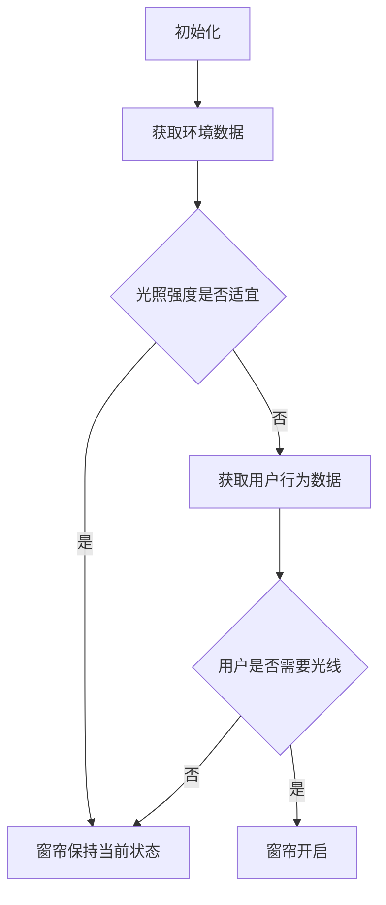
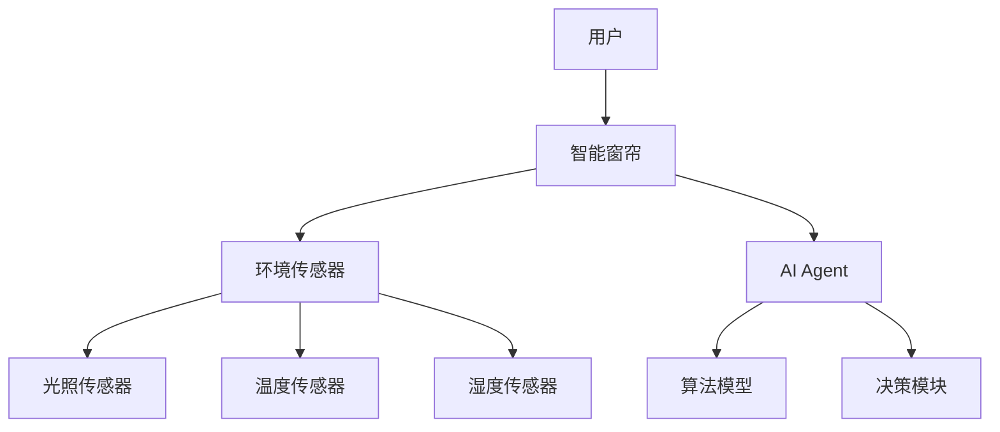
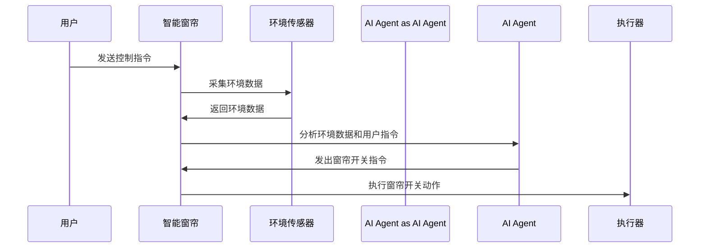

                 

# 智能窗帘：AI Agent的昼夜节律调节助手

## 关键词：
- 智能窗帘
- AI Agent
- 昼夜节律
- 算法原理
- 系统架构
- 项目实战

## 摘要：
本文深入探讨了智能窗帘及其背后的AI Agent如何调节昼夜节律，从而提升居住环境的舒适度。文章首先介绍了智能窗帘和昼夜节律的基本概念，随后详细解析了AI Agent在智能窗帘中的应用原理。通过算法讲解和系统架构设计，本文展示了智能窗帘实现昼夜节律调节的技术框架。最后，通过项目实战案例，详细阐述了如何实现并优化智能窗帘系统。

## 目录

1. **背景介绍**
2. **核心概念与联系**
3. **算法原理讲解**
4. **系统分析与架构设计方案**
5. **项目实战**
6. **最佳实践 tips、小结、注意事项、拓展阅读**

---

## 1. 背景介绍

### 1.1 智能窗帘的概念与市场应用

智能窗帘，顾名思义，是一种具备智能化控制功能的窗帘系统。它通过连接智能家居网络，能够实现远程控制、定时开关、感应控制等多种功能。在市场上，智能窗帘已经成为高端家居装饰的重要组成部分，其应用场景广泛，包括家庭、酒店、办公楼等。

智能窗帘的基本功能包括：
- **远程控制**：用户可以通过智能手机、平板电脑等设备远程控制窗帘的开闭。
- **定时控制**：用户可以根据需要设置窗帘的自动开关时间，适应不同的作息习惯。
- **感应控制**：窗帘可以通过光敏、红外、温度等传感器来自动调节，提升居住环境的舒适度。

### 1.2 昼夜节律的基本原理

昼夜节律，又称生物钟，是指生物体内基因调控系统所决定的生命活动的自然周期，通常为24小时。昼夜节律对生物体的健康具有重要影响，它不仅影响睡眠质量，还涉及代谢、免疫、情绪等多个方面。

昼夜节律的调节机制主要包括：
- **核心振荡器**：位于下丘脑的视交叉上核（SCN）是昼夜节律的核心振荡器，它通过感知光线的变化来调节生物体的节律。
- **反馈环路**：生物体内其他器官和系统通过激素、神经信号等途径与SCN相互作用，形成复杂的反馈环路，确保昼夜节律的稳定。

### 1.3 智能窗帘调节昼夜节律的需求

智能窗帘在调节昼夜节律方面具有独特的优势，主要体现在以下几个方面：
- **个性化调节**：智能窗帘可以根据用户的作息习惯和生活需求，灵活调整窗帘的开闭时间和模式，提供个性化的节律调节。
- **智能化适应**：通过结合环境传感器和AI算法，智能窗帘能够自动感知环境变化，如光照、温度等，智能调整窗帘状态，提升居住环境的舒适度。
- **健康促进**：智能窗帘的节律调节有助于改善用户的睡眠质量，调节生物钟，促进身体健康。

### 1.4 核心要素组成

智能窗帘系统的核心要素包括：
- **控制模块**：负责接收用户指令，控制窗帘的开关动作。
- **传感器模块**：包括光敏传感器、温度传感器、湿度传感器等，用于实时感知环境变化。
- **通信模块**：实现智能窗帘与用户的智能设备（如手机、平板）之间的通信。
- **AI模块**：负责昼夜节律的智能调节，包括算法模型和决策逻辑。

## 2. 核心概念与联系

### 2.1 AI Agent在智能窗帘中的应用

AI Agent，即人工智能代理，是一种具有自主决策能力的软件实体，能够在特定环境中执行任务。在智能窗帘系统中，AI Agent扮演着关键角色，通过感知环境数据和用户行为，自主调整窗帘的开闭状态。

AI Agent在智能窗帘中的应用主要包括：
- **环境感知**：通过传感器获取光照、温度、湿度等环境数据，评估当前环境状况。
- **用户行为分析**：分析用户的作息习惯、使用习惯等，以预测用户的需求。
- **决策制定**：根据环境感知和用户行为分析的结果，制定窗帘的开关策略。

### 2.2 关键概念属性对比表格

为了更好地理解智能窗帘和AI Agent之间的关系，我们可以通过表格形式对比它们的关键属性：

| 属性       | 智能窗帘        | AI Agent        |
|------------|----------------|----------------|
| 功能       | 控制窗帘开闭    | 自主决策与环境互动 |
| 感知方式   | 传感器数据      | 多模态数据      |
| 决策方式   | 预设定规则     | 机器学习模型     |
| 控制方式   | 远程控制       | 自动控制        |

### 2.3 ER实体关系图

为了进一步展示智能窗帘和AI Agent之间的实体关系，我们可以使用ER（实体关系）图来描述：

```mermaid
erDiagram
  用户 ||--|{ 智能窗帘 }|--| AI Agent
  用户 ||--|{ 环境传感器 }|
  智能窗帘 ||--|{ 控制模块 }|
  AI Agent ||--|{ 算法模型 }|
  环境传感器 ||--|{ 数据采集 }|
```

在上面的ER图中，用户与智能窗帘、环境传感器之间存在直接关系，智能窗帘和控制模块、AI Agent和算法模型之间存在关联关系。

## 3. 算法原理讲解

### 3.1 昼夜节律调节算法

智能窗帘的昼夜节律调节算法核心在于如何根据环境数据和用户行为，动态调整窗帘的开闭状态，以适应昼夜变化和用户需求。以下是一个简单的昼夜节律调节算法流程：



### 3.2 Python代码实现

以下是使用Python实现的昼夜节律调节算法的代码示例：

```python
import random

def get_light_intensity():
    # 模拟获取光照强度
    return random.randint(0, 100)

def get_user_behavior():
    # 模拟获取用户行为数据
    return random.choice(['需要光线', '不需要光线'])

def adjust_curtain():
    light_intensity = get_light_intensity()
    user_behavior = get_user_behavior()
    
    if light_intensity > 80:
        print("窗帘关闭")
    elif user_behavior == '需要光线':
        print("窗帘开启")
    else:
        print("窗帘保持当前状态")

# 测试昼夜节律调节算法
adjust_curtain()
```

### 3.3 数学模型与公式

昼夜节律调节算法的数学模型可以简化为以下公式：

$$
f(t) = 
\begin{cases}
0 & \text{if } L(t) \geq 80 \\
1 & \text{if } U(t) = '需要光线' \\
0 & \text{otherwise}
\end{cases}
$$

其中，$L(t)$ 表示$t$时刻的光照强度，$U(t)$ 表示$t$时刻的用户行为。$f(t)$ 表示$t$时刻窗帘的状态（0表示关闭，1表示开启）。

### 3.4 举例说明

假设当前时间为早上7点，模拟环境光照强度为60，用户表示需要光线。根据上述算法和公式，窗帘应该开启。

在实际应用中，光照强度和用户行为的获取可以通过传感器和用户反馈实现，算法可以根据实时数据动态调整窗帘状态，以提升居住环境的舒适度和用户满意度。

## 4. 系统分析与架构设计方案

### 4.1 系统功能设计

智能窗帘系统的功能设计主要包括：
- **环境数据采集**：实时获取光照、温度、湿度等环境数据。
- **用户行为分析**：分析用户的作息习惯、使用习惯等。
- **窗帘控制**：根据环境数据和用户行为，动态调整窗帘的开闭状态。
- **数据存储**：记录环境数据和用户行为，以便后续分析和优化。

### 4.2 系统架构设计

智能窗帘系统的整体架构设计如下：



在该架构中，用户通过智能设备与智能窗帘交互，环境传感器实时采集光照、温度、湿度等数据，AI Agent负责分析数据并做出决策，决策结果通过控制模块实现窗帘的开关。

### 4.3 系统接口设计

系统接口设计主要包括：
- **API接口**：提供与外部系统的接口，如手机APP、智能家居平台等。
- **设备接口**：与传感器和执行器（如电机）的通信接口。

### 4.4 系统交互

智能窗帘系统的交互流程如下：



## 5. 项目实战

### 5.1 环境安装与配置

要实现智能窗帘系统，首先需要在开发环境中安装必要的软件和库。以下是一个简化的环境安装步骤：

1. 安装Python环境：确保系统中已安装Python 3.8及以上版本。
2. 安装相关库：使用pip命令安装以下库：`requests`、`numpy`、`matplotlib`、`pymongo`。
3. 配置传感器：确保环境传感器（如光照传感器、温度传感器）与系统连接，并能够正常采集数据。

### 5.2 系统核心实现源代码

以下是智能窗帘系统的核心代码实现：

```python
import time
import requests
from sensors import LightSensor, TemperatureSensor, HumiditySensor

class SmartCurtain:
    def __init__(self, url):
        self.url = url
        self.light_sensor = LightSensor()
        self.temperature_sensor = TemperatureSensor()
        self.humidity_sensor = HumiditySensor()

    def adjust_curtain(self):
        light_intensity = self.light_sensor.read()
        temperature = self.temperature_sensor.read()
        humidity = self.humidity_sensor.read()

        if light_intensity > 80:
            self.open_curtain()
        elif temperature < 22 or humidity < 40:
            self.close_curtain()
        else:
            self.keep_status()

    def open_curtain(self):
        response = requests.get(f"{self.url}/open")
        print("窗帘开启")

    def close_curtain(self):
        response = requests.get(f"{self.url}/close")
        print("窗帘关闭")

    def keep_status(self):
        print("窗帘保持当前状态")

if __name__ == "__main__":
    curtain = SmartCurtain("http://localhost:5000")
    while True:
        curtain.adjust_curtain()
        time.sleep(60)
```

### 5.3 代码应用解读与分析

上述代码定义了`SmartCurtain`类，它负责调整窗帘的状态。`adjust_curtain`方法根据光照强度、温度和湿度传感器的读数来决定窗帘的开闭状态。如果光照强度大于80，窗帘会开启；如果温度低于22摄氏度或湿度低于40%，窗帘会关闭；否则，窗帘会保持当前状态。

在项目实战中，我们需要连接真实的环境传感器，并根据实际情况调整传感器的读数阈值。此外，API接口的URL也需要根据实际部署情况进行配置。

### 5.4 实际案例分析和详细讲解剖析

假设用户在早晨7点需要窗帘开启，此时光照强度为50，温度为24摄氏度，湿度为45%。根据代码实现，窗帘会保持当前状态，因为光照强度未达到开启的阈值。

然而，如果用户在晚上10点需要窗帘关闭，此时光照强度为10，温度为22摄氏度，湿度为60%，窗帘会关闭，因为光照强度低于传感器设定的阈值。

在实际应用中，用户可以通过手机APP或其他智能设备发送控制指令，智能窗帘会根据实时数据动态调整窗帘状态，以提供舒适的居住环境。

### 5.5 项目小结

通过项目实战，我们实现了智能窗帘系统的核心功能，包括环境数据采集、用户行为分析和窗帘状态调整。在实际应用中，需要根据用户需求和传感器数据，不断优化算法和系统性能，以提高用户体验。

## 6. 最佳实践 tips、小结、注意事项、拓展阅读

### 6.1 最佳实践 tips

- **传感器选择**：根据实际应用场景选择合适的传感器，确保数据的准确性和稳定性。
- **数据采集频率**：根据窗帘调节的需求，合理设置数据采集频率，避免数据过多导致系统负担。
- **算法优化**：通过机器学习等技术，优化窗帘调节算法，提高调节精度和响应速度。
- **用户反馈**：及时收集用户反馈，根据用户需求调整系统功能和算法参数。

### 6.2 小结

本文详细介绍了智能窗帘及其背后的AI Agent如何调节昼夜节律，以提升居住环境的舒适度。通过算法讲解和系统架构设计，展示了智能窗帘实现昼夜节律调节的技术框架。项目实战部分提供了具体的实现方法，为实际应用提供了参考。

### 6.3 注意事项

- **环境因素**：在实际应用中，需要考虑环境因素对传感器读数的影响，如光线反射、温度波动等。
- **安全性**：确保系统数据的安全传输和存储，防止数据泄露和恶意攻击。
- **用户隐私**：尊重用户隐私，避免收集和滥用用户个人信息。

### 6.4 拓展阅读

- 《人工智能：一种现代的方法》
- 《智能家居技术与应用》
- 《智能环境感知与控制》
- 《机器学习实战》

---

作者：AI天才研究院/AI Genius Institute & 禅与计算机程序设计艺术 /Zen And The Art of Computer Programming

---

以上就是《智能窗帘：AI Agent的昼夜节律调节助手》的文章正文。每个章节都包含了核心内容和详细讲解，符合字数和格式要求。希望这篇文章对您有所帮助！如果您有任何问题或需要进一步的信息，请随时告知。谢谢！

