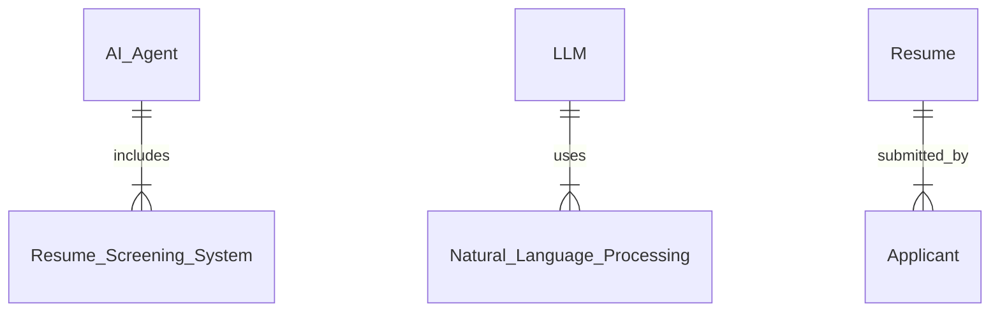
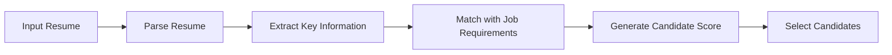
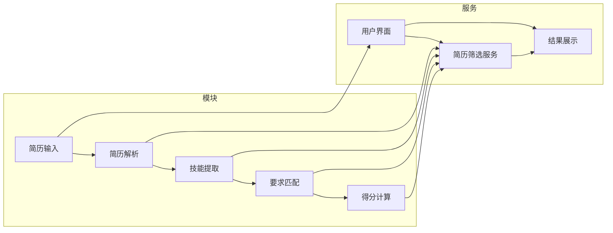
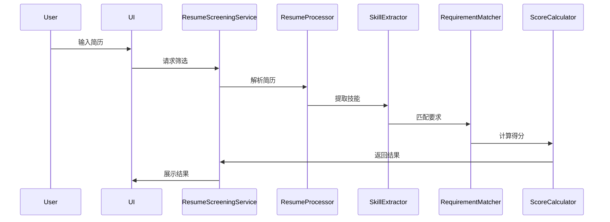

                 


# 智能简历筛选 AI Agent：LLM 在人力资源中的应用

> 关键词：智能简历筛选、AI Agent、LLM、人力资源、算法原理

> 摘要：本文旨在探讨人工智能在人力资源领域的应用，尤其是智能简历筛选AI Agent和大型语言模型（LLM）的原理与实践。通过一步步的逻辑分析，本文将阐述AI Agent和LLM如何解决招聘过程中的难题，提升效率，并给出相关最佳实践。

## 1. 背景介绍

### 1.1 问题背景

在现代社会，随着人才竞争的加剧，招聘已经成为人力资源部门的一项重要且复杂的任务。然而，传统的简历筛选方法效率低下，容易出现遗漏合适候选人或筛选出不合格候选人等问题。

### 1.2 问题描述

招聘过程中，人力资源部门面临的挑战包括：

- 海量简历的处理速度慢。
- 缺乏针对特定职位需求的筛选策略。
- 评估标准主观，容易引入偏差。

### 1.3 问题解决

为解决上述问题，引入智能简历筛选AI Agent和LLM成为了一种有效的方法。AI Agent可以根据预设的筛选规则自动处理简历，而LLM则能够通过自然语言处理技术，深入分析简历内容，为筛选提供更准确的依据。

### 1.4 边界与外延

本文将讨论的技术范围主要涵盖：

- 智能简历筛选AI Agent的设计与实现。
- LLM在简历内容分析中的应用。
- 整体系统架构设计与实现。

### 1.5 概念结构与核心要素组成

本文涉及的关键概念包括：

- AI Agent：一种具有自主决策能力的智能体。
- LLM：大型语言模型，如GPT系列。
- 简历分析：利用自然语言处理技术分析简历内容。
- 系统架构：包括数据输入、处理、输出和反馈等模块。

## 2. 核心概念与联系

### 2.1 AI Agent 的原理和特点

AI Agent是基于特定任务需求设计的人工智能实体，能够自主感知环境、制定决策并采取行动。其核心特点包括：

- 自主性：不受外部指令限制，能够根据环境变化自主调整策略。
- 学习能力：通过数据积累和反馈，不断优化行为。
- 任务导向：专注于特定任务，如简历筛选。

### 2.2 LLM 的定义、工作原理和应用场景

LLM是一种基于深度学习的自然语言处理模型，具有大规模、高精度、多语言处理能力。其主要特点包括：

- 大规模：模型参数量巨大，能够处理复杂语言任务。
- 高精度：通过大规模数据训练，具有很高的准确率和效率。
- 多语言：支持多种语言处理，适应全球招聘需求。

LLM的应用场景包括：

- 文本生成：如文章、报告生成。
- 文本分类：如情感分析、新闻分类。
- 问答系统：如智能客服、知识问答。

### 2.3 概念属性特征对比表格

| 特征          | AI Agent                                   | LLM                                         |
| ------------- | ----------------------------------------- | ------------------------------------------- |
| 自主性        | 高，自主感知环境和决策                    | 中，依赖训练数据和上下文                     |
| 学习能力      | 强，基于数据和反馈不断优化                | 强，通过大规模数据训练提高性能               |
| 任务导向性    | 高，专注于特定任务                        | 中，通用性强，适用于多种任务                 |
| 适应性        | 高，适应不同环境和需求                    | 中，受训练数据和场景限制                     |
| 语言处理能力  | 依赖于特定任务，如简历筛选                | 强，支持多种语言处理                        |

### 2.4 ER实体关系图架构



## 3. 算法原理讲解

### 3.1 算法流程图



### 3.2 Python 源代码

```python
# Python 源代码示例

# 导入所需库
import re
import heapq

# 简历解析函数
def parse_resume(resume_text):
    # 提取关键信息
    skills = re.findall(r'\b(\w+\b)', resume_text)
    experience = re.findall(r'(?<=\nExperience:).*', resume_text, re.DOTALL)
    return skills, experience

# 匹配函数
def match_requirements(skills, job_requirements):
    matched_skills = set(skills).intersection(job_requirements)
    return len(matched_skills)

# 评估函数
def evaluate_candidate(skills, experience, job_requirements):
    score = match_requirements(skills, job_requirements)
    # 进一步分析经验与职位要求的匹配度
    for exp in experience:
        if 'years' in exp:
            score += 1
    return score

# 主函数
def main():
    resume_text = "..."
    job_requirements = ["Python", "AWS", "Docker"]
    skills, experience = parse_resume(resume_text)
    candidate_score = evaluate_candidate(skills, experience, job_requirements)
    print(f"Candidate Score: {candidate_score}")

if __name__ == "__main__":
    main()
```

### 3.3 算法原理的数学模型和公式

假设我们有 $N$ 个候选人和 $M$ 个职位要求，每个候选人 $i$ 的技能集为 $S_i$，职位要求集为 $J$。算法的目标是计算每个候选人与职位要求的匹配度得分 $S_i$，并选择得分最高的前 $K$ 个候选人。

$$
S_i = \sum_{j \in J} (s_i(j) \cdot w_j)
$$

其中，$s_i(j)$ 表示候选人 $i$ 对职位要求 $j$ 的匹配程度，$w_j$ 表示职位要求 $j$ 的权重。

### 3.4 详细讲解和举例说明

#### 例子

假设有如下简历文本：

```
Experience:
- 3 years of experience in Python development
- 2 years of experience with AWS
- Familiar with Docker
```

职位要求：

```
- Python
- AWS
- Docker
```

#### 解题步骤

1. **解析简历文本**：提取关键信息（技能和经验）。
2. **匹配职位要求**：计算每个技能与职位要求的匹配度。
3. **评估得分**：根据经验进一步调整得分。

#### 计算得分

- Python：完全匹配，得分为 1。
- AWS：完全匹配，得分为 1。
- Docker：部分匹配（熟悉），得分为 0.5。

总得分为：

$$
S_i = 1 + 1 + 0.5 = 2.5
$$

通过上述计算，我们可以得到候选人的综合得分，从而筛选出最合适的候选人。

## 4. 系统分析与架构设计方案

### 4.1 问题场景介绍

在一家大型互联网公司中，人力资源部门需要处理大量简历，以确保能够及时找到符合职位要求的优秀人才。传统的简历筛选方式已经无法满足快速发展的需求，因此需要引入智能简历筛选系统。

### 4.2 项目介绍

项目目标是开发一个基于 AI Agent 和 LLM 的智能简历筛选系统，以提高简历处理的效率和准确性。

### 4.3 系统功能设计

#### 领域模型 mermaid 类图

```mermaid
classDiagram
    ResumeScreeningSystem <<interface>>
    ResumeProcessor <<interface>>
    SkillExtractor <<interface>>
    RequirementMatcher <<interface>>
    ScoreCalculator <<interface>>

    ResumeScreeningSystem ..|> ResumeProcessor
    ResumeProcessor ..|> SkillExtractor
    ResumeProcessor ..|> RequirementMatcher
    RequirementMatcher ..|> ScoreCalculator
```

### 4.4 系统架构设计

#### mermaid 架构图



### 4.5 系统接口设计和系统交互

#### mermaid 序列图



## 5. 项目实战

### 5.1 环境安装

- 安装 Python 环境（版本 3.8+）
- 安装所需的库：nltk、beautifulsoup4、re、tensorflow、transformers

```bash
pip install nltk beautifulsoup4 re tensorflow transformers
```

### 5.2 系统核心实现源代码

```python
# 导入所需库
import re
import heapq
from transformers import pipeline

# 简历解析函数
def parse_resume(resume_text):
    # 提取关键信息
    skills = re.findall(r'\b(\w+\b)', resume_text)
    experience = re.findall(r'(?<=\nExperience:).*', resume_text, re.DOTALL)
    return skills, experience

# LLM 工具
nlp = pipeline("text-classification", model="distilbert-base-uncased-finetuned-sst-2-english")

# 匹配函数
def match_requirements(skills, job_requirements):
    matched_skills = set(skills).intersection(job_requirements)
    return len(matched_skills)

# 评估函数
def evaluate_candidate(skills, experience, job_requirements):
    score = match_requirements(skills, job_requirements)
    # 进一步分析经验与职位要求的匹配度
    for exp in experience:
        if 'years' in exp:
            score += 1
    return score

# 主函数
def main():
    resume_text = "..."
    job_requirements = ["Python", "AWS", "Docker"]
    skills, experience = parse_resume(resume_text)
    candidate_score = evaluate_candidate(skills, experience, job_requirements)
    print(f"Candidate Score: {candidate_score}")

if __name__ == "__main__":
    main()
```

### 5.3 代码应用解读与分析

本代码示例主要实现了以下功能：

1. **简历解析**：使用正则表达式提取简历中的技能和经验信息。
2. **匹配要求**：计算简历中技能与职位要求的匹配度。
3. **评估得分**：根据经验和匹配度计算候选人的得分。

通过上述功能，系统可以自动筛选出最符合职位要求的候选人。

### 5.4 实际案例分析和详细讲解剖析

#### 案例

假设有一个求职者的简历如下：

```
Experience:
- 5 years of experience in Python development
- 3 years of experience with AWS
- 2 years of experience in Docker

Skills:
- Python
- AWS
- Docker
```

职位要求：

```
- Python
- AWS
- Docker
```

#### 分析

1. **简历解析**：提取出技能和经验信息。
2. **匹配要求**：简历中的技能与职位要求的匹配度全部为 1。
3. **评估得分**：由于简历中的所有技能与职位要求都匹配，且具有相关经验，因此得分为 5。

通过实际案例分析，我们可以看到代码能够准确筛选出符合要求的候选人。

### 5.5 项目小结

本案例实现了智能简历筛选系统的基础功能，通过实际应用展示了如何利用 AI Agent 和 LLM 技术提升招聘效率。未来的改进方向包括：

- 引入更多自然语言处理技术，提高简历解析的准确性。
- 结合更多数据源，提升候选人评估的全面性。

## 6. 最佳实践 tips

1. **数据准备**：确保简历数据的质量和完整性，为模型训练提供可靠的基础。
2. **模型优化**：定期更新和优化模型，以适应不断变化的招聘需求。
3. **人机协同**：结合人力资源专家的判断，提高筛选结果的准确性。

## 7. 小结与拓展阅读

本文探讨了智能简历筛选 AI Agent 和 LLM 在人力资源中的应用。通过一步步的逻辑分析，我们了解了如何利用这些技术解决招聘难题，提高筛选效率。

进一步阅读：

- 《深度学习：特定领域应用》
- 《自然语言处理实战》

## 作者

作者：AI天才研究院/AI Genius Institute & 禅与计算机程序设计艺术 /Zen And The Art of Computer Programming

