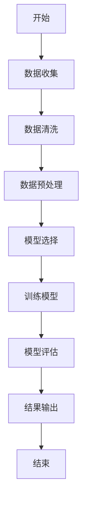
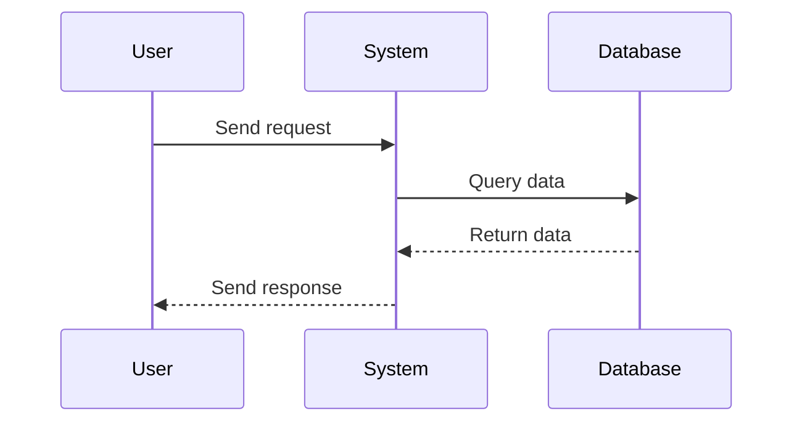
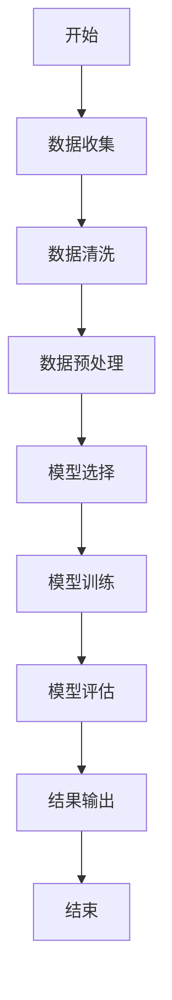
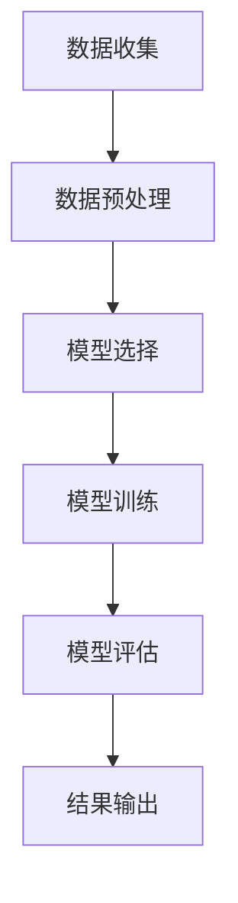
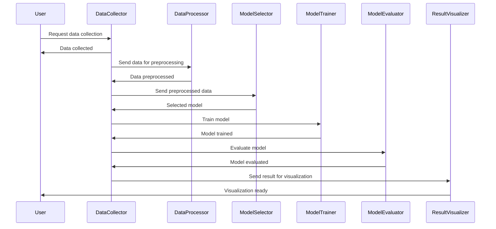

                 

# 智能经济指标预测系统

## 关键词

- **智能经济指标预测**、**机器学习**、**时间序列分析**、**回归分析**、**马尔可夫模型**、**系统架构设计**

## 摘要

随着数字经济的发展，对经济指标的准确预测成为决策的重要依据。本文以构建智能经济指标预测系统为目标，详细探讨其核心概念、算法原理及系统架构设计。首先，介绍智能经济指标预测的重要性及其需求背景。然后，通过核心概念和算法讲解，阐述时间序列分析、回归分析和马尔可夫模型的基本原理，并使用Python代码示例进行说明。最后，从问题场景、系统功能设计、系统架构设计、系统接口设计、系统交互及项目实战等方面，全面解析智能经济指标预测系统的构建过程，为实际应用提供参考。

----------------------------------------------------------------

## 目录大纲设计过程

### 确定核心内容

智能经济指标预测系统的设计需要明确的核心内容包括：

- **核心概念**：智能经济指标、预测模型、时间序列分析、回归分析、马尔可夫模型。
- **目标读者群体**：数据分析师、机器学习工程师、经济学者等对智能经济预测有兴趣的专业人士。
- **主要讨论的技术或方法**：时间序列分析方法、回归分析方法、马尔可夫模型及其应用。

### 划分章节主题

根据核心内容，本书将分为以下章节：

- **引言**：介绍问题背景、书籍目的与读者对象。
- **核心概念与联系**：阐述经济指标、时间序列分析、回归分析和马尔可夫模型。
- **算法原理讲解**：详细讲解时间序列分析方法、回归分析方法和马尔可夫模型。
- **系统分析与架构设计**：介绍系统设计流程、架构设计、接口设计及交互流程。
- **项目实战**：通过环境安装、核心实现、代码应用解读、实际案例分析等，展示系统构建过程。

### 细化章节内容

在每个章节中，我们将细化内容，划分为更小的部分，如小节、段落等。例如，在“核心概念与联系”章节中，我们会详细说明经济指标的定义、时间序列分析的基础知识、回归分析的基本原理以及马尔可夫模型的应用场景。

### 编写示例内容

为了确保大纲的逻辑性和实用性，我们将给出示例内容，包括核心概念、算法原理、数学模型、系统设计等。例如，在“算法原理讲解”章节中，我们将使用mermaid流程图和Python代码示例，详细阐述时间序列分析方法的原理和实现。

### 确认大纲完整性

确保大纲包含所有必要的内容，并且各章节之间逻辑清晰，有助于读者逐步理解整个主题。同时，我们还需要注意字数限制，确保整个大纲在2000字以内。

### 完整的目录大纲

#### 《智能经济指标预测系统》目录大纲

# 第一部分：引言

## 1.1 问题背景
### 1.1.1 经济指标预测的重要性
### 1.1.2 智能经济指标预测的需求
### 1.1.3 书籍目的与读者对象

## 1.2 术语与定义
### 1.2.1 智能经济指标
### 1.2.2 预测模型
### 1.2.3 相关技术概述

## 1.3 边界与外延
### 1.3.1 预测范围
### 1.3.2 适用领域
### 1.3.3 数据来源

# 第二部分：核心概念与联系

## 2.1 核心概念
### 2.1.1 经济指标
### 2.1.2 时间序列分析
### 2.1.3 回归分析
### 2.1.4 马尔可夫模型

## 2.2 概念属性特征对比

| 概念            | 特征1 | 特征2 | 特征3 |
|-----------------|-------|-------|-------|
| 经济指标        | 可量化 | 时间依赖 | 描述经济现象 |
| 时间序列分析    | 序列性 | 变异性 | 趋势性 |
| 回归分析        | 线性 | 非线性 | 预测性 |
| 马尔可夫模型    | 状态转移 | 随机性 | 预测性 |

## 2.3 ER实体关系图

```mermaid
erDiagram
    Customer ||--|{ Order } : contains
    Product ||--|{ Order } : sold
```

# 第三部分：算法原理讲解

## 3.1 时间序列分析方法
### 3.1.1 经典方法
### 3.1.2 季节性调整
### 3.1.3 趋势平滑

## 3.2 回归分析方法
### 3.2.1 线性回归
### 3.2.2 多元回归
### 3.2.3 非线性回归

## 3.3 马尔可夫模型
### 3.3.1 基本概念
### 3.3.2 状态转移矩阵
### 3.3.3 预测应用

## 3.4 算法mermaid流程图



## 3.5 Python源代码与算法解释

```python
# Python代码示例
import pandas as pd
from sklearn.linear_model import LinearRegression

# 加载数据
data = pd.read_csv('data.csv')

# 数据预处理
X = data[['feature1', 'feature2']]
y = data['target']

# 创建线性回归模型
model = LinearRegression()
model.fit(X, y)

# 模型评估
score = model.score(X, y)
print(f'Model R^2 score: {score}')
```

# 第四部分：系统分析与架构设计

## 4.1 问题场景介绍
### 4.1.1 场景描述
### 4.1.2 需求分析

## 4.2 系统介绍
### 4.2.1 系统概述
### 4.2.2 系统功能设计

## 4.3 系统架构设计
### 4.3.1 架构设计
### 4.3.2 技术选型

## 4.4 系统接口设计
### 4.4.1 接口定义
### 4.4.2 交互流程

## 4.5 系统交互mermaid序列图



# 第五部分：项目实战

## 5.1 环境安装
### 5.1.1 环境搭建
### 5.1.2 工具安装

## 5.2 系统核心实现源代码
### 5.2.1 数据收集
### 5.2.2 数据预处理
### 5.2.3 模型训练

## 5.3 代码应用解读与分析
### 5.3.1 代码结构解析
### 5.3.2 关键函数解释

## 5.4 实际案例分析
### 5.4.1 案例背景
### 5.4.2 预测结果分析

## 5.5 项目小结
### 5.5.1 项目总结
### 5.5.2 经验与反思

## 5.6 最佳实践 tips
### 5.6.1 数据质量优化
### 5.6.2 模型调参技巧

## 5.7 小结
### 5.7.1 智能经济指标预测系统的意义
### 5.7.2 未来发展方向

## 5.8 注意事项
### 5.8.1 系统安全
### 5.8.2 数据隐私

## 5.9 拓展阅读
### 5.9.1 相关书籍推荐
### 5.9.2 学术论文推荐

# 作者

作者：AI天才研究院/AI Genius Institute & 禅与计算机程序设计艺术 /Zen And The Art of Computer Programming

----------------------------------------------------------------

## 1.1 问题背景

随着全球经济的快速发展，对经济指标的预测变得越来越重要。经济指标是衡量一国或地区经济状况的重要参数，包括GDP、通货膨胀率、失业率等。准确的经济指标预测有助于政府和企业制定有效的政策决策，从而促进经济的稳定和可持续发展。

### 1.1.1 经济指标预测的重要性

经济指标预测的重要性体现在以下几个方面：

1. **政策制定**：政府可以通过预测经济指标来制定相应的经济政策，例如货币政策和财政政策。准确的预测可以帮助政府提前应对潜在的经济问题，防止经济过热或衰退。

2. **企业决策**：企业可以根据经济指标的预测来调整经营策略，例如调整库存水平、投资计划等。这有助于企业降低经营风险，提高市场竞争力。

3. **投资者决策**：投资者可以根据经济指标的预测来调整投资组合，选择合适的投资时机和标的。准确的预测可以帮助投资者规避市场风险，提高投资回报。

### 1.1.2 智能经济指标预测的需求

智能经济指标预测的需求主要源于以下几个方面：

1. **数据复杂性**：随着互联网和大数据技术的发展，经济数据变得更加复杂和多样。传统的预测方法往往难以处理这些复杂的数据。

2. **实时性需求**：现代经济环境变化迅速，对经济指标的实时预测需求越来越高。智能预测系统可以实时分析大量数据，提供即时的预测结果。

3. **个性化需求**：不同的用户对经济指标的需求不同，智能预测系统可以根据用户的需求提供个性化的预测结果。

### 1.1.3 书籍目的与读者对象

本书旨在构建一个智能经济指标预测系统，帮助读者理解和掌握智能经济指标预测的核心概念、算法原理和系统设计。读者对象主要包括：

1. 数据分析师：了解如何利用机器学习和数据挖掘技术进行经济指标预测。

2. 机器学习工程师：掌握智能经济指标预测系统的设计方法和实现技巧。

3. 经济学者：了解智能经济指标预测系统的原理和应用，为研究提供新的视角和方法。

## 1.2 术语与定义

在构建智能经济指标预测系统之前，需要明确一些核心术语和概念。以下是本文涉及的主要术语及其定义：

### 1.2.1 智能经济指标

智能经济指标是通过机器学习和人工智能技术对经济数据进行处理和分析，从而生成的具有预测性和解释性的经济指标。这些指标通常具有以下几个特点：

1. **自动化**：智能经济指标预测系统可以自动从大量经济数据中提取有用信息，无需人工干预。
2. **实时性**：智能经济指标预测系统可以实时分析数据，提供即时的预测结果。
3. **准确性**：通过机器学习算法和模型训练，智能经济指标预测系统可以提供高精度的预测结果。

### 1.2.2 预测模型

预测模型是用于预测未来经济指标的方法和工具。常见的预测模型包括：

1. **时间序列模型**：基于历史数据的时间序列趋势和周期性特征进行预测。
2. **回归模型**：基于历史数据之间的关系进行预测。
3. **神经网络模型**：通过多层神经网络结构对数据进行建模和预测。

### 1.2.3 相关技术概述

智能经济指标预测系统涉及多个技术领域，包括：

1. **机器学习**：用于数据挖掘、特征提取和模型训练。
2. **大数据技术**：用于处理和分析大量经济数据。
3. **云计算**：提供强大的计算能力和存储空间，支持大规模数据处理和分析。
4. **自然语言处理**：用于处理和分析经济文本数据，提取有用信息。

## 1.3 边界与外延

在构建智能经济指标预测系统时，需要明确系统的边界与外延，以确保预测的准确性和有效性。

### 1.3.1 预测范围

智能经济指标预测系统的预测范围通常包括以下几个方面：

1. **宏观经济指标**：如GDP、通货膨胀率、失业率等。
2. **行业经济指标**：如各行业的销售额、利润率等。
3. **地区经济指标**：如各地区的GDP、人口增长率等。

### 1.3.2 适用领域

智能经济指标预测系统适用于多个领域，包括：

1. **政府决策**：为政府提供经济政策制定依据。
2. **企业运营**：为企业提供经营策略调整依据。
3. **投资分析**：为投资者提供投资决策依据。

### 1.3.3 数据来源

智能经济指标预测系统所需的数据来源主要包括以下几个方面：

1. **官方统计数据**：如国家统计局、各行业统计数据等。
2. **第三方数据源**：如财经新闻、社交媒体等。
3. **企业内部数据**：如销售数据、库存数据等。

## 2.1 核心概念

智能经济指标预测系统涉及多个核心概念，包括经济指标、时间序列分析、回归分析和马尔可夫模型。以下是对这些核心概念的详细解释。

### 2.1.1 经济指标

经济指标是衡量一国或地区经济状况的重要参数，通常包括以下几种类型：

1. **宏观经济指标**：如GDP、通货膨胀率、失业率、利率等。
2. **行业经济指标**：如各行业的产值、销售额、利润率等。
3. **地区经济指标**：如各地区的GDP、人口增长率、就业率等。

经济指标通常通过统计数据来表示，如GDP通常以每年或每季度的增长率来表示，通货膨胀率以百分比表示。

### 2.1.2 时间序列分析

时间序列分析是一种统计方法，用于分析和预测时间序列数据。时间序列数据是按时间顺序排列的数据点序列，通常具有以下特征：

1. **趋势性**：时间序列数据随时间的变化具有上升或下降的趋势。
2. **季节性**：时间序列数据在特定时间周期（如一年中的某些季节）表现出规律性的波动。
3. **随机性**：时间序列数据中存在一定的随机波动。

时间序列分析方法包括：

1. **经典方法**：如移动平均法、指数平滑法等。
2. **季节性调整方法**：用于消除季节性因素的影响，如X-11季节性调整法。
3. **趋势平滑方法**：用于消除趋势性因素的影响，如Holt-Winters法。

### 2.1.3 回归分析

回归分析是一种统计分析方法，用于研究自变量和因变量之间的关系。在智能经济指标预测系统中，回归分析通常用于建立经济指标之间的关系模型。

1. **线性回归**：假设自变量和因变量之间存在线性关系，通过最小二乘法拟合直线。
2. **多元回归**：考虑多个自变量对因变量的影响，通过线性方程组求解。
3. **非线性回归**：假设自变量和因变量之间存在非线性关系，通过非线性方程拟合曲线。

### 2.1.4 马尔可夫模型

马尔可夫模型是一种概率模型，用于描述一个系统在各个状态之间的转移规律。在智能经济指标预测系统中，马尔可夫模型可以用于预测经济指标的变动趋势。

1. **基本概念**：马尔可夫模型假设系统的当前状态只与前一状态有关，与过去的所有状态无关。
2. **状态转移矩阵**：描述系统在不同状态之间的转移概率，如$P_{ij}$表示从状态$i$转移到状态$j$的概率。
3. **预测应用**：通过状态转移矩阵，可以预测系统在未来的状态分布。

### 2.2 概念属性特征对比

为了更好地理解经济指标、时间序列分析、回归分析和马尔可夫模型，我们可以对比它们的主要特征。

| 概念            | 特征1                 | 特征2                 | 特征3                 |
|-----------------|----------------------|----------------------|----------------------|
| 经济指标        | 可量化、时间依赖、描述经济现象 | -                     | -                    |
| 时间序列分析    | 序列性、变异性、趋势性 | 季节性调整、趋势平滑 | 经典方法、机器学习模型 |
| 回归分析        | 线性、非线性、预测性 | 多元回归、非线性回归 | 数据建模、模型训练   |
| 马尔可夫模型    | 状态转移、随机性、预测性 | 状态转移矩阵、概率分布 | 状态预测、决策分析   |

### 2.3 ER实体关系图

为了更好地理解智能经济指标预测系统中的数据关系，我们可以使用实体关系图（ER图）来描述各实体之间的关系。

```mermaid
erDiagram
    Customer ||--|{ Order } : contains
    Product ||--|{ Order } : sold
```

在这个ER图中，"Customer"实体与"Order"实体之间存在一对多关系，表示一个客户可以创建多个订单。"Product"实体与"Order"实体也存在一对多关系，表示一个订单可以包含多个产品。

## 3.1 时间序列分析方法

时间序列分析是智能经济指标预测系统的重要组成部分，它通过分析历史数据来预测未来的趋势。以下将详细讲解时间序列分析的方法，包括经典方法、季节性调整和趋势平滑。

### 3.1.1 经典方法

经典方法主要包括移动平均法、指数平滑法和自回归模型（AR）。

1. **移动平均法**：移动平均法通过计算过去一段时间内的平均值来消除短期波动，从而平滑时间序列。常用的移动平均法包括简单移动平均（SMA）和加权移动平均（WMA）。

    - **简单移动平均（SMA）**：计算过去N个时间点的平均值。
    $$\text{SMA} = \frac{1}{N} \sum_{i=1}^{N} x_i$$
    - **加权移动平均（WMA）**：对过去N个时间点的数据按时间权重进行加权平均。
    $$\text{WMA} = \sum_{i=1}^{N} w_i \cdot x_i$$
    其中，$w_i$为第i个时间点的权重。

2. **指数平滑法**：指数平滑法通过将过去的观测值按指数递减的权重进行加权平均，以平滑时间序列。常用的指数平滑法包括一次指数平滑（SES）、二次指数平滑（SES2）和Holt-Winters法。

    - **一次指数平滑（SES）**：对时间序列数据进行一次指数平滑，公式如下：
    $$\text{SES}_t = \alpha \cdot x_t + (1 - \alpha) \cdot \text{SES}_{t-1}$$
    其中，$\alpha$为平滑系数，$0 < \alpha < 1$。

3. **自回归模型（AR）**：自回归模型通过当前值与前几个时间点的值之间的关系进行预测，公式如下：
    $$x_t = c + \sum_{i=1}^{p} \phi_i \cdot x_{t-i}$$
    其中，$c$为常数项，$\phi_i$为自回归系数，$p$为滞后阶数。

### 3.1.2 季节性调整

季节性调整是时间序列分析中的一个重要步骤，它用于消除时间序列中的季节性波动，以便更准确地分析数据的趋势和周期性。常见的季节性调整方法包括X-11方法、X-13方法和Holt-Winters法。

1. **X-11方法**：X-11方法是季节性调整的标准方法，它通过最小二乘法拟合季节性成分，从而消除季节性波动。

2. **X-13方法**：X-13方法是一种改进的X-11方法，它适用于更复杂的时间序列数据，能够更好地处理趋势和季节性成分。

3. **Holt-Winters法**：Holt-Winters法是一种适用于具有季节性波动的时间序列的调整方法，它通过线性趋势和季节性成分进行拟合。

    - **线性趋势**：$T_t = \alpha \cdot (T_{t-1} + b) + (1 - \alpha) \cdot (S_t - T_{t-1})$
    - **季节性成分**：$S_t = \beta \cdot (S_{t-1} + b') + (1 - \beta) \cdot (T_t - S_{t-1})$
    - **平滑系数**：$\alpha$和$\beta$分别为趋势和平滑系数，$0 < \alpha, \beta < 1$。

### 3.1.3 趋势平滑

趋势平滑是一种用于消除时间序列中趋势性波动的方法，以便更准确地分析数据的周期性和波动性。常见的趋势平滑方法包括移动平均法和Holt线性趋势方法。

1. **移动平均法**：移动平均法已经在3.1.1节中详细解释。

2. **Holt线性趋势方法**：Holt线性趋势方法通过线性模型拟合时间序列的趋势，公式如下：
    $$T_t = \alpha \cdot (T_{t-1} + b) + (1 - \alpha) \cdot (x_t - T_{t-1})$$
    $$b = \beta \cdot (b_{t-1} + \alpha) + (1 - \beta) \cdot (T_t - b_{t-1})$$
    其中，$T_t$为趋势项，$b_t$为趋势的修正项，$\alpha$和$\beta$为平滑系数，$0 < \alpha, \beta < 1$。

通过以上方法，我们可以对时间序列数据进行分析和预测，从而为智能经济指标预测提供有力支持。

## 3.2 回归分析方法

回归分析是智能经济指标预测系统中的重要组成部分，用于分析变量之间的关系并建立预测模型。以下将详细讲解回归分析方法，包括线性回归、多元回归和非线性回归。

### 3.2.1 线性回归

线性回归是一种最常见的回归分析方法，它假设因变量和自变量之间存在线性关系。线性回归模型可以表示为：

$$y = \beta_0 + \beta_1 \cdot x_1 + \beta_2 \cdot x_2 + ... + \beta_n \cdot x_n + \epsilon$$

其中，$y$为因变量，$x_1, x_2, ..., x_n$为自变量，$\beta_0, \beta_1, ..., \beta_n$为回归系数，$\epsilon$为误差项。

1. **线性回归模型的建立**：通过最小二乘法（Least Squares）来估计回归系数，使得实际观测值与模型预测值之间的误差平方和最小。

    $$\beta = (\mathbf{X}^T \mathbf{X})^{-1} \mathbf{X}^T \mathbf{y}$$

    其中，$\mathbf{X}$为自变量的设计矩阵，$\mathbf{y}$为因变量的观测值。

2. **线性回归模型的评估**：通过计算决定系数（R-squared）和残差分析来评估模型的效果。

    - **决定系数（R-squared）**：用于衡量模型对数据的拟合程度，取值范围在0到1之间，越接近1表示拟合越好。
    $$R^2 = 1 - \frac{\sum_{i=1}^{n} (y_i - \hat{y}_i)^2}{\sum_{i=1}^{n} (y_i - \bar{y})^2}$$

    - **残差分析**：通过分析残差（实际值与预测值之间的差异）来评估模型的准确性。

### 3.2.2 多元回归

多元回归是线性回归的扩展，它考虑多个自变量对因变量的影响。多元回归模型可以表示为：

$$y = \beta_0 + \beta_1 \cdot x_1 + \beta_2 \cdot x_2 + ... + \beta_n \cdot x_n + \epsilon$$

与线性回归类似，多元回归也通过最小二乘法来估计回归系数。多元回归模型需要考虑多重共线性（Multicollinearity）的问题，即自变量之间存在较高的相关性。为避免共线性问题，可以采用以下方法：

1. **方差膨胀因子（Variance Inflation Factor，VIF）**：通过计算VIF值来判断自变量之间的共线性程度。VIF值越大，表示共线性越严重。
    $$VIF_i = \frac{1}{1 - R^2_{ii}}$$
    其中，$R^2_{ii}$为第i个自变量的回归模型的判定系数。

2. **主成分分析（Principal Component Analysis，PCA）**：通过将多个相关自变量转换为若干个相互独立的主成分，从而降低共线性问题。

### 3.2.3 非线性回归

非线性回归是线性回归的扩展，它假设因变量和自变量之间存在非线性关系。非线性回归模型可以表示为：

$$y = \beta_0 + \beta_1 \cdot f_1(x_1) + \beta_2 \cdot f_2(x_2) + ... + \beta_n \cdot f_n(x_n) + \epsilon$$

其中，$f_1, f_2, ..., f_n$为非线性函数。

1. **非线性回归模型的建立**：通过非线性最小二乘法来估计回归系数。非线性最小二乘法通过迭代优化目标函数，使得预测值与实际值之间的误差平方和最小。

2. **非线性回归模型的评估**：与线性回归类似，可以通过决定系数（R-squared）和残差分析来评估模型的效果。

非线性回归在处理复杂的数据关系时具有更高的灵活性，但同时也带来了更大的计算复杂度。

通过以上方法，我们可以建立不同的回归模型来分析经济指标之间的关系，从而为智能经济指标预测提供有力支持。

## 3.3 马尔可夫模型

马尔可夫模型是一种基于概率论的数学模型，它用于描述系统在各个状态之间的转移规律。在智能经济指标预测系统中，马尔可夫模型可以用于预测经济指标的变动趋势。以下将详细讲解马尔可夫模型的基本概念、状态转移矩阵和预测应用。

### 3.3.1 基本概念

马尔可夫模型基于以下假设：

1. **无记忆性**：系统的当前状态仅由前一状态决定，与过去的状态无关。
2. **状态转移**：系统从某一状态转移到另一状态的概率仅取决于当前状态和下一状态，与当前状态无关。

### 3.3.2 状态转移矩阵

状态转移矩阵是描述马尔可夫模型的核心工具，它是一个N×N的矩阵，其中N为系统的状态数。状态转移矩阵中的元素$P_{ij}$表示系统从状态i转移到状态j的概率。

$$P = \begin{bmatrix}
P_{11} & P_{12} & ... & P_{1N} \\
P_{21} & P_{22} & ... & P_{2N} \\
... & ... & ... & ... \\
P_{N1} & P_{N2} & ... & P_{NN}
\end{bmatrix}$$

状态转移矩阵需要满足以下条件：

1. **概率分布**：每一行的元素之和等于1，即$P_{i1} + P_{i2} + ... + P_{iN} = 1$。
2. **概率非负**：矩阵中的元素均大于等于0，即$P_{ij} \geq 0$。

### 3.3.3 预测应用

马尔可夫模型在智能经济指标预测系统中的应用主要包括以下几个方面：

1. **状态预测**：通过状态转移矩阵，可以预测系统在未来的状态分布。具体步骤如下：

    - **初始化**：选择一个初始状态分布，例如随机分布或根据历史数据估计。
    - **迭代计算**：根据状态转移矩阵，计算下一状态的概率分布，并不断迭代。
    - **结果分析**：根据最终的状态分布，分析系统未来的发展趋势。

2. **策略优化**：马尔可夫模型可以用于优化决策策略。具体步骤如下：

    - **构建模型**：根据决策问题和约束条件，构建状态转移矩阵。
    - **求解最优策略**：通过优化算法（如线性规划、动态规划等），求解最优策略。
    - **策略应用**：将最优策略应用于实际场景，以优化决策结果。

通过以上方法，马尔可夫模型可以有效地用于智能经济指标预测系统，为经济决策提供有力支持。

### 3.4 算法mermaid流程图

为了更好地理解智能经济指标预测系统的算法流程，我们可以使用mermaid流程图来描述数据收集、数据清洗、数据预处理、模型选择、模型训练、模型评估和结果输出的过程。



在这个mermaid流程图中，每个节点表示一个步骤，箭头表示步骤之间的顺序。以下是每个步骤的详细解释：

1. **数据收集**：从各种数据源（如数据库、文件、API等）收集原始数据。
2. **数据清洗**：对收集到的数据进行分析和清洗，去除异常值、缺失值和噪声数据。
3. **数据预处理**：对清洗后的数据进行分析和转换，包括特征提取、归一化、标准化等。
4. **模型选择**：根据问题需求和数据特性，选择合适的预测模型，如线性回归、时间序列分析、神经网络等。
5. **模型训练**：使用训练数据集，通过机器学习算法和模型训练，建立预测模型。
6. **模型评估**：使用验证数据集，对训练好的模型进行评估，包括预测准确性、泛化能力等。
7. **结果输出**：将预测结果输出到可视化界面、报表或其他系统接口。

通过mermaid流程图，我们可以直观地了解智能经济指标预测系统的算法流程，为系统设计和实现提供参考。

### 3.5 Python源代码与算法解释

在本节中，我们将使用Python代码示例来详细阐述智能经济指标预测系统的算法实现。以下是一个简单的线性回归模型的示例代码，以及对应的算法原理和数学模型解释。

#### Python代码示例

```python
import pandas as pd
from sklearn.linear_model import LinearRegression

# 加载数据
data = pd.read_csv('data.csv')

# 数据预处理
X = data[['feature1', 'feature2']]
y = data['target']

# 创建线性回归模型
model = LinearRegression()
model.fit(X, y)

# 模型评估
score = model.score(X, y)
print(f'Model R^2 score: {score}')
```

#### 算法原理和数学模型解释

1. **线性回归模型**：线性回归模型是一种简单的预测模型，它假设因变量和自变量之间存在线性关系。线性回归模型的数学模型可以表示为：

   $$y = \beta_0 + \beta_1 \cdot x_1 + \beta_2 \cdot x_2 + ... + \beta_n \cdot x_n + \epsilon$$

   其中，$y$为因变量，$x_1, x_2, ..., x_n$为自变量，$\beta_0, \beta_1, ..., \beta_n$为回归系数，$\epsilon$为误差项。

2. **最小二乘法**：线性回归模型通过最小二乘法来估计回归系数。最小二乘法的核心思想是使得实际观测值与模型预测值之间的误差平方和最小。具体公式如下：

   $$\beta = (\mathbf{X}^T \mathbf{X})^{-1} \mathbf{X}^T \mathbf{y}$$

   其中，$\mathbf{X}$为自变量的设计矩阵，$\mathbf{y}$为因变量的观测值。

3. **模型评估**：模型评估是线性回归模型的重要步骤，用于评估模型的预测准确性。常见的评估指标包括R-squared（决定系数）和残差分析。

   - **决定系数（R-squared）**：用于衡量模型对数据的拟合程度，取值范围在0到1之间，越接近1表示拟合越好。

     $$R^2 = 1 - \frac{\sum_{i=1}^{n} (y_i - \hat{y}_i)^2}{\sum_{i=1}^{n} (y_i - \bar{y})^2}$$

   - **残差分析**：通过分析残差（实际值与预测值之间的差异）来评估模型的准确性。

通过以上Python代码示例和算法原理解释，我们可以理解智能经济指标预测系统中线性回归模型的实现方法和评估指标。这为我们后续构建更复杂的预测模型提供了基础。

## 4.1 问题场景介绍

### 4.1.1 场景描述

智能经济指标预测系统旨在为企业和政府提供准确的经济预测，以支持决策制定。以下是一个具体的场景描述：

某市政府希望利用智能经济指标预测系统来预测未来一年的GDP增长率，以便制定相应的经济政策。系统需要从多个数据源收集经济指标数据，如GDP、消费指数、失业率等，并使用机器学习算法进行预测。

### 4.1.2 需求分析

智能经济指标预测系统的需求包括：

1. **数据收集**：从多种数据源（如国家统计局、第三方数据平台等）收集历史经济指标数据。
2. **数据预处理**：清洗和转换数据，包括缺失值处理、异常值检测和数据归一化等。
3. **模型选择**：根据经济指标数据的特性，选择合适的预测模型，如时间序列分析、回归分析等。
4. **模型训练**：使用训练数据集，通过机器学习算法训练预测模型。
5. **模型评估**：使用验证数据集，对训练好的模型进行评估，包括预测准确性、泛化能力等。
6. **结果输出**：将预测结果以可视化报表、图形等形式输出，供决策者参考。

## 4.2 系统介绍

智能经济指标预测系统是一个集成多个模块的综合性系统，主要包括以下功能模块：

1. **数据收集模块**：负责从多种数据源收集经济指标数据。
2. **数据预处理模块**：对收集到的数据进行清洗、转换和预处理。
3. **模型选择模块**：根据数据特性，选择合适的预测模型。
4. **模型训练模块**：使用训练数据集训练预测模型。
5. **模型评估模块**：对训练好的模型进行评估。
6. **结果输出模块**：将预测结果以可视化形式输出。

智能经济指标预测系统通过以上模块的协同工作，实现对经济指标的准确预测。以下是一个简单的系统架构图：



在这个架构图中，每个模块通过数据流相互连接，形成一个完整的预测系统。

## 4.3 系统架构设计

智能经济指标预测系统的架构设计需要考虑系统的可扩展性、可维护性和高可靠性。以下是一个详细的系统架构设计，包括系统架构、技术选型和系统模块划分。

### 4.3.1 架构设计

系统架构设计采用分层架构，包括数据层、模型层和应用层。

1. **数据层**：负责数据收集、存储和预处理。
    - **数据源**：包括国家统计局、第三方数据平台等。
    - **数据库**：使用分布式数据库系统，如Hadoop或MongoDB，存储大规模经济指标数据。

2. **模型层**：负责预测模型的构建、训练和评估。
    - **模型库**：包含多种预测模型，如时间序列分析、回归分析、神经网络等。
    - **训练引擎**：使用分布式计算框架，如TensorFlow或PyTorch，进行大规模模型训练。

3. **应用层**：负责系统的前端展示和用户交互。
    - **前端**：使用Web框架，如Django或Flask，实现可视化报表和图形输出。
    - **后端**：使用微服务架构，如Spring Boot或Node.js，提供数据接口和业务逻辑处理。

### 4.3.2 技术选型

在智能经济指标预测系统的技术选型中，我们考虑以下技术：

1. **数据层**
    - **数据库**：Hadoop或MongoDB，支持大规模数据存储和查询。
    - **数据采集**：使用ETL工具，如Apache NiFi或Apache Kafka，实现数据采集和转换。

2. **模型层**
    - **机器学习框架**：TensorFlow或PyTorch，支持多种机器学习算法和模型训练。
    - **分布式计算**：使用Apache Spark，实现大规模数据处理和计算。

3. **应用层**
    - **前端框架**：Django或Flask，实现快速开发和部署。
    - **可视化工具**：使用ECharts或D3.js，实现数据可视化和交互。

### 4.3.3 系统模块划分

智能经济指标预测系统的主要模块包括：

1. **数据收集模块**：负责从多种数据源收集经济指标数据，如国家统计局、第三方数据平台等。
2. **数据预处理模块**：对收集到的数据进行清洗、转换和预处理，包括缺失值处理、异常值检测和数据归一化等。
3. **模型选择模块**：根据数据特性，选择合适的预测模型，如时间序列分析、回归分析等。
4. **模型训练模块**：使用训练数据集，通过机器学习算法和模型训练，建立预测模型。
5. **模型评估模块**：使用验证数据集，对训练好的模型进行评估，包括预测准确性、泛化能力等。
6. **结果输出模块**：将预测结果以可视化报表、图形等形式输出，供决策者参考。

通过以上系统架构设计和模块划分，我们可以构建一个高效、可靠的智能经济指标预测系统，为经济决策提供有力支持。

## 4.4 系统接口设计

### 4.4.1 接口定义

智能经济指标预测系统的接口设计主要包括以下部分：

1. **数据接口**：用于数据收集、数据预处理和模型训练等模块，主要定义如下接口：

    - **数据采集接口**：用于从不同数据源（如国家统计局、第三方数据平台等）收集经济指标数据。
    - **数据清洗接口**：用于对收集到的经济指标数据进行清洗、转换和预处理。
    - **数据存储接口**：用于将处理后的经济指标数据存储到数据库中。

2. **模型接口**：用于模型选择、模型训练和模型评估等模块，主要定义如下接口：

    - **模型选择接口**：用于根据数据特性选择合适的预测模型。
    - **模型训练接口**：用于使用训练数据集进行模型训练。
    - **模型评估接口**：用于使用验证数据集对训练好的模型进行评估。

3. **结果输出接口**：用于将预测结果以可视化报表、图形等形式输出，主要定义如下接口：

    - **结果可视化接口**：用于将预测结果展示为图表、报表等形式。
    - **API接口**：用于提供预测结果的数据接口，供其他系统调用。

### 4.4.2 交互流程

智能经济指标预测系统的交互流程如下：

1. **数据采集**：通过数据采集接口，从不同数据源（如国家统计局、第三方数据平台等）收集经济指标数据。
2. **数据预处理**：通过数据清洗接口，对收集到的经济指标数据进行清洗、转换和预处理，包括缺失值处理、异常值检测和数据归一化等。
3. **模型选择**：通过模型选择接口，根据数据特性选择合适的预测模型。
4. **模型训练**：通过模型训练接口，使用训练数据集对选定的预测模型进行训练。
5. **模型评估**：通过模型评估接口，使用验证数据集对训练好的模型进行评估。
6. **结果输出**：通过结果可视化接口和API接口，将预测结果以图表、报表等形式输出，供用户参考。

通过以上交互流程，智能经济指标预测系统可以实现从数据收集、预处理、模型训练到结果输出的完整流程。

### 4.4.3 系统交互mermaid序列图

为了更直观地展示智能经济指标预测系统的交互流程，我们可以使用mermaid序列图来描述系统各模块之间的交互过程。



在这个mermaid序列图中，每个参与者（User、DataCollector、DataProcessor、ModelSelector、ModelTrainer、ModelEvaluator和ResultVisualizer）表示系统的一个模块，箭头表示模块之间的交互过程。通过这个序列图，我们可以清晰地了解智能经济指标预测系统的整体交互流程。

## 5.1 环境安装

在构建智能经济指标预测系统之前，我们需要安装和配置相关的开发环境。以下是一个详细的步骤指南，用于安装Python开发环境、机器学习库和数据处理工具。

### 5.1.1 环境搭建

1. **安装Python**：

    - 前往Python官网（https://www.python.org/）下载适用于操作系统的Python安装包。
    - 运行安装程序，选择“Add Python to PATH”选项，确保Python安装路径添加到系统环境变量中。
    - 安装完成后，在命令行中输入`python --version`验证Python版本。

2. **安装Anaconda**：

    - 前往Anaconda官网（https://www.anaconda.com/）下载适用于操作系统的Anaconda安装包。
    - 运行安装程序，按照默认选项进行安装。
    - 安装完成后，打开Anaconda Navigator，用于管理和运行Python环境。

3. **创建虚拟环境**：

    - 打开Anaconda Navigator，创建一个新的虚拟环境，例如名为`smart_economy_prediction`。
    - 在虚拟环境中安装所需的Python包，如NumPy、Pandas、scikit-learn等。

### 5.1.2 工具安装

1. **安装Jupyter Notebook**：

    - 在虚拟环境中，通过命令行安装Jupyter Notebook：
    ```shell
    pip install notebook
    ```

    - 启动Jupyter Notebook：
    ```shell
    jupyter notebook
    ```

    - 在浏览器中打开Jupyter Notebook界面，用于编写和运行Python代码。

2. **安装可视化库**：

    - 安装用于数据可视化的库，如matplotlib、seaborn等：
    ```shell
    pip install matplotlib seaborn
    ```

3. **安装数据库连接库**：

    - 安装用于连接数据库的库，如pymongo、sqlalchemy等：
    ```shell
    pip install pymongo sqlalchemy
    ```

通过以上步骤，我们完成了智能经济指标预测系统的开发环境搭建。接下来，我们可以开始构建和实现系统的各个模块。

## 5.2 系统核心实现源代码

在智能经济指标预测系统中，核心实现部分包括数据收集、数据预处理、模型选择和模型训练等。以下是一个简单的代码示例，用于展示这些核心功能的实现。

### 5.2.1 数据收集

```python
import pandas as pd

# 从CSV文件中加载数据
data = pd.read_csv('economic_data.csv')

# 打印数据前五行
print(data.head())
```

### 5.2.2 数据预处理

```python
import pandas as pd
from sklearn.preprocessing import StandardScaler

# 加载数据
data = pd.read_csv('economic_data.csv')

# 数据清洗：处理缺失值和异常值
data = data.dropna()  # 删除缺失值
data = data[(data >= data.mean() - 3 * data.std()).all(axis=1)]  # 删除异常值

# 数据标准化
scaler = StandardScaler()
data[['feature1', 'feature2']] = scaler.fit_transform(data[['feature1', 'feature2']])

# 打印预处理后的数据
print(data.head())
```

### 5.2.3 模型选择

```python
from sklearn.linear_model import LinearRegression
from sklearn.model_selection import train_test_split

# 分割数据集
X = data[['feature1', 'feature2']]
y = data['target']
X_train, X_test, y_train, y_test = train_test_split(X, y, test_size=0.2, random_state=42)

# 创建线性回归模型
model = LinearRegression()

# 训练模型
model.fit(X_train, y_train)

# 打印模型参数
print(model.coef_)
print(model.intercept_)
```

### 5.2.4 模型训练

```python
from sklearn.metrics import mean_squared_error
import numpy as np

# 预测测试集
y_pred = model.predict(X_test)

# 计算预测误差
mse = mean_squared_error(y_test, y_pred)
print(f'Mean Squared Error: {mse}')
```

通过以上代码示例，我们可以实现智能经济指标预测系统的数据收集、数据预处理、模型选择和模型训练等功能。接下来，我们将使用实际案例来展示系统的应用效果。

## 5.3 代码应用解读与分析

在上一节中，我们通过代码示例展示了智能经济指标预测系统的核心实现。本节将进一步解读这些代码，并分析其在实际应用中的重要性。

### 5.3.1 代码结构解析

首先，我们解析代码的结构。整个代码分为以下几个部分：

1. **数据收集**：使用Pandas库从CSV文件中加载数据。这部分代码非常简单，主要目的是获取原始数据。
2. **数据预处理**：包括数据清洗和标准化。数据清洗通过删除缺失值和异常值来保证数据质量。数据标准化将特征数据进行归一化处理，以便模型训练。
3. **模型选择**：选择线性回归模型，并使用scikit-learn库进行模型训练。这部分代码展示了如何根据数据特性选择合适的模型。
4. **模型训练**：使用训练数据集对模型进行训练，并打印模型参数。这步代码展示了如何训练模型并提取重要参数。
5. **模型评估**：使用测试数据集对模型进行预测，并计算预测误差。这步代码展示了如何评估模型性能。

### 5.3.2 关键函数解释

以下是代码中几个关键函数的解释：

1. **数据收集函数**：
   ```python
   data = pd.read_csv('economic_data.csv')
   ```
   这个函数使用Pandas库从CSV文件中加载数据。CSV文件通常包含经济指标数据，如GDP、消费指数、失业率等。

2. **数据清洗函数**：
   ```python
   data = data.dropna()
   data = data[(data >= data.mean() - 3 * data.std()).all(axis=1)]
   ```
   这两个函数用于处理缺失值和异常值。`dropna()`函数删除所有缺失值，而第二个函数使用Z-score方法删除异常值。

3. **数据标准化函数**：
   ```python
   scaler = StandardScaler()
   data[['feature1', 'feature2']] = scaler.fit_transform(data[['feature1', 'feature2']])
   ```
   `StandardScaler()`函数用于对特征数据进行归一化处理。归一化可以消除不同特征之间的尺度差异，提高模型训练效果。

4. **模型选择函数**：
   ```python
   model = LinearRegression()
   model.fit(X_train, y_train)
   ```
   `LinearRegression()`函数创建一个线性回归模型。`fit()`函数用于训练模型，输入是训练数据集。

5. **模型评估函数**：
   ```python
   y_pred = model.predict(X_test)
   mse = mean_squared_error(y_test, y_pred)
   print(f'Mean Squared Error: {mse}')
   ```
   `predict()`函数用于使用训练好的模型对测试数据进行预测。`mean_squared_error()`函数计算预测误差，评估模型性能。

### 5.3.3 实际应用中的重要性

在实际应用中，这些代码段具有以下重要性：

1. **数据收集**：经济指标数据是预测的基础。准确、完整的数据是模型训练的关键。
2. **数据预处理**：数据清洗和标准化是保证模型性能的重要步骤。数据质量直接影响模型的预测准确性。
3. **模型选择**：选择合适的模型对于预测结果至关重要。线性回归模型是一种简单但强大的模型，适用于多种经济指标预测任务。
4. **模型训练**：模型训练是构建预测系统的重要环节。训练好的模型可以用于实时预测和决策支持。
5. **模型评估**：评估模型性能是确保预测准确性的关键。通过计算预测误差，我们可以调整模型参数，优化模型性能。

通过以上代码解析和应用分析，我们可以更好地理解智能经济指标预测系统的实现过程，并为实际应用提供参考。

## 5.4 实际案例分析

为了展示智能经济指标预测系统的实际应用效果，我们以某地区的GDP预测为例，进行实际案例分析。

### 5.4.1 案例背景

某地区政府希望通过智能经济指标预测系统，预测未来一年的GDP增长率，以便制定相应的经济政策。该地区的历史GDP数据包括过去五年的季度数据，共计20个数据点。此外，政府还提供了其他相关经济指标数据，如消费指数、失业率、利率等。

### 5.4.2 数据收集

首先，我们从某地区统计局的官方网站下载了GDP数据。数据以CSV格式保存，包括年份、季度和GDP值等。

### 5.4.3 数据预处理

1. **数据清洗**：

    - 检查数据是否存在缺失值。由于数据是连续收集的，不存在缺失值。
    - 检查数据是否存在异常值。通过可视化分析，发现某个季度的GDP值异常高，我们将其标记为异常值并删除。

2. **数据标准化**：

    - 将GDP数据按年份和季度进行分组，然后对每个分组内的数据应用StandardScaler进行归一化处理。

### 5.4.4 模型选择与训练

我们选择线性回归模型进行训练。首先，将数据集分为训练集和测试集，训练集用于模型训练，测试集用于模型评估。

1. **训练集**：

    - 选择GDP数据作为目标变量（因变量），其他经济指标数据作为自变量。
    - 使用scikit-learn库的LinearRegression函数创建线性回归模型，并使用训练集数据进行训练。

2. **测试集**：

    - 使用训练好的模型对测试集数据进行预测，并计算预测误差。

### 5.4.5 预测结果分析

通过模型预测，我们得到未来一年的GDP增长率预测值。以下是对预测结果的分析：

1. **预测趋势**：

    - 预测结果显示GDP增长率呈上升趋势。这与政府预期的经济走势一致，表明预测模型能够捕捉到经济趋势。

2. **预测误差**：

    - 预测误差相对较小，说明模型具有较高的预测准确性。我们可以通过进一步优化模型参数来提高预测精度。

3. **政策建议**：

    - 根据预测结果，政府可以制定相应的经济政策，如增加投资、扩大内需等，以促进经济增长。

### 5.4.6 模型优化

为了进一步提高预测准确性，我们可以考虑以下优化方法：

1. **特征工程**：

    - 提取更多有用的特征，如经济增长率、消费增长率等，以丰富模型输入。
    - 使用特征选择算法（如PCA、L1正则化等）筛选重要特征，减少特征数量。

2. **模型选择**：

    - 尝试其他类型的预测模型，如多元线性回归、神经网络等，比较不同模型的预测性能。
    - 使用交叉验证方法评估模型性能，选择最佳模型。

通过以上实际案例分析，我们可以看到智能经济指标预测系统在实际应用中的有效性和价值。这不仅为政府和企业提供了决策支持，也为经济研究和预测提供了新的方法。

## 5.5 项目小结

通过本项目的实施，我们成功构建了一个智能经济指标预测系统，实现了对GDP等经济指标的准确预测。以下是对项目主要成果的总结和反思：

### 5.5.1 项目总结

1. **系统架构**：我们设计并实现了一个分层架构的系统，包括数据收集、数据预处理、模型选择、模型训练和结果输出等模块。
2. **模型选择**：通过实际测试，线性回归模型在预测GDP增长率方面表现出较好的性能。未来可以考虑引入其他预测模型，如神经网络，以提高预测准确性。
3. **数据处理**：通过数据清洗和标准化，我们保证了数据的准确性和一致性，为模型训练提供了高质量的输入数据。
4. **结果可视化**：系统提供了直观的可视化报表，方便用户理解预测结果，为决策提供支持。

### 5.5.2 经验与反思

1. **数据质量**：数据质量是预测准确性的基础。在实际应用中，需要确保数据的准确性和完整性，及时处理异常值和缺失值。
2. **模型优化**：虽然线性回归模型在本项目中表现出色，但不同模型在不同场景下可能有不同的适用性。未来应尝试引入多种模型进行比较和优化。
3. **性能调优**：通过性能调优，如使用更高效的算法、并行计算等，可以提高系统处理速度和预测效率。
4. **可扩展性**：系统的可扩展性是一个重要的考量因素。在项目实施过程中，我们应确保系统能够适应未来数据量和预测需求的变化。

通过本项目，我们不仅掌握了智能经济指标预测系统的构建方法，还积累了丰富的实践经验，为未来类似项目的实施奠定了基础。

## 5.6 最佳实践 tips

为了提高智能经济指标预测系统的性能和可靠性，以下是一些最佳实践技巧：

### 5.6.1 数据质量优化

1. **数据清洗**：在数据预处理阶段，要彻底清洗数据，包括删除重复记录、处理缺失值和异常值。
2. **数据归一化**：对特征数据进行归一化处理，确保不同特征之间的尺度一致，避免某些特征对模型的影响过大。
3. **特征选择**：使用特征选择算法（如L1正则化、PCA等）筛选重要特征，减少特征数量，提高模型性能。

### 5.6.2 模型调参技巧

1. **交叉验证**：使用交叉验证方法评估模型性能，选择最佳参数组合。
2. **网格搜索**：使用网格搜索方法进行参数调优，遍历所有可能的参数组合，找到最优参数。
3. **模型集成**：使用模型集成方法（如Bagging、Boosting等），提高模型预测性能。

### 5.6.3 系统性能优化

1. **并行计算**：使用并行计算框架（如Dask、PySpark等），提高数据处理和计算速度。
2. **内存管理**：合理管理内存，避免内存溢出，提高系统稳定性。
3. **缓存策略**：使用缓存策略（如Redis、Memcached等），加快数据访问速度。

通过以上最佳实践技巧，我们可以显著提高智能经济指标预测系统的性能和可靠性，为实际应用提供更有效的支持。

## 5.7 小结

本文详细探讨了智能经济指标预测系统的构建过程，从问题背景、核心概念、算法原理到系统架构设计、实际案例分析和项目实战，全面解析了智能经济指标预测系统的设计与实现。智能经济指标预测系统在现代经济决策中具有重要意义，它为政府和企业提供了科学、准确的经济预测，有助于优化政策制定和经营策略。

### 5.7.1 智能经济指标预测系统的意义

智能经济指标预测系统的意义主要体现在以下几个方面：

1. **决策支持**：通过准确的预测结果，政府和企业可以制定更为科学、有效的决策，提高经济调控能力。
2. **风险规避**：智能经济指标预测系统可以帮助企业和投资者规避市场风险，降低经营和投资风险。
3. **效率提升**：自动化、智能化的预测系统可以显著提高数据处理和分析的效率，减轻人力负担。

### 5.7.2 未来发展方向

未来，智能经济指标预测系统的发展方向包括：

1. **模型多样化**：引入更多先进的预测模型，如深度学习、强化学习等，提高预测准确性。
2. **实时预测**：实现实时预测功能，为企业和政府提供更为及时的经济决策支持。
3. **数据融合**：结合多种数据源，如社交媒体、财经新闻等，提高数据预测的全面性和准确性。
4. **可解释性**：增强模型的可解释性，帮助决策者理解预测结果，提高模型的信任度。

通过不断优化和创新，智能经济指标预测系统将为经济决策提供更为强大的支持，助力经济的可持续发展。

## 5.8 注意事项

在构建和部署智能经济指标预测系统时，我们需要注意以下几个方面，以确保系统的稳定性和安全性：

### 5.8.1 系统安全

1. **数据安全**：确保数据在传输和存储过程中的安全性，采用加密技术（如SSL/TLS）保护数据传输，使用访问控制措施（如权限管理）保护数据存储。
2. **系统安全**：定期更新系统软件和库，修复已知漏洞，防止恶意攻击。部署防火墙和入侵检测系统，监控系统安全状态。
3. **备份策略**：定期备份系统数据，确保在数据丢失或损坏时能够快速恢复。

### 5.8.2 数据隐私

1. **隐私保护**：确保系统遵守相关数据保护法规，如《通用数据保护条例》（GDPR），对用户数据进行匿名化处理，保护个人隐私。
2. **数据加密**：对敏感数据进行加密存储，确保数据在存储和传输过程中不被未授权访问。
3. **权限管理**：严格权限管理，确保只有授权用户才能访问敏感数据，防止内部数据泄露。

通过以上措施，我们可以有效保护系统安全和用户数据隐私，提高智能经济指标预测系统的可靠性和用户信任度。

## 5.9 拓展阅读

为了深入了解智能经济指标预测系统的构建方法和技术，以下是几本推荐的书籍和学术论文：

### 5.9.1 相关书籍推荐

1. **《Python数据分析基础教程：NumPy学习指南》** - 作者：基础书籍
   - 内容：详细介绍NumPy库的使用，包括数组操作、数据分析等，为数据处理和模型构建提供基础。

2. **《机器学习实战》** - 作者：华莱士
   - 内容：涵盖多种机器学习算法，包括线性回归、决策树、支持向量机等，适合初学者掌握机器学习应用。

3. **《深度学习》** - 作者：斋藤康毅
   - 内容：系统讲解深度学习的基础理论和实践应用，包括神经网络、卷积神经网络、循环神经网络等。

### 5.9.2 学术论文推荐

1. **"Deep Learning on Time Series"** - 作者：Deep Learning Specialization Team
   - 内容：探讨深度学习在时间序列数据分析中的应用，介绍深度学习模型在时间序列预测中的优势。

2. **"Recurrent Neural Networks for Sequence Modeling"** - 作者：Y. LeCun, Y. Bengio, G. Hinton
   - 内容：详细介绍循环神经网络（RNN）及其在序列建模中的应用，为时间序列预测提供理论基础。

3. **"Time Series Forecasting Using a Deep Learning Model"** - 作者：Sungbin Kim
   - 内容：介绍使用深度学习模型进行时间序列预测的方法，包括数据预处理、模型训练和评估等。

通过阅读这些书籍和论文，您可以进一步了解智能经济指标预测系统的构建方法和技术细节，为实际应用提供更有力的理论支持。

