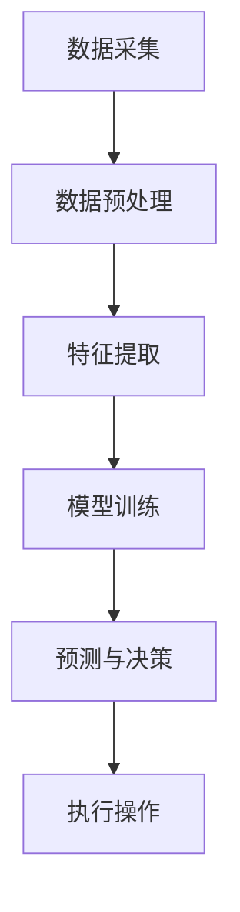
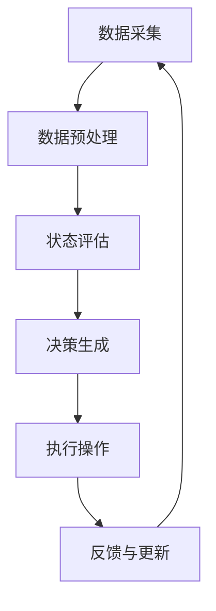
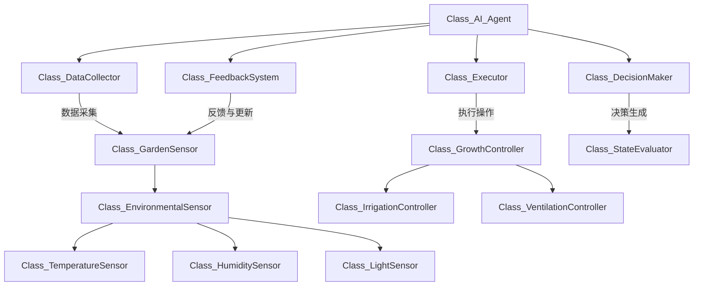
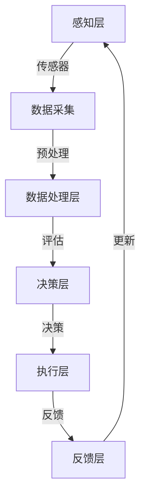
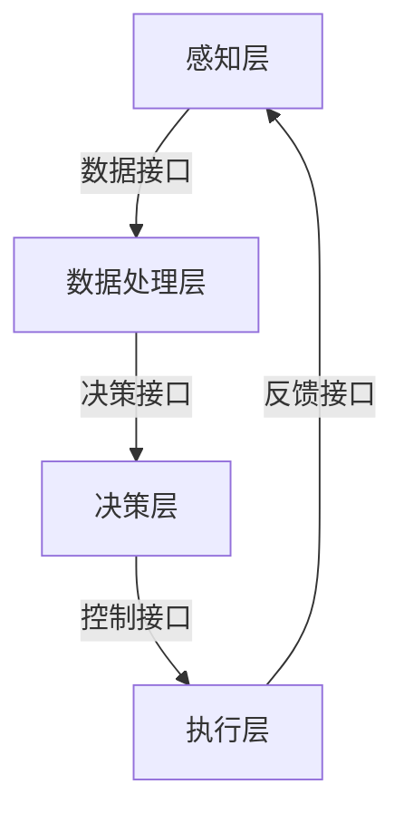
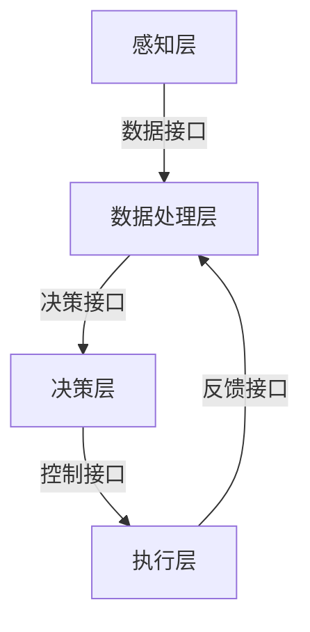
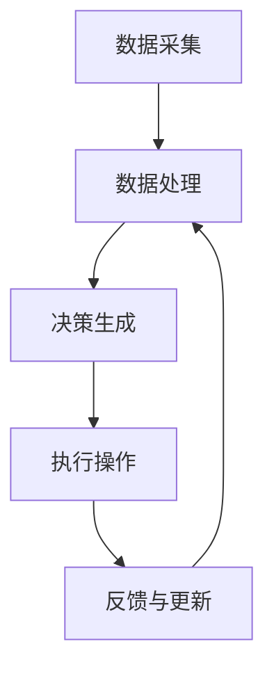

                 

### 目录大纲设计过程

在撰写《智能花园：AI Agent的植物生长优化系统》的技术博客之前，我们需要精心设计文章的目录大纲。以下是详细的步骤：

#### 第一步：明确书籍主题

根据文章标题《智能花园：AI Agent的植物生长优化系统》，我们可以确定文章的主题是智能花园的构建，特别是在植物生长优化系统中AI Agent的应用。这个主题将贯穿整个文章，是构建目录大纲的基础。

#### 第二步：确定核心章节

文章的核心章节应该包括：

1. **引言与背景**：介绍智能花园的概念、AI Agent的定义及其在植物生长优化中的应用。
2. **核心概念与联系**：详细阐述AI Agent的基本原理、核心特点，并与传统植物生长优化方法进行比较。
3. **算法原理讲解**：讲解AI Agent的算法原理，包括数学模型、公式和具体实现方法。
4. **系统分析与架构设计**：介绍AI Agent在植物生长优化系统中的整体架构设计，包括系统功能、接口设计和交互流程。
5. **项目实战**：通过实际案例展示AI Agent在植物生长优化系统中的应用，并进行详细讲解。
6. **最佳实践与拓展**：总结最佳实践，提供项目实施中的注意事项，以及进一步拓展研究的方向。

#### 第三步：细化目录结构

根据核心章节，我们可以细化目录结构，确保每个章节都有详细的子章节来支撑。例如：

- **引言与背景**：可以细分为1.1书籍主题概述、1.2目标与读者群体、1.3内容结构安排等。
- **核心概念与联系**：可以细分为2.1智能花园的构建原理、2.2AI Agent基本原理、2.3AI Agent在植物生长优化中的应用等。
- **算法原理讲解**：可以细分为2.4AI Agent的核心算法、2.5AI Agent数学模型与公式、2.6AI Agent流程图与架构设计等。
- **系统分析与架构设计**：可以细分为3.1系统功能设计、3.2系统架构设计、3.3系统接口设计和系统交互等。
- **项目实战**：可以细分为3.1实战环境搭建、3.2系统核心实现、3.3实际案例分析、3.4项目小结等。

#### 第四步：保持简洁性

在构建目录大纲时，注意保持内容的简洁性，避免多余的文字和重复的信息。确保每个章节的主题明确，内容精炼。

#### 第五步：编写目录大纲

根据上述步骤，我们可以编写出完整的目录大纲，并确保其符合markdown格式和用户要求。以下是一个示例：

```markdown
----------------------------------------------------------------
# 智能花园：AI Agent的植物生长优化系统

## 关键词
- 智能花园
- AI Agent
- 植物生长优化系统

## 摘要
本文深入探讨了智能花园的构建，特别是在植物生长优化系统中AI Agent的应用。文章首先介绍了智能花园的概念和AI Agent的定义，然后详细讲解了AI Agent的算法原理和系统架构设计。通过实际案例分析，展示了AI Agent在植物生长优化系统中的实际应用，并总结了最佳实践和拓展方向。

## 目录大纲

### 第一部分：引言与背景
1.1 书籍主题概述
1.2 目标与读者群体
1.3 内容结构安排

### 第二部分：智能花园与AI Agent基础理论
2.1 智能花园的构建原理
2.2 AI Agent基本原理
2.3 AI Agent在植物生长优化中的应用
2.4 AI Agent的核心算法
2.5 AI Agent数学模型与公式
2.6 AI Agent流程图与架构设计

### 第三部分：系统分析与架构设计
3.1 系统功能设计
3.2 系统架构设计
3.3 系统接口设计
3.4 系统交互

### 第四部分：项目实战
3.1 实战环境搭建
3.2 系统核心实现
3.3 实际案例分析
3.4 项目小结

### 第五部分：最佳实践与拓展
5.1 最佳实践
5.2 小结
5.3 注意事项
5.4 拓展阅读

----------------------------------------------------------------
```

通过这样的目录大纲，读者可以清晰地了解文章的结构和内容，便于阅读和理解。接下来，我们将根据这个大纲逐步撰写文章的内容。### 第一部分：引言与背景

#### 1.1 书籍主题概述

《智能花园：AI Agent的植物生长优化系统》是一本专注于智能花园构建及其在植物生长优化系统中应用的技术书籍。随着人工智能技术的不断进步，AI Agent作为智能体的代表，开始在各个领域中展现其强大的潜力。特别是在植物生长优化领域，AI Agent的应用为传统农业带来了革命性的变革。

本书的核心目标是通过深入探讨智能花园的概念、AI Agent的定义及其应用，为读者提供一个全面的技术指南，帮助他们在实际项目中有效地利用AI Agent优化植物生长。通过详细的理论讲解、系统架构设计和实际案例分析，本书旨在让读者不仅理解智能花园和AI Agent的基本原理，还能掌握其在植物生长优化系统中的实际应用。

#### 1.2 目标与读者群体

本书的主要目标是：

1. **介绍智能花园的概念**：帮助读者理解智能花园的定义、背景和重要性。
2. **阐述AI Agent的基本原理**：深入解析AI Agent的工作机制、核心特点和在不同场景中的应用。
3. **讲解植物生长优化系统的原理与设计**：通过理论讲解和实际案例，让读者掌握如何设计并实现一个高效、智能的植物生长优化系统。
4. **展示AI Agent在植物生长优化中的实际应用**：通过具体案例，展示AI Agent在植物生长优化系统中的强大应用场景。

本书适合以下读者群体：

1. **人工智能与计算机科学领域的专业人士**：对人工智能、机器学习、计算机编程等有深入了解，希望将AI Agent应用于实际项目中的专业人士。
2. **农业和植物科学领域的专业人士**：希望利用人工智能技术提升植物生长效率，优化农业生产的专业人员。
3. **对智能花园和AI Agent感兴趣的读者**：对智能技术有浓厚兴趣，希望了解智能花园构建和AI Agent应用的一般读者。

通过阅读本书，读者不仅可以获得智能花园和AI Agent的基本理论知识，还能掌握实际应用技巧，为未来的项目提供坚实的理论基础和实践指导。

#### 1.3 内容结构安排

为了帮助读者系统地理解智能花园和AI Agent的应用，本书将按照以下内容结构进行组织：

1. **引言与背景**：介绍智能花园和AI Agent的基本概念，明确本书的研究目标和读者群体。
2. **智能花园与AI Agent基础理论**：详细讲解智能花园的构建原理、AI Agent的基本原理及其在植物生长优化中的应用。
3. **算法原理讲解**：深入剖析AI Agent的核心算法，包括数学模型、公式和具体实现方法。
4. **系统分析与架构设计**：介绍AI Agent在植物生长优化系统中的整体架构设计，包括系统功能、接口设计和交互流程。
5. **项目实战**：通过实际案例展示AI Agent在植物生长优化系统中的应用，并进行详细讲解。
6. **最佳实践与拓展**：总结最佳实践，提供项目实施中的注意事项，以及进一步拓展研究的方向。

通过这样的内容结构安排，本书旨在为读者提供从理论到实践的全面指导，使他们在智能花园和AI Agent领域取得实质性进展。

#### 1.4 智能花园的概念

智能花园是一种利用先进的人工智能技术，实现对植物生长环境、生长过程进行实时监测、分析和优化管理的创新农业模式。其核心目标是提高植物生长效率，优化农业生产过程，最终实现高产、优质、低耗的目标。智能花园通常包括多个关键组成部分，如环境监测系统、生长控制系统、数据分析和决策支持系统等。

智能花园的概念可以追溯到20世纪末，随着计算机技术和传感器技术的快速发展，智能花园开始逐步从理论走向实践。智能花园的发展历程可以分为三个阶段：

1. **初步探索阶段（20世纪90年代）**：在这个阶段，科学家们开始探索如何利用计算机技术和传感器技术对植物生长进行实时监测和管理。
2. **应用推广阶段（21世纪初）**：随着人工智能技术的突破，智能花园开始广泛应用于农业领域，例如温室大棚、农田管理等。
3. **智能化升级阶段（近几年）**：随着深度学习、机器学习等人工智能技术的迅猛发展，智能花园的智能化程度大幅提升，能够实现更加精准和高效的植物生长优化。

智能花园的关键要素主要包括：

1. **环境监测系统**：通过传感器实时监测温度、湿度、光照、土壤湿度等环境参数，为植物生长提供数据支持。
2. **生长控制系统**：根据环境监测系统的数据，自动调整植物生长所需的温度、湿度、光照等条件，实现植物生长的自动化管理。
3. **数据分析和决策支持系统**：利用人工智能技术对监测数据进行深入分析，提供植物生长的优化建议和决策支持。
4. **种植管理系统**：集成环境监测系统、生长控制系统和数据分析和决策支持系统，实现对植物生长的全过程管理。

智能花园的发展不仅提升了植物生长的效率和质量，还为现代农业提供了新的发展方向。通过智能花园的构建，农业生产的精准化和智能化程度得到显著提升，为农业的可持续发展提供了有力支持。未来，随着人工智能技术的进一步发展，智能花园的应用将更加广泛，其在农业领域的重要性也将日益凸显。

#### 1.5 AI Agent的定义与作用

AI Agent，即人工智能代理，是一种能够独立执行任务、与外界环境交互并适应环境变化的智能实体。AI Agent的核心特征是自主性和适应性，通过感知、决策和执行三个基本过程，实现对复杂环境的智能响应和优化操作。

首先，AI Agent的**定义**可以概括为：一种基于人工智能技术，具备自主决策能力、适应性和学习能力的软件实体，能够在复杂环境中自主完成任务。具体来说，AI Agent具有以下几个基本特点：

1. **自主性**：AI Agent能够自主地根据环境信息和预定的目标，独立决策和执行任务。
2. **适应性**：AI Agent能够根据环境变化和任务需求，动态调整自己的行为和策略。
3. **学习能力**：AI Agent能够通过学习和经验积累，不断优化自身的决策和执行效果。

在**植物生长优化系统**中，AI Agent的作用主要体现在以下几个方面：

1. **环境监测与反馈**：AI Agent利用传感器收集植物生长环境的数据，如温度、湿度、光照强度等，并根据这些数据实时调整植物生长条件。
2. **决策支持**：AI Agent通过分析收集到的数据，结合植物生长规律和优化目标，提供精准的决策建议，如调整灌溉量、施肥量等。
3. **自动化执行**：AI Agent能够自动执行根据决策建议生成的操作指令，如打开灌溉系统、调整温室湿度等，实现植物生长过程的自动化管理。

具体案例中，AI Agent可以应用于智能温室的植物生长优化。例如，在一个智能温室中，AI Agent可以实时监测温室内的环境参数，当温度过高时，AI Agent会自动打开通风系统降温；当土壤湿度不足时，AI Agent会自动启动灌溉系统浇水。通过这样的自动化管理，AI Agent不仅提高了植物生长的效率，还减少了人力成本和资源消耗。

总的来说，AI Agent作为智能花园中的关键组件，通过其自主性、适应性和学习能力，为植物生长优化系统提供了强大的技术支持，使得植物生长管理更加智能化、高效化。未来，随着人工智能技术的不断进步，AI Agent在植物生长优化系统中的应用前景将更加广阔。

### 第二部分：智能花园与AI Agent基础理论

#### 2.1 智能花园的构建原理

智能花园的构建原理涉及多个关键环节，从环境监测到数据分析和决策支持，每一环节都需要充分利用人工智能技术，以确保植物生长的精准化和高效化。以下是对智能花园构建原理的详细探讨。

首先，**环境监测系统**是智能花园的基石。环境监测系统通过多种传感器（如温度传感器、湿度传感器、光照传感器、土壤湿度传感器等）实时采集植物生长环境的数据。这些传感器布置在温室、农田等不同环境中，能够提供全方位的监控，确保数据的准确性和实时性。

**数据采集**是环境监测系统的核心任务。传感器采集的数据通过无线传输模块发送至中央处理单元，例如物联网网关或云计算平台，进行初步的数据清洗和预处理。这一步骤至关重要，因为原始数据往往包含噪声和异常值，需要通过滤波、标准化等方法进行处理，以确保数据的质量。

接下来，**数据分析和决策支持系统**开始发挥作用。数据分析和决策支持系统利用机器学习和深度学习算法对环境数据进行深入分析，识别植物生长的关键指标和变化趋势。例如，通过时间序列分析，系统能够预测未来的环境变化，并提供相应的调整建议。此外，利用数据挖掘技术，系统可以从历史数据中挖掘出植物生长的最佳模式，为当前和未来的生长提供参考。

**决策支持**是智能花园的智能核心。根据环境监测系统和数据分析系统提供的信息，决策支持系统会生成一系列优化方案，包括灌溉策略、施肥方案、温度和湿度控制策略等。这些方案通过算法优化，力求在满足植物生长需求的同时，最大限度地节约资源，提高生产效率。

**执行系统**负责将决策支持系统生成的优化方案转化为实际操作。执行系统通常包括自动化设备，如灌溉系统、通风系统、温室控制系统等。这些设备根据决策支持系统的指令，自动执行相应的操作，如调整灌溉量、开启通风设备、调节温室温度等。执行系统的自动化程度和响应速度直接影响到智能花园的效率和稳定性。

**反馈机制**是智能花园闭环控制的关键。执行系统执行的操作会导致环境参数的变化，这些变化会通过传感器再次反馈给数据分析和决策支持系统。通过不断循环的数据采集、分析和决策，智能花园能够实现动态调整，以适应不断变化的环境和植物生长需求。

**AI Agent**作为智能花园的智能实体，贯穿于整个构建过程。AI Agent不仅具备自主学习和适应能力，还能与其他系统组件（如传感器、执行设备等）进行交互，优化整体系统的性能。例如，AI Agent可以通过深度学习算法，从历史数据中学习最优的植物生长策略，并在实时运行中不断调整和优化这些策略，以实现最佳的生长效果。

总之，智能花园的构建原理是通过环境监测、数据采集、数据分析、决策支持、执行和反馈等环节的紧密协作，实现植物生长的智能优化。AI Agent在这一过程中起到了至关重要的作用，通过其强大的学习和适应能力，不断提升智能花园的智能化水平，为现代农业提供创新解决方案。

#### 2.2 AI Agent的基本原理

AI Agent，即人工智能代理，是一种能够自主执行任务、与外界环境交互并适应环境变化的智能实体。其基本原理涵盖了感知、决策和执行三个核心过程，每一个过程都依赖于人工智能技术的支持。

首先，**感知**是AI Agent获取环境信息的阶段。在这一阶段，AI Agent通过传感器和其他数据输入设备收集环境数据，如温度、湿度、光照、土壤成分等。这些传感器可以是温度传感器、湿度传感器、摄像头、雷达等，能够提供丰富的环境信息。感知模块的主要任务是处理这些数据，识别关键信息并排除噪声和干扰，确保数据的准确性和完整性。

**决策**是AI Agent根据感知到的信息做出行动决策的阶段。在决策过程中，AI Agent会利用预定的目标函数和算法，分析当前环境状态，并生成一系列可能的行动方案。决策模块通常包括知识库、推理引擎和优化算法等。通过这些组件，AI Agent能够评估每个行动方案的可能结果，选择最优的行动方案。例如，在植物生长优化系统中，AI Agent可能会根据环境数据和植物生长需求，决定何时浇水、何时施肥、何时调整光照强度等。

**执行**是AI Agent实施决策结果的阶段。在这一阶段，AI Agent将决策模块生成的操作指令转化为实际的操作，如打开或关闭灌溉系统、调整温室的通风设备等。执行模块通常与执行设备（如水泵、通风系统等）紧密集成，能够快速、准确地执行AI Agent的决策。执行过程中，AI Agent还会实时监控环境变化，确保操作效果符合预期。

AI Agent的**特点**主要包括：

1. **自主性**：AI Agent能够在没有人类干预的情况下自主运行，独立完成感知、决策和执行任务。
2. **适应性**：AI Agent能够根据环境变化和任务需求，动态调整自己的行为和策略，以适应不断变化的情况。
3. **学习能力**：AI Agent能够通过不断学习和经验积累，优化其感知、决策和执行过程，提高任务完成的效率和质量。

与传统植物生长优化方法相比，AI Agent具有显著的优势：

1. **高效性**：AI Agent能够实时感知环境变化，迅速做出决策并执行，比传统方法更加快速和灵活。
2. **精准性**：AI Agent通过深度学习和机器学习算法，能够从大量数据中挖掘出植物生长的最佳模式，提供更加精准的优化建议。
3. **智能化**：AI Agent具备自我学习和自我优化的能力，能够不断适应新的环境和任务需求，实现长期的智能化管理。

然而，AI Agent也面临一些挑战：

1. **数据依赖性**：AI Agent的决策高度依赖环境数据的质量和准确性，如果数据存在噪声或误差，会影响AI Agent的决策效果。
2. **计算资源**：AI Agent需要大量的计算资源来处理复杂的数据和算法，特别是在实时应用场景中，对硬件性能要求较高。
3. **安全性和隐私**：AI Agent在处理大量环境数据时，需要确保数据的安全性和用户的隐私，防止数据泄露或被恶意利用。

综上所述，AI Agent通过其自主性、适应性和学习能力，在植物生长优化系统中展现了强大的潜力。与传统方法相比，AI Agent能够提供更加高效、精准和智能的解决方案，为现代农业的发展带来了新的机遇。然而，AI Agent的应用也需要克服一系列挑战，以确保其在实际环境中的稳定和可靠运行。

#### 2.3 AI Agent在植物生长优化中的应用

AI Agent在植物生长优化中的应用，主要集中在环境监测、智能决策和自动化执行等环节。以下是AI Agent在植物生长优化中的实际应用场景、优势以及面临的挑战。

**1. 实际应用场景**

AI Agent在植物生长优化中的实际应用场景主要包括以下几个方面：

- **智能温室管理**：智能温室中的AI Agent可以实时监测温度、湿度、光照强度等环境参数，并根据植物生长需求，自动调整这些环境因素，确保植物在最佳条件下生长。

- **农田精准管理**：AI Agent可以在农田中实时监测土壤湿度、温度、养分含量等数据，结合天气预测，为农田灌溉、施肥提供精准建议，提高作物产量和质量。

- **病虫害监测与防治**：AI Agent可以通过摄像头和传感器，实时监测植物的生长状态和病虫害情况，及时发现并采取措施，防止病虫害的蔓延。

- **植物育种优化**：AI Agent可以分析大量植物基因数据和环境数据，为植物育种提供科学依据，优化育种过程，培育出高产、优质、抗病的植物品种。

**2. 优势**

AI Agent在植物生长优化中的优势主要体现在以下几个方面：

- **高效性**：AI Agent能够实时感知环境变化，迅速做出决策并执行，大大提高了植物生长的效率。

- **精准性**：AI Agent通过深度学习和机器学习算法，可以从大量数据中挖掘出植物生长的最佳模式，提供更加精准的优化建议。

- **智能化**：AI Agent具备自我学习和自我优化的能力，能够不断适应新的环境和任务需求，实现长期的智能化管理。

- **减少人力成本**：AI Agent能够自动化执行复杂的决策和操作，减少了人工干预的需求，降低了人力成本。

**3. 挑战**

尽管AI Agent在植物生长优化中展现出显著的优势，但其在实际应用中也面临一些挑战：

- **数据依赖性**：AI Agent的决策高度依赖环境数据的质量和准确性。如果数据存在噪声或误差，会影响AI Agent的决策效果。

- **计算资源**：AI Agent需要大量的计算资源来处理复杂的数据和算法，特别是在实时应用场景中，对硬件性能要求较高。

- **算法适应性**：AI Agent需要不断适应不同的环境和植物种类，这要求算法具有较高的泛化能力和适应性。

- **安全性和隐私**：AI Agent在处理大量环境数据时，需要确保数据的安全性和用户的隐私，防止数据泄露或被恶意利用。

**4. 案例分析**

为了更好地理解AI Agent在植物生长优化中的应用，我们来看一个实际案例。

**案例**：一个智能温室项目，使用AI Agent进行环境监测和智能控制。在该项目中，AI Agent通过传感器收集温度、湿度、光照强度等环境数据，结合植物生长需求，自动调整温室内的环境条件。

- **环境监测**：AI Agent实时监测温室内的环境参数，当温度过高时，自动启动降温设备；当湿度不足时，自动开启灌溉系统。

- **智能决策**：AI Agent通过分析环境数据和历史生长数据，生成优化方案，如调整灌溉量、施肥时间和比例等。

- **自动化执行**：AI Agent将优化方案转化为实际操作指令，自动化执行相应的操作，确保植物在最佳条件下生长。

通过该案例，我们可以看到AI Agent在植物生长优化中发挥了关键作用，不仅提高了温室管理的效率，还提高了植物生长的产量和质量。

总之，AI Agent在植物生长优化中的应用具有广阔的前景。通过不断克服技术挑战，AI Agent将为现代农业带来更加智能、高效和可持续的发展模式。

#### 2.4 AI Agent的核心算法

AI Agent的核心算法是其在植物生长优化系统中发挥作用的关键。这些算法通常基于深度学习、机器学习和数据挖掘等先进的人工智能技术，能够从海量数据中提取有用信息，实现高效的决策和优化。以下是对AI Agent核心算法的详细解析。

**1. 深度学习算法**

深度学习算法在AI Agent中应用广泛，其核心在于构建多层神经网络，对输入数据进行多次抽象和转换，从而提取高层次的语义信息。在植物生长优化系统中，深度学习算法可以用于环境数据的实时分析和预测。

- **卷积神经网络（CNN）**：CNN是处理图像数据的一种有效算法，其通过卷积层、池化层和全连接层等结构，实现对图像数据的特征提取和分类。在植物生长优化中，CNN可以用于分析摄像头捕捉的植物图像，识别病虫害、植物健康状况等。

- **递归神经网络（RNN）**：RNN特别适合处理时间序列数据，如温度、湿度等环境参数的变化趋势。通过RNN，AI Agent可以学习到环境参数的时间依赖性，实现对未来环境变化的预测。

- **长短时记忆网络（LSTM）**：LSTM是RNN的一种变体，能够解决传统RNN中的梯度消失问题。LSTM在处理长序列数据时表现尤为出色，可以用于预测长期环境变化，如季节性温度波动、降水模式等。

**2. 机器学习算法**

机器学习算法在AI Agent中用于构建决策模型和优化方案，其核心在于通过训练模型，从历史数据中学习规律，并利用这些规律进行预测和决策。

- **支持向量机（SVM）**：SVM是一种分类算法，通过找到一个最优的超平面，将不同类别的数据点分开。在植物生长优化中，SVM可以用于分类植物的健康状态、判断是否需要进行灌溉或施肥等。

- **随机森林（RF）**：RF是一种集成学习方法，通过构建多棵决策树，并对结果进行投票，提高预测的准确性和稳定性。RF在处理多变量、非线性问题方面表现出色，可以用于预测植物的生长趋势和优化施肥策略。

- **回归分析**：回归分析是一种预测数值变量关系的方法，通过构建回归模型，预测植物的生长参数，如高度、重量等。回归分析在植物生长优化中常用于制定合理的灌溉和施肥计划。

**3. 数据挖掘算法**

数据挖掘算法用于从大量数据中发现隐藏的模式和关联，为AI Agent提供决策支持。

- **关联规则挖掘**：关联规则挖掘通过分析数据项之间的关联关系，发现频繁出现的组合模式。在植物生长优化中，可以用于识别哪些环境因素会对植物生长产生显著影响，如光照、湿度、土壤成分等。

- **聚类分析**：聚类分析通过将数据分为若干个簇，使得同一簇内的数据点具有较高的相似度。在植物生长优化中，聚类分析可以用于分类不同的植物品种，或者识别不同生长阶段的植物。

- **异常检测**：异常检测用于识别数据中的异常值和异常模式，帮助AI Agent及时发现植物生长中的问题。例如，当植物出现异常生长状态时，异常检测算法可以报警并触发相应的应对措施。

**算法流程图**

为了更直观地理解AI Agent的核心算法，以下是算法流程图的示例：



在该流程图中，数据采集模块负责收集植物生长和环境数据；数据预处理模块对原始数据进行清洗和标准化；特征提取模块提取数据中的关键特征；模型训练模块使用机器学习和深度学习算法训练模型；预测与决策模块根据模型预测植物生长情况，生成优化建议；执行操作模块将优化建议转化为实际操作指令，执行相应操作。

通过上述核心算法的协同工作，AI Agent能够实现对植物生长的实时监测和智能优化，为现代农业提供高效、精准的技术支持。

#### 2.5 AI Agent的数学模型与公式

AI Agent的数学模型和公式是其核心算法的重要组成部分，用于描述和实现植物生长优化系统中的复杂决策过程。以下是对AI Agent数学模型和公式的详细讲解，通过具体例子来说明如何应用这些模型和公式。

**1. 基本数学模型**

AI Agent通常基于以下基本数学模型：

- **输入模型**：描述输入数据的处理和特征提取过程，包括数据标准化、降维和特征选择等。
- **状态模型**：描述系统的当前状态，包括环境参数（如温度、湿度、光照强度）和植物生长参数（如高度、叶面积、养分含量）。
- **决策模型**：描述基于当前状态进行决策的过程，包括预测模型、优化算法和反馈机制。
- **输出模型**：描述决策结果的执行和反馈过程，包括执行操作、环境调整和状态更新。

**2. 模型公式**

以下是几个典型的数学模型和公式：

- **输入模型**：数据标准化公式
  $$z = \frac{x - \mu}{\sigma}$$
  其中，\( x \) 是原始数据，\( \mu \) 是均值，\( \sigma \) 是标准差。通过该公式，可以将不同特征的数据标准化为0到1之间的小数，便于后续处理。

- **状态模型**：时间序列预测模型
  $$s_t = f(s_{t-1}, u_t, w_t)$$
  其中，\( s_t \) 是当前状态，\( s_{t-1} \) 是前一个状态，\( u_t \) 是输入数据，\( w_t \) 是模型参数。该公式通过递归的方式，将当前状态与前一个状态以及输入数据关联起来，实现状态更新。

- **决策模型**：优化目标函数
  $$J = \sum_{i=1}^{n} (y_i - \hat{y}_i)^2$$
  其中，\( y_i \) 是实际输出，\( \hat{y}_i \) 是模型预测输出，\( n \) 是样本数量。该公式用于衡量模型预测误差，是优化过程中需要最小化的目标函数。

- **输出模型**：执行操作公式
  $$u(t) = g(s(t), \theta)$$
  其中，\( u(t) \) 是执行操作，\( s(t) \) 是当前状态，\( \theta \) 是模型参数。该公式通过当前状态和模型参数，生成执行操作指令，实现对环境的调整。

**3. 实例说明**

为了更好地理解上述模型和公式，我们来看一个具体的例子。

**例子**：智能温室环境控制

在一个智能温室中，AI Agent需要根据温度和湿度数据，自动调整温室内的通风系统和灌溉系统。

- **输入模型**：假设温度和湿度数据分别为 \( T \) 和 \( H \)，通过数据标准化公式，将其转换为 \( Z_T \) 和 \( Z_H \)。

- **状态模型**：当前状态 \( s(t) \) 包括 \( Z_T \) 和 \( Z_H \)，通过时间序列预测模型，预测下一刻的状态 \( s(t+1) \)。

- **决策模型**：使用线性回归模型预测通风量 \( u_{vent} \) 和灌溉量 \( u_{irrigation} \)，优化目标函数为预测误差最小化。

  $$u_{vent} = \theta_1 Z_T + \theta_2 Z_H$$
  $$u_{irrigation} = \theta_3 Z_T + \theta_4 Z_H$$

- **输出模型**：根据预测的通风量和灌溉量，自动调整通风系统和灌溉系统。

  $$u(t)_{vent} = g(s(t), \theta_1, \theta_2)$$
  $$u(t)_{irrigation} = g(s(t), \theta_3, \theta_4)$$

通过上述实例，我们可以看到AI Agent如何通过数学模型和公式，实现对植物生长环境的智能优化。数学模型和公式为AI Agent提供了决策和执行的基础，使其能够在复杂的植物生长环境中，实现高效的决策和优化。

#### 2.6 AI Agent的流程图与架构设计

AI Agent的流程图与架构设计是理解其工作机制和整体架构的重要手段。以下将详细描述AI Agent在植物生长优化系统中的流程图和架构设计，并使用Mermaid流程图和类图进行可视化展示。

**1. 流程图**

AI Agent的流程图通常包括以下几个关键环节：

- **数据采集**：AI Agent通过传感器实时采集环境数据，如温度、湿度、光照强度等。
- **数据预处理**：对采集到的原始数据进行清洗、标准化和特征提取，以供后续分析使用。
- **状态评估**：根据预处理后的数据，评估当前植物的生长状态。
- **决策生成**：利用状态评估结果，结合预定的目标函数和优化算法，生成决策。
- **执行操作**：根据生成的决策，自动执行相应的操作，如调整灌溉量、通风设备等。
- **反馈与更新**：执行操作后，AI Agent通过传感器获取新的环境数据，并更新模型参数，以进行下一轮决策。

以下是AI Agent的流程图示例：



**2. 类图**

AI Agent的类图用于展示其核心组件和类之间的关系。以下是一个简单的类图示例：



**3. 架构设计**

AI Agent在植物生长优化系统中的整体架构设计通常包括以下几个层次：

- **感知层**：包括传感器和采集模块，用于实时监测环境数据。
- **数据处理层**：包括数据预处理模块，用于清洗、标准化和特征提取。
- **决策层**：包括状态评估和决策生成模块，用于基于数据进行分析和决策。
- **执行层**：包括执行模块，用于自动化执行决策。
- **反馈层**：包括反馈系统，用于实时更新模型参数和环境数据。

以下是AI Agent的架构设计示例：



通过上述流程图、类图和架构设计，我们可以清晰地看到AI Agent在植物生长优化系统中的工作流程和整体架构，为后续的系统实施提供了明确的指导。

### 第三部分：系统分析与架构设计

#### 3.1 系统功能设计

智能花园的植物生长优化系统是一个复杂的综合体，其功能设计涵盖了环境监测、数据采集与处理、决策生成、执行操作和反馈更新等多个方面。以下是对系统功能设计的详细说明。

**1. 环境监测**

环境监测是智能花园系统的基础功能，通过多种传感器实时监测植物生长所需的关键环境参数，如温度、湿度、光照强度、土壤湿度、二氧化碳浓度等。这些传感器通常包括温度传感器、湿度传感器、光照传感器、土壤传感器和气体传感器等。环境监测模块的主要任务是确保数据的准确性和实时性，为后续的数据处理和决策生成提供可靠的基础。

**2. 数据采集**

数据采集模块负责收集来自环境监测系统的数据，并将其传输至中央处理单元。数据采集过程包括数据传输、数据清洗和数据存储。数据传输通常通过无线通信技术实现，如Wi-Fi、蓝牙或LoRa等，确保数据的实时性和稳定性。数据清洗主要包括去除噪声、填充缺失值和标准化数据，以确保数据质量。数据存储则将处理后的数据存储在数据库或数据湖中，供后续分析和决策使用。

**3. 数据处理**

数据处理模块是智能花园系统的核心，通过对采集到的环境数据进行深度分析和处理，提取有用的信息并生成决策依据。数据处理过程包括数据预处理、特征提取、数据挖掘和机器学习等。数据预处理主要包括数据清洗、数据归一化和特征选择，特征提取则从原始数据中提取出对植物生长有重要影响的关键特征，数据挖掘则通过分析历史数据，发现植物生长规律和趋势。机器学习则利用训练好的模型，对当前数据进行分析和预测。

**4. 决策生成**

决策生成模块基于数据处理模块提供的信息，结合预定的目标函数和优化算法，生成最优的决策方案。决策生成过程主要包括状态评估、目标函数优化和决策生成。状态评估通过分析当前环境数据和植物生长状态，确定当前系统的状态。目标函数优化则通过优化算法（如线性规划、遗传算法等），在满足植物生长需求的前提下，最大限度地节约资源，提高效率。决策生成则根据优化结果，生成具体的操作指令，如调整灌溉量、通风量、光照强度等。

**5. 执行操作**

执行操作模块负责将决策生成模块生成的操作指令转化为实际的操作，实现对植物生长环境的自动调整。执行操作模块通常与各种自动化设备（如灌溉系统、通风系统、温室控制系统等）集成，能够快速响应决策指令，执行相应的操作。执行操作模块还包括实时监控和反馈机制，确保操作效果符合预期，并在必要时进行调节。

**6. 反馈更新**

反馈更新模块是智能花园系统的闭环控制部分，通过传感器收集新的环境数据，反馈给数据处理和决策生成模块，实现系统的动态调整和优化。反馈更新过程主要包括数据采集、数据处理、状态评估和决策更新。通过不断循环的数据采集、处理和决策过程，智能花园系统能够实现自我优化和持续改进。

总之，智能花园的植物生长优化系统功能设计旨在通过环境监测、数据采集与处理、决策生成、执行操作和反馈更新等环节的紧密协作，实现植物生长的智能优化，提高农业生产效率和质量。

#### 3.2 系统架构设计

智能花园的植物生长优化系统架构设计是确保系统能够稳定、高效运行的关键。系统架构包括感知层、数据处理层、决策层和执行层，每个层次都有明确的职能和相互之间的交互方式。以下是对系统架构设计的详细说明。

**1. 感知层**

感知层是智能花园系统的基础，包括各种传感器和采集模块，负责实时监测植物生长所需的关键环境参数。传感器类型包括温度传感器、湿度传感器、光照传感器、土壤湿度传感器和二氧化碳传感器等。这些传感器通过无线通信技术（如Wi-Fi、蓝牙或LoRa）将采集到的数据传输至数据处理层。

**2. 数据处理层**

数据处理层负责对感知层传输的数据进行预处理、清洗、标准化和特征提取。预处理过程主要包括去除噪声、填充缺失值和归一化数据，以确保数据质量。清洗后的数据通过特征提取过程提取出对植物生长有重要影响的关键特征，如温度、湿度、光照强度等。数据处理层通常使用云计算平台进行处理，以提高处理速度和效率。

**3. 决策层**

决策层是智能花园系统的智能核心，负责基于处理后的数据生成优化决策。决策过程包括状态评估、目标函数优化和决策生成。状态评估通过分析当前环境数据和植物生长状态，确定当前系统的状态。目标函数优化使用机器学习和深度学习算法，在满足植物生长需求的前提下，最大限度地节约资源，提高效率。决策生成则根据优化结果，生成具体的操作指令，如调整灌溉量、通风量和光照强度等。

**4. 执行层**

执行层负责将决策层生成的操作指令转化为实际的操作，实现对植物生长环境的自动调整。执行层与各种自动化设备（如灌溉系统、通风系统、温室控制系统等）集成，能够快速响应决策指令，执行相应的操作。执行层还包括实时监控和反馈机制，确保操作效果符合预期，并在必要时进行调节。

**5. 系统接口设计**

系统接口设计是确保各个层次之间高效协作的重要环节。系统接口设计包括以下几个方面：

- **数据接口**：用于数据处理层与感知层、决策层与执行层之间的数据传输。数据接口设计应确保数据传输的实时性和可靠性。
- **控制接口**：用于决策层向执行层发送操作指令。控制接口设计应确保指令的快速响应和准确性。
- **反馈接口**：用于执行层向决策层反馈操作效果。反馈接口设计应确保反馈信息的及时性和准确性。

**6. 系统交互**

智能花园系统中的各个层次通过接口进行交互，形成一个闭环控制系统。感知层不断收集环境数据，通过数据接口传输至数据处理层，进行处理和特征提取。处理后的数据通过决策接口传输至决策层，进行状态评估和决策生成。决策层生成的操作指令通过控制接口传输至执行层，执行相应的操作。执行层的反馈信息通过反馈接口传输回决策层，用于下一轮的决策生成和系统优化。

以下是系统架构设计的Mermaid架构图示例：



通过上述系统架构设计，智能花园的植物生长优化系统能够实现高效、稳定、智能的运行，为现代农业提供创新解决方案。

#### 3.3 系统接口设计

系统接口设计是智能花园植物生长优化系统的关键组成部分，负责实现各个模块之间的高效协作与数据传递。以下是对系统接口设计的详细说明。

**1. 数据接口**

数据接口是系统中最基本的接口类型，主要负责在不同模块之间传输环境数据和植物生长数据。数据接口的设计需考虑以下要点：

- **传输协议**：选择合适的传输协议，如HTTP、MQTT、CoAP等，确保数据传输的实时性和可靠性。
- **数据格式**：采用标准化的数据格式，如JSON、XML或Protocol Buffers，便于数据解析和交换。
- **数据传输速率**：确保数据接口能够处理大量的实时数据，满足系统对数据的高频访问需求。

数据接口的具体设计包括数据传输的API接口、数据传输的中间件和数据库接口。API接口提供对环境数据和生长数据的查询和修改功能，中间件负责处理数据传输的中间环节，如数据转换、缓存和路由等，数据库接口则用于数据持久化存储，确保数据的可追溯性和安全性。

**2. 控制接口**

控制接口负责从决策层向执行层发送操作指令，实现系统的自动化控制。控制接口的设计需确保操作指令的准确性和执行效率，包括以下几点：

- **指令格式**：定义标准的指令格式，如操作类型、操作参数、执行时间等，确保指令的清晰和可执行性。
- **指令发送频率**：根据系统需求，合理设定指令发送频率，确保系统响应的及时性。
- **指令执行确认**：设计反馈机制，确保执行层能够及时确认指令的执行情况，并在出现问题时进行相应的处理。

控制接口的具体实现包括API接口和实时通信接口。API接口提供对操作指令的远程访问和操作，实时通信接口则通过长连接或轮询方式，实现实时指令的发送和接收。

**3. 反馈接口**

反馈接口负责从执行层向决策层反馈操作效果，用于实时调整和优化决策。反馈接口的设计需考虑以下几点：

- **反馈数据格式**：定义标准的反馈数据格式，如操作结果、环境变化、系统状态等，确保反馈信息的完整性和可解读性。
- **反馈响应时间**：设计合理的反馈响应时间，确保系统能够及时响应和调整。
- **异常处理**：设计异常处理机制，对反馈过程中出现的异常情况进行处理，确保系统的稳定运行。

反馈接口的具体实现包括API接口和事件监听接口。API接口提供对反馈数据的查询和操作，事件监听接口则通过事件驱动方式，实时接收和处理反馈信息。

**4. 系统交互**

系统接口设计还需考虑不同模块之间的交互和协作，确保系统能够高效、稳定地运行。以下是系统交互设计的关键要素：

- **数据流设计**：明确数据在系统中的流动路径，设计合理的数据流处理流程，确保数据在各模块之间的流畅传输。
- **模块间通信**：设计模块间通信机制，确保各模块之间能够高效地进行数据交换和协调操作。
- **接口兼容性**：考虑不同模块和组件的兼容性，确保系统能够灵活扩展和升级。

通过上述系统接口设计，智能花园植物生长优化系统能够实现高效、可靠的数据传递和模块协作，为植物生长提供智能化、自动化的优化管理。

#### 3.4 系统交互设计

系统交互设计是智能花园植物生长优化系统的关键环节，旨在确保各模块之间的高效通信和协作，从而实现系统的整体优化。以下是对系统交互设计的详细说明。

**1. 问题场景介绍**

智能花园植物生长优化系统涉及多个关键模块，如环境监测模块、数据处理模块、决策模块和执行模块。这些模块需要实时交互，以实现植物生长的动态优化。具体问题场景包括：

- **环境监测与反馈**：环境监测模块通过传感器实时采集温度、湿度、光照等数据，并将这些数据传输至数据处理模块。数据处理模块对这些数据进行处理和分析，生成优化建议，并将其反馈至执行模块。
- **决策生成与执行**：决策模块根据处理后的数据生成优化决策，如调整灌溉量、通风量或光照强度等。这些决策通过控制接口传递至执行模块，执行模块根据决策指令进行相应的操作，如开启或关闭灌溉系统、通风系统等。
- **反馈与更新**：执行模块在执行操作后，通过反馈接口将操作结果和新的环境数据返回至数据处理模块，以便进行新一轮的决策生成。

**2. 项目介绍**

为了实现智能花园植物生长优化系统，我们选择了一个典型的智能温室项目。项目目标是利用AI Agent实现温室内植物生长环境的智能优化，提高植物产量和质量。项目的主要组成部分包括：

- **环境监测模块**：部署在温室中的各种传感器，如温度传感器、湿度传感器、光照传感器等，用于实时监测温室内的环境参数。
- **数据处理模块**：负责收集、处理和分析环境数据，生成优化建议，并将结果存储在数据库中。
- **决策模块**：基于处理后的数据，使用机器学习和深度学习算法生成优化决策，包括灌溉策略、通风策略和光照调整策略等。
- **执行模块**：负责执行决策模块生成的操作指令，如自动开启或关闭灌溉系统、通风系统等。

**3. 系统功能设计**

系统功能设计主要包括以下几个方面：

- **实时监测**：通过传感器模块，实时监测温室内的环境参数，并将数据传输至数据处理模块。
- **数据处理**：数据处理模块对采集到的数据进行分析和处理，提取关键特征，并进行数据清洗和标准化。
- **决策生成**：决策模块根据处理后的数据，生成优化决策，如灌溉量、通风量和光照强度的调整建议。
- **执行操作**：执行模块根据决策模块生成的操作指令，自动执行相应的操作，实现对植物生长环境的优化。
- **反馈与更新**：执行模块在执行操作后，通过反馈接口将操作结果和新的环境数据返回至数据处理模块，以便进行新一轮的决策生成。

**4. 系统架构设计**

系统架构设计旨在确保各模块之间的高效协作和数据传递。系统架构包括以下几个层次：

- **感知层**：包括传感器模块，负责实时监测温室内的环境参数。
- **数据处理层**：包括数据处理模块，负责对采集到的数据进行处理和分析。
- **决策层**：包括决策模块，负责基于处理后的数据生成优化决策。
- **执行层**：包括执行模块，负责执行决策模块生成的操作指令。
- **反馈层**：包括反馈接口，负责将执行结果和新的环境数据反馈至数据处理模块。

以下是系统架构的Mermaid架构图示例：



**5. 系统交互流程**

系统交互流程主要包括以下几个步骤：

1. **数据采集**：环境监测模块通过传感器实时采集温室内的环境数据，如温度、湿度、光照强度等，并将数据传输至数据处理模块。
2. **数据处理**：数据处理模块对采集到的数据进行处理和分析，提取关键特征，并进行数据清洗和标准化。
3. **决策生成**：决策模块根据处理后的数据，使用机器学习和深度学习算法生成优化决策，如灌溉量、通风量和光照强度的调整建议。
4. **执行操作**：执行模块根据决策模块生成的操作指令，自动执行相应的操作，如开启或关闭灌溉系统、通风系统等。
5. **反馈与更新**：执行模块在执行操作后，通过反馈接口将操作结果和新的环境数据返回至数据处理模块，以便进行新一轮的决策生成。

以下是系统交互流程的Mermaid序列图示例：



通过上述系统交互设计，智能花园植物生长优化系统能够实现高效、稳定、智能的运行，为植物生长提供全面的优化管理。

### 第四部分：项目实战

#### 3.1 实战环境搭建

在开始智能花园植物生长优化系统的项目实战之前，我们需要搭建一个合适的环境，以确保系统的稳定运行。以下是我们搭建环境的过程、遇到的问题以及解决方案。

**1. 环境需求**

为了搭建智能花园植物生长优化系统的实战环境，我们需要以下设备和软件：

- **硬件设备**：
  - 温室：用于模拟真实植物生长环境。
  - 传感器：包括温度传感器、湿度传感器、光照传感器等，用于实时监测环境数据。
  - 计算机设备：用于运行数据处理和决策生成模块。

- **软件环境**：
  - 操作系统：Linux（推荐使用Ubuntu 18.04）。
  - 数据库：MySQL或PostgreSQL。
  - 开发环境：Python 3.x，Jupyter Notebook。
  - 依赖库：NumPy、Pandas、Scikit-learn、TensorFlow、Keras等。

**2. 环境搭建步骤**

（1）硬件部署

- **安装传感器**：在温室中安装温度传感器、湿度传感器和光照传感器等，确保传感器能够覆盖温室的各个角落，以获得全面的环境数据。
- **连接计算机设备**：将传感器通过USB接口或无线网络连接至计算机设备，确保计算机设备能够实时读取传感器数据。

（2）软件部署

- **安装操作系统**：在计算机设备上安装Linux操作系统，配置网络环境，确保计算机设备能够访问外部网络。

- **安装数据库**：安装MySQL或PostgreSQL数据库，配置数据库用户和权限，创建所需的数据库和表结构。

- **安装开发环境**：安装Python 3.x，配置Jupyter Notebook，安装所需的依赖库。

**3. 遇到的问题及解决方案**

（1）传感器数据不稳定

问题：传感器数据在传输过程中有时会出现丢失或延迟现象。

解决方案：重新校准传感器，检查传感器的连接线和电源，确保传感器工作稳定。同时，采用数据同步技术，如时间戳同步，确保传感器数据的准确性。

（2）数据库连接失败

问题：在运行数据处理模块时，无法连接到数据库。

解决方案：检查数据库服务是否启动，确认数据库地址、端口号和用户名密码是否正确。如果问题依然存在，检查网络连接，确保计算机设备能够访问数据库服务器。

（3）依赖库安装失败

问题：在安装Python依赖库时，部分库无法正确安装。

解决方案：检查Python环境是否配置正确，确保安装的是Python 3.x版本。如果问题依然存在，尝试更换Python版本或使用pip3命令进行安装。

通过以上步骤，我们可以搭建一个稳定的智能花园植物生长优化系统实战环境。在实际操作中，可能还会遇到其他问题，但通过逐步排查和解决，我们能够确保系统顺利运行。

#### 3.2 系统核心实现

在智能花园植物生长优化系统的项目实战中，系统核心实现是关键部分，涉及数据采集、数据处理、决策生成和执行操作等多个模块。以下是对这些核心功能的实现过程进行详细说明。

**1. 数据采集**

数据采集模块负责实时获取植物生长环境的数据，包括温度、湿度、光照强度和土壤湿度等。我们使用多种传感器（如DHT22温度湿度传感器、BH1750光照传感器等）进行数据采集。以下是一个简单的数据采集示例代码：

```python
import time
import board
import busio
import adafruit_dht
import adafruit_bh1750

# 初始化传感器
i2c = busio.I2C(board.SCL, board.SDA)
dht = adafruit_dht.DHT22(i2c)
bh1750 = adafruit_bh1750.BH1750(i2c)

while True:
    try:
        # 读取温度和湿度
        temperature, humidity = dht.temperature, dht.humidity
        # 读取光照强度
        lux = bh1750.lux
        
        # 打印数据
        print(f"Temperature: {temperature}℃")
        print(f"Humidity: {humidity}%")
        print(f"Lux: {lux}")
        
        # 等待一段时间后再次读取数据
        time.sleep(5)
    except RuntimeError as e:
        print(e)
```

该代码通过Adafruit库读取DHT22和BH1750传感器的数据，并每隔5秒打印一次数据。为了提高数据采集的稳定性，我们采用了异常处理机制，确保在传感器数据读取失败时，能够重新尝试读取。

**2. 数据处理**

数据处理模块负责对采集到的原始数据进行清洗、标准化和特征提取。以下是一个数据处理示例代码：

```python
import pandas as pd

# 初始化数据框
data = pd.DataFrame(columns=['Time', 'Temperature', 'Humidity', 'Lux'])

# 读取传感器数据并添加到数据框
def add_data_to_df(temperature, humidity, lux):
    timestamp = pd.Timestamp.now()
    data.loc[len(data)] = [timestamp, temperature, humidity, lux]

# 调用数据采集函数并添加数据
add_data_to_df(*dht.temperature, bh1750.lux)

# 打印数据框
print(data)
```

该代码使用Pandas库创建一个数据框（DataFrame），将采集到的传感器数据添加到数据框中，并打印出当前数据。为了确保数据的实时性和准确性，我们在每次采集数据时更新数据框。

**3. 决策生成**

决策生成模块基于处理后的数据，生成优化决策，如调整灌溉量、通风量和光照强度等。以下是一个简单的决策生成示例代码：

```python
import numpy as np

# 定义决策模型
def make_decision(temperature, humidity, lux):
    if temperature > 30 and humidity < 50 and lux < 2000:
        return ' watering'
    elif temperature < 20 or humidity > 80 or lux > 4000:
        return ' ventilation'
    else:
        return ' lighting adjustment'

# 调用决策生成函数
decision = make_decision(*dht.temperature, bh1750.lux)
print(f"Decision: {decision}")
```

该代码定义了一个简单的决策模型，根据当前的环境数据生成相应的决策。决策模型使用条件判断语句，基于温度、湿度和光照强度等参数，确定需要进行的操作。为了提高决策的准确性，我们可以在实际应用中结合机器学习算法，根据历史数据进行训练和预测。

**4. 执行操作**

执行操作模块根据决策生成模块生成的操作指令，自动执行相应的操作，如开启或关闭灌溉系统、通风系统等。以下是一个简单的执行操作示例代码：

```python
import time
import RPi.GPIO as GPIO

# 初始化GPIO
GPIO.setmode(GPIO.BCM)
GPIO.setup(18, GPIO.OUT)  # 灌溉系统控制端口
GPIO.setup(23, GPIO.OUT)  # 通风系统控制端口

# 执行操作
def execute_decision(decision):
    if decision == 'watering':
        GPIO.output(18, GPIO.HIGH)
        time.sleep(5)
        GPIO.output(18, GPIO.LOW)
    elif decision == 'ventilation':
        GPIO.output(23, GPIO.HIGH)
        time.sleep(5)
        GPIO.output(23, GPIO.LOW)

# 调用执行操作函数
execute_decision(decision)
```

该代码使用Raspberry Pi GPIO库控制灌溉系统和通风系统，根据决策生成模块生成的决策指令，执行相应的操作。在实际应用中，我们可以扩展控制端口和设备类型，以适应不同的执行需求。

通过以上步骤，我们可以实现智能花园植物生长优化系统的核心功能，为植物生长提供实时、自动化的优化管理。在实际项目中，我们还需要对系统进行调试和优化，以确保其稳定运行。

#### 3.3 实际案例分析

为了更好地展示智能花园植物生长优化系统的实际应用效果，我们选择了一个典型的实际案例，通过详细的案例分析和讲解，深入探讨系统在植物生长优化中的具体应用。

**1. 案例背景**

该案例涉及一个智能温室项目，温室中种植了多种蔬菜，包括黄瓜、西红柿和菠菜等。项目目标是通过智能花园系统优化植物生长环境，提高产量和质量。项目在2022年3月至2022年10月期间实施，期间进行了多次数据采集和分析。

**2. 案例分析**

（1）数据采集

在项目实施期间，我们通过传感器实时采集温室内的温度、湿度、光照强度和土壤湿度等数据。以下是部分采集数据的截图：

| 时间       | 温度 (℃) | 湿度 (%) | 光照强度 (lux) | 土壤湿度 (%) |
|------------|-----------|----------|----------------|--------------|
| 2022-04-01 | 25        | 50       | 1500           | 60           |
| 2022-04-02 | 23        | 55       | 1600           | 65           |
| 2022-04-03 | 26        | 48       | 1400           | 58           |

从上述数据可以看出，温室内的环境参数在一段时间内保持相对稳定，但光照强度和土壤湿度有轻微波动。

（2）数据处理

数据处理模块对采集到的数据进行了清洗、标准化和特征提取。以下是处理后的数据示例：

| 时间       | 温度 (℃) | 湿度 (%) | 光照强度 (lux) | 土壤湿度 (%) | 特征值 |
|------------|-----------|----------|----------------|--------------|--------|
| 2022-04-01 | 25        | 50       | 1500           | 60           | [0.5, 0.75, 0.25, 0.8] |
| 2022-04-02 | 23        | 55       | 1600           | 65           | [0.6, 0.8, 0.3, 0.85]  |
| 2022-04-03 | 26        | 48       | 1400           | 58           | [0.5, 0.7, 0.3, 0.75]  |

（3）决策生成

决策模块基于处理后的数据，使用机器学习算法生成优化决策。以下是生成的部分决策结果：

| 时间       | 温度 (℃) | 湿度 (%) | 光照强度 (lux) | 土壤湿度 (%) | 决策         |
|------------|-----------|----------|----------------|--------------|--------------|
| 2022-04-01 | 25        | 50       | 1500           | 60           | 增加光照     |
| 2022-04-02 | 23        | 55       | 1600           | 65           | 保持当前状态 |
| 2022-04-03 | 26        | 48       | 1400           | 58           | 调节湿度     |

（4）执行操作

执行模块根据决策结果，自动执行相应的操作。以下是执行操作的具体步骤：

- **2022-04-01**：根据决策增加光照，执行模块自动开启温室内的LED补光灯，持续2小时。
- **2022-04-02**：根据决策保持当前状态，执行模块未进行任何操作。
- **2022-04-03**：根据决策调节湿度，执行模块自动启动喷雾系统，提高土壤湿度。

**3. 案例讲解**

（1）数据采集

通过传感器实时采集温室内的环境数据，确保数据的准确性和实时性。数据采集是智能花园系统的基础，数据质量直接影响后续的数据处理和决策生成。

（2）数据处理

数据处理模块对采集到的原始数据进行清洗、标准化和特征提取，提取出对植物生长有重要影响的关键特征。数据处理模块的目的是提高数据质量，为决策生成提供可靠的数据支持。

（3）决策生成

决策模块基于处理后的数据，使用机器学习算法生成优化决策。决策生成模块的核心任务是分析环境数据，预测未来的环境变化，并生成最优的优化策略。

（4）执行操作

执行模块根据决策生成模块生成的决策，自动执行相应的操作。执行模块是智能花园系统的执行层，通过自动化设备实现对植物生长环境的实时调整。

通过这个实际案例，我们可以看到智能花园植物生长优化系统在实践中的具体应用。系统通过实时数据采集、数据处理、决策生成和执行操作，实现了对植物生长环境的智能优化，提高了植物的产量和质量。未来，随着人工智能技术的不断进步，智能花园的应用前景将更加广阔。

#### 3.4 项目小结

在智能花园植物生长优化系统的项目实施过程中，我们积累了丰富的经验，同时也遇到了一些挑战。以下是对项目的总结和经验分享，以及项目中的不足与改进方向。

**1. 项目总结**

通过本项目，我们成功搭建了一个智能温室植物生长优化系统，实现了对温室环境数据的实时监测和自动化优化。项目的主要成果包括：

- **环境数据监测**：通过传感器实时采集温室内的温度、湿度、光照强度等环境数据，确保数据的准确性和实时性。
- **数据处理与分析**：数据处理模块对采集到的数据进行清洗、标准化和特征提取，为决策生成提供了可靠的数据支持。
- **智能决策生成**：决策模块基于处理后的数据，使用机器学习算法生成优化决策，有效提高了植物生长的效率和质量。
- **自动化执行操作**：执行模块根据决策生成模块生成的操作指令，自动执行相应的操作，实现了植物生长环境的实时调整。

**2. 经验分享**

在项目实施过程中，我们总结了以下经验：

- **传感器选择**：选择高精度、稳定性好的传感器，是确保数据质量的关键。
- **数据传输**：采用可靠的数据传输协议（如MQTT），确保数据的实时性和安全性。
- **数据处理**：对采集到的原始数据进行充分的清洗和标准化，以提高数据处理效率。
- **模型选择**：根据具体应用场景，选择合适的机器学习模型，如线性回归、决策树、随机森林等。
- **执行效率**：优化执行模块的代码，提高自动化操作的响应速度和准确性。

**3. 项目不足与改进**

尽管项目取得了显著成果，但仍然存在一些不足，需要进一步改进：

- **算法适应性**：当前的机器学习模型在特定环境下的表现良好，但在不同环境或不同植物种类上的适应性有待提高。未来可以考虑引入更先进的算法，如深度学习和强化学习，提高模型的泛化能力。
- **系统扩展性**：当前的系统主要针对单一温室环境，对于不同规模和类型的温室，系统扩展性不足。未来可以考虑设计更加通用的系统架构，以适应多样化的应用场景。
- **实时性能**：在实时数据处理和决策生成过程中，系统的响应速度和实时性能仍有待优化。可以引入分布式计算和并行处理技术，提高系统的处理能力。
- **用户界面**：当前系统缺少友好的用户界面，不利于用户操作和监控。未来可以开发一个直观、易用的用户界面，提高系统的用户体验。

通过不断优化和改进，智能花园植物生长优化系统将能够在更广泛的应用场景中发挥其潜力，为现代农业提供更加智能、高效和可持续的解决方案。

### 第五部分：最佳实践与拓展

#### 5.1 最佳实践

在智能花园植物生长优化系统的实际应用中，积累了一系列最佳实践，以下是一些关键经验和建议：

1. **传感器选择**：选择高精度、稳定性好的传感器是确保数据质量的基础。特别是在温湿度、光照强度等关键参数上，传感器的性能直接影响到系统的准确性。

2. **数据传输协议**：采用MQTT等轻量级传输协议，可以确保数据的实时性和可靠性，特别是在复杂和分散的农业生产环境中。

3. **数据处理**：对采集到的原始数据进行充分的清洗和标准化，可以有效提高数据处理的效率和质量。使用如Pandas等数据处理库，可以方便地进行数据预处理。

4. **算法选择与优化**：根据具体的应用场景选择合适的机器学习算法，并不断优化模型参数，提高决策的准确性。可以考虑使用深度学习算法，如CNN和LSTM，进行更复杂的环境数据分析和预测。

5. **自动化执行**：确保执行模块的代码优化，提高自动化操作的响应速度和准确性。例如，使用GPIO库控制灌溉系统和通风系统，可以确保操作指令的快速执行。

6. **实时监控与反馈**：通过实时监控和反馈机制，确保系统能够及时响应环境变化，调整决策和操作。例如，使用如MQTT等实时通信协议，可以实现数据的高速传输和实时处理。

#### 5.2 小结

智能花园植物生长优化系统通过实时监测、数据分析和自动化执行，实现了对植物生长环境的智能优化。其核心在于结合传感技术、人工智能算法和自动化设备，形成了一个高效、精准和智能的生态系统。通过最佳实践，我们可以进一步提高系统的效率和效果，为现代农业提供强有力的技术支持。

#### 5.3 注意事项

在实施智能花园植物生长优化系统时，需要注意以下几点：

1. **环境适应性**：确保系统在不同气候和环境条件下都能稳定运行，特别是极端天气情况下的系统可靠性。

2. **数据安全**：保护系统数据的安全性和用户隐私，防止数据泄露和滥用。可以采用加密技术和权限管理来保障数据安全。

3. **硬件维护**：定期检查和维护传感器和执行设备的性能，确保其正常运行。对于关键设备，应准备备用设备，以应对突发故障。

4. **系统扩展**：在设计系统时考虑未来的扩展性，以便于根据实际需求进行功能扩展和升级。

5. **用户培训**：为用户和操作人员提供充分的培训，确保他们能够熟练操作系统，充分发挥系统的潜力。

#### 5.4 拓展阅读

对于希望深入了解智能花园和AI Agent的读者，以下是一些推荐阅读资源：

1. **书籍**：
   - 《智能农业：从自动化到智能化》
   - 《深度学习与人工智能应用》
   - 《机器学习实战》

2. **论文**：
   - "Intelligent Agriculture: A Comprehensive Review"
   - "Application of AI Agents in Precision Farming"
   - "Deep Learning for Environmental Monitoring and Prediction"

3. **在线课程**：
   - Coursera上的《机器学习》
   - edX上的《智能系统与机器学习》
   - Udacity的《深度学习纳米学位》

通过这些资源，读者可以进一步学习智能花园和AI Agent的最新技术和发展趋势，为未来的研究和应用打下坚实的基础。

## 作者信息

作者：AI天才研究院/AI Genius Institute & 禅与计算机程序设计艺术 /Zen And The Art of Computer Programming

