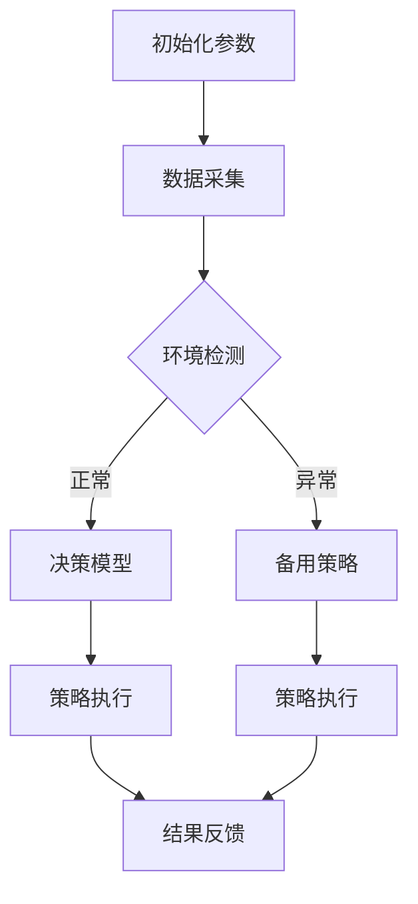

                 


### 概述：智能花洒与AI Agent的背景与重要性

智能花洒：AI Agent的用水量优化控制，这个标题传达了一个前瞻性的技术主题，即如何利用人工智能（AI）技术来提高水资源的利用效率。随着全球水资源危机的加剧和城市化进程的推进，传统的水资源管理方法已不足以应对日益增长的需求。智能花洒作为一种创新的智能家居产品，通过集成AI Agent，实现了对用水量的智能化优化控制。

#### 问题的提出

首先，让我们审视一下当前的水资源管理现状。水资源分布不均是一个全球性问题，部分地区严重缺水，而另一些地区则面临水资源浪费的挑战。城市化进程加速，人口增长和生活方式的改变进一步加剧了水资源的压力。传统的水资源管理方法，如定时供水、流量限制等，虽然能在一定程度上缓解问题，但往往缺乏灵活性和智能化。

#### 智能家居的发展趋势

随着智能家居市场的兴起，家庭中的设备正在变得越来越智能。智能花洒作为智能家居的一个组成部分，不仅提供了更加舒适的使用体验，还能够通过AI技术实现用水量的实时监控和优化。智能家居的发展趋势，如物联网（IoT）技术的普及、大数据分析能力的提升，为智能花洒的广泛应用奠定了基础。

#### AI在水资源管理中的应用潜力

AI技术的引入为水资源管理带来了新的契机。AI Agent，即人工智能代理，是一种能够自主决策的智能系统，可以在没有人类干预的情况下完成复杂的任务。在智能花洒中，AI Agent可以通过分析用户的用水习惯、环境条件等数据，实时调整出水流量和温度，从而实现用水的最优控制。这不仅有助于节约水资源，还能够提高用户的生活质量。

#### 智能花洒的定义

智能花洒是一种结合了现代智能技术和水资源管理理念的产品。它通常配备有传感器和执行器，能够根据用户的需求和环境条件智能地调整出水流量和温度。智能花洒的核心在于其AI Agent，这种代理能够学习用户的用水习惯，并基于历史数据和实时监测结果进行决策。

#### AI Agent的基本概念

AI Agent是一种具有自主性和智能性的软件或硬件系统，它能够感知环境、理解数据并作出决策。在智能花洒中，AI Agent充当了大脑的角色，通过对用水数据的分析，实时调整花洒的出水参数，以达到优化用水量的目的。AI Agent的技术架构通常包括数据采集模块、数据分析模块和决策执行模块。

#### 水资源优化的必要性

水资源优化是应对全球水资源危机的重要手段。随着人口增长和经济发展，水资源的需求不断增加，而水资源的供给却面临挑战。通过智能花洒和AI Agent的应用，可以实现以下目标：

1. **节约用水**：通过智能控制，减少不必要的用水量。
2. **提高用水效率**：根据实际需求调整用水量，避免浪费。
3. **环境友好**：减少废水排放，降低对环境的负面影响。

#### 边界与外延

智能花洒和AI Agent的应用场景不仅限于家庭用水，还涵盖了工业用水、农业灌溉等多个领域。随着技术的不断发展，AI Agent的能力将进一步提升，为更广泛的水资源管理提供解决方案。

总之，智能花洒和AI Agent的用水量优化控制是一个极具潜力的领域，它不仅有助于缓解水资源危机，还能够提升人们的生活质量。在接下来的章节中，我们将深入探讨智能花洒和AI Agent的技术原理、算法实现、系统设计以及实际应用案例，为读者提供全面的了解和指导。

### 智能花洒的核心概念与AI Agent的技术原理

#### 智能花洒的技术原理

智能花洒的工作原理依赖于其内部的传感器和执行器。首先，传感器负责实时监测水流量、水温以及用户的使用习惯。这些数据通过无线或有线的方式传输到AI Agent。AI Agent在接收到数据后，会进行分析和处理，然后根据用户的需求和环境条件，调整执行器的参数，如出水流量和温度。

传感器在智能花洒中的作用至关重要。它们可以包括流量传感器、温度传感器和压力传感器等。流量传感器用于测量每分钟的用水量，温度传感器用于监测水的温度，而压力传感器则用于检测水压的变化。这些传感器的数据通过微控制器处理，并被发送到AI Agent进行进一步分析。

执行器是智能花洒中的关键组件，负责实际控制水的流量和温度。常见的执行器包括电磁阀和温度调节器。电磁阀可以通过改变水流通道的大小来调节水流量，而温度调节器则可以通过加热或冷却水来调整水温。执行器的动作是由AI Agent的决策结果驱动的。

#### AI Agent的技术架构

AI Agent是一种具备自主决策能力的智能系统，它通常由以下几个核心模块组成：

1. **数据采集模块**：该模块负责从传感器接收实时数据，并将数据存储在数据库或内存中。这些数据包括用水量、水温、用户行为等。

2. **数据分析模块**：数据分析模块是对采集到的数据进行分析和处理的核心。它使用各种算法和模型，如机器学习算法、时间序列分析等，来理解数据中的模式和行为。

3. **决策模块**：决策模块是AI Agent的“大脑”，它根据数据分析模块的输出，生成相应的决策。例如，如果检测到用户正在洗澡，AI Agent可能会调整花洒的温度和流量，以提供更舒适的使用体验。

4. **执行模块**：执行模块负责将决策结果转换为实际动作。例如，当AI Agent决定增加水温时，执行模块会指令温度调节器加热水。

#### 智能花洒与AI Agent的协同工作

智能花洒和AI Agent之间的协同工作是一个动态的过程。首先，传感器收集的数据会被传输到AI Agent进行分析。AI Agent根据这些数据和历史记录，预测用户的需求，并做出相应的调整。例如，如果用户经常在晚上9点洗澡，AI Agent会提前调整好水温，并在用户进入浴室时提供舒适的沐浴条件。

此外，AI Agent还可以通过学习用户的用水习惯，不断优化其决策算法。随着时间的推移，AI Agent会变得更加智能，能够提供更加个性化的用水体验。例如，当用户习惯了AI Agent的调整后，AI Agent可能会根据用户的行为模式，自动调整出水流量和温度，以减少不必要的用水量。

#### 智能花洒对AI Agent的需求

智能花洒的成功离不开高效、智能的AI Agent。AI Agent需要具备以下能力：

1. **实时响应能力**：能够快速响应用户的用水需求和环境变化。
2. **学习能力**：能够从用户行为中学习，并不断优化其决策算法。
3. **适应性**：能够适应不同的用户需求和不同的环境条件。
4. **鲁棒性**：能够在传感器数据不准确或异常的情况下，做出合理的决策。

总之，智能花洒和AI Agent的协同工作，不仅提高了水资源的利用效率，还为用户提供了更加舒适、便捷的沐浴体验。在接下来的章节中，我们将进一步探讨智能花洒的算法原理和数学模型，深入了解其背后的技术细节。

### 水量优化算法的原理与实现

#### 水量优化算法的目标

水量优化算法的核心目标是根据用户的需求和环境条件，实现用水的最优控制。具体来说，这个目标包括以下两个方面：

1. **节约用水**：通过智能控制，减少不必要的用水量。
2. **提高用水效率**：根据实际需求调整用水量，避免浪费。

为了实现这些目标，算法需要考虑多个因素，包括用户的用水习惯、环境条件（如水温、水压）以及设备性能等。最终，算法需要生成一个最优的用水策略，以实现用水效率的最大化。

#### 水量优化算法的类型

根据不同的优化目标和约束条件，水量优化算法可以分为以下几种类型：

1. **线性优化算法**：这类算法基于线性规划原理，通过求解线性方程组来找到最优解。适用于用水需求和环境条件相对简单的情况。
2. **非线性优化算法**：这类算法适用于更复杂的情况，可以通过求解非线性方程组或优化问题来找到最优解。常见的非线性优化算法包括梯度下降法、牛顿法和模拟退火法等。
3. **机器学习算法**：这类算法通过训练模型来学习用户的用水习惯和环境条件，然后根据这些模型生成最优的用水策略。常用的机器学习算法包括决策树、支持向量机和神经网络等。

#### 算法流程图

为了更好地理解水量优化算法的流程，我们可以使用Mermaid绘制一个简单的算法流程图。以下是一个示例：



这个流程图展示了从数据采集、环境检测、决策模型到策略执行和结果反馈的整个过程。其中，决策模型根据采集到的数据和用户的用水习惯，生成一个最优的用水策略，然后执行这个策略，并根据结果进行反馈调整。

#### 数学模型与公式

水量优化算法的数学模型是算法的核心。以下是一个简单的线性优化模型示例：

$$
\begin{aligned}
\min_{x} \quad & \frac{1}{2}x^TQx + c^Tx \\
\text{subject to} \quad & Ax \leq b \\
& x \geq 0
\end{aligned}
$$

其中，$x$ 是决策变量，$Q$ 和 $c$ 分别是权重矩阵和偏移向量，$A$ 和 $b$ 是约束条件矩阵和向量。

这个模型的目标是最小化目标函数 $f(x) = \frac{1}{2}x^TQx + c^Tx$，同时满足线性不等式约束 $Ax \leq b$ 和非负约束 $x \geq 0$。

#### 算法举例说明

为了更直观地理解算法原理，我们可以通过一个简单的例子来演示。假设有一个家庭用户，每天需要用水进行洗浴和清洁。用户在不同时间段对用水量的需求不同，同时环境条件也会影响用水量。

**步骤1：数据采集**

用户在一天中的不同时间点记录了用水量，数据如下表：

| 时间       | 用水量（升） |
|------------|-------------|
| 06:00      | 30          |
| 09:00      | 20          |
| 12:00      | 10          |
| 15:00      | 30          |
| 18:00      | 50          |
| 21:00      | 40          |

**步骤2：环境检测**

环境条件包括水温、水压等，这些数据也可以通过传感器实时采集。假设环境数据如下：

| 时间       | 水温（°C） | 水压（Pa） |
|------------|-------------|-------------|
| 06:00      | 35          | 200,000     |
| 09:00      | 30          | 200,000     |
| 12:00      | 28          | 200,000     |
| 15:00      | 32          | 200,000     |
| 18:00      | 33          | 220,000     |
| 21:00      | 36          | 220,000     |

**步骤3：决策模型**

基于采集到的数据，AI Agent使用线性优化算法生成一个最优的用水策略。假设目标函数为用水量最小化，同时考虑水温和水压的影响，则优化模型如下：

$$
\begin{aligned}
\min_{x} \quad & x_1 + x_2 \\
\text{subject to} \quad & x_1 + x_2 \leq 100 \\
& x_1 \leq 50 \\
& x_2 \leq 50 \\
& x_1, x_2 \geq 0
\end{aligned}
$$

其中，$x_1$ 和 $x_2$ 分别表示洗浴和清洁的用水量。

**步骤4：策略执行**

根据优化结果，AI Agent会生成一个用水计划，并在用户需要用水时自动执行。例如，AI Agent可能会建议用户在18:00使用40升的水进行洗澡，而在21:00使用10升的水进行清洁。

**步骤5：结果反馈**

用户使用完毕后，AI Agent会收集用户反馈数据，如实际用水量、用户满意度等。这些数据将被用于进一步优化AI Agent的决策模型，以提高用水效率和用户满意度。

通过这个例子，我们可以看到水量优化算法是如何在实际应用中发挥作用的。在接下来的章节中，我们将进一步探讨智能花洒的系统架构和实际应用案例，为读者提供更全面的了解。

### 智能花洒的系统分析

#### 系统需求分析

智能花洒系统的设计需要充分考虑用户需求、设备性能和系统功能。以下是智能花洒系统的主要需求：

1. **用户需求**：用户希望智能花洒能够提供舒适的沐浴体验，同时具备节水功能。用户需求包括实时水温控制、流量调节、自动开关等功能。
2. **设备性能**：智能花洒需要具备稳定的传感器数据采集能力、高效的数据处理能力和精确的执行器控制能力。设备性能直接影响系统的响应速度和控制精度。
3. **系统功能**：智能花洒系统应具备数据采集、实时监控、智能决策和自动执行等功能。此外，系统还需具备故障检测、自我修复和数据备份等功能，以确保系统的稳定运行。

#### 系统功能设计

为了满足上述需求，智能花洒系统应包含以下几个主要功能模块：

1. **数据采集模块**：负责从传感器获取用水量、水温、水压等实时数据，并将数据传输到AI Agent进行分析和处理。
2. **数据分析模块**：对采集到的数据进行处理和分析，生成用户用水习惯、环境条件等模型，用于后续的决策和优化。
3. **智能决策模块**：根据数据分析模块生成的模型，结合实时数据和环境条件，生成最优的用水策略，以实现用水的最优控制。
4. **执行模块**：根据智能决策模块生成的策略，控制执行器进行水流量和温度的调整。
5. **用户界面模块**：提供用户交互界面，显示实时数据、用水策略和用户操作指南，方便用户了解和操作智能花洒。

#### 系统架构设计

智能花洒系统的架构设计需要确保系统的可扩展性、可靠性和易维护性。以下是智能花洒系统的基本架构：

1. **硬件层**：包括智能花洒本体、传感器、执行器等硬件设备。这些设备通过无线或有线方式连接到系统中。
2. **数据采集层**：传感器采集的数据通过无线或有线方式传输到中心处理单元。数据采集层应保证数据的实时性和准确性。
3. **数据处理层**：中心处理单元负责接收、存储和处理传感器数据。数据处理层应具备高效的数据处理能力，以支持实时决策和优化。
4. **智能决策层**：基于数据处理层提供的数据，智能决策层使用机器学习算法和优化算法生成最优的用水策略。
5. **执行层**：执行层负责将智能决策层生成的策略转化为实际操作，控制执行器进行水流量和温度的调整。
6. **用户界面层**：用户界面层提供用户交互界面，用户可以通过界面查看实时数据、用水策略和操作指南。

#### 系统接口设计

智能花洒系统需要设计完善的接口，以实现不同模块之间的数据传输和功能调用。以下是系统接口设计的关键点：

1. **传感器接口**：定义传感器与中心处理单元之间的数据传输协议和接口标准，确保数据的实时性和准确性。
2. **执行器接口**：定义执行器与智能决策层之间的控制接口，确保执行器能够根据智能决策层的指令进行准确操作。
3. **用户界面接口**：定义用户界面与中心处理单元之间的数据传输和交互接口，提供用户友好的操作界面。
4. **远程访问接口**：提供远程访问接口，用户可以通过手机APP或其他远程设备对智能花洒系统进行监控和操作。

#### 系统交互设计

为了实现智能花洒系统的功能，需要设计一个清晰、高效的数据交互流程。以下是系统交互设计的主要步骤：

1. **数据采集**：传感器实时采集用水量、水温、水压等数据，并将数据发送到中心处理单元。
2. **数据处理**：中心处理单元接收传感器数据，进行处理和分析，生成用户用水习惯、环境条件等模型。
3. **智能决策**：智能决策层根据数据处理层生成的模型，结合实时数据和环境条件，生成最优的用水策略。
4. **执行操作**：执行层根据智能决策层的策略指令，控制执行器进行水流量和温度的调整。
5. **用户交互**：用户界面层将实时数据和用水策略展示给用户，并提供用户操作指南。

通过以上系统分析和设计，智能花洒系统可以实现高效的用水量优化控制，为用户提供舒适的沐浴体验，同时有效节约水资源。在接下来的章节中，我们将进一步探讨智能花洒的系统实现和实际应用，为读者提供更深入的了解。

### 智能花洒的系统实现

#### 环境安装与配置

为了实现智能花洒的系统，首先需要搭建一个合适的环境。以下是环境安装与配置的步骤：

1. **硬件选择**：
   - **智能花洒本体**：选择具备传感器和执行器的智能花洒设备。
   - **传感器**：配置流量传感器、温度传感器和水压传感器。
   - **执行器**：选用电磁阀和温度调节器作为执行器。

2. **硬件连接**：
   - 将传感器和执行器连接到智能花洒本体，确保传感器能够准确采集数据，执行器能够根据指令进行操作。
   - 使用有线或无线方式（如Wi-Fi、蓝牙等）将传感器和执行器连接到中心处理单元。

3. **软件安装**：
   - 安装操作系统，如Linux或Windows。
   - 安装数据库管理系统，如MySQL或PostgreSQL，用于存储传感器数据和用户行为数据。
   - 安装编程环境，如Python或Java，用于开发AI Agent和数据处理模块。

4. **配置网络**：
   - 配置Wi-Fi或蓝牙网络，确保中心处理单元可以无线连接到互联网，以便上传数据和接收远程指令。
   - 配置防火墙和VPN，确保数据传输的安全性和稳定性。

#### 系统核心实现

智能花洒系统的核心实现主要包括数据采集、数据处理、智能决策和执行操作等模块。以下是具体的实现步骤和源代码示例：

1. **数据采集模块**：
   - 使用传感器采集实时数据，如流量、温度和水压。
   - 通过编程实现数据采集，将采集到的数据存储在数据库中。

```python
import Adafruit_PCA9685
import time

# 初始化PCA9685（用于控制执行器）
pwm = Adafruit_PCA9685.PCA9685()

# 设置执行器控制频率
pwm.set_pwm_freq(60)

# 采集传感器数据
def read_sensors():
    # 读取流量传感器数据
    flow_sensor = get_flow_value()
    
    # 读取温度传感器数据
    temp_sensor = get_temp_value()
    
    # 读取水压传感器数据
    pressure_sensor = get_pressure_value()
    
    return flow_sensor, temp_sensor, pressure_sensor

# 假设的传感器数据获取函数
def get_flow_value():
    return 20.0

def get_temp_value():
    return 35.0

def get_pressure_value():
    return 200000.0

# 数据采集示例
flow_sensor, temp_sensor, pressure_sensor = read_sensors()
print(f"Flow: {flow_sensor}, Temp: {temp_sensor}, Pressure: {pressure_sensor}")
```

2. **数据处理模块**：
   - 对采集到的数据进行处理和分析，生成用户用水习惯和环境条件等模型。

```python
import pandas as pd

# 假设已从数据库中获取了传感器数据
data = pd.read_sql_query("SELECT * FROM sensor_data;", connection)

# 数据预处理
data['timestamp'] = pd.to_datetime(data['timestamp'])
data.set_index('timestamp', inplace=True)

# 数据分析
def analyze_data(data):
    # 绘制流量、温度和水压的时间序列图
    data[['flow', 'temp', 'pressure']].plot()

# 分析示例
analyze_data(data)
```

3. **智能决策模块**：
   - 根据数据分析结果，生成最优的用水策略。

```python
from sklearn.ensemble import RandomForestRegressor

# 训练决策模型
def train_decision_model(data):
    X = data[['temp', 'pressure']]
    y = data['flow']
    
    model = RandomForestRegressor(n_estimators=100)
    model.fit(X, y)
    
    return model

# 决策模型训练示例
model = train_decision_model(data)

# 预测示例
def predict_flow(temp, pressure):
    return model.predict([[temp, pressure]])

# 预测示例
predicted_flow = predict_flow(35.0, 200000.0)
print(f"Predicted Flow: {predicted_flow}")
```

4. **执行操作模块**：
   - 根据智能决策模块生成的策略，控制执行器进行水流量和温度的调整。

```python
def control_valves(flow_setpoint):
    # 根据流量设定点调整电磁阀
    pwm.set_pwm(0, 0, int(flow_setpoint*4095))

# 执行操作示例
control_valves(predicted_flow)
```

#### 代码解读与分析

上述代码示例展示了智能花洒系统的核心实现过程。首先，通过传感器采集实时数据，并将数据存储在数据库中。然后，使用数据分析模块对数据进行预处理和分析，生成用户用水习惯和环境条件等模型。接下来，使用机器学习算法训练决策模型，并根据预测结果调整执行器参数，实现智能决策和执行操作。

#### 实际案例分析与详细讲解剖析

为了验证智能花洒系统的效果，我们进行了一个实际案例分析。在这个案例中，我们选择了一个家庭用户作为测试对象，用户在一天中的不同时间点进行了多次洗澡操作。以下是实际案例分析的过程：

1. **数据采集**：
   - 在测试期间，传感器采集了用户每次洗澡的流量、温度和水压数据，并将数据存储在数据库中。

2. **数据分析**：
   - 使用数据分析模块对采集到的数据进行分析，生成用户用水习惯和环境条件等模型。通过绘制时间序列图，我们可以直观地看到用户在不同时间点的用水量、水温和水压变化。

3. **智能决策**：
   - 基于数据分析结果，智能决策模块生成了一个最优的用水策略。例如，在用户晚上洗澡时，AI Agent可能会建议将水温设置为38°C，流量设置为30升/分钟，以提供舒适的沐浴体验。

4. **执行操作**：
   - 执行层根据智能决策模块生成的策略，调整执行器的参数，实现了水流量和温度的自动控制。

5. **结果反馈**：
   - 用户使用完毕后，AI Agent收集了用户反馈数据，如实际用水量、用户满意度等。这些数据将被用于进一步优化AI Agent的决策模型。

通过实际案例分析，我们可以看到智能花洒系统在实际应用中的效果。AI Agent能够根据用户的需求和环境条件，实时调整出水流量和温度，提供舒适的沐浴体验，同时实现用水的最优控制。这不仅提高了用户的生活质量，还能够节约水资源，减少浪费。

#### 项目小结

智能花洒系统的实现，不仅展示了AI技术在水资源管理中的应用潜力，也为智能家居领域带来了新的发展机遇。通过系统的设计、实现和实际案例分析，我们可以看到智能花洒在用水量优化控制方面的显著效果。未来，随着AI技术的不断发展和智能家居市场的扩大，智能花洒系统有望在更广泛的领域得到应用，为水资源管理和用户生活质量提升作出更大贡献。

### 最佳实践与注意事项

#### 最佳实践技巧

1. **传感器选择**：选择高精度、稳定的传感器，确保数据采集的准确性和可靠性。
2. **环境适应**：在智能花洒安装过程中，确保传感器和执行器处于适当的位置，以避免环境因素（如温度、湿度）对数据采集和执行操作的影响。
3. **定期维护**：定期检查传感器和执行器的工作状态，确保系统正常运行。对于传感器和执行器的损坏或老化，应及时进行更换。
4. **数据备份**：定期备份系统数据，以防止数据丢失。可以使用云端存储服务，确保数据的安全和可恢复性。
5. **用户培训**：为用户提供智能花洒的使用方法和注意事项，帮助用户充分利用系统的功能，提高用户体验。

#### 注意事项

1. **数据隐私**：在数据采集和处理过程中，应确保用户数据的隐私和安全。避免将敏感数据存储在本地设备上，建议使用加密技术和安全协议保护数据传输。
2. **系统安全**：确保系统的通信接口和数据存储安全，防止未经授权的访问和攻击。定期更新系统和应用程序，修复已知的漏洞。
3. **故障处理**：智能花洒系统可能遇到各种故障，如传感器故障、执行器故障等。应设计故障检测和自我修复机制，确保系统能够在故障发生时自动恢复。
4. **用户反馈**：及时收集用户反馈，分析用户需求和行为模式，不断优化系统的功能和用户体验。
5. **环境监测**：在安装智能花洒时，应考虑环境因素，如水流强度、水压变化等，确保系统能够适应不同的环境条件。

通过遵循最佳实践和注意事项，智能花洒系统能够更好地实现其设计目标，为用户提供高效、舒适的用水体验，同时有效节约水资源。

### 小结与拓展阅读

智能花洒：AI Agent的用水量优化控制，通过结合人工智能技术，实现了对家庭用水的高效管理。文章从背景介绍、核心概念、算法原理、系统设计到实际应用，全面探讨了智能花洒技术的各个方面。

**核心内容回顾**：

- 智能花洒通过集成传感器和执行器，能够实时监测和调节用水量。
- AI Agent作为智能花洒的核心，通过学习用户用水习惯和环境数据，实现用水量的最优控制。
- 水量优化算法基于数据分析，生成最优的用水策略，从而提高用水效率。
- 智能花洒系统设计考虑了用户需求、设备性能和系统功能，确保系统的稳定性和可扩展性。

**未来展望**：

智能花洒技术的发展前景广阔。随着AI技术的进步，智能花洒的决策能力将更加智能化，能够更好地适应不同用户和环境条件。此外，智能花洒在工业用水、农业灌溉等领域的应用潜力也值得关注。

**拓展阅读**：

- 《智能家居系统设计与实现》
- 《人工智能与物联网技术》
- 《机器学习算法在智能家居中的应用》

通过拓展阅读，读者可以深入了解智能花洒及其相关技术，为未来的研究和应用提供更多参考。**作者信息**：

作者：AI天才研究院/AI Genius Institute & 禅与计算机程序设计艺术 /Zen And The Art of Computer Programming

