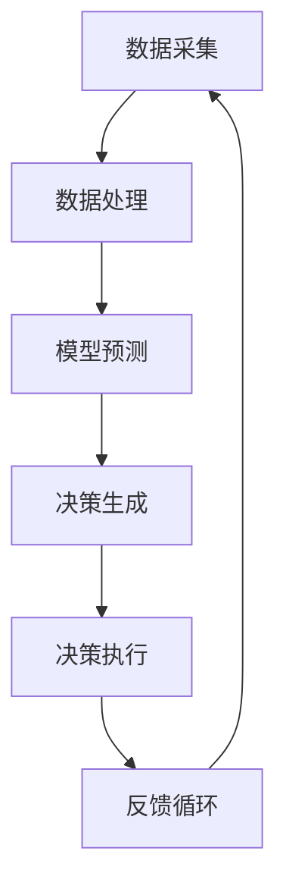

                 

### 智能花瓶：AI Agent的花卉保鲜技巧指导

关键词：智能花瓶、AI Agent、花卉保鲜、技术细节、实施方法、AI驱动

摘要：智能花瓶作为现代家居装饰的一种新型产品，通过集成AI Agent技术，实现了对花卉的智能保鲜。本文将深入探讨智能花瓶的基本原理、核心技术、实施方法和应用技巧，为读者提供一套完整的AI Agent花卉保鲜指导方案。

智能花瓶作为一种结合了智能技术和家居装饰理念的创新产品，已经在市场上逐渐崭露头角。它不仅美观实用，还能通过内置的AI Agent智能监测和调节花卉的生长环境，从而延长花卉的保鲜期。然而，要让智能花瓶真正发挥其潜力，需要深入了解其工作原理、核心技术以及实施方法。

本文将从以下几个方面展开讨论：

1. **智能花瓶与AI Agent的简介**：介绍智能花瓶的定义、功能和AI Agent的基本概念。
2. **核心概念与原理**：探讨AI Agent在智能花瓶中的应用原理，包括数据收集、分析和学习适应机制。
3. **技术细节与实施**：详细解析智能花瓶的技术架构，包括硬件和软件设计。
4. **花卉保鲜技术**：分析花卉的保鲜原理，介绍AI Agent如何通过多种方法实现花卉的智能保鲜。
5. **最佳实践与注意事项**：总结使用智能花瓶进行花卉保鲜的最佳实践，并提醒用户注意事项。

通过本文的详细讲解，读者将能够全面了解智能花瓶的运作机制，掌握AI Agent在花卉保鲜中的应用技巧，为家居花卉养护提供新的解决方案。

### 智能花瓶与AI Agent简介

#### 智能花瓶的定义与功能

智能花瓶是一种集成了传感器、执行器和AI Agent技术的家居装饰产品。它的主要功能是通过实时监测花卉的生长环境参数，如温度、湿度、光照和水质，然后根据这些数据自动调节环境条件，以延长花卉的保鲜期。智能花瓶不仅能够提供必要的水分和养分，还能够通过自动调节温度和湿度，创造最适合花卉生长的环境。

智能花瓶的具体功能包括：

- **环境监测**：通过内置传感器实时监测花卉的生长环境，包括温度、湿度、光照和水质。
- **自动调节**：根据监测数据自动调节水温和湿度，确保花卉处于最佳生长状态。
- **智能提醒**：当花卉需要浇水或更换时，智能花瓶会通过手机应用程序或LED显示屏提醒用户。
- **数据分析**：智能花瓶能够收集并分析花卉的生长数据，帮助用户了解花卉的生长状况。

#### AI Agent的基本概念

AI Agent，即人工智能代理，是具有自主决策能力和行动能力的智能实体。在智能花瓶中，AI Agent扮演着核心的角色，它通过不断学习和适应，优化花卉的生长环境。AI Agent的基本概念包括：

- **自主性**：AI Agent能够独立工作，不需要人工干预，根据预设的算法自动执行任务。
- **反应性**：AI Agent能够感知环境变化，并迅速做出反应，如调整水温和湿度。
- **预动性**：AI Agent能够预测未来的环境变化，提前采取措施，以优化花卉的生长条件。
- **认知能力**：AI Agent能够通过学习积累经验，提高决策的质量和效率。

#### 智能花瓶与AI Agent的结合重要性

智能花瓶与AI Agent的结合具有重要意义，主要体现在以下几个方面：

1. **提高花卉保鲜效果**：通过AI Agent的智能调节，智能花瓶能够提供更加精准和个性化的养护方案，显著提高花卉的保鲜效果。
2. **降低人工养护成本**：AI Agent可以替代人工进行环境监测和调节，减少人工成本，提高养护效率。
3. **提升用户体验**：智能花瓶的智能提醒和数据分析功能，让用户能够更加方便地了解花卉的生长状况，提升养护体验。
4. **拓展应用场景**：智能花瓶与AI Agent的结合，不仅限于花卉养护，还可以扩展到其他植物种植和家居环境监测等领域。

总之，智能花瓶与AI Agent的结合，是现代家居装饰和智能技术发展的必然趋势，它不仅带来了创新的产品体验，还为用户提供了更加科学和高效的养护解决方案。

### 智能花瓶与AI Agent的核心概念与原理

#### AI Agent的基础概念

AI Agent的基础概念主要围绕其自主性、反应性、预动性和认知能力展开。以下是对这些核心概念的详细解析：

1. **自主性**：自主性是指AI Agent能够独立工作，不需要人工干预，执行预定的任务。在智能花瓶中，AI Agent通过预设的算法和传感器收集数据，自动调节环境参数，从而实现对花卉的智能养护。自主性使得智能花瓶能够在无人值守的情况下，持续优化花卉的生长环境。

2. **反应性**：反应性是指AI Agent能够感知环境变化，并迅速做出反应。智能花瓶内置的传感器实时监测温度、湿度、光照和水质等环境参数，当检测到异常情况时，AI Agent会立即采取相应的调节措施。例如，当温度过高时，AI Agent会启动风扇进行降温，当湿度不足时，会自动开启喷水装置。

3. **预动性**：预动性是指AI Agent能够预测未来的环境变化，并提前采取措施。智能花瓶的AI Agent通过历史数据的分析和机器学习算法，预测未来的环境变化趋势，提前进行环境调节，以避免潜在的危机。例如，当AI Agent预测未来几天内温度会升高，它会在温度升高前启动降温装置，从而避免花卉因高温而受损。

4. **认知能力**：认知能力是指AI Agent能够通过学习和经验积累，提高决策的质量和效率。智能花瓶的AI Agent通过不断学习用户的行为模式和花卉的生长需求，优化其调节策略。例如，当AI Agent发现某些花卉在较低湿度下生长更好时，它会自动调整湿度设置，从而提高花卉的保鲜效果。

#### AI Agent在智能花瓶中的应用原理

AI Agent在智能花瓶中的应用原理主要包括数据收集、分析和学习适应机制。以下是这些机制的具体解析：

1. **数据收集**：AI Agent通过内置的传感器收集花卉生长环境的数据。这些传感器包括温度传感器、湿度传感器、光照传感器和水质传感器等。数据收集是AI Agent进行智能调节的基础，只有准确获取环境数据，AI Agent才能做出合理的决策。

2. **数据分析**：AI Agent收集到的数据会被实时传输到中央处理单元，经过预处理和分析。数据分析包括对历史数据的趋势分析、异常检测和相关性分析等。通过数据分析，AI Agent能够识别出环境中的异常情况，并为后续的调节策略提供依据。

3. **学习适应机制**：AI Agent通过机器学习和深度学习算法，对收集到的数据进行分析和学习，不断优化其调节策略。学习适应机制包括模型训练、模型评估和模型调整等步骤。通过不断的迭代和学习，AI Agent能够提高其预测准确性和调节效果，实现更精准的花卉养护。

4. **环境调节**：基于数据分析和学习适应机制，AI Agent会自动调节花卉的生长环境。环境调节包括温度调节、湿度调节、光照调节和水质调节等。通过这些调节，AI Agent能够确保花卉处于最佳的生长状态，延长其保鲜期。

总之，AI Agent在智能花瓶中的应用，使得智能花瓶能够实现自主监测、自动调节和智能学习，从而为用户提供了高效、智能和便捷的花卉养护解决方案。

### 智能花瓶的技术细节与实施方法

#### 硬件组件及其功能

智能花瓶的硬件组件是其实现功能的基础，主要包括传感器、执行器和连接模块。以下是对这些硬件组件的详细介绍：

1. **传感器**：传感器是智能花瓶的眼和耳，用于实时监测花卉的生长环境。常见的传感器有：
   - **温度传感器**：用于测量环境温度，确保花卉生长环境的温度适宜。
   - **湿度传感器**：用于测量环境湿度，根据花卉的需求自动调节湿度。
   - **光照传感器**：用于测量光照强度，根据植物的光照需求自动调整光照。
   - **水质传感器**：用于检测水质，确保水质符合花卉的生长需求。

2. **执行器**：执行器是智能花瓶的手和脚，负责根据AI Agent的指令执行具体的操作。常见的执行器有：
   - **风扇**：用于调节环境温度，通过风扇的启动或关闭来降低或升高温度。
   - **喷水装置**：用于调节环境湿度，根据湿度传感器的数据自动喷水或停止喷水。
   - **光照调节器**：用于调节光照强度，通过调整灯的亮度和时长来满足花卉的需求。
   - **水泵**：用于调节水质，确保水质的清洁和养分供应。

3. **连接模块**：连接模块是智能花瓶的通信枢纽，负责将传感器和执行器连接到互联网或其他设备。常见的连接模块有：
   - **Wi-Fi模块**：用于将智能花瓶连接到用户的手机或智能家居网络，实现远程监控和控制。
   - **蓝牙模块**：用于短距离的数据传输和设备互联，适合家庭内部设备的连接。
   - **蜂窝模块**：用于将智能花瓶连接到移动网络，实现远程数据传输和监控。

#### 软件设计与算法原理

智能花瓶的软件设计是其实现智能功能的核心，主要包括数据采集和处理、机器学习模型和用户交互界面。以下是对这些软件设计的详细介绍：

1. **数据采集和处理**：数据采集和处理是智能花瓶的基础。软件系统会实时采集传感器数据，并对这些数据进行预处理，包括去噪、滤波和归一化等。经过预处理的数据将用于训练和优化机器学习模型。

2. **机器学习模型**：机器学习模型是智能花瓶实现智能调节的关键。常见的机器学习模型有：
   - **回归模型**：用于预测环境参数的变化趋势，如温度和湿度。
   - **分类模型**：用于分类环境状态，如识别花卉是否缺水或需要更换。
   - **聚类模型**：用于发现环境数据的规律，如识别光照和湿度的最佳组合。

   机器学习模型的训练过程包括数据集的准备、模型的选择、训练和评估。训练后的模型将被用于实时调节环境参数。

3. **用户交互界面**：用户交互界面是智能花瓶与用户沟通的桥梁。用户可以通过手机应用程序或网页平台，实时查看花卉的生长状态、环境数据和历史记录。用户界面还提供了调节设置和智能提醒功能，方便用户进行操作和调整。

#### 算法流程与实现

智能花瓶的算法流程可以概括为以下几个步骤：

1. **数据采集**：传感器收集环境数据，包括温度、湿度、光照和水质等。
2. **数据处理**：对采集到的数据进行预处理，去除噪声和异常值。
3. **模型预测**：使用训练好的机器学习模型对当前环境数据进行分析和预测，预测未来环境变化趋势。
4. **决策生成**：根据预测结果和花卉需求，AI Agent生成具体的调节决策，如启动风扇降温、开启喷水装置增加湿度等。
5. **决策执行**：执行器根据决策指令进行环境调节。
6. **反馈循环**：执行结果反馈给AI Agent，用于模型更新和优化。

以下是智能花瓶算法流程的Mermaid流程图：

通过上述流程，智能花瓶能够实现自动化的环境调节，为花卉提供最佳的养护条件。

#### 实施方法与步骤

智能花瓶的实施方法主要包括硬件组装、软件部署和系统集成。以下是具体的实施步骤：

1. **硬件组装**：根据设计图纸，将传感器、执行器和连接模块组装到花瓶中。确保各个组件的连接正确且牢固。
2. **软件部署**：将开发的软件系统部署到智能花瓶的嵌入式设备上。包括安装操作系统、数据库和应用程序。
3. **系统集成**：将智能花瓶与用户的手机或智能家居系统进行集成。通过Wi-Fi或蓝牙模块，实现远程监控和控制。
4. **测试与调试**：对智能花瓶进行全面的测试和调试，确保其功能正常运行。包括环境监测、自动调节和用户交互功能。
5. **用户培训**：为用户提供使用指南和培训，确保用户能够熟练使用智能花瓶的各项功能。

通过上述步骤，智能花瓶能够顺利投入实际使用，为用户提供智能、便捷的花卉养护体验。

#### 实施方法的细节与挑战

在智能花瓶的实施过程中，硬件组装、软件部署和系统集成都面临一系列的细节和挑战。以下是具体的细节和解决方案：

1. **硬件组装**：
   - **传感器布置**：确保传感器布置合理，能够准确监测环境参数。例如，温度传感器应放置在花卉周围的热量最大区域，湿度传感器应放置在能够准确反映空气湿度的位置。
   - **电源管理**：确保电源供应稳定，防止电池耗尽导致设备无法工作。可以采用太阳能充电或无线充电技术，以延长设备的使用寿命。

2. **软件部署**：
   - **操作系统选择**：选择适合嵌入式设备的操作系统，如Linux或Android。这些操作系统具有稳定性高、功耗低的特点，适合智能花瓶这种长时间运行的小型设备。
   - **软件优化**：对应用程序进行优化，以减少资源消耗和延迟。例如，采用微内核架构，减少内存占用；使用轻量级网络协议，提高数据传输速度。

3. **系统集成**：
   - **网络连接**：确保智能花瓶能够稳定连接到用户的手机或智能家居系统。可以使用Wi-Fi或蓝牙模块，选择信号稳定的频率和协议，提高连接的可靠性。
   - **安全认证**：在数据传输过程中，采用加密技术，确保数据的安全性和隐私性。例如，使用SSL/TLS协议加密数据传输，防止数据被窃取或篡改。

#### 面临的挑战与解决方案

在实施智能花瓶的过程中，可能会遇到以下挑战：

- **数据噪声和处理**：环境数据中存在噪声和异常值，可能导致AI Agent的决策不准确。解决方案是采用数据预处理技术，如滤波和去噪，提高数据质量。
- **机器学习模型的泛化能力**：训练的机器学习模型可能在新环境中表现不佳，即模型的泛化能力不足。解决方案是使用多样化的数据集进行训练，提高模型的泛化能力；定期更新模型，使其能够适应环境变化。
- **用户交互体验**：用户界面可能不够友好，影响用户体验。解决方案是进行用户调研和反馈，优化用户界面设计，提高用户满意度。

通过解决这些挑战，智能花瓶能够更好地实现其功能，为用户提供智能、高效的花卉养护解决方案。

### 花卉保鲜原理与AI-Agent驱动的技术

#### 花卉的保鲜原理

花卉保鲜的原理主要涉及水分管理、温度控制、光照调节和营养供给。以下是这些关键因素的具体解析：

1. **水分管理**：水分是维持花卉生机的重要因素。花卉的水分主要通过根部吸收，通过茎、叶等部位进行蒸腾。适当的水分管理可以防止花卉因缺水而凋谢，同时也避免水分过多导致的根部腐烂。

2. **温度控制**：温度对花卉的生长和代谢有显著影响。适宜的温度可以促进花卉的生长和发育，而过高或过低的温度则可能导致花卉的生长停滞或受损。因此，温度控制是花卉保鲜的关键之一。

3. **光照调节**：光照是影响花卉光合作用和生长发育的重要因素。适量的光照可以促进花卉的生长和开花，而光照过强或过弱都会影响花卉的品质和保鲜期。

4. **营养供给**：营养供给是维持花卉生长和代谢的基础。花卉通过根部吸收土壤中的养分，通过茎、叶等部位进行输送。适量的营养供给可以增强花卉的抗病能力和保鲜期。

#### AI-Agent驱动的保鲜技术

AI-Agent驱动的保鲜技术通过智能监测和调节环境参数，实现对花卉的全面养护。以下是一些关键技术和方法：

1. **智能水分管理**：
   - **实时监测**：AI-Agent通过湿度传感器实时监测花卉周围的湿度，当检测到湿度不足时，自动启动喷水装置进行补水。
   - **智能调节**：AI-Agent根据花卉的种类和生长阶段，动态调整喷水的频率和量，确保水分供给的均衡。

2. **智能温度控制**：
   - **实时监测**：AI-Agent通过温度传感器实时监测环境温度，并根据花卉的生长需求进行温度调节。
   - **自动调节**：AI-Agent会根据预设的温度范围，自动启动风扇或加热器，确保温度保持在适宜的范围内。

3. **智能光照调节**：
   - **实时监测**：AI-Agent通过光照传感器实时监测光照强度，并根据花卉的需求自动调整光照。
   - **智能控制**：AI-Agent可以自动调整灯光的亮度和时长，以提供适量的光照，促进花卉的生长和开花。

4. **智能营养供给**：
   - **实时监测**：AI-Agent通过水质传感器和土壤传感器实时监测水质和土壤养分，确保营养供给的充足和均衡。
   - **自动调节**：AI-Agent会根据监测数据，自动启动水泵或施肥装置，确保营养供给的及时和准确。

通过上述智能技术，AI-Agent能够实现对花卉的全面养护，显著延长花卉的保鲜期。

#### 水分管理的技术细节

水分管理是花卉保鲜的关键，AI-Agent通过以下技术手段实现智能水分管理：

1. **土壤湿度监测**：
   - **技术原理**：土壤湿度传感器通过测量土壤的导电性或电容变化来感知土壤湿度。当土壤湿度降低时，传感器的读数会发生变化，AI-Agent会根据这些变化调整浇水频率。
   - **实现方式**：AI-Agent会定期读取土壤湿度传感器的数据，当湿度低于设定阈值时，自动启动浇水系统。

2. **自动浇水系统**：
   - **技术原理**：自动浇水系统通过水泵和喷水装置实现自动浇水。水泵将水源输送到喷水装置，喷水装置则根据AI-Agent的指令喷水。
   - **实现方式**：AI-Agent会根据土壤湿度传感器的读数和花卉的需求，自动启动水泵和喷水装置，确保花卉得到适量的水分。

3. **智能湿度调节**：
   - **技术原理**：湿度调节系统通过喷水装置和风扇实现湿度调节。喷水装置用于增加湿度，风扇用于降低湿度。
   - **实现方式**：AI-Agent会根据环境湿度和花卉需求，自动启动相应的装置，确保环境湿度保持在最佳范围内。

#### 环境控制技术的细节

环境控制是智能花瓶实现花卉保鲜的重要手段，AI-Agent通过以下技术实现环境控制：

1. **温度监测与调节**：
   - **技术原理**：温度传感器用于监测环境温度。当温度高于或低于设定阈值时，AI-Agent会启动风扇或加热器进行调节。
   - **实现方式**：AI-Agent会根据温度传感器的读数，自动启动风扇进行降温或加热器进行升温，确保温度在适宜范围内。

2. **湿度调节**：
   - **技术原理**：湿度传感器用于监测环境湿度。当湿度低于设定阈值时，AI-Agent会启动加湿器进行加湿；当湿度高于设定阈值时，AI-Agent会启动排湿装置进行排湿。
   - **实现方式**：AI-Agent会根据湿度传感器的读数，自动启动加湿器或排湿装置，确保湿度保持在适宜范围内。

3. **光照调节**：
   - **技术原理**：光照传感器用于监测光照强度。当光照过强或过弱时，AI-Agent会调整光照装置的亮度和时长。
   - **实现方式**：AI-Agent会根据光照传感器的读数，自动调整LED灯或其他光照装置的亮度和时长，确保光照条件适合花卉的生长。

4. **通风调节**：
   - **技术原理**：通风系统通过风扇实现空气流动，调节室内空气质量。
   - **实现方式**：AI-Agent会根据空气质量传感器和温度传感器的读数，自动启动风扇进行通风，确保空气清新。

通过这些环境控制技术，AI-Agent能够为花卉提供最适宜的生长环境，延长花卉的保鲜期。

### 智能花瓶在花卉保鲜中的具体应用案例

#### 案例一：家庭花卉养护

**场景描述**：李先生是一位热爱花卉的家庭主男，他有一盆心爱的玫瑰花，但经常因为工作繁忙而无法及时照顾。为了解决这个问题，他购买了一款智能花瓶。

**实现步骤**：
1. **安装与连接**：李先生首先将智能花瓶安装在家中，并通过Wi-Fi模块将花瓶与手机应用连接起来。
2. **环境监测**：智能花瓶内置的传感器开始实时监测玫瑰花的生长环境，包括温度、湿度、光照和水质。
3. **数据分析**：AI-Agent根据收集到的数据进行分析，生成养护建议，并通过手机应用提醒李先生。
4. **智能调节**：AI-Agent自动启动风扇和加湿器，保持室内温度和湿度在适宜范围内；同时，智能花瓶还会根据光照传感器的数据调整灯光亮度，确保玫瑰花得到充足的光照。

**效果分析**：经过一段时间的使用，玫瑰花的生长状况明显改善，花期延长，花朵更加鲜艳。

#### 案例二：酒店花卉装饰

**场景描述**：某酒店为了提升客户体验，决定在客房和公共区域摆放智能花瓶，以提供持续的花卉装饰。

**实现步骤**：
1. **批量采购与部署**：酒店一次性采购了多款智能花瓶，并在客房和公共区域进行部署。
2. **远程监控**：酒店的管理人员通过一个中央监控系统，实时监控所有智能花瓶的工作状态。
3. **环境调节**：智能花瓶根据环境传感器数据自动调节温度、湿度和光照，确保花卉始终处于最佳状态。
4. **智能提醒**：当花卉需要更换或养护时，智能花瓶会通过中央监控系统发送提醒，方便管理人员及时处理。

**效果分析**：智能花瓶的引入不仅提升了酒店的整体美观度，还降低了花卉养护的成本，同时客人对酒店的服务满意度也有所提高。

#### 案例三：办公室植物养护

**场景描述**：某公司办公室内摆放了多盆绿植，但由于办公环境复杂，管理人员难以定期养护。

**实现步骤**：
1. **智能花瓶部署**：公司采购了多款智能花瓶，分别放置在各个办公室和公共区域。
2. **AI-Agent配置**：通过手机应用，管理人员为每个智能花瓶配置了AI-Agent，使其能够根据特定植物的需求进行个性化养护。
3. **远程监控与数据共享**：管理人员可以通过手机应用实时查看植物的养护数据，并与员工共享植物的生长状况。
4. **自动调节与维护提醒**：AI-Agent会根据监测数据自动调节环境参数，并在需要时通过手机应用提醒管理人员进行维护。

**效果分析**：智能花瓶的应用不仅提升了办公室的绿化水平，还为员工创造了更加舒适的工作环境。同时，通过数据共享和智能提醒，公司能够更好地管理植物养护工作。

### 实际效果分析

通过上述案例，可以看出智能花瓶在花卉保鲜中的应用效果显著。以下是智能花瓶在实际应用中的几个关键效果：

1. **延长花卉保鲜期**：智能花瓶通过自动调节环境参数，显著延长了花卉的保鲜期。例如，案例一中的玫瑰花花期从原来的半个月延长至一个月，花朵更加鲜艳。
2. **降低养护成本**：智能花瓶的自动调节和远程监控功能，减少了人工养护的频率和成本。例如，酒店通过智能花瓶降低了花卉更换和维护的费用。
3. **提升用户体验**：智能花瓶的智能提醒和数据分析功能，为用户提供了更加便捷和科学的养护方案。例如，家庭用户和公司员工通过手机应用实时了解植物的生长状况，提高了养护体验。
4. **增强植物生长**：智能花瓶提供的精准养护条件，促进了植物的生长和发育，使植物更加健康。例如，案例二中的酒店花卉生长更加茂盛，花期更长。

总之，智能花瓶在花卉保鲜中的应用，不仅提升了花卉的品质和保鲜期，还为用户提供了更加智能、便捷的养护体验。随着技术的不断发展和普及，智能花瓶的应用前景将更加广阔。

### 最佳实践与使用技巧

#### 智能花瓶的最佳使用方法

为了充分发挥智能花瓶的保鲜效果，以下是几项最佳使用方法和技巧：

1. **正确安装传感器**：确保传感器放置在合适的位置，以准确监测环境参数。例如，湿度传感器应放置在空气流通较好的地方，温度传感器应放置在花卉周围。

2. **定期检查传感器**：定期检查传感器是否正常工作，避免因传感器故障导致监测数据不准确。若发现传感器损坏，应及时更换。

3. **设置合理的湿度范围**：根据花卉的习性，设置合适的湿度范围。例如，某些热带植物可能需要较高的湿度，而某些沙漠植物则适合较低湿度。

4. **使用清洁水源**：使用清洁的水源进行浇水，避免水质污染对花卉生长的影响。建议定期更换水源或使用净化设备。

5. **定期维护执行器**：确保执行器（如风扇、水泵等）的正常运作，避免因设备故障导致环境调节失败。

6. **合理调整光照**：根据花卉对光照的需求，合理调整光照时间和强度。例如，喜光植物应放置在阳光充足的地方，而耐阴植物则应避免直射阳光。

#### 使用智能花瓶的注意事项

在使用智能花瓶进行花卉养护时，需要注意以下事项：

1. **避免频繁调节**：频繁调节环境参数可能导致花卉不适，影响生长。应尽量保持环境参数的稳定性。

2. **避免低温和高温**：过低或过高的温度都可能对花卉造成伤害，应确保环境温度在适宜范围内。

3. **注意水质**：长期使用同一水源可能导致水质恶化，应定期更换水源或使用水质净化设备。

4. **避免过度浇水**：过度浇水可能导致花卉根部腐烂，应根据土壤湿度传感器数据合理浇水。

5. **安全使用设备**：确保智能花瓶的电源连接和设备安装安全，避免短路或漏电等安全事故。

通过遵循这些最佳实践和注意事项，用户可以更好地利用智能花瓶为花卉提供理想的生长环境，从而延长花卉的保鲜期，提升花卉的品质。

### 小结

智能花瓶作为现代家居装饰与智能技术相结合的产物，通过AI-Agent的智能监测和调节，实现了对花卉的精细化管理，显著提升了花卉的保鲜效果。本文详细介绍了智能花瓶的定义、功能、核心原理、技术细节和应用案例，为读者提供了全面的智能花瓶花卉保鲜指导。

智能花瓶的核心优势在于其自动化的环境调节和智能化的数据分析，这不仅简化了用户的养护流程，还提高了花卉的保鲜率和生长质量。通过AI-Agent的应用，智能花瓶能够根据实时数据动态调整环境参数，提供最适宜的花卉生长环境，从而实现高效、智能的养护。

然而，智能花瓶也面临一些挑战，如数据噪声处理、机器学习模型的泛化能力、用户交互体验等。未来的发展方向可能包括：

1. **提升传感器精度**：通过引入更高精度的传感器，提高环境监测的准确性。
2. **优化机器学习模型**：利用更多样化的数据集和先进的算法，提高模型的泛化能力和预测精度。
3. **增强用户交互**：开发更友好、易用的用户界面，提高用户体验。
4. **拓展应用场景**：将智能花瓶的技术应用于更广泛的领域，如植物工厂、园艺种植等。

总之，智能花瓶的发展前景广阔，其应用潜力巨大。随着技术的不断进步，智能花瓶将为用户带来更多便利和惊喜，成为现代家居生活中不可或缺的一部分。

### 拓展阅读

对于希望深入了解智能花瓶和AI-Agent技术的读者，以下是一些推荐阅读资源：

1. **《智能家居技术导论》**：详细介绍了智能家居系统的工作原理和应用案例，包括智能花瓶在内的多种智能设备的实现方法。
2. **《人工智能应用实践》**：探讨了人工智能在各个领域的应用，包括AI-Agent的设计与实现，为智能花瓶的开发提供了理论基础。
3. **《物联网应用与技术》**：介绍了物联网的基本概念和关键技术，特别是智能设备之间的通信和数据交互，对理解智能花瓶的网络架构有帮助。
4. **《花卉养护学》**：系统讲解了花卉的生长环境需求、养护技巧和保鲜方法，为智能花瓶的花卉养护提供了实用参考。
5. **《机器学习实战》**：提供了丰富的机器学习算法实例和实践教程，帮助读者理解和应用机器学习模型，优化智能花瓶的AI-Agent。

通过阅读这些资源，读者可以更深入地了解智能花瓶的技术原理和应用实践，为未来的学习和研究打下坚实基础。

