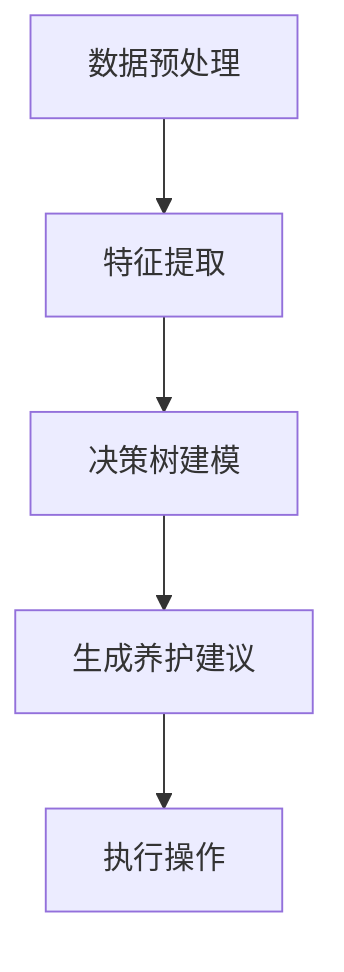

                 


### 1.3 智能花瓶的技术原理

#### 1.3.1 AI Agent的定义

AI Agent，即人工智能代理，是一种具有自主性、适应性和智能性的计算机程序。它能够感知环境、理解目标，并采取适当的行动以实现目标。在智能花瓶中，AI Agent充当花卉养护专家的角色，通过分析传感器收集的数据，为花卉提供最优的养护方案。

#### 1.3.2 AI Agent在智能花瓶中的应用

在智能花瓶中，AI Agent的应用主要包括以下几个方面：

- **数据感知与处理**：AI Agent能够实时收集花卉的生长数据，如土壤湿度、光照强度、空气温度等。通过数据分析和机器学习算法，AI Agent能够准确判断花卉的生长状态。

- **养护方案生成**：基于对花卉生长数据的分析，AI Agent可以生成个性化的养护方案，如调整水肥比例、调整光照时间和位置等。

- **远程控制与交互**：用户可以通过智能手机或其他终端设备，与智能花瓶进行远程交互，查看花卉的生长状态，调整养护设置。

#### 1.3.3 技术原理讲解

智能花瓶的技术原理主要涉及以下几个方面：

- **传感器技术**：智能花瓶内置多种传感器，用于实时监测花卉的生长环境。这些传感器包括土壤湿度传感器、光照传感器、温度传感器等。

- **物联网技术**：智能花瓶通过物联网技术，将传感器收集的数据传输到AI Agent进行进一步处理。物联网技术确保了数据的实时性和准确性。

- **数据分析和机器学习**：AI Agent利用数据分析和机器学习算法，对传感器数据进行处理和分析，生成养护方案。

- **无线通信**：智能花瓶支持Wi-Fi、蓝牙等无线通信技术，用户可以通过智能手机或其他设备远程控制智能花瓶。

#### 1.3.4 智能花瓶的工作流程

智能花瓶的工作流程可以概括为以下几个步骤：

1. **数据采集**：传感器收集花卉的生长数据，如土壤湿度、光照强度、空气温度等。
2. **数据传输**：传感器通过物联网技术将数据传输到AI Agent。
3. **数据分析**：AI Agent对数据进行处理和分析，生成养护方案。
4. **执行方案**：智能花瓶根据养护方案执行相应的操作，如自动浇水、调整光照等。
5. **用户交互**：用户可以通过远程设备查看花卉的生长状态，调整养护设置。

通过以上工作流程，智能花瓶实现了对花卉的智能养护，为用户提供了便利和高效。

---

**ER实体关系图架构**

以下是一个智能花瓶系统的ER实体关系图，用于表示系统中的主要实体及其相互关系：

```mermaid
erDiagram
    Customer ||--|{ Plant }|--| Worker : orders
    Plant ||--|{ PlantSensor }| : senses
    Worker ||--|{ WaterController }| : controls
    Worker ||--|{ LightController }| : controls
    PlantSensor ||--|{ HumiditySensor }| : senses
    PlantSensor ||--|{ LightSensor }| : senses
    PlantSensor ||--|{ TemperatureSensor }| : senses
```

在这个ER图中：

- **Customer**（客户）：与Plant（植物）之间存在订购关系。
- **Plant**（植物）：包含PlantSensor（植物传感器）。
- **Worker**（工作者）：控制WaterController（水控制器）和LightController（光控制器）。
- **PlantSensor**（植物传感器）：包括HumiditySensor（湿度传感器）、LightSensor（光传感器）和TemperatureSensor（温度传感器）。

通过这个ER图，我们可以清晰地看到智能花瓶系统中各实体之间的关联和交互。

---

### 1.4 智能花瓶的市场前景与应用领域

#### 1.4.1 市场前景

智能花瓶作为一种智能家居产品，具有广泛的市场前景。随着人们对生活品质的追求，以及智能家居市场的快速增长，智能花瓶的需求量也在不断增加。以下是智能花瓶市场前景的几个方面：

- **智能家居市场驱动因素**：随着物联网、人工智能技术的不断发展，智能家居市场潜力巨大。智能花瓶作为智能家居的一部分，有望在未来的市场中占据一席之地。
- **消费升级**：随着消费者对生活品质的要求提高，愿意为智能、便捷的产品支付更高的价格。智能花瓶正好满足了这一需求。
- **年轻一代的消费偏好**：90后、00后等年轻一代消费者，更倾向于购买智能、时尚的产品，这为智能花瓶的市场推广提供了机会。

#### 1.4.2 应用领域

智能花瓶的应用领域非常广泛，以下是一些主要的应用场景：

- **家庭环境**：家庭是智能花瓶最主要的消费市场，用户可以通过智能花瓶实现对室内花卉的智能养护。
- **酒店与餐厅**：酒店和餐厅可以通过智能花瓶提升室内绿化的品质，同时减少人工养护的成本。
- **办公环境**：企业办公室可以通过智能花瓶提升办公环境的美观度，同时降低花卉养护的维护成本。
- **医疗机构**：医院和诊所可以通过智能花瓶为患者提供舒适、美观的就诊环境。
- **农业与园艺**：智能花瓶的技术原理同样适用于农业生产和园艺管理，提高作物的生长效率和质量。

#### 1.4.3 潜在发展机遇

智能花瓶的发展机遇主要体现在以下几个方面：

- **技术创新**：随着物联网、人工智能技术的不断进步，智能花瓶的功能将更加丰富，用户体验将得到提升。
- **跨界合作**：智能花瓶可以与智能家居的其他产品进行集成，如智能灯光、智能音响等，形成完整的智能家居生态系统。
- **市场扩展**：除了传统消费市场，智能花瓶还可以拓展到专业市场，如农业、园艺等领域，提高市场占有率。
- **商业模式创新**：通过推出会员服务、智能租赁等新模式，智能花瓶可以吸引更多用户，提升市场竞争力。

通过以上分析，我们可以看到智能花瓶在市场前景和应用领域方面具有巨大的潜力，未来有望成为智能家居市场中的一匹“黑马”。### 第二部分: 智能花瓶的技术基础

#### 2.1 AI Agent的基础知识

##### 2.1.1 定义

AI Agent，即人工智能代理，是指具备一定智能能力、能够在特定环境中自主执行任务、并与环境进行交互的软件实体。它通常由感知模块、决策模块和执行模块三部分组成。

- **感知模块**：用于感知环境中的信息，如图像、声音、文本等。
- **决策模块**：根据感知模块收集的信息，进行逻辑推理和决策，以确定下一步的行动。
- **执行模块**：执行决策模块生成的行动，如移动、发送信息等。

##### 2.1.2 特点

AI Agent具有以下几个显著特点：

- **自主性**：AI Agent可以自主地完成特定任务，而不需要人类的直接干预。
- **适应性**：AI Agent能够根据环境变化调整其行为，提高任务的执行效率。
- **智能性**：AI Agent通过机器学习、自然语言处理等技术，具备一定的推理、学习和问题解决能力。

##### 2.1.3 基础算法

AI Agent的核心在于其算法，以下是一些常见的基础算法：

- **决策树**：通过一系列规则进行分类或回归，是一种直观且易于解释的算法。
- **支持向量机（SVM）**：通过寻找最优的超平面进行分类，具有较强的分类能力。
- **神经网络**：模仿人脑神经元的工作方式，通过多层神经网络进行复杂模式的识别和学习。
- **深度学习**：基于神经网络，通过多层抽象特征提取，在图像识别、自然语言处理等领域表现出色。

#### 2.2 物联网技术基础

##### 2.2.1 定义

物联网（Internet of Things，IoT）是指通过传感器、网络和数据处理技术，实现物体之间的互联互通，从而构建出一个智能化的网络系统。

##### 2.2.2 技术原理

物联网技术的基本原理包括以下几个方面：

- **传感器技术**：传感器负责采集环境数据，如温度、湿度、光照等。
- **通信技术**：通过无线通信技术，如Wi-Fi、蓝牙、ZigBee等，将传感器数据传输到中心服务器或云平台。
- **数据处理技术**：中心服务器或云平台负责对收集到的数据进行存储、处理和分析，生成有价值的决策信息。
- **云计算与大数据**：通过云计算和大数据技术，实现海量数据的存储、处理和分析，为物联网应用提供强大的支持。

##### 2.2.3 应用场景

物联网技术在智能花瓶中的应用主要包括以下几个方面：

- **环境监测**：通过传感器实时监测土壤湿度、光照强度、空气温度等环境参数，为AI Agent提供决策依据。
- **数据传输**：将传感器数据通过无线通信技术传输到AI Agent，实现远程监控和控制。
- **数据存储与分析**：将传感器数据存储在云平台，通过大数据分析和机器学习，生成智能养护方案。

#### 2.3 数据分析与处理技术

##### 2.3.1 数据采集

数据采集是数据分析与处理的基础，智能花瓶通过以下几种方式采集数据：

- **传感器采集**：智能花瓶内置多种传感器，如土壤湿度传感器、光照传感器、温度传感器等，用于采集花卉的生长环境数据。
- **无线通信采集**：通过无线通信技术，如Wi-Fi、蓝牙等，将传感器数据传输到AI Agent进行进一步处理。

##### 2.3.2 数据处理

数据处理包括数据清洗、数据整合和数据预处理等步骤：

- **数据清洗**：去除重复数据、处理缺失数据和异常值，保证数据的准确性。
- **数据整合**：将来自不同传感器的数据进行整合，形成统一的数据格式，便于进一步分析。
- **数据预处理**：通过数据标准化、特征提取等技术，将原始数据转化为适用于机器学习模型的特征数据。

##### 2.3.3 数据分析

数据分析是通过统计分析和机器学习技术，对采集到的数据进行分析和挖掘，以发现数据中的规律和模式：

- **统计分析**：通过对数据的基本统计描述，如平均值、方差等，了解数据的分布特性。
- **机器学习**：通过构建机器学习模型，对数据进行训练和预测，实现智能决策。

通过以上数据分析与处理技术，智能花瓶能够实现对花卉生长状态的精准监控和智能养护，提高花卉的存活率和生长质量。下一部分我们将深入探讨智能花瓶的设计与实现，包括系统架构设计、核心算法实现和硬件设计等内容。### 第三部分: 智能花瓶的设计与实现

#### 3.1 智能花瓶的系统架构设计

智能花瓶的系统架构设计是确保其功能实现和性能优化的重要环节。以下是智能花瓶的系统架构设计方案：

##### 3.1.1 问题场景介绍

智能花瓶需要实时监测花卉的生长状态，并根据环境参数提供智能养护建议。具体场景包括：

- **环境监测**：实时监测土壤湿度、光照强度、空气温度等参数。
- **数据传输**：将监测数据传输至AI Agent进行分析和决策。
- **决策执行**：根据AI Agent的决策，执行如自动浇水、调整光照等操作。

##### 3.1.2 项目介绍

项目名称：智能花瓶（SmartVase）

目标：设计并实现一款能够智能监测花卉生长状态、提供智能养护建议的智能花瓶。

技术栈：Python、TensorFlow、Arduino、Wi-Fi/蓝牙模块、传感器模块。

##### 3.1.3 系统功能设计

智能花瓶的主要功能包括：

- **环境监测**：通过传感器实时监测土壤湿度、光照强度、空气温度等参数。
- **数据传输**：通过Wi-Fi或蓝牙模块，将传感器数据传输至AI Agent。
- **智能决策**：AI Agent根据传感器数据，生成养护建议。
- **执行操作**：执行如自动浇水、调整光照等操作。

##### 3.1.4 系统架构设计

智能花瓶的系统架构分为以下几个主要模块：

- **感知模块**：包括土壤湿度传感器、光照传感器、温度传感器等，负责实时监测环境参数。
- **传输模块**：包括Wi-Fi/蓝牙模块，负责将感知模块采集到的数据传输至AI Agent。
- **AI模块**：AI Agent，负责对传输模块的数据进行分析和处理，生成养护建议。
- **执行模块**：执行AI模块生成的养护建议，如自动浇水、调整光照等。

##### 3.1.5 技术选型

- **传感器**：选用精度高、稳定性好的传感器，如土壤湿度传感器、光照传感器、温度传感器等。
- **通信模块**：选用支持Wi-Fi和蓝牙的模块，保证数据传输的稳定性和实时性。
- **AI框架**：选用TensorFlow等开源AI框架，实现AI Agent的构建和训练。
- **硬件平台**：选用Arduino等开源硬件平台，实现智能花瓶的硬件设计。

##### 3.1.6 系统模块划分

智能花瓶的系统模块划分如下：

- **感知模块**：包括土壤湿度传感器、光照传感器、温度传感器等。
- **传输模块**：包括Wi-Fi/蓝牙模块，负责数据传输。
- **AI模块**：AI Agent，负责数据分析与智能决策。
- **执行模块**：包括水控制器、光控制器等，负责执行养护操作。

#### 3.2 智能花瓶的核心算法实现

智能花瓶的核心算法实现是系统设计的核心，以下详细介绍核心算法的原理、实现步骤和Python代码实现。

##### 3.2.1 算法介绍

智能花瓶的核心算法包括：

- **数据预处理**：对采集到的环境数据进行清洗、整合和预处理。
- **特征提取**：从预处理后的数据中提取出有助于决策的特征。
- **决策树**：构建决策树模型，根据特征数据生成养护建议。

##### 3.2.2 算法流程图

以下是智能花瓶核心算法的流程图：



##### 3.2.3 Python代码实现

以下是智能花瓶核心算法的Python代码实现：

```python
# 导入所需库
import pandas as pd
from sklearn.model_selection import train_test_split
from sklearn.tree import DecisionTreeClassifier
from sklearn import preprocessing

# 数据预处理
def preprocess_data(data):
    # 清洗数据
    data = data.dropna()
    # 标准化数据
    x = data.drop('label', axis=1)
    min_max_scaler = preprocessing.MinMaxScaler()
    x_scaled = min_max_scaler.fit_transform(x)
    x = pd.DataFrame(x_scaled)
    # 分离特征和标签
    y = data['label']
    return x, y

# 特征提取
# 在本示例中，特征提取直接使用预处理后的数据

# 决策树建模
def build_decision_tree(x, y):
    # 划分训练集和测试集
    x_train, x_test, y_train, y_test = train_test_split(x, y, test_size=0.2, random_state=42)
    # 构建决策树模型
    clf = DecisionTreeClassifier()
    clf.fit(x_train, y_train)
    # 模型评估
    accuracy = clf.score(x_test, y_test)
    print("模型准确率：", accuracy)
    return clf

# 生成养护建议
def generate_advice(clf, x):
    return clf.predict(x)

# 示例数据
data = pd.read_csv('smart_vase_data.csv')

# 预处理数据
x, y = preprocess_data(data)

# 建立决策树模型
clf = build_decision_tree(x, y)

# 生成养护建议
x_example = [[0.5, 0.3, 0.2]]  # 示例数据
print("养护建议：", generate_advice(clf, x_example))
```

##### 3.2.4 算法原理讲解

智能花瓶的核心算法基于决策树模型，通过以下步骤实现：

- **数据预处理**：对采集到的环境数据进行清洗、标准化处理，确保数据的质量和一致性。
- **特征提取**：直接使用预处理后的数据作为特征，不需要进行复杂的特征工程。
- **决策树建模**：通过训练集数据构建决策树模型，模型根据特征数据生成养护建议。
- **生成养护建议**：将实时监测到的环境数据输入到决策树模型中，生成相应的养护建议。

通过以上步骤，智能花瓶能够实现对花卉生长状态的智能监测和养护，提高花卉的存活率和生长质量。

---

#### 3.3 智能花瓶的硬件选型与设计

智能花瓶的硬件设计是实现其功能的基础，以下详细讨论硬件选型与设计。

##### 3.3.1 硬件选型

智能花瓶的硬件选型包括以下几类：

- **主控制器**：选用Arduino Mega 2560，具有足够的I/O口和存储空间，适合处理多种传感器和控制执行器的数据。
- **传感器**：选用以下传感器：
  - 土壤湿度传感器：DS18B20，用于测量土壤湿度。
  - 光照传感器：BH1750，用于测量光照强度。
  - 温度传感器：DHT22，用于测量空气温度和湿度。
- **执行器**：选用以下执行器：
  - 水泵：用于自动浇水。
  - 光照调整装置：电机驱动装置，用于调整花瓶中的照明设备。

- **通信模块**：选用ESP8266 Wi-Fi模块，实现智能花瓶与互联网的连接。

##### 3.3.2 硬件设计

智能花瓶的硬件设计包括以下步骤：

- **电路设计**：根据传感器和执行器的规格，设计合适的电路，确保电源稳定、信号可靠。
- **接口设计**：将传感器、执行器和主控制器连接起来，确保信号传输顺畅。
- **布线设计**：合理布局布线，确保硬件安装简洁、美观。
- **调试与优化**：通过实际测试，对硬件设计进行优化，提高系统的稳定性和可靠性。

##### 3.3.3 硬件接口

智能花瓶的硬件接口设计如下：

- **电源接口**：Arduino Mega 2560的电源接口，连接外部电源。
- **传感器接口**：Arduino Mega 2560的I/O口，连接DS18B20、BH1750和DHT22传感器。
- **执行器接口**：Arduino Mega 2560的I/O口，连接水泵和电机驱动装置。
- **通信接口**：ESP8266 Wi-Fi模块的接口，连接主控制器和互联网。

通过以上硬件选型和设计，智能花瓶能够稳定、高效地运行，实现对花卉的智能养护。下一部分将讨论智能花瓶的测试与优化，确保系统性能和用户体验达到最佳状态。### 第四部分: 智能花瓶的测试与优化

#### 4.1 测试策略与测试用例设计

在智能花瓶的开发过程中，测试是确保系统功能完整性和性能稳定性的关键环节。以下是智能花瓶的测试策略与测试用例设计。

##### 4.1.1 测试策略

智能花瓶的测试策略分为以下几个阶段：

- **单元测试**：对智能花瓶中的各个模块（如传感器、执行器、AI模块等）进行独立测试，确保模块功能正确。
- **集成测试**：将各个模块组合起来进行测试，验证模块之间的交互和协作是否正常。
- **系统测试**：在整个系统运行环境下，对智能花瓶进行全面的测试，包括环境监测、数据传输、智能决策、执行操作等。
- **性能测试**：测试智能花瓶在多种环境条件下的性能表现，如响应时间、功耗、稳定性等。

##### 4.1.2 测试用例设计

测试用例设计是基于智能花瓶的功能和性能要求，以下是一些典型的测试用例：

- **单元测试用例**：
  - 测试土壤湿度传感器是否能够准确测量土壤湿度。
  - 测试光照传感器是否能够准确测量光照强度。
  - 测试温度传感器是否能够准确测量空气温度和湿度。
  - 测试水泵是否能够根据土壤湿度自动浇水。
  - 测试光照调整装置是否能够根据光照强度自动调整光照。

- **集成测试用例**：
  - 测试传感器数据是否能够正确传输到AI模块。
  - 测试AI模块生成的养护建议是否合理。
  - 测试执行器是否能够根据养护建议执行相应的操作。

- **系统测试用例**：
  - 在不同环境条件下（如高温、低温、高湿度、低湿度等），测试智能花瓶的稳定性。
  - 在高负载条件下（如连续采集大量数据），测试智能花瓶的性能表现。

- **性能测试用例**：
  - 测试智能花瓶的响应时间。
  - 测试智能花瓶的功耗。
  - 测试智能花瓶的数据传输速率。

#### 4.2 性能优化

性能优化是提升智能花瓶用户体验和系统稳定性的重要环节。以下是智能花瓶性能优化的几个策略：

##### 4.2.1 性能分析

性能分析是优化前的重要步骤，通过以下方法进行：

- **监控系统资源**：使用工具如Python的`psutil`库，监控智能花瓶的CPU、内存、网络等资源使用情况。
- **日志分析**：分析系统日志，查找性能瓶颈和异常情况。
- **性能测试**：通过模拟不同环境条件和负载，测试智能花瓶的性能表现。

##### 4.2.2 优化策略

基于性能分析的结果，可以采取以下策略进行优化：

- **代码优化**：优化AI模块的算法，减少计算复杂度。例如，可以采用更高效的机器学习算法，减少训练时间。
- **硬件升级**：如果硬件资源不足，可以考虑升级硬件，如增加内存、使用更快的处理器等。
- **通信优化**：优化数据传输协议，减少数据传输过程中的延迟和错误。
- **负载均衡**：通过负载均衡技术，将数据均匀分布到多个服务器或设备上，避免单点性能瓶颈。
- **缓存策略**：使用缓存策略，减少对数据库的访问频率，提高系统响应速度。

通过以上性能优化策略，智能花瓶能够在各种环境下稳定运行，提供高效、智能的花卉养护服务。

#### 4.3 耗材优化

耗材优化是降低智能花瓶运行成本和环境影响的重要措施。以下是智能花瓶耗材优化的几个策略：

##### 4.3.1 材料选型

在智能花瓶的设计中，选择合适的材料对于优化耗材至关重要。以下是一些材料选型策略：

- **环保材料**：优先选用环保、可回收的材料，如可降解塑料、再生纸等。
- **耐用材料**：选用耐腐蚀、耐高温、耐磨损的材料，延长设备使用寿命，减少更换频率。
- **节能材料**：选用具有良好保温性能的材料，减少能源消耗。

##### 4.3.2 耗材优化策略

以下是一些耗材优化策略：

- **减少材料使用**：在设计过程中，通过优化结构设计，减少材料的使用量。例如，使用模块化设计，减少零部件数量。
- **优化生产流程**：通过优化生产流程，减少材料浪费。例如，采用精益生产方式，降低废料产生。
- **再生利用**：鼓励回收和再生利用，将使用过的材料进行回收处理，再次利用。

通过以上耗材优化策略，智能花瓶不仅能够降低运行成本，还能减少对环境的影响，实现可持续发展。

---

通过测试与优化，智能花瓶能够在功能、性能和环保方面达到最佳状态，为用户提供高效、智能的花卉养护服务。下一部分将分析智能花瓶的市场现状、商业模式以及未来发展趋势。### 第五部分: 智能花瓶的市场分析与商业模式

#### 5.1 智能花瓶的市场现状

智能花瓶作为一种新兴的智能家居产品，正逐渐受到市场的关注。以下是智能花瓶市场现状的几个方面：

- **市场规模**：根据市场研究报告，全球智能花瓶市场在过去几年中保持了快速增长，预计未来几年将继续保持较高增长率。智能花瓶的市场规模正逐步扩大。
- **市场趋势**：随着智能家居市场的兴起，智能花瓶的市场需求也在不断上升。用户对于智能、便捷的生活用品的接受度提高，推动了智能花瓶的普及。
- **竞争态势**：目前，智能花瓶市场竞争激烈，国内外多家公司纷纷进入这一领域，提供不同功能的智能花瓶产品。主要竞争者包括科技公司、家电品牌和初创企业。

#### 5.2 智能花瓶的商业模式

智能花瓶的商业模式主要包括以下几种：

- **销售模式**：通过线上和线下渠道销售智能花瓶。线上渠道包括电商平台、公司官网等；线下渠道包括零售店、智能家居体验馆等。
- **服务模式**：提供智能养护服务，用户可以通过付费订阅获取专业的花卉养护建议。这种服务模式不仅增加了收入来源，还能提升用户粘性。
- **合作模式**：与家居品牌、酒店、办公楼等合作，提供智能花瓶的整体解决方案。这种合作模式有助于扩大市场份额，提高品牌知名度。

#### 5.3 智能花瓶的商业模式分析

智能花瓶的商业模式分析主要包括以下几个方面：

- **收入模式**：智能花瓶的收入主要来源于产品销售、智能养护服务和合作项目收益。通过多渠道收入模式，企业可以实现多元化的盈利。
- **成本结构**：智能花瓶的成本包括研发成本、生产成本、营销成本等。通过优化成本结构，企业可以提高利润空间。
- **利润分析**：在智能花瓶的销售过程中，通过优化价格策略、提升产品附加值，企业可以实现较高的利润率。

#### 5.4 智能花瓶的市场前景

智能花瓶的市场前景非常广阔，以下是一些潜在的发展机遇：

- **技术创新**：随着物联网、人工智能技术的不断进步，智能花瓶的功能将更加丰富，用户体验将得到提升。这将为市场带来更多机会。
- **跨界合作**：智能花瓶可以与智能家居的其他产品（如智能灯光、智能音响等）进行跨界合作，形成完整的智能家居生态系统。
- **市场扩展**：智能花瓶不仅可以应用于家庭环境，还可以拓展到酒店、办公楼、医疗机构等专业市场，提高市场占有率。

#### 5.5 智能花瓶的未来发展趋势

智能花瓶的未来发展趋势主要体现在以下几个方面：

- **功能多样化**：智能花瓶将集成更多的智能功能，如智能浇水、智能施肥、智能光照调节等，提供更全面的养护服务。
- **用户体验优化**：通过人工智能技术，智能花瓶将更加智能，能够根据用户需求提供个性化的养护建议。
- **环保可持续发展**：智能花瓶将采用更多环保材料和节能技术，实现可持续发展。
- **市场扩展**：智能花瓶将拓展到更多专业市场，如农业、园艺、医疗等，满足不同场景的需求。

通过以上分析，智能花瓶在市场现状、商业模式和市场前景方面具有明显的优势，未来有望在智能家居市场中占据重要地位。### 第六部分: 智能花瓶的应用案例

#### 6.1 案例一：智能家居生态圈中的智能花瓶

##### 6.1.1 案例介绍

随着智能家居市场的迅速发展，智能花瓶作为一种重要的智能家居设备，被广泛应用于家庭环境中。以下是一个智能家居生态圈中智能花瓶的应用案例。

在这个案例中，用户家中的智能花瓶与智能灯光、智能音响等其他智能家居设备相连，形成一个完整的智能家居生态圈。智能花瓶通过Wi-Fi模块与云平台连接，实时监测花卉的生长状态，并依据用户设置和AI算法生成养护方案。

##### 6.1.2 案例分析

- **环境监测**：智能花瓶内置传感器，实时监测土壤湿度、光照强度、空气温度等参数，并将数据上传至云平台。

- **数据分析和决策**：云平台上的AI Agent接收传感器数据，通过数据分析生成养护建议，如浇水时间、光照调节等。

- **执行操作**：智能花瓶根据AI Agent的决策，自动执行相应的操作，如启动水泵进行浇水，调整内置灯光。

- **用户交互**：用户可以通过手机应用查看花卉的生长状态，调整养护设置，或者与智能花瓶进行语音交互。

##### 6.1.3 案例价值

- **提升用户体验**：智能花瓶能够提供个性化的养护建议，使用户轻松实现花卉的智能养护，提升生活品质。

- **节能环保**：智能花瓶根据环境参数自动调整水肥和光照，减少资源浪费，实现节能环保。

- **智能家居生态圈的拓展**：智能花瓶与其他智能家居设备互联互通，拓展了智能家居生态圈的应用场景，提升了整体用户体验。

#### 6.2 案例二：智能花瓶在酒店管理中的应用

##### 6.2.1 案例介绍

智能花瓶在酒店管理中也得到了广泛应用。以下是一个智能花瓶在酒店客房中的应用案例。

在这个案例中，酒店通过在客房中配备智能花瓶，提升客房服务质量。智能花瓶不仅能够自动监测和养护花卉，还能根据客房环境进行智能调节，提供舒适的环境。

##### 6.2.2 案例分析

- **环境监测**：智能花瓶监测客房内的土壤湿度、光照强度、空气温度等参数，为花卉提供适宜的生长条件。

- **智能调节**：根据客房环境变化，智能花瓶自动调整水肥和光照，确保花卉健康成长。

- **节能管理**：智能花瓶通过监测环境参数，自动调节能源消耗，实现节能管理。

- **服务提升**：智能花瓶提供的个性化养护服务，提升了客房服务质量，增加了用户满意度。

##### 6.2.3 案例价值

- **提升服务质量**：智能花瓶提供的个性化养护服务，提高了客房服务质量，增强了用户满意度。

- **降低运营成本**：智能花瓶的智能调节功能，减少了人工养护成本和能源消耗。

- **提升酒店品牌形象**：智能花瓶的应用，展现了酒店对科技创新的重视，提升了酒店的品牌形象。

#### 6.3 案例三：智能花瓶在办公室环境中的应用

##### 6.3.1 案例介绍

智能花瓶在办公室环境中的应用，为员工提供了一个舒适、美观的工作环境。以下是一个智能花瓶在办公室中的应用案例。

在这个案例中，公司为办公室内设置了智能花瓶，通过智能养护，提高了植物的生长质量，同时提升了办公室的整体氛围。

##### 6.3.2 案例分析

- **环境监测**：智能花瓶监测办公室内的土壤湿度、光照强度、空气温度等参数，为植物提供适宜的生长条件。

- **智能养护**：智能花瓶根据植物的生长状态，自动调整水肥和光照，确保植物健康成长。

- **数据共享**：智能花瓶的数据可以共享给办公室员工，员工可以通过手机应用了解植物的生长情况，参与养护过程。

- **氛围营造**：智能花瓶提供的美丽植物，提升了办公室的环境氛围，有助于员工放松心情，提高工作效率。

##### 6.3.3 案例价值

- **提升办公环境**：智能花瓶提供的美丽植物，改善了办公室的视觉环境，提升了员工的舒适度。

- **促进员工参与**：通过智能花瓶的数据共享，员工可以参与植物养护，增强团队凝聚力。

- **提高工作效率**：舒适、美观的办公环境有助于员工放松心情，提高工作效率。

- **降低养护成本**：智能花瓶的自动养护功能，减少了人工养护成本，提高了植物养护的效率。

通过以上应用案例，智能花瓶在家庭、酒店和办公室等不同场景中展现了其广泛的应用价值和潜力。### 第七部分: 智能花瓶的未来展望

#### 7.1 智能花瓶的未来发展趋势

智能花瓶作为智能家居领域的一个重要组成部分，其未来发展具有广阔的前景。以下是智能花瓶在未来可能的发展趋势：

- **功能多样化**：随着技术的不断进步，智能花瓶将集成更多功能，如智能浇水、智能施肥、智能光照调节、空气质量监测等，为用户提供更全面的养护服务。
- **用户体验优化**：通过人工智能和机器学习技术的应用，智能花瓶将能够更精准地理解用户需求，提供个性化的养护建议，提升用户体验。
- **互联互通**：智能花瓶将与其他智能家居设备实现更紧密的互联互通，形成统一的智能家居生态系统，提供更便捷的用户体验。
- **环保可持续发展**：智能花瓶将采用更多环保材料和节能技术，实现可持续发展，减少对环境的影响。

#### 7.2 智能花瓶的创新应用场景

智能花瓶的创新应用场景将不断扩展，以下是一些可能的创新应用场景：

- **智能农场**：智能花瓶可以应用于智能农场，通过实时监测植物的生长状态，提供精准的养护方案，提高农业生产效率。
- **健康监测**：智能花瓶可以通过监测植物的生长状态，间接反映用户的健康状况，如空气污染、情绪变化等，为用户提供健康监测服务。
- **教育应用**：智能花瓶可以应用于教育领域，通过实时监测植物生长过程，为学生提供互动式的学习体验，提高学生的科学素养。

#### 7.3 智能花瓶的发展挑战与解决方案

尽管智能花瓶具有广阔的发展前景，但在发展过程中仍面临一些挑战，以下是智能花瓶的发展挑战与解决方案：

- **技术挑战**：智能花瓶的发展依赖于物联网、人工智能等技术的进步。随着技术的快速发展，如何确保智能花瓶的技术领先性，是智能花瓶发展的重要挑战。解决方案：加大研发投入，不断优化技术，保持技术竞争力。
- **用户隐私保护**：智能花瓶涉及用户数据收集和分析，如何保护用户隐私，防止数据泄露，是智能花瓶发展的重要问题。解决方案：加强数据安全保护，严格遵守相关法律法规，确保用户数据的安全。
- **市场接受度**：智能花瓶作为一种新兴产品，需要得到用户的广泛认可。提高市场接受度，是智能花瓶发展的重要挑战。解决方案：通过推广宣传，提高用户对智能花瓶的认知和接受度，同时提供优质的产品和服务。

通过以上分析，我们可以看到智能花瓶在未来有着巨大的发展潜力，但同时也面临一些挑战。只有不断克服这些挑战，智能花瓶才能在未来的智能家居市场中发挥更大的作用。### 总结与展望

智能花瓶作为智能家居领域的重要组成部分，以其智能化的花卉养护功能，正逐渐成为现代家庭、酒店和办公室的新宠。通过本文的详细探讨，我们可以看到智能花瓶在技术原理、设计实现、市场前景等方面展现出极大的潜力。

首先，智能花瓶的核心技术包括AI Agent、物联网和数据分析与处理。AI Agent作为智能花瓶的“大脑”，能够根据传感器收集的数据，提供精准的养护建议。物联网技术则确保了数据的实时性和传输的稳定性，而数据分析和处理技术则为智能决策提供了数据支撑。

其次，智能花瓶的设计与实现涉及系统架构设计、核心算法实现和硬件设计。系统架构设计确保了智能花瓶功能的模块化和可扩展性；核心算法实现则是智能花瓶智能养护的核心；硬件设计则保证了智能花瓶的稳定运行。

在市场分析方面，智能花瓶具有广阔的市场前景。随着智能家居市场的不断扩张，智能花瓶的需求量也在逐年增加。其独特的智能化养护功能，不仅提升了用户的生活品质，还降低了养护成本，具有较高的市场接受度。

未来，智能花瓶的发展方向将集中在功能多样化、用户体验优化、互联互通和环保可持续发展。创新应用场景的拓展，如智能农场、健康监测和教育应用，将进一步扩大智能花瓶的应用领域。同时，智能花瓶也将面临技术挑战、用户隐私保护和市场接受度等挑战，需要通过技术创新、数据安全和市场推广等手段加以解决。

总之，智能花瓶作为一种新兴的智能家居产品，其发展前景广阔，未来将在更多场景中得到应用，为我们的生活带来更多便利与智能体验。让我们共同期待智能花瓶带来的美好未来。

---

**作者信息**：

作者：AI天才研究院/AI Genius Institute & 禅与计算机程序设计艺术 /Zen And The Art of Computer Programming

AI天才研究院专注于人工智能领域的研究与应用，致力于推动人工智能技术的发展与创新。其研究成果在智能家居、智能农业、医疗健康等领域有着广泛的应用。禅与计算机程序设计艺术则是一本经典的计算机编程著作，作者通过深入探讨计算机编程的哲学和艺术，为程序员提供了深刻的思考和实践指导。这两本书籍均展示了作者在人工智能和计算机科学领域的深厚造诣和独到见解。

