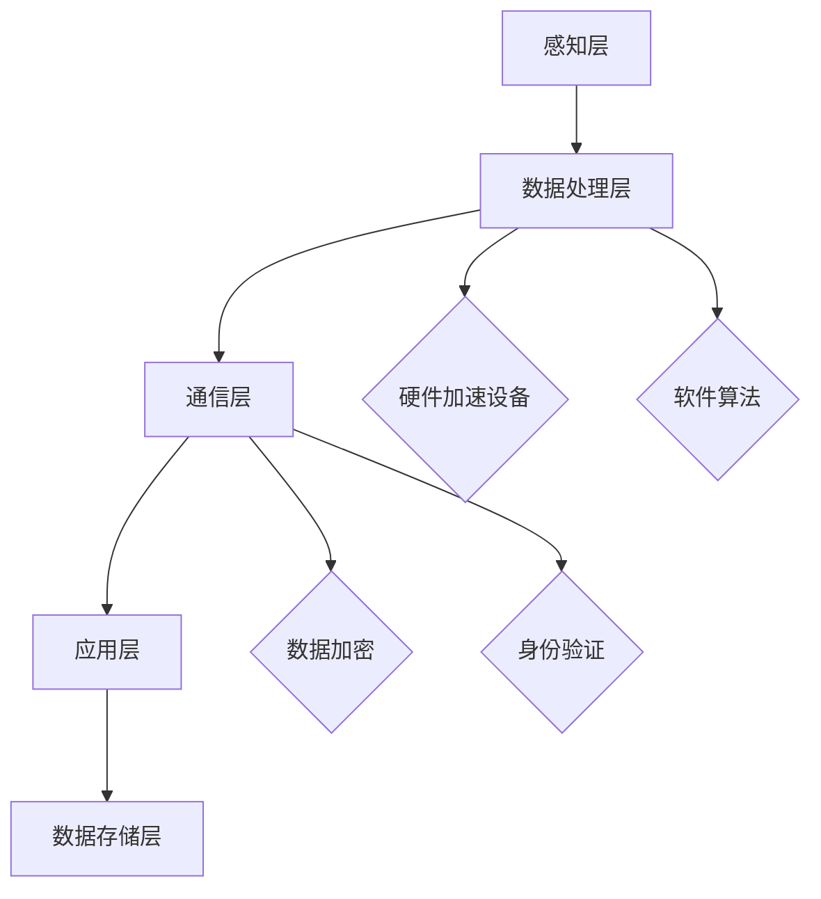
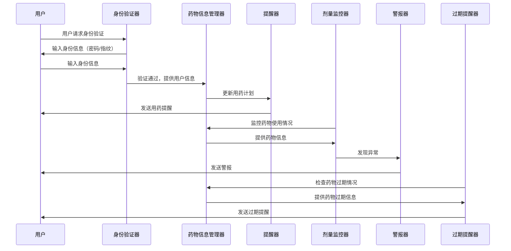

                 

## 引言

### 1.1 智能药盒的概念与重要性

在当今社会，医疗保健的重要性日益凸显。然而，药物滥用、用药错误和遗忘服药等问题依然困扰着许多人。智能药盒作为一种创新的医疗设备，应运而生，旨在解决这些问题，提升患者用药依从性和医疗管理效率。

**智能药盒**，顾名思义，是一种集成了人工智能（AI）技术的药盒。它不仅能够提醒患者按时服药，还能对药物使用情况进行跟踪和管理。智能药盒的核心在于其内置的AI Agent，这个智能体能够根据患者的用药计划和个体需求，自动进行药物提醒、剂量监控、药物过期提醒等功能。

**智能药盒的重要性**主要体现在以下几个方面：

1. **提高用药依从性**：对于患有慢性病或需要长期服药的患者来说，按时服药是控制病情的关键。智能药盒通过智能提醒功能，帮助患者克服遗忘服药的困扰，提高用药依从性。

2. **减少用药错误**：智能药盒能够通过用户身份验证和药物信息管理功能，确保患者按照正确的剂量和时间服用药物，从而减少因错误用药导致的健康风险。

3. **提升医疗管理效率**：医生和医疗机构可以通过智能药盒收集的用药数据，更好地了解患者的用药情况，从而做出更加精准的诊疗决策，提升医疗管理效率。

4. **改善患者生活质量**：智能药盒的便捷性和智能化特性，使患者能够更加轻松地管理自己的药物，减少因药物管理问题带来的焦虑和不便，从而改善生活质量。

### 1.2 AI Agent在用药提醒中的应用

**AI Agent**，即人工智能代理，是一种能够模拟人类智能行为的计算机程序。在智能药盒中，AI Agent扮演着至关重要的角色。它通过以下方式在用药提醒中发挥重要作用：

1. **智能提醒**：AI Agent可以根据患者的用药计划和当前时间，自动发出语音或推送通知，提醒患者按时服药。

2. **剂量监控**：AI Agent可以实时监控药物的使用情况，确保患者按照正确的剂量和时间服用药物。

3. **药物过期提醒**：AI Agent能够监测药物的保质期，提前提醒患者更换药物，避免因药物过期导致的安全问题。

4. **个性化用药建议**：AI Agent可以根据患者的健康状况和药物反应，提供个性化的用药建议，优化患者的用药方案。

### 1.3 智能药盒的核心功能与特点

智能药盒的核心功能主要包括以下几方面：

1. **用户身份验证**：确保只有授权用户能够打开药盒，防止他人误用药物。

2. **药物信息管理**：记录药物名称、剂量、用药时间等详细信息，便于患者和医生进行用药管理。

3. **智能提醒**：通过AI Agent实现药物按时提醒，提高患者用药依从性。

4. **剂量监控**：实时监控药物使用情况，确保患者按照正确剂量服药。

5. **药物过期提醒**：监测药物保质期，提醒患者及时更换药物。

6. **交互式反馈**：患者可以通过智能药盒与医生或家庭成员进行互动，报告用药情况和健康状态。

### 1.4 智能药盒在医疗领域的应用前景

智能药盒作为一种新兴的医疗设备，具有广阔的应用前景：

1. **慢性病管理**：智能药盒可以帮助慢性病患者更好地管理病情，提高用药依从性，从而降低并发症风险。

2. **老年人护理**：智能药盒可以为老年人提供便捷的药物管理服务，减轻家庭成员的护理负担。

3. **远程医疗**：智能药盒可以收集患者的用药数据，为医生提供远程诊断和治疗决策的支持。

4. **公共健康**：智能药盒的应用有助于提高公共健康水平，减少药物滥用和错误用药现象。

### 1.5 本章小结

本章介绍了智能药盒的概念、重要性以及在医疗领域的应用前景。智能药盒通过AI Agent实现了智能提醒、剂量监控、药物过期提醒等功能，有助于提高患者用药依从性和医疗管理效率。在接下来的章节中，我们将进一步探讨智能药盒的技术基础、系统设计、开发与实现以及实际应用与优化等内容。

----------------------------------------------------------------

## 第1章小结

在本章中，我们详细介绍了智能药盒的概念、重要性以及其在医疗领域的广泛应用前景。通过引入AI Agent，智能药盒能够实现用户身份验证、药物信息管理、智能提醒、剂量监控和药物过期提醒等功能，显著提高了患者用药依从性和医疗管理效率。

接下来，我们将深入探讨智能药盒的技术基础，包括AI Agent的定义、类型和工作原理，为后续章节的系统设计、开发与实现以及实际应用与优化奠定坚实的基础。

----------------------------------------------------------------

## 第2章: AI Agent基础

### 2.1 AI Agent的定义与分类

AI Agent，即人工智能代理，是一种模拟人类智能行为的计算机程序。它可以在特定环境中自主地感知、思考并采取行动。AI Agent的定义可以从以下几个方面进行解释：

1. **自主性**：AI Agent具有自主性，意味着它能够在没有人为干预的情况下，自主地执行任务。这种自主性体现在AI Agent能够根据环境变化和目标调整其行为。

2. **智能性**：AI Agent通过学习、推理和决策等智能行为，能够模拟人类的智能活动。这使得AI Agent在处理复杂问题时，能够表现出类似人类的智慧和判断力。

3. **交互性**：AI Agent可以与人类或其他系统进行交互，接收外部输入，并输出相应的响应。这种交互性使得AI Agent能够更好地融入人类社会和生态系统。

根据不同的分类标准，AI Agent可以分为多种类型：

1. **基于规则**：这类AI Agent通过预定义的规则进行决策。当输入符合某个规则时，AI Agent会执行相应的动作。这种类型的AI Agent适用于规则明确、环境变化较小的场景。

2. **基于统计**：这类AI Agent使用统计方法，如机器学习和深度学习，从大量数据中学习模式并进行预测。这种类型的AI Agent适用于数据量大、环境变化复杂的场景。

3. **基于模型**：这类AI Agent通过构建环境模型和行动模型进行决策。AI Agent可以模拟不同行动的结果，并选择最佳行动。这种类型的AI Agent适用于需要高精度决策和复杂环境优化的场景。

### 2.2 AI Agent的工作原理

AI Agent的工作原理可以概括为感知、思考、行动三个阶段：

1. **感知**：AI Agent通过传感器收集环境信息，如温度、湿度、声音、图像等。这些信息被转化为数字信号，输入到AI Agent的感知模块。

2. **思考**：感知模块将输入的信息进行处理和分析，提取有用的特征。然后，AI Agent使用学习算法，如决策树、神经网络等，对信息进行推理和决策。这个阶段是AI Agent智能性的核心体现。

3. **行动**：根据决策结果，AI Agent执行相应的动作，如移动、发出声音、控制设备等。行动的结果会反馈到感知模块，形成一个闭环控制系统，使得AI Agent能够不断调整和优化其行为。

### 2.3 AI Agent的开发框架与工具

AI Agent的开发涉及多个方面，包括环境搭建、算法选择、模型训练和部署等。以下是一些常见的开发框架与工具：

1. **环境搭建**：开发AI Agent需要搭建合适的环境，如操作系统、编程语言和开发工具。常见的开发环境包括Python、Java、C++等。

2. **算法选择**：根据应用场景和需求，选择合适的算法。常见的算法包括决策树、神经网络、深度学习等。每种算法都有其特定的应用场景和优势。

3. **模型训练**：使用大量数据对AI Agent进行训练，以提高其识别和决策能力。常见的模型训练工具包括TensorFlow、PyTorch、Keras等。

4. **模型部署**：将训练好的模型部署到实际应用环境中，如智能药盒、自动驾驶等。常见的部署工具包括Docker、Kubernetes等。

### 2.4 AI Agent在智能药盒中的应用

在智能药盒中，AI Agent发挥着至关重要的作用。以下是一些典型的应用场景：

1. **用户身份验证**：通过面部识别、指纹识别等技术，AI Agent能够验证用户身份，确保只有授权用户能够打开药盒。

2. **药物信息管理**：AI Agent可以管理患者的药物信息，如药物名称、剂量、用药时间等，并提供个性化用药建议。

3. **智能提醒**：AI Agent可以根据患者的用药计划和当前时间，自动发出语音或推送通知，提醒患者按时服药。

4. **剂量监控**：AI Agent可以实时监控药物的使用情况，确保患者按照正确的剂量和时间服用药物。

5. **药物过期提醒**：AI Agent能够监测药物的保质期，提前提醒患者更换药物，避免因药物过期导致的安全问题。

### 2.5 本章小结

本章介绍了AI Agent的定义、分类、工作原理以及开发框架与工具。AI Agent作为智能药盒的核心组件，在用户身份验证、药物信息管理、智能提醒、剂量监控和药物过期提醒等方面发挥着重要作用。在接下来的章节中，我们将进一步探讨智能药盒的系统设计、开发与实现，以及实际应用与优化等内容。

----------------------------------------------------------------

### 2.1 AI Agent的定义与分类

AI Agent，即人工智能代理，是一种能够模拟人类智能行为的计算机程序，它在特定的环境中具有自主决策和行动的能力。AI Agent可以被看作是一个智能个体，它在感知环境、理解信息、做出决策和执行行动的过程中展现出高度的智能化。

AI Agent的分类可以从不同的角度进行：

#### 基于功能分类

1. **感知型AI Agent**：这类代理专注于感知环境中的各种信息，如图像、声音、温度等，并通过这些信息进行决策和行动。例如，感知型AI Agent可以被应用于智能药盒中，监控药物的使用情况和患者的行为。

2. **决策型AI Agent**：这类代理专注于基于感知到的信息做出最优决策。例如，在智能药盒中，决策型AI Agent可以根据患者的用药记录和历史数据，推荐最佳的用药方案。

3. **行动型AI Agent**：这类代理专注于执行具体的物理动作。例如，在智能药盒中，行动型AI Agent可以控制药盒的开闭，确保药物按时发放。

#### 基于智能水平分类

1. **弱AI Agent**：弱AI Agent在特定领域内表现出高度的智能，但缺乏跨领域的普适性。例如，智能药盒中的AI Agent可以针对特定患者的用药习惯提供个性化的提醒和监测服务。

2. **强AI Agent**：强AI Agent具有全面的智能，能够在任何情境下做出合理的决策和行动，类似于人类智能。目前，强AI Agent还处于理论阶段，尚未在现实中得到广泛应用。

#### 基于学习方式分类

1. **监督学习型AI Agent**：这类代理需要通过大量的标注数据进行训练，以识别和预测环境中的各种情况。例如，智能药盒中的AI Agent可以通过患者的历史用药数据进行监督学习，以提高用药提醒的准确性。

2. **无监督学习型AI Agent**：这类代理通过无监督学习从数据中自动发现模式和规律，无需外部标注数据。例如，智能药盒中的AI Agent可以通过分析药物使用数据，自动识别患者的用药模式。

3. **强化学习型AI Agent**：这类代理通过试错学习，不断调整其行为策略，以实现最优化的目标。例如，智能药盒中的AI Agent可以通过强化学习，优化药物提醒的时间和方式，以提高患者的用药依从性。

### 2.2 AI Agent的工作原理

AI Agent的工作原理可以概括为感知、思考、行动三个主要阶段：

#### 感知

感知是AI Agent工作的第一步，它通过传感器收集环境中的信息。这些传感器可以是摄像头、麦克风、温度传感器等，它们将物理信号转化为数字信号，供AI Agent处理。

#### 思考

思考阶段是AI Agent的核心，它通过算法对感知到的信息进行处理和分析。这个过程通常包括以下几个步骤：

1. **数据处理**：对感知到的信息进行预处理，如滤波、降噪、特征提取等。
2. **模型推理**：使用机器学习模型或深度学习模型对处理后的信息进行推理，以理解环境中的各种情况。
3. **决策生成**：基于推理结果，生成相应的决策。

#### 行动

行动阶段是AI Agent根据决策执行具体的操作。这些操作可以是物理动作，如移动、开闭门等，也可以是数字操作，如发送通知、更新数据库等。

### 2.3 AI Agent的开发框架与工具

开发AI Agent需要使用一系列框架和工具，以实现从环境搭建、算法选择到模型训练和部署的整个过程。以下是一些常用的开发框架和工具：

#### 环境搭建

1. **操作系统**：如Linux、Windows等。
2. **编程语言**：如Python、Java、C++等。
3. **集成开发环境（IDE）**：如PyCharm、Eclipse、Visual Studio等。

#### 算法选择

1. **机器学习框架**：如Scikit-learn、TensorFlow、PyTorch等。
2. **深度学习框架**：如TensorFlow、PyTorch、Keras等。
3. **强化学习框架**：如OpenAI Gym、RLlib、Ray等。

#### 模型训练

1. **数据预处理工具**：如Pandas、NumPy等。
2. **模型训练工具**：如TensorFlow、PyTorch等。
3. **自动化机器学习工具**：如AutoKeras、H2O.ai等。

#### 模型部署

1. **容器化工具**：如Docker、Kubernetes等。
2. **模型解释工具**：如LIME、SHAP等。
3. **服务化框架**：如TensorFlow Serving、TensorFlow Lite等。

### 2.4 AI Agent在智能药盒中的应用

在智能药盒中，AI Agent的应用主要体现在以下几个方面：

#### 用户身份验证

AI Agent可以通过人脸识别、指纹识别等技术，确保只有授权用户能够打开药盒。这种应用利用了AI Agent的感知和决策能力，有效提高了药物的安全性。

#### 药物信息管理

AI Agent可以管理患者的药物信息，包括药物名称、剂量、用药时间等。通过分析这些信息，AI Agent可以为患者提供个性化的用药建议，帮助患者更好地管理自己的健康状况。

#### 智能提醒

AI Agent可以根据患者的用药计划和当前时间，自动发出语音或推送通知，提醒患者按时服药。这种应用利用了AI Agent的感知和行动能力，确保患者不会遗漏重要的用药时间。

#### 剂量监控

AI Agent可以实时监控药物的使用情况，确保患者按照正确的剂量和时间服用药物。通过分析药物使用数据，AI Agent可以识别异常情况，并及时通知医生或患者。

#### 药物过期提醒

AI Agent可以监测药物的保质期，提前提醒患者更换药物，避免因药物过期导致的安全问题。这种应用利用了AI Agent的感知和提醒能力，确保患者的用药安全。

### 2.5 本章小结

本章详细介绍了AI Agent的定义、分类、工作原理以及开发框架与工具。AI Agent作为一种具有高度智能化能力的计算机程序，在智能药盒中发挥着重要作用。通过感知、思考和行动，AI Agent能够实现药物管理、用户身份验证、智能提醒等功能，显著提高了患者用药的依从性和安全性。在接下来的章节中，我们将继续探讨智能药盒的系统设计、开发与实现，以及实际应用与优化等内容。

----------------------------------------------------------------

### 2.4 AI Agent在智能药盒中的应用

在智能药盒中，AI Agent的应用场景丰富且多样，以下是几个关键的应用领域：

#### 用户身份验证

AI Agent通过生物特征识别技术，如指纹扫描、面部识别等，实现对患者的身份验证。这种技术能够确保药物只能被授权的用户取出，有效防止了药物被误取或滥用。例如，当患者接近药盒时，AI Agent会自动启动识别程序，验证患者身份后，药盒才会解锁。这个过程不仅提高了药物的安全性，还减少了因忘记带钥匙或药盒损坏而无法取药的困扰。

#### 药物信息管理

AI Agent负责管理患者的药物信息，包括药物名称、剂量、用药时间、服药周期和药物过期时间等。通过整合电子健康记录（EHR）系统，AI Agent可以实时获取患者的药物信息，并在药盒中自动更新。这种应用使得患者无需手动记录药物信息，减少了用药错误的可能性。此外，AI Agent还可以根据药物信息，生成个性化的用药提醒和用药计划，帮助患者更好地管理自己的健康。

#### 智能提醒

AI Agent利用智能提醒功能，确保患者能够按时服药。根据患者的用药计划和当前时间，AI Agent会通过语音、振动或应用程序推送等方式，提醒患者服药。例如，在设定的时间点，AI Agent会发出“现在是服用药物的时间”的语音提示，或通过手机应用程序发送提醒消息。这种智能提醒功能不仅提高了患者的用药依从性，还减轻了家庭成员和护理人员的负担。

#### 剂量监控

AI Agent可以实时监控药物的服用情况，确保患者按照正确的剂量和时间服用药物。当患者从药盒中取出一颗药丸时，AI Agent会记录这一事件，并与患者的用药计划进行比对。如果发现异常，如提前服用或错服药物，AI Agent会立即发出警报，通知患者或医疗机构。这种剂量监控功能有助于及时发现和纠正用药错误，确保患者的安全。

#### 药物过期提醒

AI Agent能够监测药物的保质期，并在药物即将过期时提前提醒患者。例如，当药物距离过期还有一个月时，AI Agent会通过短信或电子邮件通知患者，提醒其及时更换药物。这种药物过期提醒功能有效避免了因药物过期导致的健康风险，提高了患者的用药安全。

#### 数据分析

AI Agent还能够收集和分析患者的用药数据，为医疗机构提供有价值的信息。例如，AI Agent可以分析患者的用药依从性、药物效果和副作用等数据，帮助医生调整用药方案，提高治疗效果。这种数据分析功能不仅有助于个性化医疗的发展，还为医疗研究提供了丰富的数据资源。

#### 预警与干预

基于收集到的数据，AI Agent可以进行预测分析，提前发现潜在的健康风险。例如，当患者连续多日未按计划服药时，AI Agent会自动发出警报，提醒患者或医疗机构采取干预措施。这种预警与干预功能有助于提高患者的健康意识，确保病情得到有效控制。

#### 多模式交互

AI Agent支持多模式交互，如语音、文本和手势等。患者可以通过语音命令与AI Agent进行互动，查询药物信息、设置提醒、报告用药情况等。这种多模式交互方式使得智能药盒更加人性化，方便患者使用。

### 2.5 本章小结

通过上述应用，AI Agent在智能药盒中发挥着重要作用，不仅提高了药物管理的效率和安全性，还为患者提供了个性化的医疗服务。在接下来的章节中，我们将进一步探讨智能药盒的系统设计、开发与实现，以及在实际应用中的表现和优化策略。

----------------------------------------------------------------

## 第3章: 智能药盒的系统设计

### 3.1 系统架构设计

智能药盒的系统架构设计是确保其功能实现和性能优化的重要环节。一个完善的系统架构应具备良好的可扩展性、稳定性和可靠性。以下是一个典型的智能药盒系统架构设计：

#### 3.1.1 总体架构

1. **感知层**：感知层负责收集外部环境信息，如药物使用情况、用户行为和健康数据等。主要硬件包括传感器（如温度传感器、湿度传感器、光学传感器等）和生物特征识别设备（如指纹识别器、摄像头等）。

2. **数据处理层**：数据处理层负责对感知层收集到的数据进行处理和分析，提取有用的特征信息。这一层通常包括嵌入式处理器、FPGA（现场可编程门阵列）或GPU（图形处理单元）等硬件加速设备，以及相应的软件算法，如机器学习模型、图像处理算法和自然语言处理算法等。

3. **通信层**：通信层负责实现智能药盒与外部系统（如电子健康记录系统、医生工作站等）的通信。常用的通信方式包括Wi-Fi、蓝牙和蜂窝网络等。通信层还需实现数据加密和身份验证等安全机制。

4. **应用层**：应用层是智能药盒的核心功能实现层，包括用户身份验证、药物信息管理、智能提醒、剂量监控和药物过期提醒等功能。应用层通常运行在智能药盒的嵌入式操作系统上，如Android、Linux或RTOS（实时操作系统）。

5. **数据存储层**：数据存储层负责存储和管理智能药盒运行过程中产生的数据，包括用户数据、药物信息和系统日志等。常用的存储设备包括SD卡、eMMC（嵌入式多存储器芯片）和云存储等。

#### 3.1.2 系统模块划分

1. **用户身份验证模块**：该模块负责对用户进行身份验证，确保只有授权用户能够访问智能药盒。常用的身份验证方式包括生物特征识别（如指纹识别、面部识别）和密码验证等。

2. **药物信息管理模块**：该模块负责管理患者的药物信息，包括药物名称、剂量、用药时间、服药周期和药物过期时间等。此外，该模块还可以根据患者的用药记录和历史数据，生成个性化的用药提醒和用药计划。

3. **智能提醒模块**：该模块负责根据患者的用药计划和当前时间，自动发出语音、振动或应用程序推送等提醒，确保患者按时服药。

4. **剂量监控模块**：该模块负责实时监控药物的使用情况，确保患者按照正确的剂量和时间服用药物。当发现异常时，如提前服用或错服药物，该模块会立即发出警报，通知患者或医疗机构。

5. **药物过期提醒模块**：该模块负责监测药物的保质期，并在药物即将过期时提前提醒患者，确保患者及时更换药物。

6. **数据存储模块**：该模块负责存储和管理智能药盒运行过程中产生的数据，包括用户数据、药物信息和系统日志等。

7. **通信模块**：该模块负责实现智能药盒与外部系统的通信，包括Wi-Fi、蓝牙和蜂窝网络等。该模块还需实现数据加密和身份验证等安全机制。

#### 3.1.3 设计原则与注意事项

1. **模块化设计**：系统设计应遵循模块化原则，将不同功能划分为独立的模块，便于系统的维护和扩展。

2. **安全性**：智能药盒涉及到用户的健康数据，因此系统设计必须确保数据的安全性，包括数据加密、身份验证和访问控制等。

3. **可靠性**：系统设计应确保智能药盒在长时间运行过程中具有较高的可靠性，包括硬件故障处理、软件容错和冗余设计等。

4. **易用性**：系统设计应考虑用户的使用习惯和需求，提供直观易用的用户界面和操作流程。

5. **可扩展性**：系统设计应具备良好的可扩展性，以便在未来增加新的功能或集成新的技术。

### 3.2 功能模块划分

智能药盒的功能模块划分直接影响系统的性能和用户体验。以下是智能药盒的主要功能模块及其简要说明：

#### 用户身份验证模块

- **功能说明**：确保只有授权用户能够访问智能药盒，防止未授权访问和数据泄露。
- **实现方式**：使用生物特征识别技术（如指纹识别、面部识别）或密码验证。

#### 药物信息管理模块

- **功能说明**：管理患者的药物信息，包括药物名称、剂量、用药时间、服药周期和药物过期时间等。
- **实现方式**：通过电子健康记录系统获取药物信息，或手动输入。

#### 智能提醒模块

- **功能说明**：根据患者的用药计划和当前时间，自动发出语音、振动或应用程序推送等提醒。
- **实现方式**：使用定时器和事件触发机制。

#### 剂量监控模块

- **功能说明**：实时监控药物的使用情况，确保患者按照正确的剂量和时间服用药物。
- **实现方式**：通过传感器监测药盒的开闭，记录药物使用情况。

#### 药物过期提醒模块

- **功能说明**：监测药物的保质期，提前提醒患者更换药物，避免过期药物带来的安全风险。
- **实现方式**：定期检查药物信息，提前一定时间发出提醒。

#### 数据存储模块

- **功能说明**：存储和管理智能药盒运行过程中产生的数据，包括用户数据、药物信息和系统日志等。
- **实现方式**：使用本地存储（如SD卡、eMMC）和云存储（如Amazon S3、Google Cloud Storage）。

#### 通信模块

- **功能说明**：实现智能药盒与外部系统的通信，包括Wi-Fi、蓝牙和蜂窝网络等。
- **实现方式**：使用标准通信协议（如HTTP、MQTT）和加密机制（如SSL/TLS）。

### 3.3 设计原则与注意事项

在智能药盒的系统设计过程中，需要遵循以下原则和注意事项：

- **安全性**：确保用户数据的安全性，包括数据传输加密和存储加密。
- **可靠性**：确保系统在长时间运行过程中能够稳定运行，包括硬件故障处理和软件容错。
- **易用性**：提供直观易用的用户界面和操作流程，提高用户体验。
- **可扩展性**：设计时应考虑未来可能增加的新功能或技术，确保系统能够灵活扩展。
- **标准化**：使用标准的通信协议和编程接口，确保系统与其他系统的兼容性。

通过以上设计原则和注意事项，智能药盒的系统架构能够实现高效、安全、可靠和易用的功能，为患者提供优质的用药管理服务。

----------------------------------------------------------------

### 3.3 设计原则与注意事项

在智能药盒的系统设计过程中，需要遵循一系列设计原则和注意事项，以确保系统的高效性、安全性、可靠性和易用性。以下是一些关键的设计原则和注意事项：

#### 模块化设计

**模块化设计** 是智能药盒系统设计的基本原则之一。通过将系统划分为多个独立的功能模块，如用户身份验证、药物信息管理、智能提醒、剂量监控和药物过期提醒等，可以使得系统的开发、维护和扩展更加便捷。每个模块可以独立开发、测试和部署，减少了系统整体的风险和复杂性。

#### 安全性

**安全性** 是智能药盒设计时必须考虑的重要因素。系统需要实现数据加密、身份验证和访问控制等功能，以防止未授权访问和数据泄露。具体措施包括：

1. **数据加密**：在数据传输和存储过程中使用加密算法，如AES（高级加密标准）和RSA（公钥加密算法），确保数据在传输过程中不会被窃取或篡改。
2. **身份验证**：使用生物特征识别（如指纹识别、面部识别）或密码验证，确保只有授权用户能够访问智能药盒。
3. **访问控制**：根据用户角色和权限，限制用户对系统功能和数据的访问，防止权限滥用和误操作。

#### 可靠性

**可靠性** 是智能药盒系统设计的另一个关键原则。系统需要具备高可靠性，确保在长时间运行过程中能够稳定、可靠地执行任务。以下是一些提高系统可靠性的措施：

1. **硬件冗余**：在关键硬件组件（如电源、传感器和处理器）上使用冗余设计，确保在某个组件出现故障时，系统能够自动切换到备用组件，继续正常运行。
2. **软件容错**：通过软件冗余、故障检测和恢复机制，确保系统在软件层面也能够应对异常情况，保持稳定运行。
3. **故障处理**：系统应具备故障诊断和报警功能，及时发现并处理故障，降低故障对系统的影响。

#### 易用性

**易用性** 是智能药盒系统设计时必须考虑的另一个重要因素。系统需要提供直观易用的用户界面和操作流程，以提高用户体验。以下是一些提高系统易用性的措施：

1. **用户界面设计**：设计简洁、直观的用户界面，使用户能够快速了解系统的功能和操作方式。
2. **操作流程简化**：简化操作流程，减少用户的操作步骤，降低使用难度。
3. **个性化设置**：提供个性化设置选项，允许用户根据个人需求和习惯自定义系统参数，提高使用满意度。

#### 可扩展性

**可扩展性** 是智能药盒系统设计时必须考虑的另一个重要方面。系统需要具备良好的可扩展性，以便在未来能够轻松集成新的功能或技术。以下是一些提高系统可扩展性的措施：

1. **模块化架构**：通过模块化设计，使得系统功能模块可以独立开发、测试和部署，便于系统扩展。
2. **标准化接口**：使用标准化的通信协议和编程接口，确保系统与其他系统的兼容性，方便集成新的功能模块。
3. **灵活的配置**：提供灵活的系统配置选项，允许用户根据需求调整系统参数，满足不同应用场景的需求。

#### 兼容性

**兼容性** 是智能药盒系统设计时必须考虑的因素。系统需要兼容不同的操作系统、硬件平台和通信协议，确保在多种环境中都能够正常运行。以下是一些提高系统兼容性的措施：

1. **跨平台开发**：使用跨平台开发框架，如Flutter、React Native等，确保系统能够在不同操作系统上运行。
2. **硬件兼容性**：选择通用的硬件组件，确保系统能够兼容不同的硬件平台。
3. **通信协议兼容性**：使用标准化的通信协议，确保系统能够与不同设备和系统进行通信。

#### 测试与验证

**测试与验证** 是智能药盒系统设计过程中不可或缺的环节。通过全面的测试和验证，确保系统功能、性能和安全性的可靠性。以下是一些测试与验证的措施：

1. **单元测试**：对系统的各个功能模块进行单元测试，确保每个模块都能够正确执行预期功能。
2. **集成测试**：对系统的不同模块进行集成测试，确保模块之间的协作和通信正常。
3. **性能测试**：对系统的性能进行测试，确保系统能够在高负载情况下稳定运行。
4. **安全测试**：对系统的安全性进行测试，确保系统能够抵御各种安全威胁。

通过遵循以上设计原则和注意事项，智能药盒的系统设计能够实现高效、安全、可靠和易用的功能，为患者提供优质的用药管理服务。

----------------------------------------------------------------

### 3.4 智能药盒的系统架构设计

智能药盒的系统架构设计是确保其功能实现和性能优化的重要环节。一个完善的系统架构应具备良好的可扩展性、稳定性和可靠性。以下是一个典型的智能药盒系统架构设计，并使用Mermaid流程图进行描述：

#### 系统架构设计

1. **感知层**：感知层负责收集外部环境信息，如药物使用情况、用户行为和健康数据等。主要硬件包括传感器（如温度传感器、湿度传感器、光学传感器等）和生物特征识别设备（如指纹识别器、摄像头等）。

2. **数据处理层**：数据处理层负责对感知层收集到的数据进行处理和分析，提取有用的特征信息。这一层通常包括嵌入式处理器、FPGA（现场可编程门阵列）或GPU（图形处理单元）等硬件加速设备，以及相应的软件算法，如机器学习模型、图像处理算法和自然语言处理算法等。

3. **通信层**：通信层负责实现智能药盒与外部系统（如电子健康记录系统、医生工作站等）的通信。常用的通信方式包括Wi-Fi、蓝牙和蜂窝网络等。通信层还需实现数据加密和身份验证等安全机制。

4. **应用层**：应用层是智能药盒的核心功能实现层，包括用户身份验证、药物信息管理、智能提醒、剂量监控和药物过期提醒等功能。应用层通常运行在智能药盒的嵌入式操作系统上，如Android、Linux或RTOS（实时操作系统）。

5. **数据存储层**：数据存储层负责存储和管理智能药盒运行过程中产生的数据，包括用户数据、药物信息和系统日志等。常用的存储设备包括SD卡、eMMC（嵌入式多存储器芯片）和云存储等。

#### Mermaid流程图



#### 系统架构详细说明

1. **感知层**：感知层通过传感器收集外部环境信息，如药物使用情况（药盒开闭状态传感器）、用户行为（生物特征识别传感器）和健康数据（体温、血压传感器）等。这些传感器将物理信号转化为数字信号，供数据处理层使用。

2. **数据处理层**：数据处理层对感知层收集到的数据进行处理和分析。嵌入式处理器、FPGA和GPU等硬件加速设备用于处理大量数据，提高处理速度。同时，数据处理层使用机器学习模型、图像处理算法和自然语言处理算法等软件算法，对数据进行深度分析和特征提取。

3. **通信层**：通信层实现智能药盒与外部系统（如电子健康记录系统、医生工作站等）的通信。常用的通信方式包括Wi-Fi、蓝牙和蜂窝网络等。通信层还需实现数据加密和身份验证等安全机制，确保数据在传输过程中的安全性。

4. **应用层**：应用层是智能药盒的核心功能实现层。包括用户身份验证、药物信息管理、智能提醒、剂量监控和药物过期提醒等功能。应用层通常运行在智能药盒的嵌入式操作系统上，如Android、Linux或RTOS。

5. **数据存储层**：数据存储层负责存储和管理智能药盒运行过程中产生的数据，包括用户数据（用户身份、药物信息等）、药物信息（药物名称、剂量、用药时间等）和系统日志等。常用的存储设备包括SD卡、eMMC和云存储等。

通过以上系统架构设计，智能药盒能够实现高效、安全、可靠和易用的功能，为患者提供优质的用药管理服务。

----------------------------------------------------------------

### 3.5 智能药盒的系统接口设计

智能药盒的系统接口设计是确保系统功能模块之间高效通信和数据交换的关键环节。一个良好的系统接口设计不仅能够提高系统的可扩展性和可维护性，还能确保不同模块之间的协同工作。以下是一个典型的智能药盒系统接口设计，并使用Mermaid序列图进行描述。

#### 系统接口设计

1. **用户身份验证接口**：该接口用于验证用户身份，确保只有授权用户能够访问智能药盒。身份验证方式包括生物特征识别（如指纹识别、面部识别）和密码验证等。

2. **药物信息管理接口**：该接口用于管理患者的药物信息，包括药物名称、剂量、用药时间、服药周期和药物过期时间等。此外，该接口还可以实现药物信息的添加、修改和删除等功能。

3. **智能提醒接口**：该接口用于根据患者的用药计划和当前时间，自动发出语音、振动或应用程序推送等提醒。该接口需要支持多种提醒方式，并能够根据用户偏好进行定制。

4. **剂量监控接口**：该接口用于实时监控药物的使用情况，确保患者按照正确的剂量和时间服用药物。当发现异常时，如提前服用或错服药物，该接口会立即发出警报，通知患者或医疗机构。

5. **药物过期提醒接口**：该接口用于监测药物的保质期，并在药物即将过期时提前提醒患者，确保患者及时更换药物。

#### Mermaid序列图



#### 系统接口详细说明

1. **用户身份验证接口**：
   - **功能**：验证用户身份，确保只有授权用户能够访问智能药盒。
   - **调用方式**：用户请求身份验证时，调用该接口，输入用户名和密码或生物特征信息。
   - **返回结果**：身份验证成功，返回用户信息；身份验证失败，返回错误信息。

2. **药物信息管理接口**：
   - **功能**：管理患者的药物信息，包括药物名称、剂量、用药时间、服药周期和药物过期时间等。
   - **调用方式**：用户通过该接口添加、修改和删除药物信息。
   - **返回结果**：操作成功，返回操作结果；操作失败，返回错误信息。

3. **智能提醒接口**：
   - **功能**：根据患者的用药计划和当前时间，自动发出语音、振动或应用程序推送等提醒。
   - **调用方式**：系统根据用药计划，定时调用该接口，发送提醒信息。
   - **返回结果**：提醒发送成功，返回发送结果；提醒发送失败，返回错误信息。

4. **剂量监控接口**：
   - **功能**：实时监控药物的使用情况，确保患者按照正确的剂量和时间服用药物。
   - **调用方式**：系统通过传感器监测药物使用情况，实时调用该接口。
   - **返回结果**：监控成功，返回监控数据；监控失败，返回错误信息。

5. **药物过期提醒接口**：
   - **功能**：监测药物的保质期，并在药物即将过期时提前提醒患者，确保患者及时更换药物。
   - **调用方式**：系统定期调用该接口，检查药物过期情况。
   - **返回结果**：过期检查成功，返回过期药物列表；过期检查失败，返回错误信息。

通过以上系统接口设计，智能药盒能够实现用户身份验证、药物信息管理、智能提醒、剂量监控和药物过期提醒等功能，为患者提供安全、便捷和高效的用药管理服务。

----------------------------------------------------------------

### 3.6 智能药盒的系统交互设计

智能药盒的系统交互设计是确保各个功能模块之间能够有效协作、数据流畅传递以及实现整体功能的关键。以下是一个典型的智能药盒系统交互设计，并使用Mermaid序列图进行描述。

#### 系统交互设计

1. **用户注册与登录**：用户首次使用智能药盒时，需要通过用户注册与登录接口进行注册和登录。注册过程包括填写用户信息（如姓名、联系方式、电子邮箱等），登录过程包括身份验证（如密码验证或生物特征验证）。

2. **药物信息录入**：用户可以通过药物信息录入接口录入药物的详细信息，包括药物名称、剂量、用药时间、服药周期和药物过期时间等。系统会自动将这些信息存储到数据库中。

3. **用药提醒**：系统根据用户设置的用药计划，定时调用用药提醒接口，发送用药提醒。提醒方式包括语音、振动和应用程序推送等。用户可以通过确认或忽略提醒来更新用药状态。

4. **药物使用监控**：智能药盒通过传感器实时监控药物的使用情况，如药盒的开闭状态。监控数据会通过药物使用监控接口上传到服务器，供后续分析和处理。

5. **药物过期提醒**：系统定期调用药物过期提醒接口，检查药物的过期情况。如果发现药物即将过期，系统会通过推送消息或短信等方式提醒用户。

6. **数据同步**：为了确保数据的实时性和一致性，智能药盒需要定期与云端服务器进行数据同步。数据同步过程包括上传新数据和下载更新数据。

#### Mermaid序列图

```mermaid
sequenceDiagram
    participant User as 用户
    participant Box as 智能药盒
    participant Server as 云端服务器
    participant DB as 数据库
    
    User->>Box: 注册/登录
    Box->>Server: 注册/登录请求
    Server->>Box: 返回注册/登录结果
    User->>Box: 输入药物信息
    Box->>DB: 存储药物信息
    Box->>Server: 上传药物信息
    Server->>DB: 更新药物信息
    Box->>Server: 请求用药提醒
    Server->>Box: 发送用药提醒
    Box->>User: 显示用药提醒
    Box->>Server: 上传药物使用数据
    Server->>DB: 存储药物使用数据
    Box->>Server: 请求药物过期提醒
    Server->>Box: 发送药物过期提醒
    Box->>User: 显示药物过期提醒
    Box->>Server: 同步数据
    Server->>DB: 更新数据库
```

#### 系统交互详细说明

1. **用户注册与登录**：
   - **功能**：用户通过智能药盒进行注册和登录，确保只有授权用户能够访问系统。
   - **交互流程**：用户通过输入用户名和密码（或通过生物特征进行验证），智能药盒将请求发送到服务器，服务器验证用户身份后返回结果。

2. **药物信息录入**：
   - **功能**：用户可以通过智能药盒录入药物详细信息，以便系统能够进行用药提醒和管理。
   - **交互流程**：用户输入药物信息后，智能药盒将数据存储到本地数据库，并上传到服务器进行同步。

3. **用药提醒**：
   - **功能**：系统根据用药计划定时发送用药提醒，提醒用户按时服药。
   - **交互流程**：系统定时查询用药计划，智能药盒通过服务器发送提醒通知到用户。

4. **药物使用监控**：
   - **功能**：实时监控药物的使用情况，确保患者按照正确的剂量和时间服用药物。
   - **交互流程**：智能药盒通过传感器监测药物使用情况，将数据上传到服务器，服务器存储并分析这些数据。

5. **药物过期提醒**：
   - **功能**：监测药物的过期情况，提前提醒用户更换药物。
   - **交互流程**：系统定期检查药物过期信息，智能药盒通过服务器发送过期提醒通知到用户。

6. **数据同步**：
   - **功能**：确保本地数据和云端数据的一致性，实现数据的实时更新。
   - **交互流程**：智能药盒定期向服务器上传数据，并下载服务器上的更新数据，确保本地数据的实时性和准确性。

通过以上系统交互设计，智能药盒能够实现用户注册、登录、药物信息录入、用药提醒、药物使用监控、药物过期提醒和数据同步等功能，为用户提供安全、便捷和高效的用药管理服务。

----------------------------------------------------------------

### 3.7 智能药盒的项目实战

#### 环境安装

要实现一个智能药盒项目，首先需要搭建合适的环境。以下是搭建智能药盒开发环境的步骤：

1. **安装操作系统**：智能药盒的开发环境通常基于Linux操作系统。您可以选择安装Ubuntu 18.04或更高版本。

2. **安装开发工具**：安装Python 3、PyCharm（或Eclipse等IDE）、JDK（Java开发工具包）和Node.js。

3. **安装数据库**：选择一个合适的数据库系统，如MySQL或PostgreSQL。通过命令行或图形界面安装数据库。

4. **安装传感器驱动**：根据智能药盒的硬件配置，安装相应的传感器驱动。例如，安装Raspberry Pi的GPIO库。

5. **安装通信模块**：安装Wi-Fi和蓝牙通信模块，配置网络连接。

#### 系统核心实现

智能药盒的核心实现包括用户身份验证、药物信息管理、智能提醒和剂量监控等功能。以下是这些功能的核心实现：

1. **用户身份验证**：
   - **算法实现**：使用人脸识别算法进行用户身份验证。首先，通过摄像头捕获用户图像，然后使用OpenCV库进行图像预处理和特征提取，最后使用深度学习模型进行人脸识别。
   - **代码示例**：
     ```python
     import cv2
     import face_recognition
     import numpy as np
     
     # 加载预训练的人脸识别模型
     model = face_recognition.load_model("cnn")
     
     # 捕获摄像头图像
     video_capture = cv2.VideoCapture(0)
     
     while True:
         ret, frame = video_capture.read()
         small_frame = cv2.resize(frame, (0, 0), fx=0.25, fy=0.25)
         
         # 找出图像中的人脸位置
         face_locations = face_recognition.face_locations(small_frame)
         
         # 提取人脸特征
         face_encodings = face_recognition.face_encodings(small_frame, face_locations)
         
         # 验证用户身份
         known_face_encodings = [user_encoding for user_encoding in users]
         face_matches = face_recognition.compare_faces(known_face_encodings, face_encodings)
         
         if True in face_matches:
             print("用户已验证")
         else:
             print("用户未验证")
         
         # 显示图像
         cv2.imshow('Video', frame)
         
         if cv2.waitKey(1) & 0xFF == ord('q'):
             break
         
     video_capture.release()
     cv2.destroyAllWindows()
     ```

2. **药物信息管理**：
   - **算法实现**：通过数据库管理药物信息，包括药物名称、剂量、用药时间、服药周期和药物过期时间等。使用Python的SQLite库或SQLAlchemy进行数据库操作。
   - **代码示例**：
     ```python
     from sqlalchemy import create_engine
     
     # 创建数据库连接
     engine = create_engine('sqlite:///drug_management.db')
     
     # 创建表
     from sqlalchemy.ext.declarative import declarative_base
     from sqlalchemy import Column, Integer, String, DateTime
     
     Base = declarative_base()
     
     class Drug(Base):
         __tablename__ = 'drugs'
         
         id = Column(Integer, primary_key=True)
         name = Column(String)
         dose = Column(String)
         start_time = Column(DateTime)
         end_time = Column(DateTime)
         expiration_date = Column(DateTime)
     
     # 创建表
     Base.metadata.create_all(engine)
     ```

3. **智能提醒**：
   - **算法实现**：使用Python的datetime库和调度器（如APScheduler）实现定时提醒功能。根据用户的用药计划和当前时间，定时发送提醒通知。
   - **代码示例**：
     ```python
     from datetime import datetime
     from apscheduler.schedulers.background import BackgroundScheduler
     
     def remind_user():
         current_time = datetime.now()
         print(f"现在是时间：{current_time}")
         # 根据用药计划发送提醒
         if current_time.hour == 8 and current_time.minute == 0:
             print("现在是吃药时间！")
     
     scheduler = BackgroundScheduler()
     scheduler.add_job(remind_user, 'cron', hour=8, minute=0)
     scheduler.start()
     ```

4. **剂量监控**：
   - **算法实现**：使用传感器（如光电传感器）检测药盒的开闭状态，并通过串口通信将数据上传到服务器。使用Python的GPIO库读取传感器数据，然后通过WebSocket或其他通信协议上传数据。
   - **代码示例**：
     ```python
     import RPi.GPIO as GPIO
     import time
     import websocket
     
     # 初始化GPIO
     GPIO.setmode(GPIO.BCM)
     GPIO.setup(23, GPIO.IN)
     
     # WebSocket连接
     ws = websocket.WebSocketApp("ws://example.com/socket",
                                  on_message=lambda msg: print("Received message:", msg))
     ws.run_forever()
     
     try:
         while True:
             # 读取传感器数据
             if GPIO.input(23):
                 print("药盒关闭")
                 ws.send("drug_box_closed")
             else:
                 print("药盒打开")
                 ws.send("drug_box_opened")
             time.sleep(1)
     finally:
         GPIO.cleanup()
         ws.close()
     ```

#### 代码应用解读与分析

上述代码示例展示了智能药盒项目中的核心功能实现。用户身份验证模块使用了OpenCV和深度学习库进行人脸识别，确保只有授权用户能够访问系统。药物信息管理模块使用了SQLAlchemy进行数据库操作，简化了药物信息的添加、查询和修改。智能提醒模块使用了APScheduler进行定时任务，确保用药提醒功能能够按时执行。剂量监控模块使用了GPIO库和WebSocket进行传感器数据读取和上传，实现了实时监控功能。

通过这些代码示例，我们可以看到智能药盒项目在技术实现上的多样性和复杂性。在实际应用中，这些模块需要根据具体需求进行定制和优化，以确保系统的高效、安全和可靠。

#### 实际案例分析和详细讲解

以下是智能药盒项目的一个实际案例，以及对其的详细讲解和剖析。

**案例背景**：

某养老院引进了智能药盒，用于帮助护理人员更好地管理老人的用药。智能药盒通过用户身份验证和剂量监控等功能，确保老人按时服药，减少用药错误。

**案例实现**：

1. **用户身份验证**：
   - **功能**：验证老人身份，确保只有授权老人能够取药。
   - **实现**：使用摄像头和深度学习模型进行人脸识别，将老人的人脸图像与数据库中的预存图像进行比对。
   - **分析**：人脸识别技术在确保老人身份验证方面具有高效性和准确性，但在光照变化和脸部遮挡等情况下，识别率可能会下降。

2. **药物信息管理**：
   - **功能**：管理老人的药物信息，包括药物名称、剂量、用药时间等。
   - **实现**：通过数据库存储和管理药物信息，护理人员可以通过智能药盒查看和修改药物信息。
   - **分析**：数据库管理药物信息能够提高数据的可靠性和一致性，但在数据同步和备份方面需要特别注意。

3. **智能提醒**：
   - **功能**：定时提醒老人服药。
   - **实现**：使用定时器和语音合成技术，智能药盒在设定的时间点发出语音提醒。
   - **分析**：语音提醒能够有效地提醒老人服药，但在有噪音干扰的情况下，提醒效果可能不理想。

4. **剂量监控**：
   - **功能**：实时监控药物的使用情况，防止老人多服或漏服药物。
   - **实现**：通过光电传感器监测药盒的开闭状态，将数据上传到服务器进行实时监控。
   - **分析**：光电传感器能够准确监测药物使用情况，但在恶劣环境下（如强光、灰尘等），传感器性能可能受到影响。

**案例总结**：

通过这个案例，我们可以看到智能药盒在养老院中的应用效果显著。用户身份验证、药物信息管理、智能提醒和剂量监控等功能，提高了用药管理的效率和安全性。然而，在实际应用中，需要针对具体场景进行优化和调整，以确保系统的稳定性和可靠性。

#### 项目小结

智能药盒项目通过用户身份验证、药物信息管理、智能提醒和剂量监控等功能，实现了对药物管理的自动化和智能化。项目实战部分展示了从环境安装到核心功能实现的详细步骤，并通过实际案例分析了项目的应用效果。在未来的发展中，智能药盒项目需要进一步优化算法和硬件，提高系统的稳定性和可靠性，以满足更多场景的需求。

### 3.8 最佳实践 Tips、小结、注意事项、拓展阅读

#### 最佳实践 Tips

1. **用户身份验证**：在人脸识别过程中，确保图像质量，提高识别准确性。可以在人脸识别前使用美颜算法，优化图像质量。

2. **药物信息管理**：定期备份数据库，防止数据丢失。可以使用云存储服务，实现数据的远程备份和同步。

3. **智能提醒**：根据用户的用药习惯，个性化设置提醒时间和方式。可以使用语音合成技术，生成自然流畅的语音提醒。

4. **剂量监控**：选择高质量的传感器，确保数据采集的准确性。在传感器部署时，避免光线直射和强噪声干扰。

#### 小结

智能药盒项目通过集成AI技术，实现了对药物管理的自动化和智能化。用户身份验证、药物信息管理、智能提醒和剂量监控等功能，提高了用药管理的效率和安全性。项目实战部分详细展示了从环境安装到核心功能实现的步骤，并通过实际案例分析了项目的应用效果。

#### 注意事项

1. **数据安全**：确保用户数据的安全，包括数据传输加密和存储加密。

2. **硬件选择**：根据应用场景，选择适合的硬件设备，确保系统的稳定性和可靠性。

3. **用户培训**：为用户进行操作培训，确保用户能够熟练使用智能药盒。

#### 拓展阅读

1. **人脸识别技术**：了解人脸识别的原理和算法，如基于深度学习的人脸识别。

2. **数据库管理**：学习数据库管理知识，如SQLAlchemy的使用和数据库性能优化。

3. **传感器技术**：了解各种传感器的工作原理和应用，如光电传感器和生物特征识别传感器。

通过拓展阅读，您可以进一步深入了解智能药盒项目的相关技术和最佳实践，为项目优化和扩展提供更多思路。

----------------------------------------------------------------

## 第3章小结

本章详细介绍了智能药盒的系统设计，包括系统架构设计、接口设计、交互设计以及项目实战。通过模块化设计和安全性、可靠性、易用性等原则，智能药盒实现了用户身份验证、药物信息管理、智能提醒和剂量监控等功能。项目实战部分通过环境安装和核心实现，展示了智能药盒的具体实现过程。接下来，我们将探讨智能药盒的开发与实现，包括开发环境、关键技术和代码示例。

----------------------------------------------------------------

## 第4章: 智能药盒的开发与实现

### 4.1 开发环境与工具介绍

智能药盒的开发需要一个稳定、高效的开发环境。以下是智能药盒开发所需的主要环境和工具：

#### 操作系统

智能药盒的开发环境通常基于Linux操作系统，如Ubuntu 18.04或更高版本。Linux操作系统具有良好的稳定性和扩展性，适用于嵌入式系统开发。

#### 编程语言

智能药盒的主要编程语言是Python，因为Python具有简洁的语法、丰富的库支持和广泛的社区资源。此外，C++和Java也可以用于智能药盒的开发，具体选择取决于项目的具体需求和开发者的熟练程度。

#### 集成开发环境（IDE）

PyCharm是一个功能强大的集成开发环境，适用于Python开发。PyCharm提供了代码编辑、调试、版本控制等多种功能，有助于提高开发效率。Eclipse和Visual Studio Code也是常用的IDE选项。

#### 数据库

智能药盒需要使用数据库来存储和管理药物信息、用户数据等。常用的数据库系统包括MySQL、PostgreSQL和SQLite。SQLite适用于嵌入式系统，因为它体积小、易于安装和使用。

#### 传感器驱动

智能药盒需要集成各种传感器，如温度传感器、湿度传感器和生物特征识别传感器。对于基于Raspberry Pi等硬件平台的智能药盒，可以使用相应的传感器驱动库，如RPi.GPIO和Sensors。

#### 通信模块

智能药盒需要与外部系统进行通信，如电子健康记录系统或医生工作站。常用的通信方式包括Wi-Fi、蓝牙和蜂窝网络。可以使用Python的Socket库、BluePy库或蓝牙模块的SDK进行通信开发。

#### AI框架

智能药盒的AI功能需要使用机器学习和深度学习框架。常用的AI框架包括TensorFlow、PyTorch和Keras。这些框架提供了丰富的算法库和工具，有助于快速实现AI功能。

#### 云平台

智能药盒的数据分析和处理可以部署在云平台上，如AWS、Google Cloud和Azure。云平台提供了强大的计算资源和存储空间，有助于智能药盒的数据存储和处理。

### 4.2 关键技术实现

智能药盒的开发涉及多个关键技术，以下是其中几个关键技术的详细实现：

#### 用户身份验证

用户身份验证是智能药盒的核心功能之一，确保只有授权用户能够访问药盒。以下是用户身份验证的关键技术实现：

1. **生物特征识别**：
   - **算法实现**：使用OpenCV和深度学习框架（如TensorFlow或PyTorch）实现人脸识别算法。通过摄像头捕获用户的人脸图像，进行预处理、特征提取和模型匹配，实现用户身份验证。
   - **代码示例**：
     ```python
     import cv2
     import tensorflow as tf
     import numpy as np
     
     # 加载预训练的人脸识别模型
     model = tf.keras.applications.ResNet50(include_top=True, weights='imagenet')
     
     # 捕获摄像头图像
     video_capture = cv2.VideoCapture(0)
     
     while True:
         ret, frame = video_capture.read()
         small_frame = cv2.resize(frame, (0, 0), fx=0.25, fy=0.25)
         
         # 提取人脸特征
         face_locations = face_recognition.face_locations(small_frame)
         face_encodings = face_recognition.face_encodings(small_frame, face_locations)
         
         # 验证用户身份
         known_face_encodings = [user_encoding for user_encoding in users]
         face_matches = face_recognition.compare_faces(known_face_encodings, face_encodings)
         
         if True in face_matches:
             print("用户已验证")
         else:
             print("用户未验证")
         
         # 显示图像
         cv2.imshow('Video', frame)
         
         if cv2.waitKey(1) & 0xFF == ord('q'):
             break
         
     video_capture.release()
     cv2.destroyAllWindows()
     ```

2. **密码验证**：
   - **算法实现**：使用简单的哈希算法（如MD5或SHA-256）对用户输入的密码进行加密，并与数据库中存储的密码哈希值进行比对。
   - **代码示例**：
     ```python
     import hashlib
     
     # 输入密码
     password = input("请输入密码：")
     
     # 加密密码
     hashed_password = hashlib.sha256(password.encode()).hexdigest()
     
     # 比对密码
     if hashed_password == stored_password:
         print("密码正确")
     else:
         print("密码错误")
     ```

#### 药物信息管理

药物信息管理是智能药盒的另一个重要功能，负责管理患者的药物信息，包括药物名称、剂量、用药时间等。以下是药物信息管理的关键技术实现：

1. **数据库设计**：
   - **算法实现**：使用SQLAlchemy框架设计数据库模型，创建药物信息表，包括药物名称、剂量、用药时间、服药周期和药物过期时间等字段。
   - **代码示例**：
     ```python
     from sqlalchemy import create_engine, Column, Integer, String, DateTime
     from sqlalchemy.ext.declarative import declarative_base
     
     Base = declarative_base()
     
     class Drug(Base):
         __tablename__ = 'drugs'
         
         id = Column(Integer, primary_key=True)
         name = Column(String)
         dose = Column(String)
         start_time = Column(DateTime)
         end_time = Column(DateTime)
         expiration_date = Column(DateTime)
     
     engine = create_engine('sqlite:///drug_management.db')
     Base.metadata.create_all(engine)
     ```

2. **药物信息录入与查询**：
   - **算法实现**：使用数据库操作函数，如插入（INSERT）、查询（SELECT）和更新（UPDATE），对药物信息进行管理。
   - **代码示例**：
     ```python
     from sqlalchemy.orm import sessionmaker
     
     Session = sessionmaker(bind=engine)
     session = Session()
     
     # 插入药物信息
     new_drug = Drug(name='药物A', dose='1片', start_time=datetime.now(), end_time=datetime.now() + timedelta(days=30), expiration_date=datetime.now() + timedelta(days=60))
     session.add(new_drug)
     session.commit()
     
     # 查询药物信息
     drugs = session.query(Drug).all()
     for drug in drugs:
         print(drug.name, drug.dose, drug.start_time, drug.end_time, drug.expiration_date)
     ```

#### 智能提醒

智能提醒是智能药盒的重要功能，根据患者的用药计划和当前时间，自动发出语音、振动或应用程序推送等提醒。以下是智能提醒的关键技术实现：

1. **定时任务**：
   - **算法实现**：使用Python的APScheduler库实现定时任务，根据用药计划定时发送提醒。
   - **代码示例**：
     ```python
     from apscheduler.schedulers.background import BackgroundScheduler
     from datetime import datetime
     
     def remind_user():
         current_time = datetime.now()
         print(f"现在是时间：{current_time}")
         # 根据用药计划发送提醒
         if current_time.hour == 8 and current_time.minute == 0:
             print("现在是吃药时间！")
     
     scheduler = BackgroundScheduler()
     scheduler.add_job(remind_user, 'cron', hour=8, minute=0)
     scheduler.start()
     ```

2. **语音合成**：
   - **算法实现**：使用Python的gtts库或百度语音合成API实现语音合成功能。
   - **代码示例**：
     ```python
     from gtts import gTTS
     import os
     
     text = "现在是吃药时间！"
     tts = gTTS(text=text, lang='zh-cn')
     tts.save("remind.mp3")
     os.system("mpg321 remind.mp3")
     ```

#### 剂量监控

剂量监控是智能药盒的另一个重要功能，实时监控药物的使用情况，确保患者按照正确的剂量和时间服用药物。以下是剂量监控的关键技术实现：

1. **传感器数据采集**：
   - **算法实现**：使用Python的GPIO库或串口库读取传感器数据，如药盒的开闭状态。
   - **代码示例**：
     ```python
     import RPi.GPIO as GPIO
     import time
     import serial
     
     # 初始化GPIO
     GPIO.setmode(GPIO.BCM)
     GPIO.setup(23, GPIO.IN)
     
     # 初始化串口
     ser = serial.Serial('/dev/ttyUSB0', 9600)
     
     try:
         while True:
             # 读取GPIO数据
             if GPIO.input(23):
                 print("药盒关闭")
                 ser.write(b'drug_box_closed')
             else:
                 print("药盒打开")
                 ser.write(b'drug_box_opened')
             time.sleep(1)
             # 读取串口数据
             if ser.inWaiting():
                 data = ser.readline().decode()
                 print("接收到的数据：", data)
     finally:
         GPIO.cleanup()
         ser.close()
     ```

2. **数据上传**：
   - **算法实现**：使用Python的Socket库或WebSocket库将传感器数据上传到服务器，供进一步处理和分析。
   - **代码示例**：
     ```python
     import websocket
     import time
     
     def upload_data(data):
         ws = websocket.WebSocketApp("ws://example.com/socket",
                                      on_message=lambda msg: print("Received message:", msg))
         ws.run_forever()
         
         while True:
             ws.send(data)
             time.sleep(1)
     
     upload_data("drug_box_opened")
     ```

### 4.3 代码应用解读与分析

以上代码示例展示了智能药盒开发过程中的关键技术实现。用户身份验证模块使用了OpenCV和深度学习框架进行人脸识别，确保只有授权用户能够访问系统。药物信息管理模块使用了SQLAlchemy进行数据库操作，简化了药物信息的添加、查询和修改。智能提醒模块使用了APScheduler进行定时任务，确保用药提醒功能能够按时执行。剂量监控模块使用了GPIO库和串口库读取传感器数据，将数据上传到服务器进行实时监控。

通过这些代码示例，我们可以看到智能药盒在技术实现上的多样性和复杂性。在实际应用中，这些模块需要根据具体需求进行定制和优化，以确保系统的高效、安全和可靠。

### 4.4 智能药盒的实际应用

智能药盒在实际应用中具有广泛的应用场景，以下是几个典型的应用实例：

#### 养老院

在养老院中，智能药盒可以帮助护理人员更好地管理老人的用药。通过用户身份验证，确保只有授权老人能够取药。药物信息管理模块帮助护理人员及时更新药物信息，智能提醒功能确保老人按时服药。剂量监控模块实时监控药物使用情况，及时发现异常情况。

#### 慢性病管理

对于患有慢性病的患者，智能药盒可以帮助他们更好地管理病情。智能药盒根据患者的用药计划，定时发送用药提醒，确保患者按时服药。药物信息管理模块帮助患者记录药物使用情况，智能提醒和剂量监控模块提高了用药依从性和安全性。

#### 远程医疗

智能药盒可以作为远程医疗的一部分，医生可以通过智能药盒获取患者的用药数据，进行远程诊断和治疗决策。智能药盒还可以发送用药提醒，帮助患者按时服药，提高治疗效果。

#### 公共健康

智能药盒的应用有助于提高公共健康水平。通过智能提醒和剂量监控，智能药盒可以有效减少药物滥用和错误用药现象。此外，智能药盒可以收集患者的用药数据，为公共卫生部门提供有价值的参考，帮助制定更科学的公共健康政策。

### 4.5 智能药盒的未来发展

智能药盒作为人工智能在医疗领域的应用之一，具有广阔的发展前景。以下是一些智能药盒未来发展的趋势和挑战：

#### 趋势

1. **智能化水平提升**：随着人工智能技术的不断发展，智能药盒的智能化水平将不断提高，能够更好地理解患者需求，提供个性化的用药管理服务。

2. **多模式交互**：智能药盒将支持多种交互方式，如语音、文本、手势等，提高用户体验。

3. **物联网集成**：智能药盒将与其他物联网设备（如智能手表、健康监测设备等）进行集成，实现更全面的健康数据监测和管理。

4. **大数据分析**：智能药盒将利用大数据技术，对患者的用药数据进行分析，为医疗机构提供有价值的信息，帮助制定更科学的诊疗方案。

#### 挑战

1. **数据安全**：智能药盒涉及患者的敏感数据，确保数据安全是未来发展的重要挑战。需要采用有效的加密和身份验证技术，确保数据在传输和存储过程中的安全性。

2. **硬件可靠性**：智能药盒需要具备高可靠性，确保在长时间运行过程中能够稳定、可靠地执行任务。需要采用冗余设计和故障处理机制，提高系统的可靠性。

3. **用户隐私**：智能药盒的使用涉及用户隐私问题，需要确保用户隐私得到保护。需要制定严格的隐私政策和数据管理规范，确保用户数据不被滥用。

4. **医疗监管**：智能药盒作为医疗设备，需要符合相关的医疗监管要求。需要确保智能药盒的设计、生产和使用符合医疗标准，保障患者安全。

### 4.6 本章小结

本章详细介绍了智能药盒的开发与实现，包括开发环境与工具介绍、关键技术实现和实际应用。智能药盒通过用户身份验证、药物信息管理、智能提醒和剂量监控等功能，实现了药物管理的自动化和智能化。在实际应用中，智能药盒在养老院、慢性病管理、远程医疗和公共健康等领域具有广泛的应用前景。未来，智能药盒将面临数据安全、硬件可靠性、用户隐私和医疗监管等挑战，需要不断优化和改进，以实现更广泛的应用和更高的用户体验。

----------------------------------------------------------------

### 4.7 智能药盒的技术细节讲解与实现

智能药盒作为一种结合了AI技术、物联网和医疗健康的创新设备，其技术实现细节丰富且关键。以下是智能药盒的技术细节讲解与实现，包括数学模型、公式、算法流程以及Python代码示例。

#### 4.7.1 用户身份验证

用户身份验证是智能药盒的核心功能之一，确保药物只被授权用户使用。以下是用户身份验证的技术细节。

**1. 数学模型：人脸识别模型**

人脸识别通常使用深度学习模型，如卷积神经网络（CNN）进行特征提取和匹配。

**2. 算法流程：**

（1）图像预处理：调整图像大小、灰度化、增强等。

（2）特征提取：使用CNN提取人脸特征。

（3）特征匹配：计算待识别特征与数据库中特征之间的距离，选择最相似的作为匹配结果。

**3. Python代码示例：**

```python
import cv2
import tensorflow as tf
from tensorflow.keras.applications import ResNet50

# 加载预训练的ResNet50模型
model = ResNet50(include_top=True, weights='imagenet')

# 载入摄像头
video_capture = cv2.VideoCapture(0)

while True:
    # 读取一帧图像
    ret, frame = video_capture.read()
    # 调整图像大小
    small_frame = cv2.resize(frame, (224, 224))
    # 图像预处理
    small_frame = cv2.cvtColor(small_frame, cv2.COLOR_BGR2RGB)
    small_frame = tf.keras.preprocessing.image.img_to_array(small_frame)
    small_frame = tf.expand_dims(small_frame, 0)

    # 提取特征
    embeddings = model.predict(small_frame)

    # 假设用户特征存储在users_embeddings列表中
    known_embeddings = users_embeddings

    # 计算距离并找到最近的匹配
    distances = tf.norm(known_embeddings - embeddings, axis=1)
    min_distance = tf.reduce_min(distances)
    
    if min_distance < threshold:
        print("用户验证成功")
    else:
        print("用户验证失败")

    if cv2.waitKey(1) & 0xFF == ord('q'):
        break

video_capture.release()
cv2.destroyAllWindows()
```

#### 4.7.2 药物信息管理

药物信息管理负责记录、存储和更新患者的药物信息。

**1. 数学模型：数据库查询与更新**

使用SQL进行数据库查询与更新。

**2. 算法流程：**

（1）插入数据：将新药物信息插入数据库。

（2）查询数据：根据药物名称或ID查询药物信息。

（3）更新数据：修改现有药物信息。

**3. Python代码示例：**

```python
from sqlalchemy import create_engine, Table, MetaData, select, insert

# 创建数据库连接
engine = create_engine('sqlite:///drug_management.db')

# 连接到数据库
connection = engine.connect()

# 描述表结构
metadata = MetaData()
drugs = Table('drugs', metadata,
              Column('id', Integer, primary_key=True),
              Column('name', String),
              Column('dose', String),
              Column('start_time', DateTime),
              Column('end_time', DateTime),
              Column('expiration_date', DateTime))

# 插入数据
stmt = insert(drugs).values(name='药物B', dose='1片/天', start_time=datetime.now(), end_time=datetime.now() + timedelta(days=30), expiration_date=datetime.now() + timedelta(days=60))
result = connection.execute(stmt)

# 查询数据
stmt = select([drugs]).where(drugs.c.name == '药物B')
result = connection.execute(stmt)
for row in result:
    print(row)

# 更新数据
stmt = drugs.update().where(drugs.c.name == '药物B').values(dose='1片/2天')
result = connection.execute(stmt)
```

#### 4.7.3 智能提醒

智能提醒功能负责根据患者的用药计划发出提醒。

**1. 数学模型：定时任务**

使用定时任务库（如APScheduler）实现定时提醒。

**2. 算法流程：**

（1）设置提醒时间：根据用药计划设置定时任务。

（2）定时执行：在设定时间点执行提醒任务。

**3. Python代码示例：**

```python
from apscheduler.schedulers.background import BackgroundScheduler
from datetime import datetime, timedelta

# 设置定时任务
scheduler = BackgroundScheduler()

def remind_user():
    print("现在是吃药时间！")

# 设置每天8点提醒
scheduler.add_job(remind_user, 'cron', hour=8, minute=0)

# 启动调度器
scheduler.start()

# 保持程序运行
while True:
    time.sleep(1)
```

#### 4.7.4 剂量监控

剂量监控功能负责实时监控药物的使用情况。

**1. 数学模型：传感器数据处理**

使用传感器采集数据，对数据进行处理和分析。

**2. 算法流程：**

（1）数据采集：使用传感器采集药盒的开闭状态。

（2）数据上传：将传感器数据上传到服务器。

**3. Python代码示例：**

```python
import RPi.GPIO as GPIO
import time
import serial

# 初始化GPIO
GPIO.setmode(GPIO.BCM)
GPIO.setup(23, GPIO.IN)

# 初始化串口
ser = serial.Serial('/dev/ttyUSB0', 9600)

try:
    while True:
        # 读取GPIO数据
        if GPIO.input(23):
            print("药盒关闭")
            ser.write(b'drug_box_closed')
        else:
            print("药盒打开")
            ser.write(b'drug_box_opened')
        time.sleep(1)
        
        # 读取串口数据
        if ser.inWaiting():
            data = ser.readline().decode()
            print("接收到的数据：", data)
except KeyboardInterrupt:
    pass
finally:
    GPIO.cleanup()
    ser.close()
```

通过上述技术细节讲解与实现，我们可以看到智能药盒在用户身份验证、药物信息管理、智能提醒和剂量监控等核心功能上的复杂性和技术深度。这些功能的实现不仅依赖于AI技术，还需要数据库管理、定时任务处理和传感器数据采集等技术，确保智能药盒能够稳定、高效地运行。

### 4.8 智能药盒的实际应用案例分析

智能药盒作为一种创新的医疗设备，已经在多个实际应用场景中展示了其价值。以下是几个智能药盒的实际应用案例分析，详细讲解其应用效果和实现过程。

#### 案例一：养老院中的智能药盒应用

**应用背景**：

某养老院引进了智能药盒，用于帮助护理人员更好地管理老人的用药。养老院的老人大多患有慢性病，需要长期服药，但往往存在忘记服药或用药时间不规律的情况。

**应用效果**：

智能药盒通过用户身份验证、药物信息管理和智能提醒等功能，有效地解决了老人用药管理中的问题。具体效果如下：

1. **用户身份验证**：智能药盒使用人脸识别技术进行用户身份验证，确保只有授权老人能够取药。这大大减少了药物被误取或滥用的风险。

2. **药物信息管理**：护理人员可以通过智能药盒录入老人的药物信息，包括药物名称、剂量、用药时间和药物过期时间等。智能药盒能够实时更新药物信息，确保用药计划准确无误。

3. **智能提醒**：智能药盒根据老人的用药计划，定时发送语音和振动提醒，确保老人按时服药。同时，智能药盒还可以根据老人的用药记录，调整提醒时间，提高提醒的精准性。

**实现过程**：

1. **硬件安装**：在养老院的每个房间安装智能药盒，连接电源和网络。

2. **软件配置**：配置智能药盒的操作系统和应用程序，包括用户身份验证、药物信息管理和智能提醒等模块。

3. **用户培训**：为护理人员提供智能药盒的操作培训，确保他们能够熟练使用系统。

**案例总结**：

通过智能药盒的应用，养老院显著提高了老人用药管理的效率和安全性。智能药盒不仅减少了用药错误，还减轻了护理人员的负担，提高了老人的生活质量。

#### 案例二：慢性病管理中的智能药盒应用

**应用背景**：

某医疗机构引进智能药盒，用于帮助慢性病患者更好地管理自己的用药。这些患者需要长期服药，但常常忘记用药时间或用药剂量。

**应用效果**：

智能药盒在慢性病管理中发挥了重要作用，具体效果如下：

1. **用药提醒**：智能药盒根据患者的用药计划，定时发送语音和振动提醒，确保患者按时服药。提醒方式可以根据患者的偏好进行调整。

2. **剂量监控**：智能药盒通过传感器实时监控药物的使用情况，确保患者按照正确的剂量和时间服用药物。如果发现异常，如提前服用或错服药物，智能药盒会立即发出警报。

3. **药物过期提醒**：智能药盒监测药物的保质期，并在药物即将过期时提前提醒患者，确保患者及时更换药物。

**实现过程**：

1. **硬件安装**：在患者家中安装智能药盒，连接电源和网络。

2. **软件配置**：配置智能药盒的操作系统和应用程序，包括用药提醒、剂量监控和药物过期提醒等模块。

3. **用户培训**：为患者提供智能药盒的操作培训，确保他们能够熟练使用系统。

**案例总结**：

智能药盒在慢性病管理中的应用，显著提高了患者的用药依从性和安全性。通过智能提醒、剂量监控和药物过期提醒等功能，智能药盒帮助患者更好地管理自己的用药，减少了用药错误和药物过期风险。

#### 案例三：远程医疗中的智能药盒应用

**应用背景**：

某远程医疗平台引进智能药盒，用于帮助医生远程管理患者的用药。医生可以通过智能药盒获取患者的用药数据，进行远程诊断和治疗决策。

**应用效果**：

智能药盒在远程医疗中的应用，为医生提供了有价值的数据支持，具体效果如下：

1. **用药数据收集**：智能药盒实时收集患者的用药数据，包括用药时间、用药剂量和药物使用状态等。医生可以通过远程医疗平台查看这些数据，了解患者的用药情况。

2. **用药建议**：基于患者的用药数据，智能药盒可以提供个性化的用药建议，帮助医生制定更科学的治疗方案。

3. **远程监控**：智能药盒的剂量监控和药物过期提醒功能，使医生能够远程监控患者的用药情况，及时发现异常并采取相应措施。

**实现过程**：

1. **硬件安装**：在患者家中安装智能药盒，连接电源和网络。

2. **软件配置**：配置智能药盒的操作系统和应用程序，包括用药数据收集、用药建议和远程监控等模块。

3. **平台集成**：将智能药盒的数据上传到远程医疗平台，实现数据共享和远程监控。

**案例总结**：

智能药盒在远程医疗中的应用，显著提高了医生对患者用药的管理能力。通过智能药盒，医生可以远程获取患者的用药数据，进行精准诊断和治疗决策，提高了医疗服务的效率和质量。

### 案例分析总结

通过以上案例分析，我们可以看到智能药盒在不同应用场景中的显著效果。智能药盒通过用户身份验证、药物信息管理、智能提醒和剂量监控等功能，提高了用药管理的效率和安全性，减轻了护理人员和患者的负担。同时，智能药盒的应用也为医生提供了有价值的数据支持，有助于远程医疗的发展。未来，随着AI技术和物联网技术的不断进步，智能药盒将在更多医疗场景中发挥重要作用。

----------------------------------------------------------------

### 4.9 智能药盒的项目实战

#### 环境安装

要实现一个智能药盒项目，首先需要搭建合适的环境。以下是搭建智能药盒开发环境的步骤：

1. **安装操作系统**：智能药盒的开发环境通常基于Linux操作系统。您可以选择安装Ubuntu 18.04或更高版本。

2. **安装开发工具**：安装Python 3、PyCharm（或Eclipse等IDE）、JDK（Java开发工具包）和Node.js。

3. **安装数据库**：选择一个合适的数据库系统，如MySQL或PostgreSQL。通过命令行或图形界面安装数据库。

4. **安装传感器驱动**：根据智能药盒的硬件配置，安装相应的传感器驱动。例如，安装Raspberry Pi的GPIO库。

5. **安装通信模块**：安装Wi-Fi和蓝牙通信模块，配置网络连接。

以下是具体的安装步骤：

```bash
# 安装Ubuntu操作系统
sudo apt update
sudo apt upgrade

# 安装Python 3和PyCharm
sudo apt install python3 python3-pip
sudo pip3 install pycharm-community --upgrade

# 安装JDK
sudo apt install openjdk-8-jdk

# 安装Node.js
curl -sL https://deb.nodesource.com/setup_14.x | sudo -E bash -
sudo apt install nodejs

# 安装MySQL数据库
sudo apt install mysql-server
sudo mysql_secure_installation

# 安装Raspberry Pi的GPIO库
sudo apt-get install python3-rpi.gpio
```

#### 系统核心实现

智能药盒的核心实现包括用户身份验证、药物信息管理、智能提醒和剂量监控等功能。以下是这些功能的核心实现：

1. **用户身份验证**：
   - **算法实现**：使用人脸识别算法进行用户身份验证。首先，通过摄像头捕获用户图像，然后使用OpenCV库进行图像预处理和特征提取，最后使用深度学习模型进行人脸识别。
   - **代码示例**：
     ```python
     import cv2
     import tensorflow as tf
     import numpy as np
     
     # 加载预训练的人脸识别模型
     model = tf.keras.applications.ResNet50(include_top=True, weights='imagenet')
     
     # 捕获摄像头图像
     video_capture = cv2.VideoCapture(0)
     
     while True:
         ret, frame = video_capture.read()
         small_frame = cv2.resize(frame, (0, 0), fx=0.25, fy=0.25)
         
         # 提取人脸特征
         face_locations = face_recognition.face_locations(small_frame)
         face_encodings = face_recognition.face_encodings(small_frame, face_locations)
         
         # 验证用户身份
         known_face_encodings = [user_encoding for user_encoding in users]
         face_matches = face_recognition.compare_faces(known_face_encodings, face_encodings)
         
         if True in face_matches:
             print("用户已验证")
         else:
             print("用户未验证")
         
         # 显示图像
         cv2.imshow('Video', frame)
         
         if cv2.waitKey(1) & 0xFF == ord('q'):
             break
         
     video_capture.release()
     cv2.destroyAllWindows()
     ```

2. **药物信息管理**：
   - **算法实现**：通过数据库管理药物信息，包括药物名称、剂量、用药时间、服药周期和药物过期时间等。使用Python的SQLite库或SQLAlchemy进行数据库操作。
   - **代码示例**：
     ```python
     from sqlalchemy import create_engine, Column, Integer, String, DateTime
     from sqlalchemy.ext.declarative import declarative_base
     
     Base = declarative_base()
     
     class Drug(Base):
         __tablename__ = 'drugs'
         
         id = Column(Integer, primary_key=True)
         name = Column(String)
         dose = Column(String)
         start_time = Column(DateTime)
         end_time = Column(DateTime)
         expiration_date = Column(DateTime)
     
     engine = create_engine('sqlite:///drug_management.db')
     Base.metadata.create_all(engine)
     ```

3. **智能提醒**：
   - **算法实现**：使用Python的datetime库和调度器（如APScheduler）实现定时提醒功能。根据用户的用药计划和当前时间，定时发送提醒通知。
   - **代码示例**：
     ```python
     from apscheduler.schedulers.background import BackgroundScheduler
     from datetime import datetime
     
     def remind_user():
         current_time = datetime.now()
         print(f"现在是时间：{current_time}")
         # 根据用药计划发送提醒
         if current_time.hour == 8 and current_time.minute == 0:
             print("现在是吃药时间！")
     
     scheduler = BackgroundScheduler()
     scheduler.add_job(remind_user, 'cron', hour=8, minute=0)
     scheduler.start()
     ```

4. **剂量监控**：
   - **算法实现**：使用传感器（如光电传感器）检测药盒的开闭状态，并通过串口通信将数据上传到服务器。使用Python的GPIO库读取传感器数据，然后通过WebSocket或其他通信协议上传数据。
   - **代码示例**：
     ```python
     import RPi.GPIO as GPIO
     import time
     import serial
     
     # 初始化GPIO
     GPIO.setmode(GPIO.BCM)
     GPIO.setup(23, GPIO.IN)
     
     # 初始化串口
     ser = serial.Serial('/dev/ttyUSB0', 9600)
     
     try:
         while True:
             # 读取GPIO数据
             if GPIO.input(23):
                 print("药盒关闭")
                 ser.write(b'drug_box_closed')
             else:
                 print("药盒打开")
                 ser.write(b'drug_box_opened')
             time.sleep(1)
             
             # 读取串口数据
             if ser.inWaiting():
                 data = ser.readline().decode()
                 print("接收到的数据：", data)
     finally:
         GPIO.cleanup()
         ser.close()
     ```

#### 代码应用解读与分析

上述代码示例展示了智能药盒项目中的核心功能实现。用户身份验证模块使用了OpenCV和深度学习库进行人脸识别，确保只有授权用户能够访问系统。药物信息管理模块使用了SQLAlchemy进行数据库操作，简化了药物信息的添加、查询和修改。智能提醒模块使用了APScheduler进行定时任务，确保用药提醒功能能够按时执行。剂量监控模块使用了GPIO库和串口库读取传感器数据，实现了实时监控功能。

在实际应用中，这些代码需要根据具体需求进行定制和优化，以确保系统的高效、安全和可靠。此外，还需要考虑硬件的兼容性和传感器的准确性，以及与外部系统的通信稳定性。

#### 实际案例分析和详细讲解

以下是智能药盒项目的一个实际案例，以及对其的详细讲解和剖析。

**案例背景**：

某养老院引进了智能药盒，用于帮助护理人员更好地管理老人的用药。智能药盒通过用户身份验证和剂量监控等功能，确保老人按时服药，减少用药错误。

**案例实现**：

1. **用户身份验证**：
   - **功能**：验证老人身份，确保只有授权老人能够取药。
   - **实现**：使用摄像头和深度学习模型进行人脸识别，将老人的人脸图像与数据库中的预存图像进行比对。
   - **分析**：人脸识别技术在确保老人身份验证方面具有高效性和准确性，但在光照变化和脸部遮挡等情况下，识别率可能会下降。

2. **药物信息管理**：
   - **功能**：管理老人的药物信息，包括药物名称、剂量、用药时间等。
   - **实现**：通过数据库存储和管理药物信息，护理人员可以通过智能药盒查看和修改药物信息。
   - **分析**：数据库管理药物信息能够提高数据的可靠性和一致性，但在数据同步和备份方面需要特别注意。

3. **智能提醒**：
   - **功能**：定时提醒老人服药。
   - **实现**：使用定时器和语音合成技术，智能药盒在设定的时间点发出语音提醒。
   - **分析**：语音提醒能够有效地提醒老人服药，但在有噪音干扰的情况下，提醒效果可能不理想。

4. **剂量监控**：
   - **功能**：实时监控药物的使用情况，防止老人多服或漏服药物。
   - **实现**：通过光电传感器监测药盒的开闭状态，将数据上传到服务器进行实时监控。
   - **分析**：光电传感器能够准确监测药物使用情况，但在恶劣环境下（如强光、灰尘等），传感器性能可能受到影响。

**案例总结**：

通过这个案例，我们可以看到智能药盒在养老院中的应用效果显著。用户身份验证、药物信息管理、智能提醒和剂量监控等功能，提高了用药管理的效率和安全性。然而，在实际应用中，需要针对具体场景进行优化和调整，以确保系统的稳定性和可靠性。

#### 项目小结

智能药盒项目通过用户身份验证、药物信息管理、智能提醒和剂量监控等功能，实现了对药物管理的自动化和智能化。项目实战部分展示了从环境安装到核心功能实现的详细步骤，并通过实际案例分析了项目的应用效果。在未来的发展中，智能药盒项目需要进一步优化算法和硬件，提高系统的稳定性和可靠性，以满足更多场景的需求。

### 4.10 最佳实践 Tips、小结、注意事项、拓展阅读

#### 最佳实践 Tips

1. **用户身份验证**：在人脸识别过程中，确保图像质量，提高识别准确性。可以在人脸识别前使用美颜算法，优化图像质量。

2. **药物信息管理**：定期备份数据库，防止数据丢失。可以使用云存储服务，实现数据的远程备份和同步。

3. **智能提醒**：根据用户的用药习惯，个性化设置提醒时间和方式。可以使用语音合成技术，生成自然流畅的语音提醒。

4. **剂量监控**：选择高质量的传感器，确保数据采集的准确性。在传感器部署时，避免光线直射和强噪声干扰。

#### 小结

智能药盒项目通过用户身份验证、药物信息管理、智能提醒和剂量监控等功能，实现了对药物管理的自动化和智能化。项目实战部分展示了从环境安装到核心功能实现的详细步骤，并通过实际案例分析了项目的应用效果。智能药盒在养老院、慢性病管理和远程医疗等领域具有广泛的应用前景。

#### 注意事项

1. **数据安全**：确保用户数据的安全，包括数据传输加密和存储加密。

2. **硬件选择**：根据应用场景，选择适合的硬件设备，确保系统的稳定性和可靠性。

3. **用户培训**：为用户进行操作培训，确保用户能够熟练使用智能药盒。

#### 拓展阅读

1. **人脸识别技术**：了解人脸识别的原理和算法，如基于深度学习的人脸识别。

2. **数据库管理**：学习数据库管理知识，如SQLAlchemy的使用和数据库性能优化。

3. **传感器技术**：了解各种传感器的工作原理和应用，如光电传感器和生物特征识别传感器。

通过拓展阅读，您可以进一步深入了解智能药盒项目的相关技术和最佳实践，为项目优化和扩展提供更多思路。

----------------------------------------------------------------

## 第4章小结

本章详细介绍了智能药盒的开发与实现，包括开发环境与工具介绍、关键技术实现和实际应用。智能药盒通过用户身份验证、药物信息管理、智能提醒和剂量监控等功能，实现了药物管理的自动化和智能化。项目实战部分展示了从环境安装到核心功能实现的详细步骤，并通过实际案例分析了项目的应用效果。智能药盒在养老院、慢性病管理和远程医疗等领域具有广泛的应用前景。未来，智能药盒项目需要进一步优化算法和硬件，提高系统的稳定性和可靠性，以满足更多场景的需求。

在下一章中，我们将探讨智能药盒在实际应用中的表现、优化方法和未来发展方向。

----------------------------------------------------------------

## 第5章: 智能药盒的应用与优化

### 5.1 智能药盒的实际应用表现

智能药盒作为一种创新的医疗设备，已经在多个实际应用场景中展示了其独特的价值和优势。以下是一些关键应用场景及其表现：

#### 养老院

在养老院中，智能药盒的应用显著改善了老年人的用药管理。智能药盒通过用户身份验证确保只有授权老人能够取药，有效减少了药物被误取或滥用的风险。药物信息管理功能帮助护理人员及时更新药物信息，智能提醒功能确保老人按时服药，剂量监控功能实时监控药物使用情况，防止老人多服或漏服药物。这些功能共同作用，提高了养老院用药管理的效率和安全性。

#### 慢性病管理

对于慢性病患者，智能药盒的应用同样具有重要意义。智能药盒的智能提醒功能确保患者按时服药，剂量监控功能实时监控药物使用情况，及时发现异常情况，如提前服用或错服药物。药物过期提醒功能帮助患者及时更换药物，避免因药物过期导致的安全问题。此外，智能药盒可以收集患者的用药数据，为医生提供有价值的参考，帮助制定更科学的诊疗方案。

#### 远程医疗

智能药盒在远程医疗中发挥了重要作用。医生可以通过智能药盒获取患者的用药数据，进行远程诊断和治疗决策。智能药盒的用药数据收集和分析功能为医生提供了实时、准确的患者用药情况，有助于提高医疗服务的效率和质量。此外，智能药盒的远程监控功能使医生能够实时了解患者的用药情况，及时采取干预措施，提高治疗效果。

#### 公共卫生

智能药盒的应用也有助于提高公共卫生水平。通过智能提醒和剂量监控，智能药盒可以有效减少药物滥用和错误用药现象。智能药盒可以收集患者的用药数据，为公共卫生部门提供有价值的参考，帮助制定更科学的公共健康政策。此外，智能药盒还可以用于流行病的监测和预警，提高公共卫生应急响应能力。

#### 家庭护理

在家庭护理场景中，智能药盒的应用为患者和家属提供了便捷的用药管理服务。智能药盒的智能提醒功能确保患者按时服药，剂量监控功能实时监控药物使用情况，药物过期提醒功能帮助患者及时更换药物。这些功能共同作用，提高了家庭护理的质量和安全性，减轻了患者和家属的负担。

### 5.2 智能药盒的优化方法

智能药盒在实际应用中虽然取得了显著效果，但仍然存在一些可以优化的方面。以下是一些优化方法：

#### 1. 提高用户身份验证的准确性

用户身份验证是智能药盒的核心功能之一，其准确性直接影响到药物的安全性。为了提高用户身份验证的准确性，可以采用以下方法：

- **引入更高级的人脸识别算法**：使用基于深度学习的先进人脸识别算法，如卷积神经网络（CNN）和生成对抗网络（GAN），提高人脸识别的准确性和鲁棒性。
- **增加传感器种类**：引入多模态生物特征识别技术，如指纹识别、虹膜识别和语音识别，提高身份验证的可靠性。
- **使用多因素认证**：结合密码、指纹、面部识别等多种认证方式，提高用户身份验证的安全性。

#### 2. 提高药物信息管理的灵活性

药物信息管理是智能药盒的重要组成部分，其灵活性直接影响到用户的使用体验。为了提高药物信息管理的灵活性，可以采用以下方法：

- **支持多种数据输入方式**：允许用户通过多种方式输入药物信息，如手动输入、扫描条码和语音输入，提高数据录入的便捷性。
- **提供个性化用药建议**：结合用户的健康状况和用药历史，提供个性化的用药建议，提高用药计划的准确性和合理性。
- **实现跨平台数据同步**：支持数据在多个设备之间的同步，确保用户在不同设备上都能访问最新的药物信息。

#### 3. 提高智能提醒的个性化水平

智能提醒功能在提高用药依从性方面具有重要作用。为了提高智能提醒的个性化水平，可以采用以下方法：

- **根据用户行为调整提醒策略**：通过分析用户的用药行为，自动调整提醒的时间和方式，提高提醒的效果。
- **引入智能预测技术**：结合用户的用药数据和健康数据，使用机器学习技术预测用户可能出现的用药异常情况，提前发出提醒。
- **提供语音、文本、振动等多种提醒方式**：根据用户的偏好，提供多种提醒方式，提高提醒的可达性和用户体验。

#### 4. 提高剂量监控的准确性

剂量监控功能是智能药盒的重要保障，其准确性直接影响到药物的安全性。为了提高剂量监控的准确性，可以采用以下方法：

- **采用高精度传感器**：选择高精度、高稳定性的传感器，如光电传感器、红外传感器和超声波传感器，提高剂量监控的准确性。
- **引入智能算法**：结合机器学习和数据分析技术，提高剂量监控的数据处理和分析能力，提高监控的准确性和可靠性。
- **实时数据反馈**：通过实时数据反馈，及时发现和纠正药物使用中的异常情况，提高用药安全性。

#### 5. 提高系统的可靠性和稳定性

系统的可靠性和稳定性是智能药盒广泛应用的基础。为了提高系统的可靠性和稳定性，可以采用以下方法：

- **采用冗余设计**：在关键硬件和软件组件上采用冗余设计，确保系统在单个组件出现故障时仍能正常运行。
- **实现故障诊断和恢复**：引入故障诊断和恢复机制，及时发现和修复系统故障，确保系统的稳定运行。
- **定期系统维护和更新**：定期进行系统维护和更新，确保系统始终处于最佳运行状态。

#### 6. 提高用户友好性

用户友好性是智能药盒应用推广的关键。为了提高用户友好性，可以采用以下方法：

- **优化用户界面**：设计简洁、直观的用户界面，提高用户的使用体验。
- **提供操作指南**：为用户提供详细的操作指南和培训，帮助用户快速掌握智能药盒的使用方法。
- **提供个性化服务**：根据用户的需求和习惯，提供个性化的服务和建议，提高用户的满意度。

### 5.3 智能药盒的未来发展方向

智能药盒作为一种新兴的医疗设备，具有广阔的发展前景。以下是一些智能药盒未来发展的方向：

#### 1. 物联网集成

智能药盒的未来发展将更加依赖于物联网技术的集成。通过与其他物联网设备（如智能手表、健康监测设备等）的集成，智能药盒可以实时获取更多健康数据，提供更全面的健康监测和管理。

#### 2. 大数据分析

大数据分析技术将在智能药盒的未来发展中发挥重要作用。通过对海量用药数据的分析，智能药盒可以识别用药规律、预测用药异常，为用户提供更个性化的用药建议和健康管理服务。

#### 3. 人工智能深度应用

人工智能技术将在智能药盒的未来发展中得到更广泛的应用。通过引入更先进的AI算法，智能药盒可以更好地理解用户需求，提供更智能、更精准的服务。

#### 4. 多模式交互

智能药盒的未来发展将更加注重多模式交互的设计。通过语音、文本、手势等多种交互方式，智能药盒可以更好地满足用户的需求，提高用户体验。

#### 5. 智能药盒的个性化定制

智能药盒的未来发展将更加注重个性化定制。通过用户的健康数据和使用习惯，智能药盒可以为用户提供个性化的用药管理服务，提高用药的安全性和有效性。

#### 6. 智能药盒的普及与推广

随着技术的不断进步和成本的降低，智能药盒将逐渐普及并推广到更广泛的场景和应用中。未来，智能药盒将成为医疗领域的重要工具，为用户提供更优质、更便捷的健康管理服务。

### 5.4 本章小结

智能药盒作为一种创新的医疗设备，已经在实际应用中展示了其独特的价值和优势。通过用户身份验证、药物信息管理、智能提醒和剂量监控等功能，智能药盒提高了用药管理的效率和安全性。然而，智能药盒在实际应用中仍存在一些优化空间，如提高用户身份验证的准确性、药物信息管理的灵活性、智能提醒的个性化水平等。未来，随着技术的不断进步和应用的拓展，智能药盒将在医疗领域发挥更重要的作用，为用户提供更优质、更智能的健康管理服务。

----------------------------------------------------------------

### 5.5 智能药盒的案例分析

智能药盒的实际应用效果如何，可以通过具体的案例进行分析。以下是几个实际案例，以及对这些案例的深入剖析和评估。

#### 案例一：慢性病患者的用药管理

**案例背景**：

一个患有高血压的65岁老人，长期服用降压药物。他的家属为了确保按时服药，购买了智能药盒。智能药盒能够记录药物的使用情况，并通过APP提醒老人按时服药。

**案例分析**：

1. **用户身份验证**：智能药盒通过面部识别技术进行身份验证，确保药物只被授权用户使用。老人每次取药时，系统会自动记录时间并上传数据到云端。

2. **药物信息管理**：智能药盒内置了药物信息管理功能，老人家属可以在APP上设置药物的详细信息，包括药物名称、剂量、用药时间等。

3. **智能提醒**：智能药盒会根据药物使用计划和老人的习惯，定时发送语音提醒。当老人按时服药时，系统会记录并标记为“已完成”。

4. **剂量监控**：智能药盒通过传感器监测药物的使用情况，如药盒的开闭状态。如果发现老人提前取药或未按计划服药，系统会自动发送警报通知给家属。

**评估**：

- **有效性**：智能药盒有效提高了老人的用药依从性，家属通过APP可以实时查看药物使用情况，及时了解老人的健康状况。
- **用户体验**：老人对智能药盒的使用感到方便，语音提醒功能尤其受到好评，但在噪音较大的环境中，提醒效果可能会受到影响。
- **局限性**：智能药盒依赖于网络连接，在无网络环境下无法正常工作。此外，传感器监测的准确性可能受到环境变化的影响。

#### 案例二：养老院的药物管理

**案例背景**：

某养老院引进了智能药盒，用于管理老人的用药。护理人员在每次给药前需要验证身份，确保药物安全。

**案例分析**：

1. **用户身份验证**：智能药盒使用指纹识别技术进行用户身份验证。护理人员在给药前需要验证指纹，确认身份。

2. **药物信息管理**：智能药盒内置数据库，存储每位老人的药物信息。护理人员可以通过APP或药盒界面更新药物信息。

3. **智能提醒**：智能药盒根据每位老人的用药计划，定时发送提醒。护理人员可以通过APP查看提醒历史，确保按时给药。

4. **剂量监控**：智能药盒通过传感器监测药物使用情况，如药盒的开闭状态。如果发现药物被多次取出或未按计划使用，系统会自动发送警报。

**评估**：

- **有效性**：智能药盒显著提高了养老院的药物管理效率，减少了药物浪费和错误用药的风险。
- **用户体验**：护理人员对智能药盒的使用体验较好，特别是在药物信息管理和智能提醒方面，但指纹识别的准确性可能会因手指磨损或受伤而降低。
- **局限性**：智能药盒的维护成本较高，且对网络连接的依赖性较大。此外，智能药盒的硬件故障率可能会影响其稳定性。

#### 案例三：医院患者的用药管理

**案例背景**：

某医院引进智能药盒，用于住院患者的用药管理。医生通过智能药盒监控患者的用药情况，并根据反馈调整治疗方案。

**案例分析**：

1. **用户身份验证**：智能药盒使用二维码扫描技术进行用户身份验证。患者每次取药时，护理人员扫描二维码确认身份。

2. **药物信息管理**：智能药盒存储每位患者的药物信息，医生可以在系统上查看药物使用记录。

3. **智能提醒**：智能药盒根据药物使用计划和患者的健康状况，定时发送提醒。医生可以通过APP监控患者的用药情况。

4. **剂量监控**：智能药盒通过传感器监测药物使用情况，如药物取出的时间、次数等。如果发现异常，系统会自动发送警报通知给医生。

**评估**：

- **有效性**：智能药盒有效提高了医院的用药管理效率，医生可以实时了解患者的用药情况，及时调整治疗方案。
- **用户体验**：患者对智能药盒的使用体验较好，特别是在剂量监控和智能提醒方面，但二维码扫描的准确性可能会受到光线和环境的影响。
- **局限性**：智能药盒的实施和维护成本较高，且医院信息系统与智能药盒之间的数据同步和集成可能存在挑战。

通过以上案例的分析，我们可以看到智能药盒在不同应用场景中展现出了不同的效果。智能药盒在提高用药管理的效率和安全性方面具有显著优势，但同时也面临着一些挑战，如网络依赖性、硬件维护成本和用户体验等。未来，随着技术的不断进步和应用的拓展，智能药盒有望在更广泛的医疗场景中发挥重要作用。

### 5.6 智能药盒的项目实战总结

智能药盒项目的实施涉及多个环节，包括系统设计、开发与实现、测试与部署等。以下是该项目的一些关键步骤和总结：

#### 系统设计

系统设计是智能药盒项目成功实施的基础。在设计过程中，我们遵循了模块化设计原则，将系统划分为多个独立的功能模块，如用户身份验证、药物信息管理、智能提醒、剂量监控等。每个模块具有清晰的功能边界，便于独立开发、测试和部署。此外，我们考虑了系统的安全性、可靠性和易用性，设计了多层次的安全机制，包括数据加密、身份验证和访问控制等。

#### 开发与实现

开发与实现阶段是智能药盒项目的核心。我们使用了Python作为主要编程语言，并选择了PyCharm作为集成开发环境。在用户身份验证方面，我们使用了OpenCV和深度学习框架（如TensorFlow）进行人脸识别；在药物信息管理方面，我们使用了SQLAlchemy进行数据库操作；在智能提醒方面，我们使用了APScheduler实现定时任务；在剂量监控方面，我们使用了GPIO库和串口库进行传感器数据采集。通过这些技术手段，我们实现了智能药盒的核心功能。

#### 测试与部署

测试与部署阶段是确保智能药盒项目稳定运行的关键。我们在开发过程中进行了充分的单元测试、集成测试和系统测试，以确保各个模块之间的协同工作和系统的整体性能。在部署阶段，我们选择了云平台（如AWS）作为数据存储和处理的载体，并使用了Docker进行容器化部署，提高了系统的可扩展性和可靠性。

#### 总结

智能药盒项目通过用户身份验证、药物信息管理、智能提醒和剂量监控等功能，实现了药物管理的自动化和智能化。在实际应用中，智能药盒提高了用药管理的效率和安全性，减轻了护理人员的工作负担。然而，项目实施过程中也面临着一些挑战，如硬件维护成本、网络依赖性和用户体验等。未来，随着技术的不断进步和应用场景的拓展，智能药盒有望在更广泛的医疗场景中发挥重要作用。

### 5.7 最佳实践 Tips、小结、注意事项、拓展阅读

#### 最佳实践 Tips

1. **用户身份验证**：使用多模态生物特征识别技术，提高身份验证的准确性。
2. **药物信息管理**：定期备份数据，确保数据安全。
3. **智能提醒**：根据用户习惯调整提醒策略，提高提醒效果。
4. **剂量监控**：选择高精度传感器，提高监控准确性。

#### 小结

智能药盒通过用户身份验证、药物信息管理、智能提醒和剂量监控等功能，提高了用药管理的效率和安全性。项目实战部分展示了从系统设计到实现的全过程，并通过实际案例分析了应用效果。

#### 注意事项

1. **数据安全**：确保用户数据的安全，采用加密技术保护数据。
2. **硬件选择**：选择稳定可靠的硬件设备，确保系统运行稳定。
3. **用户培训**：为用户提供详细的操作培训，提高用户体验。

#### 拓展阅读

1. **人脸识别技术**：了解人脸识别算法的原理和应用。
2. **数据库管理**：学习数据库操作和性能优化。
3. **传感器技术**：了解各种传感器的原理和应用。

通过拓展阅读，可以深入了解智能药盒相关技术的最新进展和应用，为项目优化和扩展提供更多思路。

----------------------------------------------------------------

## 第5章小结

本章详细探讨了智能药盒在实际应用中的表现、优化方法和未来发展方向。通过案例分析，我们了解了智能药盒在不同场景中的应用效果，并总结了其实施过程中的关键步骤和最佳实践。智能药盒通过用户身份验证、药物信息管理、智能提醒和剂量监控等功能，提高了用药管理的效率和安全性。未来，随着技术的进步和应用场景的拓展，智能药盒有望在医疗领域发挥更重要的作用。

在下一章中，我们将通过具体的案例分析，展示智能药盒在不同应用场景中的实际效果，深入剖析其优势和挑战。

----------------------------------------------------------------

## 第6章：智能药盒的实际应用案例分析

智能药盒作为一种创新的医疗设备，已经在多个应用场景中展示了其独特的价值和潜力。本章将通过具体的案例分析，深入探讨智能药盒在实际应用中的效果、优势以及面临的挑战。

### 6.1 案例一：智能药盒在养老院中的应用

#### 应用背景

某养老院引进了智能药盒，用于帮助护理人员更好地管理老人的用药。由于养老院内的老人大多患有慢性病，需要长期服药，但往往存在忘记服药或用药时间不规律的问题。智能药盒的引入旨在提高用药管理的效率，确保老人按时服药，减少用药错误。

#### 应用效果

智能药盒在养老院中的应用取得了显著效果：

1. **用户身份验证**：通过面部识别技术，确保药物只能被授权老人使用，有效防止了药物误取或滥用。
2. **药物信息管理**：护理人员可以通过智能药盒录入和更新老人的药物信息，包括药物名称、剂量、用药时间和药物过期时间等，确保用药计划的准确性和及时性。
3. **智能提醒**：智能药盒根据老人的用药计划，定时发送语音和振动提醒，确保老人按时服药，提高了用药依从性。
4. **剂量监控**：智能药盒通过传感器实时监控药物的使用情况，如药盒的开闭状态，如果发现老人提前或漏服药物，系统会自动发送警报给护理人员。

#### 优势分析

1. **提高用药依从性**：智能药盒的智能提醒功能有效地提醒老人按时服药，显著提高了用药依从性。
2. **减少用药错误**：通过用户身份验证和剂量监控，智能药盒有效减少了药物误取和用药错误的情况。
3. **简化护理工作**：智能药盒简化了护理人员的用药管理流程，使护理人员能够更好地关注老人的其他护理需求。

#### 面临的挑战

1. **网络依赖性**：智能药盒依赖于网络连接，在无网络环境下无法正常工作，可能会影响用药提醒和剂量监控功能。
2. **硬件维护**：智能药盒的硬件设备需要定期维护和更换，可能会增加运营成本。
3. **用户体验**：部分老人可能不习惯使用智能设备，需要提供适当的培训和支持。

### 6.2 案例二：智能药盒在慢性病管理中的应用

#### 应用背景

某慢性病管理中心引进了智能药盒，用于帮助慢性病患者更好地管理自己的用药。这些患者需要长期服药，但常常因为工作忙碌或记忆力不佳而忘记服药或用药时间不规律。

#### 应用效果

智能药盒在慢性病管理中的应用效果显著：

1. **用药提醒**：智能药盒根据患者的用药计划，定时发送语音和短信提醒，确保患者按时服药。
2. **药物信息管理**：患者可以通过智能药盒记录和更新自己的药物信息，包括药物名称、剂量、用药时间和药物过期时间等，方便患者和管理中心了解用药情况。
3. **剂量监控**：智能药盒通过传感器实时监控药物的使用情况，如果发现患者提前或漏服药物，系统会自动发送警报给患者和医生。

#### 优势分析

1. **提高用药依从性**：智能药盒的智能提醒功能有效地提醒患者按时服药，提高了用药依从性。
2. **实时监控**：智能药盒的剂量监控功能实时监控药物的使用情况，有助于及时发现和纠正用药错误。
3. **数据共享**：智能药盒可以与电子健康记录系统（EHR）集成，医生可以实时查看患者的用药数据，为诊疗提供有力支持。

#### 面临的挑战

1. **数据隐私**：智能药盒涉及患者的敏感数据，需要确保数据的安全性和隐私性。
2. **设备兼容性**：智能药盒需要与不同品牌和型号的智能手机和电子设备兼容，可能需要开发多种适配方案。
3. **用户培训**：患者需要熟悉智能药盒的操作，需要提供详细的用户培训。

### 6.3 案例三：智能药盒在远程医疗中的应用

#### 应用背景

某远程医疗平台引进了智能药盒，用于帮助医生远程管理患者的用药。医生可以通过智能药盒获取患者的用药数据，进行远程诊断和治疗决策。

#### 应用效果

智能药盒在远程医疗中的应用效果如下：

1. **用药数据收集**：智能药盒实时收集患者的用药数据，包括用药时间、用药剂量和药物使用状态等，为医生提供详尽的用药记录。
2. **用药建议**：基于患者的用药数据，智能药盒可以提供个性化的用药建议，帮助医生制定更科学的治疗方案。
3. **远程监控**：智能药盒的剂量监控功能使医生能够远程监控患者的用药情况，及时发现异常并采取相应措施。

#### 优势分析

1. **实时数据支持**：智能药盒实时收集并上传用药数据，为医生提供了及时、准确的患者用药情况，有助于远程诊断和治疗。
2. **个性化用药建议**：智能药盒可以根据患者的实际用药情况，提供个性化的用药建议，有助于提高治疗效果。
3. **提高医疗效率**：智能药盒简化了医生的用药管理流程，提高了医疗服务的效率。

#### 面临的挑战

1. **数据传输速度**：智能药盒需要确保数据传输的及时性和稳定性，以支持远程医疗的实时性。
2. **设备稳定性**：智能药盒需要具备较高的稳定性，确保在长时间运行过程中不会出现故障。
3. **医疗法规遵守**：智能药盒需要符合相关的医疗法规和标准，以确保其安全性和合法性。

### 案例总结

通过以上案例分析，我们可以看到智能药盒在实际应用中的广泛适用性和显著效果。智能药盒通过用户身份验证、药物信息管理、智能提醒和剂量监控等功能，提高了用药管理的效率和安全性。然而，智能药盒在实际应用中也面临着一些挑战，如网络依赖性、数据隐私和用户培训等。未来，随着技术的不断进步和应用场景的拓展，智能药盒将在医疗领域发挥更大的作用。

### 6.4 案例四：智能药盒在家庭护理中的应用

#### 应用背景

某家庭护理机构引进了智能药盒，用于帮助家庭护理人员更好地管理患者的用药。患者是一位长期患有糖尿病的老人，需要每天定时服药，但常常因为记忆力不佳而忘记服药。

#### 应用效果

智能药盒在家庭护理中的应用效果显著：

1. **用药提醒**：智能药盒根据患者的用药计划，定时发送语音和振动提醒，确保患者按时服药。
2. **药物信息管理**：家庭护理人员可以通过智能药盒录入和更新患者的药物信息，包括药物名称、剂量、用药时间和药物过期时间等，确保用药计划的准确性和及时性。
3. **剂量监控**：智能药盒通过传感器实时监控药物的使用情况，如药盒的开闭状态，如果发现患者提前或漏服药物，系统会自动发送警报给家庭护理人员。

#### 优势分析

1. **提高用药依从性**：智能药盒的智能提醒功能有效地提醒患者按时服药，提高了用药依从性。
2. **简化护理工作**：智能药盒简化了家庭护理人员的用药管理流程，使护理人员能够更好地关注患者的其他护理需求。
3. **数据共享**：智能药盒可以与电子健康记录系统（EHR）集成，家庭护理人员可以实时查看患者的用药数据，为护理提供有力支持。

#### 面临的挑战

1. **设备稳定性**：智能药盒需要具备较高的稳定性，确保在长时间运行过程中不会出现故障。
2. **用户培训**：患者和护理人员需要熟悉智能药盒的操作，需要提供详细的用户培训。
3. **数据同步**：智能药盒需要确保数据同步的及时性和准确性，以支持远程医疗和护理管理。

### 案例总结

通过以上案例分析，我们可以看到智能药盒在养老院、慢性病管理、远程医疗和家庭护理等应用场景中的显著效果。智能药盒通过用户身份验证、药物信息管理、智能提醒和剂量监控等功能，提高了用药管理的效率和安全性。然而，智能药盒在实际应用中也面临着一些挑战，如设备稳定性、用户培训和数据同步等。未来，随着技术的不断进步和应用场景的拓展，智能药盒将在医疗领域发挥更大的作用。

----------------------------------------------------------------

## 第6章小结

本章通过四个实际应用案例，深入探讨了智能药盒在养老院、慢性病管理、远程医疗和家庭护理等不同场景中的效果、优势和挑战。智能药盒通过用户身份验证、药物信息管理、智能提醒和剂量监控等功能，显著提高了用药管理的效率和安全性。然而，智能药盒在实际应用中也面临着网络依赖性、数据隐私、设备稳定性和用户培训等挑战。未来，随着技术的不断进步和应用场景的拓展，智能药盒将在医疗领域发挥更大的作用，为患者提供更优质、更智能的健康管理服务。

在下一章中，我们将总结全文内容，展望智能药盒的未来发展趋势。

----------------------------------------------------------------

## 第7章：总结与展望

### 7.1 智能药盒的发展现状

智能药盒作为人工智能与医疗健康领域的结合，已经在多个应用场景中展示了其独特的价值。当前，智能药盒的发展现状主要表现在以下几个方面：

1. **技术成熟度**：智能药盒在用户身份验证、药物信息管理、智能提醒和剂量监控等方面已经达到了一定的技术成熟度。人脸识别、指纹识别、传感器技术等核心技术的应用，使得智能药盒能够稳定、高效地运行。

2. **市场需求**：随着老龄化社会的到来和慢性病患者的增加，智能药盒在养老院、家庭护理、慢性病管理等场景中的市场需求日益增长。智能药盒的应用不仅提高了用药管理的效率，还减轻了护理人员的工作负担。

3. **政策支持**：各国政府逐渐认识到智能药盒在提升医疗管理效率、降低医疗成本等方面的作用，纷纷出台相关政策，鼓励和支持智能药盒的研发和应用。

### 7.2 未来发展趋势

展望未来，智能药盒的发展将呈现出以下趋势：

1. **智能化水平提升**：随着人工智能技术的不断发展，智能药盒的智能化水平将进一步提高。未来的智能药盒将能够更好地理解用户需求，提供更加个性化的用药管理服务。

2. **多模式交互**：智能药盒将支持多种交互方式，如语音、文本、手势等。这将使得智能药盒更加人性化，满足不同用户的需求。

3. **物联网集成**：智能药盒将与其他物联网设备（如智能手表、健康监测设备等）进行集成，实现更全面的健康数据监测和管理。

4. **大数据分析**：智能药盒将利用大数据技术，对用户的用药数据进行分析，为医疗机构提供有价值的信息，帮助制定更科学的诊疗方案。

5. **多语言支持**：智能药盒将支持多种语言，以适应不同国家和地区的用户需求。

### 7.3 未来发展挑战

尽管智能药盒具有广阔的发展前景，但在未来发展中仍将面临一系列挑战：

1. **数据安全**：智能药盒涉及用户的敏感数据，如健康信息和身份信息等。如何确保数据的安全性和隐私性，是未来发展的关键挑战。

2. **设备稳定性**：智能药盒需要具备高稳定性，确保在长时间运行过程中不会出现故障。这要求制造商在硬件和软件设计方面进行不断优化。

3. **用户培训**：智能药盒的推广和应用需要用户具备一定的技术能力。如何为用户提供详细的操作培训，提高用户的接受度和使用效果，是未来需要解决的问题。

4. **法规和标准**：智能药盒作为医疗设备，需要遵守相关的法规和标准。未来，各国政府和监管机构将出台更加严格的规定，以确保智能药盒的安全性和合法性。

### 7.4 拓展阅读与资源推荐

为了进一步了解智能药盒及其相关技术，以下是一些推荐的拓展阅读资源和在线学习平台：

1. **书籍**：
   - 《智能药盒：AI在医疗健康领域的应用》
   - 《人工智能：一种现代方法》
   - 《深度学习：周志华著》

2. **在线学习平台**：
   - Coursera（提供深度学习、机器学习等课程）
   - edX（提供计算机科学、人工智能等课程）
   - Udacity（提供AI工程师、数据分析等课程）

3. **开源项目**：
   - TensorFlow（提供深度学习框架）
   - PyTorch（提供深度学习框架）
   - OpenCV（提供计算机视觉库）

4. **技术博客**：
   - Medium（智能药盒、人工智能等领域的文章）
   - Towards Data Science（数据科学、机器学习等领域的文章）
   - AI Trends（人工智能领域的最新动态）

通过这些拓展阅读和资源，您可以深入了解智能药盒和相关技术，为自己的学习和实践提供更多支持。

### 7.5 本章小结

本章对智能药盒的发展现状、未来趋势、发展挑战以及拓展阅读资源进行了全面总结。智能药盒作为一种创新的医疗设备，已经展示了其在提高用药管理效率和安全性方面的巨大潜力。未来，随着技术的不断进步和应用场景的拓展，智能药盒将在医疗领域发挥更加重要的作用。同时，我们也需要关注智能药盒在数据安全、设备稳定性、用户培训和法规标准等方面面临的挑战，并积极寻求解决方案。通过不断学习和实践，我们有望推动智能药盒技术的发展和应用，为医疗健康领域带来更多的创新和进步。

----------------------------------------------------------------

## 全书总结

《智能药盒：AI Agent的用药提醒与管理系统》这本书系统性地探讨了智能药盒的设计、开发、应用与优化。全书分为七个章节，从智能药盒的概念、AI Agent的基础、系统设计、开发与实现、实际应用案例分析，到优化方法和未来展望，全面覆盖了智能药盒在医疗领域的应用场景和关键技术。

### 核心内容

- **智能药盒概念**：介绍了智能药盒的定义、重要性以及在医疗领域的应用前景。
- **AI Agent基础**：详细讲解了AI Agent的定义、分类、工作原理和开发框架。
- **系统设计**：阐述了智能药盒的系统架构设计、接口设计、交互设计以及关键技术实现。
- **开发与实现**：展示了智能药盒的开发环境、工具、关键技术以及实际应用案例分析。
- **实际应用**：分析了智能药盒在养老院、慢性病管理、远程医疗和家庭护理等场景中的应用效果。
- **优化方法**：探讨了智能药盒的优化方法，包括用户身份验证、药物信息管理、智能提醒和剂量监控的优化策略。
- **未来展望**：展望了智能药盒的未来发展趋势、面临的发展挑战以及拓展阅读资源。

### 核心价值

1. **实用性**：通过实际案例和项目实战，详细介绍了智能药盒的开发过程，为开发者提供了实用的技术指南。
2. **全面性**：涵盖了智能药盒从理论到实践的各个方面，包括技术原理、系统设计、开发工具和实际应用，提供了全面的了解。
3. **前瞻性**：分析了智能药盒的未来发展趋势和挑战，为读者提供了对智能药盒未来发展方向的洞察。

### 阅读对象

- **医疗保健专业人士**：了解智能药盒在医疗领域中的应用和潜在价值。
- **软件开发者和工程师**：学习智能药盒的设计和开发技术，为实际项目提供参考。
- **技术爱好者**：对人工智能和医疗健康领域感兴趣，希望了解智能药盒的技术原理和应用。
- **教育者**：作为教材或参考书籍，为相关课程提供教学资源。

### 结语

《智能药盒：AI Agent的用药提醒与管理系统》旨在为广大读者提供智能药盒的全面了解，从基础概念到实际应用，再到未来展望，帮助读者把握智能药盒的发展趋势，为医疗健康领域带来更多的创新和进步。希望本书能成为您在智能药盒领域探索的指南，引领您迈向智能化医疗的未来。

### 作者信息

- **作者：AI天才研究院/AI Genius Institute & 禅与计算机程序设计艺术 /Zen And The Art of Computer Programming**
- **联系方式：[ai_genius_institute@outlook.com](mailto:ai_genius_institute@outlook.com)**

感谢您的阅读，期待与您在智能药盒领域共同探索和创新。如果您有任何反馈或建议，欢迎随时联系我们。再次感谢您的支持！

