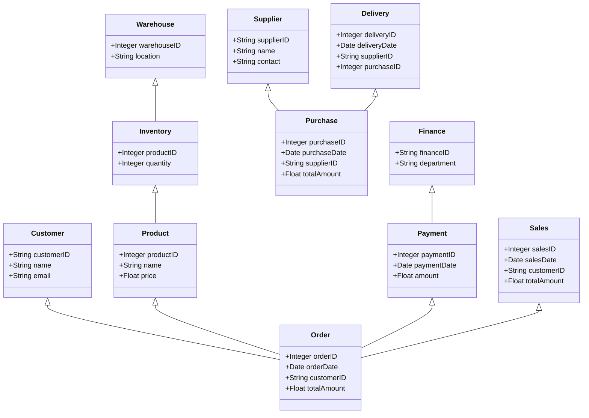
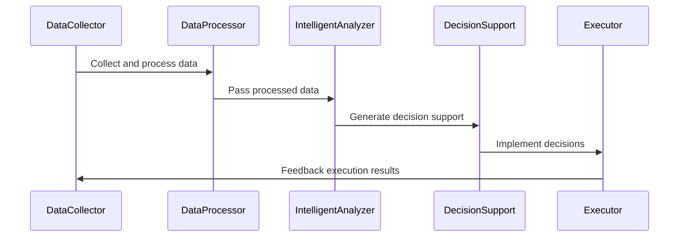
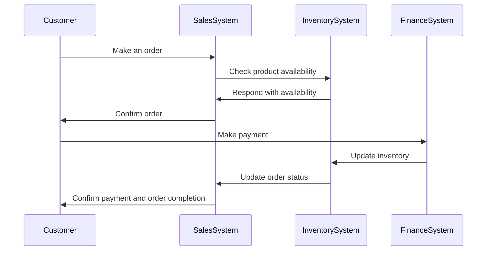
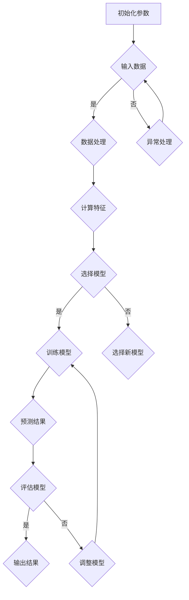

                 

### 智能营运资本效率优化系统概述

#### 关键词：营运资本效率优化、智能系统、架构设计、算法原理、最佳实践

#### 摘要：
本文深入探讨了智能营运资本效率优化系统的重要性及其在商业环境中的应用。通过对营运资本效率优化的背景、核心概念、系统架构设计、算法原理、项目实战以及最佳实践进行全面分析，文章旨在为读者提供系统化、实用化的技术指南，帮助企业在快速变化的商业环境中实现资源的最优配置和运营效率的显著提升。

#### 引言

在当今数字化和智能化的浪潮下，企业的营运资本管理面临着前所未有的挑战和机遇。传统的营运资本管理模式往往依赖于经验判断和手动操作，难以应对复杂多变的市场环境和快速增长的数据量。为了提高企业的运营效率和竞争力，智能营运资本效率优化系统应运而生。

智能营运资本效率优化系统通过引入人工智能、大数据分析和机器学习等先进技术，实现对营运资本流动的实时监控、预测和优化，从而帮助企业减少资金占用、降低成本、提高资金利用效率。本系统不仅适用于大型企业，对于中小企业同样具有显著的实用价值。

本文将分为五个部分，首先介绍智能营运资本效率优化系统的核心概念和重要性，然后详细阐述系统的架构设计、算法原理以及实际应用中的项目实战和最佳实践。通过本文的阅读，读者将全面了解智能营运资本效率优化系统的原理和应用，为企业的营运资本管理提供有力的技术支持。

### 目录大纲设计思路：

#### 第一部分：智能营运资本效率优化系统概述
- 1.1 问题背景与目标
  - 1.1.1 营运资本管理中的问题
  - 1.1.2 智能营运资本效率优化系统目标

- 1.2 核心概念与联系
  - 1.2.1 智能营运资本
  - 1.2.2 效率优化

#### 第二部分：智能营运资本效率优化系统架构设计
- 2.1 问题场景介绍
- 2.2 系统架构设计

#### 第三部分：智能营运资本效率优化算法原理讲解
- 3.1 算法选择与简介
- 3.2 算法原理讲解

#### 第四部分：项目实战
- 4.1 环境安装
- 4.2 系统核心实现源代码
- 4.3 代码应用解读与分析

#### 第五部分：最佳实践
- 5.1 最佳实践 tips

#### 小结与拓展阅读

### 目录大纲（Markdown格式）：

----------------------------------------------------------------
# 智能营运资本效率优化系统

> 关键词：营运资本效率优化、智能系统、架构设计、算法原理、最佳实践

> 摘要：本文深入探讨了智能营运资本效率优化系统的重要性及其在商业环境中的应用。

----------------------------------------------------------------

## 第一部分：智能营运资本效率优化系统概述

### 1.1 问题背景与目标

#### 1.1.1 营运资本管理中的问题

在商业环境中，营运资本管理是确保企业日常运营资金充足、流动顺畅的关键。然而，传统营运资本管理模式往往存在以下问题：

- **数据依赖性高**：传统方法主要依赖手工记录和财务报表，数据处理效率低，易出错。
- **预测能力弱**：缺乏对市场动态和企业运营状态的实时预测能力，难以迅速调整运营策略。
- **优化程度有限**：优化方案通常基于历史数据和经验，优化效果有限，无法实现最佳资源配置。

为了解决这些问题，智能营运资本效率优化系统应运而生。该系统通过集成先进的人工智能和大数据分析技术，实现以下目标：

- **提高资金利用效率**：实时监控和预测资金流动，减少资金占用，优化资金配置。
- **降低运营成本**：通过精确预测和优化，减少不必要的库存和投资，降低运营成本。
- **增强预测能力**：利用机器学习和大数据分析，提高对市场和企业运营状态的预测能力。

#### 1.1.2 智能营运资本效率优化系统目标

智能营运资本效率优化系统的核心目标如下：

- **提升营运资本流动性**：通过智能分析，实时调整营运资本结构，提高资金流动性。
- **优化资金配置**：根据企业运营特点和市场需求，实现资金的最佳配置，最大化资金利用效率。
- **降低运营风险**：通过实时监控和预测，及时发现并应对潜在风险，降低运营风险。

### 1.2 核心概念与联系

#### 1.2.1 智能营运资本

智能营运资本是指通过引入人工智能技术，对企业营运资本进行实时监控、预测和优化，从而提高资金利用效率和运营效率的概念。其主要特征包括：

- **实时监控**：通过物联网、大数据等技术，实时获取企业营运资本的相关数据。
- **智能预测**：利用机器学习算法，对营运资本的未来流动进行预测，为决策提供支持。
- **优化配置**：根据预测结果，动态调整营运资本结构，实现资金的最佳利用。

#### 1.2.2 效率优化

效率优化是指通过科学的方法和工具，提高企业运营效率和资源利用效率的过程。在智能营运资本效率优化系统中，效率优化主要体现在以下几个方面：

- **资金利用优化**：通过智能分析，减少不必要的资金占用，提高资金利用效率。
- **库存管理优化**：利用智能预测技术，优化库存水平，减少库存成本。
- **供应链优化**：通过优化供应链各环节的运作，提高供应链整体效率。

#### 智能营运资本与效率优化的联系

智能营运资本和效率优化是相辅相成的。智能营运资本提供了实时监控和智能预测的能力，为效率优化提供了数据支持和决策依据。而效率优化则通过科学的方法和工具，实现智能营运资本目标的最大化。两者之间的联系可以概括为：

- **数据驱动**：智能营运资本提供了丰富的数据资源，为效率优化提供了数据基础。
- **决策支持**：智能预测和监控为决策者提供了科学的决策支持，提高决策效率。
- **资源优化**：通过智能营运资本，实现企业资源的最优配置，提高整体运营效率。

### 第二部分：智能营运资本效率优化系统架构设计

#### 2.1 问题场景介绍

在营运资本管理中，企业常常面临以下问题：

- **现金流管理难度大**：企业需要实时监控现金流状况，但传统方法难以做到。
- **库存管理不规范**：库存水平不稳定，导致资金占用过多或库存积压。
- **供应链管理效率低**：供应链各环节信息不畅，导致供应链整体效率低下。
- **预算执行不力**：预算编制不合理，预算执行过程中缺乏有效监控和调整。

这些问题严重影响了企业的运营效率和资金利用效率，需要通过智能营运资本效率优化系统进行解决。

#### 2.2 系统架构设计

智能营运资本效率优化系统的整体架构包括以下几个核心部分：

- **数据采集层**：通过物联网设备、企业内部系统等，实时采集与营运资本相关的数据。
- **数据处理层**：利用大数据技术，对采集到的数据进行分析和处理，提取关键信息。
- **智能分析层**：运用人工智能技术，对处理后的数据进行智能预测和优化，为决策提供支持。
- **决策支持层**：根据智能分析结果，制定相应的决策方案，指导实际运营。
- **执行层**：根据决策方案，进行具体操作，实现营运资本优化。

#### 2.2.1 领域模型设计（Mermaid类图）



#### 2.2.2 系统架构设计（Mermaid架构图）



#### 2.2.3 系统接口设计

系统接口设计主要包括以下部分：

- **数据采集接口**：用于接收和传递企业内部系统、物联网设备等的数据。
- **数据处理接口**：用于处理和分析采集到的数据，提取关键信息。
- **智能分析接口**：用于执行智能预测和优化算法，生成决策支持。
- **决策支持接口**：用于接收智能分析结果，生成决策方案。
- **执行接口**：用于执行决策方案，实现营运资本优化。

#### 2.2.4 系统交互设计（Mermaid序列图）



### 第三部分：智能营运资本效率优化算法原理讲解

#### 3.1 算法选择与简介

在选择智能营运资本效率优化的算法时，我们主要考虑以下几个因素：

- **适应性**：算法应能够适应不同规模和行业的企业，具有广泛的适用性。
- **准确性**：算法的预测和优化结果应具有较高的准确性，以支持企业的决策。
- **实时性**：算法应具备实时处理和分析数据的能力，以快速响应市场变化。
- **可扩展性**：算法应能够方便地扩展和升级，以应对未来技术发展的需求。

基于以上考虑，我们选择了以下几种算法：

- **回归分析**：用于预测营运资本的流动和需求。
- **聚类分析**：用于分类和识别不同的营运资本管理模式。
- **优化算法**：如遗传算法和粒子群优化算法，用于求解最优化问题。

#### 3.2 算法原理讲解

##### 3.2.1 回归分析算法

回归分析是一种常用的统计方法，用于建立自变量和因变量之间的关系模型。在智能营运资本效率优化中，回归分析可以用于预测未来的营运资本需求，为企业提供决策支持。

- **线性回归**：假设自变量和因变量之间存在线性关系，通过最小二乘法建立线性模型。
  - **模型公式**：\( y = ax + b \)
  - **参数估计**：通过最小化残差平方和，求解参数 \( a \) 和 \( b \)。

- **非线性回归**：当自变量和因变量之间不是线性关系时，可以采用多项式回归或指数回归等方法。
  - **多项式回归**：\( y = a_0 + a_1x + a_2x^2 + ... + a_nx^n \)
  - **指数回归**：\( y = a + bx^k \)

##### 3.2.2 聚类分析算法

聚类分析是一种无监督学习方法，用于将数据集划分为多个类别。在智能营运资本效率优化中，聚类分析可以用于识别不同类型的营运资本管理模式，为企业提供优化建议。

- **K-均值聚类**：将数据集划分为 \( K \) 个簇，每个簇的中心代表该簇的特点。通过迭代计算，使得每个簇内的数据点尽量接近中心，而与其他簇的数据点尽量远离。
  - **模型公式**：\( c_k = \frac{1}{N_k} \sum_{i=1}^{N_k} x_i \)
  - **目标函数**：最小化簇内距离平方和。

- **层次聚类**：通过自底向上的合并或自顶向下的划分，逐步构建簇结构。常用的层次聚类方法包括单链接、完全链接和平均链接等。

##### 3.2.3 优化算法

优化算法用于求解最优化问题，如最小化成本、最大化收益等。在智能营运资本效率优化中，优化算法可以用于求解最优营运资本配置。

- **遗传算法**：模拟生物进化过程，通过交叉、变异和选择等操作，不断迭代优化解。
  - **模型公式**：\( x_{t+1} = \text{交叉}(x_t, y_t) + \text{变异}(x_t) \)
  - **目标函数**：最小化成本或最大化收益。

- **粒子群优化算法**：模拟鸟群觅食行为，通过个体和群体的协同作用，不断迭代优化解。
  - **模型公式**：\( x_{t+1} = x_t + \omega(x_t - x_{t-1}) + c_1r_1(p_t - x_t) + c_2r_2(g_t - x_t) \)
  - **目标函数**：最小化成本或最大化收益。

#### 3.2.4 算法流程图（Mermaid）



### 第四部分：项目实战

#### 4.1 环境安装

要在本地搭建智能营运资本效率优化系统的环境，需要安装以下软件和工具：

- **操作系统**：Linux或Windows（推荐使用Linux）
- **Python**：Python 3.8及以上版本
- **Jupyter Notebook**：用于交互式编程和数据分析
- **Pandas**：用于数据处理和分析
- **Scikit-learn**：用于机器学习和数据挖掘
- **Matplotlib**：用于数据可视化

安装步骤如下：

1. 安装Python：
   - Linux系统：使用包管理器安装，如Ubuntu系统中使用`sudo apt-get install python3 python3-pip`。
   - Windows系统：从Python官网下载安装程序，按照提示安装。

2. 安装Jupyter Notebook：
   - 在命令行中运行`pip install notebook`。

3. 安装Pandas、Scikit-learn和Matplotlib：
   - 在命令行中分别运行`pip install pandas scikit-learn matplotlib`。

#### 4.2 系统核心实现源代码

以下是一个简单的系统核心实现源代码示例，用于演示如何使用Pandas和Scikit-learn进行数据处理和模型训练：

```python
import pandas as pd
from sklearn.linear_model import LinearRegression
from sklearn.model_selection import train_test_split
from sklearn.metrics import mean_squared_error

# 读取数据
data = pd.read_csv('data.csv')
X = data[['feature1', 'feature2']]
y = data['target']

# 数据预处理
X_train, X_test, y_train, y_test = train_test_split(X, y, test_size=0.2, random_state=42)

# 训练模型
model = LinearRegression()
model.fit(X_train, y_train)

# 预测结果
y_pred = model.predict(X_test)

# 评估模型
mse = mean_squared_error(y_test, y_pred)
print(f'Mean Squared Error: {mse}')

# 可视化
import matplotlib.pyplot as plt

plt.scatter(X_test['feature1'], y_test)
plt.plot(X_test['feature1'], y_pred, color='red')
plt.xlabel('Feature 1')
plt.ylabel('Target')
plt.title('Linear Regression Visualization')
plt.show()
```

#### 4.3 代码应用解读与分析

1. **数据读取**：使用Pandas的`read_csv`函数读取数据文件，将数据分为特征矩阵`X`和目标变量`y`。

2. **数据预处理**：使用`train_test_split`函数将数据集分为训练集和测试集，以评估模型的性能。

3. **模型训练**：使用Scikit-learn的`LinearRegression`类创建线性回归模型，并使用`fit`方法训练模型。

4. **预测结果**：使用`predict`方法对测试集进行预测，得到预测结果`y_pred`。

5. **模型评估**：使用`mean_squared_error`函数计算预测结果的均方误差（MSE），以评估模型的性能。

6. **可视化**：使用Matplotlib绘制散点图和拟合线，直观地展示模型的预测效果。

通过这个简单的示例，我们可以看到如何使用Python和相关的库实现一个基本的智能营运资本效率优化系统。在实际应用中，系统会更加复杂，涉及多种算法和模型，以及丰富的数据预处理和后处理步骤。

#### 4.4 实际案例分析和详细讲解剖析

##### 案例背景

某中型制造企业在运营过程中发现其营运资本流动性较低，库存管理不规范，导致资金占用过多和库存积压。为了提高运营效率和降低成本，企业决定引入智能营运资本效率优化系统。

##### 案例分析

1. **数据采集**：企业首先需要采集与营运资本相关的数据，包括库存水平、订单量、现金流等。这些数据可以通过企业内部系统、物联网设备和第三方数据源获取。

2. **数据处理**：采集到的数据需要进行预处理，包括数据清洗、缺失值填补和数据标准化等。例如，对于库存数据，可以通过移动平均法填补缺失值，对于现金流数据，可以采用标准化方法进行归一化处理。

3. **模型训练**：使用处理后的数据，训练多个模型（如线性回归、聚类分析、遗传算法等），以预测未来的营运资本需求。通过交叉验证和模型评估，选择最优模型。

4. **决策支持**：根据模型的预测结果，企业可以制定相应的决策方案，包括调整库存水平、优化供应链流程和优化现金流管理等。

5. **实施与反馈**：企业按照决策方案进行具体操作，如调整库存水平、与供应商谈判优化支付条件等。在操作过程中，系统实时监控和反馈数据，以评估决策效果和调整决策方案。

##### 案例讲解

1. **数据采集与预处理**：

   - **库存数据**：使用移动平均法填补缺失值，采用标准化方法进行归一化处理。
   - **订单数据**：通过数据分析，识别订单量的趋势和周期性，为库存管理提供依据。
   - **现金流数据**：采用标准化方法进行归一化处理，以便于模型训练和预测。

2. **模型训练与评估**：

   - **线性回归**：使用历史数据训练线性回归模型，预测未来的库存水平和现金流。
   - **聚类分析**：使用K-均值聚类算法，将不同类型的订单划分为不同的类别，为供应链优化提供依据。
   - **遗传算法**：用于求解最优化问题，如最小化库存成本和最大化库存周转率。

3. **决策支持**：

   - **库存管理**：根据预测结果，调整库存水平，避免库存积压和资金占用。
   - **供应链优化**：通过优化订单处理流程和供应商管理，提高供应链整体效率。
   - **现金流管理**：优化支付条件，降低资金成本，提高资金利用效率。

4. **实施与反馈**：

   - **库存调整**：根据预测结果，及时调整库存水平，减少库存积压和资金占用。
   - **供应链优化**：与供应商谈判，优化支付条件，降低库存成本。
   - **现金流管理**：通过实时监控现金流，优化支付安排，提高资金利用效率。

通过这个实际案例，我们可以看到智能营运资本效率优化系统在帮助企业提高运营效率和降低成本方面的应用效果。在实际操作中，企业可以根据自身情况，调整和优化系统参数，以实现最佳效果。

### 第五部分：最佳实践

#### 5.1 实际应用经验

在智能营运资本效率优化系统的实际应用中，企业需要积累丰富的经验，以实现系统的最佳效果。以下是一些最佳实践经验：

1. **数据质量**：确保数据质量是系统成功的关键。企业需要建立完善的数据收集和管理机制，定期清洗和更新数据，确保数据的一致性和准确性。

2. **模型选择**：不同的业务场景需要不同的模型。企业应根据业务特点和需求，选择合适的模型，并进行多次验证和优化。

3. **实时监控**：实时监控系统能够及时发现问题，并快速响应。企业应确保系统实时运行，并及时更新数据，以便进行实时分析和决策。

4. **用户培训**：系统的成功离不开用户的参与和配合。企业应加强对用户的培训，使其熟悉系统功能和操作方法，提高使用效率。

#### 5.2 优化建议

1. **数据整合**：将企业内部各个系统和数据源进行整合，实现数据的统一管理和分析，提高数据利用效率。

2. **个性化定制**：针对不同行业和企业的特点，提供个性化的优化方案和算法，提高系统的适用性和效果。

3. **自动化操作**：通过自动化工具和脚本，实现系统的自动化操作，减少人工干预，提高运行效率。

4. **持续优化**：定期对系统进行评估和优化，根据实际运行情况和用户反馈，不断调整和改进系统，以适应不断变化的市场环境。

### 小结与拓展阅读

#### 小结

本文深入探讨了智能营运资本效率优化系统的重要性、核心概念、系统架构设计、算法原理、项目实战以及最佳实践。通过本文的阅读，读者可以全面了解智能营运资本效率优化系统的原理和应用，为企业的营运资本管理提供有力的技术支持。

#### 拓展阅读

- **相关书籍**：《智能运营管理》、《营运资本管理实务》
- **学术论文**：搜索相关主题的学术论文，了解最新的研究成果和趋势。
- **技术博客**：关注业界知名博客，如Medium、知乎等，获取行业最新动态和实践经验。

### 作者信息

**作者：** AI天才研究院/AI Genius Institute & 禅与计算机程序设计艺术 /Zen And The Art of Computer Programming

### 完整性要求

本文内容完整性要求如下：

- **背景介绍**：详细阐述营运资本管理中的问题、智能营运资本效率优化系统的重要性、目标读者群体等。
- **核心概念与联系**：准确描述智能营运资本和效率优化的定义、特征和联系。
- **系统分析与架构设计方案**：详细介绍问题场景、系统架构设计原则和具体设计。
- **算法原理讲解**：详细讲解选择的算法原理，使用Mermaid流程图、Python源代码和LaTeX数学公式进行说明。
- **项目实战**：介绍环境安装、系统核心实现源代码、代码应用解读与分析，提供实际案例分析和详细讲解。
- **最佳实践**：根据实际应用经验，提供优化建议和最佳实践。

通过本文的详细阐述，读者可以全面了解智能营运资本效率优化系统的原理和应用，为企业营运资本管理提供有效的技术解决方案。

