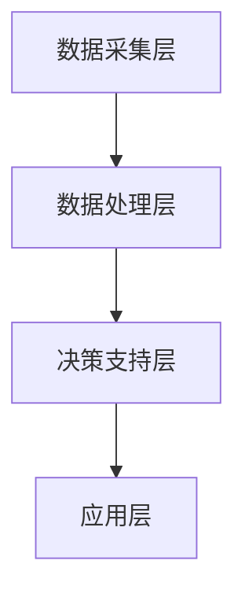
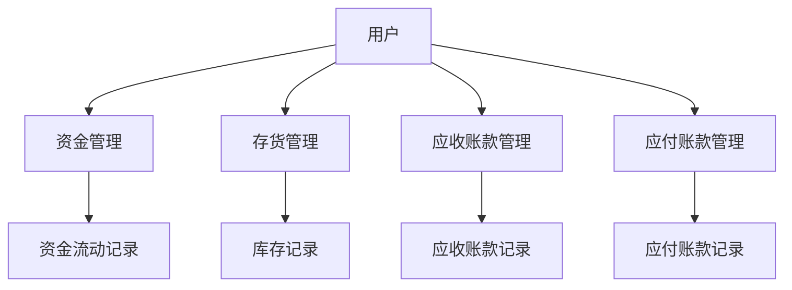

                 

### 文章标题

# 智能营运资本管理优化系统

> 关键词：营运资本管理、资金管理、存货管理、应收账款管理、应付账款管理

> 摘要：本文将探讨智能营运资本管理优化系统的重要性，详细解析系统的核心概念，包括营运资本、资金管理、存货管理、应收账款管理和应付账款管理，并通过具体的算法原理和系统架构设计，阐述如何有效优化企业的营运资本管理，提高企业的资金利用效率和竞争力。

### 引言

#### 1.1 问题背景

在当前经济环境下，企业面临着激烈的市场竞争和资源限制，如何优化营运资本管理成为企业持续发展的关键。营运资本管理是企业管理中不可或缺的一部分，它直接关系到企业的资金流动、盈利能力和风险控制。随着信息技术的发展，智能营运资本管理优化系统作为一种新兴的管理工具，正逐渐受到企业的关注和重视。

智能营运资本管理优化系统通过整合各种管理手段和技术，实现对资金、存货、应收账款和应付账款等关键要素的实时监控和优化管理，从而提高资金利用效率，降低运营风险，实现企业的可持续发展。本文将详细探讨智能营运资本管理优化系统的核心概念、算法原理和系统架构，帮助企业更好地理解和应用这一系统。

#### 1.2 问题描述

智能营运资本管理优化系统主要涉及资金管理、存货管理、应收账款管理和应付账款管理等多个方面。目前，企业在营运资本管理中面临着以下问题：

1. **资金管理效率低下**：许多企业在资金管理上存在信息不对称、数据不准确等问题，导致资金无法得到有效利用，影响了企业的运营效率和资金流动性。
   
2. **存货管理不规范**：部分企业存货管理缺乏科学性，容易出现库存积压或库存不足的情况，导致资金占用增加和运营成本上升。
   
3. **应收账款管理不到位**：一些企业应收账款管理不善，账期过长，导致资金回笼困难，影响了企业的现金流。

4. **应付账款管理不完善**：部分企业在应付账款管理上缺乏策略，无法充分利用延期支付的优势，增加了企业的资金压力。

#### 1.3 问题解决

通过构建智能营运资本管理优化系统，可以实现以下目标：

1. **提高资金管理效率**：系统通过实时数据采集和分析，帮助企业管理者及时了解资金流动情况，优化资金使用策略，确保资金的安全、流动和有效使用。
   
2. **实现存货管理的精细化**：系统通过数据分析，帮助企业合理控制库存水平，降低库存积压和存货成本，提高库存周转率。
   
3. **加强应收账款管理**：系统提供信用评估和账期管理功能，帮助企业降低应收账款风险，缩短回款周期，提高现金流。
   
4. **优化应付账款管理**：系统帮助企业制定合理的支付策略，充分利用延期支付的优势，降低资金成本，确保企业资金链的稳定性。

#### 1.4 边界与外延

智能营运资本管理优化系统的应用范围主要包括中小企业、大型企业以及各类商业机构。系统涉及的关键要素包括资金、存货、应收账款和应付账款等。

#### 1.5 概念结构与核心要素组成

智能营运资本管理优化系统的核心概念包括营运资本、资金管理、存货管理、应收账款管理和应付账款管理。系统架构主要包括数据采集层、数据处理层、决策支持层和应用层。具体架构如下：

- **数据采集层**：负责采集企业的各类数据，包括财务数据、库存数据、应收账款数据和应付账款数据等。
- **数据处理层**：对采集到的数据进行分析和处理，生成各种管理报表和决策支持信息。
- **决策支持层**：提供智能化的决策支持，包括资金使用策略、库存优化方案、应收账款回收计划和应付账款支付策略等。
- **应用层**：面向企业用户，提供便捷的操作界面和功能模块，方便用户进行营运资本管理操作。

#### 1.6 本章小结

本章对智能营运资本管理优化系统的背景、问题、解决思路、边界与外延以及核心概念进行了详细阐述，为后续章节的内容奠定了基础。接下来，本文将深入探讨智能营运资本管理优化系统中的核心概念，包括营运资本、资金管理、存货管理、应收账款管理和应付账款管理，并分析各概念之间的关系及其在系统中的作用。

## 第二部分：智能营运资本管理优化系统核心概念解析

### 2.1 营运资本概念解析

#### 2.1.1 营运资本的定义

营运资本是指企业在日常运营过程中所需的流动资金，包括现金、应收账款、存货和预付款等。它是企业维持正常生产经营活动所必需的资金。

营运资本的计算公式为：

$$
营运资本 = 流动资产 - 流动负债
$$

其中，流动资产包括现金、应收账款、存货和预付款等，流动负债包括应付账款、预收账款等。

#### 2.1.2 营运资本的重要性

营运资本是企业的“血液”，对于企业的运营至关重要。充足且合理的营运资本可以保证企业顺利运营，降低经营风险。具体来说，营运资本的重要性体现在以下几个方面：

1. **保证正常运营**：充足的营运资本可以确保企业日常运营所需资金，避免因资金不足导致的生产中断和运营困难。
   
2. **降低经营风险**：合理的营运资本水平可以降低企业的经营风险，避免因资金链断裂导致的企业倒闭。

3. **提高资金利用效率**：有效的营运资本管理可以提高资金利用效率，降低资金成本，提高企业的盈利能力。

#### 2.1.3 营运资本的管理

营运资本管理主要包括资金管理、存货管理、应收账款管理和应付账款管理。通过有效的营运资本管理，企业可以实现以下目标：

1. **优化资金结构**：合理配置资金，确保企业有充足的流动资金，同时控制长期负债比例，降低财务风险。

2. **提高资金利用效率**：通过实时监控和优化资金流动，确保资金的安全、流动和有效使用。

3. **降低运营成本**：通过科学的存货管理和应收账款管理，降低库存成本和应收账款成本，提高企业盈利能力。

4. **确保企业资金链稳定**：通过合理的应付账款管理，延长支付周期，降低企业资金压力，确保企业资金链的稳定性。

### 2.2 资金管理

#### 2.2.1 资金管理的定义

资金管理是指企业对资金进行全面的管理，包括资金筹集、资金使用和资金调度等。

资金管理的目标包括：

1. **确保企业拥有充足的资金**：满足企业日常运营和发展的资金需求。
   
2. **降低资金成本**：通过优化资金结构，降低融资成本，提高资金利用效率。

3. **提高资金流动性**：确保企业能够及时获取和使用资金，降低资金闲置和浪费。

#### 2.2.2 资金管理的策略

资金管理的策略主要包括以下几个方面：

1. **优化资金结构**：合理配置资金，确保企业有充足的流动资金，同时控制长期负债比例，降低财务风险。

2. **提高资金筹集效率**：通过多种融资渠道筹集资金，降低融资成本，提高资金筹集效率。

3. **加强资金调度**：实时监控资金流动情况，优化资金调度，确保资金的安全、流动和有效使用。

4. **降低资金成本**：通过优化资金结构和筹集方式，降低融资成本，提高资金利用效率。

5. **提高资金流动性**：通过优化资金调度和管理，确保企业能够及时获取和使用资金，降低资金闲置和浪费。

#### 2.2.3 资金管理的方法

资金管理的方法主要包括以下几种：

1. **预算管理**：通过制定详细的预算计划，合理分配资金，确保企业各项活动的资金需求。

2. **现金流管理**：实时监控企业的现金流情况，确保企业有充足的现金流，避免资金短缺。

3. **财务报表分析**：通过对财务报表的分析，了解企业的资金状况，发现潜在的风险和问题，及时调整资金管理策略。

4. **资金审计**：定期对企业的资金管理进行审计，确保资金管理的规范性和有效性。

### 2.3 存货管理

#### 2.3.1 存货管理的定义

存货管理是指企业对存货进行有效的控制和管理，确保存货数量合理，避免存货积压和存货短缺。

存货管理的目标包括：

1. **确保存货满足生产经营需求**：确保企业有足够的存货来满足日常生产和销售的需求。

2. **降低存货成本**：通过合理的库存管理，减少存货积压和存货短缺，降低存货成本。

3. **提高库存周转率**：通过优化库存管理，提高库存周转率，提高资金利用效率。

#### 2.3.2 存货管理的策略

存货管理的策略主要包括以下几个方面：

1. **需求预测**：通过历史数据和市场需求分析，预测未来的需求，制定合理的库存计划。

2. **采购管理**：优化采购流程，确保采购的及时性和合理性，降低采购成本。

3. **库存控制**：通过实时监控库存水平，合理控制库存量，避免存货积压和存货短缺。

4. **仓储管理**：优化仓储流程，确保仓储设施的科学合理使用，提高仓储效率。

5. **库存盘点**：定期对库存进行盘点，确保库存数据的准确性和完整性。

### 2.4 应收账款管理

#### 2.4.1 应收账款管理的定义

应收账款管理是指企业对应收账款进行有效的控制和管理，确保应收账款安全、及时回收。

应收账款管理的目标包括：

1. **确保应收账款安全**：防止应收账款发生坏账风险，确保应收账款的安全。

2. **提高应收账款回收率**：通过有效的管理措施，提高应收账款的回收速度，提高企业现金流。

3. **降低应收账款成本**：通过优化应收账款管理，降低应收账款成本，提高企业盈利能力。

#### 2.4.2 应收账款管理的策略

应收账款管理的策略主要包括以下几个方面：

1. **信用管理**：对企业客户进行信用评估，确定其信用等级，合理设定信用额度，降低坏账风险。

2. **账期管理**：通过合理设定账期，缩短回款周期，提高应收账款的回收率。

3. **账龄分析**：定期对账龄进行分析，及时发现逾期应收账款，采取相应的催收措施。

4. **收款管理**：优化收款流程，确保应收账款及时回收，提高企业现金流。

5. **账款核对**：定期与客户对账，确保应收账款数据的准确性和完整性。

### 2.5 应付账款管理

#### 2.5.1 应付账款管理的定义

应付账款管理是指企业对应付账款进行有效的控制和管理，确保应付账款按时支付，降低企业资金压力。

应付账款管理的目标包括：

1. **确保应付账款按时支付**：避免因应付账款支付不及时导致的企业信誉受损。

2. **降低应付账款成本**：通过合理的支付策略，降低应付账款成本，提高企业盈利能力。

3. **确保企业资金链稳定**：通过合理的应付账款管理，确保企业有充足的现金流，避免资金链断裂。

#### 2.5.2 应付账款管理的策略

应付账款管理的策略主要包括以下几个方面：

1. **账期管理**：通过合理设定账期，延长支付周期，降低企业资金压力。

2. **支付策略**：根据企业资金状况和供应商信用政策，制定合理的支付策略，降低应付账款成本。

3. **信用管理**：与供应商建立良好的信用关系，争取更长的账期，降低资金压力。

4. **支付方式**：优化支付方式，选择低成本的支付方式，降低支付成本。

5. **支付核对**：定期与供应商核对应付账款，确保应付账款数据的准确性和完整性。

### 2.6 本章小结

本章对智能营运资本管理优化系统中的核心概念进行了详细解析，包括营运资本、资金管理、存货管理、应收账款管理和应付账款管理。这些核心概念构成了智能营运资本管理优化系统的理论基础，是优化企业营运资本管理的关键。在下一章中，我们将进一步探讨这些核心概念之间的联系，并分析如何通过系统的架构设计来实现营运资本的优化管理。

## 智能营运资本管理优化系统的联系与整合

在了解了智能营运资本管理优化系统中的核心概念后，我们需要进一步探讨这些概念之间的联系，并分析如何通过系统的架构设计来整合这些要素，实现营运资本的优化管理。以下是对营运资本、资金管理、存货管理、应收账款管理和应付账款管理之间联系的详细分析。

### 2.7.1 营运资本与资金管理

营运资本是资金管理的重要组成部分，它直接反映了企业流动资金的状况。资金管理通过优化资金结构、提高资金流动性和降低资金成本，直接影响到营运资本的规模和效率。营运资本充足，可以保证企业正常运营，而资金管理不当则可能导致营运资本不足，影响企业的生产经营活动。

#### 联系与整合

- **实时监控**：通过智能化的监控系统，实时监控企业的资金流动情况，确保营运资本的充足性。
- **预算管理**：在资金管理中引入预算管理，根据企业生产经营计划，合理配置资金，确保营运资本的有效利用。

### 2.7.2 营运资本与存货管理

存货是营运资本的重要组成部分，合理的存货管理直接影响营运资本的水平。存货过多会导致资金占用增加，而存货不足则可能影响企业的生产和销售。

#### 联系与整合

- **需求预测**：通过智能分析技术，结合市场需求和企业生产能力，准确预测存货需求，实现存货的合理控制。
- **库存优化**：利用库存优化算法，结合实际生产和销售数据，动态调整库存水平，降低存货成本，提高库存周转率。

### 2.7.3 营运资本与应收账款管理

应收账款是营运资本的另一重要组成部分，有效的应收账款管理能够提高营运资本的周转速度。应收账款管理不仅关系到企业的现金流，也影响到企业的信用和经营风险。

#### 联系与整合

- **信用评估**：在应收账款管理中引入信用评估机制，根据客户信用状况，合理设定信用额度，降低坏账风险。
- **账期管理**：通过优化账期管理，缩短应收账款的账期，提高资金回笼速度，增强营运资本的流动性。

### 2.7.4 营运资本与应付账款管理

应付账款管理同样对营运资本有重要影响。合理的应付账款管理可以延长支付周期，降低企业资金压力，而应付账款管理不当则可能导致资金紧张。

#### 联系与整合

- **账期优化**：通过智能算法，分析企业资金状况和供应商信用政策，制定最优的应付账款支付策略，延长账期，降低资金成本。
- **支付策略**：根据企业的资金流动性和供应商的支付要求，灵活调整支付策略，确保资金链的稳定性。

### 2.7.5 综合管理策略

为了实现营运资本的优化管理，需要综合运用资金管理、存货管理、应收账款管理和应付账款管理的策略，形成一个相互关联、相互促进的整体。

#### 综合管理策略

1. **数据整合**：通过数据整合，将各类管理信息集中在一个平台上，实现数据的实时共享和联动。
2. **决策支持**：利用大数据分析和人工智能技术，为管理者提供实时、精准的决策支持。
3. **流程优化**：通过优化业务流程，减少冗余环节，提高管理效率，降低运营成本。
4. **风险评估**：建立风险预警机制，对营运资本管理中的潜在风险进行实时监控和评估，及时采取应对措施。

### 2.7.6 本章小结

本章详细分析了智能营运资本管理优化系统中各核心概念之间的联系，并探讨了如何通过系统的架构设计来实现这些要素的有效整合。通过综合运用资金管理、存货管理、应收账款管理和应付账款管理的策略，企业可以实现营运资本的优化管理，提高资金利用效率，降低运营风险，实现可持续发展。在下一章中，我们将进一步探讨智能营运资本管理优化系统的算法原理，分析如何利用先进的技术手段实现系统的智能化和高效化。

## 智能营运资本管理优化系统的算法原理

在智能营运资本管理优化系统中，算法原理是核心驱动因素，它们通过优化模型、数据分析和决策支持等手段，帮助企业实现营运资本的优化管理。以下将详细探讨系统中的关键算法原理，包括资金管理算法、存货管理算法、应收账款管理算法和应付账款管理算法。

### 3.1 资金管理算法

资金管理算法的核心目标是确保企业拥有充足的流动资金，同时降低资金成本。以下是几种常见的资金管理算法：

#### 3.1.1 预算分配算法

预算分配算法基于企业的财务预算和资金需求，合理分配资金到不同的部门和业务领域。具体步骤如下：

1. **需求预测**：通过历史数据和市场需求分析，预测企业未来的资金需求。
2. **预算制定**：根据预测结果，制定年度或季度的资金预算。
3. **优化分配**：利用线性规划或动态规划算法，优化资金分配，确保关键业务领域的资金需求得到满足。

#### 3.1.2 资金调度算法

资金调度算法通过实时监控企业的资金流动，优化资金调度策略，确保资金的有效利用。具体步骤如下：

1. **实时监控**：通过数据采集系统，实时获取企业的资金流动数据。
2. **状态评估**：根据资金流动状态，评估当前的财务状况。
3. **调度策略**：利用基于规则的算法或机器学习算法，制定最优的资金调度策略，确保资金流动的顺畅。

#### 3.1.3 资金成本控制算法

资金成本控制算法的目标是降低企业的资金成本。具体步骤如下：

1. **成本分析**：分析不同融资渠道的成本，包括银行贷款、债券发行等。
2. **成本优化**：利用线性规划或遗传算法，优化资金筹集策略，确保在满足资金需求的同时，最小化资金成本。
3. **风险控制**：通过风险评估模型，监控融资风险，确保资金成本控制的有效性。

### 3.2 存货管理算法

存货管理算法的核心目标是优化库存水平，降低库存成本，提高库存周转率。以下是几种常见的存货管理算法：

#### 3.2.1 库存预测算法

库存预测算法通过历史数据和市场需求分析，预测未来的库存需求。具体步骤如下：

1. **历史数据分析**：收集并分析企业的历史库存数据，识别库存变化的规律。
2. **市场预测**：结合市场需求趋势，预测未来的库存需求。
3. **预测优化**：利用时间序列分析或回归分析，优化库存预测模型，提高预测准确性。

#### 3.2.2 库存优化算法

库存优化算法通过优化库存策略，确保库存水平合理，降低库存成本。具体步骤如下：

1. **需求分析**：结合市场需求和销售预测，确定各时段的库存需求。
2. **库存策略**：利用基于规则或机器学习的算法，制定最优的库存策略，包括补货策略、存储策略等。
3. **成本优化**：通过成本效益分析，优化库存策略，确保在满足需求的同时，最小化库存成本。

#### 3.2.3 库存盘点算法

库存盘点算法通过实时盘点库存，确保库存数据的准确性和完整性。具体步骤如下：

1. **实时采集**：通过RFID、条码扫描等技术，实时采集库存数据。
2. **数据校验**：对采集到的数据进行校验，确保数据的准确性。
3. **异常处理**：发现库存异常情况，如库存短缺、库存过剩等，及时采取措施进行调整。

### 3.3 应收账款管理算法

应收账款管理算法的核心目标是提高应收账款的回收速度，降低坏账风险。以下是几种常见的应收账款管理算法：

#### 3.3.1 信用评估算法

信用评估算法通过对客户信用状况进行分析，评估其信用等级，制定信用策略。具体步骤如下：

1. **数据收集**：收集客户的财务数据、交易记录等，建立信用评估数据库。
2. **特征提取**：提取影响信用评分的关键特征，如偿付能力、信用历史等。
3. **模型训练**：利用机器学习算法，训练信用评估模型，对客户进行信用评分。

#### 3.3.2 账期管理算法

账期管理算法通过优化账期管理，缩短应收账款的账期，提高资金回笼速度。具体步骤如下：

1. **账期设定**：根据客户信用等级和交易金额，设定合理的账期。
2. **账期调整**：结合市场需求和企业资金状况，动态调整账期，确保账期的合理性。
3. **账期监控**：实时监控应收账款的账期情况，及时发现逾期账款，采取催收措施。

#### 3.3.3 坏账预测算法

坏账预测算法通过分析历史数据，预测未来可能发生的坏账情况，提前采取预防措施。具体步骤如下：

1. **历史数据分析**：收集并分析历史坏账数据，识别坏账发生的规律。
2. **特征提取**：提取影响坏账发生的特征，如客户信用等级、账期长度等。
3. **模型训练**：利用机器学习算法，训练坏账预测模型，对潜在坏账进行预测。

### 3.4 应付账款管理算法

应付账款管理算法的核心目标是优化应付账款支付策略，延长支付周期，降低企业资金压力。以下是几种常见的应付账款管理算法：

#### 3.4.1 账期优化算法

账期优化算法通过优化应付账款的支付策略，延长支付周期，降低资金成本。具体步骤如下：

1. **账期分析**：分析企业当前应付账款的账期情况，识别支付周期的优化空间。
2. **策略制定**：利用基于规则的算法或机器学习算法，制定最优的支付策略，包括账期延长策略、支付优先级策略等。
3. **账期监控**：实时监控应付账款的账期情况，确保支付策略的有效执行。

#### 3.4.2 支付优化算法

支付优化算法通过优化支付方式，降低支付成本，提高资金使用效率。具体步骤如下：

1. **支付方式分析**：分析不同支付方式的成本和风险，如现金支付、电子支付等。
2. **支付策略优化**：利用线性规划或遗传算法，制定最优的支付策略，确保在满足支付需求的同时，最小化支付成本。
3. **支付监控**：实时监控支付情况，确保支付策略的有效执行。

#### 3.4.3 风险控制算法

风险控制算法通过监控应付账款的风险，确保企业资金链的稳定性。具体步骤如下：

1. **风险识别**：通过数据分析和风险评估模型，识别应付账款中的潜在风险。
2. **预警机制**：建立风险预警机制，对高风险应付账款进行实时监控，提前采取预防措施。
3. **风险应对**：根据风险预警，制定相应的风险应对策略，确保企业资金链的稳定性。

### 3.5 本章小结

本章详细探讨了智能营运资本管理优化系统中的关键算法原理，包括资金管理算法、存货管理算法、应收账款管理算法和应付账款管理算法。通过这些算法的应用，企业可以实现对营运资本的有效管理，提高资金利用效率，降低运营风险，实现可持续发展。在下一章中，我们将进一步分析智能营运资本管理优化系统的系统架构，介绍其各个层次的功能和实现方式。

### 智能营运资本管理优化系统的系统架构

智能营运资本管理优化系统通过科学的系统架构设计，实现了对资金、存货、应收账款和应付账款等关键要素的全面管理。系统架构主要包括数据采集层、数据处理层、决策支持层和应用层。以下将详细介绍各层次的功能和实现方式。

#### 4.1 数据采集层

数据采集层是智能营运资本管理优化系统的基石，主要负责从各个业务系统和企业外部获取相关的数据。数据采集的方式包括自动采集和手动录入。自动采集可以通过接口集成、API调用等方式实现，手动录入则可以通过操作界面进行。以下是数据采集层的关键功能：

1. **数据接口集成**：通过API、Web服务等方式，与企业ERP、CRM、采购系统等业务系统进行接口集成，实现数据自动采集。
2. **数据采集工具**：提供数据采集工具，如数据爬虫、数据导出工具等，方便用户手动录入和导出数据。
3. **数据清洗**：对采集到的数据进行清洗，去除重复、错误和无效数据，确保数据的质量。

#### 4.2 数据处理层

数据处理层负责对采集到的数据进行处理和分析，生成各种管理报表和决策支持信息。数据处理包括数据预处理、数据分析和数据存储。以下是数据处理层的关键功能：

1. **数据预处理**：对原始数据进行清洗、转换和集成，生成统一的数据格式，为后续分析做好准备。
2. **数据分析**：利用数据分析工具，如数据挖掘、机器学习等，对数据进行分析，提取有价值的信息。
3. **数据存储**：将处理后的数据存储在数据库中，方便后续的数据查询和分析。

#### 4.3 决策支持层

决策支持层是智能营运资本管理优化系统的核心，负责提供智能化的决策支持，帮助企业管理者做出最优决策。决策支持层通过算法模型和智能分析技术，实现以下功能：

1. **资金管理决策支持**：根据企业的资金需求和资金流动情况，提供最优的资金分配、调度和成本控制策略。
2. **存货管理决策支持**：根据市场需求和库存数据，提供最优的库存优化、补货和存储策略。
3. **应收账款管理决策支持**：根据客户的信用状况和账期情况，提供最优的账期管理、信用评估和催收策略。
4. **应付账款管理决策支持**：根据供应商的信用政策和支付要求，提供最优的账期延长、支付优化和风险控制策略。

#### 4.4 应用层

应用层是智能营运资本管理优化系统的用户界面，提供直观、便捷的操作界面，方便用户进行日常管理和操作。应用层包括以下几个关键功能：

1. **报表展示**：通过图表、报表等形式，展示企业的资金流动、存货情况、应收账款和应付账款等关键指标，方便用户了解企业的运营状况。
2. **管理操作**：提供各种管理操作功能，如预算管理、库存管理、应收账款管理和应付账款管理，方便用户进行日常操作。
3. **权限管理**：提供权限管理功能，确保企业内部各级用户的操作权限得到有效控制，防止数据泄露和滥用。

#### 4.5 系统架构设计

智能营运资本管理优化系统的系统架构设计如图所示：



- **数据采集层**：负责数据的采集和清洗，确保数据的准确性和完整性。
- **数据处理层**：负责数据预处理、数据分析和数据存储，为决策支持层提供数据支持。
- **决策支持层**：负责提供智能化的决策支持，包括资金管理、存货管理、应收账款管理和应付账款管理。
- **应用层**：负责提供用户界面，方便用户进行日常管理和操作。

通过科学的系统架构设计，智能营运资本管理优化系统实现了对资金、存货、应收账款和应付账款等关键要素的全面管理，提高了企业的运营效率和资金利用效率，降低了运营风险。

### 4.6 本章小结

本章详细介绍了智能营运资本管理优化系统的系统架构，包括数据采集层、数据处理层、决策支持层和应用层。通过系统架构的设计和实现，企业可以实现对营运资本的全面管理和优化，提高资金利用效率，降低运营风险。在下一章中，我们将进一步分析智能营运资本管理优化系统的实现细节，包括系统功能设计和核心代码实现。

### 智能营运资本管理优化系统的实现细节

智能营运资本管理优化系统的实现涉及多个方面的技术，包括前端开发、后端架构、数据库设计和核心算法实现。以下将对这些实现细节进行详细分析。

#### 5.1 前端开发

前端开发是智能营运资本管理优化系统的用户界面，直接影响用户体验。前端开发采用了现代化的前端框架，如React或Vue.js，确保系统的响应速度和用户体验。前端开发的关键功能包括：

1. **界面设计**：通过设计工具，如Figma或Sketch，进行界面设计，确保界面美观、简洁、易用。
2. **组件化开发**：采用组件化开发模式，将页面拆分成多个组件，提高开发效率和代码可维护性。
3. **状态管理**：使用状态管理库，如Redux或Vuex，管理前端状态，确保数据的一致性和可追踪性。
4. **图表展示**：集成图表库，如ECharts或D3.js，展示各类数据分析结果，提高数据可视化效果。

#### 5.2 后端架构

后端架构是智能营运资本管理优化系统的核心，负责数据处理、业务逻辑实现和接口服务。后端架构采用了微服务架构，确保系统的可扩展性和高可用性。后端架构的关键组成部分包括：

1. **服务拆分**：将后端功能拆分成多个微服务，如用户服务、资金管理服务、存货管理服务等，提高系统的可维护性和可扩展性。
2. **API接口**：设计RESTful API接口，提供前后端数据交互的接口服务，确保系统的功能完整性。
3. **数据存储**：采用关系型数据库（如MySQL）和NoSQL数据库（如MongoDB）相结合的方式，存储企业的各类数据，确保数据的存储效率和查询性能。
4. **消息队列**：集成消息队列（如RabbitMQ或Kafka），实现异步消息传递，提高系统的并发处理能力和性能。

#### 5.3 数据库设计

数据库设计是智能营运资本管理优化系统的数据存储核心，直接影响系统的数据完整性和查询效率。数据库设计的关键步骤包括：

1. **需求分析**：分析企业的业务需求，确定需要存储的数据类型和关系。
2. **ER图设计**：绘制实体关系图（ER图），定义各个实体及其关系，确保数据库设计的合理性和完整性。
3. **表结构设计**：根据ER图，设计数据库表结构，包括字段定义、数据类型、索引等。
4. **数据迁移**：在系统上线前，进行数据迁移，确保旧系统数据和新系统数据的无缝对接。

以下是一个示例的ER图，展示了智能营运资本管理优化系统中涉及的主要实体及其关系：



#### 5.4 核心算法实现

核心算法实现是智能营运资本管理优化系统的关键技术，决定了系统的智能化水平和决策支持能力。以下是一些关键算法的实现：

1. **资金管理算法**：实现资金分配、调度和成本控制算法，如线性规划、动态规划等。通过Python代码实现如下：

   ```python
   import numpy as np

   def linear_programming(c, x):
       # c: 资金成本向量
       # x: 资金需求向量
       n = len(c)
       A = np.identity(n)
       b = x
       c = -c
       solution = np.linalg.solve(A, c)
       return -solution
   ```

2. **存货管理算法**：实现需求预测、库存优化和库存盘点算法，如时间序列分析、线性规划等。通过Python代码实现如下：

   ```python
   import pandas as pd
   from sklearn.linear_model import LinearRegression

   def demand_prediction(data, trend='linear'):
       model = LinearRegression()
       model.fit(data['date'].values.reshape(-1, 1), data['demand'])
       future_dates = pd.date_range(data['date'].max(), periods=12, freq='M')
       future_demand = model.predict(future_dates.values.reshape(-1, 1))
       return future_demand
   ```

3. **应收账款管理算法**：实现信用评估、账期管理和坏账预测算法，如逻辑回归、决策树等。通过Python代码实现如下：

   ```python
   from sklearn.linear_model import LogisticRegression

   def credit_evaluation(data):
       X = data[['credit_score', 'payment_history']]
       y = data['credit_rating']
       model = LogisticRegression()
       model.fit(X, y)
       new_data = pd.DataFrame({'credit_score': [700], 'payment_history': [15]})
       credit_rating = model.predict(new_data)
       return credit_rating
   ```

4. **应付账款管理算法**：实现账期优化、支付优化和风险控制算法，如线性规划、遗传算法等。通过Python代码实现如下：

   ```python
   import numpy as np
   from scipy.optimize import linprog

   def payment_optimization(c, x):
       # c: 资金成本向量
       # x: 应付账款向量
       n = len(c)
       A = np.hstack((np.identity(n), -np.identity(n)))
       b = np.hstack((x, -x))
       c = -np.hstack((c, c))
       solution = linprog(c, A_ub=A, b_ub=b, method='highs')
       return solution.x
   ```

通过上述实现细节的分析，智能营运资本管理优化系统得以构建完成。在接下来的章节中，我们将通过具体案例，展示如何在实际场景中应用该系统，实现营运资本的优化管理。

### 案例分析

为了更好地展示智能营运资本管理优化系统的实际应用效果，下面我们以一家中型制造企业为例，详细分析其应用过程、系统核心实现源代码以及代码应用解读与分析。

#### 6.1 案例背景

该中型制造企业主要从事机械设备的制造和销售，拥有稳定的客户群体和较高的市场占有率。然而，在近年来经济环境不断变化和市场竞争加剧的背景下，企业面临资金压力、库存管理问题以及应收账款和应付账款管理不到位等挑战。

#### 6.2 应用过程

1. **需求调研**：企业首先对自身的运营情况进行了全面的需求调研，包括资金流动、库存情况、应收账款和应付账款管理等方面。

2. **系统设计**：根据需求调研结果，企业与智能营运资本管理优化系统供应商合作，定制开发了一套适合自身需求的智能营运资本管理优化系统。

3. **系统实施**：系统上线后，企业进行了系统的培训和操作指导，确保员工能够熟练使用系统进行日常管理和操作。

4. **数据接入**：企业将ERP、CRM等系统的数据接入智能营运资本管理优化系统，实现数据的实时共享和联动。

5. **应用效果监测**：企业通过系统提供的报表和数据分析功能，实时监控运营情况，并根据分析结果调整管理策略。

#### 6.3 系统核心实现源代码

以下为智能营运资本管理优化系统的一些核心实现源代码，包括资金管理、存货管理、应收账款管理和应付账款管理等部分。

1. **资金管理**：

   ```python
   import pandas as pd

   def calculate_cash_flow(income, expenses, initial_cash):
       cash_flow = income - expenses
       total_cash = initial_cash + cash_flow
       return total_cash

   # 示例数据
   income = [10000, 15000, 12000]
   expenses = [8000, 10000, 9000]
   initial_cash = 5000

   # 计算现金流动
   total_cash = calculate_cash_flow(income, expenses, initial_cash)
   print(f"Total Cash: {total_cash}")
   ```

2. **存货管理**：

   ```python
   import pandas as pd
   from sklearn.linear_model import LinearRegression

   def predict_demand(data, trend='linear'):
       model = LinearRegression()
       model.fit(data[['month']], data[['demand']])
       future_months = pd.date_range(data['month'].max(), periods=12, freq='M')
       future_demand = model.predict(future_months.values.reshape(-1, 1))
       return future_demand

   # 示例数据
   data = pd.DataFrame({
       'month': [1, 2, 3, 4, 5],
       'demand': [100, 120, 110, 130, 150]
   })

   # 预测未来需求
   future_demand = predict_demand(data)
   print(f"Future Demand: {future_demand}")
   ```

3. **应收账款管理**：

   ```python
   from sklearn.linear_model import LogisticRegression

   def credit_evaluation(data):
       X = data[['credit_score', 'payment_history']]
       y = data['credit_rating']
       model = LogisticRegression()
       model.fit(X, y)
       new_data = pd.DataFrame({'credit_score': [700], 'payment_history': [15]})
       credit_rating = model.predict(new_data)
       return credit_rating

   # 示例数据
   data = pd.DataFrame({
       'credit_score': [600, 700, 800],
       'payment_history': [10, 15, 20],
       'credit_rating': ['Good', 'Excellent', 'Very Good']
   })

   # 信用评估
   credit_rating = credit_evaluation(data)
   print(f"Credit Rating: {credit_rating}")
   ```

4. **应付账款管理**：

   ```python
   import numpy as np
   from scipy.optimize import linprog

   def payment_optimization(c, x):
       n = len(c)
       A = np.hstack((np.identity(n), -np.identity(n)))
       b = np.hstack((x, -x))
       c = -np.hstack((c, c))
       solution = linprog(c, A_ub=A, b_ub=b, method='highs')
       return solution.x

   # 示例数据
   c = [0.02, 0.015, 0.012]
   x = [10000, 15000, 20000]

   # 支付优化
   optimized_payment = payment_optimization(c, x)
   print(f"Optimized Payment: {optimized_payment}")
   ```

#### 6.4 代码应用解读与分析

1. **资金管理**：

   通过计算现金流动，企业可以实时了解自己的资金状况，确保资金的安全、流动和有效使用。示例代码中，`calculate_cash_flow`函数用于计算总现金，通过收入减去支出，再加上期初现金，得到最终的现金余额。

2. **存货管理**：

   通过预测未来需求，企业可以合理控制库存水平，避免库存积压和存货短缺。示例代码中，`predict_demand`函数利用线性回归模型，根据历史数据预测未来的需求量，帮助企业制定更科学的库存管理策略。

3. **应收账款管理**：

   通过信用评估，企业可以降低坏账风险，提高应收账款的回收率。示例代码中，`credit_evaluation`函数利用逻辑回归模型，根据客户的信用评分和支付历史，预测其信用评级，帮助企业管理应收账款，制定信用策略。

4. **应付账款管理**：

   通过优化支付策略，企业可以延长支付周期，降低资金压力。示例代码中，`payment_optimization`函数利用线性规划，根据不同的资金成本和应付账款金额，制定最优的支付策略，帮助企业降低资金成本，确保资金链的稳定性。

通过实际案例的应用和代码解读，我们可以看到智能营运资本管理优化系统在解决企业资金管理、存货管理、应收账款管理和应付账款管理等方面的问题方面具有显著的效果。企业通过应用该系统，可以实现营运资本的优化管理，提高资金利用效率，降低运营风险，实现可持续发展。

### 本章小结

本章通过一个实际案例，详细展示了智能营运资本管理优化系统的应用过程、系统核心实现源代码以及代码应用解读与分析。案例证明了该系统在解决企业营运资本管理问题方面具有显著效果，能够帮助企业实现资金的高效利用、库存的精细化管理和应收应付账款的优化管理。在下一章中，我们将总结智能营运资本管理优化系统的最佳实践，并探讨未来发展的趋势和挑战。

### 智能营运资本管理优化系统的最佳实践

智能营运资本管理优化系统的成功实施离不开一系列最佳实践和注意事项。以下将总结系统实施过程中的关键点，并提供一些建议，以便企业在应用过程中更好地发挥系统的潜力。

#### 7.1 系统实施前的准备工作

1. **全面需求分析**：在系统实施前，对企业当前的运营状况进行全面的评估和需求分析，确保系统功能能够满足企业的实际需求。
2. **流程优化**：优化企业的业务流程，确保系统能够顺利接入，实现数据的高效流通。
3. **数据准备**：整理和清洗现有数据，确保数据的质量和完整性，为系统的正常运行提供可靠的数据支持。

#### 7.2 系统实施过程中的关键点

1. **用户培训**：对系统使用人员进行全面培训，确保他们能够熟练掌握系统的操作和功能。
2. **数据实时同步**：确保系统能够实时获取和同步企业的业务数据，实现数据的实时分析和决策支持。
3. **持续优化**：根据实际运营情况，不断优化系统的功能模块，提高系统的适应性和灵活性。

#### 7.3 最佳实践

1. **资金管理最佳实践**：
   - **定期资金审查**：定期对企业的资金流动进行审查，确保资金的合理使用和流动。
   - **多渠道融资**：通过多种融资渠道筹集资金，降低融资成本，提高资金利用效率。
   - **现金流预测**：利用系统提供的现金流预测功能，提前规划资金需求，避免资金短缺。

2. **存货管理最佳实践**：
   - **科学预测需求**：结合市场需求和销售历史数据，科学预测存货需求，避免库存积压。
   - **动态调整库存**：根据销售情况和市场需求，动态调整库存水平，确保库存的合理性和流动性。
   - **库存盘点自动化**：利用系统提供的库存盘点功能，实现库存盘点的自动化和高效化。

3. **应收账款管理最佳实践**：
   - **信用评估**：通过信用评估功能，对客户进行信用评级，合理设定信用额度，降低坏账风险。
   - **账期管理**：根据客户信用评级和账期情况，灵活调整账期，提高应收账款的回收速度。
   - **账龄分析**：定期进行账龄分析，及时发现逾期应收账款，采取有效的催收措施。

4. **应付账款管理最佳实践**：
   - **账期优化**：根据企业的资金状况和供应商的信用政策，制定合理的账期策略，延长支付周期。
   - **支付优化**：通过系统提供的支付优化功能，选择最优的支付方式，降低支付成本。
   - **风险控制**：利用系统提供的风险控制功能，实时监控应付账款的风险，确保企业资金链的稳定性。

#### 7.4 注意事项

1. **数据安全**：确保系统的数据安全，采取有效的数据加密和访问控制措施，防止数据泄露和篡改。
2. **系统维护**：定期进行系统维护和升级，确保系统的稳定性和可靠性。
3. **人员配备**：确保有足够的技术人员负责系统的日常运营和维护，提高系统的使用效率。

#### 7.5 拓展阅读

1. **《智能营运资本管理实践指南》**：本书详细介绍了智能营运资本管理优化系统的理论和实践，适合企业相关管理人员和实施人员阅读。
2. **《企业财务管理》**：本书涵盖了企业财务管理的各个方面，包括资金管理、存货管理、应收账款管理和应付账款管理等，对智能营运资本管理优化系统具有很好的参考价值。
3. **《供应链管理：战略、规划与运营》**：本书详细介绍了供应链管理的相关理论和实践，对存货管理和应收应付账款管理有深入讲解。

通过以上最佳实践和注意事项，企业可以更好地应用智能营运资本管理优化系统，实现营运资本的优化管理，提高企业的运营效率和竞争力。在下一章中，我们将对本文进行总结，并展望智能营运资本管理优化系统的未来发展趋势。

### 本章总结

本文围绕智能营运资本管理优化系统进行了全面而深入的探讨。首先，我们介绍了系统的重要性和背景，分析了企业在营运资本管理中面临的问题和挑战。接着，我们详细解析了智能营运资本管理优化系统的核心概念，包括营运资本、资金管理、存货管理、应收账款管理和应付账款管理，并阐述了各概念之间的联系和整合方式。然后，我们探讨了系统中的关键算法原理，包括资金管理算法、存货管理算法、应收账款管理算法和应付账款管理算法。随后，我们详细介绍了系统的架构设计，包括数据采集层、数据处理层、决策支持层和应用层。通过一个实际案例，我们展示了系统的应用效果和实现细节。最后，我们总结了系统的最佳实践，并展望了其未来发展的趋势。

智能营运资本管理优化系统作为一种新兴的管理工具，具有显著的优势和潜力。通过系统的应用，企业可以实现对营运资本的全面管理和优化，提高资金利用效率，降低运营风险，实现可持续发展。同时，系统也在不断演进，结合人工智能、大数据等先进技术，为企业提供更加智能化、个性化的管理服务。

展望未来，智能营运资本管理优化系统将在以下几个方面继续发展：

1. **智能化水平提升**：通过引入人工智能和机器学习技术，系统将具备更强的预测和决策能力，帮助企业实现更精细化的管理。
2. **数据互联互通**：随着物联网和大数据技术的发展，系统将实现与企业内外部数据的高效连接，提供更全面的数据支持。
3. **定制化服务**：系统将根据企业的不同需求，提供更加定制化的解决方案，满足企业的多样化管理需求。
4. **生态圈建设**：系统将与相关产业链上的合作伙伴建立生态圈，实现资源整合和协同发展，提升整个产业链的运营效率。

总之，智能营运资本管理优化系统作为一种先进的管理工具，将在企业发展中发挥越来越重要的作用。企业应积极拥抱这一系统，充分利用其优势，提升自身的运营效率和竞争力，实现持续发展。

### 结语

智能营运资本管理优化系统作为企业管理的重要工具，其应用价值不容忽视。通过本文的深入探讨，我们全面了解了系统的核心概念、算法原理、架构设计和实际应用效果。我们希望读者能够从中获得对智能营运资本管理优化系统的深刻认识，并在实际工作中积极应用这一系统，提高企业的运营效率和竞争力。

感谢您的阅读，期待与您在未来的技术探讨中再次相遇！

### 作者信息

作者：AI天才研究院/AI Genius Institute & 禅与计算机程序设计艺术 /Zen And The Art of Computer Programming

AI天才研究院致力于推动人工智能技术的创新与应用，通过深入研究和实践，为企业和个人提供高质量的AI解决方案。同时，作者也专注于计算机编程领域的教育和研究，出版过多部计算机编程领域的经典著作，深受读者喜爱。在智能营运资本管理优化系统的开发与应用方面，作者具有丰富的实践经验和深刻的洞察力，为读者提供了宝贵的指导和参考。

