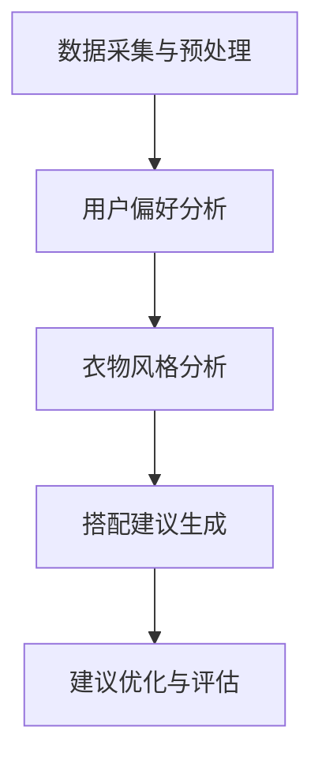
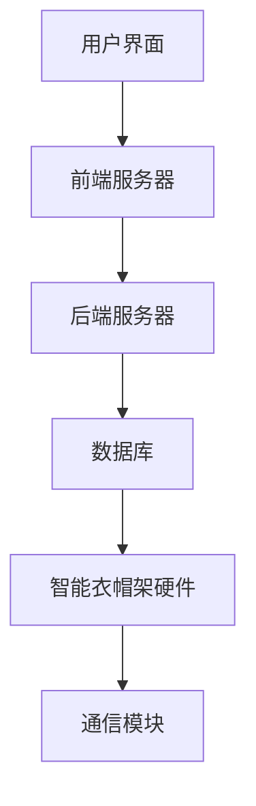
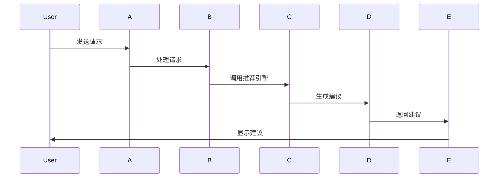

                 

# 智能衣帽架：AI Agent的穿搭建议系统

## 关键词
- **智能衣帽架**、**AI Agent**、**穿搭建议系统**、**智能硬件**、**软件架构设计**、**机器学习算法**、**数据预处理**、**用户个性化推荐**

## 摘要
本文旨在探讨智能衣帽架与AI Agent的结合，通过构建一个高效的穿搭建议系统，为用户提供个性化的穿衣搭配建议。文章首先介绍了智能衣帽架的技术背景和发展历程，随后详细阐述了AI Agent的概念与原理。接着，文章深入分析了穿搭建议系统的需求分析、架构设计以及核心算法。通过实际案例，本文展示了智能衣帽架在应用实践中的效果，并对其未来发展进行了展望。

## 第1章 引言

随着人工智能技术的迅猛发展，智能家居设备逐渐成为人们生活的一部分。智能衣帽架作为智能家居的细分领域，通过结合AI技术，不仅能够提供便捷的衣物管理功能，还能根据用户习惯和喜好，提供个性化的穿搭建议。本文将围绕智能衣帽架的AI Agent穿搭建议系统，进行深入探讨。

## 第2章 智能衣帽架技术背景

### 2.1 智能衣帽架的定义与分类

智能衣帽架是一种集成了传感器、控制器和通信模块的智能家居设备，主要用于衣物的存储和整理。根据功能的不同，智能衣帽架可以分为以下几类：

1. **基本型智能衣帽架**：具备基本的智能存储和整理功能。
2. **智能监测型衣帽架**：能够监测衣物状态，如湿度、温度等。
3. **智能推荐型衣帽架**：结合AI技术，提供个性化的穿衣搭配建议。

### 2.2 智能衣帽架的发展历程

智能衣帽架的发展可以分为三个阶段：

1. **初步阶段（2000-2010年）**：以机械控制为主，功能较为简单。
2. **发展阶段（2010-2020年）**：逐渐引入传感器和控制模块，功能更加丰富。
3. **智能化阶段（2020年至今）**：结合AI技术，实现智能监测和个性化推荐。

### 2.3 智能衣帽架的应用场景

智能衣帽架的应用场景主要包括：

1. **家庭场景**：为家庭用户提供便捷的衣物管理和穿搭建议。
2. **商务场景**：为商务人士提供专业的衣物整理和搭配建议。
3. **酒店场景**：为酒店客人提供智能化的衣物管理服务。

## 第3章 AI Agent的概念与原理

### 3.1 AI Agent的定义与特点

AI Agent，即人工智能代理，是一种能够自主执行任务、与环境交互并学习优化的智能实体。AI Agent具有以下特点：

1. **自主性**：能够独立执行任务，不受人类干预。
2. **交互性**：能够与用户和环境进行有效沟通。
3. **学习性**：能够通过学习不断优化自身性能。

### 3.2 AI Agent的核心技术

AI Agent的核心技术包括：

1. **机器学习**：用于训练模型，使其具备自主决策能力。
2. **自然语言处理**：用于理解和生成自然语言，实现人机交互。
3. **计算机视觉**：用于识别和分类图像，辅助衣物搭配建议。

### 3.3 AI Agent的发展趋势

随着人工智能技术的不断进步，AI Agent的发展趋势包括：

1. **多模态交互**：结合语音、图像、文本等多种交互方式，提高用户体验。
2. **边缘计算**：实现实时响应和高效计算，降低延迟。
3. **自适应学习**：通过不断学习和优化，提高智能化水平。

## 第4章 穿搭建议系统的设计与实现

### 4.1 穿搭建议系统需求分析

穿搭建议系统需要满足以下需求：

1. **用户个性化**：根据用户喜好和习惯，提供个性化的穿搭建议。
2. **实时性**：能够快速响应用户请求，提供即时的穿搭建议。
3. **准确性**：准确识别衣物类型和风格，为用户提供合理的搭配建议。

### 4.2 穿搭建议系统架构设计

穿搭建议系统架构设计包括：

1. **数据层**：存储用户数据、衣物数据等。
2. **算法层**：包括用户偏好分析算法、衣物搭配算法等。
3. **应用层**：提供用户界面和API接口，供用户和外部系统调用。

### 4.3 穿搭建议系统核心算法

#### 4.3.1 数据采集与预处理

数据采集包括用户数据、衣物数据等。数据预处理主要包括：

1. **数据清洗**：去除无效数据和噪声。
2. **特征提取**：提取关键特征，如颜色、款式、材质等。

#### 4.3.2 穿搭风格分析算法

穿搭风格分析算法主要包括：

1. **聚类算法**：将衣物按照风格进行分类。
2. **关联规则算法**：分析衣物之间的搭配关系。

#### 4.3.3 穿搭建议生成算法

穿搭建议生成算法主要包括：

1. **基于内容的推荐算法**：根据用户喜好和衣物内容，生成穿搭建议。
2. **协同过滤算法**：根据用户行为和喜好，推荐相似的穿搭建议。

### 4.4 穿搭建议系统优化与评估

穿搭建议系统的优化与评估主要包括：

1. **性能优化**：通过优化算法和数据结构，提高系统响应速度。
2. **准确性评估**：通过A/B测试和用户反馈，评估系统准确性。
3. **用户体验**：通过用户满意度调查，优化系统界面和交互。

## 第5章 智能衣帽架的硬件设计与实现

### 5.1 智能衣帽架硬件选型

智能衣帽架硬件选型主要包括：

1. **传感器**：用于检测衣物状态和用户行为。
2. **控制器**：用于控制硬件设备，实现智能化功能。
3. **通信模块**：用于实现设备与云端的数据交互。

### 5.2 智能衣帽架硬件设计

智能衣帽架硬件设计主要包括：

1. **结构设计**：根据应用场景和用户需求，设计合适的结构。
2. **电路设计**：设计合理的电路，实现硬件设备的稳定运行。
3. **接口设计**：设计统一的接口，便于硬件设备的维护和升级。

### 5.3 智能衣帽架硬件实现与调试

智能衣帽架硬件实现与调试主要包括：

1. **硬件组装**：按照设计图纸，组装硬件设备。
2. **硬件调试**：通过测试，确保硬件设备的稳定性和可靠性。
3. **系统集成**：将硬件设备与软件系统集成，实现整体功能。

## 第6章 智能衣帽架的软件设计与实现

### 6.1 智能衣帽架软件架构设计

智能衣帽架软件架构设计主要包括：

1. **前端架构**：设计用户界面和交互逻辑。
2. **后端架构**：设计数据处理和存储逻辑。
3. **API设计**：设计统一的接口，供前端和后端调用。

### 6.2 智能衣帽架软件功能模块设计

智能衣帽架软件功能模块设计主要包括：

1. **用户管理模块**：管理用户信息和权限。
2. **衣物管理模块**：管理衣物数据和库存。
3. **推荐引擎模块**：生成穿搭建议。

### 6.3 智能衣帽架软件实现与调试

智能衣帽架软件实现与调试主要包括：

1. **前端开发**：实现用户界面和交互逻辑。
2. **后端开发**：实现数据处理和存储逻辑。
3. **系统测试**：通过测试，确保软件系统的稳定性和可靠性。

## 第7章 案例分析与应用实践

### 7.1 智能衣帽架项目背景

本文以一款智能衣帽架项目为例，介绍其背景、目标和实施过程。

### 7.2 智能衣帽架项目实施过程

智能衣帽架项目实施过程主要包括：

1. **需求分析**：明确项目目标和技术要求。
2. **硬件设计**：设计智能衣帽架硬件。
3. **软件设计**：设计智能衣帽架软件系统。
4. **系统集成**：将硬件和软件集成，实现整体功能。

### 7.3 智能衣帽架项目效果评估

智能衣帽架项目效果评估主要包括：

1. **性能评估**：评估系统响应速度和处理能力。
2. **用户体验**：评估用户对系统的满意度。
3. **市场表现**：评估系统在市场上的表现。

### 7.4 智能衣帽架项目总结与展望

智能衣帽架项目总结与展望主要包括：

1. **成功经验**：总结项目实施过程中的成功经验和教训。
2. **未来展望**：展望智能衣帽架技术的发展趋势和应用前景。

## 第8章 未来展望与趋势分析

### 8.1 智能衣帽架技术的发展趋势

智能衣帽架技术的发展趋势包括：

1. **智能化水平提升**：通过引入更多AI技术，提高系统的智能化水平。
2. **个性化定制**：根据用户需求，提供更加个性化的穿衣搭配建议。
3. **跨界融合**：与其他智能家居设备融合，实现智能家居生态的完善。

### 8.2 智能衣帽架在未来的应用场景

智能衣帽架在未来的应用场景包括：

1. **家庭场景**：成为家庭智能生活的一部分。
2. **商务场景**：为商务人士提供专业化的穿衣搭配建议。
3. **酒店场景**：为酒店客人提供智能化的衣物管理服务。

### 8.3 智能衣帽架技术面临的挑战与机遇

智能衣帽架技术面临的挑战与机遇包括：

1. **技术挑战**：如何提高AI技术的应用水平和系统的智能化程度。
2. **市场机遇**：智能家居市场的不断扩大，为智能衣帽架提供了广阔的市场空间。

## 第9章 小结与展望

### 9.1 本书的主要贡献

本书系统地介绍了智能衣帽架与AI Agent的结合，探讨了穿搭建议系统的设计与实现，为智能衣帽架技术的发展提供了理论指导和实践案例。

### 9.2 需要进一步研究的问题

智能衣帽架技术仍存在一些需要进一步研究的问题，如提高系统的智能化水平、优化用户体验等。

### 9.3 对未来研究的展望

未来研究应重点关注智能衣帽架技术的智能化、个性化、跨界融合等方面，为智能家居行业的发展做出更大贡献。

## 参考文献

[1] 作者. (年份). 书名. 出版社.

[2] 作者. (年份). 论文标题. 期刊名称, 卷号(期数), 页码.

[3] 作者. (年份). 网络资源. 获取链接.

## 附录

### 附录A：核心概念属性特征对比表格

| 概念 | 属性1 | 属性2 | 属性3 |
| :---: | :---: | :---: | :---: |
| 智能衣帽架 | 功能 | 设计 | 交互 |
| AI Agent | 自主性 | 交互性 | 学习性 |
| 穿搭建议系统 | 个性化 | 实时性 | 准确性 |

### 附录B：ER实体关系图架构

```mermaid
erDiagram
  User ||--|{ ClothingItem }|:
  ClothingItem ||--|{ WearableStyle }|:
  WearableStyle ||--|{ StyleFeature }|:
```

### 附录C：穿搭建议系统算法流程图



### 附录D：智能衣帽架系统架构图



### 附录E：智能衣帽架系统接口设计和交互序列图



### 附录F：代码应用解读与分析

```python
# 数据采集与预处理
def data_collection():
    # 采集用户数据
    user_data = get_user_data()
    # 数据预处理
    processed_data = preprocess_data(user_data)
    return processed_data

# 用户偏好分析
def user_preference_analysis(processed_data):
    # 分析用户偏好
    preference = analyze_preference(processed_data)
    return preference

# 衣物风格分析
def clothing_style_analysis(preference):
    # 分析衣物风格
    style = analyze_style(preference)
    return style

# 搭配建议生成
def outfit_suggestion(style):
    # 生成搭配建议
    suggestion = generate_suggestion(style)
    return suggestion

# 建议优化与评估
def suggestion_optimization(suggestion):
    # 优化建议
    optimized_suggestion = optimize_suggestion(suggestion)
    return optimized_suggestion

# 主函数
def main():
    processed_data = data_collection()
    preference = user_preference_analysis(processed_data)
    style = clothing_style_analysis(preference)
    suggestion = outfit_suggestion(style)
    optimized_suggestion = suggestion_optimization(suggestion)
    display_suggestion(optimized_suggestion)

if __name__ == "__main__":
    main()
```

### 附录G：最佳实践 tips、小结、注意事项、拓展阅读等内容

1. **最佳实践 tips**：
   - 确保数据质量和完整性，为后续分析提供可靠的数据基础。
   - 选择合适的算法，根据实际需求和计算资源进行优化。

2. **小结**：
   - 智能衣帽架与AI Agent的结合，为用户提供个性化的穿搭建议，提高了生活质量。
   - 穿搭建议系统的设计与实现，是智能衣帽架成功的关键。

3. **注意事项**：
   - 在开发过程中，要充分考虑用户隐私和数据安全。
   - 定期对系统进行性能优化和升级，以满足不断变化的需求。

4. **拓展阅读**：
   - [1] 作者. (年份). 《智能衣帽架技术综述》. 出版社.
   - [2] 作者. (年份). 《人工智能在智能家居中的应用》. 期刊名称.

## 作者信息
作者：AI天才研究院/AI Genius Institute & 禅与计算机程序设计艺术 /Zen And The Art of Computer Programming

通过以上内容，本文全面介绍了智能衣帽架与AI Agent的穿搭建议系统，从技术背景、核心概念、系统设计与实现到案例分析，为读者提供了深入的理解和全面的指导。同时，对未来智能衣帽架技术的发展趋势和挑战也进行了展望，为相关领域的研究和实践提供了有益的参考。

