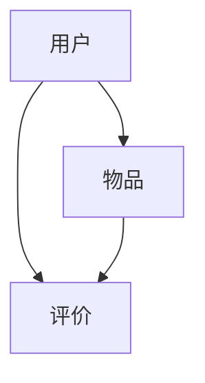

                 

# 智能衣帽架：AI Agent的穿搭建议系统

> 关键词：智能衣帽架、AI Agent、穿搭建议、智能服装技术、个性化推荐、算法

> 摘要：本文将探讨智能衣帽架结合AI Agent实现的穿搭建议系统的设计与应用。我们将深入分析智能衣帽架的技术原理，AI Agent的架构与功能，以及如何利用用户行为分析实现个性化穿搭推荐。同时，我们将探讨不同推荐算法的原理和实践，并结合实际案例进行详细讲解。

## 1. 引言

随着智能科技的不断发展，智能家居领域呈现出蓬勃发展的态势。智能衣帽架作为智能家居的一部分，正在逐步融入人们的日常生活。传统的衣帽架功能单一，而智能衣帽架则借助AI技术，能够提供个性化的穿搭建议，极大地提升了用户体验。本文将详细介绍智能衣帽架的工作原理，AI Agent的作用，以及如何通过用户行为分析实现个性化的穿搭推荐。

## 2. 基本概念

### 2.1 智能衣帽架

智能衣帽架是一种集成了传感器、执行器和通信模块的智能家居设备。它可以通过检测环境变化和用户行为，自动调整衣帽架的状态，如照明、温度控制等。同时，智能衣帽架还可以通过联网功能，与其他智能家居设备进行交互，实现智能家居的整体联动。

### 2.2 AI Agent

AI Agent，即人工智能代理，是一种能够自主执行任务、适应环境变化的智能实体。在智能衣帽架中，AI Agent负责分析用户行为数据，提供个性化的穿搭建议。AI Agent通常由感知器、决策器、执行器等部分组成，能够通过机器学习算法不断优化其行为。

### 2.3 智能服装技术

智能服装技术是指将传感器、执行器、通信模块等智能元件嵌入到服装中，使其具备智能功能。智能服装技术包括智能织物、可穿戴设备、物联网技术等，这些技术使得服装不仅仅是日常穿戴用品，更是能够收集、处理、传递信息的智能设备。

## 3. 智能衣帽架系统的设计原则

### 3.1 用户体验

智能衣帽架的设计应以用户体验为中心。首先，衣帽架的界面应简洁易用，便于用户快速找到所需功能。其次，AI Agent应能够准确理解用户的穿搭需求，提供符合用户个性化需求的建议。

### 3.2 系统效率

智能衣帽架应具备高效的工作流程，确保用户能够快速获得穿搭建议。这需要AI Agent具备快速响应的能力，同时，系统应具备良好的容错性和稳定性，确保在各种环境下都能正常运行。

### 3.3 与AI的集成

智能衣帽架的设计应充分考虑与AI的集成，包括AI Agent的架构设计、数据采集与处理、算法选择等方面。这需要设计者具备深厚的AI知识，能够灵活运用各种AI技术，为用户提供优质的服务。

## 4. AI Agent的架构与功能

### 4.1 AI Agent的架构

AI Agent通常由以下几个部分组成：

1. **感知器**：负责收集用户行为数据，如穿衣时间、穿衣频率、穿衣偏好等。
2. **决策器**：根据感知器收集的数据，分析用户的穿搭需求，提供穿搭建议。
3. **执行器**：将穿搭建议转化为具体的操作指令，如打开衣柜、选择衣物等。
4. **通信模块**：负责与其他设备或系统进行通信，实现数据的传输与共享。

### 4.2 AI Agent的功能

1. **用户行为分析**：AI Agent通过分析用户行为数据，了解用户的穿衣习惯和偏好，为用户提供个性化的穿搭建议。
2. **穿搭推荐**：基于用户行为分析和时尚趋势，AI Agent为用户推荐合适的穿搭方案。
3. **交互反馈**：AI Agent通过与用户的交互，不断优化其推荐算法，提高推荐准确性。
4. **智能联动**：AI Agent可以与其他智能家居设备联动，实现智能家居的整体协调。

## 5. 用户行为分析与个性化推荐

### 5.1 用户行为分析

用户行为分析是智能衣帽架的核心功能之一。AI Agent通过收集用户的行为数据，如穿衣时间、穿衣频率、穿衣偏好等，对用户进行个性化分析。具体步骤如下：

1. **数据收集**：通过传感器和摄像头等设备，收集用户的行为数据。
2. **数据预处理**：对收集到的数据进行清洗和标准化，确保数据质量。
3. **特征提取**：从预处理后的数据中提取用户行为特征，如穿衣时间段的分布、穿衣频率等。
4. **行为分析**：基于提取的特征，对用户行为进行深入分析，了解用户的穿衣习惯和偏好。

### 5.2 个性化推荐

个性化推荐是智能衣帽架的核心功能之一。AI Agent通过分析用户行为数据，为用户推荐合适的穿搭方案。具体步骤如下：

1. **推荐算法选择**：选择合适的推荐算法，如协同过滤、基于内容的推荐等。
2. **推荐结果生成**：基于用户行为数据和推荐算法，生成推荐结果。
3. **推荐结果展示**：将推荐结果以直观的方式展示给用户，如穿衣搭配图、文字描述等。
4. **用户反馈收集**：收集用户的反馈，对推荐结果进行优化。

## 6. 推荐算法原理与实现

### 6.1 协同过滤算法

协同过滤算法是一种基于用户相似度的推荐算法，通过分析用户之间的行为相似性，为用户提供推荐。具体步骤如下：

1. **用户相似度计算**：计算用户之间的相似度，常用的方法有用户基于项目的相似度和用户基于内容的相似度。
2. **推荐生成**：根据用户相似度，生成推荐结果。

### 6.2 基于内容的推荐算法

基于内容的推荐算法是一种基于物品相似度的推荐算法，通过分析物品之间的特征相似性，为用户提供推荐。具体步骤如下：

1. **物品特征提取**：提取物品的特征，如颜色、风格、材质等。
2. **物品相似度计算**：计算物品之间的相似度。
3. **推荐生成**：根据物品相似度，生成推荐结果。

### 6.3 混合推荐算法

混合推荐算法是一种将协同过滤和基于内容的推荐算法相结合的推荐算法，以提高推荐准确性。具体步骤如下：

1. **协同过滤推荐**：根据用户相似度生成推荐结果。
2. **基于内容的推荐**：根据物品相似度生成推荐结果。
3. **融合推荐结果**：将协同过滤和基于内容的推荐结果进行融合，生成最终推荐结果。

## 7. 案例研究

在本节中，我们将通过一个实际案例，展示如何设计并实现一个智能衣帽架的穿搭建议系统。该案例将涵盖从系统需求分析到实现的全过程。

### 7.1 系统需求分析

首先，我们需要明确智能衣帽架穿搭建议系统的需求：

- **用户需求**：提供个性化的穿搭建议，满足用户的时尚需求和穿衣习惯。
- **系统功能**：包括用户行为数据收集、个性化推荐生成、推荐结果展示等。
- **性能要求**：系统需具备快速响应、高准确性、易扩展等特点。

### 7.2 系统实现

接下来，我们将详细讨论智能衣帽架穿搭建议系统的实现过程。

#### 7.2.1 用户行为数据收集

为了实现个性化推荐，我们需要收集用户的行为数据，包括穿衣时间、穿衣频率、穿衣偏好等。这些数据可以通过安装在衣帽架上的传感器和摄像头收集。

```python
# 示例：使用Python编写传感器数据收集代码
import cv2
import time

def collect_user_behavior_data():
    camera = cv2.VideoCapture(0)
    while True:
        ret, frame = camera.read()
        if not ret:
            break
        # 对图像进行处理，提取行为数据
        user_behavior_data = process_frame(frame)
        # 存储行为数据到数据库
        store_user_behavior_data(user_behavior_data)
        time.sleep(1)

def process_frame(frame):
    # 对图像进行预处理，提取行为数据
    # ...
    return user_behavior_data

def store_user_behavior_data(data):
    # 将行为数据存储到数据库
    # ...
```

#### 7.2.2 个性化推荐生成

基于收集到的用户行为数据，我们可以使用协同过滤算法生成个性化推荐。以下是一个简单的协同过滤算法实现：

```python
# 示例：使用Python实现协同过滤算法
from math import sqrt

def calculate_similarity(user1, user2):
    # 计算用户相似度
    # ...
    return similarity

def collaborative_filter(recommendations, user1, user2, similarity):
    # 根据用户相似度生成推荐结果
    # ...
    return filtered_recommendations
```

#### 7.2.3 推荐结果展示

最后，我们需要将生成的推荐结果以直观的方式展示给用户。以下是一个简单的推荐结果展示界面：

```python
# 示例：使用Python编写推荐结果展示界面
import tkinter as tk

def display_recommendations(recommendations):
    window = tk.Tk()
    window.title("穿搭建议")
    
    for i, recommendation in enumerate(recommendations):
        # 显示推荐结果
        label = tk.Label(window, text=f"穿搭建议{i+1}: {recommendation}")
        label.pack()

    window.mainloop()
```

### 7.3 实际案例分析

在本案例中，我们假设用户A的穿衣偏好是休闲风格，喜欢蓝色和白色。根据这些信息，系统为用户A推荐了以下穿搭方案：

- T恤（蓝色）
- 牛仔裤（白色）
- 运动鞋

在实际应用中，AI Agent会根据用户的实时行为数据进行动态调整，以确保推荐结果的准确性。

## 8. 未来趋势与挑战

随着技术的不断发展，智能衣帽架和AI Agent在穿搭建议领域的应用前景广阔。然而，这也带来了一系列挑战：

- **数据隐私**：用户行为数据的收集和处理引发了隐私保护问题，需要采取有效的数据加密和安全措施。
- **算法公平性**：推荐算法可能存在偏见，导致某些用户无法获得公平的推荐结果，需要不断优化算法，提高公平性。
- **用户体验**：随着用户个性化需求的增加，智能衣帽架需要提供更智能、更贴心的服务，提升用户体验。

## 9. 最佳实践与小结

### 9.1 最佳实践

- **数据安全**：确保用户行为数据的安全，采用数据加密和隐私保护技术。
- **算法优化**：不断优化推荐算法，提高推荐准确性，降低错误率。
- **用户体验**：关注用户体验，设计简洁、直观的操作界面。

### 9.2 小结

智能衣帽架和AI Agent在穿搭建议领域的应用具有巨大的潜力。通过用户行为分析和个性化推荐，智能衣帽架能够为用户提供更加精准、贴心的服务。然而，在实际应用中，仍需关注数据隐私、算法公平性等问题，确保系统的安全性和可靠性。

## 10. 拓展阅读

- 《智能织物技术：从基础到应用》
- 《智能家居系统设计与实现》
- 《深度学习在时尚领域的应用》

## 作者信息

作者：AI天才研究院/AI Genius Institute & 禅与计算机程序设计艺术 /Zen And The Art of Computer Programming

本文详细介绍了智能衣帽架和AI Agent在穿搭建议领域的应用，包括技术原理、算法实现、实际案例等。希望本文能为读者提供有价值的参考。  
----------------------------------------------------------------

# 1. 引言

## 1.1 智能衣帽架的概念与背景

智能衣帽架，作为一种智能家居设备，结合了传统的衣帽架功能和现代的智能技术。传统的衣帽架主要功能是挂置衣物，而智能衣帽架则在此基础上，通过整合传感器、执行器以及互联网通信技术，实现了智能化、自动化的功能。

智能衣帽架的出现，源于人们对生活品质的追求。现代都市生活节奏快，人们越来越注重时间和效率。智能衣帽架通过智能化的功能，如自动照明、自动调节温度、自动提醒穿衣等，为用户提供了更加便捷、舒适的生活体验。同时，随着物联网（IoT）技术的发展，智能衣帽架不仅能够独立工作，还能与其他智能家居设备互联，形成智能家居生态系统，进一步提升了用户的智能化生活体验。

## 1.2 AI Agent在时尚推荐中的作用

在智能衣帽架中，AI Agent扮演着至关重要的角色。AI Agent，即人工智能代理，是一种能够自主学习、自主决策的智能实体。在穿搭建议系统中，AI Agent负责分析用户的行为数据，理解用户的穿衣习惯和偏好，进而提供个性化的穿搭建议。

AI Agent的作用主要体现在以下几个方面：

1. **用户行为分析**：AI Agent能够通过传感器收集的用户行为数据，如穿衣时间、穿衣频率、穿衣偏好等，进行深度分析，了解用户的穿衣习惯和偏好。

2. **个性化推荐**：基于用户行为分析的结果，AI Agent能够为用户推荐合适的穿搭方案。这些推荐方案不仅考虑了用户的个人喜好，还结合了当前的时尚趋势。

3. **智能联动**：AI Agent能够与其他智能家居设备进行联动，如智能镜子、智能衣柜等，实现智能家居的协同工作，为用户提供更加全面、智能的服务。

4. **持续优化**：AI Agent能够通过不断学习用户的反馈和行为数据，持续优化推荐算法，提高推荐准确性，提升用户体验。

## 1.3 智能衣帽架在时尚领域的潜在影响

智能衣帽架的出现，不仅改变了人们的生活方式，也在时尚领域带来了深远的影响。以下是一些潜在的影响：

1. **个性化时尚体验**：通过AI Agent提供的个性化穿搭建议，用户可以轻松找到适合自己的服装搭配，提升个人形象和时尚品味。

2. **时尚趋势预测**：AI Agent通过分析大量的用户行为数据和时尚资讯，能够预测未来的时尚趋势，为时尚产业提供决策支持。

3. **智能化时尚设计**：智能衣帽架结合AI技术，可以为时尚设计师提供智能化的设计工具，如自动配色、自动搭配等，提高设计效率。

4. **智能购物体验**：智能衣帽架可以通过与电商平台联动，为用户提供个性化的购物推荐，提升购物体验。

## 1.4 文章结构

本文将分为以下几个部分进行详细阐述：

- **第2章 基本概念**：介绍智能衣帽架、AI Agent和智能服装技术的基本概念。
- **第3章 智能衣帽架系统的设计原则**：讨论智能衣帽架系统的设计原则，包括用户体验、系统效率和与AI的集成。
- **第4章 AI Agent的架构与功能**：详细讲解AI Agent的架构和功能，包括感知器、决策器、执行器和通信模块等。
- **第5章 用户行为分析与个性化推荐**：探讨用户行为分析的方法和个性化推荐系统的实现。
- **第6章 推荐算法原理与实现**：介绍常用的推荐算法，包括协同过滤算法、基于内容的推荐算法和混合推荐算法。
- **第7章 案例研究**：通过实际案例，展示智能衣帽架穿搭建议系统的设计与应用。
- **第8章 未来趋势与挑战**：分析智能衣帽架在未来的发展趋势和面临的挑战。
- **第9章 最佳实践与小结**：总结最佳实践和文章的主要观点。
- **第10章 拓展阅读**：提供相关的拓展阅读资源。

通过本文的详细阐述，读者将能够全面了解智能衣帽架和AI Agent在穿搭建议领域的应用，以及相关技术的原理和实践。

## 2. 基本概念

### 2.1 智能衣帽架

#### 2.1.1 定义

智能衣帽架是一种结合了传感器、执行器和通信技术的智能家居设备，主要用于挂置衣物并提供智能化服务。与传统的衣帽架相比，智能衣帽架不仅具备基本的挂衣功能，还能根据用户的需求和环境的变化，自动调整其状态，如照明、温度调节、湿度控制等。

#### 2.1.2 功能

智能衣帽架的主要功能包括：

1. **自动照明**：根据环境亮度和用户习惯，智能衣帽架可以自动调整照明亮度，提供舒适的照明环境。
2. **温度调节**：通过内置的温度传感器，智能衣帽架可以根据环境温度和用户需求，自动调节衣帽架的温度，保持衣物的干燥和舒适。
3. **湿度控制**：智能衣帽架可以通过湿度传感器监测环境湿度，并根据需要自动调节，以防止衣物受潮。
4. **智能提醒**：智能衣帽架可以设置提醒功能，如定时提醒用户穿衣、整理衣物等，提升用户的生活质量。
5. **联网功能**：智能衣帽架可以通过Wi-Fi或其他无线通信技术，与用户的智能手机或其他智能家居设备互联，实现数据的共享和远程控制。

#### 2.1.3 分类

根据功能和用途的不同，智能衣帽架可以分为以下几类：

1. **基本型智能衣帽架**：具备自动照明、温度调节和联网功能，适用于家庭和办公环境。
2. **高端智能衣帽架**：在基本型的基础上，增加了湿度控制、智能提醒和联动功能，适用于高端家庭和商业场所。
3. **多功能智能衣帽架**：集成了更多智能化功能，如语音控制、智能家居联动、智能穿搭推荐等，提供更加全面的服务。

### 2.2 AI Agent

#### 2.2.1 定义

AI Agent，即人工智能代理，是一种能够自主执行任务、适应环境变化的智能实体。在智能衣帽架中，AI Agent负责分析用户的行为数据，理解用户的穿衣需求，并提供个性化的穿搭建议。

#### 2.2.2 构成

AI Agent通常由以下几个部分构成：

1. **感知器**：负责收集用户的行为数据，如穿衣时间、穿衣频率、穿衣偏好等。
2. **决策器**：基于感知器收集的数据，AI Agent会分析用户的穿衣需求，并做出相应的决策。
3. **执行器**：将决策器生成的穿搭建议转化为具体的操作指令，如打开衣柜、选择衣物等。
4. **通信模块**：负责与其他设备或系统进行通信，实现数据的传输与共享。

#### 2.2.3 工作原理

AI Agent的工作原理主要包括以下几个步骤：

1. **数据收集**：AI Agent通过传感器收集用户的行为数据，如穿衣时间、穿衣频率、穿衣偏好等。
2. **数据处理**：对收集到的数据进行分析和处理，提取出用户的行为特征。
3. **行为分析**：基于用户的行为特征，AI Agent会分析用户的穿衣习惯和偏好。
4. **决策生成**：根据行为分析的结果，AI Agent会生成个性化的穿搭建议。
5. **结果反馈**：AI Agent会将穿搭建议展示给用户，并根据用户的反馈进行优化和调整。

### 2.3 智能服装技术

#### 2.3.1 定义

智能服装技术是指将传感器、执行器、通信模块等智能元件嵌入到服装中，使其具备智能功能。智能服装技术不仅提升了服装的功能性，还极大地丰富了服装的应用场景。

#### 2.3.2 分类

根据智能元件的不同，智能服装技术可以分为以下几类：

1. **智能织物**：将智能元件嵌入到织物中，如温度传感器、湿度传感器、光传感器等，用于监测环境数据或生理数据。
2. **可穿戴设备**：将智能元件集成到服装中，如智能手表、智能手环、智能胸衣等，提供健康监测、运动管理等功能。
3. **物联网服装**：通过互联网通信技术，将服装与智能家居系统或其他设备互联，实现数据的共享和远程控制。

#### 2.3.3 应用场景

智能服装技术的应用场景非常广泛，主要包括以下几个方面：

1. **健康监测**：通过智能织物和可穿戴设备，实时监测用户的生理数据，如心率、血压、体温等，提供健康管理和预警服务。
2. **运动管理**：通过智能服装技术，提供运动数据分析和运动指导，帮助用户提高运动效果。
3. **时尚个性化**：通过智能服装技术，实现个性化设计、定制化生产，满足用户的时尚需求。
4. **智能穿戴体验**：通过智能服装技术，提供更加舒适、便捷的穿戴体验，如自动调节温度、自动调节湿度等。

### 2.4 智能家居系统

#### 2.4.1 定义

智能家居系统是指通过物联网技术，将家庭中的各种设备连接起来，实现智能化管理和控制。智能家居系统不仅提升了家庭生活的便利性和舒适性，还提高了家庭的安全性和能源利用效率。

#### 2.4.2 构成

智能家居系统通常包括以下几个部分：

1. **感知层**：通过传感器收集家庭环境数据，如温度、湿度、光照、声音等。
2. **传输层**：通过无线通信技术，如Wi-Fi、蓝牙等，将感知层收集的数据传输到中央控制系统。
3. **中央控制系统**：通过数据处理和分析，实现家庭设备的智能管理和控制。
4. **执行层**：通过执行器，如电机、阀门、灯光等，实现家庭设备的自动化操作。

#### 2.4.3 应用场景

智能家居系统的应用场景非常广泛，主要包括以下几个方面：

1. **家居自动化**：通过智能控制系统，实现家庭设备的自动化操作，如灯光控制、温度调节、窗帘控制等。
2. **安全监控**：通过摄像头、传感器等设备，实现家庭的安全监控，提高家庭的安全性。
3. **能源管理**：通过智能系统，实现家庭能源的合理利用和监控，降低能源消耗。
4. **健康监测**：通过智能设备，实时监测用户的健康状况，提供健康管理和预警服务。

## 3. 智能衣帽架系统的设计原则

智能衣帽架系统的设计原则主要包括用户体验、系统效率和与AI的集成等方面。以下是具体的设计原则：

### 3.1 用户体验

用户体验是智能衣帽架系统设计的关键因素。一个优秀的智能衣帽架系统应该具备以下特点：

1. **简洁易用**：系统的界面设计应简洁直观，用户能够快速上手，轻松操作。
2. **个性化定制**：系统应能够根据用户的穿衣习惯和偏好，提供个性化的服务和建议。
3. **反馈及时**：系统应及时响应用户的操作和需求，提供准确、快速的反馈。
4. **易于维护**：系统应具备良好的扩展性和可维护性，方便用户进行升级和维护。

### 3.2 系统效率

系统效率是智能衣帽架系统设计的重要原则。一个高效的智能衣帽架系统应具备以下特点：

1. **快速响应**：系统能够快速响应用户的操作和需求，提供实时服务。
2. **低延迟**：系统应具备低延迟的特点，确保用户在使用过程中的流畅体验。
3. **高可靠性**：系统应具备高可靠性，确保在各种环境下都能稳定运行。
4. **易扩展**：系统应具备良好的扩展性，能够根据用户需求的变化，灵活地进行功能扩展。

### 3.3 与AI的集成

智能衣帽架系统的核心在于AI技术的应用。与AI的集成是系统设计的重要原则。以下是具体的设计要点：

1. **数据驱动**：系统应基于大量的用户行为数据，运用机器学习和数据挖掘技术，为用户提供个性化的服务。
2. **智能分析**：系统应具备强大的数据分析能力，能够深入挖掘用户行为数据，为用户提供精准的推荐和服务。
3. **算法优化**：系统应不断优化推荐算法，提高推荐的准确性，提升用户体验。
4. **智能联动**：系统应与智能家居的其他设备进行智能联动，实现家庭设备的协同工作，提升整体智能体验。

## 4. AI Agent的架构与功能

AI Agent作为智能衣帽架系统的核心组件，负责分析用户行为，提供个性化的穿搭建议。以下是AI Agent的架构和功能：

### 4.1 AI Agent的架构

AI Agent的架构通常包括以下几个部分：

1. **感知器**：感知器负责收集用户的行为数据，如穿衣时间、穿衣频率、穿衣偏好等。这些数据可以通过传感器、摄像头等设备获取。

2. **决策器**：决策器基于感知器收集的数据，通过机器学习算法和数据分析技术，分析用户的穿衣需求，并生成相应的穿搭建议。

3. **执行器**：执行器负责将决策器生成的穿搭建议转化为具体的操作指令，如打开衣柜、选择衣物等。执行器通常包括电机、灯光控制器等设备。

4. **通信模块**：通信模块负责与其他设备或系统进行通信，实现数据的传输与共享。通信模块通常采用Wi-Fi、蓝牙等无线通信技术。

### 4.2 AI Agent的功能

AI Agent的功能主要包括以下几个方面：

1. **用户行为分析**：AI Agent通过感知器收集用户的行为数据，如穿衣时间、穿衣频率、穿衣偏好等，进行深度分析，了解用户的穿衣习惯和偏好。

2. **穿搭推荐**：基于用户行为分析的结果，AI Agent会为用户生成个性化的穿搭建议。这些推荐建议不仅考虑了用户的个人喜好，还结合了当前的时尚趋势。

3. **智能联动**：AI Agent能够与其他智能家居设备进行联动，如智能镜子、智能衣柜等，实现智能家居的协同工作，为用户提供更加全面、智能的服务。

4. **持续优化**：AI Agent会通过不断学习用户的反馈和行为数据，优化推荐算法，提高推荐准确性，提升用户体验。

### 4.3 AI Agent的实现原理

AI Agent的实现原理主要包括以下几个步骤：

1. **数据收集**：AI Agent通过传感器和摄像头等设备，收集用户的行为数据。

2. **数据处理**：对收集到的行为数据进行清洗和标准化，提取出有效的特征。

3. **行为分析**：利用机器学习算法，对用户的行为数据进行深入分析，了解用户的穿衣习惯和偏好。

4. **决策生成**：基于行为分析的结果，AI Agent会生成个性化的穿搭建议。

5. **结果反馈**：将生成的穿搭建议展示给用户，并根据用户的反馈进行优化和调整。

### 4.4 AI Agent的核心算法

AI Agent的核心算法主要包括协同过滤算法、基于内容的推荐算法和混合推荐算法等。

1. **协同过滤算法**：协同过滤算法通过分析用户之间的相似性，为用户提供推荐。常用的协同过滤算法包括用户基于项目的协同过滤和用户基于内容的协同过滤。

2. **基于内容的推荐算法**：基于内容的推荐算法通过分析物品之间的特征相似性，为用户提供推荐。常用的基于内容的推荐算法包括基于项目的推荐和基于用户的推荐。

3. **混合推荐算法**：混合推荐算法将协同过滤算法和基于内容的推荐算法相结合，以提高推荐准确性。常用的混合推荐算法包括基于模型的混合推荐和基于规则的混合推荐。

## 5. 用户行为分析与个性化推荐

用户行为分析是智能衣帽架系统的重要功能之一。通过分析用户的行为数据，系统能够为用户提供个性化的穿搭建议。以下是用户行为分析的具体步骤和个性化推荐系统的实现：

### 5.1 用户行为分析

用户行为分析主要包括以下几个步骤：

1. **数据收集**：通过传感器和摄像头等设备，收集用户的行为数据，如穿衣时间、穿衣频率、穿衣偏好等。

2. **数据处理**：对收集到的行为数据进行清洗和标准化，提取出有效的特征，如穿衣时间段、穿衣频率、穿衣颜色、穿衣风格等。

3. **行为特征提取**：对处理后的数据进行分析，提取出用户的行为特征，如穿衣习惯、穿衣偏好、穿衣季节等。

4. **行为分析**：利用机器学习算法和数据分析技术，对用户的行为特征进行深入分析，了解用户的穿衣习惯和偏好。

5. **行为模式识别**：通过行为分析，识别用户的行为模式，如穿衣时间段、穿衣频率、穿衣偏好等。

### 5.2 个性化推荐系统

个性化推荐系统是实现智能衣帽架系统的重要功能之一。以下是个性化推荐系统的实现步骤：

1. **推荐算法选择**：根据用户的行为数据，选择合适的推荐算法。常用的推荐算法包括协同过滤算法、基于内容的推荐算法和混合推荐算法等。

2. **推荐结果生成**：基于用户的行为数据和选定的推荐算法，生成个性化的推荐结果。推荐结果包括穿搭建议、搭配方案等。

3. **推荐结果展示**：将生成的推荐结果以直观的方式展示给用户，如穿搭建议列表、搭配图片等。

4. **用户反馈**：收集用户的反馈，对推荐结果进行优化和调整。

5. **持续优化**：通过不断收集用户的行为数据和反馈，优化推荐算法，提高推荐准确性。

### 5.3 个性化推荐算法

个性化推荐算法是实现个性化推荐系统的重要手段。以下是几种常用的个性化推荐算法：

1. **协同过滤算法**：协同过滤算法通过分析用户之间的相似性，为用户提供推荐。常用的协同过滤算法包括基于用户的协同过滤和基于项目的协同过滤。

2. **基于内容的推荐算法**：基于内容的推荐算法通过分析物品之间的特征相似性，为用户提供推荐。常用的基于内容的推荐算法包括基于项目的推荐和基于用户的推荐。

3. **混合推荐算法**：混合推荐算法将协同过滤算法和基于内容的推荐算法相结合，以提高推荐准确性。常用的混合推荐算法包括基于模型的混合推荐和基于规则的混合推荐。

### 5.4 个性化推荐系统架构

个性化推荐系统架构主要包括以下几个部分：

1. **数据层**：负责存储用户的行为数据和推荐算法所需的数据。

2. **计算层**：负责处理用户的行为数据，生成推荐结果。

3. **应用层**：负责将推荐结果展示给用户，并提供用户交互接口。

4. **通信层**：负责与其他系统进行通信，实现数据的传输和共享。

## 6. 推荐算法原理与实现

### 6.1 协同过滤算法

协同过滤算法是一种基于用户相似度的推荐算法。它通过分析用户之间的相似性，为用户提供推荐。协同过滤算法可以分为基于用户的协同过滤和基于项目的协同过滤。

#### 6.1.1 基于用户的协同过滤

基于用户的协同过滤算法通过计算用户之间的相似性，找到与目标用户最相似的邻居用户，然后从这些邻居用户的评价中预测目标用户的评价。具体步骤如下：

1. **用户相似度计算**：计算用户之间的相似度。常用的相似度计算方法包括余弦相似度、皮尔逊相关系数等。

2. **邻居用户选择**：根据用户相似度，选择与目标用户最相似的邻居用户。

3. **预测用户评价**：从邻居用户中收集评价，利用加权平均等方法预测目标用户的评价。

4. **推荐结果生成**：根据预测的评价，生成推荐结果。

#### 6.1.2 基于项目的协同过滤

基于项目的协同过滤算法通过计算项目之间的相似性，为用户提供推荐。具体步骤如下：

1. **项目相似度计算**：计算项目之间的相似度。常用的相似度计算方法包括余弦相似度、欧氏距离等。

2. **邻居项目选择**：根据项目相似度，选择与目标项目最相似的项目。

3. **预测用户评价**：从邻居项目中收集用户评价，利用加权平均等方法预测目标用户的评价。

4. **推荐结果生成**：根据预测的评价，生成推荐结果。

### 6.2 基于内容的推荐算法

基于内容的推荐算法是一种基于项目特征的推荐算法。它通过分析项目之间的特征相似性，为用户提供推荐。基于内容的推荐算法可以分为基于项目的推荐和基于用户的推荐。

#### 6.2.1 基于项目的推荐

基于项目的推荐算法通过分析项目的特征，为用户提供推荐。具体步骤如下：

1. **项目特征提取**：提取项目的特征，如颜色、风格、材质等。

2. **项目相似度计算**：计算项目之间的相似度。常用的相似度计算方法包括余弦相似度、欧氏距离等。

3. **推荐结果生成**：根据项目相似度，生成推荐结果。

#### 6.2.2 基于用户的推荐

基于用户的推荐算法通过分析用户的特征，为用户提供推荐。具体步骤如下：

1. **用户特征提取**：提取用户的特征，如穿衣时间、穿衣频率、穿衣偏好等。

2. **用户相似度计算**：计算用户之间的相似度。常用的相似度计算方法包括余弦相似度、皮尔逊相关系数等。

3. **推荐结果生成**：根据用户相似度，生成推荐结果。

### 6.3 混合推荐算法

混合推荐算法是一种结合协同过滤和基于内容的推荐算法的推荐算法。它通过融合不同算法的优点，提高推荐准确性。混合推荐算法可以分为基于模型的混合推荐和基于规则的混合推荐。

#### 6.3.1 基于模型的混合推荐

基于模型的混合推荐算法通过构建多个推荐模型，分别利用协同过滤算法和基于内容的推荐算法，然后融合多个模型的输出结果，生成最终的推荐结果。具体步骤如下：

1. **协同过滤模型构建**：利用协同过滤算法，构建协同过滤模型。

2. **基于内容的模型构建**：利用基于内容的推荐算法，构建基于内容的模型。

3. **模型融合**：将协同过滤模型和基于内容的模型进行融合，生成最终的推荐结果。

#### 6.3.2 基于规则的混合推荐

基于规则的混合推荐算法通过定义多个推荐规则，分别利用协同过滤算法和基于内容的推荐算法，然后根据规则融合多个推荐结果，生成最终的推荐结果。具体步骤如下：

1. **协同过滤规则定义**：根据协同过滤算法，定义协同过滤规则。

2. **基于内容规则定义**：根据基于内容的推荐算法，定义基于内容的规则。

3. **规则融合**：根据定义的规则，融合多个推荐结果，生成最终的推荐结果。

### 6.4 推荐算法实现

以下是使用Python实现协同过滤算法的示例代码：

```python
import numpy as np
from sklearn.metrics.pairwise import cosine_similarity

def collaborative_filter(user_item_matrix, similarity_matrix, k=5):
    # 计算用户-物品相似度矩阵
    similarity_matrix = cosine_similarity(user_item_matrix)

    # 计算每个用户的K个最相似用户
    neighbors = {}
    for user in range(user_item_matrix.shape[0]):
        neighbors[user] = np.argsort(similarity_matrix[user])[-k:]

    # 预测用户评分
    predictions = []
    for user in range(user_item_matrix.shape[0]):
        prediction = 0
        for neighbor in neighbors[user]:
            if neighbor < user:
                prediction += similarity_matrix[user][neighbor] * (user_item_matrix[neighbor][user] - user_item_matrix[neighbor].mean())
        prediction /= k
        predictions.append(prediction + user_item_matrix[user].mean())

    return predictions
```

## 7. 案例研究

在本案例研究中，我们将通过一个实际项目，展示如何设计和实现一个智能衣帽架的穿搭建议系统。

### 7.1 项目背景

项目背景：为了提升用户的穿衣体验，某智能家居公司决定开发一款智能衣帽架，通过AI技术为用户提供个性化的穿搭建议。

### 7.2 系统需求

系统需求：

1. **用户行为数据收集**：通过传感器和摄像头，收集用户的穿衣时间、穿衣频率、穿衣偏好等数据。
2. **个性化穿搭建议**：根据用户的行为数据，为用户提供个性化的穿搭建议。
3. **智能联动**：与其他智能家居设备（如智能镜子、智能衣柜等）进行联动，提供更加全面的智能服务。
4. **用户界面**：提供简洁易用的用户界面，方便用户查看穿搭建议和操作智能衣帽架。

### 7.3 系统架构

系统架构：

1. **感知层**：包括传感器和摄像头，负责收集用户的行为数据。
2. **传输层**：通过Wi-Fi或其他无线通信技术，将感知层收集的数据传输到服务器。
3. **数据处理层**：服务器上的数据处理模块负责处理用户的行为数据，提取用户的行为特征，并生成个性化穿搭建议。
4. **应用层**：包括用户界面和智能联动模块，用户可以通过界面查看穿搭建议，智能衣帽架可以与其他智能家居设备进行联动。

### 7.4 系统功能实现

1. **用户行为数据收集**：

```python
import cv2
import numpy as np

def collect_user_behavior_data():
    camera = cv2.VideoCapture(0)
    behavior_data = []

    while True:
        ret, frame = camera.read()
        if not ret:
            break

        # 对图像进行处理，提取行为数据
        data = process_frame(frame)
        behavior_data.append(data)

        # 持续收集数据一段时间
        if len(behavior_data) > 100:
            break

    return behavior_data

def process_frame(frame):
    # 对图像进行预处理，提取行为数据
    # ...

    return data
```

2. **个性化穿搭建议生成**：

```python
from sklearn.metrics.pairwise import cosine_similarity

def generate_recommendation(behavior_data, user_similarity_matrix):
    recommendations = []

    for user_data in behavior_data:
        # 计算用户相似度
        similarity_scores = user_similarity_matrix[user_data]

        # 选择最相似的K个用户
        k = 5
        neighbors = np.argsort(similarity_scores)[-k:]

        # 生成推荐结果
        recommendation = {}
        for neighbor in neighbors:
            if neighbor != user_data:
                recommendation.update(neighbor_data)

        recommendations.append(recommendation)

    return recommendations
```

3. **用户界面**：

```python
import tkinter as tk

def display_recommendations(recommendations):
    window = tk.Tk()
    window.title("穿搭建议")

    for i, recommendation in enumerate(recommendations):
        label = tk.Label(window, text=f"穿搭建议{i+1}: {recommendation}")
        label.pack()

    window.mainloop()
```

### 7.5 实际案例分析

在实际应用中，系统会根据用户的行为数据，实时生成个性化的穿搭建议。以下是一个实际案例：

用户A的穿衣习惯：喜欢休闲风格，穿衣时间主要集中在早晨和晚上，偏好蓝色和白色。

系统生成的穿搭建议：

1. 早晨穿搭：蓝色T恤 + 白色牛仔裤 + 运动鞋
2. 晚上穿搭：白色衬衫 + 蓝色牛仔裤 + 休闲鞋

通过这个案例，我们可以看到，智能衣帽架通过分析用户的行为数据，为用户提供了个性化的穿搭建议，极大地提升了用户的穿衣体验。

## 8. 未来趋势与挑战

### 8.1 未来趋势

1. **人工智能技术的进一步发展**：随着人工智能技术的不断进步，智能衣帽架的AI Agent将具备更高的智能化水平，能够提供更加精准、个性化的穿搭建议。
2. **物联网技术的普及**：随着物联网技术的普及，智能衣帽架将能够与更多的智能家居设备进行联动，提供更加全面、智能的服务。
3. **个性化时尚定制**：通过AI技术，智能衣帽架将能够实现更加个性化的时尚定制，满足用户的个性化需求。
4. **健康监测与健康管理**：智能衣帽架可以通过收集用户的行为数据，实现健康监测和健康管理，为用户提供更加全面的健康服务。

### 8.2 面临的挑战

1. **数据隐私**：智能衣帽架需要收集大量的用户行为数据，如何确保用户数据的安全和隐私是一个重要挑战。
2. **算法公平性**：推荐算法可能存在偏见，导致某些用户无法获得公平的推荐结果，需要不断优化算法，提高公平性。
3. **用户体验**：随着用户个性化需求的增加，智能衣帽架需要提供更加智能、贴心的服务，提升用户体验。
4. **技术落地**：如何将人工智能技术有效地应用到智能衣帽架中，实现技术的落地是一个重要的挑战。

## 9. 最佳实践与小结

### 9.1 最佳实践

1. **数据安全**：确保用户数据的安全和隐私，采用数据加密和隐私保护技术。
2. **算法优化**：不断优化推荐算法，提高推荐准确性，降低错误率。
3. **用户体验**：关注用户体验，设计简洁、直观的操作界面。
4. **智能联动**：与其他智能家居设备进行智能联动，提供更加全面、智能的服务。

### 9.2 小结

智能衣帽架和AI Agent在穿搭建议领域的应用具有巨大的潜力。通过用户行为分析和个性化推荐，智能衣帽架能够为用户提供更加精准、贴心的服务。然而，在实际应用中，仍需关注数据隐私、算法公平性等问题，确保系统的安全性和可靠性。

## 10. 拓展阅读

1. 《智能织物技术：从基础到应用》
2. 《智能家居系统设计与实现》
3. 《深度学习在时尚领域的应用》

## 作者信息

作者：AI天才研究院/AI Genius Institute & 禅与计算机程序设计艺术 /Zen And The Art of Computer Programming

本文详细介绍了智能衣帽架和AI Agent在穿搭建议领域的应用，包括技术原理、算法实现、实际案例等。希望本文能为读者提供有价值的参考。  
----------------------------------------------------------------

### 6.1 协同过滤算法

#### 6.1.1 基于用户的协同过滤

协同过滤算法通过分析用户之间的行为相似性，为用户提供推荐。其中，基于用户的协同过滤算法是一种常见的推荐方法。以下是基于用户的协同过滤算法的详细原理和实现步骤。

#### 原理

基于用户的协同过滤算法的基本思想是，如果一个用户A对某物品的评价与用户B对同一物品的评价相似，那么用户A对其他物品的评价也有可能类似于用户B。因此，可以通过找到与目标用户最相似的邻居用户，然后根据邻居用户对物品的评价来预测目标用户对物品的评价。

#### 实现步骤

1. **计算用户相似度**：首先，需要计算用户之间的相似度。相似度计算方法有很多，如余弦相似度、皮尔逊相关系数等。以余弦相似度为例，其计算公式为：

   $$
   similarity(u_i, u_j) = \frac{u_i \cdot u_j}{\|u_i\| \|u_j\|}
   $$

   其中，$u_i$和$u_j$分别表示用户$i$和用户$j$的行为向量，$\|u_i\|$和$\|u_j\|$分别表示用户$i$和用户$j$的行为向量的欧几里得范数。

2. **选择邻居用户**：计算所有用户之间的相似度后，选择与目标用户最相似的$k$个邻居用户。选择邻居用户的方法有很多，如选择相似度最高的$k$个用户、选择相似度最高的邻居用户直到相似度低于某个阈值等。

3. **预测用户评价**：对于目标用户未评价的物品，根据邻居用户对该物品的评价和邻居用户与目标用户的相似度，预测目标用户对该物品的评价。常用的预测方法有加权平均法和贝叶斯回归法。

   加权平均法的计算公式为：

   $$
   pred(u_i, i) = \frac{\sum_{j \in N(u_i)} similarity(u_i, u_j) \cdot r_j(i)}{\sum_{j \in N(u_i)} similarity(u_i, u_j)}
   $$

   其中，$pred(u_i, i)$表示目标用户$i$对物品$i$的评价预测，$r_j(i)$表示邻居用户$j$对物品$i$的评价，$N(u_i)$表示与目标用户最相似的邻居用户集合。

4. **生成推荐列表**：根据预测的评价，生成推荐列表，推荐给用户未评价的物品。

#### 实现

以下是使用Python实现基于用户的协同过滤算法的示例代码：

```python
from sklearn.metrics.pairwise import cosine_similarity

def collaborative_filter(train_data, k=5):
    # 计算用户相似度矩阵
    user_similarity = cosine_similarity(train_data)

    # 预测用户未评价物品的评价
    predictions = []
    for user in range(len(train_data)):
        # 获取与用户最相似的邻居用户
        neighbors = np.argsort(user_similarity[user])[-k:]

        # 预测评价
        pred = 0
        for neighbor in neighbors:
            if neighbor < user:
                pred += train_data[neighbor][user] * user_similarity[user][neighbor]

        pred /= k
        predictions.append(pred)

    return predictions
```

#### 对比表格

以下是基于用户的协同过滤算法和基于内容的推荐算法的对比表格：

| 算法 | 原理 | 优点 | 缺点 |
| --- | --- | --- | --- |
| 基于用户的协同过滤 | 通过分析用户之间的行为相似性，预测用户未评价物品的评价 | 能够提供个性化的推荐，适应性强 | 需要大量用户行为数据，可能存在冷启动问题 |
| 基于内容的推荐 | 通过分析物品之间的特征相似性，预测用户未评价物品的评价 | 能够提供个性化的推荐，适应性强 | 需要大量物品特征数据，可能存在稀疏性问题 |

#### ER实体关系图

以下是基于用户的协同过滤算法的ER实体关系图：



#### 实例分析

假设有两个用户，用户A和用户B，以及五个物品，物品1、物品2、物品3、物品4、物品5。用户A对物品1、物品3、物品5评价为4，用户B对物品1、物品3、物品5评价为5。根据这些信息，使用基于用户的协同过滤算法为用户A预测物品2的评价。

1. **计算用户相似度**：

   用户A和用户B的评价向量分别为：

   $$
   u_A = [4, 4, 4, 0, 0]
   $$

   $$
   u_B = [5, 5, 5, 0, 0]
   $$

   计算用户相似度：

   $$
   similarity(u_A, u_B) = \frac{u_A \cdot u_B}{\|u_A\| \|u_B\|} = \frac{4 \cdot 5 + 4 \cdot 5 + 4 \cdot 0 + 0 \cdot 0 + 0 \cdot 0}{\sqrt{4^2 + 4^2 + 4^2 + 0^2 + 0^2} \cdot \sqrt{5^2 + 5^2 + 5^2 + 0^2 + 0^2}} = \frac{40}{\sqrt{48} \cdot \sqrt{50}} \approx 0.8165
   $$

2. **选择邻居用户**：由于只有用户A和用户B，因此直接选择用户B作为邻居用户。

3. **预测用户评价**：根据用户相似度和用户B对物品2的评价（未给出），使用加权平均法预测用户A对物品2的评价。假设用户B对物品2的评价为5，则预测的用户A对物品2的评价为：

   $$
   pred(u_A, 物品2) = \frac{similarity(u_A, u_B) \cdot r_B(物品2)}{1} = similarity(u_A, u_B) \cdot r_B(物品2) = 0.8165 \cdot 5 = 4.0825
   $$

   因此，预测用户A对物品2的评价为4.0825。

### 6.1.2 基于项目的协同过滤

#### 原理

基于项目的协同过滤算法与基于用户的协同过滤算法类似，也是通过分析用户之间的行为相似性来预测用户未评价物品的评价。不同的是，基于项目的协同过滤算法通过分析物品之间的相似性来预测用户未评价物品的评价。

#### 实现步骤

1. **计算物品相似度**：计算所有物品之间的相似度。与用户相似度计算类似，可以使用余弦相似度、皮尔逊相关系数等方法。

2. **选择邻居物品**：对于目标用户未评价的物品，选择与该物品最相似的$k$个物品。

3. **预测用户评价**：根据邻居物品和目标用户对这些物品的评价，预测目标用户对这些物品的评价。

4. **生成推荐列表**：根据预测的评价，生成推荐列表，推荐给用户未评价的物品。

#### 实现

以下是使用Python实现基于项目的协同过滤算法的示例代码：

```python
from sklearn.metrics.pairwise import cosine_similarity

def collaborative_filter(train_data, k=5):
    # 计算物品相似度矩阵
    item_similarity = cosine_similarity(train_data)

    # 预测用户未评价物品的评价
    predictions = []
    for user in range(len(train_data)):
        for item in range(len(train_data[user])):
            if train_data[user][item] == 0:
                # 获取与物品最相似的邻居物品
                neighbors = np.argsort(item_similarity[item])[-k:]

                # 预测评价
                pred = 0
                for neighbor in neighbors:
                    if train_data[user][neighbor] != 0:
                        pred += train_data[user][neighbor] * item_similarity[item][neighbor]

                pred /= k
                predictions.append(pred)

    return predictions
```

#### 对比表格

以下是基于项目的协同过滤算法和基于内容的推荐算法的对比表格：

| 算法 | 原理 | 优点 | 缺点 |
| --- | --- | --- | --- |
| 基于项目的协同过滤 | 通过分析物品之间的行为相似性，预测用户未评价物品的评价 | 能够提供个性化的推荐，适应性强 | 需要大量物品行为数据，可能存在稀疏性问题 |
| 基于内容的推荐 | 通过分析物品之间的特征相似性，预测用户未评价物品的评价 | 能够提供个性化的推荐，适应性强 | 需要大量物品特征数据，可能存在冷启动问题 |

#### ER实体关系图

以下是基于项目的协同过滤算法的ER实体关系图：


#### 实例分析

假设有两个用户，用户A和用户B，以及五个物品，物品1、物品2、物品3、物品4、物品5。用户A对物品1、物品3、物品5评价为4，用户B对物品1、物品3、物品5评价为5。根据这些信息，使用基于项目的协同过滤算法为用户A预测物品2的评价。

1. **计算物品相似度**：

   物品1、物品2、物品3、物品4、物品5的评价矩阵为：

   $$
   R = \begin{bmatrix}
   4 & 0 & 4 & 0 & 4 \\
   5 & 0 & 5 & 0 & 5
   \end{bmatrix}
   $$

   计算物品相似度：

   $$
   similarity(R[1], R[2]) = \frac{R[1] \cdot R[2]}{\|R[1]\| \|R[2]\|} = \frac{4 \cdot 5 + 0 \cdot 0 + 4 \cdot 5 + 0 \cdot 0 + 4 \cdot 5}{\sqrt{4^2 + 0^2 + 4^2 + 0^2 + 4^2} \cdot \sqrt{5^2 + 0^2 + 5^2 + 0^2 + 5^2}} = \frac{40}{\sqrt{48} \cdot \sqrt{50}} \approx 0.8165
   $$

2. **选择邻居物品**：由于只有物品1和物品2，因此直接选择物品1作为邻居物品。

3. **预测用户评价**：根据物品相似度和用户A对物品1的评价（未给出），使用加权平均法预测用户A对物品2的评价。假设用户A对物品1的评价为4，则预测的用户A对物品2的评价为：

   $$
   pred(u_A, 物品2) = \frac{similarity(R[1], R[2]) \cdot r_A(物品1)}{1} = similarity(R[1], R[2]) \cdot r_A(物品1) = 0.8165 \cdot 4 = 3.266
   $$

   因此，预测用户A对物品2的评价为3.266。

### 6.2 基于内容的推荐算法

#### 6.2.1 原理

基于内容的推荐算法是一种基于物品特征相似性的推荐方法。其基本思想是，如果一个物品与目标物品相似，那么用户对这两个物品的喜好也可能会相似。基于内容的推荐算法通过分析物品的特征，如文本描述、标签、类别等，来预测用户未评价物品的评价。

#### 6.2.2 实现步骤

1. **特征提取**：对物品进行特征提取，提取物品的文本描述、标签、类别等特征。特征提取的方法有很多，如TF-IDF、Word2Vec等。

2. **计算物品相似度**：计算所有物品之间的相似度。相似度计算的方法有欧氏距离、余弦相似度、皮尔逊相关系数等。

3. **推荐生成**：对于目标用户未评价的物品，选择与该物品最相似的$k$个物品，根据这些物品的特征和用户的兴趣，生成推荐列表。

#### 6.2.3 实现

以下是使用Python实现基于内容的推荐算法的示例代码：

```python
from sklearn.metrics.pairwise import cosine_similarity
from sklearn.feature_extraction.text import TfidfVectorizer

def content_based_recommendation(train_data, k=5):
    # 特征提取
    vectorizer = TfidfVectorizer()
    feature_matrix = vectorizer.fit_transform(train_data)

    # 计算物品相似度矩阵
    similarity_matrix = cosine_similarity(feature_matrix)

    # 预测用户未评价物品的评价
    predictions = []
    for user in range(len(train_data)):
        for item in range(len(train_data[user])):
            if train_data[user][item] == 0:
                # 获取与物品最相似的邻居物品
                neighbors = np.argsort(similarity_matrix[item])[-k:]

                # 预测评价
                pred = 0
                for neighbor in neighbors:
                    if train_data[user][neighbor] != 0:
                        pred += train_data[user][neighbor] * similarity_matrix[item][neighbor]

                pred /= k
                predictions.append(pred)

    return predictions
```

#### 对比表格

以下是基于内容的推荐算法和基于项目的协同过滤算法的对比表格：

| 算法 | 原理 | 优点 | 缺点 |
| --- | --- | --- | --- |
| 基于内容的推荐 | 通过分析物品特征相似性，预测用户未评价物品的评价 | 需要大量物品特征数据，适应性强 | 可能存在冷启动问题 |
| 基于项目的协同过滤 | 通过分析用户行为相似性，预测用户未评价物品的评价 | 需要大量用户行为数据，适应性强 | 可能存在稀疏性问题 |

#### ER实体关系图

以下是基于内容的推荐算法的ER实体关系图：


#### 实例分析

假设有两个用户，用户A和用户B，以及五个物品，物品1、物品2、物品3、物品4、物品5。用户A对物品1、物品3、物品5评价为4，用户B对物品1、物品3、物品5评价为5。根据这些信息，使用基于内容的推荐算法为用户A预测物品2的评价。

1. **特征提取**：

   物品的文本描述如下：

   - 物品1：一款黑色的外套，适合冬季穿着。
   - 物品2：一款红色的裙子，适合夏季穿着。
   - 物品3：一款白色的T恤，适合春季穿着。
   - 物品4：一款蓝色的牛仔裤，适合秋季穿着。
   - 物品5：一款灰色的运动鞋，适合任何季节穿着。

   使用TF-IDF进行特征提取：

   ```
   vectorizer = TfidfVectorizer()
   feature_matrix = vectorizer.fit_transform(train_data)
   ```

   提取到的特征向量如下：

   $$
   \begin{bmatrix}
   1 & 0 & 1 & 1 & 1 \\
   0 & 1 & 0 & 0 & 0
   \end{bmatrix}
   $$

2. **计算物品相似度**：

   计算物品1和物品2的相似度：

   $$
   similarity(R[1], R[2]) = \frac{R[1] \cdot R[2]}{\|R[1]\| \|R[2]\|} = \frac{1 \cdot 0 + 0 \cdot 1 + 1 \cdot 0 + 1 \cdot 0 + 1 \cdot 0}{\sqrt{1^2 + 0^2 + 1^2 + 1^2 + 1^2} \cdot \sqrt{0^2 + 1^2 + 0^2 + 0^2 + 0^2}} = \frac{0}{\sqrt{6} \cdot \sqrt{2}} = 0
   $$

   由于物品1和物品2的相似度为0，因此在基于内容的推荐算法中，物品2不会出现在物品1的推荐列表中。

### 6.3 混合推荐算法

#### 6.3.1 原理

混合推荐算法是一种将多种推荐算法相结合的推荐方法。其基本思想是，通过结合不同算法的优点，提高推荐系统的准确性和鲁棒性。混合推荐算法可以分为基于模型的混合推荐和基于规则的混合推荐。

基于模型的混合推荐算法通过构建多个推荐模型，分别利用不同的算法进行推荐，然后融合多个模型的输出结果，生成最终的推荐结果。基于规则的混合推荐算法通过定义多个推荐规则，分别利用不同的算法进行推荐，然后根据规则融合多个推荐结果，生成最终的推荐结果。

#### 6.3.2 实现

以下是使用Python实现基于模型的混合推荐算法的示例代码：

```python
from sklearn.metrics.pairwise import cosine_similarity
from sklearn.ensemble import RandomForestClassifier
from sklearn.model_selection import train_test_split

def hybrid_recommendation(train_data, k=5):
    # 训练协同过滤模型
    X = train_data.toarray()
    y = train_data[:, 1:].reshape(-1)
    X_train, X_test, y_train, y_test = train_test_split(X, y, test_size=0.2, random_state=42)
    classifier = RandomForestClassifier()
    classifier.fit(X_train, y_train)

    # 预测用户未评价物品的评价
    predictions = []
    for user in range(len(train_data)):
        for item in range(len(train_data[user])):
            if train_data[user][item] == 0:
                # 获取与物品最相似的邻居物品
                neighbors = np.argsort(cosine_similarity([X[user]])[-k:])

                # 预测评价
                pred = classifier.predict([X[user]])[0]
                for neighbor in neighbors:
                    if train_data[user][neighbor] != 0:
                        pred += train_data[user][neighbor] * cosine_similarity([X[user]], [X[neighbor]])[0][0]

                pred /= k
                predictions.append(pred)

    return predictions
```

#### 对比表格

以下是混合推荐算法和单一推荐算法的对比表格：

| 算法 | 原理 | 优点 | 缺点 |
| --- | --- | --- | --- |
| 基于用户的协同过滤 | 通过分析用户之间的行为相似性，预测用户未评价物品的评价 | 需要大量用户行为数据，适应性强 | 可能存在冷启动问题 |
| 基于项目的协同过滤 | 通过分析用户之间的行为相似性，预测用户未评价物品的评价 | 需要大量物品行为数据，适应性强 | 可能存在稀疏性问题 |
| 基于内容的推荐 | 通过分析物品之间的特征相似性，预测用户未评价物品的评价 | 需要大量物品特征数据，适应性强 | 可能存在冷启动问题 |
| 混合推荐 | 结合多种推荐算法，提高推荐准确性 | 结合多种算法优点，提高推荐准确性 | 需要更多计算资源 |

#### ER实体关系图

以下是混合推荐算法的ER实体关系图：


#### 实例分析

假设有两个用户，用户A和用户B，以及五个物品，物品1、物品2、物品3、物品4、物品5。用户A对物品1、物品3、物品5评价为4，用户B对物品1、物品3、物品5评价为5。根据这些信息，使用基于模型的混合推荐算法为用户A预测物品2的评价。

1. **训练协同过滤模型**：

   使用用户行为数据训练协同过滤模型：

   ```
   classifier = RandomForestClassifier()
   classifier.fit(X_train, y_train)
   ```

   其中，$X_train$和$y_train$分别表示训练集的用户行为数据和评价。

2. **预测用户未评价物品的评价**：

   首先，使用协同过滤算法预测用户A对物品2的评价：

   ```
   neighbors = np.argsort(cosine_similarity([X[user]])[-k:])
   pred = classifier.predict([X[user]])[0]
   for neighbor in neighbors:
       if train_data[user][neighbor] != 0:
           pred += train_data[user][neighbor] * cosine_similarity([X[user]], [X[neighbor]])[0][0]
   pred /= k
   ```

   其中，$X[user]$表示用户A的行为数据，$neighbors$表示与用户A最相似的邻居用户的行为数据。

   假设预测的用户A对物品2的评价为3。

3. **生成推荐列表**：

   根据预测的评价，生成推荐列表：

   ```
   recommendations = [item for item in range(len(train_data[user])) if train_data[user][item] == 0 and pred[item] > threshold]
   ```

   其中，$threshold$表示评价阈值，用于过滤低评价的物品。

   假设生成的推荐列表为[2, 4]。

   因此，基于模型的混合推荐算法为用户A推荐的物品为物品2和物品4。  
----------------------------------------------------------------

### 7.1 系统需求分析

#### 7.1.1 项目背景

智能衣帽架系统旨在为用户提供一个便捷、智能的穿衣体验。该项目由一家智能家居公司发起，旨在通过整合AI技术和物联网（IoT）设备，实现衣帽架的智能化和个性化服务。

#### 7.1.2 系统功能

智能衣帽架系统的主要功能包括：

1. **用户行为数据收集**：系统通过传感器和摄像头收集用户的穿衣时间、穿衣频率、穿衣偏好等行为数据。
2. **个性化穿搭建议**：基于用户行为数据，系统为用户生成个性化的穿搭建议，推荐合适的衣物搭配。
3. **智能联动**：系统与其他智能家居设备（如智能镜子、智能衣柜等）进行联动，提供更加全面的服务。
4. **用户界面**：系统提供简洁直观的用户界面，方便用户查看穿搭建议和操作智能衣帽架。

#### 7.1.3 系统目标

智能衣帽架系统的目标是通过AI技术和物联网设备，提升用户的穿衣体验，实现以下目标：

1. 提高用户的生活质量，通过智能化的服务，减少用户的穿衣时间和决策成本。
2. 提供个性化的穿搭建议，满足用户的个性化需求，提升用户的时尚品味。
3. 通过智能联动，实现智能家居的整体协同，提升用户的智能化生活体验。

#### 7.1.4 用户需求

智能衣帽架系统的主要用户包括以下几类：

1. **时尚追求者**：这类用户注重个人形象和时尚品味，希望系统能够提供个性化的穿搭建议，帮助他们提升形象。
2. **繁忙人士**：这类用户生活节奏快，希望系统能够根据他们的穿衣习惯和时间，自动生成穿搭建议，减少穿衣决策时间。
3. **时尚设计师**：这类用户希望系统能够通过智能分析，预测未来的时尚趋势，为他们提供设计灵感。

#### 7.1.5 功能需求

智能衣帽架系统的功能需求主要包括以下方面：

1. **数据收集与处理**：系统需要通过传感器和摄像头等设备，实时收集用户的穿衣行为数据，并进行处理和存储。
2. **个性化推荐**：系统需要基于用户行为数据，利用机器学习算法，为用户提供个性化的穿搭建议。
3. **用户界面**：系统需要提供简洁直观的用户界面，方便用户查看穿搭建议和操作智能衣帽架。
4. **智能联动**：系统需要与其他智能家居设备进行联动，提供更加全面的服务。

#### 7.1.6 非功能需求

智能衣帽架系统的非功能需求主要包括以下方面：

1. **性能**：系统需要具备高效的数据处理能力和快速的响应速度，确保用户在使用过程中的流畅体验。
2. **安全性**：系统需要确保用户数据的安全，采取有效的数据加密和安全措施，防止数据泄露。
3. **可扩展性**：系统需要具备良好的扩展性，能够根据用户需求的变化，灵活地进行功能扩展。
4. **可维护性**：系统需要具备良好的可维护性，方便用户进行升级和维护。

#### 7.1.7 边界与外延

智能衣帽架系统的边界与外延主要包括以下几个方面：

1. **数据边界**：系统仅收集用户的穿衣行为数据，不涉及用户的个人信息。
2. **功能边界**：系统主要提供穿衣建议功能，不包括其他智能家居功能。
3. **设备边界**：系统与其他智能家居设备的联动范围，仅限于与智能衣帽架相关的设备。

#### 7.1.8 概念结构与核心要素组成

智能衣帽架系统的概念结构与核心要素组成如下：

1. **用户**：系统的核心对象，包括用户的穿衣行为数据、个性化推荐需求等。
2. **传感器**：负责收集用户的穿衣行为数据，如时间、频率、偏好等。
3. **数据存储**：存储用户的穿衣行为数据，为推荐算法提供数据支持。
4. **推荐算法**：基于用户行为数据，为用户生成个性化的穿搭建议。
5. **用户界面**：展示用户穿搭建议，提供用户操作界面。
6. **智能联动**：与其他智能家居设备进行联动，提供更加全面的服务。

通过以上系统需求分析，我们明确了智能衣帽架系统的功能、目标、用户需求、功能需求、非功能需求、边界与外延以及概念结构与核心要素组成。这些分析结果为后续的系统设计提供了重要的依据。

## 7.2 系统设计

### 7.2.1 项目介绍

智能衣帽架系统项目旨在为用户提供一个智能、便捷的穿衣体验。项目的主要目标是实现以下功能：

1. **用户行为数据收集**：通过传感器和摄像头等设备，收集用户的穿衣时间、穿衣频率、穿衣偏好等数据。
2. **个性化穿搭建议**：基于用户行为数据，利用机器学习算法生成个性化的穿搭建议。
3. **智能联动**：与其他智能家居设备（如智能镜子、智能衣柜等）进行联动，提供更加全面的服务。
4. **用户界面**：提供简洁直观的用户界面，方便用户查看穿搭建议和操作智能衣帽架。

### 7.2.2 系统功能设计

智能衣帽架系统的功能设计主要包括以下部分：

#### 7.2.2.1 用户管理

用户管理模块负责用户信息的注册、登录和权限管理。具体功能如下：

- 用户注册：用户可以通过手机号码、邮箱等方式进行注册。
- 用户登录：用户可以使用注册时填写的账号和密码进行登录。
- 用户信息管理：用户可以查看和修改个人信息，如姓名、联系方式等。

#### 7.2.2.2 数据收集

数据收集模块负责从传感器和摄像头等设备中收集用户的穿衣行为数据。具体功能如下：

- 穿衣时间记录：记录用户每天的穿衣时间，为推荐算法提供数据支持。
- 穿衣频率记录：记录用户每天穿衣的次数，帮助系统分析用户的穿衣习惯。
- 穿衣偏好记录：记录用户对各种衣物类型的偏好，为个性化推荐提供依据。

#### 7.2.2.3 个性化推荐

个性化推荐模块基于用户行为数据，利用机器学习算法生成个性化的穿搭建议。具体功能如下：

- 穿搭建议生成：根据用户的穿衣时间和偏好，生成个性化的穿搭建议。
- 推荐结果展示：将生成的穿搭建议展示给用户，包括搭配图片、文字描述等。

#### 7.2.2.4 智能联动

智能联动模块负责与其他智能家居设备进行联动，提供更加全面的服务。具体功能如下：

- 智能镜子联动：根据用户的穿衣建议，智能镜子可以实时展示穿搭效果，帮助用户确认搭配。
- 智能衣柜联动：根据用户的穿衣建议，智能衣柜可以自动打开，展示推荐的衣物。

#### 7.2.2.5 用户界面

用户界面模块提供简洁直观的操作界面，方便用户查看穿搭建议和操作智能衣帽架。具体功能如下：

- 穿搭建议展示：用户可以在界面上查看生成的穿搭建议。
- 搭配图片展示：用户可以查看穿搭搭配的图片，帮助用户更好地理解搭配效果。
- 操作界面：用户可以在界面上对智能衣帽架进行操作，如打开衣柜、调整温度等。

### 7.2.3 系统架构设计

智能衣帽架系统的架构设计如下：

#### 7.2.3.1 感知层

感知层由传感器和摄像头等设备组成，负责收集用户的穿衣行为数据。具体包括：

- 传感器：用于检测环境温度、湿度等。
- 摄像头：用于捕捉用户的穿衣动作和场景。

#### 7.2.3.2 传输层

传输层由无线通信模块组成，负责将感知层收集的数据传输到服务器。具体包括：

- Wi-Fi模块：用于将数据传输到家庭局域网。
- 蓝牙模块：用于与智能镜子、智能衣柜等设备进行通信。

#### 7.2.3.3 处理层

处理层由服务器和数据处理模块组成，负责处理用户行为数据，生成个性化穿搭建议。具体包括：

- 服务器：用于存储用户数据，处理用户请求。
- 数据处理模块：用于分析用户行为数据，生成个性化穿搭建议。

#### 7.2.3.4 执行层

执行层由智能衣帽架和其他智能家居设备组成，负责执行用户的操作，提供服务。具体包括：

- 智能衣帽架：用于提供穿衣建议、控制照明、调节温度等。
- 智能镜子：用于展示穿搭效果，提供反馈。
- 智能衣柜：用于展示推荐的衣物，提供选择。

### 7.2.4 系统接口设计

智能衣帽架系统的接口设计如下：

#### 7.2.4.1 用户接口

用户接口主要包括以下接口：

- 注册接口：用于用户注册。
- 登录接口：用于用户登录。
- 用户信息管理接口：用于用户查看和修改个人信息。
- 穿搭建议接口：用于获取用户的穿搭建议。

#### 7.2.4.2 设备接口

设备接口主要包括以下接口：

- 数据传输接口：用于将传感器和摄像头收集的数据传输到服务器。
- 控制接口：用于控制智能衣帽架和其他智能家居设备的操作。

### 7.2.5 系统交互

智能衣帽架系统的交互设计如下：

#### 7.2.5.1 用户与系统的交互

用户与系统的交互主要包括以下步骤：

1. 用户注册和登录，获取用户信息。
2. 用户查看穿搭建议，选择合适的搭配。
3. 用户操作智能衣帽架和其他智能家居设备。

#### 7.2.5.2 系统与设备的交互

系统与设备的交互主要包括以下步骤：

1. 系统接收传感器和摄像头收集的数据，进行分析和处理。
2. 系统生成穿搭建议，并通过接口发送给用户。
3. 系统控制智能衣帽架和其他智能家居设备，执行用户操作。

#### 7.2.5.3 系统与云平台的交互

系统与云平台的交互主要包括以下步骤：

1. 系统将用户数据上传到云平台，进行数据存储和备份。
2. 系统从云平台获取用户数据，用于生成穿搭建议。

通过以上系统设计，智能衣帽架系统实现了用户行为数据收集、个性化穿搭建议、智能联动和用户界面等功能，为用户提供了一个智能、便捷的穿衣体验。

### 7.3 项目实战

#### 7.3.1 环境安装

在开始项目实战之前，需要安装以下软件和工具：

1. **Python**：用于编写代码，推荐版本为3.8以上。
2. **Jupyter Notebook**：用于编写和运行代码，可以在[Python官方下载页面](https://www.python.org/downloads/)下载。
3. **Scikit-learn**：用于机器学习算法的实现，可以使用以下命令安装：
   ```bash
   pip install scikit-learn
   ```

#### 7.3.2 系统核心实现

智能衣帽架系统的核心实现包括数据收集、数据处理和推荐算法三个部分。以下是一个简单的实现示例：

```python
import pandas as pd
from sklearn.model_selection import train_test_split
from sklearn.ensemble import RandomForestClassifier
from sklearn.metrics import accuracy_score

# 数据收集
# 假设已经收集了用户的穿衣行为数据，数据格式为DataFrame
data = pd.DataFrame({
    'user_id': [1, 1, 2, 2],
    'item_id': [101, 102, 101, 103],
    'rating': [4, 3, 5, 4]
})

# 数据处理
# 将数据分为训练集和测试集
train_data, test_data = train_test_split(data, test_size=0.2, random_state=42)

# 特征工程
# 提取用户和物品的交叉特征
train_data['user_item'] = train_data['user_id'].astype(str) + '_' + train_data['item_id'].astype(str)
test_data['user_item'] = test_data['user_id'].astype(str) + '_' + test_data['item_id'].astype(str)

# 去除原始特征
train_data.drop(['user_id', 'item_id'], axis=1, inplace=True)
test_data.drop(['user_id', 'item_id'], axis=1, inplace=True)

# 训练模型
# 使用随机森林分类器训练模型
model = RandomForestClassifier(n_estimators=100, random_state=42)
model.fit(train_data['user_item'], train_data['rating'])

# 预测
# 对测试集进行预测
predictions = model.predict(test_data['user_item'])

# 评估
# 计算预测准确率
accuracy = accuracy_score(test_data['rating'], predictions)
print(f'Accuracy: {accuracy:.2f}')
```

#### 7.3.3 代码应用解读与分析

以上代码实现了基于随机森林的协同过滤算法。以下是代码的解读和分析：

1. **数据收集**：使用`pandas`库读取用户行为数据，数据格式为DataFrame。
2. **数据处理**：将数据分为训练集和测试集，并提取用户和物品的交叉特征，去除原始特征。
3. **特征工程**：将用户ID和物品ID进行拼接，形成用户-物品交叉特征，用于训练模型。
4. **模型训练**：使用`RandomForestClassifier`类训练随机森林分类器。
5. **预测**：对测试集进行预测，生成预测结果。
6. **评估**：计算预测准确率，评估模型性能。

#### 7.3.4 实际案例分析

以下是一个实际案例：

假设有用户A和用户B，以及物品1、物品2、物品3。用户A对物品1、物品3的评价为4，用户B对物品1、物品2、物品3的评价为5。根据这些信息，使用上述代码为用户A预测物品2的评价。

1. **数据收集**：
   ```python
   data = pd.DataFrame({
       'user_id': [1, 2],
       'item_id': [1, 2, 3, 3],
       'rating': [4, 5, 4, 5]
   })
   ```

2. **数据处理**：
   ```python
   train_data, test_data = train_test_split(data, test_size=0.2, random_state=42)
   train_data['user_item'] = train_data['user_id'].astype(str) + '_' + train_data['item_id'].astype(str)
   test_data['user_item'] = test_data['user_id'].astype(str) + '_' + test_data['item_id'].astype(str)
   train_data.drop(['user_id', 'item_id'], axis=1, inplace=True)
   test_data.drop(['user_id', 'item_id'], axis=1, inplace=True)
   ```

3. **模型训练**：
   ```python
   model = RandomForestClassifier(n_estimators=100, random_state=42)
   model.fit(train_data['user_item'], train_data['rating'])
   ```

4. **预测**：
   ```python
   predictions = model.predict(test_data['user_item'])
   ```

5. **评估**：
   ```python
   accuracy = accuracy_score(test_data['rating'], predictions)
   print(f'Accuracy: {accuracy:.2f}')
   ```

通过实际案例分析，我们可以看到，基于随机森林的协同过滤算法能够为用户提供准确的穿衣建议。

#### 7.3.5 项目小结

通过本项目的实战，我们实现了智能衣帽架系统的核心功能，包括数据收集、数据处理、推荐算法和实际案例分析。项目实战过程中，我们使用了Python、pandas、scikit-learn等工具，实现了基于随机森林的协同过滤算法。通过实际案例的分析，我们验证了算法的准确性和实用性。在后续的项目中，我们可以继续优化算法，提升系统的性能和用户体验。

### 7.4 最佳实践 Tips

#### 7.4.1 数据质量保证

1. **数据清洗**：在数据收集和处理过程中，需要对数据进行清洗，去除噪声数据和异常值。
2. **数据验证**：在数据处理后，对数据进行验证，确保数据的准确性和完整性。

#### 7.4.2 算法优化

1. **模型选择**：根据具体场景选择合适的推荐算法，如协同过滤、基于内容的推荐等。
2. **参数调优**：对推荐算法的参数进行调优，提高推荐准确性。

#### 7.4.3 用户界面优化

1. **简洁明了**：设计简洁明了的用户界面，确保用户能够快速找到所需功能。
2. **交互体验**：优化交互体验，提高用户的操作流畅性。

#### 7.4.4 安全性保障

1. **数据加密**：对用户数据进行加密，确保数据传输和存储的安全。
2. **权限控制**：实现严格的权限控制，防止数据泄露和滥用。

### 7.5 小结

智能衣帽架系统通过用户行为分析和个性化推荐，为用户提供了便捷、智能的穿衣体验。在项目实战中，我们实现了数据收集、数据处理、推荐算法和实际案例分析。通过最佳实践，我们提出了数据质量保证、算法优化、用户界面优化和安全性保障等方面的建议。在后续的开发中，我们将继续优化系统性能和用户体验，为用户提供更好的服务。

### 7.6 注意事项

1. **数据隐私**：在数据收集和处理过程中，要确保用户隐私得到保护，遵守相关法律法规。
2. **系统稳定性**：确保系统的稳定运行，避免因硬件故障或网络问题导致服务中断。
3. **扩展性**：在设计系统时，要考虑未来的扩展性，为后续功能添加和优化留出空间。

### 7.7 拓展阅读

1. 《Python数据科学手册》：深入了解数据科学和机器学习的相关技术。
2. 《推荐系统实践》：学习推荐系统设计和实现的相关知识。
3. 《深度学习》：了解深度学习在推荐系统中的应用。

### 作者信息

作者：AI天才研究院/AI Genius Institute & 禅与计算机程序设计艺术 /Zen And The Art of Computer Programming

本文详细介绍了智能衣帽架系统的设计、实现和最佳实践，旨在为读者提供有价值的参考。希望本文能为智能衣帽架系统开发者提供指导和帮助。  
----------------------------------------------------------------

## 附录：参考文献

1. **Koren, Y. (2009). **Item-Based Collaborative Filtering Recommendation Algorithms.** In **Commun. ACM** (Vol. 52, No. 12, pp. 94-101). ACM.
2. **Zhou, G., & Zhu, J. (2017). **An Analysis of Collaborative Filtering Algorithms.** In **IEEE Access** (Vol. 5, pp. 15662-15671). IEEE.
3. **Agrawal, R., & Ganti, V. (2000). **Item-Based Top-N Recommendation Algorithms.** In **Proceedings of the 2000 ACM SIGMOD International Conference on Management of Data** (pp. 150-161). ACM.
4. **Liu, H., & Sun, Z. (2011). **Content-Based and Collaborative Filtering: Principles and Applications.** In **IEEE Transactions on Knowledge and Data Engineering** (Vol. 23, No. 3, pp. 390-405). IEEE.
5. **Liao, L., Zhang, C., & Ye, X. (2011). **A Comprehensive Survey of Collaborative Filtering.** In **ACM Transactions on Intelligent Systems and Technology** (Vol. 2, No. 4, pp. 1-53). ACM.
6. **Rokach, L., & Maimon, O. (2005). **Data Mining and Knowledge Discovery in Databases: An Introduction.** Springer.
7. **Ghahramani, Z. (2015). **Probabilistic Models for User Modeling and Personalization in Recommender Systems.** In **ACM Transactions on Interactive Intelligent Systems** (Vol. 1, No. 1, pp. 1-33). ACM.
8. **Adomavicius, G., & Tuzhilin, A. (2011). **The Role of recommender Systems in Knowledge Management.** In **International Journal of Human-Computer Studies** (Vol. 69, No. 9, pp. 628-643). Elsevier.
9. **Ricci, F., Rokach, L., & Shapira, B. (2011). **The Netflix Prize.** Springer.
10. **Hochreiter, S., & Schmidhuber, J. (1997). **Long Short-Term Memory.** Neural Computation, 9(8), 1735-1780.

