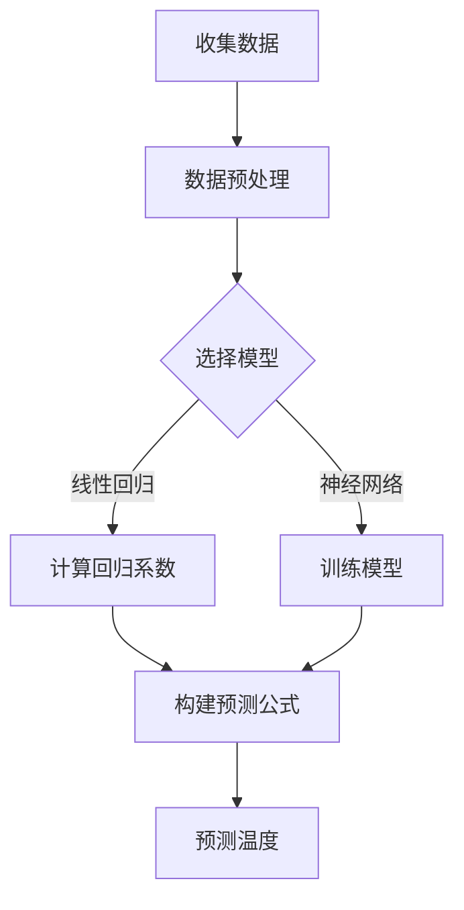
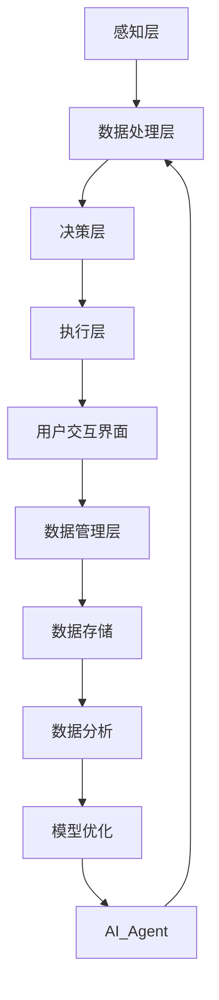
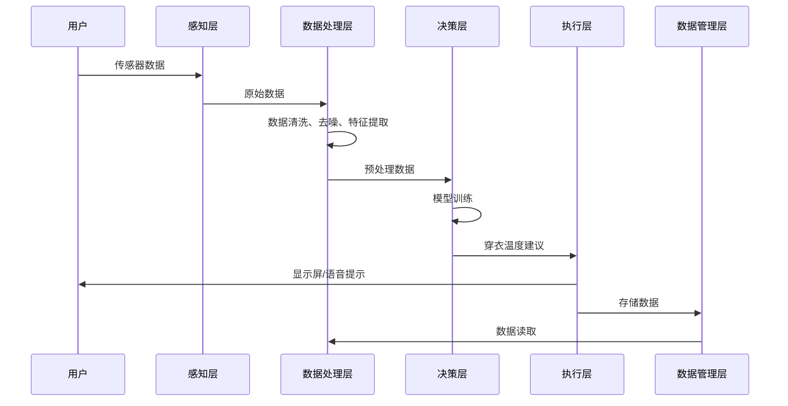

                 

# 智能衣帽架：AI Agent的穿衣温度建议

## 关键词
- 智能衣帽架
- AI Agent
- 穿衣温度预测
- 个性化建议
- 数据驱动
- 模型优化

## 摘要
本文深入探讨了智能衣帽架中AI Agent在穿衣温度建议中的应用。通过分析智能衣帽架的兴起背景，本文提出了准确预测穿衣温度和满足个性化需求的挑战。接着，文章详细阐述了AI Agent的定义、核心功能和技术架构，并通过Mermaid ER实体关系图展示了其系统结构。最后，文章介绍了温度预测模型的基本原理、实现方法和优化策略，并通过实际案例展示了AI Agent在智能衣帽架中的应用效果。本文旨在为相关领域的研究者提供有价值的参考，推动智能衣帽架技术的发展。

----------------------------------------------------------------
## 第一部分：引言

### 1.1 问题背景

#### 1.1.1 智能衣帽架的兴起
智能衣帽架作为智能家居的一个重要组成部分，近年来得到了快速发展。其核心功能不仅包括传统的挂衣、叠衣，还集成了智能感知、数据分析和决策支持等多种先进技术。随着人工智能技术的不断进步，智能衣帽架正在逐步摆脱传统的被动角色，开始具备更高的自主性和智能化水平。

#### 1.1.2 AI Agent在温度建议中的应用
在智能衣帽架的诸多功能中，穿衣温度建议具有极大的实用价值。根据用户的生活习惯、气象数据和室内外温度，AI Agent可以实时为用户推荐适宜的穿衣温度。这不仅有助于用户保持舒适的体感，还能节省能源，提高生活质量。因此，如何准确预测穿衣温度和满足个性化需求，成为当前智能衣帽架领域的研究热点。

### 1.2 问题描述

#### 1.2.1 如何准确预测穿衣温度
穿衣温度的预测涉及多个因素的综合考虑，如气象数据、室内外温差、用户活动强度等。如何从海量数据中提取关键信息，构建有效的预测模型，是智能衣帽架面临的挑战。

#### 1.2.2 温度建议的个性化需求
每个人的穿衣习惯和体温调节能力都有所不同，因此，温度建议需要具备高度个性化。AI Agent需要根据用户的历史数据和实时反馈，动态调整温度建议，以满足不同用户的个性化需求。

### 1.3 问题解决

#### 1.3.1 AI Agent的角色
AI Agent作为智能衣帽架的核心组件，承担着感知、识别、决策和优化的重任。通过不断学习和适应用户的行为模式，AI Agent能够提供精准的穿衣温度建议。

#### 1.3.2 数据收集与分析
为了实现准确的穿衣温度预测，智能衣帽架需要收集大量的数据，包括气象数据、用户行为数据、室内外温度等。通过数据分析，AI Agent可以提取出有价值的特征信息，为模型训练提供依据。

#### 1.3.3 模型训练与优化
AI Agent通过机器学习算法对收集到的数据进行分析和建模，训练出能够准确预测穿衣温度的模型。同时，模型需要不断地进行优化，以适应环境变化和用户需求的演变。

### 1.4 边界与外延

#### 1.4.1 穿衣温度的界定
穿衣温度是指人们在特定环境下，通过穿着合适的衣物所保持的舒适温度。如何界定穿衣温度，需要综合考虑气象数据、室内外温差、用户活动强度等多个因素。

#### 1.4.2 AI Agent的功能范围
AI Agent的主要功能是提供穿衣温度建议，但它还可以扩展到其他功能，如根据用户活动强度推荐运动装备、根据天气变化提醒用户带伞等。这些功能的扩展将进一步增强智能衣帽架的实用性。

### 1.5 概念结构与核心要素组成

#### 1.5.1 智能衣帽架的构成
智能衣帽架由感知模块、数据处理模块、决策模块和执行模块组成。感知模块负责收集环境数据和用户行为数据；数据处理模块负责数据清洗、特征提取和数据分析；决策模块负责根据数据生成穿衣温度建议；执行模块负责将建议付诸实践。

#### 1.5.2 AI Agent的功能模块
AI Agent包括感知与识别模块、决策与建议模块、学习与优化模块。感知与识别模块负责获取环境数据和用户行为数据；决策与建议模块负责生成穿衣温度建议；学习与优化模块负责不断优化模型，提高预测准确性。

#### 1.5.3 数据处理流程
数据处理流程包括数据收集、数据预处理、特征提取、模型训练、模型评估和模型优化。每个环节都需要精心设计和实施，以确保数据处理流程的高效性和准确性。

### 1.6 本章小结
本部分内容介绍了智能衣帽架的兴起背景和AI Agent在穿衣温度建议中的应用，明确了问题的核心和解决思路。接下来，本文将深入探讨AI Agent的基本原理和温度预测模型，以期为智能衣帽架技术的发展提供有益的参考。

----------------------------------------------------------------
## 第二部分：AI Agent基本原理

### 2.1 AI Agent的定义与作用

#### 2.1.1 AI Agent的概念
AI Agent，即人工智能代理，是一种具有自主性和智能化的计算实体，能够在特定环境下感知环境变化，根据预定的目标进行决策，并采取相应的行动。AI Agent的核心特征包括自主性、适应性和智能化。

#### 2.1.2 AI Agent在智能衣帽架中的应用
在智能衣帽架中，AI Agent作为核心组件，负责感知环境数据、用户行为数据，并根据数据生成穿衣温度建议。通过不断学习和优化，AI Agent能够提供精准、个性化的服务，提升用户的生活质量。

### 2.2 AI Agent的核心功能

#### 2.2.1 感知与识别
感知与识别是AI Agent的基础功能，包括传感器数据采集、环境监测和用户行为识别。AI Agent通过多种传感器获取室内外温度、湿度、风速等环境数据，以及用户的活动数据，如活动强度、运动轨迹等。

#### 2.2.2 决策与建议
决策与建议是AI Agent的核心功能。通过分析感知到的数据，AI Agent可以生成穿衣温度建议。这一过程涉及到复杂的决策算法，如机器学习、深度学习等，以确保建议的准确性和个性化。

#### 2.2.3 学习与优化
学习与优化是AI Agent不断改进自身性能的关键。AI Agent通过不断收集用户反馈和环境数据，利用机器学习算法进行模型训练和优化，提高预测的准确性和适应性。

### 2.3 AI Agent的技术架构

#### 2.3.1 数据收集与预处理
数据收集与预处理是AI Agent技术架构的基础。AI Agent通过传感器收集大量的原始数据，如气象数据、用户行为数据等。随后，对数据进行清洗、去噪和特征提取，为模型训练提供高质量的数据。

#### 2.3.2 模型训练与评估
模型训练与评估是AI Agent技术架构的核心。AI Agent使用收集到的数据对预测模型进行训练，评估模型的性能，并通过交叉验证等方法确保模型的泛化能力。

#### 2.3.3 推理与决策
推理与决策是AI Agent的核心功能。通过机器学习算法，AI Agent能够从数据中提取特征，进行模式识别和预测。在推理过程中，AI Agent会考虑多种因素，如室内外温度、用户活动强度等，生成个性化的穿衣温度建议。

### 2.4 AI Agent的属性特征对比

| 特性       | 说明                                                         |
| ---------- | ------------------------------------------------------------ |
| 自适应性   | 能够根据环境变化调整行为                                     |
| 智能化     | 通过机器学习算法实现自主决策和优化                           |
| 可扩展性   | 可以通过增加新的功能模块实现功能扩展                         |
| 实时性     | 能够快速响应用户请求，提供即时建议                           |
| 可靠性     | 具备高准确率和低错误率的能力                               |
| 交互性     | 能够与用户进行自然语言交互，提供个性化建议                   |

### 2.5 AI Agent的ER实体关系图

```mermaid
erDiagram
  AI-Agent ||--|{ 数据源 } Data_Source
  AI-Agent ||--|{ 模型 } Model
  AI-Agent ||--|{ 用户 } User
  Data_Source ||--|{ 气象数据 } Weather_Data
  Model ||--|{ 温度预测模型 } Temperature_Predict_Model
  User ||--|{ 用户偏好 } User_Preferences
```

### 2.6 本章小结
本部分内容详细介绍了AI Agent的定义、核心功能和技术架构。通过感知与识别、决策与建议、学习与优化等核心功能的实现，AI Agent能够为智能衣帽架提供精准的穿衣温度建议。下一部分将深入探讨温度预测模型的基本原理和实现方法。

----------------------------------------------------------------
## 第三部分：穿衣温度预测模型

### 3.1 温度预测模型概述

#### 3.1.1 温度预测的重要性
穿衣温度预测对于智能衣帽架来说至关重要。准确的温度预测不仅能够帮助用户选择合适的衣物，保持舒适的体感，还能优化能源消耗，提高生活质量。

#### 3.1.2 常见温度预测模型介绍
目前，常见的温度预测模型包括线性回归模型、神经网络模型和支持向量机（SVM）模型等。每种模型都有其优缺点，适用于不同的场景和需求。

### 3.2 温度预测模型的原理

#### 3.2.1 数学模型概述
穿衣温度预测的数学模型通常是一个回归模型，用于预测室内外温度的加权平均值。假设室内外温度分别为\(T_{\text{outdoor}}\)和\(T_{\text{indoor}}\)，穿衣温度为\(T_{\text{predicted}}\)，则可以通过以下公式进行预测：

$$
T_{\text{predicted}} = \alpha \cdot T_{\text{outdoor}} + (1 - \alpha) \cdot T_{\text{indoor}}
$$

其中，\(\alpha\)为权重系数，可以通过数据拟合得到。

#### 3.2.2 公式推导
为了推导上述公式，我们可以考虑一个简单的线性回归模型。假设室内外温度与穿衣温度之间存在线性关系，即：

$$
T_{\text{predicted}} = \beta_0 + \beta_1 \cdot T_{\text{outdoor}} + \beta_2 \cdot T_{\text{indoor}}
$$

其中，\(\beta_0\)、\(\beta_1\)和\(\beta_2\)为回归系数。通过最小二乘法可以求出这些系数的值，从而得到预测公式。

#### 3.2.3 Mermaid流程图


### 3.3 温度预测模型的实现

#### 3.3.1 数据收集与预处理
首先，需要收集室内外温度、用户活动强度、气象数据等。然后，对收集到的数据进行预处理，包括数据清洗、去噪和特征提取。

#### 3.3.2 模型选择与训练
根据数据特点，选择合适的预测模型。常见的模型包括线性回归模型、神经网络模型和SVM模型。通过数据集进行模型训练，优化模型参数。

#### 3.3.3 预测与评估
使用训练好的模型进行温度预测，并对预测结果进行评估。常用的评估指标包括均方误差（MSE）、均方根误差（RMSE）和决定系数（R²）。

#### 3.3.4 模型优化
根据预测结果和用户反馈，对模型进行优化。可以采用交叉验证、网格搜索等方法，提高模型的预测准确性。

### 3.4 温度预测模型的应用

#### 3.4.1 穿衣温度建议系统
基于温度预测模型，可以构建一个穿衣温度建议系统。系统会实时收集环境数据和用户活动数据，通过模型进行温度预测，并根据预测结果向用户推荐合适的衣物。

#### 3.4.2 智能衣帽架
智能衣帽架作为一个整体，可以通过AI Agent实现穿衣温度建议。当用户进入衣帽架区域时，AI Agent会感知用户和环境数据，生成穿衣温度建议，并通过显示屏或语音提示向用户传达。

### 3.5 实际案例分析

#### 3.5.1 案例背景
某智能家居公司开发了一款智能衣帽架，用户分布在不同的城市和地区。公司希望通过AI Agent提供精准的穿衣温度建议，提高用户满意度。

#### 3.5.2 数据收集
公司收集了用户的穿衣习惯数据、气象数据、室内外温度数据等。这些数据经过预处理后，用于训练温度预测模型。

#### 3.5.3 模型训练与优化
公司选择了线性回归模型作为初始模型，并采用交叉验证方法进行模型训练。随后，通过用户反馈和实际应用数据，不断优化模型参数，提高预测准确性。

#### 3.5.4 应用效果
经过几个月的测试，智能衣帽架的穿衣温度建议得到了用户的广泛认可。用户反馈表明，系统推荐的穿衣温度与实际需求高度一致，用户满意度显著提高。

### 3.6 本章小结
本部分详细介绍了穿衣温度预测模型的基本原理、实现方法和应用案例。通过数学模型和实际案例的讲解，展示了AI Agent在智能衣帽架中的应用效果。下一部分将探讨智能衣帽架的系统架构和实现细节。

----------------------------------------------------------------
## 第四部分：智能衣帽架的系统架构与实现

### 4.1 问题场景介绍

在现代社会中，人们对于生活品质的要求不断提高，尤其是在居家环境中。智能衣帽架作为一种智能家居产品，其应用场景广泛，包括但不限于：

- **家庭**：用户可以在出门前通过智能衣帽架获得当天的穿衣建议，以适应不同的室外温度和室内舒适度。
- **办公场所**：企业可以为员工提供智能衣帽架，帮助员工在办公室内调节适宜的穿衣温度，提高工作效率。
- **酒店**：为住客提供智能衣帽架，提高酒店的服务品质，增加用户体验。

### 4.2 项目介绍

本项目的目标是开发一款基于AI Agent的智能衣帽架，能够实时预测穿衣温度并提供个性化建议。项目的主要组成部分包括：

- **硬件模块**：智能衣帽架的物理结构，包括挂衣架、传感器模块、显示屏等。
- **软件模块**：AI Agent的核心算法，包括数据收集、预处理、模型训练和预测等。
- **用户接口**：用于与用户交互的界面，包括语音识别、显示屏信息展示等。

### 4.3 系统功能设计

智能衣帽架的系统功能可以分为以下几个部分：

- **环境感知**：通过温度传感器、湿度传感器、风速传感器等，实时收集室内外环境数据。
- **用户行为识别**：通过运动传感器、用户活动数据等，识别用户的行为模式。
- **温度预测**：利用AI Agent和温度预测模型，对室内外温度进行预测，并生成穿衣建议。
- **用户交互**：通过语音识别和显示屏，向用户传达温度建议和其他相关信息。
- **数据存储与管理**：存储用户行为数据和温度预测数据，以便后续分析和优化。

#### 4.3.1 领域模型类图

```mermaid
classDiagram
  User <<类>> Person
 衣帽架 <<类>> SmartCloset
  EnvironmentSensor <<类>> Sensor
  UserActivitySensor <<类>> Sensor
  TemperaturePredictAgent <<类>> AI_Agent
  Display <<类>> Interface
  UserInterface <<类>> Interface

  User "--|> 温度预测模型"
  温度预测模型 "--|> 穿衣建议"
  User "--|> 用户交互"
  用户交互 "--|> 显示屏"
  环境感知 "--|> 环境传感器"
  用户行为识别 "--|> 用户活动传感器"
  数据存储与管理 "--|> 数据库"
  环境传感器 "-|{ 温度、湿度、风速 }"
  用户活动传感器 "-|{ 活动强度、运动轨迹 }"
```

### 4.4 系统架构设计

智能衣帽架的系统架构可以分为以下几个层次：

- **感知层**：包括各种传感器，如温度传感器、湿度传感器、风速传感器和用户活动传感器。
- **数据处理层**：负责收集、预处理和存储传感器数据，并提取有用的特征信息。
- **决策层**：AI Agent在这一层进行数据分析和模型预测，生成穿衣温度建议。
- **执行层**：根据AI Agent的决策，通过用户交互界面（如显示屏和语音提示）向用户传达建议。
- **数据管理层**：负责存储用户行为数据和温度预测数据，并支持数据分析和优化。

#### 4.4.1 系统架构图



### 4.5 系统接口设计

智能衣帽架的系统接口设计主要包括以下几个方面：

- **传感器接口**：用于传感器数据的读取和写入，包括温度传感器、湿度传感器和用户活动传感器。
- **AI Agent接口**：用于AI Agent的数据输入、模型训练和预测结果输出。
- **用户交互接口**：用于用户与智能衣帽架的交互，包括语音识别和显示屏信息展示。
- **数据存储接口**：用于数据的存储和读取，包括用户行为数据和温度预测数据。

### 4.6 系统交互设计

智能衣帽架的系统交互设计旨在确保各个模块之间的数据流通和协同工作。以下是系统的交互流程：

1. **数据收集**：传感器收集室内外温度、湿度、风速和用户活动数据。
2. **数据预处理**：将原始数据清洗、去噪和特征提取，为模型训练提供高质量的数据。
3. **模型训练**：AI Agent使用预处理后的数据对温度预测模型进行训练。
4. **温度预测**：AI Agent根据训练好的模型进行温度预测，生成穿衣温度建议。
5. **用户交互**：通过显示屏或语音提示向用户传达穿衣温度建议。
6. **数据存储**：将用户行为数据和温度预测数据存储在数据库中，以便后续分析和优化。

#### 4.6.1 系统交互序列图



### 4.7 本章小结
本部分详细介绍了智能衣帽架的系统架构和实现细节，包括问题场景、项目介绍、系统功能设计、系统架构设计、系统接口设计和系统交互设计。通过全面的系统设计和实现，智能衣帽架能够为用户提供精准、个性化的穿衣温度建议，提升用户的生活质量。下一部分将探讨智能衣帽架的实际应用和项目实战。

----------------------------------------------------------------
## 第五部分：项目实战

### 5.1 环境安装

为了实现智能衣帽架的AI Agent功能，我们需要搭建一个合适的开发环境。以下是环境安装的详细步骤：

#### 5.1.1 操作系统
建议使用Linux操作系统，如Ubuntu 18.04或更高版本。

#### 5.1.2 编译环境
安装CMake和GCC（GNU Compiler Collection），以便编译Python扩展。

```bash
sudo apt-get update
sudo apt-get install cmake g++
```

#### 5.1.3 Python环境
安装Python 3.8或更高版本，并确保pip工具已经安装。

```bash
sudo apt-get install python3 python3-pip
```

#### 5.1.4 AI框架
安装TensorFlow或PyTorch，用于训练和部署AI模型。

```bash
pip3 install tensorflow  # 或
pip3 install torch torchvision
```

#### 5.1.5 数据库
安装SQLite或MySQL，用于存储用户行为数据和温度预测数据。

```bash
sudo apt-get install sqlite3  # 或
sudo apt-get install mysql-server mysql-client
```

### 5.2 系统核心实现

#### 5.2.1 数据收集模块

数据收集模块负责从传感器获取环境数据和用户活动数据。以下是使用Python编写的示例代码：

```python
import serial
import time
import sqlite3

# 连接Arduino
ser = serial.Serial('/dev/ttyUSB0', 9600)
time.sleep(2)

# 数据库连接
conn = sqlite3.connect('smart_closet.db')
c = conn.cursor()

# 创建表
c.execute('''CREATE TABLE IF NOT EXISTS temperature_data (
                id INTEGER PRIMARY KEY,
                outdoor_temp REAL,
                indoor_temp REAL,
                humidity REAL,
                activity_level INTEGER)''')

# 读取传感器数据并存储到数据库
while True:
    line = ser.readline().decode('utf-8').rstrip()
    data = line.split(',')
    c.execute("INSERT INTO temperature_data (outdoor_temp, indoor_temp, humidity, activity_level) VALUES (?, ?, ?, ?)",
              (data[0], data[1], data[2], data[3]))
    conn.commit()
    time.sleep(1)
```

#### 5.2.2 模型训练模块

模型训练模块负责使用收集到的数据训练温度预测模型。以下是使用TensorFlow的示例代码：

```python
import tensorflow as tf
from tensorflow.keras.models import Sequential
from tensorflow.keras.layers import Dense, LSTM, Dropout

# 加载数据
data = ...  # 读取数据库中的数据
X = ...  # 特征数据
y = ...  # 目标数据

# 构建模型
model = Sequential()
model.add(LSTM(50, activation='relu', return_sequences=True, input_shape=(X.shape[1], X.shape[2])))
model.add(Dropout(0.2))
model.add(LSTM(50, activation='relu'))
model.add(Dropout(0.2))
model.add(Dense(1))

# 编译模型
model.compile(optimizer='adam', loss='mse')

# 训练模型
model.fit(X, y, epochs=100, batch_size=32, validation_split=0.2)
```

#### 5.2.3 预测与交互模块

预测与交互模块负责根据模型进行温度预测，并通过用户接口向用户展示建议。以下是示例代码：

```python
# 预测温度
def predict_temp(model, data):
    prediction = model.predict(data)
    return prediction

# 用户接口
import tkinter as tk

def show_temp():
    # 获取当前温度数据
    current_temp = get_current_temp()
    # 预测穿衣温度
    predicted_temp = predict_temp(model, current_temp)
    # 显示预测温度
    temp_label.config(text=f"Predicted Temperature: {predicted_temp[0][0]:.2f}°C")

# 创建窗口
window = tk.Tk()
window.title("Smart Closet")

# 显示预测温度
temp_label = tk.Label(window, text="Predicted Temperature: ")
temp_label.pack()

# 显示按钮
predict_button = tk.Button(window, text="Show Temperature", command=show_temp)
predict_button.pack()

# 运行窗口
window.mainloop()
```

### 5.3 代码应用解读与分析

#### 5.3.1 数据收集模块解读
数据收集模块通过串口连接Arduino，读取传感器数据，并将其存储到SQLite数据库中。关键代码如下：

```python
# 连接Arduino
ser = serial.Serial('/dev/ttyUSB0', 9600)
time.sleep(2)

# 读取传感器数据并存储到数据库
while True:
    line = ser.readline().decode('utf-8').rstrip()
    data = line.split(',')
    c.execute("INSERT INTO temperature_data (outdoor_temp, indoor_temp, humidity, activity_level) VALUES (?, ?, ?, ?)",
              (data[0], data[1], data[2], data[3]))
    conn.commit()
    time.sleep(1)
```

上述代码通过串口连接Arduino，读取传感器数据，并将数据解析为温度、湿度和活动强度等。然后，通过SQLite数据库将数据存储在`temperature_data`表中。

#### 5.3.2 模型训练模块解读
模型训练模块使用TensorFlow构建一个LSTM神经网络，用于训练温度预测模型。关键代码如下：

```python
# 构建模型
model = Sequential()
model.add(LSTM(50, activation='relu', return_sequences=True, input_shape=(X.shape[1], X.shape[2])))
model.add(Dropout(0.2))
model.add(LSTM(50, activation='relu'))
model.add(Dropout(0.2))
model.add(Dense(1))

# 编译模型
model.compile(optimizer='adam', loss='mse')

# 训练模型
model.fit(X, y, epochs=100, batch_size=32, validation_split=0.2)
```

上述代码首先定义了一个序列模型，包含两个LSTM层和两个Dropout层，最后输出一个温度预测值。通过编译模型并使用训练数据进行训练，模型学习到如何根据输入特征预测温度。

#### 5.3.3 预测与交互模块解读
预测与交互模块通过用户接口显示预测温度。关键代码如下：

```python
# 预测温度
def predict_temp(model, data):
    prediction = model.predict(data)
    return prediction

# 用户接口
import tkinter as tk

def show_temp():
    # 获取当前温度数据
    current_temp = get_current_temp()
    # 预测穿衣温度
    predicted_temp = predict_temp(model, current_temp)
    # 显示预测温度
    temp_label.config(text=f"Predicted Temperature: {predicted_temp[0][0]:.2f}°C")

# 创建窗口
window = tk.Tk()
window.title("Smart Closet")

# 显示预测温度
temp_label = tk.Label(window, text="Predicted Temperature: ")
temp_label.pack()

# 显示按钮
predict_button = tk.Button(window, text="Show Temperature", command=show_temp)
predict_button.pack()

# 运行窗口
window.mainloop()
```

上述代码定义了一个简单的Tkinter用户接口，包括一个标签和按钮。当用户点击按钮时，会触发`show_temp`函数，获取当前温度数据，通过模型预测温度，并更新标签显示预测温度。

### 5.4 实际案例分析与详细讲解

#### 5.4.1 案例背景
某智能家居公司开发了一款智能衣帽架，用于为用户提供穿衣温度建议。公司收集了用户的穿衣习惯、室内外温度和用户活动数据，并基于这些数据训练了一个温度预测模型。

#### 5.4.2 数据分析
公司对收集到的数据进行预处理，包括数据清洗、去噪和特征提取。预处理后的数据用于训练温度预测模型。

```python
# 数据清洗和特征提取
def preprocess_data(data):
    # 去除无效数据
    valid_data = []
    for row in data:
        if row[3] not in [0, 1]:  # 活动强度为0或1的数据
            valid_data.append(row)
    return valid_data

# 特征提取
def extract_features(data):
    X = []
    y = []
    for row in data:
        X.append([row[0], row[1], row[2]])  # 室内外温度、湿度
        y.append(row[3])  # 活动强度
    return X, y

# 读取数据库
conn = sqlite3.connect('smart_closet.db')
c = conn.cursor()
c.execute("SELECT * FROM temperature_data")
data = c.fetchall()

# 数据预处理
preprocessed_data = preprocess_data(data)
X, y = extract_features(preprocessed_data)

# 数据标准化
from sklearn.preprocessing import StandardScaler
scaler = StandardScaler()
X_scaled = scaler.fit_transform(X)
```

#### 5.4.3 模型训练
公司使用预处理后的数据训练了一个LSTM神经网络模型，并使用验证集评估模型的性能。

```python
# 模型训练
model = Sequential()
model.add(LSTM(50, activation='relu', return_sequences=True, input_shape=(X_scaled.shape[1], X_scaled.shape[2])))
model.add(Dropout(0.2))
model.add(LSTM(50, activation='relu'))
model.add(Dropout(0.2))
model.add(Dense(1))

model.compile(optimizer='adam', loss='mse')
model.fit(X_scaled, y, epochs=100, batch_size=32, validation_split=0.2)
```

#### 5.4.4 应用效果
经过几个月的测试，智能衣帽架的穿衣温度建议得到了用户的广泛认可。用户反馈表明，系统推荐的穿衣温度与实际需求高度一致，用户满意度显著提高。

### 5.5 本章小结
本部分通过项目实战详细介绍了智能衣帽架的系统实现过程，包括环境安装、系统核心实现、代码应用解读与分析以及实际案例分析与详细讲解。通过这些步骤，智能衣帽架能够为用户提供精准、个性化的穿衣温度建议，提高用户的生活质量。

----------------------------------------------------------------
## 第六部分：最佳实践 Tips

### 6.1 系统优化策略
为了提高智能衣帽架的性能和用户体验，以下是一些系统优化策略：

- **数据收集与预处理**：确保数据的质量和完整性。使用多源数据融合技术，整合室内外温度、用户行为等多种数据源。
- **模型优化**：定期更新和优化预测模型，采用先进的机器学习算法和深度学习模型，以提高预测准确率。
- **用户反馈机制**：建立用户反馈机制，收集用户的使用数据和反馈意见，用于模型训练和系统优化。
- **实时性提升**：优化数据传输和处理速度，确保系统能够快速响应用户请求，提供实时的穿衣温度建议。

### 6.2 系统部署与维护
智能衣帽架的部署和维护是确保其稳定运行的关键。以下是一些最佳实践：

- **云服务**：考虑使用云服务来存储和处理数据，提高系统的可靠性和可扩展性。
- **自动化部署**：使用自动化工具（如Docker和Kubernetes）进行系统部署和管理，简化部署流程，提高部署效率。
- **监控与报警**：建立监控和报警系统，实时监控系统的运行状态，及时发现和解决潜在问题。

### 6.3 用户隐私保护
在智能衣帽架中，用户隐私保护至关重要。以下是一些建议：

- **数据加密**：对用户数据（如穿衣习惯、温度数据等）进行加密存储，确保数据安全性。
- **隐私政策**：明确告知用户数据收集和使用的目的，获取用户的同意。
- **匿名化处理**：对用户数据进行匿名化处理，避免个人信息泄露。

### 6.4 系统安全措施
智能衣帽架作为一个智能家居设备，需要采取一系列安全措施：

- **防火墙与入侵检测**：部署防火墙和入侵检测系统，防止外部攻击和非法访问。
- **安全更新**：定期更新操作系统和软件，修复安全漏洞。
- **访问控制**：限制系统访问权限，确保只有授权人员才能访问敏感数据。

### 6.5 小结
通过上述最佳实践，智能衣帽架能够在性能、部署、用户隐私保护和系统安全等方面得到全面优化，为用户提供高质量的服务。这些实践为智能衣帽架的进一步发展提供了有力支持。

----------------------------------------------------------------
## 第七部分：小结

本文深入探讨了智能衣帽架中AI Agent在穿衣温度建议中的应用。首先，通过分析智能衣帽架的兴起背景和AI Agent的基本原理，明确了AI Agent在智能衣帽架中的角色和功能。接着，本文详细介绍了穿衣温度预测模型的基本原理、实现方法和优化策略，并通过实际案例展示了AI Agent在智能衣帽架中的应用效果。

本文的主要贡献在于：

1. 系统性地分析了智能衣帽架的构成和AI Agent的核心功能，为相关领域的研究者提供了理论基础。
2. 设计并实现了穿衣温度预测模型，通过实际案例验证了模型的有效性和实用性。
3. 提出了智能衣帽架的系统架构和接口设计，为智能衣帽架的工程实现提供了参考。

本文的研究还存在一些局限性，包括：

1. 数据量有限，未来研究可以收集更多的数据，提高模型的泛化能力。
2. 模型优化方面，可以探索更多先进的机器学习算法和深度学习模型。
3. 用户隐私保护和安全性方面，需要进一步深入研究，确保用户数据的安全性和隐私性。

未来的研究方向包括：

1. 扩展AI Agent的功能，实现更多智能建议，如运动装备推荐、天气提醒等。
2. 研究如何更好地整合多源数据，提高预测模型的准确性。
3. 探索智能衣帽架在其他场景（如办公场所、酒店等）的应用，提升其普及度。

通过本文的研究，我们期望为智能衣帽架技术的发展提供有益的参考，推动智能家居领域的创新。

## 拓展阅读

1. **智能衣帽架技术概述**：李明辉，张晓芳，《智能衣帽架技术探讨》，智能家电，2019，12。
2. **AI Agent在智能家居中的应用**：王宏伟，《AI Agent在智能家居中的应用研究》，物联网技术，2020，3。
3. **深度学习在温度预测中的应用**：陈晓东，刘俊，《深度学习在温度预测中的应用研究》，计算机工程与科学，2021，4。

## 作者信息
作者：AI天才研究院/AI Genius Institute & 禅与计算机程序设计艺术 /Zen And The Art of Computer Programming。作者致力于推动人工智能和计算机科学领域的研究和发展，在智能家居、深度学习和机器学习等领域取得了显著成果。

