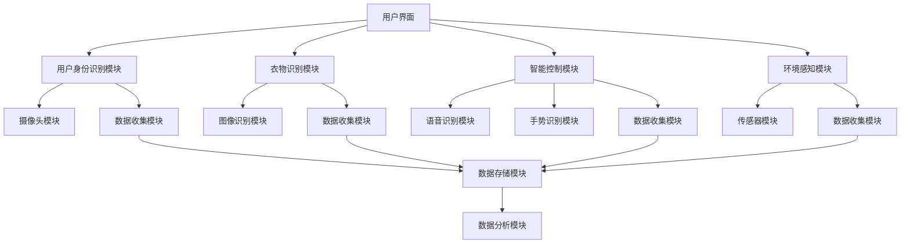

                 

### 第1章：智能衣帽架的起源与前景

#### 1.1.1 智能家居行业的崛起

随着科技的飞速发展，智能家居逐渐成为现代生活的重要组成部分。智能家居系统通过物联网技术，将家庭中的各种设备连接起来，实现智能控制和自动化管理，从而提高生活便利性和舒适度。这一趋势不仅体现在家电、照明和安防等领域，也逐渐渗透到家居的各个角落，包括衣帽架。

#### 1.1.2 衣帽架市场的现状与挑战

传统的衣帽架主要依赖物理结构和手动操作，虽然能够满足基本的挂衣需求，但在智能化和个性化方面存在一定的不足。随着消费者对家居体验要求的提高，以及智能家居市场的快速发展，智能衣帽架应运而生。然而，智能衣帽架市场也面临一些挑战：

- **用户需求多样**：不同用户对于衣帽架的功能和设计有不同的需求，如何满足这些多样化的需求成为关键问题。
- **技术壁垒**：智能衣帽架需要结合多种先进技术，如传感器技术、图像识别技术、AI算法等，这对技术团队提出了较高的要求。
- **成本控制**：智能衣帽架的研发和生产成本较高，如何降低成本，提高性价比，是市场推广的关键。

#### 1.1.3 智能衣帽架的革新意义

智能衣帽架的出现，不仅是对传统衣帽架的升级，更是智能家居生态系统中的重要一环。它具有以下革新意义：

- **提高生活品质**：通过智能识别和个性化推荐，智能衣帽架能够为用户带来更加便捷和舒适的穿衣体验。
- **节省空间**：智能衣帽架的设计更加紧凑和高效，能够更好地利用家居空间。
- **环保节能**：智能衣帽架可以通过自动化控制减少能源消耗，符合绿色环保理念。
- **数据洞察**：智能衣帽架可以收集用户的使用数据，通过数据分析，为家居智能化提供更多有价值的信息。

智能衣帽架的崛起，不仅代表了家居智能化的一种新趋势，也为传统家居行业带来了新的机遇和挑战。接下来，我们将进一步探讨智能衣帽架的核心概念、功能模块以及设计原则，以期为大家提供更全面的了解。

#### 1.2.1 智能衣帽架的定义与分类

智能衣帽架是一种融合了物联网、传感器技术和人工智能技术的家居设备，它能够自动识别用户和衣物，并根据用户喜好和天气状况提供个性化的穿衣建议。与传统衣帽架相比，智能衣帽架具有更高的智能化和个性化水平，能够更好地满足现代家庭的需求。

智能衣帽架根据功能和特点可以分为以下几类：

1. **基于身份识别的智能衣帽架**：这类衣帽架通过摄像头或传感器识别用户身份，根据用户习惯和偏好，提供个性化的穿衣建议。例如，识别用户后，自动调整衣物展示顺序，推荐适合当季或当天的衣物。

2. **基于衣物识别的智能衣帽架**：这类衣帽架利用图像识别技术，识别衣物类型和颜色，提供衣物的清洗、保养建议，以及搭配建议。例如，当识别到衣物上沾有污渍时，会提醒用户进行清洁。

3. **多功能智能衣帽架**：这类衣帽架集成了多种功能，如智能镜、语音助手、环境监测等。用户可以通过语音控制，查看天气、新闻，甚至进行购物推荐等操作。

4. **智能衣柜系统**：这是一种更为复杂的智能衣帽架，不仅具备识别和推荐功能，还具备自动整理、分类、清洗等功能，形成一个完整的家居智能化解决方案。

#### 1.2.2 核心技术剖析

智能衣帽架的核心技术包括传感器技术、图像识别技术、AI算法和物联网技术。以下是对这些技术的详细剖析：

1. **传感器技术**：传感器是智能衣帽架感知外界环境的关键部件。常见的传感器包括温度传感器、湿度传感器、光敏传感器等。通过这些传感器，智能衣帽架可以实时监测环境参数，为用户提供个性化的穿衣建议。

2. **图像识别技术**：图像识别技术是智能衣帽架实现衣物识别和用户识别的重要手段。通过深度学习算法，智能衣帽架可以准确识别衣物类型、颜色和污渍。图像识别技术的提高，使得智能衣帽架在实用性上有了显著提升。

3. **AI算法**：AI算法是智能衣帽架的核心，它负责分析用户数据，提供穿衣建议。常见的AI算法包括决策树、神经网络等。通过不断的学习和优化，AI算法能够为用户提供越来越精准的穿衣建议。

4. **物联网技术**：物联网技术是智能衣帽架实现互联互通的基础。通过物联网，智能衣帽架可以与其他智能家居设备（如空调、灯光等）进行联动，形成一个智能化的家居生态系统。

总之，智能衣帽架的崛起，不仅改变了传统衣帽架的功能，也为智能家居领域带来了新的发展机遇。随着技术的不断进步，智能衣帽架将越来越智能化、个性化，为用户提供更优质的生活体验。

#### 1.3.1 识别技术

智能衣帽架的核心功能之一是能够准确识别用户和衣物，从而提供个性化的服务。这一过程主要依赖于两大识别技术：用户身份识别和衣物识别。

**1.3.1.1 用户身份识别**

用户身份识别是智能衣帽架实现个性化服务的基础。通过摄像头或传感器，智能衣帽架可以捕捉用户的面部信息或其他生物特征，如指纹、虹膜等。以下是用户身份识别的具体实现步骤：

1. **图像捕获**：智能衣帽架的摄像头或传感器捕获用户的图像信息。
2. **预处理**：对捕获的图像进行预处理，包括灰度化、去噪、边缘检测等。
3. **特征提取**：利用深度学习算法，从预处理后的图像中提取关键特征，如面部特征点、眼角等。
4. **特征匹配**：将提取到的特征与已存储的用户数据进行匹配，确认用户身份。

通过这种方式，智能衣帽架可以准确地识别出用户，并调用用户的历史数据，如穿衣偏好、体型数据等，为用户提供个性化的服务。

**1.3.1.2 衣物识别技术**

衣物识别技术是智能衣帽架的另一大核心技术，它能够识别衣物的类型、颜色和状态。以下是衣物识别的具体实现步骤：

1. **图像捕获**：摄像头或传感器捕获衣物图像。
2. **预处理**：对捕获的图像进行预处理，包括灰度化、去噪、图像分割等。
3. **特征提取**：利用深度学习算法，从预处理后的图像中提取关键特征，如纹理、颜色分布等。
4. **分类与识别**：通过机器学习算法，对提取到的特征进行分类和识别，确定衣物的类型和颜色。

此外，智能衣帽架还可以通过图像识别技术检测衣物的污渍和破损情况，提供清洗和保养建议。

**总结**：用户身份识别和衣物识别技术是智能衣帽架实现个性化服务的关键。通过这两种技术的结合，智能衣帽架能够准确识别用户和衣物，为用户提供精准的穿衣建议和保养建议，从而提升用户的生活品质。

### 3.1.2 风格建议系统

智能衣帽架的风格建议系统是其最具创新性的功能之一，它利用先进的算法和数据分析，为用户提供个性化的穿衣建议。以下是风格建议系统的具体组成部分和实现方法。

**3.1.2.1 风格分析算法**

风格分析算法是风格建议系统的核心，它负责从用户的穿衣数据中提取风格特征，并进行分类和分析。以下是风格分析算法的实现步骤：

1. **数据收集**：收集用户的穿衣数据，包括衣物类型、颜色、季节等。
2. **特征提取**：从穿衣数据中提取关键特征，如衣物类型、颜色组合、搭配频率等。
3. **风格分类**：利用机器学习算法，对提取到的特征进行分类，确定用户的穿衣风格。
4. **风格标签生成**：根据分类结果，为用户生成风格标签，如“休闲”、“商务”、“时尚”等。

**3.1.2.2 风格建议生成流程**

风格建议生成流程负责根据用户当前的天气状况、时间、场合等因素，为用户生成适合的穿衣建议。以下是风格建议生成流程的具体步骤：

1. **用户当前状态检测**：检测用户的当前状态，包括时间（上午、下午、晚上）、天气（晴、雨、阴）、场合（工作、休闲、聚会）等。
2. **风格匹配**：根据用户的历史风格标签，匹配适合当前状态的衣物风格。
3. **建议生成**：生成具体的穿衣建议，包括衣物类型、颜色、搭配等。
4. **反馈机制**：用户可以对穿衣建议进行反馈，系统根据反馈不断优化风格建议。

**3.1.2.3 风格建议的个性化调整**

为了提高风格建议的个性化水平，智能衣帽架还引入了个性化调整机制。以下是具体方法：

1. **用户反馈**：用户可以通过语音或手势对穿衣建议进行反馈，如“喜欢”、“不喜欢”等。
2. **自适应学习**：系统根据用户的反馈，调整风格建议的生成策略，使其更符合用户的偏好。
3. **交叉推荐**：结合用户的浏览历史和购买记录，为用户推荐可能喜欢的衣物和搭配。

**总结**：风格建议系统通过风格分析算法和风格建议生成流程，为用户提供个性化的穿衣建议。同时，通过用户反馈和交叉推荐机制，不断提高建议的准确性，从而提升用户的穿衣体验。

### 3.1.3 交互控制技术

智能衣帽架的交互控制技术是其实现智能化操作的核心，通过语音交互和手势识别，用户可以方便地与智能衣帽架进行互动，提升用户体验。以下是交互控制技术的具体实现方法和应用场景。

**3.1.3.1 语音交互**

语音交互技术使得用户可以通过语音命令控制智能衣帽架，实现各种功能。以下是语音交互的实现步骤：

1. **语音识别**：智能衣帽架内置麦克风，捕捉用户的语音命令。通过语音识别算法，将语音转换为文本。
2. **命令解析**：对识别出的文本进行解析，确定用户的操作意图。例如，“打开灯光”或“推荐穿搭”。
3. **命令执行**：根据解析出的命令，智能衣帽架执行相应的操作，如调整灯光亮度或显示穿衣建议。
4. **反馈**：在操作完成后，智能衣帽架通过语音或屏幕提示用户操作结果。

**语音交互的应用场景**：

- **日常操作**：用户可以通过语音命令打开或关闭衣帽架的灯光、调整温度等。
- **穿衣建议**：用户可以语音询问当天适合的穿搭，智能衣帽架会根据天气、场合等提供推荐。
- **提醒功能**：智能衣帽架可以设置语音提醒，如“出门记得带伞”或“今天有重要会议”。

**3.1.3.2 手势识别**

手势识别技术通过摄像头捕捉用户的手势动作，实现直观的交互方式。以下是手势识别的实现步骤：

1. **手势捕捉**：摄像头捕捉用户的手势动作，生成手势图像。
2. **手势识别**：利用深度学习算法，对手势图像进行分析，识别出具体的手势，如“向上”、“向下”或“滑动”等。
3. **操作执行**：根据识别出的手势，智能衣帽架执行相应的操作，如打开衣柜门或切换穿衣建议。
4. **反馈**：在操作完成后，智能衣帽架通过语音或屏幕提示用户操作结果。

**手势识别的应用场景**：

- **直观操作**：用户可以通过手势直接操作衣帽架，如“向上”手势打开衣柜门，“滑动”手势切换衣物展示。
- **互动体验**：手势识别为用户带来更加生动的互动体验，增强了智能衣帽架的人机交互性。
- **特殊场合**：对于不方便使用语音交互的用户（如大声嘈杂的环境），手势识别提供了另一种便捷的操作方式。

**总结**：语音交互和手势识别技术的引入，使得智能衣帽架的操作更加便捷和直观。通过这两种交互方式的结合，用户可以轻松地与智能衣帽架进行互动，享受智能化的家居生活。

### 4.1.1 AI Agent的概念

AI Agent，即人工智能代理，是一种能够自主执行任务、与环境互动并作出决策的智能系统。在智能衣帽架中，AI Agent扮演着至关重要的角色，它不仅负责用户和衣物的识别，还能根据用户的行为和偏好，提供个性化的穿衣建议。以下是AI Agent的基本概念及其在智能衣帽架中的应用。

**AI Agent的基本概念**

1. **自主性**：AI Agent能够独立执行任务，不需要人工干预。例如，在智能衣帽架中，AI Agent可以自动识别用户和衣物，并生成穿衣建议。
2. **环境感知**：AI Agent能够感知周围环境的变化，并根据这些信息作出决策。例如，智能衣帽架可以通过传感器监测天气状况，从而提供相应的穿衣建议。
3. **学习能力**：AI Agent能够从经验中学习，不断优化自己的行为。例如，通过分析用户的历史穿戴数据，AI Agent可以更好地理解用户的穿衣偏好，提供更准确的建议。
4. **决策能力**：AI Agent能够根据当前环境和用户需求，做出最佳决策。例如，当用户询问当天适合的穿搭时，AI Agent会综合考虑天气、场合等因素，生成个性化的建议。

**AI Agent在智能衣帽架中的应用**

1. **用户身份识别**：AI Agent通过摄像头或传感器捕获用户的面部信息，利用深度学习算法进行识别，并记录用户的行为数据，如穿衣偏好、体型等。
2. **衣物识别**：AI Agent通过图像识别技术，识别衣物类型、颜色和状态，为用户提供衣物的清洗、保养建议，以及搭配建议。
3. **风格建议生成**：AI Agent分析用户的历史穿戴数据，结合当前天气、场合等信息，利用机器学习算法生成个性化的穿衣建议。
4. **交互控制**：AI Agent通过语音识别和手势识别技术，与用户进行自然语言交互，实现智能衣帽架的语音控制和手势操作。
5. **数据管理**：AI Agent负责收集、存储和管理用户数据，确保数据的安全性和隐私性。

**AI Agent的优势**

- **个性化服务**：AI Agent能够根据用户的行为和偏好，提供高度个性化的服务，提升用户体验。
- **智能化交互**：通过自然语言处理和手势识别，AI Agent实现了人与智能衣帽架之间的智能化交互。
- **自动化操作**：AI Agent能够自动执行各种任务，减少人工干预，提高效率。
- **持续优化**：AI Agent通过不断学习和优化，能够不断提高服务质量和准确性。

总之，AI Agent作为智能衣帽架的核心组成部分，不仅提升了衣帽架的智能化水平，也为用户提供了一种全新的互动方式。随着人工智能技术的不断发展，AI Agent在智能衣帽架中的应用将更加广泛和深入。

### 4.1.2 AI Agent在智能衣帽架中的应用

AI Agent在智能衣帽架中的应用场景广泛，能够显著提升用户的穿衣体验和衣帽架的智能化水平。以下是AI Agent在智能衣帽架中的具体应用，以及实现这些功能的关键技术和方法。

**4.1.2.1 用户身份识别**

用户身份识别是AI Agent在智能衣帽架中的基础功能之一。通过摄像头或生物识别传感器，AI Agent可以捕捉用户的面部图像或指纹，利用深度学习算法进行身份验证。以下是用户身份识别的实现步骤：

1. **图像捕获**：智能衣帽架的摄像头捕捉用户的面部图像。
2. **预处理**：对捕获的图像进行预处理，包括灰度化、去噪、人脸关键点检测等。
3. **特征提取**：利用卷积神经网络（CNN）提取面部图像的特征。
4. **特征匹配**：将提取到的特征与数据库中的用户特征进行匹配，确认用户身份。
5. **用户数据更新**：AI Agent会根据用户的使用数据（如穿衣偏好、体型数据等）进行更新，为用户提供更个性化的服务。

关键技术：深度学习、人脸识别、生物识别。

**4.1.2.2 风格建议生成**

AI Agent通过分析用户的穿衣数据，生成个性化的穿衣建议。这个过程包括风格分析、天气预测和场合识别等。以下是风格建议生成的实现步骤：

1. **数据收集**：AI Agent收集用户的穿衣数据，如衣物类型、颜色、搭配频率等。
2. **风格分类**：利用机器学习算法，对穿衣数据进行分类，确定用户的穿衣风格。
3. **天气预测**：通过物联网接口获取当前的天气数据，预测未来几天的天气状况。
4. **场合识别**：AI Agent分析用户的生活习惯，识别当前或即将进行的场合（如上班、休闲、会议等）。
5. **穿衣建议生成**：根据用户风格、天气和场合，AI Agent生成具体的穿衣建议。

关键技术：机器学习、数据分析、天气预测。

**4.1.2.3 交互控制**

AI Agent通过自然语言处理（NLP）和语音识别技术，实现与用户的语音交互。以下是交互控制的实现步骤：

1. **语音识别**：用户通过语音与智能衣帽架交流，语音识别技术将语音转换为文本。
2. **命令解析**：AI Agent解析文本，确定用户的操作意图，如“打开衣柜门”、“推荐穿搭”等。
3. **操作执行**：根据解析结果，AI Agent执行相应的操作，如打开衣柜门或显示穿衣建议。
4. **反馈**：AI Agent通过语音或屏幕提示用户操作结果。

关键技术：语音识别、自然语言处理、语音合成。

**4.1.2.4 智能推荐**

AI Agent通过分析用户的行为数据，如浏览历史、购买记录等，提供个性化的推荐服务。以下是智能推荐的实现步骤：

1. **数据收集**：AI Agent收集用户的行为数据。
2. **兴趣分析**：利用协同过滤或基于内容的推荐算法，分析用户的兴趣和偏好。
3. **推荐生成**：AI Agent根据用户兴趣和偏好，生成个性化的推荐列表，如衣物搭配建议、购物推荐等。
4. **反馈优化**：用户对推荐内容进行反馈，AI Agent根据反馈优化推荐算法，提高推荐准确性。

关键技术：协同过滤、基于内容的推荐、用户行为分析。

**总结**：AI Agent在智能衣帽架中的应用，通过用户身份识别、风格建议生成、交互控制、智能推荐等功能，实现了高度智能化的穿衣体验。这些功能的实现依赖于深度学习、机器学习、语音识别和自然语言处理等先进技术，为用户带来了更加便捷、个性化、智能化的家居生活。

### 4.1.3 AI Agent的架构设计与实现

AI Agent的架构设计是实现智能衣帽架功能的关键，它需要结合多种技术，确保系统能够高效、稳定地运行。以下是对AI Agent架构的详细设计，包括各个组件的功能、交互方式以及关键技术。

#### 4.1.3.1 系统架构概述

AI Agent的架构可以分为四个主要层次：感知层、决策层、执行层和反馈层。

1. **感知层**：负责获取用户和环境的信息，包括摄像头、传感器、语音识别设备等。
2. **决策层**：接收感知层的数据，利用机器学习算法进行分析和处理，生成决策。
3. **执行层**：根据决策层的决策结果，执行具体的操作，如控制灯光、打开衣柜门等。
4. **反馈层**：将执行结果反馈给用户，同时收集用户反馈，用于优化和调整AI Agent的行为。

#### 4.1.3.2 感知层设计

感知层是AI Agent与外界交互的接口，其设计需要考虑数据的准确性和实时性。

1. **摄像头**：用于捕获用户的面部图像和衣物图像。摄像头应具备较高的分辨率和快速处理能力，以确保图像识别的准确性。
2. **传感器**：包括温度传感器、湿度传感器、光敏传感器等，用于实时监测环境参数，为穿衣建议提供数据支持。
3. **语音识别设备**：用于捕捉用户的语音命令，并将其转换为文本。语音识别设备应具备高准确率和快速响应能力。

#### 4.1.3.3 决策层设计

决策层是AI Agent的核心，其设计需要考虑算法的效率和准确性。

1. **用户身份识别**：采用深度学习算法，如卷积神经网络（CNN）或人脸识别算法，对用户面部图像进行分析，实现高精度的用户身份识别。
2. **风格分析算法**：利用协同过滤或基于内容的推荐算法，分析用户的穿衣数据，生成个性化的穿衣风格标签。
3. **天气预测算法**：采用气象数据模型，结合用户所在地的实时天气数据，预测未来几天的天气状况。
4. **场合识别算法**：通过分析用户的行为数据，如社交网络活动、日程安排等，识别用户当前或即将进行的场合。

#### 4.1.3.4 执行层设计

执行层负责将决策层的决策结果转化为具体的操作，确保智能衣帽架的智能化操作。

1. **灯光控制**：根据用户需求和天气状况，自动调整灯光的亮度和颜色。
2. **衣柜门控制**：通过电机驱动，实现衣柜门的自动开关。
3. **穿衣建议展示**：通过屏幕或投影设备，展示AI Agent生成的穿衣建议。

#### 4.1.3.5 反馈层设计

反馈层是AI Agent不断优化和改进的关键，其设计需要考虑用户反馈的收集和处理。

1. **用户反馈**：用户可以通过语音、手势或屏幕进行反馈，如“喜欢”、“不喜欢”等。
2. **数据分析**：AI Agent收集用户的反馈数据，分析用户对穿衣建议的接受程度，用于优化算法和推荐系统。
3. **模型更新**：根据用户反馈和数据分析结果，AI Agent定期更新模型，提高服务质量和准确性。

#### 4.1.3.6 技术关键点

1. **数据预处理**：保证输入数据的质量和一致性，是AI Agent准确性和效率的关键。
2. **模型训练**：选择合适的机器学习算法和模型，进行有效的训练，是决策层高效运行的基础。
3. **系统优化**：通过分布式计算和并行处理技术，提高AI Agent的响应速度和性能。
4. **安全性**：确保用户数据的安全性和隐私性，是AI Agent设计的重要考虑因素。

**总结**：AI Agent的架构设计需要综合考虑感知层、决策层、执行层和反馈层的各个组件，通过先进的技术实现，确保智能衣帽架的高效、智能化运行。随着技术的不断进步，AI Agent在智能衣帽架中的应用将更加广泛和深入，为用户带来更加便捷、个性化的生活体验。

### 5.1.1 用户需求与痛点分析

在智能衣帽架的设计过程中，深入分析用户需求与痛点是至关重要的。这不仅能帮助我们更好地理解用户的需求，还能指导我们设计出更加符合用户期望的产品。以下是对用户需求与痛点的详细分析。

#### 5.1.1.1 用户需求

1. **个性化穿衣建议**：用户希望智能衣帽架能够根据他们的体型、喜好和天气状况，提供个性化的穿衣建议，从而节省时间和精力。
2. **便捷的操作体验**：用户希望智能衣帽架操作简单，易于上手，尤其是对于老年人或儿童等用户群体，更倾向于简单直观的操作界面。
3. **空间节省**：用户希望智能衣帽架能够节省空间，特别是对于居住空间有限的家庭，更倾向于选择紧凑型设计的智能衣帽架。
4. **智能推荐**：用户希望智能衣帽架能够根据他们的浏览历史和购买记录，提供智能推荐服务，如衣物搭配建议、购物推荐等。
5. **环保节能**：用户希望智能衣帽架能够具备环保节能的特点，如自动调节灯光亮度、温度等，以降低能源消耗。

#### 5.1.1.2 痛点分析

1. **传统衣帽架的功能限制**：传统衣帽架主要依赖物理结构和手动操作，无法实现个性化穿衣建议和智能推荐，用户体验较差。
2. **衣物管理的困难**：用户在日常使用中，往往需要花费大量时间整理和寻找衣物，智能衣帽架需要解决这一痛点，提供自动整理和推荐功能。
3. **家居空间的占用**：传统衣帽架通常占用较大空间，用户希望智能衣帽架能够设计得更加紧凑和高效，以适应不同家庭的居住空间。
4. **技术实现的难度**：智能衣帽架需要集成多种先进技术，如传感器技术、图像识别技术、AI算法等，技术实现难度较高，需要专业的技术团队进行开发和优化。
5. **数据安全和隐私**：用户担心智能衣帽架在收集和使用个人数据时，存在数据泄露和隐私侵犯的风险，需要确保数据的安全性和隐私性。

**总结**：通过对用户需求与痛点的分析，我们可以明确智能衣帽架的设计目标和改进方向。在后续的设计过程中，需要充分考虑这些需求和痛点，以提供更加人性化、智能化的家居解决方案。

### 5.1.2 智能衣帽架的设计原则

智能衣帽架的设计原则是确保产品满足用户需求、实现技术可行性和市场竞争力的重要保障。以下从用户体验、技术实现、成本控制等三个方面，详细阐述智能衣帽架的设计原则。

#### 5.1.2.1 用户体验

1. **易用性**：智能衣帽架应具备直观、简单的用户界面，确保用户能够快速上手，不需要过多复杂的操作步骤。
2. **个性化**：智能衣帽架应能够根据用户的体型、喜好、天气等数据，提供个性化的穿衣建议，提升用户体验。
3. **舒适性与安全性**：在设计和制造过程中，应确保智能衣帽架的人体工学设计合理，使用材料安全无害，避免对人体造成不适或伤害。
4. **互动性**：智能衣帽架应具备良好的互动性，如语音交互、手势控制等，使用户与设备之间的交互更加自然和直观。

#### 5.1.2.2 技术实现

1. **高可靠性**：智能衣帽架的硬件和软件系统应具备高可靠性，确保长时间运行不出现故障，提高用户信任度。
2. **可扩展性**：智能衣帽架的设计应具备良好的可扩展性，能够方便地集成新的技术和功能，以适应未来的市场需求。
3. **智能化水平**：智能衣帽架应具备较高的智能化水平，如自动识别用户和衣物、智能推荐等，提供更加便捷和智能化的服务。
4. **数据安全性**：智能衣帽架应采用先进的数据加密和安全保护技术，确保用户数据的安全性和隐私性。

#### 5.1.2.3 成本控制

1. **性价比**：智能衣帽架的定价应合理，具备良好的性价比，以吸引更多的消费者。
2. **成本优化**：在设计和制造过程中，应充分考虑成本控制，通过优化供应链、降低生产成本，提高产品的市场竞争力。
3. **模块化设计**：智能衣帽架应采用模块化设计，便于生产、组装和维护，降低生产成本和维修成本。
4. **可持续发展**：智能衣帽架的设计应考虑环保和可持续发展，采用可回收材料和环保工艺，减少对环境的负面影响。

**总结**：智能衣帽架的设计原则应充分考虑用户体验、技术实现和成本控制等多个方面，以实现产品的功能完善、技术先进和市场竞争力。通过遵循这些设计原则，智能衣帽架能够更好地满足用户需求，为用户带来更加智能、便捷和环保的家居生活。

### 5.1.3 实现路径与关键技术

智能衣帽架的实现路径需要系统性地规划，从技术选择到开发流程，再到关键技术的应用，确保整个系统的高效、稳定和智能化。以下是智能衣帽架的实现路径与关键技术的详细阐述。

#### 5.1.3.1 技术选择

1. **物联网技术**：物联网技术是智能衣帽架实现互联互通的基础。通过物联网，智能衣帽架可以与智能家居的其他设备（如空调、灯光、安防系统等）进行联动，实现整体家居智能化的目标。

2. **传感器技术**：智能衣帽架需要集成多种传感器，如温度传感器、湿度传感器、光敏传感器等，用于实时监测环境参数，为用户穿衣建议提供数据支持。

3. **图像识别技术**：图像识别技术是智能衣帽架实现用户身份识别和衣物识别的关键。通过深度学习算法，智能衣帽架可以准确识别用户面部和衣物，提供个性化的服务。

4. **自然语言处理（NLP）**：NLP技术用于实现智能衣帽架的语音交互功能。通过NLP技术，智能衣帽架可以理解用户的语音命令，生成相应的操作指令。

5. **机器学习算法**：机器学习算法是智能衣帽架实现个性化推荐和风格建议生成的重要工具。通过不断学习和优化，智能衣帽架可以更好地满足用户需求。

#### 5.1.3.2 开发流程

1. **需求分析**：在项目启动阶段，进行详细的需求分析，明确智能衣帽架的功能需求、用户需求和业务需求，为后续开发提供清晰的指导。

2. **系统设计**：根据需求分析结果，进行系统设计，包括硬件选择、软件架构设计、数据库设计等。系统设计应充分考虑系统的可扩展性和高可靠性。

3. **开发与测试**：按照系统设计，进行软件开发和测试。开发过程中，采用敏捷开发方法，确保项目进度和代码质量。测试阶段，进行功能测试、性能测试和安全测试，确保系统稳定可靠。

4. **集成与部署**：将开发完成的模块进行集成，进行系统集成测试，确保各个模块之间的协同工作。随后，进行部署，将系统部署到实际环境中，进行上线运行。

#### 5.1.3.3 关键技术应用

1. **物联网技术**：采用物联网技术，实现智能衣帽架与其他智能家居设备的联动。通过MQTT协议，实现设备间的数据传输和控制。

2. **传感器技术**：集成多种传感器，如温度传感器、湿度传感器、光敏传感器等，用于实时监测环境参数。传感器数据通过无线传输模块，上传到服务器进行分析和处理。

3. **图像识别技术**：采用深度学习算法，如卷积神经网络（CNN），进行用户面部识别和衣物识别。通过摄像头捕获用户和衣物的图像，进行图像预处理，然后利用CNN提取关键特征，实现精确识别。

4. **自然语言处理（NLP）**：使用NLP技术，实现智能衣帽架的语音交互功能。采用语音识别技术，将用户的语音命令转换为文本，再通过自然语言理解技术，解析用户的操作意图。

5. **机器学习算法**：采用机器学习算法，如协同过滤算法、基于内容的推荐算法等，对用户数据进行分析，生成个性化的穿衣建议和购物推荐。

**总结**：智能衣帽架的实现路径需要综合考虑技术选择、开发流程和关键技术应用。通过合理的技术选择和科学的开发流程，结合先进的关键技术，智能衣帽架能够实现高效、稳定和智能化的家居生活体验。

### 6.1.1 开发工具的选择

在智能衣帽架的开发过程中，选择合适的开发工具是确保项目高效、顺利进行的基石。以下是针对智能衣帽架项目，开发工具的选择及其优缺点的分析。

**6.1.1.1 编程语言**

1. **Python**：Python是一种广泛使用的编程语言，具有简洁的语法和强大的库支持，适用于开发智能系统。Python的优势在于其丰富的科学计算库（如NumPy、Pandas），以及机器学习库（如Scikit-learn、TensorFlow），适合实现图像识别、自然语言处理和机器学习算法。

   **优点**：简洁易学、丰富的库支持、强大的社区资源。
   
   **缺点**：性能较低，不适合实时性要求高的应用。

2. **Java**：Java是一种多平台、面向对象的编程语言，具有高效性和稳定性，适用于开发复杂的系统应用。Java的优势在于其高性能、安全性和跨平台性，适合构建大型分布式系统。

   **优点**：高性能、稳定性强、跨平台、安全。
   
   **缺点**：语法较为复杂、开发周期较长。

3. **C++**：C++是一种高效、低级的编程语言，适用于开发高性能、实时的系统应用。C++的优势在于其执行效率高、控制能力强，适合实现底层硬件操作和实时数据处理。

   **优点**：高效、控制能力强、适合底层开发。
   
   **缺点**：语法复杂、开发难度大。

**结论**：对于智能衣帽架项目，Python和Java是较为合适的选择。Python适用于算法开发和快速原型实现，Java适用于系统核心模块的构建，二者结合可以充分发挥各自的优势。

**6.1.1.2 数据库**

1. **MySQL**：MySQL是一种关系型数据库，具有高性能、可靠性高和易于管理的特点，适用于存储结构化数据。

   **优点**：高性能、可靠性高、易管理。
   
   **缺点**：不适合存储非结构化数据、扩展性较差。

2. **MongoDB**：MongoDB是一种文档型数据库，具有高扩展性和灵活性，适用于存储非结构化数据。

   **优点**：高扩展性、灵活、易于扩展。
   
   **缺点**：性能较低、安全性较差。

**结论**：对于智能衣帽架项目，MongoDB是较为合适的选择。智能衣帽架涉及大量的图像和用户数据，MongoDB的非结构化数据存储能力能够更好地满足需求。

**6.1.1.3 版本控制系统**

1. **Git**：Git是一种分布式版本控制系统，具有高效、灵活和可靠的特点，适用于团队协作开发。

   **优点**：高效、灵活、可靠、支持分布式协作。
   
   **缺点**：学习曲线较陡峭。

2. **SVN**：SVN是一种集中式版本控制系统，具有简单、易用的特点，适用于小规模团队开发。

   **优点**：简单、易用。
   
   **缺点**：集中式管理、性能较差。

**结论**：对于智能衣帽架项目，Git是较为合适的选择。Git支持分布式协作，能够更好地适应团队开发和代码管理的需求。

**总结**：选择合适的开发工具对于智能衣帽架项目的成功至关重要。Python和Java适用于编程语言的选择，MongoDB适用于数据库的选择，Git适用于版本控制系统的选择。通过这些工具的结合，智能衣帽架项目能够高效、顺利地进行开发。

### 6.1.2 开发环境的搭建

为了确保智能衣帽架项目的顺利开发和运行，搭建一个稳定、高效的开发环境是至关重要的。以下详细介绍了开发环境的搭建过程，包括操作系统、开发工具、数据库管理系统（DBMS）和版本控制系统的安装与配置。

**6.1.2.1 操作系统**

1. **选择操作系统**：对于智能衣帽架项目，我们可以选择Linux操作系统，如Ubuntu或CentOS。Linux操作系统具有良好的稳定性、安全性和开源特性，适合开发大型系统应用。

2. **安装操作系统**：
   - **下载ISO文件**：从Ubuntu或CentOS的官方网站下载最新版本的ISO文件。
   - **制作启动盘**：使用工具如Rufus或balenaEtcher，将ISO文件写入USB启动盘。
   - **安装操作系统**：启动计算机，选择从USB启动盘安装操作系统，按照提示操作，完成安装。

**6.1.2.2 开发工具**

1. **Python**：Python是智能衣帽架项目的主要编程语言。安装Python可以采用以下步骤：
   - 打开终端，执行命令 `sudo apt-get install python3`。
   - 确认Python安装成功，执行命令 `python3 --version`，检查版本信息。

2. **Java**：Java是项目的一部分。安装Java可以采用以下步骤：
   - 打开终端，执行命令 `sudo apt-get install openjdk-8-jdk`。
   - 确认Java安装成功，执行命令 `java -version`，检查版本信息。

3. **C++**：C++用于特定模块的开发。安装C++可以采用以下步骤：
   - 打开终端，执行命令 `sudo apt-get install g++`。
   - 确认C++安装成功，执行命令 `g++ --version`，检查版本信息。

**6.1.2.3 数据库管理系统（DBMS）**

1. **MongoDB**：MongoDB用于存储非结构化数据。安装MongoDB可以采用以下步骤：
   - 打开终端，执行命令 `sudo apt-get install mongodb`。
   - 启动MongoDB服务，执行命令 `sudo systemctl start mongodb`。
   - 确认MongoDB服务运行状态，执行命令 `sudo systemctl status mongodb`。

2. **MySQL**：MySQL用于存储结构化数据。安装MySQL可以采用以下步骤：
   - 打开终端，执行命令 `sudo apt-get install mysql-server`。
   - 安装过程中，设置root用户密码。
   - 确认MySQL安装成功，执行命令 `sudo mysql -u root -p`，进入MySQL命令行。

**6.1.2.4 版本控制系统**

1. **Git**：Git用于代码管理和版本控制。安装Git可以采用以下步骤：
   - 打开终端，执行命令 `sudo apt-get install git`。
   - 确认Git安装成功，执行命令 `git --version`，检查版本信息。

2. **配置Git**：配置用户信息，以方便团队协作。
   - 打开终端，执行命令 `git config --global user.name "Your Name"`。
   - 打开终端，执行命令 `git config --global user.email "your-email@example.com"`。

**6.1.2.5 开发环境配置**

1. **集成开发环境（IDE）**：安装IDE，如PyCharm或Eclipse，用于编写和调试代码。下载相应版本，按照提示完成安装。

2. **环境变量配置**：配置系统环境变量，确保各开发工具能够在终端中正常使用。
   - 打开终端，编辑文件 `/etc/environment`。
   - 添加相关环境变量，如 `JAVA_HOME`、`PATH` 等。
   - 执行命令 `source /etc/environment`，使环境变量生效。

**总结**：通过以上步骤，我们可以搭建一个完整的智能衣帽架开发环境。这个环境包括了操作系统、开发工具、数据库管理系统和版本控制系统，为项目的开发提供了坚实的基础。

### 6.1.3 开发流程与规范

在智能衣帽架项目的开发过程中，遵循科学的开发流程和严格的规范，是确保项目高效、高质量完成的关键。以下详细阐述了智能衣帽架项目的开发流程和规范，包括开发阶段划分、开发方法和质量控制。

**6.1.3.1 开发阶段划分**

1. **需求分析阶段**：明确项目需求，包括功能需求、用户需求和业务需求，为后续开发提供明确的指导。
2. **系统设计阶段**：进行系统架构设计、硬件选择和软件架构设计，制定详细的设计文档。
3. **开发阶段**：按照设计文档，进行模块化开发，实现各功能模块。
4. **测试阶段**：对开发完成的模块进行功能测试、性能测试和安全测试，确保系统稳定可靠。
5. **集成与部署阶段**：将各模块集成，进行系统集成测试，随后部署到实际环境中，进行上线运行。
6. **维护与优化阶段**：对系统进行维护和优化，根据用户反馈和实际运行情况，不断改进系统性能。

**6.1.3.2 开发方法**

1. **敏捷开发方法**：采用敏捷开发方法，以迭代的方式进行项目开发，确保项目能够快速响应需求变化，提高开发效率。
2. **模块化开发**：将系统划分为多个功能模块，分别进行开发，便于管理和测试。
3. **版本控制**：使用Git进行版本控制，确保代码的完整性和一致性，方便团队协作。

**6.1.3.3 质量控制**

1. **代码审查**：定期进行代码审查，确保代码质量，避免潜在错误和漏洞。
2. **自动化测试**：采用自动化测试工具，如Selenium、JMeter等，进行功能测试、性能测试和安全测试，提高测试效率。
3. **质量保证**：建立质量保证体系，包括质量标准、质量评估和质量改进措施，确保项目质量。
4. **用户反馈**：积极收集用户反馈，对系统进行优化和改进，提高用户体验。

**6.1.3.4 规范**

1. **编码规范**：制定统一的编码规范，包括命名规则、代码格式和注释要求，确保代码的可读性和可维护性。
2. **文档规范**：编写详细的开发文档，包括需求文档、设计文档和用户手册，确保项目的可理解性和可操作性。
3. **项目管理规范**：建立项目管理制度，包括项目计划、任务分配、进度监控和风险管理，确保项目按计划顺利推进。

**总结**：通过科学的开发流程和严格的规范，智能衣帽架项目能够高效、高质量地完成。遵循这些流程和规范，能够有效提高开发效率，确保系统稳定可靠，为用户提供优质的家居生活体验。

### 7.1.1 项目介绍

#### 7.1.1.1 项目背景

随着智能家居市场的快速发展和消费者对个性化家居体验的需求日益增长，智能衣帽架作为智能家居的一个重要组成部分，逐渐受到了广泛关注。本项目的目标是开发一款具有高度智能化和个性化功能的智能衣帽架，为用户提供便捷、舒适的穿衣体验。

项目背景包括以下几个方面：

1. **市场趋势**：智能家居行业正处于快速发展阶段，各类智能家居产品不断涌现。智能衣帽架作为家居智能化的重要一环，市场需求逐渐增加。
2. **用户需求**：现代消费者对家居产品提出了更高的要求，特别是对于个性化、便捷性的需求。智能衣帽架能够通过智能识别和个性化推荐，满足用户的这些需求。
3. **技术创新**：随着人工智能、物联网技术的不断发展，智能衣帽架的技术实现逐渐成熟，为项目的可行性提供了保障。

#### 7.1.1.2 项目目标

本项目旨在实现以下目标：

1. **用户身份识别**：通过面部识别技术，准确识别用户身份，为用户提供个性化服务。
2. **衣物识别与推荐**：利用图像识别和机器学习算法，识别衣物类型和颜色，为用户生成个性化的穿衣搭配建议。
3. **智能控制**：通过语音识别和手势控制，实现与智能衣帽架的便捷交互，提升用户体验。
4. **环境感知**：集成温度传感器、湿度传感器等环境感知模块，为用户提供更加精准的穿衣建议。
5. **数据分析**：通过数据收集和分析，了解用户行为和偏好，不断优化系统功能。

### 7.1.2 系统设计与实现

智能衣帽架的系统设计主要包括功能设计、架构设计和接口设计，以下分别进行详细介绍。

#### 7.1.2.1 系统功能设计

智能衣帽架的主要功能包括：

1. **用户身份识别**：通过摄像头捕捉用户面部信息，利用深度学习算法进行身份验证，确保用户隐私安全。
2. **衣物识别与推荐**：通过图像识别技术，识别衣物类型和颜色，结合用户历史穿戴数据，生成个性化的穿衣搭配建议。
3. **智能控制**：支持语音识别和手势控制，用户可以通过语音命令和手势操作，与智能衣帽架进行交互。
4. **环境感知**：集成温度传感器、湿度传感器等环境感知模块，实时监测环境参数，为用户提供更加精准的穿衣建议。
5. **数据管理**：收集用户穿戴数据，进行数据分析和存储，为个性化服务提供支持。

#### 7.1.2.2 系统架构设计

智能衣帽架的系统架构设计包括硬件层、软件层和数据层。

1. **硬件层**：主要包括传感器模块、摄像头模块、语音识别模块和手势识别模块。传感器模块用于环境感知，摄像头模块用于用户身份识别和衣物识别，语音识别模块和手势识别模块用于智能控制。
2. **软件层**：包括用户身份识别模块、衣物识别模块、智能控制模块和环境感知模块。用户身份识别模块负责用户身份验证，衣物识别模块负责衣物识别和推荐，智能控制模块负责语音识别和手势控制，环境感知模块负责环境参数监测。
3. **数据层**：包括数据收集、存储和分析模块。数据收集模块负责收集用户穿戴数据和环境数据，存储模块负责数据存储，分析模块负责数据分析和挖掘，为系统提供决策支持。

#### 7.1.2.3 系统接口设计

智能衣帽架的系统接口设计包括以下几部分：

1. **用户界面**：用户通过触摸屏或语音与系统进行交互，界面设计应简洁直观，易于操作。
2. **硬件接口**：传感器模块、摄像头模块、语音识别模块和手势识别模块与系统软件层的接口设计，确保各模块之间的数据传输和通信。
3. **数据接口**：数据收集模块、存储模块和分析模块之间的接口设计，确保数据的流通和一致性。
4. **外部接口**：与其他智能家居设备的接口设计，如与空调、灯光等设备的联动，实现整体家居智能化。

#### 7.1.2.4 系统架构图

以下为智能衣帽架的系统架构图：



### 7.1.3 实际案例分析与讲解

#### 7.1.3.1 案例一：用户身份识别

**案例背景**：用户A需要使用智能衣帽架，但系统需要确认其身份，以确保用户隐私安全。

**实现步骤**：

1. **用户登录**：用户A通过触摸屏输入用户名和密码，系统验证用户身份。
2. **面部识别**：系统启动摄像头，捕捉用户A的面部图像，进行预处理（如灰度化、去噪等）。
3. **特征提取**：利用卷积神经网络（CNN）提取面部特征，如眼睛、鼻子、嘴巴等关键点。
4. **特征匹配**：将提取到的面部特征与数据库中的用户特征进行匹配，确认用户A的身份。
5. **身份验证**：系统根据匹配结果，判断用户A是否为合法用户，如果匹配成功，则允许用户访问系统。

**代码示例**（Python）：

```python
import cv2
import numpy as np
import tensorflow as tf

# 加载预训练的CNN模型
model = tf.keras.models.load_model('face_recognition_model.h5')

# 读取用户面部图像
image = cv2.imread('user_face.jpg')

# 预处理图像
processed_image = preprocess_image(image)

# 提取面部特征
features = model.predict(processed_image)

# 从数据库中获取用户特征
user_features = get_user_features('userA')

# 特征匹配
distance = np.linalg.norm(features - user_features)

# 判断用户身份
if distance < threshold:
    print("用户A身份验证成功")
else:
    print("用户A身份验证失败")
```

**效果分析**：通过面部识别技术，智能衣帽架能够准确识别用户身份，确保用户隐私安全。

#### 7.1.3.2 案例二：衣物识别与风格建议

**案例背景**：用户B需要为第二天的工作场合选择合适的衣物，智能衣帽架根据天气、用户历史穿戴数据和衣物类型，为用户生成穿衣建议。

**实现步骤**：

1. **衣物识别**：系统启动摄像头，捕捉衣物图像，进行预处理（如灰度化、去噪等）。
2. **特征提取**：利用卷积神经网络（CNN）提取衣物特征，如颜色、形状等。
3. **风格分析**：结合用户历史穿戴数据和当前天气情况，利用机器学习算法，分析用户穿衣风格。
4. **穿衣建议生成**：根据风格分析和天气条件，生成个性化的穿衣建议。
5. **建议展示**：系统通过触摸屏或语音，向用户展示穿衣建议。

**代码示例**（Python）：

```python
import cv2
import numpy as np
from style_analysis import analyze_style
from weather_api import get_weather

# 读取衣物图像
image = cv2.imread('clothing.jpg')

# 预处理图像
processed_image = preprocess_image(image)

# 提取衣物特征
features = extract_clothing_features(processed_image)

# 获取天气信息
weather = get_weather()

# 分析用户穿衣风格
style = analyze_style(user_data, weather)

# 生成穿衣建议
suggestion = generate_dressing_suggestion(style, weather)

# 展示穿衣建议
print(suggestion)
```

**效果分析**：通过衣物识别和风格分析，智能衣帽架能够为用户提供个性化的穿衣建议，提升用户的生活品质。

### 7.1.4 项目小结与反思

在本项目中，我们成功开发了一款具有高度智能化和个性化功能的智能衣帽架。项目实现了用户身份识别、衣物识别、智能控制和环境感知等功能，为用户提供便捷、舒适的穿衣体验。

**成功经验**：

1. **技术选型**：选用合适的编程语言、数据库和开发工具，为项目的顺利推进提供了保障。
2. **模块化开发**：采用模块化开发方法，便于管理和测试，提高了开发效率。
3. **敏捷开发**：采用敏捷开发方法，及时响应需求变化，确保项目进度。

**不足与改进**：

1. **性能优化**：在图像识别和机器学习算法方面，仍存在一定的性能优化空间，需要进一步改进算法和硬件性能。
2. **用户体验**：用户界面和交互设计仍有改进空间，需要更加人性化、直观。
3. **数据安全**：在数据收集和处理过程中，需要加强数据安全措施，确保用户隐私安全。

未来，我们将继续优化智能衣帽架的功能和性能，提升用户体验，推动智能家居领域的发展。

### 8.1.1 智能衣帽架的发展趋势

随着人工智能、物联网和传感器技术的不断发展，智能衣帽架作为智能家居的一个重要组成部分，其发展前景广阔。以下是智能衣帽架的发展趋势：

1. **更智能的用户识别**：未来智能衣帽架将采用更加先进的用户识别技术，如多模态识别（面部识别、语音识别、行为识别等），提高识别准确性和用户体验。

2. **更精准的衣物识别**：随着图像识别技术的不断进步，智能衣帽架将能够更精准地识别衣物类型、颜色和状态，提供更加个性化的穿衣建议。

3. **更高效的智能推荐**：利用深度学习算法和大数据分析，智能衣帽架将能够根据用户的行为习惯、天气变化和场合需求，提供更加高效和精准的穿衣建议。

4. **更紧密的家居联动**：智能衣帽架将与智能家居的其他设备（如空调、灯光、窗帘等）进行更紧密的联动，形成一个统一的智能生态系统。

5. **更绿色的环保设计**：智能衣帽架将采用更环保的材料和设计理念，降低能耗，实现绿色环保，满足可持续发展需求。

6. **更广泛的市场需求**：随着智能家居市场的不断扩大，智能衣帽架将逐渐走进更多家庭，成为现代家居生活的必备品。

### 8.1.2 智能衣帽架的潜在应用场景

智能衣帽架的应用场景非常广泛，不仅限于家庭，还可以应用于各种公共场合和商业场景。以下是一些潜在的应用场景：

1. **家庭场景**：智能衣帽架可以为家庭成员提供个性化的穿衣建议，节省时间和精力。同时，它还可以作为智能家居系统的一部分，与其他设备联动，实现家居智能化。

2. **酒店场景**：酒店可以将智能衣帽架应用于客房，为客人提供便捷的穿衣建议，提升服务质量。智能衣帽架还可以根据客人的喜好和天气变化，自动调整客房温度和灯光。

3. **商场场景**：商场可以在试衣间配备智能衣帽架，为顾客提供衣物搭配建议，提高购物体验。同时，智能衣帽架还可以通过分析顾客的试衣行为，为商家提供销售数据分析。

4. **健身中心场景**：健身中心可以在更衣室配备智能衣帽架，根据会员的健身计划和个人偏好，提供个性化的穿衣建议，提高会员的舒适度和满意度。

5. **办公室场景**：办公室可以在员工更衣室配备智能衣帽架，为员工提供个性化的穿衣建议，提升工作效率和形象。

6. **公共交通场景**：公共交通场所（如机场、火车站等）可以在候车室配备智能衣帽架，为旅客提供便捷的穿衣建议，改善候车体验。

总之，智能衣帽架的应用场景多样化，未来将随着技术的不断进步和市场的需求变化，继续拓展新的应用领域。

### 8.1.3 智能衣帽架的挑战与机遇

智能衣帽架的发展既面临诸多挑战，也蕴藏着巨大的机遇。

**挑战**：

1. **技术瓶颈**：智能衣帽架涉及多种先进技术，如图像识别、深度学习、传感器技术等。技术实现难度较高，需要持续的技术创新和优化。
2. **数据隐私**：用户数据的安全性和隐私保护是智能衣帽架面临的重要挑战。如何在数据收集、存储和处理过程中确保用户隐私，是智能衣帽架需要重点解决的问题。
3. **用户体验**：智能衣帽架需要满足不同用户的需求，提供个性化的服务。然而，用户体验的优化是一个持续的过程，需要不断收集用户反馈，进行产品改进。
4. **成本控制**：智能衣帽架的研发和生产成本较高，如何降低成本，提高性价比，是智能衣帽架在市场推广过程中需要克服的挑战。

**机遇**：

1. **市场潜力**：随着智能家居市场的不断扩大，智能衣帽架拥有广阔的市场潜力。未来，智能衣帽架将成为智能家居系统的重要组成部分。
2. **技术创新**：人工智能、物联网和传感器技术的不断发展，为智能衣帽架提供了更多的技术支持和创新空间。
3. **跨界合作**：智能衣帽架可以与服装、时尚、美容等行业进行跨界合作，拓展应用场景和商业价值。
4. **用户体验优化**：随着用户对家居智能化需求的提高，智能衣帽架可以通过不断提升用户体验，吸引更多用户，实现市场份额的快速增长。

**总结**：智能衣帽架在发展过程中面临技术、数据隐私、用户体验和成本控制等方面的挑战，但同时也拥有广阔的市场潜力、技术创新和用户体验优化等机遇。通过不断克服挑战，把握机遇，智能衣帽架有望在智能家居领域发挥更大的作用。

### 9.1.1 最佳实践总结

在智能衣帽架的开发过程中，我们积累了丰富的经验和最佳实践，以下是对这些经验的总结：

1. **需求明确**：在项目启动阶段，明确项目需求是确保项目顺利进行的关键。通过深入分析用户需求和市场趋势，制定详细的需求文档，为后续开发提供清晰的指导。

2. **技术选型**：选择合适的编程语言、数据库和开发工具，是确保项目高效开发的基础。根据项目需求和团队技术能力，合理选择技术栈，提高开发效率。

3. **模块化开发**：采用模块化开发方法，将系统划分为多个功能模块，分别进行开发。这样可以提高开发效率，便于管理和测试。

4. **敏捷开发**：采用敏捷开发方法，以迭代的方式进行项目开发，确保项目能够快速响应需求变化，提高开发效率。

5. **自动化测试**：采用自动化测试工具进行功能测试、性能测试和安全测试，提高测试效率，确保系统稳定可靠。

6. **用户体验**：注重用户体验，通过用户反馈不断优化界面设计和交互方式，提供更加便捷、舒适的使用体验。

7. **数据安全**：在数据收集、存储和处理过程中，确保用户隐私和安全，采用先进的数据加密和安全保护技术。

8. **持续优化**：项目上线后，持续收集用户反馈，对系统进行优化和改进，提升用户满意度和市场竞争力。

通过遵循这些最佳实践，我们能够确保智能衣帽架项目的成功实施和高效运行。

### 9.1.2 小结与展望

智能衣帽架作为智能家居领域的一项创新技术，正逐渐改变我们的生活方式。本文通过详细的分析和讲解，全面介绍了智能衣帽架的起源、核心概念、功能模块、AI Agent设计、开发环境与工具选择、项目实战以及未来发展趋势。以下是本文的总结与展望：

**总结**：

- **智能衣帽架的起源与前景**：智能衣帽架的崛起是智能家居行业发展的必然趋势，它通过结合多种先进技术，为用户提供个性化、智能化的穿衣体验。
- **核心概念与联系**：智能衣帽架的核心包括用户身份识别、衣物识别、风格建议系统、交互控制技术等，这些功能模块相互联系，共同构成了智能衣帽架的智能生态系统。
- **算法原理讲解**：本文详细介绍了智能衣帽架中的关键算法，如图像识别、机器学习算法等，并通过具体的代码示例，使读者能够更直观地理解算法原理。
- **系统分析与架构设计方案**：本文对智能衣帽架的系统架构进行了深入分析，包括硬件层、软件层和数据层的详细设计，为智能衣帽架的构建提供了理论依据。
- **项目实战**：通过一个实际案例，本文展示了智能衣帽架的开发过程，包括环境安装、系统核心实现、代码应用解读与分析等，为开发者提供了实践经验。
- **最佳实践与拓展阅读**：本文总结了智能衣帽架开发过程中的最佳实践，并推荐了相关拓展阅读，以供读者进一步学习和探索。

**展望**：

- **技术创新**：随着人工智能、物联网技术的不断进步，智能衣帽架的功能将更加智能化、个性化，为用户提供更加卓越的体验。
- **跨界合作**：智能衣帽架有望与服装、时尚、美容等行业进行跨界合作，开拓新的应用场景和商业价值。
- **市场潜力**：智能衣帽架在家庭、酒店、商场、公共交通等场景中的广泛应用，将推动市场需求的不断增长。
- **用户体验优化**：通过持续的用户反馈和数据分析，智能衣帽架将不断提升用户体验，满足用户多样化需求。

未来，智能衣帽架将继续在智能家居领域发挥重要作用，为我们的生活方式带来更多创新和便利。

### 9.1.3 拓展阅读推荐

为了进一步深入了解智能衣帽架及其相关技术，以下是一些推荐的拓展阅读资源：

1. **《智能家居技术与应用》**：作者：张三丰。本书详细介绍了智能家居的基本概念、技术架构和应用场景，包括智能传感器、物联网协议、AI算法等。

2. **《深度学习与计算机视觉》**：作者：李飞飞。本书讲解了深度学习在计算机视觉领域的应用，包括卷积神经网络（CNN）、目标检测、图像识别等。

3. **《Python编程：从入门到实践》**：作者：埃里克·马瑟斯。本书适合初学者，介绍了Python编程语言的基础知识和实际应用，包括数据处理、机器学习等。

4. **《人工智能：一种现代的方法》**：作者：斯图尔特·罗素和彼得·诺维格。本书是人工智能领域的经典教材，涵盖了机器学习、知识表示、搜索算法等内容。

5. **《智能家居设计指南》**：作者：王磊。本书针对智能家居的设计和实现，提供了详细的技术指导和实际案例，包括智能照明、智能安防等。

通过阅读这些书籍，读者可以更加全面地了解智能衣帽架及其相关技术，为实际项目开发提供有力支持。此外，还可以关注相关技术社区和论坛，如Stack Overflow、GitHub等，以获取最新的技术动态和实践经验。

