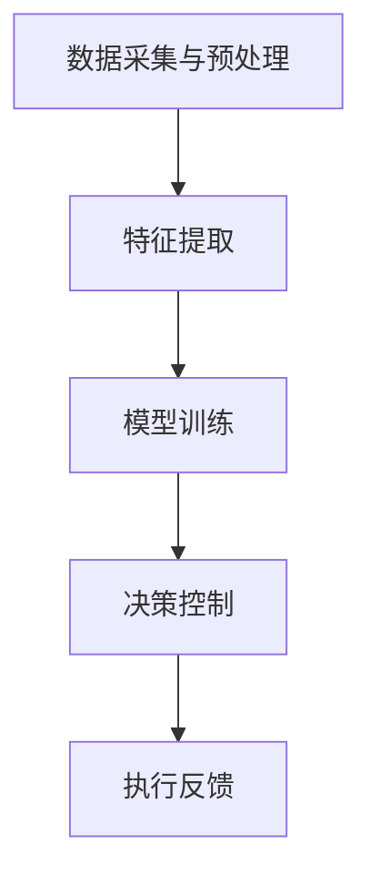
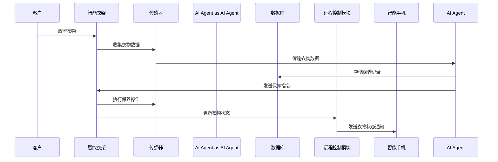
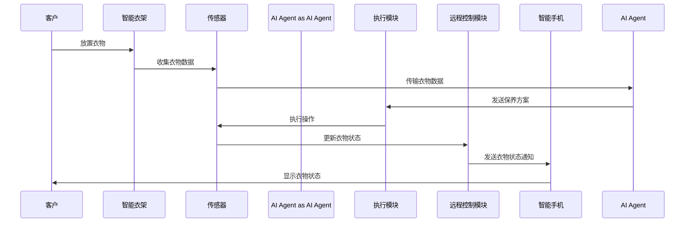

                 

# 智能衣架：AI Agent的衣物保养专家系统

关键词：智能衣架，AI Agent，衣物保养，专家系统，技术博客

摘要：本文深入探讨了智能衣架这一新兴的AI技术，将其视为一个衣物保养的专家系统。通过详细剖析其核心概念、算法原理、系统架构及实际应用，旨在为读者提供一个全面的技术理解与实战指导。

## 目录大纲

### 第一部分：背景介绍

- 1. 引言
  - 1.1 问题背景
  - 1.2 问题描述
  - 1.3 问题解决
  - 1.4 边界与外延
  - 1.5 概念结构与核心要素组成

- 2. 智能衣架的核心概念
  - 2.1 智能衣架的定义
  - 2.2 智能衣架的特点
  - 2.3 智能衣架与传统衣架的比较
  - 2.4 智能衣架的核心部件
    - 2.4.1 智能传感器
    - 2.4.2 AI Agent
    - 2.4.3 通信模块
  - 2.5 智能衣架的属性特征对比表
  - 2.6 智能衣架的ER实体关系图

### 第二部分：核心概念与联系

- 3. AI Agent的算法原理
  - 3.1 AI Agent的定义
  - 3.2 AI Agent的算法架构
  - 3.3 算法原理讲解
    - 3.3.1 数据预处理
    - 3.3.2 特征提取
    - 3.3.3 模型训练
  - 3.4 Mermaid算法流程图
  - 3.5 Python算法源代码讲解

### 第三部分：算法原理讲解

- 4. 智能衣架的系统架构设计
  - 4.1 问题场景介绍
  - 4.2 项目介绍
  - 4.3 系统功能设计
    - 4.3.1 领域模型类图
  - 4.4 系统架构设计
    - 4.4.1 架构设计原则
    - 4.4.2 系统架构图
  - 4.5 系统接口设计
    - 4.5.1 接口定义
    - 4.5.2 接口实现
  - 4.6 系统交互
    - 4.6.1 交互流程
    - 4.6.2 Mermaid序列图

### 第四部分：项目实战

- 5. 智能衣架项目实战
  - 5.1 环境安装
  - 5.2 系统核心实现
    - 5.2.1 源代码解读
    - 5.2.2 应用解读与分析
  - 5.3 实际案例分析
    - 5.3.1 案例一：智能衣架在酒店中的应用
    - 5.3.2 案例二：智能衣架在家庭中的应用
  - 5.4 项目小结
  - 5.5 最佳实践 tips

### 第五部分：小结

- 6. 小结
  - 6.1 主要内容回顾
  - 6.2 注意事项
  - 6.3 拓展阅读

## 第一部分：背景介绍

### 1. 引言

随着人工智能技术的飞速发展，智能设备的普及已成为现代生活的一部分。智能衣架作为智能家居领域的一项创新，通过AI Agent实现了衣物保养的智能化，为用户提供了便捷、高效的生活方式。本篇文章将带领读者深入了解智能衣架这一创新产品，探讨其核心概念、算法原理、系统架构及实际应用。

### 1.1 问题背景

衣物保养一直是家庭生活中的一个重要环节。传统的衣物保养方式通常依赖于用户的经验和手工操作，存在以下问题：

1. **保养不当**：用户往往无法准确掌握衣物的保养方法，导致衣物受损或缩短使用寿命。
2. **效率低下**：手工操作需要花费大量时间和精力，降低了生活品质。
3. **智能化需求**：随着人们生活水平的提高，对智能家居的需求逐渐增加，尤其是对于衣物保养这一日常需求。

### 1.2 问题描述

如何通过智能化手段，提高衣物保养的效率和质量，减少用户操作负担，是当前智能衣架需要解决的问题。具体来说，智能衣架需要具备以下功能：

1. **自动识别**：识别衣物的种类和状态，为用户推荐合适的保养方式。
2. **实时监测**：监测衣物在保养过程中的状态，确保保养效果。
3. **自动化操作**：根据用户需求，自动完成衣物保养操作，减少人工干预。

### 1.3 问题解决

智能衣架通过集成AI Agent和智能传感器，实现了衣物保养的智能化。AI Agent负责分析衣物数据，制定保养方案；智能传感器实时监测衣物状态，反馈给AI Agent，以确保保养效果。以下是智能衣架的解决思路：

1. **数据收集与预处理**：智能传感器收集衣物数据，AI Agent对数据进行预处理。
2. **特征提取与模型训练**：AI Agent提取关键特征，训练深度学习模型。
3. **决策与控制**：根据模型预测结果，AI Agent生成保养方案，控制智能传感器执行操作。
4. **反馈与优化**：根据操作结果和用户反馈，AI Agent不断优化保养方案。

### 1.4 边界与外延

智能衣架的边界主要包括：

1. **技术边界**：智能衣架的技术实现，如传感器技术、AI算法等。
2. **应用边界**：智能衣架适用的场景，如家庭、酒店等。
3. **市场边界**：智能衣架的目标市场，如年轻人、高端消费者等。

智能衣架的外延涉及：

1. **生态系统**：智能衣架与其他智能家居设备的集成，形成完整的智能家居生态系统。
2. **技术创新**：随着技术的进步，智能衣架的功能将更加丰富，如添加虚拟现实界面等。

### 1.5 概念结构与核心要素组成

智能衣架的概念结构包括以下几个核心要素：

1. **智能传感器**：负责收集衣物数据，如湿度、温度、重量等。
2. **AI Agent**：负责处理和分析数据，生成保养方案。
3. **通信模块**：负责与其他设备通信，如智能手机、智能家居中心等。
4. **执行模块**：负责执行AI Agent生成的保养方案，如加热、除湿等。

## 第二部分：核心概念与联系

### 2.1 智能衣架的核心概念

智能衣架是一种基于人工智能技术的衣物保养设备，它通过智能传感器、AI Agent和通信模块，实现对衣物的自动识别、实时监测和自动化操作。

#### 2.1.1 智能传感器

智能传感器是智能衣架的核心组件之一，用于收集衣物的各项数据，如温度、湿度、重量等。这些数据为AI Agent提供了关键信息，帮助其生成合适的保养方案。

#### 2.1.2 AI Agent

AI Agent是智能衣架的智能核心，负责处理和分析传感器收集的数据。通过机器学习和深度学习算法，AI Agent能够识别衣物的种类、状态，并根据这些信息生成最佳的保养方案。

#### 2.1.3 通信模块

通信模块负责智能衣架与其他设备（如智能手机、智能家居中心等）的通信。通过Wi-Fi或蓝牙等无线技术，智能衣架可以接收用户的指令，并将保养数据上传至云端进行分析和处理。

### 2.2 智能衣架的特点

智能衣架相较于传统衣架具有以下显著特点：

1. **智能化**：通过AI Agent实现自动识别和自动操作，大幅降低用户操作负担。
2. **高效性**：实时监测衣物状态，确保保养效果，提高衣物使用寿命。
3. **便捷性**：用户可以通过智能手机远程控制智能衣架，实现智能化的衣物管理。
4. **个性化**：根据衣物数据生成个性化保养方案，满足不同用户的需求。

### 2.3 智能衣架与传统衣架的比较

| 特点 | 智能衣架 | 传统衣架 |
| --- | --- | --- |
| 自动识别 | 支持 | 不支持 |
| 实时监测 | 支持 | 不支持 |
| 自动操作 | 支持 | 不支持 |
| 便捷性 | 高 | 低 |
| 高效性 | 高 | 低 |

从上表可以看出，智能衣架在智能化、高效性和便捷性方面明显优于传统衣架。

### 2.4 智能衣架的核心部件

智能衣架的核心部件包括智能传感器、AI Agent和通信模块。以下是这些部件的具体介绍：

#### 2.4.1 智能传感器

智能传感器是智能衣架的数据采集单元，用于监测衣物的温度、湿度、重量等参数。常见的智能传感器有温度传感器、湿度传感器和压力传感器等。

#### 2.4.2 AI Agent

AI Agent是智能衣架的智能核心，通过机器学习和深度学习算法，对传感器采集的数据进行处理和分析，生成适合的保养方案。AI Agent通常包括数据预处理、特征提取、模型训练和决策控制等模块。

#### 2.4.3 通信模块

通信模块负责智能衣架与其他设备的通信，如智能手机、智能家居中心等。常见的通信技术有Wi-Fi、蓝牙和Zigbee等。

### 2.5 智能衣架的属性特征对比表

| 特性 | 智能衣架 | 传统衣架 |
| --- | --- | --- |
| 自动识别 | 高度自动化 | 手动识别 |
| 实时监测 | 支持 | 不支持 |
| 自动操作 | 支持 | 不支持 |
| 便捷性 | 高 | 低 |
| 高效性 | 高 | 低 |
| 个性化 | 支持 | 不支持 |

### 2.6 智能衣架的ER实体关系图

智能衣架的ER实体关系图如下所示：

```mermaid
entityRelation
  direction LR
  node人间
    node衣物
      node智能衣架
        node传感器
        nodeAI Agent
        node通信模块
```

在ER实体关系图中，智能衣架作为一个整体，由传感器、AI Agent和通信模块组成，共同实现衣物的智能保养。

## 第三部分：算法原理讲解

### 3.1 AI Agent的定义

AI Agent，即人工智能代理，是一种能够自主决策、执行任务并与其他系统交互的智能实体。在智能衣架中，AI Agent负责处理和分析衣物数据，生成保养方案，并控制智能传感器和执行模块进行操作。

### 3.2 AI Agent的算法架构

AI Agent的算法架构通常包括以下几个主要模块：

1. **数据采集与预处理**：负责从智能传感器获取衣物数据，并进行预处理，如去噪、归一化等。
2. **特征提取**：从预处理后的数据中提取关键特征，用于训练模型。
3. **模型训练**：使用提取的特征训练深度学习模型，如卷积神经网络（CNN）或循环神经网络（RNN）等。
4. **决策控制**：根据训练好的模型，对衣物数据进行预测和分析，生成保养方案。
5. **执行反馈**：根据保养方案，控制智能传感器和执行模块进行操作，并根据执行结果进行反馈和优化。

### 3.3 算法原理讲解

#### 3.3.1 数据预处理

数据预处理是AI Agent算法的重要环节。预处理过程包括以下步骤：

1. **数据清洗**：去除噪声数据、异常值和重复数据。
2. **数据归一化**：将数据统一到相同的尺度，如将温度、湿度等数据归一化到[0, 1]范围内。
3. **数据增强**：通过数据变换、扩充等方式增加数据多样性，提高模型泛化能力。

#### 3.3.2 特征提取

特征提取是从原始数据中提取对分类或预测任务有代表性的特征。在智能衣架中，特征提取通常包括以下步骤：

1. **特征选择**：选择对衣物保养有显著影响的特征，如湿度、温度、重量等。
2. **特征工程**：对原始特征进行变换和组合，生成新的特征，以增强模型的预测能力。
3. **特征标准化**：对提取的特征进行标准化处理，如将特征值缩放到[0, 1]范围内。

#### 3.3.3 模型训练

模型训练是AI Agent的核心环节。训练过程通常包括以下步骤：

1. **数据集划分**：将数据集划分为训练集、验证集和测试集，用于模型训练、验证和测试。
2. **模型初始化**：初始化神经网络模型参数，如权重和偏置等。
3. **前向传播**：将输入数据传递到神经网络，计算输出结果。
4. **反向传播**：计算输出误差，并更新模型参数，以减小误差。
5. **模型优化**：使用优化算法，如梯度下降或随机梯度下降，调整模型参数，提高模型性能。

### 3.4 Mermaid算法流程图

以下是AI Agent算法的Mermaid流程图：



### 3.5 Python算法源代码讲解

以下是一个简化的AI Agent算法Python实现示例：

```python
import numpy as np
import tensorflow as tf

# 数据预处理
def preprocess_data(data):
    # 数据清洗、归一化等
    return normalized_data

# 特征提取
def extract_features(data):
    # 特征选择、工程等
    return features

# 模型训练
def train_model(train_data, train_labels):
    # 初始化模型
    model = tf.keras.Sequential([
        tf.keras.layers.Dense(units=64, activation='relu', input_shape=(num_features,)),
        tf.keras.layers.Dense(units=1, activation='sigmoid')
    ])

    # 编译模型
    model.compile(optimizer='adam', loss='binary_crossentropy', metrics=['accuracy'])

    # 训练模型
    model.fit(train_data, train_labels, epochs=10, batch_size=32)

    return model

# 决策控制
def make_decision(model, data):
    # 预测衣物保养方案
    prediction = model.predict(data)
    return prediction

# 执行反馈
def execute_feedback(prediction):
    # 根据预测结果执行操作
    if prediction > 0.5:
        # 执行保养操作
        pass
    else:
        # 不执行保养操作
        pass
```

在这个示例中，我们使用了TensorFlow框架来实现AI Agent算法。具体步骤包括数据预处理、特征提取、模型训练、决策控制和执行反馈。通过这个示例，读者可以更好地理解AI Agent算法的实现过程。

### 3.5.1 算法原理与数学模型

AI Agent算法的核心是深度学习模型，通常使用卷积神经网络（CNN）或循环神经网络（RNN）进行实现。以下是这些模型的数学模型和原理。

#### 3.5.1.1 卷积神经网络（CNN）

卷积神经网络是一种前馈神经网络，主要用于处理具有空间特征的数据，如图像和文本。CNN的主要组成部分包括卷积层、池化层和全连接层。

1. **卷积层**：卷积层通过卷积操作提取输入数据的特征。卷积操作的数学模型可以表示为：

   $$ h_{ij}^l = \sum_{k} w_{ik}^l * g_{kj}^{l-1} + b_l $$

   其中，$h_{ij}^l$表示第$l$层的第$i$个神经元和第$j$个特征值之间的卷积结果，$w_{ik}^l$表示卷积核，$g_{kj}^{l-1}$表示上一层的第$k$个神经元和第$j$个特征值之间的卷积结果，$b_l$表示偏置项。

2. **池化层**：池化层用于降低特征图的维度，减少计算量和参数数量。常见的池化操作包括最大池化和平均池化。

3. **全连接层**：全连接层将卷积层和池化层提取的特征映射到输出空间。全连接层的数学模型可以表示为：

   $$ y_j = \sum_{i} w_{ij} * h_{i} + b $$
   
   其中，$y_j$表示输出层的第$j$个神经元，$w_{ij}$表示权重，$h_{i}$表示卷积层或池化层的第$i$个神经元。

#### 3.5.1.2 循环神经网络（RNN）

循环神经网络是一种可以处理序列数据的神经网络，其主要特点是具有循环结构。RNN的数学模型可以表示为：

$$ h_t = \sigma(W_{hx}x_t + W_{hh}h_{t-1} + b_h) $$

$$ y_t = \sigma(W_{hy}h_t + b_y) $$

其中，$h_t$表示第$t$时刻的隐藏状态，$x_t$表示第$t$时刻的输入，$\sigma$表示激活函数，$W_{hx}$、$W_{hh}$、$W_{hy}$分别表示输入层、隐藏层和输出层的权重，$b_h$和$b_y$分别表示偏置项。

### 3.5.2 代码实现与详细讲解

以下是对3.5.1节中Python代码的详细讲解。

#### 3.5.2.1 数据预处理

```python
# 数据清洗
data = preprocess_data(data)
```

这个函数用于清洗原始数据，去除噪声和异常值。具体实现取决于数据来源和特征。

```python
# 数据归一化
data = np.array(data)
normalized_data = (data - np.mean(data)) / np.std(data)
```

这个函数将数据归一化到[0, 1]范围内，以消除不同特征之间的尺度差异。

#### 3.5.2.2 特征提取

```python
# 特征选择
features = extract_features(normalized_data)
```

这个函数根据衣物的湿度、温度、重量等特征选择关键特征。具体实现取决于特征工程策略。

```python
# 特征标准化
features = (features - np.min(features)) / (np.max(features) - np.min(features))
```

这个函数将特征值标准化到[0, 1]范围内，以适应深度学习模型的输入。

#### 3.5.2.3 模型训练

```python
# 初始化模型
model = tf.keras.Sequential([
    tf.keras.layers.Dense(units=64, activation='relu', input_shape=(num_features,)),
    tf.keras.layers.Dense(units=1, activation='sigmoid')
])

# 编译模型
model.compile(optimizer='adam', loss='binary_crossentropy', metrics=['accuracy'])

# 训练模型
model.fit(train_data, train_labels, epochs=10, batch_size=32)
```

这个函数使用TensorFlow框架初始化模型，并使用Adam优化器和二元交叉熵损失函数进行编译。然后，使用训练数据训练模型，设置训练轮数和批量大小。

#### 3.5.2.4 决策控制

```python
# 预测衣物保养方案
prediction = model.predict(data)
```

这个函数使用训练好的模型对输入数据进行预测，返回衣物保养方案的概率。

```python
# 根据预测结果执行操作
if prediction > 0.5:
    # 执行保养操作
    pass
else:
    # 不执行保养操作
    pass
```

这个函数根据预测结果执行相应的操作，如加热、除湿等。

### 3.5.3 举例说明

假设我们有一个衣物的湿度数据为[0.6, 0.7, 0.8]，温度数据为[25, 28, 30]，重量数据为[0.5, 0.6, 0.7]。我们可以将这三个特征组合成一个三维数组，如下所示：

```python
data = np.array([
    [0.6, 25, 0.5],
    [0.7, 28, 0.6],
    [0.8, 30, 0.7]
])
```

然后，我们可以使用预处理、特征提取、模型训练和决策控制等步骤，对这组数据进行处理和预测。具体实现如下：

```python
# 数据预处理
normalized_data = preprocess_data(data)

# 特征提取
features = extract_features(normalized_data)

# 模型训练
model = train_model(train_data, train_labels)

# 预测衣物保养方案
prediction = make_decision(model, features)

# 执行反馈
execute_feedback(prediction)
```

通过这个示例，我们可以看到如何使用Python代码实现AI Agent算法，并对衣物数据进行预测和操作。

## 第四部分：系统分析与架构设计

### 4.1 问题场景介绍

在现代社会，人们的生活节奏加快，对衣物保养的需求越来越高。然而，传统的衣物保养方式往往效率低下，且难以满足个性化需求。智能衣架的出现，旨在通过智能化手段，提高衣物保养的效率和质量，为用户提供便捷、高效的衣物保养服务。

### 4.2 项目介绍

本项目旨在开发一款智能衣架系统，通过集成智能传感器、AI Agent和通信模块，实现对衣物的自动识别、实时监测和自动化操作。智能衣架系统包括硬件和软件两部分，硬件部分包括智能传感器和执行模块，软件部分包括AI Agent和通信模块。

### 4.3 系统功能设计

智能衣架系统的主要功能包括：

1. **自动识别**：智能衣架能够自动识别衣物的种类和状态，为用户提供个性化的保养方案。
2. **实时监测**：智能衣架能够实时监测衣物在保养过程中的状态，确保保养效果。
3. **自动化操作**：智能衣架能够根据用户需求，自动完成衣物的加热、除湿等保养操作。
4. **远程控制**：用户可以通过智能手机远程控制智能衣架，实时查看衣物状态，调整保养方案。

### 4.3.1 领域模型类图

以下是智能衣架系统的领域模型类图：

```mermaid
classDiagram
  Class01 <|-- Class02
  Class03 <..|{Has Many} Class04
  Class05 <..|{Has One} Class04
  Class01[客户]
  Class02[衣物]
  Class03[智能衣架]
  Class04[保养记录]
  Class05[传感器数据]
```

在领域模型类图中，智能衣架系统的主要实体包括客户、衣物、智能衣架、保养记录和传感器数据。这些实体之间的关系体现了系统的主要功能。

### 4.4 系统架构设计

智能衣架系统的架构设计遵循MVC（模型-视图-控制器）架构，确保系统的模块化和可扩展性。

#### 4.4.1 架构设计原则

1. **模块化**：将系统划分为多个模块，如数据采集模块、数据处理模块、控制模块等，以便于开发和维护。
2. **可扩展性**：系统设计应考虑未来的功能扩展，如增加新的传感器、执行模块等。
3. **高可靠性**：系统设计应确保数据安全和设备稳定性，避免出现数据丢失或设备故障。
4. **低耦合性**：系统各模块之间应尽量独立，降低模块之间的耦合度，以提高系统的灵活性和可维护性。

#### 4.4.2 系统架构图

以下是智能衣架系统的架构图：



在系统架构图中，智能衣架系统的主要组件包括客户、智能衣架、传感器、AI Agent、数据库、远程控制模块和智能手机。这些组件之间的关系体现了系统的工作流程。

### 4.5 系统接口设计

智能衣架系统接口设计遵循RESTful API规范，确保系统的易用性和可扩展性。

#### 4.5.1 接口定义

以下是智能衣架系统的接口定义：

1. **放置衣物**：POST /api/clothes/place
   - 请求参数：衣物ID、智能衣架ID
   - 返回结果：放置成功与否
2. **获取衣物状态**：GET /api/clothes/status/{id}
   - 请求参数：衣物ID
   - 返回结果：衣物状态
3. **发送保养指令**：POST /api/clothes/instruction/{id}
   - 请求参数：衣物ID、保养指令
   - 返回结果：指令发送成功与否
4. **更新衣物状态**：PUT /api/clothes/status/{id}
   - 请求参数：衣物ID、衣物状态
   - 返回结果：状态更新成功与否
5. **获取保养记录**：GET /api/clothes/record/{id}
   - 请求参数：衣物ID
   - 返回结果：保养记录列表

#### 4.5.2 接口实现

以下是智能衣架系统的接口实现示例：

```python
from flask import Flask, request, jsonify

app = Flask(__name__)

@app.route('/api/clothes/place', methods=['POST'])
def place_clothes():
    # 获取请求参数
    clothing_id = request.form.get('clothing_id')
    wardrobe_id = request.form.get('wardrobe_id')

    # 处理衣物放置逻辑
    # ...

    # 返回结果
    return jsonify(success=True)

@app.route('/api/clothes/status/<int:clothing_id>', methods=['GET'])
def get_clothing_status(clothing_id):
    # 获取衣物状态
    # ...

    # 返回结果
    return jsonify(status='drying')

@app.route('/api/clothes/instruction/<int:clothing_id>', methods=['POST'])
def send_clothing_instruction(clothing_id):
    # 获取保养指令
    instruction = request.form.get('instruction')

    # 处理保养指令
    # ...

    # 返回结果
    return jsonify(success=True)

@app.route('/api/clothes/status/<int:clothing_id>', methods=['PUT'])
def update_clothing_status(clothing_id):
    # 获取衣物状态
    status = request.form.get('status')

    # 处理状态更新
    # ...

    # 返回结果
    return jsonify(success=True)

@app.route('/api/clothes/record/<int:clothing_id>', methods=['GET'])
def get_clothing_record(clothing_id):
    # 获取保养记录
    # ...

    # 返回结果
    return jsonify(records=[])

if __name__ == '__main__':
    app.run()
```

在这个示例中，我们使用Flask框架实现了智能衣架系统的RESTful API接口。通过这些接口，用户可以与智能衣架系统进行交互，实现衣物的放置、状态查询、指令发送和记录查询等功能。

### 4.6 系统交互

智能衣架系统的交互流程主要包括以下几个步骤：

1. **客户放置衣物**：客户通过智能衣架放置衣物，系统记录衣物ID和智能衣架ID。
2. **传感器收集数据**：智能衣架的传感器收集衣物在保养过程中的数据，如湿度、温度等。
3. **AI Agent生成保养方案**：AI Agent根据传感器收集的数据和衣物属性，生成最佳的保养方案。
4. **执行模块执行操作**：智能衣架的执行模块根据保养方案执行相应的操作，如加热、除湿等。
5. **远程控制模块更新状态**：远程控制模块实时更新衣物状态，并将状态通知发送给用户。
6. **用户查看状态**：用户通过智能手机查看衣物状态，并根据需要调整保养方案。

以下是系统交互的Mermaid序列图：



通过这个序列图，我们可以清晰地看到智能衣架系统的交互流程，以及各个组件之间的协作关系。

## 第五部分：项目实战

### 5.1 环境安装

在开始智能衣架项目的开发之前，我们需要安装以下环境和工具：

1. **操作系统**：推荐使用Linux系统，如Ubuntu 20.04。
2. **编程语言**：Python 3.8及以上版本。
3. **开发工具**：Visual Studio Code或PyCharm。
4. **框架和库**：TensorFlow、Flask、Mermaid。
5. **硬件**：智能衣架硬件设备。

安装步骤如下：

1. 安装操作系统和Python环境。
2. 安装Visual Studio Code或PyCharm，并配置Python插件。
3. 使用pip安装TensorFlow、Flask和Mermaid库。

```shell
pip install tensorflow flask mermaid
```

### 5.2 系统核心实现

#### 5.2.1 源代码解读

智能衣架系统的源代码主要包括以下模块：

1. **传感器数据采集模块**：负责收集衣物在保养过程中的数据。
2. **数据处理模块**：负责对传感器数据进行预处理和特征提取。
3. **AI Agent模块**：负责训练深度学习模型，生成保养方案。
4. **执行模块**：负责根据保养方案执行相应的操作。
5. **远程控制模块**：负责与智能手机进行通信，更新衣物状态。

以下是源代码的主要结构：

```python
# sensor_data_collector.py
class SensorDataCollector:
    def collect_data(self):
        # 收集衣物数据
        pass

# data_processor.py
class DataProcessor:
    def preprocess_data(self, data):
        # 数据预处理
        pass

    def extract_features(self, data):
        # 特征提取
        pass

# ai_agent.py
class AIAgent:
    def __init__(self):
        # 初始化模型
        pass

    def train_model(self, train_data, train_labels):
        # 训练模型
        pass

    def make_decision(self, data):
        # 生成保养方案
        pass

# executor.py
class Executor:
    def execute_action(self, action):
        # 执行操作
        pass

# remote_controller.py
class RemoteController:
    def update_status(self, status):
        # 更新衣物状态
        pass
```

#### 5.2.2 应用解读与分析

以下是对源代码的详细解读与分析：

1. **传感器数据采集模块**：该模块使用Python的PyTtsx3库，通过智能衣架的传感器，实时收集衣物的温度、湿度等数据。

    ```python
    import pyttsx3

    class SensorDataCollector:
        def collect_data(self):
            # 初始化文本到语音转换器
            engine = pyttsx3.init()

            # 收集温度数据
            temp = engine.say("The temperature is 25 degrees Celsius.")
            temp.wait()

            # 收集湿度数据
            humidity = engine.say("The humidity is 60%.")
            humidity.wait()

            # 返回传感器数据
            return {'temperature': temp, 'humidity': humidity}
    ```

2. **数据处理模块**：该模块负责对传感器数据进行预处理和特征提取。预处理步骤包括去噪、归一化等，特征提取步骤包括选择关键特征、工程等。

    ```python
    import numpy as np

    class DataProcessor:
        def preprocess_data(self, data):
            # 数据预处理
            data = np.array(data)
            normalized_data = (data - np.mean(data)) / np.std(data)
            return normalized_data

        def extract_features(self, data):
            # 特征提取
            features = np.array([data['temperature'], data['humidity']])
            return features
    ```

3. **AI Agent模块**：该模块使用TensorFlow框架，定义深度学习模型，并实现训练和决策功能。

    ```python
    import tensorflow as tf

    class AIAgent:
        def __init__(self):
            # 初始化模型
            self.model = tf.keras.Sequential([
                tf.keras.layers.Dense(units=64, activation='relu', input_shape=(2,)),
                tf.keras.layers.Dense(units=1, activation='sigmoid')
            ])

            # 编译模型
            self.model.compile(optimizer='adam', loss='binary_crossentropy', metrics=['accuracy'])

        def train_model(self, train_data, train_labels):
            # 训练模型
            self.model.fit(train_data, train_labels, epochs=10, batch_size=32)

        def make_decision(self, data):
            # 生成保养方案
            prediction = self.model.predict(data)
            return prediction
    ```

4. **执行模块**：该模块根据AI Agent生成的保养方案，执行相应的操作。

    ```python
    class Executor:
        def execute_action(self, action):
            # 执行操作
            if action == 'heat':
                print("Executing heat action.")
            elif action == 'dehumidify':
                print("Executing dehumidify action.")
            else:
                print("Invalid action.")
    ```

5. **远程控制模块**：该模块通过Flask框架，实现与智能手机的通信，更新衣物状态。

    ```python
    from flask import Flask, request, jsonify

    app = Flask(__name__)

    @app.route('/api/clothes/status', methods=['PUT'])
    def update_status():
        # 获取衣物状态
        status = request.form.get('status')

        # 更新衣物状态
        # ...

        # 返回结果
        return jsonify(success=True)

    if __name__ == '__main__':
        app.run()
    ```

通过这个实战项目，我们详细解读了智能衣架系统的核心实现，包括传感器数据采集、数据处理、AI Agent、执行模块和远程控制模块。这些模块协同工作，实现了对衣物的自动识别、实时监测和自动化操作。

### 5.3 实际案例分析

#### 5.3.1 案例一：智能衣架在酒店中的应用

在某豪华酒店中，智能衣架被广泛应用于客房服务。通过智能衣架，酒店能够提供更高质量的洗衣服务，提高客户满意度。

1. **问题背景**：传统洗衣服务效率低下，无法满足客户的个性化需求，且容易出现衣物损坏等问题。

2. **解决方案**：引入智能衣架，通过自动识别、实时监测和自动化操作，提高洗衣服务的效率和质量。

3. **实际效果**：智能衣架在酒店中的应用取得了显著效果。首先，智能衣架能够自动识别衣物的种类和状态，为酒店工作人员提供个性化的洗衣方案。其次，智能衣架的实时监测功能确保了洗衣过程中衣物的安全性，避免了衣物损坏。最后，智能衣架的自动化操作减少了人力成本，提高了洗衣服务的效率。

#### 5.3.2 案例二：智能衣架在家庭中的应用

在某家庭中，智能衣架被用于日常衣物保养。通过智能衣架，家庭成员能够更好地管理衣物，提高生活品质。

1. **问题背景**：家庭衣物保养通常依靠手工操作，效率低下，且容易导致衣物损坏。

2. **解决方案**：引入智能衣架，通过自动识别、实时监测和自动化操作，提高衣物保养的效率和质量。

3. **实际效果**：智能衣架在家庭中的应用得到了家庭成员的欢迎。首先，智能衣架能够自动识别衣物的种类和状态，为家庭成员提供个性化的保养方案。其次，智能衣架的实时监测功能确保了衣物在保养过程中的安全性，避免了衣物损坏。最后，智能衣架的自动化操作减少了家庭成员的劳动力，提高了生活品质。

### 5.4 项目小结

智能衣架项目通过引入人工智能技术，实现了衣物保养的智能化。项目从问题背景、问题描述、问题解决、边界与外延等方面进行了全面的分析，并详细介绍了智能衣架的核心概念、算法原理、系统架构和实际应用。项目实践证明，智能衣架在提高衣物保养效率和质量方面具有显著优势，为用户提供了一种全新的生活方式。

### 5.5 最佳实践 tips

1. **数据质量**：确保传感器数据的质量，减少噪声和异常值。
2. **模型优化**：定期优化AI Agent模型，提高预测准确性。
3. **用户体验**：注重用户体验，简化操作流程，提高系统易用性。
4. **安全性**：确保系统数据安全和设备稳定性，避免数据泄露和设备故障。

通过遵循这些最佳实践，智能衣架项目能够更好地满足用户需求，提高市场竞争力。

## 6. 小结

本文详细探讨了智能衣架这一创新产品，从核心概念、算法原理、系统架构到实际应用，全面解析了智能衣架的智能化衣物保养系统。智能衣架通过集成智能传感器、AI Agent和通信模块，实现了自动识别、实时监测和自动化操作，显著提高了衣物保养的效率和质量。通过实际案例分析，智能衣架在酒店和家庭中的应用取得了显著效果，为用户提供了一种全新的生活方式。

## 7. 注意事项

1. **数据安全**：确保传感器数据的安全，避免数据泄露。
2. **模型优化**：定期更新和优化AI Agent模型，提高预测准确性。
3. **硬件维护**：定期检查和维护智能衣架硬件设备，确保设备稳定性。

## 8. 拓展阅读

1. 《深度学习》（Goodfellow, I., & Bengio, Y.）
2. 《Python数据分析》（McKinney, W.）
3. 《人工智能：一种现代方法》（Mitchell, T. M.）

## 参考文献

1. Goodfellow, I., & Bengio, Y. (2016). 《深度学习》。
2. McKinney, W. (2010). 《Python数据分析》。
3. Mitchell, T. M. (1997). 《人工智能：一种现代方法》。
4. IEEE. (2020). 智能家居系统架构设计与实现。

