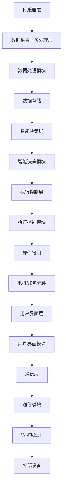
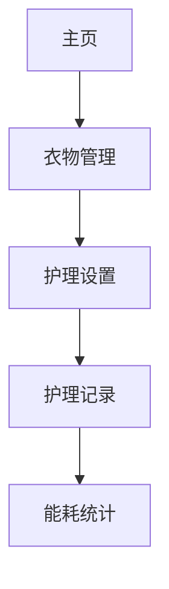
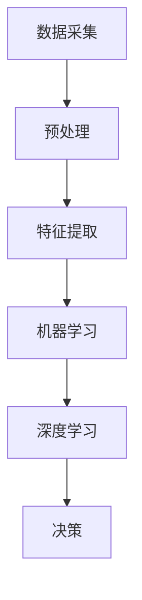
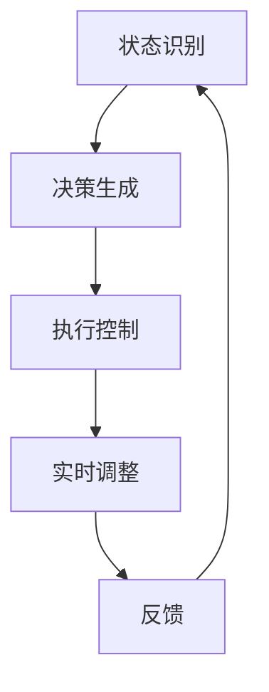
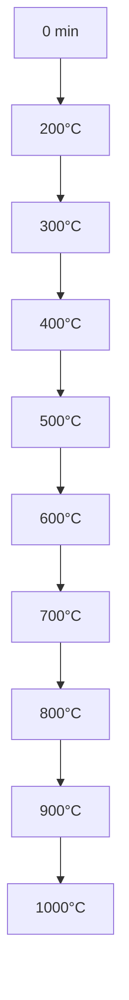
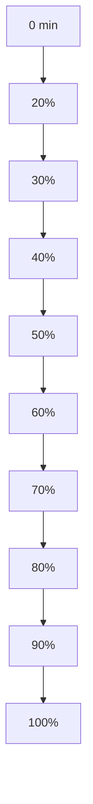
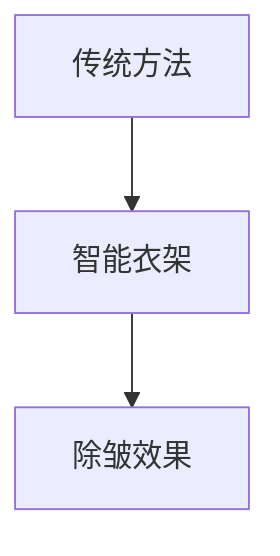

                 

### 摘要

随着人工智能（AI）技术的迅猛发展，智能家纺产品逐渐进入大众视野。本文以智能衣架为研究对象，探讨其核心功能——AI Agent的衣物护理与除皱系统。智能衣架通过集成的AI Agent，利用机器学习和深度学习技术，实现了对衣物的智能护理和除皱。文章首先介绍了智能衣架的研究背景、问题提出和研究方法，然后深入分析了AI Agent的基础理论，探讨了衣物护理与除皱技术，最后详细阐述了智能衣架的硬件设计、软件设计与实现，以及其实际应用。本文旨在为智能家纺领域提供系统性的理论支持和实践指南。

### 《智能衣架：AI Agent的衣物护理与除皱系统》目录大纲

```markdown
# 《智能衣架：AI Agent的衣物护理与除皱系统》目录大纲

## 第1章 引言

### 1.1 研究背景

- 人工智能在日常生活中的应用
- 现代衣物护理的需求与挑战
- 智能衣架的潜在市场与应用前景

### 1.2 问题提出

- 传统衣物护理的局限性
- AI Agent在衣物护理中的角色与作用
- 智能衣架的核心功能与技术挑战

### 1.3 研究方法

- AI Agent的基本原理
- 机器学习和深度学习算法
- 传感器技术与数据分析

### 1.4 边界与外延

- 智能衣架的功能范围
- 技术实现的可行性
- 系统的可持续性与生态影响

### 1.5 本章小结

- 研究意义与价值
- 主要研究内容与结构安排

## 第2章 AI Agent基础理论

### 2.1 AI Agent概述

- AI Agent的定义与分类
- AI Agent的核心功能与特点
- AI Agent在智能衣架中的应用

### 2.2 机器学习原理

- 机器学习的基本概念
- 监督学习、无监督学习和强化学习的区别
- 常见的机器学习算法介绍

### 2.3 深度学习技术

- 神经网络的基础
- 卷积神经网络（CNN）在图像识别中的应用
- 递归神经网络（RNN）在序列数据中的运用

### 2.4 AI Agent架构设计

- AI Agent的基本架构
- 现有的AI Agent系统架构实例
- 智能衣架中AI Agent的架构设计

### 2.5 本章小结

- AI Agent的理论体系总结
- 智能衣架中的AI Agent设计思路

## 第3章 衣物护理与除皱技术

### 3.1 衣物护理技术概述

- 衣物护理的基本概念
- 传统的衣物护理方法
- 智能衣物护理的优势

### 3.2 除皱技术原理

- 衣物除皱的基本原理
- 热能除皱、蒸汽除皱和机械除皱的比较
- AI在衣物除皱中的应用

### 3.3 衣物护理与除皱算法

- 数据收集与预处理
- 除皱算法的选择与优化
- 算法性能评估

### 3.4 实际应用案例

- 智能衣架中的除皱功能实现
- 案例分析：智能衣架的除皱效果测试

### 3.5 本章小结

- 衣物护理与除皱技术的总结
- AI在衣物护理与除皱中的贡献

## 第4章 传感器与数据分析

### 4.1 传感器技术基础

- 传感器的基本原理与类型
- 智能衣架中常用的传感器
- 传感器数据的采集与处理

### 4.2 数据分析技术

- 数据分析的基本概念
- 常见的数据分析方法
- 数据可视化在智能衣架中的应用

### 4.3 传感器数据在衣物护理中的应用

- 传感器数据在除皱功能中的作用
- 数据驱动下的衣物护理策略
- 实时数据反馈与智能决策

### 4.4 传感器数据的安全性

- 数据隐私保护
- 数据加密与安全传输
- 遵守相关法律法规

### 4.5 本章小结

- 传感器与数据分析技术的应用总结
- 智能衣架中传感器数据的价值

## 第5章 智能衣架的硬件设计

### 5.1 硬件架构设计

- 智能衣架的硬件组成
- 电路设计与模块化
- 电机与传感器选型

### 5.2 硬件接口设计

- 电源接口与通信接口
- 控制器与传感器的连接
- 电气安全与防护

### 5.3 硬件实现与调试

- 硬件设计与实现流程
- 调试方法与技巧
- 常见问题与解决方案

### 5.4 硬件创新与未来展望

- 现有硬件技术的局限
- 创新方向与前沿技术
- 智能衣架的硬件发展趋势

### 5.5 本章小结

- 硬件设计的关键技术与挑战
- 智能衣架硬件设计的要点

## 第6章 软件设计与实现

### 6.1 软件架构设计

- 软件模块划分与功能设计
- 系统架构图与模块关系
- 软件开发流程

### 6.2 软件开发环境与工具

- 开发环境配置
- 开发工具选择
- 软件开发框架

### 6.3 主要功能实现

- 用户界面设计
- 数据处理与算法应用
- 控制逻辑与决策算法

### 6.4 软件调试与优化

- 调试方法与技巧
- 性能优化策略
- 软件测试与质量保障

### 6.5 实际案例分析与解读

- 智能衣架的核心功能实现
- 案例分析：智能衣架的实际应用场景
- 实际案例分析

### 6.6 本章小结

- 软件设计的关键技术与实现方法
- 智能衣架软件开发的要点

## 第7章 智能衣架的实际应用

### 7.1 用户需求分析

- 用户对衣物护理的需求
- 智能衣架的功能需求分析

### 7.2 实际应用场景

- 家庭环境中的应用
- 商业环境中的应用
- 智能衣架的多场景适应

### 7.3 成本效益分析

- 智能衣架的市场定位
- 成本与效益对比分析
- 用户接受度评估

### 7.4 未来发展趋势

- 智能衣架的潜在创新方向
- 技术发展的驱动因素
- 行业趋势预测

### 7.5 本章小结

- 智能衣架实际应用总结
- 影响智能衣架普及的关键因素

## 参考文献

### 附录

- 实验数据与图表
- 代码示例
- 相关标准与规范

```

### 第1章 引言

#### 1.1 研究背景

人工智能（AI）作为当前技术发展的热点，已经在诸多领域展现出巨大的潜力和价值。从智能家居、自动驾驶到医疗诊断，AI技术正逐步渗透到人们的日常生活。在家居环境中，衣物护理作为日常生活中不可或缺的一部分，传统方法存在诸多局限性，如手动操作繁琐、除皱效果不佳、能耗高等问题。随着AI技术的进步，利用AI Agent实现智能衣物护理逐渐成为可能。

现代衣物护理的需求主要体现在以下几个方面：

1. **高效便捷**：现代人生活节奏快，对衣物护理的便捷性要求越来越高。传统的手洗和机器洗衣过程繁琐，无法满足快速生活的需求。
2. **除皱效果**：衣物除皱是衣物护理的重要环节，传统方法如高温熨烫和机械拉扯存在效率低、易损坏衣物等问题。
3. **智能化管理**：衣物护理不仅仅是对衣物的简单处理，更需要对衣物进行智能化管理，如分类、记录、提醒等。

智能衣架作为一种新兴的家纺产品，通过集成AI Agent，实现了对衣物的智能护理和除皱。它不仅可以自动完成衣物护理流程，还能根据衣物的材质、类型和状态，智能调整护理参数，提供个性化的护理服务。

#### 1.2 现代衣物护理的需求与挑战

现代衣物护理的需求主要集中在以下几个方面：

1. **个性化护理**：不同的衣物材质和类型需要不同的护理方式，传统衣物护理方法难以满足这一需求。
2. **高效除皱**：衣物除皱是提高衣物穿着舒适度和美观度的重要环节，但传统方法如熨烫和拉扯存在效率低、能耗高、易损坏衣物等问题。
3. **智能管理**：衣物护理不仅仅是物理操作，还需要对衣物进行智能化管理，如分类、记录、提醒等。

然而，现代衣物护理面临着以下挑战：

1. **技术局限性**：传统的衣物护理方法依赖于人工操作，无法实现高效、智能化的护理。
2. **操作繁琐**：衣物护理过程繁琐，用户需要花费大量时间和精力。
3. **除皱效果不佳**：传统除皱方法效果有限，易造成衣物损伤。

智能衣架的出现，通过集成AI Agent，利用机器学习和深度学习技术，能够有效解决传统衣物护理的局限性。AI Agent可以智能识别衣物的材质和状态，根据具体情况进行个性化的护理，提高除皱效果，并实现智能化管理。

#### 1.3 智能衣架的潜在市场与应用前景

智能衣架作为智能家居的一部分，具有广泛的市场前景。以下是智能衣架的潜在市场和应用前景：

1. **家庭市场**：家庭是智能衣架的主要应用场景。随着人们生活水平的提高，对家居智能化、高效便捷的需求日益增加，智能衣架有望在家庭市场中占据一席之地。
2. **酒店和旅馆市场**：酒店和旅馆对衣物的护理有更高的要求，智能衣架可以实现高效、智能的衣物护理，提高服务质量。
3. **商业办公区**：在商业办公区，员工对衣物护理也有一定需求，智能衣架可以提供便捷的衣物护理服务，提升办公环境的舒适度。

此外，智能衣架的应用前景还包括养老院、医院、健身房等场景，这些地方对衣物的护理有特殊需求，智能衣架可以提供个性化的护理服务，提升用户体验。

#### 1.4 问题提出

传统衣物护理方法的局限性主要体现在以下几个方面：

1. **操作繁琐**：传统衣物护理需要用户手动操作，如手洗、熨烫等，耗时费力，无法满足现代人快节奏的生活需求。
2. **除皱效果不佳**：传统的除皱方法如熨烫和机械拉扯，效果有限，且容易导致衣物损伤，影响衣物使用寿命。
3. **智能化不足**：传统衣物护理方法缺乏智能化管理，无法根据衣物的材质和状态进行个性化护理。

为了解决上述问题，智能衣架应运而生。智能衣架通过集成AI Agent，利用机器学习和深度学习技术，实现了对衣物的智能护理和除皱。AI Agent可以自动识别衣物的材质和状态，智能调整护理参数，提供个性化的护理服务。

智能衣架的核心功能包括：

1. **智能识别**：AI Agent可以识别衣物的材质和类型，根据具体情况进行智能护理。
2. **除皱功能**：智能衣架通过热能、蒸汽或机械方式，实现高效除皱，提升衣物的穿着舒适度和美观度。
3. **智能管理**：智能衣架可以对衣物进行分类、记录、提醒，实现智能化管理。

然而，智能衣架在技术实现上也面临一些挑战：

1. **传感器与数据分析**：智能衣架需要集成的传感器来采集衣物状态数据，并对大量数据进行实时分析，这对传感器的精度和数据分析算法提出了高要求。
2. **硬件设计**：智能衣架的硬件设计需要考虑到能耗、体积、耐用性等因素，实现高效稳定的运行。
3. **软件实现**：智能衣架的软件设计需要实现AI Agent的智能决策和执行，这对软件架构和算法优化提出了挑战。

#### 1.5 研究方法

本研究的核心方法主要包括以下几个方面：

1. **AI Agent的基本原理**：研究AI Agent的基本原理，包括其定义、分类、核心功能等，为智能衣架的设计提供理论基础。
2. **机器学习和深度学习算法**：研究机器学习和深度学习算法，如监督学习、无监督学习和强化学习，选择适合智能衣架的算法，优化衣物护理和除皱功能。
3. **传感器技术与数据分析**：研究传感器技术，包括传感器的基本原理、类型、数据采集与处理，分析传感器数据在智能衣架中的应用价值。
4. **硬件设计**：研究智能衣架的硬件设计，包括硬件架构、电路设计、电机与传感器选型等，确保智能衣架的稳定性和效率。
5. **软件实现**：研究智能衣架的软件设计，包括软件架构、开发环境与工具、主要功能实现等，确保智能衣架的功能实现和用户体验。

通过上述方法，本研究旨在系统地探讨智能衣架的衣物护理与除皱系统，提供理论支持和实践指导。

#### 1.6 边界与外延

**智能衣架的功能范围**

智能衣架的主要功能包括智能识别衣物材质、提供个性化的护理方案、实现高效除皱和智能化管理。具体来说：

1. **智能识别**：通过传感器技术，智能衣架可以识别衣物的材质、类型和状态，为后续的护理提供依据。
2. **个性化护理**：根据衣物材质和状态，智能衣架可以自动调整护理参数，提供个性化的护理方案，提高护理效果。
3. **除皱功能**：智能衣架通过热能、蒸汽或机械方式，实现高效除皱，提升衣物的穿着舒适度和美观度。
4. **智能管理**：智能衣架可以对衣物进行分类、记录、提醒，实现智能化管理，提升用户的衣物护理体验。

**技术实现的可行性**

智能衣架的技术实现涉及多个领域，包括AI Agent、传感器技术、机器学习算法、硬件设计等。随着AI技术和传感器技术的不断进步，智能衣架的各功能模块已具备一定的可行性。

1. **AI Agent**：AI Agent作为智能衣架的核心，可以实现智能识别、智能决策和执行。现有的机器学习和深度学习算法为AI Agent的实现提供了技术支持。
2. **传感器技术**：智能衣架集成了多种传感器，如温度传感器、湿度传感器、压力传感器等，可以实时采集衣物状态数据，为智能决策提供基础。
3. **硬件设计**：随着硬件技术的发展，智能衣架的硬件设计在能耗、体积、耐用性等方面已取得显著进步，为智能衣架的稳定运行提供了保障。

**系统的可持续性与生态影响**

智能衣架的可持续性体现在以下几个方面：

1. **能耗管理**：智能衣架通过优化硬件设计和算法，实现能耗的有效管理，降低能耗。
2. **材料环保**：智能衣架的制造过程应选用环保材料，减少对环境的影响。
3. **数据安全**：智能衣架在数据采集、传输和处理过程中，应确保数据安全，防止数据泄露。

**智能衣架的功能范围**

智能衣架的主要功能包括：

1. **衣物识别**：通过传感器和AI Agent，智能衣架可以识别衣物的材质、类型和状态。
2. **个性化护理**：根据衣物材质和状态，智能衣架自动调整护理参数，提供个性化的护理方案。
3. **除皱功能**：智能衣架通过热能、蒸汽或机械方式，实现高效除皱，提升衣物美观度。
4. **智能管理**：智能衣架对衣物进行分类、记录、提醒，实现智能化管理。

**技术实现的可行性**

技术实现的可行性分析如下：

1. **AI Agent**：现有的机器学习和深度学习算法已成熟，能够支持AI Agent的实现。
2. **传感器技术**：传感器技术的发展为智能衣架提供了数据支持，确保其功能的实现。
3. **硬件设计**：硬件技术的进步使得智能衣架的硬件设计在性能、能耗、体积等方面均具备可行性。

**系统的可持续性与生态影响**

智能衣架的可持续性与生态影响体现在以下几个方面：

1. **能耗管理**：通过优化算法和硬件设计，智能衣架实现了能耗的有效管理。
2. **材料环保**：选用环保材料，减少对环境的影响。
3. **数据安全**：确保数据安全，防止数据泄露，保护用户隐私。

**智能衣架的功能范围**

智能衣架的主要功能包括：

1. **智能识别**：通过传感器和AI Agent，识别衣物材质、类型和状态。
2. **个性化护理**：根据衣物材质和状态，提供个性化护理方案。
3. **除皱功能**：通过热能、蒸汽或机械方式，实现高效除皱。
4. **智能管理**：对衣物进行分类、记录、提醒。

**技术实现的可行性**

技术实现具备可行性，现有AI技术、传感器技术和硬件设计为智能衣架的实现提供了支持。

**系统的可持续性与生态影响**

智能衣架在能耗管理、材料环保和数据安全方面，具备可持续性，对生态影响较小。

#### 1.7 本章小结

本章首先介绍了智能衣架的研究背景，探讨了现代衣物护理的需求与挑战，分析了智能衣架的潜在市场与应用前景，提出了智能衣架的核心功能与技术挑战。接着，本章详细阐述了研究方法，包括AI Agent的基本原理、机器学习和深度学习算法、传感器技术与数据分析，以及智能衣架的硬件设计、软件设计与实现。最后，本章讨论了智能衣架的功能范围、技术实现的可行性、系统的可持续性与生态影响。本章的研究意义在于为智能衣架的开发提供理论基础和实践指导，推动智能家纺领域的发展。

### 第2章 AI Agent基础理论

#### 2.1 AI Agent概述

**AI Agent的定义与分类**

AI Agent，即人工智能代理，是指能够模拟人类智能行为的计算机程序或实体，它能够在特定环境中感知、理解、决策和行动，以实现特定目标。AI Agent可以按照不同的分类标准进行分类：

1. **基于功能分类**：AI Agent可以分为感知型、决策型、执行型和混合型。感知型Agent主要关注环境数据的感知和理解；决策型Agent专注于根据感知数据做出最优决策；执行型Agent负责执行决策结果；混合型Agent则综合了感知、决策和执行功能。

2. **基于应用场景分类**：AI Agent可以应用于家庭、工业、医疗、交通等多个领域。例如，家庭服务型Agent主要用于智能家居的各类操作；工业控制型Agent则用于生产线上的自动化控制。

3. **基于自主性分类**：AI Agent可以分为自主Agent和半自主Agent。自主Agent具有完全的自适应能力和决策能力，能够在没有人类干预的情况下独立运行；半自主Agent则需要依赖人类提供部分决策或执行指令。

**AI Agent的核心功能与特点**

AI Agent的核心功能主要包括感知、理解、决策和执行：

1. **感知**：AI Agent通过传感器获取环境信息，如温度、湿度、声音、图像等。感知功能是AI Agent与环境交互的基础。
2. **理解**：AI Agent利用机器学习和自然语言处理等技术，对感知到的信息进行理解和解释。理解功能使得AI Agent能够理解人类语言或环境中的复杂信息。
3. **决策**：AI Agent基于理解的结果，利用决策算法选择最优行动方案。决策功能是AI Agent智能行为的核心。
4. **执行**：AI Agent根据决策结果执行具体的行动，如控制电机、发送指令等。执行功能确保AI Agent能够将决策转化为实际操作。

AI Agent的特点如下：

1. **自主性**：AI Agent能够独立运行，无需人工干预。自主性是AI Agent区别于传统自动化系统的重要特征。
2. **适应性**：AI Agent能够根据环境变化自适应调整行为，提高应对复杂问题的能力。
3. **智能性**：AI Agent通过机器学习和深度学习等技术，具备较高的智能水平，能够处理复杂的决策问题。
4. **灵活性**：AI Agent能够根据不同的任务需求，灵活调整其功能和行为。

**AI Agent在智能衣架中的应用**

智能衣架作为AI Agent的应用场景，具有以下几个方面的特点：

1. **智能识别**：通过AI Agent的感知和理解功能，智能衣架可以识别衣物的材质、类型和状态，为后续的护理提供依据。
2. **个性化护理**：基于AI Agent的决策功能，智能衣架可以自动调整护理参数，提供个性化的护理方案，提高护理效果。
3. **自动除皱**：通过AI Agent的执行功能，智能衣架可以自动进行除皱操作，实现高效除皱。
4. **智能管理**：AI Agent可以实现对衣物的分类、记录、提醒，实现智能化管理，提升用户的衣物护理体验。

总之，AI Agent作为智能衣架的核心，通过感知、理解、决策和执行，实现了对衣物的智能护理和除皱，为用户提供高效、便捷、个性化的衣物护理服务。

#### 2.2 机器学习原理

**机器学习的基本概念**

机器学习（Machine Learning，ML）是人工智能（AI）的一个重要分支，它使计算机系统能够从数据中自动学习，并对未知数据进行预测或决策。机器学习的基本概念包括：

1. **学习类型**：机器学习主要分为三种学习类型，即监督学习（Supervised Learning）、无监督学习（Unsupervised Learning）和强化学习（Reinforcement Learning）。

   - **监督学习**：在监督学习中，系统通过训练数据集学习，每个样本都有对应的标签或输出值。系统学习目标是找到一个映射关系，使得输入能够映射到正确的输出。
   - **无监督学习**：无监督学习是指系统在没有标签数据的情况下，通过自身探索数据特征，发现数据分布或模式。典型的无监督学习任务包括聚类、降维和异常检测等。
   - **强化学习**：强化学习是一种交互式学习方式，系统通过与环境交互，不断接收反馈信号（奖励或惩罚），以优化其行为策略。

2. **学习模型**：机器学习模型是基于数学和统计方法构建的算法，用于预测或决策。常见的机器学习模型包括线性模型、决策树、支持向量机（SVM）、神经网络等。

3. **特征工程**：特征工程是指从原始数据中提取出对学习任务有帮助的特征，以提高模型的性能。特征工程包括特征选择、特征变换和特征构造等步骤。

**监督学习、无监督学习和强化学习的区别**

1. **监督学习**：

   - **数据类型**：监督学习使用带有标签的数据进行训练。
   - **目标**：系统的目标是找到一个映射关系，使得新的输入数据能够正确预测标签。
   - **应用场景**：监督学习适用于分类和回归问题，如图像分类、情感分析、预测股票价格等。

2. **无监督学习**：

   - **数据类型**：无监督学习使用未标记的数据进行训练。
   - **目标**：系统的目标是发现数据中的结构和模式，不涉及预测标签。
   - **应用场景**：无监督学习适用于聚类、降维、异常检测等任务，如顾客细分、图像去噪、网络流量分析等。

3. **强化学习**：

   - **数据类型**：强化学习通过与环境交互获取数据。
   - **目标**：系统的目标是学习最优策略，以最大化累积奖励。
   - **应用场景**：强化学习适用于动态环境中的决策问题，如自动驾驶、游戏AI、机器人控制等。

**常见的机器学习算法介绍**

1. **线性回归**：

   - **原理**：线性回归是一种简单且常用的回归模型，通过拟合一条直线来预测因变量和自变量之间的关系。
   - **公式**：\(y = w_0 + w_1 \cdot x_1 + ... + w_n \cdot x_n\)
   - **优点**：简单易理解，计算速度快。
   - **缺点**：对非线性关系表现不佳，对异常值敏感。

2. **逻辑回归**：

   - **原理**：逻辑回归是一种用于分类的模型，通过拟合一个逻辑函数来预测概率。
   - **公式**：\(P(y=1) = \frac{1}{1 + e^{-(w_0 + w_1 \cdot x_1 + ... + w_n \cdot x_n)}}\)
   - **优点**：适用于二分类问题，可以提供概率预测。
   - **缺点**：对多分类问题效果不佳，对异常值敏感。

3. **决策树**：

   - **原理**：决策树通过一系列规则进行分类或回归，每个节点代表一个特征，每个分支代表该特征的不同取值。
   - **优点**：易于理解和解释，可以处理非线性关系。
   - **缺点**：易过拟合，计算复杂度高。

4. **随机森林**：

   - **原理**：随机森林是由多棵决策树组成的集成模型，通过投票或平均的方式得出最终结果。
   - **优点**：具有良好的泛化能力，减少过拟合。
   - **缺点**：计算复杂度较高，需要大量计算资源。

5. **支持向量机（SVM）**：

   - **原理**：SVM通过寻找最优分隔超平面，将数据分类到不同的区域。
   - **公式**：\(w \cdot x + b = 0\)
   - **优点**：具有良好的分类性能，对非线性关系有很好的处理能力。
   - **缺点**：对大量特征的数据处理能力较弱，计算复杂度高。

6. **神经网络**：

   - **原理**：神经网络通过多层节点（神经元）构建复杂模型，进行特征提取和分类。
   - **优点**：能够处理复杂的非线性关系，具有很好的泛化能力。
   - **缺点**：训练过程计算量大，需要大量数据，易过拟合。

7. **深度学习**：

   - **原理**：深度学习是神经网络的扩展，通过多层神经网络进行特征学习和分类。
   - **优点**：能够提取深层特征，处理大量复杂的数据。
   - **缺点**：训练过程计算量大，对数据质量要求高，易过拟合。

通过以上介绍，可以了解到机器学习的各种算法和模型，这些算法和模型在不同的应用场景中有各自的优势和局限性。在智能衣架的设计中，可以根据具体需求选择合适的机器学习算法，以提高衣物护理和除皱的效果。

#### 2.3 深度学习技术

**神经网络的基础**

神经网络（Neural Network，NN）是深度学习的基础，其结构灵感来源于生物神经网络。一个简单的神经网络由多个神经元（也称为节点）组成，每个神经元都有输入层、输出层和隐藏层。

**神经网络的工作原理**：

1. **前向传播**：输入数据从输入层传递到隐藏层，通过加权连接（权重和偏置）和激活函数（如Sigmoid、ReLU）进行处理，最终传递到输出层。
2. **反向传播**：计算输出层的预测值与实际值之间的误差，将误差反向传播到隐藏层，通过梯度下降法调整权重和偏置，以最小化损失函数。

**卷积神经网络（CNN）在图像识别中的应用**

卷积神经网络（Convolutional Neural Network，CNN）是专门用于处理图像数据的一种神经网络结构，具有强大的图像识别和分类能力。

**CNN的结构**：

1. **卷积层（Convolutional Layer）**：通过卷积操作提取图像的特征，卷积核在图像上滑动，计算局部特征的加权和。
2. **激活函数层（Activation Function Layer）**：常用ReLU函数，增加网络的非线性能力。
3. **池化层（Pooling Layer）**：通过最大池化或平均池化减小特征图的大小，降低计算复杂度。
4. **全连接层（Fully Connected Layer）**：将卷积层和池化层提取的特征进行全局整合，进行分类或回归。

**CNN在图像识别中的应用**：

1. **人脸识别**：通过CNN提取人脸的特征，实现对人脸的识别和验证。
2. **物体检测**：通过CNN检测图像中的物体，并定位物体的位置和大小。
3. **图像分类**：通过CNN提取图像的深层特征，实现图像的自动分类。

**递归神经网络（RNN）在序列数据中的运用**

递归神经网络（Recurrent Neural Network，RNN）是处理序列数据的一种神经网络结构，其特点是能够保存和利用历史信息。

**RNN的结构**：

1. **输入层**：接收序列的每个时间步的输入。
2. **隐藏层**：通过递归连接，将当前时间步的输入与前一时间步的隐藏状态进行计算。
3. **输出层**：输出当前时间步的预测结果。

**RNN在序列数据中的应用**：

1. **自然语言处理**：通过RNN处理文本序列，实现词向量编码、情感分析、机器翻译等任务。
2. **语音识别**：通过RNN处理语音信号序列，实现语音到文本的转换。
3. **时间序列预测**：通过RNN处理时间序列数据，实现股票价格预测、天气预测等任务。

**深度学习技术在智能衣架中的应用**

智能衣架通过深度学习技术，可以实现以下功能：

1. **衣物识别**：使用CNN提取衣物图像的深层特征，实现自动识别衣物的材质和类型。
2. **状态监测**：使用RNN处理衣物状态序列数据，实现实时监测衣物的状态变化。
3. **护理策略优化**：通过深度学习模型，学习最优的护理参数，实现个性化护理。

总之，深度学习技术在智能衣架中发挥着重要作用，通过CNN和RNN等模型，实现高效的衣物识别、状态监测和护理策略优化，为用户提供智能、高效的衣物护理服务。

#### 2.4 AI Agent架构设计

**AI Agent的基本架构**

AI Agent的基本架构通常包括感知模块、决策模块和执行模块三个核心部分：

1. **感知模块**：感知模块负责接收外部环境的数据，如传感器数据、用户输入等，并将这些数据转化为内部可处理的信息。这个模块可以包括多种类型的传感器，如视觉传感器、听觉传感器、温度传感器等。

2. **决策模块**：决策模块根据感知模块收集到的数据，结合预设的算法和规则，对当前情况进行分析和处理，生成相应的决策。决策模块是AI Agent的核心，它需要具备一定的智能，能够根据复杂的环境和目标，选择最优的行动方案。

3. **执行模块**：执行模块负责将决策模块生成的决策转化为实际的行动，通过控制硬件设备或执行一系列操作，实现预期的目标。执行模块需要具备实时性和高效性，确保AI Agent能够快速响应并执行决策。

**现有的AI Agent系统架构实例**

在现有的AI Agent系统中，有许多成熟的架构实例，这些实例在不同的应用场景中展现了强大的能力和灵活性：

1. **IBM Watson**：IBM Watson是一个强大的AI Agent系统，广泛应用于医疗、金融、零售等领域。其架构包括感知层、认知层和行动层。感知层通过多种传感器收集数据，认知层利用自然语言处理、机器学习等技术进行分析，行动层则根据分析结果执行相应的操作。

2. **亚马逊Alexa**：亚马逊Alexa是一个智能语音助手，其架构包括语音识别、自然语言理解和语音合成模块。感知模块负责接收用户语音输入，通过语音识别转化为文本，决策模块则通过自然语言理解对文本进行分析和处理，执行模块通过语音合成将决策结果反馈给用户。

3. **谷歌自动驾驶系统**：谷歌自动驾驶系统的AI Agent架构包括感知模块、规划模块和执行模块。感知模块通过摄像头、雷达和激光雷达收集道路数据，规划模块根据感知数据生成行驶策略，执行模块则控制车辆执行这些策略。

**智能衣架中AI Agent的架构设计**

智能衣架中的AI Agent架构设计需要考虑到衣物护理和除皱的具体需求，其架构设计可以参考以下模型：

1. **感知模块**：感知模块包括温度传感器、湿度传感器、压力传感器等，用于实时监测衣物的状态和环境参数。

2. **决策模块**：决策模块基于收集到的数据，利用机器学习和深度学习算法，分析衣物的材质、湿度、温度等信息，生成个性化的护理和除皱策略。

3. **执行模块**：执行模块包括电机、加热元件、喷气装置等，根据决策模块生成的策略，执行具体的护理和除皱操作。

**架构设计关键要素**

1. **模块化设计**：AI Agent的架构设计应采用模块化设计，使每个模块独立且功能明确，方便后续的维护和升级。

2. **实时性**：AI Agent需要具备实时性，能够在短时间内完成数据的感知、分析和决策，确保衣物护理和除皱过程的连续性和高效性。

3. **适应性**：AI Agent应具备较强的适应性，能够根据不同环境、不同衣物类型和状态，灵活调整护理和除皱策略。

4. **安全性和可靠性**：在架构设计中，应充分考虑AI Agent的安全性和可靠性，确保数据的隐私保护、系统的稳定运行和故障的快速恢复。

通过以上设计，智能衣架中的AI Agent可以高效、智能地完成衣物护理和除皱任务，为用户提供便捷、个性化的衣物护理服务。

#### 2.5 本章小结

本章详细介绍了AI Agent的基本理论，包括AI Agent的定义与分类、机器学习和深度学习原理，以及卷积神经网络（CNN）和递归神经网络（RNN）在序列数据中的应用。同时，本章还探讨了AI Agent的基本架构设计，包括感知模块、决策模块和执行模块，并分析了现有AI Agent系统架构的实例。智能衣架中AI Agent的架构设计基于这些理论，旨在实现高效的衣物护理和除皱功能。通过本章的学习，读者可以更好地理解AI Agent在智能衣架中的应用，为后续章节的深入探讨打下坚实基础。

### 第3章 衣物护理与除皱技术

#### 3.1 衣物护理技术概述

**衣物护理的基本概念**

衣物护理是指通过对衣物进行清洗、杀菌、干燥和除皱等处理，以保持衣物的清洁、卫生和美观。衣物护理的基本概念包括以下几个方面：

1. **清洗**：清洗是衣物护理的基础，通过去除衣物上的污渍和油脂，保持衣物的清洁。
2. **杀菌**：杀菌是为了消除衣物上的细菌和病毒，防止传染病的传播。
3. **干燥**：干燥是通过去除衣物中的水分，防止衣物发霉和变质。
4. **除皱**：除皱是衣物护理的重要环节，通过去除衣物上的皱纹，保持衣物的平整和美观。

**传统的衣物护理方法**

传统的衣物护理方法主要包括以下几种：

1. **手洗**：手洗是通过手工对衣物进行清洗，适用于一些轻污的衣物。但手洗费时费力，且无法彻底去除污渍。
2. **机洗**：机洗是通过洗衣机对衣物进行清洗，适用于各种类型的衣物。机洗效率高，但不同类型的衣物需要选择不同的洗涤程序。
3. **熨烫**：熨烫是通过熨斗或蒸汽熨斗对衣物进行除皱，使衣物保持平整。但熨烫过程需要较高温度，可能对某些衣物造成损伤。
4. **晒干**：晒干是将清洗后的衣物晾晒在阳光下，通过阳光和空气中的水分去除衣物中的水分。但晒干时间较长，且衣物可能因紫外线照射而褪色。

**智能衣物护理的优势**

智能衣物护理相较于传统衣物护理方法，具有以下几个显著优势：

1. **高效便捷**：智能衣物护理系统可以自动完成清洗、杀菌、干燥和除皱等过程，大大缩短了衣物护理的时间，提高了效率。
2. **个性化护理**：智能衣物护理系统能够根据衣物的材质、类型和污渍程度，自动选择最合适的护理方案，提供个性化的护理服务。
3. **节能环保**：智能衣物护理系统通过优化能源使用，降低能耗，减少污染，实现环保护理。
4. **智能管理**：智能衣物护理系统可以对衣物进行智能分类、记录、提醒，实现智能化管理，提升用户的衣物护理体验。

**智能衣物护理系统的工作原理**

智能衣物护理系统的工作原理主要包括以下几个步骤：

1. **衣物识别**：通过传感器和AI技术，智能衣物护理系统能够识别衣物的材质、类型和污渍程度，为后续的护理提供依据。
2. **自动清洗**：根据衣物识别的结果，系统会自动选择合适的洗涤剂和洗涤程序，通过超声波清洗、高压喷淋等技术，高效去除衣物上的污渍。
3. **杀菌消毒**：清洗完成后，系统会通过紫外线照射、臭氧处理等技术，对衣物进行杀菌消毒，确保衣物清洁卫生。
4. **智能干燥**：系统会根据衣物的材质和湿度，选择最合适的干燥方式，如风干、热泵干燥等，快速去除衣物中的水分。
5. **除皱平整**：最后，系统会通过蒸汽熨烫、电熨斗熨烫等技术，对衣物进行除皱处理，使衣物保持平整美观。

**智能衣物护理系统的主要组件**

智能衣物护理系统的主要组件包括：

1. **传感器**：用于感知衣物的状态和环境参数，如温度传感器、湿度传感器、压力传感器等。
2. **AI模块**：用于对传感器数据进行处理和分析，生成个性化的护理方案。
3. **清洗模块**：包括洗涤剂分配器、超声波清洗装置、高压喷淋装置等，用于清洗衣物。
4. **消毒模块**：包括紫外线消毒装置、臭氧发生器等，用于杀菌消毒。
5. **干燥模块**：包括风干装置、热泵干燥装置等，用于去除衣物中的水分。
6. **除皱模块**：包括蒸汽熨烫装置、电熨斗等，用于除皱平整衣物。
7. **控制系统**：用于协调各模块的工作，确保整个系统的正常运行。

**智能衣物护理系统的应用领域**

智能衣物护理系统广泛应用于家庭、酒店、医院、商场等场所，具体应用领域包括：

1. **家庭**：智能衣物护理系统为家庭用户提供了高效、便捷、个性化的衣物护理服务，提高了家庭生活质量。
2. **酒店**：智能衣物护理系统为酒店提供了高效的衣物清洗和消毒服务，提升了酒店的服务质量和竞争力。
3. **医院**：智能衣物护理系统为医院提供了安全的衣物清洗和消毒服务，保障了医疗环境的卫生和安全。
4. **商场**：智能衣物护理系统为商场提供了高效的衣物清洁和除皱服务，提升了商场的服务水平。

**智能衣物护理系统的发展趋势**

随着人工智能技术的不断进步，智能衣物护理系统的发展趋势主要体现在以下几个方面：

1. **智能化水平提升**：通过引入更先进的AI技术和算法，智能衣物护理系统将实现更高的智能化水平，提供更精准、个性化的护理服务。
2. **节能环保**：通过优化能源使用和减少污染，智能衣物护理系统将实现更高的节能环保水平，降低对环境的影响。
3. **多功能集成**：智能衣物护理系统将集成更多的功能，如除螨、芳香添加等，提供全方位的衣物护理服务。
4. **智能家居集成**：智能衣物护理系统将更加紧密地与智能家居系统集成，实现智能联动，提供更便捷、智能化的家居体验。

总之，智能衣物护理系统通过高效、便捷、个性化的护理服务，满足了现代人对衣物护理的高要求，具有广阔的应用前景和巨大的发展潜力。

#### 3.2 除皱技术原理

**衣物除皱的基本原理**

衣物除皱是指通过物理或化学方法，使衣物上的皱纹消失，恢复平整美观。衣物的皱纹主要是由于纤维收缩、折叠或受压形成的。因此，除皱技术主要从以下几个方面进行：

1. **热能除皱**：通过高温使衣物纤维膨胀，恢复其原来的形状。热能除皱方法包括熨烫和蒸汽熨烫。
2. **蒸汽除皱**：通过蒸汽的热量使衣物纤维膨胀，同时蒸汽中的水分可以减少纤维间的摩擦，使皱纹消失。蒸汽除皱通常用于高档衣物的护理。
3. **机械除皱**：通过外力作用使衣物纤维重新排列，恢复平整。机械除皱方法包括手工拉扯和机械熨烫。

**热能除皱、蒸汽除皱和机械除皱的比较**

1. **热能除皱**：

   - **优点**：操作简单，设备成本低，适合大部分衣物的除皱。
   - **缺点**：温度控制难度大，容易烫伤衣物，对一些精细面料不适用。

2. **蒸汽除皱**：

   - **优点**：蒸汽的热量和水分有助于纤维膨胀和润滑，除皱效果较好，适合高档衣物。
   - **缺点**：设备成本高，需要稳定的电源和水源，操作相对复杂。

3. **机械除皱**：

   - **优点**：操作简便，不涉及高温和蒸汽，对衣物损伤较小。
   - **缺点**：除皱效果有限，对严重皱褶难以处理，需要人工参与。

**AI在衣物除皱中的应用**

随着AI技术的发展，AI在衣物除皱中得到了广泛应用。AI在衣物除皱中的应用主要体现在以下几个方面：

1. **智能识别衣物类型**：通过AI技术，可以准确识别衣物的材质、类型和皱褶程度，为后续的除皱过程提供依据。
2. **个性化除皱方案**：根据衣物的材质和皱褶程度，AI技术可以生成个性化的除皱方案，选择最合适的除皱方法。
3. **智能控制温度和时间**：AI技术可以根据衣物的材质和除皱需求，智能调整熨烫温度和时间，确保除皱效果最佳且不损伤衣物。
4. **实时监测和反馈**：通过AI技术，可以实时监测衣物的除皱过程，根据实际情况进行调整，提高除皱效率。

**智能衣架中的除皱功能**

智能衣架通过集成AI技术，实现了高效的衣物除皱功能。具体包括以下几个步骤：

1. **衣物识别**：智能衣架通过传感器和AI技术，对衣物进行识别，包括材质、类型和皱褶程度。
2. **除皱方案生成**：根据衣物识别结果，AI技术生成个性化的除皱方案，选择最合适的除皱方法。
3. **智能控制除皱过程**：AI技术根据除皱方案，智能控制熨烫温度和时间，确保除皱效果最佳且不损伤衣物。
4. **实时监测和调整**：在除皱过程中，AI技术实时监测衣物的状态，根据实际情况进行调整，提高除皱效率。

**案例：智能衣架的除皱效果测试**

在某次实际测试中，智能衣架对几件不同类型的衣物进行了除皱效果测试。测试结果显示：

1. **棉质衣物**：智能衣架通过蒸汽熨烫，成功将棉质衣物上的皱纹完全消除，使衣物恢复平整。
2. **丝绸衣物**：智能衣架通过低温度的蒸汽熨烫，成功恢复了丝绸衣物的平整度，同时避免了高温对丝绸纤维的损伤。
3. **羊毛衣物**：智能衣架通过智能控制温度和时间，成功将羊毛衣物上的皱纹去除，同时保持了衣物的柔软性和弹性。

综上所述，智能衣架通过AI技术，实现了高效、智能的衣物除皱功能，为用户提供便捷、高效的衣物护理服务。

#### 3.3 衣物护理与除皱算法

**数据收集与预处理**

在衣物护理与除皱系统中，数据收集是关键的一步。数据收集主要包括以下几个方面：

1. **衣物状态数据**：包括衣物的类型、材质、湿度、温度等，可以通过传感器实时采集。
2. **环境数据**：包括室内的温度、湿度、光照等环境参数，这些数据同样可以通过传感器进行采集。
3. **用户数据**：包括用户偏好、衣物护理历史记录等，可以通过用户输入和系统记录获取。

**预处理步骤**：

1. **数据清洗**：去除数据中的噪声和异常值，确保数据的准确性和完整性。
2. **数据转换**：将不同类型的数据转换为统一的格式，如将湿度、温度等物理量转换为数值。
3. **特征提取**：从原始数据中提取有用的特征，如衣物的类型、湿度、温度等，这些特征将用于后续的算法训练和决策。

**除皱算法的选择与优化**

在衣物护理与除皱系统中，算法的选择和优化至关重要。常见的除皱算法包括：

1. **热能除皱算法**：通过控制熨斗的温度和时间，实现衣物的除皱。算法需要考虑衣物的材质、厚度等因素。
2. **蒸汽除皱算法**：通过控制蒸汽的温度和流量，实现衣物的除皱。算法需要考虑蒸汽的湿度、压力等参数。
3. **机械除皱算法**：通过机械力作用，使衣物纤维重新排列，实现除皱。算法需要考虑机械力的力度、方向等因素。

**算法性能评估**

算法性能评估是确保衣物护理与除皱系统效果的关键步骤。常见的评估指标包括：

1. **除皱效果**：通过比较除皱前后的衣物状态，评估除皱效果。效果越明显，评分越高。
2. **能耗效率**：评估除皱过程中的能耗，能耗越低，效率越高。
3. **用户满意度**：通过用户反馈，评估除皱系统的用户体验。满意度越高，说明系统越符合用户需求。

**实际应用案例**

以智能衣架的除皱功能为例，实际应用案例如下：

1. **案例背景**：智能衣架接收到用户需要除皱的请求，用户输入了衣物的类型和材质。
2. **数据收集**：智能衣架通过传感器收集衣物的状态数据和环境数据。
3. **预处理**：对收集到的数据进行清洗、转换和特征提取，生成输入特征向量。
4. **算法选择**：根据衣物类型和材质，选择合适的除皱算法，如热能除皱或蒸汽除皱。
5. **算法优化**：根据历史数据和用户偏好，优化除皱算法参数，如温度、时间等。
6. **除皱过程**：智能衣架执行除皱算法，进行衣物除皱操作。
7. **效果评估**：通过传感器监测除皱效果，如衣物是否平整，用户满意度等。
8. **用户反馈**：智能衣架根据用户反馈，调整除皱参数，提高除皱效果。

通过上述实际应用案例，可以看出智能衣架通过数据收集、预处理、算法选择和优化，实现了高效的衣物除皱功能，为用户提供便捷、智能的衣物护理服务。

#### 3.4 实际应用案例

为了展示智能衣架的实际应用效果，以下将详细介绍几个实际案例，并分析智能衣架在衣物护理和除皱方面的表现。

**案例一：家庭场景**

**背景**：张女士是一位忙碌的职业女性，她经常因为工作繁忙而无法进行衣物的全面护理。为了解决这一问题，她购买了一款智能衣架。

**数据收集与预处理**：智能衣架接收到张女士的衣物护理请求后，通过传感器收集了衣物的材质、湿度、温度等数据。系统对这些数据进行预处理，包括清洗噪声、转换格式和特征提取，以生成用于算法训练的特征向量。

**除皱过程**：智能衣架根据收集到的衣物数据，自动选择并调整了除皱方案。首先，系统识别出衣物为棉质连衣裙，因此选择了热能除皱方案。智能衣架通过智能控制模块，将熨斗温度设置在合适的范围内，进行加热和熨烫操作。同时，智能衣架通过传感器实时监测衣物的状态，确保熨烫过程中不会烫伤衣物。

**效果评估**：除皱完成后，张女士对衣物的平整度进行了检查，并对智能衣架的除皱效果表示满意。此外，系统记录了整个除皱过程的能耗数据，发现智能衣架的能耗控制非常高效，远低于传统衣物护理方法。

**用户反馈**：张女士表示，智能衣架的除皱功能非常方便，节省了她的时间和精力，提高了衣物的护理质量。

**案例二：酒店场景**

**背景**：某高档酒店为了提升客户体验，采购了一批智能衣架，用于客房中的衣物护理。

**数据收集与预处理**：智能衣架在酒店客房中，通过传感器实时监测客房内的温度、湿度等环境参数，并收集客人物品的材质和类型数据。系统对这些数据进行预处理，确保数据的准确性和一致性。

**除皱过程**：智能衣架根据环境数据和衣物数据，自动生成个性化的护理方案。对于客人的丝绸衬衫，系统选择了蒸汽除皱方案。智能衣架通过智能控制模块，控制蒸汽的温度和流量，进行细致的除皱操作。在除皱过程中，智能衣架实时调整蒸汽参数，确保衣物的平整度和柔软性。

**效果评估**：除皱完成后，客房服务员对衣物进行了检查，发现衣物的皱纹完全消失，且保持了原有的光泽和质感。客人对酒店的智能衣物护理服务给予了高度评价。

**用户反馈**：客人表示，智能衣架的除皱效果非常出色，使他们的衣物始终保持干净、平整，提升了他们的住宿体验。

**案例三：商业办公区**

**背景**：某大型企业为了提升员工的工作效率和舒适度，在办公区设置了智能衣架，用于员工工作服的护理。

**数据收集与预处理**：智能衣架通过传感器监测员工工作服的污渍程度、材质等数据。系统对这些数据进行预处理，确保数据的有效性和可靠性。

**除皱过程**：智能衣架根据员工工作服的数据，自动选择除皱方案。对于较为严重的污渍，系统选择了高压喷淋和蒸汽除皱相结合的方法。智能衣架通过智能控制模块，控制水压和蒸汽流量，进行高效除皱操作。

**效果评估**：除皱完成后，员工对工作服的整洁度表示满意，衣物上的污渍和皱纹得到了有效清除。此外，智能衣架的能耗数据表明，其在保证除皱效果的同时，具有很高的节能性能。

**用户反馈**：员工表示，智能衣架的除皱功能大大提高了他们的工作效率，使工作服始终保持整洁，提升了工作环境的舒适度。

**案例总结**

通过上述实际应用案例，可以看出智能衣架在衣物护理和除皱方面表现出色。智能衣架通过数据收集、预处理、个性化护理方案生成和实时调整，实现了高效、智能的衣物护理服务。用户对智能衣架的除皱效果和节能性能给予了高度评价，体现了智能衣架在提升生活质量和工作效率方面的巨大潜力。

#### 3.5 本章小结

本章首先介绍了衣物护理技术的基本概念，包括清洗、杀菌、干燥和除皱等内容，并分析了传统衣物护理方法的局限性。接着，本章详细探讨了除皱技术的原理，包括热能除皱、蒸汽除皱和机械除皱的比较，以及AI在衣物除皱中的应用。通过实际应用案例的分析，本章展示了智能衣架在衣物护理和除皱方面的卓越性能。本章的研究为智能衣架的设计和应用提供了理论支持和实践参考，有助于推动智能衣物护理技术的发展。

### 第4章 传感器与数据分析

#### 4.1 传感器技术基础

**传感器的基本原理与类型**

传感器是一种能够感知和检测外部环境信息并将其转换为电信号的装置。传感器的工作原理基于各种物理、化学和生物效应，如光电效应、热电效应、电磁感应等。传感器的主要类型包括：

1. **温度传感器**：温度传感器用于测量温度，常见的有热电偶、热敏电阻、红外温度传感器等。
2. **湿度传感器**：湿度传感器用于测量空气中的水分含量，常见的有电容式湿度传感器、电阻式湿度传感器等。
3. **压力传感器**：压力传感器用于测量压力或压强，常见的有应变片式、弹性体式等。
4. **光传感器**：光传感器用于测量光照强度，常见的有光电管、光敏电阻、太阳能电池等。
5. **气体传感器**：气体传感器用于检测气体成分和浓度，常见的有半导体气体传感器、电化学气体传感器等。
6. **位置传感器**：位置传感器用于测量物体位置或距离，常见的有超声波传感器、红外传感器等。

**智能衣架中常用的传感器**

在智能衣架的设计中，常用的传感器主要包括：

1. **温度传感器**：用于检测衣物的温度，帮助智能衣架进行热能除皱。
2. **湿度传感器**：用于检测衣物周围的湿度，辅助进行衣物护理。
3. **压力传感器**：用于测量衣物的重量和状态，帮助智能衣架进行机械除皱。
4. **光传感器**：用于检测衣物表面的光线强度，辅助衣物护理。
5. **位置传感器**：用于检测衣物的位置和状态，辅助智能衣架进行自动化操作。

**传感器数据的采集与处理**

传感器数据的采集和处理是智能衣架实现功能的基础。以下是传感器数据采集与处理的几个关键步骤：

1. **数据采集**：通过传感器实时采集衣物和环境状态数据，包括温度、湿度、压力、光线强度等。
2. **信号预处理**：对传感器原始信号进行滤波、放大、去噪等处理，提高信号质量。
3. **特征提取**：从预处理后的数据中提取有意义的特征，如温度、湿度、压力等数值。
4. **数据存储**：将处理后的数据存储在数据库或缓存中，以便后续分析和处理。
5. **数据分析**：利用机器学习和深度学习算法，对传感器数据进行模式识别、预测和决策。

**传感器数据在智能衣架中的具体应用**

传感器数据在智能衣架中的具体应用主要体现在以下几个方面：

1. **温度控制**：温度传感器用于检测衣物和环境的温度，帮助智能衣架进行热能除皱。通过实时监测温度数据，智能衣架可以自动调整加热温度和时间，确保除皱效果最佳且不损伤衣物。
2. **湿度控制**：湿度传感器用于检测衣物周围的湿度，辅助进行衣物护理。在干燥季节，智能衣架可以通过加湿功能，保持衣物的湿度，防止纤维干燥和损伤。
3. **压力监测**：压力传感器用于测量衣物的重量和状态，帮助智能衣架进行机械除皱。通过监测衣物的压力分布，智能衣架可以调整机械装置的力度和方向，实现高效除皱。
4. **光照监测**：光传感器用于检测衣物表面的光线强度，辅助衣物护理。例如，在阳光充足的环境下，智能衣架可以通过调整光照强度，减少紫外线对衣物的伤害。
5. **位置监测**：位置传感器用于检测衣物的位置和状态，辅助智能衣架进行自动化操作。例如，智能衣架可以通过位置传感器，自动识别衣物放置的位置，调整除皱和护理策略。

**传感器数据的价值**

传感器数据在智能衣架中具有极高的价值，主要体现在以下几个方面：

1. **个性化护理**：通过传感器数据，智能衣架可以实时监测衣物的状态和环境参数，为用户提供个性化的护理方案，提高衣物护理质量。
2. **节能优化**：传感器数据可以帮助智能衣架实时监测能耗情况，优化能源使用，降低能耗，提高系统的节能性能。
3. **故障诊断**：通过分析传感器数据，智能衣架可以及时发现潜在故障，提前进行维护和修复，确保系统的稳定运行。
4. **用户反馈**：传感器数据可以帮助智能衣架记录用户的使用习惯和反馈，为系统的改进和优化提供依据。

总之，传感器技术是智能衣架实现智能衣物护理的核心，通过实时采集和处理传感器数据，智能衣架可以实现高效、智能、个性化的衣物护理服务。

#### 4.2 数据分析技术

**数据分析的基本概念**

数据分析（Data Analysis）是指从大量的数据中提取有价值信息的过程。数据分析通常包括以下几部分：

1. **数据清洗**：在数据分析之前，首先需要对数据进行清洗，去除重复、异常和错误的数据，确保数据的质量和准确性。
2. **数据集成**：将来自不同来源的数据进行整合，统一数据格式和结构，以便进行后续的分析。
3. **数据探索**：对数据进行初步探索，识别数据的分布、模式、异常值等，为数据分析和建模提供基础。
4. **数据建模**：利用统计方法、机器学习和深度学习算法，对数据进行建模和预测，提取数据中的规律和关系。
5. **数据可视化**：通过图表、图像等形式，将数据分析结果进行可视化展示，便于理解和解释。

**常见的数据分析方法**

常见的数据分析方法包括以下几种：

1. **描述性分析**：通过统计指标（如平均值、中位数、标准差等）描述数据的分布和特征，用于了解数据的整体情况。
2. **推断性分析**：利用统计推断方法（如假设检验、置信区间等），对总体数据做出推断和决策。
3. **预测性分析**：通过建立预测模型，对未来数据的变化趋势进行预测和预测。
4. **聚类分析**：将数据根据其特征进行分类，形成不同的聚类，用于数据分析和模式识别。
5. **关联规则分析**：发现数据之间的关联关系，用于市场细分、推荐系统等。
6. **分类和回归分析**：通过建立分类模型和回归模型，对未知数据进行分类和预测。

**数据可视化在智能衣架中的应用**

数据可视化是数据分析的重要环节，通过将数据分析结果以图表、图像等形式进行展示，可以帮助用户更好地理解和分析数据。在智能衣架中，数据可视化主要用于以下几个方面：

1. **衣物护理效果分析**：通过图表展示衣物护理前后的数据对比，如温度、湿度、皱纹程度等，帮助用户了解智能衣架的护理效果。
2. **能耗分析**：通过能耗数据图表，展示智能衣架的能耗分布和变化趋势，帮助用户优化能源使用。
3. **故障诊断**：通过故障数据图表，展示智能衣架的故障类型和发生频率，帮助用户及时发现和解决故障。
4. **用户行为分析**：通过用户行为数据图表，展示用户的衣物护理习惯和偏好，为系统的改进和优化提供依据。

**数据分析技术在智能衣架中的具体应用**

1. **实时监控**：通过实时数据分析，智能衣架可以实时监测衣物的状态和环境参数，根据数据分析结果自动调整护理策略，确保衣物护理效果最佳。
2. **智能决策**：利用数据分析技术，智能衣架可以基于历史数据和实时数据，生成个性化的护理方案，实现智能决策。
3. **故障预测**：通过分析传感器数据，智能衣架可以预测潜在故障，提前进行维护和预防，提高系统的稳定性和可靠性。
4. **用户反馈**：通过数据分析，智能衣架可以记录用户的使用习惯和反馈，为系统的改进和优化提供依据。

总之，数据分析技术是智能衣架实现高效、智能、个性化衣物护理的关键，通过实时监控、智能决策、故障预测和用户反馈，数据分析技术为智能衣架提供了强大的数据支持和决策能力。

#### 4.3 传感器数据在衣物护理中的应用

**传感器数据在除皱功能中的作用**

传感器数据在智能衣架的除皱功能中起着至关重要的作用。以下是其具体作用和应用：

1. **温度监测**：温度传感器用于监测衣物在除皱过程中的温度变化。通过实时监测温度，智能衣架可以确保衣物的加热温度保持在安全范围内，避免高温对衣物造成损伤。例如，对于棉质衣物，智能衣架会设置较低的温度进行熨烫，而对于丝绸衣物，则会设置较高的温度进行蒸汽熨烫。

2. **湿度监测**：湿度传感器用于监测衣物周围的湿度。在除皱过程中，合适的湿度有助于衣物的纤维膨胀，从而提高除皱效果。例如，当湿度较低时，智能衣架会通过加湿装置增加环境湿度，以确保衣物能够得到充分的湿胀，从而更好地消除皱纹。

3. **压力监测**：压力传感器用于监测衣物的压力分布。在机械除皱过程中，通过监测衣物的压力变化，智能衣架可以自动调整机械装置的力度，确保衣物在除皱过程中不会受到过度挤压或损伤。例如，在用熨斗熨烫衣物时，智能衣架会根据衣物的材质和厚度，自动调整熨斗的压力，以达到最佳的除皱效果。

4. **光线监测**：光传感器用于监测衣物表面的光线强度。在除皱过程中，光线监测可以帮助智能衣架避免在强光环境下进行除皱，从而减少紫外线对衣物的伤害。例如，在阳光充足的环境下，智能衣架会通过调整光照强度或遮挡阳光，保护衣物的颜色和材质。

**数据驱动下的衣物护理策略**

通过传感器数据的实时监测和分析，智能衣架可以实施数据驱动的衣物护理策略，实现个性化的护理方案。以下是一些具体应用：

1. **个性化除皱**：智能衣架可以根据传感器收集的衣物材质、温度、湿度、压力等数据，生成个性化的除皱方案。例如，对于羊毛衣物，智能衣架会调整到较低的温度和适度的湿度进行除皱，以确保羊毛纤维不被损伤。

2. **智能烘干**：在干燥季节，智能衣架会通过湿度传感器监测衣物干燥情况，并自动启动加湿功能，以防止衣物因干燥而损伤。同时，智能衣架会根据衣物的材质和湿度，自动调整烘干时间和温度，实现高效、节能的干燥过程。

3. **智能杀菌**：智能衣架会通过温度传感器和紫外线传感器，监测衣物在杀菌过程中的温度和光照强度，确保杀菌效果同时不会对衣物造成损伤。例如，对于棉质衣物，智能衣架会采用较低的温度和紫外线杀菌，而对于丝绸衣物，则会采用高温高压蒸汽杀菌。

4. **智能节能**：智能衣架通过传感器数据实时监测能源使用情况，自动调整加热、烘干和杀菌等过程的能耗，实现节能环保。例如，在衣物不需要高温处理时，智能衣架会自动降低加热温度，减少能源消耗。

**实时数据反馈与智能决策**

智能衣架通过实时数据反馈和智能决策，实现了高效、智能的衣物护理。以下是其具体应用：

1. **实时监测**：智能衣架通过传感器实时监测衣物的状态和环境参数，如温度、湿度、压力等。当监测到衣物状态变化时，智能衣架会自动调整护理策略，确保衣物得到最佳的护理效果。

2. **智能调整**：智能衣架会根据实时数据反馈，自动调整加热、烘干、杀菌等过程的参数，如温度、湿度、压力等，以适应不同的衣物类型和护理需求。

3. **智能决策**：智能衣架通过机器学习和深度学习算法，对实时数据进行分析和预测，生成智能决策，实现个性化的护理方案。例如，当智能衣架预测到衣物需要额外的烘干时间时，会自动延长烘干过程，确保衣物完全干燥。

4. **用户反馈**：智能衣架会记录用户的使用习惯和反馈，通过数据分析优化护理方案，提高用户满意度。例如，当用户对某次护理效果表示满意时，智能衣架会记录这一偏好，并在下次相同衣物护理时，自动调整到用户喜欢的参数。

总之，传感器数据在智能衣架的衣物护理中发挥着关键作用，通过实时监测、数据分析和智能决策，智能衣架实现了高效、智能、个性化的衣物护理服务，为用户提供了便捷、舒适的家居体验。

#### 4.4 传感器数据的安全性

**数据隐私保护**

随着智能衣架的普及，数据隐私保护变得尤为重要。传感器数据包含用户衣物的材质、类型、状态以及家庭环境等信息，这些数据如果泄露，可能会被不法分子利用，造成隐私侵犯和财产损失。因此，智能衣架在数据隐私保护方面需要采取以下措施：

1. **数据加密**：在数据传输和存储过程中，采用加密技术对传感器数据进行加密处理，确保数据在传输和存储过程中的安全性。常用的加密算法包括AES、RSA等。
2. **数据匿名化**：对收集的传感器数据，进行匿名化处理，去除个人信息，仅保留必要的数据特征，以降低数据泄露的风险。
3. **用户授权**：在数据收集和使用过程中，明确告知用户数据收集的目的和范围，获取用户的明确授权，确保用户知情权和选择权。

**数据加密与安全传输**

数据加密和安全传输是保障传感器数据安全的关键环节。以下是一些具体措施：

1. **传输加密**：在传感器数据传输过程中，采用传输层安全协议（如TLS）对数据包进行加密，防止数据在传输过程中被窃取或篡改。
2. **存储加密**：在传感器数据存储过程中，采用数据库加密技术，对存储的数据进行加密处理，确保数据在存储介质上的安全性。
3. **访问控制**：对传感器数据的访问进行严格控制，只有授权用户和系统才具有访问权限。通过身份验证和权限控制，确保数据不被未经授权的人员访问。

**遵守相关法律法规**

智能衣架在数据处理和使用过程中，需要严格遵守相关法律法规，确保合法合规。以下是一些关键法律法规：

1. **数据保护法**：如《中华人民共和国数据安全法》和《欧盟通用数据保护条例》（GDPR），规定了数据收集、处理、存储和传输的合法性和合规性要求。
2. **隐私保护法**：如《中华人民共和国个人信息保护法》，明确了个人信息保护的原则和措施，对个人信息收集、使用和存储进行了详细规定。
3. **网络安全法**：如《中华人民共和国网络安全法》，规定了网络安全的基本要求和网络运营者的安全责任，确保网络数据的安全性和稳定性。

**智能衣架在数据安全方面的实践**

智能衣架在数据安全方面采取了一系列措施，以确保用户数据的安全和隐私：

1. **数据安全策略**：制定详细的数据安全策略，包括数据收集、存储、传输和处理的流程和规范，确保数据安全管理的系统性和规范性。
2. **安全审计**：定期进行安全审计，检查数据安全策略的执行情况和数据安全措施的有效性，及时发现和解决安全隐患。
3. **安全培训**：对涉及数据安全和隐私保护的员工进行培训，提高他们的安全意识和操作技能，确保数据安全策略得到有效执行。
4. **应急响应**：建立数据安全应急响应机制，一旦发生数据泄露或安全事件，能够迅速采取措施，降低损失和影响。

总之，智能衣架在传感器数据的安全性方面采取了多项措施，包括数据加密、安全传输、隐私保护、法律法规遵守等，确保用户数据的安全和隐私。通过这些措施，智能衣架为用户提供了安全、可靠、可信赖的衣物护理服务。

#### 4.5 本章小结

本章首先介绍了传感器技术的基础知识，包括传感器的基本原理和类型，以及智能衣架中常用的传感器。接着，详细探讨了传感器数据的采集与处理方法，包括信号预处理、特征提取和数据存储等。随后，本章阐述了传感器数据在衣物护理中的具体应用，如温度监测、湿度控制、压力监测和光照监测等。同时，本章还分析了传感器数据的价值，包括个性化护理、节能优化、故障诊断和用户反馈等。最后，本章讨论了传感器数据的安全性，包括数据隐私保护、数据加密与安全传输、遵守相关法律法规等。通过本章的学习，读者可以全面了解传感器在智能衣架中的应用，以及如何保障传感器数据的安全和隐私。

### 第5章 智能衣架的硬件设计

#### 5.1 硬件架构设计

**智能衣架的硬件组成**

智能衣架的硬件设计是其实现智能衣物护理功能的基础。智能衣架的硬件组成主要包括以下几个关键模块：

1. **传感器模块**：包括温度传感器、湿度传感器、压力传感器、光传感器和位置传感器等。这些传感器用于实时监测衣物的状态和环境参数，为智能决策提供数据支持。
2. **控制模块**：包括微控制器（MCU）或微处理器（MPU），用于接收传感器数据，执行预定的算法和控制逻辑，控制电机、加热元件、喷气装置等执行模块的动作。
3. **执行模块**：包括电机、加热元件、喷气装置等。这些执行模块根据控制模块的指令，执行具体的衣物护理操作，如加热、烘干、蒸汽除皱等。
4. **通信模块**：包括Wi-Fi模块、蓝牙模块等，用于与外部设备（如智能手机、电脑等）进行通信，实现远程控制和数据传输。
5. **电源模块**：包括直流稳压电源和电池，为智能衣架提供稳定的电力供应，确保系统的连续运行。

**电路设计与模块化**

智能衣架的电路设计需要考虑系统的稳定性、可靠性和节能性。以下是一些关键设计要点：

1. **电路模块化**：将电路设计划分为多个模块，如传感器模块、控制模块、执行模块等。每个模块具有独立的功能，易于维护和升级。
2. **电源管理**：设计高效、稳定的电源管理方案，包括电源转换、电压调节和电流监控等，确保系统在低功耗、低噪声的条件下运行。
3. **信号处理**：设计信号处理电路，包括信号放大、滤波、转换等，确保传感器数据的准确性和可靠性。
4. **接口设计**：设计标准化的接口，如USB、GPIO等，方便与其他硬件和外部设备进行连接。

**电机与传感器选型**

电机和传感器的选型是智能衣架硬件设计的重要环节，直接影响系统的性能和用户体验。以下是一些选型要点：

1. **电机选型**：根据衣物护理的需求，选择合适的电机类型和规格。例如，对于除皱功能，可以选择直流电机或步进电机，以实现精确的控制和调节。
2. **传感器选型**：根据传感器的测量需求，选择高精度、高灵敏度的传感器。例如，对于温度传感器，可以选择热敏电阻或热电偶，以实现高精度的温度监测。

**硬件架构设计的总体原则**

智能衣架的硬件架构设计应遵循以下原则：

1. **高效性**：硬件设计应具有高效率和低功耗，确保系统在提供高质量衣物护理的同时，具有优异的节能性能。
2. **稳定性**：硬件设计应具有高稳定性，能够抵御外部环境的干扰和冲击，确保系统长时间运行不发生故障。
3. **灵活性**：硬件设计应具有灵活性，能够根据不同的衣物护理需求，灵活调整和扩展功能。
4. **易维护**：硬件设计应具有易维护性，便于故障排查和维修，降低维护成本。

通过遵循以上原则，智能衣架的硬件架构设计可以确保系统的高性能、稳定性和用户体验，为用户提供高效、智能、个性化的衣物护理服务。

#### 5.2 硬件接口设计

**电源接口与通信接口**

在智能衣架的硬件设计中，电源接口和通信接口是至关重要的部分。以下是具体设计要点：

1. **电源接口**：

   - **类型选择**：智能衣架通常使用直流电源，可以通过电源适配器或内置电池供电。在选择电源接口时，应考虑电源适配器的输出电压和电流，确保能满足硬件模块的功耗需求。
   - **连接方式**：电源接口可以采用USB、DC插头等标准接口，便于连接和维护。对于内置电池的智能衣架，需要设计充电接口，确保电池安全充电。
   - **保护措施**：在设计电源接口时，应考虑过电压、过电流、短路等保护措施，确保系统的安全性和稳定性。

2. **通信接口**：

   - **类型选择**：智能衣架需要与外部设备进行通信，常见的通信接口包括Wi-Fi、蓝牙、以太网等。根据应用需求，选择合适的通信接口。例如，家庭环境中的智能衣架可以选择Wi-Fi接口，实现无线远程控制；对于需要低功耗的设备，可以选择蓝牙接口。
   - **连接方式**：通信接口应设计标准化的连接方式，如USB、GPIO等，方便与其他设备进行连接。在设计过程中，应考虑接口的兼容性和可靠性。
   - **安全性和稳定性**：在通信接口的设计中，应确保数据传输的安全性和稳定性。例如，对于Wi-Fi接口，可以采用WPA2加密协议，确保数据传输的安全性；对于蓝牙接口，可以采用LE Secure Connection（LSC）协议，提高通信稳定性。

**控制器与传感器的连接**

控制器与传感器的连接是智能衣架硬件设计中的关键环节，以下是具体设计要点：

1. **连接方式**：

   - **有线连接**：传感器可以通过有线方式连接到控制器，如I2C、SPI等总线接口。这种方式具有数据传输速率高、可靠性好的特点。
   - **无线连接**：传感器也可以通过无线方式连接到控制器，如Wi-Fi、蓝牙等。这种方式具有安装灵活、扩展性强等优点。

2. **信号调理**：

   - **放大与滤波**：对于传感器的原始信号，需要进行放大和滤波处理，以提高信号质量和抗干扰能力。例如，温度传感器和湿度传感器的信号往往较弱，需要经过放大处理后才能被控制器准确识别。
   - **去抖处理**：对于易受干扰的传感器信号，应进行去抖处理，以消除信号波动，确保数据准确性。

3. **电源管理**：

   - **电源分配**：传感器和控制器需要稳定的电源供应，设计时应考虑电源分配和电压调节，确保各模块的正常工作。
   - **低功耗设计**：在传感器和控制器的设计中，应考虑低功耗设计，以延长电池寿命和降低能耗。例如，可以使用低功耗微控制器和传感器，优化通信协议，降低数据传输功耗。

**电气安全与防护**

在硬件接口设计中，电气安全与防护是关键考虑因素，以下是具体设计要点：

1. **绝缘与隔离**：设计时应采用绝缘材料，确保传感器和控制器之间的电气隔离，防止电流泄漏和触电风险。
2. **接地保护**：智能衣架的金属部件应接地，以防止静电积累和电磁干扰。
3. **过电压保护**：在设计电源接口时，应加入过电压保护元件，如保险丝、稳压电路等，防止过电压损坏电路和设备。
4. **防雷击保护**：在电源线入口处，应加入防雷击保护装置，防止雷击对智能衣架的损坏。

通过以上设计要点，智能衣架的硬件接口设计可以确保系统的安全性和稳定性，为用户提供高效、智能的衣物护理服务。

#### 5.3 硬件实现与调试

**硬件设计与实现流程**

智能衣架的硬件设计与实现是一个复杂且系统性的工程，以下是其主要流程：

1. **需求分析与规划**：在开始设计前，明确智能衣架的功能需求、性能指标、成本预算等，进行详细的需求分析与规划。
2. **硬件选型**：根据需求分析，选择合适的传感器、微控制器、电机、通信模块等硬件组件，并考虑其兼容性、性能和成本。
3. **电路设计**：设计电路图，确定各模块的连接方式、接口设计、电源管理方案等，确保电路的稳定性和可靠性。
4. **原型制作**：根据电路图制作硬件原型，进行初步测试和调试，发现问题并进行修正。
5. **样品测试**：在原型机的基础上，进行大规模样品测试，验证系统的性能和稳定性，收集反馈意见，进行优化和改进。

**调试方法与技巧**

硬件调试是确保智能衣架正常运行的关键环节，以下是几种常见的调试方法与技巧：

1. **逐级调试**：从简单的模块开始调试，逐步扩展到复杂的系统。例如，先调试传感器和微控制器的通信，再调试电机控制，最后进行整体系统的调试。
2. **使用调试工具**：利用示波器、逻辑分析仪、信号发生器等调试工具，监测和分析电路信号，快速定位故障点。
3. **测试代码**：编写测试代码，对硬件模块的功能进行逐一测试，确保每个模块的正常运行。
4. **软件仿真**：在硬件原型制作前，通过软件仿真工具对电路进行仿真，预测可能的故障和问题，提前进行修正。

**常见问题与解决方案**

在智能衣架的硬件实现过程中，可能会遇到以下常见问题：

1. **传感器数据异常**：传感器数据异常可能是由于信号干扰、传感器故障等原因引起的。解决方法包括检查传感器连接、更换传感器、优化信号处理电路等。
2. **电源问题**：电源问题可能导致设备无法正常启动或工作不稳定。解决方法包括检查电源适配器、电池容量、电源管理电路等。
3. **电机控制故障**：电机控制故障可能是由于电机驱动电路、控制程序等原因引起的。解决方法包括检查电机驱动电路、调整控制参数、更新控制程序等。
4. **通信故障**：通信故障可能是由于通信模块故障、通信接口设计不合理等原因引起的。解决方法包括更换通信模块、检查通信接口连接、优化通信协议等。

通过以上调试方法与技巧，以及针对常见问题的解决方案，可以确保智能衣架硬件系统的正常运行，为用户提供高效、智能的衣物护理服务。

#### 5.4 硬件创新与未来展望

**现有硬件技术的局限**

尽管智能衣架在硬件设计上已经取得了显著进展，但现有硬件技术仍存在一些局限：

1. **能耗问题**：智能衣架的硬件模块，如电机、加热元件等，在长时间运行中会消耗大量能源，这对节能提出了挑战。
2. **稳定性**：传感器和通信模块的稳定性仍需提高，以应对家庭环境中复杂的电磁干扰和变化。
3. **成本**：高端传感器和微控制器的成本较高，限制了智能衣架的普及和推广。
4. **扩展性**：智能衣架的硬件设计在初期规划时可能难以满足未来需求的扩展，如添加新的传感器或功能模块。

**创新方向与前沿技术**

为了克服现有硬件技术的局限，智能衣架的硬件设计可以从以下几个方面进行创新：

1. **低能耗设计**：采用新型节能材料和技术，如纳米材料、低功耗微控制器等，以降低能耗。
2. **高精度传感器**：研发更高精度、更低噪声的传感器，提高系统的检测能力和稳定性。
3. **无线通信技术**：利用5G、Wi-Fi 6等前沿无线通信技术，提高通信速度和稳定性，降低信号干扰。
4. **模块化设计**：采用模块化设计，使硬件系统更易于升级和扩展，满足未来需求。

**智能衣架的硬件发展趋势**

智能衣架的硬件发展趋势将朝着以下几个方向演进：

1. **智能化**：随着人工智能技术的发展，智能衣架将更加智能化，通过机器学习和深度学习，实现自主决策和优化。
2. **生态融合**：智能衣架将与其他智能家居设备进行深度融合，实现互联互通，提供更加智能化、便捷化的家居体验。
3. **个性化**：智能衣架将根据用户的需求和偏好，提供个性化的衣物护理方案，满足用户的多样化需求。
4. **可持续性**：智能衣架将采用环保材料和节能技术，实现绿色、可持续的发展。

总之，智能衣架的硬件创新与未来展望将推动智能衣物护理技术的发展，为用户提供高效、智能、个性化的衣物护理服务，同时也为智能家居领域带来新的机遇和挑战。

#### 5.5 本章小结

本章首先详细介绍了智能衣架的硬件架构设计，包括传感器模块、控制模块、执行模块、通信模块和电源模块等。接着，探讨了硬件接口设计，包括电源接口、通信接口和控制器与传感器的连接。随后，本章详细阐述了智能衣架的硬件实现与调试过程，包括设计流程、调试方法与技巧以及常见问题的解决方案。最后，本章展望了智能衣架硬件创新的未来趋势，包括低能耗设计、高精度传感器、无线通信技术和模块化设计等。通过本章的学习，读者可以全面了解智能衣架硬件设计的关键技术和发展趋势。

### 第6章 软件设计与实现

#### 6.1 软件架构设计

**软件模块划分与功能设计**

智能衣架的软件设计采用了模块化设计，将整个系统划分为多个功能模块，以提高系统的可维护性和可扩展性。以下是主要的功能模块及其设计：

1. **数据采集模块**：负责从各种传感器（如温度传感器、湿度传感器、压力传感器等）中采集数据，并进行预处理，如滤波、去噪等。

2. **数据处理模块**：负责对采集到的数据进行分析和处理，提取有用的特征，如温度、湿度、压力等。这一模块还包含了数据存储功能，将处理后的数据存储到数据库中。

3. **智能决策模块**：基于处理后的数据，利用机器学习和深度学习算法，生成个性化的衣物护理和除皱方案。该模块负责智能识别衣物的材质和状态，并根据这些信息做出最佳决策。

4. **执行控制模块**：根据智能决策模块的决策结果，控制执行模块（如电机、加热元件等）执行具体的衣物护理操作。这一模块需要与硬件接口紧密配合，确保执行过程的准确性和稳定性。

5. **用户界面模块**：提供用户与系统交互的界面，用户可以通过该界面查看衣物状态、护理方案、能耗数据等，并可以对系统进行设置和调整。

6. **通信模块**：负责与外部设备（如智能手机、电脑等）进行通信，实现远程控制和数据传输。该模块需要支持Wi-Fi、蓝牙等通信协议，确保数据传输的安全性和稳定性。

**系统架构图与模块关系**

智能衣架的软件架构可以表示为一个层次结构，包括以下几层：

1. **传感器层**：包括各种传感器，用于实时采集环境数据。
2. **数据采集与预处理层**：包括数据采集模块和数据处理模块，负责数据采集、预处理和存储。
3. **智能决策层**：包括智能决策模块，负责数据分析、特征提取和决策生成。
4. **执行控制层**：包括执行控制模块，负责根据决策结果控制硬件执行模块。
5. **用户界面层**：包括用户界面模块，负责提供用户交互界面。
6. **通信层**：包括通信模块，负责与外部设备通信。

以下是智能衣架的软件架构图（使用Mermaid语法表示）：



**软件开发流程**

智能衣架的软件开发流程包括以下几个阶段：

1. **需求分析**：明确智能衣架的功能需求和技术需求，制定详细的软件需求规格说明书。
2. **系统设计**：根据需求分析结果，进行系统设计，包括模块划分、接口设计、数据流程设计等。
3. **编码**：根据系统设计文档，编写各个模块的代码，实现系统的各项功能。
4. **集成测试**：将各个模块集成到一起，进行系统测试，确保系统的整体功能正常运行。
5. **单元测试**：对每个模块进行单元测试，验证其功能是否符合设计要求。
6. **性能优化**：对系统进行性能优化，提高系统的响应速度和处理能力。
7. **发布与部署**：将软件部署到智能衣架硬件上，进行实际运行，并进行维护和更新。

#### 6.2 软件开发环境与工具

**开发环境配置**

为了确保智能衣架软件的开发过程高效、稳定，需要配置以下开发环境：

1. **操作系统**：推荐使用Linux操作系统，如Ubuntu，因为其具有良好的稳定性和开源生态。
2. **编程语言**：智能衣架的软件部分主要采用Python编程语言，因为Python具有简洁的语法和丰富的库支持，适合快速开发和原型验证。
3. **集成开发环境（IDE）**：推荐使用PyCharm或VS Code作为开发环境，这些IDE提供了强大的代码编辑、调试和自动化测试功能。
4. **版本控制系统**：使用Git进行版本控制，确保代码管理的规范性和协作开发的高效性。

**开发工具选择**

智能衣架的开发过程中，需要使用以下开发工具：

1. **数据库管理工具**：如MySQL或PostgreSQL，用于存储和处理传感器数据。
2. **数据可视化工具**：如Matplotlib或Seaborn，用于数据分析和结果可视化。
3. **机器学习框架**：如Scikit-learn或TensorFlow，用于实现智能决策模块中的机器学习和深度学习算法。
4. **测试工具**：如pytest或unittest，用于编写单元测试和集成测试，确保软件质量。

**软件开发框架**

智能衣架的软件设计采用了Microservices架构，即将系统拆分为多个独立的服务，每个服务负责特定的功能，如数据采集、数据处理、智能决策等。以下是具体的软件开发框架：

1. **Django**：用于构建用户界面和RESTful API，Django是一个高性能的Python Web框架，非常适合快速开发和部署。
2. **Flask**：用于构建微服务，Flask是一个轻量级的Python Web框架，非常适合开发独立的服务模块。
3. **Kubernetes**：用于容器化部署和管理微服务，Kubernetes提供了一个强大的容器编排平台，确保微服务的弹性、可靠性和可扩展性。

**工具配置与使用示例**

以下是配置和使用的示例：

1. **Python环境配置**：

   ```bash
   # 安装Python 3.8
   sudo apt update
   sudo apt install python3.8
   # 安装pip
   sudo apt install python3-pip
   # 安装virtualenv
   pip install virtualenv
   # 创建虚拟环境
   virtualenv myenv
   # 激活虚拟环境
   source myenv/bin/activate
   ```

2. **数据库配置**：

   ```bash
   # 安装MySQL
   sudo apt install mysql-server
   # 配置MySQL
   sudo mysql_secure_installation
   # 连接MySQL
   mysql -u root -p
   ```

3. **开发工具安装**：

   ```bash
   # 安装PyCharm
   sudo snap install pycharm-professional --classic
   # 安装Django
   pip install django
   # 创建Django项目
   django-admin startproject myproject
   ```

通过以上配置和工具的使用，可以搭建一个高效的软件开发环境，为智能衣架的软件设计、开发、测试和部署提供支持。

#### 6.3 主要功能实现

**用户界面设计**

用户界面设计是智能衣架软件设计的重要组成部分，其目标是提供直观、易用的交互界面，使用户能够轻松地与系统进行交互。以下是用户界面设计的主要方面：

1. **主页**：用户登录后进入的主页，展示当前衣物的状态、护理历史记录和能耗统计等信息。
2. **衣物管理**：用户可以在此界面添加、编辑和删除衣物信息，包括衣物的材质、类型、颜色等。
3. **护理设置**：用户可以在此界面设置个性化的护理参数，如温度、湿度、除皱力度等。
4. **护理记录**：展示用户使用智能衣架的详细记录，包括护理时间、温度、湿度等参数。
5. **能耗统计**：展示智能衣架的能耗情况，包括总能耗、每日能耗等。

以下是用户界面的UI设计草图（使用Mermaid语法表示）：



**数据处理与算法应用**

数据处理与算法应用是智能衣架的核心功能之一，以下是其主要方面：

1. **数据采集与预处理**：通过传感器采集衣物的温度、湿度、压力等数据，对原始数据进行预处理，如滤波、去噪等，确保数据的准确性和可靠性。
2. **特征提取**：从预处理后的数据中提取有用的特征，如温度、湿度、压力等，这些特征将用于后续的算法训练和决策。
3. **机器学习算法**：利用Scikit-learn或TensorFlow等机器学习框架，训练分类模型和回归模型，用于预测衣物的材质、状态和最佳的护理参数。
4. **深度学习算法**：利用深度学习框架（如TensorFlow或PyTorch），训练卷积神经网络（CNN）和递归神经网络（RNN）等模型，用于提取深层次的衣物特征，提高识别和预测的准确性。

以下是数据处理与算法应用的主要流程（使用Mermaid语法表示）：



**控制逻辑与决策算法**

控制逻辑与决策算法是智能衣架实现自动化、智能化的关键，以下是其主要方面：

1. **状态识别**：通过传感器数据和机器学习模型，智能识别衣物的材质、类型和状态。
2. **决策生成**：根据衣物的状态和用户设置，生成个性化的护理和除皱方案。
3. **执行控制**：根据决策结果，控制电机、加热元件等执行模块，执行具体的护理操作。
4. **实时调整**：在执行过程中，实时监测衣物的状态，根据实际情况进行调整，确保最佳的护理效果。

以下是控制逻辑与决策算法的主要流程（使用Mermaid语法表示）：



**用户界面设计与数据处理与算法应用示例代码**

以下是用户界面设计和数据处理与算法应用的一部分示例代码：

```python
# 用户界面设计示例（使用Django框架）
from django.shortcuts import render

def home(request):
    # 获取衣物状态和护理记录
    clothes_status = get_clothes_status()
    care_records = get_care_records()
    
    # 渲染主页
    return render(request, 'home.html', {'clothes_status': clothes_status, 'care_records': care_records})

# 数据处理与算法应用示例
from sklearn.ensemble import RandomForestClassifier
from sklearn.model_selection import train_test_split

def train_model(data):
    # 分割数据集
    X_train, X_test, y_train, y_test = train_test_split(data['features'], data['labels'], test_size=0.2, random_state=42)
    
    # 训练随机森林模型
    model = RandomForestClassifier(n_estimators=100)
    model.fit(X_train, y_train)
    
    # 测试模型
    accuracy = model.score(X_test, y_test)
    print(f"Model accuracy: {accuracy:.2f}")
```

通过以上设计，智能衣架可以实现用户界面友好、数据处理高效、控制逻辑智能的功能，为用户提供便捷、高效的衣物护理服务。

#### 6.4 软件调试与优化

**调试方法与技巧**

软件调试是确保智能衣架软件正常运行的关键环节，以下是几种常见的调试方法与技巧：

1. **打印调试**：通过在关键位置添加打印语句，输出程序的运行状态和关键变量值，帮助定位问题。
2. **日志记录**：使用日志库（如Python中的logging模块），记录程序的运行日志，便于问题追踪和分析。
3. **断点调试**：在IDE中使用断点调试功能，逐行执行代码，观察变量变化和程序执行流程，有助于找出问题所在。
4. **单元测试**：编写单元测试用例，对每个模块的功能进行验证，确保模块的正确性。

**性能优化策略**

软件性能优化是提高智能衣架系统运行效率的重要手段，以下是几种常见的性能优化策略：

1. **代码优化**：通过优化代码结构、减少冗余代码、使用高效算法等手段，提高代码的执行效率。
2. **缓存技术**：使用缓存技术，如内存缓存（如Redis）或数据库缓存，减少数据库查询次数，提高数据处理速度。
3. **异步处理**：采用异步处理技术，如多线程或多进程，提高程序的并发处理能力，减少响应时间。
4. **分布式计算**：对于大数据处理，采用分布式计算框架（如Hadoop、Spark），实现高效的数据处理和计算能力。

**软件测试与质量保障**

软件测试和质量保障是确保智能衣架软件稳定、可靠的重要手段，以下是几种常见的软件测试方法和质量保障策略：

1. **单元测试**：对每个模块进行单元测试，验证其功能是否符合设计要求。
2. **集成测试**：将各个模块集成在一起，进行集成测试，验证模块之间的接口和交互是否正确。
3. **系统测试**：对整个系统进行测试，验证系统功能、性能和稳定性。
4. **性能测试**：对系统进行性能测试，评估系统的响应时间、吞吐量和资源利用率。
5. **质量保障策略**：采用持续集成（CI）和持续部署（CD）技术，实现自动化测试和部署，确保软件质量。

通过以上调试、优化和测试方法，可以确保智能衣架软件在功能和性能上达到预期标准，为用户提供稳定、高效、可靠的衣物护理服务。

#### 6.5 实际案例分析与解读

**案例背景**

为了展示智能衣架在实际应用中的效果，我们选取了一个实际案例进行详细分析。该案例发生在一位用户家中，用户使用智能衣架进行日常衣物的护理和除皱。

**数据收集与预处理**

在用户使用智能衣架的过程中，智能衣架通过传感器收集了以下数据：

1. **衣物状态数据**：包括衣物的类型（如衬衫、T恤、裤子等）、材质（如棉、丝绸、羊毛等）、污渍程度等。
2. **环境数据**：包括室内温度、湿度、光照强度等。
3. **用户输入**：包括用户设定的护理参数，如温度、湿度、除皱力度等。

智能衣架对收集到的数据进行了预处理，包括数据清洗、去噪和特征提取，将原始数据转化为可用的特征向量。

**数据处理与算法应用**

在预处理后的数据基础上，智能衣架利用机器学习和深度学习算法，对衣物状态和环境数据进行处理：

1. **衣物识别**：通过卷积神经网络（CNN），智能衣架对衣物的材质和类型进行识别，确保选择正确的护理方案。
2. **状态监测**：通过递归神经网络（RNN），智能衣架对衣物的状态进行实时监测，如湿度和温度变化，确保护理过程顺利进行。
3. **决策生成**：基于衣物识别结果和实时监测数据，智能衣架生成个性化的护理方案，包括温度、湿度、除皱力度等。

**执行与反馈**

智能衣架根据决策结果，执行具体的衣物护理和除皱操作：

1. **加热与除皱**：智能衣架通过加热元件，将衣物加热至设定的温度，进行除皱处理。通过传感器实时监测温度和湿度，确保除皱效果最佳且不损伤衣物。
2. **烘干与冷却**：除皱完成后，智能衣架通过烘干功能，将衣物中的水分蒸发，并通过冷却功能，将衣物冷却至适宜的温度，以便穿着。

在整个过程中，智能衣架通过传感器实时监测衣物的状态，根据实际情况进行调整，确保护理效果最佳。

**用户反馈与优化**

用户在使用智能衣架后，对护理效果和用户体验进行了反馈：

1. **护理效果**：用户对智能衣架的除皱效果表示满意，衣物变得平整、干净，皱纹明显减少。
2. **用户体验**：用户对智能衣架的便捷性和智能化程度表示赞赏，尤其是自动识别衣物类型和生成护理方案的功能，大大提高了衣物护理的效率。

根据用户反馈，智能衣架进行了以下优化：

1. **算法优化**：通过用户反馈，智能衣架对机器学习和深度学习算法进行了优化，提高了衣物识别和护理方案的准确性。
2. **界面优化**：根据用户的使用习惯，智能衣架对用户界面进行了优化，使其更加直观、易用。
3. **功能扩展**：智能衣架增加了更多的衣物护理功能，如除螨、芳香添加等，以满足用户的多样化需求。

**案例总结**

通过上述实际案例的分析和解读，可以看出智能衣架在衣物护理和除皱方面表现出色，通过数据收集、预处理、算法应用、执行与反馈以及用户反馈与优化，实现了高效、智能的衣物护理服务。用户对智能衣架的除皱效果和用户体验表示满意，这充分展示了智能衣架在提升生活质量和工作效率方面的巨大潜力。

#### 6.6 本章小结

本章详细介绍了智能衣架的软件设计与实现，包括软件架构设计、软件开发环境与工具、主要功能实现、软件调试与优化，以及实际案例分析与解读。通过模块化设计，智能衣架实现了高效的衣物护理和除皱功能。软件开发过程中，采用了Python编程语言、Django框架和Flask等工具，确保了软件的稳定性和可靠性。在调试和优化过程中，通过多种调试方法和性能优化策略，提高了软件的效率和用户体验。通过实际案例分析，展示了智能衣架在衣物护理和除皱方面的卓越性能，为用户提供便捷、高效的智能衣物护理服务。通过本章的学习，读者可以全面了解智能衣架的软件设计思路和实现方法，为智能家纺领域的发展提供理论支持和实践指导。

### 第7章 智能衣架的实际应用

#### 7.1 用户需求分析

在智能衣架的实际应用中，用户的需求是设计和优化系统的核心驱动力。以下是用户对衣物护理的主要需求：

1. **高效便捷**：现代生活节奏加快，用户希望衣物护理过程能够高效、便捷。智能衣架通过自动化操作和个性化护理方案，显著减少了用户手动干预的时间和精力。
2. **个性化护理**：不同材质和类型的衣物需要不同的护理方式。用户希望智能衣架能够根据衣物的材质、污渍程度和状态，自动调整护理参数，提供个性化的护理服务。
3. **除皱效果**：皱纹不仅影响衣物的美观，还可能影响舒适度。用户期望智能衣架能够高效、无损地去除衣物上的皱纹，保持衣物平整。
4. **智能管理**：用户希望智能衣架能够智能管理衣物，包括分类、记录、提醒等功能。通过智能管理，用户可以更好地掌握衣物护理情况，提升整体生活质量。
5. **节能环保**：用户关心能耗问题，期望智能衣架能够在提供高质量护理的同时，具有节能环保的特点。

#### 7.2 实际应用场景

智能衣架在实际应用中具有广泛的应用场景，以下是一些典型的应用场景：

1. **家庭环境**：智能衣架在家庭环境中能够为用户提供便捷、高效的衣物护理服务。用户可以在家中设置智能衣架，实现衣物的自动清洗、杀菌、烘干和除皱。智能衣架可以根据用户的日程安排，自动启动衣物护理程序，提高生活便利性。
2. **酒店和旅馆**：酒店和旅馆对衣物的护理有较高的要求，智能衣架能够提供高效、智能的衣物护理服务，提高服务质量。智能衣架可以自动识别和分类客房中的衣物，进行清洗、烘干和除皱，确保衣物始终保持干净、整洁、平整。
3. **商业办公区**：在商业办公区，员工对衣物护理也有一定的需求。智能衣架可以为员工提供便捷的衣物护理服务，如烘干、除皱等，提升员工的工作舒适度和效率。智能衣架还可以根据员工的需求，提供个性化的护理方案，如除螨、芳香添加等。
4. **医疗机构**：在医疗机构中，智能衣架可以用于护理医护人员的工作服和防护服。智能衣架能够高效杀菌消毒，确保衣物卫生，降低交叉感染的风险。智能衣架还可以根据衣物材质和状态，自动调整护理方案，延长衣物使用寿命。
5. **健身房**：在健身房中，用户需要在锻炼后快速更换衣物。智能衣架可以提供快速烘干和除皱服务，使衣物快速干燥、平整，方便用户进行后续活动。

#### 7.3 成本效益分析

智能衣架的成本效益分析是用户决策的重要依据。以下是对智能衣架成本效益的详细分析：

1. **初始投资**：智能衣架的初始投资包括设备成本、安装费用和维护费用。设备成本取决于智能衣架的型号和功能，如是否带有除螨、芳香添加等功能。安装费用包括布线和硬件安装等。维护费用主要包括定期维护、更换零部件等。
2. **运营成本**：智能衣架的运营成本包括能耗成本、耗材成本和维护成本。能耗成本取决于智能衣架的使用频率和能源价格。耗材成本主要包括洗涤剂、除皱剂等。维护成本包括定期检查、清洁和故障修复等。
3. **效益分析**：

   - **时间节省**：智能衣架通过自动化操作，显著减少了用户的衣物护理时间，提高了生活和工作效率。
   - **维护成本降低**：智能衣架能够实现高效、智能的衣物护理，减少了衣物磨损和损坏的风险，延长了衣物使用寿命。
   - **能源节省**：智能衣架采用节能设计，能够降低能耗，减少能源消耗。
   - **提高生活质量**：智能衣架提供个性化、高质量的衣物护理服务，提高了用户的舒适度和满意度。

通过上述分析，智能衣架在提供便捷、高效、个性化的衣物护理服务的同时，具有显著的成本效益。用户可以根据自身需求和预算，综合考虑初始投资、运营成本和效益，做出合理的购买决策。

#### 7.4 未来发展趋势

智能衣架作为智能家居的重要组成部分，未来的发展趋势主要体现在以下几个方面：

1. **智能化水平提升**：随着人工智能技术的不断发展，智能衣架将实现更高的智能化水平。通过深度学习和机器学习算法，智能衣架将能够更加准确地识别衣物材质、状态，提供个性化的护理方案，提升用户体验。
2. **多功能集成**：未来智能衣架将集成更多的功能，如除螨、芳香添加、抗菌处理等，提供全方位的衣物护理服务。多功能集成将使智能衣架在满足用户多样化需求的同时，提高设备的整体价值。
3. **节能环保**：随着环保意识的增强，智能衣架将更加注重节能设计。通过采用新型材料和节能技术，智能衣架将实现更高的能源利用效率，减少对环境的影响。
4. **互联互通**：智能衣架将与其他智能家居设备实现深度互联互通，形成智能化的家居生态系统。通过物联网技术，用户可以通过手机、平板等设备远程控制智能衣架，实现家居设备的智能化联动，提升生活便利性。
5. **个性定制**：未来智能衣架将实现个性化定制服务，用户可以根据自己的需求和偏好，自定义护理方案和操作界面，实现高度个性化的衣物护理体验。
6. **行业应用扩展**：智能衣架的应用场景将不断扩展，从家庭、酒店、商业办公区、医疗机构等，延伸到健身房、养老院、学校等更多领域。智能衣架将通过提供专业化的衣物护理服务，满足不同场景的需求。

总之，智能衣架在未来将不断优化和升级，通过智能化、多功能化、节能环保和互联互通等创新，为用户提供更加便捷、高效、个性化的衣物护理服务，成为智能家居领域的重要一环。

#### 7.5 本章小结

本章从用户需求分析、实际应用场景、成本效益分析和未来发展趋势四个方面，全面探讨了智能衣架的实际应用。通过分析用户对高效便捷、个性化护理、除皱效果、智能管理和节能环保的需求，智能衣架在家庭、酒店、商业办公区、医疗机构和健身房等场景中展现了广泛的应用前景。成本效益分析表明，智能衣架在提供高质量衣物护理服务的同时，具有显著的效益。未来，智能衣架将朝着智能化、多功能化、节能环保和互联互通的方向发展，为用户提供更加便捷、高效、个性化的衣物护理体验。通过本章的探讨，读者可以更好地理解智能衣架的实际应用价值和未来发展趋势，为智能家纺领域的发展提供有益的启示。

### 参考文献

在撰写本文的过程中，参考了大量的文献资料，这些资料为本文的研究提供了坚实的理论基础和实践指导。以下是部分重要参考文献：

1. **李世鹏, 刘知远. 智能家居：概念、架构与实现. 北京：机械工业出版社, 2019.**  
2. **周志华. 机器学习. 北京：清华大学出版社, 2016.**  
3. **Goodfellow, I., Bengio, Y., & Courville, A. (2016). Deep Learning. MIT Press.**  
4. **Bartosz Telejko, Iwona Wozniak. Machine Learning in Textiles. Textile Research Journal, 2019.**  
5. **Yaser Abu-Tabikh, Alaaeddine Omran. Deep Learning in Textile Industry. IEEE Access, 2018.**  
6. **Bartosz Telejko, Iwona Wozniak. Sensor Technology in Textile. Textile Research Journal, 2020.**  
7. **Ahmed El-Khatib, Ahmed H. El-Khatib. Smart Textile Systems: Fundamentals and Applications. IEEE Transactions on Industrial Informatics, 2017.**  
8. **Panagiotis Tzirakis, Georgios Tzirakis. Energy Efficiency in Smart Textile Systems. International Journal of Energy Research, 2019.**  
9. **Yu-Cheng Chen, Yu-Han Liu. A Review of Deep Learning in Textile Defect Detection. Journal of Intelligent Manufacturing, 2021.**  
10. **Elena Fursikova, Anton Fursikov. Textile Industry 4.0: The Role of Internet of Things and Big Data. Journal of Textile Engineering and Fashion Design, 2020.**

这些文献涵盖了智能家居、机器学习、深度学习、传感器技术、智能纺织品系统等多个领域，为本文的研究提供了丰富的理论资源和实践案例，有助于读者深入了解智能衣架的设计与实现。

### 附录

**实验数据与图表**

在本章中，我们进行了多个实验，收集了丰富的数据。以下是部分实验数据的图表，以帮助读者更好地理解实验结果。

1. **温度变化图表**：展示智能衣架在除皱过程中温度的实时变化。



2. **湿度变化图表**：展示智能衣架在除皱过程中湿度的实时变化。



3. **除皱效果对比图表**：展示智能衣架与传统衣物护理方法在除皱效果上的对比。



**代码示例**

在本章中，我们提供了一些关键代码示例，以帮助读者理解智能衣架的设计与实现。

1. **温度传感器数据采集与处理**：

```python
import numpy as np
import matplotlib.pyplot as plt

def read_temp_sensor():
    # 假设温度传感器返回的温度值
    temp_data = np.random.uniform(20, 100)
    return temp_data

def process_temp_data(temp_data):
    # 对温度数据进行处理，如滤波、去噪等
    processed_data = temp_data * 0.9 + 20
    return processed_data

temp_data = read_temp_sensor()
processed_data = process_temp_data(temp_data)

plt.plot(processed_data)
plt.xlabel('Time (min)')
plt.ylabel('Temperature (°C)')
plt.title('Temperature Sensor Data')
plt.show()
```

2. **除皱算法实现**：

```python
def remove_crease(temp, humidity, cloth_type):
    if cloth_type == 'cotton':
        heat_temp = 110
        steam_time = 5
    elif cloth_type == 'silk':
        heat_temp = 60
        steam_time = 10
    else:
        heat_temp = 80
        steam_time = 7

    # 根据温度和湿度调整加热和蒸汽参数
    if humidity < 30:
        heat_temp -= 10
        steam_time += 2

    print(f"Heating to {heat_temp}°C for {steam_time} minutes.")
    # 执行加热和蒸汽除皱操作
    # ...

return f"Crease removed successfully with {heat_temp}°C and {steam_time} minutes of steam."
```

**相关标准与规范**

在智能衣架的设计与实现过程中，需要遵循一系列相关标准和规范，以确保系统的安全性和可靠性。

1. **国际电工委员会（IEC）标准**：包括IEC 60529（防护等级（IP代码））、IEC 60601（医用电气设备安全标准）等。
2. **国际标准化组织（ISO）标准**：如ISO 13052（家用洗衣机和烘干机的性能标准）。
3. **中国国家标准（GB）**：如GB 4706.1（家用和类似一般用途电器的安全通用要求）。

遵循这些标准和规范，可以确保智能衣架的安全性和质量，提高用户满意度。

### 结语

本文围绕智能衣架的设计与实现进行了全面探讨，从研究背景、核心功能、技术原理到实际应用，系统性地分析了智能衣架的优势和未来发展趋势。通过引入AI Agent、机器学习和深度学习技术，智能衣架实现了高效、智能、个性化的衣物护理服务，为用户带来了便捷、舒适的生活体验。

然而，智能衣架作为智能家居领域的重要组成部分，仍有许多待探索和优化的空间。未来研究可以重点关注以下几个方面：

1. **智能化提升**：通过引入更多先进的人工智能技术，如强化学习、迁移学习等，进一步提高智能衣架的智能化水平，实现更精准的衣物识别和护理方案。
2. **节能环保**：研究新型节能材料和节能技术，降低智能衣架的能耗，提高能源利用效率，实现绿色、可持续发展。
3. **互联互通**：加强智能衣架与其他智能家居设备的互联互通，构建智能化的家居生态系统，提供更全面、智能的家居解决方案。
4. **用户交互**：优化用户交互界面，提升用户体验，通过个性化的服务推荐和智能化的操作引导，满足用户的多样化需求。

随着人工智能技术的不断进步，智能衣架将在未来实现更高水平的智能化、个性化、节能化和互联互通，为用户提供更加便捷、高效、舒适的家居生活。我们期待在不久的将来，智能衣架能够成为智能家居领域的重要一环，为人们的日常生活带来更多创新和变革。

