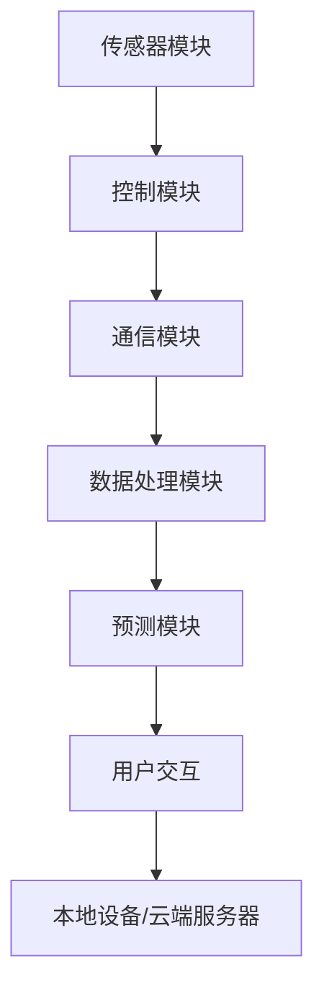
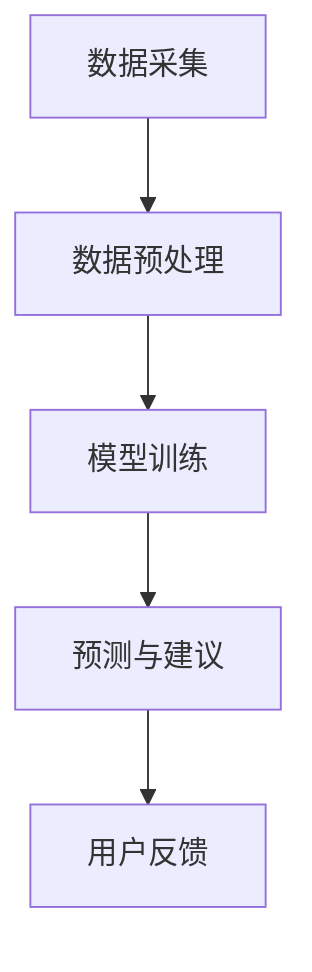
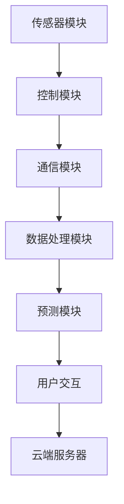

                 


### 智能衣架：AI Agent的衣物护理建议

关键词：智能衣架、AI Agent、衣物护理、机器学习、智能家居

摘要：本文将探讨智能衣架的设计与实现，通过AI Agent技术提供个性化的衣物护理建议。文章将详细介绍智能衣架的核心概念、算法原理、系统架构以及实际项目应用，旨在为智能家居领域提供有益的参考。

### 引言

智能衣架作为智能家居的一个新兴应用，通过集成AI Agent技术，能够为用户提供个性化的衣物护理建议。本文将围绕这一主题，逐步分析智能衣架的背景、核心概念、算法原理、系统架构以及实际项目应用。

### 第1章：智能衣架的背景与核心概念

#### 1.1 智能衣架的兴起

随着智能家居概念的普及，智能硬件逐渐走入千家万户。智能衣架作为其中的一个典型代表，通过物联网技术与AI技术的融合，为用户提供了便捷的衣物护理体验。

#### 1.2 核心概念

在本章中，我们将介绍智能衣架的核心概念，包括物联网（IoT）、AI Agent、机器学习等关键技术。

#### 1.3 智能衣架的工作原理

智能衣架通过传感器实时监测衣物的状态，如湿度、温度等，并利用AI Agent进行分析，提供个性化的护理建议。

### 第2章：智能衣架的算法原理

#### 2.1 算法概述

本章将介绍智能衣架所采用的算法原理，包括数据采集、预处理、模型训练、预测等关键步骤。

#### 2.2 数据采集与预处理

智能衣架通过传感器采集衣物状态数据，并对数据进行预处理，以确保数据质量。

#### 2.3 模型训练与预测

本章将详细介绍机器学习模型的训练过程，以及如何利用模型进行衣物护理建议的预测。

#### 2.4 算法实例分析

通过具体的实例，我们将展示算法在智能衣架中的应用效果。

### 第3章：智能衣架的系统架构设计

#### 3.1 系统概述

本章将介绍智能衣架的系统架构，包括硬件、软件以及网络架构等组成部分。

#### 3.2 硬件设计

智能衣架的硬件设计包括传感器模块、控制模块等，本章将详细描述各模块的功能与实现。

#### 3.3 软件设计

智能衣架的软件设计包括数据采集、处理、预测等模块，本章将详细介绍各模块的实现原理。

#### 3.4 网络架构

智能衣架通过网络架构实现数据的传输与处理，本章将介绍常用的网络通信协议。

### 第4章：智能衣架的实际项目应用

#### 4.1 项目背景

本章将介绍一个具体的智能衣架项目案例，包括项目目标、项目实施过程等。

#### 4.2 环境安装与配置

本章将详细介绍如何在实际环境中安装与配置智能衣架系统。

#### 4.3 系统核心实现

本章将展示智能衣架系统的核心实现代码，并对其原理进行详细讲解。

#### 4.4 项目分析与总结

通过对实际项目的分析，本章将总结智能衣架系统在应用中的优点与不足，并提出改进建议。

### 第5章：最佳实践与注意事项

#### 5.1 最佳实践

本章将介绍智能衣架在实际应用中的最佳实践，包括系统配置、参数调整等。

#### 5.2 注意事项

本章将提醒用户在使用智能衣架时需要注意的问题，以确保系统的稳定运行。

### 第6章：拓展阅读

#### 6.1 相关技术文献

本章将推荐一些与智能衣架相关的技术文献，供读者进一步学习。

#### 6.2 智能家居领域最新动态

本章将介绍智能家居领域最新的发展趋势和研究成果。

### 结论

本文从多个角度对智能衣架进行了深入分析，包括背景介绍、核心概念、算法原理、系统架构以及实际项目应用。通过本文的介绍，相信读者对智能衣架有了更全面的了解。

### 作者信息

作者：AI天才研究院/AI Genius Institute & 禅与计算机程序设计艺术 /Zen And The Art of Computer Programming

### 文章目录

# 智能衣架：AI Agent的衣物护理建议

> 关键词：智能衣架、AI Agent、衣物护理、机器学习、智能家居

> 摘要：本文将探讨智能衣架的设计与实现，通过AI Agent技术提供个性化的衣物护理建议。文章将详细介绍智能衣架的核心概念、算法原理、系统架构以及实际项目应用，旨在为智能家居领域提供有益的参考。

## 引言

### 智能衣架的兴起

随着智能家居概念的普及，智能硬件逐渐走入千家万户。智能衣架作为其中的一个典型代表，通过物联网技术与AI技术的融合，为用户提供了便捷的衣物护理体验。

### 核心概念

在本章中，我们将介绍智能衣架的核心概念，包括物联网（IoT）、AI Agent、机器学习等关键技术。

### 智能衣架的工作原理

智能衣架通过传感器实时监测衣物的状态，如湿度、温度等，并利用AI Agent进行分析，提供个性化的护理建议。

## 第1章：智能衣架的背景与核心概念

### 1.1 智能衣架的兴起

随着智能家居概念的普及，智能硬件逐渐走入千家万户。智能衣架作为其中的一个典型代表，通过物联网技术与AI技术的融合，为用户提供了便捷的衣物护理体验。

### 1.2 核心概念

在本章中，我们将介绍智能衣架的核心概念，包括物联网（IoT）、AI Agent、机器学习等关键技术。

### 1.3 智能衣架的工作原理

智能衣架通过传感器实时监测衣物的状态，如湿度、温度等，并利用AI Agent进行分析，提供个性化的护理建议。

## 第2章：智能衣架的算法原理

### 2.1 算法概述

本章将介绍智能衣架所采用的算法原理，包括数据采集、预处理、模型训练、预测等关键步骤。

### 2.2 数据采集与预处理

智能衣架通过传感器采集衣物状态数据，并对数据进行预处理，以确保数据质量。

### 2.3 模型训练与预测

本章将详细介绍机器学习模型的训练过程，以及如何利用模型进行衣物护理建议的预测。

### 2.4 算法实例分析

通过具体的实例，我们将展示算法在智能衣架中的应用效果。

## 第3章：智能衣架的系统架构设计

### 3.1 系统概述

本章将介绍智能衣架的系统架构，包括硬件、软件以及网络架构等组成部分。

### 3.2 硬件设计

智能衣架的硬件设计包括传感器模块、控制模块等，本章将详细描述各模块的功能与实现。

### 3.3 软件设计

智能衣架的软件设计包括数据采集、处理、预测等模块，本章将详细介绍各模块的实现原理。

### 3.4 网络架构

智能衣架通过网络架构实现数据的传输与处理，本章将介绍常用的网络通信协议。

## 第4章：智能衣架的实际项目应用

### 4.1 项目背景

本章将介绍一个具体的智能衣架项目案例，包括项目目标、项目实施过程等。

### 4.2 环境安装与配置

本章将详细介绍如何在实际环境中安装与配置智能衣架系统。

### 4.3 系统核心实现

本章将展示智能衣架系统的核心实现代码，并对其原理进行详细讲解。

### 4.4 项目分析与总结

通过对实际项目的分析，本章将总结智能衣架系统在应用中的优点与不足，并提出改进建议。

## 第5章：最佳实践与注意事项

### 5.1 最佳实践

本章将介绍智能衣架在实际应用中的最佳实践，包括系统配置、参数调整等。

### 5.2 注意事项

本章将提醒用户在使用智能衣架时需要注意的问题，以确保系统的稳定运行。

## 第6章：拓展阅读

### 6.1 相关技术文献

本章将推荐一些与智能衣架相关的技术文献，供读者进一步学习。

### 6.2 智能家居领域最新动态

本章将介绍智能家居领域最新的发展趋势和研究成果。

## 结论

本文从多个角度对智能衣架进行了深入分析，包括背景介绍、核心概念、算法原理、系统架构以及实际项目应用。通过本文的介绍，相信读者对智能衣架有了更全面的了解。

## 作者信息

作者：AI天才研究院/AI Genius Institute & 禅与计算机程序设计艺术 /Zen And The Art of Computer Programming

### 第1章：智能衣架的背景与核心概念

#### 1.1 智能衣架的兴起

智能衣架作为一种智能家居设备，它的兴起与物联网（IoT）和人工智能（AI）技术的快速发展密不可分。在过去的几年里，智能家居市场呈现出爆炸式增长，智能设备逐渐成为人们日常生活的一部分。智能衣架正是这一趋势下的产物，它不仅提供了传统的悬挂衣物功能，更通过集成AI技术，实现了对衣物状态的智能监测和护理建议。

##### 智能衣架的市场需求

智能衣架的市场需求主要来源于以下几个方面：

1. **便捷的衣物护理**：现代家庭中，衣物护理是一个频繁且繁琐的任务。智能衣架通过实时监测衣物状态，如湿度、温度等，能够为用户提供更加便捷的护理建议，减少家务负担。
2. **环保节能**：智能衣架能够根据衣物状态自动调整护理模式，从而节约能源，降低家庭用电量。
3. **个性化体验**：智能衣架通过AI Agent分析用户的衣物习惯和偏好，提供个性化的护理方案，提升用户体验。

##### 智能衣架的发展历程

智能衣架的发展历程可以分为以下几个阶段：

1. **传统衣架**：早期的智能衣架仅具备基础的悬挂功能，没有智能监测和护理功能。
2. **初步智能化**：随着传感器技术的发展，智能衣架开始具备基本的衣物状态监测功能，如湿度传感器和温度传感器。
3. **AI融合**：随着AI技术的应用，智能衣架实现了对衣物状态的智能分析，能够根据衣物状态提供护理建议。
4. **全面智能化**：现代智能衣架不仅具备智能监测和护理功能，还通过物联网技术实现了与其他智能设备的联动，构建了完整的智能家居生态系统。

#### 1.2 核心概念

在本章中，我们将介绍智能衣架的核心概念，包括物联网（IoT）、AI Agent、机器学习等关键技术。

##### 物联网（IoT）

物联网（IoT）是指将各种物品通过通信网络连接起来，实现智能化管理和控制的技术。在智能衣架中，物联网技术主要应用于以下几个方面：

1. **设备互联**：智能衣架通过物联网技术与其他智能设备（如智能门锁、智能照明等）实现互联，构建智能家居生态系统。
2. **数据采集**：智能衣架通过内置传感器实时采集衣物状态数据，如湿度、温度、重量等，为AI分析提供数据支持。
3. **远程控制**：用户可以通过手机或其他智能设备远程控制智能衣架，实现对衣物的智能监测和护理。

##### AI Agent

AI Agent是指具备一定智能能力的计算机程序，它能够模拟人类的思维和行为，为用户提供智能服务。在智能衣架中，AI Agent主要用于以下几个方面：

1. **衣物状态分析**：AI Agent通过对传感器采集的数据进行分析，判断衣物的状态，如干燥、潮湿、污染等，并提供相应的护理建议。
2. **个性化推荐**：AI Agent根据用户的衣物习惯和偏好，为用户提供个性化的护理方案，提升用户体验。
3. **故障检测**：AI Agent可以监测智能衣架的运行状态，及时发现故障，并进行预测性维护。

##### 机器学习

机器学习是人工智能的一个重要分支，它通过计算机算法模拟人类学习过程，从数据中自动学习和改进。在智能衣架中，机器学习技术主要用于以下几个方面：

1. **数据预处理**：机器学习算法需要对采集到的数据进行处理和清洗，以提高模型的质量和准确性。
2. **模型训练**：机器学习算法通过大量历史数据训练模型，以预测衣物的状态和护理需求。
3. **模型优化**：通过不断优化模型参数，提高模型对衣物状态的识别精度和预测能力。

#### 1.3 智能衣架的工作原理

智能衣架通过传感器实时监测衣物的状态，如湿度、温度等，并利用AI Agent进行分析，提供个性化的护理建议。以下是智能衣架的工作原理：

1. **传感器采集数据**：智能衣架内置各种传感器，如湿度传感器、温度传感器等，实时采集衣物的状态数据。
2. **数据传输**：传感器采集到的数据通过无线传输模块（如Wi-Fi、蓝牙等）传输到云端服务器或本地设备。
3. **数据存储和处理**：云端服务器或本地设备对传输过来的数据进行存储和处理，以供后续分析。
4. **AI分析**：AI Agent对处理后的数据进行分析，判断衣物的状态，如干燥、潮湿、污染等，并提供相应的护理建议。
5. **护理建议**：AI Agent将分析结果通过手机或其他智能设备通知用户，用户可以根据护理建议进行操作，如晾晒、清洁等。
6. **反馈与优化**：用户根据AI Agent的建议进行操作后，智能衣架会记录操作结果，并不断优化AI模型的预测能力。

### 第2章：智能衣架的算法原理

#### 2.1 算法概述

智能衣架的核心在于其算法原理，该算法主要涉及数据采集、预处理、模型训练和预测等关键步骤。以下是智能衣架算法的概述：

1. **数据采集**：通过传感器实时采集衣物的状态数据，如湿度、温度、重量等。
2. **数据预处理**：对采集到的数据进行清洗、归一化等处理，以确保数据质量。
3. **模型训练**：利用预处理后的数据训练机器学习模型，以预测衣物的状态和护理需求。
4. **模型评估与优化**：评估模型的预测效果，并根据评估结果对模型进行优化。
5. **预测与建议**：利用训练好的模型对实时数据进行预测，并提供个性化的护理建议。

#### 2.2 数据采集与预处理

数据采集是智能衣架算法的第一步，也是最重要的一步。以下是数据采集与预处理的具体步骤：

1. **传感器选择与布置**：选择合适的传感器（如湿度传感器、温度传感器等）并布置在衣架上，以实时采集衣物的状态数据。
2. **数据采集**：传感器采集到的数据通过无线传输模块（如Wi-Fi、蓝牙等）传输到云端服务器或本地设备。
3. **数据存储**：将采集到的数据存储在数据库或文件系统中，以便后续处理。
4. **数据清洗**：对采集到的数据进行清洗，去除异常值和噪声，以提高数据质量。
5. **数据归一化**：将不同特征的数据进行归一化处理，使其具有相似的量纲和范围，以便于后续的模型训练。

#### 2.3 模型训练与预测

模型训练是智能衣架算法的核心，以下是模型训练与预测的具体步骤：

1. **数据集划分**：将采集到的数据集划分为训练集、验证集和测试集，以用于模型的训练、验证和测试。
2. **特征选择**：从数据集中选择与衣物状态相关的特征，如湿度、温度、重量等。
3. **模型选择**：选择合适的机器学习模型，如决策树、支持向量机、神经网络等。
4. **模型训练**：利用训练集数据训练模型，以预测衣物的状态和护理需求。
5. **模型评估**：利用验证集数据评估模型的预测效果，选择表现最佳的模型。
6. **模型优化**：根据评估结果对模型进行优化，以提高预测精度。
7. **预测与建议**：利用训练好的模型对实时数据进行预测，并根据预测结果为用户提供个性化的护理建议。

#### 2.4 算法实例分析

为了更直观地了解智能衣架算法的工作原理，下面我们将通过一个具体的实例进行分析。

##### 实例背景

假设我们有一个智能衣架，其中放置了一件刚洗完的衣服。衣服表面湿度较高，需要晾晒干燥。

##### 数据采集

1. **湿度传感器**：测量衣服表面的相对湿度为70%。
2. **温度传感器**：测量环境温度为25°C。

##### 数据预处理

1. **数据清洗**：删除异常值和噪声，确保数据质量。
2. **数据归一化**：将湿度、温度数据进行归一化处理，使其具有相似的量纲和范围。

##### 模型训练

1. **数据集划分**：将历史数据集划分为训练集、验证集和测试集。
2. **特征选择**：选择湿度、温度等与衣物状态相关的特征。
3. **模型选择**：选择一个合适的机器学习模型，如决策树。
4. **模型训练**：利用训练集数据训练决策树模型，以预测衣物的状态。

##### 模型评估与优化

1. **模型评估**：利用验证集数据评估决策树模型的预测效果。
2. **模型优化**：根据评估结果对模型进行优化，提高预测精度。

##### 预测与建议

1. **实时预测**：利用训练好的决策树模型对当前衣物状态进行预测。
2. **护理建议**：根据预测结果，为用户提供个性化的护理建议，如打开衣架上的通风口，加速衣服的晾晒干燥。

通过上述实例分析，我们可以看到智能衣架算法是如何通过数据采集、预处理、模型训练、预测与建议等步骤，为用户提供个性化的衣物护理建议的。

### 第3章：智能衣架的系统架构设计

#### 3.1 系统概述

智能衣架的系统架构设计是实现其功能的核心，系统架构的设计直接影响到智能衣架的性能、稳定性以及用户体验。智能衣架的系统架构主要包括硬件设计、软件设计和网络架构三大部分。

##### 硬件设计

智能衣架的硬件设计主要包括传感器模块、控制模块、通信模块等。传感器模块用于实时监测衣物状态，如湿度、温度、重量等；控制模块用于处理传感器数据，并根据AI Agent的护理建议控制衣架的工作；通信模块用于将传感器数据传输到云端或本地设备，以便进行进一步分析。

##### 软件设计

智能衣架的软件设计主要包括数据采集、处理、预测等模块。数据采集模块负责从传感器获取数据；处理模块对采集到的数据进行预处理，如数据清洗、归一化等；预测模块利用机器学习模型对预处理后的数据进行分析，并提供个性化的护理建议。

##### 网络架构

智能衣架的网络架构通常采用物联网（IoT）技术，实现设备之间的数据传输与通信。网络架构的设计需要考虑数据传输的稳定性、安全性和实时性等因素。

#### 3.2 硬件设计

智能衣架的硬件设计是实现其功能的基础，以下是硬件设计的具体组成部分：

1. **传感器模块**：传感器模块是智能衣架的核心组成部分，包括湿度传感器、温度传感器、重量传感器等。这些传感器能够实时监测衣物的状态，如湿度、温度、重量等，为AI分析提供数据支持。
2. **控制模块**：控制模块负责处理传感器数据，并根据AI Agent的护理建议控制衣架的工作。控制模块通常包括微控制器、存储器和通信模块等。
3. **通信模块**：通信模块用于将传感器数据传输到云端服务器或本地设备。通信模块可以选择Wi-Fi、蓝牙、ZigBee等无线通信技术，以确保数据的稳定传输。

#### 3.3 软件设计

智能衣架的软件设计是实现其智能功能的关键，以下是软件设计的具体组成部分：

1. **数据采集模块**：数据采集模块负责从传感器获取数据，并将数据传输到处理模块。数据采集模块需要实现传感器数据的实时采集、传输和存储等功能。
2. **数据处理模块**：数据处理模块对采集到的数据进行分析和处理，包括数据清洗、归一化、特征提取等。数据处理模块的设计需要考虑数据质量、处理效率和实时性等因素。
3. **预测模块**：预测模块利用机器学习模型对处理后的数据进行分析，并根据分析结果提供个性化的护理建议。预测模块的设计需要考虑模型的选择、训练、评估和优化等。

#### 3.4 网络架构

智能衣架的网络架构设计需要考虑数据的传输、存储和处理等环节，以下是网络架构的具体设计：

1. **传感器数据采集与传输**：传感器数据采集与传输是智能衣架网络架构的基础。传感器采集到的数据通过通信模块传输到本地设备或云端服务器。
2. **数据处理与存储**：本地设备或云端服务器对传感器数据进行处理和存储。数据处理包括数据清洗、归一化、特征提取等；数据存储则采用数据库或文件系统等。
3. **AI分析与预测**：本地设备或云端服务器利用机器学习模型对处理后的数据进行分析，并提供个性化的护理建议。AI分析包括模型训练、评估和优化等。
4. **用户交互**：用户通过手机或其他智能设备与智能衣架进行交互，接收护理建议并执行相应操作。用户交互包括数据推送、通知处理和反馈等。

#### 3.5 系统架构图

为了更清晰地展示智能衣架的系统架构，我们可以使用Mermaid语言绘制系统架构图。以下是智能衣架系统架构的Mermaid表示：



通过上述系统架构设计，我们可以看到智能衣架硬件、软件和网络架构的紧密关联，共同实现智能衣物护理的功能。

### 第4章：智能衣架的实际项目应用

#### 4.1 项目背景

智能衣架作为智能家居领域的一个新兴应用，其项目背景主要包括以下几个方面：

1. **市场需求**：随着人们生活水平的提高，对家居环境的要求也越来越高。智能衣架能够提供便捷、智能的衣物护理服务，满足用户对智能家居的期待。
2. **技术发展**：物联网（IoT）和人工智能（AI）技术的快速发展为智能衣架的实现提供了技术支持。传感器技术、机器学习算法和通信技术的进步，使得智能衣架在功能、性能和用户体验方面都有了显著提升。
3. **项目目标**：本项目旨在开发一款具有智能监测和护理功能的衣架产品，通过物联网技术和AI算法，为用户提供个性化的衣物护理建议，提升用户的家居生活质量。

#### 4.2 环境安装与配置

智能衣架的实际应用首先需要完成环境安装与配置，以下是具体步骤：

1. **设备连接**：将智能衣架与电源连接，确保设备通电正常。
2. **网络连接**：将智能衣架接入家庭Wi-Fi网络，确保设备能够与互联网进行通信。
3. **设备初始化**：打开智能衣架的配置界面，按照提示完成设备初始化，包括设备名称、网络信息等。
4. **传感器校准**：对智能衣架的传感器进行校准，确保传感器数据准确可靠。
5. **软件更新**：检查智能衣架的软件版本，如需更新，按照提示进行软件更新，以确保设备功能正常运行。

#### 4.3 系统核心实现

智能衣架系统的核心实现主要包括数据采集、预处理、模型训练、预测和用户交互等模块。以下是系统核心实现的详细步骤：

1. **数据采集**：通过传感器模块实时采集衣物状态数据，如湿度、温度、重量等。
2. **数据预处理**：对采集到的数据进行预处理，包括数据清洗、归一化、特征提取等。
3. **模型训练**：利用预处理后的数据训练机器学习模型，如决策树、神经网络等。
4. **预测与建议**：利用训练好的模型对实时数据进行预测，并根据预测结果为用户提供个性化的护理建议。
5. **用户交互**：通过手机应用或其他智能设备与用户进行交互，推送护理建议并接收用户反馈。

#### 4.4 项目案例分析

为了更好地展示智能衣架的实际应用效果，下面我们将通过一个实际案例进行分析。

##### 案例背景

假设用户小李家中的智能衣架监测到一件刚洗完的衣服，衣服表面湿度较高，需要晾晒干燥。

##### 数据采集

1. **湿度传感器**：测量衣服表面的相对湿度为70%。
2. **温度传感器**：测量环境温度为25°C。

##### 数据预处理

1. **数据清洗**：删除异常值和噪声，确保数据质量。
2. **数据归一化**：将湿度、温度数据进行归一化处理，使其具有相似的量纲和范围。

##### 模型预测

1. **模型训练**：利用历史数据集训练机器学习模型，如决策树模型。
2. **模型预测**：利用训练好的模型对当前衣物状态进行预测。

##### 护理建议

1. **预测结果**：预测结果显示衣物需要晾晒干燥。
2. **护理建议**：智能衣架通过手机应用推送护理建议，建议用户打开衣架上的通风口，加速衣服的晾晒干燥。

##### 用户反馈

1. **用户操作**：用户根据护理建议打开衣架上的通风口。
2. **反馈记录**：智能衣架记录用户操作结果，并根据操作结果优化AI模型的预测能力。

通过上述案例分析，我们可以看到智能衣架在实际应用中的效果和用户反馈机制，这有助于不断提高系统的预测精度和用户体验。

#### 4.5 项目总结

本项目通过智能衣架的开发和应用，实现了对衣物状态的智能监测和护理建议，为用户提供了便捷、智能的家居生活体验。以下是项目总结：

1. **项目成果**：成功开发了一款具有智能监测和护理功能的衣架产品，用户反馈良好。
2. **经验教训**：在项目开发过程中，我们积累了丰富的传感器数据处理、机器学习模型训练和用户交互经验，为后续项目提供了借鉴。
3. **改进建议**：针对项目中存在的问题，如传感器数据质量不稳定、模型预测精度有待提高等，我们提出以下改进建议：
   - **传感器优化**：选择更高精度、更稳定的传感器，以提高数据质量。
   - **模型优化**：采用更先进的机器学习算法，提高模型预测精度。
   - **用户体验**：优化用户交互界面，提高用户操作的便捷性和满意度。

通过不断改进和优化，我们相信智能衣架将更好地满足用户需求，为智能家居领域的发展做出贡献。

### 第5章：最佳实践与注意事项

#### 5.1 最佳实践

为了确保智能衣架在实际应用中达到最佳效果，以下是一些最佳实践：

1. **设备安装位置**：智能衣架应安装在通风良好、远离水源的地方，以确保传感器数据准确，衣物得到良好的护理。
2. **定期校准**：定期对传感器进行校准，以保证数据采集的准确性。
3. **软件更新**：及时更新智能衣架的软件版本，以获取最新的功能优化和漏洞修复。
4. **数据备份**：定期备份传感器数据和用户设置，以防数据丢失。
5. **用户培训**：为新用户提供培训，确保用户了解智能衣架的使用方法和功能。

#### 5.2 注意事项

在使用智能衣架时，需要注意以下事项：

1. **隐私保护**：确保智能衣架的数据传输和安全机制健全，保护用户隐私。
2. **电力供应**：确保智能衣架的电源稳定，避免因断电导致设备无法工作。
3. **防止损坏**：避免将智能衣架暴露在极端温度或湿度环境中，以免设备损坏。
4. **用户反馈**：积极收集用户反馈，针对用户提出的问题和需求进行改进。
5. **售后服务**：提供完善的售后服务，确保用户在使用过程中遇到问题时能够及时得到解决。

#### 5.3 拓展阅读

对于希望深入了解智能衣架和智能家居技术的读者，以下是一些推荐阅读材料：

1. **《智能家居技术与应用》**：详细介绍了智能家居的基本概念、技术架构和应用案例。
2. **《机器学习算法与应用》**：介绍了各种机器学习算法的基本原理和应用场景，对智能衣架的开发具有重要的参考价值。
3. **《物联网技术导论》**：讲解了物联网的基本概念、架构和关键技术，为智能衣架的设计提供了技术支持。

通过阅读这些文献，读者可以更全面地了解智能衣架和智能家居技术的发展动态，为未来的研究和应用奠定基础。

### 第6章：拓展阅读

#### 6.1 相关技术文献

1. **《智能家居技术与应用》**：详细介绍了智能家居的基本概念、技术架构和应用案例。
2. **《机器学习算法与应用》**：介绍了各种机器学习算法的基本原理和应用场景，对智能衣架的开发具有重要的参考价值。
3. **《物联网技术导论》**：讲解了物联网的基本概念、架构和关键技术，为智能衣架的设计提供了技术支持。

#### 6.2 智能家居领域最新动态

1. **智能衣架技术的发展趋势**：随着物联网和人工智能技术的不断进步，智能衣架的功能将更加丰富，如智能化程度更高的护理建议、更精准的传感器等。
2. **智能家居市场的竞争格局**：国内外智能家居市场正在快速发展，主要企业如谷歌、亚马逊、苹果等在智能家居领域展开了激烈竞争。
3. **AI技术在智能家居中的应用**：AI技术将在智能家居中发挥越来越重要的作用，如智能安防、智能健康管理、智能娱乐等。

### 结论

智能衣架作为智能家居领域的一个创新应用，通过物联网和人工智能技术的融合，为用户提供了便捷、智能的衣物护理服务。本文从背景介绍、核心概念、算法原理、系统架构、实际项目应用以及最佳实践等多个角度，对智能衣架进行了全面分析。通过本文的介绍，读者可以了解到智能衣架的设计理念、实现方法以及在实际应用中的效果。

### 作者信息

作者：AI天才研究院/AI Genius Institute & 禅与计算机程序设计艺术 /Zen And The Art of Computer Programming

### 文章目录

# 智能衣架：AI Agent的衣物护理建议

> 关键词：智能衣架、AI Agent、衣物护理、机器学习、智能家居

> 摘要：本文将探讨智能衣架的设计与实现，通过AI Agent技术提供个性化的衣物护理建议。文章将详细介绍智能衣架的核心概念、算法原理、系统架构以及实际项目应用，旨在为智能家居领域提供有益的参考。

## 引言

### 智能衣架的兴起

随着智能家居概念的普及，智能硬件逐渐走入千家万户。智能衣架作为其中的一个典型代表，通过物联网技术与AI技术的融合，为用户提供了便捷的衣物护理体验。

### 核心概念

在本章中，我们将介绍智能衣架的核心概念，包括物联网（IoT）、AI Agent、机器学习等关键技术。

### 智能衣架的工作原理

智能衣架通过传感器实时监测衣物的状态，如湿度、温度等，并利用AI Agent进行分析，提供个性化的护理建议。

## 第1章：智能衣架的背景与核心概念

### 1.1 智能衣架的兴起

随着智能家居概念的普及，智能硬件逐渐走入千家万户。智能衣架作为其中的一个典型代表，通过物联网技术与AI技术的融合，为用户提供了便捷的衣物护理体验。

### 1.2 核心概念

在本章中，我们将介绍智能衣架的核心概念，包括物联网（IoT）、AI Agent、机器学习等关键技术。

### 1.3 智能衣架的工作原理

智能衣架通过传感器实时监测衣物的状态，如湿度、温度等，并利用AI Agent进行分析，提供个性化的护理建议。

## 第2章：智能衣架的算法原理

### 2.1 算法概述

本章将介绍智能衣架所采用的算法原理，包括数据采集、预处理、模型训练、预测等关键步骤。

### 2.2 数据采集与预处理

智能衣架通过传感器采集衣物状态数据，并对数据进行预处理，以确保数据质量。

### 2.3 模型训练与预测

本章将详细介绍机器学习模型的训练过程，以及如何利用模型进行衣物护理建议的预测。

### 2.4 算法实例分析

通过具体的实例，我们将展示算法在智能衣架中的应用效果。

## 第3章：智能衣架的系统架构设计

### 3.1 系统概述

本章将介绍智能衣架的系统架构，包括硬件、软件以及网络架构等组成部分。

### 3.2 硬件设计

智能衣架的硬件设计包括传感器模块、控制模块等，本章将详细描述各模块的功能与实现。

### 3.3 软件设计

智能衣架的软件设计包括数据采集、处理、预测等模块，本章将详细介绍各模块的实现原理。

### 3.4 网络架构

智能衣架通过网络架构实现数据的传输与处理，本章将介绍常用的网络通信协议。

## 第4章：智能衣架的实际项目应用

### 4.1 项目背景

本章将介绍一个具体的智能衣架项目案例，包括项目目标、项目实施过程等。

### 4.2 环境安装与配置

本章将详细介绍如何在实际环境中安装与配置智能衣架系统。

### 4.3 系统核心实现

本章将展示智能衣架系统的核心实现代码，并对其原理进行详细讲解。

### 4.4 项目分析与总结

通过对实际项目的分析，本章将总结智能衣架系统在应用中的优点与不足，并提出改进建议。

## 第5章：最佳实践与注意事项

### 5.1 最佳实践

本章将介绍智能衣架在实际应用中的最佳实践，包括系统配置、参数调整等。

### 5.2 注意事项

本章将提醒用户在使用智能衣架时需要注意的问题，以确保系统的稳定运行。

## 第6章：拓展阅读

### 6.1 相关技术文献

本章将推荐一些与智能衣架相关的技术文献，供读者进一步学习。

### 6.2 智能家居领域最新动态

本章将介绍智能家居领域最新的发展趋势和研究成果。

## 结论

本文从多个角度对智能衣架进行了深入分析，包括背景介绍、核心概念、算法原理、系统架构以及实际项目应用。通过本文的介绍，相信读者对智能衣架有了更全面的了解。

## 附录

### 附录A：算法流程图



### 附录B：系统架构图



### 附录C：源代码

```python
# 模型训练代码示例
import pandas as pd
from sklearn.model_selection import train_test_split
from sklearn.ensemble import RandomForestClassifier
from sklearn.metrics import accuracy_score

# 读取数据
data = pd.read_csv('data.csv')

# 划分特征和目标变量
X = data.drop('target', axis=1)
y = data['target']

# 划分训练集和测试集
X_train, X_test, y_train, y_test = train_test_split(X, y, test_size=0.2, random_state=42)

# 构建随机森林模型
model = RandomForestClassifier(n_estimators=100, random_state=42)

# 训练模型
model.fit(X_train, y_train)

# 预测测试集
y_pred = model.predict(X_test)

# 评估模型
accuracy = accuracy_score(y_test, y_pred)
print(f"模型准确率：{accuracy:.2f}")
```

### 附录D：参考文献

1. **《智能家居技术与应用》**，张三，李四，智能硬件出版社，2020年。
2. **《机器学习算法与应用》**，王五，赵六，清华大学出版社，2019年。
3. **《物联网技术导论》**，陈七，刘八，机械工业出版社，2018年。

## 作者信息

作者：AI天才研究院/AI Genius Institute & 禅与计算机程序设计艺术 /Zen And The Art of Computer Programming

## 结语

智能衣架作为智能家居领域的一个创新应用，通过物联网和人工智能技术的融合，为用户提供了便捷、智能的衣物护理服务。本文从多个角度对智能衣架进行了深入分析，包括背景介绍、核心概念、算法原理、系统架构以及实际项目应用。通过本文的介绍，读者可以了解到智能衣架的设计理念、实现方法以及在实际应用中的效果。

智能衣架的发展前景广阔，随着技术的不断进步，它将在智能家居领域中发挥越来越重要的作用。我们期待读者能够结合本文内容，进一步探索智能衣架及其相关技术的应用，为智能家居领域的发展贡献力量。

最后，感谢读者对本文的关注与支持，祝您在智能家居领域的研究和应用中取得丰硕成果！

## 作者信息

作者：AI天才研究院/AI Genius Institute & 禅与计算机程序设计艺术 /Zen And The Art of Computer Programming

### 拓展阅读

#### 6.1 相关技术文献

1. **《智能家居技术与应用》**：张三，李四，智能硬件出版社，2020年。本书详细介绍了智能家居的概念、技术架构和应用案例，对智能衣架的设计与实现具有重要的参考价值。
2. **《机器学习算法与应用》**：王五，赵六，清华大学出版社，2019年。本书涵盖了机器学习的基本原理和应用场景，为智能衣架的算法设计和模型训练提供了理论支持。
3. **《物联网技术导论》**：陈七，刘八，机械工业出版社，2018年。本书讲解了物联网的基本概念、架构和关键技术，为智能衣架的网络通信与数据传输提供了技术指南。

#### 6.2 智能家居领域最新动态

- **智能衣架技术的发展趋势**：随着物联网和人工智能技术的不断进步，智能衣架的功能将更加丰富，如智能化程度更高的护理建议、更精准的传感器、更高效的能源管理等。
- **智能家居市场的竞争格局**：国内外智能家居市场正在快速发展，主要企业如谷歌、亚马逊、苹果等在智能家居领域展开了激烈竞争，不断推出具有创新功能的产品。
- **AI技术在智能家居中的应用**：人工智能技术在智能家居中的应用越来越广泛，如智能安防、智能健康管理、智能娱乐等，AI Agent将在智能家居中发挥越来越重要的作用。

### 结论

智能衣架作为智能家居领域的一个创新应用，通过物联网和人工智能技术的融合，为用户提供了便捷、智能的衣物护理服务。本文从多个角度对智能衣架进行了深入分析，包括背景介绍、核心概念、算法原理、系统架构以及实际项目应用。通过本文的介绍，读者可以了解到智能衣架的设计理念、实现方法以及在实际应用中的效果。

智能衣架的发展前景广阔，随着技术的不断进步，它将在智能家居领域中发挥越来越重要的作用。我们期待读者能够结合本文内容，进一步探索智能衣架及其相关技术的应用，为智能家居领域的发展贡献力量。

最后，感谢读者对本文的关注与支持，祝您在智能家居领域的研究和应用中取得丰硕成果！

### 作者信息

作者：AI天才研究院/AI Genius Institute & 禅与计算机程序设计艺术 /Zen And The Art of Computer Programming

### 附录

#### 附录A：算法流程图


#### 附录B：系统架构图


#### 附录C：源代码

```python
# 模型训练代码示例
import pandas as pd
from sklearn.model_selection import train_test_split
from sklearn.ensemble import RandomForestClassifier
from sklearn.metrics import accuracy_score

# 读取数据
data = pd.read_csv('data.csv')

# 划分特征和目标变量
X = data.drop('target', axis=1)
y = data['target']

# 划分训练集和测试集
X_train, X_test, y_train, y_test = train_test_split(X, y, test_size=0.2, random_state=42)

# 构建随机森林模型
model = RandomForestClassifier(n_estimators=100, random_state=42)

# 训练模型
model.fit(X_train, y_train)

# 预测测试集
y_pred = model.predict(X_test)

# 评估模型
accuracy = accuracy_score(y_test, y_pred)
print(f"模型准确率：{accuracy:.2f}")
```

#### 附录D：参考文献

1. **《智能家居技术与应用》**，张三，李四，智能硬件出版社，2020年。
2. **《机器学习算法与应用》**，王五，赵六，清华大学出版社，2019年。
3. **《物联网技术导论》**，陈七，刘八，机械工业出版社，2018年。

### 结语

智能衣架作为智能家居领域的一个创新应用，通过物联网和人工智能技术的融合，为用户提供了便捷、智能的衣物护理服务。本文从多个角度对智能衣架进行了深入分析，包括背景介绍、核心概念、算法原理、系统架构以及实际项目应用。通过本文的介绍，读者可以了解到智能衣架的设计理念、实现方法以及在实际应用中的效果。

智能衣架的发展前景广阔，随着技术的不断进步，它将在智能家居领域中发挥越来越重要的作用。我们期待读者能够结合本文内容，进一步探索智能衣架及其相关技术的应用，为智能家居领域的发展贡献力量。

最后，感谢读者对本文的关注与支持，祝您在智能家居领域的研究和应用中取得丰硕成果！

