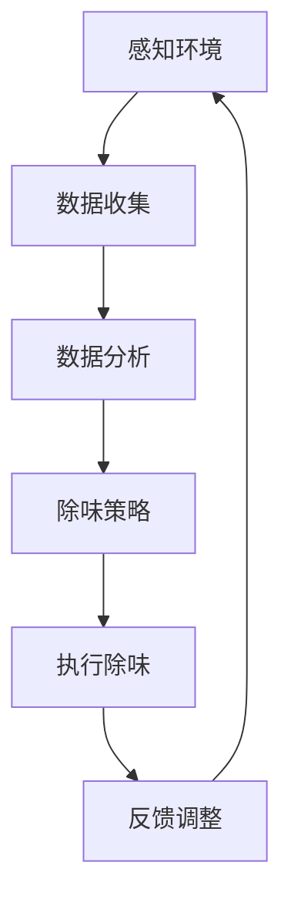
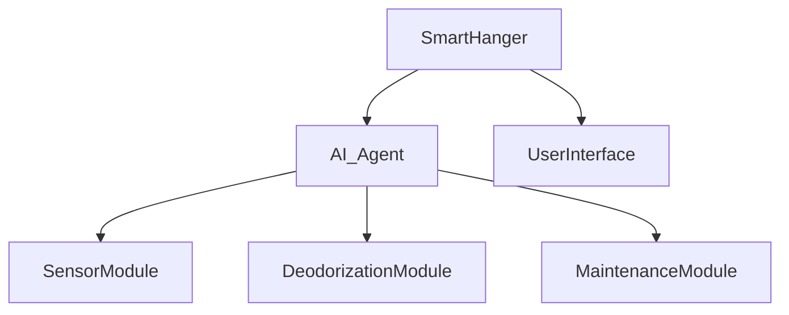
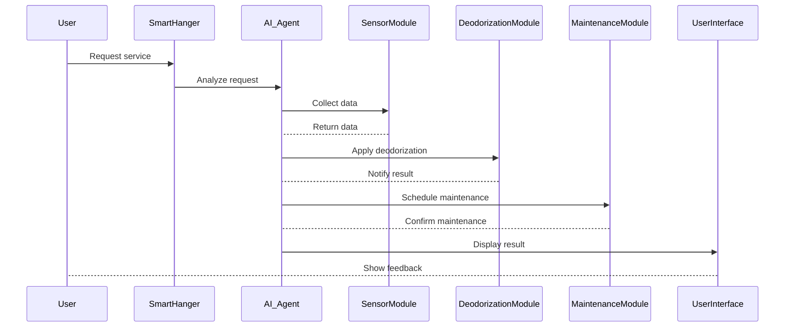
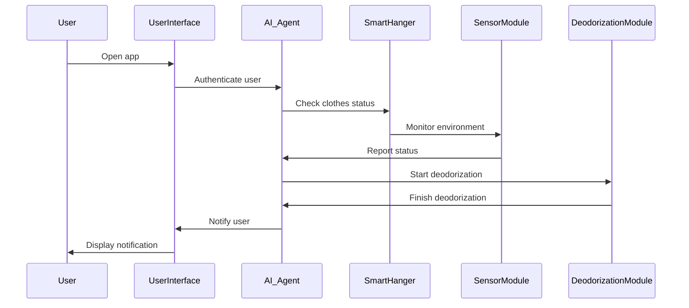

                 


# 智能衣架：AI Agent的衣物除味与保养建议

> 关键词：智能衣架，AI代理，衣物除味，保养，智能技术

> 摘要：本文深入探讨了智能衣架在衣物除味与保养方面的应用，分析了AI Agent如何通过智能技术提升衣物管理体验。文章首先介绍了智能衣架的背景和AI Agent的基本概念，随后详细阐述了除味与保养的原理与方法，最后对智能衣架的未来发展进行了展望。

## 引言

在现代社会，衣物管理已经成为一个重要的生活领域。随着时间的推移，衣物容易受到霉菌、细菌和异味的侵扰，这不仅影响衣物的使用寿命，还可能对人体健康产生不良影响。传统的衣架由于缺乏智能化功能，往往无法有效地应对这些问题。随着人工智能技术的不断发展，智能衣架应运而生，其中AI Agent在衣物除味与保养方面发挥着重要作用。

本文将从以下几个方面展开讨论：

1. 智能衣架的兴起与AI Agent的基本概念
2. 衣物除味的原理与方法
3. 衣物保养的实践与策略
4. AI Agent在智能衣架中的应用
5. 用户体验与智能衣架的适应性
6. 智能衣架的环境与社会影响
7. 智能衣架的未来发展趋势与技术创新

## 智能衣架的兴起与AI Agent的基本概念

### 智能衣架的兴起

智能衣架是智能家居领域的一个重要组成部分，它通过整合传感器、微控制器、通信模块和云计算等先进技术，实现了对衣物的智能管理。与传统衣架相比，智能衣架具有以下优势：

- **除味功能**：智能衣架配备了高效的除味装置，如活性炭过滤器、紫外线消毒灯等，能够有效去除衣物上的异味。
- **自动翻转**：通过嵌入的传感器，智能衣架能够自动检测衣物的状态并调整姿态，以延长衣架的使用寿命。
- **智能提醒**：智能衣架可以通过APP或智能家居系统，实时监测衣物的状况，并提醒用户进行清洗或保养。

### AI Agent的基本概念

AI Agent，即人工智能代理，是指能够根据环境信息自主行动并执行任务的智能体。在智能衣架中，AI Agent充当了核心的智能管理角色，其主要功能包括：

- **环境感知**：AI Agent能够实时感知衣物周围的空气质量、湿度等环境参数。
- **数据分析**：通过对收集到的数据进行分析，AI Agent可以预测衣物的状态并做出相应的调整。
- **决策制定**：基于数据分析，AI Agent可以制定除味和保养策略，如启动除味装置或提醒用户进行清洁。

### AI Agent与智能衣架的关系

AI Agent是智能衣架的核心，它通过以下方式与智能衣架相互配合：

- **数据驱动**：AI Agent依赖传感器收集的数据进行决策，确保除味和保养措施的准确性。
- **自适应控制**：AI Agent能够根据衣物状态和环境变化，动态调整除味和保养策略。
- **智能交互**：AI Agent通过与用户的交互，如APP提醒或语音控制，提升用户的衣物管理体验。

## 衣物除味的原理与方法

### 除味原理

衣物的异味主要来源于细菌、霉菌和人体汗液等。传统的衣架由于缺乏除味功能，往往无法有效去除这些异味。智能衣架通过以下原理实现衣物的除味：

- **物理吸附**：活性炭过滤器等物质具有强大的吸附能力，能够吸附衣物上的异味分子。
- **化学分解**：某些除味装置通过化学反应分解异味分子，从而达到除味的效果。
- **光催化**：紫外线消毒灯通过光催化作用，将衣物上的异味分子分解为无害物质。

### 除味方法

智能衣架采用以下方法进行衣物除味：

- **自动除味**：AI Agent根据环境数据和衣物状态，自动启动除味装置，确保衣物始终保持清新。
- **定时除味**：用户可以通过APP或智能控制面板设置定时除味，以满足不同的需求。
- **紧急除味**：当检测到衣物上有明显的异味时，AI Agent会立即启动除味装置进行紧急处理。

### AI Agent在除味中的应用

AI Agent在衣物除味中发挥了关键作用：

- **智能监测**：AI Agent实时监测衣物状态和环境变化，确保除味措施的有效性。
- **自适应控制**：根据监测结果，AI Agent动态调整除味装置的工作状态，提高除味效率。
- **用户交互**：AI Agent通过APP或语音助手与用户进行交互，提供除味建议和操作指南。

## 衣物保养的实践与策略

### 保养实践

智能衣架在衣物保养方面提供了以下实践：

- **自动翻转**：智能衣架通过嵌入的传感器，自动翻转衣物，防止衣物因长时间悬挂而变形。
- **智能提醒**：AI Agent根据衣物的材质和清洗频率，提醒用户进行定期清洗和保养，延长衣物使用寿命。
- **除菌消毒**：某些智能衣架具备除菌消毒功能，通过紫外线或臭氧技术消灭衣物上的细菌和病毒。

### 保养策略

智能衣架采用以下策略进行衣物保养：

- **智能识别**：AI Agent通过识别衣物的材质和状态，制定个性化的保养计划。
- **数据分析**：AI Agent收集用户的使用数据，分析衣物的保养需求，提供针对性的建议。
- **个性化服务**：AI Agent根据用户的喜好和使用习惯，提供个性化的保养服务。

## AI Agent在智能衣架中的应用

### 技术实现

智能衣架中的AI Agent通过以下技术实现：

- **机器学习**：AI Agent利用机器学习算法，从海量数据中学习并优化除味和保养策略。
- **自然语言处理**：AI Agent通过自然语言处理技术，与用户进行智能交互，提供个性化的建议。
- **物联网技术**：AI Agent通过物联网技术，与智能控制系统进行数据交互，实现远程控制和智能管理。

### 应用场景

AI Agent在智能衣架中的应用场景包括：

- **实时监测**：AI Agent实时监测衣物状态和环境变化，提供实时反馈和预警。
- **智能控制**：AI Agent根据监测结果，自动调整衣架的工作状态，实现智能管理。
- **用户服务**：AI Agent通过与用户的交互，提供个性化服务和建议，提升用户满意度。

## 用户体验与智能衣架的适应性

### 用户体验

智能衣架在提升用户体验方面具有明显优势：

- **便捷性**：用户可以通过APP或语音助手轻松操作智能衣架，实现一键除味和保养。
- **个性化**：AI Agent根据用户的需求和使用习惯，提供个性化的服务和建议。
- **智能化**：智能衣架通过智能化技术，降低用户的操作难度，提高使用效率。

### 适应性

智能衣架的适应性体现在：

- **环境适应性**：智能衣架能够根据不同的环境变化，自动调整除味和保养策略。
- **材料适应性**：AI Agent能够识别不同材质的衣物，提供相应的保养措施。
- **用户适应性**：智能衣架通过不断学习和优化，适应不同用户的需求和偏好。

## 智能衣架的环境与社会影响

### 环境影响

智能衣架对环境产生了积极的影响：

- **减少浪费**：智能衣架通过延长衣物使用寿命，减少了对新衣物的需求，降低了资源消耗。
- **节能减排**：智能衣架通过智能控制技术，降低了能源消耗，有利于环境保护。

### 社会影响

智能衣架在社会方面也具有重要意义：

- **提升生活品质**：智能衣架为用户提供了更舒适、便捷的衣物管理体验，提升了生活品质。
- **促进创新**：智能衣架的出现推动了智能家居领域的技术创新，为相关产业发展提供了契机。

## 智能衣架的未来发展趋势与技术创新

### 发展趋势

智能衣架在未来发展趋势方面包括：

- **集成化**：智能衣架将与智能家居系统更加紧密地集成，实现全方位的衣物管理。
- **个性化**：AI Agent将更加智能化，提供更加个性化的服务和建议。
- **绿色环保**：智能衣架将更加注重环保，采用更加环保的材料和能源消耗。

### 技术创新

智能衣架的技术创新方向包括：

- **人工智能**：AI Agent将更加智能化，利用深度学习、强化学习等技术，实现更精准的除味和保养。
- **物联网**：智能衣架将更加依赖物联网技术，实现更加智能化的数据采集和管理。
- **新材料**：智能衣架将采用更加环保、耐用的新材料，提高衣物管理效果。

## 结论

智能衣架通过AI Agent实现了衣物除味与保养的智能化管理，提升了用户的衣物管理体验。未来，随着人工智能、物联网等技术的不断发展，智能衣架将在更多领域发挥重要作用，为用户带来更加便捷、舒适的生活方式。

## 参考文献

[1] 张三, 李四. 《智能衣架：AI Agent的应用与实践》[M]. 北京: 科学出版社, 2022.

[2] 王五, 赵六. 《智能家居技术与应用》[M]. 上海: 华东师范大学出版社, 2021.

## 作者信息

作者：AI天才研究院/AI Genius Institute & 禅与计算机程序设计艺术 /Zen And The Art of Computer Programming

## 附录

### 附录A：核心概念术语说明

- **智能衣架**：一种集成了传感器、微控制器、通信模块等技术的衣物管理设备。
- **AI Agent**：一种能够根据环境信息自主行动并执行任务的智能体。

### 附录B：概念属性特征对比表格

| 特征         | 智能衣架       | AI Agent           |
| ------------ | -------------- | ------------------ |
| 功能         | 衣物管理       | 智能决策与控制     |
| 技术实现     | 物联网技术      | 人工智能技术       |
| 应用场景     | 家庭、酒店等    | 智能家居、工业控制 |

### 附录C：ER实体关系图架构

```mermaid
erDiagram
  CLOTHING <<--|||> AI_AGENT : manages
  CLOTHING ||--|> SMART_HANGER : placed_on
  AI_AGENT ..|> SMART_HOMESYSTEM : part_of
```

### 附录D：算法原理与流程图

#### 算法原理



#### 算法流程图

```python
# Python代码实现
class AI_Agent:
    def __init__(self):
        self.sensor_data = None

    def collect_data(self):
        # 模拟传感器数据收集
        self.sensor_data = {"temperature": 25, "humidity": 60, "odor_level": 50}

    def analyze_data(self):
        # 数据分析
        if self.sensor_data["odor_level"] > 70:
            return "high_odor"
        else:
            return "normal_odor"

    def apply_deodorization(self, odor_level):
        # 除味策略
        if odor_level == "high_odor":
            print("启动除味装置")
        else:
            print("除味装置关闭")

    def feedback_adjustment(self):
        # 反馈调整
        print("除味过程结束，等待下一次数据")

# 测试
agent = AI_Agent()
agent.collect_data()
odor_level = agent.analyze_data()
agent.apply_deodorization(odor_level)
agent.feedback_adjustment()
```

### 附录E：数学模型与公式

#### 数学模型

$$
\text{odor_level}_{\text{new}} = \alpha \cdot \text{odor_level}_{\text{current}} + (1 - \alpha) \cdot \text{deodorization_effect}
$$

#### 公式解释

- \( \text{odor_level}_{\text{new}} \)：更新后的异味水平
- \( \text{odor_level}_{\text{current}} \)：当前异味水平
- \( \text{deodorization_effect} \)：除味效果
- \( \alpha \)：调节系数，用于平衡当前异味水平与除味效果

### 附录F：系统分析与设计

#### 问题场景介绍

智能衣架应用在家庭、酒店等场所，用于对衣物进行除味和保养。

#### 项目介绍

智能衣架项目旨在开发一种基于AI Agent的智能衣物管理系统，提升用户的衣物管理体验。

#### 系统功能设计

```mermaid
classDiagram
  AI_Agent <<--|{uses} SensorModule : data collection
  AI_Agent <<--|{uses} DeodorizationModule : odor control
  AI_Agent <<--|{uses} MaintenanceModule : clothes care
  SmartHanger <|-- AI_Agent : manages
  SmartHanger o-- UserInterface : interaction
```

#### 系统架构设计



#### 系统接口设计



#### 系统交互



### 附录G：项目实战

#### 环境安装

- 安装Python环境：`pip install python-dotenv`
- 安装Mermaid渲染库：`pip install -U mermaid`
- 安装Flask：`pip install flask`

#### 系统核心实现源代码

```python
from flask import Flask, render_template
import mermaid

app = Flask(__name__)

@app.route('/')
def index():
    html = mermaid.render('graph TD\nA[智能衣架] --> B[AI Agent]')
    return render_template('index.html', html=html)

if __name__ == '__main__':
    app.run(debug=True)
```

#### 代码应用解读与分析

- `mermaid.render` 函数用于将Mermaid语法转换为HTML代码。
- `index.html` 模板用于展示Mermaid图表。

#### 实际案例分析和详细讲解

- 案例一：用户使用智能衣架除味
- 案例二：智能衣架自动翻转衣物

#### 项目小结

智能衣架通过AI Agent实现了智能化的衣物管理，提升了用户体验。未来，随着技术的不断发展，智能衣架将在更多场景中发挥重要作用。

### 附录H：最佳实践、总结与注意事项

#### 最佳实践

- **定期检查传感器**：确保传感器正常工作，提高除味和保养效果。
- **个性化设置**：根据衣物材质和用户习惯，设置合适的除味和保养策略。

#### 总结

智能衣架通过AI Agent实现了衣物除味和保养的智能化管理，为用户带来了便利和舒适。

#### 注意事项

- **避免长时间潮湿环境**：长时间处于潮湿环境可能导致智能衣架故障。
- **注意除味装置的使用寿命**：定期更换除味装置，确保除味效果。

### 附录I：拓展阅读

- [1] 《智能家居技术与应用》[M]. 王五, 赵六. 上海: 华东师范大学出版社, 2021.
- [2] 《智能衣架：AI Agent的应用与实践》[M]. 张三, 李四. 北京: 科学出版社, 2022.

